# Bab 1
## Pengenalan Bitcoin
#### **1. Apa itu Bitcoin?**

Bitcoin adalah **jaringan terdesentralisasi** untuk **mengirim dan menerima mata uang digital** bernama **bitcoin**.

* **Jaringan terdesentralisasi** → artinya tidak ada server pusat atau perusahaan yang mengatur. Semua komputer yang terhubung (**node**) saling berbagi data dan saling memverifikasi transaksi.
* **Mata uang digital (bitcoin)** → data dalam bentuk unit nilai, yang bisa dikirim dari satu alamat ke alamat lain di jaringan Bitcoin.

### **Ciri utama Bitcoin**

1. **Tanpa pihak ketiga** → tidak ada bank atau perusahaan yang memproses transaksi.
2. **Blockchain** → database publik tempat semua transaksi disimpan secara permanen.
3. **Kriptografi** → teknologi matematika untuk memastikan data transaksi tidak bisa dipalsukan dan kepemilikan bitcoin hanya bisa digunakan oleh pemilik kunci pribadinya.

**Istilah Penting:**

* **Bitcoin (dengan 'B' besar):** Mengacu pada sistem atau jaringannya secara keseluruhan.
* **bitcoin (dengan 'b' kecil):** Mengacu pada unit mata uangnya (simbol yang umum digunakan adalah BTC atau XBT). 

Tidak ada pemerintah atau perusahaan yang mengendalikan Bitcoin. Sebaliknya, ribuan komputer (sekarang mungkin jutaan) yg disebut node di seluruh dunia terhubung dalam **Jaringan Bitcoin (Bitcoin Network)** secara kolektif menjaga sistem ini tetap berjalan 24/7. Untuk menggunakan Bitcoin, Kita tidak perlu mendaftar; Kita hanya butuh koneksi internet dan sebuah program komputer, seperti aplikasi di ponsel.

**Ekosistem Bitcoin**
Jaringan Bitcoin dikelilingi oleh berbagai partisipan dan layanan:

* **End users (Pengguna akhir):** Orang-orang yang menggunakan Bitcoin untuk kebutuhan sehari-hari seperti menabung, berbelanja, atau berspekulasi.
* **Corporate users (Pengguna korporat):** Perusahaan yang menggunakan Bitcoin untuk kebutuhan bisnis, misalnya membayar gaji internasional.
* **Merchants (Pedagang):** Toko atau restoran yang menerima pembayaran Bitcoin.
* **Bitcoin services (Layanan Bitcoin):** Perusahaan yang menyediakan layanan terkait Bitcoin, seperti isi ulang pulsa, layanan anonimitas, atau pengiriman uang (remitansi).
* **Exchanges (Bursa):** Layanan komersial tempat orang menukar mata uang lokal mereka (seperti Rupiah) ke bitcoin dan sebaliknya.
* **Bitcoin developers (Pengembang Bitcoin):** Orang-orang yang bekerja (seringkali sukarela) pada program *open source* yang menjalankan Jaringan Bitcoin.
* **Bitcoin nodes (Node Bitcoin):** Komputer-komputer yang menjalankan perangkat lunak Bitcoin. Mereka bertanggung jawab untuk memproses pembayaran, menjaga keamanan, dan mencetak bitcoin baru. Siapa pun bisa menjalankan node mereka sendiri.

  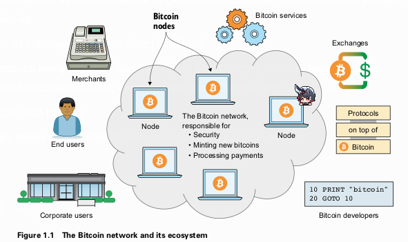

Ekosistem Bitcoin diilustrasikan dengan Jaringan Bitcoin (kumpulan komputer/node yang terhubung) di tengah. Di sekelilingnya ada berbagai partisipan: Pengguna akhir, Pengguna korporat, Pedagang, Layanan Bitcoin, Bursa, Pengembang, dan Protokol di atas Bitcoin. Jaringan ini bertanggung jawab atas keamanan, pencetakan bitcoin baru, dan pemrosesan pembayaran.

#### **2. The big picture**

Bagian ini menjelaskan alur pembayaran Bitcoin dalam empat langkah sederhana, menggunakan contoh Alice yang ingin membayar 1 BTC kepada Bob.

  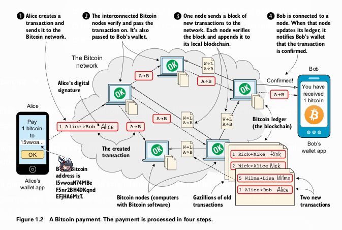

Diagram alur pembayaran Bitcoin dari Alice ke Bob.

1. Ponsel Alice (wallet app) membuat transaksi dan mengirimkannya ke Jaringan Bitcoin.
2. Node-node di dalam jaringan saling memverifikasi dan meneruskan transaksi tersebut.
3. Salah satu node mengumpulkan transaksi baru ke dalam sebuah "blok" dan menyebarkannya. Node lain memverifikasi blok tersebut dan menambahkannya ke catatan mereka (blockchain).
4. Ponsel Bob (wallet app) terhubung ke sebuah node. Ketika node tersebut mengupdate catatannya, ia memberi tahu wallet Bob bahwa transaksi telah dikonfirmasi dan Bob telah menerima 1 bitcoin.

**Proses Pembayaran Empat Langkah:**

1. **Alice membuat transaksi (Step 1 - Transactions):** Alice menggunakan aplikasi dompetnya (*wallet app*) untuk membuat instruksi pembayaran. Transaksi ini berisi jumlah (1 BTC), alamat Bitcoin Bob (tujuan), dan *digital signature* (tanda tangan digital) milik Alice yang membuktikan bahwa dialah pemilik sah dana tersebut.

2. **Jaringan Bitcoin memverifikasi (Step 2 - The Bitcoin network):** Transaksi dikirim ke beberapa *node* di jaringan. Setiap *node* yang menerima akan memverifikasi: apakah Alice benar-benar punya uangnya dan apakah tanda tangannya valid. Jika valid, *node* akan meneruskannya ke *node-node* lain yang terhubung dengannya (*peers*).

3. **Transaksi ditambahkan ke blockchain (Step 3 - The blockchain):** Agar semua *node* memiliki catatan yang sama dan terurut, satu *node* (disebut *miner*) akan mengambil peran untuk mengumpulkan transaksi-transaksi yang tertunda ke dalam sebuah **blok**. Blok ini kemudian ditambahkan ke rantai blok yang sudah ada sebelumnya, yang disebut **blockchain**. Blockchain ini adalah buku besar (*ledger*) dari semua transaksi yang pernah terjadi. *Miner* yang berhasil menambahkan blok baru akan mendapatkan hadiah berupa bitcoin baru.
4. **Bob menerima notifikasi (Step 4 - Wallets):** Setelah transaksi Alice masuk ke dalam sebuah blok di *blockchain*, *node* yang terhubung dengan dompet Bob akan memberitahukan bahwa pembayaran telah dikonfirmasi. Sekarang Bob dapat dengan yakin menganggap 1 BTC itu miliknya.

#### **3. Problems with money today**

Bitcoin diciptakan untuk menyelesaikan beberapa masalah yang melekat pada sistem keuangan tradisional.

* **Segregation (Pemisahan):** Sekitar 38% populasi dunia tidak memiliki akses ke rekening bank. Tanpa layanan perbankan, mereka sulit berpartisipasi dalam ekonomi digital dan global. Hal ini bisa disebabkan oleh biaya yang mahal, kurangnya dokumen identitas, atau diskriminasi.
* **Privacy issues (Masalah Privasi):** Dengan pembayaran elektronik konvensional (kartu kredit, transfer bank), pemerintah atau lembaga keuangan dapat dengan mudah melacak, menyensor, membekukan, atau bahkan menyita dana Kita.
* **Inflation (Inflasi):** Inflasi adalah penurunan daya beli mata uang. Selembar uang hari ini bisa membeli lebih sedikit barang di masa depan. Ini terjadi karena pemerintah dapat mencetak lebih banyak uang, yang mengurangi nilai dari uang yang sudah beredar. Kasus ekstrem disebut *hyperinflation*, seperti yang terjadi di Zimbabwe.
* **Borders (Batas Negara):** Mengirim uang antar negara seringkali lambat, mahal, dan rumit. Layanan seperti Western Union bisa memotong biaya hingga 16% atau lebih untuk remitansi tunai.

#### **4. The Bitcoin approach**

Bitcoin menawarkan model yang berbeda untuk mengatasi masalah-masalah di atas.

* **Decentralized (Terdesentralisasi):** Tidak ada satu entitas pun (bank atau pemerintah) yang mengendalikan Bitcoin. Kontrol didistribusikan ke ribuan *node* di seluruh dunia. Ini membuat Bitcoin bersifat *permissionless* (tanpa izin), siapa pun bisa berpartisipasi, dan tahan terhadap sensor.
* **Limited supply (Pasokan Terbatas):** Hanya akan pernah ada total 21 juta bitcoin. Pasokan ini tidak bisa ditambah sesuka hati, sehingga membuatnya tahan terhadap inflasi tinggi yang disebabkan oleh pencetakan uang berlebih. Saat ini, pasokan terus bertambah melalui hadiah blok untuk para *miner*, tetapi laju penambahannya berkurang setengahnya setiap empat tahun.
* **Borderless (Tanpa Batas):** Karena berjalan di internet, Bitcoin bersifat global. Mengirim bitcoin ke orang di seberang benua sama mudahnya dengan mengirim ke orang di ruangan yang sama.

#### **5. How is Bitcoin used?**

* **Savings (Tabungan):** Kita dapat menyimpan kekayaan dengan aman hanya dengan mengamankan *private key* Kita. Kita bisa menyimpannya di kertas, aplikasi, atau bahkan menghafalnya.
* **Cross-border payments (Pembayaran Lintas Batas):** Bitcoin seringkali lebih murah dan cepat untuk mengirim uang ke luar negeri dibandingkan layanan remitansi tradisional.
* **Shopping (Belanja):** Ideal untuk pembayaran online karena aman. Kita tidak memberikan informasi sensitif (seperti detail kartu kredit) kepada pedagang, hanya mengirim jumlah yang disepakati. 
* **Speculation (Spekulasi):** Harga bitcoin sangat fluktuatif (naik turun), yang menarik bagi sebagian orang untuk mencoba membeli saat harga rendah dan menjual saat harga tinggi.
* **Non-currency uses (Penggunaan Non-Mata Uang):** Karena data kecil bisa disematkan dalam transaksi, Bitcoin bisa digunakan untuk hal lain:

  * **Ownership (Kepemilikan):** Mencatat transfer kepemilikan aset, seperti mobil, dengan menyertakan nomor sasis dalam transaksi.
  * **Proof of existence (Bukti Keberadaan):** Membuktikan bahwa sebuah dokumen digital sudah ada pada waktu tertentu dengan "menjangkarkan" sidik jari digital (*cryptographic hash*) dari dokumen tersebut ke dalam *blockchain*. 

#### **6. When not to use Bitcoin**

Bitcoin belum cocok untuk semua hal:

* **Tiny payments (Pembayaran Sangat Kecil):** Biaya transaksi (*transaction fee*) terkadang bisa lebih mahal dari jumlah yang dikirim, membuatnya tidak ekonomis untuk pembayaran mikro. (Teknologi lapisan kedua seperti Lightning Network mencoba mengatasi ini).
* **Instant payments (Pembayaran Instan):** Transaksi Bitcoin memerlukan waktu (biasanya sekitar 10–60 menit) untuk mendapatkan konfirmasi yang aman. Ini tidak ideal untuk pembelian cepat seperti secangkir kopi.
* **Savings you can’t afford to lose (Tabungan yang Tidak Sanggup Kita Kehilangan):** Bitcoin masih merupakan teknologi baru dan harganya sangat fluktuatif. Ada juga risiko kehilangan *private key* Kita secara permanen. Jangan menaruh semua uang yang tidak bisa Kita relakan kehilangannya. **Di Bitcoin, Kita bertanggung jawab penuh atas keamanan dana Kita sendiri.**

#### **7. Other cryptocurrencies**

Selain Bitcoin, ada ribuan mata uang kripto lain yang disebut *alt-coin* (koin alternatif). Beberapa menawarkan fitur unik (seperti privasi yang lebih tinggi), sementara yang lain mungkin hanya tiruan atau bahkan penipuan.

Bitcoin memiliki **network effect (efek jaringan)** yang sangat kuat: nilainya meningkat karena banyak orang dan layanan yang sudah menggunakannya. Sebuah *alt-coin* baru akan sulit bersaing jika tidak menawarkan inovasi yang signifikan, sama seperti sulitnya membuat jejaring sosial baru untuk menyaingi yang sudah ada.

  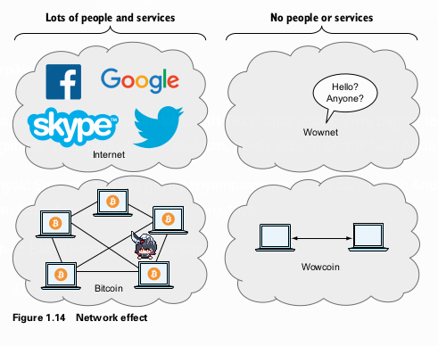

Perbandingan Efek Jaringan. Sisi kiri menunjukkan Internet (dengan logo Facebook, Google, Skype, Twitter) dan Jaringan Bitcoin yang ramai, dengan label "Banyak orang dan layanan". Sisi kanan menunjukkan "Wownet" dan "Wowcoin" yang sepi dan terisolasi, dengan label "Tidak ada orang atau layanan".

### **Ringkasan Bab 1**

* Bitcoin adalah uang global tanpa batas yang bisa digunakan siapa saja dengan koneksi internet.
* Jaringan komputer terdesentralisasi (*node*) memverifikasi dan mencatat semua pembayaran dalam sebuah buku besar publik yang disebut *blockchain*.
* Sebuah pembayaran diproses melalui 4 langkah: transaksi dibuat, diverifikasi oleh jaringan, ditambahkan ke *blockchain*, dan dompet penerima diberi notifikasi.
* Bitcoin mencoba menyelesaikan masalah inflasi, batas negara, eksklusi keuangan, dan privasi melalui pasokan terbatas, desentralisasi, dan sifatnya yang global.
* Selain Bitcoin, ada banyak *alt-coin* lain, tetapi Bitcoin memiliki efek jaringan yang paling kuat.

---

# Bab 2
## cryptographic hash functions and digital signatures

Bab ini akan memulai perjalanan kita dalam membangun pemahaman tentang Bitcoin dari dasar. Kita akan membuat sebuah sistem uang fiktif yang sangat sederhana bernama "token kue" (*cookie token*). Kemudian, kita akan mengidentifikasi kelemahannya dan memperbaikinya dengan dua alat kriptografi yang sangat penting: **Fungsi Hash Kriptografis** (*Cryptographic Hash Functions*) dan **Tanda Tangan Digital** (*Digital Signatures*).

#### **1. The cookie token spreadsheet (Spreadsheet Token Kue)**

Bayangkan di kantor Anda ada sebuah kafe. Untuk membeli kue, Anda dan rekan kerja tidak menggunakan uang tunai, melainkan sistem internal yang dicatat dalam sebuah *spreadsheet* (lembar lajur). Sistem ini disebut **Sistem Token Kue**.

* **Pusat Kepercayaan:** Ada satu orang yang sangat dipercaya bernama Lisa. Dia yang memegang dan mengelola *spreadsheet* ini. Semua orang bisa melihatnya (*read-only*), tetapi hanya Lisa yang bisa mengubahnya.
* **Cara Kerja Transaksi:** Jika Alice ingin membeli kue seharga 10 CT (*Cookie Token*), dia akan memberitahu Lisa. Lisa akan memeriksa saldo Alice dengan mencari semua transaksi masuk dan keluar atas nama Alice. Jika saldonya cukup, Lisa akan menambahkan baris baru di akhir *spreadsheet*:
  `Dari: Alice, Ke: Cafe, Jumlah: 10 CT`.
  Kafe melihat baris baru ini dan memberikan kue kepada Alice.
* **Penciptaan Koin Baru (Coin Creation):** Bagaimana token ini muncul pertama kali? Sebagai imbalan atas pekerjaannya menjaga *spreadsheet*, Lisa dihadiahi **7.200 CT baru setiap hari**. Dia membuat baris transaksi khusus:
  `Dari: BARU, Ke: Lisa, Jumlah: 7.200 CT`.
  Ini adalah satu-satunya cara token baru diciptakan.
* **Pasokan Terbatas (Limited Supply):** Sistem ini dirancang agar hadiah untuk Lisa berkurang setengahnya setiap empat tahun (mirip seperti *Bitcoin Halving*). Dari 7.200 CT/hari, menjadi 3.600 CT/hari setelah 4 tahun, dan seterusnya, hingga hadiahnya menjadi 0. Ini memastikan total pasokan token tidak akan pernah melebihi 21 juta CT.

  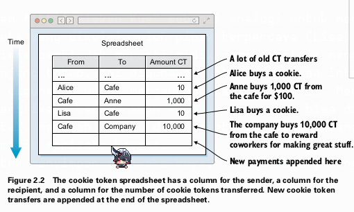

lalu

  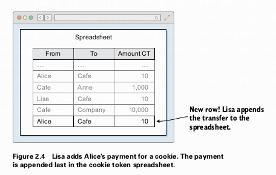

Sebuah *spreadsheet* sederhana dengan kolom "Dari", "Ke", dan "Jumlah CT". Transaksi baru, seperti Alice membeli kue, ditambahkan sebagai baris baru di bagian paling bawah.

**Hubungan Sistem Token Kue dengan Bitcoin (Tabel 2.1):**

| Konsep di Token Kue  | Konsep di Bitcoin              | Dibahas di Bab |
| :------------------- | :----------------------------- | :------------- |
| 1 cookie token       | 1 bitcoin                      | Bab 2          |
| Spreadsheet          | The blockchain                 | Bab 6          |
| Baris di spreadsheet | Sebuah transaksi (transaction) | Bab 5          |
| Lisa                 | Seorang penambang (miner)      | Bab 7          |

Saat ini, kita berada di **Sistem Token Kue versi 1.0**.
Kelemahannya: sistem ini sepenuhnya bergantung pada kepercayaan terhadap Lisa dan kemampuannya untuk mengenali setiap orang.

#### **2. Cryptographic Hashes**

Fungsi hash kriptografis adalah alat fundamental di Bitcoin. Anda bisa membayangkannya seperti **sidik jari digital**.

* **Definisi:** Ini adalah fungsi matematis yang mengambil data input dengan ukuran berapa pun (misalnya gambar kucing berukuran 1.21 MB) dan menghasilkan output dengan ukuran tetap (misalnya 32-byte). Output ini disebut **hash**.
* **Fungsi Satu Arah (*One-Way Function*):** Sangat mudah untuk menghasilkan *hash* dari sebuah input, tetapi secara praktis mustahil untuk merekonstruksi input asli hanya dari *hash*-nya. Prosesnya seperti memasukkan gambar ke mesin penghancur kertas; Anda mendapatkan potongan-potongan kertas (*hash*), tetapi tidak bisa menyusunnya kembali menjadi gambar asli.

  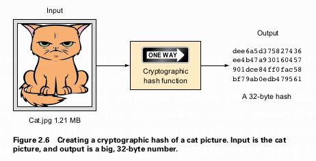

Diagram yang menunjukkan sebuah gambar kucing (input) dimasukkan ke dalam sebuah kotak berlabel "Fungsi Hash Kriptografis". Outputnya adalah serangkaian angka dan huruf acak yang panjang, berlabel "A 32-byte hash".

**Sifat-sifat Penting Fungsi Hash Kriptografis (Contoh: SHA256):**

1. **Deterministik:** Input yang sama akan *selalu* menghasilkan *hash* yang sama persis.
2. **Efek Longsor (*Avalanche Effect*):** Perubahan sekecil apa pun pada input (misalnya mengubah satu piksel pada gambar kucing) akan menghasilkan *hash* yang sama sekali berbeda dan tidak terduga.
3. **Ukuran Tetap (*Fixed Size*):** Output (*hash*) selalu memiliki panjang yang sama (misalnya, SHA256 selalu menghasilkan 256-bit atau 32-byte), tidak peduli seberapa besar atau kecil inputnya.
4. **Tahan Benturan (*Collision Resistance*):** Secara praktis mustahil untuk menemukan dua input berbeda yang menghasilkan *hash* yang sama.
5. **Tahan Pra-citra (*Pre-image Resistance*):** Jika Anda hanya diberi sebuah *hash*, secara praktis mustahil untuk menemukan input yang menghasilkan *hash* tersebut.

**Istilah Penting:**

* **SHA256:** Salah satu jenis fungsi hash yang paling umum digunakan di Bitcoin. Menghasilkan output 256-bit.
* **RIPEMD160:** Jenis fungsi hash lain yang digunakan di Bitcoin. Menghasilkan output 160-bit.

**Apa gunanya?**
Fungsi hash digunakan sebagai **pemeriksaan integritas data**. Jika Anda menyimpan *hash* dari sebuah file, Anda bisa kapan saja menghitung ulang *hash* file tersebut dan membandingkannya dengan yang Anda simpan. Jika berbeda, berarti filenya telah berubah.

#### **3. Digital Signatures**

Masalah baru muncul di sistem token kue: Lisa kesulitan mengenali semua orang. Seorang penipu bernama Mallory bisa saja mengaku sebagai Anne dan menipu Lisa untuk mentransfer token milik Anne. Solusinya adalah menggunakan **tanda tangan digital**.

* **Definisi:** Tanda tangan digital adalah padanan kriptografis dari tanda tangan tulisan tangan. Bedanya, ia tidak terikat pada orang, melainkan pada sebuah angka rahasia yang sangat besar bernama **private key (kunci privat)**.

**Cara Kerja Tanda Tangan Digital**
Prosesnya melibatkan sepasang kunci (*key pair*):

1. **Private Key (Kunci Privat):** Angka acak rahasia yang sangat besar yang *hanya Anda yang tahu*. Digunakan untuk **membuat** tanda tangan.
2. **Public Key (Kunci Publik):** Sebuah angka yang dihasilkan secara matematis dari *private key*. Hubungannya satu arah: sangat mudah membuat *public key* dari *private key*, tapi mustahil mendapatkan *private key* dari *public key*. Kunci ini boleh **disebarluaskan** dan digunakan untuk **memverifikasi** tanda tangan.

**Proses Pembayaran dengan Tanda Tangan Digital**
Misalkan John ingin membeli kue:

1. **Persiapan (Satu Kali):** John membuat sepasang kunci. *Private key* dia simpan dengan aman, dan *public key* dia berikan kepada Lisa. Lisa menyimpan *public key* John dalam sebuah tabel.
2. **Membuat Tanda Tangan (Setiap Transaksi):** John menulis pesan permintaan transfer:
   `Lisa, tolong pindahkan 10 CT ke Cafe. /John`.
   Kemudian, dompet digitalnya akan melakukan:
   a. Menghitung *hash* dari pesan tersebut.
   b. Mengenkripsi *hash* tersebut menggunakan *private key* John. Hasilnya adalah **tanda tangan digital**.
   John mengirim pesan asli dan tanda tangan digitalnya ke Lisa.
3. **Verifikasi (Dilakukan Lisa):** Lisa menerima pesan dan tanda tangan. Untuk memverifikasi:
   a. Dia mengambil *public key* John dari tabelnya.
   b. Dia menggunakan *public key* John untuk mendekripsi tanda tangan. Hasilnya adalah *hash* asli (Hash A).
   c. Dia menghitung *hash* dari pesan asli yang dia terima secara terpisah (Hash B).
   d. Dia membandingkan Hash A dan Hash B. Jika **sama persis**, berarti tanda tangan itu valid dan hanya bisa dibuat oleh pemilik *private key* yang sesuai, yaitu John.

  

Diagram alur proses tanda tangan digital:

1. John membuat *key pair* (kunci privat dan publik) dan memberikan kunci publiknya ke Lisa.
2. John ingin membeli kue, jadi dia membuat pesan dan menandatanganinya dengan kunci privatnya, lalu mengirimkannya ke Lisa.
3. Lisa menggunakan kunci publik John yang dia simpan untuk memverifikasi tanda tangan pada pesan tersebut. Jika verifikasi berhasil (OK), dia akan memproses transaksi.

#### **4. Private key security**

Dengan sistem baru ini, keamanan dana Anda sepenuhnya bergantung pada keamanan *private key* Anda. Jika *private key* John dicuri oleh Mallory, Mallory bisa membuat tanda tangan palsu dan mencuri semua token John. Lisa tidak akan tahu bedanya karena tanda tangannya valid secara matematis.
**Di Bitcoin, Anda adalah bank Anda sendiri. Anda bertanggung jawab penuh atas keamanan kunci Anda.**

Ada berbagai tingkatan keamanan dengan trade-off kenyamanan:

* **Online vs. Offline:** Menyimpan kunci di perangkat yang terhubung internet (online) lebih berisiko terhadap peretas, sedangkan menyimpannya di perangkat offline (seperti dompet perangkat keras/hardware wallet) jauh lebih aman tetapi kurang praktis.
* **Cleartext vs. Encrypted (Teks Biasa vs. Terenkripsi):** Menyimpan kunci sebagai teks biasa sangat berbahaya. Sebaiknya, kunci dienkripsi dengan kata sandi yang kuat.
* **Whole key vs. Split key (Kunci Utuh vs. Kunci Terpisah):** Untuk keamanan ultra-tinggi, kunci dapat dipecah menjadi beberapa bagian dan disimpan di lokasi terpisah (misalnya, menggunakan skema *multisignature*).

Sistem token kue kita sekarang telah berevolusi ke **versi 2.0**: pembayaran aman menggunakan tanda tangan digital untuk mengatasi masalah penipu. Namun, kepercayaan pada Lisa masih menjadi isu sentral.

### **Ringkasan Bab 2**

* Kita memperkenalkan sistem fiktif "Token Kue" sebagai analogi untuk memahami Bitcoin, di mana aset dicatat dalam *spreadsheet* yang dikelola oleh pihak terpercaya (Lisa).
* **Fungsi Hash Kriptografis** bertindak seperti sidik jari digital: mengubah data apa pun menjadi output satu arah dengan panjang tetap. Ini digunakan untuk memeriksa integritas data.
* **Tanda Tangan Digital** digunakan untuk mengautentikasi transaksi. Mereka dibuat menggunakan *private key* rahasia dan diverifikasi menggunakan *public key* yang bisa dibagikan.
* Dengan tanda tangan digital, masalah penipu dapat diatasi, tetapi keamanan dana kini sepenuhnya menjadi **tanggung jawab pemilik *private key***.
* Ada berbagai strategi untuk menyimpan *private key*, masing-masing dengan trade-off antara keamanan dan kenyamanan.

---

# Bab 3
## Alamat (Addresses)

**Tujuan Bab Ini:**
Bab ini akan menjelaskan evolusi dari penggunaan nama asli ke penggunaan alamat Bitcoin yang lebih anonim dan aman. Kita akan belajar:

* Bagaimana mengganti nama dengan *public key hash* untuk meningkatkan privasi dasar.
* Bagaimana melindungi diri dari kesalahan ketik yang bisa menyebabkan kehilangan dana secara permanen.

Pada akhir bab ini, sistem *spreadsheet cookie token* kita tidak akan lagi menggunakan nama orang, melainkan *hash* dari *public key*. Ini adalah langkah besar untuk membuatnya lebih mirip dengan cara kerja Bitcoin yang sebenarnya.

#### **1. Kebiasaan Makan Cookie Terungkap (Cookie-eating habits disclosed)**

**Masalah Awal: Kurangnya Privasi**

Sistem *spreadsheet* yang kita gunakan sejauh ini memiliki kelemahan besar: semua transaksi dicatat menggunakan nama asli.

  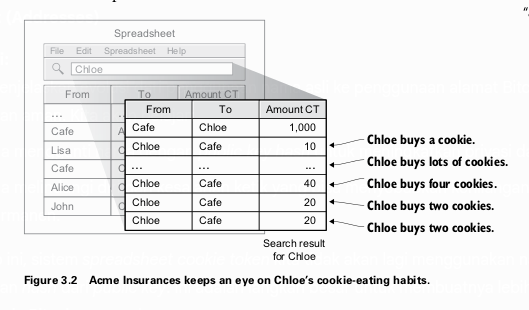

* **Gambar 3.2: Acme Insurances mengawasi kebiasaan makan cookie Chloe.**

  * Gambar ini menunjukkan bagaimana sebuah pihak ketiga (misalnya, perusahaan asuransi bernama Acme) bisa mendapatkan salinan *spreadsheet* tersebut.
  * Dengan hanya melakukan pencarian sederhana untuk nama "Chloe", perusahaan tersebut dapat melihat seluruh riwayat transaksinya. Mereka bisa tahu seberapa sering Chloe membeli cookie, berapa banyak yang dia beli, dan dari siapa dia menerima token.
  * Informasi ini bisa disalahgunakan, misalnya untuk menaikkan premi asuransi Chloe dengan asumsi dia memiliki gaya hidup yang tidak sehat.

Masalah ini tidak hanya berlaku untuk pihak ketiga. Setiap rekan kerja yang memiliki akses baca ke *spreadsheet* juga bisa dengan mudah melihat saldo dan riwayat transaksi semua orang. Ini menciptakan masalah privasi yang serius. Menanggapi hal ini, para rekan kerja meminta Lisa (administrator sistem dalam contoh kita) untuk mencari solusi.

#### **2. Mengganti Nama dengan Kunci Publik (Replacing names with public keys)**

**Solusi Pertama: Menggunakan Kunci Publik**

Lisa, yang sudah lelah mengelola daftar nama dan *public key* yang terhubung, mengusulkan ide untuk meningkatkan privasi dan menyederhanakan pekerjaannya.

  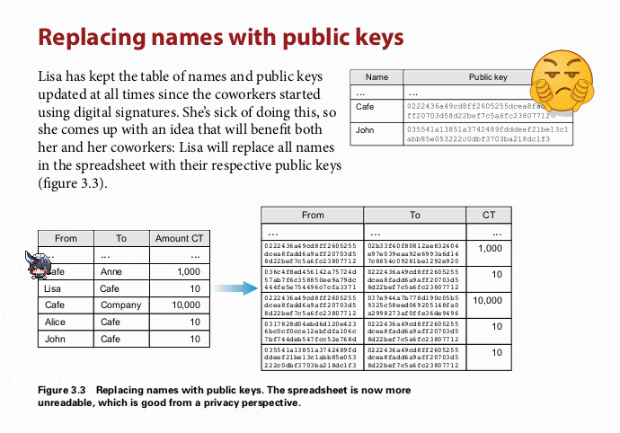

* **Gambar 3.3: Mengganti nama dengan kunci publik.**

  * Gambar ini mengilustrasikan perubahan pada *spreadsheet*. Kolom "From" (Dari) dan "To" (Ke) tidak lagi berisi nama seperti "Alice" atau "Cafe", melainkan *public key* lengkap mereka yang terdiri dari 66 karakter heksadesimal (33 byte).
  * Sekarang, *spreadsheet* menjadi jauh lebih sulit dibaca. Tanpa mengetahui *public key* milik Chloe, Acme Insurances tidak bisa lagi melacak transaksinya dengan mudah.

**Proses Pembayaran yang Baru**

Dengan perubahan ini, proses pembayaran juga berubah. Pengguna tidak lagi menggunakan nama.

  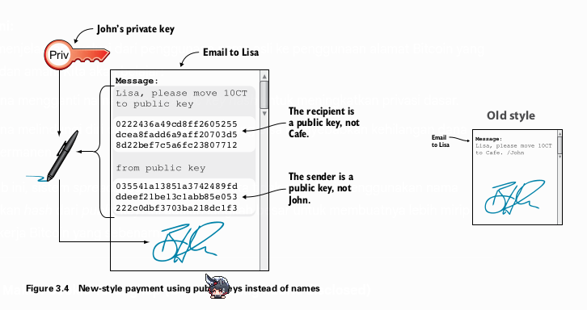

* **Gambar 3.4: Gaya pembayaran baru menggunakan kunci publik, bukan nama.**

  * Ketika John ingin membayar, pesan yang dia kirim ke Lisa tidak lagi berbunyi, "Lisa, tolong pindahkan 10 CT ke Cafe. /John".
  * Pesan barunya sekarang berisi:

    1. *Public key* pengirim.
    2. *Public key* penerima.
    3. Jumlah yang ditransfer.
  * Pesan ini kemudian ditandatangani secara digital menggunakan *private key* yang sesuai dengan *public key* pengirim.
  

  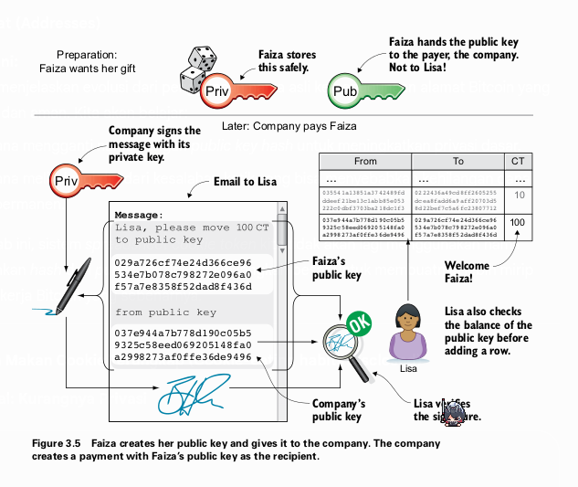

* **Gambar 3.5: Faiza (rekan kerja baru) menerima hadiah dari perusahaan.**

  * **Persiapan:** Faiza membuat *key pair* (*private key* dan *public key*). Dia menyimpan *private key* miliknya dengan aman.
  * **Berbagi Informasi:** Faiza memberikan **hanya *public key*-nya** kepada pihak yang akan membayarnya (perusahaan), **bukan kepada Lisa**. Ini penting karena Lisa tidak lagi perlu memelihara tabel nama dan *public key*.
  * **Proses Transaksi:** Perusahaan membuat pesan untuk memindahkan 100 CT dari *public key* mereka ke *public key* Faiza. Pesan ini ditandatangani dengan *private key* perusahaan dan dikirim ke Lisa.
  * **Verifikasi oleh Lisa:** Lisa melakukan verifikasi:

    1. Dia menggunakan *public key* pengirim (yang ada di dalam pesan) untuk memverifikasi tanda tangan digital.
    2. Dia memeriksa *spreadsheet* untuk memastikan *public key* pengirim memiliki saldo yang cukup.
    3. Lisa tidak perlu tahu siapa pemilik *public key* penerima. Selama pengirim sah dan memiliki cukup dana, dia akan mencatat transaksi tersebut.

Perubahan ini membuat sistem menjadi **pseudonim**. Identitas tidak lagi terikat pada nama, tetapi pada *public key*.

#### **3. Memperpendek Kunci Publik (Shortening the public key)**

**Masalah Baru: Ukuran Data**

Meskipun privasi meningkat, muncul masalah baru. *Public key* berukuran 33 byte, jauh lebih besar daripada nama seperti "John" yang hanya 4 byte. Hal ini membuat ukuran *spreadsheet* membengkak, memperlambat proses unduh bagi pengguna dan memakan lebih banyak ruang penyimpanan di komputer Lisa.

**Solusi Kedua: Hashing Kunci Publik menjadi 20 byte**

Para developer mengusulkan untuk mengganti *public key* dengan *hash* kriptografis dari *public key* tersebut. Proses ini tidak hanya memperpendek data tetapi juga menambahkan lapisan keamanan ekstra.

  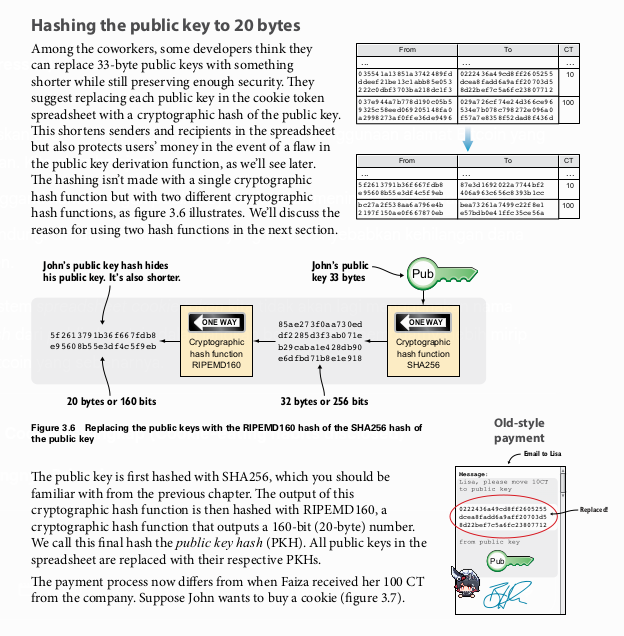

* **Gambar 3.6: Mengganti kunci publik dengan hash RIPEMD160 dari hash SHA256 kunci publik.**

  * Prosesnya adalah sebagai berikut:

    1. Ambil *public key* (33 byte).
    2. Lakukan *hashing* menggunakan fungsi **SHA256**. Hasilnya adalah *hash* sepanjang 32 byte.
    3. Ambil hasil dari SHA256 tersebut, lalu lakukan *hashing* sekali lagi menggunakan fungsi **RIPEMD160**. Hasilnya adalah *hash* sepanjang 20 byte (160 bit).
  * Hasil akhir ini disebut **Public Key Hash (PKH)**.

> **Istilah Teknis:**
>
> * **Public Key Hash (PKH):** Ini adalah "sidik jari" dari sebuah *public key*. Ini adalah representasi yang lebih pendek dari *public key* yang dihasilkan melalui serangkaian fungsi *hash* (di Bitcoin, `RIPEMD160(SHA256(public_key))`). Tujuannya adalah untuk memperpendek alamat dan menambahkan lapisan keamanan.

Sekarang, *spreadsheet* menggunakan PKH yang hanya 20 byte, yang jauh lebih efisien daripada *public key* 33 byte.

**Proses Pembayaran Menggunakan PKH**

  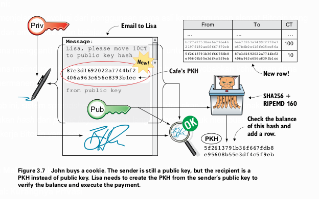

* **Gambar 3.7: John membeli cookie menggunakan PKH.**

  * Pesan yang dikirim John ke Lisa sekarang sedikit berbeda:

    * **Penerima (To):** adalah **PKH** milik Cafe.
    * **Pengirim (From):** tetap menggunakan **Public Key** milik John, bukan PKH-nya.
  * Mengapa pengirim masih menggunakan *public key*? Karena Lisa (atau siapapun yang memverifikasi) masih membutuhkan *public key* asli untuk memverifikasi tanda tangan digital.
  * Setelah menerima pesan, Lisa akan:

    1. Mengambil *public key* pengirim dari pesan.
    2. Menghitung PKH dari *public key* tersebut (`RIPEMD160(SHA256(public_key))`).
    3. Menggunakan PKH yang baru dihitung ini untuk memeriksa saldo pengirim di *spreadsheet*.
    4. Jika semua valid, dia mencatat transaksi baru, dengan PKH pengirim di kolom "From" dan PKH penerima di kolom "To".

#### **4. Mengapa Menggunakan SHA256 dan RIPEMD160?**

Menggunakan dua fungsi *hash* yang berbeda dan berurutan adalah pilihan desain yang disengaja untuk keamanan berlapis:

1. **Keamanan Ekstra:** Jika suatu saat salah satu dari fungsi *hash* ini (misalnya SHA256) ditemukan memiliki kelemahan (*vulnerability*) sehingga bisa direkayasa balik (*pre-image attack*), *public key* masih dilindungi oleh fungsi *hash* kedua (RIPEMD160). Seorang penyerang harus memecahkan keduanya untuk bisa mendapatkan *public key* dari PKH, yang secara eksponensial lebih sulit.
2. **Perbedaan Pengembang:** SHA256 dikembangkan oleh NSA (National Security Agency) AS, sementara RIPEMD160 dikembangkan oleh komunitas akademik di Eropa. Menggunakan keduanya mengurangi risiko adanya *backdoor* tersembunyi dari satu pihak pengembang.

#### **5. Menghindari Kesalahan Ketik yang Mahal (Avoiding expensive typing errors)**

**Masalah Kritis: Kesalahan Manusia**

Sistem yang sekarang menggunakan PKH (string heksadesimal 20 byte) sangat rentan terhadap kesalahan ketik.

  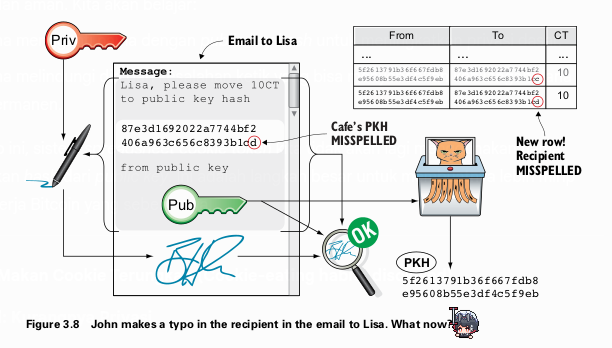

* **Gambar 3.8: John salah ketik saat memasukkan PKH penerima.**

  * John ingin membayar Cafe, tetapi dia salah mengetik satu karakter terakhir dari PKH Cafe (misalnya, mengetik `d` padahal seharusnya `c`).
  * Dia menandatangani pesan tersebut dan mengirimkannya ke Lisa.
  * Lisa memverifikasi tanda tangan dan saldo pengirim. Semuanya valid. Dia tidak peduli dan tidak bisa memeriksa apakah PKH penerima itu benar atau tidak. Dia hanya mencatat transaksi sesuai permintaan.
  * Akibatnya, 10 CT milik John dikirim ke sebuah PKH yang tidak memiliki *private key* yang sesuai. Tidak ada seorang pun di dunia yang bisa menggunakan dana tersebut. Uang itu **terbakar secara digital** (*digitally burned*) dan hilang selamanya.

Ini adalah masalah kegunaan dan keamanan yang sangat serius. Perlu ada cara untuk mendeteksi kesalahan ketik sebelum transaksi dikirim.

**Solusi Ketiga: Base58check**

Untuk mengatasi masalah ini, diperkenalkan konsep **Alamat Cookie Token** (di dunia nyata, ini adalah **Alamat Bitcoin**). Alamat ini adalah representasi dari PKH yang dirancang agar lebih ramah manusia dan memiliki mekanisme pendeteksi kesalahan. Proses konversi dari PKH ke alamat ini disebut **Base58check**.

  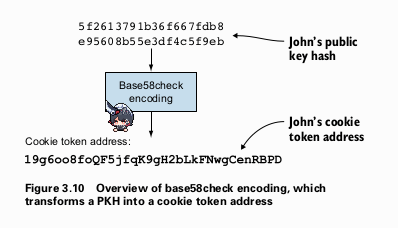

lalu

  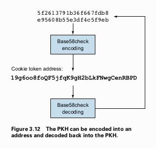

* **Gambar 3.10 & 3.12: Gambaran umum encoding Base58check.**

  * Proses ini mengubah PKH (byte mentah) menjadi sebuah string alamat yang bisa dibaca (contoh: `19g6oo8f...gCenRBPD`).
  * Yang terpenting, proses ini bisa dibalik (*decoding*) untuk mendapatkan kembali PKH asli, dan selama proses *decoding*, ia akan memeriksa integritas alamat untuk memastikan tidak ada salah ketik.

**Proses Encoding Base58check**

  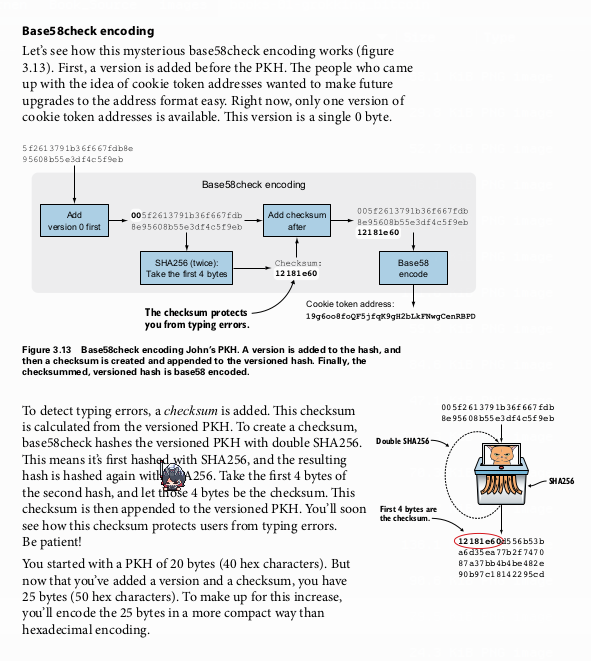

* **Gambar 3.13: Proses encoding Base58check pada PKH John.**
  Proses ini terdiri dari beberapa langkah:

  1. **Tambahkan Versi (Version Byte):** Sebuah byte versi ditambahkan di awal PKH. Untuk alamat P2PKH (Pay-to-Public-Key-Hash) di Bitcoin, byte versinya adalah `0x00`. Ini berguna untuk membedakan jenis-jenis alamat di masa depan.
  2. **Buat Checksum:** Sebuah *checksum* ditambahkan untuk mendeteksi kesalahan.

     * Ambil PKH yang sudah diberi versi.
     * Lakukan *hashing* dua kali dengan SHA256: `checksum_data = SHA256(SHA256(versioned_PKH))`.
     * Ambil **4 byte pertama** dari `checksum_data`. Inilah *checksum*-nya.
  3. **Gabungkan:** Tempelkan *checksum* 4 byte tersebut di akhir PKH yang sudah diberi versi. Sekarang kita punya data sepanjang 25 byte (1 byte versi + 20 byte PKH + 4 byte checksum).
  4. **Encode dengan Base58:** Ubah data 25 byte tersebut menjadi string menggunakan skema *encoding* Base58.

> **Istilah Teknis:**
>
> * **Checksum:** Sejumlah kecil data yang dihitung dari blok data yang lebih besar. Tujuannya adalah untuk mendeteksi kesalahan yang mungkin terjadi saat transmisi atau penyimpanan. Jika data utama sedikit saja berubah, *checksum* yang dihitung ulang tidak akan cocok dengan *checksum* asli.
> * **Base58:** Skema *encoding* yang menggunakan 58 karakter alfanumerik. Karakter yang ambigu secara visual dihilangkan untuk mengurangi kesalahan ketik (misalnya, `0` (nol), `O` (huruf O besar), `I` (huruf I besar), dan `l` (huruf l kecil)).

**Proses Decoding Base58check (dan Verifikasi)**

  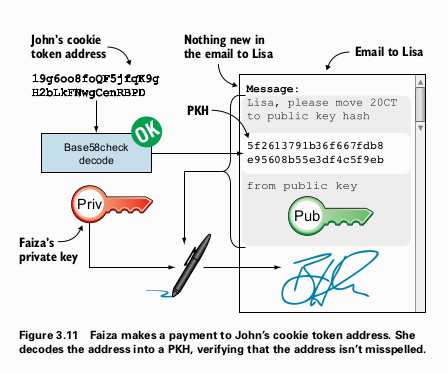

lalu

  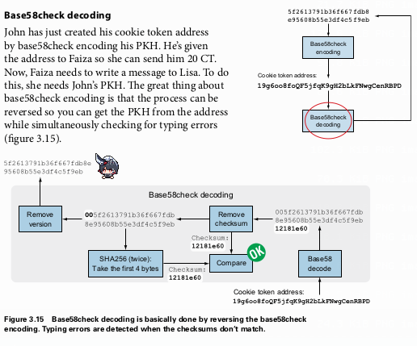

* **Gambar 3.11 & 3.15: Faiza membayar ke alamat John.**
  Ketika Faiza ingin membayar John, *wallet*-nya akan melakukan proses sebaliknya:

  1. Ambil alamat Base58check (misalnya, dari QR code).
  2. Lakukan *decode* dari Base58 kembali menjadi data 25 byte.
  3. Pisahkan data 25 byte tersebut menjadi tiga bagian:

     * Byte pertama: Versi.
     * 20 byte berikutnya: PKH.
     * 4 byte terakhir: *Checksum* yang diterima.
  4. **Verifikasi:** Ambil bagian versi dan PKH, lalu hitung ulang *checksum*-nya dengan `SHA256(SHA256(versioned_PKH))`.
  5. Bandingkan 4 byte pertama dari *checksum* yang baru dihitung dengan *checksum* yang diterima.

     * **Jika cocok:** Alamat tersebut valid. *Wallet* bisa melanjutkan untuk membuat transaksi menggunakan PKH yang diekstrak.
     * **Jika tidak cocok:** Alamat tersebut salah ketik. *Wallet* akan menampilkan pesan kesalahan dan mencegah pengiriman dana, sehingga uang tidak hilang.

Peluang sebuah kesalahan ketik menghasilkan alamat yang valid secara kebetulan sangat kecil, sekitar 1 banding 4.3 miliar. Ini membuat sistem menjadi sangat aman dari kesalahan manusia.

#### **6. Kembali ke Privasi (Back to privacy)**

Meskipun PKH dan alamat meningkatkan privasi dengan menghilangkan nama, masalah dasarnya tetap ada jika pengguna terus-menerus menggunakan alamat yang sama. Acme Insurances masih bisa mengidentifikasi bahwa semua pembayaran ke `19g6oo8f...` berasal dari satu entitas (misalnya Cafe). Jika mereka tahu satu saja transaksi milik John, mereka bisa menghubungkan semua transaksi lain yang menggunakan alamat yang sama.

**Solusi Terbaik:** Gunakan alamat baru untuk setiap transaksi yang diterima. *Wallet* modern (seperti yang nanti dibahas di Bab 4) akan mengelola pembuatan dan penyimpanan banyak alamat ini secara otomatis, sehingga sangat meningkatkan privasi pengguna.

### **Ringkasan Bab 3**

Bab ini membawa kita melalui evolusi penting dalam sistem pembayaran kita untuk membuatnya lebih mirip Bitcoin:

1. **Masalah:** Menggunakan nama asli di *spreadsheet* sangat buruk untuk privasi.

   * **Solusi:** Ganti nama dengan **kunci publik**.
2. **Masalah:** *Public key* terlalu panjang dan tidak efisien.

   * **Solusi:** Ganti *public key* dengan **Public Key Hash (PKH)** yang lebih pendek (20 byte) yang dibuat dengan `RIPEMD160(SHA256(public_key))`.
3. **Masalah:** PKH rentan terhadap kesalahan ketik yang menyebabkan dana hilang selamanya.

   * **Solusi:** Gunakan **Alamat (Address)** yang di-*encode* dengan **Base58check**. Alamat ini memiliki *checksum* internal untuk mendeteksi dan mencegah kesalahan ketik.

Sekarang, sistem kita jauh lebih privat, efisien, dan aman dari kesalahan pengguna. Kita siap untuk melanjutkan ke bab berikutnya yang akan membahas bagaimana *wallet* mengelola semua ini untuk kita.

---

## Bab 4: Wallets

Sejauh ini, interaksi dengan sistem *cookie token* masih sangat manual dan rumit bagi pengguna. Mereka harus membuat *private key*, mengelola *public key*, dan menyusun email secara manual kepada Lisa untuk setiap transaksi. Selain itu, untuk menjaga privasi, pengguna disarankan menggunakan alamat yang berbeda untuk setiap pembayaran, yang semakin menambah kerumitan. Bab ini memperkenalkan solusi untuk masalah-masalah ini dalam bentuk aplikasi seluler yang disebut **`wallet`** (dompet).

Tujuan utama dari `wallet` adalah untuk mengotomatisasi tugas-tugas umum, mengelola *key* dengan aman, dan yang terpenting, menyederhanakan proses *backup*. Kita akan membahas evolusi `wallet`, mulai dari versi sederhana hingga implementasi canggih yang disebut **Hierarchical Deterministic (`HD`) Wallets**, yang menjadi standar industri saat ini.

### Versi Pertama Wallet

Sebuah tim pengembang di kantor memutuskan untuk membangun aplikasi seluler, yaitu `wallet`, untuk mempermudah hidup rekan-rekan mereka.

> Perlu dipahami, istilah `wallet` di dunia Bitcoin sebenarnya kurang tepat. Aplikasi ini tidak benar-benar "menyimpan" uang Kita. Uang Kita (catatan kepemilikan) ada di dalam *blockchain* (atau dalam analogi kita, *spreadsheet*). `Wallet` lebih mirip seperti **gantungan kunci (`keyring`)** yang menyimpan dan mengelola *private key* yang Kita butuhkan untuk membelanjakan uang Kita. Namun, karena istilah `wallet` sudah sangat umum, kita akan tetap menggunakannya.

`Wallet` versi pertama ini dirancang untuk menangani beberapa tugas krusial:
* **Membuat Alamat Baru**: Pengguna dapat dengan mudah membuat alamat baru untuk setiap transaksi demi privasi.
* **Mengelola Private Key**: Untuk setiap alamat yang dibuat, `wallet` akan menyimpan dan mengelola *private key* yang bersangkutan dengan aman.
* **Mentransfer Detail Pembayaran**: Proses transfer detail pembayaran dari penerima ke pembayar dipermudah. Alih-alih mengetik alamat yang panjang, `wallet` dapat menggunakan **QR code**.
* **Melakukan Pembayaran**: Aplikasi ini secara otomatis menyusun dan mengirim email yang berisi transaksi yang sudah ditandatangani secara digital ke Lisa.
* **Melacak Dana**: `Wallet` membaca *spreadsheet* dan menampilkan total saldo *cookie token* yang dimiliki pengguna.
* **Backup Private Key**: Menyediakan fasilitas untuk mencadangkan *private key* jika ponsel hilang atau rusak.

#### Alur Pembayaran Menggunakan Wallet

Mari kita lihat skenario di mana John ingin membeli kue dari kafe, di mana keduanya kini menggunakan aplikasi `wallet`.

  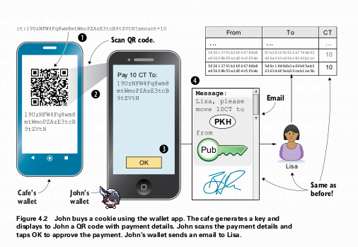

[Ilustrasi alur pembayaran menggunakan aplikasi wallet di ponsel, dari pemindaian QR code hingga email otomatis terkirim ke Lisa dan spreadsheet diperbarui. - Figure 4.2]

Prosesnya berjalan sebagai berikut:
1.  **Kafe Meminta Pembayaran**: `Wallet` kafe membuat alamat baru dan menampilkan detail pembayaran (alamat dan jumlah 10 CT) dalam bentuk **QR code** di layar. QR code ini berisi **payment URI** (*Uniform Resource Identifier*), sebuah format standar untuk detail pembayaran. Contohnya: `ct:19UzNFW...VtN?amount=10`.
    > Di Bitcoin, ini distandarisasi dalam **BIP21**, dan URI-nya dimulai dengan `bitcoin:`.
2.  **John Memindai (Scan)**: John menggunakan kamera ponselnya untuk memindai QR code tersebut. `Wallet`-nya secara otomatis membaca alamat tujuan dan jumlah yang harus dibayar.
3.  **Konfirmasi**: `Wallet` John menampilkan detail pembayaran untuk dikonfirmasi. John memeriksa informasinya dan menekan "OK".
4.  **Otomatisasi Latar Belakang**: `Wallet` John secara otomatis melakukan beberapa hal:
    * Memilih salah satu *key* miliknya yang memiliki saldo cukup (misalnya, ia memiliki tiga *key* dengan saldo 80 CT, 30 CT, dan 0 CT; `wallet` akan memilih salah satu dari dua yang pertama).
    * Membuat transaksi, menandatanganinya dengan *private key* yang sesuai.
    * Mengirim email berisi transaksi yang sudah ditandatangani ke Lisa.

Dari sisi Lisa, tidak ada yang berubah. Ia menerima email seperti biasa, memverifikasi transaksi, dan menambahkannya ke *spreadsheet*.

`Wallet` juga terus memantau *spreadsheet*. Ketika transaksi John dikonfirmasi oleh Lisa, `wallet` John akan memperbarui saldonya dan menampilkan notifikasi "Terkirim", sementara `wallet` kafe akan menampilkan "Diterima".

> **Transaksi yang Belum Dikonfirmasi (`Unconfirmed Transaction`)**: `Wallet` yang baik tidak akan memperbarui saldo final sebelum transaksi tersebut benar-benar tercatat di *spreadsheet* (atau *blockchain*). Transaksi yang sudah dikirim tetapi belum dicatat oleh miner disebut *unconfirmed transaction* atau **0-conf transaction**. Mengandalkannya berisiko karena ada kemungkinan transaksi tersebut tidak pernah dikonfirmasi.

---

### Backup Private Key

Kehilangan akses ke *private key* berarti kehilangan uang Kita selamanya. Oleh karena itu, *backup* adalah fitur yang mutlak diperlukan.

#### Metode Awal yang Bermasalah
Versi awal `wallet` menawarkan fitur *backup* dengan mengirimkan sebuah file teks berisi semua *private key* ke alamat email pengguna.

  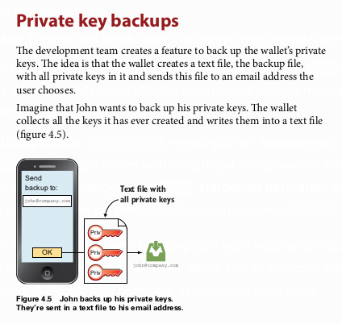

[Ilustrasi proses backup private key dari wallet ke file teks yang dikirim melalui email. - Figure 4.5]

Metode ini memiliki dua kelemahan besar:
1.  **Risiko Keamanan**: Mengirim *private key* dalam bentuk teks biasa melalui email sangatlah berisiko. Siapa pun yang memiliki akses ke server email atau lalu lintas jaringan dapat mencuri *key* tersebut.
2.  **Backup yang Berlebihan**: *Backup* ini hanya mencakup *key* yang ada pada saat itu. Setiap kali pengguna membuat alamat baru, mereka harus melakukan *backup* ulang. Hal ini sangat tidak praktis dan membuat pengguna malas melakukannya.

#### Solusi: Backup Terenkripsi
Untuk mengatasi masalah keamanan, `wallet` diperbarui untuk mengenkripsi file *backup* dengan *password* yang dimasukkan oleh pengguna.

  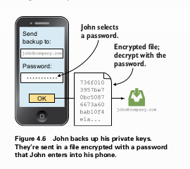

[Ilustrasi proses backup private key yang dienkripsi dengan password sebelum dikirim. - Figure 4.6]

Jika ponsel John hilang, ia dapat memulihkan *key*-nya di ponsel baru dengan mengimpor file *backup* dan memasukkan *password* yang benar. Ini jauh lebih aman. Namun, ini masih belum menyelesaikan masalah keharusan untuk terus-menerus melakukan *backup*. Selain itu, metode ini memunculkan masalah baru.

#### Kekuatan Password dan Entropy
Kekuatan sebuah *password* diukur dalam **entropy**, yang pada dasarnya adalah tingkat ketidakpastian atau keacakan. Entropy diukur dalam bit.
* Sebuah lemparan koin memiliki 1 bit entropy.
* Sebuah *password* 8 karakter acak yang dipilih dari 64 karakter (`A-Z`, `a-z`, `0-9`, `+/`) memiliki `8 * 6 = 48` bit entropy (karena 2^6 = 64).
* Sebuah *passphrase* yang terdiri dari 5 kata acak yang dipilih dari daftar 2048 kata memiliki `5 * 11 = 55` bit entropy (karena 2^11 = 2048).

Masalahnya adalah, manusia sangat buruk dalam membuat sesuatu yang benar-benar acak. *Password* seperti `j0Hn4321` memiliki entropy yang jauh lebih rendah daripada yang terlihat karena penyerang menggunakan serangan kamus (*dictionary attack*) yang mencoba kombinasi nama, kata umum, dan pola angka yang sering digunakan.

#### Masalah dengan Backup Terenkripsi-Password
Meskipun lebih baik, pendekatan ini masih memiliki kelemahan:
* **Banyak Hal yang Harus Diamankan**: Pengguna kini harus menjaga keamanan file *backup* DAN mengingat *password*-nya.
* **Lupa Password**: *Password* yang jarang digunakan sangat rentan untuk dilupakan.
* **Perkembangan Teknologi**: Kekuatan komputasi terus meningkat. *Password* yang aman lima tahun lalu mungkin mudah dipecahkan hari ini.
* **Kesulitan Membuat Keacakan**: Pengguna cenderung memilih *password* yang mudah diingat (dan mudah ditebak).

Jelas, diperlukan solusi *backup* yang lebih fundamental dan lebih sederhana.

---

### Hierarchical Deterministic (HD) Wallets

Di sinilah sebuah terobosan besar terjadi. Para pengembang menyadari bahwa jika semua *private key* bisa dihasilkan secara deterministik (dapat diprediksi) dari satu nomor acak utama, maka pengguna hanya perlu melakukan **satu kali backup** untuk nomor acak tersebut. Nomor acak utama ini disebut **seed**.

  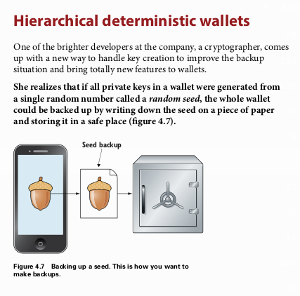

[Ilustrasi backup yang ideal, yaitu hanya mencadangkan satu seed saja. - Figure 4.7]

Konsep ini diimplementasikan dalam **Hierarchical Deterministic (`HD`) Wallets**, yang distandarisasi dalam **BIP32**. `HD wallet` mengorganisir *key* dalam struktur pohon (*tree*).

  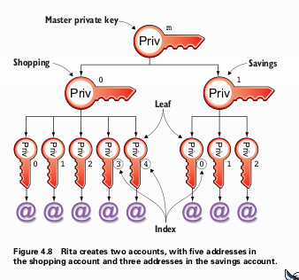

[Diagram pohon yang menunjukkan struktur key dalam HD wallet, dari master key hingga akun belanja dan tabungan, serta alamat individual. - Figure 4.8]

* **Master Private Key (`m`)**: Akar dari semua *key*. Dihasilkan dari *seed*.
* **Child Keys**: Setiap *key* dapat memiliki banyak "anak" *key*.
* **Path (Jalur)**: Setiap *key* dalam pohon dapat diidentifikasi secara unik melalui jalurnya. Contoh: `m/1/0` berarti *child key* ke-0 dari *child key* ke-1 dari *master key*.
    > Standar umum seperti **BIP44** mendefinisikan struktur jalur ini untuk berbagai tujuan (misalnya, `m/44'/0'/0'/0` untuk menerima alamat Bitcoin).

#### Proses Derivasi Key
Proses pembuatan pohon *key* ini melibatkan tiga langkah utama:
1.  **Membuat Random Seed**: Sebuah *seed* acak (misalnya, 128 bit) dibuat. Ini adalah satu-satunya bagian yang benar-benar acak.
2.  **Menderivasi Master Extended Private Key (`xprv`)**: *Seed* digunakan untuk membuat *key* utama.
3.  **Menderivasi Child Extended Private Keys**: *Key* turunan dibuat dari *master key* dan seterusnya.

#### Extended Private Key (`xprv`)
Sebuah **`xprv`** (kependekan dari *extended private key*) adalah sebuah paket data yang berisi dua komponen:
1.  **Private Key (256 bit)**: Sama seperti *private key* biasa.
2.  **Chain Code (256 bit)**: Sepotong data acak tambahan yang berfungsi sebagai "garam" atau *entropy* tambahan untuk memastikan bahwa derivasi *child key* dari *parent key* yang sama akan menghasilkan *child key* yang berbeda dan tidak dapat diprediksi.

  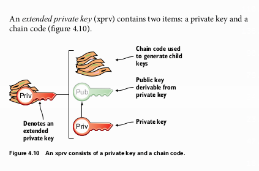

[Diagram yang menunjukkan sebuah xprv terdiri dari private key dan chain code. - Figure 4.10]

**Langkah 1: Menderivasi Master `xprv`**
*Master `xprv`* dibuat dengan melewatkan *random seed* melalui fungsi hash **HMAC-SHA512**. *Output* hash 512-bit ini kemudian dibagi dua:
* **256 bit pertama** menjadi **master private key**.
* **256 bit terakhir** menjadi **master chain code**.

  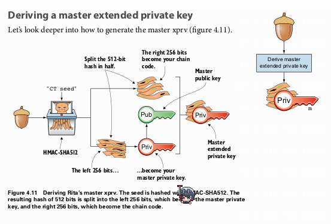

[Proses derivasi master xprv dari sebuah seed menggunakan HMAC-SHA512, yang hasilnya dibagi dua menjadi private key dan chain code. - Figure 4.11]

**Langkah 2: Menderivasi Child `xprv`**
Untuk menderivasi sebuah *child `xprv`* (misalnya `m/1`) dari *parent `xprv`* (`m`), prosesnya sedikit berbeda dan sangat cerdik:

  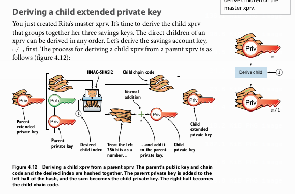

[Diagram alur proses derivasi sebuah child xprv dari parent xprv, melibatkan parent public key, index, dan chain code. - Figure 4.12]

1.  Ambil **parent public key** (yang diderivasi dari *parent private key*), **parent chain code**, dan **index** dari *child key* yang diinginkan (misalnya, index `1`).
2.  Gabungkan ketiga data ini dan lewatkan melalui fungsi **HMAC-SHA512**.
3.  Hasil hash 512-bit yang baru ini kembali dibagi dua:
    * **256 bit pertama** (diperlakukan sebagai angka) **ditambahkan** secara matematis ke **parent private key** untuk menghasilkan **child private key**.
    * **256 bit terakhir** menjadi **child chain code**.

Proses ini dapat diulang terus-menerus untuk membuat seluruh cabang pohon *key*.

### Kembali ke Backup

Dengan adanya `HD wallet`, Rita hanya perlu melakukan satu hal untuk *backup*: mencatat **seed**-nya. Seed `16432a20...de819d` (128 bit) jauh lebih mudah dicatat daripada delapan *private key* yang berbeda. Dan yang terpenting, *backup* ini berlaku selamanya. Ia bisa membuat ribuan alamat baru di masa depan, dan semuanya dapat dipulihkan hanya dari *seed* tunggal ini.

#### Mnemonic Sentences
Meskipun mencatat *seed* heksadesimal sudah merupakan peningkatan besar, masih ada ruang untuk kesalahan pengetikan. Untuk membuatnya lebih ramah manusia, **BIP39** memperkenalkan **mnemonic sentence**.

`Wallet` dapat merepresentasikan *seed* 128-bit sebagai rangkaian 12 kata bahasa Inggris yang mudah ditulis.
* **Seed**: `16432a207785ec5c4e5a226e3bde819d`
* **Mnemonic**: `bind bone marine upper gain comfort defense dust hotel ten parrot depend`

  

[Proses encoding seed menjadi mnemonic sentence 12 kata, melibatkan checksum dan pencocokan dengan daftar kata. - Figure 4.14]

**Cara Kerja Encoding:**
1.  Ambil *seed* (misalnya 128 bit).
2.  Buat *checksum* singkat dengan mengambil beberapa bit pertama dari hash SHA256 dari *seed* tersebut (misalnya, 4 bit pertama).
3.  Gabungkan *seed* dengan *checksum* (menjadi 132 bit).
4.  Bagi rangkaian bit ini menjadi beberapa kelompok, masing-masing 11 bit. (132 / 11 = 12 kelompok).
5.  Setiap kelompok 11 bit merepresentasikan sebuah angka antara 0 dan 2047.
6.  Setiap angka ini digunakan sebagai indeks untuk memilih kata dari daftar kata standar yang berisi 2048 kata.

**Cara Kerja Decoding:**
Prosesnya dibalik. Ketika Rita memasukkan kembali 12 katanya ke `wallet` baru, `wallet` akan mengubahnya kembali menjadi rangkaian 132 bit. Empat bit terakhir kemudian diperiksa sebagai *checksum* untuk memastikan tidak ada kesalahan penulisan kata.

  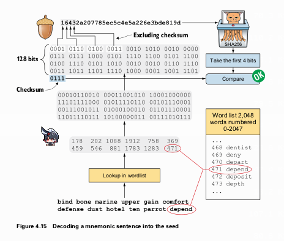

[Proses decoding mnemonic sentence kembali menjadi seed dengan verifikasi checksum. - Figure 4.15]

---

### Extended Public Keys (`xpub`)

`HD wallets` memiliki satu fitur hebat lainnya yang sangat penting untuk keamanan. Kita dapat menderivasi seluruh pohon **public key** tanpa memerlukan *private key* sama sekali.

#### Kasus Penggunaan: Server Web Toko Online
Kafe ingin menjual kue secara online. Server web mereka perlu bisa menghasilkan alamat Bitcoin baru untuk setiap pesanan demi privasi. Menempatkan *private key* (atau `xprv`) di server web yang terhubung ke internet adalah ide yang sangat buruk. Jika server diretas, semua uang di akun penjualan online akan dicuri.

Solusinya adalah menggunakan **`xpub`** (kependekan dari *extended public key*). `xpub` mirip dengan `xprv`, tetapi alih-alih berisi *private key*, ia berisi **public key** dan **chain code**.

  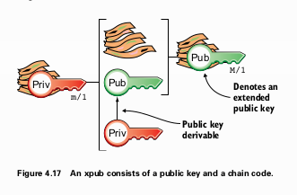

[Diagram yang menunjukkan sebuah xpub terdiri dari public key dan chain code. - Figure 4.17]

Kafe dapat menempatkan `xpub` untuk akun penjualan online (`M/1`) di server web. Server tersebut kemudian dapat menderivasi semua *child public key* (`M/1/0`, `M/1/1`, dst.) dan membuat alamat-alamat baru tanpa pernah memiliki akses ke *private key* manapun. Uang yang masuk ke alamat-alamat ini hanya dapat dibelanjakan menggunakan *private key* yang sesuai, yang disimpan dengan aman secara *offline* di `wallet` utama kafe.

  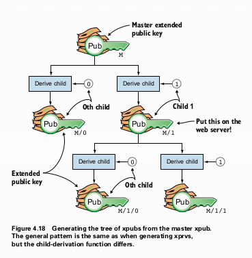

[Proses derivasi pohon xpub dari master xpub, memungkinkan pembuatan alamat tanpa private key. - Figure 4.18]

Derivasi *child `xpub`* bekerja secara paralel dengan derivasi *child `xprv`*. Ini dimungkinkan oleh sifat matematika dari *elliptic curve cryptography* yang akan kita bahas nanti.

### Derivasi Hardened Private Keys
> **Peringatan**: Bagian ini cukup teknis dan menantang, namun sangat krusial dari sudut pandang keamanan.

Ada satu kelemahan keamanan dalam derivasi `xprv` normal. Jika seorang penyerang berhasil mendapatkan:
1.  Satu **child private key** non-hardened (misalnya `m/1/1`).
2.  **Parent extended public key (`xpub`)** (misalnya `M/1`).

Maka, penyerang tersebut dapat menghitung mundur untuk menemukan **parent private key** (`m/1`).

  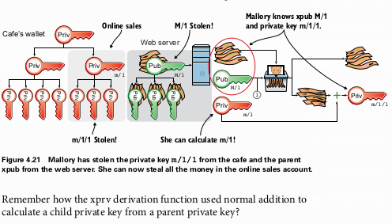

[Ilustrasi serangan di mana seorang penyerang menggunakan child private key dan parent xpub untuk menghitung parent private key. - Figure 4.21]

Ini dimungkinkan karena `child_private_key = parent_private_key + hash_output`. Penyerang mengetahui `child_private_key` dan dapat menghitung `hash_output` dari *parent `xpub`* dan index. Dengan demikian, mereka dapat menemukan `parent_private_key`. Jika penyerang mendapatkan `M` (master `xpub`) dan satu *private key* turunan mana pun, mereka bisa mendapatkan *master private key* dan mencuri semua dana di `wallet`.

Solusinya adalah **Hardened Derivation**.
* **Cara Kerja**: Alih-alih menggunakan *parent public key* untuk menghasilkan *hash* dalam proses derivasi, *hardened derivation* menggunakan **parent private key**.
* **Notasi**: Jalur *hardened* ditandai dengan tanda kutip, misalnya `m/1'`.
* **Implikasi Keamanan**: Karena *parent private key* diperlukan, mustahil untuk menderivasi *child key* (baik *private* maupun *public*) jika Kita hanya memiliki *parent `xpub`*. Ini secara efektif "memutus" rantai derivasi bagi siapa pun yang tidak memiliki *private key*.

  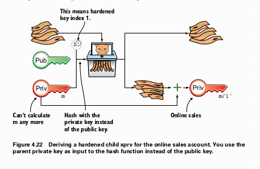

[Diagram perbandingan antara derivasi normal (menggunakan public key) dan derivasi hardened (menggunakan private key). - Figure 4.22]

Ini memungkinkan kompartementalisasi keamanan. Kafe dapat menggunakan *hardened derivation* untuk akun utamanya (`m/0'`, `m/1'`). Bahkan jika `xpub` untuk akun penjualan online (`M/1'`) dan salah satu *private key* di bawahnya (`m/1'/5`) bocor, penyerang tidak dapat melompat kembali untuk menemukan *master private key* (`m`). Serangan hanya terbatas pada akun penjualan online tersebut.

### Matematika Kunci Publik (Public Key Math)
> **Peringatan**: Bagian ini adalah penyelaman mendalam ke dalam matematika yang mendasari kunci publik, yang dikenal sebagai *Elliptic Curve Cryptography*.

* **Kurva Eliptik**: Kunci publik di Bitcoin adalah sebuah titik `(x, y)` pada kurva eliptik yang didefinisikan oleh persamaan `y² = x³ + 7` (dalam sebuah *finite field*).
* **Perkalian Kunci Publik**: Untuk mendapatkan sebuah *public key*, kita melakukan "perkalian" skalar. `Public Key (P) = private_key (k) * Generator Point (G)`. `G` adalah titik awal standar yang diketahui semua orang, dan `k` adalah *private key* Kita (sebuah angka yang sangat besar). Perkalian ini dilakukan melalui serangkaian operasi "penambahan titik" dan "penggandaan titik" pada kurva.

  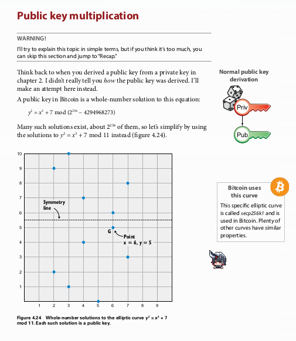

[Grafik kurva eliptik yang menunjukkan titik-titik (public key) dan garis simetri. - Figure 4.24]

* **Keamanan**: Operasi `k * G` mudah dilakukan, tetapi kebalikannya—menemukan `k` jika Kita hanya tahu `P` dan `G`—secara komputasi tidak mungkin dilakukan. Ini dikenal sebagai **Masalah Logaritma Diskrit Kurva Eliptik**. Inilah yang membuat derivasi kunci publik menjadi fungsi satu arah.
* **Encoding Kunci Publik**: Karena kurva ini simetris terhadap sumbu x, untuk setiap nilai `x` ada dua kemungkinan nilai `y` (positif dan negatif). Untuk menghemat ruang, kita hanya perlu menyimpan koordinat `x` (32 byte) dan satu byte tambahan sebagai awalan (`02` jika `y` genap, `03` jika `y` ganjil) untuk menandakan paritas `y`. Inilah mengapa *public key* terkompresi memiliki panjang 33 byte.

---

### Rangkuman dan Dampak pada Sistem
Bab ini memperkenalkan `wallet` sebagai alat penting di sisi pengguna, yang secara signifikan meningkatkan kegunaan dan keamanan.
* **Pembayaran Mudah**: Otomatisasi pembuatan dan pengiriman transaksi melalui QR code.
* **Backup Sederhana dan Aman**: `HD Wallets` memungkinkan seluruh `wallet` (termasuk semua *key* di masa depan) dicadangkan dengan aman hanya dengan mencatat satu **mnemonic sentence** (12-24 kata).
* **Keamanan yang Ditingkatkan**: `HD Wallets` memungkinkan kasus penggunaan canggih seperti `watch-only wallets` dan server web yang dapat menghasilkan alamat tanpa menyimpan *private key* melalui penggunaan `xpub`. **Hardened derivation** memberikan lapisan keamanan tambahan dengan mengisolasi cabang-cabang `wallet`.

Sistem *cookie token* kini telah mencapai versi 4.0, yang jauh lebih matang dari sisi pengguna. Tabel konsep kita tidak berubah karena semua inovasi dalam bab ini terjadi di lapisan aplikasi pengguna, yang analoginya di Bitcoin juga berfungsi dengan cara yang sama.

---

## Bab 5: Transactions

Bab ini bertujuan untuk mengatasi beberapa masalah serius yang masih ada dalam sistem *cookie token*. Meskipun penggunaan tanda tangan digital di Bab 2 telah mencegah adanya penipu, sistem ini masih memiliki kelemahan fundamental yang berpusat pada Lisa.

### Masalah dengan Sistem Lama

Sistem yang kita miliki sejauh ini memiliki tiga masalah utama:
1.  **Beban Verifikasi pada Lisa**: Seiring dengan bertambahnya jumlah pembayaran dalam *spreadsheet*, tugas Lisa untuk menghitung saldo setiap `PKH` (*Public Key Hash*) sebelum menyetujui pembayaran menjadi semakin lambat dan memakan waktu.
2.  **Tidak Fleksibel**: Jika seorang pengguna memiliki dana yang tersebar di beberapa alamat (misalnya 5 CT di alamat A dan 8 CT di alamat B), mereka tidak bisa melakukan satu pembayaran tunggal sebesar 10 CT. Mereka harus melakukan dua transaksi terpisah, yang merepotkan dan membuat *spreadsheet* menjadi "bengkak".
3.  **Kebutuhan untuk Percaya pada Lisa (Masalah Inti)**: Ini adalah masalah paling kritis. Karena hanya Lisa yang melihat email berisi tanda tangan digital, tidak ada yang bisa membuktikan jika Lisa berbuat curang. Ia bisa saja secara diam-diam mengubah jumlah pembayaran ke dirinya sendiri atau bahkan menambahkan baris transaksi palsu dari orang lain ke dirinya di dalam *spreadsheet*. Meskipun kita mengasumsikan Lisa adalah orang yang paling jujur, sistem yang baik seharusnya tidak bergantung pada kejujuran satu individu.

  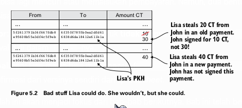

[Ilustrasi dua cara Lisa dapat berbuat curang: mengubah jumlah transaksi yang ada dan menambahkan transaksi palsu baru ke spreadsheet. - Figure 5.2]

Untuk mengatasi masalah ini, Lisa memperkenalkan sebuah konsep baru yang akan merevolusi sistem: **`transaction`**.

### Membayar Menggunakan Sebuah `Transaction`

**`Transaction`** adalah sebuah paket data terstruktur yang menggantikan dua hal sekaligus: (1) email informal yang dikirim pengguna ke Lisa, dan (2) baris sederhana dalam *spreadsheet*.

  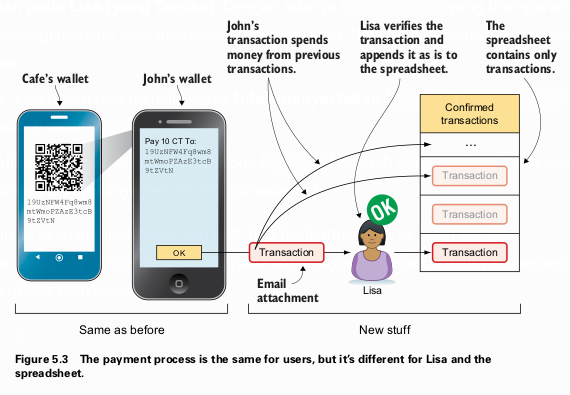

[Diagram alur pembayaran baru. Wallet John membuat sebuah 'transaction', mengirimkannya ke Lisa, yang kemudian memverifikasi dan menambahkan 'transaction' utuh tersebut ke dalam spreadsheet. - Figure 5.3]

Alur kerjanya kini berubah secara fundamental di belakang layar:
1.  **Pembuatan (`Create`)**: `Wallet` pengguna (misalnya John) membuat sebuah `transaction` formal.
2.  **Konfirmasi (`Confirm`)**: Lisa menerima `transaction` ini, memverifikasinya, dan kemudian **menambahkan seluruh `transaction` tersebut apa adanya** ke dalam *spreadsheet*. `Spreadsheet` kini tidak lagi berisi baris `Dari | Ke | Jumlah`, melainkan daftar `transaction` yang lengkap.
3.  **Verifikasi (`Verify`)**: Karena seluruh `transaction` yang ditandatangani kini bersifat publik di dalam *spreadsheet*, **siapa pun** dapat melakukan verifikasi yang sama persis seperti yang dilakukan Lisa. Ini membuat Lisa tidak bisa lagi berbuat curang.

Kunci dari sistem baru ini adalah `transaction` tidak hanya menyatakan "siapa membayar siapa", tetapi juga "uang mana yang sedang dibelanjakan". `Transaction` merujuk secara spesifik ke "koin" yang diterima dari transaksi-transaksi sebelumnya. Koin-koin ini disebut **`Unspent Transaction Outputs` (`UTXO`)**.

#### 1. Membuat `Transaction`
Mari kita bedah anatomi dari `transaction` yang dibuat oleh `wallet` John untuk membeli kue seharga 10 CT.

  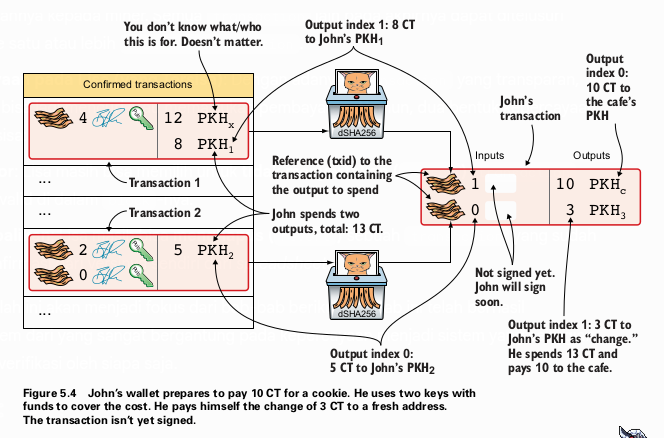

[Anatomi sebuah transaction yang belum ditandatangani, menunjukkan dua input yang merujuk pada UTXO dari transaksi sebelumnya dan dua output untuk pembayaran dan kembalian. - Figure 5.4]

Sebuah `transaction` terdiri dari **`inputs`** dan **`outputs`**.

* **`Inputs`**: Bagian ini menentukan `UTXO` mana yang akan dibelanjakan. Dalam contoh ini, John memiliki dua `UTXO` (satu senilai 8 CT dan satu lagi 5 CT) dari transaksi sebelumnya. Untuk membelanjakannya, setiap `input` harus merujuk ke:
    * **`Transaction ID` (`txid`)** dari transaksi sebelumnya di mana `UTXO` itu dibuat. `txid` adalah hash double SHA256 dari `transaction` tersebut.
    * **Index output** di dalam `transaction` sebelumnya itu (misalnya, output ke-0 atau ke-1).
* **`Outputs`**: Bagian ini menentukan ke mana uang akan dikirim.
    * **Output 0**: Mengirim 10 CT ke `PKH` milik kafe.
    * **Output 1**: Mengirim sisa 3 CT kembali ke alamat baru milik John. Ini disebut **`change`** (kembalian). `Change` diperlukan karena sebuah `UTXO` harus dibelanjakan secara keseluruhan; tidak bisa sebagian.

> **Aturan Penting**: Agar sebuah `transaction` valid, jumlah total nilai `input` harus lebih besar atau sama dengan jumlah total nilai `output`. Selisihnya (jika ada) akan menjadi **`transaction fee`** untuk miner, yang akan kita bahas di Bab 7. Untuk saat ini, kita asumsikan tidak ada `fee`, sehingga `total input = total output` (13 CT = 10 CT + 3 CT).

**Menandatangani `Transaction`**
Setelah struktur `transaction` selesai dibuat, `wallet` harus menandatanganinya.

  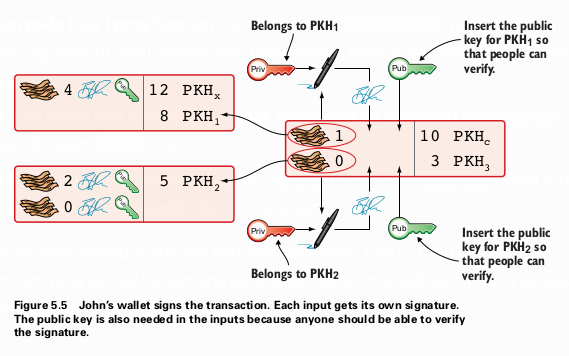

[Proses penandatanganan transaction, di mana setiap input ditandatangani secara terpisah dan public key yang sesuai disisipkan ke dalam input. - Figure 5.5]

* **Setiap `input` harus ditandatangani secara terpisah** menggunakan *private key* yang sesuai dengan `PKH` dari `UTXO` yang dibelanjakannya.
* Tanda tangan tersebut mencakup (atau *commits to*) seluruh `transaction` (semua `input` dan `output`). Ini memastikan tidak ada bagian dari `transaction` yang dapat diubah setelah ditandatangani.
* Agar orang lain bisa memverifikasi tanda tangan, **`public key` yang sesuai harus dimasukkan ke dalam `input`**. Verifier akan menghitung hash dari `public key` ini dan mencocokkannya dengan `PKH` di `UTXO` yang dibelanjakan untuk memastikan `key` tersebut adalah `key` yang benar.

#### 2. Lisa Mengkonfirmasi `Transaction`
Lisa kini tidak perlu lagi menghitung saldo. Proses verifikasinya berubah:
1.  **Memeriksa Keberadaan `UTXO`**: Ia harus memastikan `UTXO` yang dirujuk oleh setiap `input` benar-benar ada dan belum pernah dibelanjakan sebelumnya (mencegah *double-spending*).
2.  **Memeriksa Nilai**: `Total output` ≤ `Total input`.
3.  **Memeriksa Tanda Tangan**: Semua tanda tangan di setiap `input` valid.

Untuk mempercepat langkah pertama, Lisa tidak lagi memindai seluruh *spreadsheet*. Ia kini memelihara sebuah database terpisah yang disebut **`UTXO set`**.

  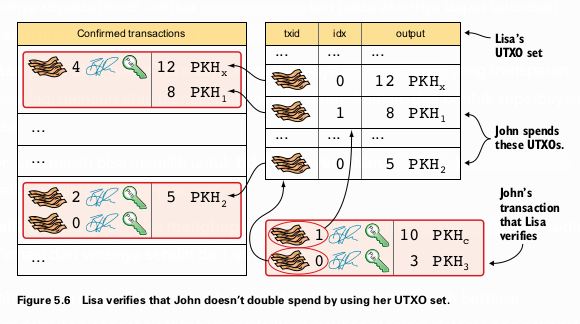

[Ilustrasi Lisa menggunakan UTXO set-nya untuk memeriksa apakah input dari transaksi John valid (ada dan belum dibelanjakan). - Figure 5.6]

`UTXO set` adalah daftar semua "koin" yang belum dibelanjakan yang ada di seluruh sistem. Saat `transaction` baru masuk:
* Lisa memeriksa apakah `input`-nya ada di dalam `UTXO set`. Jika ya, `transaction` valid.
* Setelah `transaction` dikonfirmasi dan ditambahkan ke *spreadsheet*, Lisa memperbarui `UTXO set`-nya: ia **menghapus `UTXO` yang baru saja dibelanjakan** dan **menambahkan `output` baru dari `transaction` tersebut** sebagai `UTXO` baru.

#### 3. Siapa Saja Dapat Memverifikasi `Transaction`
Inilah inti dari peningkatan sistem. Karena `transaction` yang sudah ditandatangani kini tercatat secara publik di *spreadsheet*, **siapa pun dapat membuat `UTXO set` mereka sendiri** dan memverifikasi setiap `transaction` dari awal hingga akhir. Mereka dapat memastikan Lisa tidak berbuat curang.

Di Bitcoin, para verifier independen ini disebut **`full nodes`**. Mereka adalah penjaga aturan jaringan. Lisa tidak bisa lagi mencuri uang, karena jika ia mengubah `transaction` (misalnya, mengubah `PKH` tujuan menjadi miliknya), tanda tangan digital John akan menjadi tidak valid. Siapa pun yang memverifikasi *spreadsheet* akan mendeteksi kecurangan tersebut.

> **Sistem Berbasis Akun vs. Sistem Berbasis Nilai**
> Perubahan ini secara efektif mengubah sistem kita dari **sistem berbasis akun** (seperti rekening bank yang melacak saldo) menjadi **sistem berbasis nilai (`value-based`)** (seperti uang tunai fisik yang melacak koin-koin individual). Bitcoin adalah sistem berbasis nilai.

### Script
Kenyataannya, `input` dan `output` pada `transaction` Bitcoin lebih canggih dari sekadar berisi data. Mereka sebenarnya berisi bagian-bagian dari sebuah program komputer kecil yang ditulis dalam bahasa pemrograman sederhana bernama **`Script`**.

  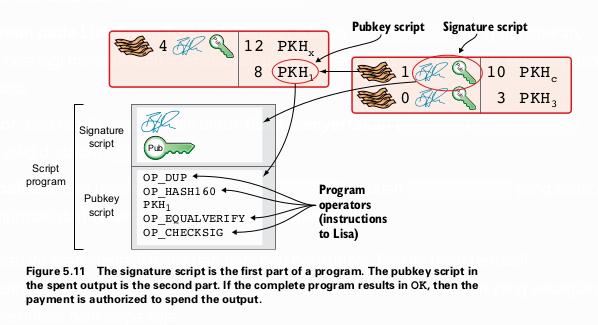

[Diagram yang menunjukkan bahwa signature script dari input dan pubkey script dari output yang dibelanjakan digabungkan untuk membentuk satu program Script. - Figure 5.11]

* **`Pubkey Script` (di dalam `output`)**: Ini adalah semacam "kunci" atau tantangan. Ia mendefinisikan kondisi yang harus dipenuhi untuk membelanjakan `output` tersebut.
* **`Signature Script` (di dalam `input`)**: Ini adalah "jawaban" untuk tantangan tersebut. Ia menyediakan data yang memenuhi kondisi yang ditetapkan oleh `pubkey script`.

Ketika sebuah `node` memverifikasi `transaction`, ia menggabungkan `signature script` dari `input` dengan `pubkey script` dari `output` yang dibelanjakannya. Program gabungan ini kemudian dieksekusi menggunakan sebuah struktur data yang disebut **stack** (tumpukan). Jika program selesai berjalan dan hasil akhirnya adalah `TRUE` (atau `OK`), maka `input` tersebut sah dan diizinkan untuk membelanjakan `output` tersebut.

**Contoh Eksekusi Script P2PKH (Pay-to-Public-Key-Hash):**
Program gabungan untuk `transaction` P2PKH standar pada dasarnya melakukan ini:
1.  **Dari `Signature Script`**: Dorong `<signature>` dan `<public_key>` ke atas `stack`.
2.  **Dari `Pubkey Script`**:
    * `OP_DUP`: Duplikasi `<public_key>` di puncak `stack`.
    * `OP_HASH160`: Ambil `<public_key>` teratas, hash, dan dorong hasilnya (`PKH` yang dihitung) ke `stack`.
    * Dorong `<PKH_asli>` (dari `output` asli) ke `stack`.
    * `OP_EQUALVERIFY`: Bandingkan dua item teratas (`PKH` yang dihitung dan `<PKH_asli>`). Jika sama, lanjutkan. Jika tidak, gagal.
    * `OP_CHECKSIG`: Verifikasi `<signature>` terhadap `<public_key>` yang tersisa di `stack`. Jika valid, dorong `TRUE` ke `stack`.

Jika semua langkah berhasil, `stack` akan berisi `TRUE`, dan `transaction` dianggap valid. Penggunaan `Script` inilah yang membuat Bitcoin disebut sebagai "uang yang dapat diprogram" (*programmable money*).

### Jenis Pembayaran Lanjutan (`Fancy Payment Types`)

Fleksibilitas `Script` memungkinkan jenis-jenis transaksi yang lebih kompleks daripada sekadar P2PKH.

#### Multiple Signatures (`Multisig`)
Bayangkan sebuah dana amal yang dikelola oleh tiga orang (Faiza, Ellen, dan John). Mereka tidak ingin satu orang pun memiliki kendali penuh. Mereka dapat membuat sebuah `output` yang memerlukan, misalnya, **2 dari 3 tanda tangan** untuk dapat dibelanjakan.

  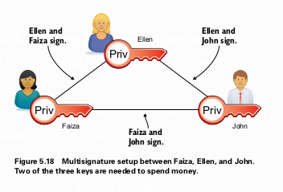

[Diagram yang menggambarkan setup multisignature 2-dari-3, di mana kombinasi dua dari tiga orang dapat menandatangani transaksi. - Figure 5.18]

Ini memberikan keuntungan:
* Jika satu kunci dicuri, dana tetap aman.
* Jika satu orang kehilangan kuncinya (atau meninggal), dua orang lainnya masih bisa mengakses dana.
* Tidak ada satu orang pun yang bisa kabur dengan uangnya sendirian.

Ini dicapai dengan `Script` yang menggunakan operator `OP_CHECKMULTISIG`. Namun, `multisig script` ini panjang dan kompleks. Ini menimbulkan masalah:
* `Wallet` pengirim harus tahu cara membuatnya.
* Ini membeberkan detail keamanan internal penerima kepada pengirim.
* Ukuran `transaction` menjadi besar, sehingga `transaction fee` yang dibayar oleh **pengirim** menjadi lebih mahal.

#### Pay-to-Script-Hash (`P2SH`)
**`P2SH`** (distandarisasi dalam **BIP16**) adalah solusi cerdas untuk masalah-masalah di atas.
* **Ide Utama**: Alih-alih pengirim menempatkan `multisig script` yang kompleks di dalam `output`, mereka hanya menempatkan **hash dari script tersebut**.
* **`Redeem Script`**: `Multisig script` yang asli kini disebut `redeem script`. Script ini baru diungkapkan oleh **penerima** pada saat mereka ingin membelanjakan dana tersebut.
* **Keuntungan**:
    * Bagi pengirim, `transaction` terlihat sederhana dan kecil, seolah-olah mengirim ke alamat biasa. Biaya transaksi menjadi murah.
    * Kompleksitas disembunyikan. Beban untuk menyediakan `script` yang besar dan membayar biaya yang lebih tinggi ditanggung oleh penerima saat membelanjakan, bukan oleh pengirim.

**Alamat `P2SH`**: Untuk mempermudah, alamat `P2SH` dibuat dengan mengenkode *script hash* (bukan `PKH`). Alamat ini menggunakan *version byte* yang berbeda, sehingga selalu dimulai dengan angka **`3`** (di Bitcoin `mainnet`), berbeda dari alamat P2PKH yang dimulai dengan `1`. Ini memungkinkan `wallet` pengirim untuk secara otomatis membuat `output` P2SH yang benar.

### Hal-Hal Lain dalam `Transaction`

* **Pembuatan Koin dan `Coinbase Transaction`**: Semua `bitcoin` (atau *cookie token*) berasal dari **`coinbase transaction`**. Ini adalah `transaction` khusus yang dibuat oleh miner di setiap `block`. Ini adalah satu-satunya `transaction` yang tidak memiliki `input` nyata dan berfungsi untuk "menciptakan" koin baru (hadiah `block` + `fee` transaksi) dan memberikannya kepada miner. Semua `transaction` lain pada akhirnya dapat ditelusuri kembali ke satu atau lebih `coinbase transaction`.
* **Kepercayaan pada Lisa (yang Tersisa)**: Dengan adanya `transaction` yang transparan, Lisa tidak bisa lagi mencuri atau memalsukan pembayaran. Namun, dua bentuk kepercayaan masih tersisa:
    1.  **Sensor**: Lisa masih bisa memilih untuk **tidak menyertakan (`censor`)** `transaction` yang valid di dalam `block`-nya.
    2.  **Pembalikan**: Lisa masih bisa **menghapus (`revert`)** sebuah `transaction` yang sudah ia konfirmasi dari versinya sendiri dari *spreadsheet*.

Masalah-masalah ini akan menjadi fokus dari bab-bab berikutnya. Bab ini telah berhasil mengubah sistem dari yang sangat bergantung pada kepercayaan menjadi sistem yang sebagian besar dapat diverifikasi oleh siapa saja.

---

# Bab 6
## The Blockchain

Di akhir Bab 5, kita berhasil membuat sistem di mana Lisa tidak bisa lagi mencuri uang atau memalsukan transaksi tanpa terdeteksi, karena semua `transaction` yang ditandatangani kini bersifat publik. Namun, masih ada dua hal yang mengharuskan kita untuk percaya padanya:
1.  Ia tidak akan menyensor `transaction` (akan kita bahas di bab selanjutnya).
2.  Ia tidak akan **menghapus `transaction` yang sudah dikonfirmasi**.

### Lisa Masih Bisa Menghapus Transaksi

Masalah ini sangat serius. Bayangkan Lisa membeli kue dari kafe. `Transaction`-nya dikonfirmasi dan masuk ke *spreadsheet*. Kafe memberikan kue kepada Lisa. Setelah itu, Lisa bisa saja secara diam-diam menghapus baris `transaction` tersebut dari *spreadsheet*.

  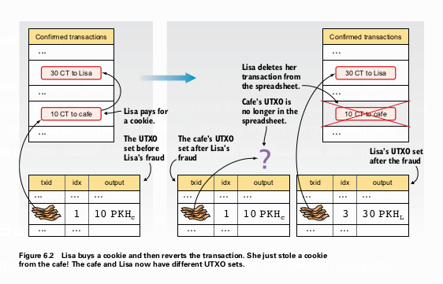

[Ilustrasi perbandingan UTXO set milik kafe dan Lisa setelah Lisa curang. UTXO set kafe masih mencatat pembayaran, sementara UTXO set Lisa tidak, seolah-olah pembayaran tidak pernah terjadi. - Figure 6.2]

Akibatnya, terjadi inkonsistensi. Menurut `UTXO set` milik kafe, mereka telah menerima 10 CT. Namun, menurut `UTXO set` Lisa (dan `UTXO set` yang akan dibuat oleh pengguna baru mana pun yang mengunduh *spreadsheet* versi terbaru), uang itu tidak pernah dibelanjakan.

Ketika kafe menyadari `transaction` tersebut hilang, mereka tidak bisa membuktikan apa-apa. Ini menjadi situasi "kata melawan kata". Kafe mengklaim `transaction` itu pernah ada, Lisa menyangkalnya. Sistem membutuhkan cara untuk membuat histori transaksi menjadi **tidak dapat diubah (`immutable`)**.

### Membangun `Blockchain`

Solusinya adalah mengganti *spreadsheet* dengan sebuah **`blockchain`**. `Blockchain` secara harfiah adalah sebuah "rantai blok". Ini adalah sebuah file log publik yang hanya bisa ditambahkan (*append-only*), di mana `transaction` dikelompokkan ke dalam struktur data yang disebut **`block`**.

  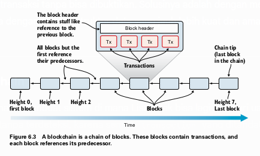

[Diagram struktur dasar sebuah blockchain, menunjukkan rantai blok-blok yang saling terhubung dari blok pertama (height 0) hingga blok terakhir (chain tip). - Figure 6.3]

Setiap `block` terhubung secara kriptografis ke `block` sebelumnya, membentuk sebuah rantai yang tidak dapat diputuskan. Setiap `block` memiliki **`height`** (ketinggian), yang menunjukkan posisinya dalam rantai, dimulai dari `height` 0 (blok pertama atau *genesis block*).

#### Anatomi Sebuah `Block`
Setiap `block` terdiri dari dua bagian utama:
1.  **Daftar `Transaction`**: `Transaction` yang dikonfirmasi dalam `block` tersebut. `Transaction` pertama dalam setiap `block` selalu merupakan **`coinbase transaction`** (hadiah untuk miner).
2.  **`Block Header`**: Bagian terpenting yang mengamankan `block` dan seluruh rantai sebelumnya.

  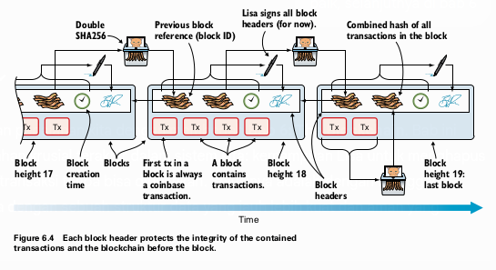

[Tampilan detail beberapa blok terakhir dalam blockchain, menyoroti komponen-komponen dalam block header. - Figure 6.4]

`Block header` berisi empat elemen krusial:
1.  **Hash dari `Block Header` Sebelumnya**: Ini adalah "lem" kriptografis yang menghubungkan `block` ini ke `block` sebelumnya. Hash dari `block header` juga berfungsi sebagai **`Block ID`**.
2.  **`Merkle Root`**: Sebuah hash tunggal yang secara ringkas merepresentasikan *semua* `transaction` di dalam `block` tersebut. Jika satu bit saja dari `transaction` manapun diubah, `merkle root` akan berubah total. (Detail cara kerjanya akan dibahas nanti di bab ini).
3.  **Timestamp**: Waktu perkiraan `block` dibuat.
4.  **Tanda Tangan Lisa**: Untuk saat ini, Lisa menandatangani setiap `block header` dengan *private key* khususnya. Ini adalah bukti persetujuannya. (Di Bab 7, ini akan digantikan oleh `proof-of-work`).

#### Bagaimana `Blockchain` Mencegah Penghapusan Transaksi
Mari kita lihat kembali skenario di mana Lisa mencoba menghapus `transaction` pembelian kuenya.
1.  Lisa membuat `block` #21 yang berisi `transaction` pembayarannya ke kafe. Ia menandatangani `block header` dan mempublikasikannya.
2.  Kafe melihat `block` #21, memverifikasinya, dan memberikan kue kepada Lisa.
3.  Sekarang, Lisa mencoba berbuat curang. Ia membuat versi **alternatif** dari `block` #21 (sebut saja #21b) yang **tidak berisi `transaction` pembayarannya**.
4.  Karena isi `transaction` di `block` #21b berbeda, **`merkle root`**-nya juga harus berbeda.
5.  Karena `merkle root` berubah, `block header`-nya pun berubah.
6.  Karena `block header` berubah, Lisa harus **menandatanganinya kembali**.

Lisa sekarang memiliki dua `block` yang berbeda untuk `height` 21, yaitu `block` #21 dan #21b. Keduanya valid dan ditandatangani olehnya.

  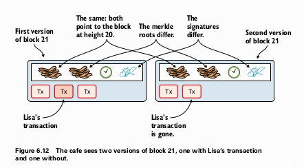

[Ilustrasi perbandingan dua versi block 21 yang dibuat Lisa. Keduanya menunjuk ke block 20 yang sama, tetapi memiliki merkle root dan tanda tangan yang berbeda karena salah satunya tidak berisi transaksi Lisa. - Figure 6.12]

Ketika kafe melihat ada dua versi `block` di `height` yang sama, mereka memiliki **bukti kriptografis yang tak terbantahkan bahwa Lisa telah berbuat curang**. Dia telah menandatangani dua histori yang saling bertentangan. Masalah "kata melawan kata" telah terpecahkan.

Lebih jauh lagi, jika Lisa mencoba mengubah `block` yang lebih tua (misalnya `block` #20), ia tidak hanya harus membuat ulang `block` #20, tetapi juga semua `block` setelahnya (`#21, #22, #23`, dst.) karena hash dari `block header` sebelumnya akan berubah, memutus rantai. Ini membuat pengubahan histori menjadi semakin sulit seiring berjalannya waktu.

---

### `Lightweight Wallets`

Menjalankan sebuah **`full node`**—perangkat lunak yang mengunduh dan memverifikasi seluruh `blockchain`—memberikan keamanan tertinggi tetapi membutuhkan sumber daya yang besar (penyimpanan ratusan GB, koneksi internet yang kuat, dan daya komputasi). Ini tidak praktis untuk pengguna biasa, terutama di perangkat seluler.

Untuk itu, ada jenis `wallet` lain yang disebut **`lightweight wallet`** atau **SPV (`Simplified Payment Verification`) `wallet`**. `Wallet` ini tidak mengunduh seluruh `block`, melainkan hanya **`block header`**-nya. `Wallet` ini bergantung pada `full node` untuk memberinya informasi transaksi yang relevan.

  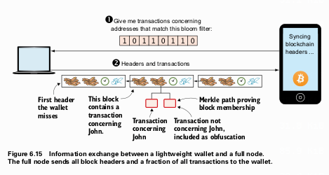

[Diagram alur komunikasi antara lightweight wallet dan full node. Wallet mengirimkan bloom filter, lalu node mengirimkan kembali block header dan transaksi yang relevan beserta merkle path. - Figure 6.15]

Namun, ada dua masalah yang harus dipecahkan:
1.  **Privasi**: Bagaimana `wallet` bisa meminta `transaction`-nya tanpa memberitahu `full node` semua alamat yang dimilikinya?
2.  **Verifikasi**: Bagaimana `wallet` bisa yakin bahwa `transaction` yang diberikan oleh `full node` benar-benar ada di dalam `block` tersebut, jika ia tidak mengunduh semua `transaction` di `block` itu?

Solusinya adalah `Bloom Filters` dan `Merkle Trees`.

#### `Bloom Filters`: Menjaga Privasi
Alih-alih mengirimkan daftar alamatnya, `lightweight wallet` membuat dan mengirimkan sebuah **`bloom filter`** ke `full node`. `Bloom filter` adalah struktur data probabilistik yang dapat memberi tahu `full node` apakah sebuah `transaction` "mungkin" relevan untuk `wallet` tersebut, tanpa mengungkapkan alamat pastinya.

  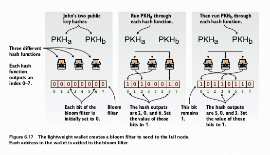

[Proses pembuatan bloom filter. Alamat-alamat di-hash beberapa kali, dan hasilnya digunakan untuk mengatur bit dalam sebuah array menjadi 1. - Figure 6.17]

* **Cara Kerja**: `Wallet` membuat sebuah array bit (misalnya, `[0,0,0,0,0,0,0,0]`). Untuk setiap alamatnya, ia melakukan beberapa fungsi hash. Setiap hasil hash menunjuk ke sebuah indeks di array, dan bit di indeks tersebut diubah menjadi `1`.
* **Penggunaan**: `Full node` menguji setiap `transaction` baru terhadap `bloom filter` ini. Jika hasil hash dari data dalam `transaction` (seperti `PKH`) selalu menunjuk ke bit `1` di filter, `node` akan mengirim `transaction` itu ke `wallet`. Jika ada satu saja yang menunjuk ke bit `0`, `transaction` itu pasti tidak relevan.
* **`False Positives`**: Desain ini sengaja menciptakan `false positives` (hasil positif palsu), di mana `full node` juga akan mengirim beberapa `transaction` yang sebenarnya tidak relevan. Ini bagus untuk privasi karena mengaburkan alamat-alamat asli milik `wallet`. Ada *trade-off* antara privasi dan penggunaan bandwidth: semakin banyak `false positive`, semakin baik privasinya, tetapi semakin banyak data yang terbuang.

#### `Merkle Trees`: Verifikasi yang Efisien
Inilah solusi untuk masalah verifikasi. `Merkle tree` adalah cara untuk menghash semua `transaction` dalam sebuah `block` menjadi satu hash tunggal (`merkle root`) dengan cara yang sangat efisien.

  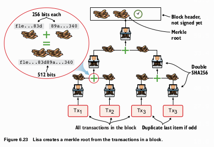

[Diagram pembuatan merkle tree. Hash dari setiap transaksi dipasangkan, digabungkan, lalu di-hash lagi, terus ke atas hingga tersisa satu hash tunggal yaitu merkle root. - Figure 6.23]

* **Pembuatan**: `txid` dari semua `transaction` di-hash secara berpasangan. Hash hasil dari setiap pasangan kemudian di-hash lagi secara berpasangan, dan seterusnya, hingga hanya tersisa satu hash. Hash tunggal terakhir inilah yang disebut **`merkle root`** dan dimasukkan ke dalam `block header`.
* **Bukti Keanggotaan (`Merkle Proof`)**: Untuk membuktikan bahwa sebuah `transaction` (misal `Tx2`) ada di dalam sebuah `block`, `full node` tidak perlu mengirim semua `transaction`. Ia hanya perlu mengirim:
    1.  `Transaction` itu sendiri (`Tx2`).
    2.  `Block header` yang berisi `merkle root`.
    3.  **`Merkle path`** (atau `partial merkle tree`): "Saudara" hash di sepanjang jalur dari `Tx2` ke `merkle root`.

  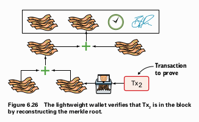

[Lightweight wallet menggunakan merkle path yang diberikan untuk merekonstruksi merkle root dan membandingkannya dengan yang ada di block header. - Figure 6.26]

Dengan informasi ini, `lightweight wallet` dapat secara mandiri menghitung ulang `merkle root`. Jika hasil perhitungannya cocok dengan `merkle root` di `block header`, maka `wallet` memiliki bukti kriptografis bahwa `transaction` tersebut benar-benar bagian dari `block` itu.

Metode ini sangat efisien. Ukuran `merkle proof` tumbuh secara logaritmik, bukan linear, dengan jumlah `transaction`. Untuk sebuah `block` dengan ribuan `transaction`, buktinya hanya terdiri dari belasan hash saja.

### Keamanan `Lightweight Wallets`

Penting untuk dipahami bahwa `lightweight wallet` mengorbankan keamanan demi kenyamanan. Pengguna `lightweight wallet` **mempercayai `full node`** yang terhubung dengannya untuk:
* Memvalidasi `script` dan tanda tangan dengan benar.
* Memastikan tidak ada *double-spending*.
* Tidak menyembunyikan `transaction` atau `block`.
* Mengikuti aturan konsensus yang benar (misalnya, tidak menerima `block` dengan hadiah yang tidak valid).

Untuk mengurangi risiko ini, pengguna `lightweight wallet` dapat melakukan dua hal:
1.  **Terhubung ke Beberapa `Full Node`**: Ini mengurangi kemungkinan ditipu oleh satu `node` jahat.
2.  **Terhubung ke `Trusted Node`**: Ini adalah pilihan paling aman. Pengguna menjalankan `full node` sendiri di rumah dan mengarahkan `lightweight wallet` di ponselnya untuk hanya terhubung ke `node` miliknya sendiri. Ini memberikan keamanan penuh dari `full node` dengan portabilitas `lightweight wallet`.

---

