# Bab 1
## Pengenalan Bitcoin

Bab ini bertujuan untuk memberikan pemahaman dasar tentang apa itu Bitcoin, bagaimana cara kerjanya secara garis besar, dan masalah-masalah apa yang coba dipecahkannya.

### Apa itu Bitcoin?

**Bitcoin** adalah sebuah sistem uang digital *peer-to-peer*. Ini memungkinkan pengiriman unit mata uangnya, yang disebut **bitcoin** (dengan huruf 'b' kecil), antar individu tanpa memerlukan perantara tepercaya seperti bank. Sederhananya, ini adalah versi digital dari uang tunai yang digunakan melalui internet.

Penting untuk membedakan terminologinya
* **Bitcoin** (dengan 'B' besar) merujuk pada sistem atau jaringannya secara keseluruhan.
* **bitcoin** (dengan 'b' kecil) merujuk pada unit mata uangnya. Simbol yang umum digunakan adalah BTC atau XBT.

Tidak ada pemerintah atau perusahaan yang mengendalikan Bitcoin. Sistem ini dijaga dan dioperasikan secara kolektif oleh ribuan komputer di seluruh dunia yang disebut **Bitcoin network** (*jaringan Bitcoin*). Siapa pun dapat berpartisipasi tanpa perlu izin atau registrasi.

Ekosistem Bitcoin terdiri dari berbagai partisipan yang berinteraksi dengan jaringan ini:
* **Pengguna Akhir (*End users*)**: Individu yang menggunakan Bitcoin untuk kebutuhan sehari-hari seperti menabung, berbelanja, atau berspekulasi.
* **Pengguna Korporat (*Corporate users*)**: Perusahaan yang memanfaatkan Bitcoin untuk bisnis, misalnya membayar gaji internasional.
* **Pedagang (*Merchants*)**: Bisnis seperti restoran atau toko buku yang menerima pembayaran Bitcoin.
* **Layanan Bitcoin (*Bitcoin services*)**: Perusahaan yang menyediakan layanan terkait Bitcoin, seperti jasa remitansi atau anonimisasi.
* **Bursa (*Exchanges*)**: Layanan komersial untuk menukar mata uang lokal ke bitcoin dan sebaliknya.
* **Pengembang Bitcoin (*Bitcoin developers*)**: Orang-orang yang bekerja pada perangkat lunak *open source* yang menjalankan jaringan Bitcoin.
* **Protokol di Atasnya (*Protocols on top*)**: Sistem yang dibangun di atas Bitcoin untuk fungsi-fungsi tertentu, seperti token khusus atau jaringan pembayaran.

<p align="center">
  
</p>

[Diagram ekosistem Bitcoin yang menunjukkan bagaimana berbagai partisipan seperti pengguna, merchant, dan developer berinteraksi dengan Bitcoin network di pusatnya. - Figure 1.1]

Inti dari ekosistem ini adalah **Bitcoin network**, yang terdiri dari ribuan komputer yang disebut **Bitcoin nodes** (*simpul Bitcoin*). Tugas utama *nodes* ini adalah memproses pembayaran, mengamankan catatan kepemilikan (ledger), dan menerbitkan bitcoin baru sesuai jadwal yang telah ditentukan.

### Gambaran Besar: Alur Sebuah Pembayaran

Untuk memahami cara kerja Bitcoin, buku ini mengilustrasikan proses pembayaran dari Alice ke Bob dalam empat langkah utama. Proses ini adalah fondasi dari seluruh sistem.

<p align="center">
  
</p>

[Diagram alur pembayaran Bitcoin dari Alice ke Bob, yang dipecah menjadi empat langkah: pembuatan transaksi, verifikasi oleh jaringan, pencatatan di blockchain, dan notifikasi ke dompet Bob. - Figure 1.2]

Secara ringkas, alurnya adalah sebagai berikut:
1.  Alice membuat dan mengirim sebuah **transaction** ke Bitcoin network.
2.  *Nodes* di dalam jaringan memverifikasi *transaction* tersebut dan menyebarkannya ke *nodes* lain.
3.  Salah satu *node* (disebut **miner**) mengumpulkan beberapa *transaction* baru ke dalam sebuah **block** dan menambahkannya ke catatan riwayat global yang disebut **blockchain**.
4.  *Wallet* Bob menerima notifikasi bahwa *transaction* telah dikonfirmasi dan dana telah diterima.

Mari kita bahas setiap langkah secara lebih detail.

#### Langkah 1: Transactions

Sebuah **transaction** (transaksi) pada dasarnya adalah sebuah instruksi pembayaran. Ketika Alice ingin mengirim 1 BTC ke Bob, ia tidak benar-benar "mengirim koin" secara langsung. Sebaliknya, *wallet*-nya membuat sebuah pesan digital (sebuah *transaction*) yang di dalamnya berisi:

* **Jumlah**: 1 bitcoin.
* **Penerima**: Alamat Bitcoin milik Bob.
* **Otorisasi**: Sebuah **digital signature** (tanda tangan digital) yang dibuat menggunakan **private key** (kunci pribadi) milik Alice.

*Digital signature* ini berfungsi sebagai bukti otentikasi yang tak terbantahkan bahwa instruksi tersebut benar-benar berasal dari Alice, karena hanya Alice yang memiliki *private key* untuk membuatnya. *Transaction* ini kemudian dikirim dari *wallet* Alice ke satu atau lebih *nodes* di dalam Bitcoin network.

<p align="center">
  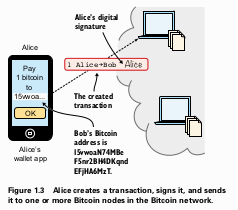
</p>

[Alice menggunakan aplikasi wallet di ponselnya untuk membuat sebuah transaction yang berisi digital signature miliknya, yang kemudian dikirim ke Bitcoin network. - Figure 1.3]

#### Langkah 2: The Bitcoin Network

Setelah *transaction* diterima oleh *nodes*, mereka akan memverifikasinya. Setiap *node* yang menerima *transaction* dari Alice akan melakukan dua pemeriksaan utama dengan mengacu pada salinan **blockchain** miliknya:

1.  **Validitas Dana**: Memastikan bahwa bitcoin yang ingin dikirim Alice benar-benar ada dan ia memiliki hak untuk membelanjakannya.
2.  **Validitas Tanda Tangan**: Memastikan *digital signature* milik Alice sah dan sesuai dengan dana yang dibelanjakan.

Jika *transaction* tersebut valid, *node* akan menyebarkannya ke *nodes* lain yang terhubung dengannya (disebut *peers*). Proses ini, yang disebut *relaying*, memastikan bahwa *transaction* menyebar ke seluruh jaringan dalam waktu singkat. Jika *transaction* tidak valid, ia akan langsung dibuang dan tidak disebarkan lebih lanjut. Pada tahap ini, *wallet* Bob juga bisa menerima salinan *transaction* yang belum terkonfirmasi, memberinya notifikasi awal bahwa pembayaran sedang dalam proses.

<p align="center">
  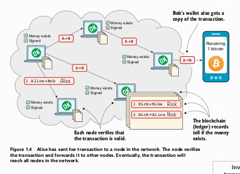
</p>

[Diagram penyebaran transaction Alice ke seluruh Bitcoin network. Setiap node memverifikasi dan meneruskannya ke node lain, termasuk ke wallet Bob. - Figure 1.4]

#### Langkah 3: The Blockchain

**Blockchain** adalah basis data atau buku besar (*ledger*) yang berisi catatan semua *transaction* yang pernah terjadi. Setiap *node* menyimpan salinan lengkap dari *blockchain* ini.

Masalahnya, *transaction* bisa sampai ke *nodes* yang berbeda dalam urutan yang berbeda pula. Jika setiap *node* langsung mencatat *transaction* begitu menerimanya, salinan *blockchain* di setiap *node* akan menjadi tidak sinkron dan kacau.

<p align="center">
  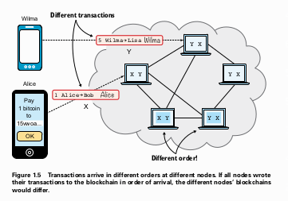
</p>

[Ilustrasi yang menunjukkan dua transaction berbeda (X dan Y) sampai di node-node yang berbeda dalam urutan yang berbeda, menyebabkan potensi ketidaksinkronan. - Figure 1.5]

Untuk mengatasi ini, sistem membutuhkan cara untuk menyepakati urutan *transaction* secara global. Solusinya adalah dengan mengelompokkan *transaction* ke dalam sebuah **block**. Secara periodik (sekitar setiap 10 menit), satu *node* akan mengambil peran sebagai pemimpin sementara. *Node* ini akan:
1.  Mengumpulkan *transaction-transaction* yang belum terkonfirmasi dari jaringan.
2.  Mengemasnya ke dalam sebuah *block* baru.
3.  Menyebarkan *block* ini ke seluruh jaringan.

Ketika *nodes* lain menerima *block* baru ini, mereka akan memverifikasinya dan menambahkannya ke ujung salinan *blockchain* mereka masing-masing. Dengan cara ini, semua *node* sepakat pada urutan *transaction* yang sama.

<p align="center">
  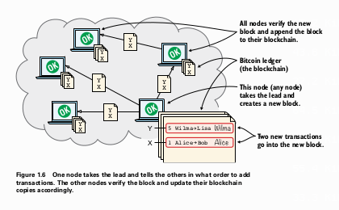
</p>

[Satu node mengambil inisiatif untuk membuat block baru berisi dua transaction, lalu menyebarkannya ke node lain yang kemudian memverifikasi dan menambahkannya ke blockchain mereka. - Figure 1.6]

Mengapa sebuah *node* mau melakukan pekerjaan ini? *Node* yang berhasil membuat *block* baru akan mendapatkan imbalan berupa bitcoin yang baru dibuat (disebut *block reward*) dan biaya *transaction* (*transaction fees*) dari *transaction* yang dimasukkannya ke dalam *block*. Proses ini disebut **mining**, dan *node* yang melakukannya disebut **miner**. Untuk bisa membuat *block*, seorang *miner* harus memecahkan teka-teki komputasi yang sangat sulit, yang membutuhkan banyak energi dan waktu. Inilah yang mencegah semua *node* membuat *block* secara bersamaan.

#### Langkah 4: Wallets

**Wallet** (dompet) adalah program perangkat lunak yang digunakan Alice dan Bob untuk berinteraksi dengan Bitcoin network. Selain untuk membuat dan mengirim *transaction*, fungsi utama *wallet* adalah:
* **Mengelola Kunci**: Menyimpan dan mengamankan *private keys* pengguna.
* **Memantau Dana**: Mengawasi *transaction* masuk dan keluar yang relevan dengan alamat-alamat di *wallet* tersebut.

Ketika *block* yang berisi *transaction* Alice ke Bob telah ditambahkan ke *blockchain* oleh *nodes* di jaringan, *node* yang terhubung dengan *wallet* Bob akan memberitahukan hal ini. *Wallet* Bob kemudian akan menampilkan pesan bahwa 1 BTC telah diterima dan terkonfirmasi, yang berarti dana tersebut kini menjadi miliknya secara permanen dan tidak dapat dibatalkan. *Wallet* Alice juga akan menerima notifikasi bahwa pembayarannya telah berhasil dikonfirmasi.

<p align="center">
  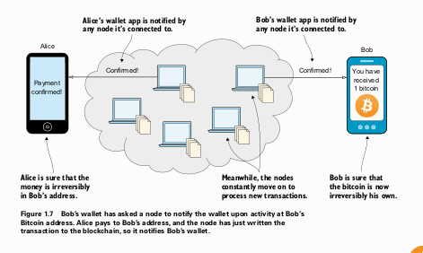
</p>

[Notifikasi konfirmasi pembayaran dikirim dari jaringan ke wallet Alice dan Bob, menandakan bahwa transaksi telah final. - Figure 1.7]

### Masalah dengan Uang Saat Ini

Bitcoin tidak akan populer jika tidak memecahkan masalah nyata. Bab ini menyoroti empat masalah utama dalam sistem keuangan tradisional.

#### Segregasi
Sekitar 38% populasi dunia tidak memiliki akses ke rekening bank. Tanpa layanan perbankan dasar, mereka kesulitan untuk berpartisipasi dalam ekonomi digital, memperluas bisnis, atau bahkan melakukan pembayaran tagihan sederhana secara efisien. Hal ini disebabkan oleh beberapa faktor, seperti biaya layanan yang mahal, persyaratan dokumen yang sulit dipenuhi, atau diskriminasi berdasarkan pandangan politik, etnis, dan lain-lain.

#### Masalah Privasi
Sistem pembayaran elektronik tradisional seperti kartu kredit atau transfer bank sangat terpusat. Hal ini memberikan kekuatan besar kepada negara atau perusahaan untuk:
* **Melacak (*Trace*)**: Memantau semua aktivitas keuangan Anda.
* **Menyensor (*Censor*)**: Memblokir pembayaran ke entitas tertentu (contoh: donasi ke WikiLeaks diblokir oleh Visa dan Mastercard).
* **Membekukan (*Freeze*)**: Menghentikan akses Anda ke dana Anda sendiri.
* **Menyita (*Seize*)**: Mengambil dana dari rekening Anda (contoh: penyitaan 47.5% simpanan di atas €100.000 di Siprus pada 2013).

<p align="center">
  
</p>

[Pihak ketiga seperti pemerintah dapat mengintervensi transaksi antara pembayar dan penerima dalam sistem terpusat. - Figure from page 40]

#### Inflasi
**Inflasi** adalah penurunan daya beli sebuah mata uang. Jika hari ini €1 bisa membeli tiga apel, karena inflasi, besok mungkin hanya bisa membeli dua apel. Pemerintah dapat mencetak uang untuk membiayai pengeluaran, yang jika berlebihan dapat menyebabkan **hiperinflasi**, di mana nilai uang anjlok secara drastis, menghancurkan tabungan masyarakat. Contoh ekstrem adalah Zimbabwe dan Venezuela.

<p align="center">
  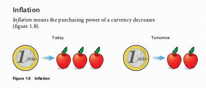
</p>

[Ilustrasi inflasi, di mana satu koin Euro hari ini bisa membeli tiga apel, tetapi besok hanya bisa membeli dua apel. - Figure 1.8]

#### Batasan Geografis (*Borders*)
Mengirim uang lintas negara menggunakan mata uang fiat seringkali lambat, mahal, dan rumit. Buku ini memberikan contoh pengiriman uang dari Swedia ke Filipina yang bisa memakan biaya antara 4.9% hingga 16.3%. Sebaliknya, transfer domestik biasanya jauh lebih mudah dan murah.

### Pendekatan Bitcoin

Bitcoin menawarkan solusi untuk masalah-masalah di atas melalui tiga karakteristik utamanya.

#### Desentralisasi (*Decentralized*)
Tidak seperti sistem terpusat (bank) di mana satu entitas memiliki kendali penuh, Bitcoin bersifat **desentralisasi**. Kendali didistribusikan ke ribuan *nodes* di seluruh dunia, di mana tidak ada satu pun *node* yang lebih superior dari yang lain.

<p align="center">
  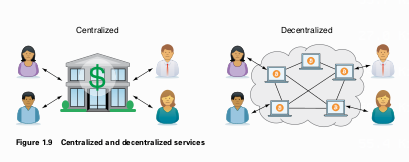
</p>

[Perbandingan antara sistem terpusat (semua terhubung ke bank) dan sistem terdesentralisasi (semua terhubung dalam jaringan peer-to-peer). - Figure 1.9]

Karakteristik ini membuat Bitcoin bersifat:
* **Tahan Sensor**: Tidak ada titik pusat yang bisa diserang untuk memblokir *transaction* atau menolak layanan kepada pengguna.
* **Tanpa Izin (*Permissionless*)**: Siapa pun bisa bergabung dan berpartisipasi dalam jaringan tanpa perlu meminta izin.
* **Sulit Diubah**: Aturan fundamental, seperti jumlah suplai, hampir tidak mungkin diubah tanpa konsensus luas dari seluruh jaringan.

#### Suplai Terbatas (*Limited Supply*)
Suplai bitcoin dibatasi secara matematis dan tidak akan pernah melebihi **21 juta BTC**. Suplai baru diciptakan melalui proses *mining* dengan laju yang telah ditentukan dan akan berkurang setengahnya setiap empat tahun (proses ini disebut *halving*) hingga berhenti total sekitar tahun 2140.

<p align="center">
  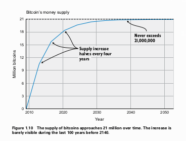
</p>

[Grafik suplai uang Bitcoin dari waktu ke waktu, menunjukkan kurva yang melandai dan mendekati batas 21 juta koin sekitar tahun 2140. - Figure 1.10]

Properti ini membuat Bitcoin tahan terhadap inflasi yang disebabkan oleh pencetakan uang sewenang-wenang.

#### Tanpa Batas (*Borderless*)
Karena berjalan di atas internet, Bitcoin bersifat global. Mengirim bitcoin ke seseorang di seberang benua sama mudahnya dan sama cepatnya dengan mengirim ke seseorang di ruangan yang sama. Setelah terkonfirmasi, *transaction* tidak dapat dibatalkan.

<p align="center">
  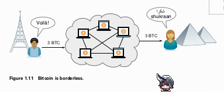
</p>

[Ilustrasi pengiriman Bitcoin dari seseorang di Paris ke seseorang di Mesir melalui jaringan Bitcoin global. - Figure 1.11]

### Bagaimana Bitcoin Digunakan?

Bab ini menguraikan beberapa kasus penggunaan umum Bitcoin saat ini.

* **Menabung (*Savings*)**: Anda dapat menyimpan kekayaan dengan mengamankan *private keys* Anda. Kunci ini bisa disimpan di kertas, perangkat keras khusus, atau bahkan dihafal, memberikan Anda kendali penuh atas dana Anda.
* **Pembayaran Lintas Batas (*Cross-border payments*)**: Bitcoin sering digunakan sebagai perantara untuk remitansi yang lebih murah dan cepat dibandingkan layanan tradisional.
* **Berbelanja (*Shopping*)**: Ideal untuk pembayaran online karena Anda tidak perlu memberikan informasi sensitif (seperti detail kartu kredit) kepada pedagang, sehingga lebih aman.
* **Spekulasi (*Speculation*)**: Volatilitas harga bitcoin menarik para spekulan yang mencoba membeli di harga rendah dan menjual di harga tinggi. Namun, ini lebih mirip lotere daripada investasi yang stabil.
* **Penggunaan Non-Mata Uang (*Noncurrency uses*)**:
  * **Bukti Kepemilikan (*Ownership*)**: Data kecil seperti nomor sasis mobil dapat disematkan dalam *transaction* untuk mencatat transfer kepemilikan secara publik dan dapat diverifikasi.
  * **Bukti Keberadaan (*Proof of existence*)**: "Sidik jari" digital (sebuah *hash*) dari sebuah dokumen dapat dicatat di *blockchain* untuk membuktikan bahwa dokumen tersebut sudah ada sebelum waktu tertentu.

### Kapan Sebaiknya Tidak Menggunakan Bitcoin?

Meskipun kuat, Bitcoin belum cocok untuk semua hal:
* **Pembayaran Sangat Kecil (*Tiny payments*)**: Biaya *transaction* bisa menjadi signifikan dibandingkan jumlah yang dikirim, membuatnya tidak ekonomis untuk pembayaran mikro.
* **Pembayaran Instan (*Instant payments*)**: Konfirmasi *transaction* membutuhkan waktu (sekitar 10-60 menit untuk dianggap aman), yang kurang ideal untuk transaksi tatap muka seperti membeli kopi.
* **Tabungan yang Tidak Boleh Hilang (*Savings you can't afford to lose*)**: Sebagai teknologi yang masih baru, Bitcoin memiliki risiko, seperti kehilangan *private key*, pencurian, tindakan keras pemerintah, volatilitas harga, atau bug perangkat lunak. **Anda bertanggung jawab penuh atas keamanan bitcoin Anda**.

### Mata Uang Kripto Lainnya (*Other Cryptocurrencies*)

Bitcoin bukanlah satu-satunya *cryptocurrency*. Ada banyak mata uang alternatif lain yang disebut **alt-coins**. Beberapa menawarkan fitur unik (misalnya, Ethereum untuk *smart contracts* atau Monero untuk privasi), sementara yang lain kurang inovatif atau bahkan penipuan.

Namun, Bitcoin memiliki keunggulan kuat yang disebut **network effect** (efek jaringan): nilainya meningkat karena lebih banyak orang yang menggunakannya. Membuat *cryptocurrency* baru sama seperti membuat internet baru yang terisolasi; sulit untuk menarik pengguna jika semua orang sudah berada di jaringan yang lebih besar dan mapan.

<p align="center">
  
</p>

[Perbandingan antara jaringan yang ramai (Internet, Bitcoin) dan jaringan yang sepi (Wownet, Wowcoin), mengilustrasikan network effect. - Figure 1.14]

### Ringkasan Bab 1

* Bitcoin adalah uang global tanpa batas yang bisa digunakan siapa saja dengan koneksi internet.
* Alur *transaction* melibatkan empat tahap: pengiriman, verifikasi jaringan, pencatatan di *blockchain*, dan notifikasi ke *wallet*.
* Bitcoin memecahkan masalah inflasi, batasan geografis, segregasi, dan privasi melalui suplai yang terbatas, desentralisasi, dan sifatnya yang tanpa batas.
* Ada banyak *cryptocurrency* alternatif, tetapi Bitcoin mendapat manfaat dari *network effect* yang kuat.

---

# Bab 2
## Fungsi Hash Kriptografis dan Tanda Tangan Digital

Bab ini memiliki dua tujuan utama. Pertama, memperkenalkan konsep fundamental **cryptographic hash functions**. Kedua, menjelaskan cara kerja **digital signatures** untuk mengautentikasi pembayaran. Untuk mempermudah pemahaman, buku ini memperkenalkan sebuah sistem pembayaran fiktif yang akan kita kembangkan bersama hingga menjadi seperti Bitcoin di bab-bab selanjutnya.

### Sistem Awal: *The Cookie Token Spreadsheet*

Bayangkan sebuah kafe di kantor Kita. Untuk membeli kue, para karyawan menggunakan *cookie tokens* (CT). Semua transaksi CT dicatat dalam sebuah *spreadsheet* yang dikelola oleh satu orang yang sangat dipercaya bernama Lisa.

* **Ledger**: *Spreadsheet* ini berfungsi sebagai buku besar (*ledger*). Setiap baris mencatat pengirim (`From`), penerima (`To`), dan jumlah (`Amount CT`).
* **Otoritas Terpusat**: Lisa memiliki akses tulis penuh ke *spreadsheet* ini. Karyawan lain hanya bisa melihatnya (*read-only*).
* **Proses Transaksi**: Ketika Alice ingin membeli kue seharga 10 CT, ia memberitahu Lisa. Lisa akan memeriksa saldo Alice dengan menjumlahkan semua CT yang diterima Alice dan menguranginya dengan semua CT yang telah ia kirimkan. Jika saldonya mencukupi, Lisa akan menambahkan baris baru di akhir *spreadsheet* untuk mencatat transfer 10 CT dari Alice ke Kafe.
* **Penciptaan Uang (Issuance)**: Semua CT diciptakan dari nol. Sebagai imbalan atas jasanya menjaga sistem, Lisa memberikan hadiah kepada dirinya sendiri sebanyak 7,200 CT baru setiap hari dengan menambahkan baris khusus di *spreadsheet*Sistem ini dirancang agar imbalan tersebut berkurang setengahnya setiap empat tahun, sehingga total suplai CT tidak akan pernah melebihi 21 juta Ini adalah analogi langsung dari proses *mining* dan *halving* di Bitcoin.

Sistem sederhana ini kita sebut sebagai *Cookie Tokens versi 1.0*. Sistem ini sepenuhnya bergantung pada kepercayaan terhadap Lisa dan kemampuannya untuk mengenali setiap karyawan.

<p align="center">
  
</p>

[Tampilan spreadsheet Cookie Token yang menunjukkan kolom Dari, Ke, dan Jumlah CT, dengan beberapa contoh transaksi seperti Alice membeli kue. - Figure 2.2]

Sistem ini memiliki beberapa kesamaan konsep dengan Bitcoin:

| Konsep di Cookie Tokens | Konsep di Bitcoin |
| :--- | :--- |
| 1 *cookie token* | 1 bitcoin |
| *Spreadsheet* | *The blockchain* |
| Satu baris di *spreadsheet* | Sebuah *transaction* |
| Lisa | Seorang *miner* |

### Cryptographic Hashes

**Cryptographic hash function** (fungsi *hash* kriptografis) adalah salah satu blok bangunan paling fundamental di Bitcoin Kita bisa menganggapnya sebagai "sidik jari" untuk data digital.

Sebuah fungsi *hash* mengambil data input dengan ukuran berapa pun (misalnya, gambar kucing berukuran 1.21 MB) dan menghasilkan output dengan ukuran tetap yang disebut **hash** (misalnya, 32-byte atau 256-bit). Di Bitcoin, fungsi *hash* yang paling umum digunakan adalah **SHA256**.

<p align="center">
  
</p>

[Diagram yang menunjukkan gambar seekor kucing sebagai input ke sebuah kotak berlabel "Cryptographic hash function", yang menghasilkan serangkaian angka dan huruf sepanjang 32-byte sebagai output. - Figure 2.6]

#### Properti Fungsi Hash Kriptografis

Fungsi *hash* yang aman secara kriptografis memiliki beberapa properti kunci:

1.  **Deterministik**: Input yang sama akan *selalu* menghasilkan *hash* yang sama.
2.  **Efek Longsor (*Avalanche Effect*)**: Perubahan sekecil apa pun pada input (misalnya, mengubah satu piksel pada gambar kucing) akan menghasilkan *hash* yang sama sekali berbeda dan tidak dapat diprediksi.
3.  **Ukuran Tetap**: *Hash* output selalu memiliki panjang yang sama, terlepas dari ukuran inputnya.
4.  **Satu Arah (*One-Way*)**: Sangat tidak mungkin (secara komputasi) untuk merekonstruksi data input asli hanya dari *hash* outputnya Untuk menemukan input yang menghasilkan *hash* tertentu, satu-satunya cara adalah dengan mencoba semua kemungkinan input satu per satu (*brute-force*), yang akan memakan waktu triliunan tahun.

Properti "satu arah" ini memiliki tiga aspek penting yang membuatnya aman:
* **Collision Resistance**: Sulit untuk menemukan dua input *berbeda* yang menghasilkan *hash* yang *sama*.
* **Pre-image Resistance**: Jika Kita memiliki sebuah *hash*, sulit untuk menemukan input asli yang menghasilkan *hash* tersebut.
* **Second-pre-image Resistance**: Jika Kita memiliki sebuah input dan *hash*-nya, sulit untuk menemukan input *lain* yang menghasilkan *hash* yang sama.

<p align="center">
  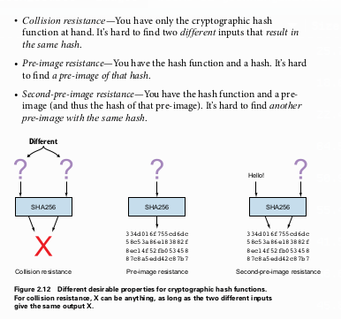
</p>

[Tiga diagram yang mengilustrasikan perbedaan antara Collision Resistance, Pre-image Resistance, dan Second-pre-image Resistance. - Figure 2.12]

Properti ini sangat berguna untuk **pemeriksaan integritas data**. Kita bisa menghitung *hash* dari sebuah file, menyimpannya, dan di kemudian hari menghitung ulang *hash* dari file tersebut. Jika kedua *hash* cocok, Kita bisa sangat yakin bahwa file tersebut tidak berubah sama sekali. Bitcoin sangat bergantung pada properti ini untuk memastikan integritas riwayat transaksinya.

---

### Digital Signatures

Masalah muncul ketika perusahaan berkembang dan Lisa tidak lagi bisa mengenali semua orang. Seorang penipu bernama Mallory bisa saja mengaku sebagai Anne dan meminta Lisa mentransfer CT milik Anne. Untuk mengatasi ini, sistem di-upgrade untuk menggunakan **digital signature** (tanda tangan digital).

**Digital signature** adalah padanan digital dari tanda tangan tulisan tangan. Namun, alih-alih terikat pada identitas seseorang, ia terikat pada sebuah angka rahasia yang disebut **private key** (kunci pribadi).

#### Proses Digital Signature

Proses ini melibatkan tiga pihak atau langkah:
1.  **Persiapan (*Preparation*)**: Pengguna (misalnya, John) membuat sepasang kunci yang terhubung secara matematis, yang disebut **key pair**.
    * **Private Key**: Sebuah angka acak yang sangat besar dan dirahasiakan. Kunci ini digunakan untuk *membuat* tanda tangan.
    * **Public Key**: Dihasilkan dari *private key* melalui fungsi matematika satu arah. Artinya, Kita bisa mendapatkan *public key* dari *private key*, tetapi tidak sebaliknya. Kunci ini bisa dibagikan secara bebas dan digunakan untuk *memverifikasi* tanda tangan yang dibuat oleh *private key* pasangannya.
    John kemudian memberikan *public key* miliknya kepada Lisa.

2.  **Penandatanganan (*Signing*)**: Ketika John ingin melakukan pembayaran, dia membuat pesan permintaan (misalnya, "Lisa, tolong pindahkan 10 CT ke Kafe. /John"). Kemudian, proses penandatanganan terjadi sebagai berikut:
    * Pesan tersebut di-*hash* menggunakan SHA256.
    * Hasil *hash* tersebut dienkripsi menggunakan *private key* milik John.
    * Hasil enkripsi inilah yang menjadi **digital signature**.
   John lalu mengirimkan pesan asli beserta *digital signature*-nya kepada Lisa.

<p align="center">
  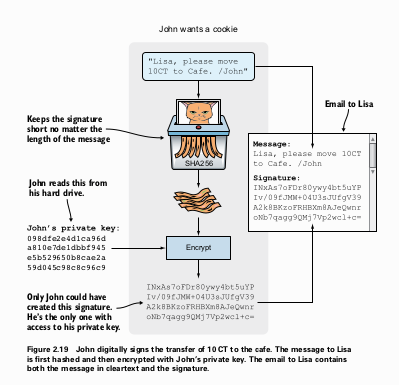
</p>

[Proses penandatanganan oleh John, di mana pesan di-hash dengan SHA256, kemudian dienkripsi dengan private key milik John untuk menghasilkan signature. - Figure 2.19]

3.  **Verifikasi (*Verification*)**: Lisa menerima pesan dan *signature* dari John. Untuk memverifikasinya:
    * Lisa mengambil pesan asli dan menghitung *hash*-nya sendiri.
    * Lisa mengambil *digital signature* dan mendekripsinya menggunakan *public key* milik John yang sebelumnya ia simpan. Hasil dekripsi ini adalah *hash* asli yang dihitung oleh John.
    * Lisa membandingkan kedua *hash* tersebut. Jika cocok, berarti pesan itu otentik, tidak diubah, dan benar-benar ditandatangani oleh pemilik *private key* yang sesuai dengan *public key* John.
    
<p align="center">
  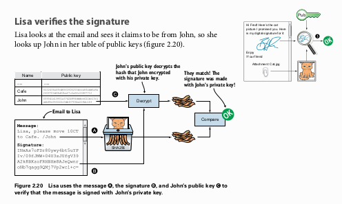
</p>

[Proses verifikasi oleh Lisa. Dia menghitung hash dari pesan dan membandingkannya dengan hash yang didapat dari mendekripsi signature menggunakan public key John. - Figure 2.20]

Dengan sistem ini, Mallory tidak bisa lagi menipu Lisa, karena ia tidak memiliki *private key* milik Anne untuk membuat *signature* yang valid. Sistem ini kita sebut *Cookie Tokens versi 2.0*.

#### Keamanan Private Key

Keamanan dana sekarang sepenuhnya berada di tangan pemilik *private key*. Jika *private key* John dicuri, pencuri tersebut dapat membuat *signature* yang valid dan menguras seluruh CT milik John. Buku ini menceritakan skenario di mana Mallory berhasil mencuri *private key* John dari laptopnya dan menggunakannya untuk mentransfer dana John ke alamat baru miliknya ("Melissa").

Lisa menolak untuk membatalkan transaksi tersebut karena dari sudut pandangnya, transaksi itu memiliki *signature* yang valid. Ini menekankan bahwa **pengguna bertanggung jawab penuh atas keamanan *private key* mereka**.

Ada berbagai strategi untuk menyimpan *private key*, yang merupakan kompromi antara keamanan dan kenyamanan:
* **Online vs. Offline**: Menyimpan kunci di perangkat yang terhubung internet (online) lebih berisiko terhadap peretasan jarak jauh dibandingkan menyimpannya di perangkat yang tidak terhubung (offline).
* **Teks Biasa vs. Terenkripsi (*Cleartext vs. Encrypted*)**: Menyimpan kunci dalam file terenkripsi yang dilindungi kata sandi jauh lebih aman daripada menyimpannya sebagai teks biasa.
* **Kunci Utuh vs. Terpisah (*Whole Key vs. Split Key*)**: Memecah kunci menjadi beberapa bagian dan menyimpannya di lokasi terpisah meningkatkan keamanan secara signifikan tetapi mengurangi kenyamanan.

<p align="center">
  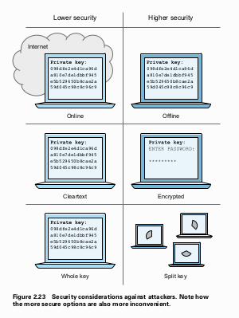
</p>

[Tiga perbandingan skema keamanan private key: online vs offline, cleartext vs encrypted, dan whole key vs split key, menunjukkan trade-off antara keamanan yang lebih rendah/tinggi. - Figure 2.23]

### Ringkasan Bab 2
* Bitcoin baru (atau *cookie tokens*) diciptakan sebagai imbalan bagi *node* yang mengamankan *blockchain* (atau *spreadsheet*), dengan suplai yang terbatas karena adanya mekanisme *halving*.
* *Cryptographic hash functions* digunakan untuk memastikan integritas data dan bersifat satu arah, sehingga mustahil untuk merekayasa input dari outputnya.
* *Digital signatures* digunakan untuk membuktikan otentisitas pembayaran. *Private key* digunakan untuk membuat *signature*, dan *public key* digunakan untuk memverifikasinya.
* Keamanan dana pengguna sepenuhnya bergantung pada kemampuannya untuk menjaga kerahasiaan *private key* miliknya.

---

# Bab 3
## Alamat (Addresses)

**Tujuan Bab Ini:**
Bab ini akan menjelaskan evolusi dari penggunaan nama asli ke penggunaan alamat Bitcoin yang lebih anonim dan aman. Kita akan belajar:

* Bagaimana mengganti nama dengan *public key hash* untuk meningkatkan privasi dasar.
* Bagaimana melindungi diri dari kesalahan ketik yang bisa menyebabkan kehilangan dana secara permanen.

Pada akhir bab ini, sistem *spreadsheet cookie token* kita tidak akan lagi menggunakan nama orang, melainkan *hash* dari *public key*. Ini adalah langkah besar untuk membuatnya lebih mirip dengan cara kerja Bitcoin yang sebenarnya.

#### **1. Kebiasaan Makan Cookie Terungkap (Cookie-eating habits disclosed)**

**Masalah Awal: Kurangnya Privasi**

Sistem *spreadsheet* yang kita gunakan sejauh ini memiliki kelemahan besar: semua transaksi dicatat menggunakan nama asli.

<p align="center">
  
</p>

* **Gambar 3.2: Acme Insurances mengawasi kebiasaan makan cookie Chloe.**

  * Gambar ini menunjukkan bagaimana sebuah pihak ketiga (misalnya, perusahaan asuransi bernama Acme) bisa mendapatkan salinan *spreadsheet* tersebut.
  * Dengan hanya melakukan pencarian sederhana untuk nama "Chloe", perusahaan tersebut dapat melihat seluruh riwayat transaksinya. Mereka bisa tahu seberapa sering Chloe membeli cookie, berapa banyak yang dia beli, dan dari siapa dia menerima token.
  * Informasi ini bisa disalahgunakan, misalnya untuk menaikkan premi asuransi Chloe dengan asumsi dia memiliki gaya hidup yang tidak sehat.

Masalah ini tidak hanya berlaku untuk pihak ketiga. Setiap rekan kerja yang memiliki akses baca ke *spreadsheet* juga bisa dengan mudah melihat saldo dan riwayat transaksi semua orang. Ini menciptakan masalah privasi yang serius. Menanggapi hal ini, para rekan kerja meminta Lisa (administrator sistem dalam contoh kita) untuk mencari solusi.

#### **2. Mengganti Nama dengan Kunci Publik (Replacing names with public keys)**

**Solusi Pertama: Menggunakan Kunci Publik**

Lisa, yang sudah lelah mengelola daftar nama dan *public key* yang terhubung, mengusulkan ide untuk meningkatkan privasi dan menyederhanakan pekerjaannya.

<p align="center">
  
</p>

* **Gambar 3.3: Mengganti nama dengan kunci publik.**

  * Gambar ini mengilustrasikan perubahan pada *spreadsheet*. Kolom "From" (Dari) dan "To" (Ke) tidak lagi berisi nama seperti "Alice" atau "Cafe", melainkan *public key* lengkap mereka yang terdiri dari 66 karakter heksadesimal (33 byte).
  * Sekarang, *spreadsheet* menjadi jauh lebih sulit dibaca. Tanpa mengetahui *public key* milik Chloe, Acme Insurances tidak bisa lagi melacak transaksinya dengan mudah.

**Proses Pembayaran yang Baru**

Dengan perubahan ini, proses pembayaran juga berubah. Pengguna tidak lagi menggunakan nama.

<p align="center">
  
</p>

* **Gambar 3.4: Gaya pembayaran baru menggunakan kunci publik, bukan nama.**

  * Ketika John ingin membayar, pesan yang dia kirim ke Lisa tidak lagi berbunyi, "Lisa, tolong pindahkan 10 CT ke Cafe. /John".
  * Pesan barunya sekarang berisi:

    1. *Public key* pengirim.
    2. *Public key* penerima.
    3. Jumlah yang ditransfer.
  * Pesan ini kemudian ditandatangani secara digital menggunakan *private key* yang sesuai dengan *public key* pengirim.
  
<p align="center">
  
</p>

* **Gambar 3.5: Faiza (rekan kerja baru) menerima hadiah dari perusahaan.**

  * **Persiapan:** Faiza membuat *key pair* (*private key* dan *public key*). Dia menyimpan *private key* miliknya dengan aman.
  * **Berbagi Informasi:** Faiza memberikan **hanya *public key*-nya** kepada pihak yang akan membayarnya (perusahaan), **bukan kepada Lisa**. Ini penting karena Lisa tidak lagi perlu memelihara tabel nama dan *public key*.
  * **Proses Transaksi:** Perusahaan membuat pesan untuk memindahkan 100 CT dari *public key* mereka ke *public key* Faiza. Pesan ini ditandatangani dengan *private key* perusahaan dan dikirim ke Lisa.
  * **Verifikasi oleh Lisa:** Lisa melakukan verifikasi:

    1. Dia menggunakan *public key* pengirim (yang ada di dalam pesan) untuk memverifikasi tanda tangan digital.
    2. Dia memeriksa *spreadsheet* untuk memastikan *public key* pengirim memiliki saldo yang cukup.
    3. Lisa tidak perlu tahu siapa pemilik *public key* penerima. Selama pengirim sah dan memiliki cukup dana, dia akan mencatat transaksi tersebut.

Perubahan ini membuat sistem menjadi **pseudonim**. Identitas tidak lagi terikat pada nama, tetapi pada *public key*.

#### **3. Memperpendek Kunci Publik (Shortening the public key)**

**Masalah Baru: Ukuran Data**

Meskipun privasi meningkat, muncul masalah baru. *Public key* berukuran 33 byte, jauh lebih besar daripada nama seperti "John" yang hanya 4 byte. Hal ini membuat ukuran *spreadsheet* membengkak, memperlambat proses unduh bagi pengguna dan memakan lebih banyak ruang penyimpanan di komputer Lisa.

**Solusi Kedua: Hashing Kunci Publik menjadi 20 byte**

Para developer mengusulkan untuk mengganti *public key* dengan *hash* kriptografis dari *public key* tersebut. Proses ini tidak hanya memperpendek data tetapi juga menambahkan lapisan keamanan ekstra.

<p align="center">
  
</p>

* **Gambar 3.6: Mengganti kunci publik dengan hash RIPEMD160 dari hash SHA256 kunci publik.**

  * Prosesnya adalah sebagai berikut:

    1. Ambil *public key* (33 byte).
    2. Lakukan *hashing* menggunakan fungsi **SHA256**. Hasilnya adalah *hash* sepanjang 32 byte.
    3. Ambil hasil dari SHA256 tersebut, lalu lakukan *hashing* sekali lagi menggunakan fungsi **RIPEMD160**. Hasilnya adalah *hash* sepanjang 20 byte (160 bit).
  * Hasil akhir ini disebut **Public Key Hash (PKH)**.

> **Istilah Teknis:**
>
> * **Public Key Hash (PKH):** Ini adalah "sidik jari" dari sebuah *public key*. Ini adalah representasi yang lebih pendek dari *public key* yang dihasilkan melalui serangkaian fungsi *hash* (di Bitcoin, `RIPEMD160(SHA256(public_key))`). Tujuannya adalah untuk memperpendek alamat dan menambahkan lapisan keamanan.

Sekarang, *spreadsheet* menggunakan PKH yang hanya 20 byte, yang jauh lebih efisien daripada *public key* 33 byte.

**Proses Pembayaran Menggunakan PKH**

<p align="center">
  
</p>

* **Gambar 3.7: John membeli cookie menggunakan PKH.**

  * Pesan yang dikirim John ke Lisa sekarang sedikit berbeda:

    * **Penerima (To):** adalah **PKH** milik Cafe.
    * **Pengirim (From):** tetap menggunakan **Public Key** milik John, bukan PKH-nya.
  * Mengapa pengirim masih menggunakan *public key*? Karena Lisa (atau siapapun yang memverifikasi) masih membutuhkan *public key* asli untuk memverifikasi tanda tangan digital.
  * Setelah menerima pesan, Lisa akan:

    1. Mengambil *public key* pengirim dari pesan.
    2. Menghitung PKH dari *public key* tersebut (`RIPEMD160(SHA256(public_key))`).
    3. Menggunakan PKH yang baru dihitung ini untuk memeriksa saldo pengirim di *spreadsheet*.
    4. Jika semua valid, dia mencatat transaksi baru, dengan PKH pengirim di kolom "From" dan PKH penerima di kolom "To".

#### **4. Mengapa Menggunakan SHA256 dan RIPEMD160?**

Menggunakan dua fungsi *hash* yang berbeda dan berurutan adalah pilihan desain yang disengaja untuk keamanan berlapis:

1. **Keamanan Ekstra:** Jika suatu saat salah satu dari fungsi *hash* ini (misalnya SHA256) ditemukan memiliki kelemahan (*vulnerability*) sehingga bisa direkayasa balik (*pre-image attack*), *public key* masih dilindungi oleh fungsi *hash* kedua (RIPEMD160). Seorang penyerang harus memecahkan keduanya untuk bisa mendapatkan *public key* dari PKH, yang secara eksponensial lebih sulit.
2. **Perbedaan Pengembang:** SHA256 dikembangkan oleh NSA (National Security Agency) AS, sementara RIPEMD160 dikembangkan oleh komunitas akademik di Eropa. Menggunakan keduanya mengurangi risiko adanya *backdoor* tersembunyi dari satu pihak pengembang.

#### **5. Menghindari Kesalahan Ketik yang Mahal (Avoiding expensive typing errors)**

**Masalah Kritis: Kesalahan Manusia**

Sistem yang sekarang menggunakan PKH (string heksadesimal 20 byte) sangat rentan terhadap kesalahan ketik.

<p align="center">
  
</p>

* **Gambar 3.8: John salah ketik saat memasukkan PKH penerima.**

  * John ingin membayar Cafe, tetapi dia salah mengetik satu karakter terakhir dari PKH Cafe (misalnya, mengetik `d` padahal seharusnya `c`).
  * Dia menandatangani pesan tersebut dan mengirimkannya ke Lisa.
  * Lisa memverifikasi tanda tangan dan saldo pengirim. Semuanya valid. Dia tidak peduli dan tidak bisa memeriksa apakah PKH penerima itu benar atau tidak. Dia hanya mencatat transaksi sesuai permintaan.
  * Akibatnya, 10 CT milik John dikirim ke sebuah PKH yang tidak memiliki *private key* yang sesuai. Tidak ada seorang pun di dunia yang bisa menggunakan dana tersebut. Uang itu **terbakar secara digital** (*digitally burned*) dan hilang selamanya.

Ini adalah masalah kegunaan dan keamanan yang sangat serius. Perlu ada cara untuk mendeteksi kesalahan ketik sebelum transaksi dikirim.

**Solusi Ketiga: Base58check**

Untuk mengatasi masalah ini, diperkenalkan konsep **Alamat Cookie Token** (di dunia nyata, ini adalah **Alamat Bitcoin**). Alamat ini adalah representasi dari PKH yang dirancang agar lebih ramah manusia dan memiliki mekanisme pendeteksi kesalahan. Proses konversi dari PKH ke alamat ini disebut **Base58check**.

<p align="center">
  
</p>

lalu

<p align="center">
  
</p>

* **Gambar 3.10 & 3.12: Gambaran umum encoding Base58check.**

  * Proses ini mengubah PKH (byte mentah) menjadi sebuah string alamat yang bisa dibaca (contoh: `19g6oo8f...gCenRBPD`).
  * Yang terpenting, proses ini bisa dibalik (*decoding*) untuk mendapatkan kembali PKH asli, dan selama proses *decoding*, ia akan memeriksa integritas alamat untuk memastikan tidak ada salah ketik.

**Proses Encoding Base58check**

<p align="center">
  
</p>

* **Gambar 3.13: Proses encoding Base58check pada PKH John.**
  Proses ini terdiri dari beberapa langkah:

  1. **Tambahkan Versi (Version Byte):** Sebuah byte versi ditambahkan di awal PKH. Untuk alamat P2PKH (Pay-to-Public-Key-Hash) di Bitcoin, byte versinya adalah `0x00`. Ini berguna untuk membedakan jenis-jenis alamat di masa depan.
  2. **Buat Checksum:** Sebuah *checksum* ditambahkan untuk mendeteksi kesalahan.

     * Ambil PKH yang sudah diberi versi.
     * Lakukan *hashing* dua kali dengan SHA256: `checksum_data = SHA256(SHA256(versioned_PKH))`.
     * Ambil **4 byte pertama** dari `checksum_data`. Inilah *checksum*-nya.
  3. **Gabungkan:** Tempelkan *checksum* 4 byte tersebut di akhir PKH yang sudah diberi versi. Sekarang kita punya data sepanjang 25 byte (1 byte versi + 20 byte PKH + 4 byte checksum).
  4. **Encode dengan Base58:** Ubah data 25 byte tersebut menjadi string menggunakan skema *encoding* Base58.

> **Istilah Teknis:**
>
> * **Checksum:** Sejumlah kecil data yang dihitung dari blok data yang lebih besar. Tujuannya adalah untuk mendeteksi kesalahan yang mungkin terjadi saat transmisi atau penyimpanan. Jika data utama sedikit saja berubah, *checksum* yang dihitung ulang tidak akan cocok dengan *checksum* asli.
> * **Base58:** Skema *encoding* yang menggunakan 58 karakter alfanumerik. Karakter yang ambigu secara visual dihilangkan untuk mengurangi kesalahan ketik (misalnya, `0` (nol), `O` (huruf O besar), `I` (huruf I besar), dan `l` (huruf l kecil)).

**Proses Decoding Base58check (dan Verifikasi)**

<p align="center">
  
</p>

lalu

<p align="center">
  
</p>

* **Gambar 3.11 & 3.15: Faiza membayar ke alamat John.**
  Ketika Faiza ingin membayar John, *wallet*-nya akan melakukan proses sebaliknya:

  1. Ambil alamat Base58check (misalnya, dari QR code).
  2. Lakukan *decode* dari Base58 kembali menjadi data 25 byte.
  3. Pisahkan data 25 byte tersebut menjadi tiga bagian:

     * Byte pertama: Versi.
     * 20 byte berikutnya: PKH.
     * 4 byte terakhir: *Checksum* yang diterima.
  4. **Verifikasi:** Ambil bagian versi dan PKH, lalu hitung ulang *checksum*-nya dengan `SHA256(SHA256(versioned_PKH))`.
  5. Bandingkan 4 byte pertama dari *checksum* yang baru dihitung dengan *checksum* yang diterima.

     * **Jika cocok:** Alamat tersebut valid. *Wallet* bisa melanjutkan untuk membuat transaksi menggunakan PKH yang diekstrak.
     * **Jika tidak cocok:** Alamat tersebut salah ketik. *Wallet* akan menampilkan pesan kesalahan dan mencegah pengiriman dana, sehingga uang tidak hilang.

Peluang sebuah kesalahan ketik menghasilkan alamat yang valid secara kebetulan sangat kecil, sekitar 1 banding 4.3 miliar. Ini membuat sistem menjadi sangat aman dari kesalahan manusia.

#### **6. Kembali ke Privasi (Back to privacy)**

Meskipun PKH dan alamat meningkatkan privasi dengan menghilangkan nama, masalah dasarnya tetap ada jika pengguna terus-menerus menggunakan alamat yang sama. Acme Insurances masih bisa mengidentifikasi bahwa semua pembayaran ke `19g6oo8f...` berasal dari satu entitas (misalnya Cafe). Jika mereka tahu satu saja transaksi milik John, mereka bisa menghubungkan semua transaksi lain yang menggunakan alamat yang sama.

**Solusi Terbaik:** Gunakan alamat baru untuk setiap transaksi yang diterima. *Wallet* modern (seperti yang nanti dibahas di Bab 4) akan mengelola pembuatan dan penyimpanan banyak alamat ini secara otomatis, sehingga sangat meningkatkan privasi pengguna.

### **Ringkasan Bab 3**

Bab ini membawa kita melalui evolusi penting dalam sistem pembayaran kita untuk membuatnya lebih mirip Bitcoin:

1. **Masalah:** Menggunakan nama asli di *spreadsheet* sangat buruk untuk privasi.

   * **Solusi:** Ganti nama dengan **kunci publik**.
2. **Masalah:** *Public key* terlalu panjang dan tidak efisien.

   * **Solusi:** Ganti *public key* dengan **Public Key Hash (PKH)** yang lebih pendek (20 byte) yang dibuat dengan `RIPEMD160(SHA256(public_key))`.
3. **Masalah:** PKH rentan terhadap kesalahan ketik yang menyebabkan dana hilang selamanya.

   * **Solusi:** Gunakan **Alamat (Address)** yang di-*encode* dengan **Base58check**. Alamat ini memiliki *checksum* internal untuk mendeteksi dan mencegah kesalahan ketik.

Sekarang, sistem kita jauh lebih privat, efisien, dan aman dari kesalahan pengguna. Kita siap untuk melanjutkan ke bab berikutnya yang akan membahas bagaimana *wallet* mengelola semua ini untuk kita.

---

# Bab 4
## Wallets

Sejauh ini, interaksi dengan sistem *cookie token* masih sangat manual dan rumit bagi pengguna. Mereka harus membuat *private key*, mengelola *public key*, dan menyusun email secara manual kepada Lisa untuk setiap transaksi. Selain itu, untuk menjaga privasi, pengguna disarankan menggunakan alamat yang berbeda untuk setiap pembayaran, yang semakin menambah kerumitan. Bab ini memperkenalkan solusi untuk masalah-masalah ini dalam bentuk aplikasi seluler yang disebut **`wallet`** (dompet).

Tujuan utama dari `wallet` adalah untuk mengotomatisasi tugas-tugas umum, mengelola *key* dengan aman, dan yang terpenting, menyederhanakan proses *backup*. Kita akan membahas evolusi `wallet`, mulai dari versi sederhana hingga implementasi canggih yang disebut **Hierarchical Deterministic (`HD`) Wallets**, yang menjadi standar industri saat ini.

### Versi Pertama Wallet

Sebuah tim pengembang di kantor memutuskan untuk membangun aplikasi seluler, yaitu `wallet`, untuk mempermudah hidup rekan-rekan mereka.

> Perlu dipahami, istilah `wallet` di dunia Bitcoin sebenarnya kurang tepat. Aplikasi ini tidak benar-benar "menyimpan" uang Kita. Uang Kita (catatan kepemilikan) ada di dalam *blockchain* (atau dalam analogi kita, *spreadsheet*). `Wallet` lebih mirip seperti **gantungan kunci (`keyring`)** yang menyimpan dan mengelola *private key* yang Kita butuhkan untuk membelanjakan uang Kita. Namun, karena istilah `wallet` sudah sangat umum, kita akan tetap menggunakannya.

`Wallet` versi pertama ini dirancang untuk menangani beberapa tugas krusial:
* **Membuat Alamat Baru**: Pengguna dapat dengan mudah membuat alamat baru untuk setiap transaksi demi privasi.
* **Mengelola Private Key**: Untuk setiap alamat yang dibuat, `wallet` akan menyimpan dan mengelola *private key* yang bersangkutan dengan aman.
* **Mentransfer Detail Pembayaran**: Proses transfer detail pembayaran dari penerima ke pembayar dipermudah. Alih-alih mengetik alamat yang panjang, `wallet` dapat menggunakan **QR code**.
* **Melakukan Pembayaran**: Aplikasi ini secara otomatis menyusun dan mengirim email yang berisi transaksi yang sudah ditandatangani secara digital ke Lisa.
* **Melacak Dana**: `Wallet` membaca *spreadsheet* dan menampilkan total saldo *cookie token* yang dimiliki pengguna.
* **Backup Private Key**: Menyediakan fasilitas untuk mencadangkan *private key* jika ponsel hilang atau rusak.

#### Alur Pembayaran Menggunakan Wallet

Mari kita lihat skenario di mana John ingin membeli kue dari kafe, di mana keduanya kini menggunakan aplikasi `wallet`.

<p align="center">
  
</p>

[Ilustrasi alur pembayaran menggunakan aplikasi wallet di ponsel, dari pemindaian QR code hingga email otomatis terkirim ke Lisa dan spreadsheet diperbarui. - Figure 4.2]

Prosesnya berjalan sebagai berikut:
1.  **Kafe Meminta Pembayaran**: `Wallet` kafe membuat alamat baru dan menampilkan detail pembayaran (alamat dan jumlah 10 CT) dalam bentuk **QR code** di layar. QR code ini berisi **payment URI** (*Uniform Resource Identifier*), sebuah format standar untuk detail pembayaran. Contohnya: `ct:19UzNFW...VtN?amount=10`.
    > Di Bitcoin, ini distandarisasi dalam **BIP21**, dan URI-nya dimulai dengan `bitcoin:`.
2.  **John Memindai (Scan)**: John menggunakan kamera ponselnya untuk memindai QR code tersebut. `Wallet`-nya secara otomatis membaca alamat tujuan dan jumlah yang harus dibayar.
3.  **Konfirmasi**: `Wallet` John menampilkan detail pembayaran untuk dikonfirmasi. John memeriksa informasinya dan menekan "OK".
4.  **Otomatisasi Latar Belakang**: `Wallet` John secara otomatis melakukan beberapa hal:
    * Memilih salah satu *key* miliknya yang memiliki saldo cukup (misalnya, ia memiliki tiga *key* dengan saldo 80 CT, 30 CT, dan 0 CT; `wallet` akan memilih salah satu dari dua yang pertama).
    * Membuat transaksi, menandatanganinya dengan *private key* yang sesuai.
    * Mengirim email berisi transaksi yang sudah ditandatangani ke Lisa.

Dari sisi Lisa, tidak ada yang berubah. Ia menerima email seperti biasa, memverifikasi transaksi, dan menambahkannya ke *spreadsheet*.

`Wallet` juga terus memantau *spreadsheet*. Ketika transaksi John dikonfirmasi oleh Lisa, `wallet` John akan memperbarui saldonya dan menampilkan notifikasi "Terkirim", sementara `wallet` kafe akan menampilkan "Diterima".

> **Transaksi yang Belum Dikonfirmasi (`Unconfirmed Transaction`)**: `Wallet` yang baik tidak akan memperbarui saldo final sebelum transaksi tersebut benar-benar tercatat di *spreadsheet* (atau *blockchain*). Transaksi yang sudah dikirim tetapi belum dicatat oleh miner disebut *unconfirmed transaction* atau **0-conf transaction**. Mengandalkannya berisiko karena ada kemungkinan transaksi tersebut tidak pernah dikonfirmasi.

---

### Backup Private Key

Kehilangan akses ke *private key* berarti kehilangan uang Kita selamanya. Oleh karena itu, *backup* adalah fitur yang mutlak diperlukan.

#### Metode Awal yang Bermasalah
Versi awal `wallet` menawarkan fitur *backup* dengan mengirimkan sebuah file teks berisi semua *private key* ke alamat email pengguna.

<p align="center">
  
</p>

[Ilustrasi proses backup private key dari wallet ke file teks yang dikirim melalui email. - Figure 4.5]

Metode ini memiliki dua kelemahan besar:
1.  **Risiko Keamanan**: Mengirim *private key* dalam bentuk teks biasa melalui email sangatlah berisiko. Siapa pun yang memiliki akses ke server email atau lalu lintas jaringan dapat mencuri *key* tersebut.
2.  **Backup yang Berlebihan**: *Backup* ini hanya mencakup *key* yang ada pada saat itu. Setiap kali pengguna membuat alamat baru, mereka harus melakukan *backup* ulang. Hal ini sangat tidak praktis dan membuat pengguna malas melakukannya.

#### Solusi: Backup Terenkripsi
Untuk mengatasi masalah keamanan, `wallet` diperbarui untuk mengenkripsi file *backup* dengan *password* yang dimasukkan oleh pengguna.

<p align="center">
  
</p>

[Ilustrasi proses backup private key yang dienkripsi dengan password sebelum dikirim. - Figure 4.6]

Jika ponsel John hilang, ia dapat memulihkan *key*-nya di ponsel baru dengan mengimpor file *backup* dan memasukkan *password* yang benar. Ini jauh lebih aman. Namun, ini masih belum menyelesaikan masalah keharusan untuk terus-menerus melakukan *backup*. Selain itu, metode ini memunculkan masalah baru.

#### Kekuatan Password dan Entropy
Kekuatan sebuah *password* diukur dalam **entropy**, yang pada dasarnya adalah tingkat ketidakpastian atau keacakan. Entropy diukur dalam bit.
* Sebuah lemparan koin memiliki 1 bit entropy.
* Sebuah *password* 8 karakter acak yang dipilih dari 64 karakter (`A-Z`, `a-z`, `0-9`, `+/`) memiliki `8 * 6 = 48` bit entropy (karena 2^6 = 64).
* Sebuah *passphrase* yang terdiri dari 5 kata acak yang dipilih dari daftar 2048 kata memiliki `5 * 11 = 55` bit entropy (karena 2^11 = 2048).

Masalahnya adalah, manusia sangat buruk dalam membuat sesuatu yang benar-benar acak. *Password* seperti `j0Hn4321` memiliki entropy yang jauh lebih rendah daripada yang terlihat karena penyerang menggunakan serangan kamus (*dictionary attack*) yang mencoba kombinasi nama, kata umum, dan pola angka yang sering digunakan.

#### Masalah dengan Backup Terenkripsi-Password
Meskipun lebih baik, pendekatan ini masih memiliki kelemahan:
* **Banyak Hal yang Harus Diamankan**: Pengguna kini harus menjaga keamanan file *backup* DAN mengingat *password*-nya.
* **Lupa Password**: *Password* yang jarang digunakan sangat rentan untuk dilupakan.
* **Perkembangan Teknologi**: Kekuatan komputasi terus meningkat. *Password* yang aman lima tahun lalu mungkin mudah dipecahkan hari ini.
* **Kesulitan Membuat Keacakan**: Pengguna cenderung memilih *password* yang mudah diingat (dan mudah ditebak).

Jelas, diperlukan solusi *backup* yang lebih fundamental dan lebih sederhana.

---

### Hierarchical Deterministic (HD) Wallets

Di sinilah sebuah terobosan besar terjadi. Para pengembang menyadari bahwa jika semua *private key* bisa dihasilkan secara deterministik (dapat diprediksi) dari satu nomor acak utama, maka pengguna hanya perlu melakukan **satu kali backup** untuk nomor acak tersebut. Nomor acak utama ini disebut **seed**.

<p align="center">
  
</p>

[Ilustrasi backup yang ideal, yaitu hanya mencadangkan satu seed saja. - Figure 4.7]

Konsep ini diimplementasikan dalam **Hierarchical Deterministic (`HD`) Wallets**, yang distandarisasi dalam **BIP32**. `HD wallet` mengorganisir *key* dalam struktur pohon (*tree*).

<p align="center">
  
</p>

[Diagram pohon yang menunjukkan struktur key dalam HD wallet, dari master key hingga akun belanja dan tabungan, serta alamat individual. - Figure 4.8]

* **Master Private Key (`m`)**: Akar dari semua *key*. Dihasilkan dari *seed*.
* **Child Keys**: Setiap *key* dapat memiliki banyak "anak" *key*.
* **Path (Jalur)**: Setiap *key* dalam pohon dapat diidentifikasi secara unik melalui jalurnya. Contoh: `m/1/0` berarti *child key* ke-0 dari *child key* ke-1 dari *master key*.
    > Standar umum seperti **BIP44** mendefinisikan struktur jalur ini untuk berbagai tujuan (misalnya, `m/44'/0'/0'/0` untuk menerima alamat Bitcoin).

#### Proses Derivasi Key
Proses pembuatan pohon *key* ini melibatkan tiga langkah utama:
1.  **Membuat Random Seed**: Sebuah *seed* acak (misalnya, 128 bit) dibuat. Ini adalah satu-satunya bagian yang benar-benar acak.
2.  **Menderivasi Master Extended Private Key (`xprv`)**: *Seed* digunakan untuk membuat *key* utama.
3.  **Menderivasi Child Extended Private Keys**: *Key* turunan dibuat dari *master key* dan seterusnya.

#### Extended Private Key (`xprv`)
Sebuah **`xprv`** (kependekan dari *extended private key*) adalah sebuah paket data yang berisi dua komponen:
1.  **Private Key (256 bit)**: Sama seperti *private key* biasa.
2.  **Chain Code (256 bit)**: Sepotong data acak tambahan yang berfungsi sebagai "garam" atau *entropy* tambahan untuk memastikan bahwa derivasi *child key* dari *parent key* yang sama akan menghasilkan *child key* yang berbeda dan tidak dapat diprediksi.

<p align="center">
  
</p>

[Diagram yang menunjukkan sebuah xprv terdiri dari private key dan chain code. - Figure 4.10]

**Langkah 1: Menderivasi Master `xprv`**
*Master `xprv`* dibuat dengan melewatkan *random seed* melalui fungsi hash **HMAC-SHA512**. *Output* hash 512-bit ini kemudian dibagi dua:
* **256 bit pertama** menjadi **master private key**.
* **256 bit terakhir** menjadi **master chain code**.

<p align="center">
  
</p>

[Proses derivasi master xprv dari sebuah seed menggunakan HMAC-SHA512, yang hasilnya dibagi dua menjadi private key dan chain code. - Figure 4.11]

**Langkah 2: Menderivasi Child `xprv`**
Untuk menderivasi sebuah *child `xprv`* (misalnya `m/1`) dari *parent `xprv`* (`m`), prosesnya sedikit berbeda dan sangat cerdik:

<p align="center">
  
</p>

[Diagram alur proses derivasi sebuah child xprv dari parent xprv, melibatkan parent public key, index, dan chain code. - Figure 4.12]

1.  Ambil **parent public key** (yang diderivasi dari *parent private key*), **parent chain code**, dan **index** dari *child key* yang diinginkan (misalnya, index `1`).
2.  Gabungkan ketiga data ini dan lewatkan melalui fungsi **HMAC-SHA512**.
3.  Hasil hash 512-bit yang baru ini kembali dibagi dua:
    * **256 bit pertama** (diperlakukan sebagai angka) **ditambahkan** secara matematis ke **parent private key** untuk menghasilkan **child private key**.
    * **256 bit terakhir** menjadi **child chain code**.

Proses ini dapat diulang terus-menerus untuk membuat seluruh cabang pohon *key*.

### Kembali ke Backup

Dengan adanya `HD wallet`, Rita hanya perlu melakukan satu hal untuk *backup*: mencatat **seed**-nya. Seed `16432a20...de819d` (128 bit) jauh lebih mudah dicatat daripada delapan *private key* yang berbeda. Dan yang terpenting, *backup* ini berlaku selamanya. Ia bisa membuat ribuan alamat baru di masa depan, dan semuanya dapat dipulihkan hanya dari *seed* tunggal ini.

#### Mnemonic Sentences
Meskipun mencatat *seed* heksadesimal sudah merupakan peningkatan besar, masih ada ruang untuk kesalahan pengetikan. Untuk membuatnya lebih ramah manusia, **BIP39** memperkenalkan **mnemonic sentence**.

`Wallet` dapat merepresentasikan *seed* 128-bit sebagai rangkaian 12 kata bahasa Inggris yang mudah ditulis.
* **Seed**: `16432a207785ec5c4e5a226e3bde819d`
* **Mnemonic**: `bind bone marine upper gain comfort defense dust hotel ten parrot depend`

<p align="center">
  
</p>

[Proses encoding seed menjadi mnemonic sentence 12 kata, melibatkan checksum dan pencocokan dengan daftar kata. - Figure 4.14]

**Cara Kerja Encoding:**
1.  Ambil *seed* (misalnya 128 bit).
2.  Buat *checksum* singkat dengan mengambil beberapa bit pertama dari hash SHA256 dari *seed* tersebut (misalnya, 4 bit pertama).
3.  Gabungkan *seed* dengan *checksum* (menjadi 132 bit).
4.  Bagi rangkaian bit ini menjadi beberapa kelompok, masing-masing 11 bit. (132 / 11 = 12 kelompok).
5.  Setiap kelompok 11 bit merepresentasikan sebuah angka antara 0 dan 2047.
6.  Setiap angka ini digunakan sebagai indeks untuk memilih kata dari daftar kata standar yang berisi 2048 kata.

**Cara Kerja Decoding:**
Prosesnya dibalik. Ketika Rita memasukkan kembali 12 katanya ke `wallet` baru, `wallet` akan mengubahnya kembali menjadi rangkaian 132 bit. Empat bit terakhir kemudian diperiksa sebagai *checksum* untuk memastikan tidak ada kesalahan penulisan kata.

<p align="center">
  
</p>

[Proses decoding mnemonic sentence kembali menjadi seed dengan verifikasi checksum. - Figure 4.15]

---

### Extended Public Keys (`xpub`)

`HD wallets` memiliki satu fitur hebat lainnya yang sangat penting untuk keamanan. Kita dapat menderivasi seluruh pohon **public key** tanpa memerlukan *private key* sama sekali.

#### Kasus Penggunaan: Server Web Toko Online
Kafe ingin menjual kue secara online. Server web mereka perlu bisa menghasilkan alamat Bitcoin baru untuk setiap pesanan demi privasi. Menempatkan *private key* (atau `xprv`) di server web yang terhubung ke internet adalah ide yang sangat buruk. Jika server diretas, semua uang di akun penjualan online akan dicuri.

Solusinya adalah menggunakan **`xpub`** (kependekan dari *extended public key*). `xpub` mirip dengan `xprv`, tetapi alih-alih berisi *private key*, ia berisi **public key** dan **chain code**.

<p align="center">
  
</p>

[Diagram yang menunjukkan sebuah xpub terdiri dari public key dan chain code. - Figure 4.17]

Kafe dapat menempatkan `xpub` untuk akun penjualan online (`M/1`) di server web. Server tersebut kemudian dapat menderivasi semua *child public key* (`M/1/0`, `M/1/1`, dst.) dan membuat alamat-alamat baru tanpa pernah memiliki akses ke *private key* manapun. Uang yang masuk ke alamat-alamat ini hanya dapat dibelanjakan menggunakan *private key* yang sesuai, yang disimpan dengan aman secara *offline* di `wallet` utama kafe.

<p align="center">
  
</p>

[Proses derivasi pohon xpub dari master xpub, memungkinkan pembuatan alamat tanpa private key. - Figure 4.18]

Derivasi *child `xpub`* bekerja secara paralel dengan derivasi *child `xprv`*. Ini dimungkinkan oleh sifat matematika dari *elliptic curve cryptography* yang akan kita bahas nanti.

### Derivasi Hardened Private Keys
> **Peringatan**: Bagian ini cukup teknis dan menantang, namun sangat krusial dari sudut pandang keamanan.

Ada satu kelemahan keamanan dalam derivasi `xprv` normal. Jika seorang penyerang berhasil mendapatkan:
1.  Satu **child private key** non-hardened (misalnya `m/1/1`).
2.  **Parent extended public key (`xpub`)** (misalnya `M/1`).

Maka, penyerang tersebut dapat menghitung mundur untuk menemukan **parent private key** (`m/1`).

<p align="center">
  
</p>

[Ilustrasi serangan di mana seorang penyerang menggunakan child private key dan parent xpub untuk menghitung parent private key. - Figure 4.21]

Ini dimungkinkan karena `child_private_key = parent_private_key + hash_output`. Penyerang mengetahui `child_private_key` dan dapat menghitung `hash_output` dari *parent `xpub`* dan index. Dengan demikian, mereka dapat menemukan `parent_private_key`. Jika penyerang mendapatkan `M` (master `xpub`) dan satu *private key* turunan mana pun, mereka bisa mendapatkan *master private key* dan mencuri semua dana di `wallet`.

Solusinya adalah **Hardened Derivation**.
* **Cara Kerja**: Alih-alih menggunakan *parent public key* untuk menghasilkan *hash* dalam proses derivasi, *hardened derivation* menggunakan **parent private key**.
* **Notasi**: Jalur *hardened* ditandai dengan tanda kutip, misalnya `m/1'`.
* **Implikasi Keamanan**: Karena *parent private key* diperlukan, mustahil untuk menderivasi *child key* (baik *private* maupun *public*) jika Kita hanya memiliki *parent `xpub`*. Ini secara efektif "memutus" rantai derivasi bagi siapa pun yang tidak memiliki *private key*.

<p align="center">
  
</p>

[Diagram perbandingan antara derivasi normal (menggunakan public key) dan derivasi hardened (menggunakan private key). - Figure 4.22]

Ini memungkinkan kompartementalisasi keamanan. Kafe dapat menggunakan *hardened derivation* untuk akun utamanya (`m/0'`, `m/1'`). Bahkan jika `xpub` untuk akun penjualan online (`M/1'`) dan salah satu *private key* di bawahnya (`m/1'/5`) bocor, penyerang tidak dapat melompat kembali untuk menemukan *master private key* (`m`). Serangan hanya terbatas pada akun penjualan online tersebut.

### Matematika Kunci Publik (Public Key Math)
> **Peringatan**: Bagian ini adalah penyelaman mendalam ke dalam matematika yang mendasari kunci publik, yang dikenal sebagai *Elliptic Curve Cryptography*.

* **Kurva Eliptik**: Kunci publik di Bitcoin adalah sebuah titik `(x, y)` pada kurva eliptik yang didefinisikan oleh persamaan `y² = x³ + 7` (dalam sebuah *finite field*).
* **Perkalian Kunci Publik**: Untuk mendapatkan sebuah *public key*, kita melakukan "perkalian" skalar. `Public Key (P) = private_key (k) * Generator Point (G)`. `G` adalah titik awal standar yang diketahui semua orang, dan `k` adalah *private key* Kita (sebuah angka yang sangat besar). Perkalian ini dilakukan melalui serangkaian operasi "penambahan titik" dan "penggandaan titik" pada kurva.

<p align="center">
  
</p>

[Grafik kurva eliptik yang menunjukkan titik-titik (public key) dan garis simetri. - Figure 4.24]

* **Keamanan**: Operasi `k * G` mudah dilakukan, tetapi kebalikannya—menemukan `k` jika Kita hanya tahu `P` dan `G`—secara komputasi tidak mungkin dilakukan. Ini dikenal sebagai **Masalah Logaritma Diskrit Kurva Eliptik**. Inilah yang membuat derivasi kunci publik menjadi fungsi satu arah.
* **Encoding Kunci Publik**: Karena kurva ini simetris terhadap sumbu x, untuk setiap nilai `x` ada dua kemungkinan nilai `y` (positif dan negatif). Untuk menghemat ruang, kita hanya perlu menyimpan koordinat `x` (32 byte) dan satu byte tambahan sebagai awalan (`02` jika `y` genap, `03` jika `y` ganjil) untuk menandakan paritas `y`. Inilah mengapa *public key* terkompresi memiliki panjang 33 byte.

### Rangkuman dan Dampak pada Sistem
Bab ini memperkenalkan `wallet` sebagai alat penting di sisi pengguna, yang secara signifikan meningkatkan kegunaan dan keamanan.
* **Pembayaran Mudah**: Otomatisasi pembuatan dan pengiriman transaksi melalui QR code.
* **Backup Sederhana dan Aman**: `HD Wallets` memungkinkan seluruh `wallet` (termasuk semua *key* di masa depan) dicadangkan dengan aman hanya dengan mencatat satu **mnemonic sentence** (12-24 kata).
* **Keamanan yang Ditingkatkan**: `HD Wallets` memungkinkan kasus penggunaan canggih seperti `watch-only wallets` dan server web yang dapat menghasilkan alamat tanpa menyimpan *private key* melalui penggunaan `xpub`. **Hardened derivation** memberikan lapisan keamanan tambahan dengan mengisolasi cabang-cabang `wallet`.

Sistem *cookie token* kini telah mencapai versi 4.0, yang jauh lebih matang dari sisi pengguna. Tabel konsep kita tidak berubah karena semua inovasi dalam bab ini terjadi di lapisan aplikasi pengguna, yang analoginya di Bitcoin juga berfungsi dengan cara yang sama.

---

# Bab 5
## Transactions

Bab ini bertujuan untuk mengatasi beberapa masalah serius yang masih ada dalam sistem *cookie token*. Meskipun penggunaan tanda tangan digital di Bab 2 telah mencegah adanya penipu, sistem ini masih memiliki kelemahan fundamental yang berpusat pada Lisa.

### Masalah dengan Sistem Lama

Sistem yang kita miliki sejauh ini memiliki tiga masalah utama:
1.  **Beban Verifikasi pada Lisa**: Seiring dengan bertambahnya jumlah pembayaran dalam *spreadsheet*, tugas Lisa untuk menghitung saldo setiap `PKH` (*Public Key Hash*) sebelum menyetujui pembayaran menjadi semakin lambat dan memakan waktu.
2.  **Tidak Fleksibel**: Jika seorang pengguna memiliki dana yang tersebar di beberapa alamat (misalnya 5 CT di alamat A dan 8 CT di alamat B), mereka tidak bisa melakukan satu pembayaran tunggal sebesar 10 CT. Mereka harus melakukan dua transaksi terpisah, yang merepotkan dan membuat *spreadsheet* menjadi "bengkak".
3.  **Kebutuhan untuk Percaya pada Lisa (Masalah Inti)**: Ini adalah masalah paling kritis. Karena hanya Lisa yang melihat email berisi tanda tangan digital, tidak ada yang bisa membuktikan jika Lisa berbuat curang. Ia bisa saja secara diam-diam mengubah jumlah pembayaran ke dirinya sendiri atau bahkan menambahkan baris transaksi palsu dari orang lain ke dirinya di dalam *spreadsheet*. Meskipun kita mengasumsikan Lisa adalah orang yang paling jujur, sistem yang baik seharusnya tidak bergantung pada kejujuran satu individu.

<p align="center">
  
</p>

[Ilustrasi dua cara Lisa dapat berbuat curang: mengubah jumlah transaksi yang ada dan menambahkan transaksi palsu baru ke spreadsheet. - Figure 5.2]

Untuk mengatasi masalah ini, Lisa memperkenalkan sebuah konsep baru yang akan merevolusi sistem: **`transaction`**.

### Membayar Menggunakan Sebuah `Transaction`

**`Transaction`** adalah sebuah paket data terstruktur yang menggantikan dua hal sekaligus: (1) email informal yang dikirim pengguna ke Lisa, dan (2) baris sederhana dalam *spreadsheet*.

<p align="center">
  
</p>

[Diagram alur pembayaran baru. Wallet John membuat sebuah 'transaction', mengirimkannya ke Lisa, yang kemudian memverifikasi dan menambahkan 'transaction' utuh tersebut ke dalam spreadsheet. - Figure 5.3]

Alur kerjanya kini berubah secara fundamental di belakang layar:
1.  **Pembuatan (`Create`)**: `Wallet` pengguna (misalnya John) membuat sebuah `transaction` formal.
2.  **Konfirmasi (`Confirm`)**: Lisa menerima `transaction` ini, memverifikasinya, dan kemudian **menambahkan seluruh `transaction` tersebut apa adanya** ke dalam *spreadsheet*. `Spreadsheet` kini tidak lagi berisi baris `Dari | Ke | Jumlah`, melainkan daftar `transaction` yang lengkap.
3.  **Verifikasi (`Verify`)**: Karena seluruh `transaction` yang ditandatangani kini bersifat publik di dalam *spreadsheet*, **siapa pun** dapat melakukan verifikasi yang sama persis seperti yang dilakukan Lisa. Ini membuat Lisa tidak bisa lagi berbuat curang.

Kunci dari sistem baru ini adalah `transaction` tidak hanya menyatakan "siapa membayar siapa", tetapi juga "uang mana yang sedang dibelanjakan". `Transaction` merujuk secara spesifik ke "koin" yang diterima dari transaksi-transaksi sebelumnya. Koin-koin ini disebut **`Unspent Transaction Outputs` (`UTXO`)**.

#### 1. Membuat `Transaction`
Mari kita bedah anatomi dari `transaction` yang dibuat oleh `wallet` John untuk membeli kue seharga 10 CT.

<p align="center">
  
</p>

[Anatomi sebuah transaction yang belum ditandatangani, menunjukkan dua input yang merujuk pada UTXO dari transaksi sebelumnya dan dua output untuk pembayaran dan kembalian. - Figure 5.4]

Sebuah `transaction` terdiri dari **`inputs`** dan **`outputs`**.

* **`Inputs`**: Bagian ini menentukan `UTXO` mana yang akan dibelanjakan. Dalam contoh ini, John memiliki dua `UTXO` (satu senilai 8 CT dan satu lagi 5 CT) dari transaksi sebelumnya. Untuk membelanjakannya, setiap `input` harus merujuk ke:
    * **`Transaction ID` (`txid`)** dari transaksi sebelumnya di mana `UTXO` itu dibuat. `txid` adalah hash double SHA256 dari `transaction` tersebut.
    * **Index output** di dalam `transaction` sebelumnya itu (misalnya, output ke-0 atau ke-1).
* **`Outputs`**: Bagian ini menentukan ke mana uang akan dikirim.
    * **Output 0**: Mengirim 10 CT ke `PKH` milik kafe.
    * **Output 1**: Mengirim sisa 3 CT kembali ke alamat baru milik John. Ini disebut **`change`** (kembalian). `Change` diperlukan karena sebuah `UTXO` harus dibelanjakan secara keseluruhan; tidak bisa sebagian.

> **Aturan Penting**: Agar sebuah `transaction` valid, jumlah total nilai `input` harus lebih besar atau sama dengan jumlah total nilai `output`. Selisihnya (jika ada) akan menjadi **`transaction fee`** untuk miner, yang akan kita bahas di Bab 7. Untuk saat ini, kita asumsikan tidak ada `fee`, sehingga `total input = total output` (13 CT = 10 CT + 3 CT).

**Menandatangani `Transaction`**
Setelah struktur `transaction` selesai dibuat, `wallet` harus menandatanganinya.

<p align="center">
  
</p>

[Proses penandatanganan transaction, di mana setiap input ditandatangani secara terpisah dan public key yang sesuai disisipkan ke dalam input. - Figure 5.5]

* **Setiap `input` harus ditandatangani secara terpisah** menggunakan *private key* yang sesuai dengan `PKH` dari `UTXO` yang dibelanjakannya.
* Tanda tangan tersebut mencakup (atau *commits to*) seluruh `transaction` (semua `input` dan `output`). Ini memastikan tidak ada bagian dari `transaction` yang dapat diubah setelah ditandatangani.
* Agar orang lain bisa memverifikasi tanda tangan, **`public key` yang sesuai harus dimasukkan ke dalam `input`**. Verifier akan menghitung hash dari `public key` ini dan mencocokkannya dengan `PKH` di `UTXO` yang dibelanjakan untuk memastikan `key` tersebut adalah `key` yang benar.

#### 2. Lisa Mengkonfirmasi `Transaction`
Lisa kini tidak perlu lagi menghitung saldo. Proses verifikasinya berubah:
1.  **Memeriksa Keberadaan `UTXO`**: Ia harus memastikan `UTXO` yang dirujuk oleh setiap `input` benar-benar ada dan belum pernah dibelanjakan sebelumnya (mencegah *double-spending*).
2.  **Memeriksa Nilai**: `Total output` ≤ `Total input`.
3.  **Memeriksa Tanda Tangan**: Semua tanda tangan di setiap `input` valid.

Untuk mempercepat langkah pertama, Lisa tidak lagi memindai seluruh *spreadsheet*. Ia kini memelihara sebuah database terpisah yang disebut **`UTXO set`**.

<p align="center">
  
</p>

[Ilustrasi Lisa menggunakan UTXO set-nya untuk memeriksa apakah input dari transaksi John valid (ada dan belum dibelanjakan). - Figure 5.6]

`UTXO set` adalah daftar semua "koin" yang belum dibelanjakan yang ada di seluruh sistem. Saat `transaction` baru masuk:
* Lisa memeriksa apakah `input`-nya ada di dalam `UTXO set`. Jika ya, `transaction` valid.
* Setelah `transaction` dikonfirmasi dan ditambahkan ke *spreadsheet*, Lisa memperbarui `UTXO set`-nya: ia **menghapus `UTXO` yang baru saja dibelanjakan** dan **menambahkan `output` baru dari `transaction` tersebut** sebagai `UTXO` baru.

#### 3. Siapa Saja Dapat Memverifikasi `Transaction`
Inilah inti dari peningkatan sistem. Karena `transaction` yang sudah ditandatangani kini tercatat secara publik di *spreadsheet*, **siapa pun dapat membuat `UTXO set` mereka sendiri** dan memverifikasi setiap `transaction` dari awal hingga akhir. Mereka dapat memastikan Lisa tidak berbuat curang.

Di Bitcoin, para verifier independen ini disebut **`full nodes`**. Mereka adalah penjaga aturan jaringan. Lisa tidak bisa lagi mencuri uang, karena jika ia mengubah `transaction` (misalnya, mengubah `PKH` tujuan menjadi miliknya), tanda tangan digital John akan menjadi tidak valid. Siapa pun yang memverifikasi *spreadsheet* akan mendeteksi kecurangan tersebut.

> **Sistem Berbasis Akun vs. Sistem Berbasis Nilai**
> Perubahan ini secara efektif mengubah sistem kita dari **sistem berbasis akun** (seperti rekening bank yang melacak saldo) menjadi **sistem berbasis nilai (`value-based`)** (seperti uang tunai fisik yang melacak koin-koin individual). Bitcoin adalah sistem berbasis nilai.

### Script
Kenyataannya, `input` dan `output` pada `transaction` Bitcoin lebih canggih dari sekadar berisi data. Mereka sebenarnya berisi bagian-bagian dari sebuah program komputer kecil yang ditulis dalam bahasa pemrograman sederhana bernama **`Script`**.

<p align="center">
  
</p>

[Diagram yang menunjukkan bahwa signature script dari input dan pubkey script dari output yang dibelanjakan digabungkan untuk membentuk satu program Script. - Figure 5.11]

* **`Pubkey Script` (di dalam `output`)**: Ini adalah semacam "kunci" atau tantangan. Ia mendefinisikan kondisi yang harus dipenuhi untuk membelanjakan `output` tersebut.
* **`Signature Script` (di dalam `input`)**: Ini adalah "jawaban" untuk tantangan tersebut. Ia menyediakan data yang memenuhi kondisi yang ditetapkan oleh `pubkey script`.

Ketika sebuah `node` memverifikasi `transaction`, ia menggabungkan `signature script` dari `input` dengan `pubkey script` dari `output` yang dibelanjakannya. Program gabungan ini kemudian dieksekusi menggunakan sebuah struktur data yang disebut **stack** (tumpukan). Jika program selesai berjalan dan hasil akhirnya adalah `TRUE` (atau `OK`), maka `input` tersebut sah dan diizinkan untuk membelanjakan `output` tersebut.

**Contoh Eksekusi Script P2PKH (Pay-to-Public-Key-Hash):**
Program gabungan untuk `transaction` P2PKH standar pada dasarnya melakukan ini:
1.  **Dari `Signature Script`**: Dorong `<signature>` dan `<public_key>` ke atas `stack`.
2.  **Dari `Pubkey Script`**:
    * `OP_DUP`: Duplikasi `<public_key>` di puncak `stack`.
    * `OP_HASH160`: Ambil `<public_key>` teratas, hash, dan dorong hasilnya (`PKH` yang dihitung) ke `stack`.
    * Dorong `<PKH_asli>` (dari `output` asli) ke `stack`.
    * `OP_EQUALVERIFY`: Bandingkan dua item teratas (`PKH` yang dihitung dan `<PKH_asli>`). Jika sama, lanjutkan. Jika tidak, gagal.
    * `OP_CHECKSIG`: Verifikasi `<signature>` terhadap `<public_key>` yang tersisa di `stack`. Jika valid, dorong `TRUE` ke `stack`.

Jika semua langkah berhasil, `stack` akan berisi `TRUE`, dan `transaction` dianggap valid. Penggunaan `Script` inilah yang membuat Bitcoin disebut sebagai "uang yang dapat diprogram" (*programmable money*).

### Jenis Pembayaran Lanjutan (`Fancy Payment Types`)

Fleksibilitas `Script` memungkinkan jenis-jenis transaksi yang lebih kompleks daripada sekadar P2PKH.

#### Multiple Signatures (`Multisig`)
Bayangkan sebuah dana amal yang dikelola oleh tiga orang (Faiza, Ellen, dan John). Mereka tidak ingin satu orang pun memiliki kendali penuh. Mereka dapat membuat sebuah `output` yang memerlukan, misalnya, **2 dari 3 tanda tangan** untuk dapat dibelanjakan.

<p align="center">
  
</p>

[Diagram yang menggambarkan setup multisignature 2-dari-3, di mana kombinasi dua dari tiga orang dapat menandatangani transaksi. - Figure 5.18]

Ini memberikan keuntungan:
* Jika satu kunci dicuri, dana tetap aman.
* Jika satu orang kehilangan kuncinya (atau meninggal), dua orang lainnya masih bisa mengakses dana.
* Tidak ada satu orang pun yang bisa kabur dengan uangnya sendirian.

Ini dicapai dengan `Script` yang menggunakan operator `OP_CHECKMULTISIG`. Namun, `multisig script` ini panjang dan kompleks. Ini menimbulkan masalah:
* `Wallet` pengirim harus tahu cara membuatnya.
* Ini membeberkan detail keamanan internal penerima kepada pengirim.
* Ukuran `transaction` menjadi besar, sehingga `transaction fee` yang dibayar oleh **pengirim** menjadi lebih mahal.

#### Pay-to-Script-Hash (`P2SH`)
**`P2SH`** (distandarisasi dalam **BIP16**) adalah solusi cerdas untuk masalah-masalah di atas.
* **Ide Utama**: Alih-alih pengirim menempatkan `multisig script` yang kompleks di dalam `output`, mereka hanya menempatkan **hash dari script tersebut**.
* **`Redeem Script`**: `Multisig script` yang asli kini disebut `redeem script`. Script ini baru diungkapkan oleh **penerima** pada saat mereka ingin membelanjakan dana tersebut.
* **Keuntungan**:
    * Bagi pengirim, `transaction` terlihat sederhana dan kecil, seolah-olah mengirim ke alamat biasa. Biaya transaksi menjadi murah.
    * Kompleksitas disembunyikan. Beban untuk menyediakan `script` yang besar dan membayar biaya yang lebih tinggi ditanggung oleh penerima saat membelanjakan, bukan oleh pengirim.

**Alamat `P2SH`**: Untuk mempermudah, alamat `P2SH` dibuat dengan mengenkode *script hash* (bukan `PKH`). Alamat ini menggunakan *version byte* yang berbeda, sehingga selalu dimulai dengan angka **`3`** (di Bitcoin `mainnet`), berbeda dari alamat P2PKH yang dimulai dengan `1`. Ini memungkinkan `wallet` pengirim untuk secara otomatis membuat `output` P2SH yang benar.

### Hal-Hal Lain dalam `Transaction`

* **Pembuatan Koin dan `Coinbase Transaction`**: Semua `bitcoin` (atau *cookie token*) berasal dari **`coinbase transaction`**. Ini adalah `transaction` khusus yang dibuat oleh miner di setiap `block`. Ini adalah satu-satunya `transaction` yang tidak memiliki `input` nyata dan berfungsi untuk "menciptakan" koin baru (hadiah `block` + `fee` transaksi) dan memberikannya kepada miner. Semua `transaction` lain pada akhirnya dapat ditelusuri kembali ke satu atau lebih `coinbase transaction`.
* **Kepercayaan pada Lisa (yang Tersisa)**: Dengan adanya `transaction` yang transparan, Lisa tidak bisa lagi mencuri atau memalsukan pembayaran. Namun, dua bentuk kepercayaan masih tersisa:
    1.  **Sensor**: Lisa masih bisa memilih untuk **tidak menyertakan (`censor`)** `transaction` yang valid di dalam `block`-nya.
    2.  **Pembalikan**: Lisa masih bisa **menghapus (`revert`)** sebuah `transaction` yang sudah ia konfirmasi dari versinya sendiri dari *spreadsheet*.

Masalah-masalah ini akan menjadi fokus dari bab-bab berikutnya. Bab ini telah berhasil mengubah sistem dari yang sangat bergantung pada kepercayaan menjadi sistem yang sebagian besar dapat diverifikasi oleh siapa saja.

---

# Bab 6
## The Blockchain

Di akhir Bab 5, kita berhasil membuat sistem di mana Lisa tidak bisa lagi mencuri uang atau memalsukan transaksi tanpa terdeteksi, karena semua `transaction` yang ditandatangani kini bersifat publik. Namun, masih ada dua hal yang mengharuskan kita untuk percaya padanya:
1.  Ia tidak akan menyensor `transaction` (akan kita bahas di bab selanjutnya).
2.  Ia tidak akan **menghapus `transaction` yang sudah dikonfirmasi**.

### Lisa Masih Bisa Menghapus Transaksi

Masalah ini sangat serius. Bayangkan Lisa membeli kue dari kafe. `Transaction`-nya dikonfirmasi dan masuk ke *spreadsheet*. Kafe memberikan kue kepada Lisa. Setelah itu, Lisa bisa saja secara diam-diam menghapus baris `transaction` tersebut dari *spreadsheet*.

<p align="center">
  
</p>

[Ilustrasi perbandingan UTXO set milik kafe dan Lisa setelah Lisa curang. UTXO set kafe masih mencatat pembayaran, sementara UTXO set Lisa tidak, seolah-olah pembayaran tidak pernah terjadi. - Figure 6.2]

Akibatnya, terjadi inkonsistensi. Menurut `UTXO set` milik kafe, mereka telah menerima 10 CT. Namun, menurut `UTXO set` Lisa (dan `UTXO set` yang akan dibuat oleh pengguna baru mana pun yang mengunduh *spreadsheet* versi terbaru), uang itu tidak pernah dibelanjakan.

Ketika kafe menyadari `transaction` tersebut hilang, mereka tidak bisa membuktikan apa-apa. Ini menjadi situasi "kata melawan kata". Kafe mengklaim `transaction` itu pernah ada, Lisa menyangkalnya. Sistem membutuhkan cara untuk membuat histori transaksi menjadi **tidak dapat diubah (`immutable`)**.

### Membangun `Blockchain`

Solusinya adalah mengganti *spreadsheet* dengan sebuah **`blockchain`**. `Blockchain` secara harfiah adalah sebuah "rantai blok". Ini adalah sebuah file log publik yang hanya bisa ditambahkan (*append-only*), di mana `transaction` dikelompokkan ke dalam struktur data yang disebut **`block`**.

<p align="center">
  
</p>

[Diagram struktur dasar sebuah blockchain, menunjukkan rantai blok-blok yang saling terhubung dari blok pertama (height 0) hingga blok terakhir (chain tip). - Figure 6.3]

Setiap `block` terhubung secara kriptografis ke `block` sebelumnya, membentuk sebuah rantai yang tidak dapat diputuskan. Setiap `block` memiliki **`height`** (ketinggian), yang menunjukkan posisinya dalam rantai, dimulai dari `height` 0 (blok pertama atau *genesis block*).

#### Anatomi Sebuah `Block`
Setiap `block` terdiri dari dua bagian utama:
1.  **Daftar `Transaction`**: `Transaction` yang dikonfirmasi dalam `block` tersebut. `Transaction` pertama dalam setiap `block` selalu merupakan **`coinbase transaction`** (hadiah untuk miner).
2.  **`Block Header`**: Bagian terpenting yang mengamankan `block` dan seluruh rantai sebelumnya.

<p align="center">
  
</p>

[Tampilan detail beberapa blok terakhir dalam blockchain, menyoroti komponen-komponen dalam block header. - Figure 6.4]

`Block header` berisi empat elemen krusial:
1.  **Hash dari `Block Header` Sebelumnya**: Ini adalah "lem" kriptografis yang menghubungkan `block` ini ke `block` sebelumnya. Hash dari `block header` juga berfungsi sebagai **`Block ID`**.
2.  **`Merkle Root`**: Sebuah hash tunggal yang secara ringkas merepresentasikan *semua* `transaction` di dalam `block` tersebut. Jika satu bit saja dari `transaction` manapun diubah, `merkle root` akan berubah total. (Detail cara kerjanya akan dibahas nanti di bab ini).
3.  **Timestamp**: Waktu perkiraan `block` dibuat.
4.  **Tanda Tangan Lisa**: Untuk saat ini, Lisa menandatangani setiap `block header` dengan *private key* khususnya. Ini adalah bukti persetujuannya. (Di Bab 7, ini akan digantikan oleh `proof-of-work`).

#### Bagaimana `Blockchain` Mencegah Penghapusan Transaksi
Mari kita lihat kembali skenario di mana Lisa mencoba menghapus `transaction` pembelian kuenya.
1.  Lisa membuat `block` #21 yang berisi `transaction` pembayarannya ke kafe. Ia menandatangani `block header` dan mempublikasikannya.
2.  Kafe melihat `block` #21, memverifikasinya, dan memberikan kue kepada Lisa.
3.  Sekarang, Lisa mencoba berbuat curang. Ia membuat versi **alternatif** dari `block` #21 (sebut saja #21b) yang **tidak berisi `transaction` pembayarannya**.
4.  Karena isi `transaction` di `block` #21b berbeda, **`merkle root`**-nya juga harus berbeda.
5.  Karena `merkle root` berubah, `block header`-nya pun berubah.
6.  Karena `block header` berubah, Lisa harus **menandatanganinya kembali**.

Lisa sekarang memiliki dua `block` yang berbeda untuk `height` 21, yaitu `block` #21 dan #21b. Keduanya valid dan ditandatangani olehnya.

<p align="center">
  
</p>

[Ilustrasi perbandingan dua versi block 21 yang dibuat Lisa. Keduanya menunjuk ke block 20 yang sama, tetapi memiliki merkle root dan tanda tangan yang berbeda karena salah satunya tidak berisi transaksi Lisa. - Figure 6.12]

Ketika kafe melihat ada dua versi `block` di `height` yang sama, mereka memiliki **bukti kriptografis yang tak terbantahkan bahwa Lisa telah berbuat curang**. Dia telah menandatangani dua histori yang saling bertentangan. Masalah "kata melawan kata" telah terpecahkan.

Lebih jauh lagi, jika Lisa mencoba mengubah `block` yang lebih tua (misalnya `block` #20), ia tidak hanya harus membuat ulang `block` #20, tetapi juga semua `block` setelahnya (`#21, #22, #23`, dst.) karena hash dari `block header` sebelumnya akan berubah, memutus rantai. Ini membuat pengubahan histori menjadi semakin sulit seiring berjalannya waktu.

### `Lightweight Wallets`

Menjalankan sebuah **`full node`**—perangkat lunak yang mengunduh dan memverifikasi seluruh `blockchain`—memberikan keamanan tertinggi tetapi membutuhkan sumber daya yang besar (penyimpanan ratusan GB, koneksi internet yang kuat, dan daya komputasi). Ini tidak praktis untuk pengguna biasa, terutama di perangkat seluler.

Untuk itu, ada jenis `wallet` lain yang disebut **`lightweight wallet`** atau **SPV (`Simplified Payment Verification`) `wallet`**. `Wallet` ini tidak mengunduh seluruh `block`, melainkan hanya **`block header`**-nya. `Wallet` ini bergantung pada `full node` untuk memberinya informasi transaksi yang relevan.

<p align="center">
  
</p>

[Diagram alur komunikasi antara lightweight wallet dan full node. Wallet mengirimkan bloom filter, lalu node mengirimkan kembali block header dan transaksi yang relevan beserta merkle path. - Figure 6.15]

Namun, ada dua masalah yang harus dipecahkan:
1.  **Privasi**: Bagaimana `wallet` bisa meminta `transaction`-nya tanpa memberitahu `full node` semua alamat yang dimilikinya?
2.  **Verifikasi**: Bagaimana `wallet` bisa yakin bahwa `transaction` yang diberikan oleh `full node` benar-benar ada di dalam `block` tersebut, jika ia tidak mengunduh semua `transaction` di `block` itu?

Solusinya adalah `Bloom Filters` dan `Merkle Trees`.

#### `Bloom Filters`: Menjaga Privasi
Alih-alih mengirimkan daftar alamatnya, `lightweight wallet` membuat dan mengirimkan sebuah **`bloom filter`** ke `full node`. `Bloom filter` adalah struktur data probabilistik yang dapat memberi tahu `full node` apakah sebuah `transaction` "mungkin" relevan untuk `wallet` tersebut, tanpa mengungkapkan alamat pastinya.

<p align="center">
  
</p>

[Proses pembuatan bloom filter. Alamat-alamat di-hash beberapa kali, dan hasilnya digunakan untuk mengatur bit dalam sebuah array menjadi 1. - Figure 6.17]

* **Cara Kerja**: `Wallet` membuat sebuah array bit (misalnya, `[0,0,0,0,0,0,0,0]`). Untuk setiap alamatnya, ia melakukan beberapa fungsi hash. Setiap hasil hash menunjuk ke sebuah indeks di array, dan bit di indeks tersebut diubah menjadi `1`.
* **Penggunaan**: `Full node` menguji setiap `transaction` baru terhadap `bloom filter` ini. Jika hasil hash dari data dalam `transaction` (seperti `PKH`) selalu menunjuk ke bit `1` di filter, `node` akan mengirim `transaction` itu ke `wallet`. Jika ada satu saja yang menunjuk ke bit `0`, `transaction` itu pasti tidak relevan.
* **`False Positives`**: Desain ini sengaja menciptakan `false positives` (hasil positif palsu), di mana `full node` juga akan mengirim beberapa `transaction` yang sebenarnya tidak relevan. Ini bagus untuk privasi karena mengaburkan alamat-alamat asli milik `wallet`. Ada *trade-off* antara privasi dan penggunaan bandwidth: semakin banyak `false positive`, semakin baik privasinya, tetapi semakin banyak data yang terbuang.

#### `Merkle Trees`: Verifikasi yang Efisien
Inilah solusi untuk masalah verifikasi. `Merkle tree` adalah cara untuk menghash semua `transaction` dalam sebuah `block` menjadi satu hash tunggal (`merkle root`) dengan cara yang sangat efisien.

<p align="center">
  
</p>

[Diagram pembuatan merkle tree. Hash dari setiap transaksi dipasangkan, digabungkan, lalu di-hash lagi, terus ke atas hingga tersisa satu hash tunggal yaitu merkle root. - Figure 6.23]

* **Pembuatan**: `txid` dari semua `transaction` di-hash secara berpasangan. Hash hasil dari setiap pasangan kemudian di-hash lagi secara berpasangan, dan seterusnya, hingga hanya tersisa satu hash. Hash tunggal terakhir inilah yang disebut **`merkle root`** dan dimasukkan ke dalam `block header`.
* **Bukti Keanggotaan (`Merkle Proof`)**: Untuk membuktikan bahwa sebuah `transaction` (misal `Tx2`) ada di dalam sebuah `block`, `full node` tidak perlu mengirim semua `transaction`. Ia hanya perlu mengirim:
    1.  `Transaction` itu sendiri (`Tx2`).
    2.  `Block header` yang berisi `merkle root`.
    3.  **`Merkle path`** (atau `partial merkle tree`): "Saudara" hash di sepanjang jalur dari `Tx2` ke `merkle root`.

<p align="center">
  
</p>

[Lightweight wallet menggunakan merkle path yang diberikan untuk merekonstruksi merkle root dan membandingkannya dengan yang ada di block header. - Figure 6.26]

Dengan informasi ini, `lightweight wallet` dapat secara mandiri menghitung ulang `merkle root`. Jika hasil perhitungannya cocok dengan `merkle root` di `block header`, maka `wallet` memiliki bukti kriptografis bahwa `transaction` tersebut benar-benar bagian dari `block` itu.

Metode ini sangat efisien. Ukuran `merkle proof` tumbuh secara logaritmik, bukan linear, dengan jumlah `transaction`. Untuk sebuah `block` dengan ribuan `transaction`, buktinya hanya terdiri dari belasan hash saja.

### Keamanan `Lightweight Wallets`

Penting untuk dipahami bahwa `lightweight wallet` mengorbankan keamanan demi kenyamanan. Pengguna `lightweight wallet` **mempercayai `full node`** yang terhubung dengannya untuk:
* Memvalidasi `script` dan tanda tangan dengan benar.
* Memastikan tidak ada *double-spending*.
* Tidak menyembunyikan `transaction` atau `block`.
* Mengikuti aturan konsensus yang benar (misalnya, tidak menerima `block` dengan hadiah yang tidak valid).

Untuk mengurangi risiko ini, pengguna `lightweight wallet` dapat melakukan dua hal:
1.  **Terhubung ke Beberapa `Full Node`**: Ini mengurangi kemungkinan ditipu oleh satu `node` jahat.
2.  **Terhubung ke `Trusted Node`**: Ini adalah pilihan paling aman. Pengguna menjalankan `full node` sendiri di rumah dan mengarahkan `lightweight wallet` di ponselnya untuk hanya terhubung ke `node` miliknya sendiri. Ini memberikan keamanan penuh dari `full node` dengan portabilitas `lightweight wallet`.

---

# Bab 7
## Proof of Work

Di bab sebelumnya, kita telah membuat sistem yang sulit bagi Lisa untuk memanipulasi atau menghapus transaksi yang sudah tercatat di *blockchain*. Namun, satu masalah besar masih tersisa: **Lisa, sebagai satu-satunya *miner*, masih merupakan otoritas terpusat yang memiliki kuasa penuh untuk melakukan sensor**. Dia bisa memilih untuk tidak memasukkan transaksi tertentu ke dalam *block* yang ia buat, misalnya transaksi pembelian kue, jika ia tiba-tiba memutuskan bahwa kue tidak baik untuk kesehatan.

<p align="center">
  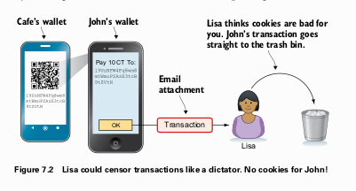
</p>

[Lisa sebagai diktator membuang transaksi pembelian kue dari John ke tempat sampah, mengilustrasikan kekuatan sensor yang dimilikinya. - Figure 7.2]

Untuk mencapai sistem yang benar-benar tahan sensor, kita perlu menghilangkan titik kegagalan tunggal ini.

### "Mengkloning" Lisa: Munculnya Banyak Miner

Solusi paling intuitif untuk masalah sensor adalah dengan mengizinkan lebih banyak orang untuk menjadi *miner*. Bayangkan kita mengizinkan Tom dan Qi untuk juga membuat *block*, sama seperti Lisa. Pengguna kini bisa mengirimkan *transaction* mereka ke ketiga *miner* ini, sehingga jika Lisa mencoba menyensor sebuah *transaction*, Tom atau Qi masih bisa memasukkannya ke dalam *block* mereka.

Namun, ini menciptakan masalah baru yang fundamental: **Block Collisions** (Tabrakan Blok). Jika Lisa, Tom, dan Qi semuanya membuat *block* setiap 10 menit, maka pada ketinggian *block* (*block height*) yang sama (misalnya, *height* 101), akan ada tiga *block* berbeda yang valid. Ini akan menyebabkan *blockchain* terpecah menjadi tiga cabang. Jaringan membutuhkan cara untuk menyepakati satu *block* saja untuk setiap ketinggian.

<p align="center">
  
</p>

[Blockchain terpecah menjadi tiga cabang pada height 101 karena Lisa, Tom, dan Qi semuanya membuat block secara bersamaan. - Figure 7.3]

#### Pendekatan Naif: Mengundi Angka Keberuntungan

Buku ini memperkenalkan sebuah analogi sederhana untuk menyelesaikan masalah ini. Bayangkan para *miner* setuju pada sebuah aturan:
* Setiap detik, setiap *miner* mengundi sebuah angka acak antara 0 dan 999.999.
* Jika seorang *miner* mendapatkan "angka keberuntungan" (misalnya, angka di bawah 556), ia berhak membuat dan mempublikasikan *block* berikutnya.

Probabilitas mendapatkan angka keberuntungan ini sangat rendah, sehingga kemungkinan besar hanya satu *miner* yang akan beruntung dalam satu waktu. Ini akan menghasilkan rata-rata satu *block* setiap 10 menit dari gabungan semua *miner*.

Terkadang, dua *miner* bisa saja mendapatkan angka keberuntungan pada saat yang bersamaan. Ini akan menyebabkan **`blockchain split`** (pemisahan *blockchain*) sementara. Aturan untuk menyelesaikannya adalah: **rantai terpanjang (*longest chain*) adalah rantai yang benar**.

Para *miner* akan memilih untuk melanjutkan pekerjaan mereka di atas cabang yang terpanjang. Cabang yang lebih pendek akan ditinggalkan (*orphaned*), dan *block reward* di cabang tersebut akan hangus.

<p align="center">
  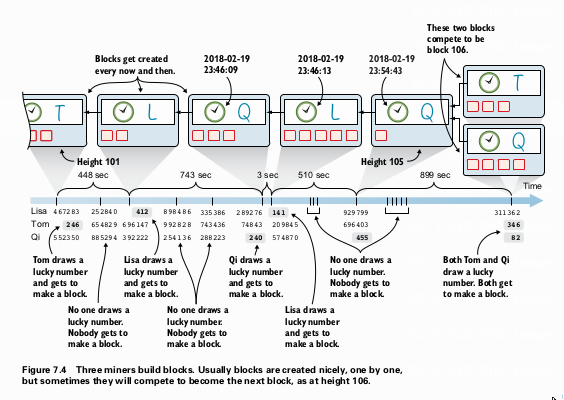
</p>

[Tiga miner mengundi angka. Terkadang tidak ada yang menang, terkadang satu orang menang, dan terkadang dua orang menang bersamaan, menyebabkan split pada blockchain. - Figure 7.4]

Meskipun sistem "angka keberuntungan" ini tampaknya berfungsi, ia memiliki kelemahan fatal: **tidak ada cara untuk membuktikan bahwa seorang *miner* benar-benar mendapatkan angka keberuntungan secara jujur**. Seorang *miner* bisa saja berbohong dan terus-menerus membuat *block* sesuka hatinya, mengklaim bahwa ia sangat beruntung. Sistem ini masih bergantung pada kejujuran.

### Solusi Sebenarnya: Memaksakan "Angka Keberuntungan" yang Jujur dengan Proof of Work

Di sinilah konsep jenius **`proof of work` (PoW)** atau "bukti kerja" masuk. Alih-alih mengandalkan undian yang tidak bisa diverifikasi, kita memaksa para *miner* untuk melakukan "pekerjaan" komputasi yang sangat berat dan mahal, di mana hasil dari pekerjaan tersebut berfungsi sebagai bukti undian yang jujur.

**Aturan `Proof of Work`**:
Sebuah *block* dianggap valid hanya jika *hash* dari *block header*-nya (yaitu, Block ID-nya) secara numerik **lebih kecil dari atau sama dengan** sebuah angka target (`target`) yang telah disepakati oleh jaringan.

<p align="center">
  
</p>

[Header sebuah block yang valid. Panah menunjuk dari header ke hash-nya (Block ID), dan ada perbandingan yang menunjukkan bahwa Block ID lebih kecil dari Target yang ditentukan. - Figure 7.11]

Untuk menemukan *block header* yang memenuhi syarat ini, *miner* harus melakukan proses *brute-force* (coba-coba):
1.  Menyusun sebuah kandidat *block* dengan semua transaksi yang ingin dimasukkan.
2.  Mengisi *block header* dengan *merkle root*, *hash block* sebelumnya, timestamp, dan *target*.
3.  Menambahkan sebuah angka acak yang disebut **`nonce`** ke dalam *header*.
4.  Menghitung *hash* dari *header* tersebut.
5.  Memeriksa apakah *hash* yang dihasilkan ≤ `target`.
6.  Jika tidak, *miner* akan mengubah `nonce` (biasanya ditambah satu) dan mengulangi dari langkah 4.

Proses ini diulang triliunan kali per detik oleh *miner* di seluruh dunia. Karena output fungsi *hash* tidak dapat diprediksi, proses ini pada dasarnya adalah lotere komputasi. Menemukan `nonce` yang tepat seperti menemukan "angka keberuntungan", tetapi bedanya, hasilnya (**Block ID yang valid**) dapat diverifikasi secara instan oleh siapa pun hanya dengan satu kali perhitungan *hash*. Tidak ada yang bisa memalsukan "pekerjaan" ini.

Jika seorang *miner* kehabisan kemungkinan `nonce` (sebuah angka 32-bit), ia dapat sedikit mengubah *timestamp* atau menyusun ulang transaksi di dalam *block* (yang akan mengubah *merkle root*) untuk memulai proses pencarian `nonce` dari awal lagi.

#### Penyesuaian Kesulitan (*Difficulty Adjustment*)
Seiring berjalannya waktu, semakin banyak *miner* bergabung ke jaringan, atau teknologi *mining* menjadi lebih cepat. Ini akan meningkatkan **`hashrate`** total jaringan, yaitu jumlah total *hash* yang dapat dihitung per detik. Jika `hashrate` meningkat, *block* akan ditemukan lebih cepat dari target 10 menit.

Untuk menjaga agar waktu pembuatan *block* tetap stabil di sekitar 10 menit (dan menjaga jadwal suplai bitcoin tetap terprediksi), **`difficulty`** (tingkat kesulitan) *mining* disesuaikan setiap **2.016 *block*** (sekitar 2 minggu).
* Jika 2.016 *block* terakhir ditemukan lebih cepat dari 2 minggu, artinya `hashrate` total telah meningkat. Jaringan akan **meningkatkan `difficulty`** dengan cara **menurunkan nilai `target`**, sehingga lebih sulit untuk menemukan *hash* yang valid.
* Jika ditemukan lebih lambat, `difficulty` akan diturunkan (nilai `target` dinaikkan).

<p align="center">
  
</p>

[Grafik yang menunjukkan bagaimana faktor perubahan target disesuaikan berdasarkan durasi periode retarget terakhir. Jika lebih cepat dari 2 minggu, target turun (lebih sulit). Jika lebih lambat, target naik (lebih mudah). - Figure 7.22]

Dengan mekanisme ini, aturan penyelesaian *split* disempurnakan: bukan lagi rantai terpanjang, melainkan **rantai terkuat (*strongest chain*)**, yaitu rantai dengan total akumulasi `proof of work` (atau `difficulty`) terbanyak, yang dianggap sebagai rantai yang valid.

### Analisis Keamanan: Apa yang Bisa Dilakukan Miner Jahat?

Dengan PoW, *block* tidak lagi ditandatangani oleh satu identitas (seperti Lisa), melainkan oleh "siapa pun" yang berhasil menemukan PoW yang valid. Ini membuka kembali kemungkinan serangan **`double spend`** (pembelanjaan ganda).

#### Serangan Double Spend (Serangan 51%)

Bayangkan Lisa ingin membeli kafe seharga 100.000 CT. Dia bisa mencoba melakukan serangan `double spend`:
1.  Dia membuat dua *transaction*:
    * **Transaksi C**: Membayar 100.000 CT ke pemilik kafe.
    * **Transaksi L**: Membayar 100.000 CT yang sama ke alamatnya sendiri.
2.  Dia **menyiarkan Transaksi C** ke jaringan agar para *miner* jujur memprosesnya.
3.  Secara **rahasia**, dia mulai menambang cabang *blockchain*-nya sendiri yang berisi **Transaksi L**.
4.  Jaringan jujur berhasil menambang *block* yang berisi Transaksi C. Pemilik kafe melihat ini sebagai 1 konfirmasi.
5.  Untuk menipu pemilik kafe, Lisa harus **terus menambang rantai rahasianya hingga menjadi lebih kuat** daripada rantai jujur.

<p align="center">
  
</p>

[Diagram alur serangan double-spend oleh Lisa. Rantai jujur maju satu per satu, sementara Lisa mencoba mengejar dengan rantai rahasianya. - Figure 7.27]

**Mitigasi: Menunggu Konfirmasi**
Pemilik kafe tidak akan menyerahkan kafenya setelah hanya 1 konfirmasi. Dia akan menunggu beberapa konfirmasi (misalnya, 6 konfirmasi). Ini berarti rantai jujur sudah 6 *block* lebih maju. Lisa sekarang harus menemukan 7 *block* di rantai rahasianya untuk bisa menyusul dan mengalahkan rantai jujur.

Probabilitas keberhasilan serangan ini sangat bergantung pada persentase `hashrate` total yang dikendalikan oleh penyerang.
* Jika seorang penyerang memiliki `hashrate` yang jauh lebih kecil dari 50% jaringan (misalnya 18% seperti Tom dalam contoh buku), probabilitas untuk bisa mengejar bahkan selisih 2 atau 3 *block* saja sudah sangat kecil dan secara ekonomi tidak menguntungkan.
* Jika seorang penyerang (atau sekelompok *miner* yang berkolusi) menguasai **lebih dari 50% `hashrate` total**, mereka secara matematis *pasti* akan bisa menciptakan rantai yang lebih kuat dan berhasil melakukan `double spend` sesuka hati. Ini dikenal sebagai **serangan 51%**.

**Mengapa Serangan 51% Jarang Terjadi?**
Meskipun secara teknis memungkinkan, serangan 51% bertentangan dengan kepentingan ekonomi para *miner* itu sendiri. Jika mereka menyerang jaringan dan berhasil, kepercayaan terhadap Bitcoin akan hancur. Nilai bitcoin akan anjlok, membuat *block reward* yang mereka curi dan peralatan *mining* mahal mereka menjadi tidak berharga. Akan lebih menguntungkan bagi mereka untuk bermain jujur dan terus mengumpulkan *block reward* yang bernilai.

### Transaction Fees: Insentif untuk Miner

Sistem `proof of work` menciptakan dinamika baru. Ketika dua *miner* menemukan *block* pada saat yang bersamaan, *miner* dengan *block* yang lebih kecil cenderung menang karena *block*-nya dapat disebarkan dan diverifikasi lebih cepat oleh jaringan. Ini menciptakan insentif bagi *miner* untuk membuat *block* sekecil mungkin, bahkan mungkin kosong (hanya berisi *coinbase transaction*).

Untuk mengatasi hal ini dan memberi *miner* insentif untuk memasukkan *transaction*, lahirlah **`transaction fees`** (biaya transaksi).
* Pengirim `transaction` dapat secara sukarela menyisihkan sebagian kecil dari nilai `input` sebagai biaya untuk *miner*. Biaya ini adalah selisih antara total nilai `input` dan total nilai `output`.
* Seorang *miner* akan memprioritaskan *transaction* yang menawarkan *fee* per-byte tertinggi.
* Ketika `block` hampir penuh (karena ada batas ukuran maksimum), `transaction` dengan *fee* rendah mungkin harus menunggu lebih lama untuk dikonfirmasi. Ini menciptakan **pasar bebas untuk ruang *block*** (*fee market*).

**`Block reward`** yang diterima *miner* sebenarnya adalah gabungan dari **`block subsidy`** (bitcoin baru yang diciptakan) dan **total `transaction fees`** dari semua `transaction` di dalam *block* tersebut. Di masa depan yang jauh, ketika `block subsidy` menjadi nol, keamanan jaringan akan sepenuhnya bergantung pada `transaction fees`.

### Ringkasan Bab 7
* **`Proof of work`** adalah mekanisme yang memaksa *miner* untuk melakukan pekerjaan komputasi yang mahal untuk membuat *block*, yang berfungsi sebagai pengganti "undian keberuntungan" yang dapat diverifikasi dan tahan terhadap kecurangan.
* Ini memungkinkan siapa saja untuk menjadi *miner* secara **permissionless**, menciptakan sistem yang tahan sensor karena tidak ada otoritas pusat yang mengontrol pembuatan *block*.
* **`Difficulty adjustment`** memastikan bahwa waktu rata-rata antar *block* tetap sekitar 10 menit, terlepas dari perubahan total `hashrate` jaringan.
* Aturan konsensus utama adalah mengikuti **rantai terkuat** (dengan akumulasi PoW terbanyak).
* Serangan **`double spend`** secara teori dimungkinkan oleh *miner* dengan `hashrate` yang signifikan, tetapi risiko ini dimitigasi dengan menunggu beberapa **konfirmasi**.
* Serangan 51% sangat sulit dan mahal untuk dilakukan, dan seringkali tidak rasional secara ekonomi karena akan merusak nilai aset *miner* itu sendiri.
* **`Transaction fees`** memberikan insentif bagi *miner* untuk memasukkan `transaction` ke dalam *block* mereka, menciptakan pasar untuk ruang *block*.

---

# Bab 8
## Peer-to-Peer Network

Hingga saat ini, semua *miner* dan *full nodes* masih bergantung pada sebuah "folder bersama" (*shared folder*) yang dikelola oleh seorang administrator bernama Luke. Ini adalah titik kelemahan sentral yang terakhir.

### Masalah dengan "Folder Bersama"

1.  **Titik Sensor**: Administrator Luke memiliki kekuasaan mutlak untuk memutuskan *block* mana yang boleh disimpan dan diakses. Jika ia tidak menyukai sebuah *block* (misalnya karena berisi *transaction* yang kontroversial), ia bisa menolaknya, dan *block* tersebut tidak akan pernah sampai ke seluruh jaringan. Ini bertentangan dengan prinsip tahan sensor yang ingin kita capai.
2.  **Masalah Skalabilitas dan Kinerja**: Jika ada 100 *node* yang ingin mengunduh *block* baru berukuran 1 MB, *server* folder bersama harus melayani total lalu lintas data sebesar 100 MB. Semakin banyak *node*, semakin lambat proses penyebaran (*propagation*) *block*, yang dapat meningkatkan risiko *blockchain split*.

<p align="center">
  
</p>

[Administrator folder bersama memblokir block yang dikirim oleh miner Rashid, mencegahnya mencapai node lain. - Figure 8.2]

### Solusi: Membangun Jaringan Peer-to-Peer

Solusinya adalah dengan memungkinkan para *node* untuk berkomunikasi secara langsung satu sama lain dalam sebuah **`peer-to-peer (P2P) network`** (jaringan P2P). Dalam jaringan ini, tidak ada server pusat. Setiap *node* terhubung ke beberapa *node* lain yang disebut **`peers`**.

Ketika sebuah *node* (misalnya, milik Rashid) menemukan *block* baru, ia akan mengirimkannya langsung ke *peers*-nya. *Peers* tersebut kemudian akan memverifikasi dan meneruskannya ke *peers* mereka, dan begitu seterusnya. Informasi menyebar ke seluruh jaringan seperti gosip, membuatnya sangat sulit untuk disensor. Jika satu *node* menolak untuk meneruskan sebuah *block*, *node* lain akan tetap menerimanya dari koneksi yang lain. Jaringan ini juga digunakan untuk menyebarkan *transaction* dari *wallet* pengguna ke para *miner*.

<p align="center">
  
</p>

[Dalam jaringan P2P, blok baru dari Rashid disebarkan dari node ke node, seperti gosip, hingga mencapai seluruh jaringan. - Figure 8.3]

#### Bagaimana Para Peer Berkomunikasi?
Komunikasi antar *node* terjadi melalui internet menggunakan koneksi **`TCP (Transmission Control Protocol)`**. Setiap *node* yang ingin menerima koneksi akan "mendengarkan" pada sebuah **`IP address`** dan nomor **port** tertentu (port default Bitcoin adalah 8333). Sebuah *node* dapat menginisiasi koneksi ke *node* lain jika ia mengetahui alamat IP dan port-nya.

Setelah koneksi `TCP` terbentuk, para *node* harus berbicara dalam "bahasa" yang sama. Bahasa ini disebut **network protocol** (protokol jaringan). Protokol ini mendefinisikan serangkaian jenis pesan yang dapat mereka kirimkan satu sama lain, seperti pesan `inv` (inventory) yang digunakan sebuah *node* untuk memberitahu *peer*-nya tentang *transaction* atau *block* baru yang dimilikinya.

### Mengikuti Jejak Sebuah Transaction di Jaringan P2P

Mari kita ikuti alur hidup sebuah *transaction* dari awal hingga akhir di dalam jaringan P2P.

**1. Pengiriman Transaction dari Wallet**
John ingin membeli kue. *Wallet*-nya, yang terhubung ke sebuah *full node* (misalnya, milik Tom), akan membuat dan menandatangani sebuah `transaction`. Alih-alih mengirim seluruh data `transaction` secara langsung, prosesnya lebih efisien:
* **`inv` (Inventory)**: *Wallet* John mengirim pesan `inv` ke Tom, yang berisi `txid` dari *transaction* baru tersebut. Ini seperti berkata, "Hei, saya punya data baru dengan ID ini."
* **`getdata` (Get Data)**: *Node* Tom memeriksa apakah ia sudah memiliki `transaction` dengan `txid` tersebut. Karena belum, ia merespons dengan pesan `getdata`, yang berarti, "Tolong kirimkan data lengkap dengan ID tersebut."
* **`tx` (Transaction)**: *Wallet* John kemudian mengirimkan seluruh data `transaction` dalam pesan `tx`.

<p align="center">
  
</p>

[Diagram alur tiga langkah pengiriman transaksi: wallet John mengirim 'inv', node Tom merespons dengan 'getdata', dan wallet John mengirimkan data transaksi lengkap. - Figure 8.12]

Proses tiga langkah ini mencegah pengiriman data yang tidak perlu jika penerima ternyata sudah memiliki `transaction` tersebut.

**2. Penyebaran (Propagasi) Transaction oleh Node**
Setelah Tom menerima dan memverifikasi `transaction` John, ia akan memberitahu semua *peers*-nya (Lisa, Qi, Rashid) menggunakan pesan `inv`. Masing-masing dari mereka yang belum memiliki `transaction` tersebut akan memintanya dengan `getdata`. Proses ini berlanjut hingga `transaction` menyebar ke seluruh jaringan, termasuk ke semua *miner*.

**3. Notifikasi ke Wallet Penerima (0-Conf)**
Kafe, sebagai penerima, juga menjalankan *full node* yang terhubung dengan *wallet* ringan (*lightweight wallet*) di kasir. Ketika *node* kafe menerima `transaction` John, ia akan mengujinya terhadap *bloom filter* yang diberikan oleh *wallet*-nya. Karena `transaction` ini ditujukan untuk kafe, ia akan cocok dengan filter. *Node* kafe kemudian akan mengirimkan notifikasi (`inv`) ke *wallet* kasir, yang akan menampilkan pesan bahwa pembayaran sedang dalam proses (dikenal sebagai transaksi *0-conf* atau belum terkonfirmasi).

**4. Dimasukkan ke dalam Block**
Salah satu *miner* (misalnya, Rashid) yang telah menerima `transaction` John, memutuskan untuk memasukkannya ke dalam *block* yang sedang ia kerjakan. Rashid berhasil menemukan `proof of work` yang valid.

**5. Propagasi Block**
Rashid sekarang perlu menyebarkan *block* barunya secepat mungkin. Prosesnya sedikit berbeda dari propagasi `transaction` untuk efisiensi yang lebih tinggi (BIP130):
* Rashid mengirim pesan **`headers`** ke semua *peers*-nya. Pesan ini hanya berisi *header* dari *block* barunya, yang sangat kecil.
* *Peers* yang menerima *header* akan memverifikasinya dan kemudian meminta *block* lengkap menggunakan pesan `getdata`.
* Rashid mengirimkan *block* lengkap dalam pesan **`block`**.
Proses ini berlanjut hingga semua *node* di jaringan menerima dan memvalidasi *block* baru tersebut.

**6. Notifikasi Konfirmasi ke Wallet**
*Wallet* ringan (seperti milik John dan kafe) juga akan menerima pesan `headers`. Karena mereka tidak mengunduh *block* penuh, mereka akan meminta pesan **`merkleblock`** dari *full node* yang terhubung. Pesan `merkleblock` berisi:
* *Block header*.
* *Partial merkle tree* yang membuktikan bahwa `transaction` mereka benar-benar termasuk dalam *block* tersebut.

Setelah memverifikasi bukti ini, *wallet* John dan kafe akan menampilkan bahwa `transaction` tersebut telah mendapat **1 konfirmasi**. Seiring berjalannya waktu dan lebih banyak *block* dibangun di atasnya, jumlah konfirmasi akan terus bertambah, membuat `transaction` semakin aman dari serangan `double spend`.

### Selamat Tinggal, Cookie Token!

Pada titik ini, sistem *Cookie Token* fiktif kita telah berevolusi dan mengadopsi semua komponen inti dari Bitcoin:
* `Digital signatures` (Bab 2)
* `Addresses` berbasis `PKH` (Bab 3)
* `Wallets` dan `HD keys` (Bab 4)
* `Transactions` berbasis `UTXO` dan `Script` (Bab 5)
* `Blockchain` dan `merkle trees` (Bab 6)
* `Proof of Work` dan desentralisasi *miner* (Bab 7)
* `Peer-to-Peer Network` (Bab 8)

Karena tidak ada lagi perbedaan teknis yang signifikan, mulai sekarang kita akan menggunakan terminologi **Bitcoin** secara eksklusif.

<p align="center">
  
</p>

[Rangkaian evolusi sistem Cookie Token dari spreadsheet sederhana di Bab 2 hingga menjadi jaringan P2P yang terdesentralisasi penuh di Bab 8, mirip dengan Bitcoin. - Figure 8.25]

### Bootstrapping: Bagaimana Node Baru Bergabung dengan Jaringan

Bagaimana sebuah *node* baru (milik Selma) yang baru dinyalakan bisa bergabung dengan jaringan yang sudah ada? Proses ini disebut **bootstrapping** dan terdiri dari empat langkah.

<p align="center">
  
</p>

[Empat langkah bootstrapping sebuah node baru: menjalankan software, terhubung ke node lain, sinkronisasi blockchain, dan operasi normal. - Figure 8.27]

**Langkah 1: Menjalankan Perangkat Lunak**
Selma mengunduh perangkat lunak *full node* seperti **Bitcoin Core**. Sangat penting bagi pengguna yang sadar keamanan untuk **memverifikasi keaslian perangkat lunak** tersebut. Ini dilakukan dengan:
1.  Mengunduh file program dan file tanda tangan (`SHA256SUMS.asc`).
2.  Memverifikasi *hash* file program cocok dengan yang tercantum di file tanda tangan.
3.  Menggunakan *public key* milik tim pengembang Bitcoin Core untuk memverifikasi *digital signature* pada file tanda tangan. Keaslian *public key* ini harus dikonfirmasi dari berbagai sumber terpercaya (misalnya, situs web resmi, buku ini, teman terpercaya) untuk menghindari penipuan.

**Langkah 2: Terhubung ke Node Lain**
*Node* yang baru dimulai tidak tahu alamat IP *node* lain. Untuk menemukan *peer* pertamanya, ia menggunakan beberapa metode:
* **DNS Seeds**: Metode utama. *Software* Bitcoin Core memiliki daftar nama domain (*DNS seeds*) yang di-*hardcode*. Ketika ditanya, server DNS ini akan memberikan daftar alamat IP dari *node-node* yang aktif di jaringan.
* **Alamat Hardcoded**: *Software* juga memiliki daftar alamat IP *fallback* yang di-*hardcode*.
* **Konfigurasi Manual**: Pengguna dapat secara manual menambahkan alamat IP *node* terpercaya.

Setelah terhubung, *node* akan melakukan proses **handshake** dengan bertukar pesan `version` untuk menyepakati versi protokol dan mengetahui tinggi *blockchain* masing-masing. Kemudian, ia akan meminta lebih banyak alamat *peer* dari koneksi yang sudah ada menggunakan pesan `getaddr` untuk membangun konektivitas yang lebih kuat.

**Langkah 3: Sinkronisasi (Initial Blockchain Download - IBD)**
Selma sekarang perlu mengunduh seluruh riwayat *blockchain*. Proses ini bisa memakan waktu berjam-jam atau bahkan berhari-hari.
1.  **Unduh Headers**: Pertama, *node*-nya akan mengunduh semua *block headers* dari satu *peer*. Ini cepat karena *header* sangat kecil. *Node* akan memverifikasi rantai PoW dari *header-header* ini untuk memastikan ia berada di rantai terkuat.
2.  **Unduh Blocks**: Setelah memiliki semua *header*, *node* akan mulai mengunduh *block-block* penuh secara paralel dari beberapa *peer* yang berbeda untuk mempercepat proses.
3.  **Verifikasi**: Sambil mengunduh, *node* akan memverifikasi setiap *block* dan `transaction` untuk membangun `UTXO set`-nya sendiri dari awal.

Untuk mempercepat proses ini, Bitcoin Core memiliki fitur *`assumevalid`*, di mana verifikasi *signature* untuk *block-block* yang sangat lama (misalnya, yang dibuat lebih dari beberapa minggu yang lalu) akan dilewati, karena diasumsikan sudah valid dan aman.

**Langkah 4: Operasi Normal**
Setelah selesai mengunduh dan memverifikasi seluruh *blockchain* hingga ke ujung, *node* Selma sekarang sepenuhnya sinkron. Ia beralih ke mode operasi normal, berpartisipasi dalam me-*relay* *transaction* dan *block* baru seperti *node-node* lainnya. Ia telah menjadi anggota penuh dari jaringan P2P Bitcoin.

### Ringkasan Bab 8
* "Folder bersama" sebagai titik sentral terakhir dihilangkan dan digantikan oleh **`peer-to-peer network`** yang terdesentralisasi, membuat sistem menjadi benar-benar tahan sensor.
* *Nodes* berkomunikasi secara langsung menggunakan protokol jaringan di atas koneksi `TCP`. Pesan-pesan seperti `inv`, `getdata`, `headers`, dan `block` digunakan untuk menyebarkan informasi secara efisien.
* *Transaction* dan *block* menyebar ke seluruh jaringan melalui mekanisme gosip, dari *peer* ke *peer*.
* Sebuah *node* baru melakukan proses **bootstrapping** untuk bergabung dengan jaringan, yang melibatkan verifikasi perangkat lunak, penemuan *peer* awal, dan sinkronisasi seluruh *blockchain*.
* Pada titik ini, sistem fiktif kita telah sepenuhnya berevolusi menjadi Bitcoin.

---

# Bab 9
## Transactions Revisited

Bab ini merupakan kelanjutan dari konsep `transaction` yang telah diperkenalkan sebelumnya. Jika bab-bab awal menjelaskan anatomi dasar sebuah `transaction`, bab ini mengeksplorasi fitur-fitur canggih yang membuatnya lebih dari sekadar alat transfer nilai. Fitur-fitur ini, seperti *time locks* dan *programmable scripts*, adalah fondasi dari banyak aplikasi tingkat lanjut di atas `blockchain` Bitcoin, termasuk kontrak digital.

### Time-locked Transactions

Konsep inti dari *time-locked transaction* adalah sebuah `transaction` yang sudah ditandatangani dan valid secara kriptografis, namun tidak dapat dimasukkan ke dalam `block` (dan oleh karena itu tidak dapat dikonfirmasi) hingga kondisi waktu tertentu terpenuhi.

Untuk mengaktifkan fitur ini, ada dua komponen utama dalam sebuah `transaction` yang digunakan: `locktime` dan `sequence number`.

* **`locktime`**: Field di level `transaction` yang menentukan waktu paling awal (bisa dalam format timestamp atau block height) `transaction` tersebut valid untuk ditambang.
* **`sequence number`**: Field 32-bit di setiap *input* `transaction`. Agar `locktime` pada sebuah `transaction` dapat berfungsi, setidaknya salah satu `sequence number` dari input-inputnya harus diatur ke nilai yang lebih kecil dari `ffffffff`. Jika semua `sequence number` adalah `ffffffff`, `locktime` akan diabaikan oleh jaringan.

**Skenario Penggunaan: Warisan Digital**

Buku ini memberikan contoh yang sangat baik: Anda ingin memberikan 100 bitcoin kepada putri Anda, tetapi hanya setelah Anda meninggal dunia. Anda bisa membuat sebuah `transaction` yang terkunci waktu (*time-locked*) satu tahun ke depan.

<p align="center">
  
</p>

[Diagram transaksi time-locked yang mengirim 100 BTC kepada anak perempuan, valid pada 30 April 2019. - Figure 9.1]

Anda membuat `transaction` (Tx1) yang ditandatangani, lalu memberikannya kepada putri Anda untuk disimpan. `Transaction` ini belum disiarkan ke jaringan. Jika Anda meninggal sebelum tanggal `locktime` tercapai, putri Anda dapat menyiarkan `transaction` tersebut setelah tanggal yang ditentukan untuk mengklaim dananya.

Namun, bagaimana jika Anda masih hidup setelah tanggal itu? Anda tentu tidak ingin putri Anda bisa mengambil uang tersebut. Di sinilah letak kerumitannya. Untuk membatalkan Tx1, Anda harus membuat `transaction` baru (Tx2) yang membelanjakan salah satu *output* yang sama yang digunakan oleh Tx1 (*double-spend*). Karena Tx2 tidak memiliki `locktime`, Anda bisa menyiarkannya sebelum `locktime` Tx1 tercapai. Setelah Tx2 terkonfirmasi, Tx1 menjadi tidak valid selamanya.

Untuk tetap adil kepada putri Anda, sebelum menyiarkan Tx2, Anda membuat `transaction` *time-locked* baru (Tx3) yang berlaku satu tahun lagi, yang membelanjakan *output* dari Tx2, lalu memberikannya kepada putri Anda.

<p align="center">
  
</p>

[Proses membatalkan transaksi time-locked lama (Tx1) dengan transaksi baru (Tx2), dan membuat transaksi time-locked berikutnya (Tx3). - Figure 9.2]

> **Poin Kritis untuk Auditor**: Urutan operasi di sini sangat penting. Tx3 harus diberikan kepada putri Anda *sebelum* Tx2 disiarkan. Jika tidak, ada risiko Anda meninggal setelah menyiarkan Tx2 tetapi sebelum memberikan Tx3, yang akan menyebabkan dana warisan hilang. Selain itu, skenario ini rentan terhadap **`transaction malleability`**, sebuah konsep yang akan dibahas lebih dalam di Bab 10, di mana `txid` dari Tx2 bisa berubah sebelum dikonfirmasi, sehingga membuat Tx3 tidak valid.

#### Time Measurements

`Locktime` dapat diekspresikan dalam dua cara:

1.  **Block Time (Timestamp)**: Menggunakan Unix timestamp. Sebuah `transaction` valid jika **Median Time Past (MTP)** dari 11 `block` terakhir lebih besar dari nilai `locktime` `transaction` tersebut. MTP digunakan alih-alih timestamp `block` saat ini untuk mencegah manipulasi oleh `miners`.

<p align="center">
  
</p>

    [Ilustrasi validasi locktime berdasarkan Median Time Past dari 11 block terakhir. - Figure 9.3]

2.  **Block Height**: Menggunakan nomor `block`. `Transaction` tidak valid sampai `block` dengan nomor yang ditentukan telah ditambang. Contohnya, jika `locktime` adalah 571019, `transaction` baru bisa dimasukkan ke dalam `block` 571020 atau setelahnya.

<p align="center">
  
</p>

    [Contoh transaksi time-locked berdasarkan block height. - Figure 9.4]

#### Relative Time Locks

Berbeda dengan *absolute time locks* yang merujuk pada waktu atau `block height` absolut, *relative time locks* mengunci sebuah *input* berdasarkan waktu konfirmasi dari *output* yang dibelanjakannya. Fitur ini diaktifkan melalui `sequence number` di setiap input dan memerlukan `transaction` version 2 atau lebih tinggi (**BIP68**).

`Sequence number` diinterpretasikan sebagai bitfield:
* **Bit 31 (paling kiri)**: Jika `0`, *relative lock* aktif. Jika `1`, tidak aktif.
* **Bit 22**: Jika `1`, nilai 16 bit terakhir diartikan sebagai kelipatan 512 detik. Jika `0`, diartikan sebagai jumlah `block`.
* **Bit 0-15**: Nilai *time lock* itu sendiri (baik dalam jumlah `block` atau kelipatan 512 detik).

<p align="center">
  
</p>

[Diagram transaksi dengan dua input yang memiliki relative time lock berbeda: satu berbasis waktu (30 hari), satu lagi berbasis jumlah block (1000 block). - Figure 9.5]

<p align="center">
  
</p>

[Penjelasan bitfield dari sequence number untuk relative lock berbasis waktu. - Figure 9.6]

<p align="center">
  
</p>

[Penjelasan bitfield dari sequence number untuk relative lock berbasis jumlah block. - Figure 9.7]

### Time-locked Outputs

Selain mengunci seluruh `transaction`, kita juga bisa mengunci sebuah *output* spesifik, sehingga siapa pun yang ingin membelanjakannya harus memenuhi kondisi waktu yang ditentukan dalam `script` output tersebut.

#### Absolute Time-locked Outputs

Fitur ini diimplementasikan menggunakan `script` operator **`OP_CHECKLOCKTIMEVERIFY`** atau **`OP_CLTV`** (**BIP65**).

Contohnya, Anda ingin memberi uang saku kepada putri Anda yang baru bisa dibelanjakan pada tanggal 1 Mei. Anda membuat `transaction` dengan `script` output yang mengandung `OP_CLTV`.

<p align="center">
  
</p>

[Transaksi dengan satu output yang dikunci hingga 1 Mei menggunakan OP_CLTV. - Figure 9.8]

`Script`-nya akan terlihat seperti ini:
`<timestamp 1 Mei> OP_CLTV OP_DROP OP_DUP OP_HASH160 <PKHD> OP_EQUALVERIFY OP_CHECKSIG`

Cara kerjanya:
* `Transaction` yang membelanjakan output ini *harus* memiliki `locktime` yang lebih besar atau sama dengan `<timestamp 1 Mei>`.
* `OP_CLTV` akan memeriksa `locktime` dari `transaction` pembelanja. Jika tidak memenuhi syarat, `script` akan gagal.
* Jika berhasil, eksekusi dilanjutkan ke verifikasi `signature` seperti biasa.

<p align="center">
  
</p>

[Ilustrasi beberapa transaksi yang mencoba membelanjakan output OP_CLTV, menunjukkan mana yang valid dan tidak valid berdasarkan locktime-nya. - Figure 9.9]

#### Relative Time-locked Outputs

Fitur ini diimplementasikan menggunakan **`OP_CHECKSEQUENCEVERIFY`** atau **`OP_CSV`** (**BIP112**). `Script` ini memastikan bahwa sejumlah `block` atau waktu tertentu telah berlalu sejak *output* yang dikunci ini dikonfirmasi.

<p align="center">
  
</p>

[Konsep relative time-locked output, di mana output hanya bisa dibelanjakan setelah 3 block terkonfirmasi di atasnya. - Figure 9.10]

`OP_CSV` sangat krusial untuk kontrak digital canggih, seperti *atomic swaps*.

### Atomic Swaps

*Atomic swap* adalah protokol untuk menukar aset kripto dari dua `blockchain` yang berbeda (misalnya, Bitcoin dan Namecoin) antara dua pihak yang tidak saling percaya, tanpa memerlukan pihak ketiga (seperti bursa). Disebut "atomic" karena pertukaran ini dijamin berhasil sepenuhnya atau gagal sepenuhnya, tidak ada kondisi di mana salah satu pihak bisa kabur dengan dana pihak lain.

**Skenario:** John ingin menukar 2 BTC miliknya dengan 100 NMC milik Fadime.

**Mekanisme Kunci:**
1.  **Secret (S) dan Hash (H)**: John membuat sebuah angka rahasia acak (`S`) dan menghitung hash-nya (`H = SHA256(S)`). John merahasiakan `S` tetapi membagikan `H` kepada Fadime.
2.  **Contract Transactions**: Kedua belah pihak membuat `transaction` di `blockchain` masing-masing yang dikunci dengan `script` khusus. `Transaction` ini menggunakan `p2sh` (Pay-to-Script-Hash).
    * **`Redeem script` John (di Bitcoin)**:
        * **Kondisi 1 (Swap)**: Fadime dapat mengklaim 2 BTC jika ia bisa memberikan `S` (pre-image dari `H`) dan `signature`-nya.
        * **Kondisi 2 (Refund)**: John dapat mengambil kembali 2 BTC-nya jika Fadime tidak mengklaimnya setelah 48 jam (*relative time lock*).
    * **`Redeem script` Fadime (di Namecoin)**:
        * **Kondisi 1 (Swap)**: John dapat mengklaim 100 NMC jika ia bisa memberikan `S` dan `signature`-nya.
        * **Kondisi 2 (Refund)**: Fadime dapat mengambil kembali 100 NMC-nya jika John tidak mengklaimnya setelah 24 jam.

<p align="center">
  
</p>

[Diagram dua contract transaction untuk atomic swap, satu di blockchain Bitcoin dan satu di Namecoin, keduanya menggunakan redeem script dengan dua kondisi. - Figure 9.11]

> **Poin Kritis untuk Auditor**: Perhatikan perbedaan *timeout*. *Timeout* Fadime (24 jam) lebih pendek daripada John (48 jam). Ini penting karena John harus bertindak lebih dulu untuk mengklaim NMC, yang akan membuka rahasia `S`. Fadime diberikan waktu yang lebih pendek untuk membatalkan jika John tidak bertindak, sementara John diberikan waktu lebih lama untuk mengklaim kembali dananya jika terjadi masalah setelah ia mengungkapkan `S`.

**Alur Eksekusi:**
1.  John menyiarkan *contract transaction*-nya di `blockchain` Bitcoin. Fadime menunggu konfirmasi.
2.  Setelah terkonfirmasi, Fadime menyiarkan *contract transaction*-nya di `blockchain` Namecoin. John menunggu konfirmasi.
3.  John mengklaim 100 NMC dengan menyiarkan *swap transaction* di Namecoin. `Transaction` ini **mengungkapkan rahasia `S`** di dalam `script`-nya agar valid.

<p align="center">
  
</p>

    [Langkah pertama swap, di mana John mengklaim Namecoin dengan mengungkapkan rahasia S. - Figure 9.12]
4.  Fadime memantau `blockchain` Namecoin, melihat `S` yang diungkapkan oleh John.
5.  Fadime menggunakan `S` tersebut untuk membuat *swap transaction*-nya di `blockchain` Bitcoin untuk mengklaim 2 BTC.

<p align="center">
  
</p>

    [Langkah kedua swap, di mana Fadime menggunakan rahasia S untuk mengklaim Bitcoin. - Figure 9.13]

Jika ada pihak yang tidak kooperatif (misalnya, Fadime tidak menyiarkan `transaction`-nya), pihak lain dapat mengklaim kembali dananya setelah periode *timeout* berakhir.

### Storing stuff in the Bitcoin blockchain

`Blockchain` Bitcoin adalah basis data publik yang abadi, yang membuatnya menarik untuk menyimpan data arbitrer. Praktik awalnya adalah dengan menyisipkan data ke dalam `transaction` dengan cara yang tidak efisien.

Contoh historis yang diberikan adalah sebuah *tribute* untuk Len Sassaman yang disematkan dalam sebuah `transaction`. Ini dilakukan dengan membuat banyak *output* `p2pkh` di mana `PKH` (Public Key Hash) bukanlah hash dari `public key` sungguhan, melainkan data ASCII yang di-encode.

> **Poin Kritis untuk Auditor**: Praktik ini menyebabkan masalah serius yang disebut **Bloated UTXO set**. Karena `PKH` tersebut palsu, tidak ada `private key` yang dapat digunakan untuk membelanjakan *output* tersebut. Akibatnya, *output* ini menjadi *unspendable* (tidak dapat dibelanjakan) dan akan tersimpan selamanya di dalam `UTXO set` semua `full node`, membebani memori dan sumber daya jaringan.

**Solusi: `OP_RETURN`**

Untuk memfasilitasi penyimpanan data tanpa membebani `UTXO set`, `OP_RETURN` diperkenalkan.
* `OP_RETURN` adalah sebuah `script` operator yang secara otomatis membuat sebuah *output* menjadi **provably unspendable** (terbukti tidak dapat dibelanjakan).
* Ketika `full node` melihat `output` dengan `OP_RETURN`, ia tahu bahwa `output` tersebut tidak perlu dimasukkan ke dalam `UTXO set`.
* Ada kebijakan jaringan (bukan aturan konsensus) yang membatasi ukuran data `OP_RETURN` (saat ini sekitar 80 byte) dan hanya mengizinkan satu `output` `OP_RETURN` per `transaction`.

**Contoh Penggunaan: Token Kepemilikan Mobil**

Buku ini mengilustrasikan pembuatan token sederhana di atas Bitcoin. Produsen mobil "Ampere" membuat `transaction` untuk setiap mobil baru.
* **Pembuatan Token**: Ampere membuat `transaction` yang membelanjakan koin dari alamatnya sendiri (`PKHA`), dengan `output` pertama ditujukan kembali ke alamatnya, dan sebuah `output` `OP_RETURN` yang berisi data seperti `"ampere <nomor sasis>"`.

<p align="center">
  
</p>

    [Ampere membuat token mobil baru dengan transaksi OP_RETURN. - Figure 9.14]
* **Transfer Token**: Untuk mentransfer kepemilikan (misalnya, ke dealer dengan `PKHD`), Ampere membelanjakan *output* token sebelumnya, dengan `output` pertama dari `transaction` baru ini ditujukan ke `PKHD`. Rantai kepemilikan ini dapat dilacak di `blockchain`.

<p align="center">
  
</p>

lalu

<p align="center">
  
</p>

    [Ampere mentransfer token mobil ke dealer. - Figure 9.15 & 9.16]
* **Bukti Kepemilikan**: Pemilik mobil yang sah dapat membuktikan kepemilikannya dengan menandatangani sebuah *challenge* (pesan acak) dari mobil menggunakan `private key` yang sesuai dengan `PKH` pemilik saat ini di `blockchain`.

<p align="center">
  
</p>

    [Fadime menyalakan mobilnya dengan menandatangani challenge-response. - Figure 9.17]

### Replacing pending transactions

Terkadang sebuah `transaction` bisa "macet" (tertunda konfirmasinya) karena `fee` yang dibayarkan terlalu rendah. Ada dua mekanisme utama untuk mengatasi ini:

#### Opt-in Replace-by-Fee (RBF)

**BIP125** memperkenalkan RBF, sebuah kebijakan di mana pengirim dapat menandai `transaction`-nya agar bisa diganti.
* **Mekanisme**: Jika setidaknya satu `sequence number` dari input `transaction` diatur ke nilai yang lebih rendah dari `ffffffe`, `transaction` tersebut dianggap dapat diganti.
* **Proses**: Jika `transaction` asli macet, pengirim dapat membuat `transaction` baru yang membelanjakan input yang sama tetapi dengan `fee` yang lebih tinggi. `Node` yang mendukung kebijakan RBF akan menerima `transaction` baru ini dan membuang yang lama.

<p align="center">
  
</p>

[Perbandingan transaksi asli yang macet dan transaksi pengganti RBF dengan fee lebih tinggi. - Figure 9.20]

Jika RBF tidak diaktifkan, sebagian besar `node` akan mengikuti kebijakan *first-seen*, yaitu menolak `transaction` kedua sebagai upaya *double-spend*.

#### Child Pays for Parent (CPFP)

CPFP adalah metode di mana *penerima* atau *pengirim* (melalui *change output*) dapat "mempercepat" konfirmasi `transaction` yang macet.
* **Mekanisme**: Buat `transaction` baru (*child*) yang membelanjakan salah satu *output* dari `transaction` yang macet (*parent*).
* **Proses**: `Transaction` *child* ini dibuat dengan `fee` yang sangat tinggi. `Miner` yang ingin mengklaim `fee` tinggi dari *child* harus menambang `transaction` *parent*-nya terlebih dahulu agar *child* menjadi valid. Dengan demikian, `fee` gabungan dari kedua `transaction` menjadi cukup menarik bagi `miner`.

<p align="center">
  
</p>

[Diagram Child Pays for Parent, di mana transaksi anak dengan fee tinggi mendorong miner untuk menambang transaksi induk yang macet. - Figure 9.22]

### Different signature types

Sebuah `signature` dalam Bitcoin tidak selalu harus mengunci seluruh `transaction`. Perilaku `signature` dapat diubah menggunakan **`SIGHASH flag`**, sebuah byte yang ditambahkan ke akhir `signature`.

Ini memungkinkan kontrol granural atas bagian mana dari `transaction` yang dikunci oleh `signature`. Ada dua kategori `flag`:

**1. Mode untuk Output:**
* **`SIGHASH_ALL` (default)**: Mengunci semua input dan semua output. `Signature` menjadi tidak valid jika ada bagian dari `transaction` (selain `scriptSig`) yang diubah.
* **`SIGHASH_SINGLE`**: Mengunci semua input, tetapi hanya mengunci *output* yang memiliki indeks yang sama dengan *input* yang sedang ditandatangani. `Output` lain bisa diubah.
* **`SIGHASH_NONE`**: Mengunci semua input, tetapi tidak ada *output* yang dikunci. Siapa pun dapat mengubah tujuan dana.

**2. Mode untuk Input:**
* **`SIGHASH_ANYONECANPAY`**: `Flag` ini dapat dikombinasikan dengan salah satu dari tiga mode di atas. `Flag` ini hanya mengunci *input* yang sedang ditandatangani. Input lain dapat ditambahkan, dihapus, atau diubah. Ini berguna untuk skenario *crowdfunding*, di mana banyak orang dapat "ikut membayar" dengan menambahkan input mereka sendiri ke `transaction` yang sudah ada.

<p align="center">
  
</p>

[Ilustrasi visual dari enam kombinasi SIGHASH flag yang berbeda dan bagian mana dari transaksi yang dikunci oleh masing-masing. - Figure 9.24]

Kombinasi `flag` ini memungkinkan pembuatan kontrak digital yang sangat fleksibel.

---

# Bab 10
## Segregated Witness

Bab ini membahas salah satu pembaruan teknis paling signifikan pada protokol Bitcoin, yang dikenal sebagai **`Segregated Witness`** (disingkat **`segwit`**). `Segregated Witness` secara harfiah berarti "saksi yang dipisahkan". Dalam konteks Bitcoin, "saksi" atau **`witness`** adalah data tanda tangan (`signature`) yang membuktikan otorisasi sebuah `transaction`. `Segwit` adalah mekanisme yang memisahkan data `witness` ini dari bagian utama `transaction`.

Pembaruan ini dirancang dengan sangat hati-hati untuk mengatasi beberapa masalah fundamental dalam desain asli Bitcoin, sekaligus diimplementasikan sebagai sebuah `soft fork`, yang berarti `node` lama yang belum diperbarui tetap dapat beroperasi di jaringan tanpa menyebabkan perpecahan. Bab ini akan menguraikan masalah-masalah tersebut dan bagaimana `segwit` menyelesaikannya secara elegan.

### Masalah yang Diselesaikan oleh Segwit

Sebelum kita menyelami cara kerja `segwit`, penting untuk memahami masalah-masalah yang mendorong pembuatannya.

#### Transaction Malleability

`Transaction malleability` adalah kerentanan di mana `signature` dari sebuah `transaction` dapat diubah oleh pihak ketiga (misalnya, sebuah `node` di jaringan) tanpa membuat `transaction` tersebut menjadi tidak valid. Meskipun perubahan ini tidak dapat mengubah pengirim, penerima, atau jumlah dana, perubahan sekecil apa pun pada data `transaction` akan menghasilkan **`txid`** (ID `transaction`) yang sama sekali berbeda.

Ingat kembali contoh warisan dari Bab 9: Kita memberikan `transaction` `time-locked` (Tx3) kepada putri Kita yang membelanjakan *output* dari `transaction` lain (Tx2) yang belum dikonfirmasi.

<p align="center">
  
</p>

[Diagram alur transaksi warisan dari Bab 9, menunjukkan ketergantungan Tx3 pada Tx2. - Figure 10.1]

Ketika Kita menyiarkan Tx2 ke jaringan, sebuah `node` jahat (misalnya, `node` milik Qi) dapat mencegatnya. Qi dapat memodifikasi data `signature` di dalam Tx2 untuk membuat `transaction` baru yang termodifikasi, Tx2M. Tx2M ini valid, membelanjakan input yang sama, dan mengirim dana ke tujuan yang sama, tetapi memiliki `txid` yang berbeda dari Tx2.

<p align="center">
  
</p>

[Ilustrasi bagaimana transaksi Tx2 diubah menjadi Tx2M oleh node jahat saat disiarkan di jaringan. - Figure 10.2]

Jika `miner` akhirnya menambang Tx2M, maka `transaction` asli Kita, Tx2, menjadi tidak valid. Akibatnya, `transaction` warisan putri Kita, Tx3, yang merujuk pada `txid` dari Tx2, juga menjadi **tidak valid selamanya**. Dana warisan tersebut akan hilang.

<p align="center">
  
</p>

[Diagram yang menunjukkan Tx3 menjadi tidak valid karena txid dari Tx2 telah berubah menjadi txid dari Tx2M yang dikonfirmasi. - Figure 10.3]

**Bagaimana Malleability Dilakukan?**

Ada beberapa cara untuk mengubah data `signature` (`scriptSig`) tanpa membatalkan validitasnya:
1.  **Mengubah Format Encoding `Signature`**: `Signature` dalam Bitcoin menggunakan format encoding standar (DER). Ada beberapa cara untuk merepresentasikan `signature` yang sama dalam format ini yang sedikit berbeda secara bita namun tetap valid secara matematis. (Masalah ini sebagian besar telah diatasi oleh **BIP66**).
2.  **Trik Kriptografis**: `Signature` ECDSA memiliki properti di mana nilai `s`-nya dapat dinegasikan (`s` menjadi `-s mod n`) dan `signature` tetap valid. Ini adalah bentuk `malleability` yang paling umum.
3.  **Menambahkan Opcode Redundan**: Menambahkan `opcode` yang tidak mengubah hasil eksekusi `script` ke dalam `scriptSig`, seperti `OP_DUP` diikuti oleh `OP_DROP`.

<p align="center">
  
</p>

[Tiga cara untuk melakukan transaction malleability: mengubah format signature, trik kriptografi, dan menambahkan opcode redundan. - Figure 10.4]

Meskipun `node` modern memiliki kebijakan *relay* untuk mencegah `transaction` yang termodifikasi, seorang `miner` tetap dapat memasukkan `transaction` tersebut ke dalam `block` secara langsung.

#### Inefisiensi Verifikasi Signature

Proses verifikasi `signature` pada `transaction` lawas (non-`segwit`) memiliki inefisiensi performa yang signifikan. Masalahnya terletak pada cara data di-hash sebelum ditandatangani. Untuk setiap *input* yang ditandatangani, hampir seluruh data `transaction` di-hash ulang.

<p align="center">
  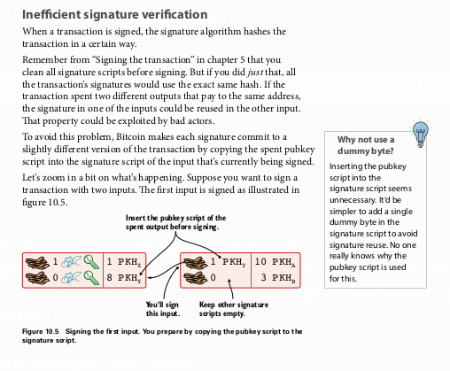
</p>

[Proses penandatanganan input pertama dalam transaksi, di mana pubkey script dari output yang dibelanjakan disalin ke dalam signature script. - Figure 10.5]

<p align="center">
  
</p>

[Proses penandatanganan input kedua dalam transaksi, di mana proses hashing yang serupa diulang. - Figure 10.6]

Akibatnya, waktu verifikasi meningkat secara **kuadratik (O(n²))** seiring dengan jumlah input. Jika `transaction` dengan 2 input membutuhkan waktu 1 ms untuk diverifikasi, `transaction` dengan 4 input akan membutuhkan sekitar 4 ms. `Transaction` dengan 1.024 input bisa memakan waktu lebih dari 4 menit.

<p align="center">
  
</p>

[Grafik yang menunjukkan pertumbuhan waktu verifikasi kuadratik seiring bertambahnya jumlah input dalam transaksi. - Figure 10.7]

Ini membuka celah untuk serangan *Denial-of-Service* (DoS), di mana penyerang dapat membuat `block` yang penuh dengan `transaction` multi-input yang kompleks, menyebabkan `node` di seluruh jaringan menjadi lambat atau bahkan macet.

#### Pemborosan Bandwidth

`Lightweight wallet` (atau `SPV wallet`) tidak memverifikasi `signature` karena mereka tidak memiliki `UTXO set` lengkap. Namun, untuk memverifikasi bahwa `transaction` mereka termasuk dalam sebuah `block` (melalui `merkle proof`), mereka harus mengunduh `transaction` secara lengkap, termasuk semua data `signature`-nya. Ini karena `txid` dihitung dari seluruh data `transaction`, termasuk `signature`.

Data `signature` (`scriptSig`) bisa memakan lebih dari 60-70% dari total ukuran `transaction`, terutama pada `transaction` dengan banyak input. Ini adalah pemborosan `bandwidth` yang signifikan bagi pengguna `lightweight wallet`.

<p align="center">
  
</p>

[Ilustrasi mengapa lightweight wallet membutuhkan seluruh data transaksi, termasuk signature, untuk memverifikasi merkle proof. - Figure 10.8]

#### Kesulitan Pembaruan Script

Bahasa `Script` Bitcoin memiliki ruang terbatas untuk pembaruan. Sebelumnya, pembaruan seperti `OP_CLTV` dan `OP_CSV` dilakukan dengan mendefinisikan ulang fungsi dari `opcode` `OP_NOP` yang tidak terpakai.

Keterbatasannya adalah:
* Hanya ada 10 `OP_NOP` yang tersedia.
* `Opcode` baru harus berperilaku persis seperti `NOP` (tidak melakukan apa-apa pada `stack`) jika berhasil dieksekusi, untuk menjaga kompatibilitas dengan `node` lama. Ini membatasi desain `opcode` baru (misalnya, mengapa `OP_CLTV` harus diikuti oleh `OP_DROP`).

Dibutuhkan mekanisme pembaruan yang lebih fleksibel dan dapat diperluas di masa depan.

### Solusi: Cara Kerja Segwit

`Segwit` menyelesaikan semua masalah di atas dengan satu perubahan fundamental: **memisahkan data `witness` dari data inti `transaction`**.

* Pada `transaction` lawas (legacy), `txid` dihitung dari semua data, termasuk `signature`.

<p align="center">
  
</p>

    [Anatomi transaksi legacy di mana txid mencakup signature script. - Figure 10.10]
* Pada `transaction` `segwit`, `scriptSig` pada dasarnya kosong. Data `signature` dan `public key` dipindahkan ke struktur data terpisah yang disebut `witness`, yang dilampirkan pada `transaction`.

<p align="center">
  
</p>

    [Anatomi transaksi segwit di mana txid tidak lagi mencakup data signature yang telah dipisahkan ke dalam field witness. - Figure 10.11]

Dengan memisahkan `witness`, `txid` tidak lagi bergantung pada data `signature`. Ini secara efektif **menghilangkan semua vektor `transaction malleability` pihak ketiga**.

#### Segwit Addresses

Untuk menerima dana ke `wallet` `segwit`, jenis alamat baru diperkenalkan. Alamat ini menggunakan skema encoding **Bech32** (**BIP173**) dan memiliki format yang berbeda.

Contoh alamat `segwit` (P2WPKH): `bc1qeqzjk7vume5wmrdgz5xyehh54cchdjag6jdmkj`

Keunggulan Bech32 dibandingkan Base58check (alamat lawas):
* **Tidak case-sensitive**: Semua karakter dalam huruf kecil, memudahkan penulisan dan pembacaan.
* **Deteksi error lebih baik**: Mampu mendeteksi hingga 4 kesalahan karakter dengan jaminan 100%.

Struktur alamat Bech32 terdiri dari:
1.  **Human-Readable Part (HRP)**: `bc` untuk `mainnet` Bitcoin.
2.  **Separator**: Angka `1`.
3.  **Data Part**: Meng-encode dua informasi:
    * **Witness Version**: Angka 0-16 yang memungkinkan pembaruan `script` di masa depan.
    * **Witness Program**: Data inti (misalnya, `PKH` atau `script hash`).

<p align="center">
  
</p>

[Proses decoding alamat segwit Bech32 untuk mengekstrak witness version dan witness program. - Figure 10.12]

Ketika seseorang mengirim dana ke alamat `segwit` ini, mereka membuat `output` `transaction` dengan `pubkey script` yang sangat sederhana, hanya berisi `witness version` dan `witness program`.

<p align="center">
  
</p>

[Contoh output transaksi yang dikirim ke alamat segwit, hanya berisi version byte dan witness program. - Figure 10.13]

#### Menghabiskan Output Segwit

Saat Kita ingin membelanjakan dana dari `output` `segwit`, Kita membuat `transaction` di mana:
* `scriptSig`-nya kosong.
* `Signature` dan `public key` ditempatkan di dalam *field* `witness` yang terpisah.

<p align="center">
  
</p>

[Transaksi yang membelanjakan output segwit, dengan scriptSig kosong dan data signature di dalam field witness. - Figure 10.14]

#### Verifikasi Transaksi Segwit

**Pada `Node` Baru (Segwit-aware):**
1.  `Node` mengenali pola `pubkey script` segwit: `<version_byte> <witness_program>`.
2.  `Node` memeriksa `witness version`. Saat ini, hanya versi 0 yang didefinisikan.
3.  Berdasarkan panjang `witness program` (untuk versi 0), `node` menentukan jenisnya:
    * **20 byte**: **P2WPKH** (Pay-to-Witness-Public-Key-Hash).
    * **32 byte**: **P2WSH** (Pay-to-Witness-Script-Hash).
4.  Untuk P2WPKH, `node` menggunakan *template* `script` P2PKH standar, tetapi mengambil `PKH` dari `witness program` dan `signature`/`public key` dari *field* `witness`.

<p align="center">
  
</p>

[Proses verifikasi transaksi P2WPKH oleh node segwit-aware. - Figure 10.15]

**Pada `Node` Lama (Non-segwit):**
Ini adalah bagian jenius dari desain `soft fork` `segwit`.
1.  `Node` lama tidak mengenali *field* `witness` dan mengabaikannya.
2.  Ia melihat `transaction` dengan `scriptSig` kosong dan `pubkey script` yang hanya berisi dua data push (`version byte` dan `witness program`).
3.  Saat `script` ini dieksekusi, dua nilai non-nol didorong ke `stack`. Item teratas `stack` adalah non-nol, yang diinterpretasikan sebagai `TRUE`.
4.  `Transaction` dianggap valid oleh `node` lama.

<p align="center">
  
</p>

[Bagaimana node lama memvalidasi transaksi segwit sebagai script yang selalu TRUE (anyone-can-spend). - Figure 10.16]

Ini secara efektif adalah `script` **"anyone-can-spend"** dari sudut pandang `node` lama. Keamanannya dijamin oleh fakta bahwa mayoritas besar `hashrate` jaringan adalah `segwit-aware` dan akan menolak `block` apa pun dari `miner` lama yang mencoba mencuri dana dengan cara ini.

#### Inklusi dalam Block

Agar `witness` yang terpisah tetap terikat pada `block`, `segwit` memperkenalkan aturan baru:
* Jika sebuah `block` mengandung `transaction` `segwit`, `coinbase transaction`-nya *harus* berisi sebuah **`witness commitment`**.
* `Witness commitment` ini adalah `hash` dari **`witness root hash`** dan sebuah `witness reserved value`.
* `Witness root hash` adalah `merkle root` yang dibangun dari **`wtxid`** semua `transaction` di dalam `block`. `Wtxid` adalah `hash` dari `transaction` *termasuk* data `witness`-nya.

`Commitment` ini ditempatkan di dalam sebuah `output` `OP_RETURN` di dalam `coinbase transaction`. `Node` lama mengabaikan `output` `OP_RETURN` ini, sehingga kompatibilitas tetap terjaga.

<p align="center">
  
</p>

[Diagram bagaimana merkle root dari wtxid (witness root hash) dimasukkan ke dalam coinbase transaction sebagai witness commitment. - Figure 10.17]

#### Pay-to-Witness-Script-Hash (P2WSH)

P2WSH adalah versi `segwit` dari P2SH. Ini berfungsi dengan cara yang sangat mirip:
* `Redeem script` yang kompleks (disebut **`witness script`**) di-hash menggunakan `SHA256` (menghasilkan hash 32-byte).
* Hash ini menjadi `witness program` dalam `output` P2WSH.
* Untuk membelanjakannya, `witness` harus berisi argumen `script` (misalnya, `signatures`) diikuti oleh `witness script` lengkap.
* `Node` `segwit-aware` akan memverifikasi bahwa `hash` dari `witness script` yang diberikan cocok dengan `witness program` di `output` yang dibelanjakan, lalu mengeksekusi `witness script` tersebut.

#### Metode Hashing Baru untuk Signature

`Segwit` memperkenalkan metode hashing `signature` baru (**BIP143**) yang memperbaiki masalah inefisiensi kuadratik.
* Data `transaction` yang umum untuk semua input (seperti daftar output) di-hash sekali saja untuk membuat sebuah *intermediate hash*.
* Untuk setiap input, *intermediate hash* ini kemudian di-hash bersama dengan data spesifik untuk input tersebut (seperti `outpoint` yang dibelanjakan, `script`, dan **jumlah (`amount`) yang dibelanjakan**).

<p align="center">
  
</p>

[Proses hashing dua langkah segwit yang efisien, di mana intermediate hash digunakan kembali untuk setiap input. - Figure 10.26]

Dengan melakukan ini, waktu verifikasi menjadi **linear (O(n))**, peningkatan performa yang sangat besar.

> **Poin Kritis untuk Auditor**: `Signature` `segwit` juga meng-commit **jumlah (`amount`)** dari *output* yang dibelanjakan. Ini adalah peningkatan keamanan yang signifikan untuk `hardware wallet`, karena `wallet` dapat memverifikasi `fee` yang dibayarkan tanpa perlu mempercayai komputer host untuk memberikan informasi `amount` yang benar.

#### Peningkatan Lainnya

* **Penghematan Bandwidth**: Karena `txid` tidak lagi bergantung pada `witness`, `lightweight wallet` dapat meminta `transaction` tanpa data `witness`, menghemat lebih dari 50% `bandwidth`.
* **Script yang Dapat Diperbarui**: `Witness version byte` menyediakan mekanisme yang bersih dan dapat diperluas untuk memperkenalkan versi baru `Script` di masa depan tanpa harus menggunakan `OP_NOP` lagi.
* **Kompatibilitas Wallet**: Untuk memungkinkan `wallet` lama mengirim dana ke `wallet` `segwit`, dikembangkan skema **`nested segwit`**, di mana `output` `segwit` (P2WPKH atau P2WSH) "dibungkus" di dalam `output` P2SH. Alamat yang dihasilkan dimulai dengan angka '3', sehingga dikenali oleh `wallet` lama.

### Batas Block

`Segwit` juga memperkenalkan cara baru untuk menghitung batas ukuran `block`, yang memungkinkan peningkatan kapasitas `transaction` melalui `soft fork`.

* **Batas Lama**: Ukuran `block` maksimal 1.000.000 byte.
* **Konsep Baru**: **`Block Weight`**. Batas baru adalah 4.000.000 *Weight Units* (WU).
    * 1 byte data non-`witness` (data `transaction` inti) dihitung sebagai **4 WU**.
    * 1 byte data `witness` dihitung sebagai **1 WU**.

<p align="center">
  
</p>

[Perhitungan block weight, di mana byte non-witness dikalikan 4 dan byte witness dikalikan 1. - Figure 10.36]

Implikasinya adalah:
* Batas ukuran `block` dasar (tanpa `witness`) tetap 1MB (1.000.000 byte * 4 WU/byte = 4.000.000 WU), sehingga kompatibel dengan `node` lama.
* Namun, karena data `witness` memiliki "diskon" bobot, ukuran total `block` (data inti + `witness`) secara efektif bisa mencapai ~2MB, tergantung pada seberapa banyak `transaction` `segwit` yang ada di dalamnya. Ini meningkatkan kapasitas jaringan.
* Batas *signature operations* (sigops) juga disesuaikan dengan skema bobot yang sama.

---

# Bab 11
## Peningkatan Bitcoin

Bab ini adalah salah satu bab paling krusial untuk memahami bagaimana *Bitcoin* berevolusi dan menjaga konsensus di tengah perubahan. Sebagai calon auditor keamanan, memahami mekanisme peningkatan dan potensi risikonya, seperti *chain split*, adalah fundamental. Bab ini akan membahas dua cara utama perubahan aturan konsensus: ***hard fork*** dan ***soft fork***. Kita juga akan menelusuri bagaimana mekanisme untuk menerapkan perubahan ini telah berkembang seiring waktu, yang berpuncak pada konsep penting di mana pengguna—bukan hanya *miners*—yang pada akhirnya menentukan aturan jaringan.

### *Bitcoin Forks*

Dalam konteks *Bitcoin*, istilah ***fork*** tidak merujuk pada penyalinan kode sumber (*open source project fork*), melainkan **perubahan pada aturan konsensus**. Aturan konsensus adalah seperangkat aturan yang divalidasi oleh setiap *full node* untuk menentukan apakah sebuah *blockchain* valid atau tidak. Aturan ini memastikan bahwa semua partisipan dalam jaringan memiliki pandangan yang sama mengenai "siapa memiliki apa" (*UTXO set*).

Perubahan aturan konsensus ini terbagi menjadi dua kategori utama:

* ***Hard Forks***: Ini adalah perubahan yang **melonggarkan** aturan konsensus. Artinya, *block* yang sebelumnya dianggap tidak valid oleh aturan lama, kini dianggap valid oleh aturan baru. Contohnya adalah meningkatkan batas maksimal *block weight*.
* ***Soft Forks***: Ini adalah perubahan yang **memperketat** aturan konsensus. Artinya, semua *block* yang dianggap valid oleh aturan baru juga pasti valid menurut aturan lama. Namun, beberapa *block* yang valid menurut aturan lama bisa jadi tidak valid menurut aturan baru. Contohnya adalah mengurangi batas maksimal *block weight*.

Buku ini menggunakan analogi sebuah restoran vegetarian yang populer untuk menjelaskan konsep ini. Anggap restoran adalah seorang *miner*, para tamu adalah *full nodes*, dan makanan yang disajikan adalah *blocks*.

* **Tanpa Perubahan**: Restoran menyajikan makanan vegetarian, dan para tamu (vegetarian) menerimanya. Ini adalah keadaan normal.
* **Hard Fork**: Restoran mulai menyajikan daging (melonggarkan aturan "hanya vegetarian"). Para tamu vegetarian akan menolak makanan ini. *Node* lama akan menolak *block* baru yang hanya valid menurut aturan baru yang lebih longgar.
* **Soft Fork**: Restoran mulai hanya menyajikan makanan vegan (memperketat aturan). Para tamu vegetarian tetap bisa menerima makanan ini karena makanan vegan adalah bagian dari makanan vegetarian. *Node* lama akan tetap menerima *block* baru karena *block* tersebut masih mematuhi aturan lama yang lebih longgar.

<p align="center">
  
</p>

[Diagram Venn yang membandingkan set block yang valid. Lingkaran "Aturan Lama" (misal, block weight <= 4M) berada di tengah. Lingkaran "Hard Fork" (misal, <= 8M) melingkupi aturan lama. Lingkaran "Soft Fork" (misal, <= 2M) berada di dalam aturan lama. - Figure 11.1]

Setiap kali sebuah *fork* diimplementasikan dan ada sekelompok *node* yang menjalankannya, ada risiko terjadinya ***chain split***, di mana *blockchain* terbelah menjadi dua versi yang berbeda.

#### Perubahan Aturan Non-Konsensus

Penting untuk membedakan *fork* dari pembaruan perangkat lunak biasa yang tidak mengubah aturan konsensus. Buku ini memberikan dua contoh:
1.  **Fitur `kill`**: Jika Kita menambahkan pesan jaringan baru bernama `kill` yang bisa mematikan *node* lain, ini bukan *fork*. *Node* lama tidak akan mengerti pesan ini dan akan mengabaikannya, sementara *node* baru yang menjalankan perangkat lunak Kita akan terpengaruh. Ini adalah perubahan protokol jaringan, bukan aturan konsensus.
2.  ***Compact Blocks*** **(BIP152)**: Ini adalah fitur optimasi di mana sebuah *node* mengirimkan *block header* dan ID *transaction* yang dipersingkat kepada *peer*-nya, bukan seluruh *block*. *Peer* tersebut kemudian merekonstruksi *block* menggunakan *transaction* yang sudah ada di *mempool*-nya. Ini adalah perubahan yang sangat berguna untuk mengurangi penggunaan *bandwidth* dan mempercepat propagasi *block*. Ini adalah perubahan *opt-in* yang kompatibel; *node* baru bisa berkomunikasi dengan lebih efisien, sementara *node* lama tetap berfungsi seperti biasa. Ini bukan *fork* karena tidak mengubah validasi *block*.

#### *Hard Forks*

Ketika sebuah *hard fork* terjadi (misalnya, batas *block weight* dinaikkan dari 4M menjadi 8M WU), *node* baru akan menerima *block* dari *node* lama (karena *block* <= 4M WU pasti <= 8M WU). Namun, *node* lama akan menolak *block* dari *node* baru jika ukurannya, misalnya, 6M WU.

Jika hanya minoritas *hashrate* yang menjalankan aturan baru, *block* mereka yang lebih besar akan sering ditolak oleh mayoritas jaringan, menyebabkan mereka membuang-buang sumber daya dan akhirnya harus kembali ke rantai utama.

Namun, jika mayoritas *hashrate* menjalankan aturan baru, mereka akan mulai membangun rantai mereka sendiri yang lebih panjang (memiliki lebih banyak *proof-of-work*). *Node* lama akan mengabaikan rantai ini dan terus menambang di rantai mereka yang lebih pendek. Ini menciptakan *chain split* yang berpotensi permanen.

<p align="center">
  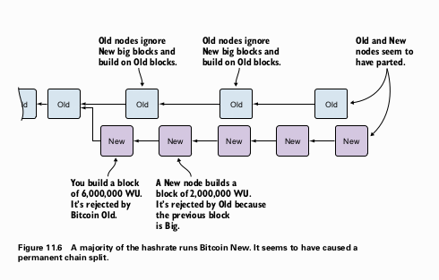
</p>

[Rantai blockchain terpisah, di mana node-node baru yang memiliki hashrate mayoritas berhasil membuat rantai yang lebih panjang daripada node-node lama. - Figure 11.6]

Risiko terbesar bagi rantai baru adalah **wipeout**. Jika karena suatu alasan mayoritas *hashrate* kembali ke rantai lama, rantai lama bisa menjadi lebih kuat (memiliki lebih banyak *proof-of-work* kumulatif) daripada rantai baru. Karena *block* lama valid bagi *node* baru, *node* baru akan melakukan *reorg* besar-besaran, meninggalkan rantai baru dan kembali ke rantai lama. Semua *transaction* di rantai baru akan hilang.

Untuk mencegah ini, *hard fork* dapat mengimplementasikan **wipeout protection**. Contohnya, *Bitcoin Cash* mengharuskan *block* pertama setelah *split* berukuran lebih dari 1 MB. Aturan ini membuat *block* tersebut tidak valid bagi *node* *Bitcoin* asli, dan sebaliknya, *block* *Bitcoin* asli di ketinggian yang sama menjadi tidak valid bagi *node* *Bitcoin Cash*. Ini menciptakan perpisahan yang tidak dapat didamaikan, mencegah *reorg*.

#### *Soft Forks*

Dengan *soft fork*, aturan diperketat. *Node* lama akan selalu menerima *block* dari *node* baru. Namun, jika seorang *miner* lama membuat sebuah *block* yang valid menurut aturan lama tetapi tidak valid menurut aturan baru (misalnya, menghabiskan *output* Segwit seolah-olah itu adalah *anyone-can-spend*), maka *node* baru akan menolak *block* tersebut.

Jika hanya minoritas *hashrate* yang menjalankan aturan baru, mereka akan menolak *block* dari mayoritas dan pada dasarnya "memisahkan diri" dari jaringan utama ke rantai mereka sendiri, yang kemungkinan besar tidak akan bertahan lama.

Namun, jika mayoritas *hashrate* menjalankan aturan baru, mereka akan mengabaikan *block* yang tidak patuh dari *miner* lama. Rantai baru akan terus tumbuh lebih kuat. *Miner* lama yang terus membuat *block* yang tidak patuh akan mendapati *block* mereka ditolak oleh mayoritas dan kehilangan *block reward*. Akhirnya, mereka akan terpaksa untuk meningkatkan perangkat lunak mereka atau berhenti menambang. Rantai lama akan mengalami *reorg* dan bergabung dengan rantai baru yang lebih kuat.

> **Perbedaan Kunci**:
> * Pada **hard fork**, *node* baru berisiko mengalami *wipeout*. *Node* lama aman dari *reorg*.
> * Pada **soft fork**, *node* lama berisiko mengalami *wipeout*. *Node* baru aman dari *reorg*.

#### *Transaction Replay*

Setelah *chain split* permanen, pengguna secara efektif memiliki koin di kedua rantai. Sebuah *transaction* yang dibuat untuk satu rantai bisa jadi valid di rantai lainnya juga. Jika Kita mengirim 2 BTC Old, ada kemungkinan *transaction* yang sama "diputar ulang" (*replayed*) di rantai New, menyebabkan Kita tanpa sengaja juga mengirim 2 BTC New.

Untuk mencegah ini, *fork* dapat mengimplementasikan **replay protection**. *Bitcoin Cash*, misalnya, memperkenalkan tipe `SIGHASH` baru bernama `FORKID`. *Transaction* yang menggunakan `FORKID` hanya valid di rantai *Bitcoin Cash* dan tidak valid di rantai *Bitcoin*. Sebaliknya, *transaction* tanpa `FORKID` hanya valid di rantai *Bitcoin* dan tidak valid di *Bitcoin Cash*.

### Mekanisme Peningkatan

Karena risiko *chain split*, peningkatan *Bitcoin* harus dilakukan dengan sangat hati-hati. Sejauh ini, sebagian besar peningkatan non-kritis dilakukan melalui *soft fork*. Mekanisme untuk mengkoordinasikan *soft fork* ini telah berevolusi.

#### Sinyal Coinbase (BIP16)

Peningkatan pertama yang terkoordinasi adalah untuk *pay-to-script-hash* (P2SH) pada tahun 2012. *Miner* yang mendukung perubahan ini menyisipkan string `/P2SH/` di dalam *coinbase transaction* mereka. Pada tanggal yang ditentukan (*flag day*), para pengembang menghitung jumlah *block* yang memberi sinyal. Karena lebih dari 55% *block* mendukung, aturan P2SH diaktifkan pada tanggal 1 April 2012, dan semua *node* yang telah diperbarui mulai memberlakukan aturan baru tersebut.

#### Sinyal dengan Peningkatan Nomor Versi *Block* (BIP34, 66, 65)

Mekanisme ini menggunakan *field* versi pada *block header* untuk sinyal. Ini digunakan untuk tiga *soft fork*:
* **BIP34**: Mengharuskan tinggi *block* dicantumkan dalam *coinbase transaction*. Menggunakan versi *block* 2.
* **BIP66**: Mengharuskan penggunaan format DER yang ketat untuk *signatures*. Menggunakan versi *block* 3.
* **BIP65**: Mengaktifkan `OP_CHECKLOCKTIMEVERIFY`. Menggunakan versi *block* 4.

Proses aktivasinya bertahap:
1.  *Miner* mulai membuat *block* dengan versi yang lebih tinggi (misalnya, versi 2 untuk BIP34).
2.  Ketika 75% dari 1.000 *block* terakhir memiliki versi ≥2, *node* baru mulai menolak *block* versi 2 yang tidak mematuhi aturan baru (misalnya, tidak ada tinggi *block* di *coinbase*).
3.  Ketika 95% dari 1.000 *block* terakhir memiliki versi ≥2, *node* baru mulai menolak semua *block* versi 1. Ini memaksa *miner* yang tersisa untuk meningkatkan perangkat lunak mereka agar *block* mereka tidak ditolak.

Mekanisme ini disebut ***miner-activated soft fork*** (MASF), karena *miners* yang memberi sinyal dan pada akhirnya memberlakukan aturan baru.

#### Sinyal dengan Bit Versi *Block* (BIP9)

Mekanisme sebelumnya memiliki keterbatasan: hanya satu *soft fork* yang bisa diimplementasikan pada satu waktu, dan nomor versi *block* tidak dapat digunakan kembali. **BIP9** mengatasi ini dengan menafsirkan *field* versi *block* secara berbeda.

*Block* yang 3 bit pertamanya adalah `001` akan menggunakan 29 bit sisanya sebagai bit-flags individual. Setiap bit dapat digunakan untuk memberi sinyal dukungan terhadap satu proposal peningkatan yang berbeda secara bersamaan.

<p align="center">
  
</p>

[Representasi 32-bit dari field versi blok, di mana 3 bit pertama disetel ke 001 dan 29 bit sisanya dapat digunakan sebagai flag individual. - Figure 11.21]

Setiap proposal BIP9 memiliki parameter:
* **Name**: Nama fitur (misalnya, `csv`, `segwit`).
* **Bit**: Bit mana dari 29 bit yang digunakan (0-28).
* **Start time**: Waktu kapan penghitungan sinyal dimulai.
* **Timeout**: Waktu kapan proposal dianggap gagal jika tidak mencapai ambang batas.

Proposal akan melalui beberapa status, yang dievaluasi setiap periode *retarget* (2.016 *blocks*):
<p align="center">
  
</p>

[Diagram alir status untuk aktivasi BIP9. Dimulai dari DEFINED, beralih ke STARTED setelah start time. Dari STARTED, bisa beralih ke LOCKED_IN jika ambang batas 95% tercapai, atau ke FAILED jika timeout tercapai. Dari LOCKED_IN, beralih ke ACTIVE setelah satu periode retarget. - Figure 11.22]

* **DEFINED**: Status awal sebelum *start time*.
* **STARTED**: Setelah *start time*, jaringan menunggu sinyal.
* **LOCKED_IN**: Jika 95% (1.916 dari 2.016 *blocks*) memberi sinyal dukungan dalam satu periode *retarget*, status berubah menjadi `LOCKED_IN`. Ini adalah titik di mana aktivasi tidak bisa dibatalkan lagi.
* **ACTIVE**: Setelah satu periode *retarget* penuh dalam status `LOCKED_IN`, aturan baru mulai diberlakukan.
* **FAILED**: Jika *timeout* tercapai sebelum status `LOCKED_IN`, proposal gagal.

**Contoh Penerapan BIP9:**
* **Relative Lock Time (csv)**: Menggunakan bit 0. Proses ini berjalan lancar dan mencapai status `ACTIVE` setelah hanya tiga periode *retarget*.
* **Segregated Witness (Segwit)**: Ini adalah contoh yang jauh lebih kompleks dan kontroversial. Menggunakan bit 1, proposal Segwit macet di sekitar 30% dukungan dari *miner* dan berisiko gagal. Ini memicu perdebatan sengit di komunitas.

Konflik seputar Segwit melahirkan beberapa proposal tandingan:
* **Segwit2x**: Proposal untuk mengaktifkan Segwit, diikuti dengan *hard fork* untuk meningkatkan *block size*. Didukung oleh banyak *miner*.
* **BIP148**: Proposal untuk melakukan ***user-activated soft fork*** (UASF). *Node* yang menjalankan BIP148 akan mulai menolak *block* yang tidak memberi sinyal dukungan untuk Segwit (bit 1) mulai 1 Agustus 2017. Ini adalah upaya untuk "memaksa" aktivasi Segwit tanpa bergantung pada *miner*.
* **BIP91**: Proposal kompromi untuk menjembatani semua pihak. BIP91 menggunakan bit 4 dan ambang batas 80% yang lebih rendah. Setelah aktif, ia akan menolak *block* yang tidak memberi sinyal untuk Segwit (bit 1). Karena mayoritas *miner* mengadopsi BIP91, ini menyebabkan tingkat sinyal untuk proposal Segwit asli (bit 1) meroket hingga lebih dari 95%, yang akhirnya mengaktifkan Segwit melalui mekanisme BIP9 asli.

Pelajaran dari aktivasi Segwit adalah bahwa memberikan hak veto kepada minoritas kecil *hashrate* (5% dalam BIP9) dapat menghambat peningkatan yang diinginkan oleh mayoritas ekonomi.

### *User-Activated Soft Forks* (UASF)

Konsep ini menekankan bahwa kekuatan tertinggi dalam jaringan *Bitcoin* tidak terletak pada *miner*, tetapi pada **mayoritas ekonomi**—pengguna, bursa, pedagang, dan bisnis yang menggunakan *Bitcoin*. *Miner* dibayar untuk mengikuti aturan, bukan untuk menentukannya.

UASF adalah mekanisme di mana mayoritas ekonomi ini secara kolektif memutuskan untuk memberlakukan aturan baru (yang lebih ketat) pada tanggal atau tinggi *block* yang telah ditentukan.

Mari kita bayangkan sebuah skenario:
1.  99% pengguna (*node* ekonomi) ingin menerapkan *soft fork* untuk memperkecil ukuran *block*, tetapi 100% *miner* menolaknya.
2.  Pengguna memperbarui perangkat lunak mereka untuk menolak *block* yang terlalu besar setelah tanggal yang ditentukan.
3.  Setelah tanggal tersebut, *miner* terus membuat *block* besar. Namun, bagi 99% pengguna, *block-block* ini tidak valid. *Block reward* yang diterima *miner* menjadi tidak berharga karena tidak ada bursa atau pedagang yang mau menerimanya.
4.  Jika ada satu *miner* saja yang memutuskan untuk mengikuti aturan pengguna dan membuat *block* kecil, *block* tersebut akan menjadi satu-satunya *block* yang diterima oleh mayoritas ekonomi. *Miner* ini akan bisa menjual koinnya dan membayar tagihan listrik.
5.  Melihat ini, *miner* lain yang rasional akan beralih ke rantai yang diterima pengguna agar tidak merugi.
6.  Akhirnya, rantai yang didukung pengguna akan memiliki mayoritas *hashrate*, menyebabkan *reorg* pada rantai *miner* yang tidak patuh. Rantai yang tidak patuh akan terhapus. Pengguna menang.

<p align="center">
  
</p>

lalu

<p align="center">
  
</p>

lalu

<p align="center">
  
</p>

[Serangkaian diagram yang menggambarkan bagaimana satu miner yang mematuhi aturan pengguna berhasil membuat rantai yang valid, yang kemudian diikuti oleh miner lain, dan akhirnya menyebabkan rantai yang tidak patuh dihapus. - Figure 11.28, 11.29, 11.30]

UASF adalah penegasan kembali bahwa *Bitcoin* adalah sistem yang diatur oleh konsensus pengguna. Mekanisme deployment di masa depan kemungkinan akan menggabungkan sinyal dari *miner* dengan mekanisme aktivasi oleh pengguna untuk memastikan bahwa peningkatan yang diinginkan oleh mayoritas ekonomi dapat diimplementasikan tanpa bisa diveto oleh sekelompok kecil *miner*.

---

# Apendiks A
## Menggunakan `bitcoin-cli`

Apendiks ini adalah panduan praktis yang melanjutkan dari pembahasan di Bab 8 tentang cara menjalankan *full node* Kita sendiri. Fokus utamanya adalah pada **`bitcoin-cli`**, sebuah *command-line tool* (alat berbasis baris perintah) yang disediakan oleh *Bitcoin Core* untuk berinteraksi dengan *node* Kita. Kita akan membahas cara berkomunikasi dengan *daemon* `bitcoind`, membuat dan mengelola *wallet* yang terenkripsi, menerima dan mengirim *bitcoin*, serta menjelajahi detail *blockchain*.

### Berkomunikasi dengan `bitcoind`

Saat Kita menjalankan `bitcoind` (program *full node* yang berjalan di latar belakang), program ini juga menjalankan sebuah *web server* internal yang secara *default* mendengarkan di port TCP 8332. `bitcoin-cli` berfungsi sebagai klien yang mengirimkan perintah ke *server* ini melalui protokol HTTP.

Prosesnya menggunakan standar yang disebut **JSON-RPC** (*JavaScript Object Notation - Remote Procedure Call*). Ini adalah cara standar bagi sebuah program untuk "memanggil fungsi" di program lain yang berjalan di mesin yang berbeda (atau dalam kasus ini, proses yang berbeda di mesin yang sama).

Sebagai contoh, saat Kita menjalankan perintah:

```bash
$ ./bitcoin-cli getblockhash 0
```

`bitcoin-cli` sebenarnya membuat sebuah permintaan HTTP POST yang berisi *body* dalam format JSON seperti ini:

```json
{"method":"getblockhash","params":[0],"id":1}
```

*Web server* `bitcoind` kemudian memproses permintaan ini, mencari *hash* dari *block* di ketinggian 0, dan mengirimkan kembali respons HTTP dengan *body* JSON:

```json
{"result":"000000000019d6689c085ae165831e934ff763ae46a2a6c172b3f1b60a8ce26f", "error":null,"id":"1"}
```

`bitcoin-cli` kemudian hanya menampilkan bagian `"result"` kepada Kita di terminal.

#### Menggunakan `curl`

Karena komunikasi ini berbasis HTTP, Kita bisa menggunakan alat lain seperti `curl` untuk berinteraksi dengan `bitcoind`. Namun, ini memerlukan konfigurasi autentikasi (nama pengguna dan kata sandi) di dalam file konfigurasi `bitcoin.conf` yang terletak di `~/.bitcoin/bitcoin.conf`.

```ini
rpcuser=<pilih_username_anda>
rpcpassword=<pilih_password_anda>
```

Setelah mengatur ini dan me-restart `bitcoind`, Kita bisa mengirim perintah menggunakan `curl` seperti ini:

```bash
curl --user kalle --data-binary \
'{"method":"getblockhash","params":[0],"id":1}' \
-H 'content-type: text/plain;' http://127.0.0.1:8332/
```

Ini menunjukkan bahwa `bitcoin-cli` hanyalah sebuah antarmuka yang nyaman untuk mekanisme RPC yang lebih mendasar.

-----

### *Graphical User Interface* (GUI)

Selain `bitcoind` dan `bitcoin-cli`, *Bitcoin Core* juga menyediakan versi dengan antarmuka grafis yang disebut **`bitcoin-qt`**.

  * `bitcoin-qt` menggunakan direktori data dan file `wallet.dat` yang sama dengan `bitcoind`, jadi keduanya bisa digunakan secara bergantian (tapi tidak bersamaan).
  * GUI ini cocok jika Kita ingin menggunakan *Bitcoin Core* sebagai *wallet* sehari-hari, tetapi untuk mengakses fungsionalitas penuh, `bitcoin-cli` tetap diperlukan.
  * Secara *default*, `bitcoin-qt` tidak menjalankan *web server* RPC. Untuk mengaktifkannya agar Kita tetap bisa menggunakan `bitcoin-cli`, Kita harus menjalankannya dengan *flag* `-server`:
    ```bash
    $ ./bitcoin-qt -server &
    ```

-----

### Mengenal `bitcoin-cli`

Perintah terpenting untuk memulai adalah **`help`**.

  * Menjalankan `./bitcoin-cli help` akan memberikan daftar semua perintah yang tersedia, dikelompokkan berdasarkan kategori seperti *Blockchain*, *Mining*, dan *Wallet*.
  * Untuk mendapatkan detail tentang perintah spesifik, gunakan `help` diikuti nama perintah tersebut. Contoh:
    ```bash
    $ ./bitcoin-cli help getblockhash
    ```
    Ini akan memberikan deskripsi, argumen yang dibutuhkan, format hasil, dan contoh penggunaan.

`bitcoin-cli` mendukung dua cara pemanggilan:

1.  **Argumen Posisi**: Cara paling umum, di mana makna argumen ditentukan oleh urutannya. Contoh: `./bitcoin-cli getblockhash 1000`.
2.  **Argumen Bernama**: Menggunakan *flag* `-named`, Kita bisa menyebutkan nama argumen. Ini berguna untuk argumen opsional. Contoh: `./bitcoin-cli -named getblockhash height=1000`.

-----

### Praktik Langsung (*Getting to Work*)

Bagian ini memandu Kita melalui alur kerja praktis menggunakan `bitcoin-cli`.

#### 1\. Membuat *Wallet* Terenkripsi

Saat pertama kali dijalankan, `bitcoind` secara otomatis membuat sebuah *wallet* di `~/.bitcoin/wallet.dat`. *Wallet* ini **tidak terenkripsi**, artinya *private keys* dan *seed* HD (*Hierarchical Deterministic*) tersimpan dalam bentuk teks biasa di *hard drive* Kita, yang merupakan risiko keamanan.

Untuk mengamankannya, Kita harus mengenkripsi *wallet*:

```bash
$ ./bitcoin-cli -stdin encryptwallet
secretpassword<ENTER>
<CTRL-D>
```

  * Perintah ini akan mengenkripsi *wallet* Kita dengan *password* yang Kita berikan.
  * **Penting**: Menggunakan *flag* `-stdin` membuat Kita memasukkan *password* langsung ke program, sehingga tidak tersimpan di riwayat *command-line* Kita (`.bash_history`), ini adalah praktik keamanan yang baik.
  * Setelah enkripsi, `bitcoind` akan berhenti. Kita perlu me-restartnya.
  * Proses ini akan membuat *seed* HD baru, jadi Kita **wajib membuat *backup* baru**.

Setelah di-restart, `getwalletinfo` akan menunjukkan `unlocked_until: 0`, yang menandakan *wallet* dalam keadaan terkunci.

#### 2\. Melakukan *Backup Wallet*

*Bitcoin Core* tidak menggunakan *mnemonic sentences* (BIP39) seperti *wallet* lain karena beberapa alasan, seperti kurangnya informasi tentang versi, tanggal pembuatan (*birthday*), dan *derivation paths*.

Cara yang benar untuk melakukan *backup* saat *node* berjalan adalah dengan perintah `backupwallet`:

```bash
$ ./bitcoin-cli backupwallet ~/walletbackup.dat
```

Perintah ini akan membuat salinan yang aman dan konsisten dari file `wallet.dat` Kita. Kita tidak boleh hanya menyalin file `wallet.dat` secara manual saat `bitcoind` berjalan, karena file tersebut mungkin sedang dalam proses penulisan dan bisa menyebabkan *backup* menjadi korup. Simpan file *backup* ini di lokasi yang aman (misalnya, USB *stick* di brankas).

#### 3\. Menerima Uang

Untuk menerima *bitcoin*, Kita perlu membuat alamat baru:

```bash
$ ./bitcoin-cli -named getnewaddress address_type=bech32
bc1q2r9mql4mkz3z7yfxvef76yxjd637r429620j75
```

  * Perintah ini membuat alamat **Bech32** (alamat Segwit asli). Kita juga bisa meminta tipe `legacy` (P2PKH, dimulai dengan angka 1) atau `p2sh-segwit` (P2WPKH yang dibungkus dalam P2SH, dimulai dengan angka 3).

Setelah seseorang mengirim dana ke alamat ini, Kita bisa melihatnya sebagai saldo yang belum dikonfirmasi dengan `getunconfirmedbalance`. Kita dapat melihat detail *transaction* yang masuk dengan `listtransactions` dan `getrawtransaction <txid> 1` untuk analisis yang lebih dalam.

#### 4\. Mengirim Uang

Untuk mengirim dana, *wallet* Kita harus dalam keadaan tidak terkunci.

1.  **Buka Kunci *Wallet***:

    ```bash
    $ ./bitcoin-cli -stdin walletpassphrase
    secretpassword<ENTER>
    300<ENTER>
    <CTRL-D>
    ```

    Perintah ini membuka kunci *wallet* selama **300 detik**. Setelah itu, *wallet* akan terkunci kembali secara otomatis.

2.  **Kirim *Bitcoin***:
    Gunakan perintah `sendtoaddress`. Argumen `conf_target=20` memberi tahu *wallet* untuk menargetkan biaya agar *transaction* dikonfirmasi dalam 20 *block*. `estimate_mode=ECONOMICAL` akan menggunakan estimasi biaya yang lebih konservatif.

    ```bash
    $ ./bitcoin-cli -named sendtoaddress \
    address="bc1qu456..." \
    amount=0.001 conf_target=20 estimate_mode=ECONOMICAL
    a13bcb16d8f41851cab8e939c017f1e05cc3e2a3c7735bf72f3dc5ef4a5893a2
    ```

    Hasilnya adalah `txid` dari *transaction* yang baru saja Kita buat.

3.  **Kunci Kembali *Wallet***:
    Untuk keamanan, segera kunci kembali *wallet* Kita secara manual:

    ```bash
    $ ./bitcoin-cli walletlock
    ```

Dengan mengikuti langkah-langkah di apendiks ini, Kita mendapatkan pengalaman langsung dalam mengelola *node* dan *wallet* *Bitcoin Core*, sebuah keterampilan esensial untuk memahami seluk-beluk teknis *Bitcoin* di level protokol.
