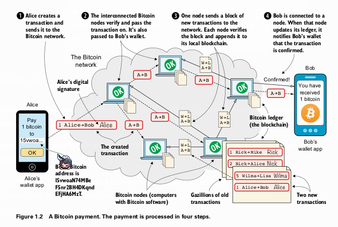

# Bab 1
## Pengenalan Bitcoin
#### **1. Apa itu Bitcoin?

Bitcoin adalah **jaringan terdesentralisasi** untuk **mengirim dan menerima mata uang digital** bernama **bitcoin**.

* **Jaringan terdesentralisasi** → artinya tidak ada server pusat atau perusahaan yang mengatur. Semua komputer yang terhubung (**node**) saling berbagi data dan saling memverifikasi transaksi.
* **Mata uang digital (bitcoin)** → data dalam bentuk unit nilai, yang bisa dikirim dari satu alamat ke alamat lain di jaringan Bitcoin.
* **Alamat Bitcoin** → mirip seperti nomor rekening, tapi berbentuk string huruf dan angka hasil dari kriptografi.

### **Ciri utama Bitcoin**

1. **Tanpa pihak ketiga** → tidak ada bank atau perusahaan yang memproses transaksi.
2. **Blockchain** → database publik tempat semua transaksi disimpan secara permanen.
3. **Kriptografi** → teknologi matematika untuk memastikan data transaksi tidak bisa dipalsukan dan kepemilikan bitcoin hanya bisa digunakan oleh pemilik kunci pribadinya.

**Istilah Penting:**

* **Bitcoin (dengan 'B' besar):** Mengacu pada sistem atau jaringannya secara keseluruhan.
* **bitcoin (dengan 'b' kecil):** Mengacu pada unit mata uangnya (simbol yang umum digunakan adalah BTC atau XBT). 

Tidak ada pemerintah atau perusahaan yang mengendalikan Bitcoin. Sebaliknya, ribuan komputer di seluruh dunia yang terhubung dalam **Jaringan Bitcoin (Bitcoin Network)** secara kolektif menjaga sistem ini tetap berjalan 24/7. Untuk menggunakan Bitcoin, Kita tidak perlu mendaftar; Kita hanya butuh koneksi internet dan sebuah program komputer, seperti aplikasi di ponsel.

**Ekosistem Bitcoin**
Jaringan Bitcoin dikelilingi oleh berbagai partisipan dan layanan:

* **End users (Pengguna akhir):** Orang-orang yang menggunakan Bitcoin untuk kebutuhan sehari-hari seperti menabung, berbelanja, atau berspekulasi.
* **Corporate users (Pengguna korporat):** Perusahaan yang menggunakan Bitcoin untuk kebutuhan bisnis, misalnya membayar gaji internasional.
* **Merchants (Pedagang):** Toko atau restoran yang menerima pembayaran Bitcoin.
* **Bitcoin services (Layanan Bitcoin):** Perusahaan yang menyediakan layanan terkait Bitcoin, seperti isi ulang pulsa, layanan anonimitas, atau pengiriman uang (remitansi).
* **Exchanges (Bursa):** Layanan komersial tempat orang menukar mata uang lokal mereka (seperti Rupiah) ke bitcoin dan sebaliknya.
* **Bitcoin developers (Pengembang Bitcoin):** Orang-orang yang bekerja (seringkali sukarela) pada program *open source* yang menjalankan Jaringan Bitcoin.
* **Bitcoin nodes (Node Bitcoin):** Komputer-komputer yang menjalankan perangkat lunak Bitcoin. Mereka bertanggung jawab untuk memproses pembayaran, menjaga keamanan, dan mencetak bitcoin baru. Siapa pun bisa menjalankan node mereka sendiri.

  

Ekosistem Bitcoin diilustrasikan dengan Jaringan Bitcoin (kumpulan komputer/node yang terhubung) di tengah. Di sekelilingnya ada berbagai partisipan: Pengguna akhir, Pengguna korporat, Pedagang, Layanan Bitcoin, Bursa, Pengembang, dan Protokol di atas Bitcoin. Jaringan ini bertanggung jawab atas keamanan, pencetakan bitcoin baru, dan pemrosesan pembayaran.

#### **2. The big picture**

Bagian ini menjelaskan alur pembayaran Bitcoin dalam empat langkah sederhana, menggunakan contoh Alice yang ingin membayar 1 BTC kepada Bob.

  

Diagram alur pembayaran Bitcoin dari Alice ke Bob.

1. Ponsel Alice (wallet app) membuat transaksi dan mengirimkannya ke Jaringan Bitcoin.
2. Node-node di dalam jaringan saling memverifikasi dan meneruskan transaksi tersebut.
3. Salah satu node mengumpulkan transaksi baru ke dalam sebuah "blok" dan menyebarkannya. Node lain memverifikasi blok tersebut dan menambahkannya ke catatan mereka (blockchain).
4. Ponsel Bob (wallet app) terhubung ke sebuah node. Ketika node tersebut mengupdate catatannya, ia memberi tahu wallet Bob bahwa transaksi telah dikonfirmasi dan Bob telah menerima 1 bitcoin.

**Proses Pembayaran Empat Langkah:**

1. **Alice membuat transaksi (Step 1 - Transactions):** Alice menggunakan aplikasi dompetnya (*wallet app*) untuk membuat instruksi pembayaran. Transaksi ini berisi jumlah (1 BTC), alamat Bitcoin Bob (tujuan), dan *digital signature* (tanda tangan digital) milik Alice yang membuktikan bahwa dialah pemilik sah dana tersebut.

2. **Jaringan Bitcoin memverifikasi (Step 2 - The Bitcoin network):** Transaksi dikirim ke beberapa *node* di jaringan. Setiap *node* yang menerima akan memverifikasi: apakah Alice benar-benar punya uangnya dan apakah tanda tangannya valid. Jika valid, *node* akan meneruskannya ke *node-node* lain yang terhubung dengannya (*peers*).

3. **Transaksi ditambahkan ke blockchain (Step 3 - The blockchain):** Agar semua *node* memiliki catatan yang sama dan terurut, satu *node* (disebut *miner*) akan mengambil peran untuk mengumpulkan transaksi-transaksi yang tertunda ke dalam sebuah **blok**. Blok ini kemudian ditambahkan ke rantai blok yang sudah ada sebelumnya, yang disebut **blockchain**. Blockchain ini adalah buku besar (*ledger*) dari semua transaksi yang pernah terjadi. *Miner* yang berhasil menambahkan blok baru akan mendapatkan hadiah berupa bitcoin baru.
4. **Bob menerima notifikasi (Step 4 - Wallets):** Setelah transaksi Alice masuk ke dalam sebuah blok di *blockchain*, *node* yang terhubung dengan dompet Bob akan memberitahukan bahwa pembayaran telah dikonfirmasi. Sekarang Bob dapat dengan yakin menganggap 1 BTC itu miliknya.

#### **3. Problems with money today**

Bitcoin diciptakan untuk menyelesaikan beberapa masalah yang melekat pada sistem keuangan tradisional.

* **Segregation (Pemisahan):** Sekitar 38% populasi dunia tidak memiliki akses ke rekening bank. Tanpa layanan perbankan, mereka sulit berpartisipasi dalam ekonomi digital dan global. Hal ini bisa disebabkan oleh biaya yang mahal, kurangnya dokumen identitas, atau diskriminasi.
* **Privacy issues (Masalah Privasi):** Dengan pembayaran elektronik konvensional (kartu kredit, transfer bank), pemerintah atau lembaga keuangan dapat dengan mudah melacak, menyensor, membekukan, atau bahkan menyita dana Kita.
* **Inflation (Inflasi):** Inflasi adalah penurunan daya beli mata uang. Selembar uang hari ini bisa membeli lebih sedikit barang di masa depan. Ini terjadi karena pemerintah dapat mencetak lebih banyak uang, yang mengurangi nilai dari uang yang sudah beredar. Kasus ekstrem disebut *hyperinflation*, seperti yang terjadi di Zimbabwe.
* **Borders (Batas Negara):** Mengirim uang antar negara seringkali lambat, mahal, dan rumit. Layanan seperti Western Union bisa memotong biaya hingga 16% atau lebih untuk remitansi tunai.

#### **4. The Bitcoin approach**

Bitcoin menawarkan model yang berbeda untuk mengatasi masalah-masalah di atas.

* **Decentralized (Terdesentralisasi):** Tidak ada satu entitas pun (bank atau pemerintah) yang mengendalikan Bitcoin. Kontrol didistribusikan ke ribuan *node* di seluruh dunia. Ini membuat Bitcoin bersifat *permissionless* (tanpa izin), siapa pun bisa berpartisipasi, dan tahan terhadap sensor.
* **Limited supply (Pasokan Terbatas):** Hanya akan pernah ada total 21 juta bitcoin. Pasokan ini tidak bisa ditambah sesuka hati, sehingga membuatnya tahan terhadap inflasi tinggi yang disebabkan oleh pencetakan uang berlebih. Saat ini, pasokan terus bertambah melalui hadiah blok untuk para *miner*, tetapi laju penambahannya berkurang setengahnya setiap empat tahun.
* **Borderless (Tanpa Batas):** Karena berjalan di internet, Bitcoin bersifat global. Mengirim bitcoin ke orang di seberang benua sama mudahnya dengan mengirim ke orang di ruangan yang sama.

#### **5. How is Bitcoin used?**

* **Savings (Tabungan):** Kita dapat menyimpan kekayaan dengan aman hanya dengan mengamankan *private key* Kita. Kita bisa menyimpannya di kertas, aplikasi, atau bahkan menghafalnya.
* **Cross-border payments (Pembayaran Lintas Batas):** Bitcoin seringkali lebih murah dan cepat untuk mengirim uang ke luar negeri dibandingkan layanan remitansi tradisional.
* **Shopping (Belanja):** Ideal untuk pembayaran online karena aman. Kita tidak memberikan informasi sensitif (seperti detail kartu kredit) kepada pedagang, hanya mengirim jumlah yang disepakati. 
* **Speculation (Spekulasi):** Harga bitcoin sangat fluktuatif (naik turun), yang menarik bagi sebagian orang untuk mencoba membeli saat harga rendah dan menjual saat harga tinggi.
* **Non-currency uses (Penggunaan Non-Mata Uang):** Karena data kecil bisa disematkan dalam transaksi, Bitcoin bisa digunakan untuk hal lain:

  * **Ownership (Kepemilikan):** Mencatat transfer kepemilikan aset, seperti mobil, dengan menyertakan nomor sasis dalam transaksi.
  * **Proof of existence (Bukti Keberadaan):** Membuktikan bahwa sebuah dokumen digital sudah ada pada waktu tertentu dengan "menjangkarkan" sidik jari digital (*cryptographic hash*) dari dokumen tersebut ke dalam *blockchain*. 

#### **6. When not to use Bitcoin**

Bitcoin belum cocok untuk semua hal:

* **Tiny payments (Pembayaran Sangat Kecil):** Biaya transaksi (*transaction fee*) terkadang bisa lebih mahal dari jumlah yang dikirim, membuatnya tidak ekonomis untuk pembayaran mikro. (Teknologi lapisan kedua seperti Lightning Network mencoba mengatasi ini).
* **Instant payments (Pembayaran Instan):** Transaksi Bitcoin memerlukan waktu (biasanya sekitar 10–60 menit) untuk mendapatkan konfirmasi yang aman. Ini tidak ideal untuk pembelian cepat seperti secangkir kopi.
* **Savings you can’t afford to lose (Tabungan yang Tidak Sanggup Kita Kehilangan):** Bitcoin masih merupakan teknologi baru dan harganya sangat fluktuatif. Ada juga risiko kehilangan *private key* Kita secara permanen. Jangan menaruh semua uang yang tidak bisa Kita relakan kehilangannya. **Di Bitcoin, Kita bertanggung jawab penuh atas keamanan dana Kita sendiri.**

#### **7. Other cryptocurrencies**

Selain Bitcoin, ada ribuan mata uang kripto lain yang disebut *alt-coin* (koin alternatif). Beberapa menawarkan fitur unik (seperti privasi yang lebih tinggi), sementara yang lain mungkin hanya tiruan atau bahkan penipuan.

Bitcoin memiliki **network effect (efek jaringan)** yang sangat kuat: nilainya meningkat karena banyak orang dan layanan yang sudah menggunakannya. Sebuah *alt-coin* baru akan sulit bersaing jika tidak menawarkan inovasi yang signifikan, sama seperti sulitnya membuat jejaring sosial baru untuk menyaingi yang sudah ada.

  

Perbandingan Efek Jaringan. Sisi kiri menunjukkan Internet (dengan logo Facebook, Google, Skype, Twitter) dan Jaringan Bitcoin yang ramai, dengan label "Banyak orang dan layanan". Sisi kanan menunjukkan "Wownet" dan "Wowcoin" yang sepi dan terisolasi, dengan label "Tidak ada orang atau layanan".

### **Ringkasan Bab 1**

* Bitcoin adalah uang global tanpa batas yang bisa digunakan siapa saja dengan koneksi internet.
* Jaringan komputer terdesentralisasi (*node*) memverifikasi dan mencatat semua pembayaran dalam sebuah buku besar publik yang disebut *blockchain*.
* Sebuah pembayaran diproses melalui 4 langkah: transaksi dibuat, diverifikasi oleh jaringan, ditambahkan ke *blockchain*, dan dompet penerima diberi notifikasi.
* Bitcoin mencoba menyelesaikan masalah inflasi, batas negara, eksklusi keuangan, dan privasi melalui pasokan terbatas, desentralisasi, dan sifatnya yang global.
* Selain Bitcoin, ada banyak *alt-coin* lain, tetapi Bitcoin memiliki efek jaringan yang paling kuat.

---

# Bab 2
## cryptographic hash functions and digital signatures

Bab ini akan memulai perjalanan kita dalam membangun pemahaman tentang Bitcoin dari dasar. Kita akan membuat sebuah sistem uang fiktif yang sangat sederhana bernama "token kue" (*cookie token*). Kemudian, kita akan mengidentifikasi kelemahannya dan memperbaikinya dengan dua alat kriptografi yang sangat penting: **Fungsi Hash Kriptografis** (*Cryptographic Hash Functions*) dan **Tanda Tangan Digital** (*Digital Signatures*).

#### **1. The cookie token spreadsheet (Spreadsheet Token Kue)**

Bayangkan di kantor Anda ada sebuah kafe. Untuk membeli kue, Anda dan rekan kerja tidak menggunakan uang tunai, melainkan sistem internal yang dicatat dalam sebuah *spreadsheet* (lembar lajur). Sistem ini disebut **Sistem Token Kue**.

* **Pusat Kepercayaan:** Ada satu orang yang sangat dipercaya bernama Lisa. Dia yang memegang dan mengelola *spreadsheet* ini. Semua orang bisa melihatnya (*read-only*), tetapi hanya Lisa yang bisa mengubahnya.
* **Cara Kerja Transaksi:** Jika Alice ingin membeli kue seharga 10 CT (*Cookie Token*), dia akan memberitahu Lisa. Lisa akan memeriksa saldo Alice dengan mencari semua transaksi masuk dan keluar atas nama Alice. Jika saldonya cukup, Lisa akan menambahkan baris baru di akhir *spreadsheet*:
  `Dari: Alice, Ke: Cafe, Jumlah: 10 CT`.
  Kafe melihat baris baru ini dan memberikan kue kepada Alice.
* **Penciptaan Koin Baru (Coin Creation):** Bagaimana token ini muncul pertama kali? Sebagai imbalan atas pekerjaannya menjaga *spreadsheet*, Lisa dihadiahi **7.200 CT baru setiap hari**. Dia membuat baris transaksi khusus:
  `Dari: BARU, Ke: Lisa, Jumlah: 7.200 CT`.
  Ini adalah satu-satunya cara token baru diciptakan.
* **Pasokan Terbatas (Limited Supply):** Sistem ini dirancang agar hadiah untuk Lisa berkurang setengahnya setiap empat tahun (mirip seperti *Bitcoin Halving*). Dari 7.200 CT/hari, menjadi 3.600 CT/hari setelah 4 tahun, dan seterusnya, hingga hadiahnya menjadi 0. Ini memastikan total pasokan token tidak akan pernah melebihi 21 juta CT.

  

lalu

  

Sebuah *spreadsheet* sederhana dengan kolom "Dari", "Ke", dan "Jumlah CT". Transaksi baru, seperti Alice membeli kue, ditambahkan sebagai baris baru di bagian paling bawah.

**Hubungan Sistem Token Kue dengan Bitcoin (Tabel 2.1):**

| Konsep di Token Kue  | Konsep di Bitcoin              | Dibahas di Bab |
| :------------------- | :----------------------------- | :------------- |
| 1 cookie token       | 1 bitcoin                      | Bab 2          |
| Spreadsheet          | The blockchain                 | Bab 6          |
| Baris di spreadsheet | Sebuah transaksi (transaction) | Bab 5          |
| Lisa                 | Seorang penambang (miner)      | Bab 7          |

Saat ini, kita berada di **Sistem Token Kue versi 1.0**.
Kelemahannya: sistem ini sepenuhnya bergantung pada kepercayaan terhadap Lisa dan kemampuannya untuk mengenali setiap orang.

#### **2. Cryptographic Hashes**

Fungsi hash kriptografis adalah alat fundamental di Bitcoin. Anda bisa membayangkannya seperti **sidik jari digital**.

* **Definisi:** Ini adalah fungsi matematis yang mengambil data input dengan ukuran berapa pun (misalnya gambar kucing berukuran 1.21 MB) dan menghasilkan output dengan ukuran tetap (misalnya 32-byte). Output ini disebut **hash**.
* **Fungsi Satu Arah (*One-Way Function*):** Sangat mudah untuk menghasilkan *hash* dari sebuah input, tetapi secara praktis mustahil untuk merekonstruksi input asli hanya dari *hash*-nya. Prosesnya seperti memasukkan gambar ke mesin penghancur kertas; Anda mendapatkan potongan-potongan kertas (*hash*), tetapi tidak bisa menyusunnya kembali menjadi gambar asli.

  

Diagram yang menunjukkan sebuah gambar kucing (input) dimasukkan ke dalam sebuah kotak berlabel "Fungsi Hash Kriptografis". Outputnya adalah serangkaian angka dan huruf acak yang panjang, berlabel "A 32-byte hash".

**Sifat-sifat Penting Fungsi Hash Kriptografis (Contoh: SHA256):**

1. **Deterministik:** Input yang sama akan *selalu* menghasilkan *hash* yang sama persis.
2. **Efek Longsor (*Avalanche Effect*):** Perubahan sekecil apa pun pada input (misalnya mengubah satu piksel pada gambar kucing) akan menghasilkan *hash* yang sama sekali berbeda dan tidak terduga.
3. **Ukuran Tetap (*Fixed Size*):** Output (*hash*) selalu memiliki panjang yang sama (misalnya, SHA256 selalu menghasilkan 256-bit atau 32-byte), tidak peduli seberapa besar atau kecil inputnya.
4. **Tahan Benturan (*Collision Resistance*):** Secara praktis mustahil untuk menemukan dua input berbeda yang menghasilkan *hash* yang sama.
5. **Tahan Pra-citra (*Pre-image Resistance*):** Jika Anda hanya diberi sebuah *hash*, secara praktis mustahil untuk menemukan input yang menghasilkan *hash* tersebut.

**Istilah Penting:**

* **SHA256:** Salah satu jenis fungsi hash yang paling umum digunakan di Bitcoin. Menghasilkan output 256-bit.
* **RIPEMD160:** Jenis fungsi hash lain yang digunakan di Bitcoin. Menghasilkan output 160-bit.

**Apa gunanya?**
Fungsi hash digunakan sebagai **pemeriksaan integritas data**. Jika Anda menyimpan *hash* dari sebuah file, Anda bisa kapan saja menghitung ulang *hash* file tersebut dan membandingkannya dengan yang Anda simpan. Jika berbeda, berarti filenya telah berubah.

#### **3. Digital Signatures**

Masalah baru muncul di sistem token kue: Lisa kesulitan mengenali semua orang. Seorang penipu bernama Mallory bisa saja mengaku sebagai Anne dan menipu Lisa untuk mentransfer token milik Anne. Solusinya adalah menggunakan **tanda tangan digital**.

* **Definisi:** Tanda tangan digital adalah padanan kriptografis dari tanda tangan tulisan tangan. Bedanya, ia tidak terikat pada orang, melainkan pada sebuah angka rahasia yang sangat besar bernama **private key (kunci privat)**.

**Cara Kerja Tanda Tangan Digital**
Prosesnya melibatkan sepasang kunci (*key pair*):

1. **Private Key (Kunci Privat):** Angka acak rahasia yang sangat besar yang *hanya Anda yang tahu*. Digunakan untuk **membuat** tanda tangan.
2. **Public Key (Kunci Publik):** Sebuah angka yang dihasilkan secara matematis dari *private key*. Hubungannya satu arah: sangat mudah membuat *public key* dari *private key*, tapi mustahil mendapatkan *private key* dari *public key*. Kunci ini boleh **disebarluaskan** dan digunakan untuk **memverifikasi** tanda tangan.

**Proses Pembayaran dengan Tanda Tangan Digital**
Misalkan John ingin membeli kue:

1. **Persiapan (Satu Kali):** John membuat sepasang kunci. *Private key* dia simpan dengan aman, dan *public key* dia berikan kepada Lisa. Lisa menyimpan *public key* John dalam sebuah tabel.
2. **Membuat Tanda Tangan (Setiap Transaksi):** John menulis pesan permintaan transfer:
   `Lisa, tolong pindahkan 10 CT ke Cafe. /John`.
   Kemudian, dompet digitalnya akan melakukan:
   a. Menghitung *hash* dari pesan tersebut.
   b. Mengenkripsi *hash* tersebut menggunakan *private key* John. Hasilnya adalah **tanda tangan digital**.
   John mengirim pesan asli dan tanda tangan digitalnya ke Lisa.
3. **Verifikasi (Dilakukan Lisa):** Lisa menerima pesan dan tanda tangan. Untuk memverifikasi:
   a. Dia mengambil *public key* John dari tabelnya.
   b. Dia menggunakan *public key* John untuk mendekripsi tanda tangan. Hasilnya adalah *hash* asli (Hash A).
   c. Dia menghitung *hash* dari pesan asli yang dia terima secara terpisah (Hash B).
   d. Dia membandingkan Hash A dan Hash B. Jika **sama persis**, berarti tanda tangan itu valid dan hanya bisa dibuat oleh pemilik *private key* yang sesuai, yaitu John.

  

Diagram alur proses tanda tangan digital:

1. John membuat *key pair* (kunci privat dan publik) dan memberikan kunci publiknya ke Lisa.
2. John ingin membeli kue, jadi dia membuat pesan dan menandatanganinya dengan kunci privatnya, lalu mengirimkannya ke Lisa.
3. Lisa menggunakan kunci publik John yang dia simpan untuk memverifikasi tanda tangan pada pesan tersebut. Jika verifikasi berhasil (OK), dia akan memproses transaksi.

#### **4. Private key security**

Dengan sistem baru ini, keamanan dana Anda sepenuhnya bergantung pada keamanan *private key* Anda. Jika *private key* John dicuri oleh Mallory, Mallory bisa membuat tanda tangan palsu dan mencuri semua token John. Lisa tidak akan tahu bedanya karena tanda tangannya valid secara matematis.
**Di Bitcoin, Anda adalah bank Anda sendiri. Anda bertanggung jawab penuh atas keamanan kunci Anda.**

Ada berbagai tingkatan keamanan dengan trade-off kenyamanan:

* **Online vs. Offline:** Menyimpan kunci di perangkat yang terhubung internet (online) lebih berisiko terhadap peretas, sedangkan menyimpannya di perangkat offline (seperti dompet perangkat keras/hardware wallet) jauh lebih aman tetapi kurang praktis.
* **Cleartext vs. Encrypted (Teks Biasa vs. Terenkripsi):** Menyimpan kunci sebagai teks biasa sangat berbahaya. Sebaiknya, kunci dienkripsi dengan kata sandi yang kuat.
* **Whole key vs. Split key (Kunci Utuh vs. Kunci Terpisah):** Untuk keamanan ultra-tinggi, kunci dapat dipecah menjadi beberapa bagian dan disimpan di lokasi terpisah (misalnya, menggunakan skema *multisignature*).

Sistem token kue kita sekarang telah berevolusi ke **versi 2.0**: pembayaran aman menggunakan tanda tangan digital untuk mengatasi masalah penipu. Namun, kepercayaan pada Lisa masih menjadi isu sentral.

### **Ringkasan Bab 2**

* Kita memperkenalkan sistem fiktif "Token Kue" sebagai analogi untuk memahami Bitcoin, di mana aset dicatat dalam *spreadsheet* yang dikelola oleh pihak terpercaya (Lisa).
* **Fungsi Hash Kriptografis** bertindak seperti sidik jari digital: mengubah data apa pun menjadi output satu arah dengan panjang tetap. Ini digunakan untuk memeriksa integritas data.
* **Tanda Tangan Digital** digunakan untuk mengautentikasi transaksi. Mereka dibuat menggunakan *private key* rahasia dan diverifikasi menggunakan *public key* yang bisa dibagikan.
* Dengan tanda tangan digital, masalah penipu dapat diatasi, tetapi keamanan dana kini sepenuhnya menjadi **tanggung jawab pemilik *private key***.
* Ada berbagai strategi untuk menyimpan *private key*, masing-masing dengan trade-off antara keamanan dan kenyamanan.

---
