# Bab 1
## Pendahuluan**

Bab ini memberikan gambaran umum tentang apa itu Bitcoin, sejarah singkatnya, dan langkah-langkah praktis untuk memulai, seperti memilih dompet dan melakukan transaksi pertama.

---

#### **Pendahuluan**

Bitcoin adalah sekumpulan konsep dan teknologi yang membentuk dasar dari ekosistem uang digital. Satuan mata uangnya disebut **bitcoin** (dengan 'b' kecil), digunakan untuk menyimpan dan mengirimkan nilai di antara para peserta dalam jaringan Bitcoin. Sebaliknya, sistemnya secara keseluruhan disebut **Bitcoin** (dengan 'B' besar).

Pengguna Bitcoin berkomunikasi satu sama lain menggunakan protokol Bitcoin, terutama melalui internet. Protokol ini bersifat *open source* (kode sumbernya terbuka dan bisa dilihat siapa saja) dan dapat dijalankan di berbagai perangkat, membuatnya sangat mudah diakses.

Berbeda dari mata uang tradisional, **bitcoin** sepenuhnya virtual. Tidak ada koin fisik. Kepemilikan bitcoin dibuktikan dengan **kunci kriptografi** (*cryptographic keys*). Kunci ini disimpan dalam sebuah **dompet digital** (*digital wallet*). Siapa pun yang memiliki kunci tersebut dapat menandatangani (*sign*) transaksi untuk mengirimkan nilai bitcoin miliknya ke pemilik baru.

**Istilah Penting:**

* **Peer-to-peer (P2P):** Jaringan di mana para pesertanya (disebut *peers* atau *nodes*) terhubung satu sama lain tanpa memerlukan server pusat. Setiap peserta memiliki kedudukan yang sama.
* **Mining (Penambangan):** Proses di mana transaksi-transaksi baru diverifikasi dan ditambahkan ke dalam catatan publik yang disebut *blockchain*. Para pelaku proses ini (*miners*) diberi imbalan berupa bitcoin baru dan biaya transaksi. Proses ini juga yang menciptakan bitcoin baru dan mengamankan jaringan.
* **Blockchain:** Jurnal atau buku besar publik yang berisi semua transaksi yang pernah terjadi. Jurnal ini terdistribusi (disimpan oleh banyak peserta di seluruh dunia) dan diamankan menggunakan kriptografi.

Bitcoin memiliki empat inovasi utama yang digabungkan:

1. Jaringan *peer-to-peer* yang terdesentralisasi (protokol Bitcoin).
2. Jurnal transaksi publik (*blockchain*).
3. Satu set aturan untuk validasi transaksi dan penerbitan mata uang yang independen (aturan konsensus).
4. Mekanisme untuk mencapai konsensus global yang terdesentralisasi (*Proof-of-Work algorithm*).

#### **Mata Uang Digital Sebelum Bitcoin**

Sebelum Bitcoin, sudah ada upaya untuk menciptakan uang digital. Namun, mereka menghadapi tiga tantangan mendasar:

1. **Keaslian:** Bagaimana memastikan uang tersebut asli dan tidak dipalsukan (*counterfeit*)?
2. **Masalah Pengeluaran Ganda (*Double-Spend Problem*):** Bagaimana memastikan uang digital yang sama tidak bisa dibelanjakan lebih dari satu kali? Uang fisik mengatasi ini secara alami karena satu lembar uang tidak bisa berada di dua tempat sekaligus.
3. **Kepemilikan:** Bagaimana memastikan hanya pemilik sah yang bisa mengklaim uang tersebut?

Mata uang digital awal mencoba menyelesaikan ini dengan menggunakan otoritas pusat (*centralized authority*) untuk memverifikasi semua transaksi, mirip seperti sistem perbankan. Namun, karena terpusat, sistem ini rentan terhadap serangan pemerintah atau peretas dan akhirnya gagal. Bitcoin lahir sebagai solusi untuk menciptakan sistem uang digital yang **terdesentralisasi**, tanpa titik pusat yang bisa diserang.

#### **Sejarah Bitcoin**

Bitcoin pertama kali dideskripsikan pada tahun 2008 dalam sebuah makalah (*whitepaper*) berjudul *"Bitcoin: A Peer-to-Peer Electronic Cash System"* oleh seseorang (atau sekelompok orang) dengan nama samaran **Satoshi Nakamoto**.

Inovasi kunci dari Nakamoto adalah penggunaan sistem komputasi terdistribusi yang disebut **Proof-of-Work (PoW)**. Mekanisme ini seperti lotre global yang diadakan setiap 10 menit. Pemenangnya berhak menambahkan "halaman" baru (disebut *block*) ke dalam buku besar (*blockchain*) dan mendapatkan imbalan. Proses ini secara elegan menyelesaikan masalah *double-spend* tanpa perlu otoritas pusat.

Bitcoin juga merupakan solusi praktis untuk masalah komputasi terdistribusi yang dikenal sebagai **Byzantine Generals' Problem**, yaitu bagaimana mencapai kesepakatan di antara banyak peserta dalam jaringan yang tidak dapat diandalkan tanpa adanya pemimpin pusat.

#### **Memulai (Getting Started)**

Untuk menggunakan Bitcoin, Kita memerlukan aplikasi yang disebut **dompet Bitcoin (*Bitcoin wallet*)**. Dompet ini adalah antarmuka pengguna ke sistem Bitcoin, sama seperti browser web adalah antarmuka untuk protokol HTTP. Ada banyak sekali jenis dompet dengan kelebihan dan kekurangannya masing-masing.

##### **Memilih Dompet Bitcoin (Bitcoin Wallet)**

Dompet Bitcoin bisa dikategorikan berdasarkan beberapa hal:

**1. Berdasarkan Platform:**

* **Dompet Desktop (*Desktop wallet*):** Aplikasi yang diinstal di komputer (Windows, macOS, Linux). Menawarkan kontrol penuh tetapi keamanannya sangat bergantung pada keamanan komputer itu sendiri.
* **Dompet Seluler (*Mobile wallet*):** Jenis yang paling umum, berjalan di smartphone (iOS, Android). Sangat praktis untuk pemula, tetapi seringkali mengandalkan server pihak ketiga untuk data, yang bisa mengurangi privasi.
* **Dompet Web (*Web wallet*):** Diakses melalui browser. Kunci Kita bisa jadi disimpan di server milik pihak ketiga, mirip seperti webmail. Ini sangat tidak disarankan untuk menyimpan jumlah besar karena Kita mempercayakan dana Kita pada pihak lain.
* **Perangkat Penandatanganan Perangkat Keras (*Hardware signing devices / Hardware wallets*):** Perangkat fisik khusus yang menyimpan kunci Kita secara offline. Ini adalah salah satu cara teraman untuk menyimpan bitcoin karena kunci tidak pernah terekspos ke komputer yang terhubung internet.

**2. Berdasarkan Otonomi & Interaksi dengan Jaringan:**

* **Full Node:** Program yang mengunduh dan memvalidasi *seluruh* riwayat transaksi Bitcoin. Ini memberikan otonomi dan keamanan tertinggi, tetapi membutuhkan sumber daya komputasi dan ruang penyimpanan yang besar (ratusan Gigabyte).
* **Lightweight Client (atau SPV Client):** Klien yang hanya mengunduh sebagian kecil data dari *blockchain* (hanya *block headers*). Klien ini terhubung ke *full node* untuk mendapatkan informasi transaksi, sehingga tidak se-independen *full node* tetapi jauh lebih hemat sumber daya.
* **Klien API Pihak Ketiga (*Third-party API client*):** Dompet yang berinteraksi dengan Bitcoin melalui sistem pihak ketiga, bukan terhubung langsung ke jaringan P2P Bitcoin. Ini paling tidak aman dan paling tidak privat.

**3. Berdasarkan Siapa yang Mengontrol Kunci:**
Ini adalah kategori paling penting dari sudut pandang keamanan.

* **Non-custodial wallet:** Kita, dan hanya Kita, yang memegang kendali atas *private keys*. Inilah esensi dari Bitcoin. Slogannya adalah: **"Your keys, your coins. Not your keys, not your coins."** (Kunci Anda, koin Anda. Bukan kunci Anda, bukan koin Anda).
* **Custodial service:** Pihak ketiga (seperti bursa/exchange) yang memegang *private keys* untuk Kita. Ini seperti bank. Jika mereka diretas atau bangkrut, dana Kita bisa hilang.

##### **Mulai Cepat & Kode Pemulihan (Recovery Codes)**

Saat Kita pertama kali membuat dompet *non-custodial*, aplikasi akan menghasilkan **kode pemulihan** (*recovery code*). Kode ini sangat penting karena merupakan *master backup* untuk semua kunci di dompet Kita. Jika ponsel atau komputer Kita hilang/rusak, Kita bisa memulihkan seluruh dana Kita di perangkat baru hanya dengan memasukkan kode ini.

Kode ini juga dikenal sebagai **mnemonic phrase** atau **seed phrase**, biasanya terdiri dari 12 hingga 24 kata acak.

**Contoh Kode Pemulihan:**

| Wallet     | Recovery Code                                                                                                                |
| :--------- | :--------------------------------------------------------------------------------------------------------------------------- |
| BlueWallet | (1) media (2) suspect (3) effort (4) dish (5) album (6) shaft (7) price (8) junk (9) pizza (10) situate (11) oyster (12) rib |
| Electrum   | nephew dog crane clever quantum crazy purse traffic repeat fruit old clutch                                                  |
| Muun       | LAFV TZUN V27E NU4D WPF4 BRJ4 ELLP BNFL                                                                                      |

> **Peringatan Keamanan:** Jangan pernah menyimpan kode pemulihan ini secara digital (di email, cloud, atau screenshot). Cara terbaik adalah menuliskannya di atas kertas dan menyimpannya di tempat yang sangat aman. Jangan pernah memberikannya kepada siapa pun atau memasukkannya ke situs web yang tidak terpercaya. Aplikasi dompet yang sah hanya akan meminta kode ini saat proses pemulihan (restore), bukan saat penggunaan normal.

##### **Alamat Bitcoin (Bitcoin Addresses)**

Setelah dompet dibuat, ia akan menghasilkan **alamat Bitcoin** (*Bitcoin address*). Alamat ini seperti nomor rekening bank, tetapi ada beberapa perbedaan penting:

* Kita bisa membuat alamat baru sebanyak yang Kita mau.
* Sangat disarankan untuk **menggunakan alamat baru setiap kali Kita menerima pembayaran**. Menggunakan alamat yang sama berulang kali akan mengurangi privasi Kita, karena semua orang bisa melihat total dana yang masuk ke alamat tersebut di *blockchain*.
* Alamat ini aman untuk dibagikan. Orang lain hanya bisa mengirim bitcoin *ke* alamat tersebut, tidak bisa mengambilnya.

##### **Mendapatkan Bitcoin Pertama Anda**

Ada beberapa cara untuk mendapatkan bitcoin:

* Membeli langsung dari teman.
* Menghasilkan bitcoin dengan menjual barang atau jasa.
* Menggunakan ATM Bitcoin.
* Membeli melalui bursa (*exchange*) mata uang kripto. Perlu diperhatikan bahwa bursa biasanya akan meminta verifikasi identitas (proses yang disebut **KYC - Know Your Customer**), yang menghubungkan identitas dunia nyata Kita dengan aktivitas Bitcoin Kita.

> **Catatan Penting:** Transaksi Bitcoin **tidak dapat dibatalkan** (*irreversible*). Setelah dikirim, tidak ada cara untuk menariknya kembali.

##### **Mengirim, Menerima, dan Konfirmasi**

Untuk menerima pembayaran, dompet Kita akan menampilkan alamat dalam bentuk teks dan **QR code** untuk memudahkan pengirim. Pengirim memindai QR code tersebut, memasukkan jumlah, dan mengirim transaksi.

Setelah transaksi dikirim, statusnya akan menjadi **"Unconfirmed"** (Belum terkonfirmasi). Ini berarti transaksi sudah disiarkan ke jaringan, tetapi belum dimasukkan ke dalam sebuah *block* di *blockchain*.

Sebuah transaksi dianggap **terkonfirmasi** (*confirmed*) setelah dimasukkan ke dalam sebuah *block* yang valid. Rata-rata, sebuah *block* baru ditemukan setiap 10 menit. Semakin banyak *block* yang ditambahkan di atas *block* yang berisi transaksi Kita, semakin aman dan semakin permanen transaksi tersebut. Dalam praktiknya, 6 konfirmasi (sekitar 1 jam) sudah dianggap sangat aman untuk transaksi bernilai besar.

---

# Bab 2
## Cara Kerja Bitcoin**

Berbeda dengan sistem perbankan tradisional, Bitcoin tidak memerlukan kepercayaan pada pihak ketiga. Setiap pengguna bisa menjalankan *software* di komputernya sendiri untuk memverifikasi setiap aspek dari sistem Bitcoin. Bab ini akan menelusuri satu transaksi dari awal hingga akhir.

#### **Gambaran Umum Bitcoin (*Bitcoin Overview*)**

Sistem Bitcoin terdiri dari:

1. **Pengguna** dengan **dompet (*wallets*)** yang berisi **kunci (*keys*)**.
2. **Transaksi (*transactions*)** yang disiarkan ke seluruh jaringan.
3. **Penambang (*miners*)** yang menghasilkan **konsensus *blockchain*** melalui kompetisi komputasi. *Blockchain* ini adalah catatan otoritatif dari semua transaksi.

Untuk memvisualisasikan transaksi dalam bab ini, kita akan menggunakan ***blockchain explorer***.

**Istilah Penting:**

* ***Blockchain Explorer:*** Sebuah situs web yang berfungsi seperti mesin pencari untuk *blockchain* Bitcoin. Anda bisa memasukkan alamat, ID transaksi, atau nomor *block* untuk melihat detail dan alirannya. Contohnya termasuk Blockstream Explorer atau Mempool.Space.

> **Peringatan Privasi:** Menggunakan *blockchain explorer* bisa memberitahu operator situs tersebut tentang alamat atau transaksi yang Anda minati, yang berpotensi menghubungkannya dengan alamat IP Anda.

#### **Membeli dari Toko Online (*Buying from an Online Store*)**

Kita akan melanjutkan kisah Alice dari Bab 1. Alice kini ingin membeli episode *podcast* dari toko online milik Bob.

Toko Bob menerima pembayaran Bitcoin. Saat *checkout*, sistem Bob secara otomatis membuat sebuah **faktur (*invoice*)** dalam bentuk **QR code**.


Berbeda dengan QR code biasa yang hanya berisi alamat tujuan, faktur ini berisi lebih banyak informasi dalam format URI (*Uniform Resource Identifier*):

```
bitcoin:bc1qk2g6u8p4qm2s2lh3gts5cpt2mrv5skcuu7u3e4?amount=0.01577764&label=Bob%27s%20Store&message=Purchase%20at%20Bob%27s%20Store
```

Ini terdiri dari:

* **Alamat Bitcoin:** `bc1qk2g6u8p4qm2s2lh3gts5cpt2mrv5skcuu7u3e4`
* **Jumlah Pembayaran:** `0.01577764` BTC
* **Label:** "Bob's Store"
* **Deskripsi:** "Purchase at Bob's Store"

Alice memindai QR code ini dengan dompet di ponselnya. Aplikasi dompetnya otomatis mengisi semua detail. Alice hanya perlu menekan "Kirim" untuk mengotorisasi pembayaran. Dalam beberapa detik, Bob melihat transaksi tersebut masuk di sistemnya.

#### **Transaksi Bitcoin (*Bitcoin Transactions*)**

Secara sederhana, sebuah transaksi memberitahu jaringan bahwa pemilik sejumlah bitcoin telah mengizinkan transfer nilai tersebut ke pemilik baru.

##### **Input dan Output Transaksi**

Transaksi di Bitcoin seperti entri dalam buku besar akuntansi berpasangan (*double-entry bookkeeping*):

* **Input:** Sisi "sumber dana" dari transaksi. Ini merujuk pada transaksi sebelumnya di mana si pengirim menerima bitcoin.
* **Output:** Sisi "tujuan dana" dari transaksi. Ini menciptakan "kunci" baru yang hanya bisa dibuka oleh pemilik berikutnya.

Total nilai dari *input* harus sedikit lebih besar dari total nilai *output*. Selisihnya adalah **biaya transaksi (*transaction fee*)**, yang menjadi insentif bagi *miner* untuk memasukkan transaksi tersebut ke dalam *blockchain*.

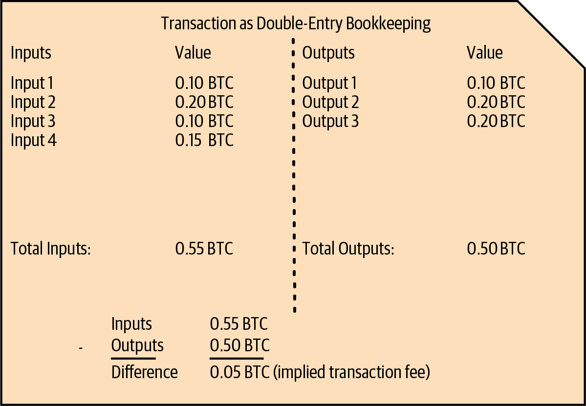

*Gambar 2-2 di buku mengilustrasikan ini: Sebuah tabel dengan kolom Input dan Output. Total Input adalah 0.55 BTC, sementara Total Output adalah 0.50 BTC. Perbedaannya, yaitu 0.05 BTC, adalah biaya transaksi.*

##### **Rantai Transaksi (*Transaction Chains*)**

Setiap transaksi terhubung dengan transaksi sebelumnya. *Input* dari sebuah transaksi sebenarnya adalah *output* dari transaksi sebelumnya. Inilah yang membentuk "rantai" kepemilikan.

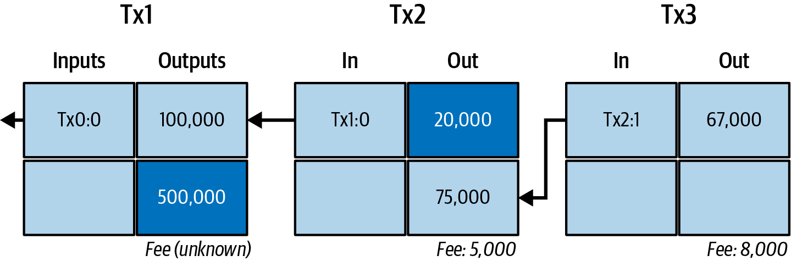

*Gambar 2-3 di buku menunjukkan ini secara visual. Transaksi 1 (Tx1) mengirimkan 100,000 satoshi ke Alice. Transaksi Alice ke Bob (Tx2) menggunakan output dari Tx1 sebagai input-nya. Output dari Tx2 kemudian bisa menjadi input untuk transaksi Bob berikutnya (Tx3).*

**Istilah Penting:**

* **Satoshi (sat):** Unit terkecil dari bitcoin. 1 bitcoin = 100,000,000 satoshi. Protokol Bitcoin sendiri menggunakan satoshi untuk menghitung nilai.

##### **Membuat Kembalian (*Making Change*)**

*Input* transaksi harus dihabiskan seluruhnya, mirip seperti Kita tidak bisa menyobek selembar uang kertas untuk membayar. Jika Kita ingin membayar 5 BTC tetapi hanya memiliki *input* senilai 20 BTC, transaksi Kita akan memiliki dua *output*:

1. Satu *output* sebesar 5 BTC untuk si penerima.
2. Satu *output* sebesar 15 BTC (dikurangi biaya transaksi) yang kembali ke alamat Kita sendiri. Ini disebut ***change output***.

Untuk privasi, alamat kembalian ini biasanya adalah alamat baru yang belum pernah digunakan, yang juga dibuat oleh dompet Kita.

##### **Bentuk-Bentuk Transaksi Umum**

* **Transaksi Umum (*Common Transaction*):** Satu *input* dan dua *output* (satu untuk pembayaran, satu untuk kembalian). Ini adalah bentuk yang paling sering ditemui. *Digambarkan di Gambar 2-4*.

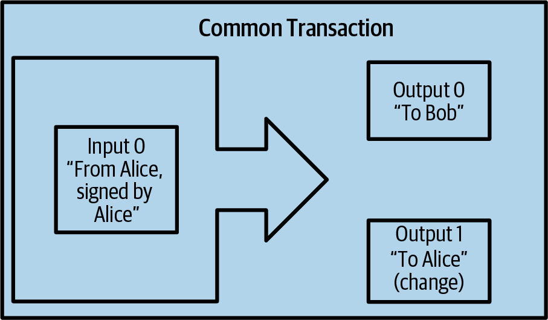

* **Transaksi Agregasi (*Aggregating Transaction*):** Beberapa *input* digabungkan menjadi satu *output* tunggal. Mirip seperti menukar banyak uang koin menjadi selembar uang kertas besar. *Digambarkan di Gambar 2-5*.

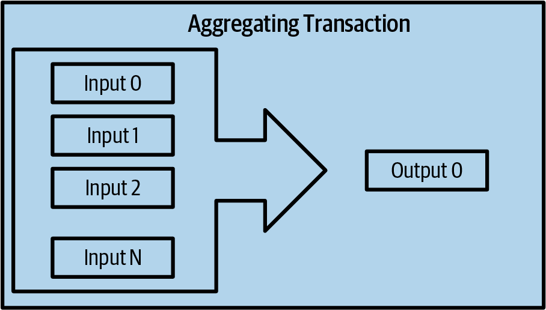

* **Transaksi Distribusi (*Distributing Transaction*):** Satu *input* yang membayar ke banyak *output* (banyak penerima). Sering digunakan oleh bisnis, misalnya untuk membayar gaji. *Digambarkan di Gambar 2-6*.

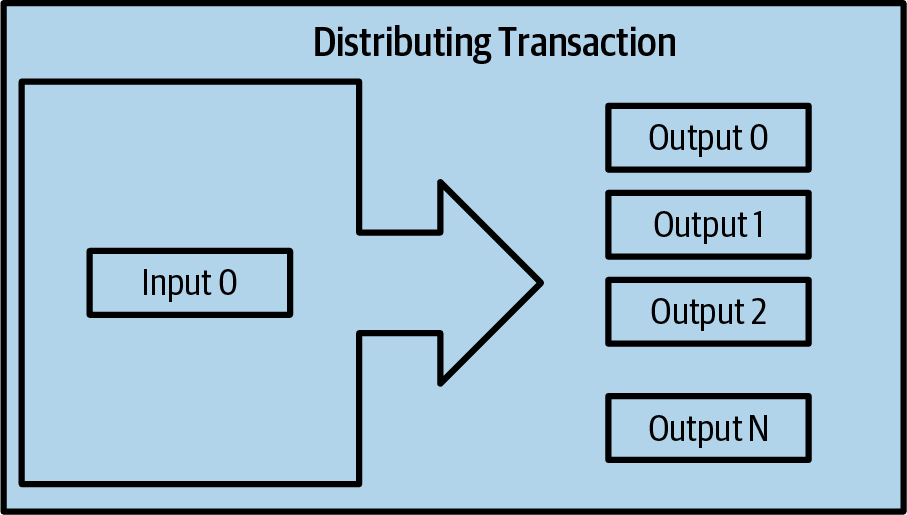

#### **Membangun Sebuah Transaksi (*Constructing a Transaction*)**

Dompet Alice melakukan semua pekerjaan ini secara otomatis. Alice hanya perlu menentukan tujuan, jumlah, dan biaya transaksi. Dompet bisa membangun transaksi bahkan saat sedang *offline*.

1. **Mendapatkan Input yang Tepat:** Dompet akan memindai daftar *output* yang belum terpakai yang dimilikinya, yang dikenal sebagai **UTXO (*Unspent Transaction Outputs*)**. Ia akan memilih satu atau beberapa UTXO yang cukup untuk menutupi jumlah pembayaran.
2. **Membuat Output:** Dompet membuat satu *output* untuk Bob dan (jika perlu) satu *change output* untuk Alice kembali. Setiap *output* berisi sebuah *script* yang pada dasarnya mengatakan, "Dana ini hanya bisa dibelanjakan oleh siapa pun yang bisa memberikan tanda tangan digital yang sah dari kunci milik Bob".
3. **Menambahkan Biaya Transaksi:** Biaya transaksi tidak ditulis secara eksplisit, melainkan dihitung dari selisih antara total *input* dan total *output*.

#### **Menambahkan Transaksi ke Blockchain**

Setelah transaksi dibuat dan ditandatangani, ia harus disiarkan ke jaringan Bitcoin.

##### **Propagasi Transaksi**

Dompet Alice mengirimkan transaksi tersebut ke beberapa *node* (rekan) di jaringan P2P. Setiap *node* yang menerima transaksi valid yang belum pernah dilihat sebelumnya akan meneruskannya ke semua *node* lain yang terhubung dengannya. Proses ini disebut ***gossiping***. Dalam beberapa detik, transaksi tersebut menyebar ke sebagian besar jaringan. Dompet Bob, yang juga terhubung ke jaringan, akan mendeteksi transaksi ini sebagai pembayaran masuk.

##### **Penambangan Bitcoin (*Bitcoin Mining*)**

Transaksi Alice kini ada di jaringan, tetapi belum menjadi bagian permanen dari *blockchain*. Ia harus dimasukkan ke dalam sebuah *block* melalui proses yang disebut **mining**.

*Mining* memiliki dua tujuan utama:

1. **Mencapai Konsensus:** Para *miner* berkompetisi untuk memecahkan teka-teki komputasi yang sangat sulit. *Miner* pertama yang berhasil akan "memenangkan" hak untuk membuat *block* berikutnya. Solusi ini disebut ***Proof-of-Work (PoW)***. Karena PoW sangat sulit dibuat tetapi mudah diverifikasi, ia berfungsi sebagai bukti bahwa upaya komputasi yang besar telah dilakukan, sehingga mengamankan transaksi di dalam *block* tersebut.
2. **Menerbitkan Bitcoin Baru:** *Miner* yang berhasil membuat *block* akan mendapatkan imbalan berupa bitcoin yang baru dibuat (*block subsidy*) ditambah semua biaya transaksi dari transaksi yang ia masukkan ke dalam *block*.

Sekitar lima menit setelah Alice mengirim transaksinya, seorang *miner* (misalnya Jing dari contoh di buku) menemukan solusi PoW untuk *block* yang berisi transaksi Alice. *Block* ini kemudian disiarkan ke seluruh jaringan. Setiap *node* lain memverifikasinya dan menambahkannya ke salinan *blockchain* mereka.

Saat *block* yang berisi transaksi Alice ditambahkan ke *blockchain*, transaksi tersebut mendapatkan **1 konfirmasi**. Setiap *block* baru yang ditambahkan di atasnya memberikan konfirmasi tambahan. Semakin banyak konfirmasi, semakin sulit (secara komputasi) untuk membatalkan transaksi tersebut.

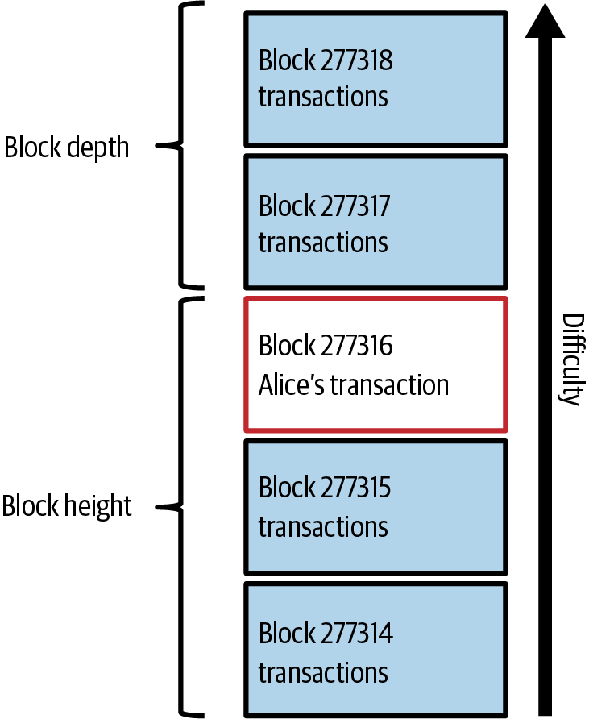

*Gambar 2-7 di buku menggambarkan tumpukan block, dengan block yang berisi transaksi Alice berada di tengah. Tumpukan block di bawahnya menunjukkan sejarah (block height), sementara tumpukan block di atasnya menunjukkan tingkat keamanan atau kedalaman (block depth).*

#### **Membelanjakan Transaksi (*Spending the Transaction*)**

Setelah transaksi Alice terkonfirmasi, Bob kini adalah pemilik sah dari dana tersebut. *Output* dari transaksi Alice menjadi UTXO baru yang dikontrol oleh kunci milik Bob. Bob sekarang bisa menggunakan UTXO ini sebagai *input* untuk transaksi berikutnya, misalnya untuk membayar desainer web-nya, Gopesh.

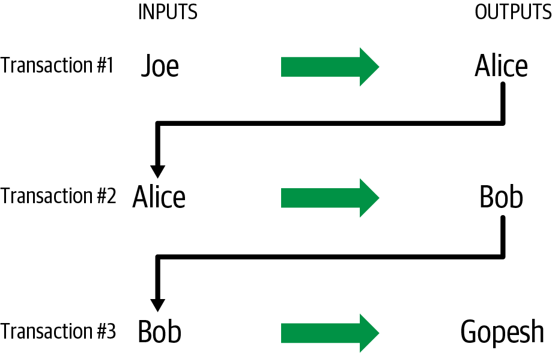

*Gambar 2-8 mengilustrasikan rantai transaksi lengkap: Joe membayar Alice (Transaksi #1), Alice membayar Bob (Transaksi #2), dan Bob membayar Gopesh (Transaksi #3). Ini menunjukkan bagaimana nilai berpindah dari satu pemilik ke pemilik berikutnya melalui rantai transaksi yang saling terhubung.*

---

# Bab 3
## Bitcoin Core: Implementasi Referensi**

Uang hanya diterima jika orang percaya bisa membelanjakannya nanti. Untuk memastikan bitcoin yang diterima itu sah (bukan palsu atau nilainya dikurangi secara tiba-tiba), setiap pengguna perlu memverifikasinya. Sistem Bitcoin dirancang agar setiap orang bisa menjalankan perangkat lunak di komputernya sendiri untuk memverifikasi secara sempurna setiap transaksi dan aturan dalam sistem. Perangkat lunak yang melakukan ini disebut ***full verification node*** (atau disingkat ***full node***).

Di bab ini, kita akan menginstal **Bitcoin Core**, implementasi *full node* yang paling banyak digunakan. Dengan ini, kita bisa memeriksa *blocks*, transaksi, dan data lain secara otoritatif—bukan karena ada pihak yang menyuruh kita percaya, tetapi karena *node* kita sendiri yang memverifikasinya secara independen.

#### **Dari Bitcoin Menjadi Bitcoin Core**

Bitcoin adalah proyek *open source* dengan lisensi MIT, artinya kodenya gratis untuk diunduh dan digunakan. Awalnya dikembangkan oleh Satoshi Nakamoto, kini perangkat lunak tersebut telah banyak dimodifikasi dan ditingkatkan oleh komunitas pengembang sukarelawan. Implementasi pertama yang dibuat Satoshi kini dikenal sebagai **Bitcoin Core** untuk membedakannya dari implementasi lain.

Bitcoin Core adalah **implementasi referensi** (*reference implementation*), artinya ia menjadi acuan standar bagaimana setiap bagian dari teknologi Bitcoin harus diimplementasikan. Ia mencakup semua aspek: dompet, mesin validasi transaksi dan *block*, serta komunikasi P2P.

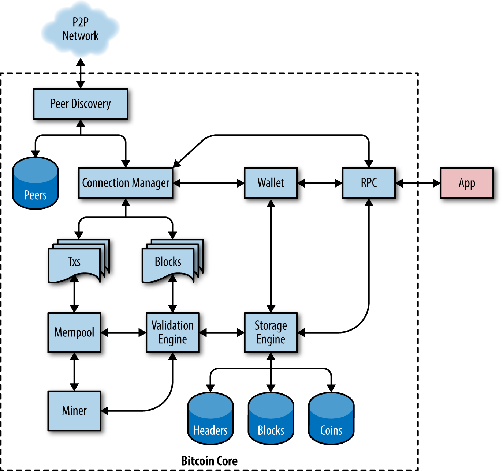

*Gambar 3-1 di buku menunjukkan arsitektur Bitcoin Core, yang terdiri dari berbagai komponen seperti Peer Discovery, Connection Manager, Wallet, RPC, Mempool, Validation Engine, dll. Ini adalah gambaran teknis dari "mesin" Bitcoin Core.*

#### **Lingkungan Pengembangan Bitcoin (*Bitcoin Development Environment*)**

Bab ini sangat teknis dan ditujukan untuk pengembang. Kita akan membahas proses penyiapan lingkungan pengembangan langkah demi langkah.

##### **Mengompilasi (*Compiling*) Bitcoin Core dari Kode Sumber**

Kita bisa mendapatkan kode sumber Bitcoin Core dengan mengunduh arsipnya atau dengan "meng-kloning" repositorinya dari GitHub. Menggunakan Git (alat penting bagi pengembang) adalah cara yang disarankan.

**Istilah Penting:**

* **Compile (Kompilasi):** Proses mengubah kode sumber yang dapat dibaca manusia (seperti C++) menjadi program yang dapat dieksekusi oleh komputer (file biner).
* **Git:** Sistem kontrol versi terdistribusi yang digunakan untuk melacak perubahan dalam kode sumber selama pengembangan perangkat lunak.
* **GitHub:** Platform hosting untuk pengembangan perangkat lunak yang menggunakan Git.

Berikut adalah contoh perintah untuk mengkloning repositori Bitcoin Core menggunakan antarmuka baris perintah (*command-line*):

```bash
$ git clone https://github.com/bitcoin/bitcoin.git
```

Ini akan membuat salinan lokal dari seluruh riwayat kode sumber di direktori bernama `bitcoin`.

##### **Memilih Rilis Bitcoin Core**

Setelah mengkloning, Kita akan berada di versi kode terbaru yang mungkin belum stabil. Penting untuk beralih ke versi rilis spesifik yang stabil.

1. Lihat daftar rilis yang tersedia dengan perintah `git tag`:

   ```bash
   $ git tag
   v0.1.5
   ...
   v0.11.2
   ...
   v24.0.1
   ```
2. Pilih versi stabil terbaru (misalnya, `v24.0.1`) dan beralih ke sana dengan `git checkout`:

   ```bash
   $ git checkout v24.0.1
   ```

##### **Mengonfigurasi Build Bitcoin Core**

Kode sumber menyertakan dokumentasi penting di direktori `doc/`. Kita harus membaca instruksi *build* yang sesuai dengan sistem operasi Kita (misalnya, `build-unix.md` untuk Linux/macOS).

1. **Prasyarat (*Prerequisites*):** Pastikan semua pustaka (*libraries*) yang diperlukan sudah terinstal. Jika tidak, proses *build* akan gagal.
2. **Hasilkan Skrip Build:** Jalankan skrip `autogen.sh` untuk membuat skrip konfigurasi.

   ```bash
   $ ./autogen.sh
   ```
3. **Konfigurasi:** Jalankan skrip `configure` yang baru saja dibuat. Skrip ini memeriksa sistem Kita dan menyesuaikan proses *build*. Kita bisa menambahkan opsi, misalnya untuk menonaktifkan GUI (*Graphical User Interface*) jika Kita hanya butuh server baris perintah.

   ```bash
   $ ./configure
   ```

   Jika ada pustaka yang hilang, skrip ini akan berhenti dengan pesan kesalahan. Instal pustaka yang kurang, lalu jalankan lagi.

##### **Membangun Eksekutable (*Executables*) Bitcoin Core**

Setelah konfigurasi berhasil, mulailah proses kompilasi. Ini bisa memakan waktu cukup lama.

1. **Kompilasi:**

   ```bash
   $ make
   ```
2. **Verifikasi dan Instal:** Jalankan tes untuk memastikan semuanya berfungsi, lalu instal program ke sistem Kita. Perintah `sudo` mungkin diperlukan karena ini menginstal file ke direktori sistem.

   ```bash
   $ make check && sudo make install
   ```

   Setelah selesai, Kita akan memiliki beberapa program, yang terpenting adalah `bitcoind` (server/daemon Bitcoin) dan `bitcoin-cli` (alat baris perintah untuk berinteraksi dengan `bitcoind`).

#### **Menjalankan Node Bitcoin Core**

Menjalankan *full node* berarti Kita memiliki pandangan yang langsung dan otoritatif terhadap *blockchain*. Kita tidak perlu mempercayai pihak ketiga mana pun untuk memvalidasi transaksi.

**Peringatan Sumber Daya:**
Menjalankan *full node* membutuhkan sumber daya yang signifikan:

* **Penyimpanan:** Lebih dari 500 GB data *blockchain* saat pertama kali sinkronisasi (disebut *Initial Block Download* atau IBD), dan terus bertambah setiap hari.
* **Bandwidth:** Mengunduh *block* dan menyiarkan transaksi ke *node* lain akan menggunakan banyak bandwidth internet Kita.

**Mengapa Menjalankan Node?**

* **Keamanan & Privasi Maksimal:** Anda memvalidasi transaksi Anda sendiri dan tidak membocorkan alamat mana yang Anda minati ke pihak ketiga.
* **Pengembangan:** Jika Anda seorang pengembang, Anda memerlukan akses API langsung ke *node*.
* **Mendukung Jaringan:** Semakin banyak *full node* yang jujur, semakin kuat dan terdesentralisasi jaringan Bitcoin.

##### **Mengonfigurasi Node Bitcoin Core**

Bitcoin Core mencari file konfigurasi bernama `bitcoin.conf` di direktori datanya (misalnya, `~/.bitcoin/` di Linux). Kita bisa mengatur lebih dari 100 opsi di file ini. Beberapa yang penting:

* `txindex=1`: Membangun indeks lengkap dari semua transaksi di *blockchain*. Ini **sangat penting** untuk seorang auditor atau analis *blockchain* karena memungkinkan Kita untuk mencari transaksi apa pun berdasarkan ID-nya. Tanpa ini, Kita hanya bisa mencari transaksi yang relevan dengan dompet *node* Kita.
* `prune=<megabytes>`: Mengurangi kebutuhan ruang disk dengan menghapus *block-block* lama setelah diverifikasi. *Node* yang di-*prune* masih merupakan *full node* dalam hal validasi, tetapi tidak bisa melayani data *block* historis ke *node* lain.
* `blocksonly=1`: Mengurangi penggunaan bandwidth dengan hanya menerima *block* yang sudah dikonfirmasi, bukan menyiarkan transaksi yang belum dikonfirmasi.

**Contoh `bitcoin.conf` untuk seorang analis/auditor:**

```
# Maintain a full transaction index
txindex=1

# Optional: Set a larger cache for UTXO database
dbcache=1000
```

Untuk menjalankan `bitcoind` di latar belakang sebagai *daemon* (layanan sistem):

```bash
$ bitcoind -daemon
```

Untuk memantau progres sinkronisasinya:

```bash
$ bitcoin-cli getblockchaininfo
```

#### **API Bitcoin Core**

Bitcoin Core menyediakan antarmuka **JSON-RPC** (*JavaScript Object Notation - Remote Procedure Call*). Ini berarti Kita bisa mengirim perintah dalam format JSON ke *node* Kita dan menerima respons dalam format yang sama. Alat `bitcoin-cli` adalah cara mudah untuk menggunakan API ini dari baris perintah.

##### **Contoh Perintah `bitcoin-cli`**

1. **Mendapatkan Informasi:**

   * `getblockchaininfo`: Menampilkan status *blockchain* di *node* Kita.
   * `getnetworkinfo`: Menampilkan status koneksi jaringan *node* Kita.

2. **Menjelajahi Transaksi (Membutuhkan `txindex=1`):**

   * `getrawtransaction <txid>`: Mengambil data transaksi mentah dalam format heksadesimal.

     ```bash
     $ bitcoin-cli getrawtransaction 466200308696215bbc949d5141a49a4138ecdfdfaa2a8029c1f9bcecd1f96177
     ```
   * `decoderawtransaction <hex>`: Menerjemahkan data heksadesimal dari perintah di atas menjadi format yang dapat dibaca manusia (JSON).

     ```bash
     $ bitcoin-cli decoderawtransaction <hex_data_from_above>
     ```

     Hasilnya akan menunjukkan detail seperti `vin` (*inputs*), `vout` (*outputs*), `locktime`, dll.

3. **Menjelajahi Block:**

   * `getblockhash <height>`: Mendapatkan *hash* dari *block* pada ketinggian tertentu.

     ```bash
     $ bitcoin-cli getblockhash 123456
     ```
   * `getblock <hash>`: Mendapatkan detail lengkap dari *block* dengan *hash* tertentu.

     ```bash
     $ bitcoin-cli getblock 0000000000002917ed80650c6174aac8dfc46f5fe36480aaef682ff6cd83c3ca
     ```

     Hasilnya akan berisi *hash* *block* sebelumnya, *merkle root*, *nonce*, dan daftar ID dari semua transaksi di dalamnya.

##### **Mengakses API Secara Terprogram**

Kita bisa memanggil API JSON-RPC ini dari hampir semua bahasa pemrograman. Buku ini memberikan contoh menggunakan Python dengan pustaka `python-bitcoinlib`.

**Contoh Kode Python (rpc\_example.py):**
Kode ini menghubungkan ke *node* Bitcoin Core lokal Kita dan mencetak jumlah *block* saat ini.

```python
from bitcoin.rpc import RawProxy

# Membuat koneksi ke node Bitcoin Core lokal
p = RawProxy()

# Menjalankan perintah getblockchaininfo
info = p.getblockchaininfo()

# Mengambil elemen 'blocks' dari info dan mencetaknya
print(info['blocks'])
```

**Contoh Kode Python (rpc\_transaction.py):**
Kode ini mengambil transaksi Alice, mendekodenya, dan mencetak alamat tujuan serta nilainya.

```python
from bitcoin.rpc import RawProxy

p = RawProxy()

# ID transaksi Alice
txid = "466200308696215bbc949d5141a49a4138ecdfdfaa2a8029c1f9bcecd1f96177"

# Ambil transaksi mentah (hex)
raw_tx = p.getrawtransaction(txid)

# Dekode transaksi hex menjadi objek JSON
decoded_tx = p.decoderawtransaction(raw_tx)

# Ulangi setiap output dalam transaksi dan cetak alamat serta nilainya
for output in decoded_tx['vout']:
    # Periksa apakah 'address' ada sebelum mencetaknya
    if 'address' in output['scriptPubKey']:
        print(output['scriptPubKey']['address'], output['value'])
```

Bab 3 ini memberikan Kita alat dan pemahaman dasar untuk mulai "membongkar" *blockchain*. Dengan menjalankan *full node* Kita sendiri dan menggunakan API-nya, Kita bisa memverifikasi, menganalisis, dan membangun aplikasi di atas Bitcoin dengan tingkat keamanan dan kepercayaan tertinggi. Keterampilan ini adalah fondasi mutlak untuk menjadi seorang auditor keamanan *blockchain*.

---

# Bab 4
## Kunci dan Alamat (*Keys and Addresses*)**

Bab ini menjelaskan bagaimana Bitcoin menggunakan kriptografi kunci publik untuk mengontrol kepemilikan dana. Kita akan mempelajari bagaimana *private keys*, *public keys*, tanda tangan (*signatures*), dan alamat (*addresses*) dibuat serta bagaimana mereka bekerja sama untuk mengamankan bitcoin.

#### **Kriptografi Kunci Publik (*Public Key Cryptography*)**

*Public Key Cryptography* (juga dikenal sebagai kriptografi asimetris) adalah fondasi keamanan Bitcoin. Ia menggunakan sepasang kunci matematika: sebuah **private key** dan sebuah **public key**.

* **Private Key (Kunci Privat):** Sebuah angka rahasia yang hanya diketahui oleh pemiliknya. Digunakan untuk membuat tanda tangan digital (*digital signatures*) yang mengotorisasi pengeluaran dana. Kehilangan *private key* berarti kehilangan akses ke dana Kita selamanya.
* **Public Key (Kunci Publik):** Sebuah angka yang dapat dibagikan secara bebas kepada siapa pun. Digunakan untuk menerima dana. *Public key* dibuat dari *private key* melalui proses matematika satu arah.

**Proses Satu Arah (*One-way function*):** Kita bisa dengan mudah membuat *public key* dari *private key*, tetapi secara komputasi **tidak mungkin** untuk mendapatkan *private key* dari *public key*. Sifat ini disebut *trap door function* dan menjadi dasar keamanan Bitcoin.

Dalam Bitcoin, kriptografi asimetris tidak digunakan untuk mengenkripsi transaksi, melainkan untuk **membuat tanda tangan digital**. Tanda tangan membuktikan:

1. **Kepemilikan:** Hanya orang yang memiliki *private key* yang bisa membuat tanda tangan valid.
2. **Integritas:** Tanda tangan mengunci data transaksi sehingga tidak bisa diubah oleh pihak lain.

#### **Private Keys**

Sebuah *private key* Bitcoin hanyalah angka 256-bit yang dipilih secara acak. Sangat penting bahwa angka ini dihasilkan dari sumber keacakan (*entropy*) yang benar-benar aman. Menggunakan metode acak yang lemah dapat membahayakan keamanan dana Kita.

**Istilah Penting:**

* **Entropy:** Ukuran ketidakpastian atau keacakan. Dalam kriptografi, sumber *entropy* yang baik sangat penting untuk menghasilkan kunci yang tidak dapat ditebak.

Ukuran ruang kunci privat Bitcoin (\$2^{256}\$) sangatlah besar, kira-kira setara dengan jumlah atom di alam semesta yang teramati. Hal ini membuat penebakan *private key* secara acak (*brute-force*) menjadi mustahil.

Contoh *private key* (heksadesimal):

```
1E99423A4ED27608A15A2616A2B0E9E52CED330AC530EDCC32C8FFC6A526AEDD
```

#### **Elliptic Curve Cryptography (ECC)**

Bitcoin menggunakan jenis kriptografi kunci publik yang disebut **Elliptic Curve Cryptography (ECC)**. Dasarnya adalah operasi matematika (penjumlahan dan perkalian) pada titik-titik di kurva eliptik. Bitcoin menggunakan kurva khusus bernama **secp256k1**.

Persamaan kurva secp256k1:

$y^2 \mod p = (x^3 + 7) \mod p$

dengan \$p = 2^{256} - 2^{32} - 2^9 - 2^8 - 2^7 - 2^6 - 2^4 - 1\$.

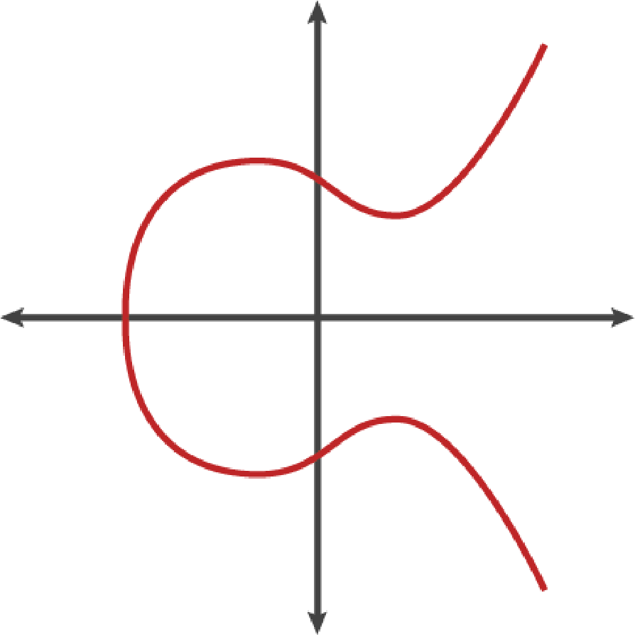

lalu

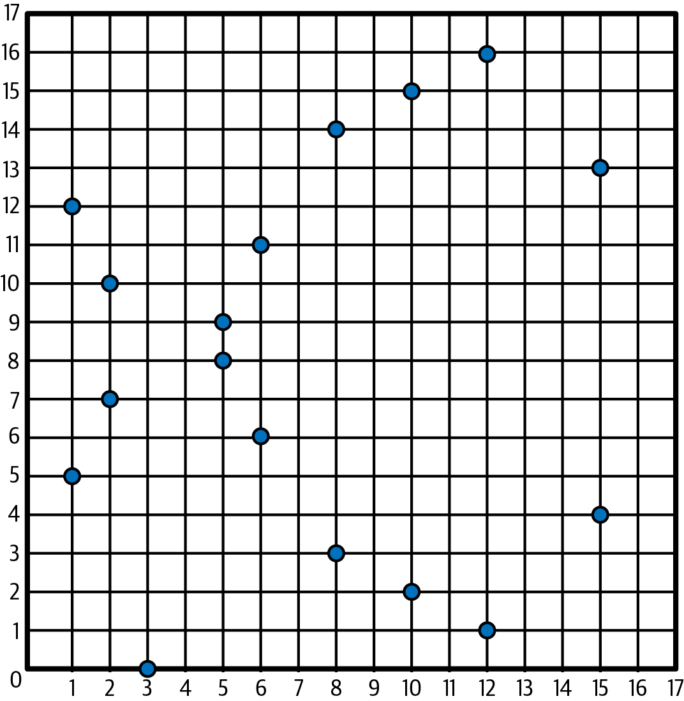

*Gambar 4-2 dan 4-3 di buku mengilustrasikan bentuk kurva eliptik di bilangan real (mulus) dan di *finite field* (titik-titik acak).*

**Contoh Kode Python (Verifikasi Titik pada Kurva):**

```python
# p adalah bilangan prima secp256k1
p = 115792089237316195423570985008687907853269984665640564039457584007908834671663

# x dan y adalah koordinat public key
x = 55066263022277343669578718895168534326250603453777594175500187360389116729240
y = 32670510020758816978083085130507043184471273380659243275938904335757337482424

# Verifikasi
print((y**2 - (x**3 + 7)) % p)  # Output: 0 → titik valid
```

#### **Public Keys**

Sebuah *public key* (\$K\$) dihasilkan dari *private key* (\$k\$) melalui perkalian kurva eliptik dengan titik konstan **generator point** (\$G\$):

$K = k \times G$

* \$k\$: *private key* (angka).
* \$G\$: *generator point* (konstan di kurva).
* \$K\$: *public key* (titik \$(x,y)\$ di kurva).

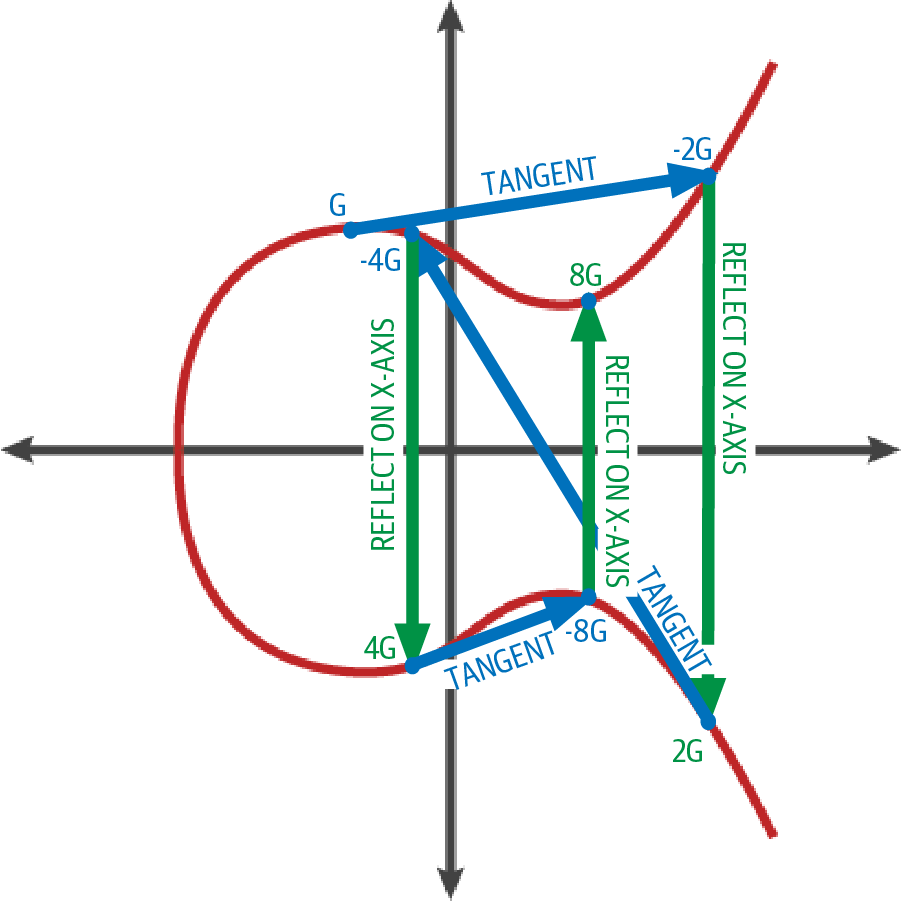

*Gambar 4-4 memperlihatkan perkalian ini dengan “penjumlahan titik” berulang.*

#### **Script Input dan Output**

Bitcoin tidak langsung mengirim dana ke *public key*. Dana dikunci dalam sebuah **output script**. Untuk membelanjakannya, seseorang harus memberikan **input script** yang memenuhi syarat dalam *output script*. Mekanisme ini mendasari *smart contracts* di Bitcoin.

#### **Alamat Bitcoin dan Evolusinya**

##### **P2PKH (Pay-to-Public-Key-Hash)**

Karena *public key* panjang (65 byte), Bitcoin memperkenalkan **hash function** untuk membuat alamat.

**Istilah Penting:**

* **Hash Function:** Algoritma yang menghasilkan sidik jari digital tetap dari input apa pun. Mustahil membalikkan hasilnya atau menemukan dua input berbeda dengan hasil sama.

Alamat dihitung:
$A = \text{RIPEMD160}(\text{SHA256}(K))$

Hasilnya adalah hash 160-bit (20-byte).

*Output script P2PKH:*

```
OP_DUP OP_HASH160 <Public Key Hash> OP_EQUALVERIFY OP_CHECKSIG
```

*Input script:*

```
<Signature> <Public Key>
```

##### **Base58Check Encoding**

* **Base58:** Seperti Base64, tapi tanpa karakter ambigu (0, O, l, I).
* **Check:** Tambah 4-byte checksum untuk deteksi salah ketik.

Struktur: `[Version Byte] + [Public Key Hash] + [Checksum]`.
Untuk mainnet, *version byte* = `0x00`, sehingga alamat diawali **1**.

##### **Compressed Public Keys**

Dari titik \$(x,y)\$, cukup simpan \$x\$ dan 1 bit (ganjil/genap \$y\$). Ukuran turun dari 65 byte → 33 byte. Transaksi lebih kecil dan murah. Hampir semua dompet modern memakai ini.

##### **P2SH (Pay-to-Script-Hash)**

Untuk kondisi kompleks (misalnya multisignature 2-of-3):

1. Buat *redeem script*.
2. Hash dengan `HASH160`.
3. *Output script:*

   ```
   OP_HASH160 <Script Hash> OP_EQUAL
   ```

Saat membelanjakan, *input script* menyediakan tanda tangan + *redeem script* asli.

*Version byte* = `0x05`, alamat diawali **3**.

##### **Bech32 & Bech32m (SegWit Addresses)**

Diperkenalkan lewat SegWit (2017):

* Huruf kecil, mudah dibaca.
* Deteksi & koreksi kesalahan lebih baik.
* Lebih efisien untuk QR code.
* Diawali **bc1**.

Bech32 untuk SegWit v0, Bech32m untuk SegWit v1/Taproot. Standar modern yang direkomendasikan.

#### **Format Kunci Privat**

Format umum: **WIF (Wallet Import Format)**.

* **WIF:** Base58Check dari private key 256-bit. Biasanya diawali `5`.
* **WIF-Compressed:** Tambah byte `0x01` di akhir, biasanya diawali `K` atau `L`.

> **Penting:** Dompet modern memakai BIP32/BIP39 (deterministic wallets). Impor private key tunggal tidak disarankan. WIF hanya untuk kompatibilitas lama.

#### **Kunci dan Alamat Lanjutan**

* **Vanity Addresses:** Alamat dengan pola khusus (contoh: `1KidsCharity...`). Dibuat dengan brute-force miliaran kunci. Sama amannya, tetapi jarang dipakai karena privasi dan ketidakcocokan dengan dompet modern.
* **Paper Wallets:** Private key dicetak di kertas. **Berbahaya dan usang.** Rentan kesalahan dan kehilangan dana. **Jangan gunakan paper wallets.** Gunakan *recovery code* dompet modern.

---

# Bab 5 
## Pemulihan Dompet (*Wallet Recovery*)**

Bab ini membahas berbagai metode yang digunakan oleh dompet untuk memastikan pengguna dapat memulihkan akses ke bitcoin mereka jika terjadi masalah, tanpa mengorbankan keamanan.

#### **Generasi Kunci Independen (*Independent Key Generation*)**

Banyak orang keliru mengira dompet Bitcoin berisi bitcoin. Faktanya, dompet hanya berisi **kunci** (*keys*). Dompet-dompet awal menghasilkan setiap *private key* secara acak dan independen satu sama lain.

**Masalahnya:** Setiap kali dompet menghasilkan kunci baru (misalnya, untuk alamat penerima baru), pengguna harus membuat cadangan (*backup*) baru dari file dompetnya. Jika mereka lupa membuat *backup* dan perangkat mereka rusak, dana yang diterima di alamat-alamat baru tersebut akan hilang selamanya. Metode ini tidak praktis dan berisiko tinggi.

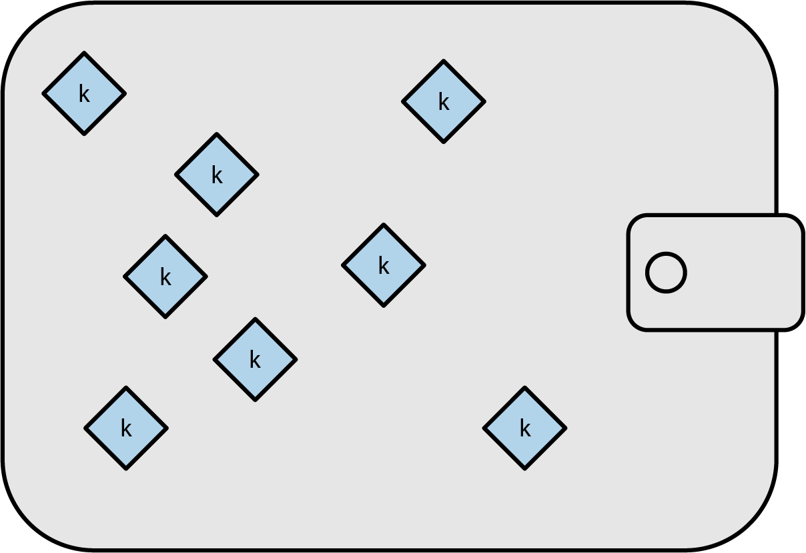

*Gambar 5-1 di buku mengilustrasikan ini sebagai sebuah dompet yang berisi kumpulan kunci yang tidak saling berhubungan.*

#### **Generasi Kunci Deterministik (*Deterministic Key Generation*)**

Dompet modern tidak lagi menghasilkan kunci secara acak dan independen. Sebaliknya, mereka menggunakan **generasi kunci deterministik**. Artinya, semua kunci di dalam dompet diturunkan (*derived*) dari satu sumber acak utama yang disebut **seed**.

**Konsepnya:** Sebuah *hash function* akan selalu menghasilkan output yang sama jika diberi input yang sama. Kita bisa menggunakan *seed* sebagai input awal, lalu secara berulang-ulang meng-*hash*-nya (dengan sedikit modifikasi, seperti menambahkan angka urut) untuk menghasilkan serangkaian angka yang terlihat acak tetapi sebenarnya dapat diprediksi jika Kita mengetahui *seed*-nya.

```bash
# Contoh konseptual menggunakan command-line
$ seed="f1cc3bc03ef51cb43ee7844460fa5049e779e7425a6349c8e89dfbb0fd97bb73"
$ echo "$seed + 0" | sha256sum
50b18e0bd9508310b8f699bad425efdf67d668cb2462b909fdb6b9bd2437beb3 -
$ echo "$seed + 1" | sha256sum
a965dbcd901a9e3d66af11759e64a58d0ed5c6863e901dfda43adcd5f8c744f3 -
```

Angka-angka hasil *hash* ini bisa digunakan sebagai *private keys*.

**Keuntungannya:** Pengguna hanya perlu mencadangkan **satu kali**, yaitu *seed* itu sendiri. Dari *seed* tersebut, seluruh dompet (bahkan jutaan kunci) dapat dipulihkan kapan saja.

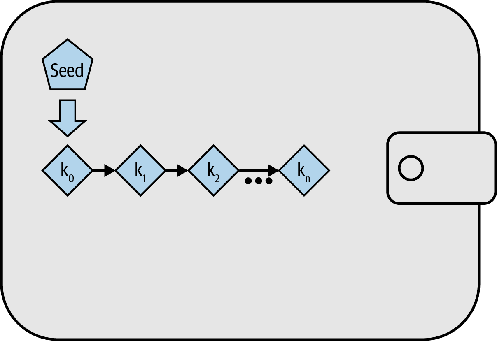

*Gambar 5-2 di buku menunjukkan ini sebagai sebuah seed yang menghasilkan rantai kunci secara berurutan: k₀, k₁, k₂, ..., kₙ.*

#### **Derivasi Kunci Publik Anak (*Public Child Key Derivation*)**

Sebuah fitur canggih dari *Elliptic Curve Cryptography* (ECC) adalah kita bisa menurunkan kunci-kunci baru dari sisi *public key* tanpa memerlukan *private key*.

Ingat rumus dari Bab 4: \$K = k \times G\$.
Kita bisa menambahkan sebuah nilai (disebut **key tweak**) ke kedua sisi persamaan:

$K_{child} = K_{parent} + \text{tweak} \times G$
$k_{child} = k_{parent} + \text{tweak}$

Artinya, seseorang (misalnya, server e-commerce) dapat mengambil *public key* induk dan menghasilkan serangkaian *public key* anak secara mandiri untuk setiap invoice. Server tersebut tidak perlu memegang *private key* sama sekali. Nanti, pemilik *private key* induk dapat menggunakan *tweak* yang sama untuk menghasilkan *private key* anak yang sesuai dan membelanjakan dananya. Ini adalah dasar keamanan yang sangat kuat untuk aplikasi yang perlu menghasilkan alamat penerima secara online.

#### **Generasi Kunci Hierarkis Deterministik (HD) (BIP32)**

Hampir semua dompet modern menggunakan standar yang disebut **Hierarchical Deterministic (HD) wallets**, yang didefinisikan dalam **BIP32**. Ini adalah evolusi dari dompet deterministik.

**Fitur Utama:**

* **Struktur Pohon (*Tree Structure*):** Kunci-kunci tidak hanya dihasilkan dalam satu barisan, tetapi dalam struktur seperti pohon yang bisa bercabang. Setiap kunci bisa menjadi "induk" dari cabang kunci "anak" baru.
* **Organisasi:** Struktur pohon ini memungkinkan organisasi yang lebih baik. Misalnya, satu cabang (`m/0`) bisa digunakan untuk menerima pembayaran, dan cabang lain (`m/1`) untuk menerima kembalian (*change*). Perusahaan bisa menggunakan cabang yang berbeda untuk setiap departemen.

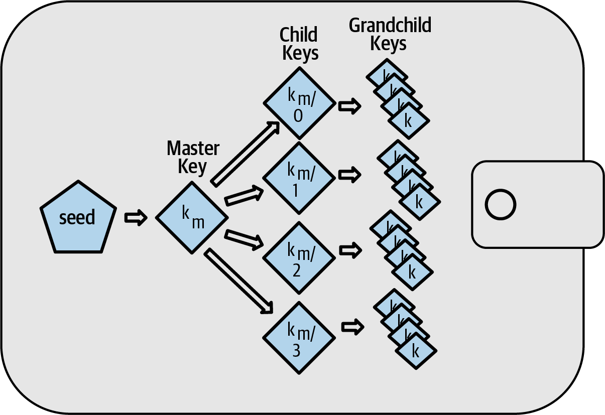

*Gambar 5-3 di buku mengilustrasikan ini, menunjukkan sebuah pohon kunci yang bercabang dari satu `seed`.*

#### **Seed dan Kode Pemulihan (*Recovery Codes*)**

*Seed* hanyalah angka acak yang panjang. Agar lebih mudah bagi manusia untuk mencadangkannya, *seed* ini seringkali direpresentasikan sebagai serangkaian kata yang disebut **kode pemulihan (*recovery code*)** atau **mnemonic phrase**.

> **Peringatan:** Meskipun dirancang agar lebih mudah diingat, **sangat disarankan untuk menuliskannya di atas kertas** daripada hanya mengandalkannya pada ingatan. Kehilangan kode ini berarti kehilangan dana.

Ada beberapa standar kode pemulihan yang populer:

* **BIP39:** Standar yang paling banyak digunakan. Menghasilkan 12-24 kata dari *entropy* acak ditambah *checksum*.
* **Electrum v2:** Standar yang digunakan oleh dompet Electrum. Memiliki beberapa keunggulan seperti nomor versi internal.
* **Aezeed:** Digunakan oleh dompet LND. Menyertakan nomor versi dan "tanggal lahir dompet" (*wallet birthday*) untuk mempercepat pemulihan.
* **SLIP39:** Memungkinkan satu *seed* untuk dibagi menjadi beberapa kode pemulihan (*shares*). Kita bisa menentukan berapa banyak *shares* yang dibutuhkan untuk memulihkan dompet (misalnya, 3 dari 5 *shares*). Ini disebut **Shamir's Secret Sharing Scheme (SSSS)**.
* **Codex32:** Proposal baru yang mirip SLIP39, memungkinkan pembuatan dan validasi *shares* bahkan tanpa komputer, hanya dengan kertas dan pulpen.

**Passphrase Kode Pemulihan:**
Standar seperti BIP39 dan SLIP39 mendukung **passphrase opsional**. Ini adalah kata sandi tambahan yang Kita buat.

* **Keuntungan:** Jika seseorang menemukan kertas berisi 12 kata Anda, mereka tetap tidak bisa mengakses dana Anda tanpa *passphrase* ini (keamanan faktor kedua). Ini juga menciptakan **plausible deniability**, di mana dompet tanpa *passphrase* bisa berisi sedikit dana sebagai umpan, sementara dana utama ada di dompet dengan *passphrase*.
* **Kerugian (khususnya BIP39):** Tidak ada *passphrase* yang "salah". Setiap *passphrase* akan menghasilkan dompet yang valid (tetapi kosong jika belum pernah digunakan). Jika Kita salah ketik *passphrase* saat pemulihan, dompet tidak akan memberitahu Kita—Kita hanya akan melihat saldo nol dan mungkin mengira dana Kita hilang.

#### **Mencadangkan Data Non-Kunci**

Kode pemulihan **hanya** mencadangkan kunci Kita. Ia tidak mencadangkan metadata lain seperti:

* **Label Transaksi:** Catatan yang Kita buat untuk setiap transaksi (misalnya, "Pembayaran dari Bob untuk podcast").
* **Status Channel Lightning Network:** Jika Kita menggunakan *Lightning Network*, status *channel* Kita tidak bisa dipulihkan hanya dari *seed*.

Kehilangan data ini tidak sama dengan kehilangan dana, tetapi bisa sangat merepotkan. Dompet yang baik seharusnya menyediakan cara untuk mencadangkan seluruh data dompet (biasanya dalam file terenkripsi) selain hanya kode pemulihan.

#### **Mencadangkan Jalur Derivasi Kunci (*Key Derivation Paths*)**

Dalam dompet HD, setiap kunci memiliki "alamat" unik dalam struktur pohon, yang disebut **derivation path**. Contoh: `m/84'/0'/0'/0/5` adalah kunci kelima untuk menerima pembayaran di akun utama untuk alamat SegWit P2WPKH.

Saat memulihkan dompet, aplikasi harus tahu *path* mana yang harus diperiksa untuk menemukan dana Kita. Ada dua pendekatan untuk ini:

1. **Implicit Paths:** Menggunakan standar yang sudah disepakati, seperti **BIP44, BIP49, BIP84, BIP86**. Dompet akan secara otomatis memindai *path-path* standar ini saat pemulihan.
2. **Explicit Paths:** Menyimpan deskripsi eksplisit tentang *script* dan *path* yang digunakan. Standar modern untuk ini adalah **Output Script Descriptors**. Ini jauh lebih fleksibel dan andal, terutama untuk pengaturan yang rumit seperti *multisignature*.

#### **Tumpukan Teknologi Dompet Secara Rinci (*A Wallet Technology Stack in Detail*)**

Bagian ini merinci tumpukan teknologi yang paling umum digunakan saat ini: **BIP39 → BIP32 → BIP44-style paths**.

##### **Kode Pemulihan BIP39**

Proses pembuatan kode pemulihan BIP39:

1. Buat *entropy* acak (128-256 bit).
2. Ambil beberapa bit pertama dari `SHA256(entropy)` sebagai *checksum*.
3. Gabungkan *entropy* dan *checksum*.
4. Bagi hasilnya menjadi segmen-segmen 11-bit.
5. Setiap segmen 11-bit dipetakan ke satu kata dari daftar 2048 kata yang telah ditentukan.
6. Urutan kata-kata inilah yang menjadi kode pemulihan Kita.

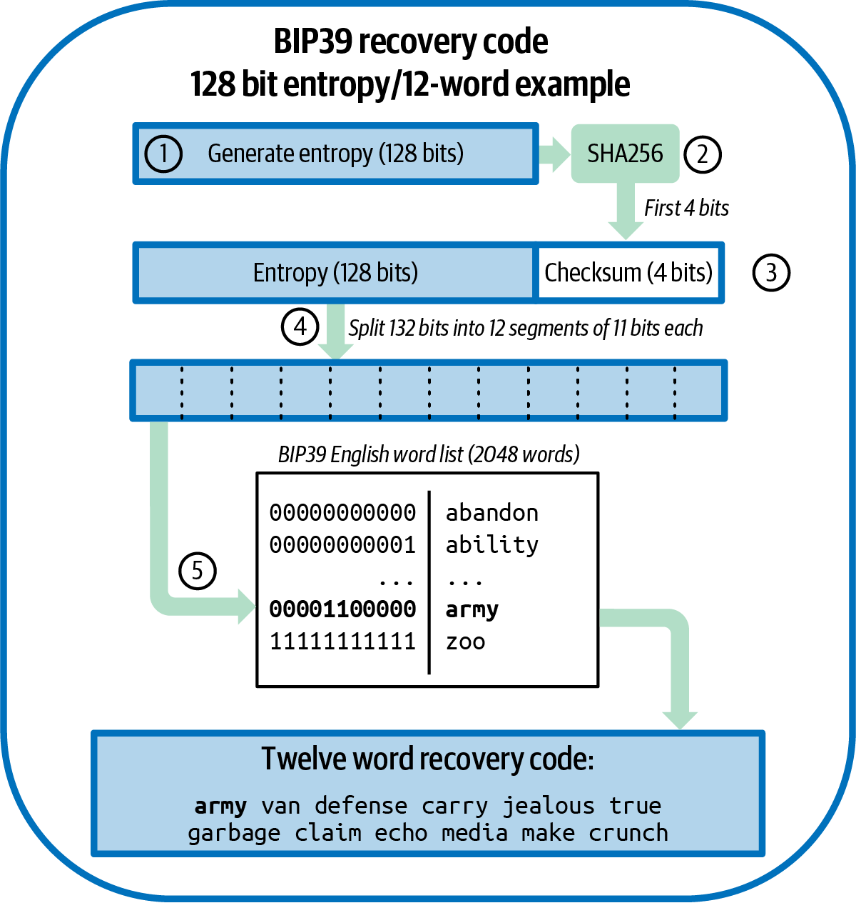

*Gambar 5-4 di buku menggambarkan proses ini secara visual.*

Proses mengubah kode pemulihan menjadi *seed*:
7\. Kata-kata kode pemulihan diambil.
8\. Sebuah *salt* dibuat dengan menggabungkan string `"mnemonic"` dengan *passphrase* opsional Kita.
9\. Kode pemulihan dan *salt* dimasukkan ke dalam **fungsi peregangan kunci (key-stretching function)** bernama **PBKDF2**. Fungsi ini menjalankan proses *hashing* sebanyak 2048 kali untuk membuatnya lebih tahan terhadap serangan *brute-force*.
10\. Output akhir adalah **seed 512-bit**. *Seed* inilah yang digunakan untuk membuat dompet HD BIP32.

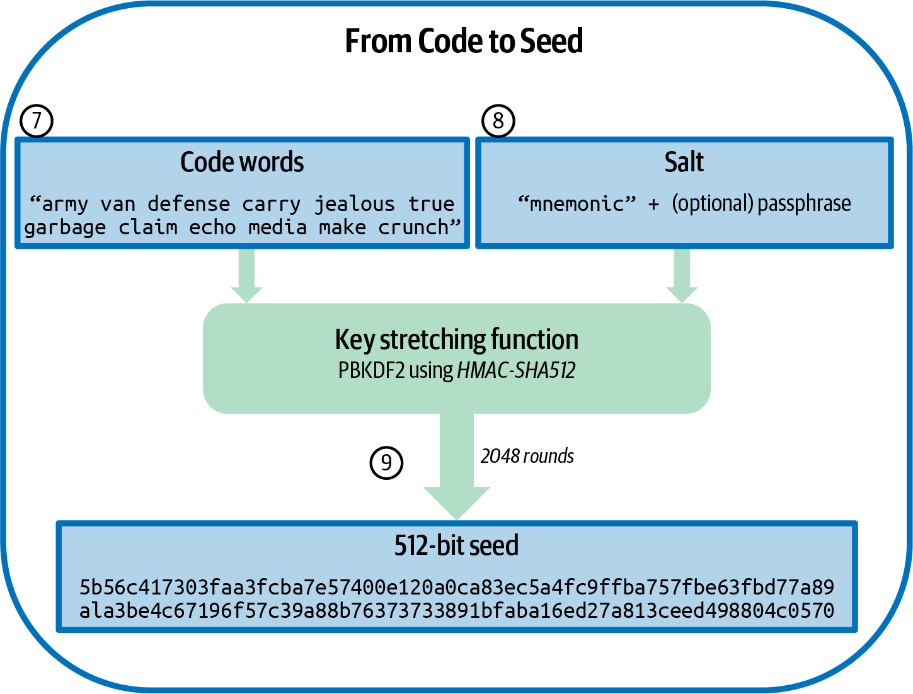

lalu

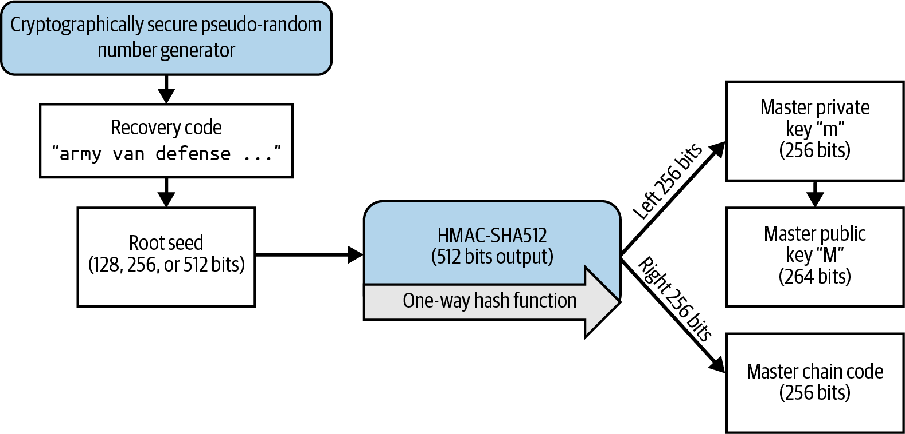

*Gambar 5-5 dan 5-6 mengilustrasikan alur ini.*

##### **Membuat Dompet HD dari Seed**

*Seed* 512-bit tersebut di-*hash* sekali lagi menggunakan `HMAC-SHA512` untuk menghasilkan:

* **Master Private Key (m):** Kunci privat 256-bit di puncak pohon.
* **Master Chain Code (c):** Data acak 256-bit yang digunakan untuk membuat derivasi kunci menjadi tidak dapat diprediksi.

Gabungan dari kunci dan *chain code* disebut **extended key**.

* **Extended Private Key (xprv):** `private key + chain code`. Dapat menurunkan semua kunci di bawahnya (*private* dan *public*).
* **Extended Public Key (xpub):** `public key + chain code`. Hanya dapat menurunkan *public key* di bawahnya. Ini sangat berguna untuk skenario *watch-only wallet* atau server e-commerce.

**Hardened Derivation:**
Derivasi normal (`m/0`) memungkinkan penurunan *public key* anak dari *public key* induk. Namun, ini memiliki kelemahan: jika sebuah *private key* anak dan *chain code* induk bocor, semua *private key* anak lainnya bisa diungkap. Untuk mencegah ini, ada **hardened derivation** (`m/0'`).

* **Hardened derivation** menggunakan *private key* induk (bukan *public key* induk) dalam prosesnya. Ini menciptakan "firewall" kriptografis di dalam pohon.
* Praktik terbaik adalah selalu menggunakan *hardened derivation* untuk tingkat "akun" (`m/44'/0'/0'`), dan menggunakan derivasi normal setelahnya (`.../0/5`).

Bab ini menunjukkan betapa canggihnya sistem di balik kode pemulihan 12 kata yang sederhana. Mekanisme ini dirancang untuk memberikan keseimbangan antara kemudahan penggunaan untuk *backup* dan keamanan yang kuat, sambil memungkinkan kasus penggunaan yang fleksibel seperti server e-commerce yang aman dan *multisignature wallets*.

---

# Bab 6
## Transaksi (*Transactions*)**

Bitcoin tidak seperti uang tunai yang bisa diserahkan secara fisik. Sebaliknya, Bitcoin lebih mirip seperti catatan kepemilikan tanah. Alice tidak bisa memberikan tanahnya kepada Bob secara fisik; ia harus meyakinkan pemerintah untuk memperbarui catatan yang menyatakan bahwa Bob sekarang adalah pemiliknya.

Di Bitcoin, semua *full node* menyimpan database kepemilikan. Alice membayar Bob dengan meyakinkan ribuan *node* ini untuk memperbarui database mereka. Data yang digunakan Alice untuk meyakinkan mereka disebut **transaksi**. Bab ini akan menguraikan setiap bagian dari transaksi tersebut.

---

#### **Transaksi yang Diserialisasi (*A Serialized Bitcoin Transaction*)**

Saat kita meminta data transaksi mentah dari Bitcoin Core, kita akan mendapatkan serangkaian data heksadesimal. Ini adalah format **serialisasi**—cara data diatur untuk transmisi atau penyimpanan. Format ini sangat padat dan efisien.

**Contoh Kode (Transaksi Alice ke Bob dari Bab Sebelumnya):**

```bash
$ bitcoin-cli getrawtransaction 466200308696215bbc949d5141a49a4138ecdfdfaa2a8029c1f9bcecd1f96177
```

**Output (Data Heksadesimal Mentah):**

```
01000000000101eb3ae38f27191aa5f3850dc9cad00492b88b72404f9da135698679268041c54a0100000000ffffffff02204e0000000000002251203b41daba4c9ace578369740f15e5ec880c28279ee7f51b07dca69c7061e07068f8240100000000001600147752c165ea7be772b2c0acb7f4d6047ae6f4768e0141cf5efe2d8ef13ed0af21d4f4cb82422d6252d70324f6f4576b727b7d918e521c00b51be739df2f899c49dc267c0ad280aca6dab0d2fa2b42a45182fc83e817130100000000
```

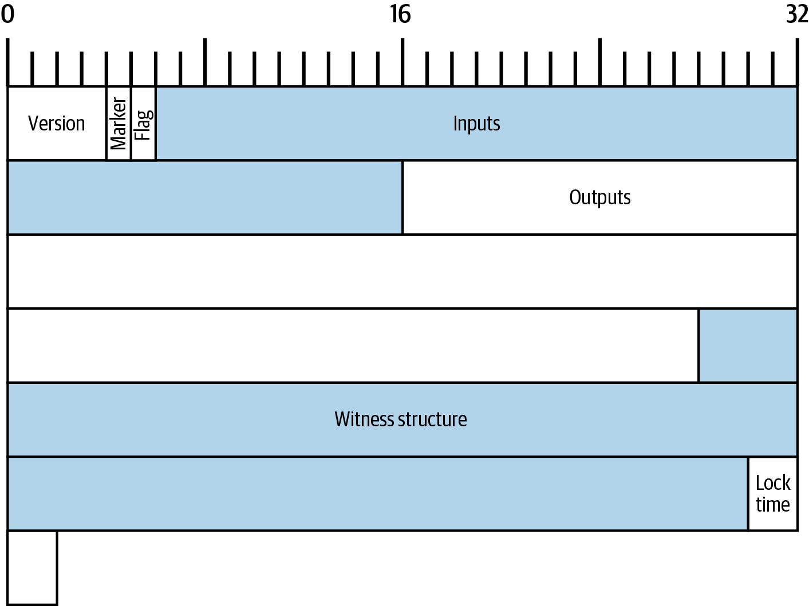

*Gambar 6-1 di buku adalah peta byte dari data heksadesimal ini, yang secara visual membaginya menjadi beberapa bagian utama. Kita akan membahas setiap bagian secara berurutan.*

---

#### **Version (Versi)**

* **Ukuran:** 4 byte
* **Contoh:** `01000000`

Bagian pertama dari setiap transaksi adalah nomor versinya.

* **Versi 1:** Versi asli transaksi Bitcoin.
* **Versi 2:** Diperkenalkan di **BIP68**. Versi ini menambahkan batasan baru pada *field* `sequence` untuk memungkinkan *relative timelocks*. Transaksi versi 1 tidak terpengaruh oleh aturan baru ini.
* **Versi 3 (Diusulkan):** Diusulkan untuk mengubah kebijakan *relay* transaksi (bukan aturan konsensus) untuk mencegah serangan *denial-of-service* tertentu yang terkait dengan *transaction pinning*.

---

#### **Extended Marker and Flag**

* **Ukuran:** 2 byte
* **Contoh:** `0001`

Dua *field* ini diperkenalkan oleh **Segregated Witness (SegWit)**.

* **Marker (`00`):** Harus bernilai nol. Dalam format transaksi lama (*legacy*), posisi ini adalah untuk jumlah *input*. Karena transaksi tidak boleh memiliki nol *input*, nilai `00` ini memberitahu *node* modern bahwa ini adalah transaksi format *extended* (SegWit).
* **Flag (`01`):** Harus bernilai bukan nol (saat ini selalu `01`).

Jika transaksi tidak menggunakan SegWit (format *legacy*), kedua *field* ini tidak ada.

---

#### **Inputs**

Bagian ini berisi daftar semua sumber dana untuk transaksi.

##### **Panjang Daftar Input**

* **Ukuran:** 1–9 byte
* **Contoh:** `01`

Angka pertama adalah jumlah *input* dalam transaksi, yang di-encode sebagai **compactSize unsigned integer** (tipe data yang ukurannya bervariasi untuk menghemat ruang). Contoh kita memiliki `01`, yang berarti 1 *input*.

Setiap *input* terdiri dari tiga *field* utama: `outpoint`, `input script`, dan `sequence`.

##### **Outpoint**

* **Ukuran:** 36 byte

*Outpoint* adalah penunjuk (*pointer*) ke **UTXO** (*Unspent Transaction Output*) yang akan dibelanjakan. Ia terdiri dari dua bagian:

1. **Previous output txid** (32 byte): ID transaksi dari mana UTXO ini berasal. **Penting:** *txid* di sini disimpan dalam urutan *byte* internal (*little-endian*), yang terbalik dari urutan yang biasanya ditampilkan di *blockchain explorer* (*big-endian*).
2. **Previous output index** (4 byte): Nomor urut *output* dalam transaksi sebelumnya (dimulai dari 0).

Saat *node* memvalidasi *input*, ia akan menggunakan *outpoint* untuk menemukan UTXO yang dirujuk. Dari UTXO tersebut, *node* mendapatkan informasi penting: jumlah (nilai) bitcoin yang dibelanjakan dan kondisi (*script*) yang harus dipenuhi untuk membelanjakannya.

##### **Input Script**

* **Ukuran:** Bervariasi

Dalam format transaksi *legacy*, *field* ini berisi data (seperti tanda tangan digital) yang memenuhi kondisi dari *output script* UTXO yang dibelanjakan. Namun, dalam transaksi SegWit asli (seperti contoh kita), *field* ini kosong. Oleh karena itu, panjangnya adalah `00`. Data otentikasi dipindahkan ke *field* `witness` di akhir transaksi.

##### **Sequence**

* **Ukuran:** 4 byte
* **Contoh:** `ffffffff`

*Field* ini memiliki beberapa fungsi yang telah berevolusi dari waktu ke waktu:

1. **Penggantian Transaksi Awal:** Awalnya, dimaksudkan untuk memungkinkan pembaruan transaksi yang belum dikonfirmasi dengan menaikkan nomor `sequence`. Fitur ini dinonaktifkan karena potensi penyalahgunaan.
2. **Sinyal Replace-By-Fee (RBF) (BIP125):** Nilai `sequence` yang lebih rendah dari `0xfffffffe` menandakan bahwa transaksi ini "opt-in" untuk RBF, yang berarti pengirim dapat menggantinya dengan versi baru yang membayar *fee* lebih tinggi.
3. **Relative Timelock (BIP68):** Untuk transaksi v2 atau lebih tinggi, `sequence` dapat digunakan untuk mengunci sebuah *input* agar tidak dapat dibelanjakan sampai UTXO-nya telah berumur sejumlah *block* atau detik tertentu.

---

#### **Outputs**

Bagian ini mendefinisikan tujuan dana.

##### **Jumlah Output**

* **Ukuran:** 1–9 byte
* **Contoh:** `02`

Mirip seperti *input*, ini adalah jumlah *output* dalam transaksi. Contoh kita memiliki `02`, yang berarti 2 *output*.

Setiap *output* terdiri dari dua *field*: `amount` dan `output script`.

##### **Amount (Jumlah)**

* **Ukuran:** 8 byte

Nilai yang ditransfer dalam satuan **satoshi**. Aturan konsensus mengizinkan nilai dari 0 hingga 21 juta bitcoin. *Output* dengan nilai yang sangat kecil sehingga biaya untuk membelanjakannya lebih besar dari nilainya disebut **dust**. *Node* biasanya akan menolak untuk me-*relay* transaksi yang membuat *dust* untuk mencegah "sampah" di database UTXO.

##### **Output Script (scriptPubKey)**

* **Ukuran:** Bervariasi

Ini adalah *script* yang menetapkan kondisi yang harus dipenuhi untuk membelanjakan *output* ini di masa depan. Ini adalah bagian terpenting yang mengunci dana ke pemilik baru. Kita akan membahas *script* secara mendalam di Bab 7.

---

#### **Witness Structure**

* **Ukuran:** Bervariasi

Ini adalah *field* yang ditambahkan oleh **SegWit**. Ia berisi data yang dipisahkan (*segregated*) dari bagian utama transaksi, seperti tanda tangan digital dan *redeem scripts*.

**Mengapa Witness Dipisahkan?**
Memisahkan data saksi (*witness*) dari data yang digunakan untuk menghitung `txid` menyelesaikan masalah kritis yang disebut **transaction malleability**.

* **Transaction Malleability:** Di format *legacy*, siapa pun bisa sedikit mengubah data tanda tangan tanpa membuatnya tidak valid. Perubahan kecil ini akan menghasilkan `txid` yang sama sekali berbeda. Ini menjadi masalah besar untuk kontrak-kontrak kompleks (seperti di Lightning Network) yang bergantung pada `txid` yang stabil dan tidak dapat diubah.
* **Solusi SegWit:** Dengan memindahkan tanda tangan ke *field* `witness`, `txid` dihitung tanpa data ini. Akibatnya, `txid` menjadi tetap dan tidak bisa diubah oleh pihak ketiga setelah ditandatangani. Ini adalah salah satu peningkatan keamanan terpenting dalam sejarah Bitcoin.

Struktur *witness* berisi satu *witness stack* untuk setiap *input*. Contoh kita memiliki satu *input*, jadi ada satu *stack* yang berisi satu item: tanda tangan Alice.

---

#### **Lock Time**

* **Ukuran:** 4 byte
* **Contoh:** `00000000`

*Field* terakhir dalam transaksi ini menetapkan waktu paling awal di mana transaksi dapat dimasukkan ke dalam *block*.

* Jika nilainya `0`, transaksi bisa dimasukkan kapan saja.
* Jika nilainya `< 500,000,000`, ia diartikan sebagai **nomor block**. Transaksi hanya valid di *block* dengan ketinggian tersebut atau lebih tinggi.
* Jika nilainya `≥ 500,000,000`, ia diartikan sebagai **Unix timestamp**. Transaksi hanya valid jika MTP (*Median Time Past*) dari *block* lebih besar dari *timestamp* tersebut.

---

#### **Coinbase Transactions**

Transaksi pertama dalam setiap *block* adalah **coinbase transaction** yang spesial. Ini adalah transaksi yang dibuat oleh *miner* untuk mengklaim *block reward* (*block subsidy* + *transaction fees*). Ia memiliki aturan khusus:

* Hanya punya satu *input*.
* *Input*-nya memiliki `txid` null (`00...00`) dan `output index` maksimal (`ffffffff`), karena tidak membelanjakan UTXO apa pun.
* *Field* `input script`-nya digantikan oleh *field* `coinbase` yang bisa berisi data arbitrer (dan harus berisi tinggi *block* sesuai BIP34).
* *Output*-nya tidak boleh melebihi total *reward* yang diizinkan.
* *Output* dari *coinbase transaction* tidak dapat dibelanjakan sampai **100 konfirmasi** (aturan *maturity*).

---

#### **Weight dan Vbytes**

Dengan SegWit, cara mengukur ukuran transaksi berubah. Alih-alih hanya menghitung *byte*, kita sekarang menggunakan **weight units**.

* Data non-witness (seperti *version*, *outpoints*, *outputs*) dihitung **4 weight unit per byte**.
* Data witness (tanda tangan) dihitung **1 weight unit per byte**.

Total *weight* sebuah *block* dibatasi hingga 4 juta unit. Skema ini secara efektif membuat data *witness* "lebih murah", memberikan insentif untuk mengadopsi SegWit yang membantu meningkatkan kapasitas jaringan.

**Vbytes (virtual bytes):** `Vbytes = Weight / 4`. Ini adalah unit yang lebih mudah dipahami karena kira-kira setara dengan ukuran transaksi *legacy* dalam *byte*.

Memahami struktur transaksi di level *byte* ini memungkinkan Kita untuk menganalisis transaksi apa pun di *blockchain* secara mendalam, mengidentifikasi jenisnya (legacy, P2SH, SegWit), dan memvalidasi setiap komponennya—sebuah keharusan bagi seorang auditor.

---

