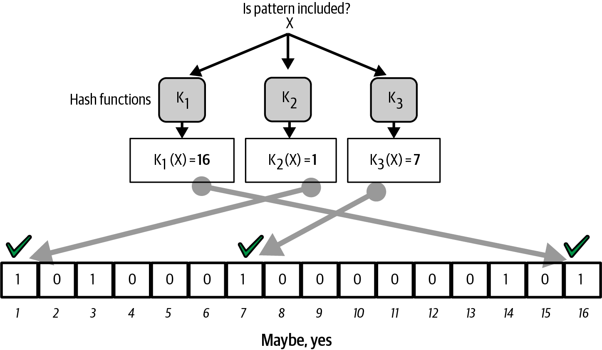
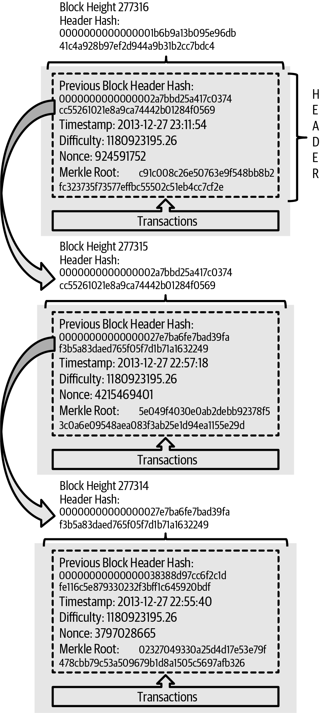
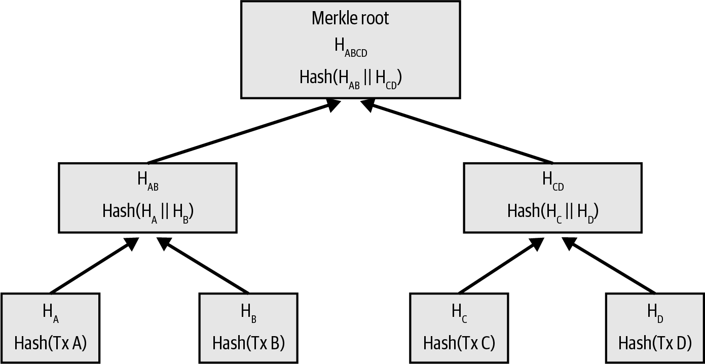

# Bab 1
#### **Pendahuluan**

Bitcoin adalah sekumpulan konsep dan teknologi yang membentuk dasar dari ekosistem uang digital. Satuan mata uangnya disebut **bitcoin** (dengan 'b' kecil), digunakan untuk menyimpan dan mengirimkan nilai di antara para peserta dalam jaringan Bitcoin. Sebaliknya, sistemnya secara keseluruhan disebut **Bitcoin** (dengan 'B' besar).

Pengguna Bitcoin berkomunikasi satu sama lain menggunakan protokol Bitcoin, terutama melalui internet. Protokol ini bersifat *open source* (kode sumbernya terbuka dan bisa dilihat siapa saja) dan dapat dijalankan di berbagai perangkat, membuatnya sangat mudah diakses.

Berbeda dari mata uang tradisional, **bitcoin** sepenuhnya virtual. Tidak ada koin fisik. Kepemilikan bitcoin dibuktikan dengan **kunci kriptografi** (*cryptographic keys*). Kunci ini disimpan dalam sebuah **dompet digital** (*digital wallet*). Siapa pun yang memiliki kunci tersebut dapat menandatangani (*sign*) transaksi untuk mengirimkan nilai bitcoin miliknya ke pemilik baru.

**Istilah Penting:**

* **Peer-to-peer (P2P):** Jaringan di mana para pesertanya (disebut *peers* atau *nodes*) terhubung satu sama lain tanpa memerlukan server pusat. Setiap peserta memiliki kedudukan yang sama.
* **Mining (Penambangan):** Proses di mana transaksi-transaksi baru diverifikasi dan ditambahkan ke dalam catatan publik yang disebut *blockchain*. Para pelaku proses ini (*miners*) diberi imbalan berupa bitcoin baru dan biaya transaksi. Proses ini juga yang menciptakan bitcoin baru dan mengamankan jaringan.
* **Blockchain:** Jurnal atau buku besar publik yang berisi semua transaksi yang pernah terjadi. Jurnal ini terdistribusi (disimpan oleh banyak peserta di seluruh dunia) dan diamankan menggunakan kriptografi.

Bitcoin memiliki empat inovasi utama yang digabungkan:

1. Jaringan *peer-to-peer* yang terdesentralisasi (protokol Bitcoin).
2. Jurnal transaksi publik (*blockchain*).
3. Satu set aturan untuk validasi transaksi dan penerbitan mata uang yang independen (aturan konsensus).
4. Mekanisme untuk mencapai konsensus global yang terdesentralisasi (*Proof-of-Work algorithm*).

#### **Mata Uang Digital Sebelum Bitcoin**

Sebelum Bitcoin, sudah ada upaya untuk menciptakan uang digital. Namun, mereka menghadapi tiga tantangan mendasar:

1. **Keaslian:** Bagaimana memastikan uang tersebut asli dan tidak dipalsukan (*counterfeit*)?
2. **Masalah Pengeluaran Ganda (*Double-Spend Problem*):** Bagaimana memastikan uang digital yang sama tidak bisa dibelanjakan lebih dari satu kali? Uang fisik mengatasi ini secara alami karena satu lembar uang tidak bisa berada di dua tempat sekaligus.
3. **Kepemilikan:** Bagaimana memastikan hanya pemilik sah yang bisa mengklaim uang tersebut?

Mata uang digital awal mencoba menyelesaikan ini dengan menggunakan otoritas pusat (*centralized authority*) untuk memverifikasi semua transaksi, mirip seperti sistem perbankan. Namun, karena terpusat, sistem ini rentan terhadap serangan pemerintah atau peretas dan akhirnya gagal. Bitcoin lahir sebagai solusi untuk menciptakan sistem uang digital yang **terdesentralisasi**, tanpa titik pusat yang bisa diserang.

#### **Sejarah Bitcoin**

Bitcoin pertama kali dideskripsikan pada tahun 2008 dalam sebuah makalah (*whitepaper*) berjudul *"Bitcoin: A Peer-to-Peer Electronic Cash System"* oleh seseorang (atau sekelompok orang) dengan nama samaran **Satoshi Nakamoto**.

Inovasi kunci dari Nakamoto adalah penggunaan sistem komputasi terdistribusi yang disebut **Proof-of-Work (PoW)**. Mekanisme ini seperti lotre global yang diadakan setiap 10 menit. Pemenangnya berhak menambahkan "halaman" baru (disebut *block*) ke dalam buku besar (*blockchain*) dan mendapatkan imbalan. Proses ini secara elegan menyelesaikan masalah *double-spend* tanpa perlu otoritas pusat.

Bitcoin juga merupakan solusi praktis untuk masalah komputasi terdistribusi yang dikenal sebagai **Byzantine Generals' Problem**, yaitu bagaimana mencapai kesepakatan di antara banyak peserta dalam jaringan yang tidak dapat diandalkan tanpa adanya pemimpin pusat.

#### **Memulai (Getting Started)**

Untuk menggunakan Bitcoin, Kita memerlukan aplikasi yang disebut **dompet Bitcoin (*Bitcoin wallet*)**. Dompet ini adalah antarmuka pengguna ke sistem Bitcoin, sama seperti browser web adalah antarmuka untuk protokol HTTP. Ada banyak sekali jenis dompet dengan kelebihan dan kekurangannya masing-masing.

##### **Memilih Dompet Bitcoin (Bitcoin Wallet)**

Dompet Bitcoin bisa dikategorikan berdasarkan beberapa hal:

**1. Berdasarkan Platform:**

* **Dompet Desktop (*Desktop wallet*):** Aplikasi yang diinstal di komputer (Windows, macOS, Linux). Menawarkan kontrol penuh tetapi keamanannya sangat bergantung pada keamanan komputer itu sendiri.
* **Dompet Seluler (*Mobile wallet*):** Jenis yang paling umum, berjalan di smartphone (iOS, Android). Sangat praktis untuk pemula, tetapi seringkali mengandalkan server pihak ketiga untuk data, yang bisa mengurangi privasi.
* **Dompet Web (*Web wallet*):** Diakses melalui browser. Kunci Kita bisa jadi disimpan di server milik pihak ketiga, mirip seperti webmail. Ini sangat tidak disarankan untuk menyimpan jumlah besar karena Kita mempercayakan dana Kita pada pihak lain.
* **Perangkat Penandatanganan Perangkat Keras (*Hardware signing devices / Hardware wallets*):** Perangkat fisik khusus yang menyimpan kunci Kita secara offline. Ini adalah salah satu cara teraman untuk menyimpan bitcoin karena kunci tidak pernah terekspos ke komputer yang terhubung internet.

**2. Berdasarkan Otonomi & Interaksi dengan Jaringan:**

* **Full Node:** Program yang mengunduh dan memvalidasi *seluruh* riwayat transaksi Bitcoin. Ini memberikan otonomi dan keamanan tertinggi, tetapi membutuhkan sumber daya komputasi dan ruang penyimpanan yang besar (ratusan Gigabyte).
* **Lightweight Client (atau SPV Client):** Klien yang hanya mengunduh sebagian kecil data dari *blockchain* (hanya *block headers*). Klien ini terhubung ke *full node* untuk mendapatkan informasi transaksi, sehingga tidak se-independen *full node* tetapi jauh lebih hemat sumber daya.
* **Klien API Pihak Ketiga (*Third-party API client*):** Dompet yang berinteraksi dengan Bitcoin melalui sistem pihak ketiga, bukan terhubung langsung ke jaringan P2P Bitcoin. Ini paling tidak aman dan paling tidak privat.

**3. Berdasarkan Siapa yang Mengontrol Kunci:**
Ini adalah kategori paling penting dari sudut pandang keamanan.

* **Non-custodial wallet:** Kita, dan hanya Kita, yang memegang kendali atas *private keys*. Inilah esensi dari Bitcoin. Slogannya adalah: **"Your keys, your coins. Not your keys, not your coins."** (Kunci Anda, koin Anda. Bukan kunci Anda, bukan koin Anda).
* **Custodial service:** Pihak ketiga (seperti bursa/exchange) yang memegang *private keys* untuk Kita. Ini seperti bank. Jika mereka diretas atau bangkrut, dana Kita bisa hilang.

##### **Mulai Cepat & Kode Pemulihan (Recovery Codes)**

Saat Kita pertama kali membuat dompet *non-custodial*, aplikasi akan menghasilkan **kode pemulihan** (*recovery code*). Kode ini sangat penting karena merupakan *master backup* untuk semua kunci di dompet Kita. Jika ponsel atau komputer Kita hilang/rusak, Kita bisa memulihkan seluruh dana Kita di perangkat baru hanya dengan memasukkan kode ini.

Kode ini juga dikenal sebagai **mnemonic phrase** atau **seed phrase**, biasanya terdiri dari 12 hingga 24 kata acak.

**Contoh Kode Pemulihan:**

| Wallet     | Recovery Code                                                                                                                |
| :--------- | :--------------------------------------------------------------------------------------------------------------------------- |
| BlueWallet | (1) media (2) suspect (3) effort (4) dish (5) album (6) shaft (7) price (8) junk (9) pizza (10) situate (11) oyster (12) rib |
| Electrum   | nephew dog crane clever quantum crazy purse traffic repeat fruit old clutch                                                  |
| Muun       | LAFV TZUN V27E NU4D WPF4 BRJ4 ELLP BNFL                                                                                      |

> **Peringatan Keamanan:** Jangan pernah menyimpan kode pemulihan ini secara digital (di email, cloud, atau screenshot). Cara terbaik adalah menuliskannya di atas kertas dan menyimpannya di tempat yang sangat aman. Jangan pernah memberikannya kepada siapa pun atau memasukkannya ke situs web yang tidak terpercaya. Aplikasi dompet yang sah hanya akan meminta kode ini saat proses pemulihan (restore), bukan saat penggunaan normal.

##### **Alamat Bitcoin (Bitcoin Addresses)**

Setelah dompet dibuat, ia akan menghasilkan **alamat Bitcoin** (*Bitcoin address*). Alamat ini seperti nomor rekening bank, tetapi ada beberapa perbedaan penting:

* Kita bisa membuat alamat baru sebanyak yang Kita mau.
* Sangat disarankan untuk **menggunakan alamat baru setiap kali Kita menerima pembayaran**. Menggunakan alamat yang sama berulang kali akan mengurangi privasi Kita, karena semua orang bisa melihat total dana yang masuk ke alamat tersebut di *blockchain*.
* Alamat ini aman untuk dibagikan. Orang lain hanya bisa mengirim bitcoin *ke* alamat tersebut, tidak bisa mengambilnya.

##### **Mendapatkan Bitcoin Pertama Anda**

Ada beberapa cara untuk mendapatkan bitcoin:

* Membeli langsung dari teman.
* Menghasilkan bitcoin dengan menjual barang atau jasa.
* Menggunakan ATM Bitcoin.
* Membeli melalui bursa (*exchange*) mata uang kripto. Perlu diperhatikan bahwa bursa biasanya akan meminta verifikasi identitas (proses yang disebut **KYC - Know Your Customer**), yang menghubungkan identitas dunia nyata Kita dengan aktivitas Bitcoin Kita.

> **Catatan Penting:** Transaksi Bitcoin **tidak dapat dibatalkan** (*irreversible*). Setelah dikirim, tidak ada cara untuk menariknya kembali.

##### **Mengirim, Menerima, dan Konfirmasi**

Untuk menerima pembayaran, dompet Kita akan menampilkan alamat dalam bentuk teks dan **QR code** untuk memudahkan pengirim. Pengirim memindai QR code tersebut, memasukkan jumlah, dan mengirim transaksi.

Setelah transaksi dikirim, statusnya akan menjadi **"Unconfirmed"** (Belum terkonfirmasi). Ini berarti transaksi sudah disiarkan ke jaringan, tetapi belum dimasukkan ke dalam sebuah *block* di *blockchain*.

Sebuah transaksi dianggap **terkonfirmasi** (*confirmed*) setelah dimasukkan ke dalam sebuah *block* yang valid. Rata-rata, sebuah *block* baru ditemukan setiap 10 menit. Semakin banyak *block* yang ditambahkan di atas *block* yang berisi transaksi Kita, semakin aman dan semakin permanen transaksi tersebut. Dalam praktiknya, 6 konfirmasi (sekitar 1 jam) sudah dianggap sangat aman untuk transaksi bernilai besar.

---

# Bab 2
## Cara Kerja Bitcoin**

Berbeda dengan sistem perbankan tradisional, Bitcoin tidak memerlukan kepercayaan pada pihak ketiga. Setiap pengguna bisa menjalankan *software* di komputernya sendiri untuk memverifikasi setiap aspek dari sistem Bitcoin. Bab ini akan menelusuri satu transaksi dari awal hingga akhir.

#### **Gambaran Umum Bitcoin (*Bitcoin Overview*)**

Sistem Bitcoin terdiri dari:

1. **Pengguna** dengan **dompet (*wallets*)** yang berisi **kunci (*keys*)**.
2. **Transaksi (*transactions*)** yang disiarkan ke seluruh jaringan.
3. **Penambang (*miners*)** yang menghasilkan **konsensus *blockchain*** melalui kompetisi komputasi. *Blockchain* ini adalah catatan otoritatif dari semua transaksi.

Untuk memvisualisasikan transaksi dalam bab ini, kita akan menggunakan ***blockchain explorer***.

**Istilah Penting:**

* ***Blockchain Explorer:*** Sebuah situs web yang berfungsi seperti mesin pencari untuk *blockchain* Bitcoin. Anda bisa memasukkan alamat, ID transaksi, atau nomor *block* untuk melihat detail dan alirannya. Contohnya termasuk Blockstream Explorer atau Mempool.Space.

> **Peringatan Privasi:** Menggunakan *blockchain explorer* bisa memberitahu operator situs tersebut tentang alamat atau transaksi yang Anda minati, yang berpotensi menghubungkannya dengan alamat IP Anda.

#### **Membeli dari Toko Online (*Buying from an Online Store*)**

Kita akan melanjutkan kisah Alice dari Bab 1. Alice kini ingin membeli episode *podcast* dari toko online milik Bob.

Toko Bob menerima pembayaran Bitcoin. Saat *checkout*, sistem Bob secara otomatis membuat sebuah **faktur (*invoice*)** dalam bentuk **QR code**.

<p align="center">
  
</p>


Berbeda dengan QR code biasa yang hanya berisi alamat tujuan, faktur ini berisi lebih banyak informasi dalam format URI (*Uniform Resource Identifier*):

```
bitcoin:bc1qk2g6u8p4qm2s2lh3gts5cpt2mrv5skcuu7u3e4?amount=0.01577764&label=Bob%27s%20Store&message=Purchase%20at%20Bob%27s%20Store
```

Ini terdiri dari:

* **Alamat Bitcoin:** `bc1qk2g6u8p4qm2s2lh3gts5cpt2mrv5skcuu7u3e4`
* **Jumlah Pembayaran:** `0.01577764` BTC
* **Label:** "Bob's Store"
* **Deskripsi:** "Purchase at Bob's Store"

Alice memindai QR code ini dengan dompet di ponselnya. Aplikasi dompetnya otomatis mengisi semua detail. Alice hanya perlu menekan "Kirim" untuk mengotorisasi pembayaran. Dalam beberapa detik, Bob melihat transaksi tersebut masuk di sistemnya.

#### **Transaksi Bitcoin (*Bitcoin Transactions*)**

Secara sederhana, sebuah transaksi memberitahu jaringan bahwa pemilik sejumlah bitcoin telah mengizinkan transfer nilai tersebut ke pemilik baru.

##### **Input dan Output Transaksi**

Transaksi di Bitcoin seperti entri dalam buku besar akuntansi berpasangan (*double-entry bookkeeping*):

* **Input:** Sisi "sumber dana" dari transaksi. Ini merujuk pada transaksi sebelumnya di mana si pengirim menerima bitcoin.
* **Output:** Sisi "tujuan dana" dari transaksi. Ini menciptakan "kunci" baru yang hanya bisa dibuka oleh pemilik berikutnya.

Total nilai dari *input* harus sedikit lebih besar dari total nilai *output*. Selisihnya adalah **biaya transaksi (*transaction fee*)**, yang menjadi insentif bagi *miner* untuk memasukkan transaksi tersebut ke dalam *blockchain*.

<p align="center">
  
</p>

*Gambar 2-2 di buku mengilustrasikan ini: Sebuah tabel dengan kolom Input dan Output. Total Input adalah 0.55 BTC, sementara Total Output adalah 0.50 BTC. Perbedaannya, yaitu 0.05 BTC, adalah biaya transaksi.*

##### **Rantai Transaksi (*Transaction Chains*)**

Setiap transaksi terhubung dengan transaksi sebelumnya. *Input* dari sebuah transaksi sebenarnya adalah *output* dari transaksi sebelumnya. Inilah yang membentuk "rantai" kepemilikan.

<p align="center">
  
</p>

*Gambar 2-3 di buku menunjukkan ini secara visual. Transaksi 1 (Tx1) mengirimkan 100,000 satoshi ke Alice. Transaksi Alice ke Bob (Tx2) menggunakan output dari Tx1 sebagai input-nya. Output dari Tx2 kemudian bisa menjadi input untuk transaksi Bob berikutnya (Tx3).*

**Istilah Penting:**

* **Satoshi (sat):** Unit terkecil dari bitcoin. 1 bitcoin = 100,000,000 satoshi. Protokol Bitcoin sendiri menggunakan satoshi untuk menghitung nilai.

##### **Membuat Kembalian (*Making Change*)**

*Input* transaksi harus dihabiskan seluruhnya, mirip seperti Kita tidak bisa menyobek selembar uang kertas untuk membayar. Jika Kita ingin membayar 5 BTC tetapi hanya memiliki *input* senilai 20 BTC, transaksi Kita akan memiliki dua *output*:

1. Satu *output* sebesar 5 BTC untuk si penerima.
2. Satu *output* sebesar 15 BTC (dikurangi biaya transaksi) yang kembali ke alamat Kita sendiri. Ini disebut ***change output***.

Untuk privasi, alamat kembalian ini biasanya adalah alamat baru yang belum pernah digunakan, yang juga dibuat oleh dompet Kita.

##### **Bentuk-Bentuk Transaksi Umum**

* **Transaksi Umum (*Common Transaction*):** Satu *input* dan dua *output* (satu untuk pembayaran, satu untuk kembalian). Ini adalah bentuk yang paling sering ditemui. *Digambarkan di Gambar 2-4*.
<p align="center">
  
</p>

* **Transaksi Agregasi (*Aggregating Transaction*):** Beberapa *input* digabungkan menjadi satu *output* tunggal. Mirip seperti menukar banyak uang koin menjadi selembar uang kertas besar. *Digambarkan di Gambar 2-5*.

<p align="center">
  
</p>

* **Transaksi Distribusi (*Distributing Transaction*):** Satu *input* yang membayar ke banyak *output* (banyak penerima). Sering digunakan oleh bisnis, misalnya untuk membayar gaji. *Digambarkan di Gambar 2-6*.

<p align="center">
  
</p>

#### **Membangun Sebuah Transaksi (*Constructing a Transaction*)**

Dompet Alice melakukan semua pekerjaan ini secara otomatis. Alice hanya perlu menentukan tujuan, jumlah, dan biaya transaksi. Dompet bisa membangun transaksi bahkan saat sedang *offline*.

1. **Mendapatkan Input yang Tepat:** Dompet akan memindai daftar *output* yang belum terpakai yang dimilikinya, yang dikenal sebagai **UTXO (*Unspent Transaction Outputs*)**. Ia akan memilih satu atau beberapa UTXO yang cukup untuk menutupi jumlah pembayaran.
2. **Membuat Output:** Dompet membuat satu *output* untuk Bob dan (jika perlu) satu *change output* untuk Alice kembali. Setiap *output* berisi sebuah *script* yang pada dasarnya mengatakan, "Dana ini hanya bisa dibelanjakan oleh siapa pun yang bisa memberikan tanda tangan digital yang sah dari kunci milik Bob".
3. **Menambahkan Biaya Transaksi:** Biaya transaksi tidak ditulis secara eksplisit, melainkan dihitung dari selisih antara total *input* dan total *output*.

#### **Menambahkan Transaksi ke Blockchain**

Setelah transaksi dibuat dan ditandatangani, ia harus disiarkan ke jaringan Bitcoin.

##### **Propagasi Transaksi**

Dompet Alice mengirimkan transaksi tersebut ke beberapa *node* (rekan) di jaringan P2P. Setiap *node* yang menerima transaksi valid yang belum pernah dilihat sebelumnya akan meneruskannya ke semua *node* lain yang terhubung dengannya. Proses ini disebut ***gossiping***. Dalam beberapa detik, transaksi tersebut menyebar ke sebagian besar jaringan. Dompet Bob, yang juga terhubung ke jaringan, akan mendeteksi transaksi ini sebagai pembayaran masuk.

##### **Penambangan Bitcoin (*Bitcoin Mining*)**

Transaksi Alice kini ada di jaringan, tetapi belum menjadi bagian permanen dari *blockchain*. Ia harus dimasukkan ke dalam sebuah *block* melalui proses yang disebut **mining**.

*Mining* memiliki dua tujuan utama:

1. **Mencapai Konsensus:** Para *miner* berkompetisi untuk memecahkan teka-teki komputasi yang sangat sulit. *Miner* pertama yang berhasil akan "memenangkan" hak untuk membuat *block* berikutnya. Solusi ini disebut ***Proof-of-Work (PoW)***. Karena PoW sangat sulit dibuat tetapi mudah diverifikasi, ia berfungsi sebagai bukti bahwa upaya komputasi yang besar telah dilakukan, sehingga mengamankan transaksi di dalam *block* tersebut.
2. **Menerbitkan Bitcoin Baru:** *Miner* yang berhasil membuat *block* akan mendapatkan imbalan berupa bitcoin yang baru dibuat (*block subsidy*) ditambah semua biaya transaksi dari transaksi yang ia masukkan ke dalam *block*.

Sekitar lima menit setelah Alice mengirim transaksinya, seorang *miner* (misalnya Jing dari contoh di buku) menemukan solusi PoW untuk *block* yang berisi transaksi Alice. *Block* ini kemudian disiarkan ke seluruh jaringan. Setiap *node* lain memverifikasinya dan menambahkannya ke salinan *blockchain* mereka.

Saat *block* yang berisi transaksi Alice ditambahkan ke *blockchain*, transaksi tersebut mendapatkan **1 konfirmasi**. Setiap *block* baru yang ditambahkan di atasnya memberikan konfirmasi tambahan. Semakin banyak konfirmasi, semakin sulit (secara komputasi) untuk membatalkan transaksi tersebut.

<p align="center">
  
</p>

*Gambar 2-7 di buku menggambarkan tumpukan block, dengan block yang berisi transaksi Alice berada di tengah. Tumpukan block di bawahnya menunjukkan sejarah (block height), sementara tumpukan block di atasnya menunjukkan tingkat keamanan atau kedalaman (block depth).*

#### **Membelanjakan Transaksi (*Spending the Transaction*)**

Setelah transaksi Alice terkonfirmasi, Bob kini adalah pemilik sah dari dana tersebut. *Output* dari transaksi Alice menjadi UTXO baru yang dikontrol oleh kunci milik Bob. Bob sekarang bisa menggunakan UTXO ini sebagai *input* untuk transaksi berikutnya, misalnya untuk membayar desainer web-nya, Gopesh.

<p align="center">
  
</p>

*Gambar 2-8 mengilustrasikan rantai transaksi lengkap: Joe membayar Alice (Transaksi #1), Alice membayar Bob (Transaksi #2), dan Bob membayar Gopesh (Transaksi #3). Ini menunjukkan bagaimana nilai berpindah dari satu pemilik ke pemilik berikutnya melalui rantai transaksi yang saling terhubung.*

---

# Bab 3
## Bitcoin Core: Implementasi Referensi**

Uang hanya diterima jika orang percaya bisa membelanjakannya nanti. Untuk memastikan bitcoin yang diterima itu sah (bukan palsu atau nilainya dikurangi secara tiba-tiba), setiap pengguna perlu memverifikasinya. Sistem Bitcoin dirancang agar setiap orang bisa menjalankan perangkat lunak di komputernya sendiri untuk memverifikasi secara sempurna setiap transaksi dan aturan dalam sistem. Perangkat lunak yang melakukan ini disebut ***full verification node*** (atau disingkat ***full node***).

Di bab ini, kita akan menginstal **Bitcoin Core**, implementasi *full node* yang paling banyak digunakan. Dengan ini, kita bisa memeriksa *blocks*, transaksi, dan data lain secara otoritatif—bukan karena ada pihak yang menyuruh kita percaya, tetapi karena *node* kita sendiri yang memverifikasinya secara independen.

#### **Dari Bitcoin Menjadi Bitcoin Core**

Bitcoin adalah proyek *open source* dengan lisensi MIT, artinya kodenya gratis untuk diunduh dan digunakan. Awalnya dikembangkan oleh Satoshi Nakamoto, kini perangkat lunak tersebut telah banyak dimodifikasi dan ditingkatkan oleh komunitas pengembang sukarelawan. Implementasi pertama yang dibuat Satoshi kini dikenal sebagai **Bitcoin Core** untuk membedakannya dari implementasi lain.

Bitcoin Core adalah **implementasi referensi** (*reference implementation*), artinya ia menjadi acuan standar bagaimana setiap bagian dari teknologi Bitcoin harus diimplementasikan. Ia mencakup semua aspek: dompet, mesin validasi transaksi dan *block*, serta komunikasi P2P.

<p align="center">
  
</p>

*Gambar 3-1 di buku menunjukkan arsitektur Bitcoin Core, yang terdiri dari berbagai komponen seperti Peer Discovery, Connection Manager, Wallet, RPC, Mempool, Validation Engine, dll. Ini adalah gambaran teknis dari "mesin" Bitcoin Core.*

#### **Lingkungan Pengembangan Bitcoin (*Bitcoin Development Environment*)**

Bab ini sangat teknis dan ditujukan untuk pengembang. Kita akan membahas proses penyiapan lingkungan pengembangan langkah demi langkah.

##### **Mengompilasi (*Compiling*) Bitcoin Core dari Kode Sumber**

Kita bisa mendapatkan kode sumber Bitcoin Core dengan mengunduh arsipnya atau dengan "meng-kloning" repositorinya dari GitHub. Menggunakan Git (alat penting bagi pengembang) adalah cara yang disarankan.

**Istilah Penting:**

* **Compile (Kompilasi):** Proses mengubah kode sumber yang dapat dibaca manusia (seperti C++) menjadi program yang dapat dieksekusi oleh komputer (file biner).
* **Git:** Sistem kontrol versi terdistribusi yang digunakan untuk melacak perubahan dalam kode sumber selama pengembangan perangkat lunak.
* **GitHub:** Platform hosting untuk pengembangan perangkat lunak yang menggunakan Git.

Berikut adalah contoh perintah untuk mengkloning repositori Bitcoin Core menggunakan antarmuka baris perintah (*command-line*):

```bash
$ git clone https://github.com/bitcoin/bitcoin.git
```

Ini akan membuat salinan lokal dari seluruh riwayat kode sumber di direktori bernama `bitcoin`.

##### **Memilih Rilis Bitcoin Core**

Setelah mengkloning, Kita akan berada di versi kode terbaru yang mungkin belum stabil. Penting untuk beralih ke versi rilis spesifik yang stabil.

1. Lihat daftar rilis yang tersedia dengan perintah `git tag`:

   ```bash
   $ git tag
   v0.1.5
   ...
   v0.11.2
   ...
   v24.0.1
   ```
2. Pilih versi stabil terbaru (misalnya, `v24.0.1`) dan beralih ke sana dengan `git checkout`:

   ```bash
   $ git checkout v24.0.1
   ```

##### **Mengonfigurasi Build Bitcoin Core**

Kode sumber menyertakan dokumentasi penting di direktori `doc/`. Kita harus membaca instruksi *build* yang sesuai dengan sistem operasi Kita (misalnya, `build-unix.md` untuk Linux/macOS).

1. **Prasyarat (*Prerequisites*):** Pastikan semua pustaka (*libraries*) yang diperlukan sudah terinstal. Jika tidak, proses *build* akan gagal.
2. **Hasilkan Skrip Build:** Jalankan skrip `autogen.sh` untuk membuat skrip konfigurasi.

   ```bash
   $ ./autogen.sh
   ```
3. **Konfigurasi:** Jalankan skrip `configure` yang baru saja dibuat. Skrip ini memeriksa sistem Kita dan menyesuaikan proses *build*. Kita bisa menambahkan opsi, misalnya untuk menonaktifkan GUI (*Graphical User Interface*) jika Kita hanya butuh server baris perintah.

   ```bash
   $ ./configure
   ```

   Jika ada pustaka yang hilang, skrip ini akan berhenti dengan pesan kesalahan. Instal pustaka yang kurang, lalu jalankan lagi.

##### **Membangun Eksekutable (*Executables*) Bitcoin Core**

Setelah konfigurasi berhasil, mulailah proses kompilasi. Ini bisa memakan waktu cukup lama.

1. **Kompilasi:**

   ```bash
   $ make
   ```
2. **Verifikasi dan Instal:** Jalankan tes untuk memastikan semuanya berfungsi, lalu instal program ke sistem Kita. Perintah `sudo` mungkin diperlukan karena ini menginstal file ke direktori sistem.

   ```bash
   $ make check && sudo make install
   ```

   Setelah selesai, Kita akan memiliki beberapa program, yang terpenting adalah `bitcoind` (server/daemon Bitcoin) dan `bitcoin-cli` (alat baris perintah untuk berinteraksi dengan `bitcoind`).

#### **Menjalankan Node Bitcoin Core**

Menjalankan *full node* berarti Kita memiliki pandangan yang langsung dan otoritatif terhadap *blockchain*. Kita tidak perlu mempercayai pihak ketiga mana pun untuk memvalidasi transaksi.

**Peringatan Sumber Daya:**
Menjalankan *full node* membutuhkan sumber daya yang signifikan:

* **Penyimpanan:** Lebih dari 500 GB data *blockchain* saat pertama kali sinkronisasi (disebut *Initial Block Download* atau IBD), dan terus bertambah setiap hari.
* **Bandwidth:** Mengunduh *block* dan menyiarkan transaksi ke *node* lain akan menggunakan banyak bandwidth internet Kita.

**Mengapa Menjalankan Node?**

* **Keamanan & Privasi Maksimal:** Anda memvalidasi transaksi Anda sendiri dan tidak membocorkan alamat mana yang Anda minati ke pihak ketiga.
* **Pengembangan:** Jika Anda seorang pengembang, Anda memerlukan akses API langsung ke *node*.
* **Mendukung Jaringan:** Semakin banyak *full node* yang jujur, semakin kuat dan terdesentralisasi jaringan Bitcoin.

##### **Mengonfigurasi Node Bitcoin Core**

Bitcoin Core mencari file konfigurasi bernama `bitcoin.conf` di direktori datanya (misalnya, `~/.bitcoin/` di Linux). Kita bisa mengatur lebih dari 100 opsi di file ini. Beberapa yang penting:

* `txindex=1`: Membangun indeks lengkap dari semua transaksi di *blockchain*. Ini **sangat penting** untuk seorang auditor atau analis *blockchain* karena memungkinkan Kita untuk mencari transaksi apa pun berdasarkan ID-nya. Tanpa ini, Kita hanya bisa mencari transaksi yang relevan dengan dompet *node* Kita.
* `prune=<megabytes>`: Mengurangi kebutuhan ruang disk dengan menghapus *block-block* lama setelah diverifikasi. *Node* yang di-*prune* masih merupakan *full node* dalam hal validasi, tetapi tidak bisa melayani data *block* historis ke *node* lain.
* `blocksonly=1`: Mengurangi penggunaan bandwidth dengan hanya menerima *block* yang sudah dikonfirmasi, bukan menyiarkan transaksi yang belum dikonfirmasi.

**Contoh `bitcoin.conf` untuk seorang analis/auditor:**

```
# Maintain a full transaction index
txindex=1

# Optional: Set a larger cache for UTXO database
dbcache=1000
```

Untuk menjalankan `bitcoind` di latar belakang sebagai *daemon* (layanan sistem):

```bash
$ bitcoind -daemon
```

Untuk memantau progres sinkronisasinya:

```bash
$ bitcoin-cli getblockchaininfo
```

#### **API Bitcoin Core**

Bitcoin Core menyediakan antarmuka **JSON-RPC** (*JavaScript Object Notation - Remote Procedure Call*). Ini berarti Kita bisa mengirim perintah dalam format JSON ke *node* Kita dan menerima respons dalam format yang sama. Alat `bitcoin-cli` adalah cara mudah untuk menggunakan API ini dari baris perintah.

##### **Contoh Perintah `bitcoin-cli`**

1. **Mendapatkan Informasi:**

   * `getblockchaininfo`: Menampilkan status *blockchain* di *node* Kita.
   * `getnetworkinfo`: Menampilkan status koneksi jaringan *node* Kita.

2. **Menjelajahi Transaksi (Membutuhkan `txindex=1`):**

   * `getrawtransaction <txid>`: Mengambil data transaksi mentah dalam format heksadesimal.

     ```bash
     $ bitcoin-cli getrawtransaction 466200308696215bbc949d5141a49a4138ecdfdfaa2a8029c1f9bcecd1f96177
     ```
   * `decoderawtransaction <hex>`: Menerjemahkan data heksadesimal dari perintah di atas menjadi format yang dapat dibaca manusia (JSON).

     ```bash
     $ bitcoin-cli decoderawtransaction <hex_data_from_above>
     ```

     Hasilnya akan menunjukkan detail seperti `vin` (*inputs*), `vout` (*outputs*), `locktime`, dll.

3. **Menjelajahi Block:**

   * `getblockhash <height>`: Mendapatkan *hash* dari *block* pada ketinggian tertentu.

     ```bash
     $ bitcoin-cli getblockhash 123456
     ```
   * `getblock <hash>`: Mendapatkan detail lengkap dari *block* dengan *hash* tertentu.

     ```bash
     $ bitcoin-cli getblock 0000000000002917ed80650c6174aac8dfc46f5fe36480aaef682ff6cd83c3ca
     ```

     Hasilnya akan berisi *hash* *block* sebelumnya, *merkle root*, *nonce*, dan daftar ID dari semua transaksi di dalamnya.

##### **Mengakses API Secara Terprogram**

Kita bisa memanggil API JSON-RPC ini dari hampir semua bahasa pemrograman. Buku ini memberikan contoh menggunakan Python dengan pustaka `python-bitcoinlib`.

**Contoh Kode Python (rpc\_example.py):**
Kode ini menghubungkan ke *node* Bitcoin Core lokal Kita dan mencetak jumlah *block* saat ini.

```python
from bitcoin.rpc import RawProxy

# Membuat koneksi ke node Bitcoin Core lokal
p = RawProxy()

# Menjalankan perintah getblockchaininfo
info = p.getblockchaininfo()

# Mengambil elemen 'blocks' dari info dan mencetaknya
print(info['blocks'])
```

**Contoh Kode Python (rpc\_transaction.py):**
Kode ini mengambil transaksi Alice, mendekodenya, dan mencetak alamat tujuan serta nilainya.

```python
from bitcoin.rpc import RawProxy

p = RawProxy()

# ID transaksi Alice
txid = "466200308696215bbc949d5141a49a4138ecdfdfaa2a8029c1f9bcecd1f96177"

# Ambil transaksi mentah (hex)
raw_tx = p.getrawtransaction(txid)

# Dekode transaksi hex menjadi objek JSON
decoded_tx = p.decoderawtransaction(raw_tx)

# Ulangi setiap output dalam transaksi dan cetak alamat serta nilainya
for output in decoded_tx['vout']:
    # Periksa apakah 'address' ada sebelum mencetaknya
    if 'address' in output['scriptPubKey']:
        print(output['scriptPubKey']['address'], output['value'])
```

Bab 3 ini memberikan Kita alat dan pemahaman dasar untuk mulai "membongkar" *blockchain*. Dengan menjalankan *full node* Kita sendiri dan menggunakan API-nya, Kita bisa memverifikasi, menganalisis, dan membangun aplikasi di atas Bitcoin dengan tingkat keamanan dan kepercayaan tertinggi. Keterampilan ini adalah fondasi mutlak untuk menjadi seorang auditor keamanan *blockchain*.

---

# Bab 4
## Kunci dan Alamat (*Keys and Addresses*)**

Bab ini menjelaskan bagaimana Bitcoin menggunakan kriptografi kunci publik untuk mengontrol kepemilikan dana. Kita akan mempelajari bagaimana *private keys*, *public keys*, tanda tangan (*signatures*), dan alamat (*addresses*) dibuat serta bagaimana mereka bekerja sama untuk mengamankan bitcoin.

#### **Kriptografi Kunci Publik (*Public Key Cryptography*)**

*Public Key Cryptography* (juga dikenal sebagai kriptografi asimetris) adalah fondasi keamanan Bitcoin. Ia menggunakan sepasang kunci matematika: sebuah **private key** dan sebuah **public key**.

* **Private Key (Kunci Privat):** Sebuah angka rahasia yang hanya diketahui oleh pemiliknya. Digunakan untuk membuat tanda tangan digital (*digital signatures*) yang mengotorisasi pengeluaran dana. Kehilangan *private key* berarti kehilangan akses ke dana Kita selamanya.
* **Public Key (Kunci Publik):** Sebuah angka yang dapat dibagikan secara bebas kepada siapa pun. Digunakan untuk menerima dana. *Public key* dibuat dari *private key* melalui proses matematika satu arah.

**Proses Satu Arah (*One-way function*):** Kita bisa dengan mudah membuat *public key* dari *private key*, tetapi secara komputasi **tidak mungkin** untuk mendapatkan *private key* dari *public key*. Sifat ini disebut *trap door function* dan menjadi dasar keamanan Bitcoin.

Dalam Bitcoin, kriptografi asimetris tidak digunakan untuk mengenkripsi transaksi, melainkan untuk **membuat tanda tangan digital**. Tanda tangan membuktikan:

1. **Kepemilikan:** Hanya orang yang memiliki *private key* yang bisa membuat tanda tangan valid.
2. **Integritas:** Tanda tangan mengunci data transaksi sehingga tidak bisa diubah oleh pihak lain.

#### **Private Keys**

Sebuah *private key* Bitcoin hanyalah angka 256-bit yang dipilih secara acak. Sangat penting bahwa angka ini dihasilkan dari sumber keacakan (*entropy*) yang benar-benar aman. Menggunakan metode acak yang lemah dapat membahayakan keamanan dana Kita.

**Istilah Penting:**

* **Entropy:** Ukuran ketidakpastian atau keacakan. Dalam kriptografi, sumber *entropy* yang baik sangat penting untuk menghasilkan kunci yang tidak dapat ditebak.

Ukuran ruang kunci privat Bitcoin (\$2^{256}\$) sangatlah besar, kira-kira setara dengan jumlah atom di alam semesta yang teramati. Hal ini membuat penebakan *private key* secara acak (*brute-force*) menjadi mustahil.

Contoh *private key* (heksadesimal):

```
1E99423A4ED27608A15A2616A2B0E9E52CED330AC530EDCC32C8FFC6A526AEDD
```

#### **Elliptic Curve Cryptography (ECC)**

Bitcoin menggunakan jenis kriptografi kunci publik yang disebut **Elliptic Curve Cryptography (ECC)**. Dasarnya adalah operasi matematika (penjumlahan dan perkalian) pada titik-titik di kurva eliptik. Bitcoin menggunakan kurva khusus bernama **secp256k1**.

Persamaan kurva secp256k1:

$y^2 \mod p = (x^3 + 7) \mod p$

dengan \$p = 2^{256} - 2^{32} - 2^9 - 2^8 - 2^7 - 2^6 - 2^4 - 1\$.

<p align="center">
  
</p>

lalu

<p align="center">
  
</p>

*Gambar 4-2 dan 4-3 di buku mengilustrasikan bentuk kurva eliptik di bilangan real (mulus) dan di *finite field* (titik-titik acak).*

**Contoh Kode Python (Verifikasi Titik pada Kurva):**

```python
# p adalah bilangan prima secp256k1
p = 115792089237316195423570985008687907853269984665640564039457584007908834671663

# x dan y adalah koordinat public key
x = 55066263022277343669578718895168534326250603453777594175500187360389116729240
y = 32670510020758816978083085130507043184471273380659243275938904335757337482424

# Verifikasi
print((y**2 - (x**3 + 7)) % p)  # Output: 0 → titik valid
```

#### **Public Keys**

Sebuah *public key* (\$K\$) dihasilkan dari *private key* (\$k\$) melalui perkalian kurva eliptik dengan titik konstan **generator point** (\$G\$):

$K = k \times G$

* \$k\$: *private key* (angka).
* \$G\$: *generator point* (konstan di kurva).
* \$K\$: *public key* (titik \$(x,y)\$ di kurva).

<p align="center">
  
</p>

*Gambar 4-4 memperlihatkan perkalian ini dengan “penjumlahan titik” berulang.*

#### **Script Input dan Output**

Bitcoin tidak langsung mengirim dana ke *public key*. Dana dikunci dalam sebuah **output script**. Untuk membelanjakannya, seseorang harus memberikan **input script** yang memenuhi syarat dalam *output script*. Mekanisme ini mendasari *smart contracts* di Bitcoin.

#### **Alamat Bitcoin dan Evolusinya**

##### **P2PKH (Pay-to-Public-Key-Hash)**

Karena *public key* panjang (65 byte), Bitcoin memperkenalkan **hash function** untuk membuat alamat.

**Istilah Penting:**

* **Hash Function:** Algoritma yang menghasilkan sidik jari digital tetap dari input apa pun. Mustahil membalikkan hasilnya atau menemukan dua input berbeda dengan hasil sama.

Alamat dihitung:
$A = \text{RIPEMD160}(\text{SHA256}(K))$

Hasilnya adalah hash 160-bit (20-byte).

*Output script P2PKH:*

```
OP_DUP OP_HASH160 <Public Key Hash> OP_EQUALVERIFY OP_CHECKSIG
```

*Input script:*

```
<Signature> <Public Key>
```

##### **Base58Check Encoding**

* **Base58:** Seperti Base64, tapi tanpa karakter ambigu (0, O, l, I).
* **Check:** Tambah 4-byte checksum untuk deteksi salah ketik.

Struktur: `[Version Byte] + [Public Key Hash] + [Checksum]`.
Untuk mainnet, *version byte* = `0x00`, sehingga alamat diawali **1**.

##### **Compressed Public Keys**

Dari titik \$(x,y)\$, cukup simpan \$x\$ dan 1 bit (ganjil/genap \$y\$). Ukuran turun dari 65 byte → 33 byte. Transaksi lebih kecil dan murah. Hampir semua dompet modern memakai ini.

##### **P2SH (Pay-to-Script-Hash)**

Untuk kondisi kompleks (misalnya multisignature 2-of-3):

1. Buat *redeem script*.
2. Hash dengan `HASH160`.
3. *Output script:*

   ```
   OP_HASH160 <Script Hash> OP_EQUAL
   ```

Saat membelanjakan, *input script* menyediakan tanda tangan + *redeem script* asli.

*Version byte* = `0x05`, alamat diawali **3**.

##### **Bech32 & Bech32m (SegWit Addresses)**

Diperkenalkan lewat SegWit (2017):

* Huruf kecil, mudah dibaca.
* Deteksi & koreksi kesalahan lebih baik.
* Lebih efisien untuk QR code.
* Diawali **bc1**.

Bech32 untuk SegWit v0, Bech32m untuk SegWit v1/Taproot. Standar modern yang direkomendasikan.

#### **Format Kunci Privat**

Format umum: **WIF (Wallet Import Format)**.

* **WIF:** Base58Check dari private key 256-bit. Biasanya diawali `5`.
* **WIF-Compressed:** Tambah byte `0x01` di akhir, biasanya diawali `K` atau `L`.

> **Penting:** Dompet modern memakai BIP32/BIP39 (deterministic wallets). Impor private key tunggal tidak disarankan. WIF hanya untuk kompatibilitas lama.

#### **Kunci dan Alamat Lanjutan**

* **Vanity Addresses:** Alamat dengan pola khusus (contoh: `1KidsCharity...`). Dibuat dengan brute-force miliaran kunci. Sama amannya, tetapi jarang dipakai karena privasi dan ketidakcocokan dengan dompet modern.
* **Paper Wallets:** Private key dicetak di kertas. **Berbahaya dan usang.** Rentan kesalahan dan kehilangan dana. **Jangan gunakan paper wallets.** Gunakan *recovery code* dompet modern.

---

# Bab 5 
## Pemulihan Dompet (*Wallet Recovery*)**

Bab ini membahas berbagai metode yang digunakan oleh dompet untuk memastikan pengguna dapat memulihkan akses ke bitcoin mereka jika terjadi masalah, tanpa mengorbankan keamanan.

#### **Generasi Kunci Independen (*Independent Key Generation*)**

Banyak orang keliru mengira dompet Bitcoin berisi bitcoin. Faktanya, dompet hanya berisi **kunci** (*keys*). Dompet-dompet awal menghasilkan setiap *private key* secara acak dan independen satu sama lain.

**Masalahnya:** Setiap kali dompet menghasilkan kunci baru (misalnya, untuk alamat penerima baru), pengguna harus membuat cadangan (*backup*) baru dari file dompetnya. Jika mereka lupa membuat *backup* dan perangkat mereka rusak, dana yang diterima di alamat-alamat baru tersebut akan hilang selamanya. Metode ini tidak praktis dan berisiko tinggi.

<p align="center">
  
</p>

*Gambar 5-1 di buku mengilustrasikan ini sebagai sebuah dompet yang berisi kumpulan kunci yang tidak saling berhubungan.*

#### **Generasi Kunci Deterministik (*Deterministic Key Generation*)**

Dompet modern tidak lagi menghasilkan kunci secara acak dan independen. Sebaliknya, mereka menggunakan **generasi kunci deterministik**. Artinya, semua kunci di dalam dompet diturunkan (*derived*) dari satu sumber acak utama yang disebut **seed**.

**Konsepnya:** Sebuah *hash function* akan selalu menghasilkan output yang sama jika diberi input yang sama. Kita bisa menggunakan *seed* sebagai input awal, lalu secara berulang-ulang meng-*hash*-nya (dengan sedikit modifikasi, seperti menambahkan angka urut) untuk menghasilkan serangkaian angka yang terlihat acak tetapi sebenarnya dapat diprediksi jika Kita mengetahui *seed*-nya.

```bash
# Contoh konseptual menggunakan command-line
$ seed="f1cc3bc03ef51cb43ee7844460fa5049e779e7425a6349c8e89dfbb0fd97bb73"
$ echo "$seed + 0" | sha256sum
50b18e0bd9508310b8f699bad425efdf67d668cb2462b909fdb6b9bd2437beb3 -
$ echo "$seed + 1" | sha256sum
a965dbcd901a9e3d66af11759e64a58d0ed5c6863e901dfda43adcd5f8c744f3 -
```

Angka-angka hasil *hash* ini bisa digunakan sebagai *private keys*.

**Keuntungannya:** Pengguna hanya perlu mencadangkan **satu kali**, yaitu *seed* itu sendiri. Dari *seed* tersebut, seluruh dompet (bahkan jutaan kunci) dapat dipulihkan kapan saja.

<p align="center">
  
</p>

*Gambar 5-2 di buku menunjukkan ini sebagai sebuah seed yang menghasilkan rantai kunci secara berurutan: k₀, k₁, k₂, ..., kₙ.*

#### **Derivasi Kunci Publik Anak (*Public Child Key Derivation*)**

Sebuah fitur canggih dari *Elliptic Curve Cryptography* (ECC) adalah kita bisa menurunkan kunci-kunci baru dari sisi *public key* tanpa memerlukan *private key*.

Ingat rumus dari Bab 4: \$K = k \times G\$.
Kita bisa menambahkan sebuah nilai (disebut **key tweak**) ke kedua sisi persamaan:

$K_{child} = K_{parent} + \text{tweak} \times G$
$k_{child} = k_{parent} + \text{tweak}$

Artinya, seseorang (misalnya, server e-commerce) dapat mengambil *public key* induk dan menghasilkan serangkaian *public key* anak secara mandiri untuk setiap invoice. Server tersebut tidak perlu memegang *private key* sama sekali. Nanti, pemilik *private key* induk dapat menggunakan *tweak* yang sama untuk menghasilkan *private key* anak yang sesuai dan membelanjakan dananya. Ini adalah dasar keamanan yang sangat kuat untuk aplikasi yang perlu menghasilkan alamat penerima secara online.

#### **Generasi Kunci Hierarkis Deterministik (HD) (BIP32)**

Hampir semua dompet modern menggunakan standar yang disebut **Hierarchical Deterministic (HD) wallets**, yang didefinisikan dalam **BIP32**. Ini adalah evolusi dari dompet deterministik.

**Fitur Utama:**

* **Struktur Pohon (*Tree Structure*):** Kunci-kunci tidak hanya dihasilkan dalam satu barisan, tetapi dalam struktur seperti pohon yang bisa bercabang. Setiap kunci bisa menjadi "induk" dari cabang kunci "anak" baru.
* **Organisasi:** Struktur pohon ini memungkinkan organisasi yang lebih baik. Misalnya, satu cabang (`m/0`) bisa digunakan untuk menerima pembayaran, dan cabang lain (`m/1`) untuk menerima kembalian (*change*). Perusahaan bisa menggunakan cabang yang berbeda untuk setiap departemen.

<p align="center">
  
</p>

*Gambar 5-3 di buku mengilustrasikan ini, menunjukkan sebuah pohon kunci yang bercabang dari satu `seed`.*

#### **Seed dan Kode Pemulihan (*Recovery Codes*)**

*Seed* hanyalah angka acak yang panjang. Agar lebih mudah bagi manusia untuk mencadangkannya, *seed* ini seringkali direpresentasikan sebagai serangkaian kata yang disebut **kode pemulihan (*recovery code*)** atau **mnemonic phrase**.

> **Peringatan:** Meskipun dirancang agar lebih mudah diingat, **sangat disarankan untuk menuliskannya di atas kertas** daripada hanya mengandalkannya pada ingatan. Kehilangan kode ini berarti kehilangan dana.

Ada beberapa standar kode pemulihan yang populer:

* **BIP39:** Standar yang paling banyak digunakan. Menghasilkan 12-24 kata dari *entropy* acak ditambah *checksum*.
* **Electrum v2:** Standar yang digunakan oleh dompet Electrum. Memiliki beberapa keunggulan seperti nomor versi internal.
* **Aezeed:** Digunakan oleh dompet LND. Menyertakan nomor versi dan "tanggal lahir dompet" (*wallet birthday*) untuk mempercepat pemulihan.
* **SLIP39:** Memungkinkan satu *seed* untuk dibagi menjadi beberapa kode pemulihan (*shares*). Kita bisa menentukan berapa banyak *shares* yang dibutuhkan untuk memulihkan dompet (misalnya, 3 dari 5 *shares*). Ini disebut **Shamir's Secret Sharing Scheme (SSSS)**.
* **Codex32:** Proposal baru yang mirip SLIP39, memungkinkan pembuatan dan validasi *shares* bahkan tanpa komputer, hanya dengan kertas dan pulpen.

**Passphrase Kode Pemulihan:**
Standar seperti BIP39 dan SLIP39 mendukung **passphrase opsional**. Ini adalah kata sandi tambahan yang Kita buat.

* **Keuntungan:** Jika seseorang menemukan kertas berisi 12 kata Anda, mereka tetap tidak bisa mengakses dana Anda tanpa *passphrase* ini (keamanan faktor kedua). Ini juga menciptakan **plausible deniability**, di mana dompet tanpa *passphrase* bisa berisi sedikit dana sebagai umpan, sementara dana utama ada di dompet dengan *passphrase*.
* **Kerugian (khususnya BIP39):** Tidak ada *passphrase* yang "salah". Setiap *passphrase* akan menghasilkan dompet yang valid (tetapi kosong jika belum pernah digunakan). Jika Kita salah ketik *passphrase* saat pemulihan, dompet tidak akan memberitahu Kita—Kita hanya akan melihat saldo nol dan mungkin mengira dana Kita hilang.

#### **Mencadangkan Data Non-Kunci**

Kode pemulihan **hanya** mencadangkan kunci Kita. Ia tidak mencadangkan metadata lain seperti:

* **Label Transaksi:** Catatan yang Kita buat untuk setiap transaksi (misalnya, "Pembayaran dari Bob untuk podcast").
* **Status Channel Lightning Network:** Jika Kita menggunakan *Lightning Network*, status *channel* Kita tidak bisa dipulihkan hanya dari *seed*.

Kehilangan data ini tidak sama dengan kehilangan dana, tetapi bisa sangat merepotkan. Dompet yang baik seharusnya menyediakan cara untuk mencadangkan seluruh data dompet (biasanya dalam file terenkripsi) selain hanya kode pemulihan.

#### **Mencadangkan Jalur Derivasi Kunci (*Key Derivation Paths*)**

Dalam dompet HD, setiap kunci memiliki "alamat" unik dalam struktur pohon, yang disebut **derivation path**. Contoh: `m/84'/0'/0'/0/5` adalah kunci kelima untuk menerima pembayaran di akun utama untuk alamat SegWit P2WPKH.

Saat memulihkan dompet, aplikasi harus tahu *path* mana yang harus diperiksa untuk menemukan dana Kita. Ada dua pendekatan untuk ini:

1. **Implicit Paths:** Menggunakan standar yang sudah disepakati, seperti **BIP44, BIP49, BIP84, BIP86**. Dompet akan secara otomatis memindai *path-path* standar ini saat pemulihan.
2. **Explicit Paths:** Menyimpan deskripsi eksplisit tentang *script* dan *path* yang digunakan. Standar modern untuk ini adalah **Output Script Descriptors**. Ini jauh lebih fleksibel dan andal, terutama untuk pengaturan yang rumit seperti *multisignature*.

#### **Tumpukan Teknologi Dompet Secara Rinci (*A Wallet Technology Stack in Detail*)**

Bagian ini merinci tumpukan teknologi yang paling umum digunakan saat ini: **BIP39 → BIP32 → BIP44-style paths**.

##### **Kode Pemulihan BIP39**

Proses pembuatan kode pemulihan BIP39:

1. Buat *entropy* acak (128-256 bit).
2. Ambil beberapa bit pertama dari `SHA256(entropy)` sebagai *checksum*.
3. Gabungkan *entropy* dan *checksum*.
4. Bagi hasilnya menjadi segmen-segmen 11-bit.
5. Setiap segmen 11-bit dipetakan ke satu kata dari daftar 2048 kata yang telah ditentukan.
6. Urutan kata-kata inilah yang menjadi kode pemulihan Kita.

<p align="center">
  
</p>

*Gambar 5-4 di buku menggambarkan proses ini secara visual.*

Proses mengubah kode pemulihan menjadi *seed*:
7\. Kata-kata kode pemulihan diambil.
8\. Sebuah *salt* dibuat dengan menggabungkan string `"mnemonic"` dengan *passphrase* opsional Kita.
9\. Kode pemulihan dan *salt* dimasukkan ke dalam **fungsi peregangan kunci (key-stretching function)** bernama **PBKDF2**. Fungsi ini menjalankan proses *hashing* sebanyak 2048 kali untuk membuatnya lebih tahan terhadap serangan *brute-force*.
10\. Output akhir adalah **seed 512-bit**. *Seed* inilah yang digunakan untuk membuat dompet HD BIP32.

<p align="center">
  
</p>

lalu

<p align="center">
  
</p>

*Gambar 5-5 dan 5-6 mengilustrasikan alur ini.*

##### **Membuat Dompet HD dari Seed**

*Seed* 512-bit tersebut di-*hash* sekali lagi menggunakan `HMAC-SHA512` untuk menghasilkan:

* **Master Private Key (m):** Kunci privat 256-bit di puncak pohon.
* **Master Chain Code (c):** Data acak 256-bit yang digunakan untuk membuat derivasi kunci menjadi tidak dapat diprediksi.

Gabungan dari kunci dan *chain code* disebut **extended key**.

* **Extended Private Key (xprv):** `private key + chain code`. Dapat menurunkan semua kunci di bawahnya (*private* dan *public*).
* **Extended Public Key (xpub):** `public key + chain code`. Hanya dapat menurunkan *public key* di bawahnya. Ini sangat berguna untuk skenario *watch-only wallet* atau server e-commerce.

**Hardened Derivation:**
Derivasi normal (`m/0`) memungkinkan penurunan *public key* anak dari *public key* induk. Namun, ini memiliki kelemahan: jika sebuah *private key* anak dan *chain code* induk bocor, semua *private key* anak lainnya bisa diungkap. Untuk mencegah ini, ada **hardened derivation** (`m/0'`).

* **Hardened derivation** menggunakan *private key* induk (bukan *public key* induk) dalam prosesnya. Ini menciptakan "firewall" kriptografis di dalam pohon.
* Praktik terbaik adalah selalu menggunakan *hardened derivation* untuk tingkat "akun" (`m/44'/0'/0'`), dan menggunakan derivasi normal setelahnya (`.../0/5`).

Bab ini menunjukkan betapa canggihnya sistem di balik kode pemulihan 12 kata yang sederhana. Mekanisme ini dirancang untuk memberikan keseimbangan antara kemudahan penggunaan untuk *backup* dan keamanan yang kuat, sambil memungkinkan kasus penggunaan yang fleksibel seperti server e-commerce yang aman dan *multisignature wallets*.

---

# Bab 6
## Transaksi (*Transactions*)**

Bitcoin tidak seperti uang tunai yang bisa diserahkan secara fisik. Sebaliknya, Bitcoin lebih mirip seperti catatan kepemilikan tanah. Alice tidak bisa memberikan tanahnya kepada Bob secara fisik; ia harus meyakinkan pemerintah untuk memperbarui catatan yang menyatakan bahwa Bob sekarang adalah pemiliknya.

Di Bitcoin, semua *full node* menyimpan database kepemilikan. Alice membayar Bob dengan meyakinkan ribuan *node* ini untuk memperbarui database mereka. Data yang digunakan Alice untuk meyakinkan mereka disebut **transaksi**. Bab ini akan menguraikan setiap bagian dari transaksi tersebut.

---

#### **Transaksi yang Diserialisasi (*A Serialized Bitcoin Transaction*)**

Saat kita meminta data transaksi mentah dari Bitcoin Core, kita akan mendapatkan serangkaian data heksadesimal. Ini adalah format **serialisasi**—cara data diatur untuk transmisi atau penyimpanan. Format ini sangat padat dan efisien.

**Contoh Kode (Transaksi Alice ke Bob dari Bab Sebelumnya):**

```bash
$ bitcoin-cli getrawtransaction 466200308696215bbc949d5141a49a4138ecdfdfaa2a8029c1f9bcecd1f96177
```

**Output (Data Heksadesimal Mentah):**

```
01000000000101eb3ae38f27191aa5f3850dc9cad00492b88b72404f9da135698679268041c54a0100000000ffffffff02204e0000000000002251203b41daba4c9ace578369740f15e5ec880c28279ee7f51b07dca69c7061e07068f8240100000000001600147752c165ea7be772b2c0acb7f4d6047ae6f4768e0141cf5efe2d8ef13ed0af21d4f4cb82422d6252d70324f6f4576b727b7d918e521c00b51be739df2f899c49dc267c0ad280aca6dab0d2fa2b42a45182fc83e817130100000000
```

<p align="center">
  
</p>

*Gambar 6-1 di buku adalah peta byte dari data heksadesimal ini, yang secara visual membaginya menjadi beberapa bagian utama. Kita akan membahas setiap bagian secara berurutan.*

---

#### **Version (Versi)**

* **Ukuran:** 4 byte
* **Contoh:** `01000000`

Bagian pertama dari setiap transaksi adalah nomor versinya.

* **Versi 1:** Versi asli transaksi Bitcoin.
* **Versi 2:** Diperkenalkan di **BIP68**. Versi ini menambahkan batasan baru pada *field* `sequence` untuk memungkinkan *relative timelocks*. Transaksi versi 1 tidak terpengaruh oleh aturan baru ini.
* **Versi 3 (Diusulkan):** Diusulkan untuk mengubah kebijakan *relay* transaksi (bukan aturan konsensus) untuk mencegah serangan *denial-of-service* tertentu yang terkait dengan *transaction pinning*.

---

#### **Extended Marker and Flag**

* **Ukuran:** 2 byte
* **Contoh:** `0001`

Dua *field* ini diperkenalkan oleh **Segregated Witness (SegWit)**.

* **Marker (`00`):** Harus bernilai nol. Dalam format transaksi lama (*legacy*), posisi ini adalah untuk jumlah *input*. Karena transaksi tidak boleh memiliki nol *input*, nilai `00` ini memberitahu *node* modern bahwa ini adalah transaksi format *extended* (SegWit).
* **Flag (`01`):** Harus bernilai bukan nol (saat ini selalu `01`).

Jika transaksi tidak menggunakan SegWit (format *legacy*), kedua *field* ini tidak ada.

---

#### **Inputs**

Bagian ini berisi daftar semua sumber dana untuk transaksi.

##### **Panjang Daftar Input**

* **Ukuran:** 1–9 byte
* **Contoh:** `01`

Angka pertama adalah jumlah *input* dalam transaksi, yang di-encode sebagai **compactSize unsigned integer** (tipe data yang ukurannya bervariasi untuk menghemat ruang). Contoh kita memiliki `01`, yang berarti 1 *input*.

Setiap *input* terdiri dari tiga *field* utama: `outpoint`, `input script`, dan `sequence`.

##### **Outpoint**

* **Ukuran:** 36 byte

*Outpoint* adalah penunjuk (*pointer*) ke **UTXO** (*Unspent Transaction Output*) yang akan dibelanjakan. Ia terdiri dari dua bagian:

1. **Previous output txid** (32 byte): ID transaksi dari mana UTXO ini berasal. **Penting:** *txid* di sini disimpan dalam urutan *byte* internal (*little-endian*), yang terbalik dari urutan yang biasanya ditampilkan di *blockchain explorer* (*big-endian*).
2. **Previous output index** (4 byte): Nomor urut *output* dalam transaksi sebelumnya (dimulai dari 0).

Saat *node* memvalidasi *input*, ia akan menggunakan *outpoint* untuk menemukan UTXO yang dirujuk. Dari UTXO tersebut, *node* mendapatkan informasi penting: jumlah (nilai) bitcoin yang dibelanjakan dan kondisi (*script*) yang harus dipenuhi untuk membelanjakannya.

##### **Input Script**

* **Ukuran:** Bervariasi

Dalam format transaksi *legacy*, *field* ini berisi data (seperti tanda tangan digital) yang memenuhi kondisi dari *output script* UTXO yang dibelanjakan. Namun, dalam transaksi SegWit asli (seperti contoh kita), *field* ini kosong. Oleh karena itu, panjangnya adalah `00`. Data otentikasi dipindahkan ke *field* `witness` di akhir transaksi.

##### **Sequence**

* **Ukuran:** 4 byte
* **Contoh:** `ffffffff`

*Field* ini memiliki beberapa fungsi yang telah berevolusi dari waktu ke waktu:

1. **Penggantian Transaksi Awal:** Awalnya, dimaksudkan untuk memungkinkan pembaruan transaksi yang belum dikonfirmasi dengan menaikkan nomor `sequence`. Fitur ini dinonaktifkan karena potensi penyalahgunaan.
2. **Sinyal Replace-By-Fee (RBF) (BIP125):** Nilai `sequence` yang lebih rendah dari `0xfffffffe` menandakan bahwa transaksi ini "opt-in" untuk RBF, yang berarti pengirim dapat menggantinya dengan versi baru yang membayar *fee* lebih tinggi.
3. **Relative Timelock (BIP68):** Untuk transaksi v2 atau lebih tinggi, `sequence` dapat digunakan untuk mengunci sebuah *input* agar tidak dapat dibelanjakan sampai UTXO-nya telah berumur sejumlah *block* atau detik tertentu.

---

#### **Outputs**

Bagian ini mendefinisikan tujuan dana.

##### **Jumlah Output**

* **Ukuran:** 1–9 byte
* **Contoh:** `02`

Mirip seperti *input*, ini adalah jumlah *output* dalam transaksi. Contoh kita memiliki `02`, yang berarti 2 *output*.

Setiap *output* terdiri dari dua *field*: `amount` dan `output script`.

##### **Amount (Jumlah)**

* **Ukuran:** 8 byte

Nilai yang ditransfer dalam satuan **satoshi**. Aturan konsensus mengizinkan nilai dari 0 hingga 21 juta bitcoin. *Output* dengan nilai yang sangat kecil sehingga biaya untuk membelanjakannya lebih besar dari nilainya disebut **dust**. *Node* biasanya akan menolak untuk me-*relay* transaksi yang membuat *dust* untuk mencegah "sampah" di database UTXO.

##### **Output Script (scriptPubKey)**

* **Ukuran:** Bervariasi

Ini adalah *script* yang menetapkan kondisi yang harus dipenuhi untuk membelanjakan *output* ini di masa depan. Ini adalah bagian terpenting yang mengunci dana ke pemilik baru. Kita akan membahas *script* secara mendalam di Bab 7.

---

#### **Witness Structure**

* **Ukuran:** Bervariasi

Ini adalah *field* yang ditambahkan oleh **SegWit**. Ia berisi data yang dipisahkan (*segregated*) dari bagian utama transaksi, seperti tanda tangan digital dan *redeem scripts*.

**Mengapa Witness Dipisahkan?**
Memisahkan data saksi (*witness*) dari data yang digunakan untuk menghitung `txid` menyelesaikan masalah kritis yang disebut **transaction malleability**.

* **Transaction Malleability:** Di format *legacy*, siapa pun bisa sedikit mengubah data tanda tangan tanpa membuatnya tidak valid. Perubahan kecil ini akan menghasilkan `txid` yang sama sekali berbeda. Ini menjadi masalah besar untuk kontrak-kontrak kompleks (seperti di Lightning Network) yang bergantung pada `txid` yang stabil dan tidak dapat diubah.
* **Solusi SegWit:** Dengan memindahkan tanda tangan ke *field* `witness`, `txid` dihitung tanpa data ini. Akibatnya, `txid` menjadi tetap dan tidak bisa diubah oleh pihak ketiga setelah ditandatangani. Ini adalah salah satu peningkatan keamanan terpenting dalam sejarah Bitcoin.

Struktur *witness* berisi satu *witness stack* untuk setiap *input*. Contoh kita memiliki satu *input*, jadi ada satu *stack* yang berisi satu item: tanda tangan Alice.

---

#### **Lock Time**

* **Ukuran:** 4 byte
* **Contoh:** `00000000`

*Field* terakhir dalam transaksi ini menetapkan waktu paling awal di mana transaksi dapat dimasukkan ke dalam *block*.

* Jika nilainya `0`, transaksi bisa dimasukkan kapan saja.
* Jika nilainya `< 500,000,000`, ia diartikan sebagai **nomor block**. Transaksi hanya valid di *block* dengan ketinggian tersebut atau lebih tinggi.
* Jika nilainya `≥ 500,000,000`, ia diartikan sebagai **Unix timestamp**. Transaksi hanya valid jika MTP (*Median Time Past*) dari *block* lebih besar dari *timestamp* tersebut.

---

#### **Coinbase Transactions**

Transaksi pertama dalam setiap *block* adalah **coinbase transaction** yang spesial. Ini adalah transaksi yang dibuat oleh *miner* untuk mengklaim *block reward* (*block subsidy* + *transaction fees*). Ia memiliki aturan khusus:

* Hanya punya satu *input*.
* *Input*-nya memiliki `txid` null (`00...00`) dan `output index` maksimal (`ffffffff`), karena tidak membelanjakan UTXO apa pun.
* *Field* `input script`-nya digantikan oleh *field* `coinbase` yang bisa berisi data arbitrer (dan harus berisi tinggi *block* sesuai BIP34).
* *Output*-nya tidak boleh melebihi total *reward* yang diizinkan.
* *Output* dari *coinbase transaction* tidak dapat dibelanjakan sampai **100 konfirmasi** (aturan *maturity*).

---

#### **Weight dan Vbytes**

Dengan SegWit, cara mengukur ukuran transaksi berubah. Alih-alih hanya menghitung *byte*, kita sekarang menggunakan **weight units**.

* Data non-witness (seperti *version*, *outpoints*, *outputs*) dihitung **4 weight unit per byte**.
* Data witness (tanda tangan) dihitung **1 weight unit per byte**.

Total *weight* sebuah *block* dibatasi hingga 4 juta unit. Skema ini secara efektif membuat data *witness* "lebih murah", memberikan insentif untuk mengadopsi SegWit yang membantu meningkatkan kapasitas jaringan.

**Vbytes (virtual bytes):** `Vbytes = Weight / 4`. Ini adalah unit yang lebih mudah dipahami karena kira-kira setara dengan ukuran transaksi *legacy* dalam *byte*.

Memahami struktur transaksi di level *byte* ini memungkinkan Kita untuk menganalisis transaksi apa pun di *blockchain* secara mendalam, mengidentifikasi jenisnya (legacy, P2SH, SegWit), dan memvalidasi setiap komponennya—sebuah keharusan bagi seorang auditor.

---

# Bab 7
## Otorisasi dan Otentikasi (*Authorization and Authentication*)

Ketika Kita menerima bitcoin, Kita menentukan siapa yang berhak (*authorized*) membelanjakannya. Saat dana tersebut dibelanjakan, si pembelanja harus membuktikan identitas kriptografisnya (*authenticated*). Proses ini diperiksa oleh ribuan *full node* yang independen.

Bab ini akan menjelajahi bahasa pemrograman di balik transaksi Bitcoin, yang disebut **Script**, dan bagaimana ia digunakan untuk menciptakan kondisi pembelanjaan yang fleksibel dan aman.

#### **Skrip Transaksi dan Bahasa Script (*Transaction Scripts and Script Language*)**

Validasi transaksi Bitcoin tidak didasarkan pada pola statis, melainkan pada eksekusi sebuah bahasa pemrograman berbasis tumpukan (*stack-based*) yang disebut **Script**.

**Karakteristik Utama Bahasa Script:**

* **Turing Incomplete (Tidak Turing Lengkap):** Bahasa Script sengaja dibuat terbatas. Terutama, ia **tidak memiliki perulangan (*loops*)**. Hal ini memastikan bahwa setiap *script* akan selesai dieksekusi dalam waktu yang dapat diprediksi. Ini mencegah serangan *Denial-of-Service* di mana sebuah transaksi bisa membuat *node* macet dalam perulangan tak terbatas.
* **Stateless Verification (Verifikasi Tanpa Status):** Eksekusi sebuah *script* tidak bergantung pada kondisi apa pun di luar transaksi itu sendiri. Semua informasi yang dibutuhkan sudah ada di dalam *script*. Ini menjamin bahwa jika *script* valid di *node* Kita, maka ia akan valid di semua *node* lain di seluruh jaringan.

##### **Konstruksi Script**

Validasi transaksi *legacy* (non-SegWit) melibatkan dua bagian:

1. **Output Script (juga disebut `scriptPubKey`):** Ditempatkan di dalam *output* sebuah transaksi. Ini menentukan kondisi yang harus dipenuhi untuk membelanjakan UTXO tersebut di masa depan. Ini adalah "kunci" atau "gembok".
2. **Input Script (juga disebut `scriptSig`):** Ditempatkan di dalam *input* dari transaksi yang membelanjakan. Ini berisi data yang "membuka" gembok dari *output script*. Ini adalah "kunci" untuk gembok tersebut.

Untuk memvalidasi, sebuah *node* akan mengeksekusi `input script` terlebih dahulu, lalu mengambil tumpukan (*stack*) yang dihasilkan dan mengeksekusi `output script` di atasnya. Jika hasil akhirnya `TRUE` (nilai bukan nol), transaksi dianggap valid.

<p align="center">
  
</p>

*Gambar 7-1 di buku mengilustrasikan ini: `input script` + `output script` digabungkan untuk dievaluasi.*

##### **Stack Eksekusi Script**

Bahasa Script menggunakan struktur data yang disebut **stack** (tumpukan). Bayangkan sebuah tumpukan kartu. Kita hanya bisa melakukan dua hal:

* **Push:** Menambahkan kartu baru ke **atas** tumpukan.
* **Pop:** Mengambil kartu dari **atas** tumpukan.

Script dieksekusi dari kiri ke kanan:

* Jika item adalah **data** (misalnya angka atau *public key*), ia di-*push* ke atas *stack*.
* Jika item adalah **operator** (misalnya `OP_ADD`), ia akan me-*pop* satu atau lebih item dari *stack*, melakukan operasi, dan mungkin me-*push* hasilnya kembali ke *stack*.

**Contoh Script Sederhana:**
Script ini menghitung `2 + 3` dan memeriksa apakah hasilnya sama dengan `5`.
`2 3 OP_ADD 5 OP_EQUAL`

**Eksekusi Langkah-demi-Langkah:**

1. `2`: Angka 2 di-*push* ke *stack*. → *Stack: `[2]`*
2. `3`: Angka 3 di-*push* ke *stack*. → *Stack: `[2, 3]`*
3. `OP_ADD`: Me-*pop* dua item teratas (3 dan 2), menjumlahkannya (5), lalu me-*push* hasilnya. → *Stack: `[5]`*
4. `5`: Angka 5 di-*push* ke *stack*. → *Stack: `[5, 5]`*
5. `OP_EQUAL`: Me-*pop* dua item teratas (5 dan 5), membandingkannya. Karena sama, ia me-*push* `TRUE` (direpresentasikan sebagai `1`). → *Stack: `[1]`*

Karena item teratas di akhir eksekusi adalah `TRUE`, script ini valid.

<p align="center">
  
</p>

*Gambar 7-2 di buku memvisualisasikan proses ini dengan sangat baik.*

#### **Jenis-Jenis Script Standar**

##### **Pay-to-Public-Key-Hash (P2PKH)**

Ini adalah *script* di balik alamat *legacy* yang dimulai dengan `1`.

* **Output Script:** `OP_DUP OP_HASH160 <Key Hash> OP_EQUALVERIFY OP_CHECKSIG`
* **Input Script:** `<Signature> <Public Key>`

**Eksekusi:**

1. `<Signature>` dan `<Public Key>` di-*push* ke *stack*.
2. `OP_DUP` menduplikasi `<Public Key>` di puncak *stack*.
3. `OP_HASH160` mengambil satu `<Public Key>`, menghitung *hash*-nya.
4. `<Key Hash>` dari *output script* di-*push* ke *stack*.
5. `OP_EQUALVERIFY` membandingkan dua *hash* di puncak *stack*. Jika cocok, ia me-*pop* keduanya dan lanjut. Jika tidak, eksekusi gagal. `VERIFY` artinya "gagal jika tidak benar".
6. `OP_CHECKSIG` memeriksa apakah `<Signature>` valid untuk `<Public Key>` yang tersisa. Jika ya, ia me-*push* `TRUE`.

<p align="center">
  
</p>

lalu

<p align="center">
  
</p>

*Gambar 7-3 dan 7-4 memvisualisasikan eksekusi P2PKH ini.*

##### **Scripted Multisignatures (Multisig)**

Membutuhkan lebih dari satu tanda tangan untuk membelanjakan dana. Formatnya adalah **t-of-k**, di mana `t` adalah jumlah tanda tangan yang dibutuhkan dari total `k` *public key* yang memungkinkan.

* **Output Script (contoh 2-of-3):**
  `2 <PubKeyA> <PubKeyB> <PubKeyC> 3 OP_CHECKMULTISIG`
* **Input Script:**
  `OP_0 <SigB> <SigC>`

**Keanehan `OP_CHECKMULTISIG`:**
Karena bug atau desain awal yang tidak dilanjutkan, `OP_CHECKMULTISIG` mengambil satu item tambahan dari *stack* (disebut *dummy element*). Oleh karena itu, *input script* untuk *multisig* **harus** diawali dengan `OP_0` (atau data lain) untuk memenuhi item tambahan ini. Ini adalah detail teknis penting yang harus diketahui.

##### **Pay-to-Script-Hash (P2SH)**

Seperti yang dibahas di Bab 4, ini adalah cara untuk "menyembunyikan" *script* yang rumit di balik sebuah *hash*. Ini digunakan untuk alamat yang dimulai dengan `3`.

* **Redeem Script:** Script yang sebenarnya (misalnya, *script multisig* di atas).
* **Output Script:** `OP_HASH160 <Hash of Redeem Script> OP_EQUAL`
* **Input Script:** `<Signatures ...> <Redeem Script>`

**Validasi P2SH terjadi dalam dua tahap:**

1. *Node* memeriksa apakah *hash* dari `<Redeem Script>` yang diberikan di *input* cocok dengan *hash* di *output*.
2. Jika cocok, `<Redeem Script>` dieksekusi dengan sisa data di *stack* (yaitu, tanda tangan).

##### **Data Recording Output (OP\_RETURN)**

Ini adalah cara untuk menyimpan sejumlah kecil data (hingga 80 byte) di *blockchain*. *Output* `OP_RETURN` **terbukti tidak dapat dibelanjakan (*provably unspendable*)**. Artinya, ia tidak disimpan di set UTXO dan tidak "mengotori" database *node*. Biasanya digunakan untuk layanan notaris digital, pembuktian keberadaan, dll.

##### **Timelocks**

* **OP\_CHECKLOCKTIMEVERIFY (CLTV - BIP65):** Ini adalah **absolute timelock**. Ia memastikan sebuah UTXO tidak dapat dibelanjakan **sebelum** waktu atau tinggi *block* tertentu di masa depan. Waktunya bersifat absolut (misal: setelah 1 Januari 2026).
* **OP\_CHECKSEQUENCEVERIFY (CSV - BIP112):** Ini adalah **relative timelock**. Ia memastikan sebuah UTXO tidak dapat dibelanjakan sampai sejumlah *block* atau detik tertentu telah berlalu **sejak UTXO tersebut dikonfirmasi di *blockchain***. Waktunya bersifat relatif terhadap konfirmasi *input*.

##### **Kontrol Alur dengan Klausa Kondisional (IF/ELSE)**

Script Bitcoin mendukung logika kondisional `IF...ELSE...ENDIF`. Ini memungkinkan pembuatan *script* dengan beberapa jalur pembelanjaan.

* **Sintaks:**
  Berbeda dari bahasa pemrograman umum, kondisinya diletakkan di *stack* **sebelum** `OP_IF`.
  `<condition> OP_IF <script if TRUE> OP_ELSE <script if FALSE> OP_ENDIF`

* **Penggunaan:**
  Ini sangat kuat untuk membuat kontrak yang kompleks. Misalnya, sebuah UTXO bisa dibelanjakan oleh 2 dari 3 partner, ATAU oleh 1 partner + 1 pengacara setelah 30 hari, ATAU hanya oleh pengacara setelah 90 hari.
  *Contoh script kompleks di buku pada halaman 165 mengilustrasikan ini.*

#### **Contoh Script Segregated Witness (SegWit)**

SegWit menyederhanakan banyak *script* ini.

* **Pay-to-Witness-Public-Key-Hash (P2WPKH):** Versi SegWit dari P2PKH.

  * **Output Script:** `0 <20-byte Public Key Hash>`
    `0` adalah versi *witness*.
  * **Input Script:** Kosong (`""`).
  * **Witness:** `<Signature> <Public Key>`

* **Pay-to-Witness-Script-Hash (P2WSH):** Versi SegWit dari P2SH.

  * **Output Script:** `0 <32-byte Script Hash>`
    Menggunakan `SHA256` tunggal (32-byte), bukan `HASH160` (20-byte) seperti P2SH, untuk keamanan yang lebih baik terhadap *collision attacks*.
  * **Input Script:** Kosong.
  * **Witness:** `<Signatures...> <Witness Script>`

* **Nested SegWit:**
  Untuk kompatibilitas mundur, *script* P2WPKH atau P2WSH bisa "dibungkus" di dalam P2SH. Dompet lama akan melihatnya sebagai alamat P2SH biasa (`3...`), sementara dompet baru bisa membelanjakannya dengan lebih efisien menggunakan SegWit.

#### **Konsep Lanjutan: MAST, Taproot, dan Tapscript**

##### **Merklized Alternative Script Trees (MAST)**

Jika sebuah *script* memiliki banyak kondisi (`IF/ELSE`), saat dibelanjakan, seluruh *script* harus diungkap di *blockchain*. Ini tidak efisien dan buruk untuk privasi. **MAST** memecahkan ini dengan menempatkan setiap kondisi/jalur pembelanjaan sebagai "daun" (*leaf*) dari sebuah **Merkle Tree**.

* **Keuntungan:** Saat membelanjakan, Kita hanya perlu mengungkapkan **satu** kondisi yang Kita gunakan dan *merkle path*-nya. Semua kondisi lain tetap tersembunyi dan tidak memakan ruang di *blockchain*. Ini sangat meningkatkan efisiensi dan privasi.

##### **Taproot (BIP341)**

**Taproot** adalah peningkatan besar yang mengkombinasikan ide MAST dengan *scriptless multisignatures*. Idenya adalah bahwa sebagian besar kontrak kompleks memiliki "jalur utama" di mana semua pihak setuju (misalnya, penutupan *channel* secara kooperatif).

* **Keypath Spending:** Jalur utama ini dapat dieksekusi dengan satu tanda tangan agregat (Schnorr) yang terlihat seperti transaksi *single-sig* biasa di *blockchain*. Ini memberikan privasi maksimal.
* **Scriptpath Spending:** Jika para pihak tidak setuju, mereka bisa menggunakan salah satu kondisi alternatif yang tersembunyi di dalam *tweak* dari *public key*, mirip seperti MAST.
* **Hasil:** Transaksi kompleks dan transaksi sederhana terlihat **identik** di *blockchain*, sebuah keuntungan besar untuk privasi dan *fungibility*.

##### **Tapscript (BIP342)**

Ini adalah versi upgrade dari bahasa Script yang digunakan bersama Taproot. Ia menghapus `OP_CHECKMULTISIG` dan menggantinya dengan `OP_CHECKSIGADD` yang lebih efisien, serta mewajibkan penggunaan **Schnorr signatures**, yang akan dibahas di bab berikutnya.

📌 Bab 7 ini adalah inti dari "pemrograman" di Bitcoin. Dengan menggabungkan operator, kriptografi, dan struktur data seperti Merkle Tree, Bitcoin memungkinkan pembuatan kontrak keuangan yang sangat kompleks dan aman.

---

# Bab 8
## Tanda Tangan Digital (*Digital Signatures*)**

Di Bitcoin, ada dua algoritma tanda tangan yang digunakan: **ECDSA** (*Elliptic Curve Digital Signature Algorithm*) dan **Schnorr signatures**. Keduanya digunakan untuk membuktikan kepemilikan *private key* tanpa harus mengungkapkannya. Setiap kali *script* mengeksekusi operator seperti `OP_CHECKSIG`, sebuah tanda tangan harus disediakan.

Tanda tangan digital di Bitcoin memiliki tiga tujuan utama:

1. **Otorisasi:** Membuktikan bahwa pemilik *private key* (dan dengan demikian, pemilik dana) telah menyetujui pembelanjaan tersebut.
2. **Tidak Dapat Disangkal (*Non-repudiation*):** Bukti otorisasi ini tidak dapat disangkal. Pengirim tidak bisa mengklaim bahwa ia tidak mengirim transaksi tersebut.
3. **Integritas:** Memastikan bahwa transaksi tidak dapat diubah oleh pihak ketiga setelah ditandatangani.

#### **Cara Kerja Tanda Tangan Digital**

Tanda tangan digital terdiri dari dua bagian: algoritma untuk **membuat** tanda tangan dan algoritma untuk **memverifikasi** tanda tangan.

##### **Membuat Tanda Tangan Digital**

Untuk membuat tanda tangan, Kita memerlukan dua hal:

1. **Pesan (*Message*):** Dalam konteks Bitcoin, "pesan" ini adalah *hash* dari data transaksi itu sendiri. Ini disebut **commitment hash**.
2. **Kunci Penandatanganan (*Signing Key*):** Ini adalah *private key* pengguna.

Prosesnya dapat direpresentasikan sebagai:

$Sig = F_{sig}(F_{hash}(m), k)$

* \$k\$: *private key* penandatangan.
* \$m\$: pesan yang ditandatangani (data transaksi).
* \$F\_{hash}\$: fungsi *hash* (misalnya, SHA256).
* \$F\_{sig}\$: algoritma penandatanganan (ECDSA atau Schnorr).
* \$Sig\$: tanda tangan yang dihasilkan, yang biasanya terdiri dari dua nilai (misalnya, \$R\$ dan \$s\$).

##### **Memverifikasi Tanda Tangan**

Untuk memverifikasi, Kita memerlukan **pesan**, **tanda tangan**, dan **public key** yang sesuai dengan *private key* yang digunakan untuk menandatangani. Proses verifikasi pada dasarnya menjawab pertanyaan:

*"Apakah tanda tangan ini benar-benar dibuat oleh pemilik *public key* ini untuk pesan spesifik ini?"*

Jika ya, verifikasi berhasil.

#### **Jenis-Jenis Signature Hash (SIGHASH)**

Tanda tangan tidak selalu mengunci *seluruh* data transaksi. Pengirim bisa memilih bagian mana dari transaksi yang ingin ia "kunci". Ini dikontrol oleh sebuah *flag* satu *byte* yang ditambahkan di akhir tanda tangan, yang disebut **SIGHASH flag**.

Ini memungkinkan skenario multi-pihak yang canggih, di mana satu orang menandatangani bagiannya, lalu meneruskan transaksi setengah jadi ke orang lain untuk ditandatangani.

**Jenis-jenis SIGHASH Flag Utama:**

* **`ALL` (0x01):** Ini adalah yang paling umum. Tanda tangan berlaku untuk semua *input* dan semua *output*. Ini pada dasarnya mengunci seluruh transaksi dan mencegah modifikasi apa pun.
* **`NONE` (0x02):** Tanda tangan berlaku untuk semua *input*, tetapi **tidak ada** *output* yang dikunci. Siapa pun bisa mengubah tujuan dana. Ini berguna untuk membuat semacam "cek kosong".
* **`SINGLE` (0x03):** Tanda tangan berlaku untuk semua *input*, tetapi hanya mengunci **satu** *output* yang memiliki nomor indeks yang sama dengan *input* yang ditandatangani.

**Modifier Flag:**

* **`ANYONECANPAY` (0x80):** *Flag* ini dapat digabungkan dengan tiga jenis di atas. Jika digunakan, tanda tangan hanya mengunci *input* milik si penandatangan. *Input* lain dapat ditambahkan atau diubah oleh orang lain.

**Contoh Penggunaan SIGHASH:**

* **`ALL | ANYONECANPAY`:** Berguna untuk **crowdfunding**. Seseorang membuat transaksi dengan satu *output* (tujuan dana) tetapi tanpa *input*. Orang lain kemudian bisa menambahkan *input* mereka sendiri (donasi) dan menandatanganinya dengan *flag* ini. Transaksi baru menjadi valid jika total *input* mencapai jumlah *output*.
* **`NONE | ANYONECANPAY`:** Berguna untuk membuat "pengumpul debu" (*dust collector*). Pengguna yang memiliki banyak UTXO bernilai sangat kecil (*dust*) bisa menandatangani *input* mereka dengan *flag* ini, memungkinkan siapa pun untuk mengumpulkan *input-input* tersebut, menambahkan *output* tujuan mereka sendiri, dan mengklaim dana gabungannya.

#### **Tanda Tangan Schnorr (*Schnorr Signatures*)**

Diperkenalkan ke Bitcoin melalui *soft fork* **Taproot** (2021), tanda tangan Schnorr memiliki beberapa keunggulan signifikan dibandingkan ECDSA.

**Properti Tanda Tangan Schnorr:**

1. **Keamanan yang Terbukti (*Provable Security*):** Keamanannya dapat dibuktikan secara matematis hanya dengan dua asumsi: kesulitan memecahkan *Elliptic Curve Discrete Logarithm Problem* (ECDLP) dan *hash function* yang baik.
2. **Linearitas (*Linearity*):** Ini adalah properti "ajaib"-nya. Sederhananya, beberapa *public key* dapat dijumlahkan untuk membuat satu *public key* agregat. Tanda tangan parsial dari masing-masing pihak juga dapat dijumlahkan untuk membuat satu tanda tangan agregat yang valid untuk *public key* agregat tersebut. Ini memungkinkan fitur-fitur canggih tanpa memerlukan *script* yang rumit.
3. **Verifikasi Batch (*Batch Verification*):** Memungkinkan verifikasi banyak tanda tangan Schnorr sekaligus dengan lebih cepat daripada memverifikasinya satu per satu. Ini mempercepat sinkronisasi *block* awal untuk *node* baru.

##### **Multisignatures Tanpa Script (*Scriptless Multisignatures*) Berbasis Schnorr**

Berkat sifat **linearitas**, beberapa pihak (misalnya, Alice dan Bob) dapat melakukan hal berikut:

1. Alice memiliki *private key* \$k\_A\$ dan *public key* \$P\_A\$.
2. Bob memiliki *private key* \$k\_B\$ dan *public key* \$P\_B\$.
3. Mereka dapat membuat *public key* agregat bersama: \$P\_{agg} = P\_A + P\_B\$.
4. Untuk menandatangani transaksi, mereka berkolaborasi (tanpa membocorkan *private key* masing-masing) untuk menghasilkan satu tanda tangan agregat \$Sig\_{agg}\$.
5. Tanda tangan \$Sig\_{agg}\$ ini valid untuk *public key* \$P\_{agg}\$.

Bagi dunia luar (di *blockchain*), transaksi ini terlihat seperti transaksi *single-signature* biasa. Tidak ada yang tahu bahwa di baliknya ada dua (atau lebih) pihak yang terlibat. Ini adalah kemenangan besar untuk **privasi** dan **efisiensi** (karena lebih hemat ruang). Protokol yang populer untuk ini adalah keluarga **MuSig** (terutama **MuSig2**).

##### **Threshold Signatures Tanpa Script Berbasis Schnorr**

Ini adalah evolusi dari *multisignatures*. Alih-alih membutuhkan semua pihak (`k-of-k`), ini memungkinkan `t-of-k` (misalnya, 2 dari 3) pihak untuk menghasilkan tanda tangan agregat. Mekanismenya lebih kompleks, biasanya melibatkan *secret sharing*, tetapi hasilnya sama: di *blockchain*, ia terlihat seperti transaksi *single-signature* biasa.

#### **Tanda Tangan ECDSA**

Ini adalah algoritma tanda tangan asli Bitcoin, digunakan dari 2009 hingga sekarang untuk semua transaksi non-Taproot.

**Mengapa ECDSA?** Algoritma Schnorr dipatenkan hingga tahun 2008, sehingga saat Bitcoin dikembangkan, ECDSA adalah alternatif standar terbuka yang paling matang.

**Kelemahan Dibandingkan Schnorr:**

* **Lebih Kompleks:** Matematikanya lebih rumit.
* **Keamanan Kurang Terbukti:** Bukti keamanannya tidak sekuat Schnorr.
* **Tidak Linear:** Sifatnya yang non-linear membuat *scriptless multisignatures* sangat sulit dan berisiko untuk diimplementasikan dengan ECDSA.

##### **Serialisasi Tanda Tangan ECDSA (DER)**

Tanda tangan ECDSA diserialisasi menggunakan standar yang disebut **DER (*Distinguished Encoding Rules*)**. Format ini memiliki *overhead* yang membuatnya lebih besar dan ukurannya bervariasi (biasanya 70-72 byte), dibandingkan dengan tanda tangan Schnorr yang ukurannya tetap 64 byte.

**Contoh Tanda Tangan DER yang Dipecah:**
`304502210088...cb02204b...1301`

* `30`: Awal dari urutan DER.
* `45`: Panjang urutan (69 byte).
* `02`: Tipe data (integer).
* `21`: Panjang nilai R (33 byte).
* `0088...cb`: Nilai R.
* `02`: Tipe data (integer).
* `20`: Panjang nilai S (32 byte).
* `4b...13`: Nilai S.
* `01`: SIGHASH flag (SIGHASH\_ALL).

#### **Pentingnya Keacakan dalam Tanda Tangan (Nonce)**

Kedua algoritma (ECDSA dan Schnorr) menggunakan angka acak rahasia sekali pakai yang disebut **nonce** (`k`) dalam proses pembuatan tanda tangan.

> **VULNERABILITAS KRITIS:** Jika Kita menggunakan **nonce yang sama** untuk menandatangani **dua pesan yang berbeda** dengan **private key yang sama**, seorang penyerang dapat **menghitung private key Kita**.

Ini bukan hanya teori; banyak kasus pencurian dana di masa lalu terjadi karena implementasi generator angka acak yang buruk.

**Solusi:** Jangan mengandalkan keacakan murni. Gunakan **generasi nonce deterministik** seperti yang didefinisikan dalam **RFC6979** (untuk ECDSA) dan **BIP340** (untuk Schnorr). Metode ini menghasilkan *nonce* yang unik dan tidak dapat diprediksi dengan meng-hash data transaksi itu sendiri bersama dengan *private key*. Ini memastikan *nonce* yang berbeda untuk setiap tanda tangan yang berbeda, sehingga menghilangkan risiko penggunaan ulang *nonce*.

Bab ini menunjukkan bagaimana tanda tangan digital berfungsi sebagai fondasi otentikasi di Bitcoin. Peralihan ke tanda tangan Schnorr dengan Taproot bukan hanya peningkatan efisiensi, tetapi juga membuka pintu untuk skema privasi dan skalabilitas canggih melalui *scriptless multisignatures* dan *threshold signatures*.

---

# Bab 9
## Biaya Transaksi (*Transaction Fees*)**

Setelah Alice menandatangani transaksi untuk membayar Bob, transaksi tersebut harus dimasukkan ke dalam *block* oleh seorang *miner* agar dapat dikonfirmasi. Ruang di dalam setiap *block* terbatas, dan para *miner* berhak memilih transaksi mana yang akan mereka masukkan.

Secara umum, *miner* adalah aktor ekonomi rasional. Mereka akan memilih transaksi yang memberikan mereka pendapatan terbesar. Mekanisme yang memungkinkan sebuah transaksi "memberi uang" kepada *miner* yang memasukannya ke dalam *block* adalah **biaya transaksi (*transaction fees*)**.

Anggap saja biaya transaksi ini bukan seperti biaya tetap, melainkan seperti **tawaran dalam sebuah lelang**. Barang yang dilelang adalah ruang terbatas di dalam *block* berikutnya. *Miner* bertindak sebagai juru lelang yang akan memilih penawar tertinggi.

#### **Siapa yang Membayar Biaya Transaksi?**

Di Bitcoin, biaya transaksi harus disetujui oleh si pengirim. Biaya ini tidak tersembunyi. Secara teknis, biaya dihitung sebagai selisih antara total nilai *input* dan total nilai *output* dalam sebuah transaksi.

$Biaya = \sum(\text{Input}) - \sum(\text{Output})$

Karena pengirim adalah pihak yang mengontrol *input* dan menandatangani transaksi, maka sudah menjadi kebiasaan bahwa **pengirim yang membayar biaya transaksi**. Penerima bisa saja membantu membayar biaya melalui transaksi lain (yang akan kita lihat nanti), tetapi cara paling efisien adalah jika biaya dibayar langsung dalam transaksi itu sendiri.

#### **Biaya dan Tingkat Biaya (*Fees and Fee Rates*)**

Bagi seorang *miner*, total biaya absolut dari sebuah transaksi tidak sepenting **tingkat biaya (*fee rate*)**. Karena ruang *block* terbatas, *miner* ingin memaksimalkan pendapatan per unit ruang yang digunakan.

**Fee Rate** dihitung dengan membagi total biaya transaksi dengan ukurannya (dalam *weight* atau *vbytes*).

$Fee\;Rate = \frac{\text{Total Fee}}{\text{Transaction Size}}$

Unit yang paling umum digunakan saat ini adalah **satoshi per vbyte (sat/vbyte)**. Transaksi dengan *fee rate* tertinggi akan menjadi prioritas utama bagi *miner*.

> **Peringatan:** Dompet harus berhati-hati agar pengguna tidak secara tidak sengaja membayar biaya yang sangat tinggi (*absurdly high fee*), misalnya karena salah memasukkan unit atau lupa membuat *output* kembalian.

#### **Memperkirakan Tingkat Biaya yang Sesuai**

Karena pasar biaya bersifat lelang, tidak ada yang bisa memprediksi secara sempurna berapa *fee rate* yang dibutuhkan. Namun, kita bisa membuat estimasi yang cukup baik dengan melihat *fee rate* dari transaksi-transaksi yang baru saja terkonfirmasi.

*Full node* seperti Bitcoin Core memiliki **estimator biaya** bawaan. Ia melacak berapa lama (dalam *block*) waktu yang dibutuhkan untuk sebuah transaksi dengan *fee rate* tertentu untuk dikonfirmasi. Kita bisa memanggilnya melalui `bitcoin-cli`.

**Contoh Kode (Estimasi Biaya):**
Perintah ini meminta estimasi *fee rate* agar transaksi kemungkinan besar terkonfirmasi dalam 6 *block* (sekitar 1 jam).

```bash
$ bitcoin-cli -named estimatesmartfee conf_target=6
{
  "feerate": 0.00010248,  // Fee rate dalam BTC/kvb
  "blocks": 6
}
```

Hasil `feerate` tersebut perlu dikonversi ke `sat/vbyte` untuk perbandingan yang lebih mudah (dalam contoh ini sekitar 10.2 sat/vbyte).

#### **Fee Bumping: Menaikkan Biaya Transaksi yang "Tersangkut"**

Terkadang, estimasi biaya bisa salah, atau kondisi jaringan tiba-tiba menjadi padat. Transaksi yang Kita kirim mungkin "tersangkut" (*stuck*) di *mempool* dengan *fee rate* yang terlalu rendah. Untuk mengatasinya, ada teknik yang disebut **fee bumping**. Ada dua metode utama:

##### **1. Replace-By-Fee (RBF)**

RBF berarti Kita membuat **transaksi baru yang bertentangan (*conflicting*)** dengan transaksi asli (membelanjakan setidaknya satu UTXO yang sama), tetapi dengan *fee rate* yang lebih tinggi. *Miner* yang melihat kedua versi akan lebih memilih versi baru yang lebih menguntungkan, sehingga "menggantikan" versi lama.

Ada dua varian RBF:

* **Opt-in RBF (BIP125):** Transaksi asli harus "memberi sinyal" bahwa ia bersedia diganti. Ini dilakukan dengan mengatur *field* `sequence` pada salah satu *input*-nya ke nilai yang lebih rendah dari `0xfffffffe`. Ini adalah default di banyak dompet modern.
* **Full RBF:** Setiap transaksi yang belum dikonfirmasi dapat diganti, tanpa perlu sinyal. Kebijakan ini masih kontroversial, tetapi beberapa *node* dan *miner* sudah mengaktifkannya.

**Keuntungan RBF:** Sangat efisien dalam penggunaan ruang *block*.
**Kerugian RBF:** Biasanya hanya bisa dilakukan oleh pengirim asli transaksi.

##### **2. Child-Pays-for-Parent (CPFP)**

Jika Kita adalah **penerima** sebuah transaksi yang tersangkut, Kita tidak bisa menggunakan RBF. Sebagai gantinya, Kita bisa menggunakan CPFP.
Caranya adalah dengan mengambil *output* dari transaksi "induk" (*parent*) yang belum dikonfirmasi, dan membelanjakannya dalam **transaksi baru "anak" (*child*)**. Transaksi *child* ini dibuat dengan *fee rate* yang **sangat tinggi**.

Seorang *miner* tidak bisa memasukkan transaksi *child* ke dalam *block* tanpa memasukkan transaksi *parent*-nya terlebih dahulu. Oleh karena itu, *miner* akan melihat keduanya sebagai satu "paket". Jika *fee rate* gabungan dari paket (total biaya / total ukuran) cukup tinggi, *miner* akan termotivasi untuk menambang keduanya.

**Keuntungan CPFP:** Bisa dilakukan oleh siapa saja yang menerima *output* dari transaksi (termasuk pengirim jika ada *change output*).
**Kerugian CPFP:** Kurang efisien karena membutuhkan pembuatan transaksi tambahan yang memakan ruang *block*.

#### **Masalah Lanjutan: Package Relay dan Transaction Pinning**

##### **Package Relay**

CPFP memiliki masalah: jika *fee rate* transaksi *parent* sangat rendah sehingga bahkan tidak masuk ke *mempool* sebuah *node*, maka *node* tersebut akan menolak transaksi *child* karena "induknya tidak diketahui". **Package Relay** adalah proposal untuk memungkinkan *node* menerima dan me-*relay* *parent* dan *child* sebagai satu paket, sehingga memungkinkan CPFP berfungsi bahkan untuk transaksi dengan biaya sangat rendah.

##### **Transaction Pinning**

Ini adalah **vektor serangan** di mana seorang penyerang mempersulit atau membuat mustahil bagi pengguna jujur untuk melakukan *fee bumping*. Ini adalah masalah serius untuk protokol sensitif waktu seperti Lightning Network.

**Contoh Pinning pada RBF:**
Alice mengirim transaksi ke Bob. Bob (penyerang) membuat transaksi *child* dari *output* Alice dengan biaya sangat rendah tetapi ukuran sangat besar. Aturan RBF di Bitcoin Core saat ini mengharuskan biaya total dari transaksi pengganti lebih tinggi dari biaya total semua transaksi yang akan digantikan (termasuk *child*). Akibatnya, Alice harus membayar biaya yang sangat besar untuk menggantikan tidak hanya transaksinya sendiri, tetapi juga transaksi "sampah" milik Bob.

**Contoh Pinning pada CPFP:**
Seorang penyerang bisa membuat 25 transaksi *child* dari sebuah transaksi *parent*. Aturan di Bitcoin Core membatasi jumlah keturunan yang terhubung dalam *mempool* menjadi 25. Setelah batas ini tercapai, tidak ada seorang pun (termasuk pengguna jujur) yang bisa menambahkan transaksi *child* lain untuk melakukan CPFP.

##### **CPFP Carve Out dan Anchor Outputs**

Ini adalah solusi spesifik untuk masalah *transaction pinning* di protokol dua pihak seperti Lightning Network. **CPFP Carve Out** adalah pengecualian pada aturan batas 25 keturunan, yang memungkinkan **satu** transaksi *child* tambahan dibuat. **Anchor Outputs** adalah jenis *output* khusus yang dirancang untuk digunakan dengan *carve out*, yang secara efektif menjamin bahwa salah satu pihak dalam kontrak selalu memiliki kemampuan untuk melakukan CPFP pada transaksi.

#### **Fee Sniping: Serangan Teoritis Jangka Panjang**

**Fee sniping** adalah skenario serangan teoritis di mana seorang *miner* mencoba menambang ulang *block* dari masa lalu (`block N`) untuk "mencuri" transaksi dengan biaya sangat tinggi dari *block* masa depan (`block N+1`). Saat imbalan *block* (*subsidy*) menurun, biaya transaksi akan menjadi sumber pendapatan utama *miner*, sehingga insentif untuk melakukan serangan semacam ini bisa meningkat.

**Pertahanan:** Banyak dompet modern secara default mengatur `locktime` transaksi ke tinggi *block* saat ini. Ini berarti transaksi tersebut hanya bisa dimasukkan ke dalam *block* berikutnya atau setelahnya, tidak bisa ditarik kembali ke *block* yang lebih lama. Ini membuat *fee sniping* menjadi kurang menguntungkan.

---

# Bab 10
## The Bitcoin Network

Bitcoin adalah jaringan **peer-to-peer (P2P)**. Ini berarti tidak ada server pusat; semua peserta, yang disebut **node**, memiliki kedudukan yang setara dan saling terhubung dalam topologi jala (*mesh network*). Sifat P2P yang terdesentralisasi ini adalah fondasi dari seluruh sistem keamanan Bitcoin.

#### **Jenis-jenis dan Peran Node (*Node Types and Roles*)**

Meskipun semua *full node* setara, mereka bisa mengambil peran yang berbeda tergantung pada fungsionalitas yang mereka jalankan:

* **Archival Full Node:** Ini adalah *node* yang menyimpan salinan lengkap dari seluruh *blockchain* dari awal hingga akhir. Mereka bertindak sebagai tulang punggung jaringan, menyediakan data historis untuk *node* lain.
* **Lightweight Client (SPV Client):** Klien yang dirancang untuk perangkat dengan sumber daya terbatas (seperti ponsel). Mereka tidak mengunduh seluruh *blockchain*, melainkan hanya *block headers* dan memverifikasi transaksi dengan metode *Simplified Payment Verification* (SPV).
* **Miner:** *Node* yang menjalankan perangkat keras khusus untuk memecahkan algoritma *Proof-of-Work* dan membuat *block* baru. Beberapa *miner* menjalankan *full node*, sementara yang lain (terutama di *mining pool*) adalah klien yang bergantung pada server *pool*.
* **User Wallets:** Bisa berupa *full node* (seperti dompet bawaan Bitcoin Core di desktop) atau *lightweight client* (sebagian besar dompet seluler).

#### **Relai Block yang Efisien dan Pencegahan *Fork***

Ketika seorang *miner* menemukan *block* baru, sangat penting agar *block* tersebut disebarkan ke seluruh *miner* lain secepat mungkin. Jika ada penundaan, *miner* lain mungkin akan menemukan *block* lain pada ketinggian yang sama, menyebabkan **blockchain fork**, di mana hanya satu dari dua *block* yang bersaing akan menjadi bagian dari rantai utama. Ini disebut **block-finding race** dan merugikan desentralisasi karena memberi keuntungan pada *miner* besar.

<p align="center">
  
</p>

* **Deskripsi Gambar 10-1:** Gambar ini menunjukkan sebuah rantai *block* yang bercabang menjadi dua rantai yang bersaing. Kedua cabang tersebut kemudian memiliki tanda tanya di ujungnya, mengilustrasikan ketidakpastian tentang cabang mana yang akan diperpanjang dan menjadi rantai yang "benar".

##### **Compact Block Relay (BIP152)**

Untuk meminimalkan latensi penyebaran *block*, Bitcoin Core mengimplementasikan **compact block relay**. Idenya adalah karena sebagian besar *node* sudah memiliki transaksi di dalam **mempool** mereka, mereka tidak perlu menerima salinan kedua dari transaksi tersebut saat *block* baru datang.

Sebagai gantinya, *node* pengirim hanya mengirim **header block** dan **daftar pengenal singkat** (6-*byte*) untuk setiap transaksi. *Node* penerima kemudian merekonstruksi *block* tersebut menggunakan transaksi dari *mempool*-nya sendiri.

*Compact block relay* memiliki dua mode:

1. **Low-bandwidth mode (Default):** *Peer* hanya akan mengumumkan *hash* dari *block* baru. *Node* Kita hanya akan meminta *compact block* jika diperlukan, sehingga menghemat *bandwidth*.
2. **High-bandwidth mode:** *Peer* akan langsung mengirimkan *compact block* bahkan sebelum memvalidasi isinya sepenuhnya (hanya memeriksa PoW). Ini meminimalkan latensi di setiap lompatan (*hop*) jaringan, sangat penting bagi para *miner*.

<p align="center">
  
</p>

* **Deskripsi Gambar 10-2:** Gambar ini membandingkan tiga mode relai:

  * **A. Legacy:** Node B harus meminta *block* penuh setelah menerima pengumuman, yang memakan waktu.
  * **B. High bandwidth:** Node A langsung mengirim *compact block*, dan Node B segera merekonstruksinya (validasi terjadi setelahnya), ini sangat cepat.
  * **C. Low bandwidth:** Node B menerima pengumuman, lalu meminta *compact block*, yang sedikit lebih lambat dari mode B tetapi lebih hemat *bandwidth*.

##### **Jaringan Relai Block Privat (*Private Block Relay Networks*)**

Untuk latensi yang lebih rendah lagi, para *miner* besar sering menggunakan jaringan privat yang dioptimalkan seperti **FIBRE (Fast Internet Bitcoin Relay Engine)**. Jaringan ini menggunakan teknik seperti **Forward Error Correction (FEC)**, yang memungkinkan rekonstruksi data yang hilang tanpa perlu meminta ulang, sehingga mengurangi latensi secara signifikan.

#### **Penemuan Jaringan (*Network Discovery*)**

Bagaimana *node* baru menemukan *node* lain untuk terhubung? Prosesnya disebut *bootstrapping*.

1. **DNS Seeds:** Bitcoin Core memiliki daftar beberapa *server* DNS khusus yang disebut **DNS seeds**. Saat *node* baru dimulai, ia akan meminta daftar alamat IP dari *node-node* Bitcoin yang aktif dari *seed* ini.

2. **Handshake:** Setelah mendapatkan satu alamat IP, *node* baru akan terhubung dan memulai "jabat tangan" (*handshake*). Ia mengirim pesan `version` yang berisi info seperti versi protokol, layanan yang didukung, dan tinggi *block* saat ini. *Peer* akan merespons dengan pesan `verack` (*version acknowledgement*).

<p align="center">
  
</p>

   * **Deskripsi Gambar 10-3:** Gambar ini mengilustrasikan alur jabat tangan awal. Node A mengirimkan pesan `version` ke Node B. Node B merespons dengan `verack` dan kemudian mengirimkan pesan `version`-nya sendiri ke Node A, yang juga direspons dengan `verack` oleh Node A.

3. **Menemukan Peer Lain:** Setelah terhubung, *node* akan mengirim pesan `getaddr` untuk meminta daftar alamat IP *peer* lain. *Peer* akan merespons dengan pesan `addr` yang berisi daftar alamat. Dengan cara ini, *node* secara bertahap membangun daftar *peer*-nya dan menjadi bagian dari jaringan.

<p align="center">
  
</p>

   * **Deskripsi Gambar 10-4:** Gambar ini menunjukkan Node A mengirim `getaddr` ke Node B. Node B merespons dengan beberapa pesan `addr`, memberikan Node A daftar *peer* baru untuk dihubungi.

**Contoh Kode (Melihat Peer yang Terhubung):**

```bash
$ bitcoin-cli getpeerinfo
```

Perintah ini akan menampilkan daftar *peer* yang sedang terhubung, beserta detail seperti alamat IP (`addr`), versi klien (`subver`), dan statistik koneksi (`bytessent`, `bytesrecv`).

#### **Klien Full Node vs. Klien Ringan (*Lightweight*)**

##### **Full Nodes**

*Full node* adalah standar emas keamanan. Ia mengunduh dan memvalidasi **setiap** transaksi dalam **setiap** *block* secara independen, dimulai dari *genesis block*. Ini memberikan jaminan keamanan tertinggi tanpa perlu mempercayai pihak lain. Saat pertama kali dijalankan, *node* baru akan melakukan sinkronisasi dengan meminta *block headers* terlebih dahulu, lalu mengunduh *block-block* penuh dari beberapa *peer* secara paralel.

##### **Lightweight Clients (SPV)**

Klien SPV tidak mengunduh *block* penuh, melainkan hanya **block headers**. Ini membuat mereka jauh lebih "ringan".

<p align="center">
  
</p>

* **Deskripsi Gambar 10-5:** Gambar ini menunjukkan klien ringan (Node A) berulang kali mengirim pesan `getheaders` ke *full node* (Node B) dan menerima pesan `headers` sebagai balasan, memungkinkannya untuk menyinkronkan seluruh rantai *header* dengan cepat.

Kelemahan klien SPV adalah mereka tidak bisa memvalidasi transaksi secara penuh. Mereka bergantung pada kejujuran mayoritas *node* yang terhubung dengannya. Mereka bisa **memastikan sebuah transaksi ada**, tetapi **tidak bisa memastikan sebuah transaksi (misalnya, *double-spend*) tidak ada**.

Untuk menemukan transaksi mereka di antara jutaan transaksi lain, klien SPV memerlukan metode pemfilteran.

##### **Bloom Filters (BIP37) - Metode Lama dan Tidak Aman**

*Bloom filter* adalah filter pencarian probabilistik. Klien SPV membuat "pola" dari alamat-alamatnya dan mengirimkannya ke *full node*. *Full node* kemudian hanya mengirim transaksi yang cocok dengan pola tersebut.

* **Cara Kerja:**

  * Sebuah pola (misalnya, alamat) di-*hash* beberapa kali.
  * Setiap hasil *hash* digunakan untuk menyalakan satu bit (dari 0 menjadi 1) dalam sebuah array bit.
  * Untuk memeriksa kecocokan, data baru di-*hash* dengan cara yang sama. Jika semua bit yang sesuai sudah menyala, maka "mungkin" cocok (*probabilistic match*).
  * Jika ada satu bit saja yang mati, maka "pasti tidak" cocok.

<p align="center">
  
</p>

lalu

<p align="center">
  
</p>

lalu

<p align="center">
  
</p>

lalu

<p align="center">
  
</p>

lalu

<p align="center">
  
</p>

* **Deskripsi Gambar 10-6 hingga 10-10:** Gambar-gambar ini secara visual mengilustrasikan proses kerja *bloom filter* dengan array 16-bit sederhana: bagaimana menambahkan pola "A" dan "B" akan menyalakan bit-bit tertentu, dan bagaimana menguji pola "X" menghasilkan "mungkin cocok" sementara menguji pola "Y" menghasilkan "pasti tidak cocok".

**Masalah Kritis Bloom Filters:** *Bloom filter* memberikan **privasi yang sangat buruk**. *Full node* yang jahat dapat menganalisis filter untuk merekayasa balik dan menebak alamat-alamat milik klien. Selain itu, ia juga rentan terhadap serangan DoS. Karena alasan ini, metode ini tidak lagi direkomendasikan.

##### **Compact Block Filters (BIP157/158) - Metode Modern dan Privat**

Ini adalah solusi yang lebih baru dan jauh lebih baik. Idenya dibalik:

1. **Full node** yang membuat filter untuk **setiap block**. Filter ini berisi representasi singkat dari semua *output script* yang relevan di dalam *block*.
2. **Lightweight client** mengunduh filter-filter ini.
3. Klien **secara lokal** memeriksa apakah salah satu alamatnya cocok dengan data di dalam filter. Ia tidak pernah mengirimkan informasi tentang alamatnya ke *node*.
4. Jika ada kecocokan, klien kemudian mengunduh *block* penuh yang relevan.

Struktur data yang digunakan adalah **Golomb-Rice Coded Sets (GCS)**, sebuah cara yang sangat efisien untuk meng-encode daftar angka (dalam hal ini, *hash* dari *script*) dengan memanfaatkan fakta bahwa selisih antara angka-angka yang terurut cenderung lebih kecil daripada angka itu sendiri, sehingga lebih hemat ruang.

#### **Mempools dan Orphan Pools**

* **Mempool:** Hampir setiap *node* menyimpan daftar transaksi yang belum dikonfirmasi di dalam memori, yang disebut **mempool**. *Node* menggunakan ini untuk melacak transaksi yang valid tetapi belum masuk ke dalam *block*.
* **Orphan Pool:** Jika sebuah *node* menerima transaksi "anak" tetapi belum menerima transaksi "induk"-nya, ia akan menyimpannya sementara di **orphan pool**. Ketika transaksi induknya tiba, *node* akan memvalidasi anak yatim tersebut dan menambahkannya ke *mempool*.

Bab ini menunjukkan arsitektur jaringan yang kompleks namun tangguh yang memungkinkan Bitcoin beroperasi secara terdesentralisasi. Dari cara *node* menemukan satu sama lain hingga mekanisme canggih untuk menyebarkan *block* dan melayani klien ringan secara privat, semuanya dirancang untuk mendukung sistem yang terbuka dan aman.

---

# Bab 11
## Blockchain

*Blockchain* adalah inti dari sistem pencatatan Bitcoin. Ia adalah struktur data yang berisi daftar semua transaksi yang pernah dikonfirmasi, yang diatur dalam *block-block* yang terurut dan saling terhubung ke belakang (*back-linked*). Kita bisa membayangkannya sebagai buku besar digital yang didistribusikan ke seluruh dunia.

Kekuatan utamanya terletak pada sifat **immutability** (tidak dapat diubah). Setelah sebuah transaksi terkubur cukup dalam di dalam *blockchain*, mengubahnya menjadi sangat tidak praktis karena memerlukan daya komputasi yang luar biasa besar.

---

#### **Struktur Sebuah Block (*Structure of a Block*)**

Sebuah *block* adalah wadah yang mengagregasi transaksi. Strukturnya terdiri dari dua bagian utama:

1. **Block Header (80 bytes):** Bagian metadata yang ringkas dan berukuran tetap.
2. **Daftar Transaksi:** Bagian utama yang berisi semua transaksi yang dimasukkan ke dalam *block* tersebut. Ukurannya bisa bervariasi hingga batas maksimum *block*.

**Struktur Detail sebuah Block di dalam file data Bitcoin Core:**

| Ukuran                    | Field                   | Deskripsi                                                                                  |
| :------------------------ | :---------------------- | :----------------------------------------------------------------------------------------- |
| 4 bytes                   | **Block Size**          | Ukuran total *block* dalam *byte*.                              |
| 80 bytes                  | **Block Header**        | Metadata penting yang akan kita bahas di bawah.                 |
| 1–9 bytes (*compactSize*) | **Transaction Counter** | Jumlah transaksi yang ada di dalam *block* ini.                 |
| Bervariasi                | **Transactions**        | Daftar lengkap dari semua transaksi yang dicatat dalam *block*. |

---

#### **Block Header**

*Block Header* adalah bagian yang paling penting karena inilah yang di-*hash* untuk *Proof-of-Work* dan yang menghubungkan *block-block* menjadi sebuah rantai.

**Struktur Detail Block Header (Total 80 bytes):**

| Ukuran   | Field                   | Deskripsi                                                                                                                                                      |
| :------- | :---------------------- | :------------------------------------------------------------------------------------------------------------------------------------------------------------- |
| 4 bytes  | **Version**             | Menunjukkan versi aturan konsensus yang diikuti oleh *block* ini. Digunakan untuk proses *upgrade* jaringan (soft forks).           |
| 32 bytes | **Previous Block Hash** | *Hash* dari *header block* sebelumnya. Inilah "rantai" yang menghubungkan *block* ini ke induknya (*parent block*).                 |
| 32 bytes | **Merkle Root**         | Sebuah *hash* tunggal yang merupakan ringkasan kriptografis dari **semua** transaksi di dalam *block* ini.                          |
| 4 bytes  | **Timestamp**           | Waktu perkiraan pembuatan *block*, dalam format detik sejak Epoch Unix.                                                             |
| 4 bytes  | **Target**              | Batas kesulitan yang harus dipenuhi oleh *Proof-of-Work*. \*Hash block* harus lebih kecil dari nilai ini.                            |
| 4 bytes  | **Nonce**               | Sebuah angka yang diubah-ubah oleh *miner* (bisa mencapai 4 miliar kali per detik) untuk mencoba menemukan *hash block* yang valid. |

---

#### **Pengenal Block: Block Hash vs. Block Height**

Sebuah *block* dapat diidentifikasi dengan dua cara:

1. **Block Hash:** Pengenal utama dan **unik**. Dihasilkan dari *double-hashing* (`SHA256(SHA256())`) dari 80 *byte* *Block Header*. *Hash* ini tidak disimpan di dalam *block* itu sendiri, melainkan dihitung oleh setiap *node*.
   Contoh:
   `000000000019d6689c085ae165831e934ff763ae46a2a6c172b3f1b60a8ce26f`.

2. **Block Height:** Posisi *block* di dalam *blockchain*, dihitung dari *genesis block* (height = 0). **Penting:** *Block height* **bukan pengenal yang unik**. Saat terjadi *fork*, bisa ada dua *block* berbeda yang bersaing untuk *height* yang sama. Rantai yang lebih panjang dengan total *Proof-of-Work* terbanyak akan menang, sedangkan *block* yang kalah menjadi *orphan block*.

---

#### **Genesis Block**

*Block* pertama dalam *blockchain* disebut **genesis block**. Ia dibuat pada tahun 2009 dan menjadi leluhur bersama dari semua *block* lainnya. *Block* ini di-*hardcode* ke dalam perangkat lunak Bitcoin, berfungsi sebagai **akar kepercayaan (*root of trust*)** yang tidak bisa diubah.

**Contoh Kode (Melihat Genesis Block via `bitcoin-cli`):**

```bash
$ bitcoin-cli getblock 000000000019d6689c085ae165831e934ff763ae46a2a6c172b3f1b60a8ce26f
{
  "hash": "000000000019d6689c085ae165831e934ff763ae46a2a6c172b3f1b60a8ce26f",
  "confirmations": ...,
  "height": 0,
  "version": 1,
  "merkleroot": "4a5e1e4baab89f3a32518a88c31bc87f618f76673e2cc77ab2127b7afdeda33b",
  "time": 1231006505,
  ...
}
```

*Coinbase transaction* dari *genesis block* berisi pesan terkenal:
**"The Times 03/Jan/2009 Chancellor on brink of second bailout for banks"**,
yang mengacu pada krisis keuangan saat itu dan menegaskan tujuan Bitcoin.

---

#### **Menghubungkan Block di dalam Blockchain**

Setiap *block* baru terhubung ke *block* sebelumnya melalui *field* `Previous Block Hash` di dalam *header*-nya. *Field* ini berisi *hash* dari *header block* induknya.

<p align="center">
  
</p>

* **Deskripsi Gambar 11-1 (halaman 251):**
  Menunjukkan tiga *block* berurutan (misalnya, 277314, 277315, 277316). Panah dari *header Block* 277316 menunjuk ke *header Block* 277315, menandakan bahwa *field* "Previous Block Hash" di 277316 berisi *hash* dari 277315. Hal yang sama berlaku untuk 277315 → 277314. Inilah yang membentuk "rantai" yang tidak bisa diputuskan. Mengubah satu *block* akan mengubah *hash*-nya, memutus tautan, dan mengharuskan penambangan ulang seluruh rantai berikutnya.

---

#### **Pohon Merkle (*Merkle Trees*)**

Setiap *block* bisa berisi ribuan transaksi. Untuk meringkas semuanya menjadi satu *hash* 32-byte (`Merkle Root`), Bitcoin menggunakan **Merkle Tree**.

**Konstruksi Merkle Tree:**
Proses dibangun dari bawah ke atas (*bottom-up*):

1. **Daun (*Leaves*):** Setiap transaksi di-hash (double-SHA256) → `txid`. Inilah daun pohon di level terbawah.
2. **Jumlah Ganjil:** Jika jumlah transaksi ganjil, transaksi terakhir diduplikasi agar genap.
3. **Level Atas:** Pasangan *hash* digabung (64-byte) lalu di-hash lagi (double-SHA256) → node induk.
4. **Rekursif:** Ulangi hingga hanya tersisa satu node di puncak, yaitu **Merkle Root**.

<p align="center">
  
</p>

lalu

<p align="center">
  
</p>

* **Deskripsi Gambar 11-2 & 11-3 (halaman 253):**

  * Gambar 11-2: 4 transaksi (A, B, C, D). `txid`-nya (Hₐ, Hᵦ, H꜀, HᏧ) jadi daun → Hₐᵦ, H꜀Ꮷ → Merkle Root Hₐᵦ꜀Ꮷ.
  * Gambar 11-3: 3 transaksi. C diduplikasi agar genap.

**Celah Desain dan Mitigasi:**
Duplikasi daun terakhir membuka kelemahan (CVE-2012-2459), memungkinkan daftar transaksi berbeda menghasilkan Merkle Root sama. Bisa dipakai untuk serangan DoS terhadap *node* lama. Bitcoin Core modern telah menambahkan mitigasi untuk mendeteksi anomali ini.

**Merkle Path dan Klien Ringan (SPV):**
Dengan *Merkle Path*, Kita bisa membuktikan transaksi K ada di *block* hanya dengan:

* Transaksi K itu sendiri.
* *Hash* "saudara" di setiap level pohon.

Klien dapat menghitung ulang jalur dan memverifikasi *Merkle Root* di *header block*. Dengan hanya 80-byte header + *Merkle Path* kecil, **SPV client** bisa memverifikasi transaksi tanpa mengunduh seluruh *block*.

<p align="center">
  
</p>

* **Deskripsi Gambar 11-6 (halaman 256):**
  Untuk membuktikan transaksi K, cukup sertakan *hash* L, gabungan IJ, gabungan MNOP, dan gabungan ABCDEFGH. Dengan 4 *hash* ini, klien bisa merekonstruksi root dan memvalidasi transaksi K.

---

#### **Blockchain Uji Coba Bitcoin**

Untuk pengembangan yang aman, ada beberapa jaringan Bitcoin selain jaringan utama (**mainnet**):

* **Testnet:** Publik, mirip *mainnet*, koin tidak bernilai. Kurang stabil karena minim insentif bagi *miner*.
* **Signet (BIP325):** Stabil, berbasis **Proof-of-Authority** dengan blok ditandatangani pihak tepercaya. Mencegah spam dan lebih andal untuk uji coba.
* **Regtest (*Regression Testing*):** Lokal & privat, bisa buat blok instan dan mengatur waktu. Ideal untuk pengembangan awal & uji otomatis.

Alur kerja terbaik: **Regtest → Signet/Testnet → Mainnet** untuk membangun aplikasi Bitcoin yang aman.

---

# Bab 12
## Penambangan dan Konsensus (*Mining and Consensus*)

Istilah "penambangan" (*mining*) seringkali disalahpahami. Ia lebih dari sekadar proses menciptakan bitcoin baru. Tujuan utama *mining* adalah sebagai mekanisme yang mendasari **konsensus terdesentralisasi**—cara jaringan menyetujui dan memvalidasi transaksi tanpa memerlukan otoritas pusat. *Mining* adalah proses yang mengamankan seluruh sistem Bitcoin dan memungkinkan munculnya konsensus di seluruh jaringan tanpa otoritas pusat.

Imbalan berupa bitcoin baru (*block subsidy*) dan biaya transaksi (*transaction fees*) adalah skema insentif yang dirancang untuk menyelaraskan kepentingan para *miner* dengan keamanan jaringan, sambil secara bersamaan mengimplementasikan pasokan moneter.

#### **Ekonomi Bitcoin dan Penciptaan Mata Uang**

Bitcoin "dicetak" (*minted*) pada tingkat yang tetap dan terus menurun setiap kali sebuah *block* baru dibuat.

* **Tingkat Emisi:** Awalnya, 50 BTC baru dibuat di setiap *block*.

* **Halving:** Setiap 210.000 *block* (sekitar 4 tahun), jumlah ini dipotong setengah.

  * November 2012: menjadi 25 BTC per *block*.
  * Juli 2016: menjadi 12.5 BTC per *block*.
  * Mei 2020: menjadi 6.25 BTC per *block*.
  * *Halving* berikutnya diperkirakan terjadi pada April/Mei 2024.

* **Pasokan Terbatas:** Proses ini akan berlanjut hingga sekitar tahun 2140, ketika total pasokan akan mencapai hampir 21 juta BTC. Setelah itu, tidak ada BTC baru yang akan dibuat, dan para *miner* hanya akan diinsentifkan oleh biaya transaksi.

<p align="center">
  
</p>

* **Deskripsi Gambar 12-1 (Kurva Pasokan Bitcoin):** Gambar ini adalah grafik yang sangat penting. Sumbu X adalah waktu (tahun), dan sumbu Y adalah total bitcoin yang beredar. Grafiknya berbentuk kurva logaritmik yang menanjak tajam di awal dan kemudian melandai secara bertahap, mendekati garis horizontal di angka 21 juta. Ini secara visual menunjukkan bagaimana tingkat emisi menurun secara eksponensial dan bagaimana pasokan total tidak akan pernah melebihi 21 juta.

**Contoh Kode (Menghitung Total Bitcoin):**
Kode Python ini menghitung jumlah total satoshi yang akan pernah dibuat, berdasarkan jadwal *halving*.

```python
# Imbalan blok asli untuk penambang adalah 50 BTC
start_block_reward = 50
# 210000 blok adalah sekitar setiap 4 tahun dengan interval blok 10 menit
reward_interval = 210000

def max_money():
    # 50 BTC = 50 0000 0000 Satoshis
    current_reward = 50 * 10**8
    total = 0
    while current_reward > 0:
        total += reward_interval * current_reward
        current_reward //= 2 # Menggunakan pembagian integer
    return total

print("Total BTC yang akan pernah dibuat:", max_money(), "Satoshis")
```

Outputnya akan menunjukkan 2099999997690000 Satoshis, yang sedikit di bawah 21 juta BTC.

**Implikasi Ekonomi: Uang Deflasioner**
Karena pasokannya tetap dan terbatas, Bitcoin cenderung bersifat **deflasioner**. Artinya, seiring waktu, daya beli setiap unit bitcoin cenderung meningkat. Ini berbeda dengan mata uang fiat yang bisa mengalami inflasi karena pencetakan tak terbatas.

#### **Konsensus Terdesentralisasi (*Decentralized Consensus*)**

Bagaimana ribuan *node* di seluruh dunia bisa menyetujui satu versi kebenaran (*blockchain*) tanpa ada pemimpin? Inilah kejeniusan dari mekanisme konsensus Bitcoin, yang muncul dari empat proses independen yang terjadi secara bersamaan di seluruh jaringan:

1. **Verifikasi Independen Setiap Transaksi:** Setiap *full node* secara mandiri memeriksa setiap transaksi yang diterimanya berdasarkan serangkaian aturan yang ketat. Transaksi yang valid disimpan di **mempool**.
2. **Agregasi Transaksi ke dalam Block oleh Miner:** Para *miner* mengumpulkan transaksi dari *mempool* mereka dan menyusunnya menjadi *candidate block*.
3. **Proof-of-Work (PoW):** Para *miner* kemudian berkompetisi untuk menemukan "bukti kerja" untuk *candidate block* mereka, sebuah proses yang membutuhkan daya komputasi yang sangat besar.
4. **Verifikasi dan Seleksi Rantai oleh Semua Node:** Ketika seorang *miner* menemukan PoW, ia menyiarkan *block*-nya. Semua *node* lain secara independen memverifikasi *block* tersebut. Mereka akan selalu menganggap rantai *block* yang valid dengan **total Proof-of-Work kumulatif terbanyak** sebagai rantai yang benar (*best blockchain*).

#### **Node Penambang (*Mining Nodes*) dan Konstruksi Block**

Mari kita ikuti proses yang dilakukan oleh seorang *miner* bernama Jing:

1. **Membangun Candidate Block:** Jing membuat *candidate block* baru dengan mengisinya dengan transaksi-transaksi dari *mempool*-nya, biasanya memprioritaskan yang memiliki *fee rate* tertinggi.

2. **Coinbase Transaction:** Transaksi **pertama** di setiap *block* adalah *coinbase transaction* yang spesial. Transaksi ini "menciptakan" bitcoin baru dan memberikan *reward* kepada Jing.

   * **Reward = Block Subsidy + Total Transaction Fees.**
   * **Perhitungan Reward:** Untuk menghitung *subsidy*, *node* akan memeriksa tinggi *block* saat ini dan menghitung berapa kali *halving* telah terjadi, seperti yang ditunjukkan dalam cuplikan kode C++ dari Bitcoin Core.
   * **Struktur Coinbase Input:** Berbeda dari transaksi biasa, *coinbase input* tidak merujuk pada UTXO. *Field* `txid`-nya diisi dengan nol, dan *field* `output index`-nya diisi dengan `0xFFFFFFFF`.
   * **Coinbase Data:** *Field* `scriptSig` digantikan oleh `coinbase data` (2–100 *byte*). **BIP34** mengharuskan *data* ini diawali dengan tinggi *block* saat ini.

3. **Membangun Block Header:** Jing kemudian mengisi 6 *field* di *header block*-nya:

   * **Version:** Diatur sesuai dengan signaling soft fork yang sedang aktif.
   * **Previous Block Hash:** *Hash* dari *block* terakhir yang ia terima. Ini adalah komitmennya untuk memperpanjang rantai tersebut.
   * **Merkle Root:** Ia mengambil semua `txid` dari transaksi di dalam *block*-nya dan membangun *Merkle Tree* untuk menghasilkan satu *hash* 32-*byte*.
   * **Timestamp:** Waktu saat ini.
   * **Target (nBits):** Tingkat kesulitan yang harus dipecahkan.
   * **Nonce:** Diinisialisasi ke 0.

#### **Proses Penambangan (*Mining the Block*)**

##### **Algoritma Proof-of-Work (PoW)**

*Mining* adalah proses mencari *hash* dari *header block* yang secara numerik **lebih kecil** dari nilai `Target`.

* **Cara Kerja:** *Miner* berulang kali mengubah **Nonce** di dalam *header*, menghitung *hash*-nya, dan memeriksa apakah hasilnya di bawah `Target`.

* **Retargeting:** Kesulitan disesuaikan **setiap 2016 block** (sekitar 2 minggu) untuk menjaga agar waktu rata-rata antar *block* tetap sekitar **10 menit**. Rumusnya adalah:

  ```
  Target Baru = Target Lama * (Waktu Aktual 2015 Block Terakhir / 20160 menit)
  ```

  Penyesuaian dibatasi maksimal faktor 4 untuk mencegah volatilitas ekstrem.

* **Median Time Past (MTP):** Untuk mencegah *miner* memanipulasi *timestamp*, aturan konsensus menggunakan **Median Time Past (MTP)**, yaitu median dari *timestamp* 11 *block* terakhir.

##### **Solusi Extra Nonce**

*Field* `Nonce` di *header* hanya 32-bit (\~4.3 miliar kemungkinan). Dengan *hardware* modern, angka ini bisa dihabiskan dalam sekejap. Untuk mendapatkan lebih banyak variasi, *miner* menggunakan *field* `coinbase data` sebagai **extra nonce**.

#### **Mining Pools**

Karena *mining* sangat kompetitif, hampir semua *miner* bergabung dalam **mining pools**.

* **Cara Kerja:** Sebuah *pool* menetapkan tingkat kesulitan yang jauh lebih rendah (disebut *share difficulty*). Para *miner* di dalam *pool* mengirimkan bukti kerja (*shares*) yang memenuhi kesulitan yang lebih rendah ini ke operator *pool*.
* **Pembagian Reward:** Sesekali, salah satu *share* secara kebetulan juga akan memenuhi kesulitan jaringan Bitcoin. Pada saat itu, *pool* memenangkan *block reward*, yang kemudian dibagikan kepada semua *miner* secara proporsional berdasarkan jumlah *share* yang mereka kirimkan.

#### **Serangan Hashrate (*Hashrate Attacks*)**

Jika satu entitas menguasai mayoritas (misalnya >50%) dari total *hashrate* jaringan, ia dapat melakukan serangan:

* **Double-Spend Attack:** Penyerang mengirim pembayaran, menerima barang, lalu secara diam-diam menambang rantai alternatif di mana transaksi pembayaran tersebut dibatalkan. Jika rantai alternatifnya menjadi lebih panjang, rantai asli akan ditinggalkan, dan pedagang kehilangan uangnya. Inilah sebabnya menunggu **beberapa konfirmasi** (standarnya 6) sangat penting.
* **Transaction Censorship:** Penyerang dapat menolak untuk memasukkan transaksi dari alamat tertentu ke dalam *block* yang ia tambang.

#### **Mengubah Aturan Konsensus**

* **Hard Fork:** Perubahan yang **tidak kompatibel ke belakang (*backward-incompatible*)**. *Node* lama akan menolak *block* baru. Ini berisiko memecah jaringan menjadi dua *blockchain* yang terpisah.
* **Soft Fork:** Perubahan yang **kompatibel ke belakang (*backward-compatible*)**. Aturan baru dibuat lebih ketat. *Node* lama masih akan melihat *block* baru sebagai valid (meskipun mereka tidak memvalidasi aturan baru tersebut).

<p align="center">
  
</p>

* **Deskripsi Gambar 12-2 (Blockchain dengan Forks):** Gambar ini menunjukkan dua jenis *fork*. Pada *block height* 4, terjadi *fork* alami satu *block* yang cepat terselesaikan. Namun, pada *block height* 6, terjadi *hard fork*. Rantai terpecah menjadi dua cabang (7a dan 7b) yang didasarkan pada aturan konsensus yang berbeda. Cabang-cabang ini akan terus tumbuh secara terpisah dan tidak akan pernah menyatu kembali.

**Mekanisme Aktivasi Soft Fork:**

* **BIP9 (Version Bits):** Mekanisme di mana *miner* memberi sinyal kesiapan dengan mengatur *bit* tertentu di *field* `version` *block*. Aktivasi terjadi jika 95% *miner* memberi sinyal dalam satu periode retargeting.

<p align="center">
  
</p>

* **Deskripsi Gambar 12-3 (Diagram Status BIP9):** Gambar ini adalah diagram alur yang menunjukkan siklus hidup proposal BIP9.

  1. `DEFINED`: Proposal didefinisikan dalam kode.
  2. `STARTED`: Periode sinyal dimulai.
  3. `LOCKED_IN`: Ambang batas 95% tercapai. Aturan akan aktif setelah periode berikutnya.
  4. `ACTIVE`: Aturan baru diberlakukan secara permanen.
  5. `FAILED`: Waktu habis (*timeout*) sebelum ambang batas tercapai.

Bab 12 ini menjelaskan bagaimana kompetisi komputasi yang intens dalam *mining* tidak hanya menciptakan bitcoin baru, tetapi yang lebih penting, menghasilkan properti **konsensus terdesentralisasi**—fenomena di mana ribuan *node* independen di seluruh dunia menyetujui satu sejarah transaksi yang sama dan tidak dapat diubah.

---

# Bab 13
## Keamanan Bitcoin (*Bitcoin Security*)

Bab ini membahas tantangan dalam mengamankan bitcoin dan prinsip-prinsip serta praktik terbaik untuk melakukannya. Mengamankan bitcoin berbeda dari mengamankan rekening bank. Bitcoin lebih mirip seperti uang tunai digital atau emas digital. Ada ungkapan, "Kepemilikan adalah sembilan per sepuluh dari hukum." Di Bitcoin, **kepemilikan kunci adalah sepuluh per sepuluh dari hukum**. Siapa pun yang memiliki *private key* memiliki kendali penuh dan mutlak atas dana tersebut, tanpa ada pihak yang bisa membatalkan transaksinya.

#### **Prinsip-prinsip Keamanan (*Security Principles*)**

Prinsip inti Bitcoin adalah **desentralisasi**, dan ini memiliki implikasi besar terhadap keamanan.

* **Model Terpusat (Bank/Kartu Kredit):**
  Keamanan bergantung pada **kontrol akses** dan penyaringan untuk mencegah pelaku jahat masuk ke dalam sistem. Jaringan ini harus diamankan dari ujung ke ujung dengan enkripsi karena data sensitif (seperti nomor kartu kredit) dapat digunakan berulang kali untuk "menarik" dana.

* **Model Terdesentralisasi (Bitcoin):**
  Keamanan didorong ke pengguna. Tanggung jawab dan kontrol ada di tangan pengguna. Jaringan itu sendiri terbuka.

  * Sebuah transaksi Bitcoin **hanya mengotorisasi satu transfer spesifik** ke penerima tertentu. Transaksi tersebut tidak mengungkapkan informasi privat (seperti identitas) dan tidak dapat digunakan untuk otorisasi pembayaran tambahan.
  * Karena itu, lalu lintas jaringan Bitcoin **tidak perlu dienkripsi**. Kita bisa menyiarkan transaksi melalui WiFi publik tanpa kehilangan keamanan pada transaksi itu sendiri, karena keamanannya terletak pada tanda tangan digital, bukan pada kerahasiaan salurannya.

Model ini memberikan kekuatan besar kepada pengguna, tetapi juga tanggung jawab besar untuk menjaga kerahasiaan kunci mereka. Ini tidak mudah, terutama di perangkat komputasi umum seperti laptop atau ponsel yang selalu terhubung ke internet.

#### **Mengembangkan Sistem Bitcoin dengan Aman**

Bagi pengembang, prinsip utama yang harus dipegang adalah **desentralisasi**.

> **Peringatan Kritis untuk Pengembang/Auditor:** Jangan mengambil alih kunci dari pengguna dan jangan mengalihdayakan (*outsource*) proses validasi.

Banyak bursa (*exchange*) Bitcoin awal gagal karena mereka merancang sistem terpusat: semua dana pengguna disimpan dalam satu "hot wallet" di satu server. Desain ini menghilangkan keamanan desentralisasi Bitcoin dan memusatkan risiko. Akibatnya, banyak dari mereka yang diretas, dan dana nasabah hilang.

Jika Kita tidak siap berinvestasi besar dalam keamanan operasional berlapis seperti bank tradisional, jangan pernah mengambil dana keluar dari konteks keamanan terdesentralisasi Bitcoin.
Untuk memanfaatkan model keamanan unik Bitcoin, hindari godaan arsitektur terpusat yang mungkin terasa akrab tetapi pada akhirnya meniadakan keunggulan keamanan Bitcoin.
#### **Akar Kepercayaan (*The Root of Trust*)**

Arsitektur keamanan tradisional didasarkan pada konsep **akar kepercayaan (*root of trust*)**, yaitu sebuah inti tepercaya yang menjadi fondasi keamanan seluruh sistem. Keamanan dibangun dalam lapisan-lapisan konsentris (seperti bawang), di mana kepercayaan meluas keluar dari pusat. Komponen paling tepercaya (dan paling sederhana) ada di inti, sementara perangkat lunak yang lebih kompleks berada di lapisan luar.

Arsitektur keamanan Bitcoin berbeda:

* Di Bitcoin, sistem konsensus menciptakan sebuah **blockchain tepercaya yang sepenuhnya terdesentralisasi**.
* Sebuah *blockchain* yang divalidasi dengan benar menggunakan **genesis block sebagai akar kepercayaannya**, membangun rantai kepercayaan hingga *block* saat ini.
* Aplikasi Bitcoin yang aman **harus dan hanya boleh** menggunakan *blockchain* sebagai satu-satunya akar kepercayaan mereka.

**Metode Evaluasi untuk Auditor:**
Untuk mengevaluasi arsitektur keamanan sebuah aplikasi Bitcoin, gunakan skenario hipotetis:
**"Anggap setiap komponen individual sepenuhnya diretas dan dikendalikan oleh penyerang."**

* Jika aplikasi Kita menjadi tidak aman ketika satu komponen (misalnya, database server Kita, *hot wallet* Kita) diretas, itu menunjukkan bahwa Kita telah salah menempatkan kepercayaan pada komponen tersebut.
* Aplikasi Bitcoin yang benar-benar tangguh seharusnya hanya rentan jika mekanisme konsensus Bitcoin itu sendiri yang diretas.
  Akar kepercayaannya harus bersandar pada bagian terkuat dari arsitektur keamanan Bitcoin: *blockchain* yang divalidasi secara independen.

#### **Praktik Terbaik Keamanan Pengguna (*User Security Best Practices*)**

Komputer modern pada dasarnya tidak aman untuk menyimpan uang digital. Perangkat kita terus-menerus terhubung ke internet dan menjalankan ribuan komponen perangkat lunak yang bisa saja disusupi *malware* untuk mencuri kunci dompet kita. Bitcoin menciptakan insentif yang sangat besar bagi peretas. Berikut adalah beberapa praktik terbaik untuk melindungi diri.

##### **Penyimpanan Bitcoin Fisik (*Physical Bitcoin Storage*)**

Karena manusia lebih akrab dengan keamanan fisik, salah satu metode paling efektif adalah mengubah kunci digital menjadi bentuk fisik. *Seed* atau *private key* adalah angka, yang dapat dicetak di atas kertas (disebut *paper backup*), diukir di lempengan logam, atau disimpan di media digital seperti USB stick.
Menyimpan kunci secara *offline* (tidak pernah terhubung ke internet) disebut **cold storage** dan merupakan salah satu teknik keamanan paling efektif.

##### **Perangkat Penandatanganan Perangkat Keras (*Hardware Signing Devices*)**

Ini adalah masa depan keamanan Bitcoin bagi pengguna non-ahli. *Hardware signing device* (sering disebut *hardware wallet*) adalah perangkat khusus yang dirancang hanya untuk satu tujuan: menyimpan kunci dan menandatangani transaksi. Perangkat ini memiliki antarmuka yang sangat terbatas dan tidak menjalankan perangkat lunak umum, sehingga sangat sulit untuk diretas. Kunci privat tidak pernah meninggalkan perangkat.

##### **Memastikan Akses Anda Sendiri (*Ensuring Your Access*)**

Risiko terbesar bagi banyak pengguna bukanlah pencurian, melainkan **kehilangan data**. Dalam upaya mengamankan bitcoin, jangan sampai Kita membuatnya terlalu aman sehingga Kita sendiri tidak bisa mengaksesnya.
Buku ini menceritakan kisah nyata tentang sebuah proyek yang kehilangan hampir 7.000 bitcoin karena mereka kehilangan kunci enkripsi untuk *backup* mereka sendiri.

> **Penting:** Seperti yang dibahas di Bab 5, untuk memulihkan dana, Kita mungkin perlu mencadangkan lebih dari sekadar *private key* atau *seed* Kita, terutama jika Kita menggunakan *multisignature* atau *script* yang rumit. Kita juga perlu mencadangkan informasi tentang *script* itu sendiri (misalnya, melalui *output script descriptors*).

##### **Mendiversifikasi Risiko (*Diversifying Risk*)**

Jangan simpan semua bitcoin Kita di satu tempat atau satu dompet. Perlakukan seperti uang di dunia nyata:

* Simpan sebagian kecil (misalnya <5%) di dompet *online* atau seluler sebagai "uang jajan" (*hot wallet*).
* Sebagian besar dana Kita harus disimpan dalam beberapa mekanisme penyimpanan yang berbeda, seperti dompet desktop dan beberapa bentuk *cold storage*.

##### **Multisig dan Tata Kelola (*Multisig and Governance*)**

Untuk menyimpan bitcoin dalam jumlah besar, pertimbangkan untuk menggunakan alamat **multisignature (multisig)**. Alamat ini memerlukan lebih dari satu tanda tangan untuk melakukan pembayaran (misalnya, 2 dari 3, atau 3 dari 5).

* **Untuk Perusahaan:** Kunci dapat dipegang oleh beberapa eksekutif yang berbeda untuk mencegah penipuan internal atau satu titik kegagalan (*single point of failure*).
* **Untuk Individu:** Kita bisa menggunakan *multisig* untuk redundansi, di mana Kita memegang beberapa kunci yang disimpan di lokasi fisik yang berbeda (misalnya, satu di rumah, satu di brankas bank).

##### **Kelangsungan (*Survivability*)**

Ini adalah aspek keamanan yang sering diabaikan: apa yang terjadi pada bitcoin Kita jika Kita meninggal dunia atau tidak mampu mengaksesnya? Jika tidak ada yang tahu *password* atau lokasi *seed phrase* Kita, dana tersebut akan hilang selamanya.

* Pertimbangkan untuk membagikan detail akses dengan kerabat tepercaya atau pengacara melalui perencanaan warisan.
* Skema yang lebih kompleks dapat diatur menggunakan *multisignature* dan perencanaan warisan dengan "pelaksana aset digital" (*digital asset executor*).

Keamanan di Bitcoin adalah sebuah spektrum dan tanggung jawab pribadi. Dengan memahami prinsip-prinsip ini dan menerapkan praktik terbaik, pengguna dapat menikmati manfaat dari sistem keuangan yang terdesentralisasi ini dengan aman.

---

# Bab 14
## Aplikasi Lapisan Kedua (*Second-Layer Applications*)

Bab ini membahas bagaimana Bitcoin dapat berfungsi sebagai platform untuk aplikasi-aplikasi canggih lainnya, yang sering disebut sebagai **second-layer applications** (aplikasi lapisan kedua). Kita akan melihat bagaimana jaminan-jaminan fundamental dari Bitcoin dapat digunakan sebagai "blok pembangun" untuk menciptakan sistem yang lebih skalabel, privat, dan cepat.

#### **Blok Pembangun (*Building Blocks / Primitives*)**

Sistem Bitcoin, ketika beroperasi dengan benar, menawarkan serangkaian jaminan fundamental yang dapat dianggap sebagai "blok pembangun" untuk aplikasi yang lebih kompleks. Beberapa di antaranya yang paling penting adalah:

* **No double-spend:** Jaminan paling dasar bahwa sebuah UTXO tidak bisa dibelanjakan dua kali.
* **Immutability:** Setelah terkubur dalam, sebuah transaksi menjadi sangat sulit diubah.
* **Neutrality:** Jaringan memproses transaksi yang valid tanpa memandang asalnya.
* **Secure timestamping:** *Block* memiliki stempel waktu yang terpercaya.
* **Authorization:** Tanda tangan digital memberikan otorisasi yang kuat.
* **Auditability:** Semua transaksi bersifat publik dan dapat diaudit.
* **Transaction atomicity:** Transaksi bersifat atomik—berhasil sepenuhnya atau gagal sepenuhnya, tidak ada status di antaranya.
* **Quorum of control:** Skrip *multisignature* memberlakukan aturan kuorum.
* **Timelock/aging:** *Script* dapat dikunci berdasarkan waktu absolut atau relatif.

#### **Colored Coins**

**Colored coins** adalah teknologi yang memungkinkan transaksi Bitcoin untuk mencatat kepemilikan dan transfer aset selain bitcoin itu sendiri. Idenya adalah "mewarnai" sejumlah kecil bitcoin (misalnya, satu satoshi) untuk merepresentasikan aset lain, seperti saham perusahaan, sertifikat emas, atau item dalam *game*.

Metode modern untuk *colored coins* menggunakan tiga mekanisme utama:

1. **Single-Use Seals (Segel Sekali Pakai):**
   UTXO di Bitcoin secara alami berfungsi sebagai segel sekali pakai. Sebuah UTXO hanya bisa "dibuka" (dibelanjakan) satu kali dalam *blockchain* yang valid. Ketika UTXO yang "diwarnai" dibelanjakan, status kepemilikan aset eksternal tersebut diperbarui.

2. **Pay to Contract (P2C):**
   Seperti yang dibahas di bab sebelumnya, kita dapat membuat komitmen terhadap data (misalnya, kontrak transfer aset) dengan "mengutak-atik" (*tweaking*) *public key* penerima. Komitmen ini tidak terlihat oleh publik di *blockchain* tetapi dapat diungkapkan dan diverifikasi oleh pihak-pihak yang berkepentingan.

3. **Client-Side Validation (Validasi di Sisi Klien):**
   Ini adalah konsep kuncinya. *Full node* Bitcoin tidak tahu dan tidak peduli tentang aturan aset "berwarna" ini. Sebaliknya, **validasi** aturan transfer aset dilakukan oleh perangkat lunak klien (dompet) milik pengguna itu sendiri. Saat Alice ingin mentransfer aset berwarna ke Dan, ia harus memberikan "sejarah" kepemilikan aset tersebut kepada Dan. Perangkat lunak Dan kemudian akan memvalidasi seluruh sejarah tersebut untuk memastikan transfernya sah. Ini sangat meningkatkan privasi dan skalabilitas.

Dua protokol utama yang menggunakan konsep ini adalah:

* **RGB:** Protokol yang dirancang agar sangat kompatibel dengan *Lightning Network*.
* **Taproot Assets (sebelumnya Taro):** Protokol yang sangat dipengaruhi oleh RGB tetapi menggunakan mekanisme komitmen yang sangat mirip dengan Taproot asli, membuatnya lebih mudah diimplementasikan oleh dompet yang sudah mendukung Taproot.

#### **Payment Channels dan State Channels**

**Payment channels** adalah mekanisme untuk melakukan banyak transaksi Bitcoin antara dua pihak di luar *blockchain* (*off-chain*). Ini memungkinkan transaksi yang sangat cepat (instan), sangat murah (hampir gratis), dan dalam jumlah sangat kecil (*micropayments*).

**Konsep Inti State Channel:**

* **Funding Transaction:** Dua pihak (misalnya, Alice dan Bob) bersama-sama membuat satu transaksi yang dikirim ke *blockchain*. Transaksi ini mengunci sejumlah dana (misalnya, 1 BTC dari Alice, 1 BTC dari Bob) ke dalam alamat *multisignature* 2-dari-2. Ini "membuka" *channel*.
* **Commitment Transactions:** Setelah *channel* dibuka, Alice dan Bob dapat saling bertukar ribuan transaksi yang belum ditandatangani sepenuhnya atau belum disiarkan. Transaksi ini memperbarui saldo di dalam *channel* (misalnya, setelah transaksi pertama, saldo menjadi: Alice 0.9 BTC, Bob 1.1 BTC). Transaksi-transaksi ini terjadi secara *off-chain*.
* **Settlement Transaction:** Ketika mereka selesai bertransaksi, mereka membuat satu transaksi terakhir yang mencerminkan saldo akhir dan mengirimkannya ke *blockchain*. Transaksi ini "menutup" *channel*.

Hasilnya, ribuan transaksi *off-chain* diselesaikan hanya dengan **dua** transaksi *on-chain* (pembukaan dan penutupan).

<p align="center">
  
</p>

* **Deskripsi Gambar 14-1 (Lifecycle of a Payment Channel):**
  Gambar ini adalah diagram alur waktu yang sangat penting. Di bagian atas, kita melihat **Blockchain**. Dua transaksi, **Funding** dan **Settlement**, berada di dalam *blockchain* (on-chain). Di antara keduanya, di bagian "Off-Chain", terdapat serangkaian **Commitment Transactions** yang dipertukarkan antara Alice dan Bob. Panah-panah menunjukkan aliran waktu dan pertukaran state. Ini secara visual memisahkan apa yang terjadi di *blockchain* (jarang dan mahal) dari apa yang terjadi di dalam *channel* (sering dan murah).

##### **Contoh Sederhana (dan Naif): Streaming Video**

Bayangkan Emma membayar Fabian 0.01 mBTC per detik untuk *streaming* video.

1. **Funding:** Emma mendepositkan 36 mBTC (untuk 1 jam) ke alamat *multisig* 2-dari-2 antara dia dan Fabian.
2. **Commitment:** Setiap detik, dompet Emma membuat *commitment transaction* baru yang membagi saldo (misalnya, detik ke-1: 0.01 mBTC untuk Fabian, 35.99 mBTC untuk Emma; detik ke-2: 0.02 mBTC untuk Fabian, 35.98 mBTC untuk Emma, dst.) dan mengirimkannya ke Fabian untuk ditandatangani bersama.
3. **Settlement:** Setelah Emma selesai menonton selama 10 menit (600 detik), transaksi terakhir (6 mBTC untuk Fabian, 30 mBTC untuk Emma) disiarkan ke *blockchain*.

<p align="center">
  
</p>

lalu

<p align="center">
  
</p>

* **Deskripsi Gambar 14-2 & 14-3 (Simple Payment Channel Example):**
  Gambar 14-2 menunjukkan antarmuka pengguna sederhana di mana Emma membayar per detik. Gambar 14-3 menguraikan alur transaksinya. Di sebelah kiri adalah **Funding Transaction** yang menciptakan UTXO *multisig*. Panah-panah kemudian menunjuk ke serangkaian **Commitment Transactions** (`#1`, `#2`, ... `#600`). Setiap transaksi komitmen ini membelanjakan UTXO *multisig* yang sama, tetapi dengan pembagian saldo yang berbeda-beda, mencerminkan pembayaran yang terakumulasi. Ini mengilustrasikan bagaimana satu input *on-chain* dapat "dibelanjakan" berkali-kali secara *off-chain*.

##### **Membuat Channel menjadi Trustless (Tanpa Kepercayaan)**

Contoh di atas naif karena salah satu pihak bisa berbuat curang (misalnya, Emma menyiarkan transaksi dari detik pertama untuk membayar lebih sedikit). Untuk membuatnya *trustless*, kita menggunakan mekanisme hukuman.

**Asymmetric Revocable Commitments:**
Ini adalah mekanisme canggih yang digunakan oleh Lightning Network. Idenya adalah membuat setiap pembaruan status menjadi **tidak dapat dibatalkan secara asimetris**.

1. **Transaksi Komitmen Asimetris:**
   Untuk setiap keadaan baru (misalnya, `State N`), Alice dan Bob tidak membuat satu transaksi komitmen bersama. Sebaliknya, mereka membuat **dua** transaksi yang berbeda:

   * Transaksi yang dipegang Alice: Membayar Bob **segera**, tetapi membayar Alice kembali **setelah penundaan waktu** (misalnya, 1000 *block*), menggunakan `OP_CHECKSEQUENCEVERIFY`.
   * Transaksi yang dipegang Bob: Membayar Alice **segera**, tetapi membayar Bob kembali **setelah penundaan waktu**.

   Ini menciptakan kerugian kecil bagi siapa pun yang ingin menutup *channel* secara sepihak.

<p align="center">
  
</p>

   * **Deskripsi Gambar 14-5 (Asymmetric Commitment Transactions):**
     Gambar ini adalah inti dari mekanisme revocable. Ia menunjukkan dua kotak terpisah. **Kotak kiri** adalah "Commitment Transaction Held by Hitesh", yang ditandatangani oleh Irene. Ia memiliki dua output: satu membayar Irene segera, dan satu lagi membayar Hitesh setelah penundaan 1000 *block*. **Kotak kanan** adalah kebalikannya, dipegang oleh Irene dan ditandatangani oleh Hitesh. Ini secara visual menunjukkan asimetri yang krusial: setiap pihak memegang transaksi yang merugikan diri mereka sendiri (karena harus menunggu) tetapi menguntungkan pihak lain.

2. **Kunci Pencabutan (*Revocation Key*):**
   Untuk setiap transaksi komitmen, ada "jalur hukuman". `Output` yang tertunda (misalnya, pembayaran kembali ke Alice) memiliki kondisi `IF/ELSE`:

   * `IF <Bob punya revocation key> -> Bob bisa ambil semua dana Alice`
   * `ELSE <setelah 1000 block> -> Alice bisa ambil dananya kembali`

3. **Proses Pencabutan:**
   Ketika Alice dan Bob ingin beralih dari `State N` ke `State N+1`, mereka pertama-tama saling bertukar **kunci pencabutan** untuk `State N`. Sekarang, jika Alice mencoba menyiarkan `State N` yang sudah usang, Bob memiliki kunci untuk mengambil **semua** dana Alice dari transaksi tersebut sebagai hukuman. Mekanisme hukuman yang berat ini membuat kecurangan menjadi sangat tidak menguntungkan.

##### **Hash Time Lock Contracts (HTLC)**

Ini adalah "lem" yang memungkinkan *channel-channel* dirangkai bersama. HTLC adalah kontrak bersyarat yang mengatakan:

> "Saya akan membayar Kita jika Kita bisa memberikan sebuah data rahasia (`preimage`) sebelum batas waktu tertentu. Jika tidak, saya akan mengambil kembali uang saya setelah batas waktu tersebut berakhir."

* **Hash Lock:** Penerima harus memberikan `preimage` yang jika di-hash akan menghasilkan nilai `hash` yang telah ditentukan dalam kontrak.
* **Time Lock:** Jika `preimage` tidak diberikan dalam batas waktu, pengirim bisa mengklaim kembali dananya.

---

#### **Routed Payment Channels (Lightning Network)**

**Lightning Network (LN)** adalah jaringan dari *payment channels* dua arah yang terhubung satu sama lain. Ini memungkinkan pembayaran dirutekan melalui beberapa perantara tanpa perlu mempercayai mereka.

**Contoh Dasar (Alice -> Bob -> Carol -> Diana -> Eric):**
Alice ingin membayar Eric 1 BTC, tetapi mereka tidak punya *channel* langsung.

<p align="center">
  
</p>

lalu

<p align="center">
  
</p>

* **Deskripsi Gambar 14-6 & 14-7 (Lightning Network Payment Routing):**
  Ini adalah visualisasi paling penting di bab ini.

  * **Gambar 14-6** menunjukkan topologi jaringan: Alice terhubung ke Bob, Bob ke Carol, Carol ke Diana, dan Diana ke Eric.
  * **Gambar 14-7** adalah diagram langkah-demi-langkah dari proses pembayaran:

    1. **Langkah 1-5 (HTLC Maju):** Panah-panah bergerak dari kiri ke kanan (Alice ke Eric). Alice menawarkan HTLC ke Bob dengan batas waktu `T+10` blok. Bob menawarkannya ke Carol dengan `T+9`, Carol ke Diana dengan `T+8`, dan Diana ke Eric dengan `T+7`. Batas waktu yang semakin pendek ini memastikan ada cukup waktu untuk mengklaim mundur.
    2. **Langkah 6-9 (Klaim Mundur):** Panah-panah bergerak dari kanan ke kiri (Eric ke Alice). Eric memiliki rahasia `R`, jadi ia mengklaim HTLC dari Diana. Dengan melakukan itu, ia **mengungkapkan `R` kepada Diana**. Diana sekarang punya `R` dan menggunakannya untuk mengklaim HTLC dari Carol, dan seterusnya, sampai Bob mengklaim dari Alice.

**Pathfinding dan Onion Routing:**
Untuk menjaga privasi, LN menggunakan **onion routing**. Alice mengenkripsi instruksi untuk setiap perantara dalam lapisan-lapisan (seperti bawang). Bob hanya bisa membuka lapisan terluar untuk melihat instruksi untuknya (yaitu, teruskan ke Carol). Ia tidak bisa melihat siapa pengirim asli (Alice) atau penerima akhir (Eric).

**Manfaat Lightning Network:**

* **Privasi:** Pembayaran tidak tercatat di *blockchain* publik.
* **Kecepatan:** Penyelesaian dalam hitungan milidetik.
* **Granularitas:** Memungkinkan pembayaran yang sangat kecil (*micropayments*).
* **Kapasitas:** Secara drastis meningkatkan kapasitas transaksi sistem Bitcoin.

---

# Appendix A
## Whitepaper Bitcoin oleh Satoshi Nakamoto

Ini adalah terjemahan dan penjelasan dari naskah asli berjudul **"Bitcoin: A Peer-to-Peer Electronic Cash System"** yang dipublikasikan oleh Satoshi Nakamoto pada Oktober 2008.

#### **Abstrak (*Abstract*)**

*Abstrak adalah ringkasan singkat dari seluruh isi makalah.*

Satoshi memulai dengan menyatakan masalah utama: pembayaran online bergantung pada lembaga keuangan (pihak ketiga tepercaya). Ketergantungan ini memiliki kelemahan, seperti transaksi yang tidak bisa benar-benar permanen (karena ada mediasi sengketa) dan biaya yang tinggi.

Solusi yang diusulkan adalah sistem uang elektronik *peer-to-peer* murni yang memungkinkan pembayaran dikirim langsung dari satu pihak ke pihak lain tanpa perantara. Tanda tangan digital (*digital signatures*) adalah bagian dari solusi, tetapi masalah utamanya adalah **pengeluaran ganda (*double-spending*)**.

Bitcoin memecahkan masalah *double-spending* menggunakan jaringan P2P untuk memberi stempel waktu (*timestamp*) pada transaksi dengan menggabungkannya ke dalam sebuah rantai berkelanjutan berbasis **Proof-of-Work (PoW)**. Rantai ini membentuk sebuah catatan yang tidak dapat diubah tanpa harus mengulang seluruh kerja komputasi yang sangat besar. Rantai terpanjang tidak hanya membuktikan urutan kejadian, tetapi juga membuktikan bahwa ia berasal dari kumpulan daya komputasi (CPU) terbesar. Selama mayoritas daya CPU dikendalikan oleh *node* yang jujur, mereka akan menghasilkan rantai terpanjang dan mengalahkan para penyerang.

#### **1. Pendahuluan (*Introduction*)**

Bagian ini menguraikan masalah yang ada pada sistem perdagangan elektronik konvensional. Sistem ini sangat bergantung pada lembaga keuangan sebagai pihak ketiga tepercaya. Kepercayaan ini menimbulkan beberapa masalah:

* **Transaksi Tidak Bisa Sepenuhnya Permanen (*Non-Reversible*):** Karena bank harus memediasi sengketa, selalu ada kemungkinan transaksi dibatalkan.
* **Biaya Tinggi:** Biaya mediasi meningkatkan biaya transaksi, sehingga membatasi ukuran transaksi minimum dan menghilangkan kemungkinan adanya transaksi mikro (*micropayments*).
* **Kebutuhan akan Kepercayaan Menyebar:** Pedagang harus waspada terhadap penipuan dari pelanggan, sehingga meminta lebih banyak informasi pribadi dari yang seharusnya diperlukan.
* **Tidak Ada Mekanisme Tanpa Kepercayaan:** Tidak ada cara untuk melakukan pembayaran melalui saluran komunikasi (seperti internet) tanpa pihak ketiga tepercaya, tidak seperti uang tunai fisik.

Yang dibutuhkan adalah sistem pembayaran elektronik yang didasarkan pada **bukti kriptografis (*cryptographic proof*)** bukan kepercayaan. Sistem semacam itu akan memungkinkan dua pihak untuk bertransaksi secara langsung, melindungi penjual dari penipuan dengan transaksi yang secara komputasi tidak praktis untuk dibatalkan, dan memungkinkan mekanisme *escrow* (rekening penampung) untuk melindungi pembeli.

#### **2. Transaksi (*Transactions*)**

Satoshi mendefinisikan "koin elektronik" sebagai **sebuah rantai tanda tangan digital**:

* Setiap pemilik mentransfer koin ke pemilik berikutnya dengan menandatangani secara digital sebuah *hash* dari transaksi sebelumnya dan *public key* dari pemilik berikutnya.
* Penerima pembayaran (*payee*) dapat memverifikasi rantai tanda tangan ini untuk memastikan keabsahan kepemilikan.

<p align="center">
  
</p>

**Deskripsi Gambar di Bagian 2 (halaman 340):**

* Gambar ini mengilustrasikan konsep "rantai tanda tangan". Terdapat tiga kotak berurutan yang diberi label "Transaction".

  * **Transaksi Pertama:** Berisi *Public Key* Pemilik 1 dan Tanda Tangan dari Pemilik 0.
  * **Transaksi Kedua:** Panah dari transaksi pertama menunjuk ke sini. Ia berisi *Public Key* Pemilik 2 dan Tanda Tangan dari Pemilik 1. Tanda tangan ini dibuat menggunakan *Private Key* Pemilik 1. Garis putus-putus menunjukkan proses "Verifikasi" tanda tangan ini terhadap *Public Key* Pemilik 1 dari transaksi sebelumnya.
  * **Transaksi Ketiga:** Proses berlanjut dengan cara yang sama.
* Ini menunjukkan bagaimana kepemilikan koin secara kriptografis ditransfer dari satu pemilik ke pemilik berikutnya dalam sebuah rantai yang dapat diverifikasi.

Masalahnya, tentu saja, adalah **double-spending**. Si penerima tidak bisa tahu apakah pemilik sebelumnya tidak menandatangani transaksi lain untuk membelanjakan koin yang sama. Solusi tanpa pihak tepercaya adalah dengan **mengumumkan semua transaksi secara publik** dan memiliki sistem di mana semua peserta menyetujui satu sejarah tunggal tentang urutan transaksi tersebut.

#### **3. Server Stempel Waktu (*Timestamp Server*)**

Solusi yang diusulkan dimulai dengan konsep *timestamp server*:

* Sebuah *timestamp server* bekerja dengan mengambil *hash* dari sekelompok item (*block*) yang akan diberi stempel waktu.
* *Hash* ini kemudian dipublikasikan secara luas (misalnya, di koran atau Usenet).
* Setiap *timestamp* baru menyertakan *timestamp* sebelumnya di dalam *hash*-nya, membentuk sebuah **rantai**. Setiap stempel waktu tambahan akan memperkuat stempel waktu sebelumnya.

<p align="center">
  
</p>

**Deskripsi Gambar di Bagian 3 (halaman 341):**

* Gambar ini menunjukkan serangkaian kotak berurutan yang diberi label "Block".
* Setiap *block* berisi "Hash" dari *block* sebelumnya. Panah-panah menghubungkan *hash* dari satu *block* ke *block* berikutnya, secara visual membentuk sebuah rantai.
* Ini mengilustrasikan bagaimana setiap *block* baru secara kriptografis terhubung dan memperkuat *block* sebelumnya.

#### **4. Proof-of-Work (PoW)**

Untuk mengimplementasikan *timestamp server* terdistribusi, Bitcoin menggunakan sistem **Proof-of-Work**, mirip dengan Hashcash Adam Back.

* PoW melibatkan pencarian sebuah nilai (disebut **Nonce**) yang, ketika di-hash bersama dengan data *block*, akan menghasilkan sebuah *hash* yang diawali dengan sejumlah bit nol tertentu.
* Pekerjaan rata-rata yang dibutuhkan untuk menemukan PoW bersifat eksponensial terhadap jumlah bit nol yang disyaratkan, tetapi hasilnya dapat diverifikasi dengan sangat mudah hanya dengan satu kali perhitungan *hash*.
* Setelah PoW ditemukan, *block* tersebut tidak dapat diubah tanpa harus mengulang seluruh pekerjaan komputasi yang besar itu.

PoW juga memecahkan masalah representasi dalam pengambilan keputusan mayoritas: **satu-CPU-satu-suara (*one-CPU-one-vote*)**. Keputusan mayoritas direpresentasikan oleh rantai terpanjang, yang memiliki usaha PoW terbesar yang diinvestasikan di dalamnya.

<p align="center">
  
</p>

**Deskripsi Gambar di Bagian 4 (halaman 342):**

* Gambar ini menunjukkan struktur sebuah *block*.
* *Block* berisi *hash* dari *block* sebelumnya (*Prev. Hash*), *Nonce*, dan daftar transaksi (*Tx*, *Tx*, ...).
* Semua data ini di-hash bersama-sama untuk menghasilkan *Hash* dari *block* saat ini. Panah menunjukkan bagaimana *Nonce* adalah satu-satunya bagian yang dapat diubah-ubah oleh *miner* untuk mencoba menemukan *hash* yang memenuhi syarat.

---

# Appendix B
## Errata pada Whitepaper Bitcoin (*Errata to the Bitcoin Whitepaper*)**

Appendix ini berisi deskripsi masalah yang diketahui dalam makalah Satoshi Nakamoto, serta catatan tentang perubahan terminologi dan bagaimana implementasi Bitcoin berbeda dari yang dijelaskan di dalam makalah tersebut.

#### **Abstrak (*Abstract*)**

* **Kutipan Whitepaper:**
  *"Rantai terpanjang tidak hanya berfungsi sebagai bukti urutan kejadian yang disaksikan, tetapi juga bukti bahwa ia berasal dari kumpulan daya CPU terbesar."*

  * **Errata/Detail Implementasi:** Konsep "rantai terpanjang" (*longest chain*) hanya benar jika setiap *block* memiliki tingkat kesulitan *Proof-of-Work* (PoW) yang sama. Namun, kesulitan PoW di Bitcoin bisa bervariasi. Oleh karena itu, implementasi sebenarnya tidak mencari rantai terpanjang, melainkan **rantai dengan total PoW kumulatif terbanyak (*the chain demonstrating the most PoW*)**, yang sering disingkat menjadi ***most-work chain***. Perubahan penting ini terjadi pada Juli 2010.
  * **Perubahan Terminologi:** Istilah "daya CPU" sudah tidak akurat. Saat ini, PoW dihasilkan oleh *hardware* khusus yang disebut **ASICs** (*Application Specific Integrated Circuits*). Istilah yang lebih tepat adalah "daya komputasi" (*computational power*) atau, yang paling umum, ***hash rate***.

* **Kutipan Whitepaper:**
  *"Selama mayoritas daya CPU dikendalikan oleh node yang tidak bekerja sama untuk menyerang jaringan, mereka akan menghasilkan rantai terpanjang dan mengalahkan penyerang."*

  * **Perubahan Terminologi:** Saat ini, istilah **"nodes"** merujuk pada *full validation nodes* yang menegakkan semua aturan. Pihak yang memperpanjang rantai disebut **"miners"** (penambang). Satoshi awalnya mengasumsikan semua *miners* adalah *nodes*, tetapi sekarang mayoritas *nodes* bukanlah *miners*.
  * **Penemuan Pasca-Publikasi:** Ditemukan adanya strategi serangan yang disebut **selfish mining**. Dengan serangan ini, seorang penyerang dengan *hash rate* sekitar **30%** (bukan 51%) sudah bisa mendapatkan keuntungan yang tidak adil dan berpotensi mengganggu jaringan. Jadi, ambang batas keamanan praktisnya lebih rendah dari "mayoritas".

#### **Transaksi (*Transactions*)**

* **Kutipan Whitepaper:**
  *"Kami mendefinisikan koin elektronik sebagai sebuah rantai tanda tangan digital..."*

  * **Errata/Detail Implementasi:** Implementasi Bitcoin lebih umum dari ini. Dana tidak dikunci langsung oleh tanda tangan, melainkan oleh sebuah "ekspresi deterministik" yang disebut **Script**. *Script* ini menetapkan syarat-syarat yang harus dipenuhi untuk membelanjakan koin, yang disebut **encumbrance** (beban). Meskipun hampir semua *encumbrance* hingga saat ini memang memerlukan setidaknya satu tanda tangan, secara teknis konsepnya lebih luas. Selain itu, karena transaksi bisa memiliki banyak *input* dan *output*, strukturnya bukanlah "rantai" linear, melainkan lebih akurat digambarkan sebagai **Directed Acyclic Graph (DAG)**.

#### **Proof-of-Work (PoW)**

* **Kutipan Whitepaper:**
  *"...kami mengimplementasikan proof-of-work dengan menginkrementasi sebuah nonce di dalam block sampai sebuah nilai ditemukan yang memberikan hash block tersebut sejumlah bit nol yang disyaratkan."*

  * **Errata/Detail Implementasi:** Hashcash Adam Back memang mencari *hash* dengan awalan bit nol. Namun, Bitcoin mengimplementasikannya dengan cara yang sedikit berbeda: ia memperlakukan *hash* sebagai sebuah **angka integer** dan mensyaratkan bahwa angka tersebut harus **lebih kecil dari sebuah angka target** tertentu. Ini secara efektif memungkinkan penyesuaian kesulitan yang lebih presisi (bisa dibilang "pecahan bit").

* **Kutipan Whitepaper:**
  *"Proof-of-work pada dasarnya adalah satu-CPU-satu-suara."*

  * **Catatan Penting:** "Suara" di sini **bukanlah suara untuk mengubah aturan sistem**. Ini hanyalah suara untuk menentukan **urutan transaksi** demi mencegah *double-spending*. Seperti yang dijelaskan di bagian 11 *whitepaper*, bahkan jika penyerang berhasil membuat rantai alternatif, ia tetap tidak bisa menciptakan uang dari udara tipis atau mencuri uang yang bukan miliknya, karena *node-node* yang jujur tidak akan pernah menerima *block* yang berisi transaksi tidak valid.

* **Kutipan Whitepaper:**
  *"...kesulitan proof-of-work ditentukan oleh rata-rata bergerak (moving average) yang menargetkan jumlah rata-rata block per jam."*

  * **Errata/Detail Implementasi:** Bitcoin tidak menggunakan *moving average*. Sebaliknya, penyesuaian kesulitan terjadi **setiap 2016 block**. Sistem akan membandingkan total waktu yang dibutuhkan untuk menambang 2016 *block* terakhir dengan waktu ideal (2016 *block* × 10 menit = 2 minggu). Berdasarkan perbandingan ini, kesulitan akan disesuaikan.

#### **Mengklaim Kembali Ruang Disk (*Reclaiming Disk Space*)**

* **Kutipan Whitepaper:**
  *"Setelah transaksi terbaru dalam sebuah koin terkubur di bawah cukup banyak block, transaksi-transaksi yang telah dibelanjakan sebelumnya dapat dibuang untuk menghemat ruang disk."*

  * **Penemuan Pasca-Publikasi (Kemungkinan):** Meskipun struktur *Merkle Tree* bisa membuktikan sebuah transaksi **termasuk** dalam sebuah *block*, saat ini tidak ada cara di Bitcoin untuk membuktikan bahwa sebuah transaksi **belum dibelanjakan** kecuali dengan memproses seluruh data di *blockchain* setelahnya. Ini berarti *node* baru yang bergabung dengan jaringan tetap harus mengunduh dan memproses seluruh riwayat transaksi untuk membangun database UTXO yang valid. Jadi, ide untuk "membuang" transaksi lama secara universal tidak dapat diimplementasikan sepenuhnya oleh semua *node*.

#### **Verifikasi Pembayaran yang Disederhanakan (*Simplified Payment Verification - SPV*)**

* **Kutipan Whitepaper:**
  *"Salah satu strategi untuk melindungi dari ini adalah dengan menerima peringatan (alerts) dari node jaringan ketika mereka mendeteksi block yang tidak valid..."*

  * **Catatan Penting:** Meskipun banyak dompet ringan (*lightweight wallets*) mengimplementasikan beberapa bagian dari SPV, **tidak ada dari mereka saat ini yang menerima "alerts" dari *full node***. Ini membuat dompet SPV secara fundamental kurang aman dan pernah menempatkan dana pengguna dalam risiko di masa lalu.

#### **Privasi (*Privacy*)**

* **Kutipan Whitepaper:**
  *"Beberapa keterkaitan masih tidak dapat dihindari dengan transaksi multi-input, yang secara pasti mengungkapkan bahwa input-inputnya dimiliki oleh pemilik yang sama."*

  * **Penemuan Pasca-Publikasi:** Asumsi ini tidak selalu benar jika pemilik yang berbeda sering menggabungkan *input* mereka. Teknik yang dikenal sebagai **CoinJoin** secara eksplisit melakukan ini: Alice dan Bob, yang ingin melakukan pembayaran terpisah, bekerja sama untuk membuat satu transaksi besar di mana *input* dari Alice dan Bob digabungkan. Bagi pengamat luar, menjadi tidak jelas *input* mana yang membayar *output* mana, sehingga memutus asumsi "pemilik yang sama". Perangkat lunak yang mengimplementasikan CoinJoin telah digunakan sejak 2015.

#### **Perhitungan (*Calculations*)**

* **Kutipan Whitepaper:**
  *"Penerima menghasilkan pasangan kunci baru dan memberikan kunci publik kepada pengirim sesaat sebelum penandatanganan. Ini mencegah pengirim mempersiapkan rantai block terlebih dahulu..."*

  * **Penemuan Pasca-Publikasi:** Pernyataan ini **tidak benar**. Seorang penyerang masih bisa mempersiapkan rantai blok rahasia terlebih dahulu. Serangan ini, yang ditemukan oleh pengguna awal Hal Finney, dikenal sebagai **Finney Attack**:

    1. Penyerang menambang sebuah *block* yang berisi transaksi yang membayar kembali ke dirinya sendiri, tetapi **tidak menyiarkan** *block* ini.
    2. Penyerang pergi ke toko, melakukan pembayaran ke pedagang menggunakan *input* yang sama.
    3. Pedagang, yang tidak melihat adanya transaksi yang bertentangan, menyerahkan barang (terutama untuk transaksi *zero-conf*).
    4. Penyerang segera menyiarkan *block* rahasianya. Karena *block*-nya valid, jaringannya akan menerimanya, dan transaksi pembayaran ke pedagang menjadi tidak valid (*double-spent*).

---

# Appendix C
## Proposal Peningkatan Bitcoin (*Bitcoin Improvement Proposals - BIPs*)

**Bitcoin Improvement Proposals (BIPs)** adalah dokumen desain yang menyediakan informasi kepada komunitas Bitcoin atau mendeskripsikan fitur baru untuk Bitcoin, prosesnya, atau lingkungannya. BIP adalah cara formal untuk mengusulkan, mendiskusikan, dan mengadopsi perubahan pada protokol Bitcoin.

Sesuai dengan **BIP1**, ada tiga jenis BIP:

1. **Standard BIP**
   Mendeskripsikan setiap perubahan yang memengaruhi sebagian besar atau semua implementasi Bitcoin. Ini termasuk perubahan pada protokol jaringan, aturan validitas *block* atau transaksi, atau perubahan apa pun yang memengaruhi interoperabilitas (kemampuan aplikasi yang berbeda untuk bekerja sama). Ini adalah jenis BIP yang paling penting.

2. **Informational BIP**
   Mendeskripsikan masalah desain Bitcoin, memberikan pedoman umum, atau informasi kepada komunitas, tetapi tidak mengusulkan fitur baru. BIP ini tidak selalu mewakili konsensus dan bisa diabaikan jika tidak relevan.

3. **Process BIP**
   Mendeskripsikan sebuah proses di dalam ekosistem Bitcoin atau mengusulkan perubahan pada proses tersebut. Ini mirip seperti *Standard BIP* tetapi berlaku untuk area di luar protokol inti, seperti prosedur pengembangan, pedoman, atau perubahan pada proses pengambilan keputusan.

---

#### **BIPs yang Diimplementasikan oleh Bitcoin Core**

Berikut adalah daftar (yang telah diedit dari buku) dari BIPs penting yang telah diimplementasikan dalam perangkat lunak Bitcoin Core, beserta deskripsi singkat dan versi di mana dukungan ditambahkan. Ini adalah "sejarah evolusi" teknis dari Bitcoin.

* **BIP9:** Perubahan yang memungkinkan beberapa *soft fork* untuk diaktifkan secara paralel. Diimplementasikan sejak v0.12.1.
* **BIP11:** Menjadikan *output multisig* sebagai standar. Diimplementasikan sejak v0.6.0.
* **BIP13:** Format alamat untuk **P2SH (Pay-to-Script-Hash)**. Diimplementasikan sejak v0.6.0 (alamat yang diawali dengan `3`).
* **BIP14:** Penggunaan string *subversion* sebagai *User Agent* untuk identifikasi klien di jaringan. Diimplementasikan sejak v0.6.0.
* **BIP16:** Aturan evaluasi untuk **P2SH**. Diimplementasikan sejak v0.6.0 dan berlaku efektif pada 1 April 2012.
* **BIP21:** Format URI (`bitcoin:...`) untuk pembayaran Bitcoin. Diimplementasikan sejak v0.6.0.
* **BIP22:** Protokol RPC `getblocktemplate` (GBT) untuk *mining*. Diimplementasikan sejak v0.7.0.
* **BIP30:** Aturan untuk melarang pembuatan transaksi baru dengan `txid` yang sama dengan transaksi sebelumnya yang belum sepenuhnya dibelanjakan. Diimplementasikan sejak v0.6.0.
* **BIP31:** Pesan protokol `pong` untuk memeriksa koneksi *peer*. Diimplementasikan sejak v0.6.1.
* **BIP32:** **Hierarchical Deterministic Wallets (HD Wallets)**. Diimplementasikan sejak v0.13.0. Ini adalah standar fundamental untuk dompet modern.
* **BIP34:** Aturan yang mengharuskan *block* untuk menyertakan tingginya (*height*) di dalam *coinbase transaction*. Diimplementasikan sejak v0.7.0.
* **BIP37:** *Bloom filtering* untuk klien ringan (*lightweight clients*). Diimplementasikan sejak v0.8.0.
  **Catatan:** Fitur ini sekarang dianggap usang dan tidak aman, dinonaktifkan secara default sejak v0.19.0.
* **BIP42:** Memperbaiki bug yang akan menyebabkan jadwal subsidi (imbalan *block*) dimulai kembali setelah *block* 13.440.000. Diperbaiki di v0.9.2.
* **BIP43, 44, 49, 84, 86:** Standar *derivation path* untuk HD Wallets untuk berbagai jenis *script* (Legacy, P2SH-SegWit, Native SegWit, Taproot). Diimplementasikan secara bertahap, menjadi dasar bagi dompet modern.
* **BIP65:** *Soft fork* untuk `OP_CHECKLOCKTIMEVERIFY` (CLTV), memungkinkan *absolute timelocks*. Digabungkan di v0.12.0.
* **BIP66:** Aturan *Strict DER* untuk memastikan serialisasi tanda tangan ECDSA yang kanonis, mencegah *transaction malleability*. Diimplementasikan sejak v0.10.0.
* **BIP68:** *Sequence locks*, memungkinkan *relative timelocks*. Diimplementasikan sejak v0.12.1.
* **BIP70:** Protokol Pembayaran (*Payment Protocol*).
  **Catatan:** Fitur ini telah dihapus dari Bitcoin Core sejak v0.20.0 karena masalah keamanan dan kompleksitas.
* **BIP111:** Service bit `NODE_BLOOM` untuk menandakan dukungan terhadap BIP37.
* **BIP112:** Opcode `OP_CHECKSEQUENCEVERIFY` (CSV). Diimplementasikan sejak v0.12.1.
* **BIP113:** Perhitungan *lock-time* berbasis *Median Time Past* (MTP). Diimplementasikan sejak v0.12.1.
* **BIP125:** Sinyal untuk **Opt-in Replace-by-Fee (RBF)**.
* **BIP141, 143, 144, 145, 147:** Kumpulan BIPs untuk **Segregated Witness (SegWit)**, termasuk aturan konsensus, verifikasi tanda tangan, format serialisasi, dan pembaruan GBT. Diimplementasikan di v0.13.0.
* **BIP152:** **Compact block transfer** untuk relai *block* yang lebih cepat dan efisien. Diimplementasikan sejak v0.13.0.
* **BIP157, 158:** **Compact Block Filters** untuk klien ringan. Ini adalah pengganti modern yang lebih privat dan aman untuk *bloom filters* (BIP37). Dapat dibuat sejak v0.19.0.
* **BIP173:** Alamat **Bech32** untuk *output* SegWit asli (diawali dengan `bc1`). Didukung sejak v0.16.0.
* **BIP174:** **Partially Signed Bitcoin Transactions (PSBT)**, format standar untuk transaksi yang belum selesai ditandatangani, sangat penting untuk *multisig* dan *hardware wallets*. Didukung sejak v0.17.0.
* **BIP325:** Dukungan untuk jaringan uji coba **Signet**. Didukung sejak v0.21.0.
* **BIP340, 341, 342:** Kumpulan BIPs untuk **Taproot**, termasuk **Schnorr signatures** dan **Tapscript**. Diimplementasikan di v0.21.0 dan diaktifkan di mainnet.
* **BIP350:** Alamat **Bech32m** untuk *output* SegWit v1+ (Taproot). Digunakan sejak v22.0.
* **BIP380-386:** **Output Script Descriptors**, cara standar untuk mendeskripsikan *output script* yang digunakan oleh dompet. Sangat penting untuk interoperabilitas dan *backup*. Diimplementasikan sejak v0.17.0.

---

Appendix ini berfungsi sebagai peta jalan teknis dari evolusi Bitcoin. Setiap kali Anda menganalisis sebuah transaksi atau dompet, Anda dapat merujuk kembali ke BIP yang relevan untuk memahami aturan dan tujuan di balik fitur yang digunakannya.
