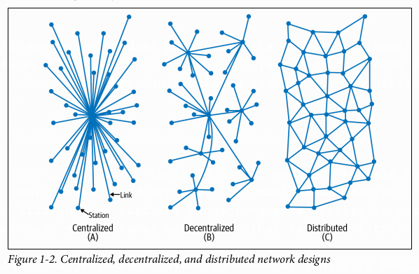
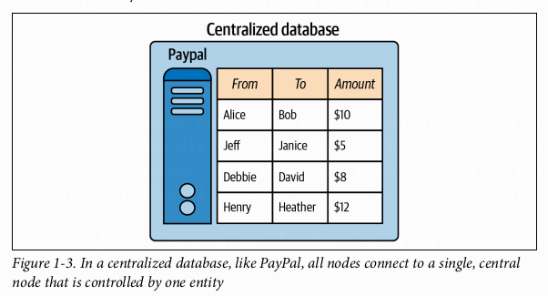
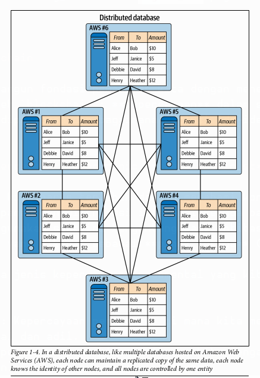
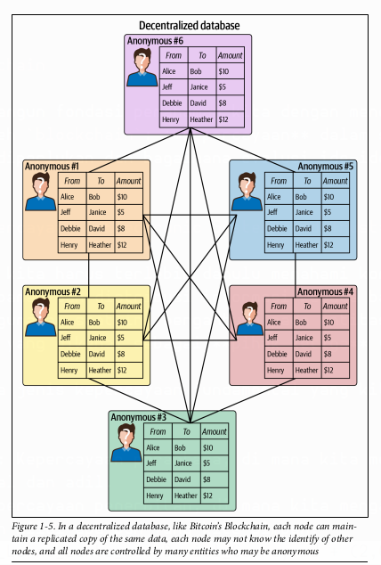
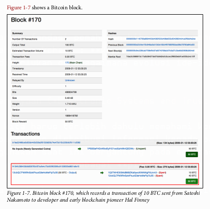
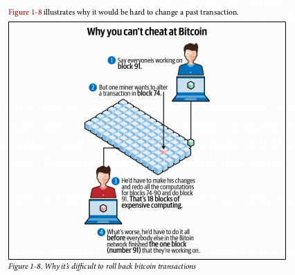
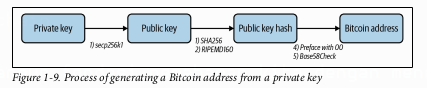

# Bab 1
## Asal Usul Teknologi Blockchain

Bab ini bertujuan untuk membangun fondasi pemahaman kita dengan menelusuri kembali ke akar permasalahan yang coba dipecahkan oleh `blockchain`: **kepercayaan** dalam sistem elektronik. Bab ini menjelaskan mengapa `blockchain` diperlukan dan bagaimana evolusi ide-ide sebelumnya akhirnya memuncak pada penciptaan `Bitcoin`.

## Sistem Elektronik dan Kepercayaan (*Electronic Systems and Trust*)

Untuk memahami `blockchain`, kita harus terlebih dahulu memahami konteks internet. Internet pada dasarnya adalah tentang penyimpanan dan distribusi informasi kepada banyak orang. Namun, sebagian besar layanan online yang kita gunakan saat ini bergantung pada entitas terpusat yang bertindak sebagai penjaga gerbang tepercaya, yang dikenal sebagai **pihak ketiga** (*third party*).

Buku ini mengidentifikasi dua jenis kepercayaan fundamental yang kita berikan kepada pihak ketiga ini:

1.  ***Intermediary trust***: Kepercayaan perantara, di mana kita mengandalkan pihak ketiga untuk membuat keputusan yang rasional dan adil.
2.  ***Issuance trust***: Kepercayaan penerbitan, di mana kita mengandalkan pihak ketiga untuk menjamin keamanan dan keselamatan nilai apa pun yang kita simpan.

Contoh paling nyata adalah dalam transaksi keuangan Uang fisik (fiat) semakin jarang digunakan, dan kita lebih sering menggunakan alat elektronik seperti kartu debit dan kredit. Meskipun bagi konsumen ini terasa seperti tren baru, sistem akuntansi di baliknya telah lama bersifat elektronik. Ketika nilai beralih dari wujud fisik ke entri dalam sebuah *database*, elemen kepercayaan menjadi sangat penting.

Namun, kepercayaan ini tidak selalu dapat diandalkan. Krisis finansial global tahun 2008 menjadi titik balik, di mana banyak orang mulai meragukan kepercayaan buta mereka pada institusi keuangan.

> `Blockchain` adalah sebuah upaya untuk membangun kembali kepercayaan yang hilang tersebut. `Blockchain` menggunakan teknologi—khususnya kriptografi—untuk mengotomatisasi dan menegakkan kepercayaan, sehingga tidak lagi memerlukan pihak ketiga terpusat.

`Bitcoin` adalah sistem pertama yang berhasil menggunakan `blockchain`. Namun, sebelum `Bitcoin`, ada banyak percobaan yang gagal, salah satunya karena ketidakmampuan untuk menciptakan sistem yang benar-benar terdistribusi di internet.

## *Distributed* vs. *Centralized* vs. *Decentralized*

Istilah-istilah ini sangat fundamental dalam dunia `blockchain` dan sering kali disalahpahami.

  * **Sistem Terdistribusi (*Distributed System*)**: Internet pada awalnya dirancang sebagai teknologi terdistribusi untuk menciptakan resiliensi. Tujuannya adalah jika satu bagian dari sistem diserang atau gagal, bagian lainnya tetap dapat beroperasi. Buku ini menggunakan analogi roda sepeda: banyak jeruji terhubung ke satu poros tengah; jika beberapa jeruji patah, roda masih bisa berfungsi. Dalam komputasi, sistem terdistribusi berarti pemrosesan tidak hanya terjadi di satu komputer, melainkan dibagi ke beberapa sumber daya komputasi yang berkomunikasi satu sama lain.

<p align="center">
  
</p>

    [Roda sepeda dengan desain terdistribusi, menunjukkan banyak jeruji yang terhubung ke satu hub pusat sebagai analogi ketahanan sistem. - Figure 1-1]

  * **Sistem Terpusat (*Centralized System*)**: Meskipun internet dirancang terdistribusi, banyak aplikasi dominan saat ini (seperti Google, Facebook) bersifat terpusat. Dalam model ini, semua titik (stasiun) terhubung ke satu titik pusat (hub). Jika hub ini gagal, seluruh sistem akan lumpuh.

  * **Sistem Terdesentralisasi (*Decentralized System*)**: Ini adalah evolusi dari sistem terdistribusi. Dalam sistem terdesentralisasi, tidak ada satu entitas pun yang memiliki kontrol penuh. Pengambilan keputusan dilakukan melalui **konsensus** (persetujuan bersama) antar partisipan (*node*), yang mungkin tidak saling mengenal atau bahkan bersifat anonim.

Buku ini memberikan ilustrasi visual yang sangat baik untuk membedakan ketiganya dalam konteks *database*:

<p align="center">
  
</p>

[Desain jaringan yang membandingkan model terpusat (semua terhubung ke satu titik), terdesentralisasi (beberapa klaster terhubung), dan terdistribusi (semua terhubung satu sama lain dalam jaring). - Figure 1-2]

  * **Gambar 1-3 (Terpusat)**: Seperti PayPal, semua *node* terhubung ke satu *database* pusat yang dikendalikan oleh satu entitas.

<p align="center">
  
</p>

    [Diagram database terpusat seperti PayPal, di mana satu server pusat mengelola semua data transaksi. - Figure 1-3]

  * **Gambar 1-4 (Terdistribusi)**: Seperti beberapa *database* yang di-*hosting* di Amazon Web Services (AWS), setiap *node* memiliki salinan data yang sama dan saling mengenal, tetapi semuanya masih dikendalikan oleh satu entitas (Amazon).

<p align="center">
  
</p>

    [Diagram database terdistribusi yang dihosting di AWS, menunjukkan beberapa server yang saling terhubung dan mereplikasi data, namun masih di bawah kendali satu entitas. - Figure 1-4]

  * **Gambar 1-5 (Terdesentralisasi)**: Seperti `Blockchain` `Bitcoin`, setiap *node* memiliki salinan data yang sama, *node*-*node* tersebut mungkin tidak saling mengenal (anonim), dan kontrol dipegang oleh banyak entitas.

<p align="center">
  
</p>

    [Diagram database terdesentralisasi seperti Blockchain Bitcoin, di mana banyak node anonim saling terhubung, masing-masing memegang salinan data yang sama tanpa ada kontrol pusat. - Figure 1-5]

## Para Pendahulu `Bitcoin` (*Bitcoin Predecessors*)

Sebelum `Bitcoin` berhasil, ada beberapa upaya untuk menciptakan uang digital dengan tujuan kedaulatan finansial bagi pengguna. Memahami kegagalan mereka membantu kita mengapresiasi keberhasilan `Bitcoin`.

  ***DigiCash (1989)**: Didirikan oleh David Chaum, DigiCash menggunakan teknologi **kriptografi** (ilmu penyandian informasi berbasis matematika) untuk pembayaran digital anonim. Teknologinya, yang disebut *blind signature*, sangat inovatif dan memperkenalkan konsep *digital wallet*. Namun, DigiCash gagal karena adopsi pedagang yang rendah dan keengganan publik untuk menggunakan sistem pembayaran baru di era awal internet.

  * **E-Gold (1996)**: Ini adalah sistem nilai digital yang didukung oleh logam mulia sungguhan. E-Gold memperkenalkan konsep **mikropembayaran** (*micropayments*), yaitu transfer nilai dalam jumlah sangat kecil. Meskipun canggih secara teknologi, sistem ini bersifat terpusat dan tidak memiliki verifikasi identitas, sehingga banyak digunakan untuk pencucian uang dan aktivitas ilegal lainnya. Pemerintah AS akhirnya menutupnya pada tahun 2008.

  * **Hashcash (1997)**: Diciptakan oleh Adam Back, Hashcash memperkenalkan konsep fundamental yaitu ***proof-of-work***. *Proof-of-work* adalah mekanisme di mana komputer harus menghasilkan output yang dapat diverifikasi dan membutuhkan proses komputasi yang intensif agar uang elektronik memiliki nilai. Ini adalah solusi untuk **masalah pengeluaran ganda** (*double spend problem*), di mana sebuah unit digital dapat disalin dan dibelanjakan lebih dari sekali. Hashcash sendiri tidak pernah populer sebagai mata uang digital.

  * **B-Money (1998)**: Diusulkan oleh Wei Dai, B-Money adalah konsep teoretis yang menggabungkan banyak ide: penciptaan uang melalui *proof-of-work*, penyiaran transaksi ke jaringan, dan penggunaan kontrak digital untuk penegakan aturan dalam sistem anonim. Tujuannya adalah menciptakan uang non-pemerintah yang tahan inflasi.

  * **Bit Gold (2005)**: Diusulkan oleh Nick Szabo, Bit Gold bertujuan membawa kelangkaan logam mulia ke dunia digital. Idenya adalah menciptakan aset digital yang "tidak dapat dipalsukan" (*unforgeable*) karena biaya pembuatannya (komputasi) yang tetap, mirip seperti biaya menambang emas. Konsep ini juga menggunakan *proof-of-work* dan pencatatan kepemilikan terdistribusi.

## Eksperimen `Bitcoin` (*The Bitcoin Experiment*)

Krisis finansial tahun 2008 menjadi pemicu utama yang menunjukkan kelemahan sistem keuangan yang kurang transparan. Di tengah krisis inilah, sebuah solusi radikal muncul.

<p align="center">
  
</p>

[Grafik "The Fed and the Bubble" yang menunjukkan hubungan antara suku bunga Federal Reserve AS dan harga perumahan dari 1975-2009, mengilustrasikan siklus bubble dan crash ekonomi. - Figure 1-6]

### *Whitepaper*

Pada 31 Oktober 2008, seseorang atau sekelompok orang dengan nama samaran **Satoshi Nakamoto** menerbitkan sebuah *whitepaper* berjudul *"Bitcoin: A Peer-to-Peer Electronic Cash System"*. Tujuannya adalah menciptakan mata uang digital yang beroperasi tanpa bank atau pemerintah pusat, serta sistem keuangan yang lebih transparan.

*Whitepaper* `Bitcoin` menggabungkan ide-ide dari para pendahulunya:

  * Transaksi digital aman seperti yang diusulkan Nick Szabo.
  * Penggunaan kriptografi seperti DigiCash.
  * Kemampuan mengirim nilai kecil seperti E-Gold.
  * Penciptaan uang di luar sistem pemerintah seperti B-Money.
  * Verifikasi melalui *proof-of-work* seperti Hashcash.

*Whitepaper* ini juga memperkenalkan konsep-konsep kunci:

  * ***Double spending***: Risiko satu unit mata uang dibelanjakan lebih dari sekali.
  * ***Proof-of-work***: Masalah matematis yang harus dipecahkan menggunakan daya komputasi.
  * ***Hashes***: Output dengan panjang tetap yang dihasilkan dari data input untuk mengorganisir data.
  * ***Nonces***: Angka acak yang digunakan sekali untuk memastikan sebuah komunikasi tidak dapat diulang.

### *Timestamp Server* dan *Chain of Blocks*

`Bitcoin` menghilangkan otoritas pusat (seperti bank sentral) dengan cara mengumumkan setiap transaksi secara publik. Untuk menyetujui urutan transaksi, Satoshi mengusulkan penggunaan *timestamp server*. Server ini mengambil *hash* dari sekelompok transaksi dan memberinya cap waktu, kemudian menyiarkannya. *Hash* adalah string angka dan huruf dengan panjang tetap yang dihasilkan oleh algoritma (untuk `Bitcoin`, digunakan **SHA-256**).

Data transaksi ini kemudian diorganisir ke dalam **blok-blok** yang saling terhubung secara kronologis, membentuk sebuah **rantai blok** atau `blockchain`. Setiap blok secara kriptografis terhubung dengan blok sebelumnya, menciptakan sebuah catatan yang sangat sulit untuk diubah. Inilah inti dari `blockchain`: sebuah buku besar (*ledger*) global yang dijaga bersama oleh jaringan *peer-to-peer* tanpa memerlukan satu pihak pun untuk dipercaya.

Setiap blok `Bitcoin` memiliki beberapa atribut penting:

  * ***Block hash***: Pengenal unik untuk blok tersebut.
  * ***Coinbase transaction***: Transaksi pertama di setiap blok baru yang menciptakan `bitcoin` baru sebagai hadiah untuk *miner*.
  * ***Block height number***: Nomor urutan blok dalam rantai.
  * ***Merkle root***: Sebuah *hash* tunggal yang memvalidasi semua transaksi di dalam blok (akan dibahas lebih detail di Bab 2).

<p align="center">
  
</p>

[Tampilan detail dari Bitcoin Block \#170, yang menunjukkan transaksi pertama dari Satoshi Nakamoto ke Hal Finney, beserta metadata seperti hash, timestamp, dan block reward. - Figure 1-7]

Mengubah transaksi di blok yang lama sangatlah sulit karena seorang penyerang harus menghitung ulang *proof-of-work* untuk blok tersebut dan semua blok setelahnya, dan melakukannya lebih cepat dari seluruh jaringan.

<p align="center">
  
</p>

[Ilustrasi mengapa sulit untuk mengubah transaksi masa lalu di Bitcoin. Penyerang harus mengerjakan ulang komputasi untuk banyak blok secara berurutan dan lebih cepat dari seluruh jaringan. - Figure 1-8]

## Menghidupkan `Bitcoin` (*Bringing Bitcoin to Life*)

Sebuah *whitepaper* hanyalah sebuah ide. Untuk mewujudkannya, dibutuhkan upaya dari para pionir awal.

### Komponen Penting

`Bitcoin` menarik bagi para pengembang karena tiga komponen utamanya:

1.  **Nilai (*Value*)**: Memiliki unit akun bernama `bitcoin` (BTC) yang digunakan untuk mencatat transaksi.
2.  **Distribusi (*Distribution*)**: Menggunakan jaringan *node* terdesentralisasi untuk memelihara catatan transaksi.
3.  **Konsensus (*Consensus*)**: Para *miner* menggunakan *proof-of-work* untuk menjaga keamanan dan stabilitas catatan transaksi ini.

### Mencapai Konsensus (*Achieving Consensus*)

Pada 3 Januari 2009, Satoshi Nakamoto menambang blok pertama, yang dikenal sebagai **Blok Genesis** (*Genesis block*). Di dalam *coinbase transaction*-nya, terdapat pesan yang merujuk pada krisis finansial:

> "The Times 03/Jan/2009 Chancellor on brink of second bailout for banks"

Dalam jaringan terdesentralisasi seperti `Bitcoin`, mencapai konsensus adalah proses di mana para *miner* setuju tentang dua hal:

1.  ***Block discovery***: Siapa yang berhak menambahkan blok transaksi baru ke `blockchain`.
2.  ***Validation of transactions***: Bahwa semua transaksi di dalam blok baru tersebut adalah sah.

Validitas transaksi di `Bitcoin` dibuktikan menggunakan **kriptografi kunci publik/privat** (*public/private key cryptography*).

  * ***Private key*** (kunci privat) digunakan untuk menandatangani (*sign*) transaksi secara digital, membuktikan kepemilikan dan memberikan otorisasi. Ini harus dirahasiakan.
  * ***Public key*** (kunci publik) digunakan untuk menghasilkan alamat `Bitcoin` yang bisa dibagikan kepada siapa saja untuk menerima dana.

<p align="center">
  
</p>

[Diagram alir yang menunjukkan proses pembuatan alamat Bitcoin dari sebuah private key melalui serangkaian fungsi kriptografi seperti secp256k1, SHA256, dan RIPEMD160. - Figure 1-9]

### Kerentanan Awal (*An Early Vulnerability*)

Pada Agustus 2010, sebuah celah keamanan besar ditemukan yang memungkinkan seseorang mencoba menciptakan 92 miliar `bitcoin` dari udara tipis.

```
CBlock(hash=0000000000790ab3, ver=1, hashPrevBlock=0000000000606865, hashMerkleroot=618eba, nTime=1281891957, nBits=1c00800e, nNonce=28192719, vtx=2)
 CTransaction(hash=012cd8, ver=1, vin.size=1, vout.size=1, nLockTime=0)
  CTxIn(COutPoint(000000, -1), coinbase 040e80001c028f00)
  CTxOut(nValue=50.51000000, scriptPubKey=0x4F4BA55D1580F8C3A8A2C7)
 CTransaction(hash=1d5e51, ver=1, vin.size=1, vout.size=2, nLockTime=0)
  CTxIn(COutPoint(237fe8, 0), scriptSig=0xA87C02384E1F184B79C6AC)
  CTxOut(nValue=92233720368.54275808, scriptPubKey=OP_DUP OP_HASH160 0xB7A7)
  CTxOut(nValue=92233720368.54275808, scriptPubKey=OP_DUP OP_HASH160 0x1512)
 vMerkleTree: 012cd8 1d5e51 618eba
```

Kerentanan ini segera diperbaiki, dan `blockchain` di-*fork* (dicabangkan) untuk membatalkan transaksi tidak sah tersebut. Hingga hari ini, ini tetap menjadi satu-satunya celah keamanan signifikan dalam sejarah `Bitcoin`, yang menunjukkan ketahanan komunitasnya.

### Adopsi (*Adoption*)

Hilangnya Satoshi Nakamoto dari komunitas sekitar tahun 2012 sering dianggap membantu `Bitcoin` menjadi entitas yang sepenuhnya terdesentralisasi, tanpa seorang pemimpin sentral. Sekitar waktu ini, adopsi `Bitcoin` mulai tumbuh:

  * **Gavin Andresen** menciptakan "Bitcoin faucet" yang memberikan BTC gratis untuk mendorong adopsi.
  * Pada 22 Mei 2010, programmer **Laszlo Hanyecz** melakukan transaksi komersial pertama menggunakan `Bitcoin` dengan membeli dua pizza seharga 10.000 BTC. Hari ini dikenal sebagai *Bitcoin Pizza Day*.
  * Pada Juli 2010, **Mt. Gox** menjadi bursa (*exchange*) yang memungkinkan pertukaran `bitcoin` dengan mata uang tradisional, yang memicu spekulasi dan apresiasi harga.

## Rangkuman Bab 1

Bab ini menegaskan bahwa `Bitcoin` secara fundamental penting bagi lahirnya teknologi `blockchain`. Namun, ia tidak muncul dari ruang hampa. `Bitcoin` adalah puncak dari evolusi ide dan teknologi selama puluhan tahun yang dibangun oleh banyak pengembang perangkat lunak. Sifatnya yang *open source* dan komunitas yang tumbuh di sekitarnya sangat mendukung adopsi awalnya. Aspek-aspek fundamental dari *cryptocurrency* yang akan kita jelajahi di bab-bab berikutnya berasal dari fondasi yang diletakkan oleh `Bitcoin`.

-----
