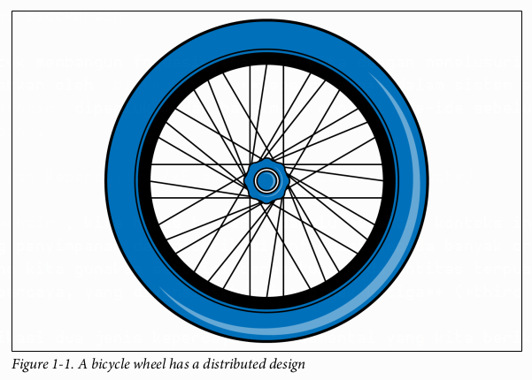
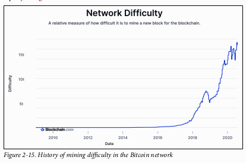
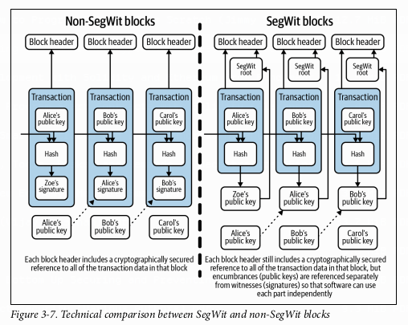

# Bab 1
## Asal Usul Teknologi Blockchain

Bab ini bertujuan untuk membangun fondasi pemahaman kita dengan menelusuri kembali ke akar permasalahan yang coba dipecahkan oleh `blockchain`: **kepercayaan** dalam sistem elektronik. Bab ini menjelaskan mengapa `blockchain` diperlukan dan bagaimana evolusi ide-ide sebelumnya akhirnya memuncak pada penciptaan `Bitcoin`.

## Sistem Elektronik dan Kepercayaan (*Electronic Systems and Trust*)

Untuk memahami `blockchain`, kita harus terlebih dahulu memahami konteks internet. Internet pada dasarnya adalah tentang penyimpanan dan distribusi informasi kepada banyak orang. Namun, sebagian besar layanan online yang kita gunakan saat ini bergantung pada entitas terpusat yang bertindak sebagai penjaga gerbang tepercaya, yang dikenal sebagai **pihak ketiga** (*third party*).

Buku ini mengidentifikasi dua jenis kepercayaan fundamental yang kita berikan kepada pihak ketiga ini:

1.  ***Intermediary trust***: Kepercayaan perantara, di mana kita mengandalkan pihak ketiga untuk membuat keputusan yang rasional dan adil.
2.  ***Issuance trust***: Kepercayaan penerbitan, di mana kita mengandalkan pihak ketiga untuk menjamin keamanan dan keselamatan nilai apa pun yang kita simpan.

Contoh paling nyata adalah dalam transaksi keuangan Uang fisik (fiat) semakin jarang digunakan, dan kita lebih sering menggunakan alat elektronik seperti kartu debit dan kredit. Meskipun bagi konsumen ini terasa seperti tren baru, sistem akuntansi di baliknya telah lama bersifat elektronik. Ketika nilai beralih dari wujud fisik ke entri dalam sebuah *database*, elemen kepercayaan menjadi sangat penting.

Namun, kepercayaan ini tidak selalu dapat diandalkan. Krisis finansial global tahun 2008 menjadi titik balik, di mana banyak orang mulai meragukan kepercayaan buta mereka pada institusi keuangan.

> `Blockchain` adalah sebuah upaya untuk membangun kembali kepercayaan yang hilang tersebut. `Blockchain` menggunakan teknologi—khususnya kriptografi—untuk mengotomatisasi dan menegakkan kepercayaan, sehingga tidak lagi memerlukan pihak ketiga terpusat.

`Bitcoin` adalah sistem pertama yang berhasil menggunakan `blockchain`. Namun, sebelum `Bitcoin`, ada banyak percobaan yang gagal, salah satunya karena ketidakmampuan untuk menciptakan sistem yang benar-benar terdistribusi di internet.

## *Distributed* vs. *Centralized* vs. *Decentralized*

Istilah-istilah ini sangat fundamental dalam dunia `blockchain` dan sering kali disalahpahami.

  * **Sistem Terdistribusi (*Distributed System*)**: Internet pada awalnya dirancang sebagai teknologi terdistribusi untuk menciptakan resiliensi. Tujuannya adalah jika satu bagian dari sistem diserang atau gagal, bagian lainnya tetap dapat beroperasi. Buku ini menggunakan analogi roda sepeda: banyak jeruji terhubung ke satu poros tengah; jika beberapa jeruji patah, roda masih bisa berfungsi. Dalam komputasi, sistem terdistribusi berarti pemrosesan tidak hanya terjadi di satu komputer, melainkan dibagi ke beberapa sumber daya komputasi yang berkomunikasi satu sama lain.

<p align="center">
  
</p>

[Roda sepeda dengan desain terdistribusi, menunjukkan banyak jeruji yang terhubung ke satu hub pusat sebagai analogi ketahanan sistem. - Figure 1-1]

  * **Sistem Terpusat (*Centralized System*)**: Meskipun internet dirancang terdistribusi, banyak aplikasi dominan saat ini (seperti Google, Facebook) bersifat terpusat. Dalam model ini, semua titik (stasiun) terhubung ke satu titik pusat (hub). Jika hub ini gagal, seluruh sistem akan lumpuh.

  * **Sistem Terdesentralisasi (*Decentralized System*)**: Ini adalah evolusi dari sistem terdistribusi. Dalam sistem terdesentralisasi, tidak ada satu entitas pun yang memiliki kontrol penuh. Pengambilan keputusan dilakukan melalui **konsensus** (persetujuan bersama) antar partisipan (*node*), yang mungkin tidak saling mengenal atau bahkan bersifat anonim.

Buku ini memberikan ilustrasi visual yang sangat baik untuk membedakan ketiganya dalam konteks *database*:

<p align="center">
  
</p>

[Desain jaringan yang membandingkan model terpusat (semua terhubung ke satu titik), terdesentralisasi (beberapa klaster terhubung), dan terdistribusi (semua terhubung satu sama lain dalam jaring). - Figure 1-2]

  * **Gambar 1-3 (Terpusat)**: Seperti PayPal, semua *node* terhubung ke satu *database* pusat yang dikendalikan oleh satu entitas.

<p align="center">
  
</p>

[Diagram database terpusat seperti PayPal, di mana satu server pusat mengelola semua data transaksi. - Figure 1-3]

  * **Gambar 1-4 (Terdistribusi)**: Seperti beberapa *database* yang di-*hosting* di Amazon Web Services (AWS), setiap *node* memiliki salinan data yang sama dan saling mengenal, tetapi semuanya masih dikendalikan oleh satu entitas (Amazon).

<p align="center">
  
</p>

[Diagram database terdistribusi yang dihosting di AWS, menunjukkan beberapa server yang saling terhubung dan mereplikasi data, namun masih di bawah kendali satu entitas. - Figure 1-4]

  * **Gambar 1-5 (Terdesentralisasi)**: Seperti `Blockchain` `Bitcoin`, setiap *node* memiliki salinan data yang sama, *node*-*node* tersebut mungkin tidak saling mengenal (anonim), dan kontrol dipegang oleh banyak entitas.

<p align="center">
  
</p>

[Diagram database terdesentralisasi seperti Blockchain Bitcoin, di mana banyak node anonim saling terhubung, masing-masing memegang salinan data yang sama tanpa ada kontrol pusat. - Figure 1-5]

## Para Pendahulu `Bitcoin` (*Bitcoin Predecessors*)

Sebelum `Bitcoin` berhasil, ada beberapa upaya untuk menciptakan uang digital dengan tujuan kedaulatan finansial bagi pengguna. Memahami kegagalan mereka membantu kita mengapresiasi keberhasilan `Bitcoin`.

  ***DigiCash (1989)**: Didirikan oleh David Chaum, DigiCash menggunakan teknologi **kriptografi** (ilmu penyandian informasi berbasis matematika) untuk pembayaran digital anonim. Teknologinya, yang disebut *blind signature*, sangat inovatif dan memperkenalkan konsep *digital wallet*. Namun, DigiCash gagal karena adopsi pedagang yang rendah dan keengganan publik untuk menggunakan sistem pembayaran baru di era awal internet.

  * **E-Gold (1996)**: Ini adalah sistem nilai digital yang didukung oleh logam mulia sungguhan. E-Gold memperkenalkan konsep **mikropembayaran** (*micropayments*), yaitu transfer nilai dalam jumlah sangat kecil. Meskipun canggih secara teknologi, sistem ini bersifat terpusat dan tidak memiliki verifikasi identitas, sehingga banyak digunakan untuk pencucian uang dan aktivitas ilegal lainnya. Pemerintah AS akhirnya menutupnya pada tahun 2008.

  * **Hashcash (1997)**: Diciptakan oleh Adam Back, Hashcash memperkenalkan konsep fundamental yaitu ***proof-of-work***. *Proof-of-work* adalah mekanisme di mana komputer harus menghasilkan output yang dapat diverifikasi dan membutuhkan proses komputasi yang intensif agar uang elektronik memiliki nilai. Ini adalah solusi untuk **masalah pengeluaran ganda** (*double spend problem*), di mana sebuah unit digital dapat disalin dan dibelanjakan lebih dari sekali. Hashcash sendiri tidak pernah populer sebagai mata uang digital.

  * **B-Money (1998)**: Diusulkan oleh Wei Dai, B-Money adalah konsep teoretis yang menggabungkan banyak ide: penciptaan uang melalui *proof-of-work*, penyiaran transaksi ke jaringan, dan penggunaan kontrak digital untuk penegakan aturan dalam sistem anonim. Tujuannya adalah menciptakan uang non-pemerintah yang tahan inflasi.

  * **Bit Gold (2005)**: Diusulkan oleh Nick Szabo, Bit Gold bertujuan membawa kelangkaan logam mulia ke dunia digital. Idenya adalah menciptakan aset digital yang "tidak dapat dipalsukan" (*unforgeable*) karena biaya pembuatannya (komputasi) yang tetap, mirip seperti biaya menambang emas. Konsep ini juga menggunakan *proof-of-work* dan pencatatan kepemilikan terdistribusi.

## Eksperimen `Bitcoin` (*The Bitcoin Experiment*)

Krisis finansial tahun 2008 menjadi pemicu utama yang menunjukkan kelemahan sistem keuangan yang kurang transparan. Di tengah krisis inilah, sebuah solusi radikal muncul.

<p align="center">
  
</p>

[Grafik "The Fed and the Bubble" yang menunjukkan hubungan antara suku bunga Federal Reserve AS dan harga perumahan dari 1975-2009, mengilustrasikan siklus bubble dan crash ekonomi. - Figure 1-6]

### *Whitepaper*

Pada 31 Oktober 2008, seseorang atau sekelompok orang dengan nama samaran **Satoshi Nakamoto** menerbitkan sebuah *whitepaper* berjudul *"Bitcoin: A Peer-to-Peer Electronic Cash System"*. Tujuannya adalah menciptakan mata uang digital yang beroperasi tanpa bank atau pemerintah pusat, serta sistem keuangan yang lebih transparan.

*Whitepaper* `Bitcoin` menggabungkan ide-ide dari para pendahulunya:

  * Transaksi digital aman seperti yang diusulkan Nick Szabo.
  * Penggunaan kriptografi seperti DigiCash.
  * Kemampuan mengirim nilai kecil seperti E-Gold.
  * Penciptaan uang di luar sistem pemerintah seperti B-Money.
  * Verifikasi melalui *proof-of-work* seperti Hashcash.

*Whitepaper* ini juga memperkenalkan konsep-konsep kunci:

  * ***Double spending***: Risiko satu unit mata uang dibelanjakan lebih dari sekali.
  * ***Proof-of-work***: Masalah matematis yang harus dipecahkan menggunakan daya komputasi.
  * ***Hashes***: Output dengan panjang tetap yang dihasilkan dari data input untuk mengorganisir data.
  * ***Nonces***: Angka acak yang digunakan sekali untuk memastikan sebuah komunikasi tidak dapat diulang.

### *Timestamp Server* dan *Chain of Blocks*

`Bitcoin` menghilangkan otoritas pusat (seperti bank sentral) dengan cara mengumumkan setiap transaksi secara publik. Untuk menyetujui urutan transaksi, Satoshi mengusulkan penggunaan *timestamp server*. Server ini mengambil *hash* dari sekelompok transaksi dan memberinya cap waktu, kemudian menyiarkannya. *Hash* adalah string angka dan huruf dengan panjang tetap yang dihasilkan oleh algoritma (untuk `Bitcoin`, digunakan **SHA-256**).

Data transaksi ini kemudian diorganisir ke dalam **blok-blok** yang saling terhubung secara kronologis, membentuk sebuah **rantai blok** atau `blockchain`. Setiap blok secara kriptografis terhubung dengan blok sebelumnya, menciptakan sebuah catatan yang sangat sulit untuk diubah. Inilah inti dari `blockchain`: sebuah buku besar (*ledger*) global yang dijaga bersama oleh jaringan *peer-to-peer* tanpa memerlukan satu pihak pun untuk dipercaya.

Setiap blok `Bitcoin` memiliki beberapa atribut penting:

  * ***Block hash***: Pengenal unik untuk blok tersebut.
  * ***Coinbase transaction***: Transaksi pertama di setiap blok baru yang menciptakan `bitcoin` baru sebagai hadiah untuk *miner*.
  * ***Block height number***: Nomor urutan blok dalam rantai.
  * ***Merkle root***: Sebuah *hash* tunggal yang memvalidasi semua transaksi di dalam blok (akan dibahas lebih detail di Bab 2).

<p align="center">
  
</p>

[Tampilan detail dari Bitcoin Block \#170, yang menunjukkan transaksi pertama dari Satoshi Nakamoto ke Hal Finney, beserta metadata seperti hash, timestamp, dan block reward. - Figure 1-7]

Mengubah transaksi di blok yang lama sangatlah sulit karena seorang penyerang harus menghitung ulang *proof-of-work* untuk blok tersebut dan semua blok setelahnya, dan melakukannya lebih cepat dari seluruh jaringan.

<p align="center">
  
</p>

[Ilustrasi mengapa sulit untuk mengubah transaksi masa lalu di Bitcoin. Penyerang harus mengerjakan ulang komputasi untuk banyak blok secara berurutan dan lebih cepat dari seluruh jaringan. - Figure 1-8]

## Menghidupkan `Bitcoin` (*Bringing Bitcoin to Life*)

Sebuah *whitepaper* hanyalah sebuah ide. Untuk mewujudkannya, dibutuhkan upaya dari para pionir awal.

### Komponen Penting

`Bitcoin` menarik bagi para pengembang karena tiga komponen utamanya:

1.  **Nilai (*Value*)**: Memiliki unit akun bernama `bitcoin` (BTC) yang digunakan untuk mencatat transaksi.
2.  **Distribusi (*Distribution*)**: Menggunakan jaringan *node* terdesentralisasi untuk memelihara catatan transaksi.
3.  **Konsensus (*Consensus*)**: Para *miner* menggunakan *proof-of-work* untuk menjaga keamanan dan stabilitas catatan transaksi ini.

### Mencapai Konsensus (*Achieving Consensus*)

Pada 3 Januari 2009, Satoshi Nakamoto menambang blok pertama, yang dikenal sebagai **Blok Genesis** (*Genesis block*). Di dalam *coinbase transaction*-nya, terdapat pesan yang merujuk pada krisis finansial:

> "The Times 03/Jan/2009 Chancellor on brink of second bailout for banks"

Dalam jaringan terdesentralisasi seperti `Bitcoin`, mencapai konsensus adalah proses di mana para *miner* setuju tentang dua hal:

1.  ***Block discovery***: Siapa yang berhak menambahkan blok transaksi baru ke `blockchain`.
2.  ***Validation of transactions***: Bahwa semua transaksi di dalam blok baru tersebut adalah sah.

Validitas transaksi di `Bitcoin` dibuktikan menggunakan **kriptografi kunci publik/privat** (*public/private key cryptography*).

  * ***Private key*** (kunci privat) digunakan untuk menandatangani (*sign*) transaksi secara digital, membuktikan kepemilikan dan memberikan otorisasi. Ini harus dirahasiakan.
  * ***Public key*** (kunci publik) digunakan untuk menghasilkan alamat `Bitcoin` yang bisa dibagikan kepada siapa saja untuk menerima dana.

<p align="center">
  
</p>

[Diagram alir yang menunjukkan proses pembuatan alamat Bitcoin dari sebuah private key melalui serangkaian fungsi kriptografi seperti secp256k1, SHA256, dan RIPEMD160. - Figure 1-9]

### Kerentanan Awal (*An Early Vulnerability*)

Pada Agustus 2010, sebuah celah keamanan besar ditemukan yang memungkinkan seseorang mencoba menciptakan 92 miliar `bitcoin` dari udara tipis.

```
CBlock(hash=0000000000790ab3, ver=1, hashPrevBlock=0000000000606865, hashMerkleroot=618eba, nTime=1281891957, nBits=1c00800e, nNonce=28192719, vtx=2)
 CTransaction(hash=012cd8, ver=1, vin.size=1, vout.size=1, nLockTime=0)
  CTxIn(COutPoint(000000, -1), coinbase 040e80001c028f00)
  CTxOut(nValue=50.51000000, scriptPubKey=0x4F4BA55D1580F8C3A8A2C7)
 CTransaction(hash=1d5e51, ver=1, vin.size=1, vout.size=2, nLockTime=0)
  CTxIn(COutPoint(237fe8, 0), scriptSig=0xA87C02384E1F184B79C6AC)
  CTxOut(nValue=92233720368.54275808, scriptPubKey=OP_DUP OP_HASH160 0xB7A7)
  CTxOut(nValue=92233720368.54275808, scriptPubKey=OP_DUP OP_HASH160 0x1512)
 vMerkleTree: 012cd8 1d5e51 618eba
```

Kerentanan ini segera diperbaiki, dan `blockchain` di-*fork* (dicabangkan) untuk membatalkan transaksi tidak sah tersebut. Hingga hari ini, ini tetap menjadi satu-satunya celah keamanan signifikan dalam sejarah `Bitcoin`, yang menunjukkan ketahanan komunitasnya.

### Adopsi (*Adoption*)

Hilangnya Satoshi Nakamoto dari komunitas sekitar tahun 2012 sering dianggap membantu `Bitcoin` menjadi entitas yang sepenuhnya terdesentralisasi, tanpa seorang pemimpin sentral. Sekitar waktu ini, adopsi `Bitcoin` mulai tumbuh:

  * **Gavin Andresen** menciptakan "Bitcoin faucet" yang memberikan BTC gratis untuk mendorong adopsi.
  * Pada 22 Mei 2010, programmer **Laszlo Hanyecz** melakukan transaksi komersial pertama menggunakan `Bitcoin` dengan membeli dua pizza seharga 10.000 BTC. Hari ini dikenal sebagai *Bitcoin Pizza Day*.
  * Pada Juli 2010, **Mt. Gox** menjadi bursa (*exchange*) yang memungkinkan pertukaran `bitcoin` dengan mata uang tradisional, yang memicu spekulasi dan apresiasi harga.

## Rangkuman Bab 1

Bab ini menegaskan bahwa `Bitcoin` secara fundamental penting bagi lahirnya teknologi `blockchain`. Namun, ia tidak muncul dari ruang hampa. `Bitcoin` adalah puncak dari evolusi ide dan teknologi selama puluhan tahun yang dibangun oleh banyak pengembang perangkat lunak. Sifatnya yang *open source* dan komunitas yang tumbuh di sekitarnya sangat mendukung adopsi awalnya. Aspek-aspek fundamental dari *cryptocurrency* yang akan kita jelajahi di bab-bab berikutnya berasal dari fondasi yang diletakkan oleh `Bitcoin`.

-----

# Bab 2
## Fundamental Cryptocurrency

Bab ini menguraikan terminologi dan proses dasar yang membuat *cryptocurrency* berfungsi. Meskipun contoh utamanya adalah `bitcoin`, konsep-konsep ini berlaku untuk sebagian besar *cryptocurrency* lainnya. Bab ini akan menjadi landasan teknis Kita untuk memahami sisa buku ini.

## *Public and Private Keys* dalam Sistem *Cryptocurrency*

Kriptografi modern, khususnya **kriptografi kunci publik** (*public key cryptography*) atau kriptografi asimetris, adalah inti dari keamanan `blockchain`. Sistem ini memungkinkan siapa saja untuk mengenkripsi pesan menggunakan *public key* penerima, tetapi hanya penerima yang memiliki *private key* yang sesuai yang dapat mendekripsi pesan tersebut.

Dalam `Bitcoin`, sistem ini digunakan untuk mengelola kepemilikan dana:

* ***Private Key*** (Kunci Privat): Ini adalah sebuah angka 256-bit yang dipilih secara acak. *Private key* harus dijaga kerahasiaannya dan berfungsi seperti kata sandi untuk "membuka" dana Kita. *Private key* digunakan untuk menandatangani (*sign*) `transaction` secara digital, yang membuktikan kepada jaringan bahwa Kita adalah pemilik sah dari alamat tersebut dan memberikan otorisasi untuk mengirim dana.

* ***Public Key*** (Kunci Publik): Dihasilkan dari *private key* melalui algoritma kriptografi. *Public key* ini kemudian digunakan untuk menghasilkan alamat `Bitcoin`.

* **Alamat `Bitcoin` (*Bitcoin Address*)**: Ini adalah representasi terkompresi dari *public key* Kita, sehingga lebih mudah dibaca dan dibagikan. Kita dapat membagikan alamat ini kepada siapa pun untuk menerima `bitcoin`, mirip seperti membagikan alamat email.

Buku ini memberikan contoh bagaimana ketiganya terlihat:
* **Private Key**: `Kyc9JCPPKNPrMUopkCc7ng9PU5Bp9SGsjVkh8Hpfx4tCr5LGXgBf` 
* **Public Key**: `033b368bfccf5921f8a5a42b81b0f5ecdc66583fac8dc13bcf860cf31290964c6`
* **Bitcoin Address**: `19PacjCFSSt9guX4zZ3GPpXpDrvDNQ7DC4`

Proses untuk menghasilkan sebuah alamat `Bitcoin` dari *private key* adalah proses satu arah yang melibatkan beberapa fungsi kriptografi, seperti yang diilustrasikan dalam buku:

<p align="center">
  
</p>

[Diagram alir yang menunjukkan proses transformasi dari Private Key menjadi Public Key (menggunakan secp256k1), lalu menjadi Public Key Hash (menggunakan SHA256 dan RIPEMD160), dan akhirnya menjadi Bitcoin Address (dengan penambahan prefix dan fungsi Base58Check). - Figure 2-1]

1.  *Private key* dimasukkan ke dalam fungsi **ECDSA secp256k1** untuk menghasilkan *public key*.
2.  *Public key* kemudian di-*hash* dua kali menggunakan **SHA256** dan **RIPEMD160** untuk menghasilkan *public key hash*.
3.  Akhirnya, *prefix* `00` ditambahkan dan hasilnya dimasukkan ke fungsi **Base58Check** untuk menghasilkan alamat `Bitcoin` yang kita lihat.

## Model UTXO (*The UTXO Model*)

`Bitcoin` menggunakan model akuntansi unik yang disebut ***unspent transaction output*** **(UTXO)**. Bayangkan UTXO seperti uang kembalian dalam bentuk koin atau lembaran uang fisik.

* Setiap `transaction` terdiri dari **input** dan **output**.
* **Input** adalah UTXO dari `transaction` sebelumnya yang belum dibelanjakan, yang bertindak sebagai sumber dana. Setiap input harus ditandatangani secara digital oleh pemilik alamat tersebut.
* **Output** adalah UTXO baru yang dibuat oleh `transaction` tersebut, yang kemudian dapat digunakan sebagai input untuk `transaction` di masa depan.
* Selisih antara jumlah total input dan jumlah total output adalah **biaya `transaction`** (*transaction fee*), yang diberikan kepada *miner*.

<p align="center">
  
</p>

[Contoh visual sebuah transaksi Bitcoin yang menunjukkan beberapa input dari alamat berbeda yang digabungkan untuk menciptakan beberapa output ke alamat tujuan, dengan selisihnya menjadi biaya transaksi. - Figure 2-2]

Model ini berbeda dengan model "saldo akun" (*account balance*) yang digunakan oleh bank atau `Ethereum`. Dalam model UTXO, *wallet* Kita secara teknis tidak menyimpan saldo, melainkan kumpulan UTXO yang dapat Kita belanjakan.

Tabel 2-1 dalam buku ini merinci anatomi sebuah `transaction` `bitcoin` mentah, yang terdiri dari beberapa *field* seperti:
* **Version no.**: Versi protokol.
* **Flag**: Menandakan jika `transaction` menggunakan Segregated Witness (SegWit).
* **In-counter & List of input data**: Jumlah dan daftar input (UTXO yang digunakan).
* **Out-counter & List of output data**: Jumlah dan daftar output (UTXO baru yang dibuat).
* **Witnesses**: Informasi tanda tangan jika menggunakan SegWit.
* **Lock time**: Waktu paling awal `transaction` dapat ditambahkan ke `blockchain`.

## *Transactions*

*Transactions* adalah representasi pergerakan nilai dari satu alamat ke alamat lain. Sebuah `transaction` yang telah dipublikasikan di `blockchain` disebut **terkonfirmasi** (*confirmed*).

Proses `transaction` `bitcoin` diilustrasikan dalam Gambar 2-4:

<p align="center">
  
</p>

[Diagram alur yang menggambarkan siklus hidup sebuah transaksi Bitcoin, mulai dari pembuatan kunci, pembuatan transaksi, propagasi ke jaringan, pengumpulan oleh miner, penambangan ke dalam blok, pembagian blok baru, hingga node lain menambahkannya ke blockchain mereka. - Figure 2-4]

1.  **Generate Keys**: Pengguna membuat pasangan *public* dan *private key*.
2.  **Create Transaction**: Pengguna membuat `transaction` yang ditandatangani dengan *private key* mereka.
3.  **Insert to Node**: `Transaction` dimasukkan ke sebuah *node* di jaringan.
4.  **Propagate**: `Transaction` disebarkan ke seluruh jaringan.
5.  **Collect**: Para *miner* mengumpulkan `transaction` yang tertunda ke dalam sebuah blok.
6.  **Mine**: *Miner* yang berhasil memecahkan teka-teki kriptografi menambahkan blok tersebut ke `blockchain`.
7.  **Share**: Blok yang baru ditambang dibagikan ke *node* lain.
8.  **Add**: *Node* lain memverifikasi dan menambahkan blok baru tersebut ke salinan `blockchain` mereka.
9.  **Restart**: Proses *mining* dimulai lagi untuk blok berikutnya.

Pengguna harus membayar biaya `transaction` kepada *miner* untuk memberi insentif agar `transaction` mereka dimasukkan ke dalam blok. Biaya ini bervariasi tergantung pada kepadatan jaringan; semakin tinggi biaya yang Kita tawarkan, semakin cepat `transaction` Kita dikonfirmasi.

<p align="center">
  
</p>

[Contoh estimasi biaya transaksi Bitcoin yang menunjukkan bahwa biaya yang lebih tinggi dapat mempercepat konfirmasi transaksi dalam blok berikutnya (10 menit), sementara biaya yang lebih rendah mungkin memerlukan waktu lebih lama (30 menit atau 1 jam). - Figure 2-3]

### *The Merkle Root*

Setiap blok `Bitcoin` berisi ribuan `transaction`. Untuk memverifikasi integritas semua `transaction` ini secara efisien tanpa harus membandingkannya satu per satu, `Bitcoin` menggunakan struktur data yang disebut ***Merkle Tree***.

* Setiap `transaction` di-*hash* secara individual.
* Kemudian, pasangan *hash* ini digabungkan dan di-*hash* lagi.
* Proses ini berlanjut ke atas "pohon" hingga hanya tersisa satu *hash* tunggal. *Hash* tunggal inilah yang disebut ***Merkle Root**.

<p align="center">
  
</p>

[Diagram struktur Merkle Tree, menunjukkan bagaimana hash dari setiap transaksi (Tx A, Tx B, Tx C, Tx D) digabungkan dan di-hash secara berpasangan (HAB, HCD) hingga mencapai satu hash tunggal di puncak yang disebut Merkle Root. - Figure 2-5]

*Merkle root* adalah sidik jari kriptografis dari semua `transaction` di dalam blok. Jika satu bit data di salah satu `transaction` diubah, *Merkle root* akan berubah total. Ini memungkinkan verifikasi yang sangat efisien dan aman.

<p align="center">
  
</p>

[Tampilan ringkasan dari Block #125552 yang menyoroti nilai Merkle Root sebagai salah satu metadata penting blok. - Figure 2-6]

<p align="center">
  
</p>

[Diagram alir Merkle Tree untuk Block #125552, yang secara visual menunjukkan bagaimana hash dari empat transaksi di blok tersebut dihitung hingga menghasilkan Merkle Root yang spesifik. - Figure 2-7, 917]

### *Signing and Validating Transactions*

Setiap input `transaction` harus berisi tanda tangan digital (*digital signature*) yang membuktikan otorisasi dari pemilik alamat.

* **Penandatanganan (*Signing*)**: Tanda tangan dihasilkan menggunakan algoritma **ECDSA** (*Elliptic Curve Digital Signature Algorithm*). Algoritma ini mengambil *private key* dan data `transaction` sebagai input untuk menghasilkan tanda tangan.

<p align="center">
  
</p>

[Diagram sederhana yang menunjukkan proses enkripsi ECDSA, di mana Private Key dan Data Transaksi menjadi input untuk menghasilkan sebuah Tanda Tangan (Signature). - Figure 2-8]

* **Validasi (*Validating*)**: *Node* di jaringan dapat memverifikasi tanda tangan ini menggunakan *public key* yang sesuai, tanda tangan itu sendiri, dan data `transaction`. Yang penting, proses verifikasi ini **tidak memerlukan *private key***. Ini memungkinkan siapa saja untuk memvalidasi `transaction` tanpa bisa memalsukannya.

<p align="center">
  
</p>

[Diagram sederhana proses verifikasi ECDSA, di mana Tanda Tangan, Public Key, dan Data Transaksi menjadi input untuk menghasilkan output "Ya/Tidak" yang menandakan validitas tanda tangan. - Figure 2-9]

### *The Coinbase Transaction*

`Transaction` pertama di setiap blok adalah `transaction` khusus yang disebut ***coinbase transaction***. Ini adalah cara `bitcoin` baru diciptakan dan dimasukkan ke dalam sirkulasi. `Transaction` ini terdiri dari dua komponen:

1.  ***Block Reward***: Hadiah berupa `bitcoin` baru yang diberikan kepada *miner* yang berhasil menemukan blok tersebut.
2.  ***Transaction Fees***: Jumlah total dari semua biaya `transaction` yang ada di dalam blok tersebut.

<p align="center">
  
</p>

[Contoh coinbase transaction dalam sebuah block explorer, menunjukkan "No Inputs (Newly Generated Coins)" dan output yang dikirim ke alamat miner. - Figure 2-10]

## Keamanan `Transaction` `Bitcoin` (*Bitcoin Transaction Security*)

*Transactions* `Bitcoin` adalah ***push transactions***, artinya pengirim yang menginisiasi pengiriman dana. Ini berbeda dengan ***pull transactions*** (seperti kartu kredit), di mana penerima (pedagang) yang "menarik" dana dari akun pengirim.

Sistem *push* secara inheren lebih aman karena pengirim tidak pernah mengungkapkan detail akun (seperti *private key*) mereka kepada penerima. Satu-satunya cara `transaction` palsu bisa terjadi adalah jika *private key* seseorang dicuri.

Menebak sebuah *private key* secara *brute force* (mencoba setiap kemungkinan kombinasi) dianggap mustahil secara komputasi. Ada $2^{256}$ kemungkinan kombinasi, sebuah angka yang sangat besar sehingga bahkan dengan seluruh kekuatan komputasi jaringan `Bitcoin` saat ini, akan memakan waktu triliunan tahun untuk mencobanya semua.

## *Hashes*

Fungsi *hash* kriptografis adalah fondasi dari banyak aspek `blockchain`. Fungsi ini mengubah data input apa pun menjadi string output dengan panjang tetap. *Hashes* memiliki beberapa properti penting:
* **Panjang Tetap**: Output selalu memiliki panjang yang sama, tidak peduli seberapa besar inputnya.
* **Satu Arah**: Mudah untuk membuat *hash* dari data, tetapi sangat sulit (hampir mustahil) untuk merekayasa balik data asli dari *hash*-nya.
* **Deterministik**: Input yang sama akan selalu menghasilkan *hash* yang sama.
* **Efek Longsoran (*Avalanche Effect*)**: Perubahan sekecil apa pun pada input akan menghasilkan *hash* yang sama sekali berbeda.
* **Tahan Tabrakan (*Collision Resistant*)**: Sangat tidak mungkin menemukan dua input berbeda yang menghasilkan *hash* yang sama.

`Bitcoin` umumnya menggunakan **SHA-256**, sementara `Ethereum` menggunakan **Keccak-256**.

### *Block Hashes*

***Block hash*** adalah sidik jari kriptografis dari seluruh blok, yang dihasilkan dengan melakukan *hash* ganda (double SHA-256) pada ***block header***. *Block header* berisi metadata penting seperti:
* Versi
* *Hash* dari blok sebelumnya (*hashPrevBlock*)
* *Merkle root* dari semua `transaction` di blok saat ini (*hashMerkleRoot*)
* *Timestamp*
* *Bits* (target kesulitan)
* *Nonce*

<p align="center">
  
</p>

[Diagram yang menunjukkan bagaimana node-node dalam jaringan terdesentralisasi membandingkan block hash mereka. Satu node dengan block hash yang berbeda (berwarna oranye) menandakan adanya ketidaksesuaian data atau korupsi. - Figure 2-11]

Yang paling krusial adalah dimasukkannya *hash* dari blok sebelumnya. Inilah yang secara kriptografis "merantai" setiap blok ke blok sebelumnya, menciptakan `blockchain` yang tidak dapat diubah (*immutable*).

<p align="center">
  
</p>

[Diagram yang mengilustrasikan struktur rantai blok, di mana header dari setiap blok (Block #1, Block #2) berisi hash dari blok sebelumnya (Prev block), sehingga menciptakan hubungan berantai yang tak terputus. - Figure 2-12]

## Kustodi: Siapa yang Memegang Kunci? (*Custody: Who Holds the Keys*)

Kustodi dalam *cryptocurrency* berarti kemampuan untuk memegang, memindahkan, dan melindungi aset. *Wallet* `cryptocurrency` bukanlah dompet fisik; itu adalah antarmuka untuk menyimpan dan mengamankan kunci kriptografis Kita.

Ada dua jenis *wallet* utama:
1.  ***Custodial Wallet***: Dikendalikan oleh pihak ketiga tepercaya, seperti bursa (*exchange*). Bursa menyimpan *private key* untuk Kita. Ini nyaman, tetapi Kita harus percaya pada bursa tersebut. Jika bursa bangkrut atau diretas, dana Kita bisa hilang. Contohnya adalah Coinbase.
2.  ***Noncustodial Wallet***: Kita memegang kendali penuh atas *private key* Kita. Ini memberikan kedaulatan penuh, tetapi juga tanggung jawab penuh. Jika Kita kehilangan kunci Kita, dana Kita akan hilang selamanya. Contohnya adalah Blockchain.com.

Variasi *wallet* lainnya termasuk:
* ***Hot Wallet***: Terhubung ke internet, mudah untuk bertransaksi tetapi lebih rentan.
* ***Cold Wallet***: *Private key* disimpan sepenuhnya offline, sangat aman untuk penyimpanan jangka panjang.
* ***Hardware Wallet***: Perangkat fisik yang menyimpan kunci secara offline, memberikan keamanan *cold storage* bagi individu.
* ***Paper Wallet***: *Private key* dicetak di atas kertas dan disimpan secara fisik.
* ***Desktop Wallet***: Perangkat lunak yang berjalan di komputer.
* ***Mobile Wallet***: Aplikasi di ponsel, bagus untuk transaksi saat bepergian.

## Fundamental Keamanan (*Security Fundamentals*)

Menjaga *private key* Kita tetap privat adalah hal yang paling penting. Buku ini menyoroti beberapa praktik keamanan dasar:
* **Verifikasi Identitas**: Selalu pastikan Kita tahu dengan siapa Kita berinteraksi, terutama saat diminta mengirim *crypto*.
* **Otentikasi Dua Faktor (*Two-Factor Authentication*)**: Gunakan lapisan keamanan kedua selain kata sandi, seperti aplikasi Google Authenticator atau perangkat keras YubiKey. Hindari 2FA berbasis SMS karena rentan terhadap serangan *cell phone porting*.
* **Waspada terhadap Serangan**:
    * ***Cell Phone Porting***: Penyerang mengambil alih nomor telepon Kita untuk mencegat pesan verifikasi.
    * ***Phishing***: Penyerang menyamar sebagai entitas tepercaya untuk menipu Kita agar mengungkapkan informasi sensitif seperti kata sandi.

### *Recovery Seed*

***Recovery seed*** atau *seed phrase* adalah serangkaian kata (biasanya 12-24 kata) yang dapat digunakan untuk memulihkan *private key* Kita jika Kita kehilangan akses ke *wallet* non-kustodial Kita.

> *Recovery seed* ini pada dasarnya **adalah *wallet* Kita**. Siapa pun yang memilikinya dapat mengakses dana Kita. Sangat penting untuk menyimpannya di tempat yang sangat aman dan offline.

<p align="center">
  
</p>

[Foto sebuah perangkat penyimpanan dingin dari logam yang diukir dengan kata-kata recovery seed, menunjukkan metode yang tahan lama untuk menyimpan frase pemulihan secara fisik. - Figure 2-13]

## *Mining*

Pada awalnya, *mining* `bitcoin` adalah hobi yang bisa dilakukan dengan komputer biasa. Namun, seiring kenaikan harga `bitcoin`, *mining* menjadi industri profesional yang sangat kompetitif.

### *Mining* Adalah Tentang Insentif

*Miner* bersaing untuk memecahkan teka-teki komputasi. Pemenangnya mendapatkan hadiah berupa `bitcoin` baru (*block reward*) dan semua biaya `transaction` di dalam blok tersebut. Seiring waktu, hadiah ini menjadi sangat bernilai, mendorong *miner* untuk menggunakan perangkat keras yang lebih kuat, mulai dari **GPU** (*Graphics Processing Units*) hingga **ASIC** (*Application-Specific Integrated Circuits*), yaitu chip yang dirancang khusus untuk *mining*.

<p align="center">
  
</p>

[Grafik "Miners Revenue (USD)" dari tahun 2010 hingga 2020, menunjukkan peningkatan pendapatan miner yang signifikan dan fluktuatif seiring dengan kenaikan harga Bitcoin. - Figure 2-14]

### Generasi Blok (*Block Generation*)

*Mining* ada karena *cryptocurrency* seperti `Bitcoin` menggunakan algoritma konsensus yang disebut ***proof-of-work***. "Pekerjaan" (*work*) ini dibuktikan dengan melakukan komputasi untuk menghasilkan *hash* yang memenuhi kriteria tertentu. Proses inilah yang mengamankan jaringan; sangat mahal secara komputasi untuk mencoba menipu sistem.

Tingkat kesulitan (*difficulty*) untuk menemukan blok baru disesuaikan oleh jaringan `Bitcoin` setiap 2.016 blok (sekitar dua minggu) untuk memastikan bahwa waktu rata-rata pembuatan satu blok tetap sekitar **10 menit**, tidak peduli seberapa banyak daya komputasi (*hash power*) yang ada di jaringan.

<p align="center">
  
</p>

[Grafik "Network Difficulty" dari tahun 2010 hingga 2020, menunjukkan peningkatan eksponensial dalam kesulitan menambang blok Bitcoin seiring waktu. - Figure 2-15]

## Konsensus (*Consensus*)

Konsensus adalah cara para partisipan dalam jaringan `blockchain` mencapai kesepakatan. Dua model paling populer adalah:

### *Proof-of-Work* (PoW)

Seperti yang dijelaskan sebelumnya, PoW mengharuskan *miner* untuk melakukan pekerjaan komputasi. Kecepatan di mana *miner* mencoba berbagai *hash* disebut ***hash rate***. *Hash rate* jaringan `Bitcoin` saat ini sangat besar, menunjukkan tingkat keamanan yang tinggi.

<p align="center">
  
</p>

[Grafik "Total Hash Rate (TH/s)" dari tahun 2010 hingga 2020, menunjukkan pertumbuhan eksponensial daya komputasi yang didedikasikan untuk mengamankan jaringan Bitcoin. - Figure 2-16]

* **Siklus Hidup `Transaction`**: Sebuah `transaction` melewati beberapa tahap: disiarkan (*broadcast*), masuk ke *mempool* (area tunggu untuk `transaction` yang belum dikonfirmasi), dikonfirmasi oleh *miner* (dimasukkan ke dalam blok), dan akhirnya dikonfirmasi oleh jaringan (ketika beberapa blok telah dibangun di atasnya). Sebuah `transaction` umumnya dianggap aman setelah **enam konfirmasi** (enam blok).

<p align="center">
  
</p>

[Ilustrasi konsep konfirmasi, menunjukkan bagaimana empat miner yang berbeda menyetujui blok #100, tetapi ada perbedaan pendapat di blok #101 sebelum akhirnya mayoritas menyetujui satu rantai di blok #102. - Figure 2-20]

### *Proof-of-Stake* (PoS)

PoS adalah alternatif dari PoW yang bertujuan untuk menghilangkan kebutuhan akan *mining* yang boros energi.
* Dalam PoS, peserta yang disebut **validator** "mempertaruhkan" (*stake*) sejumlah *cryptocurrency* mereka sebagai jaminan.
* Jaringan kemudian memilih validator secara acak (seringkali dipengaruhi oleh jumlah *stake*) untuk membuat blok berikutnya.
* Validator mendapatkan hadiah `transaction` sebagai imbalan. Jika mereka mencoba berbuat curang, mereka bisa kehilangan sebagian atau seluruh *stake* mereka.

**Kelebihan PoS**:
* Jauh lebih hemat energi.
* Memberi lebih banyak kontrol kepada mereka yang paling berinvestasi dalam jaringan.

**Kekurangan PoS**:
* Risiko sentralisasi, di mana "yang kaya semakin kaya" karena mereka yang memiliki *stake* terbesar lebih mungkin dipilih.
* Masalah teoretis seperti "Nothing-at-Stake", di mana validator tidak memiliki kerugian jika mendukung beberapa cabang *fork* secara bersamaan (meskipun ini coba diatasi dengan mekanisme *slashing* atau hukuman).

### Konsep Konsensus Lainnya

Ada juga model lain seperti *delegated proof-of-stake*, *proof-of-storage*, dan *proof-of-history* yang terus dieksplorasi.

## Para Pemangku Kepentingan (*Stakeholders*)

Ekosistem *cryptocurrency* lebih dari sekadar *miner* dan pengguna. Ada berbagai bisnis yang menyediakan layanan penting:

* **Broker (*Brokerages*)**: Memfasilitasi pembelian dan penjualan *crypto* untuk pengguna awam, seperti aplikasi Robinhood atau Square's Cash App.
* **Bursa (*Exchanges*)**: Platform perdagangan langsung yang mempertemukan pembeli dan penjual, seperti Coinbase Pro dan Bitstamp.
* **Kustodi (*Custody*)**: Layanan yang berspesialisasi dalam penyimpanan *crypto* jangka panjang yang aman untuk institusi, seperti BitGo.
* **Analitik (*Analytics*)**: Perusahaan yang menyediakan alat untuk melihat dan menganalisis data `blockchain`, seperti *block explorer* (misalnya, Blockchain.com untuk `Bitcoin` dan Etherscan untuk `Ethereum`).

<p align="center">
  
</p>

[Tampilan antarmuka sebuah block explorer yang menunjukkan detail sebuah transaksi Bitcoin, termasuk input, output, biaya, dan status konfirmasi. - Figure 2-21]

* **Informasi (*Information*)**: Media dan sumber berita yang meliput industri, seperti CoinDesk.

## Rangkuman Bab 2

Bab ini telah membekali Kita dengan pemahaman teknis yang mendalam tentang cara kerja *cryptocurrency*. Mulai dari kriptografi kunci publik yang menjadi dasar kepemilikan, model akuntansi UTXO, siklus hidup `transaction`, hingga mekanisme konsensus yang mengamankan jaringan. Pemahaman tentang berbagai jenis *wallet*, kustodi, dan praktik keamanan dasar sangat vital bagi seorang auditor. Terakhir, kita melihat bagaimana ekosistem ini didukung oleh berbagai pemangku kepentingan yang menyediakan infrastruktur pasar. Konsep-konsep ini adalah blok bangunan fundamental yang akan terus kita rujuk saat membahas topik yang lebih maju.

---

# Bab 3
## Forks dan Altchains

Bab ini membahas dinamika evolusi dalam ekosistem *cryptocurrency*. Setelah `Bitcoin` membuktikan konsepnya, para pengembang mulai bereksperimen dengan kodenya, yang mengarah pada penciptaan berbagai *cryptocurrency* alternatif. Bab ini akan mengupas proses perubahan protokol, berbagai jenis `fork`, dan beberapa `altcoin` penting serta solusi untuk masalah skalabilitas `blockchain`.

## *Bitcoin Improvement Proposals* (BIPs)

Mengubah protokol `Bitcoin` tidaklah mudah dan memerlukan proses tata kelola (*governance*) yang formal. Karena `Bitcoin` bersifat *open source*, komunitasnya mengelola pembaruan melalui mekanisme yang disebut ***Bitcoin Improvement Proposals*** **(BIPs)**. Ini adalah proses demokratis di mana siapa pun dapat mengusulkan ide, tetapi keputusan akhir ada di tangan komunitas, terutama para *miner*.

Proses sebuah BIP secara umum adalah sebagai berikut:
1.  Seseorang dari komunitas mengusulkan ide kepada editor BIP.
2.  Jika disetujui, BIP akan dibuat dan masuk ke status *draft*.
3.  Para *miner* kemudian memberikan "sinyal" dukungan mereka. Sebuah BIP akan diterima dan masuk ke status *final* jika mayoritas *hash power* (daya komputasi jaringan) mengadopsinya.
4.  Setelah final, seluruh komunitas diharapkan untuk melakukan *upgrade* ke perangkat lunak baru.

Untuk diterima, sebuah BIP harus memenuhi kriteria ketat, termasuk mendapatkan dukungan **minimal 95%** dari *hash power* jaringan dalam periode 2.016 blok terakhir. Ini memastikan bahwa perubahan yang dilakukan memiliki dukungan konsensus yang sangat kuat.

<p align="center">
  
</p>

[Diagram alur proses Bitcoin Improvement Proposal (BIP), menunjukkan tahapan dari Draft, Proposed, hingga Final/Active, dengan kemungkinan status lain seperti Rejected, Withdrawn, atau Replaced. - Figure 3-1]

## Memahami *Forks*

Ketika sebuah perubahan diusulkan tetapi tidak semua orang setuju, atau ketika pengembang ingin membuat versi baru dari `blockchain` yang ada, sebuah ***fork*** dapat terjadi. `Fork` secara harfiah berarti "percabangan".

Buku ini mendefinisikan beberapa jenis `fork` yang berbeda:
* ***Software Fork***: Istilah umum dalam dunia *open source* di mana seorang pengembang mengambil kode sumber sebuah perangkat lunak dan memodifikasinya untuk membuat program baru. Sebagian besar `altcoin` adalah hasil dari *software fork* kode `Bitcoin`.
* ***Soft Fork***: Sebuah *upgrade* pada perangkat lunak `blockchain` yang **kompatibel dengan versi sebelumnya** (*backward-compatible*). *Miner* yang tidak melakukan *upgrade* masih dapat berpartisipasi dalam jaringan, meskipun mereka mungkin tidak dapat memvalidasi fitur-fitur baru.
* ***Hard Fork***: Sebuah *upgrade* yang **tidak kompatibel dengan versi sebelumnya** (*backward-incompatible*). Semua *node* dan *miner* harus melakukan *upgrade* untuk terus berpartisipasi dalam jaringan. Jika tidak, mereka akan terisolasi di rantai versi lama.
* ***Contentious Hard Fork***: `Hard fork` yang terjadi karena adanya perselisihan fundamental dalam komunitas, di mana sebagian besar partisipan tidak menyetujui perubahan tersebut. Ini mengakibatkan `blockchain` terpecah menjadi **dua rantai terpisah** yang terus berjalan secara independen. Ini adalah jenis `fork` yang paling dramatis.

### *Contentious Hard Forks*

Ketika `contentious hard fork` terjadi, `blockchain` asli terbelah menjadi dua. Kedua rantai baru ini mewarisi seluruh riwayat transaksi dari rantai utama hingga titik percabangan. Mulai dari blok setelah `fork`, kedua rantai akan memiliki transaksi dan blok yang berbeda.

Contoh paling terkenal adalah `fork` yang menciptakan **`Bitcoin Cash` (BCH)** dari `Bitcoin` (BTC).

<p align="center">
  
</p>

[Diagram yang mengilustrasikan sebuah contentious hard fork. Sebelum fork (Blok #478559), sebuah alamat memiliki 100 BTC. Setelah fork (Blok #478560), alamat tersebut kini memiliki 100 BTC di rantai Bitcoin dan 100 BCH di rantai Bitcoin Cash. - Figure 3-2]

Setelah `fork`, pemilik `private key` yang memiliki saldo di rantai asli sekarang akan memiliki saldo yang sama di kedua rantai baru tersebut. Para *miner* kemudian harus memilih rantai mana yang akan mereka dukung dengan `hash power` mereka. `Hash power` sangat krusial karena semakin terdesentralisasi (banyak `hash power` dari berbagai pihak), sebuah jaringan `proof-of-work` dianggap semakin aman dan tepercaya.

<p align="center">
  
</p>

[Diagram yang menunjukkan bahwa setelah fork, miner yang mendukung Bitcoin tetap menggunakan software Bitcoin Core, sementara miner yang mendukung Bitcoin Cash beralih ke software Bitcoin ABC. - Figure 3-3]

<p align="center">
  
</p>

[Grafik "Bitcoin Hash Rates by Network" yang membandingkan hash rate antara Bitcoin, Bitcoin Cash, dan Bitcoin SV, menunjukkan dominasi hash rate yang jauh lebih tinggi pada jaringan Bitcoin. - Figure 3-4]

#### *Replay Attacks*

Sebuah risiko keamanan serius setelah `hard fork` adalah ***replay attack***. Ini terjadi ketika sebuah `transaction` yang sah di satu rantai diambil oleh penyerang dan "diputar ulang" (*replayed*) di rantai lainnya, karena format `transaction` dan tanda tangan di kedua rantai awalnya identik.

<p align="center">
  
</p>

[Diagram alur yang menunjukkan bagaimana replay attack bisa terjadi. Sebuah transaksi untuk mengirim 60 BTC di rantai Bitcoin dapat direplikasi di rantai Bitcoin Cash, menyebabkan pengirim tanpa sengaja juga mengirim 60 BCH. - Figure 3-5]

Untuk mencegah ini, `fork` yang direncanakan dengan baik akan mengimplementasikan **perlindungan *replay*** (*replay protection*). `Bitcoin Cash`, misalnya, menambahkan *field* baru bernama `SIGHASH_FORKID` ke dalam data transaksinya. Hal ini membuat struktur `transaction` di `Bitcoin Cash` berbeda dari `Bitcoin`, sehingga tanda tangan yang valid di satu rantai menjadi tidak valid di rantai lainnya.

### Studi Kasus: *The Bitcoin Cash Fork*

`Fork` ini lahir dari perdebatan panjang tentang **skalabilitas `Bitcoin`**. Seiring pertumbuhan `Bitcoin`, ukuran blok 1 MB menjadi penghalang, menyebabkan waktu konfirmasi yang lama dan biaya `transaction` yang tinggi.

* **Satu kubu** ingin mempertahankan ukuran blok kecil dan menggunakan solusi lapisan kedua (*layer-2*) seperti SegWit dan Lightning Network (akan dibahas nanti). Mereka khawatir blok yang lebih besar akan menyulitkan individu untuk menjalankan *full node*, sehingga mengancam desentralisasi.

* **Kubu lainnya** percaya solusi paling sederhana dan paling sesuai dengan visi asli Satoshi Nakamoto tentang "uang elektronik *peer-to-peer*" adalah dengan **meningkatkan ukuran blok** untuk memfasilitasi `transaction` yang cepat dan murah.

Karena tidak ada kesepakatan, `contentious hard fork` terjadi pada 1 Agustus 2017, menciptakan `Bitcoin Cash` dengan ukuran blok awal 8 MB (kemudian ditingkatkan menjadi 32 MB).

### *Fork* dari Sebuah *Fork*: `Bitcoin SV`

Perselisihan tidak berhenti di situ. Pada November 2018, komunitas `Bitcoin Cash` sendiri terpecah, yang mengarah ke `hard fork` lainnya dan menciptakan **`Bitcoin Satoshi's Vision` (SV)**. Perdebatan kali ini adalah antara kubu **Bitcoin ABC** (yang menginginkan ukuran blok yang dapat disesuaikan dan implementasi *smart contract*) dan kubu **SV** (yang ingin menjaga protokol tetap stabil, menjauhi *smart contract* kompleks, dan menetapkan ukuran blok yang sangat besar yaitu 128 MB).

## *Altcoins*

Istilah ***altcoin*** (koin alternatif) biasanya merujuk pada *cryptocurrency* yang merupakan *software fork* dari kode `Bitcoin Core`. Era awal (sekitar 2011) dipenuhi dengan eksperimen:

* **Eksperimen Gagal**: Buku ini menyebutkan beberapa contoh awal seperti `Ixcoin` (masalah *premining*), `Solidcoin` (masalah *spam* karena biaya tetap), dan `GeistGeld` (waktu blok terlalu cepat menyebabkan banyak *orphan blocks*).
* **Eksperimen Konseptual**: `Namecoin` mencoba menjadi DNS terdesentralisasi, dan `Primecoin` menggunakan *proof-of-work* untuk mencari bilangan prima, menunjukkan bahwa `blockchain` bisa digunakan untuk lebih dari sekadar transfer nilai.

### `Litecoin`

`Litecoin` adalah `altcoin` paling terkenal dari era awal, diciptakan oleh Charlie Lee pada tahun 2011. Keberhasilannya disebabkan oleh pendekatan yang bijaksana:
* **Tidak ada *premining***: Lee tidak menambang koin untuk dirinya sendiri sebelum peluncuran publik, yang membangun kepercayaan komunitas.
* **Algoritma Berbeda**: Menggunakan **Scrypt**, algoritma *proof-of-work* yang saat itu tahan terhadap ASIC, sehingga menarik bagi para *miner* hobi.
* **Branding yang Jelas**: Diposisikan sebagai "perak" untuk "emas"-nya `Bitcoin`, dengan suplai 4x lebih banyak dan waktu blok 4x lebih cepat.

### Eksperimen `Altcoin` Lainnya

* **`Dogecoin`**: Dimulai sebagai lelucon berdasarkan meme internet, `Dogecoin` menjadi populer karena tidak memiliki batas suplai, menjaga harganya tetap rendah dan cocok untuk *micropayments* atau *tipping*.

<p align="center">
  
</p>

[Tangkapan layar tweet Jackson Palmer pada tahun 2013 yang secara bercanda menyatakan "Investing in Dogecoin, pretty sure it's the next big thing," yang menandai awal mula dari cryptocurrency ini. - Figure 3-6]

* **`Unobtainium`**: Eksperimen dalam kelangkaan ekstrim dengan suplai total hanya 250.000 koin.
* **`Coinye`**: Contoh `altcoin` yang gagal karena masalah hukum, menggunakan nama rapper Kanye West tanpa izin.

## "2.0" *Chains* dan *Cryptocurrency* Berfokus Privasi

Selain `fork` langsung dari `Bitcoin`, ada juga proyek yang dibangun dari awal untuk menambahkan fungsionalitas yang lebih canggih.

* **"2.0" *Chains***: Proyek seperti **`NXT`** dan **`Counterparty`** adalah pionir dalam memperkenalkan ide **`colored coins`** (menandai `bitcoin` untuk mewakili aset dunia nyata) dan **`smart contracts`** (program yang berjalan di `blockchain`) di atas `blockchain` `Bitcoin`.

* ***Privacy-Focused Cryptocurrencies***: Menyadari bahwa `blockchain` `Bitcoin` bersifat transparan, beberapa proyek diciptakan untuk menyembunyikan detail `transaction`:
    * **`Dash`**: Menawarkan fitur opsional bernama *PrivateSend* yang mencampur `transaction` pengguna.
    * **`Monero`**: Menggunakan protokol *CryptoNote* dengan ***ring signatures***, di mana tanda tangan digital dicampur dengan tanda tangan pengguna lain untuk menyamarkan pengirim asli.
    * **`Zcash`**: Menggunakan teknologi kriptografi canggih bernama ***zk-SNARKs*** (*Zero-Knowledge Succinct Non-Interactive Arguments of Knowledge*) untuk memungkinkan `transaction` yang sepenuhnya terenkripsi namun tetap dapat diverifikasi sebagai valid oleh jaringan.

## Menskalakan *Blockchains* (*Scaling Blockchains*)

Salah satu tantangan terbesar `blockchain` adalah **skalabilitas**. `Bitcoin` hanya dapat memproses sekitar 3-7 `transaction` per detik, sangat jauh dibandingkan dengan jaringan Visa yang mampu memproses hingga 65.000 `transaction` per detik. Dua solusi utama yang diimplementasikan pada `Bitcoin` adalah:

### Segregated Witness (SegWit)

Diusulkan pada tahun 2015, **`SegWit`** adalah sebuah *soft fork* yang bertujuan meningkatkan kapasitas `transaction` `Bitcoin`. `SegWit` melakukannya dengan "memisahkan" (*segregating*) data tanda tangan (*witness*) dari data `transaction` inti. Hal ini secara efektif mengurangi ukuran setiap `transaction`, sehingga lebih banyak `transaction` dapat muat dalam satu blok. Manfaat tambahan yang sangat penting dari `SegWit` adalah ia memperbaiki masalah ***transaction malleability***, sebuah kerentanan yang memungkinkan seseorang untuk mengubah ID `transaction` sebelum dikonfirmas.

<p align="center">
  
</p>

[Diagram teknis yang membandingkan struktur blok Non-SegWit dengan blok SegWit. Pada blok SegWit, data tanda tangan (witness) direferensikan secara terpisah, memungkinkan lebih banyak data transaksi untuk muat di dalam blok. - Figure 3-7]

### Lightning Network

Implementasi `SegWit` membuka jalan bagi solusi skalabilitas lapisan kedua yang disebut ***Lightning Network***. Ini adalah jaringan di atas `blockchain` `Bitcoin` yang memungkinkan pengguna untuk membuka **saluran pembayaran** (*payment channels*) satu sama lain.
* Pengguna mengunci sejumlah `bitcoin` di `blockchain` utama untuk "mendanai" sebuah saluran.
* Di dalam saluran tersebut, mereka dapat melakukan `transaction` dalam jumlah tak terbatas secara instan dan dengan biaya sangat rendah. `Transaction` ini terjadi **di luar rantai** (*off-chain*).
* Hanya `transaction` untuk membuka dan menutup saluran yang dicatat di `blockchain` utama.

`Lightning Network` bertujuan untuk membuat `Bitcoin` layak digunakan untuk pembayaran sehari-hari dan *micropayments*.

## *The Ethereum Classic Fork*

`Ethereum` juga mengalami `contentious hard fork` pada tahun 2016, yang menciptakan **`Ethereum Classic` (ETC)**. `Fork` ini terjadi sebagai reaksi terhadap peretasan besar pada sebuah *smart contract* bernama **The DAO**.
* **Satu kubu** ingin "memutar kembali" `blockchain` `Ethereum` untuk mengembalikan dana yang dicuri, dengan alasan melindungi investor.
* **Kubu lainnya** berpendapat bahwa `blockchain` harus bersifat **tidak dapat diubah** (*immutable*) dan mengubah riwayatnya akan merusak prinsip desentralisasi.

Mayoritas komunitas memilih untuk memutar kembali, dan rantai tersebut tetap dikenal sebagai `Ethereum` (ETH). Minoritas yang menolak perubahan melanjutkan rantai asli, yang kemudian dikenal sebagai `Ethereum Classic` (ETC).

Satu pelajaran keamanan penting dari `fork` ini adalah **kurangnya *replay protection*** pada awalnya. Karena `fork` terjadi dengan tergesa-gesa, kedua rantai rentan terhadap *replay attacks* selama lima bulan, memaksa pengguna dan bursa untuk secara manual memisahkan koin mereka ke alamat yang berbeda untuk melindungi dana mereka.

<p align="center">
  
</p>

[Diagram yang menunjukkan bagaimana seorang pengguna melindungi diri dari replay attack setelah fork Ethereum/Ethereum Classic. Mereka mengirim 10 ETH ke Alamat B di rantai Ethereum dan 10 ETC ke Alamat C di rantai Ethereum Classic, sehingga saldo di alamat asli (Alamat A) menjadi nol di kedua rantai. - Figure 3-8]

## Rangkuman Bab 3

Bab ini menunjukkan bahwa ekosistem `blockchain` sangat dinamis dan terus berevolusi melalui eksperimen. `Forks` dan `altchains` adalah manifestasi dari berbagai filosofi tentang bagaimana seharusnya `blockchain` berfungsi, baik itu terkait skalabilitas, privasi, atau fungsionalitas. Memahami sejarah dan motivasi di balik berbagai proyek ini, serta solusi teknis seperti `SegWit` dan `Lightning Network`, memberikan konteks penting tentang tantangan dan inovasi yang terus membentuk masa depan teknologi ini.

---

# Bab 4 - Evolusi Menuju `Ethereum`

Bab ini menandai pergeseran penting dari `blockchain` sebagai sistem pencatatan transaksi sederhana (seperti `Bitcoin`) menjadi platform komputasi terdesentralisasi serbaguna. Bagi seorang auditor, memahami `Ethereum` dan `smart contracts` adalah mutlak, karena sebagian besar kerentanan dan eksploitasi di dunia `blockchain` modern terjadi pada lapisan aplikasi ini.

## Memperbaiki Fungsionalitas `Bitcoin` yang Terbatas

`Bitcoin` dirancang dengan bahasa skrip yang sengaja dibuat terbatas (*Turing incomplete*) untuk mengurangi kompleksitas dan potensi serangan. Ini membuatnya sangat aman untuk tujuan utamanya—transfer nilai—tetapi tidak fleksibel untuk aplikasi yang lebih kompleks. Komunitas pengembang inti `Bitcoin` cenderung sangat berhati-hati dalam melakukan perubahan protokol demi menjaga keamanan dan desentralisasi.

Sikap konservatif ini mendorong sebagian pengembang untuk mencari cara lain guna menambahkan fungsionalitas yang lebih canggih.

### *Colored Coins* dan *Tokens*

Ide awal untuk memperluas kegunaan `Bitcoin` adalah melalui ***colored coins***. Konsepnya adalah "mewarnai" atau menandai sejumlah kecil `bitcoin` untuk merepresentasikan aset dunia nyata, seperti saham, obligasi, atau properti. Hal ini dilakukan dengan menyimpan metadata tambahan di `blockchain` `Bitcoin`.

Ini adalah cikal bakal konsep ***token***: unit nilai yang diciptakan dengan memprogram sebuah *ledger* unik di atas `blockchain` yang sudah ada. `Token` bertindak seperti *cryptocurrency*, tetapi keamanannya didukung oleh jaringan `blockchain` induknya.

### *Mastercoin* dan *Smart Contracts*

Pada tahun 2013, sebuah proyek bernama **`Mastercoin`** (yang kemudian menjadi **Omni Layer**) mengambil ide ini lebih jauh. `Mastercoin` adalah sebuah protokol yang dibangun di atas `Bitcoin` untuk menambahkan fitur-fitur yang tidak ada di protokol inti `Bitcoin`, seperti:

* Kemampuan untuk menciptakan *cryptocurrency* baru (*tokens*) dengan mudah.
* Implementasi awal dari ***smart contracts***, yaitu program komputer kompleks yang berjalan di atas `blockchain`.

`Mastercoin` juga tercatat sebagai pelopor ***Initial Coin Offering* (ICO)**, sebuah mekanisme penggalangan dana berbasis `blockchain`, untuk mendanai pengembangan protokolnya.

### Memahami Omni Layer

**Omni Layer** adalah penerus `Mastercoin` dan merupakan infrastruktur aset terdesentralisasi yang berjalan di atas `Bitcoin`. Dengan membangun di atas `Bitcoin`, Omni Layer memanfaatkan efek jaringan dan keamanan `Bitcoin` yang sudah mapan tanpa harus membangun komunitas *miner* dari nol.

<p align="center">
  
</p>

[Diagram arsitektur teknis Omni Layer, menunjukkan bagaimana protokol Mastercoin/Omni berjalan di atas protokol Bitcoin yang tidak diubah, dan di atasnya lagi terdapat berbagai mata uang pengguna (user currency). - Figure 4-1]

Secara teknis, Omni Layer menyisipkan data transaksinya ke dalam `blockchain` `Bitcoin` menggunakan *field* **`OP_RETURN`**, yang memungkinkan penyimpanan sejumlah kecil data arbitrer dalam sebuah `transaction` `Bitcoin`.

#### Studi Kasus: Tether (USDT) di Omni Layer

Proyek paling terkenal yang dibangun di atas Omni Layer adalah **Tether (USDT)**, sebuah `stablecoin` yang dipatok ke dolar AS. `Transaction` USDT sebenarnya adalah `transaction` `Bitcoin` yang membawa metadata Omni di dalamnya.

Buku ini menunjukkan contoh `transaction` 5 USDT:
* Di *block explorer* `Bitcoin`, ia terlihat seperti `transaction` `Bitcoin` biasa, tetapi memiliki output `OP_RETURN` dengan data *hexadecimal*.

<p align="center">
  
</p>

[Tampilan transaksi Tether di block explorer Bitcoin, menyoroti field OP_RETURN yang berisi metadata Omni Layer. - Figure 4-2]

* Di *Omniexplorer*, metadata `OP_RETURN` tersebut diterjemahkan menjadi informasi yang dapat dibaca manusia: `transaction` "Simple Send" sebesar 5.00 USDT.
<p align="center">
  
</p>

[Tampilan transaksi yang sama di Omniexplorer, yang menerjemahkan data mentah dari OP_RETURN menjadi detail transaksi yang jelas seperti jumlah, properti (Tether US), pengirim, dan penerima. - Figure 4-3]

Buku ini bahkan memecah data *hex* `6f6d6e69000000000000001f000000001dcd6500` menjadi:
* `6f6d6e69` -> `omni` (penanda transaksi Omni)
* `00000000` -> Tipe `transaction`: Simple send
* `0000001f` -> Tipe Properti: 31 (kode untuk USDT)
* `000000001dcd6500` -> Jumlah: 5.00000000

Ini adalah contoh brilian tentang bagaimana fungsionalitas baru dapat "diselipkan" ke dalam `blockchain` yang ada.

## `Ethereum`: Membawa *Mastercoin* ke Tingkat Selanjutnya

Pada tahun 2013, Vitalik Buterin, yang frustrasi dengan keengganan `Mastercoin` untuk menambahkan lebih banyak fungsionalitas, mengusulkan sebuah protokol baru: **`Ethereum`* Tujuannya adalah menciptakan platform komputasi terdesentralisasi yang lebih umum dan fleksibel—sebuah "komputer dunia" yang diamankan oleh konsensus.

### Ether dan Gas

`Ethereum` memiliki dua unit akun:

1.  **Ether (ETH)**: Ini adalah *cryptocurrency* utama dari jaringan `Ethereum`, digunakan untuk membayar biaya dan sebagai jaminan `Ethereum` menggunakan **model saldo akun (*account state*)**, yang berbeda dari model UTXO `Bitcoin`.
    > **Analogi Buku**: Model UTXO `Bitcoin` seperti memiliki uang tunai fisik; untuk membayar kopi seharga $1.50, Anda harus memberikan dua lembar $1 dan menerima kembalian $0.50. Model akun `Ethereum` seperti memiliki saldo di rekening bank; Anda cukup mengirim tepat $1.50. Ini membuat `smart contract` jauh lebih sederhana untuk diprogram.

2.  **Gas**: Ini adalah unit untuk mengukur dan membayar biaya komputasi yang dilakukan di jaringan. Setiap operasi dalam *smart contract* (seperti penjumlahan, penyimpanan data) memiliki biaya `gas` yang telah ditentukan.
    > **Tujuan Krusial `Gas`**: `Gas` mencegah **masalah penghentian (*halting problem*)**, di mana sebuah program bisa berjalan dalam *loop* tak terbatas dan melumpuhkan jaringan. Di `Ethereum`, setiap `transaction` harus menetapkan **batas `gas` (*gas limit*)**. Jika eksekusi kode melebihi batas ini, `transaction` akan berhenti, tetapi *miner* tetap dibayar untuk pekerjaan yang telah mereka lakukan.

### Kasus Penggunaan: ICOs

Kemampuan `Ethereum` untuk membuat `token` dan menjalankan `smart contract` secara otomatis menjadikannya platform yang ideal untuk ***Initial Coin Offerings* (ICOs)**. Proyek baru dapat membuat `token` (misalnya, token ERC-20), menulis *smart contract* yang akan secara otomatis mengirimkan `token` tersebut kepada siapa saja yang mengirimkan ETH ke alamat kontrak, dan dengan demikian menggalang dana dengan cara yang terdesentralisasi.

### *Decentralized Autonomous Organizations* (DAOs)

DAO adalah sebuah konsep di mana sebuah organisasi dijalankan sepenuhnya oleh kode (*smart contracts*) dan diatur oleh para pemegang `token`, tanpa memerlukan struktur manajemen terpusat.

#### Tragedi "The DAO" dan `Fork` `Ethereum Classic`

Pada tahun 2016, sebuah proyek ambisius bernama **"The DAO"** diluncurkan untuk berfungsi sebagai dana ventura terdesentralisasi. Proyek ini berhasil mengumpulkan dana senilai lebih dari $154 juta dalam bentuk ETH.

Namun, *smart contract*-nya memiliki **kerentanan panggilan rekursif (*recursive call vulnerability*)**. Seorang penyerang mengeksploitasi celah ini dan berhasil menyedot dana senilai lebih dari $50 juta dalam bentuk ether.

Karena `smart contract` bersifat *immutable* (tidak dapat diubah setelah diterapkan), satu-satunya cara untuk mengembalikan dana adalah dengan melakukan *hard fork* pada seluruh `blockchain` `Ethereum` untuk "memutar kembali" sejarah sebelum peretasan terjadi. Keputusan ini sangat kontroversial:

* **Pro-`Fork`**: Berargumen bahwa ini perlu untuk melindungi investor dan masa depan platform.
* **Anti-`Fork`**: Berargumen bahwa `blockchain` harusnya *immutable* dan "kode adalah hukum" (*code is law*). Mengubah sejarah merusak prinsip inti desentralisasi.

Mayoritas komunitas memilih untuk melakukan `fork`. Rantai yang di-*fork* ini tetap menjadi **`Ethereum` (ETH)**, sementara rantai asli yang tidak diubah dilanjutkan oleh minoritas komunitas dan sekarang dikenal sebagai **`Ethereum Classic` (ETC)**.

### Organisasi Kunci dalam Ekosistem `Ethereum`

* **Ethereum Foundation**: Organisasi nirlaba yang memandu pengembangan dan mendanai riset.
* **Enterprise Ethereum Alliance (EEA)**: Konsorsium perusahaan besar (seperti IBM, Microsoft) yang tertarik pada solusi `blockchain` `Ethereum` untuk bisnis.
* **Parity**: Perusahaan yang membangun perangkat lunak klien dan alat pengembang untuk `Ethereum`.
* **ConsenSys**: "Studio ventura" yang membangun `dapps`, alat (seperti **Truffle Suite**, **MetaMask**), dan berinvestasi dalam startup `Ethereum`.

## *Decentralized Applications* (Dapps)

**Dapp** adalah aplikasi yang *backend*-nya berjalan di atas `smart contract` di `blockchain`, sementara *frontend*-nya bisa berupa antarmuka web atau seluler biasa. Fitur utamanya adalah **imutabilitas** dan **ketahanan terhadap sensor**.

Namun, pengembangan `dapp` memiliki tantangan:
* **Deployment**: Memperbarui *smart contract* sangat sulit dan berisiko.
* **User Experience (UX)**: Interaksi dengan `blockchain` seringkali lambat dan membingungkan bagi pengguna biasa.
* **Kecepatan dan Skalabilitas**: Jaringan bisa menjadi sangat padat, seperti yang terjadi saat popularitas `dapp` **CryptoKitties** meledak pada akhir 2017 dan hampir melumpuhkan jaringan `Ethereum`.

## Menerapkan dan Mengeksekusi *Smart Contracts* di `Ethereum`

Bagian ini adalah inti teknis dari bab ini, sangat penting untuk seorang auditor.

### *The Ethereum Virtual Machine* (EVM)

**EVM** adalah "mesin" komputasi virtual yang berjalan di setiap *node* `Ethereum`. Tujuannya adalah untuk:
1.  Memungkinkan pengembang untuk menerapkan (*deploy*) *smart contracts* ke `blockchain`.
2.  Memberi instruksi kepada *miner* tentang cara mengeksekusi kode *smart contract*.

#### Proses Pengembangan dan Deployment

1.  **Menulis (*Authoring*)**: Pengembang menulis *smart contract* dalam bahasa tingkat tinggi seperti **Solidity**. Mereka menggunakan alat seperti **Remix IDE** (lingkungan pengembangan terintegrasi berbasis web) atau **Truffle Suite**.
2.  **Menguji (*Testing*)**: Sebelum *deployment* ke jaringan utama (*mainnet*), kontrak diuji secara ekstensif di **jaringan uji (*testnet*)** seperti Ropsten atau Rinkeby, di mana mereka bisa mendapatkan tETH (ETH uji) gratis dari *faucet*.
3.  **Kompilasi**: Kode Solidity dikompilasi menjadi **bytecode**, yaitu serangkaian instruksi level rendah (*opcodes*) yang dapat dipahami oleh EVM.
4.  **Deployment**: Untuk menerapkan kontrak, pengembang mengirimkan `transaction` khusus ke jaringan `Ethereum`. `Transaction` ini tidak memiliki alamat tujuan (`To` *address* kosong) dan berisi *bytecode* kontrak di *field* datanya.

<p align="center">
  
</p>

[Tangkapan layar dari antarmuka Remix IDE yang menunjukkan proses deployment smart contract 'Mastering_Blockchain_Guestbook.sol', dengan jendela konfirmasi dari MetaMask yang muncul untuk otorisasi transaksi. - Figure 4-4]

    Setelah `transaction` ini ditambang, `Ethereum` akan membuat alamat baru untuk *smart contract* tersebut.

<p align="center">
  
</p>

[Tangkapan layar dari Etherscan yang menunjukkan detail transaksi pembuatan smart contract, dengan field 'To' yang menandakan '[Contract 0xab... Created]'. - Figure 4-5]

<p align="center">
  
</p>

[Diagram alir yang menunjukkan transformasi kode dari Solidity Code (mudah dibaca pengembang), menjadi Opcodes (dijalankan oleh EVM), dan akhirnya menjadi Bytecode (disimpan di blockchain). - Figure 4-6]

<p align="center">
  
</p>

[Tampilan kode sumber smart contract yang telah diverifikasi di Etherscan setelah deployment. - Figure 4-7]

### Berinteraksi dengan *Smart Contract*

Untuk berinteraksi dengan *smart contract* yang sudah ada, aplikasi *frontend* memerlukan **Application Binary Interface (ABI)**. ABI adalah deskripsi *machine-readable* dari semua fungsi dan variabel dalam sebuah kontrak, mirip seperti dokumentasi API.

* **Membaca Data (*Reading*)**: Memanggil fungsi *read-only* (yang tidak mengubah *state*) adalah gratis dan tidak memerlukan `transaction`. Ini seperti melakukan panggilan API publik.

<p align="center">
  
</p>

[Tampilan fungsi read-only dari sebuah smart contract di Etherscan, memperlihatkan fungsi seperti 'getmessagefromreader' dan 'getnumberofmessagesfromreaders'. - Figure 4-8]

* **Menulis Data (*Writing*)**: Setiap tindakan yang mengubah *state* dari *smart contract* (misalnya, mentransfer `token`, mengubah nilai variabel) **harus** dilakukan melalui `transaction`. Pengguna harus membayar `gas`, dan `transaction` tersebut harus ditambang.

<p align="center">
  
</p>

[Tangkapan layar yang menunjukkan interaksi tulis ke smart contract melalui Etherscan, dengan jendela MetaMask yang meminta konfirmasi pengguna untuk mengirim transaksi yang akan mengubah state kontrak. - Figure 4-9]

### *Gas* dan Harga

Saat Anda mengirim `transaction` yang berinteraksi dengan kontrak, Kita harus menentukan dua hal terkait `gas`:
* ***Gas Price***: Harga yang bersedia Kita bayar per unit `gas`, biasanya dalam denominasi **Gwei** ($10^{-9}$ ETH). Semakin tinggi harga `gas` yang Kita tawarkan, semakin besar insentif bagi *miner* untuk memproses `transaction` Kita terlebih dahulu.
* ***Gas Limit***: Jumlah `gas` maksimum yang bersedia Kita gunakan untuk `transaction` ini. Ini untuk melindungi Kita dari kode yang salah yang mungkin menghabiskan semua ETH Kita.

Total biaya `transaction` = `Gas` yang digunakan * `Gas Price`.

<p align="center">
  
</p>

[Tabel yang menunjukkan daftar beberapa opcodes EVM seperti STOP, ADD, MUL, SUB beserta biaya gas yang digunakan untuk setiap operasi. - Figure 4-10]

## Rangkuman Bab 4

Bab ini menunjukkan lompatan besar dari `blockchain` sebagai buku kas digital menjadi platform komputasi global. Konsep `smart contract` yang dipopulerkan oleh `Ethereum` membuka dunia baru aplikasi terdesentralisasi (*dapps*), penggalangan dana (ICOs), dan organisasi otonom (DAOs). Bagi seorang auditor keamanan, pemahaman mendalam tentang EVM, Solidity, `gas`, dan interaksi kontrak adalah fundamental, karena di sinilah sebagian besar risiko dan kompleksitas berada. Sejarah The DAO juga menjadi pelajaran penting tentang trade-off antara imutabilitas dan pragmatisme dalam ekosistem yang sedang berkembang.

---

