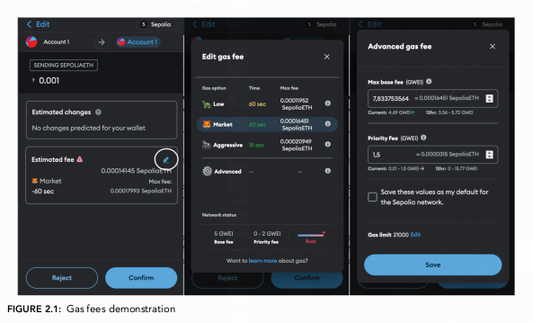
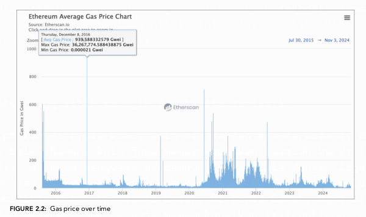
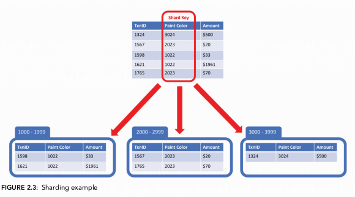

# Bab 1
## Apa Itu Uang dan Sejarah Singkatnya?

Bab ini mungkin tampak seperti pengantar filosofis, tetapi bagi seorang auditor keamanan, bab ini adalah fondasi terpenting. Sebelum kita bisa mengamankan sebuah sistem finansial berbasis *blockchain*, kita harus memahami masalah fundamental yang coba dipecahkan oleh teknologi ini. Bab ini tidak hanya membahas "apa itu uang," tetapi "mengapa uang itu ada" dan bagaimana evolusinya membentuk kebutuhan akan sistem seperti *Bitcoin* dan *Ethereum*.

### Pengantar: Konteks untuk Auditor

Penulis memulai dengan menegaskan bahwa meskipun ini adalah buku tentang Solidity, pemahaman tentang uang sangatlah esensial. *Smart contracts* yang akan Kita audit nantinya sering kali mengelola aset digital yang berfungsi sebagai uang. Kesalahan dalam logika kontrak dapat mengakibatkan kerugian finansial yang nyata. Oleh karena itu, memahami properti uang, sejarah kepercayaannya, dan kelemahannya akan memberi Kita perspektif yang lebih tajam dalam mengidentifikasi potensi risiko dalam sebuah *smart contract*.

Bab ini menjawab pertanyaan-pertanyaan berikut:
* Apa yang membuat sesuatu berharga dan dapat berfungsi sebagai uang?
* Bagaimana masyarakat secara historis menyelesaikan masalah koordinasi dalam pertukaran nilai?
* Bagaimana *cryptocurrency* dan *smart contracts* membangun pola historis ini sambil memperkenalkan kapabilitas baru?

### Apa Itu Uang?

Penulis tidak mendefinisikan uang secara kaku, melainkan menjelajahinya dari berbagai sudut pandang:
1.  **Sebagai Medium Pertukaran:** Alat untuk memfasilitasi perdagangan barang dan jasa.
2.  **Sebagai Representasi Energi:** Uang dilihat sebagai bentuk fisik dari waktu dan energi yang telah kita curahkan, yang kemudian dapat ditukarkan dengan energi orang lain (misalnya, membeli mobil yang dibuat oleh orang lain).
3.  **Sebagai Bahasa dan Teknologi:** Ini adalah konsep inti bab ini. Uang adalah **bahasa universal** untuk mengkomunikasikan nilai. Saat Kita mengatakan "pisau ini harganya $50," Kita dan penjual menggunakan bahasa yang sama untuk menyetujui nilai dari pisau tersebut. Sistem ekonomi global kemudian dilihat sebagai sebuah **protokol** yang dibangun di atas bahasa ini.

#### Uang sebagai Teknologi Kontrak

Sebagai seorang calon auditor, ini adalah poin krusial. Penulis menggambarkan uang itu sendiri sebagai sebuah kontrak sosial yang implisit:
* **Kontrak dalam Komunitas:** Kesepakatan di antara sekelompok orang untuk menggunakan objek tertentu (misalnya, Dolar AS) sebagai alat transaksi.
* **Kontrak antar Komunitas:** Ketika dua komunitas dengan "uang" yang berbeda ingin berdagang, mereka memerlukan alat transaksional standar yang disepakati bersama, seperti Dolar AS untuk perdagangan internasional saat ini.

### Tiga Properti Inti Uang

Untuk dapat berfungsi secara efektif, teknologi "uang" harus memiliki tiga properti utama. Setiap properti ini memiliki sub-properti yang menentukan kualitasnya. Memahami ini akan membantu Kita mengevaluasi aset digital di masa depan.

#### 1. Medium of Exchange (Alat Tukar)

Ini adalah fungsi paling dasar: sebuah alat perantara untuk memfasilitasi pertukaran. Agar bisa diandalkan, alat tukar harus memiliki sifat-sifat berikut:

* **Durability (Daya Tahan):** Harus tahan terhadap kerusakan fisik.
* **Transportability (Mudah Dibawa):** Mudah untuk dipindahkan baik dari segi kecepatan maupun berat.
* **Divisibility (Dapat Dibagi):** Dapat dipecah menjadi unit-unit yang lebih kecil tanpa kehilangan nilai.
* **Fungibility (Dapat Dipertukarkan):** Setiap unitnya harus identik dan memiliki nilai yang sama. Satu lembar $100 sama nilainya dengan lembar $100 lainnya.
* **Non-counterfeitability (Sulit Dipalsukan):** Harus sulit untuk ditiru atau dipalsukan.
* **Scarcity (Kelangkaan):** Pasokannya harus terbatas untuk mempertahankan nilainya. Jika terlalu melimpah, nilainya akan turun.
* **Acceptability (Dapat Diterima):** Semakin banyak pihak yang mau menerimanya, semakin efektif fungsinya.

#### 2. Store of Value (Penyimpan Nilai)

Uang harus mampu mempertahankan daya belinya dari waktu ke waktu. Properti ini tidak hanya dimiliki oleh uang, tetapi juga aset lain seperti emas, properti, atau saham. Sifat penyimpan nilai yang baik berasal dari:

* **Stability (Stabilitas):** Permintaan yang stabil dan dapat diprediksi.
* **Predictability (Dapat Diprediksi):** Pasokan masa depan yang stabil atau menyusut.
* **Cultural and Societal Values (Nilai Kultural dan Sosial):** Persepsi nilai budaya yang melekat pada aset tersebut.
* **Liquidity (Likuiditas):** Kemudahan untuk mengubahnya kembali menjadi alat tukar (uang tunai) tanpa kehilangan nilai secara signifikan.
* **Portability and Transferability (Portabilitas dan Kemudahan Transfer):** Kemudahan memindahkan kepemilikan aset tersebut.

#### 3. Unit of Account (Satuan Hitung)

Uang harus berfungsi sebagai tolok ukur standar untuk menyatakan harga barang dan jasa. Misalnya, kita mengatakan "perjalanan ini harganya $10.000," bukan "perjalanan ini harganya empat ekor sapi." Agar efektif sebagai satuan hitung, nilainya harus **stabil** dan tidak volatil dalam jangka pendek. Inilah kelemahan utama *cryptocurrency* saat ini dibandingkan mata uang fiat.

> Penulis menyimpulkan bahwa **tidak ada bentuk uang yang sempurna saat ini** karena tidak ada yang dapat memenuhi semua properti tersebut secara ideal. Sering kali, memaksimalkan satu properti akan mengorbankan properti lainnya.

### Sejarah dan Evolusi Uang

Bagian ini melacak perjalanan uang dari sistem paling primitif hingga yang paling modern, menunjukkan bagaimana manusia secara bertahap membangun sistem kepercayaan dan kerja sama yang lebih kompleks.

#### 1. Barter

Sistem paling awal adalah barter: pertukaran langsung barang dan jasa tanpa perantara. Ini hanya efektif dalam komunitas kecil di mana semua orang saling kenal dan reputasi menjadi jaminan. Kelemahan utamanya adalah masalah **"double coincidence of wants" (kebetulan ganda keinginan)**, di mana kedua belah pihak harus menginginkan apa yang dimiliki oleh pihak lain. Sistem ini menjadi tidak praktis seiring dengan pertumbuhan dan kompleksitas ekonomi.

#### 2. Primitive Money (Uang Primitif)

Untuk mengatasi keterbatasan barter, masyarakat mulai menggunakan "uang primitif". Bentuknya sangat bervariasi tergantung pada budaya dan lingkungan geografis, tetapi semuanya memiliki kesamaan: benda-benda tersebut memiliki nilai intrinsik atau simbolis yang disepakati oleh komunitas.

Penulis memberikan banyak contoh untuk mengilustrasikan satu poin penting: **meskipun bentuk fisiknya berbeda, dasar psikologis dan properti yang harus dipenuhi tetap sama.**

* **Shells (Kerang):** Seperti kerang *cowrie* yang digunakan di Afrika dan Asia. Selain sebagai uang, kerang juga memiliki nilai budaya dan spiritual yang signifikan.
* **Wampum Belts (Sabuk Wampum):** Digunakan oleh suku-suku asli Amerika tidak hanya sebagai uang, tetapi juga sebagai catatan fisik perjanjian, hukum, dan sejarah.
* **Cattle (Ternak):** Digunakan di banyak budaya agraris sebagai simbol kekayaan dan status karena menyediakan sumber daya penting.
* **Whale Teeth (Gigi Ikan Paus):** Di komunitas pesisir seperti Fiji, gigi ikan paus melambangkan status, keberanian, dan hubungan sosial.
* **Grain (Biji-bijian), Salt (Garam), Tobacco (Tembakau), Tea Bricks (Bata Teh), Feathers (Bulu), dan Beads (Manik-manik):** Semua ini adalah contoh lain di mana benda-benda dari lingkungan sekitar diadopsi sebagai uang karena memenuhi properti dasar seperti daya tahan, kelangkaan, dan penerimaan budaya.

> **Poin Kunci untuk Auditor:** Uang pada dasarnya adalah sebuah **konstruk psikologis dan sosial**. Kepercayaan kolektif adalah yang memberinya nilai. Ini relevan ketika Kita menganalisis tokenomik atau mekanisme stabilitas sebuah *stablecoin*.

### Jenis Uang Modern

Evolusi berlanjut ke bentuk yang lebih canggih dan terstandarisasi.

* **Coins (Koin):** Diciptakan di Lydia kuno, koin menawarkan standardisasi, daya tahan, dan kemudahan pembagian yang lebih baik. Namun, koin juga memperkenalkan masalah baru: **pemalsuan dan *debasement* (penurunan nilai)**, di mana penguasa mencampur logam mulia dengan logam yang lebih murah.
* **Paper Money (Uang Kertas):** Berawal di Tiongkok sebagai tanda terima untuk simpanan koin. Ini memecahkan masalah portabilitas untuk transaksi besar. Di dunia Barat, Bank of Amsterdam menjadi pelopor perbankan modern dan secara tidak sengaja memperkenalkan ***fractional-reserve banking*** (perbankan cadangan fraksional), di mana bank hanya menyimpan sebagian kecil dari simpanan dan meminjamkan sisanya. Ini adalah dasar dari sistem keuangan modern.
* **Bretton Woods Conference:** Pada tahun 1944, sistem ini menetapkan Dolar AS sebagai mata uang cadangan dunia, yang dipatok ke emas. Mata uang negara lain kemudian dipatok ke Dolar AS. Sistem ini runtuh pada tahun 1971, mengakhiri era mata uang yang didukung logam dan memulai era **mata uang *fiat*** (uang yang nilainya didasarkan pada kepercayaan pada pemerintah yang menerbitkannya).

> Penulis kembali menekankan bahwa uang modern pun tidak lepas dari akar budayanya. Gambar pahlawan nasional, bangunan bersejarah, atau simbol negara pada uang kertas dan koin berfungsi untuk memperkuat identitas dan kebanggaan nasional, mirip dengan bagaimana uang primitif terjalin dengan budaya sukunya.

### Cryptocurrency

Ini adalah transisi ke bagian inti yang relevan dengan Solidity. Penulis memperkenalkan *cryptocurrency* sebagai evolusi berikutnya dari uang, yang kini sepenuhnya digital dan terdesentralisasi.

#### 1. Bitcoin

Diperkenalkan oleh Satoshi Nakamoto pada tahun 2008 sebagai "*peer-to-peer electronic cash system*". Penulis menguraikan properti moneter *Bitcoin*:
* **Distributed (Terdistribusi), Secure (Aman), Reliable (Dapat Diandalkan):** Jaringan tersebar di seluruh dunia, diamankan oleh mayoritas *node* yang jujur.
* **Peer-to-peer, Open (Terbuka), Public (Publik), Permissionless (Tanpa Izin), Borderless (Tanpa Batas), Censorship-resistant (Tahan Sensor), Neutral (Netral):** Ini adalah karakteristik fundamental yang membedakannya dari sistem keuangan tradisional.

**"Kebijakan Moneter" Bitcoin:**
* **Pasokan Tetap:** Hanya akan ada 21 juta *bitcoin*.
* **Jadwal Deflasi:** Emisi koin baru berkurang setengahnya kira-kira setiap empat tahun dalam sebuah peristiwa yang disebut ***halving***.
* **Dapat Diprediksi:** Tidak seperti bank sentral, kebijakan moneter *Bitcoin* bersifat algoritmik dan transparan.

Analisis *Bitcoin* dan *Ether* terhadap Tiga Properti Uang:
* **Medium of Exchange:** Sangat portabel dan tahan lama, tetapi skalabilitas yang rendah dan *transaction fees* yang tinggi (terutama di *Ethereum*) menjadi penghalang.
* **Store of Value:** Sangat volatil dalam jangka pendek, membuatnya menjadi penyimpan nilai yang buruk untuk periode singkat. Namun, dalam jangka panjang, *Bitcoin* (karena kelangkaannya) cenderung terapresiasi, membuatnya dianggap sebagai "emas digital".
* **Unit of Account:** Belum dapat dianggap sebagai satuan hitung karena harganya masih sering dikutip dalam mata uang *fiat*. Pengecualian penting adalah *NFT*, yang harganya sering dikutip dalam *Ether (ETH)*.

### Ethereum dan Smart Contracts

Ini adalah jembatan langsung ke topik utama buku ini. Jika *Bitcoin* adalah evolusi uang, *Ethereum* adalah evolusi kontrak.

#### Apa itu Smart Contracts?

*Smart contracts* didefinisikan sebagai kontrak yang dikodekan dan dapat dieksekusi secara otomatis tanpa perantara ketika kondisi tertentu terpenuhi.

> **Poin Kunci untuk Auditor:** Penulis membuat koneksi brilian di sini. Uang itu sendiri adalah bentuk **kontrak kerja sama** yang paling dasar. *Bitcoin* adalah kontrak untuk bertransaksi nilai. *Ethereum*, dengan bahasa *Turing-complete* seperti Solidity, memungkinkan **kontrak kerja sama yang jauh lebih canggih dan kompleks** antara orang-orang di seluruh dunia.

Kritik Vitalik Buterin terhadap *Bitcoin* menjadi dasar lahirnya *Ethereum*: *scripting language* *Bitcoin* tidak cukup kuat untuk aplikasi yang kompleks (*non-Turing complete*).

#### Aplikasi Praktis Smart Contract (Contoh dari Buku)

Bab ini memberikan banyak contoh nyata untuk mengilustrasikan potensi *smart contracts*. Saya akan menjelaskannya secara naratif, bukan sekadar daftar.

* **Tokenisasi Aset Dunia Nyata:** Konsep ini merevolusi likuiditas aset. Sebagai contoh, sebuah rumah yang biasanya membutuhkan waktu berbulan-bulan untuk dijual, dapat diwakili oleh *token* digital di *blockchain*. Ini bisa dalam bentuk **kepemilikan fraksional**, di mana banyak *token* mewakili sebagian kecil rumah, atau sebagai satu **NFT** yang mewakili seluruh properti. Ini membuka pasar real estat menjadi global dan dapat diakses siapa saja. Contoh nyata yang diberikan adalah **Propy** (tokenisasi rumah fisik sebagai NFT) dan **Red Swan** (kepemilikan fraksional real estat).
* **Contoh Lain yang Lebih Kreatif:** Potensi *smart contracts* melampaui keuangan. **CryptoWine** adalah *startup* yang mentokenisasi botol anggur sebagai NFT, di mana kepemilikan digital dapat diperdagangkan dan botol fisik akan dikirim saat NFT "dibuka". Di dunia hiburan, film **Calladita** didanai sepenuhnya melalui NFT, di mana investor dapat memperoleh bagian keuntungan atau bahkan mempengaruhi alur cerita.
* **Ekonomi Digital dan Kepemilikan:** Di dunia *fashion* digital, **Mutani** menciptakan pakaian untuk avatar. Di dunia penerbitan, **Book.io** menjual *e-book* sebagai NFT, yang memberikan **kepemilikan sejati** kepada pembeli, tidak seperti lisensi baca dari platform tradisional. Di industri musik, **Violetta Zironi** menjual musiknya sebagai NFT, mengubah penggemarnya menjadi investor. Contoh seni digital paling ikonik adalah **CryptoPunks**, yang nilainya terletak pada signifikansi historisnya sebagai salah satu koleksi NFT pertama.
* **Meningkatkan Model Bisnis Tradisional:** *Smart contracts* juga dapat meningkatkan model bisnis yang sudah ada. **Hotel Le Bristol di Prancis** menggunakan kunci NFT untuk memberikan akses ke pengalaman eksklusif bagi pelanggan setia. Di bidang pendidikan, **Universitas Nicosia** menyelenggarakan kursus pertama yang diakses melalui NFT.
* **Identitas dan Keanggotaan:** Konsep identitas digital terdesentralisasi memungkinkan pengguna untuk mengontrol dan bahkan memonetisasi data pribadi mereka. Klub keanggotaan seperti **Flyfish Club Restaurant** menggunakan NFT untuk memberikan akses eksklusif, di mana keanggotaan itu sendiri menjadi aset yang dapat diperdagangkan.

#### Decentralized Autonomous Organizations (DAOs)

DAOs adalah organisasi yang diatur oleh *smart contracts*, di mana para pemegang *token* dapat mengajukan proposal dan memberikan suara. Ini adalah bentuk tertinggi dari kontrak sosial yang dikodekan. Bab ini memberikan beberapa contoh menarik:
* **Decentralized Exchanges (DEXs):** Seperti **Uniswap**, yang beroperasi sebagai pembuat pasar otomatis tanpa pemimpin terpusat.
* **Lending/Borrowing:** Protokol seperti **Aave** menciptakan pasar pinjam-meminjam global.
* **Niche DAOs:** **Travala** adalah agensi perjalanan terdesentralisasi. **VitaDAO** mendanai penelitian umur panjang. **BeerDAO** mentokenisasi merek bir. **CityDAO** secara kolektif mengelola sebidang tanah di Wyoming.

### Kesimpulan Bab 1

Bab ini ditutup dengan sebuah definisi uang yang komprehensif, yang merangkum semua yang telah dibahas:

> Uang adalah teknologi dan bahasa kompleks yang digunakan manusia untuk berkomunikasi dan memfasilitasi pertukaran nilai, diatur oleh protokol yang disepakati bersama. Ia berevolusi dari barter ke bentuk digital, dan sekarang, dengan *cryptocurrency* dan *smart contracts*, ia menggabungkan prinsip desentralisasi, transparansi, dan programabilitas, yang berpotensi membentuk kembali kontrak ekonomi, tata kelola, dan sosial di era digital.

---

# Bab 2
## Pengantar Arsitektur Ethereum

Bab ini menggunakan analogi yang sangat kuat untuk menyederhanakan konsep *blockchain* yang kompleks. Penulis membandingkan *Ethereum* dengan sebuah *spreadsheet* Excel yang terdistribusi untuk membantu kita memahami bagaimana sebuah "komputer dunia" yang terdesentralisasi dapat beroperasi. Sebagai auditor, memahami arsitektur ini akan memungkinkan Kita untuk mengidentifikasi di mana letak potensi kelemahan, baik itu di tingkat protokol maupun dalam implementasi *smart contract*.

### Dasar-Dasar Ethereum

Pada level paling dasar, *Ethereum* dan *blockchain* lainnya dapat dianggap sebagai sebuah buku besar digital, atau sebuah file Excel yang berisi daftar *transaction*. *Spreadsheet* ini tidak dimiliki oleh satu entitas tunggal, melainkan didistribusikan ke ribuan komputer di seluruh dunia yang disebut ***nodes*** (*node* adalah komputer yang berpartisipasi dalam jaringan).

* **Mekanisme Konsensus Sederhana:** Komputer-komputer ini terus berkomunikasi satu sama lain untuk memastikan bahwa setiap salinan *spreadsheet* tetap identik. Jika satu *node* mencoba mengubah data secara curang (misalnya, menghapus sebuah *transaction*), *node-node* lain akan mendeteksi ketidaksesuaian ini, menolak versi yang telah diubah, dan mengisolasinya dari jaringan. Versi yang jujur dan disepakati bersama adalah yang terus berlanjut.
* **Validator dan Blocks:** Beberapa *node* khusus yang disebut ***validators*** (validator) bertugas untuk mengelompokkan *transaction-transaction* baru yang belum dikonfirmasi (yang berada di dalam ***mempool***, atau "ruang tunggu" *transaction*) ke dalam sebuah blok. Setiap blok ini kemudian diberi ***hash*** (pengenal kriptografis unik) yang juga merujuk ke *hash* dari blok sebelumnya, menciptakan sebuah rantai yang saling terhubung—inilah asal mula istilah "*blockchain*" Proses ini terjadi di *Ethereum* kira-kira setiap 12 detik.
* **"World Computer":** Visi Vitalik Buterin adalah agar semua *node* ini berfungsi sebagai satu komputer global yang terdesentralisasi, yang disebut **"World Computer"**.

Penulis kemudian mengulangi kritik Vitalik terhadap keterbatasan *Bitcoin* yang memotivasi lahirnya *Ethereum*:
* ***Bitcoin is not Turing complete:*** Bahasa *scripting*-nya terlalu sederhana untuk aplikasi yang kompleks.
* ***Bitcoin suffers from value blindness:*** *Script*-nya tidak dapat mengevaluasi atau membandingkan nilai *transaction* secara *native*.
* ***Bitcoin lacks state:*** Sistemnya tidak memiliki cara bawaan untuk "mengingat" status dari *transaction* sebelumnya, yang krusial untuk aplikasi kompleks.
* ***Bitcoin suffers from blockchain blindness:*** *Script*-nya tidak dapat membaca data historis dari *blockchain* itu sendiri.

*Ethereum* dirancang untuk mengatasi semua ini, memungkinkan pembangunan:
* **Aplikasi Finansial:** Dari *transaction* sederhana hingga ekosistem *Decentralized Finance (DeFi)* yang kompleks, termasuk tokenisasi aset.
* **Aplikasi Non-Finansial:** Seperti manajemen identitas digital di mana pengguna memegang kendali penuh atas data mereka, dan sistem pemungutan suara (*voting*) yang transparan dan tahan terhadap kecurangan.

Terakhir, bagian ini menegaskan kembali properti fundamental *Ethereum* sebagai sebuah *blockchain*: *permissionless*, *borderless*, *censorship-resistant*, *immutable*, *transparent*, *global*, dan *decentralized*.

### Trilema Blockchain

Ini adalah konsep inti dalam desain *blockchain*, yang dicetuskan oleh Vitalik Buterin. Trilema ini menyatakan bahwa sebuah *blockchain* hanya dapat mengoptimalkan dua dari tiga properti berikut secara bersamaan:

1.  **Scalability (Skalabilitas):** Kemampuan untuk memproses *transaction* dalam jumlah besar per detik (*Transactions Per Second* atau TPS).
2.  **Security (Keamanan):** Ketahanan jaringan terhadap serangan.
3.  **Decentralization (Desentralisasi):** Kemampuan untuk beroperasi tanpa adanya entitas pengendali tunggal atau kelompok kecil.

Saat ini, *Ethereum* memprioritaskan **keamanan** dan **desentralisasi**, yang berakibat pada **skalabilitas yang rendah**. Ini adalah akar dari masalah biaya ***gas fees*** (*biaya untuk pemrosesan komputasi*) yang tinggi.

### Smart Contracts

Penulis kembali mendefinisikan *smart contracts* sebagai program komputer yang mengeksekusi perjanjian secara otomatis, di mana aturannya tertanam langsung di dalam kode.

* **Analogi Mesin Penjual Otomatis (*Vending Machine*):** Sebuah analogi yang sangat baik digunakan di sini. Mesin penjual otomatis adalah bentuk fisik dari *smart contract*. Kita memasukkan koin (memenuhi kondisi), memilih minuman (memanggil fungsi), dan mesin secara otomatis mengeluarkan minuman tersebut (mengeksekusi hasil). Tidak ada negosiasi, tidak ada perantara.

Bab ini merangkum properti *smart contracts* dalam sebuah tabel (Tabel 2.1), yang akan saya jelaskan secara naratif:

* **Keuntungan (*Pros*):** Otomatisasi mengurangi intervensi manusia dan biaya perantara. Transparansi di *blockchain* memungkinkan siapa saja untuk mengaudit histori *transaction*. Sifat *trustless* memungkinkan pihak yang tidak saling kenal untuk bertransaksi dengan aman karena kode yang menegakkan aturan. Imutabilitas memastikan bahwa setelah diterapkan, kode tidak dapat diubah.
* **Kerugian (*Cons*) dan Tantangan:** Imutabilitas juga menjadi pedang bermata dua; bug yang terdeteksi setelah penerapan sangat sulit untuk diperbaiki. Ketergantungan pada data eksternal (melalui *oracles*) dapat menjadi titik kegagalan jika sumber data terpusat. Kurangnya privasi adalah kebalikan dari transparansi, karena semua detail *transaction* bersifat publik. Isu skalabilitas juga menjadi tantangan besar, terutama di *Ethereum*. Selain itu, teknologi ini masih baru, sehingga preseden hukumnya terbatas dan sulit menemukan ahli yang benar-benar berpengalaman.

### Ethereum Virtual Machine (EVM)

EVM adalah lingkungan eksekusi untuk *smart contracts* di *Ethereum*. Inilah yang menjadikan *Ethereum* sebuah "World Computer". Semua *node* di jaringan menjalankan EVM, yang memastikan bahwa setiap *smart contract* dieksekusi dengan cara yang sama di seluruh jaringan, menjaga konsensus.

*Ethereum* memiliki dua jenis akun:
1.  **Externally Owned Accounts (EOAs):** Akun yang dikendalikan oleh pengguna melalui *private keys*.
2.  **Contract Accounts:** Akun yang dikendalikan oleh kode *smart contract* itu sendiri, yang dieksekusi oleh EVM.

### The Ether Coin (Koin Ether)

*Ether (ETH)* adalah aset *native* dari *blockchain Ethereum*. Fungsinya adalah sebagai "bahan bakar" untuk EVM. Setiap operasi komputasi di *Ethereum* memerlukan biaya dalam bentuk *gas*, dan biaya ini dibayarkan menggunakan ETH.

Penulis merinci unit-unit denominasi *Ether*, dengan **wei** sebagai unit terkecil. Satu *Ether* setara dengan 1 kwintiliun (10^18) *wei*. Unit yang sering Kita temui adalah **gwei** (10^9 *wei*), yang biasa digunakan untuk menyatakan harga *gas*.

### The Byzantine General's Problem dan Mekanisme Konsensus Ethereum

* ***The Byzantine General's Problem*** adalah masalah klasik dalam ilmu komputer: bagaimana mencapai kesepakatan (*consensus*) dalam sistem terdistribusi di mana beberapa partisipan mungkin tidak dapat dipercaya atau bahkan berniat jahat.
* **Proof-of-Work (PoW):** Solusi pertama yang sukses untuk masalah ini diimplementasikan oleh Satoshi Nakamoto di *Bitcoin*.
* **Proof-of-Stake (PoS):** Mekanisme konsensus yang kini digunakan *Ethereum*. Alih-alih menggunakan daya komputasi (seperti PoW), *validators* di PoS mengunci sejumlah ETH (minimal 32 ETH) sebagai jaminan (*stake*) untuk berpartisipasi dalam validasi blok. Mereka dipilih secara acak untuk membuat blok baru. Jika mereka bertindak jujur, mereka mendapatkan imbalan. Jika mereka berbuat curang, *stake* mereka akan disita (proses ini disebut ***slashing***). Proses ini mencapai **finality** (finalitas), di mana sebuah blok dianggap permanen dan tidak dapat diubah, dalam waktu sekitar 12 menit.

### Gas Fees

Ini adalah konsep yang sangat penting bagi auditor karena efisiensi *gas* adalah bagian krusial dari keamanan dan optimisasi *smart contract*.

* **Definisi:** *Gas* adalah unit yang mengukur sumber daya komputasi yang dibutuhkan untuk mengeksekusi operasi. Biaya totalnya, *gas fee*, dihitung dengan rumus:
    $$
    \text{Gas Terpakai} \times (\text{Base Fee} + \text{Priority Fee}) \text{ }
    $$
* ***Base Fee:*** Harga minimum per unit *gas* yang ditetapkan oleh protokol. *Base fee* ini akan "dibakar" (*burned*), artinya dikeluarkan dari sirkulasi.
* ***Priority Fee (Tip):*** Biaya tambahan yang diberikan oleh pengguna untuk memberi insentif kepada *validator* agar memprioritaskan *transaction* mereka.

Penulis menggunakan analogi restoran: *Base Fee* adalah harga makanan di menu, sedangkan *Priority Fee* adalah tip untuk pelayan agar pesanan Kita dilayani lebih dulu.

  

[Tiga tangkapan layar antarmuka MetaMask yang menunjukkan proses penyesuaian gas fee, dari estimasi awal hingga pengaturan lanjutan. - Figure 2.1]

Gambar 2.1 dalam buku menunjukkan bagaimana pengguna di *wallet* MetaMask dapat memilih tingkat *gas fee* (Rendah, Pasar, Agresif) atau mengaturnya secara manual di menu lanjutan, dengan menyesuaikan *Max Base Fee* dan *Priority Fee*.

### Masalah Skalabilitas Ethereum

Dengan kapasitas hanya sekitar 20 TPS, *Ethereum* jauh tertinggal dibandingkan sistem pembayaran tradisional seperti Visa (65.000 TPS). Keterbatasan ini menyebabkan "perang penawaran" (*bidding war*) untuk ruang blok, di mana pengguna saling menaikkan *priority fee* agar *transaction* mereka diproses, menyebabkan lonjakan *gas fees* yang ekstrem pada saat permintaan tinggi.

  

[Grafik garis yang menunjukkan harga gas rata-rata Ethereum dari waktu ke waktu, dengan beberapa puncak lonjakan harga yang signifikan. - Figure 2.2]

Gambar 2.2 mengilustrasikan masalah ini dengan menunjukkan grafik historis harga *gas*, di mana terlihat puncak-puncak harga yang sangat tinggi, bahkan mencapai ratusan *gwei*.

### Solusi Layer 2

Untuk mengatasi masalah skalabilitas, solusi ***Layer 2*** dibangun "di atas" *blockchain* utama *Ethereum* (yang disebut *Layer 1*). Solusi ini memproses *transaction* di luar rantai utama (*off-chain*) untuk mengurangi beban, kemudian mengirimkan hasilnya kembali ke *Layer 1*.

  

[Diagram yang mengilustrasikan konsep sharding, di mana sebuah tabel data besar dengan 'Shard Key' dipecah menjadi tiga tabel yang lebih kecil berdasarkan rentang nilai. - Figure 2.3]

* ***Rollups:*** Menggabungkan banyak *transaction off-chain* ke dalam satu *batch* dan mempublikasikan ringkasan datanya ke *Layer 1*.
    * ***Optimistic Rollups:*** Mengasumsikan semua *transaction* valid secara default dan hanya melakukan komputasi jika ada sengketa (menggunakan ***fraud proofs***).
    * ***Zero-Knowledge (ZK) Rollups:*** Menggunakan bukti kriptografis canggih (***zero-knowledge proofs***) untuk membuktikan validitas *transaction* tanpa mengungkapkan data apa pun, sehingga meningkatkan skalabilitas dan privas.
* ***Validiums:*** Mirip dengan ZK-Rollups, tetapi data *transaction* disimpan *off-chain*, memberikan skalabilitas dan privasi yang lebih tinggi lagi.
* ***Side-Chains:*** *Blockchain* independen yang berjalan paralel dengan *Ethereum* dan terhubung melalui jembatan (*bridges*).
* ***Sharding:*** Konsep partisi basis data di mana *blockchain* dipecah menjadi beberapa rantai yang lebih kecil (*shards*) yang memproses *transaction* secara paralel (seperti diilustrasikan pada Gambar 2.3).
* ***Danksharding:*** Evolusi dari *sharding* yang berfokus pada penyediaan ruang data yang masif dan murah (melalui ***data blobs***) untuk *rollups*, secara efektif mengubah *Ethereum* menjadi lapisan penyelesaian (*settlement layer*) yang sangat aman dan terdesentralisasi.

### Solusi Layer 3

Ini adalah lapisan yang dibangun di atas *Layer 2*, yang dirancang untuk aplikasi yang sangat spesifik seperti *gaming* atau media sosial terdesentralisasi, menawarkan kustomisasi dan efisiensi yang lebih tinggi lagi.

### Ethereum: Menuju Finalisasi

*Ethereum* masih dalam pengembangan aktif. Penulis menguraikan *roadmap*-nya:
* **The Merge:** Transisi dari PoW ke PoS (telah selesai).
* **The Surge:** Peningkatan skalabilitas besar-besaran melalui *Danksharding*.
* **The Scourge:** Mengatasi masalah sentralisasi dan sensor terkait *Miner Extractable Value (MEV)*.
* **The Verge:** Mempermudah verifikasi blok dengan memperkenalkan *Verkle trees*.
* **The Purge:** Menghapus data historis lama untuk mengurangi beban penyimpanan pada *node*.
* **The Splurge:** Perbaikan dan penyempurnaan lainnya, termasuk ***Account Abstraction***.

Bab 2 memberikan gambaran arsitektur yang komprehensif. Sebagai seorang auditor, pemahaman tentang Trilema Blockchain, mekanisme *gas*, dan berbagai solusi skalabilitas sangatlah penting. Banyak *bug* dan kerentanan muncul dari interaksi yang salah antara *Layer 1* dan *Layer 2*, atau dari asumsi yang salah tentang bagaimana EVM menangani *state* dan eksekusi. Bab ini adalah dasar teknis Kita untuk bab-bab berikutnya yang lebih fokus pada kode Solidity.

---

