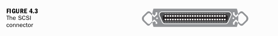
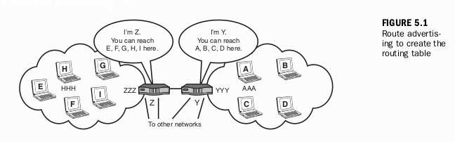

# JAM ke 1
## Gambaran Umum Jaringan Komputer

**Apa yang Akan Anda Pelajari dalam Jam Ini:**
* Definisi jaringan komputer
* Mengapa kita membutuhkan jaringan komputer
* Komponen-komponen sebuah jaringan
* Berbagai jenis jaringan
* Pentingnya Internet

Jaringan komputer telah menjadi bagian dari kehidupan kita sehari-hari. Kita menggunakannya untuk mengambil uang tunai dari ATM lokal. Setiap kali kita mengirim email atau menjelajahi Web, kita mengandalkan jaringan komputer terbesar di dunia, Internet, untuk menjadi tukang pos elektronik kita. Para *telemarketer*, biasanya saat jam makan malam, menggunakan jaringan komputer untuk menjual barang dagangan mereka kepada kita. Stasiun televisi kabel kita bergantung pada jaringan komputer untuk menyalurkan program ke layar TV kita. Apa contoh paling nyata dari kehadiran mereka dalam hidup kita? Tanpa jaringan komputer, ponsel kita tak lebih dari sekadar baterai yang menyalakan layar tanpa arti.

Untuk menyediakan layanan-layanan luar biasa ini, jaringan komputer mentransfer data ke dan dari perangkat TV, komputer pribadi, ponsel, dan mesin modern lainnya. Data ini kemudian diterjemahkan oleh aplikasi menjadi gambar video TV, ikon di layar PC, dan pesan teks di ponsel. Tugas-tugas jaringan ini hanya memakan waktu sekitar satu detik (seringkali kurang) untuk diselesaikan—bahkan jika jaringan harus mengambil data dari seluruh dunia. Mengapa menonton film fiksi ilmiah? Jaringan komputer sama mengesankannya.

Meskipun jaringan data, seperti halnya komputer, telah menjadi bagian tak terpisahkan dari hidup kita, kebanyakan orang menganggap jaringan komputer sebagai subjek yang terlalu rumit bahkan untuk dipertimbangkan untuk dibuat. Biasanya, kita meminta bantuan "pasukan ahli" terdekat, atau kita mendatangkan spesialis dari departemen jaringan perusahaan kita.

Tapi mari kita bocorkan sebuah rahasia—satu hal yang para "pakar" teknis ini tidak ingin diketahui: Jaringan komputer tidaklah serumit itu. Tidak memerlukan keanggotaan dalam perkumpulan rahasia. Kecuali jika Anda memilih untuk menjadi seorang programmer perangkat lunak atau perancang perangkat keras, kecuali jika Anda memilih untuk membangun jaringan dari awal, Anda tidak perlu mengabdikan bertahun-tahun studi untuk dapat mengatur dan mengelola jaringan Anda sendiri.

Di masa lalu, mengelola jaringan memang membutuhkan pengalaman dan pelatihan yang mendalam. Dan jangan salah: Buku ini tidak akan memberi Anda informasi yang cukup untuk mengelola Internet! Tapi sekarang, dengan menjamurnya jutaan jaringan dan pengguna jaringan, industri menyediakan alat untuk memungkinkan Anda tidak hanya memahami jaringan komputer tetapi juga untuk mengatur dan mengelolanya secara efektif.

Memperoleh kemampuan untuk membuat jaringan komputer memerlukan pemahaman tentang beberapa konsep fundamental, yaitu dasar-dasar komunikasi data. Ditambah dengan akal sehat—dan membaca buku ini—Anda dapat merakit jaringan Anda sendiri.

> **Tahukah Anda?**
>
>
> Semakin banyak Anda membaca tentang konsep jaringan dan isu-isu yang berkaitan dengan jaringan komputer, akan semakin mudah untuk mengimplementasikan dan memelihara jaringan Anda sendiri. Situs web `http://www.isoc.org` adalah cara yang baik untuk belajar lebih lanjut. Setelah membaca buku ini, kunjungi situs tersebut.
>
> Selain itu, saya merekomendasikan entri Wikipedia tentang subjek ini di `http://wikipedia.org`.
>

### Apa Itu Jaringan? Apa Itu Berjejaring (*Networking*)?

Dalam istilah yang paling sederhana, sebuah **jaringan komputer** terdiri dari dua atau lebih komputer yang terhubung. Koneksi ini ada dua macam: (a) **fisik**, melalui kabel, kawat, dan media nirkabel (atmosfer, misalnya pada ponsel), dan (b) **logis**, melalui pengangkutan data melintasi media fisik tersebut. Kita akan membahas komponen yang diperlukan untuk membuat koneksi fisik di beberapa bagian buku ini; terutama, pada Jam ke-4, 10, dan 23. Koneksi logis akan dibahas di seluruh buku ini.

Dalam konteks buku ini, apa itu *networking*? Jika saya berkata kepada seseorang, "Saya sedang *networking*!", apa arti pernyataan ini? Sebagai permulaan, itu tidak berarti saya sedang bersosialisasi dengan rekan kerja atau berbaur dengan orang tua di pertemuan komite sekolah setempat. Itu berarti saya sedang duduk di depan komputer, berkomunikasi dengan seseorang atau sesuatu melalui jaringan komputer. Tentu, tetapi Anda tidak perlu membaca selama 24 jam untuk mengajari Anda cara duduk di depan terminal dan bermain Scrabble online.

Dengan demikian, *Sams Teach Yourself Networking in 24 Hours* adalah judul singkat untuk mengajari Anda cara membangun jaringan sehingga Anda nantinya dapat melakukan *networking* (berjejaring).

Seperti yang telah disinggung, menghubungkan komputer lebih dari sekadar konektor fisik, seperti colokan listrik di dinding dan porta di PC. Beberapa aturan dasar harus diikuti agar komputer dapat saling bertukar data.

* Mesin-mesin dalam jaringan harus menggunakan prosedur yang sama untuk mengirim dan menerima data. Prosedur ini disebut **protokol komunikasi**. Jika perangkat-perangkat ini tidak (atau tidak bisa) menggunakan protokol yang sama, konversi harus dilakukan, biasanya dengan layanan yang disebut **konverter protokol**. Idenya mirip dengan seseorang yang menerjemahkan antara orang yang berbicara bahasa Spanyol dan orang yang berbicara bahasa Inggris. Untuk jaringan komputer, saya bisa mengirim email kepada anak saya dari komputer berbasis kabel saya ke ponselnya yang terhubung ke Internet.¹ Agar anak saya (Tommy) dapat membaca pesan ini, konversi dilakukan di tingkat fisik (gambar berbasis kabel menjadi gambar berbasis nirkabel) dan di tingkat logis (format email menjadi format teks). Untungnya, Anda tidak perlu berurusan dengan konverter protokol. Mereka disediakan untuk Anda secara otomatis.
* Data harus dikirimkan **tanpa kerusakan**. Artinya, jika saya mengetik "Halo, Tommy" di email saya, pesan itu harus (dan akan) diterima di ponselnya sebagai, "Halo, Tommy," dan bukan, katakanlah, "Halo, Mommy."
* Harus ada metode di mana komputer penerima (Ngomong-ngomong, ponsel modern mengandung setidaknya satu komputer) dapat **mengonfirmasi penerimaan data** yang tidak rusak dan memberitahu komputer pengirim jika data memang diterima dengan kesalahan. Jadi, jika perangkat Tommy menerima "Halo, Mommy," Tommy tidak akan pernah melihat kesalahan ini muncul di layarnya. Tanpa sepengetahuan Tommy, sebuah perangkat lunak akan memeriksa data dan mengirim pesan kembali ke komputer saya untuk meminta pengiriman ulang. Saya juga tidak akan tahu tentang layanan luar biasa ini. Terlebih lagi, karena semua dialog ini berlangsung begitu cepat (dalam beberapa sepersekian detik), Tommy dan saya tidak menyadari adanya penundaan singkat dalam dialog kami yang sedang berlangsung.
* Komputer di dalam jaringan harus mampu **menentukan asal dan tujuan** dari sebuah informasi, seperti email atau pesan teks. Lagi pula, jika Tommy ingin mengirim balasan kepada saya, jaringan harus dapat merutekannya ke komputer saya, dan perangkat Tommy harus memberikan alamat tersebut ke jaringan. Sekali lagi, Anda biasanya tidak perlu khawatir dengan tugas-tugas ini. Alamat sering kali diberikan kepada Anda secara otomatis. Seperti yang akan kita lihat, ini adalah layanan lain yang disediakan bagi pengguna jaringan.
* Tentu saja, **alamat yang terstandardisasi** diperlukan untuk pertukaran data yang benar antar komputer. Karena jutaan komputer di seluruh dunia dapat terhubung dalam jaringan, alamat-alamat ini harus "dapat diskalakan" (*scalable*) untuk mengakomodasi populasi komputer yang besar.
* Untuk keamanan dan manajemen, harus ada metode untuk **mengidentifikasi dan memverifikasi** perangkat yang terhubung ke jaringan. Peretas harus dicegah dari merusak komputer dan file.

Daftar ini bukanlah serangkaian persyaratan jaringan yang lengkap dan, seperti yang telah disebutkan, untuk mendapatkan sebagian besar layanan ini, Anda tidak perlu mengangkat satu jari pun ke keyboard atau keypad Anda. Kami mencantumkannya untuk memberi Anda gambaran tentang beberapa masalah yang dihadapi ketika para ahli jaringan komputer menangani tugas pertukaran dan berbagi data antar komputer. Seperti yang terlihat sebelumnya, agar transfer data antar komputer dapat terjadi, aturan harus diikuti. Jika tidak, prosesnya mirip dengan orang-orang yang mencoba berbicara satu sama lain dalam bahasa yang berbeda.

Jaringan bisa sesederhana koneksi titik-ke-titik (*point-to-point*) antara dua komputer yang saling mentransfer file. Jaringan juga bisa sangat kompleks. Salah satu contoh yang terlintas dalam pikiran adalah sistem Federal Reserve, yang memungkinkan kita mentransfer dana secara elektronik antar rekening. Contoh lainnya adalah jaringan seluler. Jaringan ini melacak kita saat kita bergerak melintasi suatu wilayah dan menyerahkan koneksi kita ke menara nirkabel berikutnya di "sel" tempat kita baru saja pindah.

Meskipun contoh titik-ke-titik jauh lebih sederhana daripada contoh perbankan dan seluler, masing-masing harus mengikuti aturan dasar yang sama untuk memungkinkan pengguna berkomunikasi satu sama lain. Kita akan menjelajahi jaringan sederhana dan kompleks dalam buku ini. Namun, sebelum kita mendalami detail jaringan komputer dan cara mengaturnya, kita harus berhenti sejenak dan menjawab pertanyaan ini: Mengapa kita ingin membangun jaringan? Saya menduga Anda punya jawaban sendiri; jika tidak, Anda tidak akan membaca buku ini. Izinkan saya memberikan beberapa pemikiran tentang masalah ini; mungkin sama dengan pemikiran Anda.

### Mengapa Membangun Jaringan?

Jika kita puas dengan menerima atau mengirim informasi secara manual, kita bisa menggunakan layanan pos. Tapi korespondensi dalam bentuk cetak disebut "surat siput" (*snail-mail*) karena alasan yang bagus. Terlalu lambat di dunia yang serba cepat saat ini. Pada saat surat tiba, isinya sering kali sudah menjadi berita basi.

* Sebaliknya, jaringan komputer memungkinkan **komunikasi yang lebih cepat** antar pihak. Dengan demikian, hal itu mengarah pada penggunaan waktu yang lebih efisien.
* Dengan berbagi data elektronik di antara mungkin ribuan orang, jaringan komputer mendorong (mengharuskan!) penggunaan **kebijakan dan prosedur standar**. Bagaimanapun, komputer pribadi kita dan ponsel kita yang mahir berkirim pesan teks tidak memiliki daya inferensi seperti kita manusia. Kita bisa saja merespons dengan, "Tolong ulangi lagi," jika kita tidak mengerti suatu transmisi. Tetapi jaringan komputer harus diprogram dengan susah payah untuk melakukan satu tugas sederhana ini. Namun, sekali lagi, prosedur standar ini mengarah pada komunikasi yang lebih efisien.
* Jaringan menyediakan dukungan **cadangan (*backup*) dan pemulihan (*recovery*)** untuk data kita. Jika truk surat layanan pos mogok, surat kita mungkin tertunda selama sehari—setidaknya. Tidak demikian halnya dengan jaringan komputer. Jaringan dirancang untuk memberikan pemulihan yang hampir seketika dari kegagalan—semua tanpa kehilangan satu karakter atau angka pun dalam surat (elektronik) kita.
* "Saya kehilangan file itu!" "Saya kehilangan surat itu!" Keluhan ini tidak lagi berlaku dengan jaringan komputer. Jika jaringan dirancang dengan benar, mudah untuk **menyimpan salinan data kita**. Baik itu surat, foto, file, atau video, kita dapat menyimpan salinannya dengan aman di komputer lain di bagian lain negara—jika kita meluangkan waktu untuk menginstruksikan jaringan untuk melakukannya.
* **Sumber daya bersama** (*shared resources*) menghasilkan komunikasi yang lebih murah. Ambil contoh Internet. Ini adalah jaringan publik yang mahal (pada kenyataannya, jutaan jaringan yang saling terhubung), tetapi kita menggunakannya hanya dengan beberapa dolar sebulan, dan kinerjanya sedemikian rupa sehingga kita mungkin menganggapnya sebagai jaringan pribadi kita sendiri. Artinya, kita berpikir kita memiliki jaringan ini untuk diri kita sendiri, padahal tidak. Istilah untuk menggambarkan layanan baik ini adalah **jaringan privat virtual** (*virtual private network*).

Ada banyak alasan untuk menggunakan jaringan komputer sebanyak orang yang membagikannya dan organisasi yang membangunnya. Seseorang mungkin memiliki banyak komputer di rumah—satu untuknya, satu untuk suaminya, beberapa untuk anak-anak. Dia mungkin ingin menghubungkan semua komputer agar keluarga dapat memiliki kalender dan email bersama, yang, seperti kita tahu, akan lebih mudah dibaca oleh anak-anak daripada catatan di kulkas. Orang lain mungkin ingin menghubungkan kantor kecil atau jaringan rumahnya ke Internet untuk menggunakan Web. Orang lain lagi di Texas mungkin ingin bermain Texas Hold'em dengan teman-temannya yang tinggal di New Jersey.

Jaringan komputer telah mengubah cara kita bekerja dan bermain. Baik atau buruk, mereka telah mengubah hidup kita. Saya percaya bahwa Anda berpikir perubahan itu menjadi lebih baik. Saya pun demikian. Tapi kita sudah cukup banyak bicara tentang mengapa kita menggunakan jaringan komputer. Mari sekarang kita lihat bagaimana mereka digunakan, dan lebih tepatnya, bagaimana kita dapat menggunakannya untuk meningkatkan kehidupan pribadi dan profesional kita.

### Bagaimana Jaringan Disusun

Untuk mengulangi poin penting, jika kita memecah jaringan menjadi komponen-komponennya yang paling sederhana, komponen-komponen ini akan diidentifikasi sebagai salah satu dari dua kategori. Salah satunya adalah **jaringan fisik**. Ini terdiri dari kabel atau media nirkabel; kartu jaringan di dalam komputer yang berinteraksi dengan "colokan" di komputer; dan, tentu saja, komputer itu sendiri (yang mungkin berupa server email, server file, dan mesin lain yang akan dibahas nanti). Kategori lainnya adalah **bagian logis** dari jaringan. Biasanya diimplementasikan dalam perangkat lunak, ini menyediakan sarana untuk membangun bagian-bagian jaringan yang menjadi "antarmuka" kita. Contohnya adalah email, pesan teks, halaman web, video, dan gambar di layar komputer kita. Kami akan memperkenalkan komponen-komponen ini selama jam ini, dan akan dibahas lebih detail di jam-jam berikutnya.

### Arsitektur Jaringan: Menggabungkan Komponen Fisik dan Logis

Ketika komputer terhubung, kita harus memilih **arsitektur jaringan**, yang merupakan kombinasi dari semua komponen fisik dan logis. Komponen-komponen tersebut diatur (semoga) sedemikian rupa sehingga memberikan kita sistem transportasi dan penyimpanan yang efisien untuk data kita. Arsitektur jaringan yang kita pilih menentukan **topologi fisik** dan **pengaturan logis** dari sistem. Sebagai contoh, jika saya berkata, "Saya sedang membangun jaringan Switched Ethernet," pernyataan ini menyiratkan arsitektur keseluruhan dari jaringan masa depan saya. Mari kita sekarang memeriksa komponen fisik dan logis ini.

#### Jaringan Fisik

Jaringan fisik mudah dipahami karena biasanya terlihat. Terutama, ini terdiri dari perangkat keras: kabel, colokan seperti porta komputer, printer, server email, dan perangkat lain yang memproses dan menyimpan data kita. Jaringan fisik juga mencakup sinyal-sinyal penting (baca: vital) yang merepresentasikan data pengguna. Contohnya adalah level tegangan dan pulsa cahaya untuk merepresentasikan citra biner dari angka 1 dan 0—dirangkai bersama dalam banyak kombinasi untuk menggambarkan data kita.

Saya mengatakan "biasanya terlihat" karena kita tidak bisa melihat koneksi nirkabel. Meskipun lebih etereal daripada koneksi kabel tembaga, koneksi nirkabel tetaplah fisik, dalam bentuk gelombang radio elektromagnetik.

Sangat jarang hanya beberapa tahun yang lalu, jaringan nirkabel seperti Wi-Fi sekarang sudah umum. Jika Anda memiliki koneksi *broadband* di rumah Anda, kemungkinan besar komputer Anda terhubung ke perangkat keras *broadband* Anda dengan pengaturan nirkabel. Cara kita menjelaskan tata letak (juga disebut **topologi**) dari jaringan nirkabel tidak berbeda dari jaringan berbasis kabel.

#### Tata Letak Fisik—Topologi Jaringan

Seperti yang disebutkan, aspek fisik dari jaringan terdiri dari komponen-komponen yang mendukung koneksi fisik antar komputer. Dalam jaringan saat ini, empat topologi digunakan: (a) **bintang** (*star*), (b) **cincin** (*ring*), (c) **bus**, dan (d) **sel** (*cell*). Mereka digambarkan pada Gambar 1.1.

  

* **Bintang (*Star*)**—Topologi bintang menggunakan titik koneksi pusat, yang disebut **router**, **hub**, **bridge**, atau **switch**. Komputer-komputer di jaringan menyebar keluar dari titik ini, seperti yang terlihat pada Gambar 1.1(a). Tugas dari titik pusat ini adalah untuk mengalihkan (*switch*) atau menyampaikan (*relay*) data pengguna antar mesin pengguna dan mungkin ke titik koneksi pusat lainnya. Istilah *router*, *hub*, *bridge*, atau *switch* digunakan secara bergantian oleh beberapa orang. Umumnya, istilah *hub* dan *bridge* dikaitkan dengan perangkat yang kapasitasnya agak terbatas. Istilah *switch* secara historis dikaitkan dengan jaringan telepon (dengan pengecualian *message switch* pada jaringan komputer tahun 1970-an dan *packet switch* pada tahun 1980-an). Istilah *router* masuk ke dalam industri pada tahun 1980-an dan sekarang lebih sering digunakan daripada istilah lainnya. Apapun sebutan kita untuk mesin-mesin ini, mereka mengelola lalu lintas di jaringan dan menyampaikan lalu lintas ini bolak-balik di antara komputer kita.

* **Cincin (*Ring*)**—Topologi cincin, yang ditunjukkan pada Gambar 1.1(b), menghubungkan komputer-komputer melalui sebuah kawat atau kabel. Saat data (biasanya disebut **paket**) berjalan mengelilingi cincin, setiap komputer memeriksa alamat tujuan di dalam *header* paket (konsepnya mirip dengan alamat "kepada" pada amplop surat) dan menyalin data tersebut jika alamat komputer cocok dengan alamat tujuan. Jika tidak, komputer hanya meneruskan paket tersebut kembali ke cincin ke komputer berikutnya (sering disebut *node* berikutnya). Ketika paket tiba di *node* asal, *node* tersebut akan menghapus paket dari cincin dengan tidak meneruskannya.
    Topologi cincin adalah contoh pertama dari **jaringan siar (*broadcast network*)**: *Node-node* di dalam jaringan menerima semua lalu lintas di jaringan tersebut. Apakah sebuah *node* memilih untuk menerima paket atau tidak tergantung pada alamat tujuan di dalam *header* paket.

* **Bus**—Topologi bus ditunjukkan pada Gambar 1.1(c). Topologi ini terdiri dari sebuah kabel dengan cabang-cabang (*taps*) di sepanjang kabel tempat komputer terhubung. Ini juga merupakan jaringan siar (*broadcast network*) karena semua *node* menerima lalu lintas. *Node* pengirim mentransmisikan paket ke kedua arah di bus. *Node* penerima akan menyalin citra paket jika alamat tujuan cocok dengan alamat *node* tersebut. Paket merambat dengan cepat melalui bus, di mana kemudian "dihentikan" (*terminated*) di kedua ujung bus. Seperti yang mungkin sudah Anda duga, paket-paket yang berjalan di sepanjang bus ini dapat saling mengganggu jika *node-node* mengirimkan paket ke bus pada waktu yang hampir bersamaan. Topologi bus menangani situasi ini dengan prosedur **deteksi tabrakan (*collision detection*)**. Sebuah *node* akan terus mengirim sampai mendeteksi bahwa transmisinya telah terjadi tanpa gangguan (dengan memeriksa transmisinya sendiri).

* **Seluler (*Cellular*)**—Topologi seluler digunakan dalam jaringan nirkabel, sebuah susunan yang ditunjukkan pada Gambar 1.1(d). Jaringan seluler menggunakan protokol siar (*broadcast*); semua *node* (ponsel) mampu menerima transmisi pada **saluran kontrol (*control channel*)** dari sebuah situs pusat. Sebuah *node* kontrol nirkabel (disebut **base station**) menggunakan saluran umum ini untuk mengarahkan sebuah *node* agar terkunci pada **saluran (pengguna) spesifik** untuk koneksinya. Selama koneksi berlangsung, ponsel secara bersamaan berkomunikasi dengan *base station* melalui tautan kontrol (*control link*) dan tautan pengguna (*user link*).

### Jaringan Logis

Bagian sebelumnya menjelaskan tata letak fisik jaringan, seperti topologi bintang. Dalam menjelaskan bagaimana paket lalu lintas pengguna dipindahkan melintasi topologi-topologi ini, kita juga telah menjelaskan aspek-aspek **logis** dari sebuah jaringan. Sekali lagi, bagian logis dari jaringan komputer melibatkan penggunaan perangkat lunak untuk "mendorong" paket melintasi media fisik dan menerimanya di ujung lain.

Berbeda dengan jaringan fisik, jaringan logis tidak terlihat. Ia menggunakan jaringan fisik untuk transportasi data. Kami menunda penjelasan detail tentang jaringan logis di sini, karena akan dijelaskan secara ekstensif di hampir setiap jam berikutnya.

### Dua Jenis Jaringan: Area Lokal dan Area Luas

Topologi jaringan komputer adalah fitur penting dari komposisinya. Fitur lainnya adalah komposisi geografis: **cakupan jaringan**. Artinya, seberapa jauh jangkauannya? Rentang sebuah jaringan—lingkup fisiknya—sering kali menentukan bagaimana cara jaringan itu mengirim, menerima, dan mengelola data.

> **Kata "Link" Digunakan dalam Dua Cara**
>
> Sering kali, kata "link" (tautan) digunakan untuk menggambarkan saluran komunikasi jaringan komputer, seperti *satellite link* (tautan satelit) atau *cellular telephone link* (tautan telepon seluler). Kata lain untuk *link* adalah *line* (jalur) dan *channel* (saluran). Perlu diketahui bahwa penggunaan "link" di Web berbeda. Untuk Web, "link" berarti koneksi ke sesuatu yang lain, seperti halaman web lain atau situs web lain.

#### LAN

**Jaringan Area Lokal (*Local Area Network* atau LAN)** dinamakan demikian karena *node-node*-nya berada dalam jarak yang berdekatan satu sama lain, biasanya di dalam satu gedung atau di dalam rumah. Di masa lalu, prosedur (protokol) yang digunakan untuk mengelola LAN bergantung pada kedekatan *node-node*—sekitar satu kilometer atau kurang. Topologi bus Ethernet yang lebih tua adalah contoh dari ide yang terbatas pada jarak ini. Cara lain untuk menggambarkan LAN adalah bahwa biasanya LAN merupakan **jaringan privat**. Jaringan ini dimiliki, dioperasikan, dan digunakan oleh sebuah perusahaan atau individu, dengan mengecualikan perusahaan dan individu lain.

Selain itu, di masa lalu (beberapa dekade yang lalu), LAN dikenal karena kapasitasnya yang "berkecepatan tinggi" (*high-speed*). LAN Ethernet asli mengirim dan menerima data dengan kecepatan 10 juta bit per detik (bps)—tingkat transfer yang fenomenal pada masa itu. Saat ini, kapasitas ini dan bahkan lebih besar lagi dapat dinikmati oleh LAN maupun **jaringan area luas (*Wide Area Networks* atau WAN)**, yang akan dibahas selanjutnya.

> **Jaringan "Kecepatan Tinggi" Tidak Lebih Cepat dari Jaringan "Kecepatan Rendah"**
>
> Semua jaringan komputer beroperasi pada kecepatan yang sama. Mereka mengirim dan menerima data dengan kecepatan sekitar 186.000 mil per detik. Jadi, apa yang membuat koneksi Internet "broadband" yang luar biasa itu terasa begitu "cepat"? Bagaimanapun, kecepatan transmisi dibatasi oleh hukum fisika. Jawabannya adalah jaringan komputer menggunakan berbagai metode untuk merepresentasikan data pada tautan komunikasi. Sebagai contoh, karakter "U" dalam nama saya mungkin dapat direpresentasikan oleh kode delapan bit (angka biner 0 dan 1).
>
> Namun, untuk tautan "berkecepatan tinggi", data dikodekan dan dikompres sedemikian rupa sehingga aliran data yang besar direpresentasikan oleh jumlah bit yang jauh lebih sedikit. Oleh karena itu, tautan *broadband*, yang beroperasi pada jutaan bit per detik, menggunakan teknik pengkodean dan kompresi yang cerdas untuk menempatkan lebih banyak bit per detik ke dalam sebuah saluran komunikasi.
>
> Istilah "kecepatan" untuk menggambarkan (1) sistem berkapasitas tinggi yang (2) menawarkan waktu respons yang cepat sudah sangat tepat. Kecepatan dalam konteks ini menggambarkan laju di mana data ditransmisikan atau pengukuran berapa lama waktu yang dibutuhkan untuk suatu fungsi dilakukan.

#### WAN

Seperti namanya, **jaringan area luas (*Wide Area Networks* atau WAN)** tersebar secara geografis. Mereka biasanya terhubung ke jaringan lokal dengan sebuah **router**. Mesin ini menyampaikan paket antar komputer, yang sering kali berada di LAN, seperti yang terlihat pada Gambar 1.2. Akses ke WAN diperoleh dengan jalur telepon *dial-up* atau dengan tautan *broadband*, seperti *Digital Subscriber Line* (DSL), tautan TV kabel, atau tautan satelit. Opsi *dial-up*, meskipun banyak digunakan, kapasitasnya cukup terbatas, mungkin hanya beroperasi pada 56.000 bps. Sebaliknya, tautan *broadband* mentransfer data dalam rentang megabit per detik (Mbps). Begitu Anda menggunakan *broadband*, Anda kemungkinan besar tidak akan senang dengan *dial-up*. Mengunduh halaman web dengan jalur *dial-up* mungkin memakan waktu beberapa menit, berbeda dengan tautan *broadband* yang hanya memakan waktu beberapa detik.

FIGURE 1.2
LANs and WANs

  

Istilah "broadband" bisa membingungkan. Sebenarnya, istilah ini mengacu pada spektrum frekuensi dengan pita frekuensi yang lebar, tetapi juga menggambarkan jaringan atau tautan komunikasi yang mengirim dan menerima data pada laju bit yang tinggi, seperti 4.000.000 bps. Jika delapan bit digunakan untuk membentuk sebuah karakter, seperti huruf A, tautan *broadband* ini dapat menampung 1/2 juta karakter alfabet per detik ($4.000.000/8 = 500.000$). Mudah dipahami mengapa *broadband* begitu populer.

WAN sering kali merupakan jaringan publik. Artinya, jaringan tersebut tersedia bagi siapa saja yang ingin menggunakannya dan membayar untuk penggunaannya. Sistem telepon adalah fasilitas jaringan publik WAN. Begitu juga dengan Internet. Beberapa WAN adalah jaringan privat, yang dimiliki dan dioperasikan oleh perusahaan atau entitas lain. Contoh WAN privat adalah jaringan ATM sebuah bank. Biasanya, bank menyewa tautan komunikasi dari operator komunikasi, seperti AT&T, dan kemudian memasang mesin ATM dan *router* miliknya sendiri, mengkonfigurasinya untuk kebutuhan unik mereka. Sebagai nasabah bank, kita bisa menggunakan jaringan ATM, tetapi kita tidak bisa menghubungkan komputer kita ke dalamnya. Dalam hal ini, ini adalah jaringan privat.

### Contoh Topologi Jaringan, LAN, dan WAN

Sejauh mungkin, kami telah menghindari penggunaan jargon untuk menggambarkan topologi jaringan. Mungkin akan membantu untuk mengasosiasikan nama-nama spesifik dengan topologi-topologi ini, tetapi Anda dapat melewati bagian ini jika Anda mau. Berikut adalah daftar jaringan komputer umum dan topologi terkaitnya; semuanya akan dibahas pada jam-jam berikutnya:

* **Jaringan Bintang (*Star*)**—Switched Ethernet (LAN); Asynchronous Transfer Mode (ATM) (LAN atau WAN); Frame Relay (WAN); Internet (WAN); Synchronous Optical Network (SONET) (WAN)
* **Jaringan Cincin (*Ring*)**—Token Ring (LAN); IBM Token Ring (LAN); Fiber Distributed Data Interface (FDDI) (LAN); Synchronous Optical Network (SONET) (WAN)
* **Jaringan Bus**—Ethernet Bus (LAN); Token Bus (LAN)
* **Jaringan Seluler (*Cellular*)**—Jaringan ponsel (WAN); Bluetooth (LAN); Wi-Fi (LAN)

### Bagaimana Internet Berhubungan dengan Jaringan Anda

Jaringan data yang paling banyak digunakan di dunia adalah Internet, yang merupakan sebuah WAN publik. Kita mendapatkan akses ke sana dengan membayar biaya bulanan kepada **penyedia layanan Internet (*Internet service provider* atau ISP)** seperti AOL atau Verizon. Antarmuka kita dengan ISP adalah melalui tautan *dial-up* atau koneksi *broadband*. Para ISP memiliki perjanjian kontraktual satu sama lain untuk tujuan pertukaran lalu lintas dengan pelanggan mereka masing-masing.

Internet berawal dari upaya rintisan Departemen Pertahanan AS. Selama tahun 1960-an, **Advanced Research Projects Agency (ARPA)** ditugaskan untuk menciptakan jaringan pemerintah untuk memfasilitasi pertukaran informasi antara berbagai lembaga dan universitas. Akhirnya, ARPANET berevolusi menjadi Internet saat ini. Jaringan luar biasa ini terdiri dari jutaan jaringan yang terhubung, seperti LAN di rumah atau kantor Anda. Menurut `www.internetworldstats.com/stats.htm`, 1,5 miliar orang sekarang menggunakan Internet (kadang-kadang disingkat Net).

Para ISP mengelola bagian Internet mereka masing-masing dengan *router*, *server*, dan *firewall* dan memainkan peran penting dalam memberitahukan jaringan dan penyedia lain tentang pelanggan mereka. Prosedur ini sangat sederhana. Sebuah ISP "mengiklankan" pelanggannya ke Internet dengan mengirimkan informasi. Sebagai contoh, sebuah paket, yang dikirim ke hampir semua ISP di dunia, menyatakan, "Uyless Black dapat dihubungi melalui saya." Dengan melakukan itu, ISP mengiklankan nama saya (seperti UylessBlack.com) dan sebuah alamat untuk mencapai saya (seperti ID jaringan dan ID pengguna akhir).

> **Tahukah Anda?**
>
> **Alamat Email Bukanlah sebuah Alamat**
>
> Ketika kita berkata, "Kirimkan saya alamat email Anda," kita tidak bermaksud seperti yang kita katakan. Yang kita sebut alamat email sebenarnya adalah **nama email**. Salah satu milik saya adalah UylessBlack.com. Tugas ISP adalah menghubungkan nama ini menjadi sebuah alamat yang dapat dirutekan. Kemungkinan Anda pernah menemukan alamat Internet. Mungkin terlihat seperti `192.99.3.4`, misalnya. Alamat Internet secara konsep mirip dengan alamat pos (jalan, kota, negara bagian, dan kode pos) dan dijelaskan dalam Jam ke-3, "Mengirim Data dari Sini ke Sana: Cara Kerja Jaringan."

### Menghubungkan ke Internet

Hingga beberapa tahun yang lalu, metode yang umum untuk terhubung ke Internet adalah melalui **POTS (*plain old telephone services* atau layanan telepon biasa)**. Koneksi *dial-up* ini masih populer, tetapi kapasitasnya terbatas. Semakin banyak pengguna Internet beralih ke layanan *broadband* yang disediakan oleh perusahaan telepon dan TV kabel, serta perusahaan satelit dan seluler.

Gambar 1.3 menunjukkan contoh sebuah mesin yang dapat menghubungkan komputer pengguna ke Internet. Mesin ini disebut dengan berbagai nama karena menyediakan banyak layanan. Pertama, ini adalah sebuah **modem**. Sebuah modem (dari **modulator/demodulator**) menyediakan transmisi fisik untuk koneksi, seperti tegangan dan frekuensi. Kedua, ia bertindak sebagai **firewall**; yaitu, ia mencoba memblokir pengunjung yang tidak diinginkan agar tidak menyusup ke komputer dan file pengguna. Ketiga, ia melakukan fungsi **router**. Sebagai contoh, mesin ini dapat mendukung sesi Internet beberapa komputer dengan komputer jarak jauh maupun lokal. Ia "merutekan" lalu lintas bolak-balik dengan memeriksa alamat di setiap paket. Keempat, ini adalah mesin **nirkabel (seluler)**. Antena dan komponen terkait di dalam mesin mengirim dan menerima lalu lintas di dalam sebuah LAN—dalam situasi ini, rumah atau kantor kita.

FIGURE 1.3
A router and
attached links

  

### Mengapa Internet Itu Penting

Dengan risiko menyatakan hal yang sudah jelas, Internet telah mengubah cara kita berbisnis. Sebelum kemunculannya, cukup sulit untuk mentransfer data dari satu komputer ke komputer lain—kecuali jika komputer tersebut patuh dan menggunakan prosedur proprietary yang sama dengan mesin pengirim. Sebagai contoh, IBM memasarkan rangkaian protokolnya sendiri, begitu pula vendor lain. Tak satu pun dari mereka dapat berkomunikasi satu sama lain. Industri komunikasi data beroperasi dalam Menara Babel. Industri ini menderita masalah kompatibilitas yang serius, yang mengakibatkan hilangnya produktivitas.

Patut diakui, banyak organisasi internasional memiliki standar yang digunakan oleh vendor perangkat keras dan perangkat lunak. Standar modem dan faks, yang diterbitkan oleh **International Telecommunications Union (ITU)**, diadaptasi oleh semua produsen modem dan faks. Tetapi ini tidak terjadi pada protokol komunikasi data. Sebagai contoh, protokol **Open Systems Interconnection (OSI)** dari ITU tidak pernah populer. Protokol OSI menderita karena kerumitan yang tidak perlu dan dari fakta bahwa standar (dokumen-dokumennya) "dimiliki" oleh ITU. Namun, seperti yang dibahas pada Jam ke-3, model OSI itu sendiri masih banyak digunakan dan dikutip oleh industri.

Sebaliknya, protokol Internet dirancang untuk kesederhanaan. Terlebih lagi, protokol-protokol tersebut "terbuka." Siapa pun dapat menggunakan spesifikasi Internet tanpa membayar sepeser pun. Standar-standar ini dikodifikasikan dalam **Request for Comments (RFCs)**. RFC adalah Kitab Suci-nya Internet dan landasan dari jaringan komunikasi data.

Nantinya kita akan membahas beberapa protokol komunikasi data Internet. Saya menduga Anda sudah sering menjumpai banyak di antaranya. Apakah TCP/IP terdengar akrab? Anda mungkin tidak tahu, tetapi protokol komunikasi ini berjalan di komputer Anda setiap kali Anda masuk ke Internet. Kita tidak akan mendahului pembahasan tetapi akan kembali ke topik Internet beberapa kali dalam buku ini.

### Intranet, Ekstranet, dan internet

**Internet** (huruf I kapital) adalah jaringan publik yang kita gunakan untuk mengirim email dan menjelajahi Web. Jika kita menggunakan protokol Internet (seperti TCP/IP) dalam sebuah jaringan privat, kita telah menciptakan sebuah **internet** (perhatikan huruf i kecil). Beberapa vendor dan literatur terkait menggunakan istilah **intranet** untuk menggambarkan sebuah jaringan privat yang menggunakan protokol Internet. (Istilah lain adalah **ekstranet**.)

Saat ini, banyak bisnis menggunakan Internet untuk menghubungkan internet mereka dengan pelanggan, pemasok, dan mitra bisnis mereka. Ketika diimplementasikan dengan langkah-langkah keamanan yang tepat, asosiasi Internet-internet memberikan nilai yang luar biasa bagi sebuah organisasi. Mereka secara dramatis mengurangi biaya "melakukan" jejaring (*networking*). Standar Internet yang terbuka dan tidak berhak cipta telah menjadi berkah teknis dan finansial yang luar biasa bagi industri komunikasi data dan bagi dunia kita yang terhubung. **Jaringan privat virtual (*virtual private network*)**, yang diperkenalkan sebelumnya, ada berkat Internet.

### Ringkasan

Dalam jam ini, kita telah mempelajari tentang apa itu jaringan komputer dan bagaimana cara kerjanya. Kita juga telah sedikit mengenal tentang bit, *bandwidth*, dan bit per detik (bps). Kita telah menjelajahi topologi jaringan, jaringan area lokal dan area luas, serta Internet dan internet.

---

# JAM ke 2
## Manfaat Jaringan Komputer

**Apa yang Akan Anda Pelajari dalam Jam Ini:**
* Komputasi sebelum munculnya jaringan komputer
* Jaringan komputer pertama
* Bagaimana *packet-switching* mentransformasi jaringan data
* Kerugian dari tidak menghubungkan komputer dalam jaringan
* Keuntungan menggunakan jaringan komputer

Sangat menarik untuk berspekulasi bagaimana kehidupan ini jika kita manusia tidak memiliki—apa yang dinyatakan oleh Alexis de Tocqueville—kecenderungan alami untuk mengorganisir segala sesuatu dalam sekejap. Tapi kita memang mengorganisir. Sifat ini membantu menjadikan kita spesies bertubuh besar yang dominan di bumi. Terlebih lagi, kenyamanan hidup kita bergantung pada jaringan kita yang sangat terorganisir—mulai dari layanan pos, hingga sistem transfer dana elektronik dunia. Tanpa jaringan, banyak kemewahan yang kita anggap biasa dalam kehidupan sehari-hari tidak akan ada. Dalam jam ini, Anda akan belajar lebih banyak tentang manfaat luar biasa dari jaringan komputer.

### Komputasi Sebelum Jaringan Komputer

Asumsikan Anda memiliki mesin waktu dan dapat kembali 40–50 tahun ke belakang untuk memeriksa komputer yang ada pada masa itu. Kemungkinan besar Anda tidak akan mengenali banyak tentang mereka. Komputer yang digunakan oleh bisnis dan pemerintah adalah raksasa-raksasa seukuran ruangan yang didinginkan dengan air. Meskipun ukurannya besar, mereka tidak sekuat ukuran saat ini; mereka hanya bisa memproses program-program kecil, dan biasanya kekurangan memori yang cukup—yaitu, bagian fisik dari komputer tempat komputer menyimpan angka 1 dan 0 dari perangkat lunak dan data—untuk menampung seluruh program sekaligus. Itulah mengapa gambar-gambar mesin-mesin tua ini sering digambarkan dengan gulungan besar pita magnetik, yang menyimpan data yang tidak digunakan komputer pada saat itu. Model komputasi ini sudah kuno, tetapi hanya 40–50 tahun yang lalu, itu adalah yang tercanggih.

Pada masa itu, komputer menawarkan sedikit interaksi antara pengguna dan sistem. Layar tampilan video interaktif dan papan ketik (*keyboard*) masih untuk masa depan. Alih-alih duduk di depan terminal atau PC mengetik karakter dan menggunakan *mouse*, pengguna menyerahkan pekerjaan yang perlu dilakukan komputer kepada seorang operator komputer, yang merupakan satu-satunya orang yang diizinkan untuk berinteraksi langsung dengan komputer. Biasanya, pekerjaan tersebut diserahkan dalam bentuk pita kertas berlubang atau kartu berlubang.

Sering kali, komputer disimpan di ruangan dengan pengatur suhu dan dinding kaca—oleh karena itu muncul nama slang **"rumah kaca" (*glass house*)** untuk pusat data. Pengguna menyerahkan pekerjaan mereka dalam bentuk kartu berlubang yang dieksekusi (dijalankan) secara berkelompok (*batch*) di komputer—satu atau dua *batch* per shift—dari sinilah kita mendapatkan istilah **pemrosesan *batch* (*batch processing*)**. Pemrosesan *batch* umum terjadi di lingkungan awal di mana banyak tugas dijadwalkan untuk berjalan pada waktu tertentu larut malam. Pengguna tidak pernah berinteraksi langsung dengan komputer pemrosesan *batch*. Proses *Debugging* (memperbaiki) program jauh lebih sulit karena seorang programmer harus menunggu mesin mencetak hasil "eksekusi" program, memperbaiki kode, dan kemudian menyerahkan kembali pekerjaan tersebut untuk dijalankan lagi semalaman.

Komputer pada waktu itu tidak dapat berinteraksi satu sama lain. Sebuah komputer IBM sama sekali tidak bisa "berbicara" dengan komputer Honeywell atau Burroughs. Bahkan jika mereka bisa terhubung, mereka tidak akan bisa berbagi data—komputer-komputer tersebut menggunakan format data yang berbeda; satu-satunya standar pada waktu itu adalah **ASCII**. ASCII adalah **American Standard Code for Information Interchange**, sebuah cara komputer memformat angka 1 dan 0 (kode biner) menjadi alfabet, angka, dan karakter lain yang dapat dipahami manusia. Komputer harus mengonversi data sebelum dapat menggunakannya, yang pada masa pra-standar itu, bisa memakan waktu selama memasukkan ulang data.

Bahkan jika komputer mampu memahami format data satu sama lain, transfer data akan lambat karena ketidakmampuan untuk menghubungkan komputer secara langsung. Bahkan di antara komputer yang dibuat oleh produsen yang sama, satu-satunya metode untuk mentransfer data adalah dengan membawa pita atau *hard disk* besar ke penerima data. Ini berarti pengiriman fisik perangkat penyimpanan ini ke setiap lokasi yang membutuhkan salinan data—sebuah kecepatan siput jika dibandingkan dengan jaringan modern.

Untungnya, **Advanced Research Projects Agency (ARPA)** pemerintah AS mendanai beberapa program berdasarkan serangkaian memo yang ditulis di MIT pada tahun 1962 tentang interkoneksi komputer. Ide-ide ini mendapat dukungan di ARPA, yang kemudian mendanai pembuatan **ARPANET**: sebuah jaringan komputer yang saling terhubung dan berkomunikasi satu sama lain dengan "paket." Pada tahun 1968, ARPA menerbitkan sebuah **Request for Comments (RFC)** untuk pengembangan sebuah *packet switch* yang disebut **Interface Message Processor (IMP)**. RFC tersebut dimenangkan oleh **Bolt, Beranek, and Newman (BBN)**, perusahaan yang merancang beberapa *packet switch* pertama yang berhasil.

### Terobosan Jaringan: Data *Packet-Switched*

Bagian ini memberikan penjelasan tentang ***packet-switching***, sebuah teknik yang digunakan di semua jaringan komputer untuk mengangkut lalu lintas antar *node*. Terlepas dari cakupan dan ukuran jaringan, ia menggunakan operasi *packet-switching*.

*Packet-switching* diciptakan untuk menyelesaikan beberapa masalah yang berkaitan dengan metode yang digunakan oleh jaringan data yang sedang berkembang untuk mentransmisikan data. Di masa lalu, sebuah tautan komunikasi menggunakan teknik yang disebut ***circuit switching*** untuk mengalokasikan sumber daya ke lalu lintas. Untuk lalu lintas suara, *circuit switching* efektif, karena ia mendedikasikan sebuah saluran untuk percakapan suara selama percakapan tersebut berlangsung. Umumnya, tautan tersebut dimanfaatkan secara efektif karena dua orang di telepon berbicara hampir sepanjang waktu.

Situasi ini tidak terjadi pada dialog data. Karena sifat maju-mundur dari pengetikan data pada papan ketik komputer (mengetik karakter, menekan *backspace* untuk memperbaiki kesalahan, berpikir sejenak tentang "transmisi"), jaringan *circuit-switched*, seperti sistem telepon, sering mengalami periode di mana tautan yang didedikasikan menganggur—menunggu kedua koresponden untuk benar-benar berkorespondensi.

*Packet-switching* memecahkan masalah mahal ini dengan memberikan manfaat berikut:
* Lebih dari satu aliran data pengguna dapat dikirim melalui sebuah tautan selama rentang waktu tertentu.
* *Packet-switching* tidak membangun koneksi melalui jaringan. Dengan demikian, ia tidak memerlukan saluran ujung-ke-ujung (*end-to-end*) yang didedikasikan. Jika terjadi masalah di satu bagian jaringan, data pengguna dapat secara dinamis dialihkan kembali ke *switch* yang beroperasi dengan memuaskan. Di masa lalu, kegagalan pada *circuit switch* memerlukan pekerjaan yang membosankan dan memakan waktu untuk membangun kembali koneksi ujung-ke-ujung yang didedikasikan.
* Karena banyak sesi pengguna (seperti email dan pesan teks) melibatkan pemasukan data yang lambat ke dalam jaringan, *packet-switching* "mengemas" data ini ke dalam bundel-bundel kecil dan mengirimkannya ke tujuan. (Ngomong-ngomong, bahkan sesi yang "lebih cepat," seperti transfer file, tidak sepenuhnya memanfaatkan tautan komunikasi berkapasitas tinggi.) Sementara perangkat lunak *packet switching* menunggu lebih banyak data muncul dari jari-jari dan ibu jari kita yang kikuk, ia mengalihkan perhatiannya ke pengguna yang aktif dan untuk waktu yang singkat, ia mengalokasikan sumber daya jaringan untuk pengguna ini. Nanti, ketika kita sedang mengetik data, ia mengalihkan perhatiannya kembali kepada kita.
* Dengan kata lain, sumber daya jaringan yang mahal hanya digunakan saat pengguna membutuhkan sumber daya tersebut. Ini adalah pengaturan yang ideal untuk komunikasi data yang bersifat "*bursty*" (tidak menentu) di mana fasilitas digunakan secara berkala.

Sekilas, *packet-switching* mungkin sedikit sulit untuk dipahami. Meskipun demikian, untuk memahami dasar-dasar jaringan komputer, kita harus memahami *packet-switching*. Untuk itu, berikut adalah eksperimen singkat yang akan membantu menjelaskan jaringan *packet-switching*. Kita akan membandingkan jaringan *packet-switching* dengan jaringan pos.

Asumsikan Anda adalah seorang penulis yang sedang menulis naskah yang harus dikirimkan ke editor Anda, yang tinggal jauh dari Anda. Asumsikan juga (untuk tujuan eksperimen ini) bahwa layanan pos membatasi berat paket yang dibawanya, dan seluruh naskah lebih berat dari batas tersebut. Jelas, Anda harus memecah naskah dengan cara yang memastikan editor Anda dapat menyusunnya kembali dalam urutan yang benar tanpa kesulitan. Bagaimana Anda akan menyelesaikan tugas ini?

Pertama, Anda memecah naskah menjadi ukuran standar. Mari kita asumsikan bagian naskah 50 halaman ditambah amplop adalah berat maksimum yang akan didukung oleh layanan pos. Setelah memastikan halaman naskah Anda diberi nomor, Anda membagi naskah menjadi potongan-potongan 50 halaman. Tidak masalah apakah potongan itu memisahkan bab atau bahkan di tengah kalimat—halaman-halamannya diberi nomor, sehingga dapat disusun kembali di *node* penerima. Jika ada halaman yang hilang karena amplop robek, nomor halaman membantu menentukan apa yang hilang.

Membagi naskah besar menjadi potongan-potongan kecil berukuran sama dengan metode verifikasi kelengkapan data (melalui penggunaan nomor halaman) adalah bagian pertama dari **paketisasi data**. Editor dapat menggunakan nomor halaman, yang merupakan properti dari data, untuk menentukan apakah semua data telah tiba dengan benar. Dia dapat menggunakan prosedur lain untuk memverifikasi kebenaran data yang diterima.

Selanjutnya, Anda memasukkan potongan-potongan naskah 50 halaman ke dalam amplop yang diberi nomor secara berurutan—50 halaman pertama masuk ke amplop nomor 1, 50 halaman kedua masuk ke amplop nomor 2, dan seterusnya hingga Anda mencapai akhir naskah. **Nomor urut** penting karena membantu *node* tujuan (editor Anda, atau komputer) menyusun kembali data dalam urutan yang benar.

Jumlah halaman di setiap amplop juga ditulis di bagian luar amplop, yang menjelaskan **ukuran paket data**. (Dalam jaringan komputer, jumlah karakter (*byte*) yang digunakan, bukan jumlah halaman.) Jika ukurannya salah ketika paket tiba di tujuan, komputer tujuan akan membuang paket tersebut dan meminta pengiriman ulang. Pendekatan lain adalah agar pihak pengirim dan penerima menyetujui ukuran paket sebelum dikirim.

Terakhir, Anda menulis alamat editor Anda sebagai tujuan dan alamat Anda sebagai alamat pengirim di bagian luar amplop dan mengirimkannya menggunakan layanan pos.

Gambar 2.1 mengilustrasikan amplop hipotetis dan hubungan setiap elemen dengan paket data dalam jaringan komputer.

  

Rute yang ditempuh amplop-amplop tersebut saat dalam perjalanan antara kotak surat Anda dan meja editor Anda tidaklah penting bagi editor Anda maupun Anda. Seperti yang ditunjukkan pada Gambar 2.2, beberapa amplop mungkin dirutekan melalui Chicago; yang lain mungkin dirutekan melalui Dallas—itu tidak penting selama semua amplop tiba di meja editor Anda. Jika jumlah halaman yang diterima editor Anda tidak cocok dengan jumlah halaman yang tertulis di luar amplop, editor tahu ada sesuatu yang salah—amplopnya terbuka dan halamannya tercecer, atau seseorang telah merusak isinya. Jika Anda mengirimkan naskah (elektronik) ini kepada editor Anda melalui Internet, prosesnya akan bekerja dengan cara yang sama—bagian-bagian buku (di dalam paket) bisa saja dirutekan melalui banyak mesin (*router*) sebelum tiba di komputer editor Anda.

Dalam istilah jaringan, setiap amplop lengkap adalah sebuah **paket data**. Urutan di mana editor Anda—atau sebuah komputer—menerimanya tidak menjadi masalah karena editor (atau komputer) dapat menyusun kembali data dari nomor urut di bagian luar amplop.

Untuk setiap amplop yang benar yang diterima editor Anda, ia mengirimi Anda sebuah **konfirmasi (*acknowledgment*)**. Jika sebuah amplop gagal tiba atau rusak dalam beberapa hal, editor Anda tidak akan memberikan konfirmasi penerimaan untuk amplop spesifik tersebut. Setelah waktu yang ditentukan, jika Anda tidak menerima konfirmasi untuk paket tersebut, Anda harus mengirimkannya kembali agar editor memiliki naskah yang lengkap. Data *packet-switched* tidak sepenuhnya sesuai dengan contoh ini, tetapi cukup dekat, dan cukup bagi kita untuk melanjutkan ke detail yang lebih teknis.

  

Setiap data yang Anda kirim melalui jaringan komputer akan dipaketkan—mulai dari pesan teks terkecil hingga file terbesar. Keindahan jaringan *packet-switching* adalah lebih dari satu komputer dapat mentransmisikan data melalui satu tautan komunikasi pada saat yang sama—sebuah konsep yang disebut ***time-division multiplexing***. Ribuan paket dari beberapa mesin dapat di-*multiplex* ke dalam sebuah tautan tanpa kebingungan karena setiap paket (seperti amplop pos) mengandung elemen-elemen berikut:
* **Alamat sumber**—Alamat pengirim atau asal paket
* **Alamat tujuan**—Ke mana paket tersebut ditujukan
* **Nomor urut**—Di mana posisi paket tersebut di antara paket-paket terkait lainnya
* **Pemeriksaan kesalahan (*error check*)**—Jaminan bahwa data bebas dari kesalahan

Karena setiap komputer memiliki alamat atau serangkaian alamat yang berbeda (seperti yang dijelaskan pada Jam ke-3 dan 15), mentransmisikan data melalui jaringan komputer mirip dengan mengirim surat melalui jaringan pos.

Pentingnya standar terkait *packet switching* secara khusus (dan jaringan komputer secara umum) tidak dapat dilebih-lebihkan. Keberhasilan jaringan *packet-switched* bergantung pada adopsi standar yang luas. Jaringan komputer menghargai kerja sama. Tidak peduli seberapa elegan dan efisien sebuah sistem, jika tidak mematuhi standar yang diterima oleh komunitas, sistem itu akan gagal. Beberapa organisasi ada untuk menciptakan standar-standar ini. Untuk *packet-switching*, badan yang berwenang adalah **International Telecommunications Union (ITU)** dan beberapa kelompok kerja serta badan standar Internet.

### Manfaat Jaringan Komputer

Seperti yang dijelaskan di awal jam ini, sebelum jaringan komputer muncul, mentransfer data antar komputer adalah tugas yang memakan waktu dan padat karya. Ketika jaringan area lokal (LAN) mulai ada di kantor-kantor, seseorang yang ingin bertukar data dengan orang lain yang komputernya berada di LAN lain akan menyalin data ke disk, berjalan ke mesin lain, dan mentransfer file data ke komputer lain tersebut. Teknik ini mendapat julukan **Sneakernet**.

#### Manajemen File

Jelas, Sneakernet bukanlah cara yang efisien untuk memindahkan atau mengelola file. Ini memakan waktu dan tidak dapat diandalkan. Selain itu, datanya terdesentralisasi. Setiap pengguna dapat memiliki versi file tertentu yang berbeda yang disimpan di komputer mandirinya. Kebingungan yang terjadi ketika pengguna membutuhkan versi file yang sama dan tidak memilikinya dapat menciptakan masalah serius bagi sebuah organisasi. Dengan komputer yang terhubung melalui jaringan, data dapat dibagikan di antara mereka. Kita menganggap kemampuan ini biasa saja hari ini, tetapi kemampuan ini tidak ada sampai LAN terhubung pada akhir 1970-an.

#### Berbagi Perangkat Lunak

Komputer yang tidak terhubung juga menderita masalah lain: Mereka tidak dapat berbagi aplikasi perangkat lunak. Setiap aplikasi harus diinstal di setiap komputer agar data yang dikirim melalui Sneakernet bisa efektif. Jika seorang pengguna tidak memiliki aplikasi yang membuat file yang disimpan di komputernya, ia tidak dapat membaca file tersebut. Tentu saja, jika kita tidak dapat berbagi aplikasi, tidak ada yang bisa berbagi, katakanlah, kalender atau daftar kontak dengan pengguna lain, apalagi mengirimi mereka email. Berbagi perangkat lunak memiliki efek yang berlawanan dengan perangkat lunak yang tidak dibagikan. Sebagai contoh, kita tidak perlu memuat semua perangkat lunak di komputer kita agar lalu lintas kita dirutekan dari LAN kita di Los Angeles ke LAN di New York. Komputer kita berbagi sebagian perangkat lunaknya dengan banyak perangkat lunak di *router* lokal untuk menyediakan layanan ini.

Aplikasi **groupware** (juga disebut **perangkat lunak kolaboratif**) adalah aplikasi yang memungkinkan banyak pengguna untuk bekerja bersama dengan menggunakan jaringan untuk menghubungkan mereka. Aplikasi semacam itu dapat bekerja secara serial, di mana (misalnya) sebuah dokumen secara otomatis dirutekan dari orang A ke orang B setelah orang A selesai mengerjakannya. Groupware juga mungkin memungkinkan kolaborasi waktu nyata (*real-time*). Perangkat lunak Lotus Notes dari IBM adalah contoh dari yang pertama, dan Microsoft Office memiliki beberapa fitur kolaboratif waktu nyata. Contoh lain adalah meja bantuan (*help desk*) dari vendor perangkat lunak. Sering kali, ketika pelanggan menelepon untuk meminta bantuan, teknisi terhubung ke aplikasi pengguna dengan rutinitas perangkat lunak pemecahan masalah untuk menganalisis masalah. Komputer pengguna berbagi perangkat lunak investigasi yang kuat, tetapi komputer pengguna tidak harus mengunduhnya untuk menggunakannya.

Contoh lain dari aplikasi bersama adalah kalender grup, yang memungkinkan staf untuk merencanakan pertemuan dan tugas menggunakan jadwal terpusat alih-alih 20 jadwal yang berbeda; dan **email**, atau surat elektronik, yang sering disebut sebagai **aplikasi pembunuh (*killer application* atau *killer app*)** dari jaringan komputer. Email dan aplikasi jaringan lainnya dibahas lebih dalam pada Jam ke-13, "Aplikasi Jaringan."

> **Ngomong-ngomong**
>
> **Memahami *Killer App***
>
> Istilah *killer app* bukanlah istilah negatif. Meskipun ada dugaan yang masuk akal tentang maknanya, istilah ini tidak mengacu pada virus atau perangkat lunak berbahaya lainnya. Sebaliknya, *killer app* adalah aplikasi yang sangat berguna sehingga memengaruhi operasi sebuah organisasi dan kemungkinan besar meningkatkan permintaan akan sumber daya komputer. Email adalah *killer app* dari jaringan komputer karena memungkinkan pengguna untuk melakukan percakapan di ruang kerja bersama tanpa bertukar file kertas dan memo yang merepotkan. Dengan popularitas ponsel, pesan teks menjadi *killer app* terkait. Dan Web adalah induk dari semua *killer app*.

#### Berbagi Printer dan Perangkat Periferal Lainnya

Printer dan pemindai (*scanner*) harganya mahal. Jika tidak dapat dibagikan, mereka menjadi beban modal yang sangat besar bagi organisasi dan bahkan rumah tangga. Anda bisa membayangkan tekanan pada anggaran jika setiap komputer di rumah atau perusahaan harus memiliki printer atau pemindai khusus.

#### Manajemen Konfigurasi Terpusat

Ketika komputer pribadi masuk ke pasar massal, produsen perangkat lunak menghadapi masalah besar: perbaikan dan peningkatan produk mereka, yang berada di jutaan mesin. Sebelum jaringan komputer menjadi hal yang umum (dibantu oleh Internet), perbaikan, katakanlah, sebuah *bug* di perangkat lunak DOS Microsoft memerlukan pengiriman disk kepada pengguna, atau pengguna harus memiliki cara untuk menghubungi situs Microsoft untuk mengunduh *patch* melalui jalur telepon berkapasitas rendah. Banyak pengguna tidak menjaga sistem mereka tetap ter-update dengan pembaruan ini, yang mengakibatkan versi perangkat lunak yang berbeda di seluruh lini produk. Perusahaan-perusahaan seperti Microsoft menghadapi situasi yang kompleks ketika mencoba menjaga perubahan mereka tetap kompatibel dengan perangkat lunak pelanggan.

Dengan jaringan komputer berkapasitas tinggi, para vendor dapat secara otomatis mengunduh perubahan mereka ke jutaan pengguna, semua dalam beberapa detik. Di lingkungan saat ini, dengan setiap kali masuk ke Internet, tidak jarang PC pengguna mendapatkan peningkatan dan perbaikan pada beberapa dari ribuan program perangkat lunak di sebuah mesin.

Terlebih lagi, administrator jaringan menggunakan jaringan mereka sendiri untuk mengelola jaringan tersebut. Sebagai contoh, di sebuah perusahaan besar, ratusan atau bahkan ribuan *server* dan *router* ditempatkan di seluruh negeri, benua, atau mungkin dunia. Dengan berbagai utilitas perangkat lunak, seorang administrator dapat mendiagnosis dan memperbaiki masalah, serta menginstal dan mengkonfigurasi perangkat lunak. Rangkaian utilitas ini memungkinkan seorang administrator jaringan untuk mengumpulkan dan menstandarisasi konfigurasi komputer serta untuk memecahkan masalah di dalam jaringan.

Mempelajari tentang manajemen jaringan dan penyiapan awalnya membutuhkan banyak pekerjaan dari pihak administrator, tetapi ketika instalasi awal selesai, kehidupan administrator menjadi lebih mudah. Manajemen terpusat menghemat waktu dan uang (dua hal yang dihargai oleh akuntan). Ini juga menumbuhkan niat baik dari para pengguna dan kredibilitas administrator (dua hal yang dihargai oleh pengguna dan administrator). Untuk mengetahui lebih lanjut tentang mengelola jaringan, lihat jam-jam administrasi jaringan di Bagian V buku ini, "Administrasi Jaringan."

#### Kecepatan dan Ekonomi

Singkatnya, jaringan komputer memungkinkan kita untuk melakukan pekerjaan kita dengan lebih cepat dan lebih efisien serta mengarah pada produktivitas yang lebih besar di dunia kerja. Wajar untuk mengatakan bahwa mereka telah menjadi roda penggerak penting dalam meningkatkan kekayaan suatu negara, serta warganya.

Dan kita tidak boleh lupa fakta bahwa sistem-sistem luar biasa ini memungkinkan kita untuk bermain Texas Holdem dan Scrabble online hingga larut malam ketika kita seharusnya sudah tidur.

### Ringkasan

Ketika sumber daya komputer dibagikan melalui jaringan, para penggunanya menuai berbagai manfaat mulai dari pengurangan biaya, kemudahan penggunaan, hingga administrasi yang lebih sederhana. Penghematan finansial dan peningkatan produktivitas pekerja yang diwakili oleh jaringan akan dihargai oleh perusahaan yang mencoba berhemat. Dari sudut pandang pekerja, seorang karyawan tidak perlu lagi mengejar informasi. Jika aplikasi seperti email, kalender, dan manajemen kontak ditambahkan, jaringan mulai membangun hubungan sinergis antara pengguna dan data. Jaringan komputer yang dirancang dengan baik memungkinkan kita untuk mencapai lebih banyak hal daripada yang bisa kita lakukan tanpanya.

---

# JAM ke 3
## Mengirim Data dari Sini ke Sana: Cara Kerja Jaringan Komputer

**Apa yang Akan Anda Pelajari dalam Jam Ini:**
* Protokol jaringan dan model OSI untuk jaringan komputer
* Alamat jaringan (IP dan MAC)
* Pengenalan Ethernet, IP, dan ATM

Pada jam sebelumnya, kita telah mempelajari mengapa *packet switching* penting untuk jaringan data dan pengangkutan data antar komputer. Pada jam ini, kita akan belajar lebih banyak tentang bagaimana jaringan mengangkut data. Bagian pertama dari jam ini akan memperluas konsep protokol, dengan penjelasan tentang model **Open Systems Interconnection (OSI)** yang terkenal. Selanjutnya, akan dijelaskan tentang alamat jaringan, diikuti dengan pengenalan jaringan Ethernet dan *ring*. Protokol **Asynchronous Transfer Mode (ATM)** akan disorot, begitu pula protokol yang beroperasi di hampir semua komputer saat ini: **Internet Protocol (IP)**. Pada jam-jam berikutnya, kita akan kembali ke jaringan dan protokol ini dengan penjelasan yang lebih detail.

### Protokol Jaringan

Untuk meninjau kembali secara singkat poin-poin yang dibahas pada Jam ke-1, "Gambaran Umum Jaringan Komputer," komputer berkomunikasi satu sama lain dengan **protokol jaringan**—aturan yang mengatur bagaimana mesin bertukar data. Kita telah belajar bahwa **protokol fisik** digunakan untuk mendeskripsikan media (misalnya, kabel tembaga), koneksi (misalnya, port USB), dan sinyal (misalnya, level tegangan pada kabel). Kita juga belajar bahwa **protokol logis** terdiri dari perangkat lunak yang mengontrol bagaimana dan kapan data dikirim dan diterima ke komputer, melalui protokol fisik yang mendukung. Singkatnya, protokol mewujudkan aturan—yang dieksekusi dalam berbagai kombinasi perangkat keras dan perangkat lunak—untuk mengirim dan menerima data melintasi jaringan.

Untuk memahami konsep penuh dari protokol jaringan dan metode pergerakan data melalui jaringan komputer, Anda perlu memahami fungsi-fungsi mereka dalam hubungannya satu sama lain dan dengan jaringan komputer. Sebagai permulaan, mari kita periksa model konseptual paling populer untuk jaringan komputer: model OSI.

### Model OSI (dan Mengapa Anda Harus Mengenalnya)

Selama tahun 1980-an, dua badan standar internasional (**International Telecommunications Union [ITU]** dan **International Organization for Standardization [ISO]**) menciptakan sebuah model yang dengannya protokol komunikasi data dapat dirancang, dieksekusi, dan dipelihara. Bersamaan dengan model tersebut, ITU dan ISO juga menerbitkan banyak protokol yang mengikuti aturan model OSI. Model ini menyediakan paradigma yang sangat berguna tentang bagaimana fungsi-fungsi dapat didistribusikan di antara berbagai bagian jaringan.

Karena protokol Internet (seperti TCP/IP) muncul sekitar waktu ini, protokol OSI tidak pernah mendapatkan pengikut yang luas, tetapi **model OSI** menjadi arketipe untuk jaringan komputer. Menariknya, protokol Internet berkembang agak terpisah dari model OSI, namun strukturnya sangat paralel.

Seperti yang terlihat pada Gambar 3.1, model ini diorganisir menjadi tujuh lapisan. Lapisan-lapisan ini patut dihafal untuk melakukan *debugging* masalah jaringan—mulai dari masalah desain hingga kekacauan pada koneksi. Model ini juga membantu saat berdiskusi tentang jaringan. Sebagai contoh, Tommy mungkin berkata kepada saya, "Saya sedang mengerjakan aplikasi Web di Lapisan 7 model ini." Dengan informasi tersebut, saya langsung tahu sifat aplikasi tersebut dan fitur-fitur pendukungnya (protokol di Lapisan 6 hingga 1) yang dapat digunakan (atau harus digunakan) untuk mendukung aplikasinya.

Setiap lapisan hanya berkomunikasi dengan lapisan yang berada tepat di atas atau di bawahnya di dalam komputer yang sama. Komunikasi ini terjadi dengan pemanggilan fungsi perangkat lunak atau *library*. Jika Anda memiliki latar belakang di bidang perangkat lunak, Anda tahu bahwa pemanggilan ini juga dikenal sebagai **antarmuka pemrograman aplikasi (*application programming interfaces* atau API)**. Jika Anda bukan seorang programmer perangkat lunak, jangan khawatir tentang hal itu; cukup ingat bahwa satu lapisan memanggil lapisan lain dengan memanggil perangkat lunak yang berada di lapisan tersebut. Kabar baiknya adalah Anda tidak perlu berurusan dengan tingkat detail ini untuk membangun jaringan Anda sendiri. Tetapi, seperti yang disebutkan, ada baiknya mengetahui struktur umum model ini.

  

Tujuan utama dari komunikasi antar lapisan adalah agar satu mesin pengguna akhir dapat mengirimkan data ke mesin pengguna akhir lainnya, seperti yang terlihat pada tumpukan protokol kiri dan kanan di Gambar 3.1. Pengangkutan data ini berbentuk paket. Dalam gambar tersebut, panah bergaris tebal menggambarkan bagaimana data, bersama dengan informasi kontrol setiap lapisan (*header*), secara fisik dilewatkan antar lapisan (secara vertikal). Panah bergaris putus-putus menggambarkan bagaimana data dan *header* secara logis dipertukarkan melintasi lapisan-lapisan sejawat (*peer layers*) (secara horizontal). Terakhir, garis putus-putus/titik-titik menunjukkan data saat ditransmisikan melintasi tautan komunikasi.

Tujuan utama dari proses vertikal adalah untuk melaksanakan proses horizontal. Tentu saja, transmisi aktual melintasi tautan atau tautan-tautan komunikasi hanya terjadi di Lapisan 1, sekali lagi seperti yang digambarkan oleh garis putus-putus/titik-titik.

Lihatlah bagian tengah Gambar 3.1. Tidak semua lapisan perlu dieksekusi di setiap mesin dalam jaringan. Untuk penyampaian paket melalui jaringan antara dua komputer pengguna akhir, hanya Lapisan 1–3 yang diperlukan. Jadi, ketika Tommy mengirimi saya email, lalu lintas hanya melewati Lapisan 1–3 dari *router* di Internet. Meskipun *router-router* ini berisi ketujuh lapisan, untuk dukungan penyampaian yang berkelanjutan, mereka tidak peduli dengan aktivitas Lapisan 4–7, yang biasanya merupakan aktivitas ujung-ke-ujung (*end-to-end*). *Router* meneruskan *header-header* ini (dan email Tommy) secara transparan ke *node* berikutnya. Akibatnya, dengan mengeksekusi lebih sedikit lapisan dan fungsi-fungsi terkaitnya, *router* dapat menyampaikan paket lebih cepat.

Dengan latar belakang ini, kita akan memeriksa Gambar 3.1 sedikit lebih detail. Dalam prosesnya, kita akan menjelaskan fungsi utama dari setiap lapisan dan memberikan contoh protokol terkemuka yang berada di setiap lapisan. Selain itu, kita akan membandingkan model ini dengan operasi layanan pos.

* **Lapisan 7 (aplikasi)** berisi aplikasi yang paling akrab bagi pengguna, seperti email, pesan teks, dan transfer file. Aplikasi seperti **File Transfer Protocol (FTP)** dan **Telnet** berada di Lapisan 7. Dalam model pos, lapisan aplikasi sesuai dengan menulis atau membaca surat. Produk seperti Microsoft Word dan Excel beroperasi di lapisan ini, begitu pula **Hypertext Transfer Protocol (HTTP)** yang banyak digunakan.

* **Lapisan 6 (presentasi)** berurusan dengan cara sistem yang berbeda merepresentasikan data. Misalnya, Lapisan 6 mendefinisikan sintaks data, seperti konvensi IBM dalam mengkodekan karakter yang dimasukkan dari papan ketik. Lapisan ini juga dapat melakukan konversi kode, seperti menampilkan data gaya UNIX di layar Windows, atau menerjemahkan gambar spesifik Photoshop ke gambar JPEG.
    Lapisan 6 tidak memiliki analogi dalam model pos, tetapi jika ada, itu akan mirip dengan penulisan ulang surat agar siapa pun bisa membacanya. Analogi yang pas adalah penerjemah; menggunakan model pos lagi, asumsikan surat Anda yang ditulis dalam bahasa Inggris dikirim ke Meksiko. Seorang penerjemah (setara dengan perangkat lunak lapisan presentasi) menerjemahkan data dalam amplop Anda ke dalam bahasa Spanyol. Mirip dengan surat dalam contoh, data dapat "diatur ulang" agar sesuai dengan jenis komputer dan perangkat lunak tempat ia dieksekusi.
    Berbagai produk Lapisan 6 ada di pasaran, banyak di antaranya disimpan di dalam komputer Anda atau di *hard disk* Anda. Anda tidak pernah melihatnya secara langsung, tetapi Anda memanggilnya saat diminta, seperti dalam, "Pilih dari daftar ini program mana yang ingin Anda gunakan untuk membuka file ini."

* **Lapisan 5 (sesi)** menangani dialog antar sistem. Lapisan ini menangani komunikasi dua arah (*bidirectional*) atau satu arah (*unidirectional*). Dalam metafora pos, lapisan sesi mirip dengan penulis surat yang menginstruksikan penerima untuk segera membalas surat, tidak membalas sama sekali, atau membalas kapan saja. Dalam aplikasi pesan teks, satu pengguna mungkin sedang mengetik teks di ponsel dan mengirim pesan pada saat yang hampir bersamaan dengan pengguna lain yang melakukan operasi yang sama. Dalam situasi ini, Lapisan 5 memungkinkan pengguna untuk mengirim dan menerima data pada saat yang sama. Dalam aplikasi transfer file, satu pengguna mungkin tidak diizinkan untuk mengirim file saat ia sedang mengirim file. Lapisan 5 sering melarang Anda untuk memasukkan dan mengirim email saat sedang sibuk dengan tugas lain.

* **Lapisan 4 (transport)** dapat dibandingkan dengan sistem surat tercatat. Lapisan ini peduli untuk memastikan surat tiba dengan aman di tujuannya. Jika sebuah paket gagal mencapai pengguna akhir, Lapisan 4 pengirim akan mengirim ulang paket tersebut. Akibatnya, Lapisan 4 memulihkan dari kesalahan apa pun di Lapisan 1–3. Misalnya, jika sebuah *router* dalam jaringan mengalami kegagalan sementara dan kehilangan lalu lintas, lapisan transport datang untuk menyelamatkan. Lapisan 4 mesin pengirim harus menyimpan salinan setiap paket yang dikirimnya dan hanya dapat membuang paket ini ketika menerima konfirmasi dari mesin penerima. Jika diberitahu untuk mengirim ulang, ia akan melakukannya. Jika tidak menerima konfirmasi seperti itu, ia mengasumsikan ada sesuatu yang salah dan tetap mengirim ulang. Jika mesin penerima kebetulan menerima paket duplikat, ia menggunakan nomor urut dalam paket untuk membuang data yang berlebihan.
    Semua ini sungguh luar biasa, bukan? Semua aktivitas ini (mengirim paket, memeriksa kesalahan, mengonfirmasi data, mungkin mengirim ulang satu atau lebih paket) terjadi begitu cepat sehingga biasanya tetap transparan bagi pengguna akhir.
    Untuk layanan pos, layanan integritas ujung-ke-ujung memakan waktu beberapa hari. Untuk jaringan komputer, dibutuhkan beberapa sepersekian detik, bahkan jika sesi pengguna akhir mencakup seluruh dunia. Kemungkinan besar, Anda pernah menemukan **Transmission Control Protocol (TCP)**. Protokol ini beroperasi di Lapisan 4 di dalam komputer Anda—tanpa campur tangan Anda—untuk menyediakan layanan ujung-ke-ujung yang luar biasa ini.

* **Lapisan 3 (jaringan)** menyediakan layanan pengalamatan dan perutean. Ketika kita mengirim surat kepada seseorang, kita menggunakan alamat jalan dan kode pos untuk mengidentifikasi lokasi penerima. Ketika sebuah komputer mengirim data, ia juga menggunakan alamat. Untuk operasi ini, Lapisan 3 menempatkan dua alamat dalam paket: alamatnya sendiri (alamat sumber) dan alamat penerima paket (alamat tujuan). Setelah itu, seperti yang ditunjukkan Gambar 3.1, hanya Lapisan 1–3 yang perlu dieksekusi dalam sebuah internet sampai paket tiba di tujuan akhirnya.
    Lapisan 3 mirip dengan petugas sortir surat di kantor pos, yang tidak peduli tentang surat mencapai tujuan akhirnya. Sebaliknya, perhatian mereka adalah menyortir dan meneruskan amplop ke *node* berikutnya (kantor pos) menuju tujuan. Tentu saja, tukang pos di kantor pos tujuan memang mengantarkan surat ke penerima.
    Lapisan ini berisi **Internet Protocol**, yaitu IP dalam TCP/IP, dan **Internetwork Packet Exchange (IPX)**, sebuah protokol mirip IP yang digunakan pada produk NetWare yang lebih tua.

* **Lapisan 2 (data link)** mendefinisikan seperangkat aturan untuk mengangkut lalu lintas pada satu tautan (*link* adalah saluran atau jalur komunikasi fisik) dari satu *node* ke *node* lain. Lapisan 2 tidak memiliki kesadaran tentang kondisi di luar satu tautan ini. Dalam model pos kita, Lapisan 2 merepresentasikan konvensi yang mengontrol pengiriman amplop pos, seperti memasukkan surat ke kotak surat, tanpa pengetahuan bahwa surat itu mungkin harus pergi ke kotak surat lain. Lapisan ini berisi aturan untuk perilaku beberapa protokol yang banyak digunakan, seperti Ethernet dan ATM.
    Lapisan ini peduli untuk menemukan cara agar komponen Lapisan 3 dapat berkomunikasi secara transparan dengan komponen Lapisan 1. Dengan demikian, ia menjaga Lapisan 3 tetap independen dan tidak menyadari detail Lapisan 1—sebuah layanan yang luar biasa berguna. Misalnya, IP yang beroperasi di $L_3$ tidak pernah peduli apakah paketnya dikirim melalui, katakanlah, saluran telepon seluler nirkabel atau kabel tembaga berbasis kawat. Lapisan 2 melakukan mediasi yang diperlukan untuk menciptakan tabir ini. IP berada di depan tabir ini, tidak peduli apakah paketnya akan ditempatkan pada tautan satelit, tembaga, kabel, radio, atau optik. Ini adalah cara yang brilian untuk menyusun bagian model ini.
    Lapisan 2 dapat menempatkan paket di dalam **bingkai (*frame*)**, yang digunakan oleh perangkat keras untuk mengirim dan menerima lalu lintas di bawah Lapisan 3. Operasi ini mirip dengan menempatkan satu amplop pos (amplop konvensional) di dalam amplop pos lain (amplop pengiriman kilat).

> **Sebuah Pengalihan Singkat tapi Penting**
>
> Mengapa perlu menempatkan paket di dalam *frame*? Jawaban parsialnya adalah bahwa jaringan area lokal (LAN) tidak dirancang untuk bekerja dengan paket dan alamat Lapisan 3. LAN hanya beroperasi di Lapisan 1 dan 2 dari model dan menggunakan alamat lain. Anda mungkin pernah mendengar tentang alamat ini; disebut alamat **MAC** atau **Ethernet**. Anda akan belajar lebih banyak tentang alamat ini nanti di bagian, "Alamat MAC atau Lapisan 2: Yaitu, Alamat Ethernet."
>
> Akibatnya, setelah paket melintasi Internet atau intranet, alamat Lapisan 3 jaringan dikorelasikan dengan alamat Lapisan 2 untuk digunakan di LAN. Setelah itu, menjadi tugas Lapisan 1 dan 2 LAN untuk mengirimkan *frame* dan paket ke komputer tujuan akhir.
>
> Aspek jaringan komputer ini bisa membingungkan bagi pendatang baru. Bahkan, banyak orang yang berpengalaman dalam subjek ini tidak memahami hubungan Lapisan 2 dan 3 (dan terutama alamat mereka). Mari kita berhenti sejenak untuk memeriksa Gambar 3.2. Ini akan membantu kita memahami hubungan antara paket dan *frame*, Lapisan 3 dengan Lapisan 2, dan alamat yang digunakan di kedua lapisan ini.

  

Lapisan-lapisan yang lebih bawah tidak peduli dengan makna dan sintaks data pengguna. Seperti yang terlihat pada Gambar 3.2, data ini (yang juga berisi informasi kontrol—*header* dan mungkin *trailer*—yang ditambahkan oleh Lapisan 4–7) diteruskan ke Lapisan 3. Lapisan ini menambahkan alamat jaringan sumber dan tujuan serta informasi kontrol lainnya ke dalam bagian paket, yang disebut *header* paket, yang diberi label $L_3$ pada gambar.

Selanjutnya, data diteruskan ke Lapisan 2, yang menambahkan *header* dan *trailer* ke paket Lapisan 3 (diberi label $L_2$ pada gambar). Seluruh unit data ini disebut **bingkai (*frame*) Lapisan 2**, yang berisi semua data dari lapisan atas, termasuk paket Lapisan 3. Selain itu, lapisan ini menambahkan alamat sumber dan tujuan di dalam *header*-nya. Tetapi alamat-alamat ini memainkan peran yang berbeda dari alamat Lapisan 3. Sebentar lagi, kita akan memeriksa fungsi dari kedua set alamat ini.

Terakhir, Lapisan 1 menerima *frame* lengkap dan mengirimkannya ke tautan dan ke dalam jaringan dengan sinyal listrik, elektromagnetik, atau optik. Panah vertikal di sisi kiri Gambar 3.2 dan panah horizontal panjang di bagian bawah mengilustrasikan operasi-operasi ini.

Di komputer penerima, proses yang baru saja dijelaskan dibalik. Lalu lintas sekarang diteruskan ke atas melalui lapisan-lapisan, dan berbagai *header* dan *trailer* yang dibuat di situs pengirim digunakan oleh situs penerima untuk memberitahunya apa yang harus dilakukan dengan data pengguna. Jika data tersebut adalah email, *header* akan menunjukkannya; hal yang sama berlaku untuk pesan teks, video, dan sebagainya. Setelah lapisan masing-masing memeriksa *header* dan *trailer*, ia akan membuangnya.

Perhatikan betapa simetrisnya operasi ini. Meskipun data secara fisik diteruskan ke bawah dan ke atas melalui lapisan-lapisan di pengirim dan penerima masing-masing (biasanya dalam bentuk pemanggilan fungsi perangkat lunak), tujuan dari model ini adalah untuk secara logis meneruskan data antar lapisan sejawat (*peer layers*) dari kedua *node*. Ide ini ditunjukkan pada Gambar 3.2 dengan panah putus-putus di tengah gambar.

* **Lapisan 1 (fisik)** mirip dengan truk, kereta api, pesawat terbang, dan rel yang memindahkan surat. Lapisan ini berkaitan dengan aspek fisik dari operasi, seperti sinyal listrik, elektromagnetik, dan optik; kartu antarmuka jaringan (**NICs**); serta kawat dan kabel. **Modem** adalah contoh perangkat Lapisan 1. Juga, banyak operasi layanan *broadband* beroperasi di Lapisan 1. Sebagai contoh, layanan **Digital Subscriber Line (DSL)** dari perusahaan telepon dan layanan *broadband* kabel dari penyedia TV kabel terutama beroperasi di Lapisan 1 dari model OSI.

> **Istilah yang Lebih Baik untuk "Paket"**
>
> Kita baru saja memperkenalkan istilah "*frame*," unit data yang beroperasi di Lapisan 2. Sebelumnya, istilah "*packet*" diperkenalkan untuk digunakan di Lapisan 3. Nanti, kita harus memperkenalkan dua istilah lagi yang menggambarkan unit data mandiri yang melewati jaringan komputer. (Anda mungkin pernah menemukan "datagram" dan "cell" dalam literatur lain.) Maaf atas semua istilah ini. Saya janji saya tidak mengarangnya. ITU dan ISO telah menciptakan istilah generik untuk mencakup semua jargon ini: **protocol data unit (PDU)**. Jika Anda tidak yakin istilah mana yang harus digunakan, gunakan saja "PDU."

### Cara Mengidentifikasi Jenis Paket dalam Frame Ethernet

Dalam jaringan saat ini, berbagai jenis paket dapat dipertukarkan antar komputer pada tautan Ethernet. Di masa lalu, kalimat sebelumnya dengan kata-kata "dapat dipertukarkan" akan berbunyi "dipertukarkan." Zaman telah berubah dan, dengan pengecualian langka, data di dalam *frame* Ethernet adalah paket IP.

Meskipun demikian, *header* Ethernet berisi sebuah *field* yang disebut **EtherType**, yang diisi oleh *node* pengirim untuk mengidentifikasi paket spesifik yang dibawa dalam *frame* Ethernet. Sebagai contoh, IPv4 adalah EtherType `0800`, dan IPv6 adalah EtherType `86DD`. *Field* ini sangat berharga bagi organisasi yang sedang bermigrasi ke IPv6 tetapi masih harus mendukung komponen IPv4. Akibatnya, tumpukan perangkat lunak ganda dipertahankan, dan *field* EtherType digunakan untuk meneruskan paket IP ke proses dalam tumpukan protokol perangkat lunak yang sesuai.

Seperti yang disebutkan, sebelum IP menjadi begitu meresap, IBM, Novell, DEC, Apple, dan vendor lain menggunakan protokol $L_3$ proprietary mereka sendiri, dan beberapa mesin, seperti *router*, harus mendukung semuanya. *Field* EtherType digunakan untuk meneruskan paket ke proses yang benar dalam sebuah tumpukan protokol.

### Model Internet

Internet juga menggunakan model protokol, yang mirip dengan model OSI. Namun, ini adalah skema lima lapis dan tidak termasuk lapisan presentasi atau sesi. Apakah ini berarti layanan yang terkait dengan lapisan-lapisan ini tidak tersedia untuk operasi Internet? Tidak, itu berarti layanan tersebut ada dalam produk vendor, dan dengan beberapa pengecualian, mereka tidak didefinisikan dalam standar Internet.

Pada jam-jam berikutnya, kita akan memeriksa banyak aspek penggunaan model ini oleh Internet, serta standar dan protokol yang diterbitkan oleh **Internet Engineering Task Force (IETF)**. Spesifikasi ini sekarang tertanam di hampir semua produk vendor. Hanya dalam dua dekade, mereka telah mengubah industri jaringan komputer.

### Alamat: Alamat Jaringan atau Lapisan 3

Melanjutkan analogi layanan pos kita, sekarang kita fokus pada alamat-alamat yang sangat penting itu. Jaringan komputer memiliki alamat sumber dan tujuan yang ditambahkan ke setiap *header* paket, mirip dengan amplop pos yang ditunjukkan pada Gambar 2.1 (Jam ke-2, "Manfaat Jaringan Komputer"). Alamat-alamat ini tertanam dalam *header* $L_3$, seperti yang terlihat pada Gambar 3.2. Tugas utama sebuah *router* (sesuai namanya) adalah menggunakan alamat tujuan untuk **merutekan** paket menuju tujuan akhirnya. Karena operasi ini terjadi di Lapisan 3 model OSI, pengidentifikasi ini disebut **alamat jaringan**.

Alamat jaringan yang paling banyak digunakan adalah **alamat IP**. Panjangnya 32 bit, yang secara konseptual memungkinkan $2^{32}$ alamat (4.294.967.296). Ketika alamat ini dibuat, 8 bit pertama mengidentifikasi sebuah jaringan, dan 24 bit sisanya mengidentifikasi sebuah *host* (seperti komputer) yang terpasang pada jaringan itu. Konvensi ini mengasumsikan alamat IP tidak perlu mengidentifikasi lebih dari 256 jaringan! Pengetahuan di kemudian hari memang selalu lebih baik (LAN belum dikenal saat itu), dan kita akan segera belajar bahwa badan standar Internet telah memodifikasi struktur ini dan menerbitkan protokol lain untuk memungkinkan 32 bit mengidentifikasi lebih banyak jaringan dan *host*. Untuk saat ini, mari kita periksa format alamat IP konvensional.

Alamat IP ditulis dalam **notasi desimal bertitik**, dengan satu *byte* (delapan bit) di antara setiap titik. Alamat IP desimal bertitik muncul sebagai `192.168.100.25`.

Karena setiap angka dijelaskan oleh satu *byte*, dan karena setiap *byte* adalah 8 bit (dari angka biner 1 dan 0), setiap angka dapat memiliki nilai mulai dari 0 hingga 255. Karena ada 4 angka dengan masing-masing 8 bit, total ruang alamatnya adalah 32 bit ($4*8 = 32$). Jadi alamat sebelumnya, dalam biner, muncul sebagai:
`11000000.10101000.01100100.00011001`.

Di masa lalu, alamat IP dialokasikan ke organisasi dalam blok alamat. Blok alamat datang dalam berbagai ukuran, berdasarkan kelas alamat. Skema ini dijelaskan di sini untuk informasi latar belakang. Karena keterbatasannya, skema ini digantikan oleh **Classless Inter-Domain Routing (CIDR)**, yang dijelaskan selanjutnya.

* **Alamat Kelas A** menggunakan 24 dari 32 bit dalam ruang alamat untuk alamat *host*. Alamat Kelas A muncul sebagai `X.0.0.0`, di mana X adalah alamat jaringan.
* **Alamat Kelas B** menggunakan masing-masing 16 bit untuk jaringan dan *host*. Alamat Kelas B muncul sebagai `X.X.0.0`.
* **Alamat Kelas C** menggunakan 24 bit untuk ruang alamat jaringan. Berikut contoh alamat Kelas C: `X.X.X.0`.
* **Alamat Kelas D** digunakan untuk *multicasting*: mengirim pesan ke banyak sistem. Beberapa sistem 911 menggunakan *multicast* karena membantu memastikan sistem menerima semua pesan. Aplikasi pengajaran online sering menggunakan *multicast* untuk pengiriman suara dan paket video dosen ke audiens yang luas.

**Alamat privat** dapat digunakan ketika lalu lintas tidak meninggalkan jaringan privat. Dengan demikian, alamat-alamat ini dapat digunakan kembali di setiap jaringan privat. Otoritas Internet telah mengalokasikan nilai-nilai ini untuk alamat privat:
`10.0.0.0` hingga `10.255.255.255`
`172.16.0.0` hingga `172.31.255.255`
`192.168.0.0` hingga `192.168.255.255`

#### Alternatif untuk Alamat Konvensional

Pada bagian sebelumnya, kita belajar bahwa alamat IP hanya sepanjang 32 bit, dan strukturnya yang terdiri dari empat batas delapan bit membatasi bagaimana 32 bit tersebut digunakan. Di bagian ini, kita akan memeriksa tiga konvensi yang diterbitkan oleh otoritas Internet untuk mengkompensasi batasan panjang dan format alamat IP asli. Ketiganya adalah CIDR, NAT, dan IPv6.

**CIDR**
Badan standar Internet menyadari bahwa alamat "berkelas" yang dijelaskan sebelumnya tidak akan memenuhi kebutuhan masa depan. Akibatnya, pada tahun 1993, **CIDR** (diucapkan "cider") diperkenalkan. Alih-alih menggunakan batas 8-bit yang kaku, CIDR menentukan batas dengan panjang variabel (sewenang-wenang) dari 32 bit dalam alamat IP. Ini juga menentukan metode untuk mengelompokkan alamat jaringan dengan urutan bit yang sama dalam "ruang" jaringan sebagai satu entri saja di tabel perutean *router*. Teknik ini, yang disebut **agregasi alamat**, sangat mengurangi ukuran tabel perutean dan mempercepat pencarian tabel perutean.

> **Ngomong-ngomong**
>
> **Alamat IP Sering Disebut Prefiks**
>
> Dengan penggunaan CIDR dan agregasi, angka 32-bit (empat digit desimal) sekarang digambarkan sebagai sebuah **prefiks (*prefix*)**. Misalnya, prefiks `128.7/16` adalah notasi singkat yang berarti menggunakan 16 bit pertama dari alamat IP 32-bit `128.7`. Akibatnya, semua lalu lintas dengan alamat IP yang dimulai dengan `127.7` termasuk dalam satu entri di tabel perutean. Jadi, `128.7.444.666` akan cocok dengan entri tabel ini. Begitu juga `128.7.33.11`, tetapi `128.8.222.111` tidak akan cocok.
>
> Idenya adalah agar perangkat lunak penerusan (*forwarding*) menemukan kecocokan yang memiliki prefiks perutean terpanjang. Dengan pendekatan ini, dimungkinkan untuk secara substansial mengurangi jumlah entri dalam tabel perutean *router* (juga disebut tabel penerusan atau basis informasi perutean).
>
> Agregasi rute dan prefiks secara konsep sederhana, meskipun rumit dalam implementasi. Jika Anda ingin detail lebih lanjut, Anda dapat menemukan beberapa ide bagus di `www.patentstorm.us/patents/7027445/description.html`.
>
> Selanjutnya, istilah alamat IP dan prefiks digunakan secara bergantian.

**NAT**
Protokol **Network Address Translation (NAT)** memungkinkan banyak *host* di satu jaringan (katakanlah LAN privat di kantor) untuk menggunakan Internet hanya dengan satu alamat IP publik. Sebuah *router* berada di antara jaringan privat dan Internet publik. *Router* tersebut diberi alamat IP publik untuk berkomunikasi dengan Internet. Namun, di belakang *router*, di LAN lokal, semua komputer (*host*) menggunakan alamat privat. Terlebih lagi, alamat-alamat privat ini tidak pernah diungkapkan ke Internet publik, yang menghasilkan layanan keamanan yang berharga bagi pengguna. Tugas *router* adalah memelihara tabel yang melacak dan mengubah alamat privat pada paket keluar menjadi alamat publik. Sebaliknya, untuk paket masuk, *router* mengubah alamat publik menjadi alamat privat yang sesuai. Pengidentifikasi lain, di luar diskusi ini, digunakan untuk membantu *router* menjaga lalu lintas tetap ditandai dengan benar.

**Pengalamatan IPv6**
**IPv6** (versi 6) dimaksudkan untuk menjadi penerus IP saat ini (IPv4). *Header* IPv6 berisi ruang alamat yang lebih besar, sehingga menghilangkan kebutuhan akan CIDR dan NAT. Setiap alamat memiliki panjang 128 bit, dibandingkan dengan 32 bit untuk IPv4. Jadi, IPv6 mendukung $2^{128}$ alamat. Angka yang sangat besar ini sering dibandingkan dengan jumlah orang yang hidup saat ini, yaitu sekitar 6,5 miliar manusia. IPv6 menyediakan $5 \times 10^{28}$ alamat untuk setiap orang ini! Alamat 128-bit mendukung ribuan miliar lebih banyak alamat daripada alamat 32-bit.

Wajar untuk berasumsi bahwa *field* alamat sumber dan tujuan IPv6 akan cukup untuk masa depan yang dapat diperkirakan. Meskipun begitu, karena efektivitas CIDR dan NAT, IPv4 terus menjadi versi IP dominan yang digunakan di jaringan publik maupun privat. Beberapa pemerintah telah menetapkan tenggat waktu agar peralatan dan perangkat lunak mampu menggunakan IPv6. Tenggat waktu Pemerintah AS adalah 2008. Waktu akan membuktikan apakah IPv6 akan menjadi versi yang umum untuk menjalankan IP.

### Alamat MAC atau Lapisan 2: Yaitu, Alamat Ethernet

Setiap perangkat di LAN diidentifikasi dengan alamat **Media Access Control (MAC)**. Seperti yang disebutkan sebelumnya, ini juga disebut alamat Lapisan 2. Awalnya, pengidentifikasi ini disebut **alamat Ethernet**. Ketika spesifikasi Ethernet dimasukkan ke dalam standar IEEE 802, namanya diubah menjadi alamat MAC karena terkait dengan Lapisan 2 IEEE 802, yang disebut lapisan Media Access Control. Beberapa orang juga menyebut nilai ini sebagai **alamat perangkat keras**, karena produsen mungkin menempatkan alamat MAC pada papan logika (seperti NIC) di dalam komputer.

Seperti halnya alamat IP sumber dan tujuan di Lapisan 3, sebuah PDU LAN (sebuah *frame*) berisi alamat MAC sumber dan tujuan Lapisan 2. Alamat-alamat ini dikodekan dalam *header* $L_2$, yang ditunjukkan pada Gambar 3.2. (Lapisan ini berisi *header* dan *trailer*.) Alamatnya sepanjang 48 bit dan harus digunakan di semua LAN agar dapat beroperasi dengan benar. Di masa lalu, Kantor Administrasi Ethernet Xerox memberikan nilai-nilai ini kepada produsen peralatan LAN. Sekarang IEEE yang mengambil alih tanggung jawab ini.

#### Menggunakan Alamat untuk Meneruskan Lalu Lintas

Ketika Ethernet mulai ada, begitu pula Internet. Keduanya diciptakan oleh penemunya tanpa mereka tahu seberapa sering ciptaan mereka akan berinteraksi satu sama lain di masa depan. Jadi, dua set standar pengalamatan jaringan komputer menemukan penggunaan luas di industri. Ketika menjadi jelas bahwa jaringan beralamat Ethernet harus berinteraksi dengan jaringan beralamat IP, pertanyaannya menjadi: Bagaimana caranya?

Seperti yang disebutkan, alamat MAC (alias Ethernet) biasanya dikonfigurasi oleh vendor pada NIC di setiap komputer. Mari kita asumsikan Anda memiliki dua PC yang terhubung ke *router* Anda melalui kabel Ethernet. Untuk diskusi ini, kita perbesar gambar sebelumnya menjadi seperti yang ditunjukkan pada Gambar 3.3. Perhatikan bahwa LAN Ethernet beroperasi dengan IP di $L_3$ dan dengan MAC Ethernet di Lapisan 1 dan 2.

Juga, perhatikan bahwa PC C dan D menggunakan protokol dan antarmuka nirkabel (W1 dan W1) di Lapisan 1 dan 2. Di beberapa jaringan nirkabel, Lapisan 2 ini mirip dengan Lapisan 2 Ethernet.

PC A dan B serta *router* menggunakan alamat MAC untuk memastikan lalu lintas dikirim ke *node* yang benar di jaringan lokal ini. Mari kita asumsikan PC A mengirim data, melalui *router*, ke PC B. PC A membuat *frame* dengan alamat sumber MAC A dan alamat tujuan MAC B. *Router* dikonfigurasi untuk meneruskan unit data ini ke PC B dengan memeriksa alamat tujuan MAC PC B. *Router* tidak meneruskan data ke atas ke $L_3$-nya.¹

> ¹ Beberapa orang mengidentifikasi mesin yang melakukan perutean berdasarkan alamat MAC (dan bukan alamat IP) sebagai sebuah **bridge**. *Router* canggih dapat dikonfigurasi untuk beroperasi dengan alamat MAC atau IP.

  

Setelah menerima *frame* ini, PC B menentukan alamat MAC tujuan di *header* $L_2$ dari *frame* tersebut sama dengan alamat PC B, jadi PC B menerima lalu lintas tersebut dan meneruskan paket ke IP di $L_3$. (Karena beberapa *field* kontrol lain di *header frame*, PC B tahu bahwa ia harus meneruskan paket ini ke $L_3$-nya, yang kemudian dilakukannya.)

IP di PC B kemudian melihat alamat tujuan $L_3$ di *header* IP. Ternyata, alamat ini adalah alamat yang sama dengan alamat IP PC B. Dengan demikian, PC B tahu bahwa ia harus melakukan sejumlah layanan IP. Kemudian ia meneruskan data ke Lapisan 4. Akhirnya—sebenarnya hampir seketika—data disajikan ke aplikasi pengguna akhir di Lapisan 7, seperti email.

Sebagai alternatif, mari kita asumsikan bahwa PC A ingin mengirim paket ke komputer jarak jauh, di suatu tempat di Internet. Dalam situasi ini, alamat MAC tujuan bukanlah alamat PC B, melainkan alamat *router*. Berdasarkan kesepakatan sebelumnya, PC A dan *router* telah setuju bahwa setiap lalu lintas non-lokal akan dikirim ke *router* ini, tetapi alamat tujuan IP akhir telah ditempatkan di *field* alamat tujuan IP $L_3$ oleh PC A. Dengan demikian, *router* memeriksa *header* $L_3$ dan alamat IP tujuannya. *Router* mengetahui bahwa paket ini ditujukan untuk komputer non-lokal.

*Router* kemudian membuat beberapa keputusan penerusan, yang mengakibatkan paket dikirim ke jaringan area luas (WAN)—yaitu, Internet—menuju perjalanannya ke pengguna tujuan.

Dalam situasi ini, *router* tidak lagi berurusan dengan alamat MAC $L_2$, yang secara ketat merupakan alamat lokal. Ia melepaskan $L_1$ dan $L_2$ Ethernet dan mengirimkan paket IP $L_3$ ke tautan eksternalnya ke Internet (awan WAN pada Gambar 3.3) melalui DSL, kabel *broadband*, satelit, atau *dial-up* konvensional. (Untuk opsi *dial-up*, dan tidak ditunjukkan pada Gambar 3.3, sebuah *router* tidak dipasang di situs lokal. Perusahaan telepon di kantor ujungnya mengambil tanggung jawab untuk menyediakan antarmuka *router* ke Internet.)

MAC Ethernet tidak dirancang untuk beroperasi pada tautan WAN. Oleh karena itu, di antarmuka WAN ini, unit data IP ditempatkan di dalam unit data ATM (ditunjukkan sebagai "ATM2" pada gambar). ATM dirancang untuk digunakan di berbagai jenis jaringan komputer. ATM telah menemukan ceruk pasar yang luas di WAN karena ia menentukan prosedur untuk menegosiasikan layanan seperti *throughput* yang lebih tinggi dan waktu respons yang lebih cepat. Ini adalah protokol $L_2$ yang umum pada *router* yang terpasang secara lokal, seperti yang terlihat pada Gambar 3.3.

Notasi "BB 1" (*broadband* di $L_1$) berarti Lapisan 1 adalah DSL, kabel, satelit, atau *dial-up* non-*broadband*. IP dan ATM tidak peduli dengan media fisik di $L_1$. Tentu saja, perancang jaringan harus mempertimbangkan opsi-opsi ini ketika mereka menempatkan berbagai protokol $L_2$ di atas berbagai antarmuka $L_1$.

Untuk mengakhiri pengenalan tentang bagaimana data bergerak melalui jaringan komputer, selanjutnya, lalu lintas IP diteruskan melalui Internet, menggunakan alamat IP $L_3$ untuk membantu operasi ini. ATM juga memainkan peran utama dalam kemitraan ini, yang akan kita periksa pada Jam ke-6, "Memperluas LAN dengan Jaringan Area Luas (WAN)." Di ujung lain dari sesi ini, proses dalam contoh ini dibalik, semua dengan tujuan mengirimkan email (data) kepada pengguna akhir.

Untungnya, Anda tidak perlu khawatir dengan detail-detail ini. Tentu, ketika Anda membangun jaringan Anda sendiri, Anda akan menemukan istilah-istilah seperti IP, alamat MAC, dan ATM. Oleh karena itu, mengetahui fungsi-fungsi mereka akan membantu Anda untuk lebih baik dalam mengoperasikan dan mengelola jaringan Anda sendiri. Tetapi dengan beberapa pengecualian, penyedia layanan bertanggung jawab untuk menginstal dan mengkonfigurasi semua protokol dan alamat ini, semua untuk keuntungan Anda.

### Tinjauan Protokol Utama

Pada Jam ke-8, 14, dan 15, kita akan kembali ke protokol-protokol utama yang digunakan untuk "memindahkan data dari sini ke sana." Untuk sisa jam ini, kita akan memeriksa beberapa aspek kunci dari protokol-protokol ini, yang akan memungkinkan kita untuk melanjutkan ke jam-jam berikutnya.

#### Ethernet

Standar Ethernet dirancang untuk LAN. Protokol Ethernet asli dikembangkan di Xerox Palo Alto Research Center (PARC) pada awal hingga pertengahan 1970-an.² Awalnya, Ethernet berjalan di atas kabel koaksial bersama, seperti yang terlihat pada Gambar 1.1(c) di Jam ke-1. *Node-node* LAN diizinkan untuk mengirim *frame* kapan saja, tanpa proses arbitrasi sebelumnya. Akibatnya, lalu lintas di saluran bersama dapat menyebabkan "tabrakan." Setiap *node* mampu memantau transmisinya sendiri. Oleh karena itu, ketika sebuah *node* menyadari adanya gangguan, ia memulai prosedur untuk memastikan semua *node* lain menyadari masalah tersebut, dan kemudian ia mengirim ulang *frame* tersebut.

Prosedur semacam itu mengakibatkan pemborosan sumber daya selama periode aktivitas tinggi, yang menghasilkan lebih banyak tabrakan. Selain itu, putusnya kabel, atau kerusakan titik terminasi kabel, akan meruntuhkan jaringan. Akibatnya, industri telah bermigrasi ke topologi Ethernet Bintang (Gambar 1.1(a), Jam ke-1). Berbagai standar dan produk "Switched Ethernet" tersedia, yang akan kita periksa pada Jam ke-11, "Memilih Perangkat Keras dan Perangkat Lunak Jaringan."

Untuk mengakhiri pengenalan Ethernet ini dan untuk mempersiapkan jam-jam berikutnya, fakta-fakta berikut relevan. Ethernet:
* Tidak memerlukan asosiasi (koneksi logis) untuk dibuat sebelum *frame* (data) dipertukarkan
* Tidak memberikan konfirmasi untuk penerimaan *frame* yang berhasil
* Tidak memeriksa *frame* yang tidak berurutan atau duplikat
* Melakukan pemeriksaan kesalahan untuk data yang rusak; jika rusak, *frame* akan dibuang
* Tidak menyediakan negosiasi layanan
* Tidak dirancang untuk WAN

> **Penggunaan FDDI dan Token Rings Berkurang**
>
> Selama tahun 1970-an dan 1980-an, Ethernet memiliki persaingan dari **Fiber Distributed Data Interface (FDDI)** dan **Token Ring** dari IBM. LAN-LAN ini telah tersisih oleh produk-produk Ethernet dan tidak lagi menjadi faktor utama dalam industri.

#### Internet Protocol (IP)

IP adalah protokol Lapisan 3 yang paling banyak digunakan di industri jaringan komputer. Awalnya dikembangkan untuk digunakan di WAN, saat ini ia beroperasi di atas Lapisan 1 dan 2 di hampir setiap perangkat komunikasi data (dan bahkan suara) yang ada. Bahkan ponsel, jika mampu terhubung ke Internet, menggunakan IP. Seperti yang disebutkan sebelumnya, IP membawa alamat IP yang ada di mana-mana di dalam *header*-nya, yang merupakan alasan utama popularitasnya. Perlu diketahui bahwa implementasi IP tertentu mungkin tidak menggunakan *field header* untuk melakukan layanan ini:
* **Type of Service (TOS)**—Meminta berbagai tingkat penundaan dan *throughput* pengiriman paket.
* **Time to Live (TTL)**—Waktu paket dapat tetap aktif saat mencari jalan ke tujuan. Sering diimplementasikan dengan jumlah lompatan maksimum yang diizinkan (*hop count*) (jumlah *node* yang dapat dilalui). Opsi ini digunakan untuk memastikan paket IP tidak "berputar-putar" di jaringan tanpa batas waktu.
* **Fragmentasi**—Memungkinkan paket IP yang lebih besar dari ukuran *frame* $L_2$ yang diizinkan untuk dikurangi agar pas di dalam *frame* dan kemudian dirakit kembali di *node* IP penerima.
* **Opsi**—Menyediakan layanan opsional lainnya; beberapa didefinisikan dalam standar IP.

> **Ngomong-ngomong**
>
> **Paket = Datagram**
>
> Demi akurasi dan untuk menghindari kebingungan, kita harus memperkenalkan istilah lain untuk PDU $L_3$ (paket). Banyak literatur saat ini, serta spesifikasi asli, menyebut PDU IP sebagai "**datagram**." Pada tahun 1970-an, istilah *paket* dikaitkan dengan protokol Lapisan 3 yang membuat koneksi sebelum pertukaran lalu lintas. Istilah *datagram* dikaitkan dengan protokol Lapisan 3 yang mengirim lalu lintas kapan saja, tanpa pengaturan koneksi sebelumnya. Saat ini, kebanyakan orang menggunakan istilah tersebut secara bergantian.

Untuk mengakhiri pengenalan IP ini dan untuk mempersiapkan jam-jam berikutnya, fakta-fakta berikut relevan. IP:
* Tidak memerlukan asosiasi (koneksi logis) untuk dibuat sebelum paket dipertukarkan
* Tidak memberikan konfirmasi untuk penerimaan paket yang berhasil
* Tidak memeriksa *frame* yang tidak berurutan atau duplikat, kecuali jika opsi IP didukung
* Melakukan pemeriksaan kesalahan untuk data yang rusak; jika rusak, paket akan dibuang
* Menyediakan negosiasi layanan yang terbatas
* Tidak menyadari sifat Lapisan 1 dan 2 yang mendasarinya

#### The Asynchronous Transfer Mode (ATM)

ATM adalah pendatang yang relatif baru di dunia protokol jaringan. ATM belum banyak digunakan di LAN, setidaknya jika dibandingkan dengan Ethernet. Namun, ATM digunakan secara luas di WAN. Jika Anda memiliki jaringan rumah dengan tautan DSL ke Internet, kemungkinan besar *router* Anda menjalankan ATM di Lapisan 2 untuk berkomunikasi dengan penyedia layanan Internet (ISP) Anda.

Untuk pengangkutan lalu lintas melalui Internet, penggunaan alamat IP terbukti terlalu rumit dan memakan waktu. Di sinilah ATM berperan. Sebelum paket IP diangkut ke Internet, alamat IP mereka dikorelasikan dengan pengidentifikasi lain yang disebut **ID sirkuit/jalur virtual**. Nilai-nilai ini bukan alamat, melainkan label sederhana yang mengidentifikasi lalu lintas. Tabel "perutean" (yang disebut **tabel pengalihan label**) dari nilai-nilai ini dapat diakses dengan cepat, tanpa harus menggunakan operasi IP yang tidak efisien. Memang, paket IP diangkut secara transparan melalui jaringan berbasis ATM. Dengan demikian, jaringan ATM dikenal karena efisiensi dan penundaannya yang rendah. Sebagian besar logika ATM dapat dieksekusi dalam perangkat keras, yang selanjutnya mengurangi waktu untuk memproses lalu lintas. Selain itu, ATM dirancang untuk memungkinkan penyedia jaringan dan pengguna jaringan untuk menegosiasikan dan menyediakan berbagai layanan.

> **PDU ATM Disebut Sel**
>
> ATM tidak menggunakan istilah *frame*, *packet*, atau *datagram*. ATM menggunakan istilah **sel (*cell*)** untuk menggambarkan unit datanya. Karena ini adalah protokol Lapisan 2, ATM membawa paket IP Lapisan 3 di dalam selnya. Jangan bingung antara sel jaringan seluler, yang merupakan area geografis yang ditentukan, dengan sel ATM, yang merupakan unit lalu lintas. Tidak jarang sel ATM dikirim melalui sel-sel jaringan seluler.

Untuk mengakhiri pengenalan ATM ini dan untuk mempersiapkan jam-jam berikutnya, fakta-fakta berikut relevan. ATM:
* Memerlukan asosiasi (koneksi logis, yang disebut jalur virtual atau sirkuit virtual) untuk dibuat sebelum sel dipertukarkan
* Tidak memberikan konfirmasi untuk penerimaan sel yang berhasil
* Tidak memeriksa sel yang tidak berurutan atau duplikat. Protokol di lapisan yang lebih tinggi mengambil alih fungsi ini (misalnya, TCP, dibahas pada Jam ke-14, "Menghubungkan ke Internet: Operasi Awal")
* Melakukan pemeriksaan kesalahan untuk data yang rusak; jika rusak, sel akan dibuang
* Menyediakan serangkaian layanan yang kaya dan alat manajemen lalu lintas yang luas
* Tidak menyadari sifat Lapisan 1 yang mendasarinya

#### IPX

Protokol IPX berasal dari produk Xerox Network Services (XNS) dan merupakan bagian dari sistem operasi NetWare Novell. IPX menggunakan alamat yang mirip dengan alamat berkelas IP konvensional, tetapi melakukan beberapa penyesuaian demi efisiensi. IPX banyak digunakan pada 1980-an dan 1990-an, tetapi penggunaannya semakin berkurang seiring dengan migrasi industri ke IP. Sebuah survei di Internet³ mengungkapkan bahwa 44% perusahaan yang menggunakan Windows Server tidak menjalankan IPX; 34% menjalankan IPX tetapi sedang dalam proses migrasi darinya. Selain itu, Windows Vista tidak mendukung IPX, begitu pula Mac OS versi setelah 9.2.2. Kita mengucapkan selamat tinggal kepada IPX, tetapi kami juga meyakinkan pelanggan IPX bahwa Novell sekarang mendukung mereka dengan migrasi ke TCP/IP.

> **Dan Selamat Tinggal NetBIOS dan NetBEUI**
>
> Mari kita juga mengistirahatkan dua sistem lain. **Network Basic Input/Output System (NetBIOS)** adalah—dalam waktu jaringan komputer—protokol kuno. Dikembangkan pada tahun 1983 untuk jaringan IBM PC, NetBIOS menyediakan layanan yang mirip dengan lapisan sesi model OSI. Jika digunakan, NetBIOS berjalan di atas TCP/IP terutama untuk beberapa layanan penamaan.
>
> **Network BIOS Extended User Interface (NetBEUI)** telah digunakan di LAN kecil, LANManager lama; serta Windows 3.x. Ini tidak dapat dirutekan. Komputer yang terhubung ke jaringan non-lokal tidak dapat menggunakannya. Dengan demikian, IP telah menggantikan sebagian besar instalasi NetBEUI.

### Ringkasan

Kita telah membahas banyak materi dalam jam ini. Informasi ini penting dan akan sangat membantu untuk memahami banyak konsep dalam 21 jam berikutnya. Topik-topik dalam jam ini sangat penting untuk jaringan atau jaringan yang Anda miliki di kantor dan rumah Anda. Dengan konsep-konsep yang disajikan dalam jam ini, Anda seharusnya memiliki alat dasar untuk mulai membangun jaringan Anda sendiri.

> ² Saya berkesempatan mengunjungi PARC pada awal 1980-an untuk mengevaluasi Ethernet untuk kemungkinan penggunaan oleh Federal Reserve Board. Kami tidak memilih LAN ini pada saat itu, tetapi saya terkesan dengan arsitektur Ethernet. Saya bahkan lebih terkesan dengan penggunaan ikon layar komputer oleh PARC (tempat sampah, dan sebagainya) yang kemudian dimasukkan oleh Apple dan Microsoft ke dalam produk mereka.
>
>³ Kunjungi [http://articles.techrepublic.com.com/5100-10878_11-5026038.html](http://articles.techrepublic.com.com/5100-10878_11-5026038.html).

---

# JAM ke 4
## Konsep Komputer

**Apa yang Akan Anda Pelajari dalam Jam Ini:**
* Cara kerja komputer
* Ragam perangkat keras komputer
* Fungsi dan operasi perangkat lunak
* Sistem operasi

Jaringan terbuat dari komputer dengan cara yang sama seperti sebuah band terbuat dari musisi. Setiap komputer—dan setiap anggota band—unik, dan dalam keadaan yang tepat, mereka semua bekerja sama untuk menghasilkan pertunjukan yang bagus. Jika tidak, hasilnya adalah kekacauan bagi komputer dan hiruk-pikuk bagi band.

Mirip dengan band, jaringan komputer mengharuskan konvensi tertentu dipatuhi ketika komputer dihubungkan untuk berinteraksi satu sama lain. Meskipun setiap komputer unik, ia beroperasi dengan cara yang sama seperti komputer lain di jaringan. Jika Anda memahami cara kerja komputer, Anda akan lebih siap untuk memahami cara kerja jaringan. Analogi berakhir di sini, karena saya belum pernah menemukan seorang musisi yang beroperasi dengan cara yang sama seperti musisi lain.

Bagaimanapun, perlu diingat Anda tidak diminta untuk menjadi seorang ahli komputer, tetapi mengingat bahwa jaringan menghubungkan komputer, pemahaman dasar tentang arsitektur komputer membantu untuk mencapai pemahaman yang lebih baik tentang jaringan.

### Angka, Besaran, dan Fraksi

Karena kebutuhan, buku ini menggunakan istilah-istilah seperti "giga," "tera," "nano," dan "piko" untuk menggambarkan besaran dan presisi angka. Istilah-istilah ini tidak dapat dihindari karena jaringan komputer sering digambarkan berdasarkan kapasitasnya, atau jumlah *byte* (karakter) atau jumlah bit (0 dan 1) yang dikirim per detik. Sebagai contoh, literatur vendor tentang jaringan berkapasitas tinggi menyebutkan "kecepatan" transmisi 10 gigabit per detik, atau 10Gbps dan vendor penyimpanan merujuk pada *terabyte* ketika membahas sistem file besar. Selain itu, komputer sering dibandingkan berdasarkan berapa lama waktu yang dibutuhkan untuk melakukan suatu tugas. Misalnya, waktu akses untuk sebuah disk mungkin 10 milidetik, atau 10ms. Untuk membantu dengan terjemahan ini, Gambar 4.1 mencantumkan istilah-istilah umum yang terkait dengan sistem penomoran basis 10.

  

### Perangkat Keras Komputer

Komputer terdiri dari dua komponen: perangkat keras (*hardware*) dan perangkat lunak (*software*). Perangkat keras adalah bagian fisik dari sebuah komputer. Perangkat lunak dieksekusi pada perangkat keras. Perangkat keras biasanya stabil dan jarang diubah. Sebaliknya, perangkat lunak sering berubah. Sebagai contoh, sebagai pengguna Internet, kita sering menerima pemberitahuan di layar kita tentang vendor yang ingin mengunduh perubahan pada produk perangkat lunak.

Kedua istilah ini cukup deskriptif: **Perangkat keras** menyiratkan komponen yang agak kaku—tidak mudah diubah. **Perangkat lunak** menyiratkan komponen yang fleksibel—mudah diubah. Hmm, lebih tepatnya mudah diubah jika dibandingkan dengan perangkat keras. Beberapa program perangkat lunak berisi ribuan baris kode (yang merupakan instruksi, seperti "cetak," "salin," dan "hapus") dengan banyak instruksi yang saling bergantung. Mungkin mudah untuk diubah, tetapi mungkin tidak mudah untuk diubah dengan benar.

**Firmware** adalah jenis perangkat lunak khusus yang jarang berubah. Ia disimpan dalam perangkat keras yang disebut **memori hanya-baca (*read-only memory*, atau ROM)**. Sesuai namanya, ROM hanya bisa "dibaca" dan tidak "ditulis." Ia bisa diubah, tetapi hanya dengan operasi dan prosedur khusus. Oleh karena itu, ia tidak "keras" (*hard*) ataupun "lunak" (*soft*); ia "teguh" (*firm*).

Perangkat keras, seperti yang mungkin sudah Anda duga, membentuk komponen fisik sebuah komputer. Ini termasuk tetapi tidak terbatas pada hal-hal berikut:
* CPU (*central processing unit* atau unit pemrosesan sentral)
* Layar dan papan ketik
* Memori
* Disk
* Komponen tambahan, seperti kartu antarmuka jaringan (NICs)
* Soket, slot, dan porta

Dalam beberapa halaman berikutnya, kita akan melakukan tur tingkat tinggi pada sebuah PC. Meskipun deskripsi akan fokus pada PC yang kompatibel dengan IBM (jenis komputer pribadi yang paling umum), konsep yang disajikan di sini juga berlaku untuk Macintosh atau komputer lain yang dirancang dengan arsitektur modular yang dapat diperluas. Jangan khawatir tentang PC spesifik Anda, seperti Dell atau HP. Deskripsi kami sesuai untuk komputer apa pun. Gambar 4.2 akan membantu saat kita mengamati bagian dalam komputer.¹

  

### CPU

Saat Anda melepas penutup dari komputer pribadi, hal pertama yang mungkin Anda lihat adalah bagian dari logam dan keramik, yang terpasang pada sebuah papan sirkuit. Komponen ini adalah **CPU**, yang juga sering disebut **prosesor**. Tujuan dasar dari CPU adalah untuk menjalankan program perangkat lunak, yang merupakan instruksi yang digunakan CPU untuk memanipulasi data yang disimpan di memori komputer. Data tersebut bisa berupa email, spreadsheet Excel, grafik PowerPoint, dan sebagainya. Apapun itu, CPU, sebuah mikroprosesor yang kuat, adalah titik fokus untuk memproses data—seperti yang diperintahkan oleh perangkat lunak.

#### Motherboard

CPU biasanya ditempatkan pada sebuah papan sirkuit yang dipasang ke dalam soket di **motherboard**. Sebuah motherboard juga menyediakan koneksi yang melaluinya komponen internal komputer berkomunikasi. Misalnya, motherboard dikonfigurasi dengan porta-porta tempat memori terpasang. Motherboard juga dapat menghubungkan perangkat periferal eksternal, seperti printer.

Nama *motherboard* (papan induk) sangat tepat karena ia adalah titik fokus bagi "keluarga" komponen perangkat keras di dalam komputer dan yang terpasang pada komputer.

CPU adalah *sine qua non* (sesuatu yang mutlak diperlukan) untuk komputasi—tanpanya, sebuah komputer kehilangan dayung dan kemudinya. CPU mengelola semua angka 1 dan 0 yang datang dari papan ketik, *mouse*, disk, jaringan, dan apa pun yang kita miliki di komputer kita. Kemudian ia memproses data ini sehingga kita dapat mencapai apa pun yang ingin kita capai—untuk melihat tampilan di layar video, mengetik surat, membuat spreadsheet. Apa pun yang kita lakukan di komputer, CPU terlibat.

Seperti yang telah disebutkan, CPU adalah mikroprosesor. Mikroprosesor paling awal hanya memiliki beberapa ratus transistor per chip. Mikroprosesor modern, seperti POWER4 dari Silicon Graphics, Inc., mengandung lebih dari 170 juta transistor pada sebuah persegi seukuran kuku ibu jari Anda. Generasi chip prosesor berikutnya diproyeksikan memiliki lebih dari 1 miliar transistor—sebuah kemampuan luar biasa yang kemungkinan akan mengarah pada arsitektur yang berbeda dari yang dibahas dalam jam ini.

Mikroprosesor menjalankan instruksi dengan cepat. Misalnya, saat saya mengetik kalimat ini di papan ketik PC saya dan mungkin menjalankan perintah Simpan untuk teks ini, CPU komputer saya sedang menjalankan baris-baris kode perangkat lunak yang dirancang untuk mendukung input saya—perintah saya ke komputer. CPU akan membutuhkan beberapa hingga banyak siklus (iterasi) untuk menyelesaikan tugas ini. Ia harus mengambil instruksi perangkat lunak dari memori komputer, mendekodenya, menjalankannya, dan menyimpan hasilnya.

CPU melakukan operasi yang agak biasa ini dengan kecepatan yang menakjubkan. PC yang saya gunakan untuk menjelaskan fitur ini memiliki kecepatan clock 1.73GHz. Angka ini berarti CPU beroperasi (bersiklus) sebanyak 1.730.000.000 kali per detik. Memang, beberapa siklus mungkin diperlukan untuk, katakanlah, menyimpan kalimat ini di memori. Meskipun demikian, CPU 1.73GHz dapat melakukan ribuan operasi—seperti mengambil halaman Web, menampilkan foto di layar, dan sebagainya—dalam satu detik. Terlebih lagi, komputer modern mampu menjalankan beberapa instruksi per siklus clock, yang berarti CPU lebih cepat dari yang dijelaskan sebelumnya. Akibatnya, "kecepatan clock" saja tidak banyak digunakan saat ini untuk menggambarkan kekuatan pemrosesan sebenarnya dari sebuah komputer.

Mari kita tambahkan beberapa poin lagi tentang prosesor komputer dan kapasitasnya. Istilah lain digunakan untuk menggambarkan kekuatan pemrosesan CPU, seperti **instruksi per detik (IPS)** dan **operasi titik mengambang per detik (FLOPS)**. Para ahli yang menganalisis kapasitas komputer berhati-hati dalam menggunakan statistik ini saja untuk mengevaluasi dan membandingkan kinerja. Meskipun demikian, untuk analisis kita, penting untuk dicatat bahwa pada Juni 2008, sebuah CPU mencapai kecepatan 1 teraflop. Itu berarti $10^{12}$ FLOPS!

Manusia biasa menghabiskan beberapa detik (menit?) untuk melakukan penjumlahan numerik dengan pensil dan kertas, tergantung pada besarnya angka. Dalam istilah komputer, manusia menjalankan penjumlahan ini dengan kecepatan sekitar 0.0119 IPS. Salah satu prosesor 3.2GHz dari Intel melakukan 59.455.000.000 IPS untuk penjumlahan numerik yang sebanding. Tak perlu dikatakan lagi, CPU ini dapat melakukan banyak pekerjaan dalam waktu singkat.

Terlebih lagi, komputer tidak menuntut tunjangan kesehatan atau meminta kenaikan gaji. Ia tidak pulang kerja lebih awal untuk menjemput anak-anak. Sementara kita manusia terus menaikkan biaya overhead yang ditanggung oleh bisnis, komputer terus menurunkan biaya-biaya ini. Anda pikir kita akan melihat lebih sedikit layanan suara otomatis dan situs Web dan lebih banyak interaksi manusia untuk reservasi maskapai penerbangan kita dan pembelian lainnya? Pikirkan lagi. Kita manusia telah gagal! Coba pertimbangkan:
* **1961**—Sekitar \$1.100.000.000.000 (\$1,1 triliun) per GigaFLOPS
* **1997**—Sekitar \$30.000 per GigaFLOPS
* **2008: Mei**—Sekitar \$0,13 per GigaFLOPS

### Memori

Sebuah mikroprosesor mengintegrasikan sebagian besar atau seluruh CPU pada sebuah sirkuit terpadu (chip silikon). Namun, tidak semua chip adalah mikroprosesor. Beberapa chip, yang disebut **chip memori**, dibuat sebagai larik (*array*) yang menampung angka 1 dan 0 yang sedang diproses oleh CPU. Tujuannya adalah untuk menyediakan tempat di komputer untuk penyimpanan data. Data dapat diakses dalam urutan apa pun (tidak berurutan)—oleh karena itu, dinamakan **memori akses acak (*random access memory*, atau RAM)**.

> **Ngomong-ngomong**
>
> **Modul Memori**
>
> Ketika chip-chip ini disusun menjadi kelompok, perangkat memori yang dihasilkan disebut **Single Inline Memory Modules (SIMMs**, yang merupakan teknologi lama), atau **Dual Inline Memory Modules (DIMMs)**. Ketika Anda membeli memori dari pengecer, Anda membeli modul memori, bukan chip memori individual.

RAM biasanya dikaitkan dengan jenis memori yang *volatile* (sering disebut dinamis, atau **DRAM**), di mana data hilang setelah daya dimatikan. Namun, beberapa jenis memori dapat menyimpan muatan (dan mempertahankan data) setelah komputer dimatikan. Terlepas dari perbedaan istilah, semua memori komputer bekerja dengan cara yang serupa: Beri muatan pada memori, dan ia akan menampung angka 1 dan 0 untuk diakses oleh CPU. Poin kunci sehubungan dengan memori adalah memastikan memori yang Anda beli adalah jenis yang dibutuhkan oleh komputer Anda. Manual pengguna Anda seharusnya memberikan informasi ini. Jika Anda tidak dapat menemukannya, personel di toko komputer dapat membantu Anda. Tentu saja, situs web produsen juga dapat memberikan informasi ini. Haruskah Anda menelepon telepon vendor untuk meminta bantuan? Semoga beruntung! Ingat diskusi kita baru-baru ini tentang perbedaan biaya/kinerja antara aktivitas manusia dan komputer. Kemungkinan besar, Anda akan berbicara dengan komputer tentang memori komputer.

Bagaimanapun, memori juga digunakan untuk menyediakan akses CPU ke data. Jika komputer harus membaca data dari pita atau disk setiap kali membutuhkan kumpulan data atau instruksi berikutnya, komputer akan terlalu lambat untuk berguna. Tetapi penggunaan memori, khususnya RAM, telah menghasilkan komputer yang luar biasa cepat.

Namun, RAM tidak sebanding dengan kecepatan CPU karena kecepatan akses memori untuk data dan instruksi yang relatif lambat. CPU dapat memproses kode dalam 3 nanodetik (ns). Akses memori kira-kira 100ns, sebuah perbedaan kecepatan yang sangat besar. Oleh karena itu, memori kecil, yang disebut **cache**, ditempatkan dekat dengan CPU untuk menyediakan data dan instruksi lebih cepat daripada memori konvensional.

Memori sangat bagus untuk membantu komputer beroperasi secara efisien. Namun, ada satu hal yang tidak bisa dilakukan oleh memori, yang akan dijelaskan di bagian selanjutnya.

> **Peringatan!**
>
> **Jadilah Cerdas—Tambah Memori!**
>
> Analis dari lembaga pemikir, seperti Gartner Group dan Meta Group, mengklaim bahwa memori sering kali lebih penting daripada kekuatan CPU: Memori adalah penyimpanan cepat. Biasanya, sebuah komputer dapat mengakses chip memori dengan sangat cepat; kecepatan akses diukur dalam nanodetik (sepersejuta detik). Bandingkan ini dengan *hard drive*, yang memiliki waktu akses milidetik (seperseratus detik). Bahkan jika sebuah komputer memiliki prosesor yang kuat, ia akan berjalan lambat jika kekurangan memori. Sebaliknya, CPU yang kurang kuat yang dipersenjatai dengan banyak memori mungkin mengungguli CPU yang lebih kuat tetapi kekurangan memori.

### Disk

Memori membantu kecepatan komputer. Namun, RAM bersifat *volatile*, yang berarti ia hanya berfungsi ketika komputer dinyalakan. Karena RAM terbuat dari chip yang bergantung pada sumber daya listrik untuk menyimpan data, ketika daya terputus, ia tidak dapat lagi menyimpan apa pun. Saya ragu Anda ingin mengetik ulang semuanya setiap kali Anda menyalakan komputer. Seharusnya ada cara untuk menyimpan data sehingga dapat diambil kembali saat Anda menyalakan mesin Anda lagi.

Perangkat penyimpanan eksternal diciptakan untuk menyimpan data, terlepas dari keadaan komputer. Salah satu perangkat tersebut disebut **disk** (atau **hard disk**). Disk memenuhi dua kebutuhan paling umum dari komputer: Mereka menyimpan data dalam keadaan non-volatile (artinya, data yang disimpan di disk tidak hilang ketika daya terputus), dan mereka bertindak sebagai memori tambahan (meskipun lebih lambat) ketika komputer membutuhkan lebih banyak memori (RAM) daripada yang terpasang secara fisik.

Penyimpanan disk dinamakan demikian karena data direkam pada permukaan bundar yang berputar yang disebut disk. Sebelum penemuan disk, hampir semua data disimpan pada kartu (kartu pons) atau pita magnetik. Untuk kartu dan pita, akses ke data bersifat sekuensial. Rekaman 1 harus diakses sebelum rekaman 2 dapat diperoleh, dan seterusnya. Teknologi disk memungkinkan **akses acak**, yang sangat memudahkan pencarian rekaman spesifik. Anda bisa bayangkan penundaan jika operator bantuan direktori di Los Angeles harus mencari file komputer secara berurutan untuk menemukan nomor telepon XYZ Corporation.

> **Disk dan Magnetisme**
>
> Magnet memiliki dua kutub: utara dan selatan. Ingat bahwa komputer hanya menggunakan angka 1 dan 0. Nilai 1 dan 0 adalah biner—artinya, mereka bisa 1 atau 0; tidak ada di antaranya. Untungnya, kutub utara dan selatan pada partikel magnetik juga biner, dan komputer dapat memanfaatkan orientasi partikel magnetik mikroskopis untuk sesuai dengan angka 1 dan 0. Partikel magnetik dengan kutub utara menghadap ke atas mungkin adalah 0, dan partikel dengan kutub selatan menghadap ke atas mungkin adalah 1—persis seperti yang kita butuhkan untuk menyimpan data.

Selama bertahun-tahun, penyimpanan disk memiliki kapasitas yang terbatas. Dengan risiko menunjukkan usia saya, saya memulai pemrograman pada disk IBM 2311 kuno. Disk tersebut menyimpan 7,25 juta *byte* pada satu paket disk (enam piringan berputar sebagai satu unit). Tingkat transfer data dari disk ke memori komputer hanya 156 *kilobyte* per detik (Kbps). Unit-unit yang lebih baru yang beroperasi saat ini menyimpan sekitar 250 *gigabyte* (GB) data. Tingkat transfer data mereka adalah 61,4 *megabyte* per detik (Mbps).

#### Ragam Disk

Disk modern untuk komputer pribadi umumnya datang dalam salah satu dari dua varietas: IDE dan SCSI. Variasi ini memerlukan metode yang berbeda di mana *hard drive* terhubung ke komputer. Karena perangkat dari satu jenis tidak kompatibel dengan perangkat dari jenis lain, penting untuk mengetahui sedikit tentang keduanya.

**Integrated Drive Electronics (IDE)** (juga dikenal sebagai **Advanced Technology Attachment, atau ATA**) adalah standar koneksi untuk *hard drive* yang menempatkan elektronik yang mengontrol drive langsung pada drive itu sendiri. IDE/ATA mendukung hingga dua drive yang terhubung ke satu kabel dan ukuran disk hingga 528 *megabyte* (MB). Versi standar IDE yang lebih baru, yang disebut **Extended IDE (EIDE)**, dapat mendukung disk yang lebih besar; sekarang umum untuk melihat disk EIDE dengan kapasitas hingga 120 *gigabyte* (GB). EIDE sering disebut "Ultra DMA." Anda biasanya akan menemukan drive ini dijual sebagai ATA saat ini, tetapi itu hanyalah IDE dengan nama yang berbeda, karena antarmukanya sama dengan IDE. Anda mungkin juga menemukan istilah **SATA**, untuk **Serial Advanced Technology Attachment**, yang merupakan peningkatan dari ATA dalam menawarkan tingkat transfer yang lebih cepat.

> **Solid State Drives (SSDs)**
>
> Anda juga harus menyelidiki kemungkinan menggunakan **solid state drives (SSDs)**. Mereka menggunakan memori solid state untuk penyimpanan data. Pada saat tulisan ini dibuat, harganya lebih mahal daripada unit disk konvensional, tetapi untuk beberapa aplikasi, biaya tambahan mungkin dapat dibenarkan. Mereka jauh lebih cepat daripada disk yang berputar dan tidak mengeluarkan suara. Untuk aplikasi yang membutuhkan waktu respons yang sangat cepat, SSD mungkin sepadan dengan biayanya.

#### Small Computer System Interface (SCSI)

**Small computer system interface (SCSI**, diucapkan "skazi"), yang ditunjukkan pada Gambar 4.3, adalah standar untuk menghubungkan perangkat periferal ke komputer. SCSI memungkinkan 8 hingga 16 perangkat terhubung ke komputer dalam sebuah rantai (yaitu, pada satu bus).

  

Setiap perangkat pada rantai SCSI memiliki nomor yang disebut (tidak mengherankan) **ID SCSI**, yang memungkinkan komputer untuk menemukan perangkat tersebut saat dibutuhkan. Setiap ujung rantai SCSI harus dihentikan (*terminated*), yang berarti perangkat khusus yang disebut **resistor terminator** harus dicolokkan ke ujung kabel. Resistor terminator memastikan karakteristik listrik kabel tetap konsisten di sepanjang kabel. SCSI hadir dalam berbagai kecepatan mulai dari 5Mbps hingga 300Mbps. Dengan beberapa pengecualian, SCSI bersifat **kompatibel ke belakang (*backward compatible*)**, yang merupakan cara mewah untuk mengatakan bahwa perangkat lama dapat terhubung ke pengontrol SCSI yang lebih baru dan tetap berfungsi (meskipun seluruh bus SCSI melambat ke kecepatan perangkat paling lambat yang terhubung dengannya).

Tentu saja, perangkat periferal, seperti disk, tidak beroperasi sendiri; mereka harus terhubung ke sesuatu di dalam komputer, yang merupakan subjek dari bagian selanjutnya. Selain itu, pada Jam ke-11, "Memilih Perangkat Keras dan Perangkat Lunak Jaringan," subjek ini akan dibahas kembali dengan beberapa rekomendasi tentang teknologi disk mana yang mungkin sesuai dengan jaringan Anda.

### Kartu Ekspansi

Di awal jam ini, kita belajar bahwa CPU masuk ke dalam *motherboard* melalui sebuah soket. Selain soket untuk CPU, *motherboard* menyediakan antarmuka untuk perangkat *after-market*. Perangkat-perangkat ini, yang masuk ke dalam **slot ekspansi** di *motherboard*, disebut **kartu ekspansi** (juga dikenal sebagai papan ekspansi, kartu adaptor, atau kartu aksesori).

Apapun sebutannya, mereka adalah rakitan elektronik yang terhubung ke komputer melalui antarmuka standar yang disebut slot kartu. Kartu adaptor menyediakan berbagai layanan untuk komputer, termasuk operasi video, jaringan, dan modem.

Aman untuk mengklaim bahwa tanpa keputusan IBM untuk mengadopsi desain modular untuk komputer pribadi awalnya, dan diikuti oleh industri komputer, komputer pribadi modern tidak akan menjadi mesin yang kuat dan dapat beradaptasi seperti sekarang ini. Modularitas dan kemampuan beradaptasi dari IBM PC mendorong ledakan popularitas komputer pribadi pada awal 1980-an. Faktanya, pertumbuhan pesat industri komputer dapat dikaitkan dengan standar kartu adaptor yang diumumkan oleh IBM untuk PC awal.

Kartu adaptor menangani berbagai fungsi, termasuk yang berikut:
* **Adaptor jaringan** menghubungkan komputer ke jaringan.
* **Adaptor video** menyediakan cara bagi komputer untuk menampilkan gambar di monitor video.
* **Pengontrol drive** menghubungkan *hard drive* ke sistem.
* **Pengontrol SCSI** menghubungkan perangkat apa pun yang menggunakan antarmuka SCSI ke komputer.
* **Kartu suara dan video** memungkinkan berbagai jenis media—dari CD hingga MP3—untuk diputar di komputer.

Daftar ini tidak komprehensif; tidak mencakup semua jenis kartu adaptor yang berbeda. Meskipun demikian, daftar ini mencakup perangkat yang kemungkinan besar akan Anda temui di komputer biasa.

Meskipun sebagian besar *motherboard* memiliki slot ekspansi, slot ekspansi di semua *motherboard* tidak sama. Berbagai produsen komputer telah merancang antarmuka yang berbeda untuk kartu yang digunakan dalam sistem mereka. Untuk komputer berbasis Intel, desain slot yang paling umum adalah, dalam urutan usia dari yang tertua hingga yang termuda, ISA, EISA, dan PCI. **ISA** adalah singkatan dari **Industry Standard Architecture**, yang merupakan sebutan IBM untuk antarmuka ini ketika mereka menciptakannya pada awal 1980-an. Pada saat tulisan ini dibuat, ISA, EISA, VESA-Local Bus, dan beberapa antarmuka slot lainnya dianggap sebagai teknologi usang.

#### Peripheral Component Interconnect (PCI)

**PCI** adalah standar antarmuka saat ini, menggantikan beberapa antarmuka yang lebih tua. PCI muncul dari inisiatif Intel untuk memungkinkan adaptor tambahan berjalan hampir secepat sistem tempat mereka dipasang. Antarmuka ke *motherboard* bisa berupa sirkuit terpadu yang dipasang pada *motherboard*, atau bisa berupa kartu ekspansi yang masuk ke dalam soket.

Kartu PCI tipikal yang digunakan di PC termasuk kartu jaringan, kartu suara, modem, porta USB atau serial, kartu penala TV (*TV tuner*), dan pengontrol disk. Di masa lalu, kartu video adalah perangkat PCI, tetapi meningkatnya kebutuhan kapasitas untuk video telah melampaui kemampuan PCI. Namun, kartu PCI banyak digunakan pada perangkat seperti modem. Kemungkinan besar modem di PC Anda berbasis PCI.

> **Ngomong-ngomong**
>
> **Status Kartu Ekspansi**
>
> Banyak perangkat yang telah diimplementasikan pada kartu ekspansi sekarang menjadi bagian dari *motherboard*. Namun, PCI masih digunakan untuk kartu-kartu khusus tertentu, meskipun banyak tugas yang telah dilakukan oleh kartu ekspansi sekarang dapat dilakukan oleh perangkat USB (dijelaskan nanti dalam jam ini).

### Kartu Jaringan

Untuk menghubungkan komputer ke jaringan, sebuah **kartu jaringan** dipasang di dalam komputer. Istilah lain yang digunakan untuk perangkat keras ini adalah **kartu adaptor jaringan** atau **kartu antarmuka jaringan (NIC)**; istilah-istilah tersebut sinonim. Kartu jaringan tersedia dari berbagai produsen dan dalam berbagai antarmuka termasuk Ethernet dan Asynchronous Transfer Mode (ATM), yang mungkin Anda ingat dari Jam ke-3, "Mengirim Data dari Sini ke Sana: Cara Kerja Jaringan Komputer." Dengan demikian, sebuah NIC beroperasi di Lapisan 1 dan 2 dari model OSI. Terlebih lagi, setiap NIC LAN berisi alamat MAC (Ethernet).

Karena Ethernet hampir bersifat universal, sebagian besar perusahaan sekarang menawarkan antarmuka jaringan sebagai bagian dari *motherboard*, baik dengan chip Ethernet khusus (terhubung melalui PCI) atau dengan protokol Ethernet yang terintegrasi ke dalam perangkat keras *motherboard*. Kartu jaringan terpisah tidak diperlukan kecuali jika diperlukan beberapa antarmuka atau jenis jaringan lain, seperti ATM, digunakan. *Motherboard* yang lebih baru terkadang memiliki antarmuka jaringan ganda (Ethernet) yang terpasang di dalamnya.

Anda akan menemukan bahwa kartu jaringan mudah dipasang. Biasanya, cukup matikan daya ke komputer, buka casing, temukan slot yang cocok dengan antarmuka kartu (biasanya ISA, EISA, atau PCI), posisikan kartu di atas slot, dan tekan kartu dengan kuat ke dalam slot untuk memasangnya. Misi selesai; nyalakan kembali komputer. Ketika komputer sudah berjalan sepenuhnya, Anda dapat menginstal **driver perangkat**. Komponen perangkat lunak ini (dijelaskan di bagian kedua jam ini) memungkinkan komputer untuk berkomunikasi dengan perangkat tersebut. Setelah perangkat lunak driver perangkat diinstal, Anda biasanya harus me-restart komputer Anda sekali lagi untuk terhubung ke jaringan. Jika ragu, bacalah manual yang menyertainya!

### Kartu Adaptor Video dan Monitor

Jika Anda meminta orang untuk mengidentifikasi "komputer," beberapa akan menunjuk ke monitor di meja mereka daripada casing yang berisi CPU. Meskipun mereka salah dalam mendefinisikan monitor sebagai komputer, mereka akan menunjukkan poin yang sebaiknya kita perhatikan. Manusia adalah makhluk yang berorientasi visual. Secara umum, gambar yang mencolok secara visual lebih menarik perhatian daripada kesan yang membosankan. Kotak komputer di samping meja Anda tidak menciptakan minat visual, yang menjelaskan mengapa produsen seperti Apple menawarkan CPU dalam warna-warna cerah. Ini menambah relevansi visual pada sebuah mesin. Ini juga menjual komputer.

Sebaliknya, monitor menarik secara visual karena berwarna-warni dan penuh gerakan. Monitor komputer mendapatkan perhatian yang tidak sebanding dengan jumlah pekerjaan sebenarnya yang mereka lakukan. Papan ketik dan *mouse* adalah tempat bagian pekerjaan pengguna dilakukan; kotak sistem melakukan komputasi, tetapi monitor adalah apa yang kita lihat dan oleh karena itu apa yang kita tanggapi.

Karena apa yang kita lihat di layar monitor video adalah bagian yang sangat penting dari cara kita berinteraksi dengan komputer, **kartu adaptor video**, atau **kartu video**, adalah bagian penting dari sistem. Kartu video mengubah informasi digital yang digunakan komputer secara internal menjadi format untuk ditampilkan di monitor komputer. Gambar di layar terdiri dari **piksel** (*picture elements*). Anggap saja piksel sebagai gambar kecil pada sebuah kisi, yang direpresentasikan oleh bit (angka 1 dan 0).

Jumlah bit yang dibutuhkan untuk mendeskripsikan sebuah piksel disebut **kedalaman bit (*bit depth*)**. Kedalaman bit yang paling "dangkal" adalah 1. Satu bit biner dapat mewakili salah satu dari dua keadaan (1 dan 0), sebuah teknik untuk monitor monokrom. Kedalaman bit 2 dapat menggambarkan empat warna, dan seterusnya.

> **Ngomong-ngomong**
>
> **Kedalaman Warna**
>
> **Kedalaman warna (*color depth*)** berkaitan dengan kualitas gambar yang dihasilkan oleh monitor, yang merupakan fungsi dari kedalaman bitnya, serta bagaimana bit tersebut digunakan.
>
> Layar 256 warna terkadang disebut **warna 8-bit**, karena 8 bit (atau delapan angka 1 dan 0) digunakan untuk memberitahu komputer warna apa yang akan ditampilkan di setiap piksel. Karena 8 bit dapat digabungkan menjadi 256 kombinasi yang berbeda, 256 warna dapat dideskripsikan dengan teknik ini. Langkah selanjutnya dari warna 8-bit adalah **warna 16-bit**, dan sungguh suatu perubahan! Dengan 16 bit, sebuah monitor dapat menampilkan hingga 65.536 warna di layar. Beberapa tahun yang lalu, warna 16-bit disebut sebagai *high color*.
>
> Saat ini, banyak monitor komputer dapat menampilkan jumlah warna yang tak terbatas dalam ruang warna **merah-hijau-biru (RGB)** dengan mengubah sinyal video merah (R), hijau (G), dan biru (B) dalam intensitas yang terus menerus bervariasi.

Standar minimum untuk tampilan video pada komputer berbasis Intel disebut **VGA**, atau *video graphics adapter*, yang merupakan standar dasar yang sudah kuno. Yang lebih menarik adalah standar modern. Misalnya, tampilan yang beroperasi dalam mode **SuperVGA (SVGA)** dapat menampilkan hingga 16.777.216 warna karena mendukung deskripsi piksel sepanjang 24-bit.

Di ujung kualitas tertinggi adalah monitor dengan kedalaman bit 32 bit (SuperVGA + Alpha Channel), sebuah mode grafis khusus yang digunakan oleh aplikasi yang membutuhkan gambar yang lebih baik lagi, seperti animasi dan video game. Prosedur ini menggunakan 24 bit untuk mendeskripsikan warna piksel dan 8 bit untuk mendeskripsikan difusi cahayanya (transparansi piksel). Anda telah melihat piksel-piksel ini ditampilkan di monitor yang lebih mahal. Mereka menghasilkan tampilan yang indah, bahkan menakjubkan.

### The Universal Serial Bus (USB)

Hanya beberapa tahun yang lalu—waktu yang lama dalam industri komputer—produsen komputer sering merancang dan membangun porta khusus vendor pada komputer. (Istilah **porta** digunakan di sini untuk menggambarkan "colokan," atau "konektor" di bagian belakang atau samping komputer.) Misalnya, porta *mouse* Apple adalah khusus Apple dan melarang *mouse* IBM untuk dicolokkan ke dalamnya.

Untungnya, beberapa kelompok standar yang berpengaruh berhasil mempromosikan penggunaan porta standar untuk antarmuka tertentu. Salah satu set standar komunikasi data terkemuka adalah (dan masih) spesifikasi **Electronic Industries Association (EIA)**. EIA mempelopori standardisasi porta untuk **peralatan terminal data (DTE)**, seperti PC, dan koneksinya ke **peralatan komunikasi data (DCE)**, seperti modem.

Meskipun ada upaya-upaya ini, porta khusus vendor menyebabkan masalah kompatibilitas, yang mengakibatkan ketidakmampuan untuk "colok dan mainkan" (*plug and play*) berbagai periferal dari produsen lain. Tidak hanya "colokannya" yang berbeda, **driver perangkat** (dibahas sebentar lagi) juga khusus produsen. Bagi pengguna PC non-teknis (sebagian besar populasi), menemukan driver yang benar untuk sebuah periferal sama seperti menyelam ke dalam lubang hitam teknis. Selain itu, banyak dari antarmuka ini tidak memungkinkan perangkat periferal (seperti *hard disk* eksternal) untuk dihubungkan atau dilepaskan tanpa me-restart (*rebooting*) komputer.

Pada pertengahan 1990-an, beberapa perusahaan komputer berpengaruh berpartisipasi dalam mengembangkan spesifikasi **Universal Serial Bus (USB)** (berkat Intel, Microsoft, Philips, dan US Robotics). iMac G3 dari Apple (1998) adalah komputer pertama yang dibuat dengan porta USB. Saat ini, antarmuka USB (lihat Gambar 4.4) sudah umum dan telah menggantikan tidak hanya antarmuka khusus produsen, tetapi juga colokan dan soket standar lainnya.

  

USB adalah standar bus serial (satu bit pada satu waktu) untuk menghubungkan perangkat periferal dengan komputer. USB memungkinkan ***hot swapping***: menghubungkan atau melepaskan perangkat tanpa me-restart komputer. USB mendukung hingga 127 koneksi perangkat per *host* dan dapat beroperasi dengan kecepatan transfer data 1,5 hingga 60Mbps. USB memungkinkan sebuah *host* untuk terhubung ke beberapa porta USB hilir (*downstream*) melalui **hub USB**, yang mirip dengan struktur pohon bercabang. Batasannya adalah lima tingkat tingkatan. Sebuah *host* dapat memiliki beberapa pengontrol *host* yang terpasang padanya.

Untuk mengurangi jumlah antarmuka khusus produsen, USB mendefinisikan 19 kelas perangkat. Kelas tertentu menggambarkan bagaimana sebuah perangkat harus "berperilaku"—yaitu, bagaimana ia harus berkomunikasi dengan komputer yang terhubung dengannya. Akibatnya, antarmuka yang sama (konektor, kabel, dan driver perangkat lunak) dapat digunakan oleh perangkat apa pun yang mematuhi protokol untuk kelas tersebut. Sebagai salah satu contoh, Kelas `07h` mengatur perilaku untuk printer, terlepas dari apakah mereka dibuat oleh Dell, Apple, atau IBM.

Selain itu, sistem operasi (OS, dibahas di bagian selanjutnya dari jam ini) sebuah komputer seharusnya mendukung semua kelas perangkat USB. Hanya beberapa tahun yang lalu, tidak mungkin membeli kamera digital tanpa CD yang menyertainya, yang penuh dengan perangkat lunak untuk memungkinkan kamera berkomunikasi dengan komputer. Sekarang, dan sebagai contoh lain, sistem operasi Vista dari Microsoft menyertakan dukungan untuk kelas perangkat `06h` (kamera digital). Begitu juga kamera Canon. Keduanya dapat bekerja sama, secara transparan bagi pengguna! (Saya menggunakan tanda seru di kalimat terakhir. Para pembaca yang telah lama berkecimpung di industri ini akan mengerti mengapa.)

#### USB dan FireWire

**FireWire**, yang diterbitkan sebagai **IEEE 1394** oleh Institute of Electronic and Electrical Engineers, mendefinisikan sebuah bus serial berkecepatan tinggi untuk menghubungkan periferal ke komputer. Begitu juga spesifikasi USB. Kedua standar ini berbeda dalam "perilaku" teknis mereka, dan kita tidak perlu mengkhawatirkan detail-detail ini. Jaringan Anda akan baik-baik saja dengan USB kecuali jika aplikasi Anda membutuhkan banyak kapasitas (dalam bit per detik) dan sensitif terhadap waktu. Contohnya adalah sistem audio dan video canggih. Anda akan membayar lebih untuk FireWire karena kinerjanya mengungguli USB yang lebih murah.

### Sistem Operasi (OS) dan Perangkat Lunak Lainnya

Perangkat keras komputer adalah subjek yang menarik. Tetapi jika dibiarkan sendiri, ia tak lebih dari rakitan logam, silikon, dan perekat teknologi tinggi lainnya yang bermuatan listrik tetapi diam. Agar perangkat keras ini efektif, agar ia dapat "menghitung," ia membutuhkan perangkat lunak.

Memang, perangkat keras komputer dirancang untuk beroperasi dengan perangkat lunak, seperangkat instruksi yang memberitahu perangkat keras tugas-tugas yang harus dilakukannya untuk mendukung aplikasi pengguna akhir, seperti email. Sebuah **sistem operasi**, atau **OS**, adalah perangkat lunak dasar yang memungkinkan pengguna dan aplikasi mereka untuk berinteraksi dengan perangkat keras komputer. Jika perangkat keras adalah tubuh komputer, sistem operasi adalah otaknya.

Tidak ada alasan teknis mengapa setiap program tidak bisa berisi OS dan mengontrol operasi perangkat keras. Tetapi pendekatan ini akan ceroboh karena OS membebaskan para perancang aplikasi dari keharusan mendalami seluk-beluk arsitektur fisik komputer, yang dengan sendirinya sudah kompleks.

OS juga menawarkan antarmuka pengguna dan pemrograman yang konsisten serta cara standar untuk melakukan tugas-tugas sederhana seperti menyalin data antar aplikasi, menulis memo, mengedit foto, atau menempatkan lagu di iPod. Aplikasi memanggil layanan OS dengan **antarmuka pemrograman aplikasi (API)**, yang juga dikenal sebagai *system calls*. Sebuah API dapat meneruskan parameter, seperti data, ke OS dan menerima parameter yang memberitahu aplikasi tentang hasil operasi tersebut. Bagi non-programmer, pengguna dapat memanggil OS dari papan ketik, *mouse*, atau dengan menyentuh layar. Untuk fungsi *mouse* dan layar, OS menyediakan **antarmuka pengguna grafis (GUI**, diucapkan "gui").

Sistem operasi yang umum—yang mungkin pernah Anda temui—adalah Windows dan Vista dari Microsoft, OS X dari Apple, UNIX, dan Linux.

Ada beberapa jenis sistem operasi. Daftar berikut adalah kategorisasi umum. OS di komputer Anda mungkin menggunakan kombinasi dari kategori-kategori ini.
* **Sistem tugas tunggal (*Single-tasking*)**—Melakukan satu tugas pada satu waktu. (Sebuah tugas juga disebut proses. Ini adalah sebuah instans dari program perangkat lunak yang sedang dieksekusi. Contohnya adalah operasi penjumlahan atau operasi cetak.)
* **Sistem multitasking**—Dapat menjalankan beberapa tugas secara bersamaan dan memungkinkan program dari beberapa pengguna untuk berbagi dalam penggunaan CPU dan perangkat keras lainnya. Biasanya, OS memberikan setiap pengguna atau program pendukung pengguna sebuah "irisan" waktu. Pertukaran tugas terjadi begitu cepat sehingga operasinya transparan bagi pengguna.
* **Sistem pengguna tunggal (*Single-user*)**—Digunakan oleh satu pengguna pada satu waktu di satu mesin pada satu waktu.
* **Sistem multipengguna (*Multiuser*)**—Mendukung banyak sesi pengguna simultan di satu komputer.
* **Sistem multipemrosesan (*Multiprocessing*)**—Beberapa komputer memiliki beberapa prosesor (CPU). Jika demikian, program yang berbeda mungkin berjalan di prosesor yang berbeda.

#### Multitasking

Sebuah sistem operasi mungkin menggunakan salah satu dari dua jenis multitasking: **kooperatif** dan **preemptif**. Pendekatan yang kedua lebih banyak ditemukan di OS terkemuka daripada yang pertama.

**Multitasking kooperatif** mencegah OS membuat semua keputusan tentang tugas aplikasi mana yang diberikan sumber daya sistem, seperti CPU. Ketika sebuah aplikasi selesai dengan suatu tugas, sumber daya diteruskan ke aplikasi lain. **Multitasking preemptif** membuat OS yang mengambil keputusan tentang program mana yang mendapatkan penggunaan sumber daya sistem. Multitasking preemptif adalah model yang digunakan di Linux, UNIX, sistem operasi enterprise Microsoft Windows (Windows 2000, XP, 2003, dan seterusnya), dan NetWare.

### Apa yang Terjadi Saat Komputer Dinyalakan

Saat komputer dinyalakan, kita langsung melihat gambar dan teks di layar yang memberitahu kita bahwa penekanan tombol "on" kita berhasil, dan aktivitas sedang berlangsung untuk memungkinkan kita menggunakan mesin tersebut. Selama waktu ini, komputer sedang mempersiapkan perangkat keras dan OS-nya untuk mendukung aplikasi yang nantinya kita panggil saat kita mengklik sebuah ikon.

Umumnya, proses startup ini—yang dijuluki oleh industri sebagai "**booting komputer**"—melibatkan eksekusi *firmware* dari memori hanya-baca (ROM), yang sering disebut **boot ROM**. *Firmware* ini pertama-tama memuat kode program dari disk dan kemudian mengeksekusi kode tersebut, yang disebut **boot loader**. Tugas *boot loader* adalah memuat bagian paling kritis dari OS, yang disebut **kernel**, dan memulai kernel berjalan. Nama kernel sangat tepat, karena ia merupakan pusat dari OS dan tetap berada di memori selama mesin dinyalakan. Ia bertanggung jawab atas tugas-tugas paling dasar, seperti manajemen input/output (I/O) dari periferal yang terpasang, manajemen memori, alokasi CPU, dan mengatur proses serta tugas untuk mendukung aplikasi pengguna.

Mari kita asumsikan Anda diberitahu bahwa mesin Anda sekarang siap Anda gunakan. Windows menampilkan jendela berwarna (agak). Sebuah MAC memamerkan wajah senyum abstrak. Anda ingin masuk ke Internet, jadi Anda mengklik ikon di layar yang mengidentifikasi penyedia layanan Internet (ISP) Anda. Tindakan sederhana ini menghasilkan pemuatan perangkat lunak ISP dari disk Anda dan puluhan, mungkin ratusan, "rutinitas" perangkat lunak pendukung. Setelah itu, saat Anda berinteraksi dengan perangkat lunak ini dan Internet, OS melacak semua sumber daya ini dengan:
* **Pengidentifikasi unik** untuk setiap proses perangkat lunak yang dieksekusi untuk mendukung sesi Anda. Ini disebut **ID proses (PID)**.
* **Daftar lokasi memori** yang digunakan atau diizinkan untuk digunakan oleh program. Beberapa memori dicadangkan untuk OS dan "non-aplikasi" kritis lainnya.
* **PID dari program**, yang meminta eksekusi program ini. Pengidentifikasi ini disebut **ID proses induk (PPID)**.
* **Nama file** dari mana program tersebut dimuat.
* **Sebuah file yang berisi nilai** dari semua lokasi penyimpanan CPU untuk program ini. Ini bukan memori konvensional. Ini diimplementasikan dengan perangkat keras khusus yang disebut **register**.
* **Sebuah penghitung program (*program counter*)**, yang menunjukkan kode mana dalam program yang sedang berjalan.

Rumit? Ya, tetapi cukup logis. Tidak seperti manusia, perangkat keras dan perangkat lunak komputer yang dirancang dengan baik selalu dapat dipahami karena semuanya beroperasi...ya, secara logis.

Mari kita berhenti sejenak dan memeriksa item-item dalam daftar ini dan membandingkannya dengan aktivitas manusia yang umum: naik pesawat komersial. Maskapai penerbangan melacak sumber dayanya (penumpang) dengan:
* **Pengidentifikasi unik** untuk setiap orang dalam penerbangan. Ini disebut **nomor reservasi**.
* **Daftar kursi** di pesawat yang diizinkan untuk digunakan oleh penumpang. Beberapa kursi dicadangkan untuk kru dan penumpang kelas satu.
* **Nama orang** yang membuat reservasi. Pengidentifikasi ini berisi informasi kartu kredit.
* **Nomor penerbangan maskapai** dari mana orang tersebut memulai perjalanannya, untuk memeriksa bagasi yang hilang, misalnya.
* **Sebuah daftar yang berisi informasi** tentang semua penumpang (terutama, setelah 9/11). Ini bukan data konvensional, tetapi informasi istimewa.

Saya tidak bisa memperluas analogi ke operasi keenam, tetapi poin dari perbandingan ini adalah untuk menyadari bahwa aktivitas yang tampaknya rumit dari OS komputer mirip dengan banyak tugas kita sehari-hari: mencatat apa yang sedang terjadi.

#### OS: Pekerja Keras Transparan dari Komputer

Selama sesi di komputer, pengguna seharusnya tidak menyadari aktivitas OS. Terlebih lagi, akan tidak biasa jika Anda harus mendalami operasi OS di komputer Anda. Bahkan, pernyataan ini juga berlaku untuk OS di mesin lain yang mungkin menjadi bagian dari jaringan Anda, seperti *router* yang menghubungkan mesin Anda ke Internet. Jika pesan kesalahan muncul di layar Anda yang memberitahu Anda tentang masalah dengan sistem operasi Anda, langkah terbaik Anda adalah "memindahkan" komputer ke ahli OS terdekat—mungkin toko komputer terdekat. Beberapa teman dan kolega non-teknis saya telah mencoba memperbaiki masalah OS. Tidak hanya mereka tidak pernah berhasil, tetapi pada beberapa kesempatan mereka malah memperburuk keadaan.

Meskipun demikian, integritas sistem operasi modern cukup baik, terutama jika dibandingkan dengan hanya 10 tahun yang lalu. Bukan prestasi kecil bagi OS untuk mengelola semua perangkat keras dan perangkat lunak di komputer modern. Baru-baru ini, saya menjalankan perangkat lunak deteksi virus di PC saya dan membiarkan jendela terbuka yang memberitahu saya jumlah file yang dapat diidentifikasi yang diperiksa oleh perangkat lunak virus. Yang saya maksud dengan "dapat diidentifikasi" adalah file dengan nama Windows, seperti "C:\Uyless Black\Networking in 24 Hours\Hour 4." Setelah pemindaian selesai, saya diberitahu bahwa 162.976 file telah dipindai. Perlu diingat bahwa banyak dari file-file ini berisi program, email, foto, video, presentasi slide, spreadsheet, dan sebagainya. Itu adalah banyak hal yang harus dijaga agar tetap berfungsi dengan baik.

Satu poin lagi tentang sistem operasi dan perangkat lunak lainnya. Saya sarankan Anda mengizinkan setiap produsen untuk mengunduh perubahan pada produknya. Jika Anda memblokir pembaruan dan "perbaikan" ini, Anda akan mendapati diri Anda beroperasi dengan sistem yang sudah ketinggalan zaman. Ini bisa menjadi masalah karena OS yang usang mungkin mengandung masalah (*bug*) dan mungkin tidak memiliki peningkatan keamanan terbaru.

### Contoh Sistem Operasi

Untuk mengakhiri diskusi tentang sistem operasi, bagian ini menyoroti beberapa produk yang lebih banyak digunakan. Pertama, kita akan membahas Windows dan Vista dari Microsoft.

#### Windows dan Vista

Microsoft Windows adalah keluarga sistem operasi. Pada November 1985, Microsoft memperkenalkan Windows sebagai tambahan untuk MS-DOS sebagai tanggapan terhadap meningkatnya minat pada GUI dan keluhan tentang antarmuka pengguna yang buruk yang disediakan oleh MS-DOS—terutama jika dibandingkan dengan GUI Apple. Windows sekarang mendominasi pasar OS komputer pribadi dunia. Perkiraan bervariasi, tetapi sebagian besar survei mengklaim Windows memiliki sekitar 90% pangsa pasar.

Microsoft mengambil pendekatan bahwa OS untuk rumah (dengan pengguna yang tidak berpengalaman) tidak boleh sama dengan OS untuk kantor (pengguna berpengalaman atau staf pendukung yang kompeten). Setelah bekerja secara ekstensif di kedua lingkungan, saya pikir filosofi ini masuk akal. Sebagian besar pengguna rumahan tidak membutuhkan kekuatan dan kerumitan OS yang berorientasi kantor. Mereka juga tidak membutuhkan label harga yang terkait dengan OS yang lebih kaya fitur.

Dengan setiap rilis Windows, produk tersebut telah membaik. (Dengan Windows 95 (1995), OS Microsoft mulai mendukung multitasking preemptif.) OS Microsoft telah dikritik selama bertahun-tahun karena "ketidakramahan pengguna" dan kurangnya fungsionalitas. Saya setuju dengan beberapa keluhan ini, tetapi perlu dicatat bahwa Tuan Gates dan perusahaannya memulai pekerjaan OS mereka menggunakan MS-DOS dan harus menjaga aspek-aspek OS ini sebagai bagian dari sistem operasi masa depan mereka. Bagaimanapun, dengan pengenalan Windows XP pada tahun 2001, Microsoft mendapatkan pujian untuk OS-nya.

Microsoft juga memasuki pasar server pada tahun 2003 dengan Windows Server 2003. Saat ini, Windows Server 2008 dijadwalkan sebagai penggantinya. Karena server memainkan peran kunci dalam jaringan komputer, mereka dibahas sebagai subjek terpisah pada Jam ke-5, 10, 14, dan 15–18.

Vista dijadwalkan untuk menggantikan Windows XP. Vista menawarkan banyak fitur baru, termasuk GUI baru, alat pencarian yang lebih kuat, dan dukungan untuk aplikasi multimedia. Vista menyederhanakan berbagi file dan mempermudah instalasi jaringan rumah. Mungkin perubahan terbesar dari XP adalah fitur keamanan yang lebih baik, sebuah subjek untuk Jam ke-20, "Keamanan."

#### Mac OS

Pada masa-masa awal Windows, banyak pengguna Macintosh mengeluh bahwa Microsoft telah "mencuri" tampilan dan nuansa Macintosh. Para pengguna ini tampaknya tidak tahu bahwa GUI keren Apple mengandung banyak fitur yang pertama kali dikembangkan di Palo Alto Research Center (PARC) milik Xerox. Seperti yang disebutkan di jam sebelumnya, saya mengunjungi PARC pada tahun 1982 untuk mengevaluasi Ethernet. Saya tercengang ketika melihat GUI PARC, termasuk tempat sampah dan ikon file. Saya tidak bisa mengatakan apakah Steven Jobs mengambil ide PARC. Tetapi saya bisa mengatakan keduanya sangat mirip...dan GUI PARC datang lebih dulu.

Bagaimanapun, pada tahun 1984 Apple menciptakan Macintosh OS, juga disebut Sistem. Ia memiliki antarmuka yang bersih dan sederhana, sangat cocok untuk pengguna non-teknis. Fitur-fitur ini, dikombinasikan dengan reputasi Macintosh yang membebaskan pengguna dari kekhawatiran tentang perangkat keras komputer dan perintah MS-DOS yang tidak jelas, membuat pengguna mengembangkan pengabdian yang hampir fanatik kepada Apple. (Saya adalah salah satu dari fanatik itu. Tidak seperti aplikasi MS-DOS, Apple memiliki—untuk saat itu—paket grafis luar biasa yang disebut MacDraw. Saya membeli Mac pertama saya karena MacDraw. Keesokan harinya, saya memutuskan kontak dengan seniman grafis yang telah menggambar tangan ilustrasi untuk buku-buku saya.)

Mac OS awalnya datang dengan jaringan proprietary yang disebut LocalTalk, yang ditingkatkan menjadi AppleTalk. Itu adalah arsitektur berlapis, sangat mirip dengan model tujuh lapis OSI yang dijelaskan pada Jam ke-3. Dengan munculnya Internet, MacTCP tiba dan menggantikan AppleTalk. Setelah itu, pengguna Mac dapat terhubung ke Internet menggunakan rangkaian protokol TCP/IP.

Apple telah menulis ulang perangkat lunak sistem operasinya untuk menciptakan **OS X**, sebuah OS yang dibangun di sekitar mikrokernel berbasis UNIX. Ini adalah sistem operasi preemptif yang bekerja sangat mirip dengan stasiun kerja teknis UNIX kelas atas dengan antarmuka yang ramah pengguna. OS X terbukti cukup andal dan telah membuat terobosan lebih jauh ke dalam komunitas artistik/teknis.

#### UNIX dan Linux

Sistem operasi terakhir yang kita periksa untuk komputer dan jaringan komputer adalah UNIX dan Linux. **UNIX** dimulai sebagai sebuah eksperimen di laboratorium komputer Bell Labs pada tahun 1969 dan sekarang menjadi sistem operasi server dan stasiun kerja yang populer. AT&T membuat UNIX tersedia bagi siapa saja di bawah pengaturan lisensi yang liberal. Lisensi tersebut mencakup semua kode sumber, yang merupakan praktik yang belum pernah terjadi pada waktu itu. Sejak awal, tumpukan protokol Internet TCP/IP disertakan dalam paket, yang selanjutnya memacu penggunaannya (dan membantu mendorong standar Internet yang relatif baru).

UNIX berjalan di hampir setiap jenis komputer mulai dari yang kompatibel dengan Intel hingga server transaksi multiprosesor kelas atas yang digunakan oleh bank, lembaga keamanan publik, dan institusi lain. Perlu disebutkan bahwa pemilik merek dagang adalah The Open Group. Hanya sistem yang sepenuhnya patuh dan disertifikasi sesuai dengan Spesifikasi UNIX Tunggal yang memenuhi syarat untuk menggunakan merek dagang tersebut.

UNIX, seperti adiknya Windows NT, adalah sistem operasi preemptif. Seperti yang disebutkan, tidak seperti setiap sistem operasi lain yang telah kita diskusikan, UNIX sering dikirimkan dengan kode sumber (seperangkat instruksi yang ditulis dalam bahasa komputer seperti C). Sebagian besar vendor sistem operasi komersial tidak menyediakan kode sumber karena mereka percaya itu adalah hak milik. Dengan UNIX, Anda sering mendapatkan kode sumber, yang berarti jika Anda bisa memprogram komputer, Anda bisa menyesuaikan sistem operasi.

Sejak pertengahan 1990-an, varian baru dari UNIX yang disebut **Linux** telah muncul dan menerima banyak perhatian. Linux adalah sistem operasi mirip UNIX yang ditulis sedemikian rupa untuk menghindari batasan hak cipta pada UNIX sambil mempertahankan tampilan dan nuansanya. Dari perspektif biaya/manfaat, Linux adalah sistem operasi yang menarik.

Terkenal karena penggunaannya di server, Linux didukung oleh banyak perusahaan. Linux beroperasi di berbagai mesin, termasuk komputer, pembaca E-book, DVR, perangkat video game, ponsel, dan *router*.

Sebagai klien jaringan, UNIX dan Linux berkinerja cukup baik. Tumpukan protokol jaringan default mereka adalah model TCP/IP, yang merupakan seperangkat protokol yang digunakan di Internet. Server UNIX (atau Linux) adalah fondasi dari sebagian besar server web Internet. Kita akan melihat lebih dekat pada UNIX dan Linux pada Jam ke-17, "Jaringan UNIX dan Linux."

### Driver Perangkat

Sebuah **driver perangkat** adalah sebuah modul perangkat lunak yang beroperasi atas nama sebuah perangkat, seperti pemindai, printer, unit disk, dan sebagainya. Driver ini mengizinkan program perangkat lunak lain untuk berinteraksi dengan perangkat dan biasanya berkomunikasi dengan perangkat melalui bus komputer. Ketika sebuah program meminta sebuah layanan, katakanlah untuk mengakses data di *hard disk* eksternal, driver mengeluarkan perintah ke disk tersebut. Setelah disk mengirim data kembali ke driver, driver dapat memberitahu program tentang aktivitas tersebut, serta menyebabkan aplikasi mengambil tindakan lain. Driver sangat bergantung pada perangkat keras dan spesifik untuk sistem operasi. Di tingkat driver perangkat inilah produk menjadi paling spesifik untuk produsen.

Driver perangkat cukup penting untuk arsitektur keseluruhan komputer karena mereka mengisolasi program aplikasi dan sistem operasi dari banyak detail perangkat keras tertentu. Misalnya, sebuah program aplikasi mungkin memiliki baris kode yang menginstruksikan komputer untuk mencetak dokumen. Kode tersebut mungkin "WRITE," "PRINT," atau "PRINTLN" dengan parameter dalam kode yang mengidentifikasi apa yang akan dicetak. Printer Hewlett-Packard memerlukan perintah yang berbeda dari PRINTLN generik, begitu pula dengan Komputer Apple, dan seterusnya. Driver menerima perintah perangkat lunak generik dan mengubahnya menjadi perintah spesifik yang digunakan oleh perangkat tersebut.

### Ringkasan

Di awal jam ini, kami mencatat bahwa sangat membantu untuk mengetahui sedikit (atau *byte*) tentang komputer untuk memahami aspek-aspek tertentu tentang jaringan komputer. Jam ini ditulis untuk membantu Anda melakukan hal itu.

Jika Anda tidak memiliki pemahaman umum tentang cara kerja komputer, apa saja bagian-bagian komputer, atau apa itu sistem operasi, Anda masih dapat membangun jaringan Anda sendiri. Lagi pula, untuk jaringan kecil, produk vendor sering kali "colok dan mainkan."

Meskipun demikian, jika Anda telah memahami konsep-konsep yang disajikan dalam jam ini, Anda akan membuat proses menghubungkan sistem Anda menjadi tugas yang jauh lebih mudah. Oke? Mari kita lihat bagaimana hasil Anda.

---

# JAM ke 5
## Konsep Jaringan

**Apa yang Akan Anda Pelajari dalam Jam Ini:**
* Elemen perangkat keras dan perangkat lunak utama dari sebuah jaringan
* Kebutuhan akan kecepatan dalam jaringan komputer
* Perangkat keras jaringan: router (switch, bridge, hub), server
* Perangkat lunak jaringan: sistem operasi server
* Pilihan media untuk tautan komunikasi

Selama empat jam terakhir, kita telah memeriksa komponen dasar komputer dan bagaimana komponen-komponen ini berhubungan dengan jaringan. Jam ini akan memperluas informasi tersebut dan menjelaskan perangkat keras serta perangkat lunak jaringan secara lebih mendalam. Beberapa topik yang dibahas di sini telah diperkenalkan sebelumnya. Untuk jam ini, kita akan melihatnya lebih dekat. Pembahasan sebelumnya memandang topik-topik tersebut sebagai bahan-bahan yang berdiri sendiri dalam resep jaringan. Sekarang kita akan mencampurnya sedikit dan menemukan bagaimana mereka berinteraksi untuk menyediakan layanan yang koheren bagi pengguna. Karena kebutuhan dan cakupannya, kita akan membagi subjek perangkat lunak jaringan menjadi lebih dari satu jam. Bagian akhir dari jam ini adalah pengenalan **Sistem Operasi Server (SOS)**. Di Bagian IV, "Sistem Operasi Jaringan," kita akan kembali membahas SOS dengan detail lebih lanjut.

### Elemen-elemen Jaringan

Sebuah komputer, seperti PC dengan perangkat lunak khusus, dapat memenuhi peran perangkat keras dan perangkat lunak yang dijelaskan dalam jam ini. Namun, perangkat keras dan perangkat lunak komputer tersebut telah dirancang untuk mendukung lingkungan komputasi serbaguna. Jadi, komputer konvensional adalah seorang "generalis": ia melakukan layanan generik dengan baik tetapi tidak dirancang khusus untuk tugas-tugas spesifik, seperti jaringan komunikasi data. Untuk mengilustrasikan ide ini, kita akan memeriksa dua perangkat keras jaringan utama: **router** dan **server**. Kita akan melanjutkan diskusi ini dengan pemeriksaan komponen kunci dari perangkat lunak jaringan: **sistem operasi server**. Kita akan mengawali topik-topik ini dengan diskusi tentang kecepatan jaringan komputer.

### Kebutuhan akan Kecepatan

Kita telah belajar di Jam ke-1, "Gambaran Umum Jaringan Komputer," bahwa istilah "kecepatan" mengacu pada seberapa cepat isi sebuah paket dikirim ke penerima. Waktu ini bergantung pada berapa lama mesin jaringan memproses sebuah paket, seperti menerima paket dari tautan komunikasi, memeriksa alamat tujuannya, dan meneruskannya ke tautan lain. Untuk analisis kita di sini, kecepatan tidak berarti waktu yang dibutuhkan sebuah paket untuk melakukan perjalanan melalui tautan. Waktu perjalanan, atau **penundaan propagasi**, adalah aspek kecepatan yang diatur oleh hukum fisika.

Apapun definisi kecepatan, pengguna menginginkan jaringan yang "cepat". Mereka menginginkan respons yang cepat atas permintaan halaman baru selama sesi Web; mereka menginginkan penyelesaian yang cepat atas permintaan transfer file mereka. Bahkan jika teman pena elektronik mereka membutuhkan waktu sejenak untuk mengetik pesan teks, mereka menginginkan tampilan instan dari masukan kebetulan dari mitra mereka.

Jadi, selain persyaratan jaringan komputer untuk mengirimkan informasi yang akurat kepada pengguna akhir, jaringan juga harus mengirimkan informasi ini secara tepat waktu. Tugas ini bukanlah hal yang mudah. Ambil contoh Internet. Internet memproses miliaran paket 24/7, memberikan penundaan rata-rata melalui Internet kurang dari seperempat detik, dan hanya kehilangan sekitar 2–3% dari miliaran paket tersebut. Dan, jangan lupa: Perangkat lunak di komputer Anda memastikan paket yang hilang (jika diperlukan) dikirim ulang. Ini adalah layanan luar biasa yang sebagian besar dari kita anggap biasa saja.

#### Faktor Kecepatan

Dua faktor berkontribusi pada kecepatan...atau kekurangannya: (a) penundaan dalam memproses lalu lintas di **perangkat keras** dan (b) penundaan dalam memproses lalu lintas di **perangkat lunak**. Meskipun demikian, terlepas dari efisiensi dan kecepatan perangkat keras dan perangkat lunak, pada akhirnya mereka adalah budak dari jumlah data yang harus mereka proses dalam waktu tertentu.

Misalnya, selama waktu-waktu tertentu dalam sehari, lebih banyak pengguna yang masuk ke jaringan daripada di waktu lain, yang tentu saja menghasilkan lebih banyak lalu lintas (paket) untuk diproses oleh perangkat keras dan perangkat lunak. Jika perangkat keras dan perangkat lunak tidak dapat memproses setiap paket saat tiba, data ditempatkan ke dalam **antrean** di memori atau di disk untuk menunggu ketersediaan sumber daya. Idenya sama seperti kita menunggu dalam antrean di bioskop untuk membeli tiket. Kita tetap berada di antrean ini sampai penjual tiket dapat melayani kita. Jika banyak pelanggan tiba sebelum kita dan sedang menunggu dalam antrean di depan kita, kita mengalami penundaan dalam membeli tiket kita. Seperti paket data yang mendapatkan layanan dari CPU, kita mengalami waktu respons yang lebih lama saat mendapatkan layanan dari penjual tiket.

Penjelasan ini juga menjelaskan mengapa Anda mungkin mengalami waktu respons yang lebih lama saat terhubung ke jaringan data. Ada lebih banyak pengguna yang masuk; mereka menghasilkan lebih banyak lalu lintas; antreannya lebih besar. Hampir sesederhana itu. Faktor lainnya adalah campuran lalu lintas yang sedang diproses oleh jaringan. Jika banyak pengguna video dan suara aktif, jaringan harus memproses paket yang jauh lebih banyak, karena aplikasi suara dan video membutuhkan lebih banyak *bandwidth* (dalam bit per detik) daripada email dan pesan teks.

Kecepatan perangkat keras dan perangkat lunak dapat diukur dengan beberapa cara—beberapa dilakukan di atas kertas, yang lain dilakukan di laboratorium. Tes terbaik mengukur kinerja dunia nyata, atau bagaimana data diproses dalam situasi yang ada. Untungnya bagi Anda, pada saat Anda membuat keputusan tentang komponen perangkat keras dan perangkat lunak jaringan Anda, vendor Anda telah menghabiskan banyak jam dalam desain dan pengujian produk mereka—semua dengan tujuan memberikan pemrosesan yang cepat untuk meminimalkan penundaan.

#### Pertimbangan Perangkat Keras

Kecuali jika spesialisasi Anda adalah kinerja jaringan, Anda biasanya dibebaskan dari keharusan melakukan tes pada kecepatan perangkat keras. Dengan situasi seperti itu, apa yang harus Anda waspadai? Aspek apa dari kinerja perangkat keras yang mungkin menjadi perhatian yang valid? Jika Anda memiliki kekhawatiran, periksa kinerja vendor Anda pada komponen berikut:
* **Kapasitas CPU** (diukur dalam kecepatan clock, bit atau operasi titik mengambang per detik [FLOPS], atau untuk jaringan, jumlah paket yang diproses per detik)
* **Jumlah memori dan kinerja aksesnya** (latensi untuk mengambil data dari dan mengirim data ke lokasi memori)
* **Efisiensi dan kecepatan cache** (latensi untuk mengambil data dari dan mengirim data ke CPU)
* **Jumlah disk dan waktu untuk mengakses serta mentransfer data** ke dalam dan ke luar komputer
* **Kapasitas kartu jaringan** dalam hal kecepatan dan kemampuan buffering

#### Pertimbangan Perangkat Lunak

Demikian pula, mengingat bahwa Anda biasanya akan dibebaskan dari keharusan melakukan tes pada efisiensi perangkat lunak, apa yang harus Anda waspadai? Dengan risiko penyederhanaan yang berlebihan, selain membeli produk yang berkinerja lebih baik, kemungkinan besar perangkat lunak yang berkinerja buruk akan berada di luar jangkauan sebagian besar tindakan perbaikan yang tersedia bagi Anda. Tetapi beberapa opsi biasanya tersedia di sebagian besar produk vendor perangkat lunak.

Salah satu opsinya adalah meningkatkan jumlah memori yang tersedia untuk program. Perubahan ini dapat menghasilkan dua manfaat, keduanya berkontribusi pada kinerja yang lebih baik. Pertama, kode program mungkin tidak perlu ditukar masuk dan keluar dari memori komputer ke dan dari disk. Dengan memori terbatas, sistem operasi mungkin terpaksa melakukan **operasi *paging***: memindahkan modul perangkat lunak ke dan dari disk, situasi yang dapat menyebabkan kinerja yang buruk. Kedua, untuk beberapa program perangkat lunak, ruang untuk antrean mereka ditingkatkan, sehingga memungkinkan perangkat lunak untuk melayani beban lalu lintasnya dengan lebih baik.

> **Tahukah Anda?**
>
> **Bicaralah dengan Vendor Anda**
>
> Untuk masalah kinerja perangkat keras dan perangkat lunak, pendekatan terbaik adalah berbicara dengan vendor Anda. Merupakan kepentingan mereka untuk membuat Anda senang. Tetapi dialog ini biasanya bukan hanya masalah vendor menjaga hubungan dengan pelanggan tertentu. Vendor ingin menyelesaikan masalah itu sendiri. Plus, dan ini adalah nilai tambah yang sangat besar, vendor memiliki prosedur canggih untuk membantu Anda dalam menilai "kecepatan" jaringan Anda. Anda membayar untuk produk tersebut; manfaatkan kontrak Anda sebaik-baiknya.

Meskipun ada peringatan ini, banyak komponen perangkat keras dan perangkat lunak jaringan menyediakan kemampuan diagnostik bagi pengguna, yang tersedia untuk Anda. Di Bagian IV, kita akan membahas topik ini lebih detail.

Untuk sisa jam ini, kita akan mengalihkan perhatian kita ke beberapa elemen perangkat keras dan perangkat lunak utama yang ditemukan di banyak jaringan komunikasi data. Pertama, kita akan memeriksa dua komponen perangkat keras: **router** dan **server**. Selanjutnya, kita akan menyoroti **sistem operasi server**, dengan penekanan pada Microsoft Windows Server, UNIX dan Linux, serta Novell NetWare. Sisa jam ini diakhiri dengan pengenalan media yang umum digunakan, seperti kabel tembaga dan serat optik.

### Router

Sebuah **router** adalah perangkat keras khusus dengan sistem operasi yang disesuaikan—semua dirancang untuk menyampaikan (*relay*) atau merutekan (*route*) paket antar *node* dalam jaringan data. Meskipun istilah "data" digunakan dalam kalimat sebelumnya, router secara rutin memproses paket yang berisi suara, video, foto, dan musik. Semua lalu lintas pengguna telah dikodekan menjadi citra biner dari angka 1 dan 0. Jadi, router tidak peduli dengan sifat spesifik dari lalu lintas tersebut. Meskipun demikian, manajer jaringan memiliki alat untuk menempatkan parameter prioritas di *header* paket untuk memberitahu router bahwa ia harus memperlakukan paket tertentu, seperti lalu lintas suara yang sensitif terhadap waktu, dengan prioritas lebih tinggi daripada, katakanlah, transfer file.

Gambar 1.3 di Jam ke-1 adalah contoh situasi router sederhana: satu yang menghubungkan dua jaringan rumah kecil ke Internet ke router "kelas bawah" (*low-end*). Router-router ini biasanya hanya mendukung beberapa antarmuka Ethernet dan sejumlah perangkat nirkabel yang terbatas. Sebaliknya, router yang digunakan di perusahaan, seperti bank dan toko ritel, jauh lebih kuat. Mesin "kelas atas" (*high-end*) ini berisi beberapa prosesor dan perangkat keras khusus yang disebut **sirkuit terpadu khusus aplikasi (ASICs)**. Seperti namanya, IC ini disesuaikan untuk melakukan tugas-tugas khusus. Untuk router, mereka membantu dalam tugas (a) menemukan rute ke tujuan dan (b) meneruskan paket berdasarkan penemuan rute ini. Terlepas dari kemungkinan penggunaan ASIC, semua router terlibat dalam pekerjaan terpenting mereka: **perutean** dan **penerusan**.

#### Perutean (*Routing*)

*Routing*, atau lebih tepatnya, **penemuan rute**, melibatkan pembangunan **tabel perutean** atau **basis informasi perutean (RIB)** di memori router. Tabel ini menyediakan layanan yang sama seperti peta jalan. Peta jalan menunjukkan ke mana (jalan mana) harus mengendarai kendaraan ke kota berikutnya menuju kota tujuan akhir. Demikian pula, tabel perutean menunjukkan ke mana (tautan komunikasi mana) harus meneruskan lalu lintas (paket) ke *node* berikutnya menuju komputer tujuan akhir. Entri dalam tabel perutean dibuat oleh sebuah proses yang disebut **pengiklanan rute (*route advertising*)**, yang ditunjukkan pada Gambar 5.1.

  

Untuk mempermudah, kita akan memeriksa alamat **Internet Protocol (IP)** dan **Media Access Control (MAC)** dari empat *node* dengan nilai simbolis yang disingkat ini. Ingat dari Jam ke-3, "Mengirim Data dari Sini ke Sana: Cara Kerja Jaringan Komputer," bahwa alamat IP memiliki panjang 32 bit dan alamat MAC memiliki panjang 48 bit.
* **Node A** memiliki alamat IP A dan alamat MAC AAA.
* **Node Y** memiliki alamat IP Y dan alamat MAC YYY.
* **Node Z** memiliki alamat IP Z dan alamat MAC ZZZ.
* **Node H** memiliki alamat IP H dan alamat MAC HHH.

Router dengan alamat Y mengetahui tentang *node* A–D karena mesin-mesin ini terpasang pada antarmuka jaringan area lokal (LAN) di router ini. Saat Anda menyalakan komputer, salah satu operasi awal yang dilakukan oleh perangkat lunaknya adalah mengirimkan paket ke router yang terpasang secara lokal untuk memberitahu router bahwa komputer Anda sudah aktif dan berjalan serta memberikan alamat IP PC Anda kepada router. Mari kita asumsikan alamat IP tersebut adalah A. Demikian pula, router memberitahu PC Anda tentang alamat IP-nya. Selain itu, router dan PC saling bertukar alamat MAC Ethernet mereka. Sebentar lagi kita akan lihat mengapa.

Operasi inisiasi lain terjadi di router Y. Router Y harus memberitahu semua perangkat yang terpasang langsung, seperti komputer, server, dan router lain, tentang keberadaan aktifnya (sudah menyala!) dan tentang alamat IP-nya Y. Konvensi ini secara tepat disebut "**Hello**" di industri.

Selanjutnya, router Y wajib **mengiklankan** alamat IP A ke router-router jaringan lain yang terhubung langsung dengannya melalui tautan komunikasi.

Dalam contoh ini, router Y memberitahu router Z bahwa *node* dengan alamat A dapat dijangkau di alamat Y. Router penerima (Z) menyimpan informasi ini di dalam **tabel perutean**. Router Z juga menyimpan jalur komunikasi mana (porta fisik mana) yang dapat digunakan untuk mencapai A. Lagi pula, sebuah router kelas atas mungkin memiliki puluhan tautan komunikasi yang beroperasi ke jaringan lain, seperti yang terlihat pada Gambar 5.1. Router Z harus mengetahui tautan spesifik yang harus digunakan untuk mengirim paket ke A.

Router Z kemudian meneruskan iklan ini ke semua jaringan yang terhubung dengannya, tetapi ia sedikit mengubah iklan tersebut. Router Z memberitahu jaringan tetangganya dan komputer yang terpasang bahwa alamat A dapat dijangkau **melalui router Z** dan bukan router Y. Perhatikan kehalusan yang elegan ini. Dengan hanya mengiklankan jaringan berikutnya yang dapat mencapai *node* A, jaringan yang tidak bersebelahan "disembunyikan" dari jaringan lain. Yang dipedulikan oleh router dan *node* hanyalah **lompatan berikutnya (*next hop*)** menuju tujuan. Teknik ini menyederhanakan perutean dan juga memberikan sedikit privasi.

Dalam beberapa milidetik, iklan tentang A dari router Y mencapai router Z, yang kemudian memberitahu *node-node* "di belakangnya" tentang kemampuan untuk mencapai *node* A, melalui *node* Z. Komputer-komputer ini menyimpan informasi tersebut di tabel perutean mereka sendiri.

Dalam hitungan detik (biasanya sepersekian detik), alamat komputer Anda diberitahukan, setidaknya secara konseptual, ke komputer mana pun di dunia. Saya mengatakan secara konseptual karena kebijakan keamanan dan privasi—serta masalah efisiensi—membatasi bagaimana iklan ini disebarluaskan. Meskipun demikian, operasi dasarnya tidak jauh lebih rumit dari penjelasan ini.

### Penerusan (*Forwarding*)

Setelah entri untuk tabel perutean dibuat, operasi-operasi berikut terjadi. Silakan merujuk pada Gambar 5.2 selama diskusi ini. Komputer H ingin mengirim data ke komputer A. Berkat penemuan rute, komputer H memiliki informasi yang cukup di tabel peruteannya untuk mengetahui bahwa *node* A dapat dijangkau melalui *node* Z. Komputer H membentuk sebuah paket IP dengan *header* paket yang berisi hal berikut:

**Alamat IP Sumber** = H
**Alamat IP Tujuan** = A

  

Namun, ingat dari Jam ke-3 bahwa Ethernet (LAN) Lapisan 2 tidak memproses alamat IP Lapisan 3. Oleh karena itu, komputer H juga harus menempatkan alamat MAC dari router Z di *field* alamat tujuan pada *header* Ethernet. Katakanlah alamatnya ZZZ, meskipun kita tahu sebenarnya itu adalah nilai 48-bit. Komputer H juga menempatkan alamat MAC-nya sendiri di bagian pengirim alamat Ethernet. Katakanlah HHH. Dengan demikian, *frame* Ethernet berisi hal berikut:

**Alamat MAC Sumber:** HHH
**Alamat MAC Tujuan:** ZZZ

Kita akan memeriksa apa yang terjadi di antara router-router pada jam berikutnya. Untuk saat ini, mari kita lihat di sisi penerima. Alamat MAC dalam *frame* Ethernet yang berjalan dari router Y ke *node* A telah berubah. Alamat-alamat tersebut adalah:

**Alamat MAC Sumber:** YYY
**Alamat MAC Tujuan:** AAA

Namun, alamat IP tidak berubah. Alamat-alamat tersebut tetap:

**Alamat IP Sumber** = H
**Alamat IP Tujuan** = A

Apa yang terjadi di sini? Lihat lagi. Alamat MAC hanya memiliki signifikansi lokal. Alamat-alamat tersebut tidak diangkut melalui jaringan area luas (WAN, atau dalam situasi ini, Internet). Sebaliknya, alamat IP memiliki signifikansi ujung-ke-ujung. Kita melihat sekali lagi mengapa Ethernet dianggap sebagai LAN. Bukan hanya karena beberapa landasan teknisnya, tetapi juga struktur alamatnya.

Tautan komunikasi antara router Y dan Z tidak dikonfigurasi dengan Ethernet, karena untuk analisis ini, kita asumsikan ini adalah koneksi area luas. Jadi apa yang terjadi pada Ethernet? Router pengirim menghapusnya untuk transportasi area luas, dan router penerima menyusunnya kembali di ujung lain dengan alamat MAC lokal yang relevan.

Itu bagus, tetapi Anda bisa bertanya dengan wajar: Apa yang menggantikan Ethernet di antara router-router area luas? Jika jawabannya tidak ada, situasi ini tampaknya bertentangan dengan model OSI yang dibahas di Jam ke-3. Jawabannya adalah protokol lain yang disebut **Asynchronous Transfer Mode (ATM)** mengambil alih peran Ethernet untuk tautan area luas. Subjek ini dibahas pada Jam ke-6, "Memperluas LAN dengan Jaringan Area Luas (WAN)."

Untungnya, kecuali jika Anda bertanggung jawab atas jaringan privat yang besar, Anda tidak perlu khawatir tentang bagaimana alamat-alamat ini diatur dan dipelihara oleh router. Namun, jaringan perusahaan dan personel manajemen jaringannya harus memiliki pengetahuan yang tajam tentang perilaku router dalam hal perutean dan penerusan. Ratusan parameter konfigurasi harus dimasukkan ke dalam sistem operasi (OS) router agar mesin tersebut dapat menjalankan tugasnya dengan benar.

#### Fungsi Lain dari Router

Selain tugas-tugas penting yang baru saja dijelaskan, router kelas atas menyediakan dukungan luas untuk manajemen integritas jaringan, manajemen lalu lintas, dan manajemen keamanan, yang merupakan subjek untuk jam-jam berikutnya. Sekarang kita akan mengalihkan perhatian kita ke mesin khusus lainnya—**server**—dan kerangka kerja di mana server beroperasi: **model klien/server**.

> **Ngoming-ngomong**
>
> **Switch, Bridge, dan Hub Melakukan Operasi "Penerusan"**
>
> Router adalah salah satu dari beberapa mesin yang dirancang untuk menyampaikan lalu lintas melalui jaringan. Anda mungkin menemukan istilah **switch**, **bridge**, dan **hub**. Perangkat-perangkat ini juga menyampaikan paket dan menghubungkan server serta komputer lain. Pada tahun 1990-an, istilah router, switch, bridge, dan hub dapat didefinisikan untuk mengidentifikasi jenis perangkat keras tertentu dan perangkat lunak terkaitnya. Sekarang tidak lagi demikian. Misalnya, sebuah router dapat melakukan fungsi dari apa yang disebut *ATM switch*, *MAC bridge*, atau *wiring hub*. Jangan khawatir dengan istilah-istilah ini sendiri. Selama Anda tahu apa yang bisa atau tidak bisa mereka lakukan, nama yang terkait dengannya tidaklah begitu penting.

### Model Klien/Server

Pada masa-masa awal jaringan komputer—kembali ke tahun 1960-an—sebagian besar mesin yang terhubung ke komputer memiliki kapasitas yang sangat terbatas. Mereka disebut terminal "bodoh" (*dumb terminals*) karena alasan yang bagus. Mereka tidak punya CPU; tidak ada memori; tidak ada disk. Mereka bergantung pada komputer "mainframe" besar, seringkali dengan "pengontrol terminal" terkait untuk menyediakan layanan. Seorang pengguna terminal mengetikkan respons untuk data, surat, dan sebagainya dan menerima respons dari mainframe terpusat.

Ketika komputer mulai banyak digunakan di banyak perusahaan pada tahun 1970-an, dan ketika komputer pribadi mulai masuk ke sebagian besar rumah pada tahun 1980-an, tugas mainframe untuk melayani mungkin ribuan komputer yang terpasang menciptakan masalah penyumbatan (*bottleneck*) dan kinerja. Dan, lagi pula, tidak masuk akal untuk menghalangi komputer pribadi yang kini sangat mampu untuk melakukan lebih banyak komputasi.

Namun, distribusi lengkap semua pekerjaan ke setiap komputer—termasuk tanggung jawab atas integritas data perusahaan (misalnya, file piutang)—dipandang terlalu berisiko. Saat industri swasta bermigrasi ke data elektronik dan informasi berbasis komputer, industri tersebut menghasilkan sebuah kompromi: Alihkan sebagian tanggung jawab komputasi ke komputer terdistribusi, tetapi tidak semuanya. Berikan kebebasan kepada pengguna jaringan komputer, tetapi bukan kebebasan tanpa batas.

Apa yang berevolusi dari situasi ini adalah **model klien/server**, yang sekarang digunakan di banyak lingkungan jaringan.

Jika Anda menggunakan Web atau email, mesin Anda memiliki perangkat lunak klien yang menyediakan layanan ini. Misalnya, ketika Anda mengklik ikon halaman web, program klien Anda meminta layanan dari program server, yang terletak di komputer lain di dalam jaringan. Biasanya, perangkat lunak server memenuhi permintaan tersebut dan mengembalikan responsnya. Jenis operasi yang sama terjadi dengan permintaan untuk mentransfer dana dari rekening bank Anda, atau mengirim email, dan seterusnya.

Model klien/server menyediakan metode yang nyaman untuk menempatkan fungsi-fungsi di komputer terdistribusi dalam satu atau banyak jaringan. Server tidak menghabiskan sumber daya sampai diminta untuk melakukannya. Selain itu, di banyak perusahaan, semua data dan perangkat lunak kritis disimpan di server, yang berarti keamanan dan kontrol yang lebih baik atas sumber daya vital.

Sistem klien/server tidak kebal dari masalah. Karena server (atau kelompok server, yang disebut *server farms*) harus memproses semua permintaan klien, sistem ini rentan terhadap penyumbatan selama periode aktivitas tinggi. Pendekatan lain, yang disebut **jaringan peer-to-peer**, menghindari masalah ini dengan mendistribusikan beban kerja di antara beberapa mesin. Meskipun ini menghindari penyumbatan, memperbarui file—menjaganya tetap sinkron dalam lingkungan nanodetik—bukanlah hal yang sepele. Bagaimanapun, fokus kita di sini adalah pada server yang beroperasi dengan model klien/server.

### Server

Sebuah **server** dapat melakukan berbagai operasi, tergantung pada produk vendor spesifik dan perangkat lunak yang dimuat di mesin. Beberapa produk dikhususkan untuk melakukan satu atau beberapa fungsi. Misalnya, satu-satunya tugas server waktu jaringan adalah menyediakan jam yang akurat untuk jaringan. Di ujung lain spektrum layanan, beberapa server menyediakan serangkaian operasi yang luas, seperti menampung aplikasi pengguna; menyediakan layanan surat; mendukung aplikasi teleponi, seperti *voice over IP* (VoIP) dan operasi PBX; menyediakan direktori yang menerjemahkan antara nama email dan alamat terkaitnya; menyediakan layanan otentikasi dan keamanan; mengelola grup pengguna; menyediakan pencadangan dan pemulihan untuk file perangkat lunak dan data; menawarkan layanan web; dan mengelola kumpulan printer.

#### RAID

Salah satu pekerjaan terpenting server di perusahaan adalah merawat sumber daya otomatis perusahaan: data dan perangkat lunaknya. Sebagian besar server menjalankan perangkat lunak untuk mengelola basis data Anda. Itu kabar baik. Kabar yang lebih baik lagi adalah jika Anda benar-benar menggunakan perangkat lunak tersebut. Tidak ada gunanya jika Anda tidak meluangkan waktu dan upaya untuk mencadangkan data Anda. Tandai kata-kata ini: Cepat atau lambat, jika Anda tidak mengambil tindakan untuk melindungi data Anda, Anda akan kehilangan sebagian atau seluruhnya. Untuk itu, mari kita periksa sebuah operasi yang disebut **redundant arrays of inexpensive disks**, atau **RAID**.

RAID beroperasi menggunakan berbagai metode yang biasa disebut sebagai "level" 0, 1, 5, dan 6.

**RAID 0**
RAID 0 paling baik digambarkan sebagai beberapa *hard drive* yang terhubung ke komputer tanpa redundansi. Tujuan RAID 0 adalah untuk meningkatkan *throughput* dan waktu respons. Jika data disebar di beberapa drive, data dapat dibaca dari dan ditulis ke drive lebih cepat. Namun, tidak ada salinan data ganda. Jika data rusak, data tersebut hilang.

**RAID 1**
RAID 1 melakukan **pencerminan (*mirroring*)** atau **duplikasi (*duplexing*)** disk. Dalam pencerminan disk, dua drive *small computer system interface* (SCSI) dengan ukuran yang sama terhubung ke kartu pengontrol RAID, tetapi OS melihatnya sebagai satu drive. Misalnya, dalam konfigurasi RAID 1, jika Anda menghubungkan dua drive 40-gigabyte (GB) ke komputer, komputer hanya melihat ruang disk 40GB daripada 80GB. Ini terjadi karena pengontrol RAID mengatur disk sehingga semua data ditulis secara identik ke kedua disk. Dalam konfigurasi RAID 1, satu drive bisa gagal dan drive lainnya dapat terus bekerja; pengguna tidak pernah tahu bahwa sebuah drive telah gagal. Di beberapa sistem, dimungkinkan untuk menghubungkan setiap drive ke pengontrol SCSI terpisah sehingga tidak ada satu titik kegagalan pun; baik disk maupun pengontrol dalam set cermin bisa rusak, dan tidak ada data atau fungsi yang akan hilang.

**RAID 5**
RAID 5 membutuhkan minimal tiga disk dengan kapasitas yang sama (dibandingkan dengan RAID 1, yang membutuhkan dua disk), tetapi peningkatan bersihnya sepadan dengan biayanya. Dalam konfigurasi RAID 5, semua data disebar di beberapa disk dalam proses yang disebut **striping**, yaitu operasi di mana kartu pengontrol drive RAID menulis data di beberapa disk. Selain itu, informasi tentang file yang disebut **data paritas** disimpan di ketiga disk. Dengan demikian, satu drive dalam set RAID 5 dapat gagal, dan data paritas di dua drive lainnya dapat digunakan untuk merekonstruksi data di drive yang gagal.
RAID 5 menawarkan keuntungan lain: kecepatan mentah. Karena setiap file dibagi menjadi potongan-potongan yang lebih kecil dan disimpan di beberapa disk, setiap kali pengguna meminta file dari server, tiga disk membacanya secara bersamaan. Ini berarti file dibaca ke memori dan keluar ke jaringan lebih cepat, yang membuat pengguna Anda senang.

**RAID 6**
RAID 6 menyediakan pencadangan dan pemulihan dari kegagalan dua drive. Fitur ini penting untuk sistem berkapasitas besar karena jumlah ruang disk meningkatkan waktu untuk pulih dari kegagalan satu drive. RAID 6 adalah versi RAID terbaru dan terkadang disebut **Advanced Data Guarding (ADG)**.

Kemampuan pengontrol RAID sangat bervariasi. Beberapa memerlukan banyak interaksi manusia untuk operasi konfigurasi, dan beberapa (seperti unit AutoRAID HP) sebagian besar dapat mengelola dirinya sendiri setelah diberi beberapa parameter dasar. Produk HP dapat diatur dalam beberapa menit.

Produk vendor mungkin menawarkan variasi level RAID 0, 1, dan 5. Jika Anda terlibat dengan aspek jaringan ini, tanyakan kepada calon vendor Anda tentang level RAID 0+1 dan 5+1. RAID 6 mungkin menjadi preferensi Anda jika Anda memiliki sistem file yang sangat besar dan khawatir tentang waktu yang dibutuhkan untuk melakukan pencadangan dan pemulihan. Mereka berada di luar deskripsi umum kita, tetapi ingatlah ide ini untuk referensi di masa depan.

#### Ketersediaan Tinggi dan Toleransi Kesalahan

Sistem RAID redundan beroperasi tanpa gangguan ketika satu atau lebih disk gagal. Jika disk yang rusak diganti, data di perangkat baru akan dibangun kembali sementara sistem terus beroperasi secara normal. Beberapa sistem RAID harus dimatikan saat mengganti disk; yang lain memungkinkan drive diganti saat sistem sedang berjalan, sebuah teknik yang disebut ***hot swapping***.

*Hot swapping* penting dalam aplikasi yang membutuhkan ketersediaan berkelanjutan. Sistem kontrol lalu lintas udara terlintas di benak. Jaringan Anda mungkin tidak memerlukan RAID atau *hot swapping*, tetapi Anda harus cukup tahu tentang sifat sumber daya otomatis Anda untuk membuat opini yang terinformasi. Juga, sadarilah bahwa RAID akan mengatasi beberapa masalah pencadangan data Anda, tetapi tidak semuanya. Mungkin saja data redundan bisa hilang. Di acara TV *24*, Jack Bauer dan rekan-rekannya secara teratur meledakkan seluruh instalasi komputer.

Lepas dari lelucon, banyak perusahaan mengarsipkan data mereka ke situs jarak jauh, bahkan menyimpan file data dan komputer pendukung di brankas ber-AC yang aman. Terlebih lagi, beberapa perusahaan telah mengadopsi dua program untuk memastikan pelanggan dan pengguna mereka tidak pernah (hampir tidak pernah) ditolak layanannya oleh server. Program-program tersebut berkisar pada **ketersediaan tinggi** dan **toleransi kesalahan**.

Beberapa server komputer menjalankan aplikasi yang sangat penting sehingga *downtime* bukanlah pilihan. Contoh sistem semacam itu termasuk sistem 911, sistem perbankan, dan sistem kontrol lalu lintas udara yang disebutkan sebelumnya. Sistem-sistem ini harus beroperasi sepanjang waktu; ketika tidak, hal-hal buruk terjadi.

Tetapi semua orang tahu bahwa komputer bisa mengalami malfungsi. Jadi bagaimana administrator jaringan dan sistem mengatasi keniscayaan kegagalan komputer? Jawabannya adalah **toleransi kesalahan (*fault tolerance*)** dan **ketersediaan tinggi (*high availability*)**. Kedua istilah ini mengacu pada dua metode untuk memastikan bahwa sistem dapat tetap online dan aktif dalam menghadapi kegagalan perangkat keras dan terkadang perangkat lunak.

Dengan **toleransi kesalahan**, setiap komponen diduplikasi; ada dua dari setiap perangkat. Jika satu komponen gagal, perangkat keras lainnya mengambil alih beban dan memastikan pengguna tidak melihat *downtime*. Sistem yang toleran terhadap kesalahan memiliki harga premium, yang bersedia dibayar oleh banyak pelanggan sistem kritis demi ketenangan pikiran dan pelanggan yang puas.

**Ketersediaan tinggi**, juga disebut **clustering**, adalah sebuah pengaturan yang menggunakan beberapa komputer untuk memastikan sebuah aplikasi tidak pernah mati karena kegagalan komputer. Dalam klaster ini, biasanya dua atau lebih komputer terhubung ke disk bersama. Pada titik tertentu, salah satu komputer menjalankan aplikasi yang disimpan di disk bersama. Jika komputer yang menjalankan aplikasi gagal, kontrol atas disk bersama beralih ke komputer lain, yang memulai aplikasi sehingga pengguna dapat terus bekerja. Berbeda dengan sistem yang toleran terhadap kesalahan, sistem yang sangat tersedia tidak berjalan terus menerus melalui kegagalan komponen. Sistem yang sangat tersedia menunjukkan gangguan singkat dalam layanan dan kemudian berlanjut.

Baik toleransi kesalahan maupun ketersediaan tinggi tidak lebih baik dari yang lain. Keduanya berguna, dan penggunaan yang tepat tergantung pada kriteria yang dibawa ke desain jaringan. Kita akan membahas desain jaringan nanti di buku ini, termasuk cara mendefinisikan kriteria untuk membangun jaringan.

### Sistem Operasi Server

Sama seperti klien jaringan harus memiliki sistem operasi yang dimuat agar mesin klien berfungsi, server jaringan harus memiliki sistem operasi. (Lihat Jam ke-4, "Konsep Komputer," untuk penjelasan tentang OS klien yang umum.) Perbedaan utama antara sistem operasi desktop dan **Sistem Operasi Server (SOS)** adalah, tidak mengherankan, skala dan sumber daya.

Biasanya, SOS dioptimalkan secara berbeda dari sistem operasi desktop. Sistem operasi desktop dirancang untuk memberikan pengguna di stasiun kerja desktop ini kinerja terbaik untuk aplikasi yang sedang digunakan. Sebaliknya, tugas SOS adalah menyeimbangkan kebutuhan semua pengguna yang mengakses server daripada memberikan prioritas pada salah satu dari mereka.

Fitur-fitur menonjol dari SOS adalah:
* Mendukung antarmuka porta untuk Ethernet dan protokol lainnya
* Mengelola lalu lintas yang masuk dan keluar dari mesin
* Menyediakan filter otentikasi, otorisasi, dan logon
* Menyediakan layanan nama dan direktori
* Mendukung file, cetak, layanan web, dan mekanisme pencadangan untuk data (sistem toleransi kesalahan yang dibahas sebelumnya)

Perlu diketahui bahwa SOS tidak sama dengan OS, seperti DOS, Windows XP, dan Vista. SOS adalah perangkat lunak yang lebih terspesialisasi. Tentu, Windows dan OS lain menawarkan beberapa fitur dukungan dari SOS, tetapi tidak sejauh yang ditawarkan oleh SOS. Juga, beberapa literatur dan vendor menggunakan istilah **Sistem Operasi Jaringan (NOS)** dan SOS untuk menggambarkan perangkat lunak yang sama. Yang lain menggunakan NOS untuk menggambarkan OS khusus lainnya: yang lebih peduli dengan manajemen lalu lintas LAN dan WAN. Contohnya adalah Internet Operating System (IOS) dari Cisco, yang berjalan di router Cisco. Dari sudut pandang model tujuh lapis OSI, fokus SOS adalah pada lapisan atas, sedangkan IOS peduli dengan lapisan bawah—terutama Lapisan 3, di mana operasi perutean dan penerusan berlangsung. Sebagai salah satu contoh, IOS membuat tabel perutean; SOS tidak. Di bagian berikut, kita akan memeriksa SOS yang menonjol.

#### Novell NetWare

Novell NetWare adalah produk berbasis PC tertua dalam kategori SOS. Pada awal 1980-an, Novell (didirikan dan dipimpin oleh Raymond Noorda) memimpin terjun ke dunia jaringan komputer pribadi. NetWare adalah produk yang kaya dan kompleks. Berbeda dengan SOS lain yang lebih baru seperti Microsoft Windows XP, NetWare kurang intuitif.
Di arena layanan file, cetak, dan direktori, NetWare adalah pemain yang tangguh, menawarkan rangkaian lengkap layanan file, cetak, dan web. Novell juga telah merambah ke arena Linux, sebuah langkah penting yang akan dibahas sebentar lagi.

NetWare tidak dirancang dengan mempertimbangkan Internet. Sebagian besar pilihan desain yang dibuat Novell tampaknya merupakan upaya untuk menyederhanakan jaringan agar dapat diterima oleh pengguna PC. Pertama, Novell tidak membangun dukungan asli untuk **Transmission Control Protocol/Internet Protocol (TCP/IP)**, protokol dasar yang digunakan komputer untuk berkomunikasi di seluruh Internet. Novell punya alasan bagus untuk pendekatan ini: Ketika NetWare dikembangkan, TCP/IP adalah standar protokol yang relatif baru dan belum matang; ia memerlukan konfigurasi manual, dan memeliharanya sulit.
Mengingat kompleksitas TCP/IP dan keterampilan teknis target pasar mereka, Novell memutuskan untuk mengembangkan protokol yang lebih sederhana. Protokol jaringan proprietary Novell disebut **Internetworking Packet Exchange/Sequenced Packet Exchange (IPX/SPX)**; dalam banyak hal, ini ideal untuk jaringan PC. IPX dulu dan sekarang sebagian besar dapat mengkonfigurasi sendiri, mudah diinstal, dan sederhana untuk dipelihara.

Seiring dengan meningkatnya revolusi Internet (dan TCP/IP bersamanya), posisi Novell sedikit menderita karena NetWare asli didirikan di atas jaringan IPX. Namun, versi NetWare saat ini secara native menggunakan IP, dan ini telah membantu popularitas NetWare. Logikanya, seperti yang dinyatakan di Jam ke-3, basis pengguna IPX NetWare semakin berkurang seiring pelanggan bermigrasi ke penggunaan IP oleh NetWare.

Produk NetWare telah digantikan oleh **Open Enterprise Server (OES)**. Sistem ini menyediakan semua layanan dari SOS tipikal, dan dapat berjalan di atas Linux atau platform inti NetWare. Tampaknya komunitas NetWare mungkin akan bermigrasi ke Linux, tetapi pada saat tulisan ini dibuat, masih terlalu dini untuk membaca daun teh ini. Saat ini, NetWare memiliki basis pelanggan yang besar, dan Novell tidak mungkin melakukan apa pun untuk mengasingkan populasi ini. Ada alasan bagus untuk popularitas NetWare: Ini adalah produk yang bagus.

#### Microsoft Windows Server 2003

Mulai akhir 1980-an, Microsoft memutuskan perlu SOS kelas atas untuk bersaing dengan NetWare dan UNIX. Setelah perjuangan tiga hingga empat tahun (dijelaskan dalam buku Pascal Zachary *Showstopper*), Microsoft memiliki apa yang ingin mereka ciptakan: Windows NT.

Awalnya, Windows NT versi 3.1 (versi pertama, tetapi dinomori ulang agar sesuai dengan versi Windows 16-bit yang ada) adalah satu produk; awalnya ada sedikit perbedaan antara versi yang digunakan untuk server dan versi yang digunakan untuk stasiun kerja. Pada saat Microsoft merilis Windows NT 3.5 pada tahun 1995, Microsoft telah menciptakan dua versi sistem operasi: Windows NT Workstation dan Windows NT Server.
Hingga saat ini, produk-produk ini telah berevolusi menjadi Windows XP Professional untuk pasar stasiun kerja dan Windows Server 2003 untuk pasar server. Kedua sistem operasi dibangun di atas platform yang sama, tetapi produk Server Microsoft memiliki serangkaian utilitas dan alat yang kaya yang tidak dimiliki oleh produk Workstation. Kemampuan untuk menghubungkan berbagai jaringan dibangun ke dalam Windows XP sejak awal. Selain itu, Windows Server 2003 dapat menangani bagian server dari pekerjaan aplikasi jaringan, yang menjadikannya platform server aplikasi yang ideal. Ia menggunakan antarmuka Windows yang familiar yang menyederhanakan administrasi. Windows XP sangat cocok untuk organisasi kecil karena fitur tunjuk-dan-kliknya.

Bagi sebagian besar pemula jaringan, Windows Server 2003 kemungkinan adalah OS jaringan kelas enterprise yang paling mudah untuk diinstal dan dipelihara. Jangan menafsirkan pernyataan itu berarti bahwa SOS Windows itu sederhana; tidak. Tetapi dibandingkan dengan SOS lain, Windows Server 2003 memiliki tingkat keakraban tertentu karena menggunakan antarmuka Windows yang ada di mana-mana.

#### Microsoft Windows Server 2008

Microsoft bermaksud agar Windows Server 2008 pada akhirnya menggantikan platform 2003-nya. Ia menggabungkan fitur-fitur Windows Server 2003 (Rilis 2) dan OS baru Microsoft, Vista. Ini adalah SOS yang kompleks dan kaya, dan pendatang baru akan menemukan kurva belajarnya curam, tetapi sepadan dengan usahanya. Ia memiliki banyak fitur yang ditingkatkan relatif terhadap Server 2003, termasuk peningkatan langkah-langkah keamanan, penjadwalan tugas, firewall, dan jaringan nirkabel. Juga, diagnostiknya cukup bagus. Microsoft telah membuat kemajuan lebih lanjut dengan Server 2008 dengan sepenuhnya mengadaptasi standar Internet, terutama TCP/IP, Dynamic Host Configuration Protocol (DHCP), dan Domain Name System (DNS).

Untuk Windows Server 2003 dan 2008, jaringan Anda harus memiliki administrator sistem yang berpengalaman untuk menangani manajemen perangkat lunak ini. Kompleksitasnya membuatnya tidak cocok untuk pengguna biasa atau administrator sistem paruh waktu, tetapi di tangan administrator sistem yang berpengetahuan, SOS Microsoft cukup efektif.

#### UNIX

Seperti yang disebutkan di Jam ke-4, UNIX dikembangkan di Bell Labs AT&T. UNIX adalah SOS preemptif dengan antarmuka pengguna yang kaya. Namun, dengan kekayaan ini datanglah tingkat kompleksitas. UNIX dapat menyelesaikan banyak tugas dengan mudah dan efisien, tetapi kompleksitas awal antarmuka pengguna membuat UNIX dicap sebagai "tidak ramah pengguna."

Seperti halnya produk server Windows, UNIX dapat beroperasi baik sebagai klien maupun server di jaringan. Sebagian besar, ada sedikit perbedaan antara sistem UNIX klien dan sistem UNIX server kecuali kekuatan perangkat keras—server harus lebih kuat daripada stasiun kerja—dan ketatnya keamanan. UNIX hadir dengan serangkaian fitur yang begitu kaya sehingga jarang membutuhkan perangkat lunak pihak ketiga untuk mengelola penggunanya.

UNIX dirancang untuk lingkungan multitasking, multipengguna. Ia menyediakan inventaris besar alat perangkat lunak untuk melengkapi OS-nya. Meskipun memiliki reputasi yang tidak pantas sebagai sulit (setidaknya untuk programmer profesional), UNIX menyediakan operasi server file dan cetak yang cepat.

Sistem operasi UNIX terdiri dari banyak modul perangkat lunak dan sebuah program master, **kernel**. Kernel memulai dan menghentikan program dan menangani sistem file dan printer. Kernel juga memainkan peran kunci dalam menjadwalkan akses ke komponen perangkat keras untuk menghindari potensi konflik antara program yang bersaing.

Karena usianya, UNIX adalah platform yang stabil. Namun, UNIX tidak diproduksi oleh satu vendor tunggal; sebaliknya, sejumlah vendor menyediakan UNIX, dan setiap versi sedikit berbeda. Akibatnya, ada kekurangan aplikasi siap pakai atau aplikasi yang siap diinstal langsung dari kotak. Dalam beberapa tahun terakhir, vendor UNIX telah mencoba membuat standar untuknya. Upaya ini hanya bertemu dengan keberhasilan terbatas karena beberapa versi UNIX didukung oleh berbagai vendor dan kelompok standar.

UNIX paling cocok untuk jaringan di mana seorang administrator sistem yang berpengalaman bertanggung jawab. Kompleksitasnya membuatnya tidak cocok untuk pengguna biasa atau administrator sistem paruh waktu, tetapi di tangan administrator sistem yang berpengetahuan, UNIX dapat menyelesaikan tugasnya dengan andal dan cepat.

#### Linux

Pada akhir 1980-an dan awal 1990-an, UNIX menjadi kekuatan dominan di industri komputer. Namun, biaya UNIX berada di luar anggaran banyak individu dan biasanya membatasinya untuk berjalan hanya di mesin perusahaan. Beberapa sistem operasi mirip UNIX dengan biaya yang wajar (seperti Minix, sistem operasi yang dirancang oleh seorang profesor Belanda untuk tujuan pengajaran) dinilai tidak memadai oleh komunitas pengguna.

Pada tahun 1991, Linus Torvalds menciptakan sistem operasi mirip UNIX baru yang dengan jenaka ia sebut **Linux**. Sistem operasi yang masih baru ini dengan cepat diadopsi oleh komunitas Internet, yang memperluas ciptaan Linus.

Linux beroperasi di berbagai perangkat keras komputer, termasuk desktop, komputer mainframe besar, ponsel, router, E-book, dan sistem video game, seperti PlayStation. TiVo juga menggunakan Linux.

Linux tidak mahal, bersifat **sumber terbuka (*open source*)** (artinya, ketika Anda membeli program, Anda juga mendapatkan kode sumber dan hak untuk memodifikasi dan membangun kembali, atau mengkompilasi ulang program untuk membuatnya melakukan apa yang Anda inginkan), dan didukung oleh sejumlah besar programmer yang tak terhitung jumlahnya yang secara sukarela menyumbangkan ide dan waktu mereka. Selain itu, **Kelompok Pengguna Linux (LUGs)** berlokasi di banyak kota untuk mempromosikan penggunaan sistem operasi ini. Kelompok-kelompok ini menyediakan pelatihan, demonstrasi, dan dukungan teknis bagi pengguna baru. Ruang obrolan dan newsgroup juga merupakan bagian dari komunitas Linux.

Jika memungkinkan, Linux mematuhi standar International Organization for Standardization (ISO), Institute of Electronic and Electrical Engineers (IEEE), dan American National Standards Institute (ANSI). Linux juga memiliki semua alat yang dimiliki UNIX: skrip shell, C, C++, Java, Expect, Perl, dan Eiffel. Dari perspektif jaringan, Linux memiliki alat untuk terhubung ke sebagian besar jaringan yang ada. Linux dapat berjejaring menggunakan TCP/IP. Linux dapat menggunakan SMB (server message block) dan bertindak seperti server Windows. Linux dapat menjalankan IPX dan bertindak seperti server NetWare. Linux bisa dibilang platform server web dan surat paling populer di Internet, sebagian besar karena tidak mahal dan terbuka.

Seperti yang disebutkan, Linux bukanlah produk proprietary yang tersedia hanya dari satu vendor. Linux biasanya tersedia dalam **distribusi** dari vendor yang mengemas perangkat lunak dan kode sumber dengan beberapa perbaikan mereka sendiri. Sering kali, perangkat lunak yang dikompilasi pada satu distribusi Linux dapat berjalan di distribusi lain tanpa *porting*, atau mengerjakan kode sumber untuk memastikan kompatibilitas. Bahkan jika tidak, alat pengembangan perangkat lunak Linux tidak ada duanya, dan memecahkan masalah relatif mudah.

Untuk mendapatkan gambaran tentang dampak dan nilai Linux, pertimbangkan statistik ini, yang diambil dari beberapa situs web: Sebuah studi tentang Linux 7.1 dari Red Hat memperkirakan bahwa jika OS ini (dengan 30 juta baris kode sumber) telah dikembangkan dengan metode proprietary vendor konvensional, sekitar 8.000 jam kerja manusia akan dihabiskan dengan biaya sekitar \$1 miliar (dalam dolar tahun 2000). Studi ini mencerminkan perkiraan konservatif. Studi lain mengklaim OS Linux yang lebih besar, di bawah pengembangan konvensional, akan menelan biaya \$6 atau \$7 miliar! Pengembang perangkat lunak tidaklah murah, dan memiliki masukan gratis dari ribuan programmer memberikan Linux pengaruh yang signifikan di pasar SOS server.

Untuk kisah pengembangan dan kebangkitan Linux, bacalah *Just for Fun: The Story of an Accidental Revolutionary* oleh Linus Torvalds dan David Diamond. Ini adalah perspektif orang pertama Torvalds dan merupakan bacaan yang cepat dan menghibur.

Cukup sekian untuk SOS saat ini. Kita telah menyentuh permukaan kemampuan dan operasinya, tetapi kita belum menjelaskan cara menggunakannya dan cara mendapatkan kinerja terbaik darinya. Kita akan melakukan hal itu pada Jam ke-16 dan 17.

### Media

Untuk instalasi jaringan Anda, Anda mungkin dapat menentukan media yang akan digunakan untuk mengangkut lalu lintas Anda. Kata "mungkin" dicatat, karena beberapa produk dan protokol jaringan memerlukan media tertentu. Misalnya, switched Ethernet menetapkan penggunaan kabel tembaga atau serat optik. Meskipun seorang insinyur yang giat dapat menginstal, katakanlah, kabel koaksial, alih-alih pasangan tembaga terpilin di LAN, itu bukanlah ide yang baik. Pertama, lapisan fisik model OSI harus dibuat ulang, yang memerlukan perubahan perangkat keras. Kedua, *line driver* harus ditulis ulang. Ketiga, lapisan data link, meskipun sebagian besar tetap utuh, masih memerlukan beberapa perubahan.

Di sisi lain, Anda sering memiliki pilihan tentang kualitas (dan biaya) media. Coba bandingkan; carilah harga yang bagus, tetapi jangan kompromikan kualitas demi beberapa dolar yang dihemat. Perbedaan harga antara kabel berkualitas tinggi dan berkualitas rendah kecil, dan Anda mungkin menyelamatkan diri dari beberapa sakit kepala di kemudian hari dengan membayar sedikit lebih di muka.

Saya akui bahwa menghabiskan beberapa sen lebih per meter kabel dapat berubah menjadi item anggaran besar jika sebuah perusahaan sedang menarik kabel di gedung pencakar langit baru. Tetap saja, berhati-hatilah dalam menarik kabel berkualitas rendah. Ingat pepatah lama, "Hemat sen, boros rupiah."

#### Kabel Tembaga

Dalam sebagian besar kondisi, keputusan Anda tentang media akan berfokus pada kategori kabel tembaga yang akan dipasang untuk jaringan Anda. Kabel pasangan terpilin¹ hadir dalam beberapa tingkatan, mulai dari Level 1 (atau Kategori 1), yang sebelumnya digunakan untuk aplikasi telepon lama, hingga Level 6 (atau Kategori 6), yang disertifikasi untuk transmisi data hingga 350 megabit per detik (Mbps).

Kabel pasangan terpilin dijelaskan lebih detail sebentar lagi. Sebelum kita memeriksa kategori-kategori ini, mari kita mengambil jalan memutar singkat untuk membahas teknologi LAN yang kemungkinan akan Anda temui: **10BASE-T**. (Kita akan membahas variasi teknologi ini di Jam ke-11, "Memilih Perangkat Keras dan Perangkat Lunak Jaringan.") Istilah ini dibangun sebagai berikut:
* **10**—Kecepatan dalam Mbps
* **BASE**—Menggunakan teknik pensinyalan baseband (citra biner, digital)
* **T**—Menggunakan kabel pasangan terpilin (*twisted-pair*) untuk media

Banyak produk Ethernet didasarkan pada teknologi 10BASE-T. Yang lain menggunakan serat optik. Sekali lagi, di Jam ke-11, kita akan memeriksa Ethernet lain. Untuk saat ini, mari kita periksa kategori pasangan terpilin:
* **Kategori 1** tidak dinilai kinerjanya dan tidak lagi dinilai oleh kelompok standar. Sebelumnya, ini digunakan untuk sistem telepon dan bel pintu.
* **Kategori 2** juga tidak lagi dinilai oleh kelompok standar. Di masa lalu, ini digunakan pada LAN token-ring.
* **Kategori 3** adalah tingkat terendah yang dapat digunakan untuk jaringan. Ini digunakan untuk Ethernet 10BASE-T dan memiliki kecepatan data maksimum 16Mbps. Meskipun Kategori 3 dinilai untuk 10BASE-T, Kategori 5 sekarang jauh lebih umum karena mendukung baik 10BASE-T maupun kecepatan lebih tinggi seperti 100BASE-T.
* **Kategori 4** digunakan untuk jaringan token-ring 16Mbps dan Ethernet 10BASE-T. Kecepatan data maksimumnya adalah 20Mbps.
* **Kategori 5 (dan 5e)** digunakan untuk Ethernet 100BASE-T dan memiliki kecepatan data maksimum 155Mbps. Ini saat ini adalah kabel yang paling umum. Faktanya, banyak perusahaan memasang kabel Kategori 5 untuk semua di kantor mereka (baik telepon maupun data) karena dapat digunakan untuk semuanya mulai dari layanan telepon dua kawat dasar hingga ATM.
* **Kategori 6** digunakan untuk Ethernet 1000BASE-T (gigabit Ethernet). Ini dinilai untuk 350Mbps di atas kabel pasangan terpilin tak berpelindung 4 pasang. Dan Kategori 6a, pendatang yang relatif baru, cocok untuk Ethernet 10GBASE-T.

Untuk mempertahankan kecepatan data maksimum, Anda harus merangkai dan menghentikan kabel sesuai dengan standar Electronics Industries Association (EIA) 568B. Jika kabel tidak dipasang dengan benar, potensi kecepatan datanya dapat terancam. Umumnya, vendor memberikan panduan tentang instalasi produk mereka, seperti jarak yang disarankan untuk rentang kabel. Spesifikasi mereka cenderung berhati-hati. Ikuti pedoman mereka, dan Anda akan berada dalam standar EIA.

> **Pasang Kabel Terbaik**
>
> Jika Anda membangun jaringan berbasis kabel tembaga, tidak masuk akal untuk memasang kabel kurang dari Kategori 5 karena memasang kabel Kategori 5 dapat memperpanjang umur media Anda. Standar Kategori 5 menetapkan bahwa kabel dalam kabel pasangan terpilin mempertahankan pilinannya dalam jarak setengah inci dari titik terminasi akhir. Kategori 5 juga memiliki standar ketat untuk radius tikungan pada kabel Kategori 5 dan ketentuan lain yang mengarah pada peningkatan kinerja.

#### Serat Optik

Karena kesuksesan besar switched Ethernet dan penggunaannya atas kabel tembaga, kecil kemungkinan Anda akan dihadapkan pada pemasangan, penggunaan, atau pemeliharaan kabel serat optik. Pengecualian untuk pernyataan terakhir ini mungkin berlaku untuk beberapa aktivitas non-jaringan Anda. Anda mungkin ditugaskan untuk merakit pohon Natal kabel optik Anda, atau anak-anak Anda mungkin sedang melempar Frisbee yang diterangi dengan serat optik. Tetapi produk-produk optik ini datang dalam kotak siap pakai dan tidak memerlukan keahlian jaringan Anda untuk penggunaannya.

Lepas dari lelucon, serat optik telah menggantikan sebagian besar media berbasis kawat di jaringan "inti" di seluruh dunia, seperti jaringan telepon. Selain itu, Anda mungkin ingin mempertimbangkan menggunakan serat optik jika Anda membutuhkan tautan komunikasi yang sangat aman untuk jaringan Anda atau Anda membutuhkan kecepatan data yang luar biasa tinggi—jauh di atas kecepatan Gbps yang dikutip sebelumnya.

Untuk keamanan, citra cahaya yang membawa pulsa 1 dan 0 terkandung di dalam kabel. Berbeda dengan sinyal elektromagnetik, media ini tidak melepaskan energi liar. Dengan demikian, kabel optik tidak rentan terhadap penyadap yang mendeteksi "intelijen sisa" yang berasal dari kabel. Secara umum diterima bahwa kabel serat optik dapat disadap tanpa terdeteksi, tetapi diskusi ini mengasumsikan Anda tidak berkecimpung dalam bisnis mata-mata. Bagaimanapun, Jam ke-20, "Keamanan," akan menjelaskan bagaimana Anda dapat mengamankan transmisi Anda.

Untuk kapasitas, kemungkinan besar LAN Anda akan berkinerja baik dengan perangkat keras dan perangkat lunak Ethernet standar. Untuk mengangkut data Anda melalui internet atau Internet, sebagian besar tautan beroperasi dalam rentang gigabit, menggunakan serat optik. Misalnya, pada Jam ke-6, kita akan memeriksa teknologi Synchronous Optical Network (SONET), yang dapat menyediakan tautan optik yang beroperasi pada 389,813.12Mbps. Terlebih lagi, sistem-sistem baru keluar dari laboratorium yang mentransmisikan pada 14 terabit per detik (Tbps). Mengacu pada Gambar 4.1 di Jam ke-4, dalam istilah visual, ini adalah 14.000.000.000.000 bit per detik; sebuah kapasitas yang (akhirnya?) dibutuhkan untuk jaringan inti, tetapi tentu saja tidak untuk LAN dan sistem perusahaan lainnya.

Oleh karena itu, selain pohon Natal optik dan Frisbee tersebut, kemungkinan besar Anda tidak perlu menjadi ahli dalam teknologi ini.

#### Kabel Koaksial

Kita dapat membuat klaim yang sama dengan kabel koaksial. Selain kehadirannya di jaringan TV kabel, kabel ini telah berhenti menjadi faktor penting dalam jaringan secara umum, dan jaringan data secara khusus. Dulu saya berurusan dengan kabel koaksial ketika spesifikasi Ethernet asli menetapkannya. Tidak lagi. Sekarang adalah kabel tembaga.

#### Media Nirkabel

Berbeda dengan kabel koaksial, seorang manajer jaringan harus menguasai teknologi media nirkabel—jika bukan sistem seluler area luas, maka tentu saja standar dan produk Bluetooth dan Wi-Fi yang lebih terlokalisasi. Di banyak kantor dan rumah, mereka menawarkan alternatif yang menarik selain kabel tembaga. Kita akan menyinggung Bluetooth dan Wi-Fi dengan pengenalan, dan memberikan detail lebih lanjut di Jam ke-7, "Jaringan Nirkabel Bergerak."

**Bluetooth**
Bluetooth adalah teknologi yang waktunya (untuk datang) sudah lama tertunda. Industri jaringan membutuhkan Bluetooth bertahun-tahun yang lalu. Bluetooth menawarkan media berkapasitas tinggi yang murah dan perangkat dengan konsumsi daya rendah untuk jarak pendek, tanpa perlu menarik kabel di sekitar ruangan. Selain itu, Bluetooth bukan media *line-of-sight*. Jika perangkat cukup dekat, gelombang radio akan menyediakan komunikasi yang benar. Juga, Bluetooth berisi rangkaian protokol yang luas, memungkinkan perangkat untuk saling menemukan, serta menemukan atribut satu sama lain.
Karena fitur-fitur ini, Bluetooth sekarang digunakan di headset ponsel, laptop, printer, kamera digital, video game, telepon, dan banyak perangkat lainnya.

**Wi-Fi**
Wi-Fi lebih mahal daripada Bluetooth karena beroperasi pada kapasitas yang lebih tinggi, mengkonsumsi lebih banyak daya, dan mencakup jarak yang lebih jauh. Beberapa orang menyebut Wi-Fi sebagai "Ethernet nirkabel" karena menyediakan banyak layanan dari Ethernet berbasis kabel konvensional. Wi-Fi akan memberi Anda lebih banyak tantangan sebagai manajer jaringan, tetapi seperti yang akan kita lihat di Jam ke-20, Wi-Fi memiliki lebih banyak fitur daripada Bluetooth.

### Ringkasan

Selama jam ini, kita telah belajar tentang komponen perangkat keras dan perangkat lunak utama yang membentuk jaringan berbasis komputer. Kita telah memeriksa router dan pekerjaan penting yang mereka lakukan terkait dengan penemuan rute dan penerusan. Sistem operasi server diperkenalkan, dengan sorotan pada yang mendominasi pasar. Pentingnya "kecepatan" ditekankan karena pengaruhnya terhadap *throughput* dan waktu respons. Jam ini diakhiri dengan survei media yang paling banyak digunakan untuk saluran komunikasi.

> ¹ Kabel dipilin (diplintir/twisted) untuk meningkatkan kualitas sinyal listrik. Apa itu sinyal listrik? Sinyal listrik adalah suatu bentuk transmisi energi melalui muatan listrik, seperti aliran tegangan atau arus, yang membawa informasi dari satu titik ke titik lain. Sinyal ini bisa berupa variasi yang berubah seiring waktu, seperti sinyal analog, atau memiliki nilai diskrit tertentu, seperti sinyal digital.

---

# JAM ke 6
## Memperluas LAN dengan Jaringan Area Luas (WAN)

**Apa yang Akan Anda Pelajari dalam Jam Ini:**
* Definisi jaringan area luas (WAN)
* Komponen-komponen sebuah WAN
* Antarmuka jaringan utama
* Menggunakan penyedia operator untuk antarmuka lokal: telepon (sistem T-carrier dan *digital subscriber line*, atau DSL), layanan kabel, dan satelit
* Sistem operator WAN broadband
* Bagaimana Internet dapat membantu Anda merakit WAN Anda

Jaringan sering kali tersebar di wilayah geografis yang luas, yang mungkin mencakup jarak yang terlalu jauh untuk dihubungkan dengan perangkat keras dan perangkat lunak jaringan area lokal (LAN). Jika LAN yang terletak di lokasi yang jauh perlu dihubungkan, mereka dihubungkan dengan sebuah WAN. Tentu saja, konsep ini mengasumsikan komponen-komponen WAN dipilih, dirakit, dan diintegrasikan dengan benar dengan komponen LAN, yang akan mulai kita lakukan pada jam ini.

### Apa Itu WAN?

Pada jam-jam sebelumnya, kita telah memperkenalkan WAN dan alasan umum keberadaannya. Sekarang kita akan beralih ke detailnya. Pertama, sebagian besar media LAN, seperti kabel tembaga atau serat optik, dipasang, dimiliki, dan dioperasikan oleh individu (seperti Anda dan saya) atau perusahaan (seperti bank dan toko kelontong). Lapisan fisik Open Systems Interconnection (OSI) ini terletak di rumah kita atau di kantor perusahaan. Mungkin berada di antara ruangan-ruangan di rumah kita, atau di antara gedung-gedung perkantoran perusahaan—sebuah kampus, misalnya.

Namun, ketika menghubungkan LAN yang terletak di satu bagian negara dengan LAN di lokasi lain, kita (dan sebagian besar perusahaan) tidak diizinkan untuk menarik kabel tembaga melintasi negara. Bahkan jika kita mendapatkan lisensi pemerintah untuk melakukannya, itu akan menjadi usaha yang terlalu mahal. Memang, usulan tersebut tidak masuk akal. Jika semua orang "menarik kabel," jutaan tautan komunikasi akan diletakkan untuk menghubungkan jutaan LAN.

Jadi, seperti jaringan telepon publik, yang mendukung koneksi jaringan telepon privat (*private branch exchanges* [PBX], misalnya), jaringan data publik—yang tersebar di area yang luas—mendukung koneksi LAN privat dan komputer individual. Salah satu jaringan data publik tersebut adalah Internet, induk dari semua jaringan komputer area luas.

Pada titik ini, kita perlu menekankan hal-hal berikut tentang jaringan telepon publik dan jaringan data publik. Mereka:
* Sekarang mampu mengangkut gambar apa pun (suara, video, data, foto, dan grafis)
* Telah bermigrasi ke teknologi *packet-switching* untuk membawa lalu lintas ini
* Mulai mengaburkan perbedaan mereka sebelumnya sebagai jaringan "telepon" atau jaringan "data"
* Telah mengubah peran mereka; penyedia layanan Internet (ISP) mungkin adalah perusahaan telepon, seperti Verizon, atau perusahaan non-telepon, seperti AOL

Untuk memahami situasi ini, pertimbangkan jaringan telepon konvensional sekitar 40 tahun yang lalu. AT&T dan Bell System adalah operator umum Amerika. Mereka membangun jaringan fantastis yang membawa lalu lintas suara dan video kita. Sistem mereka tidak dirancang untuk data, tetapi dengan penemuan salah satu mesin terpenting dalam sejarah, modem, data dapat ditempatkan di jalur telepon. (Modem akan dibahas di Jam ke-8, "Jaringan Jarak Jauh.")

Internet awal dibentuk dengan menggunakan jaringan telepon dan menambahkan modem serta *packet switch* untuk pengangkutan data. Seiring dengan evolusi operator telepon ini dan munculnya Internet, fasilitas mereka mulai terlihat sama. Demikian pula, peran mereka mulai menyatu. Saat ini, perusahaan "telepon," seperti Verizon, tidak membatasi diri pada panggilan telepon. Verizon adalah ISP sekaligus penyedia jaringan konvensional. Situasi inilah yang menjadi alasan komentar saya tentang "pengaburan" peran antara sistem telepon, jaringan data, dan ISP.

Meskipun ada migrasi ini, WAN memerlukan seseorang untuk membangun dan memasang fasilitas komunikasi yang mahal. AT&T, perusahaan telepon regional yang direkonstitusi, dan perusahaan lain berada dalam bisnis ini. Mereka menyewakan tautan komunikasi area luas mereka kepada siapa saja yang mau membayar sewa, seperti AOL. Sebagai imbalannya, AOL mungkin memilih untuk menambah nilai pada tautan tersebut dengan memasang router Cisco dan server Hewlett-Packard untuk menciptakan internet privat. AOL kemudian akan masuk ke dalam perjanjian yang disebut **perjanjian peering** dengan perusahaan lain untuk menghubungkan fasilitas mereka ke Internet publik. Misalnya, AOL mungkin setuju untuk bekerja sama dengan MSN dengan mengizinkan lalu lintas pelanggan masing-masing untuk melewati jalur komunikasi WAN yang telah mereka sewa dari, katakanlah, AT&T.

Hasilnya adalah ketersediaan WAN publik dan privat untuk menghubungkan LAN kita atau modem *dial-up* biasa kita. Salah satu hasilnya juga adalah Internet yang luar biasa, sebuah kolase dari jutaan komputer, ribuan ISP, dan ratusan perusahaan WAN. Internet adalah fenomena yang menakjubkan. Yang lebih menakjubkan lagi, ia berfungsi.

Berikut adalah tiga contoh WAN:
* Mesin anjungan tunai mandiri (ATM) yang tersebar di sekitar kota dan terhubung ke fasilitas pemrosesan pusat sebuah bank. Untuk tujuan kontrol, bank menyewa jalur dari operator dan menambahkan perangkat lunak keamanan dan aplikasi sendiri.
* Sebuah perusahaan internasional dengan instalasi *groupware* (perangkat lunak kolaboratif bersama) di lokasi-lokasi jarak jauhnya di seluruh dunia. Untuk memastikan pesan email dan *groupware* beroperasi dengan andal, perusahaan menggunakan jalur sewaan alih-alih Internet sebagai tulang punggungnya. Oleh karena itu, WAN ini dianggap sebagai jaringan privat.
* Sebuah perusahaan internasional dengan instalasi *groupware* di lokasi-lokasi jarak jauhnya di seluruh dunia. Perusahaan ini memilih untuk menggunakan Internet sebagai tulang punggung WAN-nya. Oleh karena itu, WAN ini disebut **jaringan privat virtual (VPN)**: Ia tampak seperti jaringan privat, tetapi sebenarnya tidak karena menggunakan Internet publik.

### Komponen-komponen sebuah WAN

Tugas utama dari jaringan komputer area luas adalah mentransfer lalu lintas pengguna secepat dan seaman mungkin. Jaringan tidak menyadari isi dari lalu lintas karena tidak berinteraksi langsung dengan pengguna dan perangkat lunak aplikasi pengguna. Jadi, ia tidak peduli dengan antarmuka pengguna grafis (GUI) yang ramah pengguna, server surat, atau server file. Layanan-layanan ini disediakan hanya ketika lalu lintas tiba di *node* (katakanlah, sebuah server) di mana aplikasi tujuan terhubung secara langsung.

Gagasan untuk melepaskan WAN dari komunikasi langsung dengan pengguna sangatlah penting, karena hal itu membebaskan jaringan dari eksekusi berulang-ulang jutaan baris kode perangkat lunak. Untuk melihat alasannya, silakan merujuk pada Gambar 6.1. Paket pengguna dikirim langsung dari komputer melalui koneksi *dial-up*, LAN, atau tautan *broadband* ke sebuah mesin yang ditunjukkan di sini sebagai **gateway LAN/WAN**. Dalam praktiknya, perangkat ini kemungkinan besar adalah router konvensional yang terletak di rumah kita, kantor kita, atau situs ISP kita. Di mana pun ia ditempatkan, ia disebut gateway karena memang menyediakan "gerbang" dari area lokal ke area luas (dan sebaliknya di ujung lain jalur).

  

Garis putus-putus di dalam WAN menandakan perjalanan paket melalui jaringan. Diagram di dalam WAN yang berlabel "$L_1$" dan "$L_2$" menandakan dua lapisan bawah dari model OSI yang beroperasi di mesin-mesin pada *node* WAN. Seperti yang Anda lihat, hanya dua lapisan bawah dari model yang dipanggil untuk memproses paket pengguna. Dengan pengecualian kecil, lapisan-lapisan atas tidak dieksekusi di dalam WAN untuk lalu lintas pengguna akhir.

Sekali lagi, desain ini sangat signifikan karena menjaga WAN tetap "ramping dan efisien." WAN cepat karena (a) peralatan dan perangkat lunaknya dioptimalkan untuk kecepatan dan bukan interaksi pengguna; (b) *node-node* perangkat keras terhubung dengan tautan berkecepatan sangat tinggi—jauh lebih cepat daripada tautan yang Anda miliki di rumah atau kantor Anda. Hasilnya adalah penundaan yang rendah dan *throughput* yang tinggi.

Ya, tetapi apa yang terjadi pada semua layanan luar biasa yang kita peroleh dari jaringan komputer? Ke mana perginya jendela email kita? Layar rekening bank kita? Di mana templat pesan teks? Bagaimana WAN memutar video dan musik kita? Jawaban untuk semua pertanyaan ini sama: Data di dalam paket mungkin berisi semua informasi ini, tetapi WAN tidak memprosesnya sama sekali. Tugasnya adalah mengangkut data ini dengan andal dan cepat ke komputer akhir, server surat tujuan, manajer file tujuan, penerima pesan teks, dan seterusnya. Di tujuan akhir, lapisan-lapisan atas akhirnya dipanggil di server dan klien untuk menyediakan layanan-layanan ini kepada kita.

Dengan demikian, email atau pesan teks kita diangkut secara transparan melalui WAN hanya untuk digunakan di tujuan akhir. Tentu saja, WAN mengeksekusi perangkat lunak lapisan atas untuk operasi internalnya sendiri, seperti manajemen jaringan, tetapi tidak mengeksekusi kode ini untuk lalu lintas pengguna.

Sebuah solusi yang sederhana dan elegan untuk masalah yang sangat menantang: mengangkut jutaan paket melalui WAN ini dalam beberapa milidetik. Mengingat jumlah data yang terlibat, besarnya basis pengguna, dan persyaratan untuk waktu respons yang sangat cepat serta penundaan yang sangat rendah, operasi-operasi ini tidak dapat dilakukan dengan memuaskan jika *node-node* jaringan mengeksekusi lapisan-lapisan atas dari model tersebut. Untungnya, WAN tidak perlu memeriksa *header* dan data lapisan atas.

Benar, tetapi bagaimana *node-node* WAN pada Gambar 6.1 tahu cara merutekan lalu lintas? Lagi pula, di Jam ke-3, "Mengirim Data dari Sini ke Sana: Cara Kerja Jaringan Komputer," kita belajar bahwa alamat IP dalam paket IP (datagram) diproses di Lapisan 3. Kita juga belajar bahwa alamat Ethernet Lapisan 2 dalam *frame* Ethernet dihilangkan sebelum mencapai WAN karena hanya memiliki signifikansi lokal. Apakah WAN itu peramal dan entah bagaimana dapat menyimpulkan alamat tujuan dari eter Ethernet di sekitarnya? Tidak. Mari kita letakkan beberapa kepingan lagi ke dalam teka-teki kita dengan memeriksa komponen-komponen utama di dalam WAN; kemudian kita bisa menjawab pertanyaan-pertanyaan ini.

### Antarmuka Pengguna-Jaringan, Antarmuka Dalam-Jaringan, dan Antarmuka Jaringan-Jaringan

Untuk mengatur analisis kita, kita mulai dengan Lapisan 1, diikuti dengan Lapisan 2. Kita mengawali tugas-tugas ini dengan sebuah jalan memutar penting untuk memeriksa antarmuka komunikasi yang kita miliki dari rumah, kantor rumah, dan lokasi perusahaan kita ke dan dari WAN. Ini disebut **antarmuka pengguna-jaringan (UNI)**. Sama pentingnya, kita memeriksa antarmuka antara *node-node* jaringan di dalam WAN, yang disebut **antarmuka dalam-jaringan (INI)**. Selain itu, kita akan melihat antarmuka antara WAN, yang dikenal sebagai **antarmuka jaringan-jaringan (NNI)**. Posisi dari antarmuka-antarmuka ini ditunjukkan pada Gambar 6.2.

  

Antarmuka WAN UNI, INI, dan NNI yang terkemuka tercantum dalam Tabel 6.1, bersama dengan lapisan atau lapisan-lapisan model Internet/OSI yang mereka tempati; di antarmuka mana mereka berada; dan jam atau jam-jam di buku ini di mana mereka dijelaskan. Harap dicatat bahwa tidak semua opsi antarmuka dijelaskan dalam buku ini, tetapi kami akan membahas dasar-dasar untuk yang mungkin Anda temui.

**TABEL 6.1 Antarmuka WAN Terkemuka**

| Nama | Lapisan¹ | UNI? | INI?² | NNI?² | Jam |
| :--- | :--- | :--- | :--- | :--- | :--- |
| **BB Residensial** | $L_1$ | Ya | Tidak | Tidak | 6 |
| **Sistem T-Carrier** | $L_1$ | Ya | Ya, tapi berkurang | Ya, tapi berkurang | 6 |
| **SONET³** | $L_1$ | Ya, tapi tidak luas | Ya | Ya | 6 |
| **ATM⁴** | $L_2$ | Ya | Ya | Ya | 6 |
| **MPLS⁵** | $L_2/L_3$ | Ya, tapi tidak luas | Ya | Ya | 6 |
| **Modem Dial-Up** | $L_1$ | Ya | Tidak | Tidak | 7 |
| **Ponsel** | $L_1, L_2, L_3$ | Ya | Ya | Ya | 7 |

¹ Kolom ini hanya mencantumkan Lapisan 1–3. Beberapa antarmuka ini mengeksekusi Lapisan 4–7, tetapi tidak relevan dengan diskusi ini.
² Biasanya transparan bagi pengguna.
³ SONET = Synchronous Optical Network
⁴ ATM = Asynchronous Transfer Mode
⁵ MPLS = Multiprotocol Label Switching

---
Juga, ingatlah bahwa fokus diskusi ini adalah pada antarmuka WAN. Akibatnya, Ethernet tidak termasuk tetapi dibahas di beberapa bagian buku ini. Selain itu, Bluetooth dianggap sebagai antarmuka lokal dan tidak ada dalam tabel ini tetapi dijelaskan di Jam ke-7, "Jaringan Nirkabel Bergerak." Wi-Fi, yang juga dibahas di Jam ke-7, dapat digunakan sebagai LAN atau WAN.

Kebutuhan Anda untuk memahami operasi komunikasi di UNI, INI, dan NNI akan bergantung pada ukuran perusahaan Anda, persyaratan jaringan perusahaan Anda, serta cakupan dan skala geografisnya. Untuk banyak instalasi, Anda tidak akan pernah terlibat dengan antarmuka-antarmuka ini dan Anda tidak akan memiliki cara untuk mengaksesnya untuk dimanipulasi. Satu-satunya akses Anda ke sana adalah penggunaan pasif dari layanan mereka. Berikut adalah empat kemungkinan penggunaan operasi UNI, INI, dan NNI oleh Anda:
* Sebagai salah satu contoh, mungkin yang Anda butuhkan hanyalah layanan DSL dari rumah Anda ke Internet. Dengan skenario ini, Anda tidak perlu menggunakan atau memahami sistem seperti SONET atau MPLS.
* Sebagai contoh lain, Anda mungkin memilih untuk menyewa jalur T-Carrier dari perusahaan telepon lokal dari klinik Anda ke fasilitas rumah sakit yang terletak di luar kota. UNI ini mungkin satu-satunya yang perlu Anda beli, karena perusahaan telepon kemudian bertanggung jawab atas INI dan NNI apa pun yang mungkin digunakan untuk layanan ujung-ke-ujung.
* Sebagai contoh ketiga, perusahaan Anda mungkin memerlukan kombinasi sirkuit DSL untuk koneksi ke Internet publik serta tautan T-Carrier untuk membuat jaringan privat Anda sendiri, dengan kemampuan untuk menghubungkan kedua set sistem ini. Dalam situasi ini, Anda harus memahami kemampuan INI dan NNI.
* Pada tingkat ekstrem, mungkin Anda berafiliasi dengan perusahaan Fortune 500, dengan kantor, toko, dan sebagainya yang tersebar di seluruh dunia. Skenario ini kemungkinan besar menempatkan Anda dalam situasi di mana Anda perlu mengetahui (dan menggunakan) serangkaian perangkat keras dan perangkat lunak di ketiga antarmuka tersebut.

Apapun situasi Anda, jam ini akan memulai Anda ke arah yang benar.

### Broadband Residensial

Istilah *broadband* residensial diciptakan beberapa dekade yang lalu untuk menggambarkan sekumpulan teknologi UNI untuk mengatasi kecepatan lambat modem *dial-up*. Kata "residensial" tidak akurat, karena sistem ini beroperasi baik di rumah maupun di kantor. Kata "*broadband*" akurat, karena menggambarkan kemampuan berkecepatan tinggi. Namun, tautan "*broadband*" juga ditemukan di INI dan NNI.

Selama 20 tahun terakhir, perusahaan telepon, perusahaan kabel, dan perusahaan satelit telah bersaing satu sama lain untuk merebut pasar ini dan pada akhirnya menempatkan modem berkapasitas rendah ke dalam tong sampah. Bagian dari jam ini memberikan gambaran umum tentang mereka. Perlu diketahui bahwa sebagian besar penyedia ini menawarkan layanan tambahan seperti akun email, pencadangan file data, opsi alamat IP, dan keamanan.

#### DSL

DSL adalah penawaran dari perusahaan telepon, menggunakan kabel telepon saat ini yang diletakkan di seluruh lingkungan. DSL menggunakan perangkat keras canggih serta teknik pensinyalan dan pengkodean yang canggih untuk meningkatkan kapasitas jalur dari 256 kilobit per detik (Kbps) menjadi beberapa megabit per detik (Mbps), tergantung pada penawaran spesifik (dan harga). Selain itu, DSL membagi *bandwidth* (rentang frekuensi) untuk memungkinkan penggunaan tautan secara bersamaan untuk lebih dari satu panggilan telepon, sesi faks, selancar Internet, dan sebagainya. Kapasitas pastinya lagi-lagi tergantung pada penawaran spesifik dan harga terkait.

Ketika DSL masuk ke pasar pada 1990-an, banyak pelanggan menganggapnya rumit, tidak praktis, dan rentan kesalahan. Saya pikir masalah DSL terutama adalah masalah perusahaan telepon yang sedang men-debug produk mereka, melatih staf mereka dengan meja bantuan, dan mencetak dokumentasi yang ramah pengguna. Saat ini, DSL dapat diinstal oleh hampir siapa saja yang bisa membaca brosur dua halaman. Oleh karena, kita tidak akan menghabiskan waktu yang tidak perlu untuk DSL.

Tanpa pertanyaan, DSL sangat dibutuhkan. Keberhasilannya telah memacu penggunaan jaringan komputer hampir di luar dugaan. Satu-satunya rekomendasi saya kepada Anda jika Anda adalah pengguna kantor kecil atau residensial adalah memastikan Anda mengikuti instruksi mengenai penempatan filter pada semua perangkat telepon. (Filter tersebut mencegah sinyal yang tidak diinginkan saling mengganggu.)

Untuk instalasi yang lebih besar, Anda kemungkinan akan diberi lebih banyak opsi untuk menggunakan tautan DSL. Salah satu opsi yang mungkin tersedia di area Anda disebut **Asymmetric DSL (ADSL)**. Variasi ini dinamakan demikian karena mendukung kecepatan data yang berbeda (dalam bps) di kedua arah tautan DSL. Jika Anda memiliki lebih banyak data yang mengalir turun ke situs Anda daripada yang naik dari situs Anda, ADSL kemungkinan akan menjadi opsi yang efektif untuk koneksi UNI Anda. Juga, ATM (dibahas sebentar lagi) memberikan potensi untuk layanan yang ditingkatkan secara substansial. Router DSL dapat meningkatkan keamanan dan alternatif konfigurasi (dengan menggunakan Point-to-Point Protocol [PPP] dan Challenge Handshake Authentication Protocol [CHAP], dibahas di Jam ke-8 dan 20). Router DSL juga menjalankan IP dan dengan demikian memberi Anda pengalamatan IP, yang dikelola oleh ISP Anda untuk Anda.

#### Layanan Modem Kabel

Perusahaan TV kabel menawarkan layanan yang kompetitif dengan DSL. Seperti DSL, produk modem kabel telah sangat sukses. Sebagian besar informasi yang baru saja ditulis tentang DSL juga berlaku untuk layanan modem kabel. Satu pengecualian penting adalah bagaimana TV kabel menyediakan layanan telepon konvensional.

Comcast dan perusahaan CATV lainnya tidak memiliki akses ke kabel telepon dan kantor ujung. Untuk mendapatkan layanan telepon, pelanggan dapat berlangganan pihak ketiga untuk **Voice over IP (VoIP)**. Perusahaan kabel lain menyediakan produk VoIP berdasarkan **PacketCable**, dengan satu peralatan tambahan bernama **Embedded Multimedia Terminal Adapter (EMTA)**. Jika Anda memilih jaringan komputer melalui kabel, periksalah kedua teknologi ini, baik dari segi harga maupun kualitas layanan (QoS). Dan jika Anda ingin tahu lebih banyak tentang VoIP, lihat buku saya yang lain, *Voice over IP*.

#### Layanan Satelit

Layanan satelit tersedia dalam berbagai produk dan kecepatan. Dua operator satelit AS berada dalam bisnis ini: HughesNet dan Wild Blue. Mereka menyediakan beberapa kecepatan dari jaringan ke situs Anda (unduh) dengan kecepatan dari 1Mbps hingga 3Mbps dan kecepatan unggah berkisar dari 128Kbps hingga 300Kbps. Perbedaan kapasitas di setiap arah transmisi ini disebut **bandwidth asimetris**.

Kecepatan unggah berkapasitas lebih rendah dari situs Anda ke Internet seharusnya tidak menjadi masalah jika Anda cocok dengan pola pengguna komunikasi data rata-rata (menerima lebih banyak lalu lintas daripada yang Anda kirim). Namun, jika Anda memiliki aplikasi yang membutuhkan *throughput* tinggi dan penundaan rendah, saluran uplink mungkin terlalu lambat.

> **Buat Sendiri**
>
> Di Jam ke-7, kita akan melihat opsi nirkabel lain, di luar saluran asimetris konvensional ini, yang mungkin dapat Anda instal tanpa campur tangan operator komunikasi.

### Sistem Operator WAN Lapisan 1: T1 dan SONET

Komponen paling menonjol di lapisan fisik WAN secara kolektif dikenal sebagai sistem operator "T1" dan "SONET". (Teknologi ini memiliki implementasi dan nama yang sedikit berbeda di negara-negara non-Amerika Utara.) Mereka dapat digunakan sebagai tautan pengguna ke WAN di UNI, tetapi lebih umum digunakan di dalam jaringan antara *node* jaringan (INI) atau antar jaringan (NNI). Kedua teknologi dirancang untuk menyediakan layanan berikut:
* Mendefinisikan spesifikasi untuk media, seperti dimensi kabel tembaga, sifat reflektif cahaya dari serat optik, dan frekuensi yang akan digunakan untuk saluran nirkabel.
* Mendefinisikan karakteristik sinyal yang merepresentasikan data (1 dan 0) dalam bentuk citra listrik, elektromagnetik, atau optik. Contohnya adalah voltase yang diizinkan untuk kabel tembaga, pita frekuensi untuk tautan nirkabel, dan intensitas cahaya untuk kabel optik.
* Menetapkan aturan untuk sinkronisasi sinyal antara *node* pengirim dan *node* penerima, sehingga penerima "tahu" persis kapan 1 atau 0 tiba.
* Menyediakan konvensi tentang bagaimana ribuan paket pengguna digabungkan (*multiplexed*) menjadi sebuah muatan (*payload* - nama keren untuk paket yang lebih besar) di media, bagaimana mereka ditambahkan ke muatan, dan bagaimana mereka diturunkan di *node* tujuan WAN akhir.
* Menetapkan prosedur untuk pemulihan dari jalur yang rusak (seperti *backhoe* yang memutus kabel) dan mengalihkan muatan yang terpengaruh ke tautan yang berfungsi. Muatan ini tidak dialihkan berdasarkan alamat IP individu. Sebaliknya, pengalihan dan pemulihan didasarkan pada ratusan paket pengguna, yang telah di-*multiplex* menjadi paket yang lebih besar.
* Memberitahu personel jaringan tentang masalah dan tingkat keparahannya (seperti mengirim paket "alarm" ke pusat kontrol jaringan tentang sinyal radio yang mengalami distorsi karena badai listrik).

Layanan-layanan ini sangat penting untuk kesehatan jaringan komunikasi. Tanpanya, bisnis berbasis komputer dan korespondensi pribadi akan berhenti beroperasi. Kita menganggapnya biasa saja, tetapi mereka sangat penting bagi kehidupan profesional dan pribadi kita.

Kecuali jika Anda bertanggung jawab atas jaringan besar, Anda tidak akan terlibat dalam operasi ini. Jika Anda bertanggung jawab atas tautan komunikasi perusahaan Anda ke, katakanlah, AT&T, Anda harus memiliki pemahaman tentang sistem operator fisik WAN ini. Untuk jaringan rumah dan kantor kecil, perhatian utama Anda adalah integritas tautan Anda ke gateway WAN terdekat. Tautan itu biasanya koneksi *broadband* ke operator lokal (DSL; mungkin jalur T1). Merupakan tanggung jawab operator ini, seperti Verizon, untuk menyediakan Anda, seorang pelanggan yang membayar, tautan dengan integritas tinggi.

Bagian selanjutnya memberikan gambaran umum tentang T1 dan SONET. Untuk detail lebih lanjut, lihat *SONET and T1: Architectures for Digital Transport Networks*, yang ditulis oleh saya sendiri dan Sharleen Waters.

#### T1

Keluarga operator T1 telah menjadi andalan Amerika Utara untuk jalur sewaan (privat) selama lebih dari 40 tahun, yang merupakan rentang waktu yang luar biasa bagi sebuah teknologi untuk tetap relevan di era informasi ini. Kata "keluarga" digunakan karena istilah T1 adalah pegangan yang digunakan untuk menggambarkan beberapa opsi, yang akan dijelaskan sebentar lagi.

T1 dipasang di banyak perusahaan, mulai dari bank besar hingga rumah sakit kecil. Ini adalah teknologi yang terbukti dan dipahami dengan baik. Daya tahan T1 juga disebabkan oleh penyediaan tautan berkecepatan tinggi dan andal dari kantor perusahaan (katakanlah, fasilitas medis) ke kantor lain (katakanlah, rumah sakit).

Satu poin lagi tentang T1. Beberapa vendor dan literatur menggunakan inisial "DS" (untuk *digital signaling*) sebagai pengganti "T." Misalnya, DS1 digunakan alih-alih T1. Sebenarnya, aspek T dari teknologi mengacu pada sinyal itu sendiri, dan DS mengacu pada cara mereka diformat untuk membuat unit lalu lintas—yaitu, bagaimana mereka "dibingkai" di saluran. Jadi, Anda mungkin menemukan istilah *T1 frame*. Itu tidak lebih dari sebuah paket bit, tetapi dengan nama lain.

> **Sinkronisasi Sinyal**
>
> Salah satu fungsi terpenting dari Lapisan 1 OSI adalah menyinkronkan sinyal dari mesin pengirim ke mesin penerima. Dengan sinkronisasi (atau pengaturan waktu) yang tepat, penerima tahu persis kapan harus memeriksa jalur untuk keberadaan 1 atau 0 yang masuk. Sistem T1 dirancang dengan harapan bahwa *node* dalam jaringan digital (seperti *multiplexer*) mungkin menggunakan sumber clock yang berbeda untuk mengatur waktu sinkronisasi mereka. Misalnya, satu jaringan mungkin beroperasi dengan clock yang berbeda dari jaringan lain. Sebagai konsekuensi dari pendekatan ini, jaringan T1 dikatakan sebagai sistem asinkron, yang berarti sinyal di jaringan tidak selalu beroperasi pada tingkat clock yang sama.
>
> Karena desain ini, jaringan T1 menghabiskan banyak sumber daya untuk merancang cara-cara cerdas untuk menyinkronkan lalu lintas yang mengalir di antara mesin-mesin jaringan. Dengan demikian, T1 mungkin menambah atau mengurangi bit ekstra untuk mengkompensasi perbedaan clock. Skema-skema ini membuat manajemen muatan menjadi canggung. Karena sifat asinkron dari teknologi T1, industri sedang bermigrasi ke skema yang lebih baik, SONET, yang dijelaskan di bagian selanjutnya.

**Hierarki T1**
Tabel 6.2 memberikan ringkasan tentang keluarga sistem operator T1. Sekali lagi, istilah yang lebih akurat untuk sinyal adalah "DS," yang digunakan dalam tabel ini. Perhatikan jumlah saluran suara "konvensional" yang dapat didukung oleh setiap hierarki T1. Istilah "konvensional" digunakan karena, di masa lalu, 64Kbps adalah kecepatan nominal untuk suara digital. Teknologi digitalisasi suara canggih saat ini dapat menghasilkan sinyal suara berkualitas tinggi dengan 16Kbps. Untuk menghormati warisan, T1 masih dikutip dengan kecepatan 64Kbps.

**TABEL 6.2 Keluarga T-Carrier**

| Sinyal | Kecepatan Bit | Saluran DS Konvensional |
| :--- | :--- | :--- |
| DS0 | 64Kbps | 1 |
| DS1 | 1.544Mbps | 24 |
| DS2 | 6.312Mbps | 96 |
| DS3 | 44.736Mbps | 28 |

**Kemungkinan Penggunaan Jalur T1**
Meskipun jalur T1 dirancang untuk layanan telepon digital, tidak semua *trunk* membawa data. Jalur T1, misalnya, dapat membawa hingga 24 jalur telepon suara terpisah (atau bahkan lebih, jika teknik pengkodean canggih digunakan). Sebagai alternatif, ia dapat membawa data hingga 1.544Mbps. Kemungkinan lain adalah penggunaan 12 saluran suara (setengah dari saluran yang tersedia); *bandwidth* yang tersisa (sekitar 768Kbps) digunakan untuk data.

Kemungkinan-kemungkinan ini dan lainnya tersedia melalui penyedia telepon lokal Anda. Perbedaan antara jenis-jenis layanan didasarkan pada penggunaannya, bukan dari perbedaan inheren dalam implementasi T1. Semua layanan yang disebutkan di atas dapat dibawa melalui jenis jalur yang sama. Itulah mengapa mengetahui sedikit tentang teknologi T1 berguna sebelum Anda mulai memesan jalur komunikasi untuk WAN Anda.

**Penyediaan Trunk**
Ketika Anda memesan sebuah jalur (juga disebut *trunk*) dari perusahaan telepon lokal Anda, staf teknis akan menanyakan bagaimana Anda ingin **menyediakannya (*provision*)**. Tergantung pada aplikasi Anda, Anda mungkin menginginkan *trunk* untuk lalu lintas suara, data, video, atau beberapa kombinasi dari ketiganya. Untuk operasi skala kecil hingga menengah, Anda biasanya akan menggunakan sebagian dari T1 (*fractional T1*) atau T1 penuh. WAN atau kantor yang lebih besar dengan kebutuhan *bandwidth* tinggi sering memerlukan jalur T3 (DS3), yang dapat mendukung kecepatan transfer hampir 45Mbps.

**Jalur Sewaan**
Ketika Anda membeli layanan data T1 fraksional atau penuh dari perusahaan telepon, Anda mungkin akan disediakan dengan sirkuit yang membawa data antara dua titik spesifik. Titik-titik tersebut bisa jadi dua kantor Anda; sebagai alternatif, satu ujung bisa jadi kantor Anda dan yang lain bisa jadi ISP. Seperti yang disebutkan, fasilitas ini sering disebut **jalur sewaan (*leased lines*)** karena kita menyewanya dari operator, dan tidak ada lalu lintas orang lain yang diizinkan untuk diangkut melintasi jalur "privat" ini.

#### SONET

T1 terus melayani industri dengan baik. Tetapi ini adalah teknologi lama dan didasarkan pada konsep komunikasi yang dirancang pada tahun 1960-an. **SONET** dirancang untuk meningkatkan (dan pada akhirnya menggantikan) T1. Anggap T1 sebagai sistem operator WAN generasi pertama dan SONET sebagai sistem generasi kedua. Saya menggunakan istilah "WAN," tetapi tidak ada yang menghalangi T1 atau SONET untuk digunakan di lingkungan lokal, seperti kampus bisnis atau rumah sakit.

Selain menyediakan layanan T-Carrier, SONET melakukan hal berikut:
* Menggunakan clock yang dirujuk ke referensi yang umum dan stabil, yang menghilangkan skema rumit untuk mencoba menyinkronkan sistem waktu yang berbeda.
* Menggunakan metode "grooming" yang sangat efisien untuk menambah, memisahkan, dan menurunkan muatan pengguna di dalam super-paket SONET. ("Super" berarti berisi muatan dari banyak pengguna.)
* Telah berhasil mendorong vendor untuk menggunakan konvensi yang sama, sehingga jaringan dapat diatur dengan peralatan dari produsen yang berbeda. Secara konseptual, T1 bisa melakukan hal yang sama, tetapi sejarahnya menghalangi konvergensi ini.
* Menyediakan serangkaian alat manajemen jaringan yang kaya serta prosedur ekstensif untuk pemulihan jaringan. Sekali lagi, T1 bisa melakukan hal yang sama, tetapi vendor mengembangkan skema proprietary mereka sebelum badan "standar" T1 dapat menerbitkan konvensi semacam itu.
* Memanfaatkan kecepatan transmisi tinggi dari serat optik.

Seperti T1, SONET diatur oleh hierarki *multiplexing*, berdasarkan kecepatan bps dan jumlah muatan pengguna yang digabungkan menjadi sebuah *frame* SONET—istilah yang digunakan untuk super-paket. Tabel 6.3 memberikan ringkasan hierarki SONET. (Catatan: Sinyal *optical carrier* (OC) juga bisa menjadi sinyal listrik atau elektromagnetik, dalam hal ini inisial OC dapat diganti dengan STS [Synchronous Transport Signal]).

**TABEL 6.3 Hierarki SONET**

| Sinyal | Kecepatan Bit | Saluran DS Konvensional |
| :--- | :--- | :--- |
| OC-1 | 51.840Mbps | 28 |
| OC-3 | 155.520Mbps | 84 |
| OC-12 | 622.080Mbps | 336 |
| OC-48 | 2488.320Mbps | 1,344 |
| OC-192 | 9953.280Mbps | 5,376 |
| OC-768 | 389813.12Mbps | 21,504 |

Karena keterbatasan T1, SONET sekarang menjadi teknologi operator WAN yang umum digunakan di dalam awan jaringan WAN. Biasanya, jika Anda menyewa jalur T1 atau T3 dari operator, lalu lintas ini dikemas ulang di situs operator dan di-*multiplex* ke dalam *frame* SONET untuk diangkut melintasi WAN.

### Lapisan 2 untuk WAN: ATM dan MPLS

Komponen paling menonjol di lapisan data link (Lapisan 2) WAN adalah ATM dan MPLS.

#### ATM

Untuk memahami mengapa **ATM** digunakan di jaringan komputer, dan untuk memahami mengapa ia telah mencapai penggunaan yang luas, silakan merujuk kembali ke Gambar 5.2 di Jam ke-5, "Konsep Jaringan." Ingat bahwa alamat IP Lapisan 3 adalah alamat yang paling banyak digunakan di industri komunikasi data. Juga, alamat Ethernet Lapisan 2 hanya digunakan di LAN dan oleh karena itu tidak berguna di WAN. Jadi, seperti yang disarankan oleh Gambar 5.2, paket IP dengan alamat sumber dan tujuannya adalah satu-satunya cara yang tersedia untuk merutekan lalu lintas dari satu komputer ke komputer lain. Jika Anda tidak diberi alamat IP oleh ISP Anda (yang tentu saja, Anda diberi), Anda sama tak berdayanya seperti pelanggan pos tanpa alamat pos.

Namun, seperti yang dijelaskan di Jam ke-3, alamat IP 32 bit terbukti rumit dan tidak efisien. Karena ratusan ribu alamat IP sekarang digunakan (dengan basis teoretis sekitar empat miliar), menjadi tugas yang mustahil bagi sebuah router untuk menyimpan bahkan sebagian kecil dari alamat IP ini di tabel peruteannya. Bahkan dengan pengalamatan IP tanpa kelas, yang juga dijelaskan di Jam ke-3, perutean dengan alamat IP terlalu lambat dan canggung.

Menariknya, ATM mengatasi masalah pengalamatan IP dengan tidak menggunakan alamat! Sebaliknya, ATM menempatkan paket IP di dalam *field* data pengguna dari unit data protokol (PDU) ATM, yang disebut **sel** (*cell*) (jangan bingung dengan sel ponsel; mereka tidak memiliki hubungan satu sama lain). Kemudian ATM merutekan paket IP melalui WAN dengan menggunakan **label** yang telah ditempatkan di *header* sel ATM. Tidak seperti alamat IP, label ATM tidak memiliki asosiasi jaringan, maupun *node* yang terkait dengan jaringan. Faktanya, ia tidak memiliki hubungan dengan lokasi mana pun, sampai WAN mengasosiasikannya dengan lokasi tersebut. Ikuti saya; saya janji konsep yang tampaknya aneh ini sangat masuk akal.

Mari kita gunakan alamat pos sebagai contoh label. Pertama, alamat jalan dan kota serta negara bagian memiliki signifikansi lokasi. Mereka terikat pada geografi. Tetapi Kode Pos tidak terikat pada suatu lokalitas, sampai kantor pos menentukannya demikian. Misalnya, nomor ZIP untuk, katakanlah, Los Angeles, dapat dengan mudah dikaitkan dengan lokasi lain. Jadi, sebuah label bebas dari asosiasi dengan *node* fisik tertentu sampai sebuah *node* pengalih label telah memetakan nomor label ke *node* ini. Kedua, dengan penggunaan hanya satu label, lalu lintas untuk semua komputer di sebuah kantor dapat dijangkau, karena jaringan telah mengasosiasikan sebuah nomor label (mungkin label 334944) dengan router gateway di kompleks kantor tertentu.

Mengambil sistem hipotetis ini sebagai contoh, meskipun ribuan pengguna IP mungkin berada di LAN Anda di kantor pusat Anda, masing-masing dengan alamat IP, sebuah router WAN mungkin hanya menyimpan satu entri di tabel penerusannya: yaitu nomor label 334944. Akibatnya, alih-alih router harus menyimpan ribuan alamat IP tentang perusahaan Anda di router gateway Los Angeles, ia hanya perlu menyimpan satu label. Konsep ini **mengagregasi** beberapa alamat menjadi satu label. Ini adalah teknik yang kuat untuk meningkatkan operasi penyampaian lalu lintas melalui jaringan.

Inilah keindahan lain dari penerusan label versus penerusan alamat IP: Setelah lalu lintas mencapai *node* WAN akhir, seperti router, perangkat lunak melepaskan *header* ATM dan labelnya. Ia telah melakukan tugasnya dengan membawa lalu lintas ke router gateway yang terhubung ke LAN di organisasi Anda. Ingat bahwa yang berada di *field* data ATM adalah paket IP, dengan alamat IP tujuan dan sumbernya yang utuh. Setelah itu, IP mengambil alih dan Lapisan 3 (bersama dengan Ethernet Lapisan 2) sekarang digunakan untuk merutekan data ke komputer yang terpasang pada salah satu LAN di kantor Anda. Jika Anda memiliki tautan T1 atau jalur DSL yang menuju ke kantor atau rumah Anda, kemungkinan besar ATM bertanggung jawab untuk membawa paket IP sampai ke router yang ada di kantor Anda—mungkin di meja Anda. Jika Anda meluangkan waktu untuk memeriksa manual pengguna untuk layanan DSL atau T1 Anda, kemungkinan besar mereka akan merujuk pada label ATM. Mereka disebut dengan nama-nama samar (VPI atau VCI), tetapi julukan ini tidak lebih dari nama-nama keren untuk sebuah label.

> **Membuat Koneksi di WAN**
>
> ATM membuat jalur dua arah di WAN agar paket pengguna dapat melintas selama sesi pengguna. Ide ini mirip dengan jaringan telepon yang membuat koneksi untuk panggilan telepon. Namun, *node* jaringan ATM cukup cerdas dan memiliki kapasitas untuk menemukan jalur ujung-ke-ujung yang paling efisien dan andal untuk kebutuhan spesifik pengguna. Meskipun pembuatan koneksi ini mungkin memerlukan penundaan singkat sebelum pengguna dapat memulai transmisi masing-masing, sebuah "sirkuit" dapat dipetakan sebelumnya dan diatur secara permanen. Idenya mirip dengan jalur sewaan di dunia T1, yang sering disebut "sirkuit permanen." Di jaringan ATM, sumber daya yang dijamin selalu ada. Mungkin bukan koneksi ujung-ke-ujung yang mapan seperti layanan jalur sewaan titik-ke-titik. Tetapi penyedia jaringan wajib memberikan ilusi sirkuit permanen kepada pengguna. (Dan penyedia sebaiknya memastikan bahwa ia memiliki kapasitas yang cukup untuk memenuhi permintaan *bandwidth* yang tidak terduga!) Konsep ini disebut **sirkuit virtual permanen**.

Dalam diskusi sebelumnya, kita belajar bagaimana alamat IP diiklankan dan kemudian digunakan oleh router untuk meneruskan lalu lintas. Untuk jaringan pengalih label, tugas tambahan mengkorelasikan label dengan alamat IP dan lokasi *node* dengan alamat ini. Setelah itu, ketika router menerima paket IP, ia memetakan alamat IP tujuan ke label yang sesuai. Kemudian hanya label yang digunakan untuk penerusan sampai paket IP mencapai tujuan akhir.

### Bahan Jaringan Kritis: Quality of Service (QoS) dan Traffic Engineering (TE)

Sejak awal, ATM dirancang untuk menyediakan manajer jaringan dengan operasi **kualitas layanan (QoS)** dan **rekayasa lalu lintas (TE)** yang luas. Sebagian besar jaringan pengalih label WAN telah mengimplementasikan fitur rekayasa lalu lintas ATM untuk mengontrol jumlah lalu lintas yang diizinkan dikirim oleh pengguna ke dalam jaringan. Misalnya, ISP saya memantau jumlah *byte* yang dikirim oleh jaringan saya selama rentang waktu tertentu. Jika jaringan saya melebihi batas yang telah ditentukan, lalu lintas akan "dicekik" di situs LAN saya. Alat pemantauan ini mencegah WAN menjadi padat. Idenya mirip dengan lampu lalu lintas yang dipasang di ramp lalu lintas menuju jalan bebas hambatan. Perbedaannya adalah bahwa perangkat ramp lalu lintas mengontrol aliran semua pengguna ramp lalu lintas (sebagai sebuah kelompok), sedangkan rekayasa lalu lintas ATM mengontrol setiap pengguna. Dengan kata lain, paket setiap pengguna dikendalikan oleh lampu lalu lintas dan ramp lalu lintas yang spesifik.

Selain itu, ATM mengizinkan pengguna untuk meminta QoS tertentu dari jaringan. Misalnya, jika Tommy dan saya sedang menyusun sebuah acara video mewah, dengan persyaratan penundaan rendah dan *throughput* tinggi, saya dapat meminta penyedia jaringan ATM saya untuk menjamin Tommy dan saya tingkat layanan tertentu untuk memenuhi persyaratan program kami.

Meskipun semua fitur bagus ini, jika jaringan Anda akan berinteraksi dengan jaringan ATM area luas, dan Anda berpikir Anda atau pengguna Anda akan memerlukan fitur QoS, pastikan penyedia jaringan Anda telah menyediakan kemampuan ini dalam produknya. ATM cukup kuat dari sudut pandang TE dan QoS. Tetapi sebagian besar operasi ATM bersifat opsional, dan sebuah jaringan mungkin tidak memiliki kode tersebut dalam perangkat lunaknya.

#### Sel ATM

PDU ATM (sel) cukup kecil—hanya 53 *byte*, dengan 5 *byte* digunakan oleh jaringan ATM untuk label dan fungsi kontrol lainnya. Akibatnya, sebagian besar lalu lintas pengguna harus disegmentasi dan ditempatkan di lebih dari satu sel ATM untuk diangkut melintasi WAN. Muatan pengguna yang kecil dibandingkan dengan *overhead* ini hanyalah puncak gunung es, karena *byte overhead* lainnya mengonsumsi sebagian dari 48 *byte* yang tersisa untuk mengidentifikasi segmen lalu lintas pengguna dengan benar di setiap sel. Akibatnya, ATM mengonsumsi banyak *bandwidth* jaringan. Selain itu, sebagian besar layanan QoS dan TE, meskipun sangat kuat, mengonsumsi banyak *byte overhead*.

Ide "sel kecil" masuk akal ketika ATM pertama kali dirancang (sekitar 15 tahun yang lalu). Paket konvensional 1.500 *byte* menimbulkan penundaan antrean yang berlebihan di *node* jaringan dan berdampak buruk pada aplikasi yang memerlukan penundaan singkat, seperti transmisi suara. Tetapi sekarang, dengan peningkatan kecepatan CPU dan memori, paket yang lebih besar dapat ditangani tanpa memengaruhi kualitas transmisi.

Meskipun demikian, ATM banyak digunakan. Terlepas dari *overhead*-nya, ATM menyediakan industri jaringan komputer dengan serangkaian lengkap operasi TE dan QoS serta metode cepat untuk merutekan lalu lintas antar pengguna akhir.

### Frame Relay

Sebelum diperkenalkannya ATM ke pasar, protokol Lapisan 2 yang dominan untuk WAN adalah **Frame Relay**. Untuk sementara waktu (pada awal 1990-an), Frame Relay memegang posisi penting di pasar WAN. Meskipun sedang digantikan oleh ATM, operator area luas Anda mungkin menyediakan penawaran frame relay yang menarik. Misalnya, AT&T menawarkan produk frame relay di 22 negara bagian. Frame Relay adalah teknologi yang sehat dan efisien. Simpan di daftar hal-hal yang perlu Anda periksa saat berbelanja layanan WAN.

### MPLS

**MPLS** mirip dengan ATM karena menggunakan label untuk membuat keputusan perutean. MPLS juga mendukung berbagai operasi QoS. Bersama dengan standar Internet lainnya, MPLS menawarkan serangkaian alat TE yang beragam. Mengingat karakteristik ini, Anda mungkin bertanya mengapa MPLS ada. Tampaknya ini adalah teknologi yang berlebihan dibandingkan dengan ATM.

Jika MPLS telah dirancang sebelum ATM muncul, kemungkinan besar ATM tidak akan menjadi faktor di WAN. Tetapi MPLS tidak diterbitkan sebagai standar sampai ATM memulai penyebaran komersialnya. Jadi, pada saat tulisan ini dibuat, ATM memiliki kehadiran yang lebih kuat di pasar daripada MPLS. Tetapi saya pikir MPLS pada akhirnya akan menggantikan ATM. Inilah alasannya:
* MPLS mengizinkan paket dengan panjang variabel. PDU MPLS dapat bervariasi dari beberapa *byte* hingga beberapa ribu *byte*. Akibatnya, ia memanfaatkan *bandwidth* yang berharga dengan lebih baik daripada ATM.
* Seperti ATM, MPLS memerlukan operasi pengaturan koneksi (dan dapat menggunakan ide sirkuit virtual permanen). Namun, MPLS menyediakan fitur tambahan di luar ATM untuk operasi ini.
* MPLS telah dirancang untuk beroperasi dengan arsitektur dan protokol Internet, seperti IP. Tentu saja, ATM juga bekerja sama dengan IP, tetapi tidak seanggun MPLS.

### Menyusun Lebih Banyak Kepingan

Mari kita masukkan beberapa kepingan lagi ke dalam teka-teki jaringan. Kita akan menggunakan Gambar 6.3 dan singkatan-singkatan ini untuk membantu kita. Juga, perhatikan legenda di bagian bawah Gambar 6.3, yang menunjukkan urutan pemanggilan lapisan-lapisan. Panah ke bawah berarti mengirim; panah ke atas berarti menerima.

**IP**: Internet Protocol
**E**: Ethernet
**A**: ATM
**D**: DSL
**M**: MPLS
**S**: SONET
**T**: T1
**ULP**: Protokol lapisan atas

Saat saya mengetik paragraf ini dan kemudian mengirimkannya ke server cadangan di suatu tempat di Internet, tulisan cemerlang saya dikirim ke router lokal (sangat lokal—mungkin di kantor saya, atau di meja saya) melalui Ethernet lokal saya dan paket IP. Pada Gambar 6.3, komputer lokal saya mengeksekusi semua lapisan model Internet, tetapi kita hanya peduli dengan Lapisan 1–3. Mesin saya mengeksekusi IP di $L_3$, dan mengeksekusi Ethernet di $L_2$ dan $L_1$.

Di router lokal saya, *frame* Ethernet diterima melalui tautan Ethernet router dan dikirim ke modul IP-nya. Setelah itu, Ethernet tidak dieksekusi sampai lalu lintas tiba di server jarak jauh. Alamat IP tujuan dalam paket IP (alamat IP dari server jarak jauh) diperiksa, dan tabel penerusan router lokal saya mengungkapkan bahwa paket tersebut akan dikirim ke "*node* berikutnya," yaitu ISP saya (ditunjukkan pada gambar sebagai "Gateway LAN/WAN Lokal"), untuk akhirnya mencapai server jarak jauh.

Perhatikan bahwa router lokal saya dan router ISP saya beroperasi dengan ATM di $L_2$ dan DSL di $L_1$. Akibatnya, paket IP ditempatkan ke dalam sel-sel ATM dan dikirim melintasi tautan DSL ke ISP saya. Di *node* ini, ia mungkin mengeksekusi $L_3$ dan melihat alamat tujuan dalam paket IP. Untuk contoh ini, ia tidak melakukannya karena router lokal saya telah membuat korelasi alamat IP tujuan (server jarak jauh di ujung lain gambar) dengan sebuah label ATM. Dengan demikian, pekerjaan router ISP saya disederhanakan karena tidak harus berurusan dengan IP.

  

Dalam contoh ini, ISP saya telah bermigrasi ke MPLS untuk pertukaran lalu lintas antar *node* jaringan. Seperti yang terlihat di sisi kirimnya, ia mengkorelasikan label ATM dengan label MPLS (dan, tentu saja, ia menghilangkan semua *overhead* ATM tersebut).

Perhatikan bahwa $L_1$ sekarang adalah SONET dan tetap demikian selama operasi di dalam jaringan. Jika Anda sekarang menelusuri konfigurasi Lapisan 1 di sisi kanan gambar, Anda akan melihat bahwa gateway LAN/WAN jarak jauh memetakan *frame* SONET ke dalam *frame* T1 untuk dikirim ke router jarak jauh server. Kemudian T1 dihilangkan, dan Ethernet diciptakan kembali untuk digunakan di LAN antara router jarak jauh dan server jarak jauh.

Akhirnya (meskipun semua operasi ini kemungkinan besar terjadi dalam waktu kurang dari setengah detik), server jarak jauh memproses paket IP, yang berisi alamat IP sumber saya dan alamat IP tujuan server jarak jauh. Data telah tiba!...dan biasanya dengan cepat dan bebas dari kesalahan.

Tapi sekarang apa? Sejauh ini, semua sistem luar biasa ini telah mengangkut lalu lintas saya (paragraf teks saya) ke server jarak jauh. Tetapi server ini belum mengeksekusi lapisan-lapisan atas dari model tersebut. Ketika ia melakukannya, paragraf saya memang akan disimpan di disk server cadangan. Perhatikan melalui garis putus-putus bahwa data, *header*, dan *trailer* dari protokol lapisan atas (ULP) hanya diproses di komputer lokal saya dan server jarak jauh.

Kita akan melanjutkan perjalanan protokol berlapis kita di Jam ke-15, "Menghubungkan ke Internet: Operasi Pendukung Utama," dengan pemeriksaan lapisan-lapisan teratas, terutama Lapisan 4 (TCP) dan 7 (DNS). Untuk Jam ke-7 hingga 14, kita akan merakit lebih banyak blok bangunan untuk jaringan dan menambahkan lebih banyak kepingan ke dalam teka-teki jaringan.

### Ringkasan

Jam ini menjelaskan fitur-fitur utama dari sebuah WAN dan mengapa ia berbeda dari LAN. Komponen-komponen kunci dari sebuah WAN telah diperiksa, begitu pula tiga antarmuka WAN utama. Juga dijelaskan adalah sistem operator $L_1$ WAN utama dan yang membentuk Lapisan 2. Pro dan kontra dari pengalihan alamat dan label disorot. Jam ini diakhiri dengan melihat bagaimana sebuah paket dikirim melalui WAN antara dua LAN dan bagaimana sistem operator serta protokol WAN berkontribusi pada transport ini.

---

# JAM ke 7
## Jaringan Nirkabel Bergerak 📶

**Apa yang Akan Anda Pelajari dalam Jam Ini:**
* Konsep dasar jaringan nirkabel bergerak
* Standar nirkabel bergerak yang terkemuka
* Sistem seluler
* Wi-Fi (*Wireless Fidelity*)
* Bluetooth
* Dasar-dasar isu keamanan
* Pertimbangan implementasi

Selama enam jam terakhir, kita sering kali memberikan komentar umum tentang jaringan nirkabel. Karena jaringan nirkabel merupakan komponen utama dalam jaringan modern dan karena Anda kemungkinan akan menggunakannya di internet Anda sendiri, sudah sepantasnya kami memberikan detail lebih lanjut tentangnya.

Penekanan pada jam ini adalah pada **jaringan nirkabel bergerak**. Jaringan tetap, seperti sistem gelombang mikro suatu negara, memang penting, tetapi tidak dibahas di sini karena transparansinya terhadap jaringan Anda. Misalnya, Anda mungkin telah menyewa jalur DS3 di seluruh Amerika Serikat, tetapi Anda tidak akan tahu apakah AT&T menempatkan muatan DS3 Anda melalui gelombang mikro atau kabel. Di sisi lain, jaringan nirkabel seperti **Wi-Fi**, **Bluetooth**, dan **seluler** kemungkinan besar akan sangat terlihat dalam operasi Anda.

## Memahami Jaringan Nirkabel

Pilihan untuk jaringan nirkabel telah sangat meningkat selama beberapa tahun terakhir. Sebagai salah satu contoh, ribuan jaringan nirkabel publik kini terpasang di hotel, kedai kopi, dan bandara—**"hot spot"** yang tersedia untuk kita gunakan. Sebagai contoh lain, komunikasi nirkabel jarak jauh dapat dilakukan melalui teknologi telepon seluler dan sistem satelit. Ini adalah kabar baik bagi pengguna, terutama dengan ledakan standar dan produk nirkabel jaringan area lokal (LAN) baru-baru ini, karena sebagian besar berpusat pada **Wi-Fi** dan **Bluetooth**, yang tersedia untuk kita semua.

> **Tahukah Anda?**
>
> ### Interferensi Sinyal
> Konektivitas radio menyediakan cara mudah untuk memperluas LAN kabel atau nirkabel. Peralatan LAN nirkabel (WLAN) beroperasi di sebagian rentang frekuensi yang telah dicadangkan oleh FCC untuk penggunaan tidak teregulasi pada **2,4 gigahertz (GHz)**. Perlu diketahui bahwa "tidak teregulasi" berarti persis seperti itu: ada kemungkinan mengalami **interferensi** dari sinyal tidak teregulasi milik orang lain. Untungnya, FCC telah memberlakukan batasan jarak sejauh mana sinyal-sinyal ini dapat dipropagasi. Jadi, tetangga sebelah Anda mungkin "menangkap" email nirkabel Anda dari jaringan lokal Anda, tetapi mertua Anda di seberang kota tidak akan memiliki akses ke sana. Bagaimanapun, Jam ke-20, "Keamanan," akan menjelaskan cara mengamankan lalu lintas Anda.

Perbedaan utama antara jaringan kabel dan jaringan nirkabel adalah bagaimana komputer atau perangkat lain, seperti asisten digital pribadi (PDA), terhubung ke jaringan di **Lapisan 1** dari model Internet/OSI. Instalasi nirkabel menggunakan sinyal **radio** atau **inframerah** untuk mengirim dan menerima data. Penggunaan spektrum radio lebih umum, jadi mari kita pusatkan diskusi kita pada jaringan radio.

Sebuah komputer harus dilengkapi dengan **kartu antarmuka jaringan (NIC)** yang dapat mengirim (dan menerima) data sebagai gelombang radio (bukan sebagai sinyal listrik melalui kabel). Untuk terhubung ke jaringan, sebuah perangkat harus dipasang untuk menghubungkan komputer dan mesin lainnya. Di jaringan kabel, perangkat tersebut adalah hub, bridge, router, atau switch. Di jaringan nirkabel, perangkat penghubung pusat disebut **titik akses nirkabel (Wireless Access Point atau WAP)**.

WAP juga bisa menjadi hub, bridge, router, atau switch dengan porta nirkabel dan berbasis kabel. Jadi, sebagian besar titik akses menyediakan konektivitas nirkabel serta koneksi porta ke jaringan kabel, seperti Internet.

Jaringan yang menggabungkan konektivitas kabel dan nirkabel sering disebut sebagai **jaringan hibrida**. Gambar 7.1 menunjukkan tata letak untuk jaringan hibrida.

Biasanya, router nirkabel mencakup **WAP**, **switch Ethernet**, dan *firmware* untuk **penerusan IP**, **Network Address Translation (NAT)**, dan **Domain Name System (DNS)** untuk bekerja sama dengan gateway WAN. Router nirkabel memungkinkan perangkat Ethernet kabel dan nirkabel untuk terhubung ke perangkat WAN seperti modem DSL. Modem ini sering kali berupa kartu jaringan di dalam router.

Router nirkabel dapat dikonfigurasi melalui utilitas pusat. Jika Anda memasang WLAN untuk terhubung ke Internet, ISP Anda akan menyediakan layanan ini untuk Anda, kemungkinan besar dari server web ISP.

  

Ketika Anda tidak akan berkomunikasi dengan WAN, Anda mungkin memilih **jembatan jaringan nirkabel** (*wireless network bridge*). Perangkat ini beroperasi pada lapisan $L_1$ dan $L_2$ dari model berlapis. Konfigurasi ini dapat berguna untuk menghubungkan dua jaringan Ethernet, katakanlah, di dua rumah atau kantor yang terpisah. Jembatan jaringan nirkabel ini mudah digunakan.

Mari kita bahas satu poin umum lagi mengenai subjek ini. **Pengulang nirkabel** (*wireless repeaters*) dapat memperluas jangkauan jaringan nirkabel yang sudah ada. Pengulang memungkinkan sinyal untuk merambat melewati penghalang dan koridor. Perlu diketahui bahwa setiap pengulang akan menambah latensi untuk setiap lompatan (*hop*), dan *throughput* dari ujung ke ujung (*end-to-end*) akan dibatasi oleh tautan berkapasitas terendah dalam rantai tersebut.

## Sejarah Singkat Jaringan Nirkabel Seluler

Jaringan nirkabel seluler di Amerika muncul 80 tahun yang lalu. Pada 7 April 1928, sistem radio seluler pertama mulai beroperasi di Detroit, Michigan. Sistem-sistem awal ini memerlukan *bandwidth* yang sangat besar. Spektrum sebesar 120 kilohertz (KHz) diperlukan untuk mentransmisikan sinyal suara yang hanya sebesar 3KHz. Pada tahun 1960-an, teknologi mendukung saluran suara "sederhana" sebesar 30KHz.

Ponsel yang kemungkinan ada di dekat Anda saat membaca kalimat ini adalah teknologi yang relatif baru. Di Amerika Serikat, layanan ini pertama kali diimplementasikan sebagai layanan nasional pada tahun 1983. Ponsel generasi pertama (1G) ini—*Advanced Mobile Phone System*, atau AMPS—menggunakan *bandwidth* sebesar 30KHz. Terlebih lagi, AMPS dibangun dengan teknologi analog. Sinyal suara dikirim melalui gelombang analog—tidak ada angka diskret 0 atau 1 pada masa itu. AMPS juga tidak memiliki kemampuan signifikan untuk mengirim data antar komputer. Beberapa perangkat khusus memungkinkan beberapa aplikasi data, tetapi kemampuannya terbatas.

Pada awal 1990-an, industri mulai beralih ke sistem generasi kedua (2G). Fitur-fitur utama yang diperkenalkan saat itu adalah yang kita miliki di ponsel generasi ketiga (3G) saat ini, seperti yang dijelaskan dalam daftar berikut. (Sebagai informasi, 1G sekarang sudah usang, dan penggunaan 2G menurun dengan cepat.)

* Semua gambar didigitalkan menjadi aliran bit biner yang terdiri dari angka 1 dan 0.
* Menggunakan *bandwidth* lebih sedikit daripada jaringan 1G.
* Mendukung aplikasi video dan data.
* Memungkinkan penggunaan perangkat telepon yang kecil.
* Menyediakan sinyal berkualitas lebih tinggi.
* Menyediakan keamanan yang lebih baik.
* Mungkin menyediakan antarmuka ke Internet (dan Web) menggunakan protokol Internet.
* Mungkin mendukung email.
* Menyediakan layanan pesan teks.

Dibandingkan dengan *broadband* berbasis kabel, *bandwidth* 2G dan 3G lebih terbatas. Laju bit (*bit rate*) bervariasi, tergantung pada kondisi jaringan dan implementasi spesifik, tetapi pengguna ponsel tidak akan mendapatkan *throughput* dan waktu respons seperti pada koneksi DSL dan modem kabel konvensional.

Seperti yang disebutkan, industri nirkabel seluler (biasanya disebut industri ponsel) sedang memasuki teknologi 3G. Salah satu tujuan 3G adalah menyediakan laju transfer yang lebih tinggi untuk setiap pengguna. Standar 3G menetapkan laju data yang berbeda, tergantung pada teknologi Lapisan 1. Sebagai contoh, standar internasional CDMA2000 mendefinisikan laju data maksimum sebesar 307 kilobit per detik (Kbps).

Apakah ini kabar buruk? Ya, jika kita harus bergantung pada saluran ponsel konvensional untuk dukungan kapasitas tinggi. Untungnya, teknologi nirkabel lain sudah tersedia yang menawarkan lebih banyak *bandwidth* dan akan dibahas lebih lanjut dalam jam ini.

## Konsep Sel

Banyak sistem nirkabel, termasuk yang baru saja dijelaskan, diimplementasikan dengan **konsep sel**. Sel adalah area geografis yang menggunakan pemancar frekuensi radio berdaya rendah. Perangkat berdaya rendah tidak dapat mengirim sinyal dalam jarak jauh, yang memungkinkan frekuensi untuk digunakan kembali di sel-sel yang tidak bersebelahan. Mengingat spektrum frekuensi yang terbatas dan persaingan terus-menerus untuk mendapatkan *bandwidth* radio di antara penyedia layanan nirkabel, **penggunaan ulang frekuensi** (*frequency reuse*) adalah kemampuan yang penting. Tanpa penggunaan ulang frekuensi, pasar ponsel akan memiliki kapasitas yang sangat kecil sehingga basis pelanggan yang terbatas tidak akan mampu membayar biaya pembangunan dan pemeliharaan jaringan.

Ponsel berkomunikasi dengan **stasiun pangkalan** (*base station*) sel (fasilitas kontrol dengan antena pengirim dan penerima) melalui **saluran kontrol** (*control channels*). Saluran-saluran ini adalah pita frekuensi yang telah ditentukan sebelumnya dan dicadangkan untuk lalu lintas manajemen panggilan. Menggunakan saluran kontrol, stasiun pangkalan (dengan panduan dari pusat kendali jarak jauh) menugaskan frekuensi spesifik kepada ponsel untuk digunakan dalam panggilan. Untuk sistem 2G dan 3G, ponsel juga diberi slot waktu spesifik yang dapat digunakannya pada frekuensi tersebut. Dengan demikian, 2G dan 3G memungkinkan banyak pengguna untuk dimultipleks ke dalam satu saluran radio fisik.

Menggunakan saluran kontrol, pengguna telepon dapat menghubungi pihak lain dan kemudian menggunakan saluran pengguna untuk komunikasi yang sedang berlangsung. Selama ponsel berada dalam satu sel, stasiun pangkalan memantau sinyal ponsel tersebut. Jika stasiun pangkalan mendeteksi bahwa sinyal semakin lemah, ia meminta stasiun kontrol untuk menentukan apakah unit ponsel tersebut bergerak keluar dari jangkauan sel stasiun pangkalan. Jika ya, jaringan akan menyiapkan prosedur agar sel yang berdekatan mengambil alih panggilan tersebut—sebuah operasi yang biasanya transparan bagi pengguna ponsel.

Sistem ponsel seluler di seluruh dunia adalah seperangkat jaringan yang sangat sederhana. Lokasi pengguna ponsel dijaga (secara terus-menerus, jika ponsel dihidupkan) oleh para penyedia jaringan seluler yang bekerja sama untuk bertukar informasi tentang lokasi semua ponsel. Selain nomor telepon, pengenal lain dan informasi lokasi dipertukarkan antar penyedia untuk melacak pelanggan seluler.

Oleh karena itu, jaringan ponsel seluler tidak hanya dapat menyerahkan panggilan antar sel di dalam satu jaringan, tetapi juga dapat menyerahkan panggilan antar sel di lintas jaringan. Ketika Anda pertama kali menyalakan ponsel Anda, penyedia layanan di sel lokal akan menangkap sinyal ponsel Anda di saluran kontrol, yang membawa nomor telepon, ID-nya, dan ID penyedia layanan Anda. Dalam hitungan detik, penyedia lokal ini telah mengirimkan paket ke penyedia Anda tentang lokasi baru Anda. Lokasi Anda kemudian terus diperbarui.

Ketika Anda mematikan dan kemudian menyalakan kembali ponsel Anda, lokasinya akan diperbarui kembali. Tidak suka "Big Brother" mengawasi? Kalau begitu jangan gunakan ponsel.

Jaringan telepon seluler adalah teknologi yang luar biasa. Seiring industri beralih ke 3G, ponsel akan semakin banyak digunakan untuk aplikasi video, data, dan grafis berkualitas lebih tinggi. Selain itu, semakin banyak ponsel yang dilengkapi dengan kemampuan Internet mode-asli (*native-mode*).

Sekarang mari kita periksa beberapa standar dan produk jaringan nirkabel terkemuka dan lihat bagaimana kita dapat menggunakannya untuk meningkatkan jaringan Anda.

## Wi-Fi

Teknologi **Wi-Fi** (dipublikasikan dalam standar IEEE 802.11) digunakan sebagai koneksi berbiaya rendah dengan jarak terbatas. Namun, tidak ada yang menghalangi penggunaan Wi-Fi untuk jarak yang lebih jauh dengan daya yang lebih tinggi dan komponen yang lebih mahal. Untuk diskusi ini, penekanannya adalah pada teknologi yang pertama.

Wi-Fi menggunakan teknologi radio **spektrum tersebar** (*spread spectrum*). Spektrum tersebar dikembangkan oleh militer untuk melindungi dari gangguan (*jamming*) dan penyadapan frekuensi radio musuh. Spektrum tersebar menyebarkan sinyal ke seluruh rentang frekuensi dalam *bandwidth* publik.

* **Spektrum Tersebar Lompatan Frekuensi (FHSS – *Frequency Hopping Spread Spectrum*)**—Sesuai namanya, dengan menggunakan pola yang telah ditentukan, perangkat seluler yang berpasangan secara bersamaan melompat dari satu frekuensi ke frekuensi lainnya. Penerima hanya dapat menerima data FHSS jika pengirim dan penerima menggunakan pola lompatan yang sama (yang dikendalikan oleh algoritma urutan lompatan yang ditetapkan selama *handshake* sesi awal). Menurut aturan FCC, tidak ada pemancar yang boleh berada pada satu pita frekuensi selama lebih dari 0,4 detik dalam periode 30 detik untuk pita 2.4GHz. Setiap pemancar juga harus berputar melalui 50–75 pita radio sebelum memulai kembali algoritma urutan lompatan.
* **Spektrum Tersebar Urutan Langsung (DSSS – *Direct Sequence Spread Spectrum*)**—Dalam DSSS, pemancar memodifikasi data dengan "chip", atau bit data tambahan yang disisipkan ke dalam aliran data. Hanya penerima yang mengetahui algoritma penyisipan chip yang dapat menguraikan kode tersebut. Karena efek dari chip ini, *throughput* efektif DSSS saat ini terbatas hingga 11 megabit per detik (Mbps) di pita 2.4GHz.

Implementasi Wi-Fi 802.11b dan 802.11g menggunakan DSSS. Bluetooth (yang akan dibahas di bagian berikutnya) menggunakan FHSS.

Meskipun standar 802.11 menyediakan sejumlah spesifikasi berbeda untuk jaringan nirkabel, spesifikasi $L_1$ berikut ini adalah yang lebih menonjol:

* **802.11a**—Standar ini menyediakan *throughput* hingga 54Mbps dan beroperasi di pita 5GHz dari spektrum radio. (Karena adanya *overhead*, pengguna secara wajar dapat mengharapkan *throughput* sekitar 25Mbps.) Pita 2.4GHz lebih populer; oleh karena itu, 802.11a mungkin mengalami lebih sedikit interferensi. Perlu diingat bahwa frekuensi yang lebih tinggi ini lebih rentan terhadap kesalahan dan tidak dapat menembus dinding serta benda padat lainnya dengan mudah. Selain itu, saat tulisan ini dibuat, jaringan publik ("hotspot" publik) menggunakan pita 2.4GHz.
* **802.11b**—Spesifikasi ini menyediakan laju data maksimum 11Mbps dan beroperasi di pita 2.4GHz, dengan memanfaatkan DSSS. Namun, perangkat 802.11b diketahui mengalami gangguan dari mesin lain yang beroperasi di pita ini. Sebagai contoh, monitor bayi Anda mungkin mengganggu komponen Wi-Fi ini. Meskipun demikian—dan interferensi ini jarang terjadi—802.11b telah diterapkan secara luas di seluruh dunia.
* **802.11g**—Spesifikasi ini menyediakan 54Mbps (dengan *throughput* bersih sekitar 20–25Mbps) di pita 2.4GHz. Saat ini, ini adalah implementasi spesifikasi nirkabel 802.11 yang paling cepat berkembang untuk jaringan rumah dan LAN kecil.

Spesifikasi nirkabel 802.11 secara kolektif disebut sebagai Wi-Fi (*Wireless Fidelity*). Untuk mempromosikan 802.11 sebagai standar nirkabel (ada kemungkinan lain yang akan dibahas sebentar lagi), **Aliansi Wi-Fi** (*Wi-Fi Alliance*), sebuah organisasi nirlaba, dibentuk oleh sejumlah perusahaan yang menyediakan teknologi dan layanan nirkabel 802.11.

Satu poin lagi tentang 802.11a. Teknologi ini tidak menggunakan FHSS atau DSSS. Ia menggunakan skema *multiplexing* yang disebut **Orthogonal Frequency Division Multiplexing (OFDM)**. OFDM membagi sinyal radio menjadi banyak subsinyal yang ditransmisikan secara bersamaan pada frekuensi yang berbeda. Hal ini memungkinkan sejumlah besar data digital dipecah menjadi bagian-bagian kecil dan kemudian ditransmisikan.

### Jangan Abaikan 802.11n

Selama evaluasi opsi WLAN Anda, pastikan Anda memeriksa penawaran terbaru untuk **802.11n**. Saat tulisan ini dibuat, produk 802.11n mulai muncul di pasaran. Pastikan Anda dan tim Anda mempertimbangkan teknologi ini karena ia menawarkan laju transmisi hingga 600Mbps—peningkatan yang signifikan dibandingkan teknologi Wi-Fi lainnya.

Tapi berhati-hatilah. Untuk tujuan pengujian dan penelitian untuk buku ini, saya membeli sebuah *router* yang sesuai dengan IEEE 802.11n (seperti yang diiklankan dalam literatur vendor *router*). Saya menemukan bahwa mesin tersebut belum mendukung spesifikasi Wi-Fi ini. "Meja bantuan" teknis memberitahu saya bahwa perusahaan mengalami beberapa masalah dengan 802.11n. Saya menyarankan agar mereka mempertimbangkan agar tim teknis sesekali bertemu dengan departemen pemasaran.

## Bluetooth

Meskipun saat ini bukan pesaing untuk implementasi WLAN, ada spesifikasi nirkabel lain yang berbagi rentang *bandwidth* 2.4GHz yang sama dengan 802.11: **Bluetooth**. Bluetooth diciptakan pada tahun 1998 sebagai standar untuk menghubungkan perangkat seluler (seperti PDA) oleh sejumlah perusahaan (seperti IBM, Nokia, dan Toshiba) yang tertarik pada strategi komputasi seluler. Bluetooth pada awalnya dirancang sebagai strategi untuk mengimplementasikan **jaringan area pribadi**, atau **PAN** (*personal area network*)—artinya spesifikasi Bluetooth ditujukan untuk digunakan pada perangkat yang kita gunakan sehari-hari, seperti ponsel dan printer; serta perangkat kenyamanan pribadi, seperti PDA.

Para visioner Bluetooth membayangkan lingkungan nirkabel yang akan mengelilingi kita saat kita melakukan pekerjaan sehari-hari, memungkinkan kita (dan peralatan kita) terbebas dari dunia kabel yang membatasi. Telepon nirkabel, disk nirkabel, pembuat kopi nirkabel, wajan, dan pemanggang roti—semuanya dikendalikan oleh "server" nirkabel yang berisi banyak perangkat lunak pembuat sarapan di lapisan aplikasi OSI. Dapur otomatis futuristik ini belum menjadi kenyataan, tetapi di dunia kita yang serba cepat dan serba instan, mungkin ini sudah ada dalam denah para kontraktor bangunan.

Bagaimanapun, Bluetooth adalah standar terbuka (seperti halnya 802.11) dan dapat menyediakan laju transfer sebesar 1Mbps. Laju data bersihnya tergantung pada protokol lain yang Anda gunakan dengan Bluetooth. Versi yang lebih baru mendukung laju data yang lebih tinggi. Jika masalah ini penting bagi Anda, periksa hal berikut: Versi 1.2: 1Mbps; Versi 2.0: 3Mbps. Anda mungkin juga ingin memeriksa proposal baru yang disebut sebagai Aliansi WiMedia, yang sedang dalam proses mendefinisikan laju data yang jauh lebih tinggi. Saat tulisan ini dibuat, laju bit spesifiknya belum ditentukan.

Bluetooth memberikan banyak kemungkinan untuk menyediakan tautan komunikasi antara perangkat komputasi genggam, ponsel, dan perangkat lain, seperti *headset* nirkabel, papan ketik, printer, pemindai kode batang, PlayStation, dan pena grafis. Ada juga pembicaraan tentang pengembangan Bluetooth menjadi medium infrastruktur LAN penuh (yang akan menjadikannya pesaing 802.11).

Bluetooth dirancang untuk konsumsi daya yang rendah, yang tentu saja menghasilkan area sinyal jarak pendek. Dengan demikian, jangkauannya bergantung pada kelas daya: Kelas 3: sekitar 1 meter, Kelas 2: sekitar 10 meter, dan Kelas 1: sekitar 100 meter.

Selama sinyal yang diterima cukup kuat untuk diterjemahkan, perangkat Bluetooth dapat berada di ruangan yang berbeda. Selama proses penyalaan, *node-node* menjalankan **Protokol Manajer Tautan (LMP – *Link Manager Protocol*)** untuk mengatur tautan nirkabel (sebuah protokol $L_2$). Selama fase ini, perangkat saling mengautentikasi dan menegosiasikan ukuran paket yang akan dipertukarkan. **Protokol Penemuan Layanan (SDP – *Service Discovery Protocol*)** juga digunakan untuk melakukan *handshake* guna menentukan jenis perangkat dan jenis layanan yang didukung oleh masing-masing perangkat.

Anda tidak perlu khawatir dengan detail protokol Bluetooth. Mereka disebutkan untuk memberi Anda apresiasi yang lebih baik tentang kekuatan dan fleksibilitas Bluetooth, dan sekali lagi untuk menunjukkan betapa bergunanya model berlapis OSI/Internet dalam menjelaskan teknologi jaringan komputer.

## Apakah Wi-Fi dan Bluetooth Bersaing?

Wi-Fi dan Bluetooth bukanlah pesaing. "Tempat" mereka dalam skema jaringan—berdasarkan karakteristiknya—telah dipikirkan dengan matang oleh para pengembangnya. **Wi-Fi** lebih mahal, namun menyediakan area sinyal yang lebih luas dan *throughput* data yang lebih tinggi. Keduanya menggunakan spektrum frekuensi yang sama, tetapi, seperti yang disebutkan sebelumnya, mereka menggunakan teknik yang berbeda di lapisan $L_1$ untuk mengirim dan menerima sinyal.

Wi-Fi adalah alternatif yang menarik untuk LAN berbasis kabel. Banyak rumah dan perusahaan menggunakannya untuk menghindari penarikan kabel Ethernet antar ruangan. **Bluetooth** dapat digunakan untuk menggantikan koneksi tipe USB, seperti pada papan ketik, RAM kilat (*flash RAM*), printer, dan kamera.

## Interferensi Frekuensi Antara Wi-Fi dan Bluetooth?

Seperti yang telah disebutkan sebelumnya, 802.11 dan Bluetooth menggunakan pita 2.4GHz sebagaimana didefinisikan dalam Bagian 15 dari Aturan dan Regulasi Komisi Komunikasi Federal AS (FCC). Perangkat Bluetooth seharusnya tidak mengganggu perangkat Wi-Fi karena Bluetooth menggunakan FHSS dan 802.11 menggunakan DSSS.

Namun, peralatan ini dapat terpengaruh oleh interferensi dari oven *microwave* dan telepon nirkabel. Kemungkinannya kecil, tetapi ingatlah kemungkinan itu saat Anda memanaskan kopi di pagi hari sambil berbicara di telepon Bluetooth.

## Pertimbangan Keamanan pada Jaringan Nirkabel

Prosedur umum untuk melindungi lalu lintas melalui saluran nirkabel adalah dengan **mengenkripsi** data pengguna. Jam ke-20 memberikan informasi tentang enkripsi secara umum. Untuk diskusi ini, fokusnya adalah secara spesifik pada saluran nirkabel.

Jaringan nirkabel membuat banyak orang merasa was-was karena masalah keamanan. Bagaimanapun, kita mengirimkan data kita ke udara, menjadikannya target yang memungkinkan bagi para **penyadap** (*eavesdroppers*).

Sensitivitas data menjadi semakin penting bagi mereka di bidang medis karena peraturan **HIPAA** (*Health Insurance Portability and Accountability Act*) yang terkait dengan perlindungan informasi pasien. Bahkan seorang dokter gigi dengan praktik kecil mungkin akan berpikir dua kali untuk mengimplementasikan jaringan nirkabel di kantor giginya karena data pasien mungkin berisiko, Karena kerentanan "data di udara," jaringan nirkabel memiliki strategi keamanan.

**WEP** (*Wired Equivalent Privacy*) adalah sebuah protokol yang berjalan di sublapisan MAC dari lapisan taut data (*data link layer* atau $L_2$) pada model Internet/OSI. WEP mengenkripsi data yang dikirim dari satu titik ke titik lain di WLAN menggunakan kunci rahasia bersama (*shared secret key*). Ini berarti WEP berlaku saat data bergerak dari klien nirkabel ke titik akses atau ke klien nirkabel lainnya. Perlu diingat: Jika data memasuki LAN berkabel, perlindungan WEP berakhir.

Pada awal tahun 2000-an, WEP digunakan di banyak produk, tetapi ditemukan rentan terhadap peretasan. Oleh karena itu, **WPA-2** (*Wi-Fi Protected Access*) kini ada di banyak produk dan menawarkan perlindungan yang lebih baik. Meskipun demikian, Anda harus memeriksa sistem Anda untuk menentukan apakah data dienkripsi, karena beberapa produk memiliki pengaturan default ke mode jernih (*clear mode*) atau bebas enkripsi. Jika produk Wi-Fi itu sendiri tidak menyediakan tingkat keamanan ini, Anda dapat mengamankan data Anda dengan cara lain. Di Jam ke-20, kita akan menjelajahi alternatif-alternatif ini.

## Pertimbangan Implementasi

Mengimplementasikan jaringan nirkabel tidak jauh berbeda dengan mengimplementasikan jaringan berkabel. Anda harus merencanakan tata letak jaringan Anda dan kemudian memperoleh perangkat keras yang diperlukan untuk menjalankan jaringan tersebut. Anda harus merencanakan pertumbuhan, keamanan, dan semua masalah lain yang akan Anda rencanakan jika Anda mengimplementasikan jaringan berkabel. Kita tidak akan terlalu jauh membahas subjek ini, karena Jam ke-9 hingga ke-19 berisi banyak informasi tentang implementasi jaringan. Namun, beberapa komentar khusus untuk jaringan nirkabel perlu disampaikan.

Dalam hal ukuran dan pertumbuhan jaringan, perlu diingat bahwa implementasi Wi-Fi seperti 802.11b tidak mahal dan cukup mudah diatur. Namun, mereka menyediakan *bandwidth* yang terbatas. Selain itu, semakin banyak pengguna di jaringan, semakin rendah *throughput* dan semakin lama waktu responsnya (yang tentu saja berlaku untuk jaringan apa pun). Jadi, Wi-Fi tidak boleh dipertimbangkan untuk mendukung basis pengguna yang besar. Untuk komunitas ini, Anda sebaiknya menggunakan Ethernet berkabel.

Jumlah **titik akses** (*access points*) yang Anda putuskan untuk dipasang bergantung pada jumlah pengguna. Setiap titik akses memberikan spesifikasi mengenai jumlah pengguna yang dapat terhubung ke titik akses tanpa mengalami penurunan kinerja dan keandalan.

Saat Anda merencanakan jaringan Wi-Fi Anda, ingatlah jangkauan medium tersebut. Di dalam ruangan, jangkauannya berkisar antara 150 hingga 300 kaki (jarak maksimum dari klien ke titik akses), kecuali jika Anda memasang **pengulang** (*repeaters*). Konstruksi bangunan juga dapat memengaruhi jangkauan, jadi pertimbangkan untuk menyiapkan peralatan uji sebelum Anda melengkapi semua pengguna dengan perangkat keras Wi-Fi.

Anda harus menentukan batas jangkauan titik akses di gedung Anda dan di antara gedung-gedung Anda, yang akan membantu Anda menentukan jumlah titik akses yang Anda perlukan untuk mengakomodasi pengguna Anda. Selain itu, berikan sedikit tumpang tindih (*overlap*) antara batas jangkauan titik akses sehingga pengguna dapat menjelajah (*roam*) di dalam gedung atau di antara gedung.

Mengenai perangkat keras, banyak produk tersedia baik untuk titik akses maupun **kartu antarmuka jaringan (NIC)** Wi-Fi. Untuk jaringan kecil, perusahaan seperti Linksys dan D-Link menyediakan titik akses dan NIC nirkabel. Banyak titik akses menyediakan kemampuan *firewall*, dan beberapa (yang dirancang untuk penggunaan rumahan) memiliki kemampuan kontrol orang tua untuk koneksi Internet.

Untuk jaringan yang lebih besar, perusahaan seperti 3Com dan Cisco menyediakan titik akses kelas atas untuk jaringan perusahaan. Sebagai contoh, Cisco menawarkan produk yang secara bersamaan mendukung standar Wi-Fi 802.11a, 802.11b, dan 802.11g.

Pastikan Anda meneliti dan menguji perangkat keras Wi-Fi Anda seperti halnya Anda melakukan hal yang sama untuk perangkat keras jaringan berkabel. Titik awal yang baik untuk informasi lebih lanjut tentang Wi-Fi adalah Aliansi Wi-Fi (*Wi-Fi Alliance*) di `www.wi-fi.org`. Organisasi ini menyediakan informasi tentang standar Wi-Fi dan informasi tentang produk bersertifikasi Wi-Fi, implementasi jaringan Wi-Fi, dan berita terkait Wi-Fi lainnya.

## Ringkasan

Pada bagian ini, kita telah membahas jaringan nirkabel. Dimulai dengan sejarah singkat sistem seluler, kita membahas efisiensi elegan dari konsep sel nirkabel. Kita telah memeriksa standar nirkabel seperti spesifikasi IEEE 802.11 dan Bluetooth. Kita melihat berbagai implementasi 802.11 dan Bluetooth, serta metode untuk mengamankan jaringan nirkabel. Kita mengakhiri bagian ini dengan beberapa rekomendasi mengenai strategi implementasi.

---

# JAM ke 8
## Jaringan Jarak Jauh

**Apa yang Akan Anda Pelajari dalam Jam Ini:**
* Alasan untuk jaringan jarak jauh
* Sejarah akses jarak jauh
* Persyaratan akses jarak jauh
* Akses jarak jauh dengan SLIP, PPP, dan L2TP
* Menggunakan VPN dan Internet untuk akses jarak jauh

Dalam dunia perdagangan saat ini, bisnis sering kali dilakukan sambil bepergian karena para karyawan berpindah dari satu lokasi ke lokasi lain untuk menjalankan urusan mereka. Orang-orang merasa lebih mudah untuk mengakses jaringan perusahaan mereka dari rumah, kantor cabang, dan lokasi lainnya. Berjalanlah melintasi lobi hotel, ruang tunggu bandara, atau bahkan kafe, dan Anda akan bertemu dengan para peselancar jaringan, yang sibuk bekerja berkomunikasi dengan sistem informasi perusahaan mereka... atau mungkin sibuk bermain Scrabble online.

Apa pun sesi jaringannya, akses jarak jauh menggunakan beberapa strategi konektivitas untuk menyediakan koneksi bagi pengguna dari lokasi terpencil ke jaringan perusahaan, institusi, dan rumah. Sejak tahun 1970-an, modem *dial-up* telah menyediakan salah satu cara untuk mengakses jaringan perusahaan. Selama dekade terakhir, koneksi berkecepatan lebih tinggi dan standar jaringan jarak jauh yang baru telah memperluas pilihan, termasuk penggunaan jaringan pribadi virtual (VPN) melalui Internet. Dalam jam ini, kita akan menjelajahi strategi-strategi untuk koneksi jarak jauh ini.

## “Remote Control” Awal

Sistem akses jarak jauh pertama yang digunakan secara luas adalah **Telnet**. Salah satu contoh **Telnet** adalah kemitraannya dengan **UNIX**. Pengguna perlu terhubung ke sistem *host* **UNIX** mereka ketika mereka tidak terhubung langsung ke unit prosesor pusat (CPU) sistem. Oleh karena itu, pada tahun 1969 standar **Telnet** diterbitkan untuk memberikan panduan dalam membangun perangkat lunak bagi klien jarak jauh untuk berkomunikasi dengan komputer *host*. Bagi pengguna, tidak akan ada perbedaan antara sesi **Telnet** yang berjarak 1.000 mil dan sesi dengan terminal yang berada di sebelah *host* **UNIX**. (Pada masa itu, *host* ini disebut **mainframe**.)

Solusi akses jarak jauh PC pertama dibangun menggunakan perilaku *remote control* dari **Telnet**. Tidak mengherankan bahwa *remote control* adalah metode akses jarak jauh pertama yang digunakan untuk komputer pribadi karena pada awalnya, komputer pribadi tidak dianggap cukup kuat untuk melakukan banyak pemrosesan lokal. Karena usianya dan kurangnya fitur keamanan, penggunaan **Telnet** telah berkurang, dan banyak implementasi telah digantikan oleh **Secure Shell (SSH)**, yang akan dibahas pada Jam ke-20, “Keamanan.”

## Remote Control untuk Administrasi Sistem

Pada masa-masa awal akses jarak jauh PC, ketika karyawan memerlukan akses ke aplikasi dan file mereka saat sedang dalam perjalanan, seorang staf sistem informasi (SI) akan datang ke meja mereka dengan membawa *floppy disk*. Teknisi SI tersebut kemudian akan menginstal perangkat lunak *remote control* di komputer desktop dan laptop pengguna. Staf SI kemudian akan menginstruksikan pengguna untuk menempatkan sistem desktop dalam mode di mana komputer menunggu panggilan saat pengguna berada di luar kantor. Pengguna akan membawa laptopnya yang beratnya delapan pon itu dalam perjalanan, dan jika ia perlu membaca email, memeriksa jadwal, atau mendapatkan akses untuk alasan lain, ia akan melakukan *dial-in* ke komputer desktop.

Layar komputer desktop akan muncul di laptop, dan pengguna dapat perlahan-lahan membaca email atau bekerja dengan aplikasi lain. Ketika sesi selesai, pengguna akan memutuskan modem laptop, dan itulah akhir dari akses data untuk sesi tersebut. Cara berkomunikasi ini tampaknya tidak masuk akal sekarang, tetapi belum lama ini, ini adalah metode yang umum untuk akses jarak jauh.

Salah satu area di mana *remote control* telah meningkat dan, faktanya, telah menjadi salah satu metode yang lebih disukai untuk akses jarak jauh ke komputer adalah administrasi sistem. Beberapa organisasi telah memilih untuk menghindari dukungan telepon bagi para pekerjanya, dan lebih memilih untuk sekadar menginstal agen *remote control* manajemen sistem pada setiap PC pengguna akhir. Dengan adanya agen tersebut, pengguna dapat melaporkan masalah dengan komputernya, dan seorang administrator dapat menggunakan agen tersebut untuk mengambil alih desktop pengguna untuk sementara waktu melalui jaringan.

Meja bantuan (*Help desk*) dari penyedia layanan internet (ISP) atau perusahaan seperti Microsoft dan Dell banyak menggunakan sistem administrasi *remote control*. Pusat-pusat teknis ini juga mengambil kendali atas komputer pelanggan dari jarak jauh untuk mendiagnosis dan memperbaiki masalah.

## Modem dan Akses Jarak Jauh

Kita telah menyinggung subjek modem di beberapa bagian dari Jam 1–7. Sekarang adalah waktunya untuk menjelaskannya karena mereka adalah bagian penting dari persamaan akses jarak jauh. Istilah **modem** adalah singkatan dari **modulasi-demodulasi**. Sebuah modem menerima data digital dalam bentuk tegangan positif atau negatif dari komputer dan memodulasinya menjadi bentuk analog yang dapat berjalan melalui saluran telepon konvensional. Di ujung lain koneksi, modem lain menerjemahkan sinyal analog kembali ke format digital sehingga komputer di ujung lain dapat memprosesnya. Gambaran umum prosesnya digambarkan pada Gambar 8.1.

<ap align="center">
  

Tentu, ini adalah kelanjutan terjemahan dan perapian format dari teks sebelumnya.

***

Anda mungkin bertanya, “Mengapa modem вообще diperlukan? Mengapa tidak langsung mengirimkan data secara digital?” Modem diperlukan bagi mayoritas pengguna yang perlu mengakses jaringan karena instalasi telepon konvensional dirancang untuk membawa sinyal analog. Bagaimanapun, kita manusia berbicara dalam sinyal analog, bukan dalam biner 1 dan 0.

Kecuali pengguna telah beralih ke layanan digital, seperti *digital subscriber line* (DSL), modem tetap menjadi alat vital untuk komunikasi akses jarak jauh. Saya telah memilih akses digital berkecepatan tinggi jika memungkinkan, tetapi saya masih menggunakan modem saat bepergian ke berbagai belahan dunia di mana fasilitas digital tidak tersedia. Sebagai contoh, saya telah menggunakan modem *dial-up* di tempat-tempat seperti Karibia, Versailles, Prancis, dan Beijing, Cina, karena *dial-up* adalah satu-satunya cara yang saya miliki untuk terhubung ke jaringan rumah dan kantor saya serta Internet.

---
## Standar Modem dan Konektivitas Universal

Untungnya, bagi industri jaringan data, semua produsen modem telah menyepakati seperangkat spesifikasi umum untuk membuat mesin mereka. Standar-standar tersebut, yang biasa disebut modem “**V-Series**”, diterbitkan oleh **International Telecommunications Union (ITU)** dan berkisar dari perangkat “kuno” yang mengirimkan data pada 300 bit per detik (bps) hingga modem *broadband* modern, yang mampu mencapai kecepatan transmisi dalam rentang megabit per detik (Mbps).¹

Untuk sementara waktu, pada tahun 1960-an dan 1970-an, beberapa perusahaan perangkat keras membangun modem *proprietary*, terutama AT&T. Selain itu, Smartmodem dari Hayes Communications menambahkan set perintah pada modem AT&T untuk menginstruksikan modem cara memutar nomor, menjawab panggilan, dan melakukan “*on-hook*” serta “*off-hook*.” Karena produk AT&T tidak menemukan kesuksesan yang luas di Asia dan Eropa, tahun 1970-an menjadi awal migrasi ke modem **V-Series** (bersama dengan set perintah Hayes).

> ¹ Jika Anda ingin mengetahui detailnya (sekarang sebagian besar adalah sejarah), lihat buku saya *The V Series Recommendations: Protocols for Data Communications over the Telephone Network*.

---
## Modem Seluler dan Broadband

Ponsel menggunakan modem, begitu juga koneksi *broadband* pada sistem kabel, satelit, dan telepon. Semuanya diklasifikasikan sebagai modem karena mereka melakukan modulasi dan demodulasi frekuensi analog. Namun, modem-modem ini menggunakan teknik pengkodean dan kompresi yang kompleks untuk memungkinkan laju data megabit. Selain itu, mereka cukup “cerdas” untuk memperbaiki distorsi tertentu pada transmisi dan bahkan menyesuaikan laju transmisi mereka berdasarkan kondisi koneksi saat ini. Banyak dari modem ini ditempatkan dalam cangkang yang sama dengan *router*. Koneksi *broadband* yang berada di sebelah PC saya didukung oleh apa yang disebut *modem/router DSL*.

> **Seputar Istilah**
>
> **Bit Rate dan Baud**
>
> Anda mungkin mendengar seseorang merujuk pada laju transmisi modem dengan istilah “baud,” tetapi penggunaan ini tidak benar. Baud mengacu pada laju perubahan keadaan sinyal analog. Model AT&T (Bell) 103 asli mentransmisikan 1 bit untuk setiap perubahan keadaan; dengan demikian, laju bit (*bit rate*) sama dengan baud. Setelah itu, teknik modulasi yang cerdas digunakan untuk mengkodekan beberapa bit per baud. Sebagai contoh, modem 2.400 baud merepresentasikan 8 bit per baud dan memiliki laju transmisi 19.200 bps. Saat ini, modem *broadband* tidak hanya menggunakan operasi pengkodean dan modulasi canggih, mereka juga mengompres bit menjadi aliran yang lebih kecil untuk diangkut melintasi media.

## Protokol dan Prosedur Akses Jarak Jauh Modern

Selama beberapa tahun terakhir, berbagai teknologi telah tersedia untuk memungkinkan komputer bergabung dengan jaringan dari lokasi terpencil, sebagai lawan dari mengendalikan komputer jarak jauh di suatu jaringan (*remote-controlling*). Faktor-faktor ini meliputi:
* Peningkatan kekuatan pemrosesan komputer laptop
* Peningkatan besar penggunaan Internet dan penerimaan universal terhadap protokol akses jarak jauh Internet
* Peningkatan jumlah instalasi saluran telepon analog berkualitas lebih tinggi
* Peningkatan akses data berkecepatan tinggi yang disediakan oleh modem kabel dan DSL
* Peningkatan jumlah implementasi TCP/IP
* Pengenalan fitur keamanan yang disempurnakan untuk memungkinkan penggunaan Internet publik sebagai media untuk menghubungkan jaringan area lokal (*local area networks* - LAN) pribadi## The Point-to-Point Protocol (PPP)

**Point-to-Point Protocol (PPP)** dikembangkan untuk menyelesaikan beberapa masalah yang muncul seiring semakin banyaknya orang yang mulai menggunakan jaringan komputer. Beberapa vendor dan organisasi standar mengembangkan protokol lapisan jaringan (*network layer*) ($L_3$ dari model OSI), seperti IP, IPX, $L_3$ dari AppleTalk, dan $L_3$ SNA dari IBM. Akibatnya, mesin (seperti *router* dan *server*) harus mendukung lebih dari satu protokol Layer 3.

Diakui bahwa negosiasi berbagai opsi antara dua pengguna akan sangat membantu dan efisien. Misalnya, mengompresi bagian dari sebuah paket akan menghasilkan *throughput* yang lebih baik. Sebagai contoh lain, ISP mungkin ingin menetapkan alamat IP kepada pengguna *dial-up*. Sampai PPP dikembangkan (serta pendahulunya, **Serial Link Interface Protocol [SLIP]**), operasi-operasi ini dilakukan dengan protokol *proprietary*; atau lebih buruk lagi, tidak dilakukan sama sekali.

Selain itu, industri jaringan tidak memiliki metode standar untuk “enkapsulasi” berbagai tumpukan protokol (*protocol stacks*) vendor ke dalam sebuah paket. Jadi, jika sebuah paket tiba di *router*, mesin ini harus entah bagaimana mencari tahu apakah paket itu adalah paket Internet Protocol (IP), Internetwork Packet Exchange (IPX), Systems Network Architecture (SNA), Xerox, atau AppleTalk. Meskipun *router* memang bisa mengetahuinya, prosesnya lambat dan rumit.

**PPP** memecahkan masalah ini. Meskipun sebagian besar vendor telah beralih ke IP, **PPP** masih banyak digunakan untuk mengatur alamat, menegosiasikan beberapa opsi, dan (terutama) mengautentikasi pengguna jarak jauh. Sama pentingnya, **PPP** juga digunakan untuk memastikan kedua pihak yang berkomunikasi secara *point-to-point* memiliki koneksi fisik yang andal satu sama lain sebelum data dikirim. Jadi, IP tidak dapat mengirim paket sampai **PPP** berhasil melakukan *handshake* dengan mesin lain, seperti *router* ISP. Lebih lanjut, **PPP** tidak akan melakukan *handshake* ini jika kedua modem tidak berkomunikasi dengan benar. Artinya, **PPP** akan diaktifkan untuk beroperasi hanya jika kanal fisik ($L_1$) dan **Link Control Protocol** ($L_2$, atau LCP) beroperasi dengan benar.

## Protokol Pendukung untuk PPP

Setelah ditentukan bahwa, katakanlah, klien dan ISP klien memiliki koneksi modem yang dapat diterima (baik *dial-up* atau *broadband*) dan protokol tautan $L_2$ sudah ada, **PPP** menjalankan LCP-nya untuk mengatur hubungan **PPP** antara kedua pihak. Selama prosedur ini, LCP mungkin juga mengirimkan paket “*Configure*” untuk menegosiasikan opsi (seperti ukuran paket IP yang akan digunakan selama transfer data) dan prosedur autentikasi apa pun. Untuk fitur yang terakhir, sistem yang lebih tua menggunakan **Password Authentication Protocol (PAP)**, sedangkan koneksi *dial-up* yang lebih baru telah beralih ke **Challenge Handshake Authentication Protocol (CHAP)**, yang akan dibahas pada Jam ke-20.

Setelah LCP menyelesaikan *handshake* kunci ini, **PPP** menjalankan **Network Control Protocol (NCP)** untuk menegosiasikan opsi yang spesifik untuk protokol $L_3$ tertentu. Misalnya, dengan IP, kompresi dan alamat IP dapat dinegosiasikan. Sebagai contoh lain, dengan AppleTalk, informasi zona jaringan dapat dipertukarkan.

Akhirnya, setelah NCP menyelesaikan tugas-tugas ini, lalu lintas pengguna dapat dipertukarkan antara kedua belah pihak. Tetapi “akhirnya” mungkin merupakan karakterisasi yang tidak adil dari operasi **PPP**, karena negosiasi ini terjadi hampir seketika. Juga, bahkan jika Anda tidak memiliki operasi *dial-up* konvensional di jaringan Anda, kemungkinan *broadband* atau ISP Anda masih menggunakan **PPP** untuk memastikan tautan antara jaringan Anda dan jaringan penyedia layanan beroperasi dengan benar.

## Fitur Bermanfaat Lainnya dari PPP

Seperti yang mungkin telah Anda perhatikan, fitur-fitur tertentu, seperti menegosiasikan protokol $L_3$ mana yang akan digunakan selama sesi, agak kuno karena IP sebagian besar telah mengambil alih peran ini. Fitur lain yang dimasukkan ke dalam **PPP** untuk menangani keragaman protokol tetapi masih berguna hingga saat ini disebut *auto-detection* (deteksi otomatis), sebuah layanan yang disediakan pada lapisan tautan data (*data link layer*) ($L_2$) dari model OSI.

Saat ini, industri komunikasi data telah beralih ke seperangkat prosedur dan protokol yang lebih terbatas yang digunakan untuk operasi $L_2$. Meskipun demikian, prosedur tautan data untuk Wi-Fi, Ethernet, Seluler, ATM, Bluetooth, modem *dial-up*, dan sebagainya tidaklah sama. Mereka mungkin hanya sedikit berbeda, atau mungkin sangat berbeda. Situasi ini bisa membuat hidup kita cukup rumit. Lagi pula, bagaimana kita bisa mengetahui detail-detail kecil dari setiap bit yang membentuk bidang kontrol dari protokol tautan data? Bahkan jika kita mengetahuinya, bagaimana kita bisa memilih perangkat keras dan perangkat lunak yang benar untuk mengakomodasi unit data protokol (PDU) ini?

**PPP** membantu dalam tugas ini. Ini menyediakan prosedur untuk mendeteksi dan menafsirkan format *frame* dari protokol tautan data tertentu (tidak semua). Sekali lagi, operasi-operasi ini seharusnya tetap transparan bagi Anda, tetapi mengetahui kemampuan ini mungkin akan membantu Anda suatu hari nanti.

Berikut adalah daftar layanan lain yang merupakan bagian dari platform **PPP**. Periksa vendor jaringan Anda untuk menentukan apakah opsi-opsi ini didukung:
* **Ekstensi Vendor**—Memungkinkan dukungan prosedur *proprietary* vendor pada tautan **PPP**.
* **Unit Penerima Maksimum (*Maximum receive unit*)**—Memungkinkan kedua pihak untuk menegosiasikan ukuran paket yang akan digunakan selama sesi.
* **Kontrol Kualitas (*Quality control*)**—Menyediakan sarana untuk memantau kualitas tautan, khususnya kapan dan seberapa sering tautan kehilangan paket.
* **Kompresi**—Mendukung kompresi beberapa bidang kontrol dari paket **PPP**.
* ***Loop back***—Memungkinkan pemeriksaan sinyal yang secara keliru dilingkarkan kembali ke pengirimnya.

## The Layer 2 Tunneling Protocol (L2TP)

**PPP** dirancang untuk dua titik akhir (*endpoint*) untuk berkomunikasi satu sama lain, seperti dalam koneksi *dial-up point-to-point*. **Layer 2 Tunneling Protocol (L2TP)** memperluas **PPP** untuk beroperasi di antara mesin-mesin terpisah melintasi satu atau lebih jaringan.

Protokol *tunneling* menggunakan konsep enkapsulasi, di mana konten satu protokol (paketnya) ditempatkan (dienkapsulasi) di dalam paket protokol lain; yang terakhir disebut protokol pengiriman (*delivery protocol*). *Tunneling* sangat berguna jika lalu lintas perlu dikirim melalui jaringan yang tidak kompatibel atau perlu ditempatkan pada jalur yang aman (sebuah *tunnel*) untuk transportasi melalui jaringan yang tidak aman, mungkin tidak tepercaya.

Untuk penjelasan ini, paket **PPP** dienkapsulasi di dalam **L2TP** (lihat Gambar 8.2). Seorang pengguna melakukan *dial-in* (atau terhubung melalui tautan *broadband*) ke **L2TP Access Concentrator (LAC)**. Mesin ini, yang bisa jadi merupakan *server* akses jaringan milik vendor, biasanya merupakan inisiator dari *tunnel* tersebut. Koneksi telepon tidak dibawa melalui Internet; panggilan fisik dihentikan di LAC.

<ap align="center">
  

