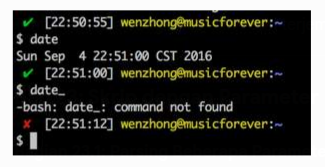

# Bab 1
## Memulai dengan Bash**

| Versi | Tanggal Rilis |
| :--- | :--- |
| 0.99 | 1989-06-08 |
| 1.01 | 1989-06-23 |
| 2.0 | 1996-12-31 |
| 2.02 | 1998-04-20 |
| 2.03 | 1999-02-19 |
| 2.04 | 2001-03-21 |
| 2.05b| 2002-07-17 |
| 3.0 | 2004-08-03 |
| 3.1 | 2005-12-08 |
| 3.2 | 2006-10-11 |
| 4.0 | 2009-02-20 |
| 4.1 | 2009-12-31 |
| 4.2 | 2011-02-13 |
| 4.3 | 2014-02-26 |
| 4.4 | 2016-09-15 |

### **Bagian 1.1: Hello World**

#### **Shell Interaktif**

*Shell* Bash biasanya digunakan secara interaktif: memungkinkan Anda memasukkan dan menyunting perintah, lalu mengeksekusinya saat Anda menekan tombol `Return`. Banyak sistem operasi berbasis Unix dan mirip Unix menggunakan Bash sebagai *shell default* mereka (terutama Linux dan macOS). Terminal secara otomatis memasuki proses *shell* Bash interaktif saat dimulai.

Keluarkan tulisan `Hello World` dengan mengetikkan yang berikut:

```bash
echo "Hello World"
#> Hello World # Contoh Keluaran
```

**Catatan**

  * Anda dapat mengubah *shell* hanya dengan mengetikkan nama *shell* di terminal. Contohnya: `sh`, `bash`, dll.
  * `echo` adalah perintah *built-in* Bash yang menulis argumen yang diterimanya ke keluaran standar. Secara *default*, `echo` menambahkan baris baru ke keluaran.

#### **Shell Non-Interaktif**

*Shell* Bash juga dapat dijalankan secara non-interaktif dari sebuah skrip, membuat *shell* tidak memerlukan interaksi manusia.

Perilaku interaktif dan perilaku skrip seharusnya identik – sebuah pertimbangan desain penting dari *shell* Bourne Unix V7 dan secara transitif juga Bash. Oleh karena itu, apa pun yang dapat dilakukan di baris perintah dapat dimasukkan ke dalam berkas skrip untuk digunakan kembali.

Ikuti langkah-langkah ini untuk membuat skrip Hello World:

1.  Buat berkas baru bernama `hello-world.sh`

    ```bash
    touch hello-world.sh
    ```

2.  Jadikan skrip dapat dieksekusi dengan menjalankan `chmod +x hello-world.sh`

3.  Tambahkan kode ini:

    ```bash
    #!/bin/bash
    echo "Hello World"
    ```

      * **Baris 1:** Baris pertama skrip harus dimulai dengan urutan karakter `#!`, yang disebut sebagai **shebang**¹. *Shebang* menginstruksikan sistem operasi untuk menjalankan `/bin/bash`, yaitu *shell* Bash, dengan memberikan path skrip sebagai argumennya.
        Contoh: `/bin/bash hello-world.sh`
      * **Baris 2:** Menggunakan perintah `echo` untuk menulis `Hello World` ke keluaran standar.

4.  Eksekusi skrip `hello-world.sh` dari baris perintah menggunakan salah satu cara berikut:

    ```bash
    ./hello-world.sh         # Paling umum digunakan, dan direkomendasikan
    /bin/bash hello-world.sh
    bash hello-world.sh      # Dengan asumsi /bin ada di dalam $PATH Anda
    sh hello-world.sh
    ```

Untuk penggunaan produksi nyata, Anda akan menghilangkan ekstensi `.sh` (yang sebenarnya menyesatkan, karena ini adalah skrip Bash, bukan skrip `sh`) dan mungkin memindahkan berkas tersebut ke direktori di dalam `PATH` Anda sehingga tersedia bagi Anda terlepas dari direktori kerja Anda saat ini, sama seperti perintah sistem seperti `cat` atau `ls`.

**Kesalahan umum meliputi:**

1.  Lupa memberikan izin eksekusi pada berkas, yaitu, `chmod +x hello-world.sh`, yang mengakibatkan keluaran `./hello-world.sh: Permission denied.`
2.  Menyunting skrip di Windows, yang menghasilkan karakter akhir baris yang salah yang tidak dapat ditangani oleh Bash. Gejala umumnya adalah `: command not found` di mana karakter *carriage return* telah memaksa kursor ke awal baris, menimpa teks sebelum titik dua dalam pesan kesalahan. Skrip dapat diperbaiki menggunakan program `dos2unix`.
    Contoh penggunaan: `dos2unix hello-world.sh`
    `dos2unix` akan menyunting berkas secara langsung.
3.  Menggunakan `sh ./hello-world.sh`, tanpa menyadari bahwa `bash` dan `sh` adalah *shell* yang berbeda dengan fitur yang berbeda (meskipun karena Bash kompatibel ke belakang, kesalahan sebaliknya tidak berbahaya).

Bagaimanapun, hanya mengandalkan baris *shebang* skrip jauh lebih baik daripada secara eksplisit menulis `bash` atau `sh` (atau `python` atau `perl` atau `awk` atau `ruby` atau...) sebelum nama berkas setiap skrip.

Baris *shebang* yang umum digunakan untuk membuat skrip Anda lebih portabel adalah dengan menggunakan `#!/usr/bin/env bash` alih-alih menuliskan path absolut ke Bash. Dengan cara itu, `/usr/bin/env` harus ada, tetapi setelah itu, `bash` hanya perlu berada di `PATH` Anda. Di banyak sistem, `/bin/bash` tidak ada, dan Anda harus menggunakan `/usr/local/bin/bash` atau path absolut lainnya; perubahan ini menghindari keharusan mencari tahu detailnya.

¹ *Juga disebut sebagai sha-bang, hashbang, pound-bang, hash-pling.*

### **Bagian 1.2: Hello World Menggunakan Variabel**

Buat berkas baru bernama `hello.sh` dengan konten berikut dan berikan izin eksekusi dengan `chmod +x hello.sh`.

Eksekusi/Jalankan melalui: `./hello.sh`

```bash
#!/usr/bin/env bash

# Perhatikan bahwa spasi tidak dapat digunakan di sekitar operator penugasan `=`
whom_variable="World"

# Gunakan printf untuk mengeluarkan data dengan aman
printf "Hello, %s\n" "$whom_variable"

#> Hello, World
```

Ini akan mencetak `Hello, World` ke keluaran standar saat dieksekusi.

Untuk memberitahu bash di mana skrip berada, Anda harus sangat spesifik, dengan menunjuk ke direktori yang memuatnya, biasanya dengan `./` jika itu adalah direktori kerja Anda, di mana `.` adalah alias untuk direktori saat ini. Jika Anda tidak menentukan direktori, bash mencoba mencari skrip di salah satu direktori yang terdapat dalam variabel lingkungan `$PATH`.

Kode berikut menerima argumen `$1`, yang merupakan argumen baris perintah pertama, dan mengeluarkannya dalam string yang diformat, setelah `Hello,`.

Eksekusi/Jalankan melalui: `./hello.sh World`

```bash
#!/usr/bin/env bash
printf "Hello, %s\n" "$1"

#> Hello, World
```

Penting untuk dicatat bahwa `$1` harus dikutip dalam **tanda kutip ganda**, bukan tanda kutip tunggal. `"$1"` akan diperluas menjadi argumen baris perintah pertama, seperti yang diinginkan, sementara `'$1'` dievaluasi sebagai string literal `$1`.

**Catatan Keamanan:**
Baca *Implikasi keamanan lupa mengutip variabel di shell bash* untuk memahami pentingnya menempatkan teks variabel di dalam tanda kutip ganda.

### **Bagian 1.3: Hello World dengan Masukan Pengguna (*User Input*)**

Berikut ini akan meminta masukan dari pengguna, dan kemudian menyimpan masukan tersebut sebagai string (teks) dalam sebuah variabel. Variabel tersebut kemudian digunakan untuk memberikan pesan kepada pengguna.

```bash
#!/usr/bin/env bash
echo "Siapa namamu?"
read name
echo "Halo, $name."
```

Perintah `read` di sini membaca satu baris data dari masukan standar ke dalam variabel `name`. Ini kemudian dirujuk menggunakan `$name` dan dicetak ke keluaran standar menggunakan `echo`.

Contoh keluaran:

```
$ ./hello_world.sh
Siapa namamu?
Matt
Halo, Matt.
```

Di sini pengguna memasukkan nama "Matt", dan kode ini digunakan untuk mengatakan `Halo, Matt.`.

Dan jika Anda ingin menambahkan sesuatu ke nilai variabel saat mencetaknya, gunakan kurung kurawal di sekitar nama variabel seperti yang ditunjukkan pada contoh berikut:

```bash
#!/usr/bin/env bash
echo "Apa yang sedang kamu lakukan?"
read action
echo "Kamu sedang ${action}."
```

Contoh keluaran:

```
$ ./hello_world.sh
Apa yang sedang kamu lakukan?
Tidur
Kamu sedang Tidur.
```

Di sini ketika pengguna memasukkan suatu tindakan, "ing" ditambahkan ke tindakan tersebut saat mencetak (dalam contoh ini, terjemahannya disesuaikan agar logis dalam Bahasa Indonesia).

### **Bagian 1.4: Pentingnya Tanda Kutip (*Quoting*) dalam String**

Tanda kutip penting untuk ekspansi string di bash. Dengan ini, Anda dapat mengontrol bagaimana bash mem-parsing dan memperluas string Anda.

Ada dua jenis tanda kutip:

  * **Lemah (*Weak*):** menggunakan tanda kutip ganda: `"`
  * **Kuat (*Strong*):** menggunakan tanda kutip tunggal: `'`

Jika Anda ingin bash memperluas argumen Anda, Anda dapat menggunakan **Tanda Kutip Lemah**:

```bash
#!/usr/bin/env bash
world="Dunia"
echo "Halo $world"
#> Halo Dunia
```

Jika Anda tidak ingin bash memperluas argumen Anda, Anda dapat menggunakan **Tanda Kutip Kuat**:

```bash
#!/usr/bin/env bash
world="Dunia"
echo 'Halo $world'
#> Halo $world
```

Anda juga dapat menggunakan karakter *escape* untuk mencegah ekspansi:

```bash
#!/usr/bin/env bash
world="Dunia"
echo "Halo \$world"
#> Halo $world
```

Untuk informasi lebih detail selain dari detail pemula, Anda dapat melanjutkan membacanya di sini.


### **Bagian 1.5: Melihat informasi untuk *built-in* Bash**

```bash
help <perintah>
```

Ini akan menampilkan halaman bantuan (manual) Bash untuk *built-in* yang ditentukan.

Sebagai contoh, `help unset` akan menampilkan:

```
unset: unset [-f] [-v] [-n] [name ...]
    Unset values and attributes of shell variables and functions.
    
    For each NAME, remove the corresponding variable or function.
    
    Options:
      -f        treat each NAME as a shell function
      -v        treat each NAME as a shell variable
      -n        treat each NAME as a name reference and unset the variable itself
                rather than the variable it references
    
    Without options, unset first tries to unset a variable, and if that fails,
    tries to unset a function.
    
    Some variables cannot be unset; also see `readonly'.
    
    Exit Status:
    Returns success unless an invalid option is given or a NAME is read-only.
```

Untuk melihat daftar semua *built-in* dengan deskripsi singkat, gunakan:

```bash
help -d
```

### **Bagian 1.6: Hello World dalam mode "Debug"**

```bash
$ cat hello.sh
#!/bin/bash
echo "Hello World"

$ bash -x hello.sh
+ echo Hello World
Hello World
```

Argumen `-x` memungkinkan Anda menelusuri setiap baris dalam skrip. Salah satu contoh yang baik ada di sini:

```bash
$ cat hello.sh
#!/bin/bash
echo "Hello World\n"
adding_string_to_number="s"
v=$(expr 5 + $adding_string_to_number)

$ ./hello.sh
Hello World

expr: non-integer argument
```

Kesalahan yang muncul di atas tidak cukup untuk melacak skrip; namun, menggunakan cara berikut memberi Anda pemahaman yang lebih baik di mana harus mencari kesalahan dalam skrip.

```bash
$ bash -x hello.sh
+ echo 'Hello World\n'
Hello World\n
+ adding_string_to_number=s
+ expr 5 + s
expr: non-integer argument
+ v=
```

### **Bagian 1.7: Menangani Argumen Bernama**

```bash
#!/bin/bash
deploy=false
uglify=false
while (( $# > 1 )); do case $1 in
    --deploy) deploy="$2";;
    --uglify) uglify="$2";;
    *) break;
esac; shift 2
done

$deploy && echo "akan mendeploy... deploy = $deploy"
$uglify && echo "akan meng-uglify... uglify = $uglify"

# cara menjalankan
# chmod +x script.sh
# ./script.sh --deploy true --uglify false
```

---

# Bab 2
## *Shebang* pada Skrip**

### **Bagian 2.1: *Shebang* Env**

Untuk mengeksekusi berkas skrip dengan *executable* `bash` yang ditemukan di variabel lingkungan `PATH` menggunakan *executable* `env`, baris pertama dari berkas skrip harus menunjukkan path absolut ke *executable* `env` dengan argumen `bash`:

```bash
#!/usr/bin/env bash
```

Path `env` dalam *shebang* akan diresolusi dan digunakan hanya jika skrip diluncurkan secara langsung seperti ini:

```bash
script.sh
```

Skrip tersebut harus memiliki izin eksekusi.

*Shebang* akan diabaikan ketika interpreter `bash` secara eksplisit ditunjukkan untuk mengeksekusi sebuah skrip:

```bash
bash script.sh
```

### **Bagian 2.2: *Shebang* Langsung**

Untuk mengeksekusi berkas skrip dengan interpreter `bash`, baris pertama dari berkas skrip harus menunjukkan path absolut ke *executable* `bash` yang akan digunakan:

```bash
#!/bin/bash
```

Path `bash` dalam *shebang* akan diresolusi dan digunakan hanya jika skrip diluncurkan secara langsung seperti ini:

```bash
./script.sh
```

Skrip tersebut harus memiliki izin eksekusi.

*Shebang* akan diabaikan ketika interpreter `bash` secara eksplisit ditunjukkan untuk mengeksekusi sebuah skrip:

```bash
bash script.sh
```
### **Bagian 2.3: *Shebang* Lainnya**

Ada dua jenis program yang dikenali oleh kernel. Program **biner** diidentifikasi oleh *header* **ELF** (*Extensible Loadable Format*), yang biasanya dihasilkan oleh sebuah kompilator. Yang kedua adalah **skrip** dari berbagai jenis.

Jika sebuah berkas dimulai pada baris paling pertama dengan urutan `#!`, maka string berikutnya harus merupakan *pathname* dari sebuah interpreter. Jika kernel membaca baris ini, ia akan memanggil interpreter yang disebutkan oleh *pathname* tersebut dan memberikan semua kata berikutnya di baris ini sebagai argumen kepada interpreter. Jika tidak ada berkas bernama "something" atau "wrong":

```bash
#!/bin/bash something wrong
echo "Baris ini tidak akan pernah tercetak"
```

`bash` akan mencoba mengeksekusi argumennya `"something wrong"` yang tidak ada. Nama berkas skrip juga akan ditambahkan. Untuk melihat ini dengan jelas, gunakan *shebang* `echo`:

```bash
#"/bin/echo something wrong
```

```bash
# dan sekarang panggil skrip ini yang bernama "thisscript" seperti ini:
# thisscript one two

# keluarannya akan menjadi:
something wrong ./thisscript one two
```

Beberapa program seperti `awk` menggunakan teknik ini untuk menjalankan skrip yang lebih panjang yang berada di dalam sebuah berkas di disk.

---

# Bab 3
## Menavigasi direktori

### Bagian 3.1: Direktori absolut vs relatif

Untuk berpindah ke direktori yang ditentukan secara absolut, gunakan nama lengkapnya, dimulai dengan garis miring `/`, seperti ini:

```bash
cd /home/username/project/abc
```

Jika Anda ingin berpindah ke direktori yang dekat dengan direktori Anda saat ini, Anda dapat menentukan lokasi relatif. Sebagai contoh, jika Anda sudah berada di `/home/username/project`, Anda dapat masuk ke subdirektori `abc` seperti ini:

```bash
cd abc
```

Jika Anda ingin pergi ke direktori di atas direktori saat ini, Anda dapat menggunakan alias `..`. Sebagai contoh, jika Anda berada di `/home/username/project/abc` dan ingin pergi ke `/home/username/project`, maka Anda akan melakukan hal berikut:

```bash
cd ..
```

Ini juga bisa disebut "naik" satu direktori.

### Bagian 3.2: Berpindah ke direktori terakhir

Untuk shell saat ini, perintah ini akan membawa Anda ke direktori sebelumnya tempat Anda berada, di mana pun itu.

```bash
cd -
```

Melakukannya beberapa kali secara efektif akan "beralih" antara direktori saat ini dan direktori sebelumnya.

### Bagian 3.3: Berpindah ke direktori home

Direktori default adalah direktori home (`$HOME`, biasanya `/home/username`), jadi `cd` tanpa direktori apa pun akan membawa Anda ke sana.

```bash
cd
```

Atau Anda bisa lebih eksplisit:

```bash
cd $HOME
```

Pintasan untuk direktori home adalah `~`, jadi itu juga bisa digunakan.

```bash
cd ~
```

### Bagian 3.4: Berpindah ke Direktori Skrip

Secara umum, ada dua jenis skrip Bash:

1.  Alat sistem yang beroperasi dari direktori kerja saat ini.
2.  Alat proyek yang memodifikasi file relatif terhadap lokasi mereka sendiri di sistem file.

Untuk jenis skrip kedua, akan sangat berguna untuk berpindah ke direktori tempat skrip disimpan. Ini dapat dilakukan dengan perintah berikut:

```bash
cd "$(dirname "$(readlink -f "$0")")"
```

Perintah ini menjalankan 3 perintah:

1.  `readlink -f "$0"` menentukan path ke skrip saat ini (`$0`).
2.  `dirname` mengubah path ke skrip menjadi path ke direktorinya.
3.  `cd` mengubah direktori kerja saat ini ke direktori yang diterimanya dari `dirname`.

---

# Bab 4
## Mendaftar File

| Opsi | Deskripsi |
| :--- | :--- |
| `-a`, `--all` | Mendaftar semua entri termasuk yang dimulai dengan titik |
| `-A`, `--almost-all`| Mendaftar semua entri kecuali `.` dan `..` |
| `-c` | Urutkan file berdasarkan waktu perubahan |
| `-d`, `--directory` | Mendaftar entri direktori |
| `-h`, `--human-readable` | Tampilkan ukuran dalam format yang mudah dibaca manusia (yaitu K, M) |
| `-H` | Sama seperti di atas hanya dengan pangkat 1000 bukan 1024 |
| `-l` | Tampilkan konten dalam format daftar panjang |
| `-o` | Format daftar panjang tanpa info grup |
| `-r`, `--reverse` | Tampilkan konten dalam urutan terbalik |
| `-s`, `--size` | Cetak ukuran setiap file dalam blok |
| `-S` | Urutkan berdasarkan ukuran file |
| `--sort=WORD` | Urutkan konten berdasarkan kata. (yaitu size, version, status) |
| `-t` | Urutkan berdasarkan waktu modifikasi |
| `-u` | Urutkan berdasarkan waktu akses terakhir |
| `-v` | Urutkan berdasarkan versi |
| `-1` | Daftar satu file per baris |

### Bagian 4.1: Mendaftar File dalam Format Daftar Panjang

Opsi `-l` pada perintah `ls` mencetak konten direktori yang ditentukan dalam format daftar panjang. Jika tidak ada direktori yang ditentukan, maka secara default, konten dari direktori saat ini akan didaftar.

```bash
ls -l /etc
```

Contoh Output:

```
total 1204
drwxr-xr-x   3 root root  4096 Apr 21 03:44 acpi
-rw-r--r--   1 root root  3028 Apr 21 03:38 adduser.conf
drwxr-xr-x   2 root root  4096 Jun 11 20:42 alternatives
...
```

Output pertama menampilkan `total`, yang menunjukkan ukuran total dalam blok dari semua file di direktori yang didaftar. Kemudian menampilkan delapan kolom informasi untuk setiap file di direktori yang didaftar. Di bawah ini adalah rincian untuk setiap kolom dalam output:

| No. Kolom | Contoh | Deskripsi |
| :--- | :--- | :--- |
| 1.1 | `d` | Tipe file (lihat tabel di bawah) |
| 1.2 | `rwxr-xr-x` | String izin akses |
| 2 | `3` | Jumlah hard link |
| 3 | `root` | Nama pemilik |
| 4 | `root` | Grup pemilik |
| 5 | `4096` | Ukuran file dalam byte |
| 6 | `Apr 21 03:44` | Waktu modifikasi |
| 7 | `acpi` | Nama file |

**Tipe File**

Tipe file bisa berupa salah satu dari karakter berikut.

| Karakter | Tipe File |
| :--- | :--- |
| `-` | File biasa |
| `b` | File spesial blok |
| `c` | File spesial karakter |
| `C` | File performa tinggi ("contiguous data") |
| `d` | Direktori |
| `D` | Door (file IPC khusus di Solaris 2.5+ saja) |
| `l` | Symbolic link |
| `M` | File off-line ("migrated") (Cray DMF) |
| `n` | File spesial jaringan (HP-UX) |
| `p` | FIFO (pipe bernama) |
| `P` | Port (file sistem khusus di Solaris 10+ saja) |
| `s` | Socket |
| `?` | Tipe file lainnya |

### Bagian 4.2: Mendaftar Sepuluh File yang Terakhir Dimodifikasi

Perintah berikut akan mendaftar hingga sepuluh file yang paling baru dimodifikasi di direktori saat ini, menggunakan format daftar panjang (`-l`) dan diurutkan berdasarkan waktu (`-t`).

```bash
ls -lt | head
```

### Bagian 4.3: Mendaftar Semua File Termasuk Dotfile

*Dotfile* adalah file yang namanya dimulai dengan `.`. File-file ini biasanya disembunyikan oleh `ls` dan tidak akan didaftar kecuali diminta.

Sebagai contoh, output `ls` berikut:

```bash
$ ls
bin pki
```

Opsi `-a` atau `--all` akan mendaftar semua file, termasuk *dotfile*.

```bash
$ ls -a
.               .bash_logout     .lesshst
..              .bash_profile    pki
.ansible        .bashrc          .puppetlabs
.bash_history   bin              .ssh
                                 .viminfo
```

Opsi `-A` atau `--almost-all` akan mendaftar semua file, termasuk *dotfile*, tetapi tidak mendaftar `.` dan `..` yang tersirat. Perhatikan bahwa `.` adalah direktori saat ini dan `..` adalah direktori induk.

```bash
$ ls -A
.ansible        .bashrc          pki
.bash_history   bin              .puppetlabs
.bash_logout    .lesshst         .ssh
.bash_profile                    .viminfo
```

### Bagian 4.4: Mendaftar File Tanpa Menggunakan `ls`

Gunakan kemampuan ekspansi nama file dan ekspansi kurung kurawal dari shell Bash untuk mendapatkan nama file:

```bash
# menampilkan file dan direktori yang ada di direktori saat ini
printf "%s\n" *

# menampilkan hanya direktori di direktori saat ini
printf "%s\n" */

# menampilkan hanya (beberapa) file gambar
printf "%s\n" *.{gif,jpg,png}
```

Untuk menangkap daftar file ke dalam sebuah variabel untuk diproses, biasanya merupakan praktik yang baik untuk menggunakan array bash:

```bash
files=( * )

# melakukan iterasi pada mereka
for file in "${files[@]}"; do
  echo "$file"
done
```

### Bagian 4.5: Mendaftar File

Perintah `ls` mendaftar konten dari direktori yang ditentukan, tidak termasuk *dotfile*. Jika tidak ada direktori yang ditentukan, maka secara default, konten dari direktori saat ini akan didaftar.

File yang didaftar diurutkan secara abjad, secara default, dan disejajarkan dalam kolom jika tidak muat dalam satu baris.

```bash
$ ls
apt          Documents    Fonts    Pictures       Public      Videos
configs      eclipse      git      Programming    Templates   workspace
bin          Desktop      Music
```

### Bagian 4.6: Mendaftar File dalam Format seperti Pohon

Perintah `tree` mendaftar konten dari direktori yang ditentukan dalam format seperti pohon. Jika tidak ada direktori yang ditentukan, maka secara default, konten dari direktori saat ini akan didaftar.

Contoh Output:

```bash
$ tree /tmp
/tmp
├── 5037
├── adb.log
└── evince-20965
    └── image.FPWTJY.png
```

Gunakan opsi `-L` dari perintah `tree` untuk membatasi kedalaman tampilan dan opsi `-d` untuk hanya mendaftar direktori.

Contoh Output:

```bash
$ tree -L 1 -d /tmp
/tmp
└── evince-20965
```

### Bagian 4.7: Mendaftar File Diurutkan Berdasarkan Ukuran

Opsi `-S` pada perintah `ls` mengurutkan file dalam urutan menurun berdasarkan ukuran file.

```bash
$ ls -l -S ./Fruits
total 444
-rw-rw-rw- 1 root root 295303 Jul 28 19:19 apples.jpg
-rw-rw-rw- 1 root root 102283 Jul 28 19:19 kiwis.jpg
-rw-rw-rw- 1 root root  50197 Jul 28 19:19 bananas.jpg
```

Ketika digunakan dengan opsi `-r`, urutan pengurutan dibalik.

```bash
$ ls -l -S -r /Fruits
total 444
-rw-rw-rw- 1 root root  50197 Jul 28 19:19 bananas.jpg
-rw-rw-rw- 1 root root 102283 Jul 28 19:19 kiwis.jpg
-rw-rw-rw- 1 root root 295303 Jul 28 19:19 apples.jpg
```

---

# Bab 5
## Menggunakan cat

| Opsi | Detail |
| :--- | :--- |
| `-n` | Cetak nomor baris |
| `-v` | Tampilkan karakter non-cetak menggunakan notasi `^` dan `M-` kecuali LFD dan TAB |
| `-T` | Tampilkan karakter TAB sebagai `^I` |
| `-E` | Tampilkan karakter baris baru (LF) sebagai `$` |
| `-e` | Sama dengan `-vE` |
| `-b` | Beri nomor pada baris output yang tidak kosong, menimpa `-n` |
| `-A` | Setara dengan `-vET` |
| `-s` | Hilangkan baris output kosong yang berulang, `s` merujuk pada *squeeze* |

### Bagian 5.1: Menggabungkan file

Ini adalah tujuan utama dari `cat`.

```bash
cat file1 file2 file3 > file_all
```

`cat` juga dapat digunakan dengan cara yang sama untuk menggabungkan file sebagai bagian dari sebuah *pipeline*, contohnya:

```bash
cat file1 file2 file3 | grep foo
```

### Bagian 5.2: Mencetak Isi File

```bash
cat file.txt
```

perintah di atas akan mencetak isi dari sebuah file.

Jika file berisi karakter non-ASCII, Anda dapat menampilkan karakter tersebut secara simbolis dengan `cat -v`. Ini bisa sangat berguna untuk situasi di mana karakter kontrol tidak akan terlihat.

```bash
cat -v unicode.txt
```

Namun, sangat sering, untuk penggunaan interaktif, Anda lebih baik menggunakan *pager* interaktif seperti `less` atau `more`. (`less` jauh lebih kuat daripada `more` dan disarankan untuk lebih sering menggunakan `less` daripada `more`.)

```bash
less file.txt
```

Untuk meneruskan isi file sebagai input ke sebuah perintah, pendekatan yang biasanya dianggap lebih baik (UUOC - *Useless Use of Cat*) adalah dengan menggunakan pengalihan (*redirection*).

```bash
tr A-Z a-z <file.txt
# sebagai alternatif dari cat file.txt | tr A-Z a-z
```

Jika konten perlu didaftar secara terbalik dari akhir, perintah `tac` dapat digunakan:

```bash
tac file.txt
```

Jika Anda ingin mencetak konten dengan nomor baris, maka gunakan `-n` dengan `cat`:

```bash
cat -n file.txt
```

Untuk menampilkan isi file dalam bentuk byte-demi-byte yang sama sekali tidak ambigu, *hex dump* adalah solusi standar. Ini bagus untuk cuplikan file yang sangat singkat, seperti ketika Anda tidak tahu pengkodean pastinya. Utilitas *hex dump* standar adalah `od -cH`, meskipun representasinya sedikit merepotkan; pengganti umum termasuk `xxd` dan `hexdump`.

```bash
$ printf 'Hëllö wörld' | xxd
0000000: 48c3 ab6c 6cc3 b620 77c3 b672 6c64  H..ll.. w..rld
```

### Bagian 5.3: Menulis ke sebuah file

```bash
cat >file
```

Perintah ini akan memungkinkan Anda menulis teks di terminal yang akan disimpan dalam file bernama `file`.

```bash
cat >>file
```

akan melakukan hal yang sama, kecuali itu akan menambahkan teks ke akhir file.

**N.B:** Tekan `Ctrl+D` untuk mengakhiri penulisan teks di terminal (Linux)

Sebuah *here document* dapat digunakan untuk menyisipkan konten file secara langsung ke dalam baris perintah atau skrip:

```bash
cat <<END >file
Hello, World.
END
```

Token setelah simbol pengalihan `<<` adalah string arbitrer yang harus muncul sendirian di satu baris (tanpa spasi di awal atau akhir) untuk menunjukkan akhir dari *here document*. Anda dapat menambahkan tanda kutip untuk mencegah shell melakukan substitusi perintah dan interpolasi variabel:

```bash
cat <<'fnord'
Nothing in `here` will be $changed
fnord
```

(Tanpa tanda kutip, `here` akan dieksekusi sebagai perintah, dan `$changed` akan diganti dengan nilai dari variabel `changed` -- atau tidak ada apa-apa, jika tidak terdefinisi.)

### Bagian 5.4: Menampilkan karakter yang tidak dapat dicetak

Ini berguna untuk melihat apakah ada karakter yang tidak dapat dicetak, atau karakter non-ASCII.
Misalnya, jika Anda menyalin-tempel kode dari web, Anda mungkin memiliki tanda kutip seperti `”` bukan standar `"`.

```bash
$ cat -v file.txt
$ cat -vE file.txt # Berguna dalam mendeteksi spasi di akhir baris.
```

Contoh:

```bash
$ echo '”
' | cat -vE # echo | akan digantikan oleh file sebenarnya.
M-bM-^@M-^]$
$
```

Anda mungkin juga ingin menggunakan `cat -A` (A untuk *All*) yang setara dengan `cat -vET`. Ini akan menampilkan karakter TAB (ditampilkan sebagai `^I`), karakter yang tidak dapat dicetak, dan akhir dari setiap baris:

```bash
$ echo '” `' | cat -A
M-bM-^@M-^]^I`$
```

### Bagian 5.5: Membaca dari input standar

```bash
cat < file.txt
```

Outputnya sama dengan `cat file.txt`, tetapi perintah ini membaca konten file dari input standar alih-alih langsung dari file.

```bash
printf "first line\nSecond line\n" | cat -n
```

Perintah `echo` sebelum `|` menghasilkan dua baris. Perintah `cat` bertindak pada output tersebut untuk menambahkan nomor baris.

### Bagian 5.6: Menampilkan nomor baris dengan output

Gunakan flag `--number` untuk mencetak nomor baris sebelum setiap baris. Sebagai alternatif, `-n` melakukan hal yang sama.

```bash
$ cat --number file
     1  line 1
     2  line 2
     3
     4  line 4
     5  line 5
```

Untuk melewati baris kosong saat menghitung baris, gunakan `--number-nonblank`, atau cukup `-b`.

```bash
$ cat -b file
     1  line 1
     2  line 2

     3  line 4
     4  line 5
```

### Bagian 5.7: Menggabungkan file yang di-gzip

File yang dikompresi oleh `gzip` dapat langsung digabungkan menjadi file `gzip` yang lebih besar.

```bash
cat file1.gz file2.gz file3.gz > combined.gz
```

Ini adalah properti `gzip` yang kurang efisien daripada menggabungkan file input dan kemudian melakukan `gzip` pada hasilnya:

```bash
cat file1 file2 file3 | gzip > combined.gz
```

Sebuah demonstrasi lengkap:

```bash
echo 'Hello world!' > hello.txt
echo 'Howdy world!' > howdy.txt
gzip hello.txt
gzip howdy.txt
cat hello.txt.gz howdy.txt.gz > greetings.txt.gz
gunzip greetings.txt.gz
cat greetings.txt
```

Yang menghasilkan:

```
Hello world!
Howdy world!
```

Perhatikan bahwa `greetings.txt.gz` adalah satu file tunggal dan didekompresi sebagai satu file tunggal `greetings.txt`. Bandingkan ini dengan `tar -czf hello.txt howdy.txt > greetings.tar.gz`, yang menjaga file-file tetap terpisah di dalam *tarball*.

---

# Bab 6
## Grep

### Bagian 6.1: Cara mencari pola dalam file

Untuk menemukan kata `foo` di dalam file `bar`:

```bash
grep foo ~/Desktop/bar
```

Untuk menemukan semua baris yang tidak mengandung `foo` di dalam file `bar`:

```bash
grep –v foo ~/Desktop/bar
```

Untuk menemukan semua kata yang mengandung `foo` di akhirnya (Ekspansi Wildcard):

```bash
grep "*foo" ~/Desktop/bar
```

---

# Bab 7
## Aliasing

Alias shell adalah cara sederhana untuk membuat perintah baru atau untuk membungkus perintah yang sudah ada dengan kode Anda sendiri. Mereka agak tumpang tindih dengan fungsi shell, yang bagaimanapun lebih serbaguna dan oleh karena itu seringkali lebih disukai.

### Bagian 7.1: Melewati sebuah alias

Terkadang Anda mungkin ingin melewati sebuah alias untuk sementara, tanpa menonaktifkannya. Untuk bekerja dengan contoh konkret, pertimbangkan alias ini:

```bash
alias ls='ls --color=auto'
```

Dan katakanlah Anda ingin menggunakan perintah `ls` tanpa menonaktifkan alias. Anda memiliki beberapa opsi:

  * Gunakan `builtin` `command`: `command ls`
  * Gunakan path lengkap dari perintah: `/bin/ls`
  * Tambahkan `\` di mana saja dalam nama perintah, misalnya: `\ls`, atau `l\s`
  * Beri tanda kutip pada perintah: `"ls"` atau `'ls'`

### Bagian 7.2: Membuat Alias

```bash
alias kata='perintah'
```

Memanggil `kata` akan menjalankan `perintah`. Argumen apa pun yang diberikan ke alias hanya ditambahkan ke target alias:

```bash
alias myAlias='some command --with --options'
myAlias foo bar baz
```

Shell kemudian akan mengeksekusi:

```bash
some command --with --options foo bar baz
```

Untuk menyertakan beberapa perintah dalam alias yang sama, Anda dapat merangkainya bersama dengan `&&`. Sebagai contoh:

```bash
alias print_things='echo "foo" && echo "bar" && echo "baz"'
```

### Bagian 7.3: Menghapus sebuah alias

Untuk menghapus alias yang ada, gunakan:

```bash
unalias {nama_alias}
```

Contoh:

```bash
# membuat sebuah alias
$ alias now='date'

# melihat pratinjau alias
$ now
Thu Jul 21 17:11:25 CEST 2016

# menghapus alias
$ unalias now

# tes jika sudah terhapus
$ now
-bash: now: command not found
```

### Bagian 7.4: BASH\_ALIASES adalah array asosiatif internal bash

Alias adalah pintasan bernama dari perintah, yang dapat didefinisikan dan digunakan dalam instance bash interaktif. Mereka disimpan dalam array asosiatif bernama `BASH_ALIASES`. Untuk menggunakan variabel ini dalam skrip, skrip tersebut harus dijalankan di dalam shell interaktif.

```bash
#!/bin/bash -li
# perhatikan -li di atas! -l membuatnya berperilaku seperti login shell
# -i membuatnya berperilaku seperti shell interaktif
#
# shopt -s expand_aliases tidak akan berfungsi dalam banyak kasus

echo Ada ${#BASH_ALIASES[*]} alias yang didefinisikan.

for ali in "${!BASH_ALIASES[@]}"; do
    printf "alias: %-10s memicu: %s\n" "$ali" "${BASH_ALIASES[$ali]}"
done
```

### Bagian 7.5: Memperluas alias

Dengan asumsi bahwa `bar` adalah alias untuk `someCommand -flag1`.

Ketik `bar` di baris perintah lalu tekan `Ctrl` + `alt` + `e`.

Anda akan mendapatkan `someCommand -flag1` di tempat `bar` berada.

### Bagian 7.6: Mendaftar semua Alias

```bash
alias -p
```

akan mendaftar semua alias saat ini.

---

# Bab 8
## Jobs dan Proses

### Bagian 8.1: Penanganan job

**Membuat jobs**

Untuk membuat sebuah *job*, cukup tambahkan satu `&` setelah perintah:

```bash
$ sleep 10 &
[1] 20024
```

Anda juga dapat membuat proses yang sedang berjalan menjadi sebuah *job* dengan menekan `Ctrl + z`:

```bash
$ sleep 10
^Z
[1]+  Dihentikan              sleep 10
```

**Memindahkan proses ke background dan foreground**

Untuk membawa Proses ke *foreground*, perintah `fg` digunakan bersama dengan `%`.

```bash
$ sleep 10 &
[1] 20024
$ fg %1
sleep 10
```

Sekarang Anda dapat berinteraksi dengan proses tersebut. Untuk membawanya kembali ke *background*, Anda dapat menggunakan perintah `bg`. Karena sesi terminal yang sedang digunakan, Anda perlu menghentikan proses terlebih dahulu dengan menekan `Ctrl + z`.

```bash
$ sleep 10
^Z
[1]+  Dihentikan              sleep 10
$ bg %1
[1]+  sleep 10 &
```

Karena kemalasan beberapa Programmer, semua perintah ini juga berfungsi dengan satu `%` jika hanya ada satu proses, atau untuk proses pertama dalam daftar. Contohnya:

```bash
$ sleep 10 &
[1] 20024
$ fg %
sleep 10
# untuk membawa proses ke foreground, 'fg %' juga berfungsi.
```

atau cukup

```bash
$ %
sleep 10
# kemalasan tidak mengenal batas, '%' juga berfungsi.
```

Selain itu, hanya mengetik `fg` atau `bg` tanpa argumen apa pun akan menangani *job* terakhir:

```bash
$ sleep 20 &
$ sleep 10 &
$ fg
sleep 10
^C
$ fg
sleep 20
```

**Menghentikan jobs yang sedang berjalan**

```bash
$ sleep 10 &
[1] 20024
$ kill %1
[1]+  Terminated              sleep 10
```

Proses `sleep` berjalan di *background* dengan id proses (pid) `20024` dan nomor *job* `1`. Untuk merujuk ke proses tersebut, Anda dapat menggunakan pid atau nomor *job*. Jika Anda menggunakan nomor *job*, Anda harus mengawalinya dengan `%`. Sinyal *kill* default yang dikirim oleh `kill` adalah `SIGTERM`, yang memungkinkan proses target untuk keluar secara baik-baik.

Beberapa sinyal *kill* yang umum ditunjukkan di bawah ini. Untuk melihat daftar lengkap, jalankan `kill -l`.

| Nama Sinyal | Nilai Sinyal | Efek |
| :--- | :--- | :--- |
| `SIGHUP` | 1 | Hangup |
| `SIGINT` | 2 | Interupsi dari keyboard |
| `SIGKILL` | 9 | Sinyal Kill (paksa berhenti) |
| `SIGTERM` | 15 | Sinyal Terminasi |

**Memulai dan menghentikan proses spesifik**

Mungkin cara termudah untuk menghentikan proses yang sedang berjalan adalah dengan memilihnya melalui nama proses seperti pada contoh berikut menggunakan perintah `pkill`:

```bash
pkill -f test.py
```

(atau) cara yang lebih aman menggunakan `pgrep` untuk mencari id-proses yang sebenarnya

```bash
kill $(pgrep -f 'python test.py')
```

Hasil yang sama dapat diperoleh dengan menggunakan `grep` pada `ps -ef | grep nama_proses` lalu menghentikan proses yang terkait dengan pid (id proses) yang dihasilkan. Memilih proses menggunakan namanya nyaman di lingkungan pengujian tetapi bisa sangat berbahaya ketika skrip digunakan di produksi: hampir tidak mungkin untuk memastikan bahwa nama tersebut akan cocok dengan proses yang sebenarnya ingin Anda hentikan. Dalam kasus tersebut, pendekatan berikut sebenarnya jauh lebih aman.

Mulai skrip yang pada akhirnya akan dihentikan dengan pendekatan berikut. Mari kita asumsikan bahwa perintah yang ingin Anda eksekusi dan akhirnya hentikan adalah `python test.py`.

```bash
#!/bin/bash
if [[ ! -e /tmp/test.py.pid ]]; then
    # Periksa apakah file sudah ada
    python test.py &
    #+dan jika ya, jangan jalankan proses lain.
    echo $! > /tmp/test.py.pid
else
    echo -n "ERROR: Proses sudah berjalan dengan pid "
    cat /tmp/test.py.pid
    echo
fi
```

Ini akan membuat file di direktori `/tmp` yang berisi pid dari proses `python test.py`. Jika file sudah ada, kita berasumsi bahwa perintah sudah berjalan dan skrip mengembalikan kesalahan.

Kemudian, ketika Anda ingin menghentikannya, gunakan skrip berikut:

```bash
#!/bin/bash
if [[ -e /tmp/test.py.pid ]]; then
    kill `cat /tmp/test.py.pid`
    rm /tmp/test.py.pid
else
    echo "test.py tidak berjalan"
fi
# Jika file tidak ada, maka proses
#+tidak berjalan. Tidak ada gunanya
#+mencoba menghentikannya.
```

Ini akan menghentikan persis proses yang terkait dengan perintah Anda, tanpa bergantung pada informasi yang mudah berubah (seperti string yang digunakan untuk menjalankan perintah). Bahkan dalam kasus ini jika file tidak ada, skrip mengasumsikan bahwa Anda ingin menghentikan proses yang tidak berjalan.

Contoh terakhir ini dapat dengan mudah ditingkatkan untuk menjalankan perintah yang sama beberapa kali (menambahkan ke file pid alih-alih menimpanya, misalnya) dan untuk mengelola kasus di mana proses mati sebelum dihentikan.

### Bagian 8.2: Memeriksa proses mana yang berjalan di port spesifik

Untuk memeriksa proses mana yang berjalan di port `8080`:

```bash
lsof -i :8080
```

### Bagian 8.3: Melepaskan job background

```bash
$ gzip extremelylargefile.txt &
$ bg
$ disown %1
```

Ini memungkinkan proses yang berjalan lama untuk terus berlanjut setelah shell Anda (terminal, ssh, dll) ditutup.

### Bagian 8.4: Mendaftar Jobs Saat Ini

```bash
$ tail -f /var/log/syslog > log.txt
^Z
[1]+  Dihentikan              tail -f /var/log/syslog > log.txt
$ sleep 10 &
$ jobs
[1]+  Dihentikan              tail -f /var/log/syslog > log.txt
[2]-  Berjalan                sleep 10 &
```

### Bagian 8.5: Menemukan informasi tentang proses yang berjalan

`ps aux | grep <istilah-pencarian>` menunjukkan proses yang cocok dengan istilah pencarian.

Contoh:

```
root@server7:~# ps aux | grep nginx
root      315  0.0  0.3 144392  1020 ?        Ss   May28   0:00 nginx: master process /usr/sbin/nginx
www-data 5647  0.0  1.1 145124  3048 ?        S    Jul18   2:53 nginx: worker process
www-data 5648  0.0  0.1 144392   376 ?        S    Jul18   0:00 nginx: cache manager process
root     13134 0.0  0.3   4960   920 pts/0    S+   14:33   0:00 grep --color=auto nginx
root@server7:~#
```

Di sini, kolom kedua adalah id proses. Misalnya, jika Anda ingin menghentikan proses nginx, Anda dapat menggunakan perintah `kill 5647`. Selalu disarankan untuk menggunakan perintah `kill` dengan `SIGTERM` daripada `SIGKILL`.

### Bagian 8.6: Mendaftar semua proses

Ada dua cara umum untuk mendaftar semua proses pada sistem. Keduanya mendaftar semua proses yang berjalan oleh semua pengguna, meskipun keduanya berbeda dalam format outputnya (alasan perbedaannya bersifat historis).

```bash
ps -ef    # mendaftar semua proses
ps aux    # mendaftar semua proses dalam format alternatif (BSD)
```

Ini dapat digunakan untuk memeriksa apakah aplikasi tertentu sedang berjalan. Misalnya, untuk memeriksa apakah server SSH (`sshd`) sedang berjalan:

```bash
ps -ef | grep sshd
```
---

# Bab 9
## Pengalihan (Redirection)

| Parameter | Detail |
| :--- | :--- |
| deskriptor file internal | Sebuah integer. |
| arah | Salah satu dari `>`, `<`, atau `<>`. |
| deskriptor file eksternal atau path | `&` diikuti oleh integer untuk deskriptor file atau sebuah path. |

### Bagian 9.1: Mengalihkan output standar

`>` mengalihkan output standar (alias STDOUT) dari perintah saat ini ke dalam file atau deskriptor lain.

Contoh-contoh ini menulis output dari perintah `ls` ke dalam file `file.txt`.

```bash
ls >file.txt
> file.txt ls
```

File target dibuat jika belum ada, jika tidak, isi file ini akan dipotong (*truncated*).

Deskriptor pengalihan default adalah output standar atau `1` ketika tidak ada yang ditentukan. Perintah ini setara dengan contoh sebelumnya dengan output standar yang ditunjukkan secara eksplisit:

```bash
ls 1>file.txt
```

Catatan: pengalihan diinisialisasi oleh shell yang dieksekusi dan bukan oleh perintah yang dieksekusi, oleh karena itu hal ini dilakukan sebelum eksekusi perintah.

### Bagian 9.2: Menambahkan (Append) vs Memotong (Truncate)

**Memotong `>`**

1.  Buat file yang ditentukan jika tidak ada.
2.  Potong (hapus konten file).
3.  Tulis ke file.

<!-- end list -->

```bash
$ echo "first line" > /tmp/lines
$ echo "second line" > /tmp/lines
$ cat /tmp/lines
second line
```

**Menambahkan `>>`**

1.  Buat file yang ditentukan jika tidak ada.
2.  Tambahkan ke file (menulis di akhir file).

<!-- end list -->

```bash
# Timpa file yang ada
$ echo "first line" > /tmp/lines
# Tambahkan baris kedua
$ echo "second line" >> /tmp/lines
$ cat /tmp/lines
first line
second line
```

### Bagian 9.3: Mengalihkan STDOUT dan STDERR sekaligus

Deskriptor file seperti `0` dan `1` adalah pointer. Kita mengubah ke mana deskriptor file menunjuk dengan pengalihan. `>/dev/null` berarti `1` menunjuk ke `/dev/null`.

Pertama kita arahkan `1` (STDOUT) ke `/dev/null` lalu arahkan `2` (STDERR) ke mana pun `1` menunjuk.

```bash
# STDERR dialihkan ke STDOUT: yang dialihkan ke /dev/null,
# secara efektif mengalihkan baik STDERR maupun STDOUT ke /dev/null
echo 'hello' > /dev/null 2>&1
```

**Versi ≥ 4.0**

Ini dapat dipersingkat lebih lanjut menjadi berikut:

```bash
echo 'hello' &> /dev/null
```

Namun, bentuk ini mungkin tidak diinginkan dalam produksi jika kompatibilitas shell menjadi perhatian karena bertentangan dengan POSIX, menimbulkan ambiguitas parsing, dan shell tanpa fitur ini akan salah menafsirkannya:

```bash
# Kode aktual
echo 'hello' &> /dev/null
echo 'hello' &> /dev/null 'goodbye'

# Perilaku yang diinginkan
echo 'hello' > /dev/null 2>&1
echo 'hello' 'goodbye' > /dev/null 2>&1

# Perilaku aktual
echo 'hello' &
echo 'hello' & goodbye > /dev/null
```

CATATAN: `&>` diketahui berfungsi seperti yang diinginkan di Bash dan Zsh.

### Bagian 9.4: Menggunakan pipe bernama

Terkadang Anda mungkin ingin mengeluarkan sesuatu oleh satu program dan memasukkannya ke program lain, tetapi tidak dapat menggunakan *pipe* standar.

```bash
ls -l | grep ".log"
```

Anda bisa saja menulis ke file sementara:

```bash
touch tempFile.txt
ls -l > tempFile.txt
grep ".log" < tempFile.txt
```

Ini berfungsi dengan baik untuk sebagian besar aplikasi, namun, tidak ada yang akan tahu apa fungsi `tempFile` dan seseorang mungkin menghapusnya jika berisi output dari `ls -l` di direktori itu. Di sinilah *pipe* bernama berperan:

```bash
mkfifo myPipe
ls -l > myPipe
grep ".log" < myPipe
```

`myPipe` secara teknis adalah file (semuanya adalah file di Linux), jadi mari kita lakukan `ls -l` di direktori kosong tempat kita baru saja membuat *pipe*:

```bash
mkdir pipeFolder
cd pipeFolder
mkfifo myPipe
ls -l
```

Outputnya adalah:

```
prw-r--r-- 1 root root 0 Jul 25 11:20 myPipe
```

Perhatikan karakter pertama dalam izin akses, itu terdaftar sebagai *pipe*, bukan file.

Sekarang mari kita lakukan sesuatu yang keren.
Buka satu terminal, dan catat direktorinya (atau buat satu agar pembersihan mudah), dan buat *pipe*.

```bash
mkfifo myPipe
```

Sekarang mari kita masukkan sesuatu ke dalam *pipe*.

```bash
echo "Hello from the other side" > myPipe
```

Anda akan melihat ini menggantung, sisi lain dari *pipe* masih tertutup. Mari kita buka sisi lain dari *pipe* dan biarkan isinya lewat.

Buka terminal lain dan pergi ke direktori tempat *pipe* berada (atau jika Anda tahu lokasinya, awali nama *pipe* dengan pathnya):

```bash
cat < myPipe
```

Anda akan melihat bahwa setelah `Hello from the other side` ditampilkan, program di terminal pertama selesai, begitu juga program di terminal kedua.

Sekarang jalankan perintah secara terbalik. Mulai dengan `cat < myPipe` dan kemudian `echo` sesuatu ke dalamnya. Ini masih berfungsi, karena sebuah program akan menunggu sampai sesuatu dimasukkan ke dalam *pipe* sebelum berakhir, karena ia tahu ia harus mendapatkan sesuatu.

*Pipe* bernama bisa berguna untuk memindahkan informasi antar terminal atau antar program.

*Pipe* berukuran kecil. Setelah penuh, penulis akan memblokir sampai beberapa pembaca membaca isinya, jadi Anda perlu menjalankan pembaca dan penulis di terminal yang berbeda atau menjalankan salah satunya di *background*:

```bash
ls -l /tmp > myPipe &
cat < myPipe
```

Contoh lain menggunakan *pipe* bernama:

**Contoh 1 - semua perintah di terminal / shell yang sama**

```bash
$ { ls -l && cat file3; } >mypipe &
$ cat <mypipe
# Output: Mencetak data ls -l dan kemudian mencetak isi file3 di layar
```

**Contoh 2 - semua perintah di terminal / shell yang sama**

```bash
$ ls -l >mypipe &
$ cat file3 >mypipe &
$ cat <mypipe
#Output: Ini mencetak isi mypipe di layar.
```

Perhatikan bahwa isi `file3` ditampilkan terlebih dahulu dan kemudian data `ls -l` ditampilkan (konfigurasi LIFO).

**Contoh 3 - semua perintah di terminal / shell yang sama**

```bash
$ { pipedata=$(<mypipe) && echo "$pipedata"; } &
$ ls >mypipe
# Output: Mencetak output dari ls langsung di layar
```

Perhatikan bahwa variabel `$pipedata` tidak tersedia untuk digunakan di terminal utama / shell utama karena penggunaan `&` memanggil *subshell* dan `$pipedata` hanya tersedia di *subshell* ini.

**Contoh 4 - semua perintah di terminal / shell yang sama**

```bash
$ export pipedata
$ pipedata=$(<mypipe) &
$ ls -l *.sh >mypipe
$ echo "$pipedata"
#Output : Mencetak dengan benar isi dari mypipe
```

Ini mencetak dengan benar nilai variabel `$pipedata` di shell utama karena deklarasi `export` dari variabel tersebut. Terminal utama/shell utama tidak menggantung karena pemanggilan shell *background* (`&`).

### Bagian 9.5: Pengalihan ke alamat jaringan

**Versi ≥ 2.04**

Bash memperlakukan beberapa path sebagai sesuatu yang istimewa dan dapat melakukan beberapa komunikasi jaringan dengan menulis ke `/dev/{udp|tcp}/host/port`. Bash tidak dapat menyiapkan server pendengar, tetapi dapat memulai koneksi, dan untuk TCP setidaknya dapat membaca hasilnya.

Sebagai contoh, untuk mengirim permintaan web sederhana, seseorang dapat melakukan:

```bash
exec 3</dev/tcp/www.google.com/80
printf 'GET / HTTP/1.0\r\n\r\n' >&3
cat <&3
```

dan hasil dari halaman web default [www.google.com](https://www.google.com) akan dicetak ke stdout.

Demikian pula:

```bash
printf 'HI\n' >/dev/udp/192.168.1.1/6666
```

akan mengirim pesan UDP berisi `HI\n` ke pendengar di `192.168.1.1:6666`.

### Bagian 9.6: Mencetak pesan kesalahan ke stderr

Pesan kesalahan umumnya disertakan dalam skrip untuk tujuan *debugging* atau untuk memberikan pengalaman pengguna yang kaya.

Hanya menulis pesan kesalahan seperti ini:

```bash
cmd || echo 'cmd failed'
```

mungkin berfungsi untuk kasus sederhana tetapi itu bukan cara yang biasa. Dalam contoh ini, pesan kesalahan akan mencemari output aktual dari skrip dengan mencampur kesalahan dan output yang berhasil di stdout.

Singkatnya, pesan kesalahan harus masuk ke stderr bukan stdout. Cukup sederhana:

```bash
cmd || echo 'cmd failed' >/dev/stderr
```

Contoh lain:

```bash
if cmd; then
    echo 'success'
else
    echo 'cmd failed' >/dev/stderr
fi
```

Dalam contoh di atas, pesan sukses akan dicetak di stdout sementara pesan kesalahan akan dicetak di stderr.

Cara yang lebih baik untuk mencetak pesan kesalahan adalah dengan mendefinisikan sebuah fungsi:

```bash
err(){
    echo "E: $*" >>/dev/stderr
}
```

Sekarang, ketika Anda harus mencetak kesalahan:

```bash
err "My error message"
```

### Bagian 9.7: Mengalihkan beberapa perintah ke file yang sama

```bash
{
  echo "contents of home directory"
  ls ~
} > output.txt
```

### Bagian 9.8: Mengalihkan STDIN

`<` membaca dari argumen kanannya dan menulis ke argumen kirinya.
Untuk menulis file ke STDIN kita harus membaca `/tmp/a_file` dan menulis ke STDIN yaitu `0</tmp/a_file`.

Catatan: Deskriptor file internal defaultnya adalah `0` (STDIN) untuk `<`.

```bash
$ echo "b" > /tmp/list.txt
$ echo "a" >> /tmp/list.txt
$ echo "c" >> /tmp/list.txt
$ sort < /tmp/list.txt
a
b
c
```

### Bagian 9.9: Mengalihkan STDERR

`2` adalah STDERR.

```bash
$ echo_to_stderr 2>/dev/null # tidak menampilkan apa-apa
```

Definisi:
`echo_to_stderr` adalah perintah yang menulis "stderr" ke STDERR.

```bash
echo_to_stderr () {
    echo stderr >&2
}
$ echo_to_stderr
stderr
```

### Bagian 9.10: Penjelasan STDIN, STDOUT, dan STDERR

Perintah memiliki satu input (STDIN) dan dua jenis output, output standar (STDOUT) dan error standar (STDERR).

Sebagai contoh:

**STDIN**

```
root@server~# read
Ketik beberapa teks di sini
```

Input standar digunakan untuk memberikan input ke sebuah program. (Di sini kita menggunakan *builtin* `read` untuk membaca baris dari STDIN.)

**STDOUT**

```
root@server~# ls file
file
```

Output standar umumnya digunakan untuk output "normal" dari sebuah perintah. Misalnya, `ls` mendaftar file, jadi daftar file dikirim ke STDOUT.

**STDERR**

```
root@server~# ls anotherfile
ls: cannot access 'anotherfile': No such file or directory
```

Error standar (seperti namanya) digunakan untuk pesan kesalahan. Karena pesan ini bukan daftar file, ia dikirim ke STDERR.

STDIN, STDOUT, dan STDERR adalah tiga aliran standar. Mereka diidentifikasi ke shell oleh nomor daripada nama:

  * `0` = Standard in (Input Standar)
  * `1` = Standard out (Output Standar)
  * `2` = Standard error (Error Standar)

Secara default, STDIN terhubung ke keyboard, dan baik STDOUT maupun STDERR muncul di terminal. Namun, kita dapat mengalihkan STDOUT atau STDERR ke mana pun yang kita butuhkan. Misalnya, katakanlah Anda hanya memerlukan output standar dan semua pesan kesalahan yang dicetak di error standar harus diabaikan. Saat itulah kita menggunakan deskriptor `1` dan `2`.

**Mengalihkan STDERR ke /dev/null**

Mengambil contoh sebelumnya,

```
root@server~# ls anotherfile 2>/dev/null
root@server~#
```

Dalam kasus ini, jika ada STDERR, itu akan dialihkan ke `/dev/null` (file khusus yang mengabaikan apa pun yang dimasukkan ke dalamnya), jadi Anda tidak akan mendapatkan output kesalahan apa pun di shell.

---

# Bab 10
## Struktur Kontrol

**Parameter untuk `[` atau `test`**

**Operator File**

| Detail | Detail |
| :--- | :--- |
| `-e "$file"` | Mengembalikan *true* jika file ada. |
| `-d "$file"` | Mengembalikan *true* jika file ada dan merupakan sebuah direktori. |
| `-f "$file"` | Mengembalikan *true* jika file ada dan merupakan file reguler. |
| `-h "$file"` | Mengembalikan *true* jika file ada dan merupakan *symbolic link*. |

**Pembanding String**

| Detail | Detail |
| :--- | :--- |
| `-z "$str"` | *True* jika panjang string adalah nol. |
| `-n "$str"` | *True* jika panjang string bukan nol. |
| `"$str" = "$str2"` | *True* jika string `$str` sama dengan string `$str2`. Bukan yang terbaik untuk integer. Mungkin berfungsi tetapi akan tidak konsisten. |
| `"$str" != "$str2"` | *True* jika string tidak sama. |

**Pembanding Integer**

| Detail | Detail |
| :--- | :--- |
| `"$int1" -eq "$int2"` | *True* jika integer sama. |
| `"$int1" -ne "$int2"` | *True* jika integer tidak sama. |
| `"$int1" -gt "$int2"` | *True* jika `int1` lebih besar dari `int2`. |
| `"$int1" -ge "$int2"` | *True* jika `int1` lebih besar atau sama dengan `int2`. |
| `"$int1" -lt "$int2"` | *True* jika `int1` lebih kecil dari `int2`. |
| `"$int1" -le "$int2"` | *True* jika `int1` lebih kecil atau sama dengan `int2`. |

### Bagian 10.1: Eksekusi kondisional daftar perintah

**Cara menggunakan eksekusi kondisional daftar perintah**

Setiap perintah *builtin*, ekspresi, atau fungsi, serta perintah atau skrip eksternal apa pun dapat dieksekusi secara kondisional menggunakan operator `&&` (dan) dan `||` (atau).

Sebagai contoh, ini hanya akan mencetak direktori saat ini jika perintah `cd` berhasil.

```bash
cd my_directory && pwd
```

Demikian pula, ini akan keluar jika perintah `cd` gagal, mencegah bencana:

```bash
cd my_directory || exit
rm -rf *
```

Saat menggabungkan beberapa pernyataan dengan cara ini, penting untuk diingat bahwa (tidak seperti banyak bahasa bergaya C) operator ini tidak memiliki preseden dan bersifat asosiatif kiri.

Jadi, pernyataan ini akan berfungsi seperti yang diharapkan...

```bash
cd my_directory && pwd || echo "No such directory"
```

Jika `cd` berhasil, `&& pwd` dieksekusi dan nama direktori kerja saat ini dicetak. Kecuali jika `pwd` gagal (jarang terjadi), `|| echo ...` tidak akan dieksekusi.
Jika `cd` gagal, `&& pwd` akan dilewati dan `|| echo ...` akan dijalankan.

Tetapi ini tidak akan (jika Anda berpikir if...then...else)...

```bash
cd my_directory && ls || echo "No such directory"
```

Jika `cd` gagal, `&& ls` dilewati dan `|| echo ...` dieksekusi.
Jika `cd` berhasil, `&& ls` dieksekusi.
Jika `ls` berhasil, `|| echo ...` diabaikan. (sejauh ini bagus)
TAPI... jika `ls` gagal, `|| echo ...` juga akan dieksekusi.
Ini adalah `ls`, bukan `cd`, yang merupakan perintah sebelumnya.

**Mengapa menggunakan eksekusi kondisional daftar perintah**

Eksekusi kondisional sedikit lebih cepat daripada `if...then` tetapi keuntungan utamanya adalah memungkinkan fungsi dan skrip untuk keluar lebih awal, atau "hubungan pendek" (*short circuit*).

Tidak seperti banyak bahasa seperti C di mana memori secara eksplisit dialokasikan untuk *struct* dan variabel dan sejenisnya (dan dengan demikian harus dibatalkan alokasinya), bash menangani ini di balik layar. Dalam kebanyakan kasus, kita tidak perlu membersihkan apa pun sebelum meninggalkan fungsi. Pernyataan `return` akan membatalkan alokasi semua yang bersifat lokal untuk fungsi dan melanjutkan eksekusi di alamat kembali pada *stack*.

Kembali dari fungsi atau keluar dari skrip sesegera mungkin dengan demikian dapat secara signifikan meningkatkan kinerja dan mengurangi beban sistem dengan menghindari eksekusi kode yang tidak perlu. Sebagai contoh...

```bash
my_function () {
    ### SELALU PERIKSA KODE KEMBALIAN
    # satu argumen diperlukan. "" dievaluasi sebagai false(1)
    [[ "$1" ]] \
        || return 1
    # bekerja dengan argumen. keluar jika gagal
    do_something_with "$1" || return 1
    do_something_else \
        || return 1
    # Sukses! tidak ada kegagalan yang terdeteksi, atau kita tidak akan berada di sini
    return 0
}
```

### Bagian 10.2: Pernyataan If

```bash
if [[ $1 -eq 1 ]]; then
    echo "1 dilewatkan pada parameter pertama"
elif [[ $1 -gt 2 ]]; then
    echo "2 tidak dilewatkan pada parameter pertama"
else
    echo "Parameter pertama bukan 1 dan tidak lebih dari 2."
fi
```

Penutup `fi` diperlukan, tetapi klausa `elif` dan/atau `else` dapat dihilangkan.

Titik koma sebelum `then` adalah sintaks standar untuk menggabungkan dua perintah pada satu baris; titik koma dapat dihilangkan hanya jika `then` dipindahkan ke baris berikutnya.

Penting untuk dipahami bahwa kurung siku `[[` bukan bagian dari sintaks, tetapi diperlakukan sebagai perintah; adalah kode keluar dari perintah ini yang sedang diuji. Oleh karena itu, Anda harus selalu menyertakan spasi di sekitar kurung siku.

Ini juga berarti bahwa hasil dari perintah apa pun dapat diuji. Jika kode keluar dari perintah adalah nol, pernyataan dianggap benar.

```bash
if grep "foo" bar.txt; then
    echo "foo ditemukan"
else
    echo "foo tidak ditemukan"
fi
```

Ekspresi matematika, ketika ditempatkan di dalam kurung ganda, juga mengembalikan `0` atau `1` dengan cara yang sama, dan juga dapat diuji:

```bash
if (( $1 + 5 > 91 )); then
    echo "$1 lebih besar dari 86"
fi
```

Anda mungkin juga menemukan pernyataan `if` dengan kurung siku tunggal. Ini didefinisikan dalam standar POSIX dan dijamin berfungsi di semua shell yang sesuai dengan POSIX termasuk Bash. Sintaksnya sangat mirip dengan yang ada di Bash:

```bash
if [ "$1" -eq 1 ]; then
    echo "1 dilewatkan pada parameter pertama"
elif [ "$1" -gt 2 ]; then
    echo "2 tidak dilewatkan pada parameter pertama"
else
    echo "Parameter pertama bukan 1 dan tidak lebih dari 2."
fi
```

### Bagian 10.3: Melakukan Looping pada Array

**for loop:**

```bash
arr=(a b c d e f)
for i in "${arr[@]}";do
    echo "$i"
done
```

Atau

```bash
for ((i=0;i<${#arr[@]};i++));do
    echo "${arr[$i]}"
done
```

**while loop:**

```bash
i=0
while [ $i -lt ${#arr[@]} ];do
    echo "${arr[$i]}"
    i=$(expr $i + 1)
done
```

Atau

```bash
i=0
while (( $i < ${#arr[@]} ));do
    echo "${arr[$i]}"
    ((i++))
done
```

### Bagian 10.4: Menggunakan For Loop untuk Iterasi Angka

```bash
#! /bin/bash
for i in {1..10}; do # {1..10} diekspansi menjadi "1 2 3 4 5 6 7 8 9 10"
    echo $i
done
```

Ini menghasilkan output berikut:

```
1
2
3
4
5
6
7
8
9
10
```

### Bagian 10.5: continue dan break

**Contoh untuk `continue`**

```bash
for i in [series]
do
    perintah 1
    perintah 2
    if (kondisi) # Kondisi untuk melompati perintah 3
        continue # lanjut ke nilai berikutnya dalam "series"
    fi
    perintah 3
done
```

**Contoh untuk `break`**

```bash
for i in [series]
do
    perintah 4
    if (kondisi) # Kondisi untuk menghentikan loop
    then
        perintah 5 # Perintah jika loop perlu dihentikan
        break
    fi
    perintah 6 # Perintah untuk dijalankan jika "kondisi" tidak pernah benar
done
```

### Bagian 10.6: Menghentikan Loop (break)

**Menghentikan beberapa loop:**

```bash
arr=(a b c d e f)
for i in "${arr[@]}";do
    echo "$i"
    for j in "${arr[@]}";do
        echo "$j"
        break 2
    done
done
```

Output:

```
a
a
```

**Menghentikan satu loop:**

```bash
arr=(a b c d e f)
for i in "${arr[@]}";do
    echo "$i"
    for j in "${arr[@]}";do
        echo "$j"
        break
    done
done
```

Output:

```
a
a
b
a
c
a
d
a
e
a
f
a
```

### Bagian 10.7: While Loop

```bash
#! /bin/bash
i=0
while [ $i -lt 5 ] # Selama i lebih kecil dari 5
do
    echo "i saat ini adalah $i"
    i=$[$i+1] # Perhatikan tidak adanya spasi di sekitar kurung siku. Ini membuatnya bukan ekspresi tes
done # mengakhiri loop
```

Perhatikan bahwa ada spasi di sekitar kurung siku selama tes (setelah pernyataan `while`). Spasi ini diperlukan.

Loop ini menghasilkan output:

```
i saat ini adalah 0
i saat ini adalah 1
i saat ini adalah 2
i saat ini adalah 3
i saat ini adalah 4
```

### Bagian 10.8: For Loop dengan sintaks gaya-C

Format dasar dari *for loop* gaya-C adalah:
`for (( penugasan variabel; kondisi; proses iterasi ))`

Catatan:

  * Penugasan variabel di dalam *for loop* gaya-C dapat berisi spasi tidak seperti penugasan biasa.
  * Variabel di dalam *for loop* gaya-C tidak diawali dengan `$`.

Contoh:

```bash
for (( i = 0; i < 10; i++ ))
do
    echo "Nomor iterasi adalah $i"
done
```

Kita juga dapat memproses beberapa variabel di dalam *for loop* gaya-C:

```bash
for (( i = 0, j = 0; i < 10; i++, j = i * i ))
do
    echo "Kuadrat dari $i sama dengan $j"
done
```

### Bagian 10.9: Until Loop

*Until loop* dieksekusi sampai kondisi menjadi benar.

```bash
i=5
until [[ i -eq 10 ]]; do # Memeriksa apakah i=10
    echo "i=$i" # Cetak nilai i
    i=$((i+1))   # Tambah i dengan 1
done
```

Output:

```
i=5
i=6
i=7
i=8
i=9
```

Ketika `i` mencapai 10, kondisi di *until loop* menjadi benar dan loop berakhir.

### Bagian 10.10: Pernyataan Switch dengan case

Dengan pernyataan `case`, Anda dapat mencocokkan nilai terhadap satu variabel. Argumen yang dilewatkan ke `case` diperluas dan dicoba untuk dicocokkan dengan setiap pola. Jika kecocokan ditemukan, perintah hingga `;;` dieksekusi.

```bash
case "$BASH_VERSION" in
    [34]*)
        echo {1..4}
        ;;
    *)
        seq -s" " 1 4
esac
```

Pola bukanlah ekspresi reguler tetapi pencocokan pola shell (alias *globs*).

### Bagian 10.11: For Loop tanpa parameter daftar-kata

```bash
for arg; do
    echo arg=$arg
done
```

Sebuah *for loop* tanpa parameter daftar kata akan melakukan iterasi pada parameter posisional. Dengan kata lain, contoh di atas setara dengan kode ini:

```bash
for arg in "$@"; do
    echo arg=$arg
done
```

Dengan kata lain, jika Anda mendapati diri Anda menulis `for i in "$@"; do ...; done`, cukup hilangkan bagian `in`, dan tulis saja `for i; do ...; done`.

---

# Bab 11
## Perintah true, false, dan :

### Bagian 11.1: Loop Tak Terbatas (Infinite Loop)

```bash
while true; do
    echo ok
done
```

atau

```bash
while :; do
    echo ok
done
```

atau

```bash
until false; do
    echo ok
done
```

### Bagian 11.2: Pengembalian Fungsi (Function Return)

```bash
function positive() {
    return 0
}

function negative() {
    return 1
}
```

### Bagian 11.3: Kode yang akan selalu/tidak pernah dieksekusi

```bash
if true; then
    echo Selalu dieksekusi
fi

if false; then
    echo Tidak akan pernah dieksekusi
fi
```

---

# Bab 12: Array

### Bagian 12.1: Penugasan Array

**Penugasan Daftar**

Jika Anda terbiasa dengan Perl, C, atau Java, Anda mungkin berpikir bahwa Bash akan menggunakan koma untuk memisahkan elemen array, namun ini tidak terjadi; sebaliknya, Bash menggunakan spasi:

```perl
# Array di Perl
my @array = (1, 2, 3, 4);
```

```bash
# Array di Bash
array=(1 2 3 4)
```

Buat array dengan elemen baru:
`array=('elemen pertama' 'elemen kedua' 'elemen ketiga')`

**Penugasan Subskrip**

Buat array dengan indeks elemen eksplisit:
`array=([3]='elemen keempat' [4]='elemen kelima')`

**Penugasan berdasarkan indeks**

```bash
array[0]='elemen pertama'
array[1]='elemen kedua'
```

**Penugasan berdasarkan nama (array asosiatif)**

**Versi ≥ 4.0**

```bash
declare -A array
array[first]='Elemen pertama'
array[second]='Elemen kedua'
```

**Penugasan Dinamis**

Buat array dari output perintah lain, misalnya gunakan `seq` untuk mendapatkan rentang dari 1 hingga 10:
`array=($(seq 1 10))`

Penugasan dari argumen input skrip:
`array=("$@")`

Penugasan di dalam loop:

```bash
while read -r; do
    #array+=("$REPLY")      # Tambahkan ke array
    array[$i]="$REPLY"     # Penugasan berdasarkan indeks
    let i++                # Naikkan indeks
done < <(seq 1 10)         # substitusi perintah

echo ${array[@]}
# output: 1 2 3 4 5 6 7 8 9 10
```

di mana `$REPLY` selalu merupakan input saat ini.

### Bagian 12.2: Mengakses Elemen Array

Cetak elemen di indeks 0
`echo "${array[0]}"`

**Versi \< 4.3**
Cetak elemen terakhir menggunakan sintaks ekspansi substring
`echo "${arr[@]: -1 }"`

**Versi ≥ 4.3**
Cetak elemen terakhir menggunakan sintaks subskrip
`echo "${array[-1]}"`

Cetak semua elemen, masing-masing dikutip secara terpisah
`echo "${array[@]}"`

Cetak semua elemen sebagai satu string yang dikutip
`echo "${array[*]}"`

Cetak semua elemen dari indeks 1, masing-masing dikutip secara terpisah
`echo "${array[@]:1}"`

Cetak 3 elemen dari indeks 1, masing-masing dikutip secara terpisah
`echo "${array[@]:1:3}"`

**Operasi String**

Jika merujuk pada satu elemen, operasi string diizinkan:

```bash
array=(zero one two)
echo "${array[0]:0:3}" # menghasilkan zer (karakter pada posisi 0, 1 dan 2 dalam string zero)
echo "${array[0]:1:3}" # menghasilkan ero (karakter pada posisi 1, 2 dan 3 dalam string zero)
```

jadi `${array[$i]:N:M}` menghasilkan string dari posisi ke-N (dimulai dari 0) dalam string `${array[$i]}` dengan M karakter berikutnya.

### Bagian 12.3: Modifikasi Array

**Ubah Indeks**

Inisialisasi atau perbarui elemen tertentu dalam array
`array[10]="elemen kesebelas"` \# karena dimulai dari 0

**Versi ≥ 3.1**
**Tambahkan (Append)**

Modifikasi array, menambahkan elemen ke akhir jika tidak ada subskrip yang ditentukan.
`array+=('elemen keempat' 'elemen kelima')`

Ganti seluruh array dengan daftar parameter baru.
`array=("${array[@]}" "elemen keempat" "elemen kelima")`

Tambahkan elemen di awal:
`array=("elemen baru" "${array[@]}")`

**Sisipkan (Insert)**

Sisipkan elemen pada indeks tertentu:

```bash
arr=(a b c d)
# sisipkan elemen pada indeks 2
i=2
arr=("${arr[@]:0:$i}" 'new' "${arr[@]:$i}")

echo "${arr[2]}" #output: new
```

**Hapus (Delete)**

Hapus indeks array menggunakan *builtin* `unset`:

```bash
arr=(a b c)
echo "${arr[@]}"    # menghasilkan: a b c
echo "${!arr[@]}"   # menghasilkan: 0 1 2
unset -v 'arr[1]'
echo "${arr[@]}"    # menghasilkan: a c
echo "${!arr[@]}"   # menghasilkan: 0 2
```

**Gabungkan (Merge)**

`array3=("${array1[@]}" "${array2[@]}")`
Ini juga berfungsi untuk *sparse array*.

**Pengindeksan ulang array**

Ini bisa berguna jika elemen telah dihapus dari array, atau jika Anda tidak yakin apakah ada celah dalam array. Untuk membuat ulang indeks tanpa celah:
`array=("${array[@]}")`

### Bagian 12.4: Iterasi Array

Iterasi array datang dalam dua jenis, *foreach* dan *for-loop* klasik:

```bash
a=(1 2 3 4)

# foreach loop
for y in "${a[@]}"; do
    # tindakan pada $y
    echo "$y"
done

# for-loop klasik
for ((idx=0; idx < ${#a[@]}; ++idx)); do
    # tindakan pada ${a[$idx]}
    echo "${a[$idx]}"
done
```

Anda juga dapat melakukan iterasi pada output sebuah perintah:

```bash
a=($(tr ',' ' ' <<<"a,b,c,d")) # tr dapat mengubah satu karakter menjadi karakter lain
for y in "${a[@]}"; do
    echo "$y"
done
```

### Bagian 12.5: Panjang Array

`${#array[@]}` memberikan panjang array `${array[@]}`:

```bash
array=('elemen pertama' 'elemen kedua' 'elemen ketiga')
echo "${#array[@]}" # memberikan panjang 3
```

Ini juga berfungsi dengan String dalam elemen tunggal:

```bash
echo "${#array[0]}"
# memberikan panjang string pada elemen 0: 14
```

### Bagian 12.6: Array Asosiatif

**Versi ≥ 4.0**

**Deklarasikan array asosiatif**
`declare -A aa`
Mendeklarasikan array asosiatif sebelum inisialisasi atau penggunaan adalah wajib.

**Inisialisasi elemen**
Anda dapat menginisialisasi elemen satu per satu sebagai berikut:

```bash
aa[hello]=world
aa[ab]=cd
aa["key with space"]="hello world"
```

Anda juga dapat menginisialisasi seluruh array asosiatif dalam satu pernyataan:
`aa=([hello]=world [ab]=cd ["key with space"]="hello world")`

**Akses elemen array asosiatif**
`echo ${aa[hello]}`
`# Out: world`

**Mendaftar kunci array asosiatif**
`echo "${!aa[@]}"`
`#Out: hello ab key with space`

**Mendaftar nilai array asosiatif**
`echo "${aa[@]}"`
`#Out: world cd hello world`

**Iterasi melalui kunci dan nilai array asosiatif**

```bash
for key in "${!aa[@]}"; do
    echo "Kunci: ${key}"
    echo "Nilai: ${aa[$key]}"
done
# Out:
# Kunci: hello
# Nilai: world
# Kunci: ab
# Nilai: cd
# Kunci: key with space
# Nilai: hello world
```

**Hitung elemen array asosiatif**
`echo "${#aa[@]}"`
`# Out: 3`

### Bagian 12.7: Melakukan Looping pada Array

Array contoh kita:
`arr=(a b c d e f)`

Menggunakan `for..in loop`:

```bash
for i in "${arr[@]}"; do
    echo "$i"
done
```

**Versi ≥ 2.04**
Menggunakan `for loop` gaya-C:

```bash
for ((i=0;i<${#arr[@]};i++)); do
    echo "${arr[$i]}"
done
```

Menggunakan `while loop`:

```bash
i=0
while [ $i -lt ${#arr[@]} ]; do
    echo "${arr[$i]}"
    i=$((i + 1))
done
```

**Versi ≥ 2.04**
Menggunakan `while loop` dengan kondisional numerik:

```bash
i=0
while (( $i < ${#arr[@]} )); do
    echo "${arr[$i]}"
    ((i++))
done
```

Menggunakan `until loop`:

```bash
i=0
until [ $i -ge ${#arr[@]} ]; do
    echo "${arr[$i]}"
    i=$((i + 1))
done
```

**Versi ≥ 2.04**
Menggunakan `until loop` dengan kondisional numerik:

```bash
i=0
until (( $i >= ${#arr[@]} )); do
    echo "${arr[$i]}"
    ((i++))
done
```

### Bagian 12.8: Hancurkan, Hapus, atau Batalkan Array

Untuk menghancurkan, menghapus, atau membatalkan array:
`unset array`

Untuk menghancurkan, menghapus, atau membatalkan satu elemen array:
`unset array[10]`

### Bagian 12.9: Array dari string

```bash
stringVar="Apple Orange Banana Mango"
arrayVar=(${stringVar// / })
```

Setiap spasi dalam string menunjukkan item baru dalam array yang dihasilkan.

```bash
echo ${arrayVar[0]} # akan mencetak Apple
echo ${arrayVar[3]} # akan mencetak Mango
```

Demikian pula, karakter lain dapat digunakan sebagai pembatas.

```bash
stringVar="Apple+Orange+Banana+Mango"
arrayVar=(${stringVar//+/ })
echo ${arrayVar[0]} # akan mencetak Apple
echo ${arrayVar[2]} # akan mencetak Banana
```

### Bagian 12.10: Daftar indeks yang diinisialisasi

Dapatkan daftar indeks yang diinisialisasi dalam array

```bash
$ arr[2]='second'
$ arr[10]='tenth'
$ arr[25]='twenty five'
$ echo ${!arr[@]}
2 10 25
```

### Bagian 12.11: Membaca seluruh file ke dalam array

Membaca dalam satu langkah:
`IFS=$'\n' read -r -a arr < file`

Membaca dalam sebuah loop:

```bash
arr=()
while IFS= read -r line; do
    arr+=("$line")
done
```

**Versi ≥ 4.0**
Menggunakan `mapfile` atau `readarray` (yang merupakan sinonim):

```bash
mapfile -t arr < file
readarray -t arr < file
```

### Bagian 12.12: Fungsi sisip Array (insert)

Fungsi ini akan menyisipkan elemen ke dalam array pada indeks tertentu:

```bash
insert(){
    h='
################## insert ########################
# Penggunaan:
#
    insert nama_arr indeks elemen
#
#
# Parameter:
#
    nama_arr    : Nama variabel array
#
    indeks      : Indeks untuk menyisipkan
#
    elemen      : Elemen untuk disisipkan
##################################################
'
    [[ $1 = -h ]] && { echo "$h" >/dev/stderr; return 1; }
    declare -n __arr__=$1
    # referensi ke variabel array
    i=$2
    # indeks untuk menyisipkan
    el="$3"
    # elemen untuk disisipkan

    # menangani error
    [[ ! "$i" =~ ^[0-9]+$ ]] && { echo "E: insert: indeks harus integer yang valid" >/dev/stderr;
return 1; }
    (( $i < 0 )) && { echo "E: insert: indeks tidak boleh negatif" >/dev/stderr; return 1; }

    # Sekarang sisipkan $el di $i
    __arr__=("${__arr__[@]:0:$i}" "$el" "${__arr__[@]:$i}")
}
```

**Penggunaan:**

`insert nama_variabel_array indeks elemen`

**Contoh:**

```bash
arr=(a b c d)
echo "${arr[2]}" # output: c

# Sekarang panggil fungsi insert dan berikan nama variabel array,
# indeks untuk menyisipkan
# dan elemen yang akan disisipkan
insert arr 2 'Elemen Baru'

# 'Elemen Baru' disisipkan pada indeks 2 di arr, sekarang cetak mereka
echo "${arr[2]}" # output: Elemen Baru
echo "${arr[3]}" # output: c
```

---

# Bab 13
## Array asosiatif

### Bagian 13.1: Memeriksa array asosiatif

Semua penggunaan yang diperlukan ditunjukkan dengan cuplikan ini:

```bash
#!/usr/bin/env bash

declare -A assoc_array=([key_string]=value \
[one]="something" \
[two]="another thing" \
[ three ]='perhatikan spasinya!' \
[ " four" ]='hitung spasi dari kunci ini nanti!' \
[IMPORTANT]='SPASI ITU BERPENGARUH!!!' \
[1]='tidak ada integer!' \
[info]="untuk menghindari ekspansi histori " \
[info2]="beri tanda kutip pada tanda seru dengan kutip tunggal" \
)

echo # hanya baris kosong
echo sekarang ini adalah nilai dari assoc_array:
echo ${assoc_array[@]}
echo tidak begitu berguna,
echo # hanya baris kosong
echo ini lebih baik:
declare -p assoc_array
# -p == print
echo perhatikan baik-baik spasi di atas\!\!\!
echo # hanya baris kosong
echo mengakses kunci
echo kunci di assoc_array adalah ${!assoc_array[*]}
echo perhatikan penggunaan operator indireksi \!
echo # hanya baris kosong
echo sekarang kita melakukan loop pada assoc_array baris per baris
echo perhatikan operator indireksi \! yang bekerja secara berbeda,
echo jika digunakan dengan assoc_array.
echo # hanya baris kosong
for key in "${!assoc_array[@]}"; do # mengakses kunci menggunakan indireksi ! !!!!
    printf "kunci: \"%s\"\nnilai: \"%s\"\n\n" "$key" "${assoc_array[$key]}"
done
echo perhatikan baik-baik spasi dalam entri dengan kunci two, three dan four di atas\!\!\!
echo # hanya baris kosong
echo # hanya baris kosong lagi
echo ada perbedaan menggunakan integer sebagai kunci\!\!\!
i=1
echo mendeklarasikan var integer i=1
echo # hanya baris kosong
echo Di dalam sebuah integer_array, bash mengenali konteks aritmatika.
echo Di dalam sebuah assoc_array, bash TIDAK mengenali konteks aritmatika.
echo # hanya baris kosong
echo ini berfungsi: \${assoc_array[\$i]}: ${assoc_array[$i]}
echo ini TIDAK!!: \${assoc_array[i]}: ${assoc_array[i]}
echo # hanya baris kosong
echo # hanya baris kosong lagi
echo sebuah \${assoc_array[i]} memiliki konteks string di dalam kurung kurawal berbeda dengan integer_array
declare -i integer_array=( one two three )
echo "melakukan: declare -i integer_array=( one two three )"
echo # hanya baris kosong
echo kedua bentuk berfungsi: \${integer_array[i]} : ${integer_array[i]}
echo dan ini juga: \${integer_array[\$i]} : ${integer_array[$i]}
```
---

# Bab 14
## Fungsi

### Bagian 14.1: Fungsi dengan argumen

Dalam `helloJohn.sh`:

```bash
#!/bin/bash
greet() {
    local name="$1"
    echo "Hello, $name"
}

greet "John Doe"
```

```bash
# menjalankan skrip di atas
$ bash helloJohn.sh
Hello, John Doe
```

1.  Jika Anda tidak memodifikasi argumen dengan cara apa pun, tidak perlu menyalinnya ke variabel lokal - cukup `echo "Hello, $1"`.
2.  Anda dapat menggunakan `$1`, `$2`, `$3`, dan seterusnya untuk mengakses argumen di dalam fungsi.
    **Catatan**: untuk argumen lebih dari 9, `$10` tidak akan berfungsi (bash akan membacanya sebagai `$1` dan `0`), Anda perlu melakukan `${10}`, `${11}` dan seterusnya.
3.  `$@` merujuk ke semua argumen dari sebuah fungsi:
    ```bash
    #!/bin/bash
    foo() {
        echo "$@"
    }
    foo 1 2 3 # output => 1 2 3
    ```
    **Catatan**: Anda sebaiknya hampir selalu menggunakan tanda kutip ganda di sekitar `"$@"`, seperti di sini. Menghilangkan tanda kutip akan menyebabkan shell memperluas wildcard (bahkan ketika pengguna secara khusus mengutipnya untuk menghindari itu) dan umumnya menimbulkan perilaku yang tidak diinginkan dan bahkan berpotensi masalah keamanan.
    ```bash
    foo "string with spaces;" '$HOME' "*"
    # output => string with spaces; $HOME *
    ```
4.  Untuk argumen default gunakan `${1:-default_val}`. Contoh:
    ```bash
    #!/bin/bash
    foo() {
        local val=${1:-25}
        echo "$val"
    }
    foo      # output => 25
    foo 30   # output => 30
    ```
5.  Untuk mewajibkan argumen gunakan `${var:?pesan error}`
    ```bash
    foo() {
        local val=${1:?Harus menyediakan sebuah argumen}
        echo "$val"
    }
    ```

### Bagian 14.2: Fungsi Sederhana

Dalam `helloWorld.sh`

```bash
#!/bin/bash
# Mendefinisikan sebuah fungsi greet
greet ()
{
    echo "Hello World!"
}

# Memanggil fungsi greet
greet
```

Dalam menjalankan skrip, kita melihat pesan kita

```bash
$ bash helloWorld.sh
Hello World!
```

Perhatikan bahwa melakukan `source` pada file dengan fungsi akan membuat fungsi tersebut tersedia di sesi bash Anda saat ini.

```bash
$ source helloWorld.sh
$ greet
Hello World!
# atau, yang lebih portabel, ". helloWorld.sh"
```

Anda dapat mengekspor fungsi di beberapa shell, sehingga terekspos ke proses anak.

```bash
bash -c 'greet'       # gagal
export -f greet       # ekspor fungsi; perhatikan -f
bash -c 'greet'       # sukses
```

### Bagian 14.3: Menangani flag dan parameter opsional

*Builtin* `getopts` dapat digunakan di dalam fungsi untuk menulis fungsi yang mengakomodasi *flag* dan parameter opsional. Ini tidak menimbulkan kesulitan khusus tetapi seseorang harus menangani nilai yang disentuh oleh `getopts` dengan tepat.

Sebagai contoh, kita mendefinisikan fungsi `failwith` yang menulis pesan di `stderr` dan keluar dengan kode 1 atau kode arbitrer yang diberikan sebagai parameter ke opsi `-x`:

```bash
# failwith [-x STATUS] PRINTF-LIKE-ARGV
# Gagal dengan pesan diagnostik yang diberikan
#
# Flag -x dapat digunakan untuk menyampaikan status keluar kustom,
# alih-alih nilai 1. Baris baru secara otomatis ditambahkan ke output.
failwith()
{
    local OPTIND OPTION OPTARG status
    status=1
    OPTIND=1
    while getopts 'x:' OPTION; do
        case ${OPTION} in
            x)
                status="${OPTARG}";;
            *)
                1>&2 printf 'failwith: %s: Opsi tidak didukung.\n' "${OPTION}";;
        esac
    done
    shift $(( OPTIND - 1 ))
    {
        printf 'Kegagalan: '
        printf "$@"
        printf '\n'
    } 1>&2
    exit "${status}"
}
```

Fungsi ini dapat digunakan sebagai berikut:

```bash
failwith '%s: File tidak ditemukan.' "${filename}"
failwith -x 70 'Kesalahan internal umum.'
```

dan seterusnya.

Perhatikan bahwa seperti pada `printf`, variabel tidak boleh digunakan sebagai argumen pertama. Jika pesan yang akan dicetak terdiri dari konten variabel, seseorang harus menggunakan penentu `%s` untuk mencetaknya, seperti dalam
`failwith '%s' "${message}"`

### Bagian 14.4: Mencetak definisi fungsi

```bash
getfunc() {
    declare -f "$@"
}

function func(){
    echo "Saya adalah fungsi contoh"
}

funcd="$(getfunc func)"
getfunc func # atau echo "$funcd"
```

Output:

```
func ()
{
    echo "Saya adalah fungsi contoh"
}
```

### Bagian 14.5: Fungsi yang menerima parameter bernama

```bash
foo() {
    while [[ "$#" -gt 0 ]]
    do
        case $1 in
            -f|--follow)
            local FOLLOW="following"
            ;;
            -t|--tail)
            local TAIL="tail=$2"
            ;;
        esac
        shift
    done
    echo "FOLLOW: $FOLLOW"
    echo "TAIL: $TAIL"
}
```

Contoh penggunaan:

```bash
foo -f
foo -t 10
foo -f --tail 10
foo --follow --tail 10
```

### Bagian 14.6: Nilai kembali dari sebuah fungsi

Pernyataan `return` di Bash tidak mengembalikan nilai seperti fungsi C, sebaliknya ia keluar dari fungsi dengan status kembali. Anda dapat menganggapnya sebagai status keluar dari fungsi tersebut.

Jika Anda ingin mengembalikan nilai dari fungsi, maka kirimkan nilai tersebut ke `stdout` seperti ini:

```bash
fun() {
    local var="Nilai contoh yang akan dikembalikan"
    echo "$var"
    #printf "%s\n" "$var"
}
```

Sekarang, jika Anda melakukan:
`var="$(fun)"`
output dari `fun` akan disimpan di `$var`.

### Bagian 14.7: Kode keluar fungsi adalah kode keluar dari perintah terakhirnya

Perhatikan contoh fungsi ini untuk memeriksa apakah host aktif:

```bash
is_alive() {
    ping -c1 "$1" &> /dev/null
}
```

Fungsi ini mengirimkan satu `ping` ke host yang ditentukan oleh parameter fungsi pertama. Output dan output error dari `ping` keduanya dialihkan ke `/dev/null`, jadi fungsi tidak akan pernah mengeluarkan apa pun. Tetapi perintah `ping` akan memiliki kode keluar `0` jika berhasil, dan bukan nol jika gagal. Karena ini adalah perintah terakhir (dan dalam contoh ini, satu-satunya) dari fungsi, kode keluar dari `ping` akan digunakan kembali untuk kode keluar fungsi itu sendiri.

Fakta ini sangat berguna dalam pernyataan kondisional.
Sebagai contoh, jika host `graucho` aktif, maka hubungkan ke sana dengan `ssh`:

```bash
if is_alive graucho; then
    ssh graucho
fi
```

Contoh lain: periksa berulang kali sampai host `graucho` aktif, lalu hubungkan dengan `ssh`:

```bash
while ! is_alive graucho; do
    sleep 5
done
ssh graucho
```

---

# Bab 15
## Ekspansi Parameter Bash

Karakter `$` memperkenalkan ekspansi parameter, substitusi perintah, atau ekspansi aritmatika. Nama parameter atau simbol yang akan diekspansi dapat diapit dalam kurung kurawal, yang bersifat opsional tetapi berfungsi untuk melindungi variabel yang akan diekspansi dari karakter yang langsung mengikutinya yang dapat ditafsirkan sebagai bagian dari nama.

Baca lebih lanjut di [Bash User Manual](https://www.google.com/search?q=https://www.gnu.org/software/bash/manual/bash.html%23Shell-Parameter-Expansion).

### Bagian 15.1: Memodifikasi kapitalisasi karakter alfabet

**Versi ≥ 4.0**
**Ke huruf besar**

```bash
$ v="hello"
# Hanya karakter pertama
$ printf '%s\n' "${v^}"
Hello
# Semua karakter
$ printf '%s\n' "${v^^}"
HELLO
# Alternatif
$ v="hello world"
$ declare -u string="$v"
$ echo "$string"
HELLO WORLD
```

**Ke huruf kecil**

```bash
$ v="BYE"
# Hanya karakter pertama
$ printf '%s\n' "${v,}"
bYE
# Semua karakter
$ printf '%s\n' "${v,,}"
bye
# Alternatif
$ v="HELLO WORLD"
$ declare -l string="$v"
$ echo "$string"
hello world
```

**Bolak-balik Kapitalisasi**

```bash
$ v="Hello World"
# Semua karakter
$ echo "${v~~}"
hELLO wORLD
$ echo "${v~}"
# Hanya karakter pertama
hello World
```

### Bagian 15.2: Panjang parameter

```bash
# Panjang sebuah string
$ var='12345'
$ echo "${#var}"
```

Perhatikan bahwa ini adalah panjang dalam jumlah karakter yang tidak selalu sama dengan jumlah byte (seperti dalam UTF-8 di mana sebagian besar karakter dikodekan dalam lebih dari satu byte), atau jumlah *glyph/grapheme* (beberapa di antaranya adalah kombinasi karakter), juga tidak selalu sama dengan lebar tampilan.

```bash
# Jumlah elemen array
$ myarr=(1 2 3)
$ echo "${#myarr[@]}"
3
# Bekerja untuk parameter posisional juga
$ set -- 1 2 3 4
$ echo "${#@}"
4
# Tetapi lebih umum (dan portabel ke shell lain), orang akan menggunakan
$ echo "$#"
4
```

### Bagian 15.3: Ganti pola dalam string

**Kecocokan pertama:**

```bash
$ a='I am a string'
$ echo "${a/a/A}"
I Am a string
```

**Semua kecocokan:**

```bash
$ echo "${a//a/A}"
I Am A string
```

**Kecocokan di awal:**

```bash
$ echo "${a/#I/y}"
y am a string
```

**Kecocokan di akhir:**

```bash
$ echo "${a/%g/N}"
I am a strinN
```

**Ganti pola dengan ketiadaan:**

```bash
$ echo "${a/g/}"
I am a strin
```

**Tambahkan awalan ke item array:**

```bash
$ A=(hello world)
$ echo "${A[@]/#/R}"
Rhello Rworld
```

### Bagian 15.4: Substring dan subarray

```bash
var='0123456789abcdef'
# Tentukan offset berbasis nol
$ printf '%s\n' "${var:3}"
3456789abcdef
# Offset dan panjang substring
$ printf '%s\n' "${var:3:4}"
3456
```

**Versi ≥ 4.2**

```bash
# Panjang negatif dihitung dari akhir string
$ printf '%s\n' "${var:3:-5}"
3456789a
# Offset negatif dihitung dari akhir
# Membutuhkan spasi untuk menghindari kebingungan dengan ${var:-6}
$ printf '%s\n' "${var: -6}"
abcdef
# Alternatif: tanda kurung
$ printf '%s\n' "${var:(-6)}"
abcdef
# Offset negatif dan panjang negatif
$ printf '%s\n' "${var: -6:-5}"
a
```

Ekspansi yang sama berlaku jika parameter adalah parameter posisional atau elemen dari array bersubskrip:

```bash
# Atur parameter posisional $1
set -- 0123456789abcdef
# Tentukan offset
$ printf '%s\n' "${1:5}"
56789abcdef
# Tetapkan ke elemen array
myarr[0]='0123456789abcdef'
# Tentukan offset dan panjang
$ printf '%s\n' "${myarr[0]:7:3}"
789
```

Ekspansi analog berlaku untuk parameter posisional, di mana offset berbasis satu:

```bash
# Atur parameter posisional $1, $2, ...
$ set -- 1 2 3 4 5 6 7 8 9 0 a b c d e f
# Tentukan offset (waspadai $0 (bukan parameter posisional)
# sedang dipertimbangkan di sini juga)
$ printf '%s\n' "${@:10}"
0
a
b
c
d
e
f
# Tentukan offset dan panjang
$ printf '%s\n' "${@:10:3}"
0
a
b
# Tidak ada panjang negatif yang diizinkan untuk parameter posisional
$ printf '%s\n' "${@:10:-2}"
bash: -2: substring expression < 0
# Offset negatif dihitung dari akhir
# Membutuhkan spasi untuk menghindari kebingungan dengan ${@:-10:2}
$ printf '%s\n' "${@: -10:2}"
7
8
# ${@:0} adalah $0 yang bukan parameter posisional atau bagian
# dari $@
$ printf '%s\n' "${@:0:2}"
/usr/bin/bash
1
```

Ekspansi substring dapat digunakan dengan array terindeks:

```bash
# Buat array (indeks berbasis nol)
$ myarr=(0 1 2 3 4 5 6 7 8 9 a b c d e f)
# Elemen dengan indeks 5 dan lebih tinggi
$ printf '%s\n' "${myarr[@]:12}"
c
d
e
f
# 3 elemen, dimulai dengan indeks 5
$ printf '%s\n' "${myarr[@]:5:3}"
5
6
7
# Elemen terakhir dari array
$ printf '%s\n' "${myarr[@]: -1}"
f
```

### Bagian 15.5: Hapus pola dari awal string

**Kecocokan terpendek:**

```bash
$ a='I am a string'
$ echo "${a#*a}"
m a string
```

**Kecocokan terpanjang:**

```bash
$ echo "${a##*a}"
string
```

### Bagian 15.6: Indireksi parameter

Indireksi Bash memungkinkan untuk mendapatkan nilai dari variabel yang namanya terkandung dalam variabel lain.
Contoh variabel:

```bash
$ red="warna merah"
$ green="warna hijau"
$ color=red
$ echo "${!color}"
warna merah
$ color=green
$ echo "${!color}"
warna hijau
```

Beberapa contoh lagi yang menunjukkan penggunaan ekspansi tidak langsung:

```bash
$ foo=10
$ x=foo
$ echo ${x}         #Cetak variabel klasik
foo
$ foo=10
$ x=foo
$ echo ${!x}        #Ekspansi tidak langsung
10
```

Satu contoh lagi:

```bash
$ argtester () { for (( i=1; i<="$#"; i++ )); do echo "${i}";done; }; argtester -ab -cd -ef
1            #i diekspansi menjadi 1
2            #i diekspansi menjadi 2
3            #i diekspansi menjadi 3
$ argtester () { for (( i=1; i<="$#"; i++ )); do echo "${!i}";done; }; argtester -ab -cd -ef
-ab          # i=1 --> diekspansi menjadi $1 ---> diekspansi menjadi argumen pertama yang dikirim ke fungsi
-cd          # i=2 --> diekspansi menjadi $2 ---> diekspansi menjadi argumen kedua yang dikirim ke fungsi
-ef          # i=3 --> diekspansi menjadi $3 ---> diekspansi menjadi argumen ketiga yang dikirim ke fungsi
```

### Bagian 15.7: Ekspansi parameter dan nama file

Anda dapat menggunakan Ekspansi Parameter Bash untuk meniru operasi pemrosesan nama file umum seperti `basename` dan `dirname`.
Kita akan menggunakan ini sebagai path contoh kita:
`FILENAME="/tmp/example/myfile.txt"`

Untuk meniru `dirname` dan mengembalikan nama direktori dari path file:
`echo "${FILENAME%/*}"`
`#Out: /tmp/example`

Untuk meniru `basename $FILENAME` dan mengembalikan nama file dari path file:
`echo "${FILENAME##*/}"`
`#Out: myfile.txt`

Untuk meniru `basename $FILENAME .txt` dan mengembalikan nama file tanpa ekstensi `.txt`:

```bash
BASENAME="${FILENAME##*/}"
echo "${BASENAME%%.txt}"
#Out: myfile
```

### Bagian 15.8: Substitusi nilai default

**`${parameter:-word}`**
Jika parameter tidak disetel atau null, ekspansi dari `word` disubstitusikan. Jika tidak, nilai `parameter` disubstitusikan.

```bash
$ unset var
$ echo "${var:-XX}"    # Parameter tidak disetel -> ekspansi XX terjadi
XX
$ var=""
$ echo "${var:-XX}"    # Parameter null -> ekspansi XX terjadi
XX
$ var=23
$ echo "${var:-XX}"    # Parameter tidak null -> ekspansi asli terjadi
23
```

**`${parameter:=word}`**
Jika parameter tidak disetel atau null, ekspansi `word` ditugaskan ke `parameter`. Nilai `parameter` kemudian disubstitusikan. Parameter posisional dan parameter khusus tidak dapat ditugaskan dengan cara ini.

```bash
$ unset var
$ echo "${var:=XX}"    # Parameter tidak disetel -> word ditugaskan ke XX
XX
$ echo "$var"
XX
$ var=""
$ echo "${var:=XX}"    # Parameter null -> word ditugaskan ke XX
XX
$ echo "$var"
XX
$ var=23
$ echo "${var:=XX}"    # Parameter tidak null -> tidak ada penugasan yang terjadi
23
$ echo "$var"
23
```

### Bagian 15.9: Hapus pola dari akhir string

**Kecocokan terpendek:**

```bash
$ a='I am a string'
$ echo "${a%a*}"
I am
```

**Kecocokan terpanjang:**

```bash
$ echo "${a%%a*}"
I
```

### Bagian 15.10: Munging saat ekspansi

Variabel tidak harus selalu diekspansi ke nilainya - substring dapat diekstraksi selama ekspansi, yang dapat berguna untuk mengekstraksi ekstensi file atau bagian dari path. Karakter globbing mempertahankan makna biasanya, jadi `.*` merujuk pada titik harfiah, diikuti oleh urutan karakter apa pun; itu bukan ekspresi reguler.

```bash
$ v=foo-bar-baz
$ echo ${v%%-*}
foo
$ echo ${v%-*}
foo-bar
$ echo ${v##*-}
baz
$ echo ${v#*-}
bar-baz
```

Juga memungkinkan untuk mengekspansi variabel menggunakan nilai default - katakanlah saya ingin memanggil editor pengguna, tetapi jika mereka belum mengaturnya, saya ingin memberi mereka `vim`.

```bash
$ EDITOR=nano
$ ${EDITOR:-vim} /tmp/some_file
# membuka nano
$ unset EDITOR
$ ${EDITOR:-vim} /tmp/some_file
# membuka vim
```

Ada dua cara berbeda untuk melakukan ekspansi ini, yang berbeda dalam apakah variabel yang relevan kosong atau tidak disetel. Menggunakan `:-` akan menggunakan default jika variabelnya tidak disetel atau kosong, sedangkan `-` hanya menggunakan default jika variabelnya tidak disetel, tetapi akan menggunakan variabel jika disetel ke string kosong:

```bash
$ a="set"
$ b=""
$ unset c
$ echo ${a:-default_a} ${b:-default_b} ${c:-default_c}
set default_b default_c
$ echo ${a-default_a} ${b-default_b} ${c-default_c}
set default_c
```

Mirip dengan default, alternatif dapat diberikan; di mana default digunakan jika variabel tertentu tidak tersedia, alternatif digunakan jika variabel tersedia.

```bash
$ a="set"
$ b=""
$ echo ${a:+alternative_a} ${b:+alternative_b}
alternative_a
```

Memperhatikan bahwa ekspansi ini dapat bersarang, menggunakan alternatif menjadi sangat berguna saat memberikan argumen ke flag baris perintah;

```bash
$ output_file=/tmp/foo
$ wget ${output_file:+"-o ${output_file}"} www.stackexchange.com
# diekspansi menjadi wget -o /tmp/foo www.stackexchange.com
$ unset output_file
$ wget ${output_file:+"-o ${output_file}"} www.stackexchange.com
# diekspansi menjadi wget www.stackexchange.com
```

### Bagian 15.11: Error jika variabel kosong atau tidak disetel

Semantiknya mirip dengan substitusi nilai default, tetapi alih-alih mengganti nilai default, ia menghasilkan error dengan pesan kesalahan yang disediakan. Bentuknya adalah `${VARNAME?ERRMSG}` dan `${VARNAME:?ERRMSG}`. Bentuk dengan `:` akan menghasilkan error jika variabelnya tidak disetel atau kosong, sedangkan bentuk tanpa `:` hanya akan menghasilkan error jika variabelnya tidak disetel. Jika error dilemparkan, `ERRMSG` ditampilkan dan kode keluar diatur ke 1.

```bash
#!/bin/bash
FOO=
# ./script.sh: baris 4: FOO: EMPTY
echo "FOO adalah ${FOO:?EMPTY}"
# FOO adalah
echo "FOO adalah ${FOO?UNSET}"
# ./script.sh: baris 8: BAR: EMPTY
echo "BAR adalah ${BAR:?EMPTY}"
# ./script.sh: baris 10: BAR: UNSET
echo "BAR adalah ${BAR?UNSET}"
```

Untuk menjalankan contoh lengkap di atas, setiap pernyataan `echo` yang menghasilkan error perlu dikomentari untuk melanjutkan.

---

# Bab 16
## Menyalin (cp)

| Opsi | Deskripsi |
| :--- | :--- |
| `-a`, `-archive` | Menggabungkan opsi `d`, `p` dan `r` |
| `-b`, `-backup` | Sebelum menghapus, membuat cadangan |
| `-d`, `--no-deference` | Mempertahankan link |
| `-f`, `--force` | Hapus tujuan yang ada tanpa meminta pengguna |
| `-i`, `--interactive` | Tampilkan prompt sebelum menimpa |
| `-l`, `--link` | Alih-alih menyalin, buat link file |
| `-p`, `--preserve` | Pertahankan atribut file jika memungkinkan |
| `-R`, `--recursive` | Salin direktori secara rekursif |

### Bagian 16.1: Menyalin satu file

Salin `foo.txt` dari `/path/to/source/` ke `/path/to/target/folder/`
`cp /path/to/source/foo.txt /path/to/target/folder/`

Salin `foo.txt` dari `/path/to/source/` ke `/path/to/target/folder/` ke dalam file bernama `bar.txt`
`cp /path/to/source/foo.txt /path/to/target/folder/bar.txt`

### Bagian 16.2: Menyalin folder

salin folder `foo` ke dalam folder `bar`
`cp -r /path/to/foo /path/to/bar`

jika folder `bar` ada sebelum mengeluarkan perintah, maka `foo` dan kontennya akan disalin ke dalam folder `bar`. Namun, jika `bar` tidak ada sebelum mengeluarkan perintah, maka folder `bar` akan dibuat dan konten `foo` akan ditempatkan di dalam `bar`.

---

# Bab 17
## Find

`find` adalah perintah untuk secara rekursif mencari direktori untuk file (atau direktori) yang cocok dengan kriteria, dan kemudian melakukan beberapa tindakan pada file yang dipilih.
`find search_path selection_criteria action`

### Bagian 17.1: Mencari file berdasarkan nama atau ekstensi

Untuk menemukan file/direktori dengan nama tertentu, relatif terhadap `pwd`:

```bash
$ find . -name "myFile.txt"
./myFile.txt
```

Untuk menemukan file/direktori dengan ekstensi tertentu, gunakan wildcard:

```bash
$ find . -name "*.txt"
./myFile.txt
./myFile2.txt
```

Untuk menemukan file/direktori yang cocok dengan salah satu dari banyak ekstensi, gunakan flag `or`:
`$ find . -name "*.txt" -o -name "*.sh"`

Untuk menemukan file/direktori yang namanya dimulai dengan `abc` dan diakhiri dengan satu karakter alfa diikuti oleh satu digit:
`$ find . -name "abc[a-z][0-9]"`

Untuk menemukan semua file/direktori yang terletak di direktori tertentu:
`$ find /opt`

Untuk mencari file saja (bukan direktori), gunakan `-type f`:
`find /opt -type f`

Untuk mencari direktori saja (bukan file biasa), gunakan `-type d`:
`find /opt -type d`

### Bagian 17.2: Menjalankan perintah pada file yang ditemukan

Terkadang kita perlu menjalankan perintah pada banyak file. Ini dapat dilakukan menggunakan `xargs`.
`find . -type d -print | xargs -r chmod 770`

Perintah di atas akan secara rekursif menemukan semua direktori (`-type d`) relatif terhadap `.` (yang merupakan direktori kerja Anda saat ini), dan menjalankan `chmod 770` pada mereka. Opsi `-r` menentukan kepada `xargs` untuk tidak menjalankan `chmod` jika `find` tidak menemukan file apa pun.

Jika nama file atau direktori Anda memiliki karakter spasi di dalamnya, perintah ini mungkin macet; solusinya adalah menggunakan yang berikut:
`find . -type d -print0 | xargs -r -0 chmod 770`

Dalam contoh di atas, flag `-print0` dan `-0` menentukan bahwa nama file akan dipisahkan menggunakan byte null, dan memungkinkan penggunaan karakter khusus, seperti spasi, dalam nama file. Ini adalah ekstensi GNU, dan mungkin tidak berfungsi di versi `find` dan `xargs` lainnya.

Cara yang lebih disukai untuk melakukan ini adalah dengan melewati perintah `xargs` dan membiarkan `find` memanggil subproses itu sendiri:
`find . -type d -exec chmod 770 {} \;`
Di sini, `{}` adalah placeholder yang menunjukkan bahwa Anda ingin menggunakan nama file pada titik itu. `find` akan menjalankan `chmod` pada setiap file secara individual.

Anda juga dapat meneruskan semua nama file ke satu panggilan `chmod`, dengan menggunakan:
`find . -type d -exec chmod 770 {} +`
Ini juga merupakan perilaku cuplikan `xargs` di atas. (Untuk memanggil setiap file secara individual, Anda dapat menggunakan `xargs -n1`).

Opsi ketiga adalah membiarkan `bash` melakukan loop pada daftar nama file yang dihasilkan `find`:
`find . -type d | while read -r d; do chmod 770 "$d"; done`

Ini secara sintaksis yang paling canggung, tetapi nyaman ketika Anda ingin menjalankan beberapa perintah pada setiap file yang ditemukan. Namun, ini tidak aman jika ada nama file dengan nama aneh.
`find . -type f | while read -r d; do mv "$d" "${d// /_}"; done`
yang akan mengganti semua spasi di nama file dengan garis bawah. (Contoh ini juga tidak akan berfungsi jika ada spasi di nama direktori terkemuka.)

Masalah dengan yang di atas adalah `while read -r` mengharapkan satu entri per baris, tetapi nama file dapat berisi baris baru (dan juga, `read -r` akan kehilangan spasi di akhir). Anda dapat memperbaikinya dengan membalik keadaan:
`find . -type d -exec bash -c 'for f; do mv "$f" "${f// /_}"; done' _ {} +`

Dengan cara ini, `-exec` menerima nama file dalam bentuk yang sepenuhnya benar dan portabel; `bash -c` menerimanya sebagai sejumlah argumen, yang akan ditemukan di `$@`, dikutip dengan benar, dll. (Skrip perlu menangani nama-nama ini dengan benar, tentu saja; setiap variabel yang berisi nama file perlu dalam tanda kutip ganda.)

`_` yang misterius diperlukan karena argumen pertama untuk `bash -c 'script'` digunakan untuk mengisi `$0`.

### Bagian 17.3: Menemukan file berdasarkan waktu akses / modifikasi

Pada sistem file `ext`, setiap file memiliki waktu Akses, Modifikasi, dan Perubahan (Status) yang tersimpan - untuk melihat informasi ini Anda dapat menggunakan `stat myFile.txt`; menggunakan flag di dalam `find`, kita dapat mencari file yang dimodifikasi dalam rentang waktu tertentu.

Untuk menemukan file yang telah dimodifikasi dalam 2 jam terakhir:
`$ find . -mmin -120`

Untuk menemukan file yang belum dimodifikasi dalam 2 jam terakhir:
`$ find . -mmin +120`

Contoh di atas hanya mencari pada waktu modifikasi - untuk mencari pada waktu akses, atau waktu perubahan, gunakan `a`, atau `c` secara berurutan.

```bash
$ find . -amin -120
$ find . -cmin +120
```

**Format umum:**

  * `-mmin n` : File dimodifikasi n menit yang lalu
  * `-mmin -n` : File dimodifikasi kurang dari n menit yang lalu
  * `-mmin +n` : File dimodifikasi lebih dari n menit yang lalu

Temukan file yang telah dimodifikasi dalam 2 hari terakhir:
`find . -mtime -2`

Temukan file yang belum dimodifikasi dalam 2 hari terakhir:
`find . -mtime +2`

Gunakan `-atime` dan `-ctime` untuk waktu akses dan waktu perubahan status.

**Format umum:**

  * `-mtime n` : File dimodifikasi n x 24 jam yang lalu
  * `-mtime -n` : File dimodifikasi kurang dari n x 24 jam yang lalu
  * `-mtime +n` : File dimodifikasi lebih dari n x 24 jam yang lalu

Temukan file yang dimodifikasi dalam rentang tanggal, dari 2007-06-07 hingga 2007-06-08:
`find . -type f -newermt 2007-06-07 ! -newermt 2007-06-08`

Temukan file yang diakses dalam rentang stempel waktu (menggunakan file sebagai stempel waktu), dari 1 jam yang lalu hingga 10 menit yang lalu:

```bash
touch -t $(date -d '1 HOUR AGO' +%Y%m%d%H%M.%S) start_date
touch -t $(date -d '10 MINUTE AGO' +%Y%m%d%H%M.%S) end_date
timeout 10 find "$LOCAL_FOLDER" -newerat "start_date" ! -newerat "end_date" -print
```

**Format umum:**
`-newerXY referensi` : Membandingkan stempel waktu file saat ini dengan `referensi`. `XY` dapat memiliki salah satu nilai berikut: `at` (waktu akses), `mt` (waktu modifikasi), `ct` (waktu perubahan) dan lainnya. `referensi` adalah nama file yang ingin kita bandingkan stempel waktu yang ditentukan (akses, modifikasi, perubahan) atau string yang menggambarkan waktu absolut.

### Bagian 17.4: Menemukan file berdasarkan ukuran

Temukan file yang lebih besar dari 15MB:
`find -type f -size +15M`

Temukan file yang kurang dari 12KB:
`find -type f -size -12k`

Temukan file yang ukurannya tepat 12KB:

```bash
find -type f -size 12k
```

Atau

```bash
find -type f -size 12288c
```

Atau

```bash
find -type f -size 24b
```

Atau

```bash
find -type f -size 24
```

**Format umum:**
`find [opsi] -size n[cwbkMG]`
Temukan file berukuran n-blok, di mana `+n` berarti lebih dari n-blok, `-n` berarti kurang dari n-blok dan `n` (tanpa tanda apa pun) berarti tepat n-blok.

**Ukuran blok:**

1.  `c`: byte
2.  `w`: 2 byte
3.  `b`: 512 byte (default)
4.  `k`: 1 KB
5.  `M`: 1 MB
6.  `G`: 1 GB

### Bagian 17.5: Filter path

Parameter `-path` memungkinkan untuk menentukan pola yang cocok dengan path hasil. Pola tersebut juga dapat cocok dengan nama itu sendiri.

Untuk menemukan hanya file yang mengandung `log` di mana saja di pathnya (folder atau nama):
`find . -type f -path '*log*'`

Untuk menemukan hanya file di dalam folder bernama `log` (di tingkat mana pun):
`find . -type f -path '*/log/*'`

Untuk menemukan hanya file di dalam folder bernama `log` atau `data`:
`find . -type f -path '*/log/*' -o -path '*/data/*'`

Untuk menemukan semua file kecuali yang terkandung dalam folder bernama `bin`:
`find . -type f -not -path '*/bin/*'`

Untuk menemukan semua file kecuali yang terkandung dalam folder bernama `bin` atau file `log`:
`find . -type f -not -path '*log' -not -path '*/bin/*'`

### Bagian 17.6: Menemukan file berdasarkan tipe

Untuk menemukan file, gunakan flag `-type f`
`$ find . -type f`

Untuk menemukan direktori, gunakan flag `-type d`
`$ find . -type d`

Untuk menemukan perangkat blok, gunakan flag `-type b`
`$ find /dev -type b`

Untuk menemukan symlink, gunakan flag `-type l`
`$ find . -type l`

### Bagian 17.7: Menemukan file berdasarkan ekstensi spesifik

Untuk menemukan semua file dengan ekstensi tertentu di dalam path saat ini, Anda dapat menggunakan sintaks `find` berikut. Ini bekerja dengan memanfaatkan konstruk `glob` bawaan bash untuk mencocokkan semua nama yang memiliki `.ekstensi`.
`find /direktori/untuk/dicari -maxdepth 1 -type f -name "*.ekstensi"`

Untuk menemukan semua file tipe `.txt` dari direktori saat ini saja, lakukan:
`find . -maxdepth 1 -type f -name "*.txt"`

---

# Bab 18
## Menggunakan sort

| Opsi | Makna |
| :--- | :--- |
| `-u` | Membuat setiap baris output unik |

`sort` adalah perintah Unix untuk mengurutkan data dalam file dalam urutan tertentu.

### Bagian 18.1: Mengurutkan output perintah

Perintah `sort` digunakan untuk mengurutkan daftar baris.

**Input dari sebuah file**

```bash
sort file.txt
```

**Input dari sebuah perintah**
Anda dapat mengurutkan output perintah apa pun. Dalam contoh ini, daftar file mengikuti sebuah pola.

```bash
find * -name pattern | sort
```

### Bagian 18.2: Membuat output unik

Jika setiap baris dari output perlu unik, tambahkan opsi `-u`.

Untuk menampilkan pemilik file dalam folder:

```bash
ls -l | awk '{print $3}' | sort -u
```

### Bagian 18.3: Pengurutan numerik

Misalkan kita memiliki file ini:

```
test>>cat file
10.Gryffindor
4.Hogwarts
2.Harry
3.Dumbledore
1.The sorting hat
```

Untuk mengurutkan file ini secara numerik, gunakan `sort` dengan opsi `-n`:

```
test>>sort -n file
```

Ini seharusnya mengurutkan file seperti di bawah ini:

```
1.The sorting hat
2.Harry
3.Dumbledore
4.Hogwarts
10.Gryffindor
```

**Membalik urutan pengurutan**: Untuk membalik urutan pengurutan, gunakan opsi `-r`.

Untuk membalik urutan pengurutan file di atas, gunakan:

```
sort -rn file
```

Ini seharusnya mengurutkan file seperti di bawah ini:

```
10.Gryffindor
4.Hogwarts
3.Dumbledore
2.Harry
1.The sorting hat
```

### Bagian 18.4: Urutkan berdasarkan kunci (keys)

Misalkan kita memiliki file ini:

```
test>>cat Hogwarts
Harry       Malfoy      Gryffindor  Slytherin
Hermione    Goyle
Ron         Snape
Ron         Goyle
Rowena      Ravenclaw
Lockhart    Olivander
Flitwick
Helga       Hufflepuff
Tonks
Newt        Sprout
```

Untuk mengurutkan file ini menggunakan kolom sebagai kunci, gunakan opsi `k`:

```
test>>sort -k 2 Hogwarts
```

Ini akan mengurutkan file dengan kolom 2 sebagai kuncinya:

```
Ron         Goyle
Hermione    Goyle
Harry       Malfoy      Gryffindor  Slytherin
Ron         Snape
Flitwick
Lockhart    Olivander
Rowena      Ravenclaw
Sprout
Tonks
Helga       Hufflepuff
Newt
```

Sekarang jika kita harus mengurutkan file dengan kunci sekunder bersama dengan kunci primer, gunakan:

```
sort -k 2,2 -k 1,1 Hogwarts
```

Ini pertama-tama akan mengurutkan file dengan kolom 2 sebagai kunci primer, dan kemudian mengurutkan file dengan kolom 1 sebagai kunci sekunder:

```
Hermione
Ron
Harry       Gryffindor  Slytherin
Ron
Goyle
Goyle
Malfoy
Snape
Lockhart
Flitwick
Rowena      Ravenclaw
Olivander
Tonks
Sprout
Helga       Hufflepuff
Newt
```

Jika kita perlu mengurutkan file dengan lebih dari 1 kunci, maka untuk setiap opsi `-k` kita perlu menentukan di mana pengurutan berakhir. Jadi `-k1,1` berarti mulai pengurutan di kolom pertama dan akhiri pengurutan di kolom pertama.

**Opsi -t**
Dalam contoh sebelumnya, file memiliki pembatas default - tab. Dalam kasus mengurutkan file yang memiliki pembatas non-default, kita memerlukan opsi `-t` untuk menentukan pembatas. Misalkan kita memiliki file seperti di bawah ini:

```
test>>cat file
5.|Gryffindor
4.|Hogwarts
2.|Harry
3.|Dumbledore
1.|The sorting hat
```

Untuk mengurutkan file ini sesuai dengan kolom kedua, gunakan:

```
test>>sort -t "|" -k 2 file
```

Ini akan mengurutkan file seperti di bawah ini:

```
3.|Dumbledore
5.|Gryffindor
2.|Harry
4.|Hogwarts
1.|The sorting hat
```
---

# Bab 19
## Sourcing

### Bagian 19.1: Melakukan sourcing pada sebuah file

Melakukan *sourcing* pada sebuah file berbeda dari eksekusi, karena semua perintah dievaluasi dalam konteks sesi bash saat ini - ini berarti bahwa setiap variabel, fungsi, atau alias yang didefinisikan akan tetap ada selama sesi Anda.

Buat file yang ingin Anda *source*, `sourceme.sh`:

```bash
#!/bin/bash
export A="hello_world"
alias sayHi="echo Hi"
sayHello() {
    echo Hello
}
```

Dari sesi Anda, lakukan *source* pada file tersebut:

```bash
$ source sourceme.sh
```

Sejak saat itu, Anda memiliki semua sumber daya dari file yang di-*source* tersedia:

```bash
$ echo $A
hello_world
$ sayHi
Hi
$ sayHello
Hello
```

Perhatikan bahwa perintah `.` adalah sinonim dari `source`, sehingga Anda cukup menggunakan:

```bash
$ . sourceme.sh
```

### Bagian 19.2: Melakukan sourcing pada lingkungan virtual (virtual environment)

Saat mengembangkan beberapa aplikasi pada satu mesin, menjadi berguna untuk memisahkan dependensi ke dalam lingkungan virtual.

Dengan penggunaan `virtualenv`, lingkungan ini di-*source* ke dalam shell Anda sehingga ketika Anda menjalankan perintah, itu berasal dari lingkungan virtual tersebut.

Ini paling umum diinstal menggunakan `pip`.

```bash
pip install https://github.com/pypa/virtualenv/tarball/15.0.2
```

Buat lingkungan baru:

```bash
virtualenv --python=python3.5 my_env
```

Aktifkan lingkungan:

```bash
source my_env/bin/activate
```
---

# Bab 20
## Here documents dan here strings

### Bagian 20.1: Jalankan perintah dengan here document

```bash
ssh -p 21 example@example.com <<EOF
echo 'printing pwd'
echo "\$(pwd)"
ls -a
find '*.txt'
EOF
```

`$` di-escape karena kita tidak ingin itu diperluas oleh shell saat ini, yaitu `$(pwd)` akan dieksekusi di shell jarak jauh.

Cara lain:

```bash
ssh -p 21 example@example.com <<'EOF'
echo 'printing pwd'
echo "$(pwd)"
ls -a
find '*.txt'
EOF
```

**Catatan**: Penutup `EOF` harus berada di awal baris (Tidak ada spasi sebelumnya). Jika indentasi diperlukan, tab dapat digunakan jika Anda memulai heredoc Anda dengan `<<-`. Lihat contoh *Indenting here documents* dan *Limit Strings* untuk informasi lebih lanjut.

### Bagian 20.2: Mengindentasi here documents

Anda dapat mengindentasi teks di dalam *here documents* dengan tab, Anda perlu menggunakan operator pengalihan `<<-` alih-alih `<<`:

```bash
$ cat <<- EOF
    This is some content indented with tabs `\t`.
    You cannot indent with spaces you __have__ to use tabs.
    Bash will remove empty space before these lines.
    __Note__: Be sure to replace spaces with tabs when copying this example.
EOF
```

`$` adalah karakter khusus di dalam here-document dan akan diperluas kecuali jika di-escape atau di-quote.

Penggunaan praktis dari ini (seperti yang disebutkan di `man bash`) adalah dalam skrip shell, misalnya:

```bash
if cond; then
    cat <<- EOF
        hello
        there
    EOF
fi
```

Sudah menjadi kebiasaan untuk mengindentasi baris-baris di dalam blok kode seperti pada pernyataan `if` ini, untuk keterbacaan yang lebih baik. Tanpa sintaks operator `<<-`, kita akan terpaksa menulis kode di atas seperti ini:

```bash
if cond; then
cat << EOF
hello
there
EOF
fi
```

Itu sangat tidak enak dibaca, dan akan jauh lebih buruk dalam skrip realistis yang lebih kompleks.

### Bagian 20.3: Membuat sebuah file

Penggunaan klasik dari *here documents* adalah untuk membuat file dengan mengetikkan kontennya:

```bash
cat > fruits.txt << EOF
apple
orange
lemon
EOF
```

*Here-document* adalah baris-baris antara `<< EOF` dan `EOF`.
*Here-document* ini menjadi input dari perintah `cat`. Perintah `cat` hanya mengeluarkan inputnya, dan dengan menggunakan operator pengalihan output `>` kita mengalihkannya ke file `fruits.txt`.

Sebagai hasilnya, file `fruits.txt` akan berisi baris-baris:

```
apple
orange
lemon
```

Aturan biasa dari pengalihan output berlaku: jika `fruits.txt` tidak ada sebelumnya, itu akan dibuat. Jika sudah ada sebelumnya, isinya akan dipotong (*truncated*).

### Bagian 20.4: Here strings

**Versi ≥ 2.05b**
Anda dapat memberi makan perintah menggunakan *here strings* seperti ini:

```bash
$ awk '{print $2}' <<< "hello world - how are you?"
world
$ awk '{print $1}' <<< "hello how are you
> she is fine"
hello
she
```

Anda juga dapat memberi makan *while loop* dengan *here string*:

```bash
$ while IFS=" " read -r word1 word2 rest
> do
>   echo "$word1"
> done <<< "hello how are you - i am fine"
hello
```

### Bagian 20.5: Menjalankan beberapa perintah dengan sudo

```bash
sudo -s <<EOF
a='var'
echo 'Running several commands with sudo'
mktemp -d
echo "\$a"
EOF
```

`$a` perlu di-escape untuk mencegahnya diperluas oleh shell saat ini.

Atau:

```bash
sudo -s <<'EOF'
a='var'
echo 'Running several commands with sudo'
mktemp -d
echo "$a"
EOF
```

### Bagian 20.6: Limit Strings

Sebuah *heredoc* menggunakan *limitstring* untuk menentukan kapan harus berhenti mengonsumsi input. *Limitstring* penutup harus:

  * Berada di awal baris.
  * Menjadi satu-satunya teks di baris itu. **Catatan**: Jika Anda menggunakan `<<-`, *limitstring* dapat diawali dengan tab `\t`.

**Benar:**

```bash
cat <<limitstring
line 1
line 2
limitstring
```

Ini akan menghasilkan:

```
line 1
line 2
```

**Penggunaan yang salah:**

```bash
cat <<limitstring
line 1
line 2
  limitstring
```

Karena `limitstring` pada baris terakhir tidak persis di awal baris, shell akan terus menunggu input lebih lanjut, sampai ia melihat baris yang dimulai dengan `limitstring` dan tidak berisi apa-apa lagi. Hanya setelah itu ia akan berhenti menunggu input, dan melanjutkan untuk meneruskan *here-document* ke perintah `cat`.

Perhatikan bahwa ketika Anda mengawali *limitstring* awal dengan tanda hubung (`-`), setiap tab di awal baris akan dihapus sebelum di-parsing, sehingga data dan *limit string* dapat diindentasi dengan tab (untuk kemudahan membaca dalam skrip shell).

```bash
cat <<-limitstring
    line 1
    has a tab each before the words line and has
        line 2 has two leading tabs
limitstring
```

akan menghasilkan:

```
line 1
has a tab each before the words line and has
line 2 has two leading tabs
```

dengan tab di awal (tetapi bukan tab internal) dihapus.

---

# Bab 21
## Quoting (Pemberian Tanda Kutip)

### Bagian 21.1: Tanda kutip ganda untuk substitusi variabel dan perintah

Substitusi variabel hanya boleh digunakan di dalam tanda kutip ganda.

```bash
calculation='2 * 3'
echo "$calculation"     # mencetak 2 * 3
echo $calculation       # mencetak 2, daftar file di direktori saat ini, dan 3
echo "$(($calculation))" # mencetak 6
```

Di luar tanda kutip ganda, `$var` mengambil nilai `var`, membaginya menjadi bagian-bagian yang dibatasi spasi, dan menafsirkan setiap bagian sebagai pola glob (wildcard). Kecuali Anda menginginkan perilaku ini, selalu letakkan `$var` di dalam tanda kutip ganda: `"$var"`.

Hal yang sama berlaku untuk substitusi perintah: `"$(mycommand)"` adalah output dari `mycommand`, `$(mycommand)` adalah hasil dari pemisahan+glob pada output.

```bash
echo "$var"              # baik
echo "$(mycommand)"      # baik
another=$var             # juga berfungsi, penugasan secara implisit dikutip ganda
make -D THING=$var       # BURUK! Ini bukan penugasan bash.
make -D THING="$var"     # baik
make -D "THING=$var"     # juga baik
```

Substitusi perintah mendapatkan konteks kutipannya sendiri. Menulis substitusi bersarang secara sewenang-wenang mudah karena parser akan melacak kedalaman sarang alih-alih secara serakah mencari karakter `"` pertama.
Contoh:
`echo "formatted text: $(printf "a + b = %04d" "${c}")"`

Argumen variabel untuk substitusi perintah harus dikutip ganda di dalam ekspansi juga:
`echo "$(mycommand "$arg1" "$arg2")"`

### Bagian 21.2: Perbedaan antara tanda kutip ganda dan tanda kutip tunggal

| Tanda Kutip Ganda | Tanda Kutip Tunggal |
| :--- | :--- |
| Memungkinkan ekspansi variabel | Mencegah ekspansi variabel |
| Memungkinkan ekspansi histori jika diaktifkan | Mencegah ekspansi histori |
| Memungkinkan substitusi perintah | Mencegah substitusi perintah |
| `*` dan `@` dapat memiliki arti khusus | `*` dan `@` selalu literal |
| Dapat berisi kutip tunggal atau kutip ganda | Kutip tunggal tidak diizinkan di dalam kutip tunggal |
| `$`, `` ` ``, `"`, `\` dapat di-escape dengan `\` untuk mencegah arti khususnya | Semuanya adalah literal |

**Properti yang sama untuk keduanya:**

  * Mencegah globbing
  * Mencegah pemisahan kata

**Contoh:**

```bash
$ echo "!cat"
echo "cat file"
cat file
$ echo '!cat'
!cat

$ echo "\"'\""
"'"

$ a='var'
$ echo '$a'
$a
$ echo "$a"
var
```

### Bagian 21.3: Baris baru dan karakter kontrol

Baris baru dapat disertakan dalam string yang dikutip tunggal atau ganda. Perhatikan bahwa backslash-newline tidak menghasilkan baris baru, jeda baris diabaikan.

```bash
newline1='
'
newline2="
"
newline3=$'\n'
empty=\
echo "Line${newline1}break"
echo "Line${newline2}break"
echo "Line${newline3}break"
echo "No line break${empty} here"
```

Di dalam string *dollar-quote*, backslash-huruf atau backslash-oktal dapat digunakan untuk menyisipkan karakter kontrol, seperti di banyak bahasa pemrograman lain.

```bash
echo $'Tab: [\t]'
echo $'Tab again: [\009]'
echo $'Form feed: [\f]'
echo $'Line\nbreak'
```

### Bagian 21.4: Mengutip teks literal

Semua contoh dalam paragraf ini mencetak baris:
`!"#$&'()*;<=>?@[\]^`{|}\~\`

Sebuah **backslash** mengutip karakter berikutnya, yaitu karakter berikutnya ditafsirkan secara harfiah. Satu pengecualian adalah baris baru: backslash-newline diperluas menjadi string kosong.
`echo \!\"\#\$\&\'\(\)\*\;\<\=\>\?\ \ \@\[\\\]\^\`{|}\~\`

Semua teks di antara **tanda kutip tunggal** (kutipan maju `'`, juga dikenal sebagai apostrof) dicetak secara harfiah. Bahkan backslash berarti dirinya sendiri, dan tidak mungkin menyertakan tanda kutip tunggal; sebaliknya, Anda dapat menghentikan string literal, menyertakan tanda kutip tunggal literal dengan backslash, dan memulai string literal lagi. Dengan demikian urutan 4 karakter `'\''` secara efektif memungkinkan untuk menyertakan tanda kutip tunggal dalam string literal.
`echo '!"#$&'\''()*;<=>?@[\]^`{|}\~'\`

**Dollar-single-quote** memulai string literal `$'…'` seperti banyak bahasa pemrograman lain, di mana backslash mengutip karakter berikutnya.
`echo $'!"#$&\'()*;<=>?@[\\]^`{|}\~'\`

**Tanda kutip ganda** `"` membatasi string semi-literal di mana hanya karakter `"`, `\`, `$`, dan `` ` `` yang mempertahankan arti khususnya. Karakter-karakter ini memerlukan backslash sebelumnya.

Secara interaktif, waspadalah bahwa `!` memicu ekspansi histori di dalam tanda kutip ganda: `"!oops"` mencari perintah lama yang berisi `oops`; `"\!oops"` tidak melakukan ekspansi histori tetapi mempertahankan backslash. Ini tidak terjadi dalam skrip.

---

# Bab 22
## Ekspresi Kondisional

### Bagian 22.1: Tes tipe file

Operator kondisional `-e` menguji apakah sebuah file ada (termasuk semua jenis file: direktori, dll.).

```bash
if [[ -e $filename ]]; then
    echo "$filename ada"
fi
```

Ada juga tes untuk jenis file tertentu.

```bash
if [[ -f $filename ]]; then
    echo "$filename adalah file reguler"
elif [[ -d $filename ]]; then
    echo "$filename adalah direktori"
elif [[ -p $filename ]]; then
    echo "$filename adalah named pipe"
elif [[ -S $filename ]]; then
    echo "$filename adalah named socket"
elif [[ -b $filename ]]; then
    echo "$filename adalah block device"
elif [[ -c $filename ]]; then
    echo "$filename adalah character device"
fi

if [[ -L $filename ]]; then
    echo "$filename adalah symbolic link (ke semua jenis file)"
fi
```

Untuk *symbolic link*, selain `-L`, tes ini berlaku untuk target, dan mengembalikan *false* untuk link yang rusak.

```bash
if [[ -L $filename || -e $filename ]]; then
    echo "$filename ada (tapi mungkin symbolic link yang rusak)"
fi
if [[ -L $filename && ! -e $filename ]]; then
    echo "$filename adalah symbolic link yang rusak"
fi
```

### Bagian 22.2: Perbandingan dan pencocokan string

Perbandingan string menggunakan operator `==` di antara string yang dikutip. Operator `!=` meniadakan perbandingan.

```bash
if [[ "$string1" == "$string2" ]]; then
    echo "\$string1 dan \$string2 identik"
fi
if [[ "$string1" != "$string2" ]]; then
    echo "\$string1 dan \$string2 tidak identik"
fi
```

Jika sisi kanan tidak dikutip maka itu adalah pola wildcard yang dicocokkan dengan `$string1`.

```bash
string='abc'
pattern1='a*'
pattern2='x*'
if [[ "$string" == $pattern1 ]]; then
    # tes ini benar
    echo "String $string cocok dengan pola $pattern1"
fi
if [[ "$string" != $pattern2 ]]; then
    # tes ini benar
    echo "String $string tidak cocok dengan pola $pattern2"
fi
```

Operator `<` dan `>` membandingkan string dalam urutan leksikografis.
Ada tes uner untuk string kosong.

```bash
if [[ -n "$string" ]]; then
    echo "$string tidak kosong"
fi
if [[ -z "$string" ]]; then
    echo "$string kosong"
fi
```

Untuk membedakan antara kosong dan tidak disetel, gunakan:

| `$string` adalah: | tidak disetel | kosong | tidak kosong |
| :--- | :--- | :--- | :--- |
| `[[ -z ${string} ]]` | true | true | false |
| `[[ -z ${string+x} ]]` | true | false | false |
| `[[ -z ${string-x} ]]` | false | true | false |
| `[[ -n ${string} ]]` | false | false | true |
| `[[ -n ${string+x} ]]` | false | true | true |
| `[[ -n ${string-x} ]]` | true | false | true |

### Bagian 22.3: Tes pada status keluar sebuah perintah

  * Status keluar 0: sukses
  * Status keluar selain 0: gagal

Untuk menguji status keluar sebuah perintah:

```bash
if command;then
    echo 'sukses'
else
    echo 'gagal'
fi
```

### Bagian 22.4: Tes satu baris

Anda dapat melakukan hal-hal seperti ini:

```bash
[[ $s = 'something' ]] && echo 'cocok' || echo "tidak cocok"
[[ $s == 'something' ]] && echo 'cocok' || echo "tidak cocok"
[[ $s != 'something' ]] && echo "tidak cocok" || echo "cocok"
[[ $s -eq 10 ]] && echo 'sama' || echo "tidak sama"
(( $s == 10 )) && echo 'sama' || echo 'tidak sama'
```

Tes satu baris untuk status keluar:

```bash
command && echo 'keluar dengan 0' || echo 'keluar bukan 0'
cmd && cmd1 && echo 'perintah sebelumnya berhasil' || echo 'salah satunya gagal'
cmd || cmd1 #Jika cmd gagal, coba cmd1
```

### Bagian 22.5: Perbandingan file

```bash
if [[ $file1 -ef $file2 ]]; then
    echo "$file1 dan $file2 adalah file yang sama"
fi
```

“File yang sama” berarti memodifikasi salah satu file di tempat akan memengaruhi yang lain.

Jika Anda ingin membandingkan dua file byte demi byte, gunakan utilitas `cmp`.

```bash
if cmp -s -- "$file1" "$file2"; then
    echo "$file1 dan $file2 memiliki konten yang identik"
else
    echo "$file1 dan $file2 berbeda"
fi
```

Untuk menghasilkan daftar perbedaan yang dapat dibaca manusia antara file teks, gunakan utilitas `diff`.

```bash
if diff -u "$file1" "$file2"; then
    echo "$file1 dan $file2 memiliki konten yang identik"
else
    : # perbedaan antara file-file telah didaftar
fi
```

### Bagian 22.6: Tes akses file

```bash
if [[ -r $filename ]]; then
    echo "$filename adalah file yang dapat dibaca"
fi
if [[ -w $filename ]]; then
    echo "$filename adalah file yang dapat ditulis"
fi
if [[ -x $filename ]]; then
    echo "$filename adalah file yang dapat dieksekusi"
fi
```

Waspadai *race conditions* (TOCTOU): hanya karena tes berhasil sekarang tidak berarti itu masih valid di baris berikutnya. Biasanya lebih baik untuk mencoba mengakses file, dan menangani kesalahan, daripada menguji terlebih dahulu.

### Bagian 22.7: Perbandingan numerik

Perbandingan numerik menggunakan operator `-eq` dan kawan-kawan.

```bash
if [[ $num1 -eq $num2 ]]; then
    echo "$num1 == $num2"
fi
if [[ $num1 -le $num2 ]]; then
    echo "$num1 <= $num2"
fi
```

Ada enam operator numerik:

  * `-eq` sama dengan
  * `-ne` tidak sama dengan
  * `-le` kurang dari atau sama dengan
  * `-lt` kurang dari
  * `-ge` lebih besar dari atau sama dengan
  * `-gt` lebih besar dari

Perhatikan bahwa operator `<` dan `>` di dalam `[[ … ]]` membandingkan string, bukan angka.

```bash
if [[ 9 -lt 10 ]]; then
    echo "9 berada sebelum 10 dalam urutan numerik"
fi
if [[ 9 > 10 ]]; then
    echo "9 berada setelah 10 dalam urutan leksikografis"
fi
```

Sebagai alternatif, gunakan sintaks ekspresi aritmatika `((…))`, yang melakukan perhitungan integer dalam sintaks seperti C/Java.

```bash
x=2
if ((2*x == 4)); then
    echo "2 kali 2 adalah 4"
fi
((x += 1))
echo "2 tambah 1 adalah $x"
```

---

# Bab 23
## Skrip dengan Parameter

### Bagian 23.1: Parsing Beberapa Parameter

Untuk mem-parsing banyak parameter, cara yang lebih disukai adalah dengan menggunakan *while loop*, pernyataan *case*, dan `shift`. `shift` digunakan untuk "membuang" parameter pertama dalam seri, membuat apa yang tadinya `$2`, sekarang menjadi `$1`. Ini berguna untuk memproses argumen satu per satu.

```bash
#!/bin.bash
# Muat parameter yang ditentukan pengguna
while [[ $# -gt 0 ]]
do
    case "$1" in
        -a|--valueA)
        valA="$2"
        shift
        ;;
        -b|--valueB)
        valB="$2"
        shift
        ;;
        --help|*)
        echo "Penggunaan:"
        echo "  --valueA \"nilai\""
        echo "  --valueB \"nilai\""
        echo "  --help"
        exit 1
        ;;
    esac
    shift
done

echo "A: $valA"
echo "B: $valB"
```

**Input dan Output**

```
$ ./multipleParams.sh --help
Penggunaan:
  --valueA "nilai"
  --valueB "nilai"
  --help

$ ./multipleParams.sh
A:
B:

$ ./multipleParams.sh --valueB 2
A:
B: 2

$ ./multipleParams.sh --valueB 2 --valueA "hello world"
A: hello world
B: 2
```

### Bagian 23.2: Parsing argumen menggunakan for loop

Contoh sederhana yang menyediakan opsi:

| Opsi | Alt. Opsi | Detail |
| :--- | :--- | :--- |
| `-h` | `--help` | Tampilkan bantuan |
| `-v` | `--version` | Tampilkan info versi |
| `-dr path` | `--doc-root path` | Opsi yang mengambil parameter sekunder (sebuah path) |
| `-i` | `--install` | Opsi boolean (true/false) |
| `-*` | | Opsi tidak valid |

```bash
#!/bin.bash
dr=''
install=false
skip=false
for op in "$@";do
    if $skip;then skip=false;continue;fi
    case "$op" in
        -v|--version)
        echo "$ver_info"
        shift
        exit 0
        ;;
        -h|--help)
        echo "$help"
        shift
        exit 0
        ;;
        -dr|--doc-root)
        shift
        if [[ "$1" != "" ]]; then
            dr="${1/%\//}"
            shift
            skip=true
        else
            echo "E: Argumen hilang untuk opsi -dr"
            exit 1
        fi
        ;;
        -i|--install)
        install=true
        shift
        ;;
        -*)
        echo "E: Opsi tidak valid: $1"
        shift
        exit 1
        ;;
    esac
done
```

### Bagian 23.3: Skrip pembungkus (Wrapper script)

Skrip pembungkus adalah skrip yang "membungkus" skrip atau perintah lain untuk menyediakan fungsionalitas tambahan atau hanya untuk membuat sesuatu menjadi tidak terlalu membosankan.

Misalnya, `egrep` yang sebenarnya di sistem GNU/Linux baru digantikan oleh skrip pembungkus bernama `egrep`. Begini tampilannya:

```bash
#!/bin/sh
exec grep -E "$@"
```

Jadi, ketika Anda menjalankan `egrep` di sistem seperti itu, Anda sebenarnya menjalankan `grep -E` dengan semua argumen diteruskan.

Secara umum, jika Anda ingin menjalankan skrip/perintah contoh `exmp` dengan skrip lain `mexmp`, maka skrip pembungkus `mexmp` akan terlihat seperti:

```bash
#!/bin/sh
exmp "$@" # Tambahkan opsi lain sebelum "$@"
# atau
# /path/lengkap/ke/exmp "$@"
```

### Bagian 23.4: Mengakses Parameter

Saat mengeksekusi skrip Bash, parameter yang dilewatkan ke skrip dinamai sesuai dengan posisinya: `$1` adalah nama parameter pertama, `$2` adalah nama parameter kedua, dan seterusnya.

Parameter yang hilang hanya dievaluasi sebagai string kosong. Memeriksa keberadaan parameter dapat dilakukan sebagai berikut:

```bash
if [ -z "$1" ]; then
    echo "Tidak ada argumen yang diberikan"
fi
```

**Mendapatkan semua parameter**
`$@` dan `$*` adalah cara berinteraksi dengan semua parameter skrip. Merujuk pada halaman manual Bash, kita melihat bahwa:

  * `$*`: Diperluas ke parameter posisional, dimulai dari satu. Ketika ekspansi terjadi di dalam tanda kutip ganda, itu diperluas menjadi satu kata tunggal dengan nilai setiap parameter dipisahkan oleh karakter pertama dari variabel khusus `IFS`.
  * `$@`: Diperluas ke parameter posisional, dimulai dari satu. Ketika ekspansi terjadi di dalam tanda kutip ganda, setiap parameter diperluas menjadi kata yang terpisah.

**Mendapatkan jumlah parameter**
`$#` mendapatkan jumlah parameter yang dilewatkan ke skrip. Kasus penggunaan yang umum adalah untuk memeriksa apakah jumlah argumen yang sesuai dilewatkan:

```bash
if [ $# -eq 0 ]; then
    echo "Tidak ada argumen yang diberikan"
fi
```

**Contoh 1**
Loop melalui semua argumen dan periksa apakah mereka adalah file:

```bash
for item in "$@"
do
    if [[ -f $item ]]; then
        echo "$item adalah sebuah file"
    fi
done
```

**Contoh 2**
Loop melalui semua argumen dan periksa apakah mereka adalah file:

```bash
for (( i = 1; i <= $#; ++ i ))
do
    item=${@:$i:1}
    if [[ -f $item ]]; then
        echo "$item adalah sebuah file"
    fi
done
```

### Bagian 23.5: Membagi string menjadi array di Bash

Katakanlah kita memiliki parameter String dan kita ingin membaginya berdasarkan koma.
`my_param="foo,bar,bash"`

Untuk membagi string ini berdasarkan koma kita dapat menggunakan;
`IFS=',' read -r -a array <<< "$my_param"`

Di sini, `IFS` adalah variabel khusus yang disebut *Internal field separator* yang mendefinisikan karakter atau karakter yang digunakan untuk memisahkan pola menjadi token untuk beberapa operasi.

Untuk mengakses elemen individual:
`echo "${array[0]}"`

Untuk melakukan iterasi pada elemen:

```bash
for element in "${array[@]}"
do
    echo "$element"
done
```

Untuk mendapatkan indeks dan nilainya:

```bash
for index in "${!array[@]}"
do
    echo "$index ${array[index]}"
done
```

# Bab 24
## Substitusi histori Bash

### Bagian 24.1: Referensi Cepat

**Interaksi dengan histori**

```bash
# Daftar semua perintah sebelumnya
history
# Hapus histori, berguna jika Anda tidak sengaja memasukkan kata sandi
history -c
```

**Penanda Peristiwa (Event designators)**

```bash
# Diperluas ke baris n dari histori bash
!n
# Diperluas ke perintah terakhir
!!
# Diperluas ke perintah terakhir yang dimulai dengan "teks"
!text
# Diperluas ke perintah terakhir yang berisi "teks"
!?text
# Diperluas ke perintah n baris yang lalu
!-n
# Diperluas ke perintah terakhir dengan kemunculan pertama "foo" diganti oleh "bar"
^foo^bar^
# Diperluas ke perintah saat ini
!#
```

**Penanda Kata (Word designators)**
Ini dipisahkan oleh `:` dari penanda peristiwa yang mereka rujuk. Titik dua dapat dihilangkan jika penanda kata tidak dimulai dengan angka: `!^` sama dengan `!:^`.

```bash
# Diperluas ke argumen pertama dari perintah terbaru
!^
# Diperluas ke argumen terakhir dari perintah terbaru (singkatan dari !!:$)
!$
# Diperluas ke argumen ketiga dari perintah terbaru
!:3
# Diperluas ke argumen x hingga y (inklusif) dari perintah terakhir
# x dan y bisa berupa angka atau karakter jangkar ^ $
!:x-y
# Diperluas ke semua kata dari perintah terakhir kecuali yang ke-0
# Setara dengan :^-$
!*
```

**Pengubah (Modifiers)**
Ini memodifikasi penanda peristiwa atau kata sebelumnya.

```bash
# Penggantian dalam ekspansi menggunakan sintaks sed
# Memungkinkan flag sebelum s dan pemisah alternatif
:s/foo/bar/ #mengganti bar untuk kemunculan pertama foo
:gs|foo|bar| #mengganti bar untuk semua foo

# Hapus path terkemuka dari argumen terakhir ("tail")
:t
# Hapus path membuntuti dari argumen terakhir ("head")
:h
# Hapus ekstensi file dari argumen terakhir
:r
```

Jika variabel Bash `HISTCONTROL` berisi `ignorespace` atau `ignoreboth` (atau, sebagai alternatif, `HISTIGNORE` berisi pola `[ ]*`), Anda dapat mencegah perintah Anda disimpan dalam histori Bash dengan mengawalinya dengan spasi:

```bash
 # Perintah ini tidak akan disimpan dalam histori
 foo
# Perintah ini akan disimpan
bar
```

### Bagian 24.2: Ulangi perintah sebelumnya dengan sudo

```bash
$ apt-get install r-base
E: Could not open lock file /var/lib/dpkg/lock - open (13: Permission denied)
E: Unable to lock the administration directory (/var/lib/dpkg/), are you root?
$ sudo !!
sudo apt-get install r-base
[sudo] password for <user>:
```

### Bagian 24.3: Cari dalam histori perintah berdasarkan pola

Tekan `control + r` dan ketik sebuah pola.

Misalnya, jika Anda baru saja menjalankan `man 5 crontab`, Anda dapat menemukannya dengan cepat dengan mulai mengetik "crontab". Prompt akan berubah seperti ini:
`(reverse-i-search)`cr': man 5 crontab\`

`'cr'` di sana adalah string yang saya ketik sejauh ini. Ini adalah pencarian inkremental, jadi saat Anda terus mengetik, hasil pencarian diperbarui agar sesuai dengan perintah terbaru yang berisi pola tersebut.

Tekan tombol panah kiri atau kanan untuk mengedit perintah yang cocok sebelum menjalankannya, atau tombol `enter` untuk menjalankan perintah.

Secara default, pencarian menemukan perintah yang paling baru dieksekusi yang cocok dengan pola. Untuk kembali lebih jauh dalam histori, tekan `control + r` lagi. Anda dapat menekannya berulang kali sampai Anda menemukan perintah yang diinginkan.

### Bagian 24.4: Beralih ke direktori yang baru dibuat dengan \!\#:N

```bash
$ mkdir backup_download_directory && cd !#:1
mkdir backup_download_directory && cd backup_download_directory
```

Ini akan menggantikan argumen ke-N dari perintah saat ini. Dalam contoh, `!#:1` diganti dengan argumen pertama, yaitu `backup_download_directory`.

### Bagian 24.5: Menggunakan \!$

Anda dapat menggunakan `!$` untuk mengurangi pengulangan saat menggunakan baris perintah:

```bash
$ echo ping
ping
$ echo !$
ping
```

Anda juga dapat membangun di atas pengulangan:

```bash
$ echo !$ pong
ping pong
$ echo !$, a great game
pong, a great game
```

Perhatikan bahwa dalam contoh terakhir kita tidak mendapatkan `ping pong, a great game` karena argumen terakhir yang dilewatkan ke perintah sebelumnya adalah `pong`, kita dapat menghindari masalah seperti ini dengan menambahkan tanda kutip.

### Bagian 24.6: Ulangi perintah sebelumnya dengan substitusi

```bash
$ mplayer Lecture_video_part1.mkv
$ ^1^2^
mplayer Lecture_video_part2.mkv
```

Perintah ini akan menggantikan `1` dengan `2` di perintah yang dieksekusi sebelumnya. Ini hanya akan menggantikan kemunculan pertama dari string dan setara dengan `!!:s/1/2/`.

Jika Anda ingin mengganti semua kemunculan, Anda harus menggunakan `!!:gs/1/2/` atau `!!:as/1/2/`.

---

# Bab 25
## Matematika

### Bagian 25.1: Matematika menggunakan dc

`dc` adalah salah satu program tertua di Unix.
Ia menggunakan notasi Polandia terbalik, yang berarti Anda pertama-tama menumpuk angka, lalu operasi. Misalnya `1+1` ditulis sebagai `1 1+`.

Untuk mencetak elemen dari atas tumpukan, gunakan perintah `p`:

```bash
echo '2 3 + p' | dc
5
```

Anda dapat meningkatkan presisi menggunakan perintah `k`. `2k` akan menggunakan 2 desimal:

```bash
dc <<< '2k 4 3 / p'
1.33
```

`bc` adalah preprocessor untuk `dc`.

### Bagian 25.2: Matematika menggunakan kemampuan bash

Perhitungan aritmatika juga dapat dilakukan tanpa melibatkan program lain seperti ini:
Perkalian: `echo $((5 * 2))`
Pembagian: `echo $((5 / 2))`
Modulo: `echo $((5 % 2))`
Pangkat: `echo $((5 ** 2))`

### Bagian 25.3: Matematika menggunakan bc

`bc` adalah bahasa kalkulator presisi arbitrer.

```bash
echo '2 + 3' | bc
5
```

Untuk aritmatika titik-mengambang, Anda dapat mengimpor pustaka standar `bc -l`:

```bash
echo '12 / 5' | bc -l
2.40000000000000000000
```

Ini dapat digunakan untuk membandingkan ekspresi:

```bash
echo '8 > 5' | bc
1
```

### Bagian 25.4: Matematika menggunakan expr

`expr` mengevaluasi ekspresi dan menulis hasilnya ke output standar.
Aritmatika dasar: `expr 2 + 3`
Saat mengalikan, Anda perlu meng-escape tanda `*`: `expr 2 \* 3`
Ini hanya mendukung integer.

---

# Bab 26
## Aritmatika Bash

| Parameter | Detail |
| :--- | :--- |
| EXPRESSION | Ekspresi untuk dievaluasi |

### Bagian 26.1: Aritmatika sederhana dengan (( ))

```bash
#!/bin/bash
echo $(( 1 + 2 ))
# Output: 3
```

### Bagian 26.2: Perintah aritmatika

**let**
`let num=1+2`
Anda memerlukan tanda kutip jika ada spasi atau karakter globbing.
`let 'num = 1 + 2' #benar`

**(( ))**
`((a=$a+1))`
`((a += 1))`
Kita bisa menggunakan `(())` di `if`. Contoh:
`if (( a > 1 )); then echo "a lebih besar dari 1"; fi`

### Bagian 26.3: Aritmatika sederhana dengan expr

```bash
#!/bin/bash
expr 1 + 2
# Output: 3
```

---

# Bab 27
## Lingkup (Scoping)

### Bagian 27.1: Lingkup dinamis dalam aksi

Lingkup dinamis berarti pencarian variabel terjadi dalam lingkup di mana sebuah fungsi dipanggil, bukan di mana ia didefinisikan.

```bash
$ x=3
$ func1 () { echo "di func1: $x"; }
$ func2 () { local x=9; func1; }
$ func2
di func1: 9
$ func1
di func1: 3
```

Dalam bahasa dengan lingkup leksikal, `func1` akan selalu mencari di lingkup global untuk nilai `x`.
Dalam bahasa dengan lingkup dinamis, `func1` mencari di lingkup di mana ia dipanggil.

---

# Bab 28
## Substitusi Proses

### Bagian 28.1: Bandingkan dua file dari web

Berikut ini membandingkan dua file dengan `diff` menggunakan substitusi proses alih-alih membuat file sementara.
`diff <(curl http://www.example.com/page1) <(curl http://www.example.com/page2)`

### Bagian 28.2: Memberi makan while loop dengan output perintah

Ini memberi makan *while loop* dengan output dari perintah `grep`:

```bash
while IFS=":" read -r user _
do
    # "$user" menampung nama pengguna di /etc/passwd
done < <(grep "hello" /etc/passwd)
```

### Bagian 28.3: Menggabungkan file

Sudah diketahui umum bahwa Anda tidak dapat menggunakan file yang sama untuk input dan output dalam perintah yang sama. Misalnya, `$ cat header.txt body.txt >body.txt` tidak melakukan apa yang Anda inginkan. Pada saat `cat` membaca `body.txt`, file tersebut telah dipotong oleh pengalihan dan menjadi kosong.

Satu-satunya cara untuk menambahkan file di depan file lain adalah dengan membuat file perantara.

### Bagian 28.4: Streaming file melalui beberapa program sekaligus

Ini menghitung jumlah baris dalam file besar dengan `wc -l` sambil secara bersamaan mengompresnya dengan `gzip`. Keduanya berjalan secara bersamaan.
`tee >(wc -l >&2) < bigfile | gzip > bigfile.gz`

### Bagian 28.5: Dengan perintah paste

Untuk membandingkan konten dua direktori:
`paste <( ls /path/to/directory1 ) <( ls /path/to/directory2 )`

### Bagian 28.6: Untuk menghindari penggunaan sub-shell

Salah satu aspek utama dari substitusi proses adalah memungkinkan kita menghindari penggunaan sub-shell saat menyalurkan perintah. Ini dapat ditunjukkan dengan contoh sederhana. Variabel yang dimodifikasi dalam *while loop* yang menerima input dari *pipe* akan kehilangan nilainya setelah loop selesai karena loop berjalan di sub-shell.
**Salah (nilai `count` akan hilang):**

```bash
count=0
find . -type f -print | while IFS= read -r _; do
    ((count++))
done
```

Substitusi proses akan menyelesaikan masalah dengan menghindari penggunaan operator `|`:
**Benar (nilai `count` akan dipertahankan):**

```bash
count=0
while IFS= read -r _; do
    ((count++))
done < <(find . -maxdepth 1 -type f -print)
```

---

# Bab 29
## Penyelesaian Terprogram

### Bagian 29.1: Penyelesaian sederhana menggunakan fungsi

```bash
_mycompletion() {
    local command_name="$1"
    local current_word="$2"
    local previous_word="$3"
    # COMPREPLY adalah array yang harus diisi dengan kemungkinan penyelesaian
    COMPREPLY=( $(compgen -W 'hello world' -- "$current_word") )
}
complete -F _mycompletion mycommand
```

Contoh Penggunaan:

```bash
$ mycommand [TAB][TAB]
hello world
```

### Bagian 29.2: Penyelesaian sederhana untuk opsi dan nama file

Contoh ini menunjukkan penyelesaian yang lebih kompleks yang menyediakan opsi yang berbeda berdasarkan argumen sebelumnya.

```bash
_nuance_tune_opts ()
{
    local curr_arg prev_arg
    curr_arg=${COMP_WORDS[COMP_CWORD]}
    prev_arg=${COMP_WORDS[COMP_CWORD-1]}
    # Opsi "config" mengambil argumen file
    case "$prev_arg" in
        -config)
            COMPREPLY=( $( /bin/ls -1 ) )
            return 0
            ;;
    esac
    # Gunakan compgen untuk menyediakan penyelesaian untuk semua opsi yang diketahui.
    COMPREPLY=( $(compgen -W '-analyze -experiment ...' -- $curr_arg ) );
}
complete -o filenames -F _nuance_tune_opts nuance_tune
```

---

# Bab 30
## Menyesuaikan PS1

### Bagian 30.1: Mewarnai dan menyesuaikan prompt terminal

Berikut adalah contoh pengaturan `PS1` yang kompleks dengan warna dan informasi git.

```bash
gitPS1(){
    gitps1=$(git branch 2>/dev/null | grep '*')
    gitps1="${gitps1:+ (${gitps1/#\* /})}"
    echo "$gitps1"
}

timeNow(){
    echo "$(date +%r)"
}

if [ "$color_prompt" = yes ]; then
    if [ x$EUID = x0 ]; then # Pengguna root
        PS1='...'
    else # Pengguna biasa
        PS1='...'
    fi
else
    PS1='[$(timeNow)] \u@\h \w$(gitPS1) :/$ '
fi
```

**Referensi Warna:**

```bash
txtblk='\e[0;30m' # Hitam - Reguler
txtred='\e[0;31m' # Merah
...
txtrst='\e[0m'    # Reset Teks
```

**Catatan:**

  * Buat perubahan di file `~/.bashrc` atau `/etc/bashrc` atau `~/.bash_profile`.
  * Jalankan `source ~/.bashrc` setelah menyimpan file.

### Bagian 30.2: Tampilkan nama cabang git di prompt terminal

```bash
gitPS1(){
    gitps1=$(git branch 2>/dev/null | grep '*')
    gitps1="${gitps1:+ (${gitps1/#\* /})}"
    echo "$gitps1"
}
PS1='\u@\h:\w$(gitPS1)$ '
```

Ini akan memberi Anda prompt seperti ini: `user@Host:/path (master)$`

### Bagian 30.3: Tampilkan waktu di prompt terminal

```bash
timeNow(){
    echo "$(date +%r)"
}
PS1='[$(timeNow)] \u@\h:\w$ '
```

Ini akan memberi Anda prompt seperti ini: `[05:34:37 PM] user@Host:/path$`

### Bagian 30.4: Tampilkan cabang git menggunakan PROMPT\_COMMAND

Metode alternatif untuk menampilkan cabang git adalah dengan menggunakan `PROMPT_COMMAND`, yang dieksekusi setiap kali `PS1` ditampilkan.

```bash
function prompt_command {
    if git status > /dev/null 2>&1; then
        export GIT_STATUS=$(git status | grep 'On branch' | cut -b 10-)
    else
        export GIT_STATUS=""
    fi
}
PROMPT_COMMAND=prompt_command
PS1="\$GIT_STATUS \u@\h:\w\$ "
```

### Bagian 30.5: Ubah prompt PS1

Untuk mengubah `PS1`, Anda hanya perlu mengubah nilai variabel shell `PS1`. Selain teks biasa, sejumlah karakter khusus yang di-escape dengan backslash didukung:

| Format | Aksi |
| :--- | :--- |
| `\d` | tanggal dalam format "Weekday Month Date" |
| `\h` | nama host hingga '.' pertama |
| `\H` | nama host lengkap |
| `\n` | baris baru |
| `\t` | waktu saat ini dalam format 24 jam HH:MM:SS |
| `\u` | nama pengguna pengguna saat ini |
| `\w` | direktori kerja saat ini, dengan `$HOME` disingkat dengan tilde |
| `\W` | nama dasar dari direktori kerja saat ini |
| `\!` | nomor histori dari perintah ini |
| `\$` | jika UID efektif adalah 0, \#, jika tidak, $ |
| `\\` | sebuah backslash |
| `\[` | memulai urutan karakter non-cetak |
| `\]` | mengakhiri urutan karakter non-cetak |

Contohnya, kita bisa mengatur `PS1` menjadi:
`PS1="\u@\h:\w\$ "`
Dan itu akan menghasilkan: `user@machine:~$`

### Bagian 30.6: Tampilkan status kembali dan waktu perintah sebelumnya

Cuplikan berikut menempatkan indikator visual untuk status kembali perintah sebelumnya di awal `PS1`.

```bash
# -KODE-WARNA-ANSI- #
Color_Off="\033[0m"
Red="\033[0;31m"
Green="\033[0;32m"

function __stat() {
    if [ $? -eq 0 ]; then
        echo -en "$Green ✔ $Color_Off "
    else
        echo -en "$Red ✘ $Color_Off "
    fi
}

PS1='$(__stat)'
PS1+="[\t] "
PS1+="\e[0;33m\u@\h\e[0m:\e[1;34m\w\e[0m \n$ "
export PS1
```

<p align="center">
  
</p>

---

# Bab 31
## Ekspansi Kurung Kurawal (*Brace Expansion*)

### Bagian 31.1: Mengubah ekstensi nama file

```bash
$ mv filename.{jar,zip}
```

Ini akan diekspansi menjadi `mv filename.jar filename.zip`.

### Bagian 31.2: Membuat direktori untuk mengelompokkan file berdasarkan bulan dan tahun

```bash
$ mkdir 20{09..11}-{01..12}
```

Menjalankan perintah `ls` akan menunjukkan bahwa direktori-direktori berikut telah dibuat:

```
2009-01 2009-04 2009-07 2009-10 2010-01 2010-04 2010-07 2010-10 2011-01 2011-04 2011-07 2011-10
2009-02 2009-05 2009-08 2009-11 2010-02 2010-05 2010-08 2010-11 2011-02 2011-05 2011-08 2011-11
2009-03 2009-06 2009-09 2009-12 2010-03 2010-06 2010-09 2010-12 2011-03 2011-06 2011-09 2011-12
```

Menempatkan angka `0` di depan `9` dalam contoh memastikan angka-angka tersebut diisi dengan satu angka `0` di depannya (*padding*). Anda juga bisa mengisi angka dengan beberapa angka nol, contohnya:

```bash
$ echo {001..10}
001 002 003 004 005 006 007 008 009 010
```

### Bagian 31.3: Membuat cadangan *dotfiles*

```bash
$ cp .vimrc{,.bak}
```

Ini akan diekspansi menjadi perintah `cp .vimrc .vimrc.bak`.

### Bagian 31.4: Menggunakan penambahan (*increments*)

```bash
$ echo {0..10..2}
0 2 4 6 8 10
```

Parameter ketiga digunakan untuk menentukan penambahan, yaitu `{start..end..increment}`.
Penggunaan penambahan tidak terbatas hanya pada angka.

```bash
$ for c in {a..z..5}; do echo -n $c; done
afkpuz
```

### Bagian 31.5: Menggunakan ekspansi kurung kurawal untuk membuat daftar

Bash dapat dengan mudah membuat daftar dari karakter alfanumerik.

```bash
# daftar dari a sampai z
$ echo {a..z}
a b c d e f g h i j k l m n o p q r s t u v w x y z

# urutan terbalik dari z ke a
$ echo {z..a}
z y x w v u t s r q p o n m l k j i h g f e d c b a

# angka
$ echo {1..20}
1 2 3 4 5 6 7 8 9 10 11 12 13 14 15 16 17 18 19 20

# dengan angka nol di depan
$ echo {01..20}
01 02 03 04 05 06 07 08 09 10 11 12 13 14 15 16 17 18 19 20

# angka terbalik
$ echo {20..1}
20 19 18 17 16 15 14 13 12 11 10 9 8 7 6 5 4 3 2 1

# terbalik dengan angka nol di depan
$ echo {20..01}
20 19 18 17 16 15 14 13 12 11 10 09 08 07 06 05 04 03 02 01

# menggabungkan beberapa kurung kurawal
$ echo {a..d}{1..3}
a1 a2 a3 b1 b2 b3 c1 c2 c3 d1 d2 d3
```

Ekspansi kurung kurawal adalah ekspansi paling pertama yang terjadi, jadi tidak dapat digabungkan dengan ekspansi lainnya. Hanya karakter dan angka yang dapat digunakan.

Ini tidak akan berhasil: `echo {$(date +$H)..24}`

### Bagian 31.6: Membuat Beberapa Direktori dengan Sub-Direktori

```bash
mkdir -p toplevel/sublevel_{01..09}/{child1,child2,child3}
```

Ini akan membuat folder tingkat atas bernama `toplevel`, sembilan folder di dalam `toplevel` bernama `sublevel_01`, `sublevel_02`, dst. Kemudian di dalam sublevel tersebut: folder `child1`, `child2`, `child3`, memberikan Anda:

```
toplevel/sublevel_01/child1
toplevel/sublevel_01/child2
toplevel/sublevel_01/child3
toplevel/sublevel_02/child1
```

dan seterusnya. Saya merasa ini sangat berguna untuk membuat beberapa folder dan sub-folder untuk tujuan spesifik saya, dengan satu perintah bash. Ganti variabel untuk membantu mengotomatisasi/mem-parsing informasi yang diberikan ke skrip.

---

# Bab 32
## getopts: *parsing* parameter-posisional yang cerdas

| Parameter | Detail                                      |
| :-------- | :------------------------------------------ |
| optstring | Karakter opsi yang akan dikenali            |
| name      | Nama tempat opsi yang di-*parse* disimpan   |

### Bagian 32.1: pingnmap

```bash
#!/bin/bash
# Nama skrip: pingnmap
# Skenario: Admin sistem di perusahaan X lelah dengan pekerjaan monoton
# melakukan ping dan nmap, jadi dia memutuskan untuk menyederhanakan pekerjaan menggunakan skrip.
# Tugas yang ingin ia capai adalah
# 1. Ping - dengan jumlah maksimal 5 - alamat IP/domain yang diberikan. DAN/ATAU
# 2. Periksa apakah port tertentu terbuka dengan alamat IP/domain yang diberikan.
# Dan getopts datang untuk membantunya.
# Gambaran singkat tentang opsi-opsi
# n : untuk nmap
# t : untuk ping
# i : Opsi untuk memasukkan alamat IP
# p : Opsi untuk memasukkan port
# v : Opsi untuk mendapatkan versi skrip

while getopts ':nti:p:v' opt
#meletakkan : di awal akan menekan pesan error untuk opsi yang tidak valid
do
case "$opt" in
'i')ip="${OPTARG}"
;;
'p')port="${OPTARG}"
;;
'n')nmap_yes=1;
;;
't')ping_yes=1;
;;
'v')echo "pingnmap version 1.0.0"
;;
*) echo "Opsi tidak valid $opt"
echo "Penggunaan : "
echo "pingmap -[n|t[i|p]|v]"
;;
esac
done

if [ ! -z "$nmap_yes" ] && [ "$nmap_yes" -eq "1" ]
then
if [ ! -z "$ip" ] && [ ! -z "$port" ]
then
nmap -p "$port" "$ip"
fi
fi

if [ ! -z "$ping_yes" ] && [ "$ping_yes" -eq "1" ]
then
if [ ! -z "$ip" ]
then
ping -c 5 "$ip"
fi
fi

shift $(( OPTIND - 1 )) # Memproses argumen tambahan
if [ ! -z "$@" ]
then
echo "Argumen palsu di akhir : $@"
fi
```

**Keluaran**

```
$ ./pingnmap -nt -i google.com -p 80
Starting Nmap 6.40 ( http://nmap.org ) at 2016-07-23 14:31 IST
Nmap scan report for google.com (216.58.197.78)
Host is up (0.034s latency).
rDNS record for 216.58.197.78: maa03s21-in-f14.1e100.net
PORT
STATE SERVICE
80/tcp open http
Nmap done: 1 IP address (1 host up) scanned in 0.22 seconds
PING google.com (216.58.197.78) 56(84) bytes of data.
64 bytes from maa03s21-in-f14.1e100.net (216.58.197.78): icmp_seq=1 ttl=57 time=29.3 ms
64 bytes from maa03s21-in-f14.1e100.net (216.58.197.78): icmp_seq=2 ttl=57 time=30.9 ms
64 bytes from maa03s21-in-f14.1e100.net (216.58.197.78): icmp_seq=3 ttl=57 time=34.7 ms
64 bytes from maa03s21-in-f14.1e100.net (216.58.197.78): icmp_seq=4 ttl=57 time=39.6 ms
64 bytes from maa03s21-in-f14.1e100.net (216.58.197.78): icmp_seq=5 ttl=57 time=32.7 ms
--- google.com ping statistics ---
5 packets transmitted, 5 received, 0% packet loss, time 4007ms
rtt min/avg/max/mdev = 29.342/33.481/39.631/3.576 ms

$ ./pingnmap -v
pingnmap version 1.0.0

$ ./pingnmap -h
Invalid option ?
Usage :
pingmap -[n|t[i|p]|v]

$ ./pingnmap -v
pingnmap version 1.0.0

$ ./pingnmap -h
Invalid option ?
Usage :
pingmap -[n|t[i|p]|v]
```

---

# Bab 33
## Debugging (Menelusuri Kesalahan)

### Bagian 33.1: Memeriksa sintaks skrip dengan "-n"

*Flag* `-n` memungkinkan Anda untuk memeriksa sintaks sebuah skrip tanpa harus menjalankannya:

```bash
~> $ bash -n testscript.sh
testscript.sh: line 128: unexpected EOF while looking for matching `"'
testscript.sh: line 130: syntax error: unexpected end of file
```

### Bagian 33.2: Debugging menggunakan bashdb

Bashdb adalah sebuah utilitas yang mirip dengan gdb, di mana Anda dapat melakukan hal-hal seperti mengatur *breakpoint* pada sebuah baris atau fungsi, mencetak isi variabel, Anda dapat memulai ulang eksekusi skrip, dan lainnya.

Anda biasanya dapat menginstalnya melalui manajer paket Anda, contohnya di Fedora:

```bash
sudo dnf install bashdb
```

Atau dapatkan dari halaman utamanya. Kemudian Anda dapat menjalankannya dengan skrip Anda sebagai parameter:

```bash
bashdb <YOUR SCRIPT>
```

Berikut adalah beberapa perintah untuk memulai:

  * `l` - tampilkan baris lokal, tekan `l` lagi untuk menggulir ke bawah
  * `s` - langkah ke baris berikutnya
  * `print $VAR` - tampilkan isi dari variabel
  * `restart` - menjalankan ulang skrip bash, ia akan memuat ulang skrip sebelum eksekusi.
  * `eval` - evaluasi beberapa perintah kustom, contoh: `eval echo hi`
  * `b` - atur *breakpoint* pada baris tertentu
  * `c` - lanjutkan sampai *breakpoint* tertentu
  * `i b` - info tentang *breakpoint*
  * `d` - hapus *breakpoint* pada baris \#
  * `shell` - luncurkan sub-shell di tengah eksekusi, ini berguna untuk memanipulasi variabel

Untuk informasi lebih lanjut, saya merekomendasikan untuk membaca manualnya:
[http://www.rodericksmith.plus.com/outlines/manuals/bashdbOutline.html](http://www.rodericksmith.plus.com/outlines/manuals/bashdbOutline.html)

Lihat juga halaman utama:
[http://bashdb.sourceforge.net/](http://bashdb.sourceforge.net/)

### Bagian 33.3: Debugging skrip bash dengan "-x"

Gunakan `"-x"` untuk mengaktifkan keluaran *debug* dari baris yang dieksekusi. Ini dapat dijalankan pada seluruh sesi atau skrip, atau diaktifkan secara terprogram di dalam sebuah skrip.

Jalankan skrip dengan keluaran *debug* diaktifkan:

```bash
$ bash -x myscript.sh
```

Atau

```bash
$ bash --debug myscript.sh
```

Nyalakan *debugging* di dalam sebuah skrip bash. Secara opsional, ini dapat dimatikan kembali, meskipun keluaran *debug* secara otomatis direset ketika skrip selesai.

```bash
#!/bin/bash
set -x
# Aktifkan debugging
# beberapa kode di sini
set +x
# Nonaktifkan keluaran debugging.
```

---

# Bab 34
## Pencocokan Pola dan Ekspresi Reguler

### Bagian 34.1: Mendapatkan grup yang ditangkap dari pencocokan regex terhadap sebuah string

```bash
a='I am a simple string with digits 1234'
pat='(.*) ([0-9]+)'
[[ "$a" =~ $pat ]]
echo "${BASH_REMATCH[0]}"
echo "${BASH_REMATCH[1]}"
echo "${BASH_REMATCH[2]}"
```

**Keluaran:**

```
I am a simple string with digits 1234
I am a simple string with digits
1234
```

### Bagian 34.2: Perilaku ketika sebuah glob tidak cocok dengan apa pun

**Persiapan**

```bash
$ mkdir globbing
$ cd globbing
$ mkdir -p folder/{sub,another}folder/content/deepfolder/
touch macy stacy tracy "file with space" folder/{sub,another}folder/content/deepfolder/file
.hiddenfile
$ shopt -u nullglob
$ shopt -u failglob
$ shopt -u dotglob
$ shopt -u nocaseglob
$ shopt -u extglob
$ shopt -u globstar
```

Jika glob tidak cocok dengan apa pun, hasilnya ditentukan oleh opsi `nullglob` dan `failglob`. Jika keduanya tidak diatur, Bash akan mengembalikan glob itu sendiri jika tidak ada yang cocok.

```bash
$ echo no*match
no*match
```

Jika `nullglob` diaktifkan maka tidak ada (null) yang dikembalikan:

```bash
$ shopt -s nullglob
$ echo no*match

$
```

Jika `failglob` diaktifkan maka pesan kesalahan akan dikembalikan:

```bash
$ shopt -s failglob
$ echo no*match
bash: no match: no*match
$
```

Perhatikan, bahwa opsi `failglob` mengesampingkan opsi `nullglob`, yaitu, jika `nullglob` dan `failglob` keduanya diatur, maka - jika tidak ada kecocokan - sebuah kesalahan akan dikembalikan.

### Bagian 34.3: Memeriksa apakah sebuah string cocok dengan ekspresi reguler

**Versi ≥ 3.0**

Periksa apakah sebuah string terdiri dari tepat 8 digit:

```bash
$ date=20150624
$ [[ $date =~ ^[0-9]{8}$ ]] && echo "yes" || echo "no"
yes
$ date=hello
$ [[ $date =~ ^[0-9]{8}$ ]] && echo "yes" || echo "no"
no
```

### Bagian 34.4: Pencocokan Regex

```bash
pat='[^0-9]+([0-9]+)'
s='I am a string with some digits 1024'
[[ $s =~ $pat ]] # $pat harus tanpa tanda kutip
echo "${BASH_REMATCH[0]}"
echo "${BASH_REMATCH[1]}"
```

**Keluaran:**

```
I am a string with some digits 1024
1024
```

Daripada menetapkan regex ke sebuah variabel (`$pat`), kita juga bisa melakukan:

```bash
[[ $s =~ [^0-9]+([0-9]+) ]]
```

**Penjelasan**

  * Konstruksi `[[ $s =~ $pat ]]` melakukan pencocokan regex.
  * Grup yang ditangkap, yaitu hasil pencocokan, tersedia dalam sebuah *array* bernama `BASH_REMATCH`.
  * Indeks ke-0 dalam *array* `BASH_REMATCH` adalah total kecocokan.
  * Indeks ke-i dalam *array* `BASH_REMATCH` adalah grup ke-i yang ditangkap, di mana i = 1, 2, 3 ...

### Bagian 34.5: Glob `*`

**Persiapan**

```bash
$ mkdir globbing
$ cd globbing
$ mkdir -p folder/{sub,another}folder/content/deepfolder/
touch macy stacy tracy "file with space" folder/{sub,another}folder/content/deepfolder/file
.hiddenfile
$ shopt -u nullglob
$ shopt -u failglob
$ shopt -u dotglob
$ shopt -u nocaseglob
$ shopt -u extglob
$ shopt -u globstar
```

Tanda bintang `*` mungkin adalah glob yang paling umum digunakan. Ia hanya mencocokkan *String* apa pun.

```bash
$ echo *acy
macy stacy tracy
```

Satu tanda `*` tidak akan mencocokkan file dan folder yang berada di subfolder.

```bash
$ echo *
emptyfolder folder macy stacy tracy
$ echo folder/*
folder/anotherfolder folder/subfolder
```

### Bagian 34.6: Glob `**`

**Versi ≥ 4.0**

**Persiapan**

```bash
$ mkdir globbing
$ cd globbing
$ mkdir -p folder/{sub,another}folder/content/deepfolder/
touch macy stacy tracy "file with space" folder/{sub,another}folder/content/deepfolder/file
.hiddenfile
$ shopt -u nullglob
$ shopt -u failglob
$ shopt -u dotglob
$ shopt -u nocaseglob
$ shopt -u extglob
$ shopt -s globstar
```

Bash dapat menginterpretasikan dua tanda bintang yang berdekatan sebagai satu glob. Dengan opsi `globstar` diaktifkan, ini dapat digunakan untuk mencocokkan folder yang berada lebih dalam di struktur direktori.

```bash
echo **
emptyfolder folder folder/anotherfolder folder/anotherfolder/content
folder/anotherfolder/content/deepfolder folder/anotherfolder/content/deepfolder/file
folder/subfolder folder/subfolder/content folder/subfolder/content/deepfolder
folder/subfolder/content/deepfolder/file macy stacy tracy
```

`**` dapat dianggap sebagai ekspansi *path*, tidak peduli seberapa dalam *path* tersebut. Contoh ini mencocokkan file atau folder apa pun yang dimulai dengan `deep`, terlepas dari seberapa dalam ia bersarang:

```bash
$ echo **/deep*
folder/anotherfolder/content/deepfolder folder/subfolder/content/deepfolder
```

### Bagian 34.7: Glob `?`

**Persiapan**

```bash
$ mkdir globbing
$ cd globbing
$ mkdir -p folder/{sub,another}folder/content/deepfolder/
touch macy stacy tracy "file with space" folder/{sub,another}folder/content/deepfolder/file
.hiddenfile
$ shopt -u nullglob
$ shopt -u failglob
$ shopt -u dotglob
$ shopt -u nocaseglob
$ shopt -u extglob
$ shopt -u globstar
```

`?` hanya mencocokkan tepat satu karakter.

```bash
$ echo ?acy
macy
$ echo ??acy
stacy tracy
```

### Bagian 34.8: Glob `[ ]`

**Persiapan**

```bash
$ mkdir globbing
$ cd globbing
$ mkdir -p folder/{sub,another}folder/content/deepfolder/
touch macy stacy tracy "file with space" folder/{sub,another}folder/content/deepfolder/file
.hiddenfile
$ shopt -u nullglob
$ shopt -u failglob
$ shopt -u dotglob
$ shopt -u nocaseglob
$ shopt -u extglob
$ shopt -u globstar
```

Jika ada kebutuhan untuk mencocokkan karakter spesifik maka `[]` dapat digunakan. Karakter apa pun di dalam `[]` akan dicocokkan tepat satu kali.

```bash
$ echo [m]acy
macy
$ echo [st][tr]acy
stacy tracy
```

Namun, glob `[]` lebih serbaguna dari itu. Ia juga memungkinkan pencocokan negatif dan bahkan mencocokkan rentang karakter dan kelas karakter. Pencocokan negatif dicapai dengan menggunakan `!` atau `^` sebagai karakter pertama setelah `[`.

Kita dapat mencocokkan `stacy` dengan:

```bash
$ echo [!t][^r]acy
stacy
```

Di sini kita memberitahu bash bahwa kita ingin mencocokkan hanya file yang tidak diawali dengan `t` dan huruf kedua bukan `r` dan file tersebut diakhiri dengan `acy`.

Rentang dapat dicocokkan dengan memisahkan sepasang karakter dengan tanda hubung (`-`). Karakter apa pun yang berada di antara kedua karakter penutup tersebut - inklusif - akan dicocokkan. Contohnya, `[r-t]` setara dengan `[rst]`.

```bash
$ echo [r-t][r-t]acy
stacy tracy
```

Kelas karakter dapat dicocokkan dengan `[:class:]`, contohnya, untuk mencocokkan file yang mengandung spasi.

```bash
$ echo *[[:blank:]]*
file with space
```

### Bagian 34.9: Mencocokkan file tersembunyi

**Persiapan**

```bash
$ mkdir globbing
$ cd globbing
$ mkdir -p folder/{sub,another}folder/content/deepfolder/
touch macy stacy tracy "file with space" folder/{sub,another}folder/content/deepfolder/file
.hiddenfile
$ shopt -u nullglob
$ shopt -u failglob
$ shopt -u dotglob
$ shopt -u nocaseglob
$ shopt -u extglob
$ shopt -u globstar
```

Opsi bawaan Bash `dotglob` memungkinkan untuk mencocokkan file dan folder tersembunyi, yaitu, file dan folder yang dimulai dengan `.`.

```bash
$ shopt -s dotglob
$ echo *
file with space folder .hiddenfile macy stacy tracy
```

### Bagian 34.10: Pencocokan tanpa membedakan huruf besar-kecil (*Case insensitive*)

**Persiapan**

```bash
$ mkdir globbing
$ cd globbing
$ mkdir -p folder/{sub,another}folder/content/deepfolder/
touch macy stacy tracy "file with space" folder/{sub,another}folder/content/deepfolder/file
.hiddenfile
$ shopt -u nullglob
$ shopt -u failglob
$ shopt -u dotglob
$ shopt -u nocaseglob
$ shopt -u extglob
$ shopt -u globstar
```

Mengatur opsi `nocaseglob` akan mencocokkan glob dengan cara yang tidak membedakan huruf besar-kecil.

```bash
$ echo M*
M*
$ shopt -s nocaseglob
$ echo M*
macy
```

### Bagian 34.11: *Globbing* yang Diperluas

**Versi ≥ 2.02**

**Persiapan**

```bash
$ mkdir globbing
$ cd globbing
$ mkdir -p folder/{sub,another}folder/content/deepfolder/
touch macy stacy tracy "file with space" folder/{sub,another}folder/content/deepfolder/file
.hiddenfile
$ shopt -u nullglob
$ shopt -u failglob
$ shopt -u dotglob
$ shopt -u nocaseglob
$ shopt -u extglob
$ shopt -u globstar
```

Opsi bawaan Bash `extglob` dapat memperluas kemampuan pencocokan sebuah glob.

```bash
shopt -s extglob
```

Sub-pola berikut merupakan glob yang diperluas yang valid:

  * `?(pattern-list)` – Mencocokkan nol atau satu kemunculan dari pola yang diberikan
  * `*(pattern-list)` – Mencocokkan nol atau lebih kemunculan dari pola yang diberikan
  * `+(pattern-list)` – Mencocokkan satu atau lebih kemunculan dari pola yang diberikan
  * `@(pattern-list)` – Mencocokkan salah satu dari pola yang diberikan
  * `!(pattern-list)` – Mencocokkan apa pun kecuali salah satu dari pola yang diberikan

`pattern-list` adalah daftar glob yang dipisahkan oleh `|`.

```bash
$ echo *([r-t])acy
stacy tracy
$ echo *([r-t]|m)acy
macy stacy tracy
$ echo ?([a-z])acy
macy
```

`pattern-list` itu sendiri bisa menjadi glob diperluas lain yang bersarang. Pada contoh di atas kita telah melihat bahwa kita dapat mencocokkan `tracy` dan `stacy` dengan `*(r-t)`. Glob diperluas ini sendiri dapat digunakan di dalam glob diperluas yang dinegasikan `!(pattern-list)` untuk mencocokkan `macy`.

```bash
$ echo !(*([r-t]))acy
macy
```

Ini mencocokkan apa pun yang tidak dimulai dengan nol atau lebih kemunculan huruf `r`, `s`, dan `t`, yang hanya menyisakan `macy` sebagai kemungkinan kecocokan.

---

# Bab 35
## Mengubah Shell

### Bagian 35.1: Menemukan shell saat ini

Ada beberapa cara untuk menentukan shell saat ini.

```bash
echo $0
ps -p $$
echo $SHELL
```

### Bagian 35.2: Menampilkan daftar shell yang tersedia

Untuk menampilkan daftar *login shell* yang tersedia:

```bash
cat /etc/shells
```

Contoh:

```bash
$ cat /etc/shells
# /etc/shells: valid login shells
/bin/sh
/bin/dash
/bin/bash
/bin/rbash
```

### Bagian 35.3: Mengubah shell

Untuk mengubah bash saat ini, jalankan perintah-perintah ini.

```bash
export SHELL=/bin/bash
exec /bin/bash
```

Untuk mengubah bash yang terbuka saat *startup*, edit `.profile` dan tambahkan baris-baris ini.

---

# Bab 36
## Variabel Internal

Gambaran umum tentang variabel internal Bash, di mana, bagaimana, dan kapan menggunakannya.

### Bagian 36.1: Sekilas Variabel Internal Bash

| Variabel | Detail |
| :--- | :--- |
| **`$*` / `$@`** | Parameter posisional fungsi/skrip (argumen). Diekspansi sebagai berikut: `$*` dan `$@` sama dengan `$1 $2 ...` (perhatikan bahwa umumnya tidak masuk akal untuk membiarkannya tanpa tanda kutip). `"$*"` sama dengan `"$1 $2 ..."`¹. `"$@"` sama dengan `"$1" "$2" ...`. \<br\> ¹ Argumen dipisahkan oleh karakter pertama dari `$IFS`, yang tidak harus berupa spasi. |
| **`$#`** | Jumlah parameter posisional yang dilewatkan ke skrip atau fungsi. |
| **`$!`** | ID Proses dari perintah terakhir (paling kanan untuk *pipeline*) dalam pekerjaan yang paling baru dimasukkan ke latar belakang (perhatikan bahwa ini tidak selalu sama dengan ID grup proses pekerjaan saat kontrol pekerjaan diaktifkan). |
| **`$$`** | ID dari proses yang mengeksekusi bash. |
| **`$?`** | Status keluar dari perintah terakhir. |
| **`$n`** | Parameter posisional, di mana n=1, 2, 3, ..., 9. |
| **`${n}`** | Parameter posisional (sama seperti di atas), tetapi n bisa \> 9. |
| **`$0`** | Dalam skrip, *path* yang digunakan untuk memanggil skrip; dengan `bash -c 'printf "%s\n" "$0"' name args'`: `name` (argumen pertama setelah skrip inline), jika tidak, `argv[0]` yang diterima oleh bash. |
| **`$_`** | *Field* terakhir dari perintah terakhir. |
| **`$IFS`** | Pemisah *field* internal. |
| **`$PATH`** | Variabel lingkungan PATH yang digunakan untuk mencari file yang dapat dieksekusi. |
| **`$OLDPWD`** | Direktori kerja sebelumnya. |
| **`$PWDP`** | Direktori kerja saat ini. |
| **`$FUNCNAME`** | *Array* nama fungsi dalam tumpukan panggilan eksekusi (*execution call stack*). |
| **`$BASH_SOURCE`** | *Array* yang berisi *path* sumber untuk elemen dalam *array* `FUNCNAME`. Dapat digunakan untuk mendapatkan *path* skrip. |
| **`$BASH_ALIASES`** | *Array* asosiatif yang berisi semua alias yang didefinisikan saat ini. |
| **`$BASH_REMATCH`** | *Array* hasil pencocokan dari pencocokan regex terakhir. |
| **`$BASH_VERSION`** | *String* versi Bash. |
| **`$BASH_VERSINFO`** | Sebuah *array* berisi 6 elemen dengan informasi versi Bash. |
| **`$BASH`** | *Path* absolut ke shell Bash yang sedang dieksekusi saat ini (ditentukan secara heuristik oleh bash berdasarkan `argv[0]` dan nilai `$PATH`; mungkin salah dalam kasus-kasus tertentu). |
| **`$BASH_SUBSHELL`** | Tingkat *subshell* Bash. |
| **`$UID`** | ID Pengguna riil (bukan efektif jika berbeda) dari proses yang menjalankan bash. |
| **`$PS1`** | *Prompt* baris perintah utama; lihat Menggunakan Variabel PS\*. |
| **`$PS2`** | *Prompt* baris perintah sekunder (digunakan untuk masukan tambahan). |
| **`$PS3`** | *Prompt* baris perintah tersier (digunakan dalam *loop* `select`). |
| **`$PS4`** | *Prompt* baris perintah kuaterner (digunakan untuk menambahkan info dengan keluaran *verbose*). |
| **`$RANDOM`** | Integer pseudo-acak antara 0 dan 32767. |
| **`$REPLY`** | Variabel yang digunakan oleh `read` secara *default* ketika tidak ada variabel yang ditentukan. Juga digunakan oleh `SELECT` untuk mengembalikan nilai yang diberikan pengguna. |
| **`$PIPESTATUS`** | Variabel *array* yang menyimpan nilai status keluar dari setiap perintah dalam *pipeline* latar depan yang paling baru dieksekusi. |

**Catatan:** Penetapan Variabel tidak boleh memiliki spasi sebelum dan sesudahnya. `a=123` bukan `a = 123`. Yang terakhir (tanda sama dengan yang diapit spasi) secara terpisah berarti menjalankan perintah `a` dengan argumen `=` dan `123`, meskipun juga terlihat dalam operator perbandingan string (yang secara sintaksis merupakan argumen untuk `[` atau `[[` atau tes apa pun yang Anda gunakan).

### Bagian 36.2: `$@`

`"$@"` diekspansi menjadi semua argumen baris perintah sebagai kata-kata terpisah. Ini berbeda dari `"$*"` yang diekspansi menjadi semua argumen sebagai satu kata tunggal.

`"$@"` sangat berguna untuk melakukan *loop* melalui argumen dan menangani argumen dengan spasi.

Anggap kita berada dalam sebuah skrip yang kita panggil dengan dua argumen, seperti ini:

```bash
$ ./script.sh " 1 2 " " 3  4 "
```

Variabel `$*` atau `$@` akan diekspansi menjadi `$1 $2`, yang pada gilirannya akan diekspansi menjadi `1 2 3 4` jadi *loop* di bawah ini:

```bash
for var in $*; do # sama untuk for var in $@; do
echo \\<"$var"\\>
done
```

akan mencetak untuk keduanya:

```
<1>
<2>
<3>
<4>
```

Sementara `"$*"` akan diekspansi menjadi `"$1 $2"` yang pada gilirannya akan diekspansi menjadi `" 1 2   3  4 "` dan dengan demikian *loop*:

```bash
for var in "$*"; do
echo \\<"$var"\\>
done
```

hanya akan memanggil `echo` satu kali dan akan mencetak:

```
< 1 2   3  4 >
```

Dan akhirnya `"$@"` akan diekspansi menjadi `"$1" "$2"`, yang akan diekspansi menjadi `" 1 2 "` `" 3  4 "` dan dengan demikian *loop*:

```bash
for var in "$@"; do
echo \\<"$var"\\>
done
```

akan mencetak:

```
< 1 2 >
< 3  4 >
```

dengan demikian menjaga spasi internal dalam argumen dan pemisahan argumen. Perhatikan bahwa konstruksi `for var in "$@"; do ...` sangat umum dan idiomatik sehingga menjadi *default* untuk *loop* `for` dan dapat disingkat menjadi `for var; do ...`.

### Bagian 36.3: `$#`

Untuk mendapatkan jumlah argumen baris perintah atau parameter posisional - ketik:

```bash
#!/bin/bash
echo "$#"
```

Ketika dijalankan dengan tiga argumen, contoh di atas akan menghasilkan keluaran:

```bash
~> $ ./testscript.sh firstarg secondarg thirdarg
3
```

### Bagian 36.4: `$HISTSIZE`

Jumlah maksimum perintah yang diingat:

```bash
~> $ echo $HISTSIZE
1000
```

### Bagian 36.5: `$FUNCNAME`

Untuk mendapatkan nama fungsi saat ini - ketik:

```bash
my_function()
{
echo "Fungsi ini adalah $FUNCNAME"
}
# Ini akan menghasilkan "Fungsi ini adalah my_function"
```

Instruksi ini tidak akan mengembalikan apa pun jika Anda mengetiknya di luar fungsi:

```bash
my_function
echo "Fungsi ini adalah $FUNCNAME"
# Ini akan menghasilkan "Fungsi ini adalah"
```

### Bagian 36.6: `$HOME`

Direktori *home* dari pengguna.

```bash
~> $ echo $HOME
/home/user
```

### Bagian 36.7: `$IFS`

Berisi *string* Internal Field Separator yang digunakan bash untuk memecah *string* saat perulangan, dll. *Default*-nya adalah karakter spasi putih: `\n` (baris baru), `\t` (tab), dan spasi. Mengubah ini menjadi sesuatu yang lain memungkinkan Anda untuk memecah *string* menggunakan karakter yang berbeda:

```bash
IFS=","
INPUTSTR="a,b,c,d"
for field in ${INPUTSTR}; do
echo $fielddone
```

Keluaran dari kode di atas adalah:

```
a
b
c
d
```

**Catatan:** Ini bertanggung jawab atas fenomena yang dikenal sebagai *word splitting*.

### Bagian 36.8: `$OLDPWD`

`OLDPWD` (OLDPrintWorkingDirectory) berisi direktori sebelum perintah `cd` terakhir:

```bash
~> $ cd directory
directory> $ echo $OLDPWD
/home/user
```

### Bagian 36.9: `$PWD`

`PWD` (PrintWorkingDirectory) Direktori kerja saat ini tempat Anda berada:

```bash
~> $ echo $PWD
/home/user
~> $ cd directory
directory> $ echo $PWD
/home/user/directory
```

### Bagian 36.10: `$1 $2 $3` dst..

Parameter posisional yang dilewatkan ke skrip baik dari baris perintah atau fungsi:

```bash
#!/bin/bash
# $n adalah parameter posisional ke-n
echo "$1"
echo "$2"
echo "$3"
```

Keluaran dari kode di atas adalah:

```bash
~> $ ./testscript.sh firstarg secondarg thirdarg
firstarg
secondarg
thirdarg
```

Jika jumlah argumen posisional lebih besar dari sembilan, kurung kurawal harus digunakan.

```bash
# "set -- " menetapkan parameter posisional
set -- 1 2 3 4 5 6 7 8 nine ten eleven twelve
# baris berikut akan menghasilkan 10, bukan 1, karena nilai $1 yaitu angka 1
# akan digabungkan dengan 0 berikutnya
echo $10
# menghasilkan 1
echo ${10} # menghasilkan ten
# untuk menunjukkannya dengan jelas:
set -- arg{1..12}
echo $10
echo ${10}
```

### Bagian 36.11: `$*`

Akan mengembalikan semua parameter posisional dalam satu *string* tunggal.

**testscript.sh:**

```bash
#!/bin/bash
echo "$*"
```

Jalankan skrip dengan beberapa argumen:

```bash
./testscript.sh firstarg secondarg thirdarg
```

**Keluaran:**

```
firstarg secondarg thirdarg
```

### Bagian 36.12: `$!`

ID Proses (pid) dari pekerjaan terakhir yang dijalankan di latar belakang:

```bash
~> $ ls &
testfile1 testfile2
[1]+ Done
~> $ echo $!
21715
ls
```

### Bagian 36.13: `$?`

Status keluar dari fungsi atau perintah yang terakhir dieksekusi. Biasanya `0` berarti OK, apa pun selain itu akan menunjukkan kegagalan:

```bash
~> $ ls *.blah;echo $?
ls: cannot access *.blah: No such file or directory
2
~> $ ls;echo $?
testfile1 testfile2
0
```

### Bagian 36.14: `$$`

ID Proses (pid) dari proses saat ini:

```bash
~> $ echo $$
13246
```

### Bagian 36.15: `$RANDOM`

Setiap kali parameter ini direferensikan, sebuah integer acak antara 0 dan 32767 akan dihasilkan. Menetapkan nilai ke variabel ini akan menjadi *seed* untuk generator angka acak (sumber).

```bash
~> $ echo $RANDOM
27119
~> $ echo $RANDOM
1349
```

### Bagian 36.16: `$BASHPID`

ID Proses (pid) dari *instance* Bash saat ini. Ini tidak sama dengan variabel `$$`, tetapi seringkali memberikan hasil yang sama. Ini baru di Bash 4 dan tidak berfungsi di Bash 3.

```bash
~> $ echo "\$\$ pid = $$ BASHPID = $BASHPID"
$$ pid = 9265 BASHPID = 9265
```

### Bagian 36.17: `$BASH_ENV`

Sebuah variabel lingkungan yang menunjuk ke file *startup* Bash yang dibaca saat sebuah skrip dipanggil.

### Bagian 36.18: `$BASH_VERSINFO`

Sebuah *array* yang berisi informasi versi lengkap yang dipecah menjadi elemen-elemen, jauh lebih nyaman daripada `$BASH_VERSION` jika Anda hanya mencari versi mayor:

```bash
~> $ for ((i=0; i<=5; i++)); do echo "BASH_VERSINFO[$i] = ${BASH_VERSINFO[$i]}"; done
BASH_VERSINFO[0] = 3
BASH_VERSINFO[1] = 2
BASH_VERSINFO[2] = 25
BASH_VERSINFO[3] = 1
BASH_VERSINFO[4] = release
BASH_VERSINFO[5] = x86_64-redhat-linux-gnu
```

### Bagian 36.19: `$BASH_VERSION`

Menampilkan versi bash yang sedang berjalan, ini memungkinkan Anda untuk memutuskan apakah Anda dapat menggunakan fitur-fitur canggih:

```bash
~> $ echo $BASH_VERSION
4.1.2(1)-release
```

### Bagian 36.20: `$EDITOR`

Editor *default* yang akan dipanggil oleh skrip atau program apa pun, biasanya `vi` atau `emacs`.

```bash
~> $ echo $EDITOR
vi
```

### Bagian 36.21: `$HOSTNAME`

Nama host yang ditetapkan ke sistem saat *startup*.

```bash
~> $ echo $HOSTNAME
mybox.mydomain.com
```

### Bagian 36.22: `$HOSTTYPE`

Variabel ini mengidentifikasi perangkat keras, ini bisa berguna dalam menentukan biner mana yang akan dieksekusi:

```bash
~> $ echo $HOSTTYPE
x86_64
```

### Bagian 36.23: `$MACHTYPE`

Mirip dengan `$HOSTTYPE` di atas, ini juga mencakup informasi tentang OS serta perangkat keras.

```bash
~> $ echo $MACHTYPE
x86_64-redhat-linux-gnu
```

### Bagian 36.24: `$OSTYPE`

Mengembalikan informasi tentang jenis OS yang berjalan di mesin, misalnya.

```bash
~> $ echo $OSTYPE
linux-gnu
```

### Bagian 36.25: `$PATH`

Jalur pencarian untuk menemukan biner untuk perintah. Contoh umum termasuk `/usr/bin` dan `/usr/local/bin`.
Ketika seorang pengguna atau skrip mencoba menjalankan sebuah perintah, jalur-jalur di `$PATH` dicari untuk menemukan file yang cocok dengan izin eksekusi.

Direktori-direktori di `$PATH` dipisahkan oleh karakter `:`.

```bash
~> $ echo "$PATH"
/usr/kerberos/bin:/usr/local/bin:/bin:/usr/bin
```

Jadi, sebagai contoh, dengan `$PATH` di atas, jika Anda mengetik `lss` di *prompt*, shell akan mencari `/usr/kerberos/bin/lss`, kemudian `/usr/local/bin/lss`, kemudian `/bin/lss`, kemudian `/usr/bin/lss`, dalam urutan ini, sebelum menyimpulkan bahwa tidak ada perintah seperti itu.

### Bagian 36.26: `$PPID`

ID Proses (pid) dari induk skrip atau shell, artinya proses yang memanggil skrip atau shell saat ini.

```bash
~> $ echo $$
13016
~> $ echo $PPID
13015
```

### Bagian 36.27: `$SECONDS`

Jumlah detik sebuah skrip telah berjalan. Ini bisa menjadi cukup besar jika ditampilkan di shell:

```bash
~> $ echo $SECONDS
98834
```

### Bagian 36.28: `$SHELLOPTS`

Daftar hanya-baca dari opsi-opsi yang diberikan kepada bash saat *startup* untuk mengontrol perilakunya:

```bash
~> $ echo $SHELLOPTS
braceexpand:emacs:hashall:histexpand:history:interactive-comments:monitor
```

### Bagian 36.29: `$_`

Mengeluarkan *field* terakhir dari perintah terakhir yang dieksekusi, berguna untuk mendapatkan sesuatu untuk diteruskan ke perintah lain:

```bash
~> $ ls *.sh;echo $_
testscript1.sh testscript2.sh
testscript2.sh
```

Ini memberikan *path* skrip jika digunakan sebelum perintah lain:

**test.sh:**

```bash
#!/bin/bash
echo "$_"
```

**Keluaran:**

```bash
~> $ ./test.sh # menjalankan test.sh
./test.sh
```

**Catatan:** Ini bukan cara yang pasti untuk mendapatkan *path* skrip.

### Bagian 36.30: `$GROUPS`

Sebuah *array* yang berisi nomor grup tempat pengguna berada:

```bash
#!/usr/bin/env bash
echo Anda ditugaskan ke grup berikut:
for group in ${GROUPS[@]}; do
IFS=: read -r name dummy number members < <(getent group $group )
printf "nama: %-10s nomor: %-15s anggota: %s\n" "$name" "$number" "$members"
done
```

### Bagian 36.31: `$LINENO`

Mengeluarkan nomor baris dalam skrip saat ini. Sebagian besar berguna saat melakukan *debug* skrip.

```bash
#!/bin/bash
# ini adalah baris 2
echo something # ini adalah baris 3
echo $LINENO # Akan menghasilkan 4
```

### Bagian 36.32: `$SHLVL`

Ketika perintah `bash` dieksekusi, sebuah shell baru dibuka. Variabel lingkungan `$SHLVL` menyimpan jumlah level shell tempat shell saat ini berjalan.

Di jendela terminal baru, mengeksekusi perintah berikut akan menghasilkan hasil yang berbeda berdasarkan distribusi Linux yang digunakan.

```bash
echo $SHLVL
```

Menggunakan Fedora 25, keluarannya adalah "3". Ini menunjukkan bahwa, saat membuka shell baru, perintah bash awal dieksekusi dan melakukan tugas. Perintah bash awal mengeksekusi proses anak (perintah bash lain) yang, pada gilirannya, mengeksekusi perintah bash terakhir untuk membuka shell baru. Ketika shell baru terbuka, ia berjalan sebagai proses anak dari 2 proses shell lainnya, oleh karena itu keluarannya adalah "3".

Dalam contoh berikut (dengan asumsi pengguna menjalankan Fedora 25), keluaran `$SHLVL` di shell baru akan diatur ke "3". Setiap kali perintah bash dieksekusi, `$SHLVL` bertambah satu.

```bash
~> $ echo $SHLVL
3
~> $ bash
~> $ echo $SHLVL
4
~> $ bash
~> $ echo $SHLVL
5
```

Dapat dilihat bahwa mengeksekusi perintah `bash` (atau mengeksekusi skrip bash) membuka shell baru. Sebagai perbandingan, *sourcing* sebuah skrip menjalankan kode di shell saat ini.

**test1.sh**

```bash
#!/usr/bin/env bash
echo "Halo dari test1.sh. Level shell saya adalah $SHLVL"
source "test2.sh"
```

**test2.sh**

```bash
#!/usr/bin/env bash
echo "Halo dari test2.sh. Level shell saya adalah $SHLVL"
```

**run.sh**

```bash
#!/usr/bin/env bash
echo "Halo dari run.sh. Level shell saya adalah $SHLVL"
./test1.sh
```

**Eksekusi:**

```bash
chmod +x test1.sh && chmod +x run.sh
./run.sh
```

**Keluaran:**

```
Halo dari run.sh. Level shell saya adalah 4
Halo dari test1.sh. Level shell saya adalah 5
Halo dari test2.sh. Level shell saya adalah 5
```

### Bagian 36.33: `$UID`

Variabel hanya-baca yang menyimpan nomor ID pengguna:

```bash
~> $ echo $UID
12345
```

---

# Bab 37
## Kontrol Pekerjaan (*Job Control*)

### Bagian 37.1: Menampilkan daftar proses latar belakang (*background*)

```bash
$ jobs
[1]   Running                 sleep 500 & (wd: ~)
[2]-  Running                 sleep 600 & (wd: ~)
[3]+  Running                 ./Fritzing &
```

*Field* pertama menunjukkan ID pekerjaan. Tanda `+` dan `-` yang mengikuti ID pekerjaan untuk dua pekerjaan masing-masing menunjukkan pekerjaan *default* dan kandidat pekerjaan *default* berikutnya ketika pekerjaan *default* saat ini berakhir. Pekerjaan *default* digunakan ketika perintah `fg` atau `bg` digunakan tanpa argumen apa pun.
*Field* kedua memberikan status pekerjaan. *Field* ketiga adalah perintah yang digunakan untuk memulai proses.
*Field* terakhir (`wd: ~`) mengatakan bahwa perintah `sleep` dimulai dari direktori kerja `~` (Home).

### Bagian 37.2: Membawa proses latar belakang ke latar depan (*foreground*)

```bash
$ fg %2
sleep 600
```

`%2` menentukan pekerjaan no. 2. Jika `fg` digunakan tanpa argumen apa pun, ia akan membawa proses terakhir yang diletakkan di latar belakang ke latar depan.

```bash
$ fg %?sle
sleep 500
```

`?sle` merujuk pada perintah proses latar belakang yang mengandung "sle". Jika beberapa perintah latar belakang mengandung *string* tersebut, ini akan menghasilkan kesalahan.

### Bagian 37.3: Memulai ulang proses latar belakang yang dihentikan

```bash
$ bg
[8]+ sleep 600 &
```

### Bagian 37.4: Menjalankan perintah di latar belakang

```bash
$ sleep 500 &
[1] 7582
```

Menempatkan perintah `sleep` di latar belakang. `7582` adalah ID proses dari proses latar belakang.

### Bagian 37.5: Menghentikan proses latar depan

Tekan **Ctrl + Z** untuk menghentikan proses latar depan dan menempatkannya di latar belakang.

```bash
$ sleep 600
^Z
[8]+  Stopped                 sleep 600
```

---

# Bab 38
## Pernyataan `case`

### Bagian 38.1: Pernyataan `case` sederhana

Dalam bentuknya yang paling sederhana yang didukung oleh semua versi bash, pernyataan `case` mengeksekusi *case* yang cocok dengan polanya. Operator `;;` berhenti setelah kecocokan pertama, jika ada.

```bash
#!/bin/bash
var=1
case $var in
1)
  echo "Antartica"
  ;;
2)
  echo "Brazil"
  ;;
3)
  echo "Cat"
  ;;
esac
```

**Keluaran:**

```
Antartica
```

### Bagian 38.2: Pernyataan `case` dengan *fall through*

**Versi ≥ 4.0**

Sejak bash 4.0, operator baru `;&` diperkenalkan yang menyediakan mekanisme *fall through* (lanjut ke *case* berikutnya).

```bash
#!/bin/bash
var=1
case $var in
1)
  echo "Antartica"
  ;&
2)
  echo "Brazil"
  ;&
3)
  echo "Cat"
  ;&
esac
```

**Keluaran:**

```
Antartica
Brazil
Cat
```

### Bagian 38.3: *Fall through* hanya jika pola berikutnya cocok

**Versi ≥ 4.0**

Sejak Bash 4.0, operator lain `;;` diperkenalkan yang juga menyediakan *fall through* tetapi hanya jika pola dalam pernyataan *case* berikutnya, jika ada, cocok.

```bash
#!/bin-bash
var=abc
case $var in
a*)
  echo "Antartica"
  ;;&
xyz)
  echo "Brazil"
  ;;&
*b*)
  echo "Cat"
  ;;&
esac
```

**Keluaran:**

```
Antartica
Cat
```

Dalam contoh di bawah ini, `abc` cocok dengan *case* pertama dan ketiga tetapi tidak dengan *case* kedua. Jadi, *case* kedua tidak dieksekusi.

---

# Bab 39
## Membaca file (aliran data, variabel) baris per baris (dan/atau field per field)

| Parameter | Detail |
| :--- | :--- |
| **`IFS`** | Pemisah *field* internal. |
| **`file`** | Nama/path file. |
| **`-r`** | Mencegah interpretasi *backslash* saat digunakan dengan `read`. |
| **`-t`** | Menghapus baris baru (*newline*) di akhir dari setiap baris yang dibaca oleh `readarray`. |
| **`-d DELIM`** | Lanjutkan hingga karakter pertama dari `DELIM` dibaca (dengan `read`), bukan baris baru. |

### Bagian 39.1: Melakukan perulangan pada file baris per baris

```bash
while IFS= read -r line; do
  echo "$line"
done <file
```

Jika `file` mungkin tidak menyertakan baris baru di akhir, maka:

```bash
while IFS= read -r line || [ -n "$line" ]; do
  echo "$line"
done <file
```

### Bagian 39.2: Melakukan perulangan pada keluaran perintah *field* per *field*

Anggap pemisah *field* adalah `:`.

```bash
while IFS= read -d : -r field || [ -n "$field" ];do
  echo "**$field**"
done < <(ping google.com)
```

Atau dengan sebuah *pipe*:

```bash
ping google.com | while IFS= read -d : -r field || [ -n "$field" ];do
  echo "**$field**"
done
```

### Bagian 39.3: Membaca baris-baris file ke dalam sebuah *array*

```bash
readarray -t arr <file
```

Atau dengan sebuah *loop*:

```bash
arr=()
while IFS= read -r line; do
  arr+=("$line")
done <file
```

### Bagian 39.4: Membaca baris-baris *string* ke dalam sebuah *array*

```bash
var='line 1
line 2
line3'
readarray -t arr <<< "$var"
```

atau dengan sebuah *loop*:

```bash
arr=()
while IFS= read -r line; do
  arr+=("$line")
done <<< "$var"
```

### Bagian 39.5: Melakukan perulangan pada *string* baris per baris

```bash
var='line 1
line 2
line3'
while IFS= read -r line; do
  echo "-$line-"
done <<< "$var"
```

atau

```bash
readarray -t arr <<< "$var"
for i in "${arr[@]}";do
  echo "-$i-"
done
```

### Bagian 39.6: Melakukan perulangan pada keluaran perintah baris per baris

```bash
while IFS= read -r line;do
  echo "**$line**"
done < <(ping google.com)
```

atau dengan sebuah *pipe*:

```bash
ping google.com |
while IFS= read -r line;do
  echo "**$line**"
done
```

### Bagian 39.7: Membaca file *field* per *field*

Anggap pemisah *field* adalah `:` (titik dua) di dalam `file`.

```bash
while IFS= read -d : -r field || [ -n "$field" ]; do
  echo "$field"
done <file
```

Untuk konten:

```
first : se
con
d:
Thi rd:
Fourth
```

Keluarannya adalah:

```
**first **
** se
con
d**
**
Thi rd**
**
Fourth
**
```

### Bagian 39.8: Membaca *string* *field* per *field*

Anggap pemisah *field* adalah `:`.

```bash
var='line: 1
line: 2
line3'
while IFS= read -d : -r field || [ -n "$field" ]; do
  echo "-$field-"
done <<< "$var"
```

**Keluaran:**

```
-line-
- 1
line-
- 2
line3
-
```

### Bagian 39.9: Membaca *field-field* file ke dalam sebuah *array*

Anggap pemisah *field* adalah `:`.

```bash
arr=()
while IFS= read -d : -r field || [ -n "$field" ]; do
  arr+=("$field")
done <file
```

### Bagian 39.10: Membaca *field-field* *string* ke dalam sebuah *array*

Anggap pemisah *field* adalah `:`.

```bash
var='1:2:3:4:
newline'
arr=()
while IFS= read -d : -r field || [ -n "$field" ]; do
  arr+=("$field")
done <<< "$var"
echo "${arr[4]}"
```

**Keluaran:**

```
newline
```

### Bagian 39.11: Membaca file (`/etc/passwd`) baris per baris dan *field* per *field*

```bash
#!/bin/bash
FILENAME="/etc/passwd"

while IFS=: read -r username password userid groupid comment homedir cmdshell
do
  echo "$username, $userid, $comment $homedir"
done < $FILENAME
```

Dalam file *password unix*, informasi pengguna disimpan baris per baris, setiap baris terdiri dari informasi untuk seorang pengguna yang dipisahkan oleh karakter titik dua (`:`). Dalam contoh ini, saat membaca file baris per baris, baris tersebut juga dipecah menjadi *field-field* menggunakan karakter titik dua sebagai pembatas yang ditunjukkan oleh nilai yang diberikan untuk `IFS`.

**Contoh Masukan:**

```
mysql:x:27:27:MySQL Server:/var/lib/mysql:/bin/bash
pulse:x:497:495:PulseAudio System Daemon:/var/run/pulse:/sbin/nologin
sshd:x:74:74:Privilege-separated SSH:/var/empty/sshd:/sbin/nologin
tomcat:x:91:91:Apache Tomcat:/usr/share/tomcat6:/sbin/nologin
webalizer:x:67:67:Webalizer:/var/www/usage:/sbin/nologin
```

**Contoh Keluaran:**

```
mysql, 27, MySQL Server /var/lib/mysql
pulse, 497, PulseAudio System Daemon /var/run/pulse
sshd, 74, Privilege-separated SSH /var/empty/sshd
tomcat, 91, Apache Tomcat /usr/share/tomcat6
webalizer, 67, Webalizer /var/www/usage
```

Untuk membaca baris per baris dan menetapkan seluruh baris ke variabel, berikut adalah versi modifikasi dari contoh tersebut. Perhatikan bahwa kita hanya memiliki satu variabel bernama `line` yang disebutkan di sini.

```bash
#!/bin/bash
FILENAME="/etc/passwd"

while IFS= read -r line
do
  echo "$line"
done < $FILENAME
```

**Contoh Masukan:**

```
mysql:x:27:27:MySQL Server:/var/lib/mysql:/bin/bash
pulse:x:497:495:PulseAudio System Daemon:/var/run/pulse:/sbin/nologin
sshd:x:74:74:Privilege-separated SSH:/var/empty/sshd:/sbin/nologin
tomcat:x:91:91:Apache Tomcat:/usr/share/tomcat6:/sbin/nologin
webalizer:x:67:67:Webalizer:/var/www/usage:/sbin/nologin
```

**Contoh Keluaran:**

```
mysql:x:27:27:MySQL Server:/var/lib/mysql:/bin/bash
pulse:x:497:495:PulseAudio System Daemon:/var/run/pulse:/sbin/nologin
sshd:x:74:74:Privilege-separated SSH:/var/empty/sshd:/sbin/nologin
tomcat:x:91:91:Apache Tomcat:/usr/share/tomcat6:/sbin/nologin
webalizer:x:67:67:Webalizer:/var/www/usage:/sbin/nologin
```

---

# Bab 40
## Urutan Eksekusi File

`.bash_profile`, `.bash_login`, `.bashrc`, dan `.profile` semuanya melakukan hal yang hampir sama: mengatur dan mendefinisikan fungsi, variabel, dan sejenisnya.

Perbedaan utamanya adalah `.bashrc` dipanggil saat membuka jendela non-login tetapi interaktif, dan `.bash_profile` serta yang lainnya dipanggil untuk *login shell*. Banyak orang mengatur agar `.bash_profile` atau file sejenisnya tetap memanggil `.bashrc`.

### Bagian 40.1: `.profile` vs `.bash_profile` (dan `.bash_login`)

`.profile` dibaca oleh sebagian besar *shell* saat *startup*, termasuk bash. Namun, `.bash_profile` digunakan untuk konfigurasi yang spesifik untuk bash. Untuk kode inisialisasi umum, letakkan di `.profile`. Jika spesifik untuk bash, gunakan `.bash_profile`.

`.profile` sebenarnya tidak dirancang khusus untuk bash, tetapi `.bash_profile` iya. (`.profile` adalah untuk Bourne dan *shell* serupa lainnya, yang menjadi dasar bash) Bash akan kembali ke `.profile` jika `.bash_profile` tidak ditemukan.

`.bash_login` adalah cadangan untuk `.bash_profile`, jika tidak ditemukan. Umumnya lebih baik menggunakan `.bash_profile` atau `.profile`.

---

# Bab 41
## Memecah File

Terkadang berguna untuk memecah sebuah file menjadi beberapa file terpisah. Jika Anda memiliki file besar, mungkin ide yang baik untuk memecahnya menjadi potongan-potongan yang lebih kecil.

### Bagian 41.1: Memecah sebuah file

Menjalankan perintah `split` tanpa opsi apa pun akan memecah file menjadi 1 atau lebih file terpisah yang masing-masing berisi hingga 1000 baris.

```bash
split file
```

Ini akan membuat file bernama `xaa`, `xab`, `xac`, dll, masing-masing berisi hingga 1000 baris. Seperti yang Anda lihat, semuanya diawali dengan huruf `x` secara *default*. Jika file awal kurang dari 1000 baris, hanya satu file seperti itu yang akan dibuat.

Untuk mengubah awalan, tambahkan awalan yang Anda inginkan di akhir baris perintah.

```bash
split file customprefix
```

Sekarang file bernama `customprefixaa`, `customprefixab`, `customprefixac`, dll akan dibuat.

Untuk menentukan jumlah baris yang akan dikeluarkan per file, gunakan opsi `-l`. Berikut ini akan memecah file menjadi maksimal 5000 baris.

```bash
split -l5000 file
```

ATAU

```bash
split --lines=5000 file
```

Sebagai alternatif, Anda dapat menentukan jumlah maksimum *byte* alih-alih baris. Ini dilakukan dengan menggunakan opsi `-b` atau `--bytes`. Misalnya, untuk memungkinkan maksimum 1MB.

```bash
split --bytes=1MB file
```

---

# Bab 42
## Transfer File menggunakan `scp`

### Bagian 42.1: `scp` mentransfer file

Untuk mentransfer file secara aman ke mesin lain - ketik:

```bash
scp file1.txt tom@server2:$HOME
```

Contoh ini menyajikan transfer `file1.txt` dari *host* kita ke direktori *home* pengguna `tom` di `server2`.

### Bagian 42.2: `scp` mentransfer banyak file

`scp` juga dapat digunakan untuk mentransfer beberapa file dari satu server ke server lain. Di bawah ini adalah contoh transfer semua file dari direktori `my_folder` dengan ekstensi `.txt` ke `server2`. Dalam contoh di bawah, semua file akan ditransfer ke direktori *home* pengguna `tom`.

```bash
scp /my_folder/*.txt tom@server2:$HOME
```

### Bagian 42.3: Mengunduh file menggunakan `scp`

Untuk mengunduh file dari server jarak jauh ke mesin lokal - ketik:

```bash
scp tom@server2:$HOME/file.txt /local/machine/path/
```

Contoh ini menunjukkan cara mengunduh file bernama `file.txt` dari direktori *home* pengguna `tom` ke direktori saat ini di mesin lokal kita.

---

# Bab 43
## Pipelines

### Bagian 43.1: Menggunakan `|&`

`|&` menghubungkan *standard output* dan *standard error* dari perintah pertama ke perintah kedua, sedangkan `|` hanya menghubungkan *standard output* dari perintah pertama ke perintah kedua.

Dalam contoh ini, halaman diunduh melalui `curl`. Dengan opsi `-v`, `curl` menulis beberapa info di `stderr`, halaman yang diunduh ditulis di `stdout`. Judul halaman dapat ditemukan di antara `<title>` dan `</title>`.

```bash
curl -vs 'http://www.google.com/' |& awk '/Host:/{print}
/<title>/{match($0,/<title>(.*)<\/title>/,a);print a[1]}'
```

**Keluaran adalah:**

```
> Host: www.google.com
Google
```

Tetapi dengan `|` lebih banyak informasi akan dicetak, yaitu yang dikirim ke `stderr` karena hanya `stdout` yang di-*pipe* ke perintah berikutnya. Dalam contoh ini semua baris kecuali baris terakhir (Google) dikirim ke `stderr` oleh `curl`:

```
* Hostname was NOT found in DNS cache
*
Trying 172.217.20.228...
* Connected to www.google.com (172.217.20.228) port 80 (#0)
> GET / HTTP/1.1
> User-Agent: curl/7.35.0
> Host: www.google.com
> Accept: */*
>
* HTTP 1.0, assume close after body
< HTTP/1.0 200 OK
< Date: Sun, 24 Jul 2016 19:04:59 GMT
< Expires: -1
< Cache-Control: private, max-age=0
< Content-Type: text/html; charset=ISO-8859-1
< P3P: CP="This is not a P3P policy! See
https://www.google.com/support/accounts/answer/151657?hl=en for more info."
< Server: gws
< X-XSS-Protection: 1; mode=block
< X-Frame-Options: SAMEORIGIN
< Set-Cookie: NID=82=jX0yZLPPUE7u13kKNevUCDg8yG9Ze_C03o0IM-
EopOSKL0mMITEagIE816G55L2wrTlQwgXkhq4ApFvvYEoaWF-
oEoq2T0sBTuQVdsIFULj9b2O8X35O0sAgUnc3a3JnTRBqelMcuS9QkQA; expires=Mon, 23-Jan-2017 19:04:59 GMT;
path=/; domain=.google.com; HttpOnly
< Accept-Ranges: none
< Vary: Accept-Encoding
< X-Cache: MISS from jetsib_appliance
< X-Loop-Control: 5.202.190.157 81E4F9836653D5812995BA53992F8065
< Connection: close
<
{ [data not shown]
* Closing connection 0
Google
```

### Bagian 43.2: Menampilkan semua proses dengan paginasi

```bash
ps -e | less
```

`ps -e` menunjukkan semua proses, keluarannya dihubungkan ke masukan `less` melalui `|`, `less` membuat paginasi hasilnya.

### Bagian 43.3: Memodifikasi keluaran berkelanjutan dari sebuah perintah

```bash
~$ ping -c 1 google.com # keluaran yang tidak dimodifikasi
PING google.com (16.58.209.174) 56(84) bytes of data.
64 bytes from wk-in-f100.1e100.net (16.58.209.174): icmp_seq=1 ttl=53 time=47.4 ms

~$ ping google.com | grep -o '^[0-9]\+[^()]\+' # keluaran yang dimodifikasi
64 bytes from wk-in-f100.1e100.net
64 bytes from wk-in-f100.1e100.net
...
```

*Pipe* (`|`) menghubungkan `stdout` dari `ping` ke `stdin` dari `grep`, yang memprosesnya segera. Beberapa perintah lain seperti `sed` secara *default* melakukan *buffering* pada `stdin` mereka, yang berarti ia harus menerima cukup data sebelum mencetak apa pun, yang berpotensi menyebabkan keterlambatan dalam pemrosesan lebih lanjut.

---

# Bab 44
## Mengelola Variabel Lingkungan `PATH`

| Parameter | Detail |
| :--- | :--- |
| **`PATH`** | Variabel lingkungan Path |

### Bagian 44.1: Menambahkan *path* ke variabel lingkungan `PATH`

Variabel lingkungan `PATH` umumnya didefinisikan di `~/.bashrc` atau `~/.bash_profile` atau `/etc/profile` atau `~/.profile` atau `/etc/bash.bashrc` (file konfigurasi Bash spesifik distro).

```bash
$ echo $PATH
/usr/local/sbin:/usr/local/bin:/usr/sbin:/usr/bin:/sbin:/bin:/usr/games:/usr/local/games:/snap/bin:/usr/lib/jvm/jdk1.8.0_92/bin:/usr/lib/jvm/jdk1.8.0_92/db/bin:/usr/lib/jvm/jdk1.8.0_92/jre/bin
```

Sekarang, jika kita ingin menambahkan *path* (misalnya `~/bin`) ke variabel `PATH`:

```bash
PATH=~/bin:$PATH
# atau
PATH=$PATH:~/bin
```

Tetapi ini hanya akan memodifikasi `PATH` di *shell* saat ini (dan *subshell*-nya). Setelah Anda keluar dari *shell*, modifikasi ini akan hilang.

Untuk membuatnya permanen, kita perlu menambahkan potongan kode itu ke file `~/.bashrc` (atau apa pun) dan memuat ulang file tersebut.
Jika Anda menjalankan kode berikut (di terminal), itu akan menambahkan `~/bin` ke `PATH` secara permanen:

```bash
echo 'PATH=~/bin:$PATH' >> ~/.bashrc && source ~/.bashrc
```

**Penjelasan:**

  * `echo 'PATH=~/bin:$PATH' >> ~/.bashrc` menambahkan baris `PATH=~/bin:$PATH` di akhir file `~/.bashrc` (Anda bisa melakukannya dengan editor teks).
  * `source ~/.bashrc` memuat ulang file `~/.bashrc`.

Ini adalah sedikit kode (dijalankan di terminal) yang akan memeriksa apakah *path* sudah disertakan dan menambahkan *path* hanya jika belum:

```bash
path=~/bin
# path yang akan dimasukkan
bashrc=~/.bashrc
# file bash yang akan ditulis dan dimuat ulang
# jalankan kode berikut tanpa modifikasi
echo $PATH | grep -q "\(^\|:\)$path\(:\|/\{0,1\}$\)" || echo "PATH=\$PATH:$path" >> "$bashrc";
source "$bashrc"
```

### Bagian 44.2: Menghapus *path* dari variabel lingkungan `PATH`

Untuk menghapus sebuah `PATH` dari variabel lingkungan `PATH`, Anda perlu mengedit file `~/.bashrc` atau `~/.bash_profile` atau `/etc/profile` atau `~/.profile` atau `/etc/bash.bashrc` (spesifik distro) dan menghapus penugasan untuk *path* tersebut.

Daripada menemukan penugasan yang tepat, Anda bisa saja melakukan penggantian di `$PATH` pada tahap akhirnya. Berikut ini akan menghapus `$path` dari `$PATH` dengan aman:

```bash
path=~/bin
PATH="$(echo "$PATH" |sed -e "s#\(^\|:\)$(echo "$path" |sed -e 's/[^^]/[&]/g' -e
's/\^/\\^/g')\(:\|/\{0,1\}$\)#\1\2#" -e 's#:\+#:#g' -e 's#^:\|:$##g')"
```

Untuk membuatnya permanen, Anda perlu menambahkannya di akhir file konfigurasi bash Anda.

Anda dapat melakukannya dengan cara fungsional:

```bash
rpath(){
  for path in "$@";do
    PATH="$(echo "$PATH" |sed -e "s#\(^\|:\)$(echo "$path" |sed -e 's/[^^]/[&]/g' -e
's/\^/\\^/g')\(:\|/\{0,1\}$\)#\1\2#" -e 's#:\+#:#g' -e 's#^:\|:$##g')"
  done
  echo "$PATH"
}
PATH="$(rpath ~/bin /usr/local/sbin /usr/local/bin)"
PATH="$(rpath /usr/games)"
# etc ...
```

Ini akan mempermudah penanganan beberapa *path*.

**Catatan:**

  * Anda perlu menambahkan kode-kode ini di file Konfigurasi Bash (`~/.bashrc` atau apa pun).
  * Jalankan `source ~/.bashrc` untuk memuat ulang file Konfigurasi Bash (`~/.bashrc`).

# Bab 45
## Pemecahan Kata (*Word Splitting*)

| Parameter | Detail |
| :--- | :--- |
| **`IFS`** | Pemisah *field* internal. |
| **`-x`** | Cetak perintah dan argumennya saat dieksekusi (*Shell option*). |

### Bagian 45.1: Apa, Kapan, dan Mengapa?

Ketika *shell* melakukan ekspansi parameter, substitusi perintah, ekspansi variabel atau aritmatika, ia memindai batas kata dalam hasilnya. Jika ada batas kata yang ditemukan, maka hasilnya dipecah menjadi beberapa kata pada posisi itu. Batas kata didefinisikan oleh variabel *shell* `IFS` (Internal Field Separator). Nilai *default* untuk `IFS` adalah spasi, tab, dan baris baru, yaitu pemecahan kata akan terjadi pada tiga karakter spasi putih ini jika tidak dicegah secara eksplisit.

```bash
set -x
var='I am
a
multiline string'
fun() {
  echo "-$1-"
  echo "*$2*"
  echo ".$3."
}
fun $var
```

Dalam contoh di atas, beginilah cara fungsi `fun` dieksekusi: `fun I am a multiline string`. `$var` dipecah menjadi 5 argumen, hanya `I`, `am` dan `a` yang akan dicetak.

### Bagian 45.2: Efek buruk dari pemecahan kata

```bash
$ a='I am a string with spaces'
$ [ $a = $a ] || echo "didn't match"
bash: [: too many arguments
didn't match
```

`[ $a = $a ]` diinterpretasikan sebagai `[ I am a string with spaces = I am a string with spaces ]`. `[` adalah perintah `test` di mana `I am a string with spaces` bukanlah satu argumen, melainkan 6 argumen\!\!

```bash
$ [ $a = something ] || echo "didn't match"
bash: [: too many arguments
didn't match
```

`[ $a = something ]` diinterpretasikan sebagai `[ I am a string with spaces = something ]`.

```bash
$ [ $(grep . file) = 'something' ]
bash: [: too many arguments
```

Perintah `grep` mengembalikan *string* multi-baris dengan spasi, jadi Anda bisa bayangkan berapa banyak argumen yang ada... :D

Lihat "Apa, Kapan, dan Mengapa?" untuk dasarnya.

### Bagian 45.3: Kegunaan dari pemecahan kata

Ada beberapa kasus di mana pemecahan kata bisa berguna:

**Mengisi *array*:**

```bash
arr=($(grep -o '[0-9]\+' file))
```

Ini akan mengisi `arr` dengan semua nilai numerik yang ditemukan di `file`.

**Melakukan *loop* melalui kata-kata yang dipisahkan spasi:**

```bash
words='foo bar baz'
for w in $words;do
  echo "W: $w"
done
```

**Keluaran:**

```
W: foo
W: bar
W: baz
```

**Melewatkan parameter yang dipisahkan spasi yang tidak mengandung spasi putih:**

```bash
packs='apache2 php php-mbstring php-mysql'
sudo apt-get install $packs
```

atau

```bash
packs='
apache2
php
php-mbstring
php-mysql
'
sudo apt-get install $packs
```

Ini akan menginstal paket-paket tersebut. Jika Anda memberi tanda kutip ganda pada `$packs`, itu akan menimbulkan kesalahan. `$packs` yang tidak dikutip mengirim semua nama paket yang dipisahkan spasi sebagai argumen ke `apt-get`, sementara mengutipnya akan mengirim *string* `$packs` sebagai satu argumen tunggal dan kemudian `apt-get` akan mencoba menginstal paket bernama `apache2 php php-mbstring php-mysql` (untuk yang pertama) yang jelas tidak ada.

Lihat "Apa, Kapan, dan Mengapa?" untuk dasarnya.

### Bagian 45.4: Memecah dengan perubahan pemisah

Kita bisa melakukan penggantian sederhana pemisah dari spasi menjadi baris baru, seperti contoh berikut.

```bash
echo $sentence | tr " " "\n"
```

Ini akan memecah nilai variabel `sentence` dan menampilkannya baris per baris secara berurutan.

### Bagian 45.5: Memecah dengan IFS

Untuk lebih jelasnya, mari buat skrip bernama `showarg`:

```bash
#!/usr/bin/env bash
printf "%d args:" $#
printf " <%s>" "$@"
echo
```

Sekarang mari kita lihat perbedaannya:

```bash
$ var="This is an example"
$ showarg $var
4 args: <This> <is> <an> <example>
```

`$var` dipecah menjadi 4 argumen. `IFS` adalah karakter spasi putih dan oleh karena itu pemecahan kata terjadi pada spasi.

```bash
$ var="This/is/an/example"
$ showarg $var
1 args: <This/is/an/example>
```

Di atas, pemecahan kata tidak terjadi karena karakter `IFS` tidak ditemukan.

Sekarang mari kita atur `IFS=/`

```bash
$ IFS=/
$ var="This/is/an/example"
$ showarg $var
4 args: <This> <is> <an> <example>
```

`$var` dipecah menjadi 4 argumen, bukan satu argumen tunggal.

### Bagian 45.6: IFS & pemecahan kata

Lihat "Apa, Kapan, dan Mengapa?" jika Anda tidak tahu tentang afiliasi `IFS` dengan pemecahan kata.

Mari kita atur `IFS` hanya menjadi karakter spasi:

```bash
set -x
var='I am
a
multiline string'
IFS=' '
fun() {
  echo "-$1-"
  echo "*$2*"
  echo ".$3."
}
fun $var
```

Kali ini pemecahan kata hanya akan bekerja pada spasi. Fungsi `fun` akan dieksekusi seperti ini: `fun I 'am\na\nmultiline' string`. `$var` dipecah menjadi 3 argumen. `I`, `am\na\nmultiline` dan `string` akan dicetak.

Mari kita atur `IFS` hanya menjadi baris baru:

```bash
IFS=$'\n'
...
```

Sekarang `fun` akan dieksekusi seperti: `fun 'I am' a 'multiline string'`. `$var` dipecah menjadi 3 argumen. `I am`, `a`, `multiline string` akan dicetak.

Mari kita lihat apa yang terjadi jika kita mengatur `IFS` menjadi *string* kosong:

```bash
IFS=
...
```

Kali ini `fun` akan dieksekusi seperti ini: `fun 'I am\na\nmultiline string'`. `$var` tidak dipecah, yaitu tetap menjadi satu argumen tunggal.

Anda dapat mencegah pemecahan kata dengan mengatur `IFS` menjadi *string* kosong.

Cara umum untuk mencegah pemecahan kata adalah dengan menggunakan tanda kutip ganda: `fun "$var"` akan mencegah pemecahan kata dalam semua kasus yang dibahas di atas, yaitu fungsi `fun` akan dieksekusi dengan hanya satu argumen.

---

# Bab 46
## Menghindari `date` menggunakan `printf`

Di Bash 4.2, konversi waktu bawaan *shell* untuk `printf` diperkenalkan: spesifikasi format `%(datefmt)T` membuat `printf` mengeluarkan *string* tanggal-waktu yang sesuai dengan format *string* `datefmt` seperti yang dipahami oleh `strftime`.

### Bagian 46.1: Mendapatkan tanggal saat ini

```bash
$ printf '%(%F)T\n'
2016-08-17
```

### Bagian 46.2: Mengatur variabel ke waktu saat ini

```bash
$ printf -v now '%(%T)T'
$ echo "$now"
12:42:47
```

---

# Bab 47
## Menggunakan "trap" untuk Bereaksi terhadap Sinyal dan Peristiwa Sistem

| Parameter | Arti |
| :--- | :--- |
| **`-p`** | Menampilkan daftar *trap* yang sedang terpasang. |
| **`-l`** | Menampilkan daftar nama sinyal dan nomor yang sesuai. |

### Bagian 47.1: Pengantar: membersihkan file sementara

Anda dapat menggunakan perintah `trap` untuk "menjebak" sinyal; ini adalah padanan *shell* dari panggilan `signal()` atau `sigaction()` di C dan sebagian besar bahasa pemrograman lain untuk menangkap sinyal.

Salah satu penggunaan `trap` yang paling umum adalah membersihkan file sementara baik saat keluar yang diharapkan maupun yang tidak diharapkan. Sayangnya tidak cukup banyak skrip *shell* yang melakukan ini :-(

```bash
#!/bin/sh
# Buat fungsi pembersihan
cleanup() {
  rm --force -- "${tmp}"
}

# Jebak grup khusus "EXIT", yang selalu dijalankan saat shell keluar.
trap cleanup EXIT

# Buat file sementara
tmp="$(mktemp -p /tmp tmpfileXXXXXXX)"
echo "Hello, world!" >> "${tmp}"

# Tidak perlu rm -f "$tmp". Keuntungan menggunakan EXIT adalah ia tetap bekerja
# bahkan jika ada kesalahan atau jika Anda menggunakan exit.
```

### Bagian 47.2: Menangkap SIGINT atau Ctrl+C

*Trap* direset untuk *subshell*, jadi `sleep` akan tetap bereaksi pada sinyal `SIGINT` yang dikirim oleh `^C` (biasanya dengan keluar), tetapi proses induk (yaitu skrip *shell*) tidak akan.

```bash
#!/bin/sh
# Jalankan perintah pada sinyal 2 (SIGINT, yang dikirim oleh ^C)
sigint() {
  echo "Subshell dimatikan!"
}
trap sigint INT

# Atau gunakan perintah no-op untuk tanpa keluaran
#trap : INT

# Ini akan dimatikan pada ^C pertama
echo "Sleeping..."
sleep 500
echo "Sleeping..."
sleep 500
```

Dan varian yang masih memungkinkan Anda untuk keluar dari program utama dengan menekan `^C` dua kali dalam satu detik:

```bash
last=0
allow_quit() {
  [ $(date +%s) -lt $(( $last + 1 )) ] && exit
  echo "Tekan ^C dua kali berturut-turut untuk keluar"
  last=$(date +%s)
}
trap allow_quit INT
```

### Bagian 47.3: Mengumpulkan daftar pekerjaan *trap* untuk dijalankan saat keluar

Pernahkah Anda lupa menambahkan *trap* untuk membersihkan file sementara atau melakukan pekerjaan lain saat keluar? Pernahkah Anda mengatur satu *trap* yang membatalkan yang lain?

Kode ini memudahkan untuk menambahkan hal-hal yang harus dilakukan saat keluar satu per satu, daripada memiliki satu pernyataan `trap` besar di suatu tempat dalam kode Anda, yang mungkin mudah dilupakan.

```bash
# on_exit dan add_on_exit
# Penggunaan:
#
add_on_exit rm -f /tmp/foo
#
add_on_exit echo "Saya sedang keluar"
#
tempfile=$(mktemp)
#
add_on_exit rm -f "$tempfile"

# Berdasarkan http://www.linuxjournal.com/content/use-bash-trap-statement-cleanup-temporary-files
function on_exit()
{
  for i in "${on_exit_items[@]}"
  do
    eval $i
  done
}

function add_on_exit()
{
  local n=${#on_exit_items[*]}
  on_exit_items[$n]="$*"
  if [[ $n -eq 0 ]]; then
    trap on_exit EXIT
  fi
}
```

### Bagian 47.4: Mematikan Proses Anak saat Keluar

Ekspresi *trap* tidak harus berupa fungsi atau program individual, mereka bisa menjadi ekspresi yang lebih kompleks juga. Dengan menggabungkan `jobs -p` dan `kill`, kita dapat mematikan semua proses anak yang dibuat oleh *shell* saat keluar:

```bash
trap 'jobs -p | xargs kill' EXIT
```

### Bagian 47.5: Bereaksi terhadap perubahan ukuran jendela terminal

Ada sinyal `WINCH` (*WINdowCHange*), yang ditembakkan ketika seseorang mengubah ukuran jendela terminal.

```bash
declare -x rows cols
update_size(){
  rows=$(tput lines) # dapatkan baris aktual dari term
  cols=$(tput cols)  # dapatkan kolom aktual dari term
  echo DEBUG jendela terminal memiliki $rows baris dan lebarnya $cols karakter
}
trap update_size WINCH
```

---

# Bab 48
## Rangkaian Perintah dan Operasi

Ada beberapa cara untuk merangkai perintah. Yang sederhana seperti hanya `;` atau yang lebih kompleks seperti rantai logis yang berjalan tergantung pada beberapa kondisi. Yang ketiga adalah menyalurkan (*piping*) perintah, yang secara efektif menyerahkan data keluaran ke perintah berikutnya dalam rantai.

### Bagian 48.1: Menghitung kemunculan pola teks

Menggunakan *pipe* membuat keluaran dari sebuah perintah menjadi masukan dari yang berikutnya.

```bash
ls -1 | grep -c ".conf"
```

Dalam kasus ini, keluaran dari perintah `ls` digunakan sebagai masukan dari perintah `grep`. Hasilnya akan menjadi jumlah file yang menyertakan ".conf" dalam namanya.
Ini dapat digunakan untuk membangun rantai perintah berikutnya selama diperlukan:

```bash
ls -1 | grep ".conf" | grep -c .
```

### Bagian 48.2: Mentransfer keluaran perintah *root* ke file pengguna

Seringkali seseorang ingin menunjukkan hasil perintah yang dieksekusi oleh *root* kepada pengguna lain. Perintah `tee` memungkinkan dengan mudah untuk menulis file dengan izin pengguna dari perintah yang berjalan sebagai *root*:

```bash
su -c ifconfig | tee ~/results-of-ifconfig.txt
```

Hanya `ifconfig` yang berjalan sebagai *root*.

### Bagian 48.3: Perangkaian logis perintah dengan `&&` dan `||`

`&&` merangkai dua perintah. Yang kedua berjalan hanya jika yang pertama keluar dengan sukses. `||` merangkai dua perintah. Tetapi yang kedua berjalan hanya jika yang pertama keluar dengan kegagalan.

```bash
[ a = b ] && echo "yes" || echo "no"

# jika Anda ingin menjalankan lebih banyak perintah dalam rantai logis, gunakan kurung kurawal
# yang menunjuk blok perintah
# Mereka membutuhkan ; sebelum kurung tutup sehingga bash dapat membedakan dari penggunaan lain
# dari kurung kurawal
[ a = b ] && { echo "let me see."; echo "hmmm, yes, i think it is true" ; } \
|| { echo "as i am in the negation i think "; echo "this is false. a is a not b." ; }

# perhatikan penggunaan tanda kelanjutan baris \
# hanya diperlukan untuk merangkai blok yes dengan || ....
```

### Bagian 48.4: Perangkaian serial perintah dengan titik koma

Sebuah titik koma hanya memisahkan dua perintah.

```bash
echo "i am first" ; echo "i am second" ; echo " i am third"
```

### Bagian 48.5: Merangkai perintah dengan `|`

`|` mengambil keluaran dari perintah kiri dan menyalurkannya sebagai masukan ke perintah kanan. Perhatikan, bahwa ini dilakukan di *subshell*. Oleh karena itu Anda tidak dapat mengatur nilai variabel dari proses pemanggil di dalam sebuah *pipe*.

```bash
find . -type f -a -iname '*.mp3' | \
while read filename; do
  mute --noise "$filename"
done
```

---

# Bab 49
## Jenis-jenis Shell

### Bagian 49.1: Memulai *shell* interaktif

```bash
bash
```

### Bagian 49.2: Mendeteksi jenis *shell*

```bash
shopt -q login_shell && echo 'login' || echo 'not-login'
```

### Bagian 49.3: Pengantar file *dot* (*dot files*)

Di Unix, file dan direktori yang diawali dengan titik biasanya berisi pengaturan untuk program tertentu/serangkaian program. File *dot* biasanya tersembunyi dari pengguna, jadi Anda perlu menjalankan `ls -a` untuk melihatnya.

Contoh file *dot* adalah `.bash_history`, yang berisi perintah-perintah terbaru yang dieksekusi, dengan asumsi pengguna menggunakan Bash.

Ada berbagai file yang di-*source* saat Anda masuk ke *shell* Bash. Gambar di bawah ini, diambil dari [situs ini](https://www.google.com/search?q=http://www.linuxfromscratch.org/blfs/view/svn/postlfs/profile.html), menunjukkan proses pengambilan keputusan di balik pemilihan file mana yang akan di-*source* saat *startup*.

<p align="center">
  
</p>

---

