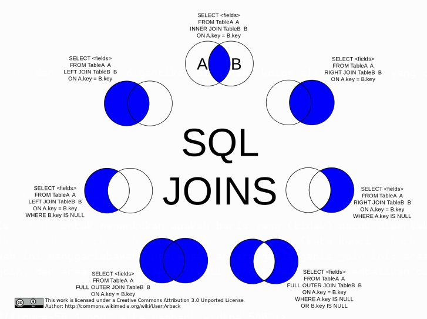
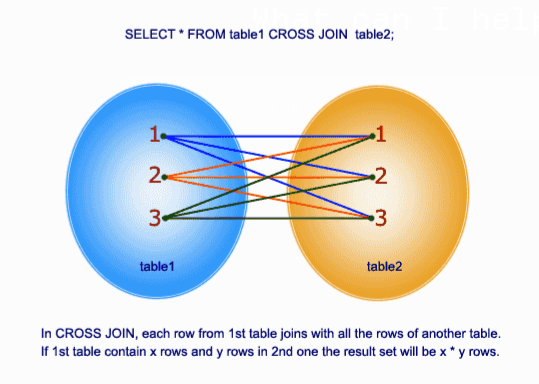
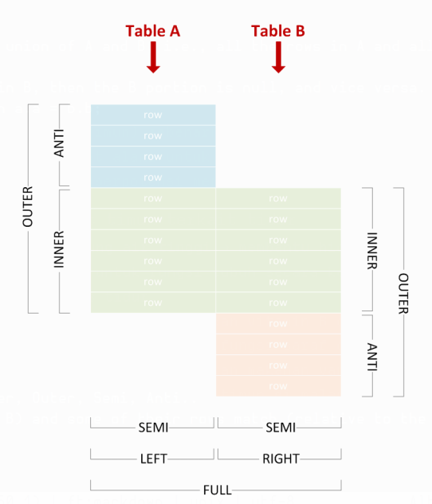
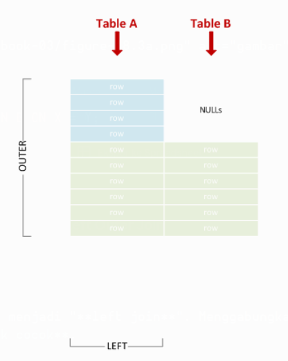

# Bab 1
## Memulai dengan SQL

| Versi | Nama Singkat | Standar | Tanggal Rilis |
| :--- | :--- | :--- | :--- |
| 1986 | SQL-86 | ANSI X3.135-1986, ISO 9075:1987 | 1986-01-01 |
| 1989 | SQL-89 | ANSI X3.135-1989, ISO/IEC 9075:1989 | 1989-01-01 |
| 1992 | SQL-92 | ISO/IEC 9075:1992 | 1992-01-01 |
| 1999 | SQL:1999 | ISO/IEC 9075:1999 | 1999-12-16 |
| 2003 | SQL:2003 | ISO/IEC 9075:2003 | 2003-12-15 |
| 2006 | SQL:2006 | ISO/IEC 9075:2006 | 2006-06-01 |
| 2008 | SQL:2008 | ISO/IEC 9075:2008 | 2008-07-15 |
| 2011 | SQL:2011 | ISO/IEC 9075:2011 | 2011-12-15 |
| 2016 | SQL:2016 | ISO/IEC 9075:2016 | 2016-12-01 |

### Bagian 1.1: Tinjauan Umum

**Structured Query Language (SQL)** adalah bahasa pemrograman bertujuan khusus yang dirancang untuk mengelola data yang disimpan dalam **Relational Database Management System (RDBMS)**. Bahasa yang mirip SQL juga dapat digunakan dalam Relational Data Stream Management Systems (RDSMS), atau dalam basis data "not-only SQL" (NoSQL).

SQL terdiri dari 3 sub-bahasa utama:

1.  **Data Definition Language (DDL)**: untuk membuat dan memodifikasi struktur basis data.
2.  **Data Manipulation Language (DML)**: untuk melakukan operasi Baca, Sisip, Perbarui, dan Hapus (Read, Insert, Update, Delete) pada data di dalam basis data.
3.  **Data Control Language (DCL)**: untuk mengontrol akses terhadap data yang disimpan di dalam basis data.

[Artikel SQL di Wikipedia](https://en.wikipedia.org/wiki/SQL)

Operasi inti DML adalah **Create, Read, Update, and Delete (disingkat CRUD)** yang dilakukan oleh pernyataan `INSERT`, `SELECT`, `UPDATE`, dan `DELETE`.

Ada juga pernyataan `MERGE` (baru-baru ini ditambahkan) yang dapat melakukan ketiga operasi tulis (`INSERT`, `UPDATE`, `DELETE`).

[Artikel CRUD di Wikipedia](https://en.wikipedia.org/wiki/Create,_read,_update_and_delete)

Banyak basis data SQL diimplementasikan sebagai sistem klien/server; istilah "SQL server" menggambarkan basis data semacam itu. Pada saat yang sama, Microsoft membuat sebuah basis data yang bernama "SQL Server". Meskipun basis data tersebut menggunakan dialek SQL, informasi yang spesifik untuk basis data tersebut tidak relevan dalam tag ini, melainkan menjadi bagian dari dokumentasi SQL Server.

# Bab 2
## Identifier (Pengenal)

Topik ini membahas tentang *identifier* (pengenal), yaitu aturan sintaks untuk nama tabel, kolom, dan objek basis data lainnya.

Jika diperlukan, contoh-contoh akan mencakup variasi yang digunakan oleh implementasi SQL yang berbeda, atau mengidentifikasi implementasi SQL dari contoh tersebut.

### Bagian 2.1: Identifier Tanpa Tanda Kutip (*Unquoted identifiers*)

*Identifier* tanpa tanda kutip dapat menggunakan huruf (a-z), angka (0-9), dan garis bawah (\_), dan harus dimulai dengan huruf.

Tergantung pada implementasi SQL dan/atau pengaturan basis data, karakter lain mungkin diizinkan, beberapa bahkan sebagai karakter pertama, contohnya:

  * **MS SQL**: @, $, \#, dan huruf Unicode lainnya ([sumber](https://docs.microsoft.com/en-us/sql/relational-databases/databases/database-identifiers))
  * **MySQL**: $ ([sumber](https://dev.mysql.com/doc/refman/8.0/en/identifiers.html))
  * **Oracle**: $, \#, dan huruf lain dari set karakter basis data ([sumber](https://www.google.com/search?q=https://docs.oracle.com/database/121/SQLRF/sql_elements008.htm%23SQLRF00223))
  * **PostgreSQL**: $, dan huruf Unicode lainnya ([sumber](https://www.google.com/search?q=https://www.postgresql.org/docs/current/static/sql-syntax-lexical.html%23SQL-SYNTAX-IDENTIFIERS))

*Identifier* tanpa tanda kutip bersifat *case-insensitive* (tidak membedakan huruf besar/kecil). Cara penanganannya sangat bergantung pada implementasi SQL:

  * **MS SQL**: *Case-preserving* (mempertahankan huruf besar/kecil), sensitivitas ditentukan oleh set karakter basis data, jadi bisa jadi *case-sensitive*.
  * **MySQL**: *Case-preserving*, sensitivitas bergantung pada pengaturan basis data dan sistem file yang mendasarinya.
  * **Oracle**: Dikonversi menjadi huruf besar, lalu ditangani seperti *identifier* dengan tanda kutip.
  * **PostgreSQL**: Dikonversi menjadi huruf kecil, lalu ditangani seperti *identifier* dengan tanda kutip.
  * **SQLite**: *Case-preserving*; *case-insensitivity* hanya untuk karakter ASCII.

# Bab 3
## Tipe Data

### Bagian 3.1: DECIMAL dan NUMERIC

Angka desimal dengan presisi dan skala tetap. `DECIMAL` dan `NUMERIC` secara fungsional setara.

**Sintaks:**

```sql
DECIMAL ( presisi [ , skala] )
NUMERIC ( presisi [ , skala] )
```

**Contoh:**

```sql
SELECT CAST(123 AS DECIMAL(5,2)) --menghasilkan 123.00
SELECT CAST(12345.12 AS NUMERIC(10,5)) --menghasilkan 12345.12000
```

### Bagian 3.2: FLOAT dan REAL

Tipe data angka perkiraan untuk digunakan dengan data numerik *floating point*.

```sql
SELECT CAST( PI() AS FLOAT) --menghasilkan 3.14159265358979
SELECT CAST( PI() AS REAL) --menghasilkan 3.141593
```

### Bagian 3.3: Integer

Tipe data angka pasti yang menggunakan data integer.

| Tipe Data | Jangkauan | Penyimpanan |
| :--- | :--- | :--- |
| **bigint** | -2^63 (-9,223,372,036,854,775,808) hingga 2^63-1 (9,223,372,036,854,775,807) | 8 Byte |
| **int** | -2^31 (-2,147,483,648) hingga 2^31-1 (2,147,483,647) | 4 Byte |
| **smallint** | -2^15 (-32,768) hingga 2^15-1 (32,767) | 2 Byte |
| **tinyint** | 0 hingga 255 | 1 Byte |

### Bagian 3.4: MONEY dan SMALLMONEY

Tipe data yang merepresentasikan nilai moneter atau mata uang.

| Tipe Data | Jangkauan | Penyimpanan |
| :--- | :--- | :--- |
| **money** | -922,337,203,685,477.5808 hingga 922,337,203,685,477.5807 | 8 byte |
| **smallmoney** | -214,748.3648 hingga 214,748.3647 | 4 byte |

### Bagian 3.5: BINARY dan VARBINARY

Tipe data biner dengan panjang tetap atau panjang variabel.

**Sintaks:**

```sql
BINARY [ ( n_byte ) ]
VARBINARY [ ( n_byte | max ) ]
```

`n_byte` bisa berupa angka dari 1 hingga 8000 byte. `max` menunjukkan bahwa ruang penyimpanan maksimum adalah 2^31-1.

**Contoh:**

```sql
SELECT CAST(12345 AS BINARY(10)) -- 0x00000000000000003039
SELECT CAST(12345 AS VARBINARY(10)) -- 0x00003039
```

### Bagian 3.6: CHAR dan VARCHAR

Tipe data string dengan panjang tetap atau panjang variabel.

**Sintaks:**

```sql
CHAR [ ( n_karakter ) ]
VARCHAR [ ( n_karakter ) ]
```

**Contoh:**

```sql
SELECT CAST('ABC' AS CHAR(10)) -- 'ABC       ' (diisi dengan spasi di sebelah kanan)
SELECT CAST('ABC' AS VARCHAR(10)) -- 'ABC' (tanpa pengisi karena karakter variabel)
SELECT CAST('ABCDEFGHIJKLMNOPQRSTUVWXYZ' AS CHAR(10)) -- 'ABCDEFGHIJ' (dipotong menjadi 10 karakter)
```

### Bagian 3.7: NCHAR dan NVARCHAR

Tipe data string UNICODE dengan panjang tetap atau panjang variabel.

**Sintaks:**

```sql
NCHAR [ ( n_karakter ) ]
NVARCHAR [ ( n_karakter | MAX ) ]
```

Gunakan `MAX` untuk string yang sangat panjang yang mungkin melebihi 8000 karakter.

### Bagian 3.8: UNIQUEIDENTIFIER

Sebuah GUID / UUID 16-byte.

```sql
DECLARE @GUID UNIQUEIDENTIFIER = NEWID();
SELECT @GUID -- 'E28B3BD9-9174-41A9-8508-899A78A33540'

DECLARE @bad_GUID_string VARCHAR(100) = 'E28B3BD9-9174-41A9-8508-899A78A33540_foobarbaz'
SELECT
@bad_GUID_string,
-- 'E28B3BD9-9174-41A9-8508-899A78A33540_foobarbaz'
CONVERT(UNIQUEIDENTIFIER, @bad_GUID_string) -- 'E28B3BD9-9174-41A9-8508-899A78A33540'
```

# Bab 4
## NULL

`NULL` dalam SQL, serta dalam pemrograman secara umum, secara harfiah berarti "tidak ada apa-apa". Dalam SQL, lebih mudah dipahami sebagai **"tidak adanya nilai apa pun"**.

Penting untuk membedakannya dari nilai yang tampaknya kosong, seperti string kosong `''` atau angka `0`, yang keduanya sebenarnya bukan `NULL`.

Penting juga untuk berhati-hati agar tidak membungkus `NULL` dengan tanda kutip, seperti `'NULL'`, yang diizinkan dalam kolom yang menerima teks, tetapi itu bukan `NULL` dan dapat menyebabkan kesalahan serta kumpulan data yang salah.

### Bagian 4.1: Memfilter NULL dalam kueri

Sintaks untuk memfilter `NULL` (yaitu, ketiadaan nilai) dalam blok `WHERE` sedikit berbeda dari memfilter nilai tertentu.

```sql
SELECT * FROM Employees WHERE ManagerId IS NULL ;
SELECT * FROM Employees WHERE ManagerId IS NOT NULL ;
```

Perhatikan bahwa karena `NULL` tidak sama dengan apa pun, bahkan dengan dirinya sendiri, penggunaan operator kesetaraan `= NULL` atau `<> NULL` (atau `!= NULL`) akan selalu menghasilkan nilai kebenaran `UNKNOWN` yang akan ditolak oleh `WHERE`.

`WHERE` memfilter semua baris yang kondisinya `FALSE` atau `UNKNOWN` dan hanya mempertahankan baris yang kondisinya `TRUE`.

### Bagian 4.2: Kolom yang dapat bernilai NULL (*Nullable*) di dalam tabel

Saat membuat tabel, dimungkinkan untuk mendeklarasikan sebuah kolom sebagai *nullable* (dapat bernilai null) atau *non-nullable* (tidak dapat bernilai null).

```sql
CREATE TABLE MyTable
(
    MyCol1 INT NOT NULL, -- non-nullable
    MyCol2 INT NULL      -- nullable
) ;
```

Secara *default*, setiap kolom (kecuali yang ada dalam batasan *primary key*) bersifat *nullable* kecuali kita secara eksplisit menetapkan batasan `NOT NULL`.

Mencoba memberikan nilai `NULL` ke kolom *non-nullable* akan mengakibatkan kesalahan.

```sql
INSERT INTO MyTable (MyCol1, MyCol2) VALUES (1, NULL) ;
-- berjalan dengan baik

INSERT INTO MyTable (MyCol1, MyCol2) VALUES (NULL, 2) ;
-- tidak dapat menyisipkan
-- nilai NULL ke dalam kolom 'MyCol1', tabel 'MyTable';
-- kolom tidak mengizinkan null. INSERT gagal.
```

### Bagian 4.3: Memperbarui field menjadi NULL

Mengatur sebuah *field* menjadi `NULL` bekerja persis seperti nilai lainnya:

```sql
UPDATE Employees
SET ManagerId = NULL
WHERE Id = 4
```

### Bagian 4.4: Menyisipkan baris dengan field NULL

Contohnya, menyisipkan seorang karyawan tanpa nomor telepon dan tanpa manajer ke dalam tabel contoh `Employees`:

```sql
INSERT INTO Employees
(Id, FName, LName, PhoneNumber, ManagerId, DepartmentId, Salary, HireDate)
VALUES
(5, 'Jane', 'Doe', NULL, NULL, 2, 800, '2016-07-22') ;
```

# Bab 5
## Contoh Basis Data dan Tabel

### Bagian 5.1: Basis Data Bengkel Mobil

Dalam contoh berikut - Basis data untuk bisnis bengkel mobil, kita memiliki daftar departemen, karyawan, pelanggan, dan mobil pelanggan. Kita menggunakan *foreign key* untuk membuat hubungan antar berbagai tabel.

Contoh langsung: [SQL fiddle](https://www.google.com/search?q=http://sqlfiddle.com/%23!9/1620c/1)

**Hubungan antar tabel**

  * Setiap Departemen dapat memiliki 0 atau lebih Karyawan
  * Setiap Karyawan dapat memiliki 0 atau 1 Manajer
  * Setiap Pelanggan dapat memiliki 0 atau lebih Mobil

**Departments**
| Id | Name |
| :--- | :--- |
| 1 | HR |
| 2 | Sales |
| 3 | Tech |

Pernyataan SQL untuk membuat tabel:

```sql
CREATE TABLE Departments (
    Id INT NOT NULL AUTO_INCREMENT,
    Name VARCHAR(25) NOT NULL,
    PRIMARY KEY(Id)
);

INSERT INTO Departments
    ([Id], [Name])
VALUES
    (1, 'HR'),
    (2, 'Sales'),
    (3, 'Tech')
;
```

**Employees**
| Id | FName | LName | PhoneNumber | ManagerId | DepartmentId | Salary | HireDate |
| :--- | :--- | :--- | :--- | :--- | :--- | :--- | :--- |
| 1 | James | Smith | 1234567890 | NULL | 1 | 1000 | 01-01-2002 |
| 2 | John | Johnson | 2468101214 | 1 | 1 | 400 | 23-03-2005 |
| 3 | Michael | Williams | 1357911131 | 1 | 2 | 600 | 12-05-2009 |
| 4 | Johnathon | Smith | 1212121212 | 2 | 1 | 500 | 24-07-2016 |

Pernyataan SQL untuk membuat tabel:

```sql
CREATE TABLE Employees (
    Id INT NOT NULL AUTO_INCREMENT,
    FName VARCHAR(35) NOT NULL,
    LName VARCHAR(35) NOT NULL,
    PhoneNumber VARCHAR(11),
    ManagerId INT,
    DepartmentId INT NOT NULL,
    Salary INT NOT NULL,
    HireDate DATETIME NOT NULL,
    PRIMARY KEY(Id),
    FOREIGN KEY (ManagerId) REFERENCES Employees(Id),
    FOREIGN KEY (DepartmentId) REFERENCES Departments(Id)
);

INSERT INTO Employees
    ([Id], [FName], [LName], [PhoneNumber], [ManagerId], [DepartmentId], [Salary], [HireDate])
VALUES
    (1, 'James', 'Smith', 1234567890, NULL, 1, 1000, '01-01-2002'),
    (2, 'John', 'Johnson', 2468101214, '1', 1, 400, '23-03-2005'),
    (3, 'Michael', 'Williams', 1357911131, '1', 2, 600, '12-05-2009'),
    (4, 'Johnathon', 'Smith', 1212121212, '2', 1, 500, '24-07-2016')
;
```

**Customers**
| Id | FName | LName | Email | PhoneNumber | PreferredContact |
| :--- | :--- | :--- | :--- | :--- | :--- |
| 1 | William | Jones | william.jones@example.com | 3347927472 | PHONE |
| 2 | David | Miller | dmiller@example.net | 2137921892 | EMAIL |
| 3 | Richard | Davis | richard0123@example.com | NULL | EMAIL |

Pernyataan SQL untuk membuat tabel:

```sql
CREATE TABLE Customers (
    Id INT NOT NULL AUTO_INCREMENT,
    FName VARCHAR(35) NOT NULL,
    LName VARCHAR(35) NOT NULL,
    Email varchar(100) NOT NULL,
    PhoneNumber VARCHAR(11),
    PreferredContact VARCHAR(5) NOT NULL,
    PRIMARY KEY(Id)
);

INSERT INTO Customers
    ([Id], [FName], [LName], [Email], [PhoneNumber], [PreferredContact])
VALUES
    (1, 'William', 'Jones', 'william.jones@example.com', '3347927472', 'PHONE'),
    (2, 'David', 'Miller', 'dmiller@example.net', '2137921892', 'EMAIL'),
    (3, 'Richard', 'Davis', 'richard0123@example.com', NULL, 'EMAIL')
;
```

**Cars**
| Id | CustomerId | EmployeeId | Model | Status | Total Cost |
| :--- | :--- | :--- | :--- | :--- | :--- |
| 1 | 1 | 2 | Ford F-150 | READY | 230 |
| 2 | 1 | 2 | Ford F-150 | READY | 200 |
| 3 | 2 | 1 | Ford Mustang | WAITING | 100 |
| 4 | 3 | 3 | Toyota Prius | WORKING | 1254 |

Pernyataan SQL untuk membuat tabel:

```sql
CREATE TABLE Cars (
    Id INT NOT NULL AUTO_INCREMENT,
    CustomerId INT NOT NULL,
    EmployeeId INT NOT NULL,
    Model varchar(50) NOT NULL,
    Status varchar(25) NOT NULL,
    TotalCost INT NOT NULL,
    PRIMARY KEY(Id),
    FOREIGN KEY (CustomerId) REFERENCES Customers(Id),
    FOREIGN KEY (EmployeeId) REFERENCES Employees(Id)
);

INSERT INTO Cars
    ([Id], [CustomerId], [EmployeeId], [Model], [Status], [TotalCost])
VALUES
    ('1', '1', '2', 'Ford F-150', 'READY', '230'),
    ('2', '1', '2', 'Ford F-150', 'READY', '200'),
    ('3', '2', '1', 'Ford Mustang', 'WAITING', '100'),
    ('4', '3', '3', 'Toyota Prius', 'WORKING', '1254')
;
```

### Bagian 5.2: Basis Data Perpustakaan

Dalam contoh basis data perpustakaan ini, kita memiliki tabel `Authors`, `Books`, dan `BooksAuthors`.

Contoh langsung: [SQL fiddle](https://www.google.com/search?q=http://sqlfiddle.com/%23!9/b0171/1)

`Authors` dan `Books` dikenal sebagai tabel dasar (*base tables*), karena mereka berisi definisi kolom dan data untuk entitas aktual dalam model relasional. `BooksAuthors` dikenal sebagai tabel hubungan (*relationship table*), karena tabel ini mendefinisikan hubungan antara tabel `Books` dan `Authors`.

**Hubungan antar tabel**

  * Setiap penulis dapat memiliki 1 atau lebih buku
  * Setiap buku dapat memiliki 1 atau lebih penulis

**Authors**
([lihat tabel](https://www.google.com/search?q=http://sqlfiddle.com/%23!9/b0171/2))
| Id | Name | Country |
| :--- | :--- | :--- |
| 1 | J.D. Salinger | USA |
| 2 | F. Scott. Fitzgerald | USA |
| 3 | Jane Austen | UK |
| 4 | Scott Hanselman | USA |
| 5 | Jason N. Gaylord | USA |
| 6 | Pranav Rastogi | India |
| 7 | Todd Miranda | USA |
| 8 | Christian Wenz | USA |

SQL untuk membuat tabel:

```sql
CREATE TABLE Authors (
    Id INT NOT NULL AUTO_INCREMENT,
    Name VARCHAR(70) NOT NULL,
    Country VARCHAR(100) NOT NULL,
    PRIMARY KEY(Id)
);

INSERT INTO Authors
    (Name, Country)
VALUES
    ('J.D. Salinger', 'USA'),
    ('F. Scott. Fitzgerald', 'USA'),
    ('Jane Austen', 'UK'),
    ('Scott Hanselman', 'USA'),
    ('Jason N. Gaylord', 'USA'),
    ('Pranav Rastogi', 'India'),
    ('Todd Miranda', 'USA'),
    ('Christian Wenz', 'USA')
;
```

**Books**
([lihat tabel](https://www.google.com/search?q=http://sqlfiddle.com/%23!9/b0171/3))
| Id | Title |
| :--- | :--- |
| 1 | The Catcher in the Rye |
| 2 | Nine Stories |
| 3 | Franny and Zooey |
| 4 | The Great Gatsby |
| 5 | Tender id the Night |
| 6 | Pride and Prejudice |
| 7 | Professional ASP.NET 4.5 in C\# and VB |

SQL untuk membuat tabel:

```sql
CREATE TABLE Books (
    Id INT NOT NULL AUTO_INCREMENT,
    Title VARCHAR(50) NOT NULL,
    PRIMARY KEY(Id)
);

INSERT INTO Books
    (Id, Title)
VALUES
    (1, 'The Catcher in the Rye'),
    (2, 'Nine Stories'),
    (3, 'Franny and Zooey'),
    (4, 'The Great Gatsby'),
    (5, 'Tender id the Night'),
    (6, 'Pride and Prejudice'),
    (7, 'Professional ASP.NET 4.5 in C# and VB')
;
```

**BooksAuthors**
([lihat tabel](https://www.google.com/search?q=http://sqlfiddle.com/%23!9/b0171/4))
| BookId | AuthorId |
| :--- | :--- |
| 1 | 1 |
| 2 | 1 |
| 3 | 1 |
| 4 | 2 |
| 5 | 2 |
| 6 | 3 |
| 7 | 4 |
| 7 | 5 |
| 7 | 6 |
| 7 | 7 |
| 7 | 8 |

SQL untuk membuat tabel:

```sql
CREATE TABLE BooksAuthors (
    AuthorId INT NOT NULL,
    BookId INT NOT NULL,
    FOREIGN KEY (AuthorId) REFERENCES Authors(Id),
    FOREIGN KEY (BookId) REFERENCES Books(Id)
);

INSERT INTO BooksAuthors
    (BookId, AuthorId)
VALUES
    (1, 1), (2, 1), (3, 1),
    (4, 2), (5, 2), (6, 3),
    (7, 4), (7, 5), (7, 6),
    (7, 7), (7, 8)
;
```

**Contoh-contoh**

Lihat semua penulis ([lihat contoh langsung](https://www.google.com/search?q=http://sqlfiddle.com/%23!9/b0171/2)):

```sql
SELECT * FROM Authors;
```

Lihat semua judul buku ([lihat contoh langsung](https://www.google.com/search?q=http://sqlfiddle.com/%23!9/b0171/3)):

```sql
SELECT * FROM Books;
```

Lihat semua buku dan penulisnya ([lihat contoh langsung](https://www.google.com/search?q=http://sqlfiddle.com/%23!9/b0171/1)):

```sql
SELECT
    ba.AuthorId,
    a.Name AuthorName,
    ba.BookId,
    b.Title BookTitle
FROM BooksAuthors ba
INNER JOIN Authors a ON a.id = ba.authorid
INNER JOIN Books b ON b.id = ba.bookid
;
```

### Bagian 5.3: Tabel Negara (Countries)

Dalam contoh ini, kita memiliki tabel `Countries`. Tabel negara memiliki banyak kegunaan, terutama dalam aplikasi Keuangan yang melibatkan mata uang dan nilai tukar.

Contoh langsung: [SQL fiddle](https://www.google.com/search?q=http://sqlfiddle.com/%23!9/24483/1)

Beberapa aplikasi perangkat lunak data pasar seperti Bloomberg dan Reuters mengharuskan Anda memberikan API mereka kode negara 2 atau 3 karakter bersama dengan kode mata uang. Oleh karena itu, tabel contoh ini memiliki kolom kode ISO 2 karakter dan kolom kode ISO3 3 karakter.

**Countries**
([lihat tabel](https://www.google.com/search?q=http://sqlfiddle.com/%23!9/24483/1))
| Id | ISO | ISO3 | ISONumeric | CountryName | Capital | ContinentCode | CurrencyCode |
| :--- | :--- | :--- | :--- | :--- | :--- | :--- | :--- |
| 1 | AU | AUS | 36 | Australia | Canberra | OC | AUD |
| 2 | DE | DEU | 276 | Germany | Berlin | EU | EUR |
| 3 | IN | IND | 356 | India | New Delhi | AS | INR |
| 4 | LA | LAO | 418 | Laos | Vientiane | AS | LAK |
| 5 | US | USA | 840 | United States | Washington | NA | USD |
| 6 | ZW | ZWE | 716 | Zimbabwe | Harare | AF | ZWL |

SQL untuk membuat tabel:

```sql
CREATE TABLE Countries (
    Id INT NOT NULL AUTO_INCREMENT,
    ISO VARCHAR(2) NOT NULL,
    ISO3 VARCHAR(3) NOT NULL,
    ISONumeric INT NOT NULL,
    CountryName VARCHAR(64) NOT NULL,
    Capital VARCHAR(64) NOT NULL,
    ContinentCode VARCHAR(2) NOT NULL,
    CurrencyCode VARCHAR(3) NOT NULL,
    PRIMARY KEY(Id)
)
;

INSERT INTO Countries
    (ISO, ISO3, ISONumeric, CountryName, Capital, ContinentCode, CurrencyCode)
VALUES
    ('AU', 'AUS', 36, 'Australia', 'Canberra', 'OC', 'AUD'),
    ('DE', 'DEU', 276, 'Germany', 'Berlin', 'EU', 'EUR'),
    ('IN', 'IND', 356, 'India', 'New Delhi', 'AS', 'INR'),
    ('LA', 'LAO', 418, 'Laos', 'Vientiane', 'AS', 'LAK'),
    ('US', 'USA', 840, 'United States', 'Washington', 'NA', 'USD'),
    ('ZW', 'ZWE', 716, 'Zimbabwe', 'Harare', 'AF', 'ZWL')
;
```

---

## Bab 6: SELECT

Pernyataan `SELECT` adalah inti dari sebagian besar kueri SQL. Pernyataan ini mendefinisikan set hasil (*result set*) apa yang harus dikembalikan oleh kueri, dan hampir selalu digunakan bersama dengan klausa `FROM`, yang mendefinisikan bagian mana dari basis data yang harus dikueri.

### Bagian 6.1: Menggunakan karakter wildcard untuk memilih semua kolom dalam sebuah kueri

Perhatikan sebuah basis data dengan dua tabel berikut.

Tabel **Employees**:
| Id | FName | LName | DeptId |
| :--- | :--- | :--- | :--- |
| 1 | James | Smith | 3 |
| 2 | John | Johnson | 4 |

Tabel **Departments**:
| Id | Name |
| :--- | :--- |
| 1 | Sales |
| 2 | Marketing |
| 3 | Finance |
| 4 | IT |

**Pernyataan `SELECT` sederhana**

`*` adalah karakter *wildcard* yang digunakan untuk memilih semua kolom yang tersedia dalam sebuah tabel.

Ketika digunakan sebagai pengganti nama kolom eksplisit, ia mengembalikan semua kolom di semua tabel yang dipilih oleh kueri melalui klausa `FROM`. Efek ini berlaku untuk semua tabel yang diakses kueri melalui klausa `JOIN`.

Perhatikan kueri berikut:

```sql
SELECT * FROM Employees
```

Ini akan mengembalikan semua *field* dari semua baris tabel `Employees`:
| Id | FName | LName | DeptId |
| :--- | :--- | :--- | :--- |
| 1 | James | Smith | 3 |
| 2 | John | Johnson | 4 |

**Notasi Titik (Dot Notation)**

Untuk memilih semua nilai dari tabel tertentu, karakter *wildcard* dapat diterapkan ke tabel dengan notasi titik.

Perhatikan kueri berikut:

```sql
SELECT
    Employees.*,
    Departments.Name
FROM
    Employees
JOIN
    Departments
    ON Departments.Id = Employees.DeptId
```

Ini akan mengembalikan set data dengan semua *field* pada tabel `Employee`, diikuti hanya oleh *field* `Name` dari tabel `Departments`:
| Id | FName | LName | DeptId | Name |
| :--- | :--- | :--- | :--- | :--- |
| 1 | James | Smith | 3 | Finance |
| 2 | John | Johnson | 4 | IT |

**Peringatan Terhadap Penggunaan `*`**

Secara umum disarankan agar penggunaan `*` dihindari dalam kode produksi jika memungkinkan, karena dapat menyebabkan sejumlah masalah potensial termasuk:

1.  **Beban IO, jaringan, dan penggunaan memori yang berlebihan**, karena mesin basis data membaca data yang tidak diperlukan dan mengirimkannya ke kode *front-end*. Ini menjadi perhatian khusus jika ada *field* besar seperti yang digunakan untuk menyimpan catatan panjang atau file lampiran.
2.  **Beban IO berlebih lebih lanjut** jika basis data perlu menampung hasil internal ke disk sebagai bagian dari pemrosesan untuk kueri yang lebih kompleks daripada `SELECT <kolom> FROM <table>`.
3.  **Pemrosesan ekstra** (dan/atau lebih banyak IO) jika beberapa kolom yang tidak dibutuhkan adalah:
      * kolom terkomputasi (*computed columns*) di basis data yang mendukungnya.
      * dalam kasus memilih dari sebuah *view*, kolom dari tabel/*view* yang sebenarnya bisa dioptimalkan oleh *query optimizer*.
4.  **Potensi kesalahan tak terduga** jika kolom ditambahkan ke tabel dan *view* di kemudian hari yang mengakibatkan nama kolom ambigu. Contohnya `SELECT * FROM orders JOIN people ON people.id = orders.personid ORDER BY displayname` - jika kolom bernama `displayname` ditambahkan ke tabel `orders` untuk memungkinkan pengguna memberikan nama yang berarti pada pesanan mereka untuk referensi di masa mendatang, maka nama kolom tersebut akan muncul dua kali dalam output sehingga klausa `ORDER BY` akan ambigu yang dapat menyebabkan kesalahan ("ambiguous column name" di versi MS SQL Server terbaru), dan jika tidak dalam contoh ini, kode aplikasi Anda mungkin mulai menampilkan nama pesanan di tempat yang seharusnya nama orang karena kolom baru adalah yang pertama dengan nama itu yang dikembalikan, dan seterusnya.

**Kapan Anda Bisa Menggunakan `*`, Mengingat Peringatan di Atas?**

Meskipun sebaiknya dihindari dalam kode produksi, menggunakan `*` baik-baik saja sebagai singkatan saat melakukan kueri manual terhadap basis data untuk investigasi atau pekerjaan prototipe.

Terkadang keputusan desain dalam aplikasi Anda membuatnya tidak dapat dihindari (dalam keadaan seperti itu, lebih baik gunakan `nama_alias_tabel.*` daripada hanya `*` jika memungkinkan).

Saat menggunakan `EXISTS`, seperti `SELECT A.col1, A.Col2 FROM A WHERE EXISTS (SELECT * FROM B where A.ID = B.A_ID)`, kita tidak mengembalikan data apa pun dari B. Jadi, `JOIN` tidak diperlukan, dan mesin tahu tidak ada nilai dari B yang akan dikembalikan, sehingga tidak ada penurunan kinerja karena menggunakan `*`. Demikian pula, `COUNT(*)` baik-baik saja karena juga tidak benar-benar mengembalikan kolom apa pun, jadi hanya perlu membaca dan memproses kolom yang digunakan untuk tujuan pemfilteran.

### Bagian 6.2: SELECT Menggunakan Alias Kolom

Alias kolom digunakan terutama untuk mempersingkat kode dan membuat nama kolom lebih mudah dibaca.

Kode menjadi lebih pendek karena nama tabel yang panjang dan identifikasi kolom yang tidak perlu (misalnya, mungkin ada 2 ID di tabel, tetapi hanya satu yang digunakan dalam pernyataan) dapat dihindari. Bersama dengan alias tabel, ini memungkinkan Anda menggunakan nama deskriptif yang lebih panjang dalam struktur basis data Anda sambil menjaga kueri pada struktur tersebut tetap ringkas.

Selain itu, terkadang alias diperlukan, misalnya dalam *view*, untuk menamai output yang dihitung.

**Semua Versi SQL**

Alias dapat dibuat di semua versi SQL menggunakan tanda kutip ganda (`"`).

```sql
SELECT
    FName AS "First Name",
    MName AS "Middle Name",
    LName AS "Last Name"
FROM Employees
```

**Versi SQL yang Berbeda**

Anda dapat menggunakan tanda kutip tunggal (`'`), tanda kutip ganda (`"`), dan kurung siku (`[]`) untuk membuat alias di Microsoft SQL Server.

```sql
SELECT
    FName AS "First Name",
    MName AS 'Middle Name',
    LName AS [Last Name]
FROM Employees
```

Keduanya akan menghasilkan:
| First Name | Middle Name | Last Name |
| :--- | :--- | :--- |
| James | John | Smith |
| John | James | Johnson |
| Michael | Marcus | Williams |

Pernyataan ini akan mengembalikan kolom `FName` dan `LName` dengan nama yang diberikan (sebuah alias). Ini dicapai dengan menggunakan operator `AS` diikuti oleh alias, atau hanya dengan menulis alias langsung setelah nama kolom. Ini berarti kueri berikut memiliki hasil yang sama seperti di atas.

```sql
SELECT
    FName "First Name",
    MName "Middle Name",
    LName "Last Name"
FROM Employees
```

| First Name | Middle Name | Last Name |
| :--- | :--- | :--- |
| James | John | Smith |
| John | James | Johnson |
| Michael | Marcus | Williams |

Namun, versi eksplisit (yaitu, menggunakan operator `AS`) lebih mudah dibaca.

Jika alias hanya terdiri dari satu kata yang bukan merupakan kata kunci cadangan (*reserved word*), kita dapat menuliskannya tanpa tanda kutip tunggal, ganda, atau kurung siku:

```sql
SELECT
    FName AS FirstName,
    LName AS LastName
FROM Employees
```

| FirstName | LastName |
| :--- | :--- |
| James | Smith |
| John | Johnson |
| Michael | Williams |

Variasi lebih lanjut yang tersedia di MS SQL Server antara lain adalah `<alias> = <kolom-atau-perhitungan>`, misalnya:

```sql
SELECT FullName = FirstName + ' ' + LastName,
       Addr1   = FullStreetAddress,
       Addr2   = TownName
FROM CustomerDetails
```

yang setara dengan:

```sql
SELECT FirstName + ' ' + LastName AS FullName,
       FullStreetAddress          AS Addr1,
       TownName                   AS Addr2
FROM CustomerDetails
```

Keduanya akan menghasilkan:
| FullName | Addr1 | Addr2 |
| :--- | :--- | :--- |
| James Smith | 123 AnyStreet | TownVille |
| John Johnson | 668 MyRoad | Anytown |
| Michael Williams | 999 High End Dr | Williamsburgh |

Beberapa orang merasa menggunakan `=` lebih mudah dibaca daripada `AS`, meskipun banyak yang tidak merekomendasikan format ini, terutama karena tidak standar sehingga tidak didukung secara luas oleh semua basis data. Ini dapat menyebabkan kebingungan dengan penggunaan lain dari karakter `=`.

**Semua Versi SQL**

Juga, jika Anda perlu menggunakan kata kunci cadangan, Anda dapat menggunakan kurung atau tanda kutip untuk melakukan *escape*:

```sql
SELECT
    FName as "SELECT",
    MName as "FROM",
    LName as "WHERE"
FROM Employees
```

**Versi SQL yang Berbeda**

Demikian pula, Anda dapat melakukan *escape* pada kata kunci di MSSQL dengan semua pendekatan yang berbeda:

```sql
SELECT
    FName AS "SELECT",
    MName AS 'FROM',
    LName AS [WHERE]
FROM Employees
```

| SELECT | FROM | WHERE |
| :--- | :--- | :--- |
| James | John | Smith |
| John | James | Johnson |
| Michael | Marcus | Williams |

Juga, alias kolom dapat digunakan di salah satu klausa akhir dari kueri yang sama, seperti `ORDER BY`:

```sql
SELECT
    FName AS FirstName,
    LName AS LastName
FROM
    Employees
ORDER BY
    LastName DESC
```

Namun, Anda tidak dapat menggunakan:

```sql
SELECT
    FName AS SELECT,
    LName AS FROM
FROM
    Employees
ORDER BY
    LastName DESC
```

untuk membuat alias dari kata kunci cadangan ini (`SELECT` dan `FROM`). Ini akan menyebabkan banyak kesalahan saat eksekusi.

### Bagian 6.3: Memilih Kolom Individual

```sql
SELECT
    PhoneNumber,
    Email,
    PreferredContact
FROM Customers
```

Pernyataan ini akan mengembalikan kolom `PhoneNumber`, `Email`, dan `PreferredContact` dari semua baris tabel `Customers`. Kolom-kolom tersebut juga akan dikembalikan sesuai urutan kemunculannya dalam klausa `SELECT`.

Hasilnya akan menjadi:
| PhoneNumber | Email | PreferredContact |
| :--- | :--- | :--- |
| 3347927472 | william.jones@example.com | PHONE |
| 2137921892 | dmiller@example.net | EMAIL |
| NULL | richard0123@example.com | EMAIL |

Jika beberapa tabel digabungkan, Anda dapat memilih kolom dari tabel tertentu dengan menentukan nama tabel sebelum nama kolom: `[nama_tabel].[nama_kolom]`

```sql
SELECT
    Customers.PhoneNumber,
    Customers.Email,
    Customers.PreferredContact,
    Orders.Id AS OrderId
FROM
    Customers
LEFT JOIN
    Orders ON Orders.CustomerId = Customers.Id
```

\*`AS OrderId` berarti bahwa *field* `Id` dari tabel `Orders` akan dikembalikan sebagai kolom bernama `OrderId`. Lihat [memilih dengan alias kolom](https://www.google.com/search?q=%23bagian-62-select-menggunakan-alias-kolom) untuk informasi lebih lanjut.

Untuk menghindari penggunaan nama tabel yang panjang, Anda dapat menggunakan alias tabel. Ini mengurangi kesulitan menulis nama tabel yang panjang untuk setiap *field* yang Anda pilih dalam `JOIN`. Jika Anda melakukan *self join* (penggabungan antara dua instance dari tabel yang sama), maka Anda harus menggunakan alias tabel untuk membedakan tabel Anda. Kita bisa menulis alias tabel seperti `Customers c` atau `Customers AS c`. Di sini `c` berfungsi sebagai alias untuk `Customers` dan kita bisa memilih, katakanlah, `Email` seperti ini: `c.Email`.

```sql
SELECT
    c.PhoneNumber,
    c.Email,
    c.PreferredContact,
    o.Id AS OrderId
FROM
    Customers c
LEFT JOIN
    Orders o ON o.CustomerId = c.Id
```

### Bagian 6.4: Memilih sejumlah record tertentu

Standar SQL 2008 mendefinisikan klausa `FETCH FIRST` untuk membatasi jumlah *record* yang dikembalikan.

```sql
SELECT Id, ProductName, UnitPrice, Package
FROM Product
ORDER BY UnitPrice DESC
FETCH FIRST 10 ROWS ONLY
```

Standar ini hanya didukung di versi terbaru dari beberapa RDBMS. Sintaks non-standar yang spesifik untuk vendor disediakan di sistem lain. Progress OpenEdge 11.x juga mendukung sintaks `FETCH FIRST <n> ROWS ONLY`.

Selain itu, `OFFSET <m> ROWS` sebelum `FETCH FIRST <n> ROWS ONLY` memungkinkan untuk melewati baris sebelum mengambil baris.

```sql
SELECT Id, ProductName, UnitPrice, Package
FROM Product
ORDER BY UnitPrice DESC
OFFSET 5 ROWS
FETCH FIRST 10 ROWS ONLY
```

Kueri berikut didukung di SQL Server dan MS Access:

```sql
SELECT TOP 10 Id, ProductName, UnitPrice, Package
FROM Product
ORDER BY UnitPrice DESC
```

Untuk melakukan hal yang sama di MySQL atau PostgreSQL, kata kunci `LIMIT` harus digunakan:

```sql
SELECT Id, ProductName, UnitPrice, Package
FROM Product
ORDER BY UnitPrice DESC
LIMIT 10
```

Di Oracle, hal yang sama dapat dilakukan dengan `ROWNUM`:

```sql
SELECT Id, ProductName, UnitPrice, Package
FROM Product
WHERE ROWNUM <= 10
ORDER BY UnitPrice DESC
```

**Hasil**: 10 record.
| Id | ProductName | UnitPrice | Package |
| :--- | :--- | :--- | :--- |
| 38 | Côte de Blaye | 263.50 | 12 - 75 cl bottles |
| 29 | Thüringer Rostbratwurst | 123.79 | 50 bags x 30 sausgs. |
| 9 | Mishi Kobe Niku | 97.00 | 18 - 500 g pkgs. |
| 20 | Sir Rodney's Marmalade | 81.00 | 30 gift boxes |
| 18 | Carnarvon Tigers | 62.50 | 16 kg pkg. |
| 59 | Raclette Courdavault | 55.00 | 5 kg pkg. |
| 51 | Manjimup Dried Apples | 53.00 | 50 - 300 g pkgs. |
| 62 | Tarte au sucre | 49.30 | 48 pies |
| 43 | Ipoh Coffee | 46.00 | 16 - 500 g tins |
| 28 | Rössle Sauerkraut | 45.60 | 25 - 825 g cans |

**Nuansa Vendor:**
Penting untuk dicatat bahwa `TOP` di Microsoft SQL beroperasi setelah klausa `WHERE` dan akan mengembalikan jumlah hasil yang ditentukan jika mereka ada di mana saja di tabel, sementara `ROWNUM` bekerja sebagai bagian dari klausa `WHERE` sehingga jika kondisi lain tidak ada dalam jumlah baris yang ditentukan di awal tabel, Anda akan mendapatkan nol hasil padahal mungkin ada hasil lain yang bisa ditemukan.

### Bagian 6.5: Memilih dengan Kondisi

Sintaks dasar `SELECT` dengan klausa `WHERE` adalah:

```sql
SELECT kolom1, kolom2, kolomN
FROM nama_tabel
WHERE [kondisi]
```

`[kondisi]` bisa berupa ekspresi SQL apa pun, yang ditentukan menggunakan operator perbandingan atau logis seperti `>`, `<`, `=`, `<>`, `>=`, `<=`, `LIKE`, `NOT`, `IN`, `BETWEEN`, dll.

Pernyataan berikut mengembalikan semua kolom dari tabel 'Cars' di mana kolom `status` adalah 'READY':

```sql
SELECT * FROM Cars WHERE status = 'READY'
```

Lihat `WHERE` dan `HAVING` untuk contoh lebih lanjut.

### Bagian 6.6: Memilih dengan CASE

Ketika hasil perlu menerapkan beberapa logika 'secara langsung', seseorang dapat menggunakan pernyataan `CASE` untuk mengimplementasikannya.

```sql
SELECT CASE WHEN Col1 < 50 THEN 'under' ELSE 'over' END threshold
FROM TableName
```

Juga dapat dirangkai:

```sql
SELECT
    CASE WHEN Col1 < 50 THEN 'under'
         WHEN Col1 > 50 AND Col1 < 100 THEN 'between'
         ELSE 'over'
    END threshold
FROM TableName
```

Seseorang juga dapat memiliki `CASE` di dalam pernyataan `CASE` lain:

```sql
SELECT
    CASE WHEN Col1 < 50 THEN 'under'
         ELSE
             CASE WHEN Col1 > 50 AND Col1 < 100 THEN Col1
                  ELSE 'over' END
    END threshold
FROM TableName
```

### Bagian 6.7: Memilih kolom yang dinamai dengan kata kunci cadangan

Ketika nama kolom cocok dengan kata kunci cadangan (*reserved keyword*), SQL standar mengharuskan Anda untuk melampirkannya dalam tanda kutip ganda:

```sql
SELECT
    "ORDER",
    ID
FROM ORDERS
```

Perhatikan bahwa ini membuat nama kolom menjadi *case-sensitive*.

Beberapa DBMS memiliki cara-cara proprietary untuk mengutip nama. Misalnya, SQL Server menggunakan kurung siku untuk tujuan ini:

```sql
SELECT
    [Order],
    ID
FROM ORDERS
```

sementara MySQL (dan MariaDB) secara default menggunakan *backtick*:

```sql
SELECT
    `Order`,
    id
FROM orders
```

### Bagian 6.8: Memilih dengan alias tabel

```sql
SELECT e.Fname, e.LName
FROM Employees e
```

Tabel `Employees` diberi alias 'e' langsung setelah nama tabel. Ini membantu menghilangkan ambiguitas dalam skenario di mana beberapa tabel memiliki nama *field* yang sama dan Anda perlu spesifik dari tabel mana Anda ingin mengembalikan data.

```sql
SELECT e.Fname, e.LName, m.Fname AS ManagerFirstName
FROM Employees e
JOIN Managers m ON e.ManagerId = m.Id
```

Perhatikan bahwa setelah Anda mendefinisikan sebuah alias, Anda tidak dapat menggunakan nama tabel kanonik lagi. Yaitu:

```sql
SELECT e.Fname, Employees.LName, m.Fname AS ManagerFirstName
FROM Employees e
JOIN Managers m ON e.ManagerId = m.Id
```

akan menghasilkan kesalahan.

Perlu dicatat bahwa alias tabel -- lebih formal disebut 'variabel rentang' (*range variables*) -- diperkenalkan ke dalam bahasa SQL untuk menyelesaikan masalah kolom duplikat yang disebabkan oleh `INNER JOIN`. Standar SQL 1992 memperbaiki kelemahan desain sebelumnya ini dengan memperkenalkan `NATURAL JOIN` (diimplementasikan di MySQL, PostgreSQL, dan Oracle tetapi belum di SQL Server), yang hasilnya tidak pernah memiliki nama kolom duplikat. Contoh di atas menarik karena tabel digabungkan pada kolom dengan nama yang berbeda (`Id` dan `ManagerId`) tetapi tidak seharusnya digabungkan pada kolom dengan nama yang sama (`LName`, `FName`), yang mengharuskan penggantian nama kolom dilakukan sebelum `JOIN`:

```sql
SELECT Fname, LName, ManagerFirstName
FROM Employees
NATURAL JOIN
    ( SELECT Id AS ManagerId, Fname AS ManagerFirstName
      FROM Managers ) m;
```

Perhatikan bahwa meskipun alias/variabel rentang harus dideklarasikan untuk tabel turunan (*derived table*) (jika tidak, SQL akan menghasilkan kesalahan), tidak pernah masuk akal untuk benar-benar menggunakannya dalam kueri.

### Bagian 6.9: Memilih dengan lebih dari 1 kondisi

Kata kunci `AND` digunakan untuk menambahkan lebih banyak kondisi ke kueri.

| Name | Age | Gender |
| :--- | :--- | :--- |
| Sam | 18 | M |
| John | 21 | M |
| Bob | 22 | M |
| Mary | 23 | F |

```sql
SELECT name FROM persons WHERE gender = 'M' AND age > 20;
```

Ini akan mengembalikan:
| Name |
| :--- |
| John |
| Bob |

Menggunakan kata kunci `OR`:

```sql
SELECT name FROM persons WHERE gender = 'M' OR age < 20;
```

Ini akan mengembalikan:
| name |
| :--- |
| Sam |
| John |
| Bob |

Kata kunci ini dapat digabungkan untuk memungkinkan kombinasi kriteria yang lebih kompleks:

```sql
SELECT name
FROM persons
WHERE (gender = 'M' AND age < 20)
   OR (gender = 'F' AND age > 20);
```

Ini akan mengembalikan:
| name |
| :--- |
| Sam |
| Mary |

### Bagian 6.10: Memilih tanpa Mengunci tabel

Terkadang ketika tabel digunakan sebagian besar (atau hanya) untuk pembacaan, pengindeksan tidak membantu lagi dan setiap sedikit kinerja sangat berarti, seseorang mungkin menggunakan `SELECT` tanpa `LOCK` untuk meningkatkan kinerja.

**SQL Server**

```sql
SELECT * FROM TableName WITH (nolock)
```

**MySQL**

```sql
SET SESSION TRANSACTION ISOLATION LEVEL READ UNCOMMITTED;
SELECT * FROM TableName;
SET SESSION TRANSACTION ISOLATION LEVEL REPEATABLE READ;
```

**Oracle**

```sql
SET TRANSACTION ISOLATION LEVEL READ UNCOMMITTED;
SELECT * FROM TableName;
```

**DB2**

```sql
SELECT * FROM TableName WITH UR;
```

di mana `UR` adalah singkatan dari "*uncommitted read*".

Jika digunakan pada tabel yang sedang mengalami modifikasi *record*, hasilnya mungkin tidak dapat diprediksi.

### Bagian 6.11: Memilih dengan fungsi Agregat

**Average (Rata-rata)**
Fungsi agregat `AVG()` akan mengembalikan rata-rata dari nilai yang dipilih.

```sql
SELECT AVG(Salary) FROM Employees
```

Fungsi agregat juga dapat digabungkan dengan klausa `WHERE`.

```sql
SELECT AVG(Salary) FROM Employees where DepartmentId = 1
```

Fungsi agregat juga dapat digabungkan dengan klausa `GROUP BY`. Jika seorang karyawan dikategorikan dengan beberapa departemen dan kita ingin mencari gaji rata-rata untuk setiap departemen, maka kita dapat menggunakan kueri berikut.

```sql
SELECT AVG(Salary) FROM Employees GROUP BY DepartmentId
```

**Minimum**
Fungsi agregat `MIN()` akan mengembalikan nilai minimum dari nilai yang dipilih.

```sql
SELECT MIN(Salary) FROM Employees
```

**Maximum**
Fungsi agregat `MAX()` akan mengembalikan nilai maksimum dari nilai yang dipilih.

```sql
SELECT MAX(Salary) FROM Employees
```

**Count (Jumlah)**
Fungsi agregat `COUNT()` akan mengembalikan jumlah nilai yang dipilih.

```sql
SELECT Count(*) FROM Employees
```

Ini juga bisa digabungkan dengan kondisi `WHERE` untuk mendapatkan jumlah baris yang memenuhi kondisi tertentu.

```sql
SELECT Count(*) FROM Employees where ManagerId IS NOT NULL
```

Kolom spesifik juga dapat ditentukan untuk mendapatkan jumlah nilai dalam kolom tersebut. Perhatikan bahwa nilai `NULL` tidak dihitung.

```sql
Select Count(ManagerId) from Employees
```

`Count` juga dapat digabungkan dengan kata kunci `DISTINCT` untuk hitungan yang unik.

```sql
Select Count(DISTINCT DepartmentId) from Employees
```

**Sum (Jumlah Total)**
Fungsi agregat `SUM()` mengembalikan jumlah total dari nilai yang dipilih untuk semua baris.

```sql
SELECT SUM(Salary) FROM Employees
```

### Bagian 6.12: Memilih dengan kondisi beberapa nilai dari kolom

```sql
SELECT * FROM Cars
WHERE status IN ( 'Waiting', 'Working' )
```

Ini secara semantik setara dengan:

```sql
SELECT * FROM Cars
WHERE ( status = 'Waiting' OR status = 'Working' )
```

yaitu, `nilai IN ( <daftar_nilai> )` adalah singkatan untuk disjungsi (*logical OR*).

### Bagian 6.13: Mendapatkan hasil agregat untuk grup baris

Menghitung baris berdasarkan nilai kolom tertentu:

```sql
SELECT category, COUNT(*) AS item_count
FROM item
GROUP BY category;
```

Mendapatkan pendapatan rata-rata berdasarkan departemen:

```sql
SELECT department, AVG(income)
FROM employees
GROUP BY department;
```

Hal yang penting adalah hanya memilih kolom yang ditentukan dalam klausa `GROUP BY` atau yang digunakan dengan fungsi agregat.

Klausa `WHERE` juga dapat digunakan dengan `GROUP BY`, tetapi `WHERE` menyaring *record* sebelum pengelompokan dilakukan:

```sql
SELECT department, AVG(income)
FROM employees
WHERE department <> 'ACCOUNTING'
GROUP BY department;
```

Jika Anda perlu menyaring hasil setelah pengelompokan dilakukan, misalnya, untuk melihat hanya departemen yang pendapatan rata-ratanya lebih besar dari 1000, Anda perlu menggunakan klausa `HAVING`:

```sql
SELECT department, AVG(income)
FROM employees
WHERE department <> 'ACCOUNTING'
GROUP BY department
HAVING avg(income) > 1000;
```

### Bagian 6.14: Pemilihan dengan Hasil yang Diurutkan

```sql
SELECT * FROM Employees ORDER BY LName
```

Pernyataan ini akan mengembalikan semua kolom dari tabel `Employees`.
| Id | FName | LName | PhoneNumber |
| :--- | :--- | :--- | :--- |
| 2 | John | Johnson | 2468101214 |
| 1 | James | Smith | 1234567890 |
| 3 | Michael | Williams | 1357911131 |

```sql
SELECT * FROM Employees ORDER BY LName DESC
```

Atau

```sql
SELECT * FROM Employees ORDER BY LName ASC
```

Pernyataan ini mengubah arah pengurutan.

Seseorang juga dapat menentukan beberapa kolom pengurutan. Sebagai contoh:

```sql
SELECT * FROM Employees ORDER BY LName ASC, FName ASC
```

Contoh ini akan mengurutkan hasil pertama berdasarkan `LName` dan kemudian, untuk *record* yang memiliki `LName` yang sama, mengurutkan berdasarkan `FName`. Ini akan memberi Anda hasil yang mirip dengan apa yang akan Anda temukan di buku telepon.

Untuk menghemat pengetikan ulang nama kolom di klausa `ORDER BY`, dimungkinkan untuk menggunakan nomor kolomnya. Perhatikan bahwa nomor kolom dimulai dari 1.

```sql
SELECT Id, FName, LName, PhoneNumber FROM Employees ORDER BY 3
```

Anda juga dapat menyematkan pernyataan `CASE` di dalam klausa `ORDER BY`.

```sql
SELECT Id, FName, LName, PhoneNumber FROM Employees ORDER BY CASE WHEN LName='Jones' THEN 0 ELSE 1 END ASC
```

Ini akan mengurutkan hasil Anda agar semua *record* dengan `LName` "Jones" berada di atas.

### Bagian 6.15: Memilih dengan null

```sql
SELECT Name FROM Customers WHERE PhoneNumber IS NULL
```

Pemilihan dengan `NULL` menggunakan sintaks yang berbeda. Jangan gunakan `=`, gunakan `IS NULL` atau `IS NOT NULL` sebagai gantinya.

### Bagian 6.16: Memilih nilai distinct (hanya nilai unik)

```sql
SELECT DISTINCT ContinentCode
FROM Countries;
```

Kueri ini akan mengembalikan semua nilai `DISTINCT` (unik, berbeda) dari kolom `ContinentCode` dari tabel `Countries`.
| ContinentCode |
| :--- |
| OC |
| EU |
| AS |
| NA |
| AF |

[Demo SQLFiddle](https://www.google.com/search?q=http://sqlfiddle.com/%23!9/24483/2/0)

### Bagian 6.17: Memilih baris dari beberapa tabel

```sql
SELECT *
FROM
    table1,
    table2
```

```sql
SELECT
    table1.column1,
    table1.column2,
    table2.column1
FROM
    table1,
    table2
```

Ini disebut *cross product* dalam SQL, sama seperti *cross product* dalam himpunan. Pernyataan-pernyataan ini mengembalikan kolom yang dipilih dari beberapa tabel dalam satu kueri. Tidak ada hubungan spesifik antara kolom yang dikembalikan dari setiap tabel.

## Bab 7: GROUP BY

Hasil dari kueri `SELECT` dapat dikelompokkan berdasarkan satu atau lebih kolom menggunakan pernyataan `GROUP BY`: semua hasil dengan nilai yang sama dalam kolom yang dikelompokkan akan diagregasikan bersama. Ini menghasilkan tabel hasil parsial, bukan satu hasil. `GROUP BY` dapat digunakan bersama dengan fungsi agregasi menggunakan pernyataan `HAVING` untuk menentukan bagaimana kolom yang tidak dikelompokkan diagregasikan.

### Bagian 7.1: Contoh dasar GROUP BY

Mungkin lebih mudah jika Anda menganggap `GROUP BY` sebagai "untuk setiap" demi penjelasan. Kueri di bawah ini:

```sql
SELECT EmpID, SUM (MonthlySalary)
FROM Employee
GROUP BY EmpID
```

dapat diartikan sebagai:
"Berikan saya jumlah `MonthlySalary` untuk setiap `EmpID`"

Jadi jika tabel Anda terlihat seperti ini:

```
+-------+---------------+
| EmpID | MonthlySalary |
+-------+---------------+
| 1     | 200           |
+-------+---------------+
| 2     | 300           |
+-------+---------------+
```

Hasilnya:

```
+---+---+
| 1 |200|
+---+---+
| 2 |300|
+---+---+
```

`SUM` seolah-olah tidak melakukan apa-apa karena jumlah dari satu angka adalah angka itu sendiri. Di sisi lain, jika tabelnya terlihat seperti ini:

```
+-------+---------------+
| EmpID | MonthlySalary |
+-------+---------------+
| 1     | 200           |
+-------+---------------+
| 1     | 300           |
+-------+---------------+
| 2     | 300           |
+-------+---------------+
```

Hasilnya:

```
+---+---+
| 1 |500|
+---+---+
| 2 |300|
+---+---+
```

Maka `SUM` akan berfungsi karena ada dua `EmpID` 1 untuk dijumlahkan bersama.

### Bagian 7.2: Menyaring hasil GROUP BY menggunakan klausa HAVING

Klausa `HAVING` menyaring hasil dari ekspresi `GROUP BY`. Catatan: Contoh berikut menggunakan basis data contoh [Perpustakaan](https://www.google.com/search?q=%23bagian-52-basis-data-perpustakaan).

**Contoh:**
Mengembalikan semua penulis yang menulis lebih dari satu buku ([contoh langsung](https://www.google.com/search?q=http://sqlfiddle.com/%23!9/b0171/5)).

```sql
SELECT
    a.Id,
    a.Name,
    COUNT(*) BooksWritten
FROM BooksAuthors ba
INNER JOIN Authors a ON a.id = ba.authorid
GROUP BY
    a.Id,
    a.Name
HAVING COUNT(*) > 1
-- sama dengan HAVING BooksWritten > 1
;
```

Mengembalikan semua buku yang memiliki lebih dari tiga penulis ([contoh langsung](https://www.google.com/search?q=http://sqlfiddle.com/%23!9/b0171/6)).

```sql
SELECT
    b.Id,
    b.Title,
    COUNT(*) NumberOfAuthors
FROM BooksAuthors ba
INNER JOIN Books b ON b.id = ba.bookid
GROUP BY
    b.Id,
    b.Title
HAVING COUNT(*) > 3
-- sama dengan HAVING NumberOfAuthors > 3
;
```

### Bagian 7.3: MENGGUNAKAN GROUP BY untuk MENGHITUNG jumlah baris untuk setiap entri unik dalam kolom tertentu

Katakanlah Anda ingin menghasilkan hitungan atau subtotal untuk nilai tertentu dalam sebuah kolom.

Dengan tabel ini, "Westerosians":
| Name | GreatHouseAllegience |
| :--- | :--- |
| Arya | Stark |
| Cersei | Lannister |
| Myrcella | Lannister |
| Yara | Greyjoy |
| Catelyn | Stark |
| Sansa | Stark |

Tanpa `GROUP BY`, `COUNT` hanya akan mengembalikan jumlah total baris:

```sql
SELECT Count(*) Number_of_Westerosians
FROM Westerosians
```

mengembalikan...
| Number\_of\_Westerosians |
| :--- |
| 6 |

Tetapi dengan menambahkan `GROUP BY`, kita dapat MENGHITUNG pengguna untuk setiap nilai dalam kolom tertentu, untuk mengembalikan jumlah orang dalam Great House tertentu, katakanlah:

```sql
SELECT GreatHouseAllegience House, Count(*) Number_of_Westerosians
FROM Westerosians
GROUP BY GreatHouseAllegience
```

mengembalikan...
| House | Number\_of\_Westerosians |
| :--- | :--- |
| Stark | 3 |
| Greyjoy | 1 |
| Lannister | 2 |

Seringkali `GROUP BY` digabungkan dengan `ORDER BY` untuk mengurutkan hasil berdasarkan kategori terbesar atau terkecil:

```sql
SELECT GreatHouseAllegience House, Count(*) Number_of_Westerosians
FROM Westerosians
GROUP BY GreatHouseAllegience
ORDER BY Number_of_Westerosians Desc
```

mengembalikan...
| House | Number\_of\_Westerosians |
| :--- | :--- |
| Stark | 3 |
| Lannister | 2 |
| Greyjoy | 1 |

### Bagian 7.4: Agregasi ROLAP (Data Mining)

**Deskripsi**
Standar SQL menyediakan dua operator agregat tambahan. Ini menggunakan nilai polimorfik "ALL" untuk menunjukkan himpunan semua nilai yang dapat diambil oleh suatu atribut. Kedua operator tersebut adalah:

  * `with data cube` yang menyediakan semua kemungkinan kombinasi dari atribut argumen klausa.
  * `with roll up` yang menyediakan agregat yang diperoleh dengan mempertimbangkan atribut secara berurutan dari kiri ke kanan dibandingkan bagaimana mereka terdaftar dalam argumen klausa.

Versi standar SQL yang mendukung fitur-fitur ini: 1999, 2003, 2006, 2008, 2011.

**Contoh**
Perhatikan tabel ini:
| Food | Brand | Total\_amount |
| :--- | :--- | :--- |
| Pasta | Brand1 | 100 |
| Pasta | Brand2 | 250 |
| Pizza | Brand2 | 300 |

**Dengan `cube`**

```sql
select Food,Brand,Total_amount
from Table
group by Food,Brand,Total_amount with cube
```

| Food | Brand | Total\_amount |
| :--- | :--- | :--- |
| Pasta | Brand1 | 100 |
| Pasta | Brand2 | 250 |
| Pasta | ALL | 350 |
| Pizza | Brand2 | 300 |
| Pizza | ALL | 300 |
| ALL | Brand1 | 100 |
| ALL | Brand2 | 550 |
| ALL | ALL | 650 |

**Dengan `roll up`**

```sql
select Food,Brand,Total_amount
from Table
group by Food,Brand,Total_amount with roll up
```

| Food | Brand | Total\_amount |
| :--- | :--- | :--- |
| Pasta | Brand1 | 100 |
| Pasta | Brand2 | 250 |
| Pizza | Brand2 | 300 |
| Pasta | ALL | 350 |
| Pizza | ALL | 300 |
| ALL | ALL | 650 |

## Bab 8: ORDER BY

### Bagian 8.1: Mengurutkan berdasarkan nomor kolom (bukan nama)

Anda dapat menggunakan nomor kolom (di mana kolom paling kiri adalah '1') untuk menunjukkan kolom mana yang akan dijadikan dasar pengurutan, alih-alih mendeskripsikan kolom berdasarkan namanya.

  * **Pro**: Jika Anda berpikir kemungkinan akan mengubah nama kolom nanti, melakukannya tidak akan merusak kode ini.
  * **Kontra**: Ini umumnya akan mengurangi keterbacaan kueri (Langsung jelas apa arti 'ORDER BY Reputation', sementara 'ORDER BY 14' memerlukan beberapa penghitungan, mungkin dengan jari di layar.)

Kueri ini mengurutkan hasil berdasarkan info di posisi kolom relatif ke-3 dari pernyataan `SELECT`, bukan nama kolom `Reputation`.

```sql
SELECT DisplayName, JoinDate, Reputation FROM Users ORDER BY 3
```

| DisplayName | JoinDate | Reputation |
| :--- | :--- | :--- |
| Community | 2008-09-15 | 1 |
| Jarrod Dixon | 2008-10-03 | 11739 |
| Geoff Dalgas | 2008-10-03 | 12567 |
| Joel Spolsky | 2008-09-16 | 25784 |
| Jeff Atwood | 2008-09-16 | 37628 |

### Bagian 8.2: Menggunakan ORDER BY dengan TOP untuk mengembalikan x baris teratas berdasarkan nilai kolom

Dalam contoh ini, kita dapat menggunakan `GROUP BY` tidak hanya untuk menentukan urutan baris yang dikembalikan, tetapi juga baris mana yang dikembalikan, karena kita menggunakan `TOP` untuk membatasi set hasil.

Katakanlah kita ingin mengembalikan 5 pengguna dengan reputasi tertinggi dari situs Q\&A populer yang tidak disebutkan namanya.

**Tanpa ORDER BY**
Kueri ini mengembalikan 5 baris teratas yang diurutkan secara default, yang dalam hal ini adalah "Id", kolom pertama dalam tabel (meskipun itu bukan kolom yang ditampilkan dalam hasil).

```sql
SELECT TOP 5 DisplayName, Reputation
FROM Users
```

mengembalikan...
| DisplayName | Reputation |
| :--- | :--- |
| Community | 1 |
| Geoff Dalgas | 12567 |
| Jarrod Dixon | 11739 |
| Jeff Atwood | 37628 |
| Joel Spolsky | 25784 |

**Dengan ORDER BY**

```sql
SELECT TOP 5 DisplayName, Reputation
FROM Users
ORDER BY Reputation desc
```

mengembalikan...
| DisplayName | Reputation |
| :--- | :--- |
| Jon Skeet | 865023 |
| Darin Dimitrov | 661741 |
| BalusC | 650237 |
| Hans Passant | 625870 |
| Marc Gravell | 601636 |

**Keterangan**
Beberapa versi SQL (seperti MySQL) menggunakan klausa `LIMIT` di akhir `SELECT`, bukan `TOP` di awal, contohnya:

```sql
SELECT DisplayName, Reputation
FROM Users
ORDER BY Reputation DESC
LIMIT 5
```

### Bagian 8.3: Urutan pengurutan yang disesuaikan

Untuk mengurutkan tabel `Employee` ini berdasarkan departemen, Anda akan menggunakan `ORDER BY Department`. Namun, jika Anda menginginkan urutan sortir yang berbeda yang bukan berdasarkan abjad, Anda harus memetakan nilai `Department` ke nilai berbeda yang diurutkan dengan benar; ini dapat dilakukan dengan ekspresi `CASE`:

| Name | Department |
| :--- | :--- |
| Hasan | IT |
| Yusuf | HR |
| Hillary | HR |
| Joe | IT |
| Merry | HR |
| Ken | Accountant |

```sql
SELECT *
FROM Employee
ORDER BY CASE Department
             WHEN 'HR'         THEN 1
             WHEN 'Accountant' THEN 2
             ELSE                   3
         END;
```

| Name | Department |
| :--- | :--- |
| Yusuf | HR |
| Hillary | HR |
| Merry | HR |
| Ken | Accountant |
| Hasan | IT |
| Joe | IT |

### Bagian 8.4: Urutkan berdasarkan Alias

Karena urutan pemrosesan kueri logis, alias dapat digunakan di `ORDER BY`.

```sql
SELECT DisplayName, JoinDate as jd, Reputation as rep
FROM Users
ORDER BY jd, rep
```

Dan dapat menggunakan urutan relatif kolom dalam pernyataan `SELECT`. Pertimbangkan contoh yang sama seperti di atas dan alih-alih menggunakan alias, gunakan urutan relatif seperti untuk `DisplayName` adalah 1, untuk `jd` adalah 2 dan seterusnya.

```sql
SELECT DisplayName, JoinDate as jd, Reputation as rep
FROM Users
ORDER BY 2, 3
```

### Bagian 8.5: Mengurutkan berdasarkan beberapa kolom

```sql
SELECT DisplayName, JoinDate, Reputation FROM Users ORDER BY JoinDate, Reputation
```

| DisplayName | JoinDate | Reputation |
| :--- | :--- | :--- |
| Community | 2008-09-15 | 1 |
| Jeff Atwood | 2008-09-16 | 25784 |
| Joel Spolsky | 2008-09-16 | 37628 |
| Jarrod Dixon | 2008-10-03 | 11739 |
| Geoff Dalgas | 2008-10-03 | 12567 |

## Bab 9: Operator AND & OR

### Bagian 9.1: Contoh AND OR

Misalkan ada sebuah tabel:
| Name | Age | City |
| :--- | :--- | :--- |
| Bob | 10 | Paris |
| Mat | 20 | Berlin |
| Mary | 24 | Prague |

```sql
select Name from table where Age>10 AND City='Prague'
```

Menghasilkan:
| Name |
| :--- |
| Mary |

```sql
select Name from table where Age=10 OR City='Prague'
```

Menghasilkan:
| Name |
| :--- |
| Bob |
| Mary |

## Bab 10: CASE

Ekspresi `CASE` digunakan untuk mengimplementasikan logika if-then.

### Bagian 10.1: Menggunakan CASE untuk MENGHITUNG jumlah baris dalam kolom yang cocok dengan kondisi

**Kasus Penggunaan**
`CASE` dapat digunakan bersama dengan `SUM` untuk mengembalikan hitungan hanya item yang cocok dengan kondisi yang telah ditentukan sebelumnya. (Ini mirip dengan `COUNTIF` di Excel.)

Triknya adalah mengembalikan hasil biner yang menunjukkan kecocokan, sehingga "1" yang dikembalikan untuk entri yang cocok dapat dijumlahkan untuk mendapatkan hitungan total kecocokan.

Dengan tabel `ItemSales` ini, katakanlah Anda ingin mengetahui jumlah total item yang telah dikategorikan sebagai "Expensive":

| Id | ItemId | Price | PriceRating |
| :--- | :--- | :--- | :--- |
| 1 | 100 | 34.5 | EXPENSIVE |
| 2 | 145 | 2.3 | CHEAP |
| 3 | 100 | 34.5 | EXPENSIVE |
| 4 | 100 | 34.5 | EXPENSIVE |
| 5 | 145 | 10 | AFFORDABLE |

**Kueri**

```sql
SELECT
    COUNT(Id) AS ItemsCount,
    SUM ( CASE
              WHEN PriceRating = 'Expensive' THEN 1
              ELSE 0
          END
    ) AS ExpensiveItemsCount
FROM ItemSales
```

**Hasil:**
| ItemsCount | ExpensiveItemsCount |
| :--- | :--- |
| 5 | 3 |

**Alternatif:**

```sql
SELECT
    COUNT(Id) as ItemsCount,
    SUM (
        CASE PriceRating
            WHEN 'Expensive' THEN 1
            ELSE 0
        END
    ) AS ExpensiveItemsCount
FROM ItemSales
```

### Bagian 10.2: `Searched CASE` dalam SELECT (Mencocokkan ekspresi boolean)

`Searched CASE` mengembalikan hasil ketika sebuah ekspresi boolean adalah `TRUE`. (Ini berbeda dari `simple case`, yang hanya dapat memeriksa kesetaraan dengan sebuah input.)

```sql
SELECT Id, ItemId, Price,
       CASE WHEN Price < 10 THEN 'CHEAP'
            WHEN Price < 20 THEN 'AFFORDABLE'
            ELSE 'EXPENSIVE'
       END AS PriceRating
FROM ItemSales
```

| Id | ItemId | Price | PriceRating |
| :--- | :--- | :--- | :--- |
| 1 | 100 | 34.5 | EXPENSIVE |
| 2 | 145 | 2.3 | CHEAP |
| 3 | 100 | 34.5 | EXPENSIVE |
| 4 | 100 | 34.5 | EXPENSIVE |
| 5 | 145 | 10 | AFFORDABLE |

### Bagian 10.3: CASE dalam klausa ORDER BY

Kita dapat menggunakan 1, 2, 3.. untuk menentukan jenis urutan:

```sql
SELECT * FROM DEPT
ORDER BY
    CASE DEPARTMENT
        WHEN 'MARKETING'  THEN 1
        WHEN 'SALES'      THEN 2
        WHEN 'RESEARCH'   THEN 3
        WHEN 'INNOVATION' THEN 4
        ELSE 5
    END,
    CITY
```

| ID | REGION | CITY | DEPARTMENT | EMPLOYEES\_NUMBER |
| :--- | :--- | :--- | :--- | :--- |
| 12 | New England | Boston | MARKETING | 9 |
| 15 | West | San Francisco | MARKETING | 12 |
| 9 | Midwest | Chicago | SALES | 8 |
| 14 | Mid-Atlantic | New York | SALES | 12 |
| 5 | West | Los Angeles | RESEARCH | 11 |
| 10 | Mid-Atlantic | Philadelphia | RESEARCH | 13 |
| 4 | Midwest | Chicago | INNOVATION | 11 |
| 2 | Midwest | Detroit | HUMAN RESOURCES | 9 |

### Bagian 10.4: `Shorthand CASE` dalam SELECT

Varian singkat `CASE` mengevaluasi sebuah ekspresi (biasanya sebuah kolom) terhadap serangkaian nilai. Varian ini sedikit lebih pendek, dan menghemat pengulangan ekspresi yang dievaluasi berulang kali. Klausa `ELSE` masih dapat digunakan:

```sql
SELECT Id, ItemId, Price,
       CASE Price WHEN 5  THEN 'CHEAP'
                  WHEN 15 THEN 'AFFORDABLE'
                  ELSE 'EXPENSIVE'
       END as PriceRating
FROM ItemSales
```

**Sebuah kata peringatan.** Penting untuk disadari bahwa saat menggunakan varian singkat, seluruh pernyataan dievaluasi pada setiap `WHEN`. Oleh karena itu, pernyataan berikut:

```sql
SELECT
    CASE ABS(CHECKSUM(NEWID())) % 4
        WHEN 0 THEN 'Dr'
        WHEN 1 THEN 'Master'
        WHEN 2 THEN 'Mr'
        WHEN 3 THEN 'Mrs'
    END
```

mungkin menghasilkan nilai `NULL`. Itu karena pada setiap `WHEN`, `NEWID()` dipanggil lagi dengan hasil baru. Setara dengan:

```sql
SELECT
    CASE
        WHEN ABS(CHECKSUM(NEWID())) % 4 = 0 THEN 'Dr'
        WHEN ABS(CHECKSUM(NEWID())) % 4 = 1 THEN 'Master'
        WHEN ABS(CHECKSUM(NEWID())) % 4 = 2 THEN 'Mr'
        WHEN ABS(CHECKSUM(NEWID())) % 4 = 3 THEN 'Mrs'
    END
```

Oleh karena itu, ia bisa melewatkan semua kasus `WHEN` dan menghasilkan `NULL`.

### Bagian 10.5: Menggunakan CASE dalam UPDATE

Contoh pada kenaikan harga:

```sql
UPDATE ItemPrice
SET Price = Price *
    CASE ItemId
        WHEN 1 THEN 1.05
        WHEN 2 THEN 1.10
        WHEN 3 THEN 1.15
        ELSE 1.00
    END
```

### Bagian 10.6: Penggunaan CASE agar nilai NULL diurutkan terakhir

Dengan cara ini, '0' yang mewakili nilai yang diketahui diurutkan terlebih dahulu, '1' yang mewakili nilai `NULL` diurutkan terakhir:

```sql
SELECT ID, REGION, CITY, DEPARTMENT, EMPLOYEES_NUMBER
FROM DEPT
ORDER BY
    CASE WHEN REGION IS NULL THEN 1
         ELSE 0
    END,
    REGION
```

| ID | REGION | CITY | DEPARTMENT | EMPLOYEES\_NUMBER |
| :--- | :--- | :--- | :--- | :--- |
| 10 | Mid-Atlantic | Philadelphia | RESEARCH | 13 |
| 14 | Mid-Atlantic | New York | SALES | 12 |
| 9 | Midwest | Chicago | SALES | 8 |
| 12 | New England | Boston | MARKETING | 9 |
| 5 | West | Los Angeles | RESEARCH | 11 |
| 15 | NULL | San Francisco | MARKETING | 12 |
| 4 | NULL | Chicago | INNOVATION | 11 |
| 2 | NULL | Detroit | HUMAN RESOURCES | 9 |

### Bagian 10.7: CASE dalam klausa ORDER BY untuk mengurutkan record berdasarkan nilai terendah dari 2 kolom

Bayangkan Anda perlu mengurutkan *record* berdasarkan nilai terendah dari salah satu dari dua kolom. Beberapa basis data dapat menggunakan fungsi `MIN()` atau `LEAST()` non-agregat untuk ini (... `ORDER BY MIN(Date1, Date2)`), tetapi dalam SQL standar, Anda harus menggunakan ekspresi `CASE`.

Ekspresi `CASE` dalam kueri di bawah ini melihat kolom `Date1` dan `Date2`, memeriksa kolom mana yang memiliki nilai lebih rendah, dan mengurutkan *record* tergantung pada nilai ini.

**Data Sampel**
| Id | Date1 | Date2 |
| :--- | :--- | :--- |
| 1 | 2017-01-01 | 2017-01-31 |
| 2 | 2017-01-31 | 2017-01-03 |
| 3 | 2017-01-31 | 2017-01-02 |
| 4 | 2017-01-06 | 2017-01-31 |
| 5 | 2017-01-31 | 2017-01-05 |
| 6 | 2017-01-04 | 2017-01-31 |

**Kueri**

```sql
SELECT Id, Date1, Date2
FROM YourTable
ORDER BY CASE
             WHEN COALESCE(Date1, '1753-01-01') < COALESCE(Date2, '1753-01-01') THEN Date1
             ELSE Date2
         END
```

**Hasil**
| Id | Date1 | Date2 |
| :--- | :--- | :--- |
| 1 | 2017-01-01 | 2017-01-31 |
| 3 | 2017-01-31 | 2017-01-02 |
| 2 | 2017-01-31 | 2017-01-03 |
| 6 | 2017-01-04 | 2017-01-31 |
| 5 | 2017-01-31 | 2017-01-05 |
| 4 | 2017-01-06 | 2017-01-31 |

**Penjelasan**
Seperti yang Anda lihat, baris dengan `Id = 1` berada di urutan pertama, itu karena `Date1` memiliki *record* terendah dari seluruh tabel yaitu 2017-01-01, baris di mana `Id = 3` berada di urutan kedua karena `Date2` sama dengan 2017-01-02 yang merupakan nilai terendah kedua dari tabel dan seterusnya. Jadi kita telah mengurutkan *record* dari 2017-01-01 hingga 2017-01-06 secara menaik dan tidak peduli di kolom mana `Date1` atau `Date2` nilai-nilai tersebut berada.

## Bab 11: Operator LIKE

### Bagian 11.1: Mencocokkan pola terbuka

*Wildcard* `%` yang ditambahkan di awal atau akhir (atau keduanya) dari sebuah string akan memungkinkan 0 atau lebih karakter apa pun sebelum awal atau setelah akhir pola untuk cocok.

Menggunakan `%` di tengah akan memungkinkan 0 atau lebih karakter di antara dua bagian pola untuk cocok.

Kita akan menggunakan tabel `Employees` ini:
| Id | FName | LName | PhoneNumber | ManagerId | DepartmentId | Salary | Hire\_date |
| :--- | :--- | :--- | :--- | :--- | :--- | :--- | :--- |
| 1 | John | Johnson | 2468101214 | 1 | 1 | 400 | 23-03-2005 |
| 2 | Sophie | Amudsen | 2479100211 | 1 | 1 | 400 | 11-01-2010 |
| 3 | Ronny | Smith | 2462544026 | 2 | 1 | 600 | 06-08-2015 |
| 4 | Jon | Sanchez | 2454124602 | 1 | 1 | 400 | 23-03-2005 |
| 5 | Hilde | Knag | 2468021911 | 2 | 1 | 800 | 01-01-2000 |

Pernyataan berikut cocok untuk semua *record* yang memiliki `FName` yang mengandung string 'on' dari Tabel `Employees`.

```sql
SELECT * FROM Employees WHERE FName LIKE '%on%';
```

| Id | FName | LName | PhoneNumber | ManagerId | DepartmentId | Salary | Hire\_date |
| :--- | :--- | :--- | :--- | :--- | :--- | :--- | :--- |
| 3 | Ronny | Smith | 2462544026 | 2 | 1 | 600 | 06-08-2015 |
| 4 | Jon | Sanchez | 2454124602 | 1 | 1 | 400 | 23-03-2005 |

Pernyataan berikut cocok untuk semua *record* yang memiliki `PhoneNumber` yang diawali dengan string '246' dari `Employees`.

```sql
SELECT * FROM Employees WHERE PhoneNumber LIKE '246%';
```

| Id | FName | LName | PhoneNumber | ManagerId | DepartmentId | Salary | Hire\_date |
| :--- | :--- | :--- | :--- | :--- | :--- | :--- | :--- |
| 1 | John | Johnson | 2468101214 | 1 | 1 | 400 | 23-03-2005 |
| 3 | Ronny | Smith | 2462544026 | 2 | 1 | 600 | 06-08-2015 |
| 5 | Hilde | Knag | 2468021911 | 2 | 1 | 800 | 01-01-2000 |

Pernyataan berikut cocok untuk semua *record* yang memiliki `PhoneNumber` yang diakhiri dengan string '11' dari `Employees`.

```sql
SELECT * FROM Employees WHERE PhoneNumber LIKE '%11'
```

| Id | FName | LName | PhoneNumber | ManagerId | DepartmentId | Salary | Hire\_date |
| :--- | :--- | :--- | :--- | :--- | :--- | :--- | :--- |
| 2 | Sophie | Amudsen | 2479100211 | 1 | 1 | 400 | 11-01-2010 |
| 5 | Hilde | Knag | 2468021911 | 2 | 1 | 800 | 01-01-2000 |

Semua *record* di mana karakter ke-3 `Fname` adalah 'n' dari `Employees`.

```sql
SELECT * FROM Employees WHERE FName LIKE '__n%';
```

(dua garis bawah digunakan sebelum 'n' untuk melewati 2 karakter pertama)
| Id | FName | LName | PhoneNumber | ManagerId | DepartmentId | Salary | Hire\_date |
| :--- | :--- | :--- | :--- | :--- | :--- | :--- | :--- |
| 3 | Ronny | Smith | 2462544026 | 2 | 1 | 600 | 06-08-2015 |
| 4 | Jon | Sanchez | 2454124602 | 1 | 1 | 400 | 23-03-2005 |

### Bagian 11.2: Pencocokan karakter tunggal

Untuk memperluas pilihan pernyataan *structured query language* (SQL-SELECT), karakter *wildcard*, tanda persen (`%`) dan garis bawah (`_`), dapat digunakan.

Karakter `_` (garis bawah) dapat digunakan sebagai *wildcard* untuk setiap karakter tunggal dalam pencocokan pola.

Temukan semua karyawan yang `Fname`-nya dimulai dengan 'j' dan diakhiri dengan 'n' dan memiliki tepat 3 karakter di `Fname`.

```sql
SELECT * FROM Employees WHERE FName LIKE 'j_n'
```

Karakter `_` (garis bawah) juga dapat digunakan lebih dari sekali sebagai *wildcard* untuk mencocokkan pola.

Misalnya, pola ini akan cocok dengan "jon", "jan", "jen", dll. Nama-nama ini tidak akan ditampilkan "jn","john","jordan", "justin", "jason", "julian", "jillian", "joann" karena dalam kueri kami satu garis bawah digunakan dan itu hanya dapat melewati tepat satu karakter, jadi hasilnya harus `Fname` dengan 3 karakter.

Misalnya, pola ini akan cocok dengan "LaSt", "LoSt", "HaLt", dll.

```sql
SELECT * FROM Employees WHERE FName LIKE '_A_T'
```

### Bagian 11.3: Pernyataan ESCAPE dalam kueri-LIKE

Jika Anda mengimplementasikan pencarian teks sebagai kueri-LIKE, Anda biasanya melakukannya seperti ini:

```sql
SELECT *
FROM T_Whatever
WHERE SomeField LIKE CONCAT('%', @in_SearchText, '%')
```

Namun, (terlepas dari fakta bahwa Anda tidak seharusnya menggunakan `LIKE` ketika Anda dapat menggunakan pencarian teks penuh) ini menciptakan masalah ketika seseorang memasukkan teks seperti "50%" atau "a\_b".

Jadi (alih-alih beralih ke pencarian teks penuh), Anda dapat menyelesaikan masalah itu menggunakan pernyataan `LIKE-escape`:

```sql
SELECT *
FROM T_Whatever
WHERE SomeField LIKE CONCAT('%', @in_SearchText, '%') ESCAPE '\'
```

Itu berarti `\` sekarang akan diperlakukan sebagai karakter `ESCAPE`. Ini berarti, Anda sekarang dapat menambahkan `\` di depan setiap karakter dalam string yang Anda cari, dan hasilnya akan mulai benar, bahkan ketika pengguna memasukkan karakter khusus seperti `%` atau `_`.

contoh:

```csharp
string stringToSearch = "abc_def 50%";
string newString = "";
foreach(char c in stringToSearch)
    newString += @"\" + c;

sqlCmd.Parameters.Add("@in_SearchText", newString);
// alih-alih sqlCmd.Parameters.Add("@in_SearchText", stringToSearch);
```

**Catatan:** Algoritma di atas hanya untuk tujuan demonstrasi. Ini tidak akan berfungsi dalam kasus di mana 1 grafem terdiri dari beberapa karakter (utf-8). mis. `string stringToSearch = "Les Mise\u0301rables";`. Anda harus melakukan ini untuk setiap grafem, bukan untuk setiap karakter. Anda tidak boleh menggunakan algoritma di atas jika Anda berurusan dengan bahasa Asia/Asia Timur/Asia Selatan. Atau lebih tepatnya, jika Anda ingin kode yang benar sejak awal, Anda seharusnya melakukannya untuk setiap `graphemeCluster`.

Lihat juga [ReverseString, pertanyaan wawancara C\#](https://stackoverflow.com/questions/228038/best-way-to-reverse-a-string).

### Bagian 11.4: Mencari rentang karakter

Pernyataan berikut cocok untuk semua *record* yang memiliki `FName` yang dimulai dengan huruf dari A hingga F dari Tabel `Employees`.

```sql
SELECT * FROM Employees WHERE FName LIKE '[A-F]%'
```

### Bagian 11.5: Cocokkan berdasarkan rentang atau himpunan

Cocokkan setiap karakter tunggal dalam rentang yang ditentukan (misalnya: `[a-f]`) atau himpunan (misalnya: `[abcdef]`).

Pola rentang ini akan cocok dengan "gary" tetapi tidak "mary":

```sql
SELECT * FROM Employees WHERE FName LIKE '[a-g]ary'
```

Pola himpunan ini akan cocok dengan "mary" tetapi tidak "gary":

```sql
SELECT * FROM Employees WHERE Fname LIKE '[lmnop]ary'
```

Rentang atau himpunan juga dapat dinegasikan dengan menambahkan tanda `^` (caret) sebelum rentang atau himpunan:

Pola rentang ini tidak akan cocok dengan "gary" tetapi akan cocok dengan "mary":

```sql
SELECT * FROM Employees WHERE FName LIKE '[^a-g]ary'
```

Pola himpunan ini tidak akan cocok dengan "mary" tetapi akan cocok dengan "gary":

```sql
SELECT * FROM Employees WHERE Fname LIKE '[^lmnop]ary'
```

### Bagian 11.6: Karakter Wildcard

Karakter *wildcard* digunakan dengan operator `SQL LIKE`. *Wildcard* SQL digunakan untuk mencari data di dalam tabel.

*Wildcard* dalam SQL adalah: `%, _, [charlist], [^charlist]`

  * **%** - Pengganti untuk nol atau lebih karakter
    Contoh:

    ```sql
    //memilih semua pelanggan dengan Kota yang dimulai dengan "Lo"
    SELECT * FROM Customers
    WHERE City LIKE 'Lo%';

    //memilih semua pelanggan dengan Kota yang mengandung pola "es"
    SELECT * FROM Customers
    WHERE City LIKE '%es%';
    ```

  * **\_** - Pengganti untuk satu karakter
    Contoh:

    ```sql
    //memilih semua pelanggan dengan Kota yang dimulai dengan karakter apa pun, diikuti oleh "erlin"
    SELECT * FROM Customers
    WHERE City LIKE '_erlin';
    ```

  * **[charlist]** - Himpunan dan rentang karakter yang cocok
    Contoh:

    ```sql
    //memilih semua pelanggan dengan Kota yang dimulai dengan "a", "d", atau "l"
    SELECT * FROM Customers
    WHERE City LIKE '[adl]%';

    //memilih semua pelanggan dengan Kota yang dimulai dengan "a", "b", atau "c"
    SELECT * FROM Customers
    WHERE City LIKE '[a-c]%';
    ```

  * **[^charlist]** - Hanya cocok dengan karakter yang TIDAK ditentukan dalam kurung
    Contoh:

    ```sql
    //memilih semua pelanggan dengan Kota yang dimulai dengan karakter yang bukan "a", "p", atau "l"
    SELECT * FROM Customers
    WHERE City LIKE '[^apl]%';
    ```

    atau

    ```sql
    SELECT * FROM Customers
    WHERE City NOT LIKE '[apl]%' and city like '_%';
    ```

## Bab 12: Klausa IN

### Bagian 12.1: Klausa IN sederhana

Untuk mendapatkan *record* yang memiliki salah satu id yang diberikan:

```sql
select *
from products
where id in (1,8,3)
```

Kueri di atas sama dengan:

```sql
select *
from products
where id = 1
   or id = 8
   or id = 3
```

### Bagian 12.2: Menggunakan klausa IN dengan subquery

```sql
SELECT *
FROM customers
WHERE id IN (
    SELECT DISTINCT customer_id
    FROM orders
);
```

Kueri di atas akan memberikan Anda semua pelanggan yang memiliki pesanan dalam sistem.

---

# Bab 13
## Menyaring hasil menggunakan WHERE dan HAVING

### Bagian 13.1: Menggunakan BETWEEN untuk Menyaring Hasil

Contoh-contoh berikut menggunakan basis data sampel [Penjualan Barang](https://www.google.com/search?q=%23bagian-101-menggunakan-case-untuk-menghitung-jumlah-baris-dalam-kolom-yang-cocok-dengan-kondisi) dan [Pelanggan](https://www.google.com/search?q=%23bagian-51-basis-data-bengkel-mobil).

**Catatan**: Operator `BETWEEN` bersifat inklusif (batas awal dan akhir termasuk dalam rentang).

**Menggunakan operator `BETWEEN` dengan Angka:**

```sql
SELECT * From ItemSales
WHERE Quantity BETWEEN 10 AND 17
```

Kueri ini akan mengembalikan semua *record* `ItemSales` yang memiliki kuantitas lebih besar dari atau sama dengan 10 dan lebih kecil dari atau sama dengan 17. Hasilnya akan terlihat seperti:

| Id | SaleDate | ItemId | Quantity | Price |
| :--- | :--- | :--- | :--- | :--- |
| 1 | 2013-07-01 | 100 | 10 | 34.5 |
| 4 | 2013-07-23 | 100 | 15 | 34.5 |
| 5 | 2013-07-24 | 145 | 10 | 34.5 |

**Menggunakan operator `BETWEEN` dengan Nilai Tanggal:**

```sql
SELECT * From ItemSales
WHERE SaleDate BETWEEN '2013-07-11' AND '2013-07-24'
```

Kueri ini akan mengembalikan semua *record* `ItemSales` dengan `SaleDate` yang lebih besar dari atau sama dengan 11 Juli 2013 dan lebih kecil dari atau sama dengan 24 Juli 2013.

| Id | SaleDate | ItemId | Quantity | Price |
| :--- | :--- | :--- | :--- | :--- |
| 3 | 2013-07-11 | 100 | 20 | 34.5 |
| 4 | 2013-07-23 | 100 | 15 | 34.5 |
| 5 | 2013-07-24 | 145 | 10 | 34.5 |

**Catatan**: Saat membandingkan nilai `datetime` alih-alih `date`, Anda mungkin perlu mengonversi nilai `datetime` menjadi nilai `date`, atau menambah/mengurangi 24 jam untuk mendapatkan hasil yang benar.

**Menggunakan operator `BETWEEN` dengan Nilai Teks:**

```sql
SELECT Id, FName, LName FROM Customers
WHERE LName BETWEEN 'D' AND 'L';
```

Contoh langsung: [SQL fiddle](https://www.google.com/search?q=http://sqlfiddle.com/%23!9/1620c/34)

Kueri ini akan mengembalikan semua pelanggan yang namanya secara alfabetis berada di antara huruf 'D' dan 'L'. Dalam hal ini, Pelanggan \#1 dan \#3 akan dikembalikan. Pelanggan \#2, yang namanya dimulai dengan 'M', tidak akan disertakan.

| Id | FName | LName |
| :--- | :--- | :--- |
| 1 | William | Jones |
| 3 | Richard | Davis |

### Bagian 13.2: Menggunakan HAVING dengan Fungsi Agregat

Tidak seperti klausa `WHERE`, `HAVING` dapat digunakan dengan fungsi agregat.

> **Fungsi agregat** adalah fungsi di mana nilai dari beberapa baris dikelompokkan bersama sebagai input berdasarkan kriteria tertentu untuk membentuk satu nilai tunggal yang memiliki makna atau pengukuran yang lebih signifikan ([Wikipedia](https://en.wikipedia.org/wiki/Aggregate_function)).

Fungsi agregat yang umum termasuk `COUNT()`, `SUM()`, `MIN()`, dan `MAX()`.

Contoh ini menggunakan [Tabel Mobil](https://www.google.com/search?q=%23bagian-51-basis-data-bengkel-mobil) dari Basis Data Contoh.

```sql
SELECT CustomerId, COUNT(Id) AS [Number of Cars]
FROM Cars
GROUP BY CustomerId
HAVING COUNT(Id) > 1
```

Kueri ini akan mengembalikan `CustomerId` dan jumlah `Number of Cars` dari setiap pelanggan yang memiliki lebih dari satu mobil. Dalam kasus ini, satu-satunya pelanggan yang memiliki lebih dari satu mobil adalah Pelanggan \#1.

Hasilnya akan terlihat seperti:
| CustomerId | Number of Cars |
| :--- | :--- |
| 1 | 2 |

### Bagian 13.3: Klausa WHERE dengan nilai NULL/NOT NULL

```sql
SELECT *
FROM Employees
WHERE ManagerId IS NULL
```

Pernyataan ini akan mengembalikan semua *record* `Employee` di mana nilai kolom `ManagerId` adalah `NULL`.

Hasilnya adalah:
| Id | FName | LName | PhoneNumber | ManagerId | DepartmentId |
| :--- | :--- | :--- | :--- | :--- | :--- |
| 1 | James | Smith | 1234567890 | NULL | 1 |

```sql
SELECT *
FROM Employees
WHERE ManagerId IS NOT NULL
```

Pernyataan ini akan mengembalikan semua *record* `Employee` di mana nilai `ManagerId` bukan `NULL`.

Hasilnya adalah:
| Id | FName | LName | PhoneNumber | ManagerId | DepartmentId |
| :--- | :--- | :--- | :--- | :--- | :--- |
| 2 | John | Johnson | 2468101214 | 1 | 1 |
| 3 | Michael | Williams | 1357911131 | 1 | 2 |
| 4 | Johnathon | Smith | 1212121212 | 2 | 1 |

**Catatan**: Kueri yang sama tidak akan mengembalikan hasil jika Anda mengubah klausa `WHERE` menjadi `WHERE ManagerId = NULL` atau `WHERE ManagerId <> NULL`.

### Bagian 13.4: Kesetaraan (Equality)

```sql
SELECT * FROM Employees
```

Pernyataan ini akan mengembalikan semua baris dari tabel `Employees`.
*(Tabel `Employees` dengan data lengkap ditampilkan di sini dalam teks asli, formatnya akan dirapikan)*

Menggunakan `WHERE` di akhir pernyataan `SELECT` Anda memungkinkan Anda untuk membatasi baris yang dikembalikan ke suatu kondisi. Dalam kasus ini, di mana ada kecocokan persis menggunakan tanda `=`:

```sql
SELECT * FROM Employees WHERE DepartmentId = 1
```

Hanya akan mengembalikan baris di mana `DepartmentId` sama dengan 1:
*(Tabel hasil yang difilter ditampilkan di sini dalam teks asli)*

### Bagian 13.5: Klausa WHERE hanya mengembalikan baris yang cocok dengan kriterianya

Steam memiliki bagian "game di bawah $10" di halaman tokonya. Di suatu tempat jauh di dalam sistem mereka, mungkin ada kueri yang terlihat seperti ini:

```sql
SELECT *
FROM Items
WHERE Price < 10
```

### Bagian 13.6: AND dan OR

Anda juga dapat menggabungkan beberapa operator untuk membuat kondisi `WHERE` yang lebih kompleks. Contoh berikut menggunakan tabel `Employees`:
*(Tabel `Employees` dengan data lengkap ditampilkan di sini dalam teks asli)*

**AND**

```sql
SELECT * FROM Employees WHERE DepartmentId = 1 AND ManagerId = 1
```

Akan mengembalikan:
| Id | FName | LName | PhoneNumber | ManagerId | DepartmentId | Salary | Hire\_date |
| :--- | :--- | :--- | :--- | :--- | :--- | :--- | :--- |
| 2 | John | Johnson | 2468101214 | 1 | 1 | 400 | 23-03-2005 |

**OR**

```sql
SELECT * FROM Employees WHERE DepartmentId = 2 OR ManagerId = 2
```

Akan mengembalikan:
| Id | FName | LName | PhoneNumber | ManagerId | DepartmentId | Salary | Hire\_date |
| :--- | :--- | :--- | :--- | :--- | :--- | :--- | :--- |
| 3 | Michael | Williams | 1357911131 | 1 | 2 | 600 | 12-05-2009 |
| 4 | Johnathon | Smith | 1212121212 | 2 | 1 | 500 | 24-07-2016 |

### Bagian 13.7: Menggunakan IN untuk mengembalikan baris dengan nilai yang terkandung dalam daftar

Contoh ini menggunakan [Tabel Mobil](https://www.google.com/search?q=%23bagian-51-basis-data-bengkel-mobil) dari Basis Data Contoh.

```sql
SELECT *
FROM Cars
WHERE TotalCost IN (100, 200, 300)
```

Kueri ini akan mengembalikan Mobil \#2 yang berharga 200 dan Mobil \#3 yang berharga 100. Perhatikan bahwa ini setara dengan menggunakan beberapa klausa dengan `OR`, misalnya:

```sql
SELECT *
FROM Cars
WHERE TotalCost = 100 OR TotalCost = 200 OR TotalCost = 300
```

### Bagian 13.8: Menggunakan LIKE untuk menemukan string dan substring yang cocok

Lihat dokumentasi lengkap tentang [operator LIKE](https://www.google.com/search?q=%23bab-11-operator-like).

Contoh ini menggunakan [Tabel Karyawan](https://www.google.com/search?q=%23bagian-51-basis-data-bengkel-mobil) dari Basis Data Contoh.

```sql
SELECT *
FROM Employees
WHERE FName LIKE 'John'
```

Kueri ini hanya akan mengembalikan Karyawan \#1 yang nama depannya persis 'John'.

```sql
SELECT *
FROM Employees
WHERE FName like 'John%'
```

Menambahkan `%` memungkinkan Anda mencari substring:

  * `John%` - akan mengembalikan setiap Karyawan yang namanya dimulai dengan 'John', diikuti oleh sejumlah karakter apa pun.
  * `%John` - akan mengembalikan setiap Karyawan yang namanya diakhiri dengan 'John', didahului oleh sejumlah karakter apa pun.
  * `%John%` - akan mengembalikan setiap Karyawan yang namanya mengandung 'John' di mana saja di dalam nilainya.

Dalam kasus ini, kueri akan mengembalikan Karyawan \#2 yang namanya 'John' serta Karyawan \#4 yang namanya 'Johnathon'.

### Bagian 13.9: Where EXISTS

Akan memilih *record* di `TableName` yang memiliki *record* yang cocok di `TableName1`.

```sql
SELECT * FROM TableName t WHERE EXISTS (
    SELECT 1 FROM TableName1 t1 where t.Id = t1.Id)
```

### Bagian 13.10: Menggunakan HAVING untuk memeriksa beberapa kondisi dalam sebuah grup

**Tabel Orders**
| CustomerId | ProductId | Quantity | Price |
| :--- | :--- | :--- | :--- |
| 1 | 2 | 5 | 100 |
| 1 | 3 | 2 | 200 |
| 1 | 4 | 1 | 500 |
| 2 | 1 | 4 | 50 |
| 3 | 5 | 6 | 700 |

Untuk memeriksa pelanggan yang telah memesan **kedua** - ProductID 2 dan 3, `HAVING` dapat digunakan:

```sql
select customerId
from orders
where productID in (2,3)
group by customerId
having count(distinct productID) = 2
```

Nilai yang dikembalikan:
| customerId |
| :--- |
| 1 |

Kueri tersebut hanya memilih *record* dengan ProductID yang dimaksud dan dengan klausa `HAVING` memeriksa grup yang memiliki 2 ProductID dan bukan hanya satu.

Kemungkinan lain adalah:

```sql
select customerId
from orders
group by customerId
having sum(case when productID = 2 then 1 else 0 end) > 0
   and sum(case when productID = 3 then 1 else 0 end) > 0
```

Kueri ini hanya memilih grup yang memiliki setidaknya satu *record* dengan `productID` 2 dan setidaknya satu dengan `productID` 3.

# Bab 14
## SKIP TAKE (Paginasi)

### Bagian 14.1: Membatasi jumlah hasil

**ISO/ANSI SQL:**

```sql
SELECT * FROM TableName FETCH FIRST 20 ROWS ONLY;
```

**MySQL; PostgreSQL; SQLite:**

```sql
SELECT * FROM TableName LIMIT 20;
```

**Oracle:**

```sql
SELECT Id, Col1
FROM (SELECT Id, Col1, row_number() over (order by Id) RowNumber
      FROM TableName)
WHERE RowNumber <= 20
```

**SQL Server:**

```sql
SELECT TOP 20 *
FROM dbo.[Sale]
```

### Bagian 14.2: Melewati lalu mengambil beberapa hasil (Paginasi)

**ISO/ANSI SQL:**

```sql
SELECT Id, Col1
FROM TableName
ORDER BY Id
OFFSET 20 ROWS FETCH NEXT 20 ROWS ONLY;
```

**MySQL:**

```sql
SELECT * FROM TableName LIMIT 20, 20; -- offset, limit
```

**Oracle; SQL Server:**

```sql
SELECT Id, Col1
FROM (SELECT Id, Col1, row_number() over (order by Id) RowNumber
      FROM TableName)
WHERE RowNumber BETWEEN 21 AND 40
```

**PostgreSQL; SQLite:**

```sql
SELECT * FROM TableName LIMIT 20 OFFSET 20;
```

### Bagian 14.3: Melewati beberapa baris dari hasil

**ISO/ANSI SQL:**

```sql
SELECT Id, Col1
FROM TableName
ORDER BY Id
OFFSET 20 ROWS
```

**MySQL:**

```sql
SELECT * FROM TableName LIMIT 20, 42424242424242;
-- lewati 20, untuk ambil gunakan angka yang sangat besar yang lebih dari jumlah baris di tabel
```

**Oracle:**

```sql
SELECT Id, Col1
FROM (SELECT Id, Col1, row_number() over (order by Id) RowNumber
      FROM TableName)
WHERE RowNumber > 20
```

**PostgreSQL:**

```sql
SELECT * FROM TableName OFFSET 20;
```

**SQLite:**

```sql
SELECT * FROM TableName LIMIT -1 OFFSET 20;
```

# Bab 15
## EXCEPT

### Bagian 15.1: Memilih dataset kecuali jika nilainya ada di dataset lain ini

\--skema dataset harus identik

```sql
SELECT 'Data1' as 'Column' UNION ALL
SELECT 'Data2' as 'Column' UNION ALL
SELECT 'Data3' as 'Column' UNION ALL
SELECT 'Data4' as 'Column' UNION ALL
SELECT 'Data5' as 'Column'
EXCEPT
SELECT 'Data3' as 'Column'
```

\--Mengembalikan Data1, Data2, Data4, dan Data5

# Bab 16
## EXPLAIN dan DESCRIBE

### Bagian 16.1: EXPLAIN pada kueri Select

`EXPLAIN` di depan kueri `SELECT` menunjukkan kepada Anda bagaimana kueri akan dieksekusi. Dengan cara ini Anda dapat melihat apakah kueri menggunakan indeks atau apakah Anda dapat mengoptimalkan kueri Anda dengan menambahkan indeks.

**Contoh kueri:**

```sql
explain select * from user join data on user.test = data.fk_user;
```

**Contoh hasil:**
| id | select\_type | table | type | possible\_keys | key | key\_len | ref | rows | Extra |
| :--- | :--- | :--- | :--- | :--- | :--- | :--- | :--- | :--- | :--- |
| 1 | SIMPLE | user | index | test | test | 5 | (null) | 1 | Using where; Using |
| 1 | SIMPLE | data | ref | fk\_user | fk\_user | 5 | user.test | 1 | (null) |

Pada kolom `type` Anda melihat apakah sebuah indeks digunakan. Di kolom `possible_keys` Anda melihat apakah rencana eksekusi dapat memilih dari indeks yang berbeda atau jika tidak ada. `key` memberitahu Anda indeks yang sebenarnya digunakan. `key_len` menunjukkan ukuran dalam byte untuk satu item indeks. Semakin rendah nilai ini, semakin banyak item indeks yang muat dalam ukuran memori yang sama dan dapat diproses lebih cepat. `rows` menunjukkan perkiraan jumlah baris yang perlu dipindai oleh kueri, semakin rendah semakin baik.

### Bagian 16.2: DESCRIBE nama\_tabel;

`DESCRIBE` dan `EXPLAIN` adalah sinonim. `DESCRIBE` pada nama tabel mengembalikan definisi kolom-kolomnya.

```sql
DESCRIBE tablename;
```

**Contoh Hasil:**
| COLUMN\_NAME | COLUMN\_TYPE | IS\_NULLABLE | COLUMN\_KEY | COLUMN\_DEFAULT | EXTRA |
| :--- | :--- | :--- | :--- | :--- | :--- |
| id | int(11) | NO | PRI | 0 | auto\_increment |
| test | varchar(255) | YES | | (null) | |

Di sini Anda melihat nama kolom, diikuti oleh tipe kolom. Ini menunjukkan apakah `NULL` diizinkan di kolom dan apakah kolom menggunakan Indeks. Nilai default juga ditampilkan dan jika tabel berisi perilaku khusus seperti `auto_increment`.

# Bab 17
## KLAUSA EXISTS

### Bagian 17.1: KLAUSA EXISTS

**Tabel Customer**
| Id | FirstName | LastName |
| :--- | :--- | :--- |
| 1 | Ozgur | Ozturk |
| 2 | Youssef | Medi |
| 3 | Henry | Tai |

**Tabel Order**
| Id | CustomerId | Amount |
| :--- | :--- | :--- |
| 1 | 2 | 123.50 |
| 2 | 3 | 14.80 |

**Dapatkan semua pelanggan dengan setidaknya satu pesanan**

```sql
SELECT * FROM Customer WHERE EXISTS (
    SELECT * FROM Order WHERE Order.CustomerId=Customer.Id
)
```

**Hasil**
| Id | FirstName | LastName |
| :--- | :--- | :--- |
| 2 | Youssef | Medi |
| 3 | Henry | Tai |

**Dapatkan semua pelanggan tanpa pesanan**

```sql
SELECT * FROM Customer WHERE NOT EXISTS (
    SELECT * FROM Order WHERE Order.CustomerId = Customer.Id
)
```

**Hasil**
| Id | FirstName | LastName |
| :--- | :--- | :--- |
| 1 | Ozgur | Ozturk |

**Tujuan**
`EXISTS`, `IN`, dan `JOIN` terkadang dapat digunakan untuk hasil yang sama, namun, mereka tidak sama:

  * **EXISTS** harus digunakan untuk memeriksa apakah sebuah nilai ada di tabel lain.
  * **IN** harus digunakan untuk daftar statis.
  * **JOIN** harus digunakan untuk mengambil data dari tabel lain.

# Bab 18
## JOIN

`JOIN` adalah metode untuk menggabungkan informasi dari dua tabel. Hasilnya adalah satu set kolom gabungan dari kedua tabel, yang ditentukan oleh tipe join (`INNER`/`OUTER`/`CROSS` dan `LEFT`/`RIGHT`/`FULL`, dijelaskan di bawah) dan kriteria join (bagaimana baris dari kedua tabel berhubungan).

Sebuah tabel dapat digabungkan dengan dirinya sendiri atau dengan tabel lain mana pun. Jika informasi dari lebih dari dua tabel perlu diakses, beberapa `JOIN` dapat ditentukan dalam klausa `FROM`.

### Bagian 18.1: Self Join

Sebuah tabel dapat digabungkan dengan dirinya sendiri, dengan baris yang berbeda saling cocok berdasarkan beberapa kondisi. Dalam kasus penggunaan ini, **alias harus digunakan** untuk membedakan dua kemunculan tabel.

Dalam contoh di bawah ini, untuk setiap `Employee` di tabel `Employees` dari basis data contoh, sebuah *record* dikembalikan yang berisi nama depan karyawan bersama dengan nama depan manajer karyawan yang bersangkutan. Karena manajer juga merupakan karyawan, tabel tersebut digabungkan dengan dirinya sendiri:

```sql
SELECT
    e.FName AS "Employee",
    m.FName AS "Manager"
FROM
    Employees e
JOIN
    Employees m
    ON e.ManagerId = m.Id
```

Kueri ini akan mengembalikan data berikut:
| Employee | Manager |
| :--- | :--- |
| John | James |
| Michael | James |
| Johnathon | John |

**Jadi bagaimana cara kerjanya?**
Tabel asli berisi *record* berikut:
| Id | FName | LName | ManagerId |
| :--- | :--- | :--- | :--- |
| 1 | James | Smith | NULL |
| 2 | John | Johnson | 1 |
| 3 | Michael | Williams | 1 |
| 4 | Johnathon | Smith | 2 |

Tindakan pertama adalah membuat **produk Kartesian** dari semua *record* dalam tabel yang digunakan dalam klausa `FROM`. Dalam hal ini, itu adalah tabel `Employees` dua kali, jadi tabel perantara akan terlihat seperti ini (saya telah menghapus *field* yang tidak digunakan dalam contoh ini):
| e.Id | e.FName | e.ManagerId | m.Id | m.FName | m.ManagerId |
| :--- | :--- | :--- | :--- | :--- | :--- |
| 1 | James | NULL | 1 | James | NULL |
| 1 | James | NULL | 2 | John | 1 |
| 1 | James | NULL | 3 | Michael | 1 |
| 1 | James | NULL | 4 | Johnathon | 2 |
| 2 | John | 1 | 1 | James | NULL |
| 2 | John | 1 | 2 | John | 1 |
| 2 | John | 1 | 3 | Michael | 1 |
| 2 | John | 1 | 4 | Johnathon | 2 |
| 3 | Michael | 1 | 1 | James | NULL |
| 3 | Michael | 1 | 2 | John | 1 |
| 3 | Michael | 1 | 3 | Michael | 1 |
| 3 | Michael | 1 | 4 | Johnathon | 2 |
| 4 | Johnathon | 2 | 1 | James | NULL |
| 4 | Johnathon | 2 | 2 | John | 1 |
| 4 | Johnathon | 2 | 3 | Michael | 1 |
| 4 | Johnathon | 2 | 4 | Johnathon | 2 |

Tindakan selanjutnya adalah hanya menyimpan *record* yang memenuhi kriteria `JOIN`, jadi setiap *record* di mana `ManagerId` dari tabel alias `e` sama dengan `Id` dari tabel alias `m`:
| e.Id | e.FName | e.ManagerId | m.Id | m.FName | m.ManagerId |
| :--- | :--- | :--- | :--- | :--- | :--- |
| 2 | John | 1 | 1 | James | NULL |
| 3 | Michael | 1 | 1 | James | NULL |
| 4 | Johnathon | 2 | 2 | John | 1 |

Kemudian, setiap ekspresi yang digunakan dalam klausa `SELECT` dievaluasi untuk mengembalikan tabel ini:
| e.FName | m.FName |
| :--- | :--- |
| John | James |
| Michael | James |
| Johnathon | John |

Terakhir, nama kolom `e.FName` dan `m.FName` digantikan oleh nama kolom alias mereka, yang ditetapkan dengan operator `AS`:
| Employee | Manager |
| :--- | :--- |
| John | James |
| Michael | James |
| Johnathon | John |

### Bagian 18.2: Perbedaan antara inner/outer join

SQL memiliki berbagai jenis `JOIN` untuk menentukan apakah baris yang (tidak) cocok disertakan dalam hasil: `INNER JOIN`, `LEFT OUTER JOIN`, `RIGHT OUTER JOIN`, dan `FULL OUTER JOIN` (kata kunci `INNER` dan `OUTER` bersifat opsional). Gambar di bawah ini menggarisbawahi perbedaan antara jenis-jenis join ini: area biru mewakili hasil yang dikembalikan oleh join, dan area putih mewakili hasil yang tidak akan dikembalikan oleh join.

<p align="center">
  
</p>

Presentasi Cross Join SQL Pictorial [(reference)](http://www.w3resource.com/sql/joins/cross-join.php) :

<p align="center">
  
</p>

Berikut adalah contoh-contoh dari jawaban ini.
Misalnya ada dua tabel seperti di bawah ini:

**Tabel A**
| a |
| :-- |
| 1 |
| 2 |
| 3 |
| 4 |

**Tabel B**
| b |
| :-- |
| 3 |
| 4 |
| 5 |
| 6 |

Perhatikan bahwa (1,2) **unik untuk A**, (3,4) adalah **nilai yang sama** (*common*), dan (5,6) **unik untuk B**.

### Inner Join

**Inner join**, menggunakan salah satu dari kueri yang setara, memberikan **irisan** (*intersection*) dari kedua tabel, yaitu dua baris yang sama-sama mereka miliki:

```sql
select * from a INNER JOIN b on a.a = b.b;
select a.*,b.* from a,b where a.a = b.b;
```

| a | b |
| :-- | :-- |
| 3 | 3 |
| 4 | 4 |

### Left outer join

**Left outer join** akan memberikan **semua baris di A**, ditambah baris-baris yang sama di B:

```sql
select * from a LEFT OUTER JOIN b on a.a = b.b;
```

| a | b |
| :-- | :-- |
| 1 | null |
| 2 | null |
| 3 | 3 |
| 4 | 4 |

### Right outer join

Demikian pula, **right outer join** akan memberikan **semua baris di B**, ditambah baris-baris yang sama di A:

```sql
select * from a RIGHT OUTER JOIN b on a.a = b.b;
```

| a | b |
| :-- | :-- |
| 3 | 3 |
| 4 | 4 |
| null | 5 |
| null | 6 |

-----

### Full outer join

**Full outer join** akan memberikan **gabungan** (*union*) dari A dan B, yaitu semua baris di A dan semua baris di B. Jika sesuatu di A tidak memiliki data yang sesuai di B, maka bagian B adalah `null`, dan sebaliknya.

```sql
select * from a FULL OUTER JOIN b on a.a = b.b;
```

| a | b |
| :-- | :-- |
| 1 | null |
| 2 | null |
| 3 | 3 |
| 4 | 4 |
| null | 5 |
| null | 6 |

### Bagian 18.3: Terminologi JOIN: Inner, Outer, Semi, Anti..

Katakanlah kita memiliki dua tabel (A dan B) dan beberapa baris mereka cocok (relatif terhadap kondisi `JOIN` yang diberikan, apa pun kondisinya dalam kasus tertentu):

<p align="center">
  
</p>

Kita dapat menggunakan berbagai jenis `JOIN` untuk menyertakan atau mengecualikan baris yang cocok atau tidak cocok dari kedua sisi, dan menamai `JOIN` dengan benar dengan memilih istilah yang sesuai dari diagram di atas.

Contoh di bawah ini menggunakan data uji berikut:

```sql
CREATE TABLE A (
    X varchar(255) PRIMARY KEY
);

CREATE TABLE B (
    Y varchar(255) PRIMARY KEY
);

INSERT INTO A VALUES
('Amy'),
('John'),
('Lisa'),
('Marco'),
('Phil');

INSERT INTO B VALUES
('Lisa'),
('Marco'),
('Phil'),
('Tim'),
('Vincent');
```

## Inner Join

Menggabungkan baris kiri dan kanan yang cocok.

<p align="center">
  
</p>

```sql
SELECT * FROM A JOIN B ON X = Y;
```

| X | Y |
| :-- | :-- |
| Lisa | Lisa |
| Marco | Marco |
| Phil | Phil |

## Left Outer Join

Terkadang disingkat menjadi "**left join**". Menggabungkan baris kiri dan kanan yang cocok, dan **menyertakan baris kiri yang tidak cocok**.

<p align="center">
  
</p>

