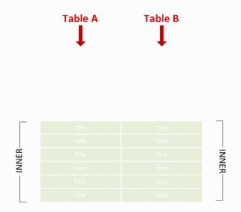
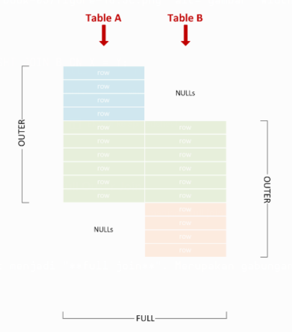
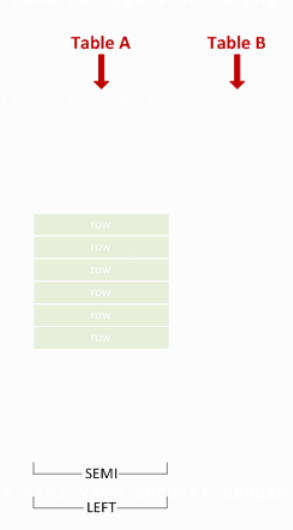
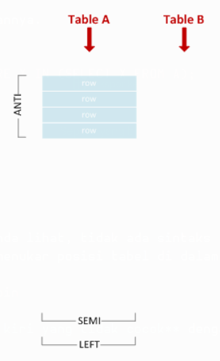
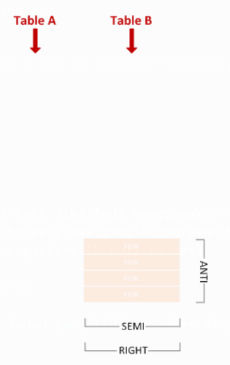
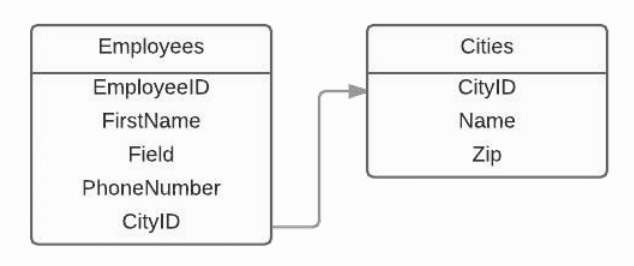
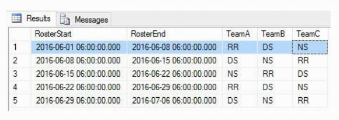

# Bab 1
## Memulai dengan SQL

| Versi | Nama Singkat | Standar | Tanggal Rilis |
| :--- | :--- | :--- | :--- |
| 1986 | SQL-86 | ANSI X3.135-1986, ISO 9075:1987 | 1986-01-01 |
| 1989 | SQL-89 | ANSI X3.135-1989, ISO/IEC 9075:1989 | 1989-01-01 |
| 1992 | SQL-92 | ISO/IEC 9075:1992 | 1992-01-01 |
| 1999 | SQL:1999 | ISO/IEC 9075:1999 | 1999-12-16 |
| 2003 | SQL:2003 | ISO/IEC 9075:2003 | 2003-12-15 |
| 2006 | SQL:2006 | ISO/IEC 9075:2006 | 2006-06-01 |
| 2008 | SQL:2008 | ISO/IEC 9075:2008 | 2008-07-15 |
| 2011 | SQL:2011 | ISO/IEC 9075:2011 | 2011-12-15 |
| 2016 | SQL:2016 | ISO/IEC 9075:2016 | 2016-12-01 |

### Bagian 1.1: Tinjauan Umum

**Structured Query Language (SQL)** adalah bahasa pemrograman bertujuan khusus yang dirancang untuk mengelola data yang disimpan dalam **Relational Database Management System (RDBMS)**. Bahasa yang mirip SQL juga dapat digunakan dalam Relational Data Stream Management Systems (RDSMS), atau dalam basis data "not-only SQL" (NoSQL).

SQL terdiri dari 3 sub-bahasa utama:

1.  **Data Definition Language (DDL)**: untuk membuat dan memodifikasi struktur basis data.
2.  **Data Manipulation Language (DML)**: untuk melakukan operasi Baca, Sisip, Perbarui, dan Hapus (Read, Insert, Update, Delete) pada data di dalam basis data.
3.  **Data Control Language (DCL)**: untuk mengontrol akses terhadap data yang disimpan di dalam basis data.

[Artikel SQL di Wikipedia](https://en.wikipedia.org/wiki/SQL)

Operasi inti DML adalah **Create, Read, Update, and Delete (disingkat CRUD)** yang dilakukan oleh pernyataan `INSERT`, `SELECT`, `UPDATE`, dan `DELETE`.

Ada juga pernyataan `MERGE` (baru-baru ini ditambahkan) yang dapat melakukan ketiga operasi tulis (`INSERT`, `UPDATE`, `DELETE`).

[Artikel CRUD di Wikipedia](https://en.wikipedia.org/wiki/Create,_read,_update_and_delete)

Banyak basis data SQL diimplementasikan sebagai sistem klien/server; istilah "SQL server" menggambarkan basis data semacam itu. Pada saat yang sama, Microsoft membuat sebuah basis data yang bernama "SQL Server". Meskipun basis data tersebut menggunakan dialek SQL, informasi yang spesifik untuk basis data tersebut tidak relevan dalam tag ini, melainkan menjadi bagian dari dokumentasi SQL Server.

# Bab 2
## Identifier (Pengenal)

Topik ini membahas tentang *identifier* (pengenal), yaitu aturan sintaks untuk nama tabel, kolom, dan objek basis data lainnya.

Jika diperlukan, contoh-contoh akan mencakup variasi yang digunakan oleh implementasi SQL yang berbeda, atau mengidentifikasi implementasi SQL dari contoh tersebut.

### Bagian 2.1: Identifier Tanpa Tanda Kutip (*Unquoted identifiers*)

*Identifier* tanpa tanda kutip dapat menggunakan huruf (a-z), angka (0-9), dan garis bawah (\_), dan harus dimulai dengan huruf.

Tergantung pada implementasi SQL dan/atau pengaturan basis data, karakter lain mungkin diizinkan, beberapa bahkan sebagai karakter pertama, contohnya:

  * **MS SQL**: @, $, \#, dan huruf Unicode lainnya ([sumber](https://docs.microsoft.com/en-us/sql/relational-databases/databases/database-identifiers))
  * **MySQL**: $ ([sumber](https://dev.mysql.com/doc/refman/8.0/en/identifiers.html))
  * **Oracle**: $, \#, dan huruf lain dari set karakter basis data ([sumber](https://www.google.com/search?q=https://docs.oracle.com/database/121/SQLRF/sql_elements008.htm%23SQLRF00223))
  * **PostgreSQL**: $, dan huruf Unicode lainnya ([sumber](https://www.google.com/search?q=https://www.postgresql.org/docs/current/static/sql-syntax-lexical.html%23SQL-SYNTAX-IDENTIFIERS))

*Identifier* tanpa tanda kutip bersifat *case-insensitive* (tidak membedakan huruf besar/kecil). Cara penanganannya sangat bergantung pada implementasi SQL:

  * **MS SQL**: *Case-preserving* (mempertahankan huruf besar/kecil), sensitivitas ditentukan oleh set karakter basis data, jadi bisa jadi *case-sensitive*.
  * **MySQL**: *Case-preserving*, sensitivitas bergantung pada pengaturan basis data dan sistem file yang mendasarinya.
  * **Oracle**: Dikonversi menjadi huruf besar, lalu ditangani seperti *identifier* dengan tanda kutip.
  * **PostgreSQL**: Dikonversi menjadi huruf kecil, lalu ditangani seperti *identifier* dengan tanda kutip.
  * **SQLite**: *Case-preserving*; *case-insensitivity* hanya untuk karakter ASCII.

# Bab 3
## Tipe Data

### Bagian 3.1: DECIMAL dan NUMERIC

Angka desimal dengan presisi dan skala tetap. `DECIMAL` dan `NUMERIC` secara fungsional setara.

**Sintaks:**

```sql
DECIMAL ( presisi [ , skala] )
NUMERIC ( presisi [ , skala] )
```

**Contoh:**

```sql
SELECT CAST(123 AS DECIMAL(5,2)) --menghasilkan 123.00
SELECT CAST(12345.12 AS NUMERIC(10,5)) --menghasilkan 12345.12000
```

### Bagian 3.2: FLOAT dan REAL

Tipe data angka perkiraan untuk digunakan dengan data numerik *floating point*.

```sql
SELECT CAST( PI() AS FLOAT) --menghasilkan 3.14159265358979
SELECT CAST( PI() AS REAL) --menghasilkan 3.141593
```

### Bagian 3.3: Integer

Tipe data angka pasti yang menggunakan data integer.

| Tipe Data | Jangkauan | Penyimpanan |
| :--- | :--- | :--- |
| **bigint** | -2^63 (-9,223,372,036,854,775,808) hingga 2^63-1 (9,223,372,036,854,775,807) | 8 Byte |
| **int** | -2^31 (-2,147,483,648) hingga 2^31-1 (2,147,483,647) | 4 Byte |
| **smallint** | -2^15 (-32,768) hingga 2^15-1 (32,767) | 2 Byte |
| **tinyint** | 0 hingga 255 | 1 Byte |

### Bagian 3.4: MONEY dan SMALLMONEY

Tipe data yang merepresentasikan nilai moneter atau mata uang.

| Tipe Data | Jangkauan | Penyimpanan |
| :--- | :--- | :--- |
| **money** | -922,337,203,685,477.5808 hingga 922,337,203,685,477.5807 | 8 byte |
| **smallmoney** | -214,748.3648 hingga 214,748.3647 | 4 byte |

### Bagian 3.5: BINARY dan VARBINARY

Tipe data biner dengan panjang tetap atau panjang variabel.

**Sintaks:**

```sql
BINARY [ ( n_byte ) ]
VARBINARY [ ( n_byte | max ) ]
```

`n_byte` bisa berupa angka dari 1 hingga 8000 byte. `max` menunjukkan bahwa ruang penyimpanan maksimum adalah 2^31-1.

**Contoh:**

```sql
SELECT CAST(12345 AS BINARY(10)) -- 0x00000000000000003039
SELECT CAST(12345 AS VARBINARY(10)) -- 0x00003039
```

### Bagian 3.6: CHAR dan VARCHAR

Tipe data string dengan panjang tetap atau panjang variabel.

**Sintaks:**

```sql
CHAR [ ( n_karakter ) ]
VARCHAR [ ( n_karakter ) ]
```

**Contoh:**

```sql
SELECT CAST('ABC' AS CHAR(10)) -- 'ABC       ' (diisi dengan spasi di sebelah kanan)
SELECT CAST('ABC' AS VARCHAR(10)) -- 'ABC' (tanpa pengisi karena karakter variabel)
SELECT CAST('ABCDEFGHIJKLMNOPQRSTUVWXYZ' AS CHAR(10)) -- 'ABCDEFGHIJ' (dipotong menjadi 10 karakter)
```

### Bagian 3.7: NCHAR dan NVARCHAR

Tipe data string UNICODE dengan panjang tetap atau panjang variabel.

**Sintaks:**

```sql
NCHAR [ ( n_karakter ) ]
NVARCHAR [ ( n_karakter | MAX ) ]
```

Gunakan `MAX` untuk string yang sangat panjang yang mungkin melebihi 8000 karakter.

### Bagian 3.8: UNIQUEIDENTIFIER

Sebuah GUID / UUID 16-byte.

```sql
DECLARE @GUID UNIQUEIDENTIFIER = NEWID();
SELECT @GUID -- 'E28B3BD9-9174-41A9-8508-899A78A33540'

DECLARE @bad_GUID_string VARCHAR(100) = 'E28B3BD9-9174-41A9-8508-899A78A33540_foobarbaz'
SELECT
@bad_GUID_string,
-- 'E28B3BD9-9174-41A9-8508-899A78A33540_foobarbaz'
CONVERT(UNIQUEIDENTIFIER, @bad_GUID_string) -- 'E28B3BD9-9174-41A9-8508-899A78A33540'
```

# Bab 4
## NULL

`NULL` dalam SQL, serta dalam pemrograman secara umum, secara harfiah berarti "tidak ada apa-apa". Dalam SQL, lebih mudah dipahami sebagai **"tidak adanya nilai apa pun"**.

Penting untuk membedakannya dari nilai yang tampaknya kosong, seperti string kosong `''` atau angka `0`, yang keduanya sebenarnya bukan `NULL`.

Penting juga untuk berhati-hati agar tidak membungkus `NULL` dengan tanda kutip, seperti `'NULL'`, yang diizinkan dalam kolom yang menerima teks, tetapi itu bukan `NULL` dan dapat menyebabkan kesalahan serta kumpulan data yang salah.

### Bagian 4.1: Memfilter NULL dalam kueri

Sintaks untuk memfilter `NULL` (yaitu, ketiadaan nilai) dalam blok `WHERE` sedikit berbeda dari memfilter nilai tertentu.

```sql
SELECT * FROM Employees WHERE ManagerId IS NULL ;
SELECT * FROM Employees WHERE ManagerId IS NOT NULL ;
```

Perhatikan bahwa karena `NULL` tidak sama dengan apa pun, bahkan dengan dirinya sendiri, penggunaan operator kesetaraan `= NULL` atau `<> NULL` (atau `!= NULL`) akan selalu menghasilkan nilai kebenaran `UNKNOWN` yang akan ditolak oleh `WHERE`.

`WHERE` memfilter semua baris yang kondisinya `FALSE` atau `UNKNOWN` dan hanya mempertahankan baris yang kondisinya `TRUE`.

### Bagian 4.2: Kolom yang dapat bernilai NULL (*Nullable*) di dalam tabel

Saat membuat tabel, dimungkinkan untuk mendeklarasikan sebuah kolom sebagai *nullable* (dapat bernilai null) atau *non-nullable* (tidak dapat bernilai null).

```sql
CREATE TABLE MyTable
(
    MyCol1 INT NOT NULL, -- non-nullable
    MyCol2 INT NULL      -- nullable
) ;
```

Secara *default*, setiap kolom (kecuali yang ada dalam batasan *primary key*) bersifat *nullable* kecuali kita secara eksplisit menetapkan batasan `NOT NULL`.

Mencoba memberikan nilai `NULL` ke kolom *non-nullable* akan mengakibatkan kesalahan.

```sql
INSERT INTO MyTable (MyCol1, MyCol2) VALUES (1, NULL) ;
-- berjalan dengan baik

INSERT INTO MyTable (MyCol1, MyCol2) VALUES (NULL, 2) ;
-- tidak dapat menyisipkan
-- nilai NULL ke dalam kolom 'MyCol1', tabel 'MyTable';
-- kolom tidak mengizinkan null. INSERT gagal.
```

### Bagian 4.3: Memperbarui field menjadi NULL

Mengatur sebuah *field* menjadi `NULL` bekerja persis seperti nilai lainnya:

```sql
UPDATE Employees
SET ManagerId = NULL
WHERE Id = 4
```

### Bagian 4.4: Menyisipkan baris dengan field NULL

Contohnya, menyisipkan seorang karyawan tanpa nomor telepon dan tanpa manajer ke dalam tabel contoh `Employees`:

```sql
INSERT INTO Employees
(Id, FName, LName, PhoneNumber, ManagerId, DepartmentId, Salary, HireDate)
VALUES
(5, 'Jane', 'Doe', NULL, NULL, 2, 800, '2016-07-22') ;
```

# Bab 5
## Contoh Basis Data dan Tabel

### Bagian 5.1: Basis Data Bengkel Mobil

Dalam contoh berikut - Basis data untuk bisnis bengkel mobil, kita memiliki daftar departemen, karyawan, pelanggan, dan mobil pelanggan. Kita menggunakan *foreign key* untuk membuat hubungan antar berbagai tabel.

Contoh langsung: [SQL fiddle](https://www.google.com/search?q=http://sqlfiddle.com/%23!9/1620c/1)

**Hubungan antar tabel**

  * Setiap Departemen dapat memiliki 0 atau lebih Karyawan
  * Setiap Karyawan dapat memiliki 0 atau 1 Manajer
  * Setiap Pelanggan dapat memiliki 0 atau lebih Mobil

**Departments**
| Id | Name |
| :--- | :--- |
| 1 | HR |
| 2 | Sales |
| 3 | Tech |

Pernyataan SQL untuk membuat tabel:

```sql
CREATE TABLE Departments (
    Id INT NOT NULL AUTO_INCREMENT,
    Name VARCHAR(25) NOT NULL,
    PRIMARY KEY(Id)
);

INSERT INTO Departments
    ([Id], [Name])
VALUES
    (1, 'HR'),
    (2, 'Sales'),
    (3, 'Tech')
;
```

**Employees**
| Id | FName | LName | PhoneNumber | ManagerId | DepartmentId | Salary | HireDate |
| :--- | :--- | :--- | :--- | :--- | :--- | :--- | :--- |
| 1 | James | Smith | 1234567890 | NULL | 1 | 1000 | 01-01-2002 |
| 2 | John | Johnson | 2468101214 | 1 | 1 | 400 | 23-03-2005 |
| 3 | Michael | Williams | 1357911131 | 1 | 2 | 600 | 12-05-2009 |
| 4 | Johnathon | Smith | 1212121212 | 2 | 1 | 500 | 24-07-2016 |

Pernyataan SQL untuk membuat tabel:

```sql
CREATE TABLE Employees (
    Id INT NOT NULL AUTO_INCREMENT,
    FName VARCHAR(35) NOT NULL,
    LName VARCHAR(35) NOT NULL,
    PhoneNumber VARCHAR(11),
    ManagerId INT,
    DepartmentId INT NOT NULL,
    Salary INT NOT NULL,
    HireDate DATETIME NOT NULL,
    PRIMARY KEY(Id),
    FOREIGN KEY (ManagerId) REFERENCES Employees(Id),
    FOREIGN KEY (DepartmentId) REFERENCES Departments(Id)
);

INSERT INTO Employees
    ([Id], [FName], [LName], [PhoneNumber], [ManagerId], [DepartmentId], [Salary], [HireDate])
VALUES
    (1, 'James', 'Smith', 1234567890, NULL, 1, 1000, '01-01-2002'),
    (2, 'John', 'Johnson', 2468101214, '1', 1, 400, '23-03-2005'),
    (3, 'Michael', 'Williams', 1357911131, '1', 2, 600, '12-05-2009'),
    (4, 'Johnathon', 'Smith', 1212121212, '2', 1, 500, '24-07-2016')
;
```

**Customers**
| Id | FName | LName | Email | PhoneNumber | PreferredContact |
| :--- | :--- | :--- | :--- | :--- | :--- |
| 1 | William | Jones | william.jones@example.com | 3347927472 | PHONE |
| 2 | David | Miller | dmiller@example.net | 2137921892 | EMAIL |
| 3 | Richard | Davis | richard0123@example.com | NULL | EMAIL |

Pernyataan SQL untuk membuat tabel:

```sql
CREATE TABLE Customers (
    Id INT NOT NULL AUTO_INCREMENT,
    FName VARCHAR(35) NOT NULL,
    LName VARCHAR(35) NOT NULL,
    Email varchar(100) NOT NULL,
    PhoneNumber VARCHAR(11),
    PreferredContact VARCHAR(5) NOT NULL,
    PRIMARY KEY(Id)
);

INSERT INTO Customers
    ([Id], [FName], [LName], [Email], [PhoneNumber], [PreferredContact])
VALUES
    (1, 'William', 'Jones', 'william.jones@example.com', '3347927472', 'PHONE'),
    (2, 'David', 'Miller', 'dmiller@example.net', '2137921892', 'EMAIL'),
    (3, 'Richard', 'Davis', 'richard0123@example.com', NULL, 'EMAIL')
;
```

**Cars**
| Id | CustomerId | EmployeeId | Model | Status | Total Cost |
| :--- | :--- | :--- | :--- | :--- | :--- |
| 1 | 1 | 2 | Ford F-150 | READY | 230 |
| 2 | 1 | 2 | Ford F-150 | READY | 200 |
| 3 | 2 | 1 | Ford Mustang | WAITING | 100 |
| 4 | 3 | 3 | Toyota Prius | WORKING | 1254 |

Pernyataan SQL untuk membuat tabel:

```sql
CREATE TABLE Cars (
    Id INT NOT NULL AUTO_INCREMENT,
    CustomerId INT NOT NULL,
    EmployeeId INT NOT NULL,
    Model varchar(50) NOT NULL,
    Status varchar(25) NOT NULL,
    TotalCost INT NOT NULL,
    PRIMARY KEY(Id),
    FOREIGN KEY (CustomerId) REFERENCES Customers(Id),
    FOREIGN KEY (EmployeeId) REFERENCES Employees(Id)
);

INSERT INTO Cars
    ([Id], [CustomerId], [EmployeeId], [Model], [Status], [TotalCost])
VALUES
    ('1', '1', '2', 'Ford F-150', 'READY', '230'),
    ('2', '1', '2', 'Ford F-150', 'READY', '200'),
    ('3', '2', '1', 'Ford Mustang', 'WAITING', '100'),
    ('4', '3', '3', 'Toyota Prius', 'WORKING', '1254')
;
```

### Bagian 5.2: Basis Data Perpustakaan

Dalam contoh basis data perpustakaan ini, kita memiliki tabel `Authors`, `Books`, dan `BooksAuthors`.

Contoh langsung: [SQL fiddle](https://www.google.com/search?q=http://sqlfiddle.com/%23!9/b0171/1)

`Authors` dan `Books` dikenal sebagai tabel dasar (*base tables*), karena mereka berisi definisi kolom dan data untuk entitas aktual dalam model relasional. `BooksAuthors` dikenal sebagai tabel hubungan (*relationship table*), karena tabel ini mendefinisikan hubungan antara tabel `Books` dan `Authors`.

**Hubungan antar tabel**

  * Setiap penulis dapat memiliki 1 atau lebih buku
  * Setiap buku dapat memiliki 1 atau lebih penulis

**Authors**
([lihat tabel](https://www.google.com/search?q=http://sqlfiddle.com/%23!9/b0171/2))
| Id | Name | Country |
| :--- | :--- | :--- |
| 1 | J.D. Salinger | USA |
| 2 | F. Scott. Fitzgerald | USA |
| 3 | Jane Austen | UK |
| 4 | Scott Hanselman | USA |
| 5 | Jason N. Gaylord | USA |
| 6 | Pranav Rastogi | India |
| 7 | Todd Miranda | USA |
| 8 | Christian Wenz | USA |

SQL untuk membuat tabel:

```sql
CREATE TABLE Authors (
    Id INT NOT NULL AUTO_INCREMENT,
    Name VARCHAR(70) NOT NULL,
    Country VARCHAR(100) NOT NULL,
    PRIMARY KEY(Id)
);

INSERT INTO Authors
    (Name, Country)
VALUES
    ('J.D. Salinger', 'USA'),
    ('F. Scott. Fitzgerald', 'USA'),
    ('Jane Austen', 'UK'),
    ('Scott Hanselman', 'USA'),
    ('Jason N. Gaylord', 'USA'),
    ('Pranav Rastogi', 'India'),
    ('Todd Miranda', 'USA'),
    ('Christian Wenz', 'USA')
;
```

**Books**
([lihat tabel](https://www.google.com/search?q=http://sqlfiddle.com/%23!9/b0171/3))
| Id | Title |
| :--- | :--- |
| 1 | The Catcher in the Rye |
| 2 | Nine Stories |
| 3 | Franny and Zooey |
| 4 | The Great Gatsby |
| 5 | Tender id the Night |
| 6 | Pride and Prejudice |
| 7 | Professional ASP.NET 4.5 in C\# and VB |

SQL untuk membuat tabel:

```sql
CREATE TABLE Books (
    Id INT NOT NULL AUTO_INCREMENT,
    Title VARCHAR(50) NOT NULL,
    PRIMARY KEY(Id)
);

INSERT INTO Books
    (Id, Title)
VALUES
    (1, 'The Catcher in the Rye'),
    (2, 'Nine Stories'),
    (3, 'Franny and Zooey'),
    (4, 'The Great Gatsby'),
    (5, 'Tender id the Night'),
    (6, 'Pride and Prejudice'),
    (7, 'Professional ASP.NET 4.5 in C# and VB')
;
```

**BooksAuthors**
([lihat tabel](https://www.google.com/search?q=http://sqlfiddle.com/%23!9/b0171/4))
| BookId | AuthorId |
| :--- | :--- |
| 1 | 1 |
| 2 | 1 |
| 3 | 1 |
| 4 | 2 |
| 5 | 2 |
| 6 | 3 |
| 7 | 4 |
| 7 | 5 |
| 7 | 6 |
| 7 | 7 |
| 7 | 8 |

SQL untuk membuat tabel:

```sql
CREATE TABLE BooksAuthors (
    AuthorId INT NOT NULL,
    BookId INT NOT NULL,
    FOREIGN KEY (AuthorId) REFERENCES Authors(Id),
    FOREIGN KEY (BookId) REFERENCES Books(Id)
);

INSERT INTO BooksAuthors
    (BookId, AuthorId)
VALUES
    (1, 1), (2, 1), (3, 1),
    (4, 2), (5, 2), (6, 3),
    (7, 4), (7, 5), (7, 6),
    (7, 7), (7, 8)
;
```

**Contoh-contoh**

Lihat semua penulis ([lihat contoh langsung](https://www.google.com/search?q=http://sqlfiddle.com/%23!9/b0171/2)):

```sql
SELECT * FROM Authors;
```

Lihat semua judul buku ([lihat contoh langsung](https://www.google.com/search?q=http://sqlfiddle.com/%23!9/b0171/3)):

```sql
SELECT * FROM Books;
```

Lihat semua buku dan penulisnya ([lihat contoh langsung](https://www.google.com/search?q=http://sqlfiddle.com/%23!9/b0171/1)):

```sql
SELECT
    ba.AuthorId,
    a.Name AuthorName,
    ba.BookId,
    b.Title BookTitle
FROM BooksAuthors ba
INNER JOIN Authors a ON a.id = ba.authorid
INNER JOIN Books b ON b.id = ba.bookid
;
```

### Bagian 5.3: Tabel Negara (Countries)

Dalam contoh ini, kita memiliki tabel `Countries`. Tabel negara memiliki banyak kegunaan, terutama dalam aplikasi Keuangan yang melibatkan mata uang dan nilai tukar.

Contoh langsung: [SQL fiddle](https://www.google.com/search?q=http://sqlfiddle.com/%23!9/24483/1)

Beberapa aplikasi perangkat lunak data pasar seperti Bloomberg dan Reuters mengharuskan Anda memberikan API mereka kode negara 2 atau 3 karakter bersama dengan kode mata uang. Oleh karena itu, tabel contoh ini memiliki kolom kode ISO 2 karakter dan kolom kode ISO3 3 karakter.

**Countries**
([lihat tabel](https://www.google.com/search?q=http://sqlfiddle.com/%23!9/24483/1))
| Id | ISO | ISO3 | ISONumeric | CountryName | Capital | ContinentCode | CurrencyCode |
| :--- | :--- | :--- | :--- | :--- | :--- | :--- | :--- |
| 1 | AU | AUS | 36 | Australia | Canberra | OC | AUD |
| 2 | DE | DEU | 276 | Germany | Berlin | EU | EUR |
| 3 | IN | IND | 356 | India | New Delhi | AS | INR |
| 4 | LA | LAO | 418 | Laos | Vientiane | AS | LAK |
| 5 | US | USA | 840 | United States | Washington | NA | USD |
| 6 | ZW | ZWE | 716 | Zimbabwe | Harare | AF | ZWL |

SQL untuk membuat tabel:

```sql
CREATE TABLE Countries (
    Id INT NOT NULL AUTO_INCREMENT,
    ISO VARCHAR(2) NOT NULL,
    ISO3 VARCHAR(3) NOT NULL,
    ISONumeric INT NOT NULL,
    CountryName VARCHAR(64) NOT NULL,
    Capital VARCHAR(64) NOT NULL,
    ContinentCode VARCHAR(2) NOT NULL,
    CurrencyCode VARCHAR(3) NOT NULL,
    PRIMARY KEY(Id)
)
;

INSERT INTO Countries
    (ISO, ISO3, ISONumeric, CountryName, Capital, ContinentCode, CurrencyCode)
VALUES
    ('AU', 'AUS', 36, 'Australia', 'Canberra', 'OC', 'AUD'),
    ('DE', 'DEU', 276, 'Germany', 'Berlin', 'EU', 'EUR'),
    ('IN', 'IND', 356, 'India', 'New Delhi', 'AS', 'INR'),
    ('LA', 'LAO', 418, 'Laos', 'Vientiane', 'AS', 'LAK'),
    ('US', 'USA', 840, 'United States', 'Washington', 'NA', 'USD'),
    ('ZW', 'ZWE', 716, 'Zimbabwe', 'Harare', 'AF', 'ZWL')
;
```

---

## Bab 6: SELECT

Pernyataan `SELECT` adalah inti dari sebagian besar kueri SQL. Pernyataan ini mendefinisikan set hasil (*result set*) apa yang harus dikembalikan oleh kueri, dan hampir selalu digunakan bersama dengan klausa `FROM`, yang mendefinisikan bagian mana dari basis data yang harus dikueri.

### Bagian 6.1: Menggunakan karakter wildcard untuk memilih semua kolom dalam sebuah kueri

Perhatikan sebuah basis data dengan dua tabel berikut.

Tabel **Employees**:
| Id | FName | LName | DeptId |
| :--- | :--- | :--- | :--- |
| 1 | James | Smith | 3 |
| 2 | John | Johnson | 4 |

Tabel **Departments**:
| Id | Name |
| :--- | :--- |
| 1 | Sales |
| 2 | Marketing |
| 3 | Finance |
| 4 | IT |

**Pernyataan `SELECT` sederhana**

`*` adalah karakter *wildcard* yang digunakan untuk memilih semua kolom yang tersedia dalam sebuah tabel.

Ketika digunakan sebagai pengganti nama kolom eksplisit, ia mengembalikan semua kolom di semua tabel yang dipilih oleh kueri melalui klausa `FROM`. Efek ini berlaku untuk semua tabel yang diakses kueri melalui klausa `JOIN`.

Perhatikan kueri berikut:

```sql
SELECT * FROM Employees
```

Ini akan mengembalikan semua *field* dari semua baris tabel `Employees`:
| Id | FName | LName | DeptId |
| :--- | :--- | :--- | :--- |
| 1 | James | Smith | 3 |
| 2 | John | Johnson | 4 |

**Notasi Titik (Dot Notation)**

Untuk memilih semua nilai dari tabel tertentu, karakter *wildcard* dapat diterapkan ke tabel dengan notasi titik.

Perhatikan kueri berikut:

```sql
SELECT
    Employees.*,
    Departments.Name
FROM
    Employees
JOIN
    Departments
    ON Departments.Id = Employees.DeptId
```

Ini akan mengembalikan set data dengan semua *field* pada tabel `Employee`, diikuti hanya oleh *field* `Name` dari tabel `Departments`:
| Id | FName | LName | DeptId | Name |
| :--- | :--- | :--- | :--- | :--- |
| 1 | James | Smith | 3 | Finance |
| 2 | John | Johnson | 4 | IT |

**Peringatan Terhadap Penggunaan `*`**

Secara umum disarankan agar penggunaan `*` dihindari dalam kode produksi jika memungkinkan, karena dapat menyebabkan sejumlah masalah potensial termasuk:

1.  **Beban IO, jaringan, dan penggunaan memori yang berlebihan**, karena mesin basis data membaca data yang tidak diperlukan dan mengirimkannya ke kode *front-end*. Ini menjadi perhatian khusus jika ada *field* besar seperti yang digunakan untuk menyimpan catatan panjang atau file lampiran.
2.  **Beban IO berlebih lebih lanjut** jika basis data perlu menampung hasil internal ke disk sebagai bagian dari pemrosesan untuk kueri yang lebih kompleks daripada `SELECT <kolom> FROM <table>`.
3.  **Pemrosesan ekstra** (dan/atau lebih banyak IO) jika beberapa kolom yang tidak dibutuhkan adalah:
      * kolom terkomputasi (*computed columns*) di basis data yang mendukungnya.
      * dalam kasus memilih dari sebuah *view*, kolom dari tabel/*view* yang sebenarnya bisa dioptimalkan oleh *query optimizer*.
4.  **Potensi kesalahan tak terduga** jika kolom ditambahkan ke tabel dan *view* di kemudian hari yang mengakibatkan nama kolom ambigu. Contohnya `SELECT * FROM orders JOIN people ON people.id = orders.personid ORDER BY displayname` - jika kolom bernama `displayname` ditambahkan ke tabel `orders` untuk memungkinkan pengguna memberikan nama yang berarti pada pesanan mereka untuk referensi di masa mendatang, maka nama kolom tersebut akan muncul dua kali dalam output sehingga klausa `ORDER BY` akan ambigu yang dapat menyebabkan kesalahan ("ambiguous column name" di versi MS SQL Server terbaru), dan jika tidak dalam contoh ini, kode aplikasi Anda mungkin mulai menampilkan nama pesanan di tempat yang seharusnya nama orang karena kolom baru adalah yang pertama dengan nama itu yang dikembalikan, dan seterusnya.

**Kapan Anda Bisa Menggunakan `*`, Mengingat Peringatan di Atas?**

Meskipun sebaiknya dihindari dalam kode produksi, menggunakan `*` baik-baik saja sebagai singkatan saat melakukan kueri manual terhadap basis data untuk investigasi atau pekerjaan prototipe.

Terkadang keputusan desain dalam aplikasi Anda membuatnya tidak dapat dihindari (dalam keadaan seperti itu, lebih baik gunakan `nama_alias_tabel.*` daripada hanya `*` jika memungkinkan).

Saat menggunakan `EXISTS`, seperti `SELECT A.col1, A.Col2 FROM A WHERE EXISTS (SELECT * FROM B where A.ID = B.A_ID)`, kita tidak mengembalikan data apa pun dari B. Jadi, `JOIN` tidak diperlukan, dan mesin tahu tidak ada nilai dari B yang akan dikembalikan, sehingga tidak ada penurunan kinerja karena menggunakan `*`. Demikian pula, `COUNT(*)` baik-baik saja karena juga tidak benar-benar mengembalikan kolom apa pun, jadi hanya perlu membaca dan memproses kolom yang digunakan untuk tujuan pemfilteran.

### Bagian 6.2: SELECT Menggunakan Alias Kolom

Alias kolom digunakan terutama untuk mempersingkat kode dan membuat nama kolom lebih mudah dibaca.

Kode menjadi lebih pendek karena nama tabel yang panjang dan identifikasi kolom yang tidak perlu (misalnya, mungkin ada 2 ID di tabel, tetapi hanya satu yang digunakan dalam pernyataan) dapat dihindari. Bersama dengan alias tabel, ini memungkinkan Anda menggunakan nama deskriptif yang lebih panjang dalam struktur basis data Anda sambil menjaga kueri pada struktur tersebut tetap ringkas.

Selain itu, terkadang alias diperlukan, misalnya dalam *view*, untuk menamai output yang dihitung.

**Semua Versi SQL**

Alias dapat dibuat di semua versi SQL menggunakan tanda kutip ganda (`"`).

```sql
SELECT
    FName AS "First Name",
    MName AS "Middle Name",
    LName AS "Last Name"
FROM Employees
```

**Versi SQL yang Berbeda**

Anda dapat menggunakan tanda kutip tunggal (`'`), tanda kutip ganda (`"`), dan kurung siku (`[]`) untuk membuat alias di Microsoft SQL Server.

```sql
SELECT
    FName AS "First Name",
    MName AS 'Middle Name',
    LName AS [Last Name]
FROM Employees
```

Keduanya akan menghasilkan:
| First Name | Middle Name | Last Name |
| :--- | :--- | :--- |
| James | John | Smith |
| John | James | Johnson |
| Michael | Marcus | Williams |

Pernyataan ini akan mengembalikan kolom `FName` dan `LName` dengan nama yang diberikan (sebuah alias). Ini dicapai dengan menggunakan operator `AS` diikuti oleh alias, atau hanya dengan menulis alias langsung setelah nama kolom. Ini berarti kueri berikut memiliki hasil yang sama seperti di atas.

```sql
SELECT
    FName "First Name",
    MName "Middle Name",
    LName "Last Name"
FROM Employees
```

| First Name | Middle Name | Last Name |
| :--- | :--- | :--- |
| James | John | Smith |
| John | James | Johnson |
| Michael | Marcus | Williams |

Namun, versi eksplisit (yaitu, menggunakan operator `AS`) lebih mudah dibaca.

Jika alias hanya terdiri dari satu kata yang bukan merupakan kata kunci cadangan (*reserved word*), kita dapat menuliskannya tanpa tanda kutip tunggal, ganda, atau kurung siku:

```sql
SELECT
    FName AS FirstName,
    LName AS LastName
FROM Employees
```

| FirstName | LastName |
| :--- | :--- |
| James | Smith |
| John | Johnson |
| Michael | Williams |

Variasi lebih lanjut yang tersedia di MS SQL Server antara lain adalah `<alias> = <kolom-atau-perhitungan>`, misalnya:

```sql
SELECT FullName = FirstName + ' ' + LastName,
       Addr1   = FullStreetAddress,
       Addr2   = TownName
FROM CustomerDetails
```

yang setara dengan:

```sql
SELECT FirstName + ' ' + LastName AS FullName,
       FullStreetAddress          AS Addr1,
       TownName                   AS Addr2
FROM CustomerDetails
```

Keduanya akan menghasilkan:
| FullName | Addr1 | Addr2 |
| :--- | :--- | :--- |
| James Smith | 123 AnyStreet | TownVille |
| John Johnson | 668 MyRoad | Anytown |
| Michael Williams | 999 High End Dr | Williamsburgh |

Beberapa orang merasa menggunakan `=` lebih mudah dibaca daripada `AS`, meskipun banyak yang tidak merekomendasikan format ini, terutama karena tidak standar sehingga tidak didukung secara luas oleh semua basis data. Ini dapat menyebabkan kebingungan dengan penggunaan lain dari karakter `=`.

**Semua Versi SQL**

Juga, jika Anda perlu menggunakan kata kunci cadangan, Anda dapat menggunakan kurung atau tanda kutip untuk melakukan *escape*:

```sql
SELECT
    FName as "SELECT",
    MName as "FROM",
    LName as "WHERE"
FROM Employees
```

**Versi SQL yang Berbeda**

Demikian pula, Anda dapat melakukan *escape* pada kata kunci di MSSQL dengan semua pendekatan yang berbeda:

```sql
SELECT
    FName AS "SELECT",
    MName AS 'FROM',
    LName AS [WHERE]
FROM Employees
```

| SELECT | FROM | WHERE |
| :--- | :--- | :--- |
| James | John | Smith |
| John | James | Johnson |
| Michael | Marcus | Williams |

Juga, alias kolom dapat digunakan di salah satu klausa akhir dari kueri yang sama, seperti `ORDER BY`:

```sql
SELECT
    FName AS FirstName,
    LName AS LastName
FROM
    Employees
ORDER BY
    LastName DESC
```

Namun, Anda tidak dapat menggunakan:

```sql
SELECT
    FName AS SELECT,
    LName AS FROM
FROM
    Employees
ORDER BY
    LastName DESC
```

untuk membuat alias dari kata kunci cadangan ini (`SELECT` dan `FROM`). Ini akan menyebabkan banyak kesalahan saat eksekusi.

### Bagian 6.3: Memilih Kolom Individual

```sql
SELECT
    PhoneNumber,
    Email,
    PreferredContact
FROM Customers
```

Pernyataan ini akan mengembalikan kolom `PhoneNumber`, `Email`, dan `PreferredContact` dari semua baris tabel `Customers`. Kolom-kolom tersebut juga akan dikembalikan sesuai urutan kemunculannya dalam klausa `SELECT`.

Hasilnya akan menjadi:
| PhoneNumber | Email | PreferredContact |
| :--- | :--- | :--- |
| 3347927472 | william.jones@example.com | PHONE |
| 2137921892 | dmiller@example.net | EMAIL |
| NULL | richard0123@example.com | EMAIL |

Jika beberapa tabel digabungkan, Anda dapat memilih kolom dari tabel tertentu dengan menentukan nama tabel sebelum nama kolom: `[nama_tabel].[nama_kolom]`

```sql
SELECT
    Customers.PhoneNumber,
    Customers.Email,
    Customers.PreferredContact,
    Orders.Id AS OrderId
FROM
    Customers
LEFT JOIN
    Orders ON Orders.CustomerId = Customers.Id
```

\*`AS OrderId` berarti bahwa *field* `Id` dari tabel `Orders` akan dikembalikan sebagai kolom bernama `OrderId`. Lihat [memilih dengan alias kolom](https://www.google.com/search?q=%23bagian-62-select-menggunakan-alias-kolom) untuk informasi lebih lanjut.

Untuk menghindari penggunaan nama tabel yang panjang, Anda dapat menggunakan alias tabel. Ini mengurangi kesulitan menulis nama tabel yang panjang untuk setiap *field* yang Anda pilih dalam `JOIN`. Jika Anda melakukan *self join* (penggabungan antara dua instance dari tabel yang sama), maka Anda harus menggunakan alias tabel untuk membedakan tabel Anda. Kita bisa menulis alias tabel seperti `Customers c` atau `Customers AS c`. Di sini `c` berfungsi sebagai alias untuk `Customers` dan kita bisa memilih, katakanlah, `Email` seperti ini: `c.Email`.

```sql
SELECT
    c.PhoneNumber,
    c.Email,
    c.PreferredContact,
    o.Id AS OrderId
FROM
    Customers c
LEFT JOIN
    Orders o ON o.CustomerId = c.Id
```

### Bagian 6.4: Memilih sejumlah record tertentu

Standar SQL 2008 mendefinisikan klausa `FETCH FIRST` untuk membatasi jumlah *record* yang dikembalikan.

```sql
SELECT Id, ProductName, UnitPrice, Package
FROM Product
ORDER BY UnitPrice DESC
FETCH FIRST 10 ROWS ONLY
```

Standar ini hanya didukung di versi terbaru dari beberapa RDBMS. Sintaks non-standar yang spesifik untuk vendor disediakan di sistem lain. Progress OpenEdge 11.x juga mendukung sintaks `FETCH FIRST <n> ROWS ONLY`.

Selain itu, `OFFSET <m> ROWS` sebelum `FETCH FIRST <n> ROWS ONLY` memungkinkan untuk melewati baris sebelum mengambil baris.

```sql
SELECT Id, ProductName, UnitPrice, Package
FROM Product
ORDER BY UnitPrice DESC
OFFSET 5 ROWS
FETCH FIRST 10 ROWS ONLY
```

Kueri berikut didukung di SQL Server dan MS Access:

```sql
SELECT TOP 10 Id, ProductName, UnitPrice, Package
FROM Product
ORDER BY UnitPrice DESC
```

Untuk melakukan hal yang sama di MySQL atau PostgreSQL, kata kunci `LIMIT` harus digunakan:

```sql
SELECT Id, ProductName, UnitPrice, Package
FROM Product
ORDER BY UnitPrice DESC
LIMIT 10
```

Di Oracle, hal yang sama dapat dilakukan dengan `ROWNUM`:

```sql
SELECT Id, ProductName, UnitPrice, Package
FROM Product
WHERE ROWNUM <= 10
ORDER BY UnitPrice DESC
```

**Hasil**: 10 record.
| Id | ProductName | UnitPrice | Package |
| :--- | :--- | :--- | :--- |
| 38 | Côte de Blaye | 263.50 | 12 - 75 cl bottles |
| 29 | Thüringer Rostbratwurst | 123.79 | 50 bags x 30 sausgs. |
| 9 | Mishi Kobe Niku | 97.00 | 18 - 500 g pkgs. |
| 20 | Sir Rodney's Marmalade | 81.00 | 30 gift boxes |
| 18 | Carnarvon Tigers | 62.50 | 16 kg pkg. |
| 59 | Raclette Courdavault | 55.00 | 5 kg pkg. |
| 51 | Manjimup Dried Apples | 53.00 | 50 - 300 g pkgs. |
| 62 | Tarte au sucre | 49.30 | 48 pies |
| 43 | Ipoh Coffee | 46.00 | 16 - 500 g tins |
| 28 | Rössle Sauerkraut | 45.60 | 25 - 825 g cans |

**Nuansa Vendor:**
Penting untuk dicatat bahwa `TOP` di Microsoft SQL beroperasi setelah klausa `WHERE` dan akan mengembalikan jumlah hasil yang ditentukan jika mereka ada di mana saja di tabel, sementara `ROWNUM` bekerja sebagai bagian dari klausa `WHERE` sehingga jika kondisi lain tidak ada dalam jumlah baris yang ditentukan di awal tabel, Anda akan mendapatkan nol hasil padahal mungkin ada hasil lain yang bisa ditemukan.

### Bagian 6.5: Memilih dengan Kondisi

Sintaks dasar `SELECT` dengan klausa `WHERE` adalah:

```sql
SELECT kolom1, kolom2, kolomN
FROM nama_tabel
WHERE [kondisi]
```

`[kondisi]` bisa berupa ekspresi SQL apa pun, yang ditentukan menggunakan operator perbandingan atau logis seperti `>`, `<`, `=`, `<>`, `>=`, `<=`, `LIKE`, `NOT`, `IN`, `BETWEEN`, dll.

Pernyataan berikut mengembalikan semua kolom dari tabel 'Cars' di mana kolom `status` adalah 'READY':

```sql
SELECT * FROM Cars WHERE status = 'READY'
```

Lihat `WHERE` dan `HAVING` untuk contoh lebih lanjut.

### Bagian 6.6: Memilih dengan CASE

Ketika hasil perlu menerapkan beberapa logika 'secara langsung', seseorang dapat menggunakan pernyataan `CASE` untuk mengimplementasikannya.

```sql
SELECT CASE WHEN Col1 < 50 THEN 'under' ELSE 'over' END threshold
FROM TableName
```

Juga dapat dirangkai:

```sql
SELECT
    CASE WHEN Col1 < 50 THEN 'under'
         WHEN Col1 > 50 AND Col1 < 100 THEN 'between'
         ELSE 'over'
    END threshold
FROM TableName
```

Seseorang juga dapat memiliki `CASE` di dalam pernyataan `CASE` lain:

```sql
SELECT
    CASE WHEN Col1 < 50 THEN 'under'
         ELSE
             CASE WHEN Col1 > 50 AND Col1 < 100 THEN Col1
                  ELSE 'over' END
    END threshold
FROM TableName
```

### Bagian 6.7: Memilih kolom yang dinamai dengan kata kunci cadangan

Ketika nama kolom cocok dengan kata kunci cadangan (*reserved keyword*), SQL standar mengharuskan Anda untuk melampirkannya dalam tanda kutip ganda:

```sql
SELECT
    "ORDER",
    ID
FROM ORDERS
```

Perhatikan bahwa ini membuat nama kolom menjadi *case-sensitive*.

Beberapa DBMS memiliki cara-cara proprietary untuk mengutip nama. Misalnya, SQL Server menggunakan kurung siku untuk tujuan ini:

```sql
SELECT
    [Order],
    ID
FROM ORDERS
```

sementara MySQL (dan MariaDB) secara default menggunakan *backtick*:

```sql
SELECT
    `Order`,
    id
FROM orders
```

### Bagian 6.8: Memilih dengan alias tabel

```sql
SELECT e.Fname, e.LName
FROM Employees e
```

Tabel `Employees` diberi alias 'e' langsung setelah nama tabel. Ini membantu menghilangkan ambiguitas dalam skenario di mana beberapa tabel memiliki nama *field* yang sama dan Anda perlu spesifik dari tabel mana Anda ingin mengembalikan data.

```sql
SELECT e.Fname, e.LName, m.Fname AS ManagerFirstName
FROM Employees e
JOIN Managers m ON e.ManagerId = m.Id
```

Perhatikan bahwa setelah Anda mendefinisikan sebuah alias, Anda tidak dapat menggunakan nama tabel kanonik lagi. Yaitu:

```sql
SELECT e.Fname, Employees.LName, m.Fname AS ManagerFirstName
FROM Employees e
JOIN Managers m ON e.ManagerId = m.Id
```

akan menghasilkan kesalahan.

Perlu dicatat bahwa alias tabel -- lebih formal disebut 'variabel rentang' (*range variables*) -- diperkenalkan ke dalam bahasa SQL untuk menyelesaikan masalah kolom duplikat yang disebabkan oleh `INNER JOIN`. Standar SQL 1992 memperbaiki kelemahan desain sebelumnya ini dengan memperkenalkan `NATURAL JOIN` (diimplementasikan di MySQL, PostgreSQL, dan Oracle tetapi belum di SQL Server), yang hasilnya tidak pernah memiliki nama kolom duplikat. Contoh di atas menarik karena tabel digabungkan pada kolom dengan nama yang berbeda (`Id` dan `ManagerId`) tetapi tidak seharusnya digabungkan pada kolom dengan nama yang sama (`LName`, `FName`), yang mengharuskan penggantian nama kolom dilakukan sebelum `JOIN`:

```sql
SELECT Fname, LName, ManagerFirstName
FROM Employees
NATURAL JOIN
    ( SELECT Id AS ManagerId, Fname AS ManagerFirstName
      FROM Managers ) m;
```

Perhatikan bahwa meskipun alias/variabel rentang harus dideklarasikan untuk tabel turunan (*derived table*) (jika tidak, SQL akan menghasilkan kesalahan), tidak pernah masuk akal untuk benar-benar menggunakannya dalam kueri.

### Bagian 6.9: Memilih dengan lebih dari 1 kondisi

Kata kunci `AND` digunakan untuk menambahkan lebih banyak kondisi ke kueri.

| Name | Age | Gender |
| :--- | :--- | :--- |
| Sam | 18 | M |
| John | 21 | M |
| Bob | 22 | M |
| Mary | 23 | F |

```sql
SELECT name FROM persons WHERE gender = 'M' AND age > 20;
```

Ini akan mengembalikan:
| Name |
| :--- |
| John |
| Bob |

Menggunakan kata kunci `OR`:

```sql
SELECT name FROM persons WHERE gender = 'M' OR age < 20;
```

Ini akan mengembalikan:
| name |
| :--- |
| Sam |
| John |
| Bob |

Kata kunci ini dapat digabungkan untuk memungkinkan kombinasi kriteria yang lebih kompleks:

```sql
SELECT name
FROM persons
WHERE (gender = 'M' AND age < 20)
   OR (gender = 'F' AND age > 20);
```

Ini akan mengembalikan:
| name |
| :--- |
| Sam |
| Mary |

### Bagian 6.10: Memilih tanpa Mengunci tabel

Terkadang ketika tabel digunakan sebagian besar (atau hanya) untuk pembacaan, pengindeksan tidak membantu lagi dan setiap sedikit kinerja sangat berarti, seseorang mungkin menggunakan `SELECT` tanpa `LOCK` untuk meningkatkan kinerja.

**SQL Server**

```sql
SELECT * FROM TableName WITH (nolock)
```

**MySQL**

```sql
SET SESSION TRANSACTION ISOLATION LEVEL READ UNCOMMITTED;
SELECT * FROM TableName;
SET SESSION TRANSACTION ISOLATION LEVEL REPEATABLE READ;
```

**Oracle**

```sql
SET TRANSACTION ISOLATION LEVEL READ UNCOMMITTED;
SELECT * FROM TableName;
```

**DB2**

```sql
SELECT * FROM TableName WITH UR;
```

di mana `UR` adalah singkatan dari "*uncommitted read*".

Jika digunakan pada tabel yang sedang mengalami modifikasi *record*, hasilnya mungkin tidak dapat diprediksi.

### Bagian 6.11: Memilih dengan fungsi Agregat

**Average (Rata-rata)**
Fungsi agregat `AVG()` akan mengembalikan rata-rata dari nilai yang dipilih.

```sql
SELECT AVG(Salary) FROM Employees
```

Fungsi agregat juga dapat digabungkan dengan klausa `WHERE`.

```sql
SELECT AVG(Salary) FROM Employees where DepartmentId = 1
```

Fungsi agregat juga dapat digabungkan dengan klausa `GROUP BY`. Jika seorang karyawan dikategorikan dengan beberapa departemen dan kita ingin mencari gaji rata-rata untuk setiap departemen, maka kita dapat menggunakan kueri berikut.

```sql
SELECT AVG(Salary) FROM Employees GROUP BY DepartmentId
```

**Minimum**
Fungsi agregat `MIN()` akan mengembalikan nilai minimum dari nilai yang dipilih.

```sql
SELECT MIN(Salary) FROM Employees
```

**Maximum**
Fungsi agregat `MAX()` akan mengembalikan nilai maksimum dari nilai yang dipilih.

```sql
SELECT MAX(Salary) FROM Employees
```

**Count (Jumlah)**
Fungsi agregat `COUNT()` akan mengembalikan jumlah nilai yang dipilih.

```sql
SELECT Count(*) FROM Employees
```

Ini juga bisa digabungkan dengan kondisi `WHERE` untuk mendapatkan jumlah baris yang memenuhi kondisi tertentu.

```sql
SELECT Count(*) FROM Employees where ManagerId IS NOT NULL
```

Kolom spesifik juga dapat ditentukan untuk mendapatkan jumlah nilai dalam kolom tersebut. Perhatikan bahwa nilai `NULL` tidak dihitung.

```sql
Select Count(ManagerId) from Employees
```

`Count` juga dapat digabungkan dengan kata kunci `DISTINCT` untuk hitungan yang unik.

```sql
Select Count(DISTINCT DepartmentId) from Employees
```

**Sum (Jumlah Total)**
Fungsi agregat `SUM()` mengembalikan jumlah total dari nilai yang dipilih untuk semua baris.

```sql
SELECT SUM(Salary) FROM Employees
```

### Bagian 6.12: Memilih dengan kondisi beberapa nilai dari kolom

```sql
SELECT * FROM Cars
WHERE status IN ( 'Waiting', 'Working' )
```

Ini secara semantik setara dengan:

```sql
SELECT * FROM Cars
WHERE ( status = 'Waiting' OR status = 'Working' )
```

yaitu, `nilai IN ( <daftar_nilai> )` adalah singkatan untuk disjungsi (*logical OR*).

### Bagian 6.13: Mendapatkan hasil agregat untuk grup baris

Menghitung baris berdasarkan nilai kolom tertentu:

```sql
SELECT category, COUNT(*) AS item_count
FROM item
GROUP BY category;
```

Mendapatkan pendapatan rata-rata berdasarkan departemen:

```sql
SELECT department, AVG(income)
FROM employees
GROUP BY department;
```

Hal yang penting adalah hanya memilih kolom yang ditentukan dalam klausa `GROUP BY` atau yang digunakan dengan fungsi agregat.

Klausa `WHERE` juga dapat digunakan dengan `GROUP BY`, tetapi `WHERE` menyaring *record* sebelum pengelompokan dilakukan:

```sql
SELECT department, AVG(income)
FROM employees
WHERE department <> 'ACCOUNTING'
GROUP BY department;
```

Jika Anda perlu menyaring hasil setelah pengelompokan dilakukan, misalnya, untuk melihat hanya departemen yang pendapatan rata-ratanya lebih besar dari 1000, Anda perlu menggunakan klausa `HAVING`:

```sql
SELECT department, AVG(income)
FROM employees
WHERE department <> 'ACCOUNTING'
GROUP BY department
HAVING avg(income) > 1000;
```

### Bagian 6.14: Pemilihan dengan Hasil yang Diurutkan

```sql
SELECT * FROM Employees ORDER BY LName
```

Pernyataan ini akan mengembalikan semua kolom dari tabel `Employees`.
| Id | FName | LName | PhoneNumber |
| :--- | :--- | :--- | :--- |
| 2 | John | Johnson | 2468101214 |
| 1 | James | Smith | 1234567890 |
| 3 | Michael | Williams | 1357911131 |

```sql
SELECT * FROM Employees ORDER BY LName DESC
```

Atau

```sql
SELECT * FROM Employees ORDER BY LName ASC
```

Pernyataan ini mengubah arah pengurutan.

Seseorang juga dapat menentukan beberapa kolom pengurutan. Sebagai contoh:

```sql
SELECT * FROM Employees ORDER BY LName ASC, FName ASC
```

Contoh ini akan mengurutkan hasil pertama berdasarkan `LName` dan kemudian, untuk *record* yang memiliki `LName` yang sama, mengurutkan berdasarkan `FName`. Ini akan memberi Anda hasil yang mirip dengan apa yang akan Anda temukan di buku telepon.

Untuk menghemat pengetikan ulang nama kolom di klausa `ORDER BY`, dimungkinkan untuk menggunakan nomor kolomnya. Perhatikan bahwa nomor kolom dimulai dari 1.

```sql
SELECT Id, FName, LName, PhoneNumber FROM Employees ORDER BY 3
```

Anda juga dapat menyematkan pernyataan `CASE` di dalam klausa `ORDER BY`.

```sql
SELECT Id, FName, LName, PhoneNumber FROM Employees ORDER BY CASE WHEN LName='Jones' THEN 0 ELSE 1 END ASC
```

Ini akan mengurutkan hasil Anda agar semua *record* dengan `LName` "Jones" berada di atas.

### Bagian 6.15: Memilih dengan null

```sql
SELECT Name FROM Customers WHERE PhoneNumber IS NULL
```

Pemilihan dengan `NULL` menggunakan sintaks yang berbeda. Jangan gunakan `=`, gunakan `IS NULL` atau `IS NOT NULL` sebagai gantinya.

### Bagian 6.16: Memilih nilai distinct (hanya nilai unik)

```sql
SELECT DISTINCT ContinentCode
FROM Countries;
```

Kueri ini akan mengembalikan semua nilai `DISTINCT` (unik, berbeda) dari kolom `ContinentCode` dari tabel `Countries`.
| ContinentCode |
| :--- |
| OC |
| EU |
| AS |
| NA |
| AF |

[Demo SQLFiddle](https://www.google.com/search?q=http://sqlfiddle.com/%23!9/24483/2/0)

### Bagian 6.17: Memilih baris dari beberapa tabel

```sql
SELECT *
FROM
    table1,
    table2
```

```sql
SELECT
    table1.column1,
    table1.column2,
    table2.column1
FROM
    table1,
    table2
```

Ini disebut *cross product* dalam SQL, sama seperti *cross product* dalam himpunan. Pernyataan-pernyataan ini mengembalikan kolom yang dipilih dari beberapa tabel dalam satu kueri. Tidak ada hubungan spesifik antara kolom yang dikembalikan dari setiap tabel.

## Bab 7: GROUP BY

Hasil dari kueri `SELECT` dapat dikelompokkan berdasarkan satu atau lebih kolom menggunakan pernyataan `GROUP BY`: semua hasil dengan nilai yang sama dalam kolom yang dikelompokkan akan diagregasikan bersama. Ini menghasilkan tabel hasil parsial, bukan satu hasil. `GROUP BY` dapat digunakan bersama dengan fungsi agregasi menggunakan pernyataan `HAVING` untuk menentukan bagaimana kolom yang tidak dikelompokkan diagregasikan.

### Bagian 7.1: Contoh dasar GROUP BY

Mungkin lebih mudah jika Anda menganggap `GROUP BY` sebagai "untuk setiap" demi penjelasan. Kueri di bawah ini:

```sql
SELECT EmpID, SUM (MonthlySalary)
FROM Employee
GROUP BY EmpID
```

dapat diartikan sebagai:
"Berikan saya jumlah `MonthlySalary` untuk setiap `EmpID`"

Jadi jika tabel Anda terlihat seperti ini:

```
+-------+---------------+
| EmpID | MonthlySalary |
+-------+---------------+
| 1     | 200           |
+-------+---------------+
| 2     | 300           |
+-------+---------------+
```

Hasilnya:

```
+---+---+
| 1 |200|
+---+---+
| 2 |300|
+---+---+
```

`SUM` seolah-olah tidak melakukan apa-apa karena jumlah dari satu angka adalah angka itu sendiri. Di sisi lain, jika tabelnya terlihat seperti ini:

```
+-------+---------------+
| EmpID | MonthlySalary |
+-------+---------------+
| 1     | 200           |
+-------+---------------+
| 1     | 300           |
+-------+---------------+
| 2     | 300           |
+-------+---------------+
```

Hasilnya:

```
+---+---+
| 1 |500|
+---+---+
| 2 |300|
+---+---+
```

Maka `SUM` akan berfungsi karena ada dua `EmpID` 1 untuk dijumlahkan bersama.

### Bagian 7.2: Menyaring hasil GROUP BY menggunakan klausa HAVING

Klausa `HAVING` menyaring hasil dari ekspresi `GROUP BY`. Catatan: Contoh berikut menggunakan basis data contoh [Perpustakaan](https://www.google.com/search?q=%23bagian-52-basis-data-perpustakaan).

**Contoh:**
Mengembalikan semua penulis yang menulis lebih dari satu buku ([contoh langsung](https://www.google.com/search?q=http://sqlfiddle.com/%23!9/b0171/5)).

```sql
SELECT
    a.Id,
    a.Name,
    COUNT(*) BooksWritten
FROM BooksAuthors ba
INNER JOIN Authors a ON a.id = ba.authorid
GROUP BY
    a.Id,
    a.Name
HAVING COUNT(*) > 1
-- sama dengan HAVING BooksWritten > 1
;
```

Mengembalikan semua buku yang memiliki lebih dari tiga penulis ([contoh langsung](https://www.google.com/search?q=http://sqlfiddle.com/%23!9/b0171/6)).

```sql
SELECT
    b.Id,
    b.Title,
    COUNT(*) NumberOfAuthors
FROM BooksAuthors ba
INNER JOIN Books b ON b.id = ba.bookid
GROUP BY
    b.Id,
    b.Title
HAVING COUNT(*) > 3
-- sama dengan HAVING NumberOfAuthors > 3
;
```

### Bagian 7.3: MENGGUNAKAN GROUP BY untuk MENGHITUNG jumlah baris untuk setiap entri unik dalam kolom tertentu

Katakanlah Anda ingin menghasilkan hitungan atau subtotal untuk nilai tertentu dalam sebuah kolom.

Dengan tabel ini, "Westerosians":
| Name | GreatHouseAllegience |
| :--- | :--- |
| Arya | Stark |
| Cersei | Lannister |
| Myrcella | Lannister |
| Yara | Greyjoy |
| Catelyn | Stark |
| Sansa | Stark |

Tanpa `GROUP BY`, `COUNT` hanya akan mengembalikan jumlah total baris:

```sql
SELECT Count(*) Number_of_Westerosians
FROM Westerosians
```

mengembalikan...
| Number\_of\_Westerosians |
| :--- |
| 6 |

Tetapi dengan menambahkan `GROUP BY`, kita dapat MENGHITUNG pengguna untuk setiap nilai dalam kolom tertentu, untuk mengembalikan jumlah orang dalam Great House tertentu, katakanlah:

```sql
SELECT GreatHouseAllegience House, Count(*) Number_of_Westerosians
FROM Westerosians
GROUP BY GreatHouseAllegience
```

mengembalikan...
| House | Number\_of\_Westerosians |
| :--- | :--- |
| Stark | 3 |
| Greyjoy | 1 |
| Lannister | 2 |

Seringkali `GROUP BY` digabungkan dengan `ORDER BY` untuk mengurutkan hasil berdasarkan kategori terbesar atau terkecil:

```sql
SELECT GreatHouseAllegience House, Count(*) Number_of_Westerosians
FROM Westerosians
GROUP BY GreatHouseAllegience
ORDER BY Number_of_Westerosians Desc
```

mengembalikan...
| House | Number\_of\_Westerosians |
| :--- | :--- |
| Stark | 3 |
| Lannister | 2 |
| Greyjoy | 1 |

### Bagian 7.4: Agregasi ROLAP (Data Mining)

**Deskripsi**
Standar SQL menyediakan dua operator agregat tambahan. Ini menggunakan nilai polimorfik "ALL" untuk menunjukkan himpunan semua nilai yang dapat diambil oleh suatu atribut. Kedua operator tersebut adalah:

  * `with data cube` yang menyediakan semua kemungkinan kombinasi dari atribut argumen klausa.
  * `with roll up` yang menyediakan agregat yang diperoleh dengan mempertimbangkan atribut secara berurutan dari kiri ke kanan dibandingkan bagaimana mereka terdaftar dalam argumen klausa.

Versi standar SQL yang mendukung fitur-fitur ini: 1999, 2003, 2006, 2008, 2011.

**Contoh**
Perhatikan tabel ini:
| Food | Brand | Total\_amount |
| :--- | :--- | :--- |
| Pasta | Brand1 | 100 |
| Pasta | Brand2 | 250 |
| Pizza | Brand2 | 300 |

**Dengan `cube`**

```sql
select Food,Brand,Total_amount
from Table
group by Food,Brand,Total_amount with cube
```

| Food | Brand | Total\_amount |
| :--- | :--- | :--- |
| Pasta | Brand1 | 100 |
| Pasta | Brand2 | 250 |
| Pasta | ALL | 350 |
| Pizza | Brand2 | 300 |
| Pizza | ALL | 300 |
| ALL | Brand1 | 100 |
| ALL | Brand2 | 550 |
| ALL | ALL | 650 |

**Dengan `roll up`**

```sql
select Food,Brand,Total_amount
from Table
group by Food,Brand,Total_amount with roll up
```

| Food | Brand | Total\_amount |
| :--- | :--- | :--- |
| Pasta | Brand1 | 100 |
| Pasta | Brand2 | 250 |
| Pizza | Brand2 | 300 |
| Pasta | ALL | 350 |
| Pizza | ALL | 300 |
| ALL | ALL | 650 |

## Bab 8: ORDER BY

### Bagian 8.1: Mengurutkan berdasarkan nomor kolom (bukan nama)

Anda dapat menggunakan nomor kolom (di mana kolom paling kiri adalah '1') untuk menunjukkan kolom mana yang akan dijadikan dasar pengurutan, alih-alih mendeskripsikan kolom berdasarkan namanya.

  * **Pro**: Jika Anda berpikir kemungkinan akan mengubah nama kolom nanti, melakukannya tidak akan merusak kode ini.
  * **Kontra**: Ini umumnya akan mengurangi keterbacaan kueri (Langsung jelas apa arti 'ORDER BY Reputation', sementara 'ORDER BY 14' memerlukan beberapa penghitungan, mungkin dengan jari di layar.)

Kueri ini mengurutkan hasil berdasarkan info di posisi kolom relatif ke-3 dari pernyataan `SELECT`, bukan nama kolom `Reputation`.

```sql
SELECT DisplayName, JoinDate, Reputation FROM Users ORDER BY 3
```

| DisplayName | JoinDate | Reputation |
| :--- | :--- | :--- |
| Community | 2008-09-15 | 1 |
| Jarrod Dixon | 2008-10-03 | 11739 |
| Geoff Dalgas | 2008-10-03 | 12567 |
| Joel Spolsky | 2008-09-16 | 25784 |
| Jeff Atwood | 2008-09-16 | 37628 |

### Bagian 8.2: Menggunakan ORDER BY dengan TOP untuk mengembalikan x baris teratas berdasarkan nilai kolom

Dalam contoh ini, kita dapat menggunakan `GROUP BY` tidak hanya untuk menentukan urutan baris yang dikembalikan, tetapi juga baris mana yang dikembalikan, karena kita menggunakan `TOP` untuk membatasi set hasil.

Katakanlah kita ingin mengembalikan 5 pengguna dengan reputasi tertinggi dari situs Q\&A populer yang tidak disebutkan namanya.

**Tanpa ORDER BY**
Kueri ini mengembalikan 5 baris teratas yang diurutkan secara default, yang dalam hal ini adalah "Id", kolom pertama dalam tabel (meskipun itu bukan kolom yang ditampilkan dalam hasil).

```sql
SELECT TOP 5 DisplayName, Reputation
FROM Users
```

mengembalikan...
| DisplayName | Reputation |
| :--- | :--- |
| Community | 1 |
| Geoff Dalgas | 12567 |
| Jarrod Dixon | 11739 |
| Jeff Atwood | 37628 |
| Joel Spolsky | 25784 |

**Dengan ORDER BY**

```sql
SELECT TOP 5 DisplayName, Reputation
FROM Users
ORDER BY Reputation desc
```

mengembalikan...
| DisplayName | Reputation |
| :--- | :--- |
| Jon Skeet | 865023 |
| Darin Dimitrov | 661741 |
| BalusC | 650237 |
| Hans Passant | 625870 |
| Marc Gravell | 601636 |

**Keterangan**
Beberapa versi SQL (seperti MySQL) menggunakan klausa `LIMIT` di akhir `SELECT`, bukan `TOP` di awal, contohnya:

```sql
SELECT DisplayName, Reputation
FROM Users
ORDER BY Reputation DESC
LIMIT 5
```

### Bagian 8.3: Urutan pengurutan yang disesuaikan

Untuk mengurutkan tabel `Employee` ini berdasarkan departemen, Anda akan menggunakan `ORDER BY Department`. Namun, jika Anda menginginkan urutan sortir yang berbeda yang bukan berdasarkan abjad, Anda harus memetakan nilai `Department` ke nilai berbeda yang diurutkan dengan benar; ini dapat dilakukan dengan ekspresi `CASE`:

| Name | Department |
| :--- | :--- |
| Hasan | IT |
| Yusuf | HR |
| Hillary | HR |
| Joe | IT |
| Merry | HR |
| Ken | Accountant |

```sql
SELECT *
FROM Employee
ORDER BY CASE Department
             WHEN 'HR'         THEN 1
             WHEN 'Accountant' THEN 2
             ELSE                   3
         END;
```

| Name | Department |
| :--- | :--- |
| Yusuf | HR |
| Hillary | HR |
| Merry | HR |
| Ken | Accountant |
| Hasan | IT |
| Joe | IT |

### Bagian 8.4: Urutkan berdasarkan Alias

Karena urutan pemrosesan kueri logis, alias dapat digunakan di `ORDER BY`.

```sql
SELECT DisplayName, JoinDate as jd, Reputation as rep
FROM Users
ORDER BY jd, rep
```

Dan dapat menggunakan urutan relatif kolom dalam pernyataan `SELECT`. Pertimbangkan contoh yang sama seperti di atas dan alih-alih menggunakan alias, gunakan urutan relatif seperti untuk `DisplayName` adalah 1, untuk `jd` adalah 2 dan seterusnya.

```sql
SELECT DisplayName, JoinDate as jd, Reputation as rep
FROM Users
ORDER BY 2, 3
```

### Bagian 8.5: Mengurutkan berdasarkan beberapa kolom

```sql
SELECT DisplayName, JoinDate, Reputation FROM Users ORDER BY JoinDate, Reputation
```

| DisplayName | JoinDate | Reputation |
| :--- | :--- | :--- |
| Community | 2008-09-15 | 1 |
| Jeff Atwood | 2008-09-16 | 25784 |
| Joel Spolsky | 2008-09-16 | 37628 |
| Jarrod Dixon | 2008-10-03 | 11739 |
| Geoff Dalgas | 2008-10-03 | 12567 |

## Bab 9: Operator AND & OR

### Bagian 9.1: Contoh AND OR

Misalkan ada sebuah tabel:
| Name | Age | City |
| :--- | :--- | :--- |
| Bob | 10 | Paris |
| Mat | 20 | Berlin |
| Mary | 24 | Prague |

```sql
select Name from table where Age>10 AND City='Prague'
```

Menghasilkan:
| Name |
| :--- |
| Mary |

```sql
select Name from table where Age=10 OR City='Prague'
```

Menghasilkan:
| Name |
| :--- |
| Bob |
| Mary |

## Bab 10: CASE

Ekspresi `CASE` digunakan untuk mengimplementasikan logika if-then.

### Bagian 10.1: Menggunakan CASE untuk MENGHITUNG jumlah baris dalam kolom yang cocok dengan kondisi

**Kasus Penggunaan**
`CASE` dapat digunakan bersama dengan `SUM` untuk mengembalikan hitungan hanya item yang cocok dengan kondisi yang telah ditentukan sebelumnya. (Ini mirip dengan `COUNTIF` di Excel.)

Triknya adalah mengembalikan hasil biner yang menunjukkan kecocokan, sehingga "1" yang dikembalikan untuk entri yang cocok dapat dijumlahkan untuk mendapatkan hitungan total kecocokan.

Dengan tabel `ItemSales` ini, katakanlah Anda ingin mengetahui jumlah total item yang telah dikategorikan sebagai "Expensive":

| Id | ItemId | Price | PriceRating |
| :--- | :--- | :--- | :--- |
| 1 | 100 | 34.5 | EXPENSIVE |
| 2 | 145 | 2.3 | CHEAP |
| 3 | 100 | 34.5 | EXPENSIVE |
| 4 | 100 | 34.5 | EXPENSIVE |
| 5 | 145 | 10 | AFFORDABLE |

**Kueri**

```sql
SELECT
    COUNT(Id) AS ItemsCount,
    SUM ( CASE
              WHEN PriceRating = 'Expensive' THEN 1
              ELSE 0
          END
    ) AS ExpensiveItemsCount
FROM ItemSales
```

**Hasil:**
| ItemsCount | ExpensiveItemsCount |
| :--- | :--- |
| 5 | 3 |

**Alternatif:**

```sql
SELECT
    COUNT(Id) as ItemsCount,
    SUM (
        CASE PriceRating
            WHEN 'Expensive' THEN 1
            ELSE 0
        END
    ) AS ExpensiveItemsCount
FROM ItemSales
```

### Bagian 10.2: `Searched CASE` dalam SELECT (Mencocokkan ekspresi boolean)

`Searched CASE` mengembalikan hasil ketika sebuah ekspresi boolean adalah `TRUE`. (Ini berbeda dari `simple case`, yang hanya dapat memeriksa kesetaraan dengan sebuah input.)

```sql
SELECT Id, ItemId, Price,
       CASE WHEN Price < 10 THEN 'CHEAP'
            WHEN Price < 20 THEN 'AFFORDABLE'
            ELSE 'EXPENSIVE'
       END AS PriceRating
FROM ItemSales
```

| Id | ItemId | Price | PriceRating |
| :--- | :--- | :--- | :--- |
| 1 | 100 | 34.5 | EXPENSIVE |
| 2 | 145 | 2.3 | CHEAP |
| 3 | 100 | 34.5 | EXPENSIVE |
| 4 | 100 | 34.5 | EXPENSIVE |
| 5 | 145 | 10 | AFFORDABLE |

### Bagian 10.3: CASE dalam klausa ORDER BY

Kita dapat menggunakan 1, 2, 3.. untuk menentukan jenis urutan:

```sql
SELECT * FROM DEPT
ORDER BY
    CASE DEPARTMENT
        WHEN 'MARKETING'  THEN 1
        WHEN 'SALES'      THEN 2
        WHEN 'RESEARCH'   THEN 3
        WHEN 'INNOVATION' THEN 4
        ELSE 5
    END,
    CITY
```

| ID | REGION | CITY | DEPARTMENT | EMPLOYEES\_NUMBER |
| :--- | :--- | :--- | :--- | :--- |
| 12 | New England | Boston | MARKETING | 9 |
| 15 | West | San Francisco | MARKETING | 12 |
| 9 | Midwest | Chicago | SALES | 8 |
| 14 | Mid-Atlantic | New York | SALES | 12 |
| 5 | West | Los Angeles | RESEARCH | 11 |
| 10 | Mid-Atlantic | Philadelphia | RESEARCH | 13 |
| 4 | Midwest | Chicago | INNOVATION | 11 |
| 2 | Midwest | Detroit | HUMAN RESOURCES | 9 |

### Bagian 10.4: `Shorthand CASE` dalam SELECT

Varian singkat `CASE` mengevaluasi sebuah ekspresi (biasanya sebuah kolom) terhadap serangkaian nilai. Varian ini sedikit lebih pendek, dan menghemat pengulangan ekspresi yang dievaluasi berulang kali. Klausa `ELSE` masih dapat digunakan:

```sql
SELECT Id, ItemId, Price,
       CASE Price WHEN 5  THEN 'CHEAP'
                  WHEN 15 THEN 'AFFORDABLE'
                  ELSE 'EXPENSIVE'
       END as PriceRating
FROM ItemSales
```

**Sebuah kata peringatan.** Penting untuk disadari bahwa saat menggunakan varian singkat, seluruh pernyataan dievaluasi pada setiap `WHEN`. Oleh karena itu, pernyataan berikut:

```sql
SELECT
    CASE ABS(CHECKSUM(NEWID())) % 4
        WHEN 0 THEN 'Dr'
        WHEN 1 THEN 'Master'
        WHEN 2 THEN 'Mr'
        WHEN 3 THEN 'Mrs'
    END
```

mungkin menghasilkan nilai `NULL`. Itu karena pada setiap `WHEN`, `NEWID()` dipanggil lagi dengan hasil baru. Setara dengan:

```sql
SELECT
    CASE
        WHEN ABS(CHECKSUM(NEWID())) % 4 = 0 THEN 'Dr'
        WHEN ABS(CHECKSUM(NEWID())) % 4 = 1 THEN 'Master'
        WHEN ABS(CHECKSUM(NEWID())) % 4 = 2 THEN 'Mr'
        WHEN ABS(CHECKSUM(NEWID())) % 4 = 3 THEN 'Mrs'
    END
```

Oleh karena itu, ia bisa melewatkan semua kasus `WHEN` dan menghasilkan `NULL`.

### Bagian 10.5: Menggunakan CASE dalam UPDATE

Contoh pada kenaikan harga:

```sql
UPDATE ItemPrice
SET Price = Price *
    CASE ItemId
        WHEN 1 THEN 1.05
        WHEN 2 THEN 1.10
        WHEN 3 THEN 1.15
        ELSE 1.00
    END
```

### Bagian 10.6: Penggunaan CASE agar nilai NULL diurutkan terakhir

Dengan cara ini, '0' yang mewakili nilai yang diketahui diurutkan terlebih dahulu, '1' yang mewakili nilai `NULL` diurutkan terakhir:

```sql
SELECT ID, REGION, CITY, DEPARTMENT, EMPLOYEES_NUMBER
FROM DEPT
ORDER BY
    CASE WHEN REGION IS NULL THEN 1
         ELSE 0
    END,
    REGION
```

| ID | REGION | CITY | DEPARTMENT | EMPLOYEES\_NUMBER |
| :--- | :--- | :--- | :--- | :--- |
| 10 | Mid-Atlantic | Philadelphia | RESEARCH | 13 |
| 14 | Mid-Atlantic | New York | SALES | 12 |
| 9 | Midwest | Chicago | SALES | 8 |
| 12 | New England | Boston | MARKETING | 9 |
| 5 | West | Los Angeles | RESEARCH | 11 |
| 15 | NULL | San Francisco | MARKETING | 12 |
| 4 | NULL | Chicago | INNOVATION | 11 |
| 2 | NULL | Detroit | HUMAN RESOURCES | 9 |

### Bagian 10.7: CASE dalam klausa ORDER BY untuk mengurutkan record berdasarkan nilai terendah dari 2 kolom

Bayangkan Anda perlu mengurutkan *record* berdasarkan nilai terendah dari salah satu dari dua kolom. Beberapa basis data dapat menggunakan fungsi `MIN()` atau `LEAST()` non-agregat untuk ini (... `ORDER BY MIN(Date1, Date2)`), tetapi dalam SQL standar, Anda harus menggunakan ekspresi `CASE`.

Ekspresi `CASE` dalam kueri di bawah ini melihat kolom `Date1` dan `Date2`, memeriksa kolom mana yang memiliki nilai lebih rendah, dan mengurutkan *record* tergantung pada nilai ini.

**Data Sampel**
| Id | Date1 | Date2 |
| :--- | :--- | :--- |
| 1 | 2017-01-01 | 2017-01-31 |
| 2 | 2017-01-31 | 2017-01-03 |
| 3 | 2017-01-31 | 2017-01-02 |
| 4 | 2017-01-06 | 2017-01-31 |
| 5 | 2017-01-31 | 2017-01-05 |
| 6 | 2017-01-04 | 2017-01-31 |

**Kueri**

```sql
SELECT Id, Date1, Date2
FROM YourTable
ORDER BY CASE
             WHEN COALESCE(Date1, '1753-01-01') < COALESCE(Date2, '1753-01-01') THEN Date1
             ELSE Date2
         END
```

**Hasil**
| Id | Date1 | Date2 |
| :--- | :--- | :--- |
| 1 | 2017-01-01 | 2017-01-31 |
| 3 | 2017-01-31 | 2017-01-02 |
| 2 | 2017-01-31 | 2017-01-03 |
| 6 | 2017-01-04 | 2017-01-31 |
| 5 | 2017-01-31 | 2017-01-05 |
| 4 | 2017-01-06 | 2017-01-31 |

**Penjelasan**
Seperti yang Anda lihat, baris dengan `Id = 1` berada di urutan pertama, itu karena `Date1` memiliki *record* terendah dari seluruh tabel yaitu 2017-01-01, baris di mana `Id = 3` berada di urutan kedua karena `Date2` sama dengan 2017-01-02 yang merupakan nilai terendah kedua dari tabel dan seterusnya. Jadi kita telah mengurutkan *record* dari 2017-01-01 hingga 2017-01-06 secara menaik dan tidak peduli di kolom mana `Date1` atau `Date2` nilai-nilai tersebut berada.

## Bab 11: Operator LIKE

### Bagian 11.1: Mencocokkan pola terbuka

*Wildcard* `%` yang ditambahkan di awal atau akhir (atau keduanya) dari sebuah string akan memungkinkan 0 atau lebih karakter apa pun sebelum awal atau setelah akhir pola untuk cocok.

Menggunakan `%` di tengah akan memungkinkan 0 atau lebih karakter di antara dua bagian pola untuk cocok.

Kita akan menggunakan tabel `Employees` ini:
| Id | FName | LName | PhoneNumber | ManagerId | DepartmentId | Salary | Hire\_date |
| :--- | :--- | :--- | :--- | :--- | :--- | :--- | :--- |
| 1 | John | Johnson | 2468101214 | 1 | 1 | 400 | 23-03-2005 |
| 2 | Sophie | Amudsen | 2479100211 | 1 | 1 | 400 | 11-01-2010 |
| 3 | Ronny | Smith | 2462544026 | 2 | 1 | 600 | 06-08-2015 |
| 4 | Jon | Sanchez | 2454124602 | 1 | 1 | 400 | 23-03-2005 |
| 5 | Hilde | Knag | 2468021911 | 2 | 1 | 800 | 01-01-2000 |

Pernyataan berikut cocok untuk semua *record* yang memiliki `FName` yang mengandung string 'on' dari Tabel `Employees`.

```sql
SELECT * FROM Employees WHERE FName LIKE '%on%';
```

| Id | FName | LName | PhoneNumber | ManagerId | DepartmentId | Salary | Hire\_date |
| :--- | :--- | :--- | :--- | :--- | :--- | :--- | :--- |
| 3 | Ronny | Smith | 2462544026 | 2 | 1 | 600 | 06-08-2015 |
| 4 | Jon | Sanchez | 2454124602 | 1 | 1 | 400 | 23-03-2005 |

Pernyataan berikut cocok untuk semua *record* yang memiliki `PhoneNumber` yang diawali dengan string '246' dari `Employees`.

```sql
SELECT * FROM Employees WHERE PhoneNumber LIKE '246%';
```

| Id | FName | LName | PhoneNumber | ManagerId | DepartmentId | Salary | Hire\_date |
| :--- | :--- | :--- | :--- | :--- | :--- | :--- | :--- |
| 1 | John | Johnson | 2468101214 | 1 | 1 | 400 | 23-03-2005 |
| 3 | Ronny | Smith | 2462544026 | 2 | 1 | 600 | 06-08-2015 |
| 5 | Hilde | Knag | 2468021911 | 2 | 1 | 800 | 01-01-2000 |

Pernyataan berikut cocok untuk semua *record* yang memiliki `PhoneNumber` yang diakhiri dengan string '11' dari `Employees`.

```sql
SELECT * FROM Employees WHERE PhoneNumber LIKE '%11'
```

| Id | FName | LName | PhoneNumber | ManagerId | DepartmentId | Salary | Hire\_date |
| :--- | :--- | :--- | :--- | :--- | :--- | :--- | :--- |
| 2 | Sophie | Amudsen | 2479100211 | 1 | 1 | 400 | 11-01-2010 |
| 5 | Hilde | Knag | 2468021911 | 2 | 1 | 800 | 01-01-2000 |

Semua *record* di mana karakter ke-3 `Fname` adalah 'n' dari `Employees`.

```sql
SELECT * FROM Employees WHERE FName LIKE '__n%';
```

(dua garis bawah digunakan sebelum 'n' untuk melewati 2 karakter pertama)
| Id | FName | LName | PhoneNumber | ManagerId | DepartmentId | Salary | Hire\_date |
| :--- | :--- | :--- | :--- | :--- | :--- | :--- | :--- |
| 3 | Ronny | Smith | 2462544026 | 2 | 1 | 600 | 06-08-2015 |
| 4 | Jon | Sanchez | 2454124602 | 1 | 1 | 400 | 23-03-2005 |

### Bagian 11.2: Pencocokan karakter tunggal

Untuk memperluas pilihan pernyataan *structured query language* (SQL-SELECT), karakter *wildcard*, tanda persen (`%`) dan garis bawah (`_`), dapat digunakan.

Karakter `_` (garis bawah) dapat digunakan sebagai *wildcard* untuk setiap karakter tunggal dalam pencocokan pola.

Temukan semua karyawan yang `Fname`-nya dimulai dengan 'j' dan diakhiri dengan 'n' dan memiliki tepat 3 karakter di `Fname`.

```sql
SELECT * FROM Employees WHERE FName LIKE 'j_n'
```

Karakter `_` (garis bawah) juga dapat digunakan lebih dari sekali sebagai *wildcard* untuk mencocokkan pola.

Misalnya, pola ini akan cocok dengan "jon", "jan", "jen", dll. Nama-nama ini tidak akan ditampilkan "jn","john","jordan", "justin", "jason", "julian", "jillian", "joann" karena dalam kueri kami satu garis bawah digunakan dan itu hanya dapat melewati tepat satu karakter, jadi hasilnya harus `Fname` dengan 3 karakter.

Misalnya, pola ini akan cocok dengan "LaSt", "LoSt", "HaLt", dll.

```sql
SELECT * FROM Employees WHERE FName LIKE '_A_T'
```

### Bagian 11.3: Pernyataan ESCAPE dalam kueri-LIKE

Jika Anda mengimplementasikan pencarian teks sebagai kueri-LIKE, Anda biasanya melakukannya seperti ini:

```sql
SELECT *
FROM T_Whatever
WHERE SomeField LIKE CONCAT('%', @in_SearchText, '%')
```

Namun, (terlepas dari fakta bahwa Anda tidak seharusnya menggunakan `LIKE` ketika Anda dapat menggunakan pencarian teks penuh) ini menciptakan masalah ketika seseorang memasukkan teks seperti "50%" atau "a\_b".

Jadi (alih-alih beralih ke pencarian teks penuh), Anda dapat menyelesaikan masalah itu menggunakan pernyataan `LIKE-escape`:

```sql
SELECT *
FROM T_Whatever
WHERE SomeField LIKE CONCAT('%', @in_SearchText, '%') ESCAPE '\'
```

Itu berarti `\` sekarang akan diperlakukan sebagai karakter `ESCAPE`. Ini berarti, Anda sekarang dapat menambahkan `\` di depan setiap karakter dalam string yang Anda cari, dan hasilnya akan mulai benar, bahkan ketika pengguna memasukkan karakter khusus seperti `%` atau `_`.

contoh:

```csharp
string stringToSearch = "abc_def 50%";
string newString = "";
foreach(char c in stringToSearch)
    newString += @"\" + c;

sqlCmd.Parameters.Add("@in_SearchText", newString);
// alih-alih sqlCmd.Parameters.Add("@in_SearchText", stringToSearch);
```

**Catatan:** Algoritma di atas hanya untuk tujuan demonstrasi. Ini tidak akan berfungsi dalam kasus di mana 1 grafem terdiri dari beberapa karakter (utf-8). mis. `string stringToSearch = "Les Mise\u0301rables";`. Anda harus melakukan ini untuk setiap grafem, bukan untuk setiap karakter. Anda tidak boleh menggunakan algoritma di atas jika Anda berurusan dengan bahasa Asia/Asia Timur/Asia Selatan. Atau lebih tepatnya, jika Anda ingin kode yang benar sejak awal, Anda seharusnya melakukannya untuk setiap `graphemeCluster`.

Lihat juga [ReverseString, pertanyaan wawancara C\#](https://stackoverflow.com/questions/228038/best-way-to-reverse-a-string).

### Bagian 11.4: Mencari rentang karakter

Pernyataan berikut cocok untuk semua *record* yang memiliki `FName` yang dimulai dengan huruf dari A hingga F dari Tabel `Employees`.

```sql
SELECT * FROM Employees WHERE FName LIKE '[A-F]%'
```

### Bagian 11.5: Cocokkan berdasarkan rentang atau himpunan

Cocokkan setiap karakter tunggal dalam rentang yang ditentukan (misalnya: `[a-f]`) atau himpunan (misalnya: `[abcdef]`).

Pola rentang ini akan cocok dengan "gary" tetapi tidak "mary":

```sql
SELECT * FROM Employees WHERE FName LIKE '[a-g]ary'
```

Pola himpunan ini akan cocok dengan "mary" tetapi tidak "gary":

```sql
SELECT * FROM Employees WHERE Fname LIKE '[lmnop]ary'
```

Rentang atau himpunan juga dapat dinegasikan dengan menambahkan tanda `^` (caret) sebelum rentang atau himpunan:

Pola rentang ini tidak akan cocok dengan "gary" tetapi akan cocok dengan "mary":

```sql
SELECT * FROM Employees WHERE FName LIKE '[^a-g]ary'
```

Pola himpunan ini tidak akan cocok dengan "mary" tetapi akan cocok dengan "gary":

```sql
SELECT * FROM Employees WHERE Fname LIKE '[^lmnop]ary'
```

### Bagian 11.6: Karakter Wildcard

Karakter *wildcard* digunakan dengan operator `SQL LIKE`. *Wildcard* SQL digunakan untuk mencari data di dalam tabel.

*Wildcard* dalam SQL adalah: `%, _, [charlist], [^charlist]`

  * **%** - Pengganti untuk nol atau lebih karakter
    Contoh:

    ```sql
    //memilih semua pelanggan dengan Kota yang dimulai dengan "Lo"
    SELECT * FROM Customers
    WHERE City LIKE 'Lo%';

    //memilih semua pelanggan dengan Kota yang mengandung pola "es"
    SELECT * FROM Customers
    WHERE City LIKE '%es%';
    ```

  * **\_** - Pengganti untuk satu karakter
    Contoh:

    ```sql
    //memilih semua pelanggan dengan Kota yang dimulai dengan karakter apa pun, diikuti oleh "erlin"
    SELECT * FROM Customers
    WHERE City LIKE '_erlin';
    ```

  * **[charlist]** - Himpunan dan rentang karakter yang cocok
    Contoh:

    ```sql
    //memilih semua pelanggan dengan Kota yang dimulai dengan "a", "d", atau "l"
    SELECT * FROM Customers
    WHERE City LIKE '[adl]%';

    //memilih semua pelanggan dengan Kota yang dimulai dengan "a", "b", atau "c"
    SELECT * FROM Customers
    WHERE City LIKE '[a-c]%';
    ```

  * **[^charlist]** - Hanya cocok dengan karakter yang TIDAK ditentukan dalam kurung
    Contoh:

    ```sql
    //memilih semua pelanggan dengan Kota yang dimulai dengan karakter yang bukan "a", "p", atau "l"
    SELECT * FROM Customers
    WHERE City LIKE '[^apl]%';
    ```

    atau

    ```sql
    SELECT * FROM Customers
    WHERE City NOT LIKE '[apl]%' and city like '_%';
    ```

## Bab 12: Klausa IN

### Bagian 12.1: Klausa IN sederhana

Untuk mendapatkan *record* yang memiliki salah satu id yang diberikan:

```sql
select *
from products
where id in (1,8,3)
```

Kueri di atas sama dengan:

```sql
select *
from products
where id = 1
   or id = 8
   or id = 3
```

### Bagian 12.2: Menggunakan klausa IN dengan subquery

```sql
SELECT *
FROM customers
WHERE id IN (
    SELECT DISTINCT customer_id
    FROM orders
);
```

Kueri di atas akan memberikan Anda semua pelanggan yang memiliki pesanan dalam sistem.

---

# Bab 13
## Menyaring hasil menggunakan WHERE dan HAVING

### Bagian 13.1: Menggunakan BETWEEN untuk Menyaring Hasil

Contoh-contoh berikut menggunakan basis data sampel [Penjualan Barang](https://www.google.com/search?q=%23bagian-101-menggunakan-case-untuk-menghitung-jumlah-baris-dalam-kolom-yang-cocok-dengan-kondisi) dan [Pelanggan](https://www.google.com/search?q=%23bagian-51-basis-data-bengkel-mobil).

**Catatan**: Operator `BETWEEN` bersifat inklusif (batas awal dan akhir termasuk dalam rentang).

**Menggunakan operator `BETWEEN` dengan Angka:**

```sql
SELECT * From ItemSales
WHERE Quantity BETWEEN 10 AND 17
```

Kueri ini akan mengembalikan semua *record* `ItemSales` yang memiliki kuantitas lebih besar dari atau sama dengan 10 dan lebih kecil dari atau sama dengan 17. Hasilnya akan terlihat seperti:

| Id | SaleDate | ItemId | Quantity | Price |
| :--- | :--- | :--- | :--- | :--- |
| 1 | 2013-07-01 | 100 | 10 | 34.5 |
| 4 | 2013-07-23 | 100 | 15 | 34.5 |
| 5 | 2013-07-24 | 145 | 10 | 34.5 |

**Menggunakan operator `BETWEEN` dengan Nilai Tanggal:**

```sql
SELECT * From ItemSales
WHERE SaleDate BETWEEN '2013-07-11' AND '2013-07-24'
```

Kueri ini akan mengembalikan semua *record* `ItemSales` dengan `SaleDate` yang lebih besar dari atau sama dengan 11 Juli 2013 dan lebih kecil dari atau sama dengan 24 Juli 2013.

| Id | SaleDate | ItemId | Quantity | Price |
| :--- | :--- | :--- | :--- | :--- |
| 3 | 2013-07-11 | 100 | 20 | 34.5 |
| 4 | 2013-07-23 | 100 | 15 | 34.5 |
| 5 | 2013-07-24 | 145 | 10 | 34.5 |

**Catatan**: Saat membandingkan nilai `datetime` alih-alih `date`, Anda mungkin perlu mengonversi nilai `datetime` menjadi nilai `date`, atau menambah/mengurangi 24 jam untuk mendapatkan hasil yang benar.

**Menggunakan operator `BETWEEN` dengan Nilai Teks:**

```sql
SELECT Id, FName, LName FROM Customers
WHERE LName BETWEEN 'D' AND 'L';
```

Contoh langsung: [SQL fiddle](https://www.google.com/search?q=http://sqlfiddle.com/%23!9/1620c/34)

Kueri ini akan mengembalikan semua pelanggan yang namanya secara alfabetis berada di antara huruf 'D' dan 'L'. Dalam hal ini, Pelanggan \#1 dan \#3 akan dikembalikan. Pelanggan \#2, yang namanya dimulai dengan 'M', tidak akan disertakan.

| Id | FName | LName |
| :--- | :--- | :--- |
| 1 | William | Jones |
| 3 | Richard | Davis |

### Bagian 13.2: Menggunakan HAVING dengan Fungsi Agregat

Tidak seperti klausa `WHERE`, `HAVING` dapat digunakan dengan fungsi agregat.

> **Fungsi agregat** adalah fungsi di mana nilai dari beberapa baris dikelompokkan bersama sebagai input berdasarkan kriteria tertentu untuk membentuk satu nilai tunggal yang memiliki makna atau pengukuran yang lebih signifikan ([Wikipedia](https://en.wikipedia.org/wiki/Aggregate_function)).

Fungsi agregat yang umum termasuk `COUNT()`, `SUM()`, `MIN()`, dan `MAX()`.

Contoh ini menggunakan [Tabel Mobil](https://www.google.com/search?q=%23bagian-51-basis-data-bengkel-mobil) dari Basis Data Contoh.

```sql
SELECT CustomerId, COUNT(Id) AS [Number of Cars]
FROM Cars
GROUP BY CustomerId
HAVING COUNT(Id) > 1
```

Kueri ini akan mengembalikan `CustomerId` dan jumlah `Number of Cars` dari setiap pelanggan yang memiliki lebih dari satu mobil. Dalam kasus ini, satu-satunya pelanggan yang memiliki lebih dari satu mobil adalah Pelanggan \#1.

Hasilnya akan terlihat seperti:
| CustomerId | Number of Cars |
| :--- | :--- |
| 1 | 2 |

### Bagian 13.3: Klausa WHERE dengan nilai NULL/NOT NULL

```sql
SELECT *
FROM Employees
WHERE ManagerId IS NULL
```

Pernyataan ini akan mengembalikan semua *record* `Employee` di mana nilai kolom `ManagerId` adalah `NULL`.

Hasilnya adalah:
| Id | FName | LName | PhoneNumber | ManagerId | DepartmentId |
| :--- | :--- | :--- | :--- | :--- | :--- |
| 1 | James | Smith | 1234567890 | NULL | 1 |

```sql
SELECT *
FROM Employees
WHERE ManagerId IS NOT NULL
```

Pernyataan ini akan mengembalikan semua *record* `Employee` di mana nilai `ManagerId` bukan `NULL`.

Hasilnya adalah:
| Id | FName | LName | PhoneNumber | ManagerId | DepartmentId |
| :--- | :--- | :--- | :--- | :--- | :--- |
| 2 | John | Johnson | 2468101214 | 1 | 1 |
| 3 | Michael | Williams | 1357911131 | 1 | 2 |
| 4 | Johnathon | Smith | 1212121212 | 2 | 1 |

**Catatan**: Kueri yang sama tidak akan mengembalikan hasil jika Anda mengubah klausa `WHERE` menjadi `WHERE ManagerId = NULL` atau `WHERE ManagerId <> NULL`.

### Bagian 13.4: Kesetaraan (Equality)

```sql
SELECT * FROM Employees
```

Pernyataan ini akan mengembalikan semua baris dari tabel `Employees`.
*(Tabel `Employees` dengan data lengkap ditampilkan di sini dalam teks asli, formatnya akan dirapikan)*

Menggunakan `WHERE` di akhir pernyataan `SELECT` Anda memungkinkan Anda untuk membatasi baris yang dikembalikan ke suatu kondisi. Dalam kasus ini, di mana ada kecocokan persis menggunakan tanda `=`:

```sql
SELECT * FROM Employees WHERE DepartmentId = 1
```

Hanya akan mengembalikan baris di mana `DepartmentId` sama dengan 1:
*(Tabel hasil yang difilter ditampilkan di sini dalam teks asli)*

### Bagian 13.5: Klausa WHERE hanya mengembalikan baris yang cocok dengan kriterianya

Steam memiliki bagian "game di bawah $10" di halaman tokonya. Di suatu tempat jauh di dalam sistem mereka, mungkin ada kueri yang terlihat seperti ini:

```sql
SELECT *
FROM Items
WHERE Price < 10
```

### Bagian 13.6: AND dan OR

Anda juga dapat menggabungkan beberapa operator untuk membuat kondisi `WHERE` yang lebih kompleks. Contoh berikut menggunakan tabel `Employees`:
*(Tabel `Employees` dengan data lengkap ditampilkan di sini dalam teks asli)*

**AND**

```sql
SELECT * FROM Employees WHERE DepartmentId = 1 AND ManagerId = 1
```

Akan mengembalikan:
| Id | FName | LName | PhoneNumber | ManagerId | DepartmentId | Salary | Hire\_date |
| :--- | :--- | :--- | :--- | :--- | :--- | :--- | :--- |
| 2 | John | Johnson | 2468101214 | 1 | 1 | 400 | 23-03-2005 |

**OR**

```sql
SELECT * FROM Employees WHERE DepartmentId = 2 OR ManagerId = 2
```

Akan mengembalikan:
| Id | FName | LName | PhoneNumber | ManagerId | DepartmentId | Salary | Hire\_date |
| :--- | :--- | :--- | :--- | :--- | :--- | :--- | :--- |
| 3 | Michael | Williams | 1357911131 | 1 | 2 | 600 | 12-05-2009 |
| 4 | Johnathon | Smith | 1212121212 | 2 | 1 | 500 | 24-07-2016 |

### Bagian 13.7: Menggunakan IN untuk mengembalikan baris dengan nilai yang terkandung dalam daftar

Contoh ini menggunakan [Tabel Mobil](https://www.google.com/search?q=%23bagian-51-basis-data-bengkel-mobil) dari Basis Data Contoh.

```sql
SELECT *
FROM Cars
WHERE TotalCost IN (100, 200, 300)
```

Kueri ini akan mengembalikan Mobil \#2 yang berharga 200 dan Mobil \#3 yang berharga 100. Perhatikan bahwa ini setara dengan menggunakan beberapa klausa dengan `OR`, misalnya:

```sql
SELECT *
FROM Cars
WHERE TotalCost = 100 OR TotalCost = 200 OR TotalCost = 300
```

### Bagian 13.8: Menggunakan LIKE untuk menemukan string dan substring yang cocok

Lihat dokumentasi lengkap tentang [operator LIKE](https://www.google.com/search?q=%23bab-11-operator-like).

Contoh ini menggunakan [Tabel Karyawan](https://www.google.com/search?q=%23bagian-51-basis-data-bengkel-mobil) dari Basis Data Contoh.

```sql
SELECT *
FROM Employees
WHERE FName LIKE 'John'
```

Kueri ini hanya akan mengembalikan Karyawan \#1 yang nama depannya persis 'John'.

```sql
SELECT *
FROM Employees
WHERE FName like 'John%'
```

Menambahkan `%` memungkinkan Anda mencari substring:

  * `John%` - akan mengembalikan setiap Karyawan yang namanya dimulai dengan 'John', diikuti oleh sejumlah karakter apa pun.
  * `%John` - akan mengembalikan setiap Karyawan yang namanya diakhiri dengan 'John', didahului oleh sejumlah karakter apa pun.
  * `%John%` - akan mengembalikan setiap Karyawan yang namanya mengandung 'John' di mana saja di dalam nilainya.

Dalam kasus ini, kueri akan mengembalikan Karyawan \#2 yang namanya 'John' serta Karyawan \#4 yang namanya 'Johnathon'.

### Bagian 13.9: Where EXISTS

Akan memilih *record* di `TableName` yang memiliki *record* yang cocok di `TableName1`.

```sql
SELECT * FROM TableName t WHERE EXISTS (
    SELECT 1 FROM TableName1 t1 where t.Id = t1.Id)
```

### Bagian 13.10: Menggunakan HAVING untuk memeriksa beberapa kondisi dalam sebuah grup

**Tabel Orders**
| CustomerId | ProductId | Quantity | Price |
| :--- | :--- | :--- | :--- |
| 1 | 2 | 5 | 100 |
| 1 | 3 | 2 | 200 |
| 1 | 4 | 1 | 500 |
| 2 | 1 | 4 | 50 |
| 3 | 5 | 6 | 700 |

Untuk memeriksa pelanggan yang telah memesan **kedua** - ProductID 2 dan 3, `HAVING` dapat digunakan:

```sql
select customerId
from orders
where productID in (2,3)
group by customerId
having count(distinct productID) = 2
```

Nilai yang dikembalikan:
| customerId |
| :--- |
| 1 |

Kueri tersebut hanya memilih *record* dengan ProductID yang dimaksud dan dengan klausa `HAVING` memeriksa grup yang memiliki 2 ProductID dan bukan hanya satu.

Kemungkinan lain adalah:

```sql
select customerId
from orders
group by customerId
having sum(case when productID = 2 then 1 else 0 end) > 0
   and sum(case when productID = 3 then 1 else 0 end) > 0
```

Kueri ini hanya memilih grup yang memiliki setidaknya satu *record* dengan `productID` 2 dan setidaknya satu dengan `productID` 3.

# Bab 14
## SKIP TAKE (Paginasi)

### Bagian 14.1: Membatasi jumlah hasil

**ISO/ANSI SQL:**

```sql
SELECT * FROM TableName FETCH FIRST 20 ROWS ONLY;
```

**MySQL; PostgreSQL; SQLite:**

```sql
SELECT * FROM TableName LIMIT 20;
```

**Oracle:**

```sql
SELECT Id, Col1
FROM (SELECT Id, Col1, row_number() over (order by Id) RowNumber
      FROM TableName)
WHERE RowNumber <= 20
```

**SQL Server:**

```sql
SELECT TOP 20 *
FROM dbo.[Sale]
```

### Bagian 14.2: Melewati lalu mengambil beberapa hasil (Paginasi)

**ISO/ANSI SQL:**

```sql
SELECT Id, Col1
FROM TableName
ORDER BY Id
OFFSET 20 ROWS FETCH NEXT 20 ROWS ONLY;
```

**MySQL:**

```sql
SELECT * FROM TableName LIMIT 20, 20; -- offset, limit
```

**Oracle; SQL Server:**

```sql
SELECT Id, Col1
FROM (SELECT Id, Col1, row_number() over (order by Id) RowNumber
      FROM TableName)
WHERE RowNumber BETWEEN 21 AND 40
```

**PostgreSQL; SQLite:**

```sql
SELECT * FROM TableName LIMIT 20 OFFSET 20;
```

### Bagian 14.3: Melewati beberapa baris dari hasil

**ISO/ANSI SQL:**

```sql
SELECT Id, Col1
FROM TableName
ORDER BY Id
OFFSET 20 ROWS
```

**MySQL:**

```sql
SELECT * FROM TableName LIMIT 20, 42424242424242;
-- lewati 20, untuk ambil gunakan angka yang sangat besar yang lebih dari jumlah baris di tabel
```

**Oracle:**

```sql
SELECT Id, Col1
FROM (SELECT Id, Col1, row_number() over (order by Id) RowNumber
      FROM TableName)
WHERE RowNumber > 20
```

**PostgreSQL:**

```sql
SELECT * FROM TableName OFFSET 20;
```

**SQLite:**

```sql
SELECT * FROM TableName LIMIT -1 OFFSET 20;
```

# Bab 15
## EXCEPT

### Bagian 15.1: Memilih dataset kecuali jika nilainya ada di dataset lain ini

\--skema dataset harus identik

```sql
SELECT 'Data1' as 'Column' UNION ALL
SELECT 'Data2' as 'Column' UNION ALL
SELECT 'Data3' as 'Column' UNION ALL
SELECT 'Data4' as 'Column' UNION ALL
SELECT 'Data5' as 'Column'
EXCEPT
SELECT 'Data3' as 'Column'
```

\--Mengembalikan Data1, Data2, Data4, dan Data5

# Bab 16
## EXPLAIN dan DESCRIBE

### Bagian 16.1: EXPLAIN pada kueri Select

`EXPLAIN` di depan kueri `SELECT` menunjukkan kepada Anda bagaimana kueri akan dieksekusi. Dengan cara ini Anda dapat melihat apakah kueri menggunakan indeks atau apakah Anda dapat mengoptimalkan kueri Anda dengan menambahkan indeks.

**Contoh kueri:**

```sql
explain select * from user join data on user.test = data.fk_user;
```

**Contoh hasil:**
| id | select\_type | table | type | possible\_keys | key | key\_len | ref | rows | Extra |
| :--- | :--- | :--- | :--- | :--- | :--- | :--- | :--- | :--- | :--- |
| 1 | SIMPLE | user | index | test | test | 5 | (null) | 1 | Using where; Using |
| 1 | SIMPLE | data | ref | fk\_user | fk\_user | 5 | user.test | 1 | (null) |

Pada kolom `type` Anda melihat apakah sebuah indeks digunakan. Di kolom `possible_keys` Anda melihat apakah rencana eksekusi dapat memilih dari indeks yang berbeda atau jika tidak ada. `key` memberitahu Anda indeks yang sebenarnya digunakan. `key_len` menunjukkan ukuran dalam byte untuk satu item indeks. Semakin rendah nilai ini, semakin banyak item indeks yang muat dalam ukuran memori yang sama dan dapat diproses lebih cepat. `rows` menunjukkan perkiraan jumlah baris yang perlu dipindai oleh kueri, semakin rendah semakin baik.

### Bagian 16.2: DESCRIBE nama\_tabel;

`DESCRIBE` dan `EXPLAIN` adalah sinonim. `DESCRIBE` pada nama tabel mengembalikan definisi kolom-kolomnya.

```sql
DESCRIBE tablename;
```

**Contoh Hasil:**
| COLUMN\_NAME | COLUMN\_TYPE | IS\_NULLABLE | COLUMN\_KEY | COLUMN\_DEFAULT | EXTRA |
| :--- | :--- | :--- | :--- | :--- | :--- |
| id | int(11) | NO | PRI | 0 | auto\_increment |
| test | varchar(255) | YES | | (null) | |

Di sini Anda melihat nama kolom, diikuti oleh tipe kolom. Ini menunjukkan apakah `NULL` diizinkan di kolom dan apakah kolom menggunakan Indeks. Nilai default juga ditampilkan dan jika tabel berisi perilaku khusus seperti `auto_increment`.

# Bab 17
## KLAUSA EXISTS

### Bagian 17.1: KLAUSA EXISTS

**Tabel Customer**
| Id | FirstName | LastName |
| :--- | :--- | :--- |
| 1 | Ozgur | Ozturk |
| 2 | Youssef | Medi |
| 3 | Henry | Tai |

**Tabel Order**
| Id | CustomerId | Amount |
| :--- | :--- | :--- |
| 1 | 2 | 123.50 |
| 2 | 3 | 14.80 |

**Dapatkan semua pelanggan dengan setidaknya satu pesanan**

```sql
SELECT * FROM Customer WHERE EXISTS (
    SELECT * FROM Order WHERE Order.CustomerId=Customer.Id
)
```

**Hasil**
| Id | FirstName | LastName |
| :--- | :--- | :--- |
| 2 | Youssef | Medi |
| 3 | Henry | Tai |

**Dapatkan semua pelanggan tanpa pesanan**

```sql
SELECT * FROM Customer WHERE NOT EXISTS (
    SELECT * FROM Order WHERE Order.CustomerId = Customer.Id
)
```

**Hasil**
| Id | FirstName | LastName |
| :--- | :--- | :--- |
| 1 | Ozgur | Ozturk |

**Tujuan**
`EXISTS`, `IN`, dan `JOIN` terkadang dapat digunakan untuk hasil yang sama, namun, mereka tidak sama:

  * **EXISTS** harus digunakan untuk memeriksa apakah sebuah nilai ada di tabel lain.
  * **IN** harus digunakan untuk daftar statis.
  * **JOIN** harus digunakan untuk mengambil data dari tabel lain.

# Bab 18
## JOIN

`JOIN` adalah metode untuk menggabungkan informasi dari dua tabel. Hasilnya adalah satu set kolom gabungan dari kedua tabel, yang ditentukan oleh tipe join (`INNER`/`OUTER`/`CROSS` dan `LEFT`/`RIGHT`/`FULL`, dijelaskan di bawah) dan kriteria join (bagaimana baris dari kedua tabel berhubungan).

Sebuah tabel dapat digabungkan dengan dirinya sendiri atau dengan tabel lain mana pun. Jika informasi dari lebih dari dua tabel perlu diakses, beberapa `JOIN` dapat ditentukan dalam klausa `FROM`.

### Bagian 18.1: Self Join

Sebuah tabel dapat digabungkan dengan dirinya sendiri, dengan baris yang berbeda saling cocok berdasarkan beberapa kondisi. Dalam kasus penggunaan ini, **alias harus digunakan** untuk membedakan dua kemunculan tabel.

Dalam contoh di bawah ini, untuk setiap `Employee` di tabel `Employees` dari basis data contoh, sebuah *record* dikembalikan yang berisi nama depan karyawan bersama dengan nama depan manajer karyawan yang bersangkutan. Karena manajer juga merupakan karyawan, tabel tersebut digabungkan dengan dirinya sendiri:

```sql
SELECT
    e.FName AS "Employee",
    m.FName AS "Manager"
FROM
    Employees e
JOIN
    Employees m
    ON e.ManagerId = m.Id
```

Kueri ini akan mengembalikan data berikut:
| Employee | Manager |
| :--- | :--- |
| John | James |
| Michael | James |
| Johnathon | John |

**Jadi bagaimana cara kerjanya?**
Tabel asli berisi *record* berikut:
| Id | FName | LName | ManagerId |
| :--- | :--- | :--- | :--- |
| 1 | James | Smith | NULL |
| 2 | John | Johnson | 1 |
| 3 | Michael | Williams | 1 |
| 4 | Johnathon | Smith | 2 |

Tindakan pertama adalah membuat **produk Kartesian** dari semua *record* dalam tabel yang digunakan dalam klausa `FROM`. Dalam hal ini, itu adalah tabel `Employees` dua kali, jadi tabel perantara akan terlihat seperti ini (saya telah menghapus *field* yang tidak digunakan dalam contoh ini):
| e.Id | e.FName | e.ManagerId | m.Id | m.FName | m.ManagerId |
| :--- | :--- | :--- | :--- | :--- | :--- |
| 1 | James | NULL | 1 | James | NULL |
| 1 | James | NULL | 2 | John | 1 |
| 1 | James | NULL | 3 | Michael | 1 |
| 1 | James | NULL | 4 | Johnathon | 2 |
| 2 | John | 1 | 1 | James | NULL |
| 2 | John | 1 | 2 | John | 1 |
| 2 | John | 1 | 3 | Michael | 1 |
| 2 | John | 1 | 4 | Johnathon | 2 |
| 3 | Michael | 1 | 1 | James | NULL |
| 3 | Michael | 1 | 2 | John | 1 |
| 3 | Michael | 1 | 3 | Michael | 1 |
| 3 | Michael | 1 | 4 | Johnathon | 2 |
| 4 | Johnathon | 2 | 1 | James | NULL |
| 4 | Johnathon | 2 | 2 | John | 1 |
| 4 | Johnathon | 2 | 3 | Michael | 1 |
| 4 | Johnathon | 2 | 4 | Johnathon | 2 |

Tindakan selanjutnya adalah hanya menyimpan *record* yang memenuhi kriteria `JOIN`, jadi setiap *record* di mana `ManagerId` dari tabel alias `e` sama dengan `Id` dari tabel alias `m`:
| e.Id | e.FName | e.ManagerId | m.Id | m.FName | m.ManagerId |
| :--- | :--- | :--- | :--- | :--- | :--- |
| 2 | John | 1 | 1 | James | NULL |
| 3 | Michael | 1 | 1 | James | NULL |
| 4 | Johnathon | 2 | 2 | John | 1 |

Kemudian, setiap ekspresi yang digunakan dalam klausa `SELECT` dievaluasi untuk mengembalikan tabel ini:
| e.FName | m.FName |
| :--- | :--- |
| John | James |
| Michael | James |
| Johnathon | John |

Terakhir, nama kolom `e.FName` dan `m.FName` digantikan oleh nama kolom alias mereka, yang ditetapkan dengan operator `AS`:
| Employee | Manager |
| :--- | :--- |
| John | James |
| Michael | James |
| Johnathon | John |

### Bagian 18.2: Perbedaan antara inner/outer join

SQL memiliki berbagai jenis `JOIN` untuk menentukan apakah baris yang (tidak) cocok disertakan dalam hasil: `INNER JOIN`, `LEFT OUTER JOIN`, `RIGHT OUTER JOIN`, dan `FULL OUTER JOIN` (kata kunci `INNER` dan `OUTER` bersifat opsional). Gambar di bawah ini menggarisbawahi perbedaan antara jenis-jenis join ini: area biru mewakili hasil yang dikembalikan oleh join, dan area putih mewakili hasil yang tidak akan dikembalikan oleh join.

<p align="center">
  
</p>

Presentasi Cross Join SQL Pictorial [(reference)](http://www.w3resource.com/sql/joins/cross-join.php) :

<p align="center">
  
</p>

Berikut adalah contoh-contoh dari jawaban ini.
Misalnya ada dua tabel seperti di bawah ini:

**Tabel A**
| a |
| :-- |
| 1 |
| 2 |
| 3 |
| 4 |

**Tabel B**
| b |
| :-- |
| 3 |
| 4 |
| 5 |
| 6 |

Perhatikan bahwa (1,2) **unik untuk A**, (3,4) adalah **nilai yang sama** (*common*), dan (5,6) **unik untuk B**.

### Inner Join

**Inner join**, menggunakan salah satu dari kueri yang setara, memberikan **irisan** (*intersection*) dari kedua tabel, yaitu dua baris yang sama-sama mereka miliki:

```sql
select * from a INNER JOIN b on a.a = b.b;
select a.*,b.* from a,b where a.a = b.b;
```

| a | b |
| :-- | :-- |
| 3 | 3 |
| 4 | 4 |

### Left outer join

**Left outer join** akan memberikan **semua baris di A**, ditambah baris-baris yang sama di B:

```sql
select * from a LEFT OUTER JOIN b on a.a = b.b;
```

| a | b |
| :-- | :-- |
| 1 | null |
| 2 | null |
| 3 | 3 |
| 4 | 4 |

### Right outer join

Demikian pula, **right outer join** akan memberikan **semua baris di B**, ditambah baris-baris yang sama di A:

```sql
select * from a RIGHT OUTER JOIN b on a.a = b.b;
```

| a | b |
| :-- | :-- |
| 3 | 3 |
| 4 | 4 |
| null | 5 |
| null | 6 |

-----

### Full outer join

**Full outer join** akan memberikan **gabungan** (*union*) dari A dan B, yaitu semua baris di A dan semua baris di B. Jika sesuatu di A tidak memiliki data yang sesuai di B, maka bagian B adalah `null`, dan sebaliknya.

```sql
select * from a FULL OUTER JOIN b on a.a = b.b;
```

| a | b |
| :-- | :-- |
| 1 | null |
| 2 | null |
| 3 | 3 |
| 4 | 4 |
| null | 5 |
| null | 6 |

### Bagian 18.3: Terminologi JOIN: Inner, Outer, Semi, Anti..

Katakanlah kita memiliki dua tabel (A dan B) dan beberapa baris mereka cocok (relatif terhadap kondisi `JOIN` yang diberikan, apa pun kondisinya dalam kasus tertentu):

<p align="center">
  
</p>

Kita dapat menggunakan berbagai jenis `JOIN` untuk menyertakan atau mengecualikan baris yang cocok atau tidak cocok dari kedua sisi, dan menamai `JOIN` dengan benar dengan memilih istilah yang sesuai dari diagram di atas.

Contoh di bawah ini menggunakan data uji berikut:

```sql
CREATE TABLE A (
    X varchar(255) PRIMARY KEY
);

CREATE TABLE B (
    Y varchar(255) PRIMARY KEY
);

INSERT INTO A VALUES
('Amy'),
('John'),
('Lisa'),
('Marco'),
('Phil');

INSERT INTO B VALUES
('Lisa'),
('Marco'),
('Phil'),
('Tim'),
('Vincent');
```

## Inner Join

Menggabungkan baris kiri dan kanan yang cocok.

<p align="center">
  
</p>

```sql
SELECT * FROM A JOIN B ON X = Y;
```

| X | Y |
| :-- | :-- |
| Lisa | Lisa |
| Marco | Marco |
| Phil | Phil |

## Left Outer Join

Terkadang disingkat menjadi "**left join**". Menggabungkan baris kiri dan kanan yang cocok, dan **menyertakan baris kiri yang tidak cocok**.

<p align="center">
  
</p>

```sql
SELECT * FROM A LEFT JOIN B ON X = Y;
```

| X | Y |
| :-- | :-- |
| Amy | NULL |
| John | NULL |
| Lisa | Lisa |
| Marco | Marco |
| Phil | Phil |

## Right Outer Join

Terkadang disingkat menjadi "**right join**". Menggabungkan baris kiri dan kanan yang cocok, dan **menyertakan baris kanan yang tidak cocok**.

<p align="center">
  
</p>

```sql
SELECT * FROM A RIGHT JOIN B ON X = Y;
```

| X | Y |
| :-- | :-- |
| Lisa | Lisa |
| Marco | Marco |
| Phil | Phil |
| NULL | Tim |
| NULL | Vincent |

## Full Outer Join

Terkadang disingkat menjadi "**full join**". Merupakan gabungan (*union*) dari `left` dan `right outer join`.

<p align="center">
  
</p>

```sql
SELECT * FROM A FULL JOIN B ON X = Y;
```

| X | Y |
| :-- | :-- |
| Amy | NULL |
| John | NULL |
| Lisa | Lisa |
| Marco | Marco |
| Phil | Phil |
| NULL | Tim |
| NULL | Vincent |

## Left Semi Join

Menyertakan **baris kiri yang cocok** dengan baris kanan.

<p align="center">
  
</p>

```sql
SELECT * FROM A WHERE X IN (SELECT Y FROM B);
```

| X |
| :-- |
| Lisa |
| Marco |
| Phil |

## Right Semi Join

Menyertakan **baris kanan yang cocok** dengan baris kiri.

<p align="center">
  
</p>

Tentu, ini kelanjutannya.

```sql
SELECT * FROM B WHERE Y IN (SELECT X FROM A);
```

| Y |
| :-- |
| Lisa |
| Marco |
| Phil |

Seperti yang bisa Anda lihat, tidak ada sintaks `IN` khusus untuk *left vs. right semi join* - kita mencapai efeknya hanya dengan menukar posisi tabel di dalam teks SQL.

## Left Anti Semi Join

Menyertakan **baris kiri yang tidak cocok** dengan baris kanan.

<p align="center">
  
</p>

Tentu, ini kelanjutannya.

```sql
SELECT * FROM A WHERE X NOT IN (SELECT Y FROM B);
```

| X |
| :-- |
| Amy |
| John |

**PERINGATAN**: Hati-hati jika Anda menggunakan `NOT IN` pada kolom yang bisa `NULL` (*NULL-able*)\! [Detail lebih lanjut di sini](https://www.google.com/search?q=https://stackoverflow.com/questions/12900246/why-is-not-in-clause-not-working-properly-with-null-values).

## Right Anti Semi Join

Menyertakan **baris kanan yang tidak cocok** dengan baris kiri.

<p align="center">
  
</p>

```sql
SELECT * FROM B WHERE Y NOT IN (SELECT X FROM A);
```

| Y |
| :-- |
| Tim |
| Vincent |

Seperti yang bisa Anda lihat, tidak ada sintaks `NOT IN` khusus untuk *left vs. right anti semi join* - kita mencapai efeknya hanya dengan menukar posisi tabel di dalam teks SQL.

## Cross Join

Sebuah **produk Kartesian** (*Cartesian product*) dari semua baris kiri dengan semua baris kanan.

```sql
SELECT * FROM A CROSS JOIN B;
```

| X | Y |
| :-- | :-- |
| Amy | Lisa |
| John | Lisa |
| Lisa | Lisa |
| Marco | Lisa |
| Phil | Lisa |
| Amy | Marco |
| John | Marco |
| Lisa | Marco |
| Marco | Marco |
| Phil | Marco |
| Amy | Phil |
| John | Phil |
| Lisa | Phil |
| Marco | Phil |
| Phil | Phil |
| Amy | Tim |
| John | Tim |
| Lisa | Tim |
| Marco | Tim |
| Phil | Tim |
| Amy | Vincent |
| John | Vincent |
| Lisa | Vincent |
| Marco | Vincent |
| Phil | Vincent |

`Cross join` setara dengan `inner join` dengan kondisi join yang selalu cocok, jadi kueri berikut akan mengembalikan hasil yang sama:

```sql
SELECT * FROM A JOIN B ON 1 = 1;
```

### Self-Join

Ini hanya menunjukkan sebuah tabel yang bergabung dengan dirinya sendiri. *Self-join* bisa berupa salah satu dari jenis join yang telah dibahas di atas. Sebagai contoh, ini adalah *inner self-join*:

```sql
SELECT * FROM A A1 JOIN A A2 ON LEN(A1.X) < LEN(A2.X);
```

| X (A1) | X (A2) |
| :-- | :-- |
| Amy | John |
| Amy | Lisa |
| Amy | Marco |
| John | Marco |
| Lisa | Marco |
| Phil | Marco |
| Amy | Phil |

### Bagian 18.4: Left Outer Join

**Left Outer Join** (juga dikenal sebagai **Left Join** atau **Outer Join**) adalah `Join` yang memastikan **semua baris dari tabel kiri** terwakili; jika tidak ada baris yang cocok dari tabel kanan, field yang sesuai akan bernilai `NULL`.

Contoh berikut akan memilih semua departemen dan nama depan karyawan yang bekerja di departemen tersebut. Departemen yang tidak memiliki karyawan tetap dikembalikan dalam hasil, tetapi akan memiliki `NULL` untuk nama karyawan:

```sql
SELECT
    Departments.Name, Employees.FName
FROM
    Departments
LEFT OUTER JOIN Employees
    ON Departments.Id = Employees.DepartmentId
```

Ini akan mengembalikan hasil berikut dari basis data contoh:

| Departments.Name | Employees.FName |
| :-- | :-- |
| HR | James |
| HR | John |
| HR | Johnathon |
| Sales | Michael |
| Tech | NULL |

**Jadi bagaimana cara kerjanya?**

Ada dua tabel dalam klausa `FROM`:

**Tabel Employees**
| Id | FName | LName | PhoneNumber | ManagerId | DepartmentId | Salary | HireDate |
| :--- | :--- | :--- | :--- | :--- | :--- | :--- | :--- |
| 1 | James | Smith | 1234567890 | NULL | 1 | 1000 | 2002-01-01 |
| 2 | John | Johnson | 2468101214 | 1 | 1 | 400 | 2005-03-23 |
| 3 | Michael | Williams | 1357911131 | 1 | 2 | 600 | 2009-05-12 |
| 4 | Johnathon | Smith | 1212121212 | 2 | 1 | 500 | 2016-07-24 |

dan **Tabel Departments**
| Id | Name |
| :--- | :--- |
| 1 | HR |
| 2 | Sales |
| 3 | Tech |

Pertama, produk Kartesian (*Cartesian product*) dibuat dari kedua tabel, menghasilkan sebuah tabel perantara.

Record yang memenuhi kriteria join (`Departments.Id = Employees.DepartmentId`) disorot dengan **tebal**; ini akan diteruskan ke tahap kueri selanjutnya.

Karena ini adalah `LEFT OUTER JOIN`, semua record dikembalikan dari sisi **KIRI** join (tabel `Departments`), sementara record apa pun di sisi **KANAN** diberi penanda `NULL` jika tidak cocok dengan kriteria join. Dalam tabel di bawah ini, ini akan mengembalikan `Tech` dengan `NULL`.

*(Tabel perantara setelah produk Kartesian dan sebelum filter `SELECT`)*
| Dept.Id | Dept.Name | Emp.Id | Emp.FName | Emp.DepartmentId |
| :-- | :-- | :-- | :-- | :-- |
| **1** | **HR** | **1** | **James** | **1** |
| **1** | **HR** | **2** | **John** | **1** |
| 1 | HR | 3 | Michael | 2 |
| **1** | **HR** | **4** | **Johnathon**| **1** |
| 2 | Sales | 1 | James | 1 |
| 2 | Sales | 2 | John | 1 |
| **2** | **Sales** | **3** | **Michael** | **2** |
| 2 | Sales | 4 | Johnathon | 1 |
| **3** | **Tech** | - | *NULL* | - |

Terakhir, setiap ekspresi yang digunakan dalam klausa `SELECT` dievaluasi untuk mengembalikan tabel akhir kita:

| Departments.Name | Employees.FName |
| :-- | :-- |
| HR | James |
| HR | John |
| HR | Johnathon |
| Sales | Michael |
| Tech | NULL |

### Bagian 18.5: Implicit Join

Join juga dapat dilakukan dengan memiliki beberapa tabel dalam klausa `FROM`, dipisahkan dengan koma `,`, dan mendefinisikan hubungan di antara mereka dalam klausa `WHERE`. Teknik ini disebut **Implicit Join** (karena tidak secara eksplisit mengandung klausa `JOIN`).

Semua RDBMS mendukungnya, tetapi sintaks ini **biasanya tidak disarankan**. Alasan mengapa ini bukan ide yang baik untuk digunakan adalah:

  * Ada kemungkinan terjadi *cross join* yang tidak disengaja yang kemudian mengembalikan hasil yang salah, terutama jika Anda memiliki banyak join dalam kueri.
  * Jika Anda memang bermaksud melakukan *cross join*, hal itu tidak jelas dari sintaksnya (lebih baik tulis `CROSS JOIN` secara eksplisit), dan seseorang kemungkinan akan mengubahnya saat pemeliharaan.

Contoh berikut akan memilih nama depan karyawan dan nama departemen tempat mereka bekerja:

```sql
SELECT e.FName, d.Name
FROM
    Employee e, Departments d
WHERE e.DeptartmentId = d.Id
```

Ini akan mengembalikan hasil berikut dari basis data contoh:
| e.FName | d.Name |
| :-- | :-- |
| James | HR |
| John | HR |
| Michael | Sales |
| Johnathon | HR |

### Bagian 18.6: CROSS JOIN

`CROSS JOIN` melakukan produk Kartesian dari dua anggota. **Produk Kartesian** berarti setiap baris dari satu tabel digabungkan dengan setiap baris dari tabel kedua dalam join. Sebagai contoh, jika `TABLEA` memiliki 20 baris dan `TABLEB` memiliki 20 baris, hasilnya akan menjadi 20\*20 = 400 baris output.

Menggunakan basis data contoh:

```sql
SELECT d.Name, e.FName
FROM
    Departments d
CROSS JOIN Employees e;
```

Yang mengembalikan:
| d.Name | e.FName |
| :-- | :-- |
| HR | James |
| HR | John |
| HR | Michael |
| HR | Johnathon |
| Sales | James |
| Sales | John |
| Sales | Michael |
| Sales | Johnathon |
| Tech | James |
| Tech | John |
| Tech | Michael |
| Tech | Johnathon |

Disarankan untuk menulis `CROSS JOIN` secara eksplisit jika Anda ingin melakukan *cartesian join*, untuk menyoroti bahwa inilah yang Anda inginkan.

### Bagian 18.7: CROSS APPLY & LATERAL JOIN

Jenis `JOIN` yang sangat menarik adalah **LATERAL JOIN** (baru di PostgreSQL 9.3+), yang juga dikenal sebagai **CROSS APPLY/OUTER APPLY** di SQL-Server & Oracle.

Ide dasarnya adalah bahwa sebuah *table-valued function* (atau subkueri inline) diterapkan untuk **setiap baris** yang Anda join. Ini memungkinkan untuk, misalnya, hanya men-join entri pertama yang cocok di tabel lain.

Perbedaan antara `JOIN` normal dan `LATERAL JOIN` terletak pada kenyataan bahwa Anda dapat menggunakan kolom yang sebelumnya Anda join dalam subkueri yang Anda "CROSS APPLY".

**Sintaks:**

  * **PostgreSQL 9.3+**: `left | right | inner JOIN LATERAL`
  * **SQL-Server**: `CROSS | OUTER APPLY`

`INNER JOIN LATERAL` sama dengan `CROSS APPLY`, dan `LEFT JOIN LATERAL` sama dengan `OUTER APPLY`.

**Contoh Penggunaan (SQL-Server):**

```sql
SELECT * FROM T_Contacts
-- CROSS APPLY -- = INNER JOIN
OUTER APPLY     -- = LEFT JOIN
(
    SELECT TOP 1
        MAP_CTCOU_CT_UID
        ,MAP_CTCOU_COU_UID
        ,MAP_CTCOU_DateFrom
        ,MAP_CTCOU_DateTo
    FROM T_MAP_Contacts_Ref_OrganisationalUnit
    WHERE MAP_CTCOU_SoftDeleteStatus = 1
    AND MAP_CTCOU_CT_UID = T_Contacts.CT_UID
    ORDER BY MAP_CTCOU_DateFrom
) AS FirstOE
```

*(Contoh kode lengkap disediakan di teks asli untuk PostgreSQL dan SQL Server)*

### Bagian 18.8: FULL JOIN

Satu jenis `JOIN` yang kurang dikenal adalah **FULL JOIN**.
(Catatan: `FULL JOIN` tidak didukung oleh MySQL per 2016)

**FULL OUTER JOIN** mengembalikan **semua baris dari tabel kiri, dan semua baris dari tabel kanan**.

Jika ada baris di tabel kiri yang tidak memiliki kecocokan di tabel kanan, atau jika ada baris di tabel kanan yang tidak memiliki kecocokan di tabel kiri, maka baris-baris tersebut juga akan dicantumkan.

**Contoh:**

```sql
SELECT
    COALESCE(T_Budget.Year, tYear.Year) AS RPT_BudgetInYear
    ,COALESCE(T_Budget.Value, 0.0) AS RPT_Value
FROM T_Budget
FULL JOIN tfu_RPT_All_CreateYearInterval(@budget_year_from, @budget_year_to) AS tYear
    ON tYear.Year = T_Budget.Year
```

Perhatikan bahwa jika Anda menggunakan *soft-delete*, Anda harus memeriksa status *soft-delete* lagi di klausa `WHERE` (karena `FULL JOIN` berperilaku seperti `UNION`).

Juga, jika Anda melakukan `FULL JOIN`, Anda biasanya harus mengizinkan `NULL` di klausa `WHERE`; lupa mengizinkan `NULL` pada suatu nilai akan memiliki efek yang sama seperti `INNER JOIN`, yang merupakan sesuatu yang tidak Anda inginkan jika Anda melakukan `FULL JOIN`.

### Bagian 18.9: Recursive JOINs

*Recursive join* sering digunakan untuk mendapatkan data induk-anak. Dalam SQL, ini diimplementasikan dengan *recursive common table expressions* (CTE), contohnya:

```sql
WITH RECURSIVE MyDescendants AS (
    SELECT Name
    FROM People
    WHERE Name = 'John Doe'
    UNION ALL
    SELECT People.Name
    FROM People
    JOIN MyDescendants ON People.Name = MyDescendants.Parent
)
SELECT * FROM MyDescendants;
```

### Bagian 18.10: Basic explicit inner join

Sebuah `JOIN` dasar (juga disebut "**inner join**") mengambil data dari dua tabel, dengan hubungan mereka didefinisikan dalam klausa `JOIN`.

Contoh berikut akan memilih nama depan karyawan (`FName`) dari tabel `Employees` dan nama departemen tempat mereka bekerja (`Name`) dari tabel `Departments`:

```sql
SELECT Employees.FName, Departments.Name
FROM
    Employees
JOIN
    Departments
    ON Employees.DepartmentId = Departments.Id
```

Ini akan mengembalikan hasil berikut dari basis data contoh:
| Employees.FName | Departments.Name |
| :-- | :-- |
| James | HR |
| John | HR |
| Michael | Sales |
| Johnathon | HR |

### Bagian 18.11: Joining on a Subquery

Men-join sebuah *subquery* sering digunakan ketika Anda ingin mendapatkan data agregat dari tabel anak/detail dan menampilkannya bersama dengan *record* dari tabel induk/header. Sebagai contoh, Anda mungkin ingin mendapatkan hitungan *record* anak, rata-rata dari beberapa kolom numerik di *record* anak, atau baris teratas atau terbawah berdasarkan tanggal atau *field* numerik.

Contoh berikut menggunakan alias, yang bisa dibilang membuat kueri lebih mudah dibaca ketika melibatkan banyak tabel. Di sini kita mengambil semua baris dari tabel induk `PurchaseOrders` dan mengambil hanya baris pertama untuk setiap *record* induk dari tabel anak `PurchaseOrderLineItems`.

```sql
SELECT po.Id, po.PODate, po.VendorName, po.Status, item.ItemNo,
       item.Description, item.Cost, item.Price
FROM PurchaseOrders po
LEFT JOIN
(
    SELECT l.PurchaseOrderId, l.ItemNo, l.Description, l.Cost, l.Price, Min(l.id) as Id
    FROM PurchaseOrderLineItems l
    GROUP BY l.PurchaseOrderId, l.ItemNo, l.Description, l.Cost, l.Price
) AS item ON item.PurchaseOrderId = po.Id
```

---

# Bab 19
## UPDATE

### Bagian 19.1: UPDATE dengan data dari tabel lain

Contoh di bawah ini mengisi `PhoneNumber` untuk setiap `Employee` yang juga seorang `Customer` dan saat ini tidak memiliki nomor telepon yang diatur di Tabel `Employees`.
(Contoh ini menggunakan tabel `Employees` dan `Customers` dari Basis Data Contoh.)

**SQL Standar**
Update menggunakan *correlated subquery*:

```sql
UPDATE
    Employees
SET PhoneNumber =
    (SELECT
        c.PhoneNumber
    FROM
        Customers c
    WHERE
        c.FName = Employees.FName
        AND c.LName = Employees.LName)
WHERE Employees.PhoneNumber IS NULL
```

**SQL:2003**
Update menggunakan `MERGE`:

```sql
MERGE INTO
    Employees e
USING
    Customers c
ON
    e.FName = c.Fname
    AND e.LName = c.LName
    AND e.PhoneNumber IS NULL
WHEN MATCHED THEN
    UPDATE
    SET PhoneNumber = c.PhoneNumber
```

**SQL Server**
Update menggunakan `INNER JOIN`:

```sql
UPDATE
    Employees
SET
    PhoneNumber = c.PhoneNumber
FROM
    Employees e
INNER JOIN Customers c
    ON e.FName = c.FName
    AND e.LName = c.LName
WHERE
    e.PhoneNumber IS NULL
```

### Bagian 19.2: Memodifikasi nilai yang ada

Contoh ini menggunakan [Tabel Mobil](https://www.google.com/search?q=%23bagian-51-basis-data-bengkel-mobil).

```sql
UPDATE Cars
SET TotalCost = TotalCost + 100
WHERE Id = 3 or Id = 4
```

Operasi `UPDATE` dapat menyertakan nilai saat ini di baris yang diperbarui. Dalam contoh sederhana ini, `TotalCost` dinaikkan sebesar 100 untuk dua baris:

  * `TotalCost` Mobil \#3 meningkat dari 100 menjadi 200
  * `TotalCost` Mobil \#4 meningkat dari 1254 menjadi 1354

Nilai baru sebuah kolom dapat berasal dari nilai sebelumnya atau dari nilai kolom lain mana pun di tabel yang sama atau tabel yang di-join.

### Bagian 19.3: Memperbarui Baris Tertentu

Contoh ini menggunakan [Tabel Mobil](https://www.google.com/search?q=%23bagian-51-basis-data-bengkel-mobil).

```sql
UPDATE
    Cars
SET
    Status = 'READY'
WHERE
    Id = 4
```

Pernyataan ini akan mengatur status baris 'Cars' dengan id 4 menjadi "READY". Klausa `WHERE` berisi ekspresi logis yang dievaluasi untuk setiap baris. Jika sebuah baris memenuhi kriteria, nilainya diperbarui. Jika tidak, baris tersebut tetap tidak berubah.

### Bagian 19.4: Memperbarui Semua Baris

Contoh ini menggunakan [Tabel Mobil](https://www.google.com/search?q=%23bagian-51-basis-data-bengkel-mobil).

```sql
UPDATE Cars
SET Status = 'READY'
```

Pernyataan ini akan mengatur kolom 'status' dari **semua baris** tabel 'Cars' menjadi "READY" karena tidak memiliki klausa `WHERE` untuk memfilter set baris.

### Bagian 19.5: Menangkap record yang diperbarui

Terkadang seseorang ingin menangkap *record* yang baru saja diperbarui. (Contoh untuk SQL Server)

```sql
CREATE TABLE #TempUpdated(ID INT)

UPDATE TableName SET Col1 = 42
OUTPUT inserted.ID INTO #TempUpdated
WHERE Id > 50
```

---

# Bab 20
## CREATE Database

### Bagian 20.1: CREATE Database

Sebuah basis data dibuat dengan perintah SQL berikut:

```sql
CREATE DATABASE myDatabase;
```

Ini akan membuat basis data kosong bernama `myDatabase` di mana Anda dapat membuat tabel.

---

# Bab 21
## CREATE TABLE

| Parameter | Detail |
| :--- | :--- |
| **tableName** | Nama dari tabel. |
| **columns** | Berisi 'enumerasi' dari semua kolom yang dimiliki tabel. Lihat [Membuat Tabel Baru](https://www.google.com/search?q=%23bagian-212-membuat-tabel-baru) untuk detail lebih lanjut. |

Pernyataan `CREATE TABLE` digunakan untuk membuat tabel baru di dalam basis data. Definisi sebuah tabel terdiri dari daftar kolom, tipe datanya, dan batasan integritas (*integrity constraints*) apa pun.

### Bagian 21.1: Create Table From Select (CTAS)

Anda mungkin ingin membuat duplikat dari sebuah tabel:

```sql
CREATE TABLE ClonedEmployees AS SELECT * FROM Employees;
```

Anda dapat menggunakan fitur lain dari pernyataan `SELECT` untuk memodifikasi data sebelum memasukkannya ke tabel baru. Kolom-kolom dari tabel baru secara otomatis dibuat sesuai dengan baris yang dipilih.

```sql
CREATE TABLE ModifiedEmployees AS
SELECT Id, CONCAT(FName," ",LName) AS FullName FROM Employees
WHERE Id > 10;
```

### Bagian 21.2: Membuat Tabel Baru

Sebuah tabel dasar `Employees`, yang berisi ID, nama depan dan belakang karyawan, beserta nomor telepon mereka dapat dibuat menggunakan:

```sql
CREATE TABLE Employees(
    Id int identity(1,1) primary key not null,
    FName varchar(20) not null,
    LName varchar(20) not null,
    PhoneNumber varchar(10) not null
);
```

*(Contoh ini spesifik untuk Transact-SQL/SQL Server)*

`CREATE TABLE` membuat tabel baru di basis data, diikuti dengan nama tabel, yaitu `Employees`.

Ini kemudian diikuti oleh daftar nama kolom dan propertinya, seperti `Id`:

`Id int identity(1,1) primary key not null`

| Nilai | Arti |
| :--- | :--- |
| **Id** | Nama kolom. |
| **int** | Tipe data kolom. |
| **identity(1,1)** | Menyatakan bahwa kolom akan memiliki nilai yang dibuat secara otomatis, dimulai dari 1 dan bertambah 1 untuk setiap baris baru. |
| **primary key** | Menyatakan bahwa semua nilai dalam kolom ini akan unik. |
| **not null** | Menyatakan bahwa kolom ini tidak boleh memiliki nilai null. |

### Bagian 21.3: CREATE TABLE Dengan FOREIGN KEY

Di bawah ini Anda dapat menemukan tabel `Employees` dengan referensi ke tabel `Cities`.

```sql
CREATE TABLE Cities(
    CityID INT IDENTITY(1,1) NOT NULL,
    Name VARCHAR(20) NOT NULL,
    Zip VARCHAR(10) NOT NULL
);

CREATE TABLE Employees(
    EmployeeID INT IDENTITY (1,1) NOT NULL,
    FirstName VARCHAR(20) NOT NULL,
    LastName VARCHAR(20) NOT NULL,
    PhoneNumber VARCHAR(10) NOT NULL,
    CityID INT FOREIGN KEY REFERENCES Cities(CityID)
);
```

Di sini Anda dapat menemukan diagram basis datanya.

<p align="center">
  
</p>

Tentu, ini adalah kelanjutannya.

Kolom `CityID` dari tabel `Employees` akan mereferensikan kolom `CityID` dari tabel `Cities`. Di bawah ini Anda dapat menemukan sintaks untuk membuatnya.

`CityID INT FOREIGN KEY REFERENCES Cities(CityID)`

| Nilai | Arti |
| :--- | :--- |
| **CityID** | Nama kolom. |
| **INT** | Tipe data kolom. |
| **FOREIGN KEY** | Menjadikannya *foreign key* (opsional). |
| **REFERENCES** | Membuat referensi. |
| **Cities(CityID)** | Merujuk ke tabel `Cities` pada kolom `CityID`. |

**Penting**: Anda tidak dapat membuat referensi ke tabel yang belum ada di basis data. Pastikan untuk membuat tabel `Cities` terlebih dahulu, baru kemudian tabel `Employees`. Jika Anda melakukannya secara terbalik, itu akan menghasilkan kesalahan.

## Bagian 21.4: Menduplikasi sebuah tabel

Untuk menduplikasi sebuah tabel, cukup lakukan hal berikut:

```sql
CREATE TABLE newtable LIKE oldtable;
INSERT newtable SELECT * FROM oldtable;
```

*(Catatan: Sintaks `LIKE` tidak universal; ini bekerja di MySQL. Untuk RDBMS lain, `CREATE TABLE ... AS SELECT ...` adalah pendekatan yang lebih umum.)*

## Bagian 21.5: Membuat Tabel Sementara atau In-Memory

### PostgreSQL dan SQLite

Untuk membuat tabel sementara yang lokal untuk sesi:

```sql
CREATE TEMP TABLE MyTable(...);
```

### SQL Server

Untuk membuat tabel sementara yang lokal untuk sesi:

```sql
CREATE TABLE #TempPhysical(...);
```

Untuk membuat tabel sementara yang dapat dilihat oleh semua orang:

```sql
CREATE TABLE ##TempPhysicalVisibleToEveryone(...);
```

Untuk membuat tabel in-memory (variabel tabel):

```sql
DECLARE @TempMemory TABLE(...);
```

# Bab 22
## CREATE FUNCTION

| Argumen | Deskripsi |
| :--- | :--- |
| **function\_name** | Nama fungsi. |
| **list\_of\_parameters** | Parameter yang diterima fungsi. |
| **return\_data\_type**| Tipe data yang dikembalikan fungsi. |
| **function\_body** | Kode dari fungsi. |
| **scalar\_expression**| Nilai skalar yang dikembalikan oleh fungsi. |

### Bagian 22.1: Membuat Fungsi baru

```sql
CREATE FUNCTION FirstWord (@input varchar(1000))
RETURNS varchar(1000)
AS
BEGIN
    DECLARE @output varchar(1000)
    SET @output = SUBSTRING(@input, 0, CASE CHARINDEX(' ', @input)
                                            WHEN 0 THEN LEN(@input) + 1
                                            ELSE CHARINDEX(' ', @input)
                                        END)
    RETURN @output
END
```

Contoh ini membuat sebuah fungsi bernama `FirstWord`, yang menerima satu parameter `varchar` dan mengembalikan nilai `varchar` lain.

# Bab 23
## TRY/CATCH

### Bagian 23.1: Transaksi Dalam TRY/CATCH

Contoh ini akan melakukan **rollback** pada kedua `INSERT` karena ada `datetime` yang tidak valid:

```sql
BEGIN TRANSACTION
BEGIN TRY
    INSERT INTO dbo.Sale(Price, SaleDate, Quantity)
    VALUES (5.2, GETDATE(), 1)

    -- Baris ini akan gagal karena 'not a date' bukan tanggal yang valid
    INSERT INTO dbo.Sale(Price, SaleDate, Quantity)
    VALUES (5.2, 'not a date', 1)

    COMMIT TRANSACTION
END TRY
BEGIN CATCH
    -- Menangkap error dan membatalkan transaksi
    THROW
    ROLLBACK TRANSACTION
END CATCH
```

Contoh ini akan melakukan **commit** pada kedua `INSERT` karena keduanya valid:

```sql
BEGIN TRANSACTION
BEGIN TRY
    INSERT INTO dbo.Sale(Price, SaleDate, Quantity)
    VALUES (5.2, GETDATE(), 1)

    INSERT INTO dbo.Sale(Price, SaleDate, Quantity)
    VALUES (5.2, GETDATE(), 1)

    COMMIT TRANSACTION
END TRY
BEGIN CATCH
    -- Blok ini tidak akan dieksekusi jika tidak ada error
    THROW
    ROLLBACK TRANSACTION
END CATCH
```

---

# Bab 24
## UNION / UNION ALL

Kata kunci `UNION` di SQL digunakan untuk menggabungkan hasil dari dua pernyataan `SELECT` **tanpa duplikat**. Agar dapat menggunakan `UNION`, kedua pernyataan `SELECT` harus memiliki **jumlah kolom yang sama**, dengan **tipe data yang sama**, dan dalam **urutan yang sama**. Namun, panjang kolom bisa berbeda.

### Bagian 24.1: Kueri dasar UNION ALL

```sql
CREATE TABLE HR_EMPLOYEES (
    PersonID int,
    LastName VARCHAR(30),
    FirstName VARCHAR(30),
    Position VARCHAR(30)
);

CREATE TABLE FINANCE_EMPLOYEES (
    PersonID INT,
    LastName VARCHAR(30),
    FirstName VARCHAR(30),
    Position VARCHAR(30)
);
```

Misalkan kita ingin mendapatkan nama semua manajer dari departemen kita. Kita bisa mendapatkan semua karyawan dari departemen HR dan Keuangan yang memiliki posisi sebagai manajer.

```sql
SELECT
    FirstName, LastName
FROM
    HR_EMPLOYEES
WHERE
    Position = 'manager'
UNION ALL
SELECT
    FirstName, LastName
FROM
    FINANCE_EMPLOYEES
WHERE
    Position = 'manager'
```

Pernyataan `UNION` menghapus baris duplikat dari hasil kueri. Karena mungkin ada orang yang memiliki Nama dan posisi yang sama di kedua departemen, kita menggunakan `UNION ALL` agar **tidak menghapus duplikat**.

Jika Anda ingin menggunakan alias untuk setiap kolom output, Anda bisa meletakkannya hanya di pernyataan `SELECT` yang pertama, sebagai berikut:

```sql
SELECT
    FirstName as 'First Name', LastName as 'Last Name'
FROM
    HR_EMPLOYEES
WHERE
    Position = 'manager'
UNION ALL
SELECT
    FirstName, LastName
FROM
    FINANCE_EMPLOYEES
WHERE
    Position = 'manager'
```

### Bagian 24.2: Penjelasan dan Contoh Sederhana

Secara sederhana:

  * **`UNION`** menggabungkan 2 set hasil sambil **menghapus duplikat**. 🧐
  * **`UNION ALL`** menggabungkan 2 set hasil **tanpa mencoba menghapus duplikat**. ✅

Satu kesalahan yang sering dibuat adalah menggunakan `UNION` padahal tidak perlu menghapus duplikat. Biaya performa tambahan pada set hasil yang besar bisa sangat signifikan. 🐢💨

#### Kapan Anda mungkin membutuhkan `UNION`

Misalkan Anda perlu memfilter sebuah tabel terhadap 2 atribut yang berbeda, dan Anda telah membuat indeks *non-clustered* terpisah untuk setiap kolom. `UNION` memungkinkan Anda memanfaatkan kedua indeks sambil tetap mencegah duplikat.

```sql
SELECT C1, C2, C3 FROM Table1 WHERE C1 = @Param1
UNION
SELECT C1, C2, C3 FROM Table1 WHERE C2 = @Param2
```

Ini menyederhanakan *performance tuning* Anda karena hanya indeks sederhana yang diperlukan untuk menjalankan kueri ini secara optimal.

#### Kapan Anda mungkin membutuhkan `UNION ALL`

Misalkan Anda masih perlu memfilter sebuah tabel terhadap 2 atribut, tetapi Anda tidak perlu memfilter *record* duplikat (baik karena tidak masalah atau data Anda tidak akan menghasilkan duplikat).

```sql
SELECT C1 FROM Table1
UNION ALL
SELECT C1 FROM Table2
```

Ini sangat berguna saat membuat *View* yang menggabungkan data yang dirancang untuk dipartisi secara fisik di beberapa tabel. Karena data sudah terpisah, meminta mesin basis data untuk menghapus duplikat tidak memberikan nilai tambah dan hanya menambah waktu pemrosesan tambahan pada kueri.

# Bab 25
## ALTER TABLE

Perintah `ALTER` di SQL digunakan untuk memodifikasi kolom/batasan dalam sebuah tabel. 🛠️

### Bagian 25.1: Menambah Kolom (Add Column)

```sql
ALTER TABLE Employees
ADD StartingDate date NOT NULL DEFAULT GetDate(),
    DateOfBirth date NULL
```

Pernyataan di atas akan menambahkan kolom bernama `StartingDate` (yang tidak boleh `NULL` dengan nilai default tanggal saat ini) dan `DateOfBirth` (yang bisa `NULL`) ke dalam tabel `Employees`.

### Bagian 25.2: Menghapus Kolom (Drop Column)

```sql
ALTER TABLE Employees
DROP COLUMN salary;
```

Ini tidak hanya akan menghapus informasi dari kolom itu, tetapi akan **menghilangkan kolom** `salary` dari tabel `employees` (kolom tersebut tidak akan ada lagi).

### Bagian 25.3: Menambah Primary Key

```sql
ALTER TABLE EMPLOYEES ADD pk_EmployeeID PRIMARY KEY (ID)
```

Ini akan menambahkan *Primary Key* ke tabel `Employees` pada *field* `ID`. Menyertakan lebih dari satu nama kolom di dalam tanda kurung akan membuat *Composite Primary Key*.

```sql
ALTER TABLE EMPLOYEES ADD pk_EmployeeID PRIMARY KEY (ID, FName)
```

### Bagian 25.4: Mengubah Kolom (Alter Column)

```sql
ALTER TABLE Employees
ALTER COLUMN StartingDate DATETIME NOT NULL DEFAULT (GETDATE())
```

Kueri ini akan mengubah tipe data kolom `StartingDate` dari `date` sederhana menjadi `datetime` dan mengatur nilai default-nya ke tanggal saat ini.

### Bagian 25.5: Menghapus Constraint (Drop Constraint)

```sql
ALTER TABLE Employees
DROP CONSTRAINT DefaultSalary
```

Ini akan menghapus *constraint* bernama `DefaultSalary` dari definisi tabel `employees`.
**Catatan**: Pastikan *constraint* dari kolom dihapus sebelum menghapus kolom itu sendiri.

# Bab 26
## INSERT

### Bagian 26.1: INSERT data dari tabel lain menggunakan SELECT

```sql
INSERT INTO Customers (FName, LName, PhoneNumber)
SELECT FName, LName, PhoneNumber FROM Employees
```

Contoh ini akan menyisipkan semua `Employees` ke dalam tabel `Customers`. Karena kedua tabel memiliki *field* yang berbeda, Anda perlu menentukan *field* mana yang akan diisi dan *field* mana yang akan dipilih. Nama *field* tidak harus sama, tetapi tipe datanya harus sama.

Jika kedua tabel memiliki nama *field* yang sama persis:

```sql
INSERT INTO Table1
SELECT * FROM Table2
```

### Bagian 26.2: Menyisipkan Baris Baru

```sql
INSERT INTO Customers
VALUES ('Zack', 'Smith', 'zack@example.com', '7049989942', 'EMAIL');
```

Pernyataan ini akan menyisipkan baris baru ke tabel `Customers`. Perhatikan bahwa nilai untuk kolom `Id` tidak ditentukan, karena akan ditambahkan secara otomatis (jika diatur sebagai *identity*). Namun, semua nilai kolom lainnya harus ditentukan.

### Bagian 26.3: Menyisipkan Hanya pada Kolom Tertentu

```sql
INSERT INTO Customers (FName, LName, Email, PreferredContact)
VALUES ('Zack', 'Smith', 'zack@example.com', 'EMAIL');
```

Pernyataan ini akan menyisipkan baris baru, namun data hanya akan dimasukkan ke dalam kolom yang ditentukan. Perhatikan bahwa semua kolom yang ditandai sebagai `NOT NULL` harus disertakan.

### Bagian 26.4: Menyisipkan beberapa baris sekaligus

Beberapa baris dapat disisipkan dengan satu perintah `INSERT`:

```sql
INSERT INTO tbl_name (field1, field2, field3)
VALUES (1,2,3), (4,5,6), (7,8,9);
```

Untuk menyisipkan data dalam jumlah besar (*bulk insert*), ada fitur dan rekomendasi spesifik untuk masing-masing DBMS.

  * **MySQL** - [`LOAD DATA INFILE`](https://dev.mysql.com/doc/refman/5.7/en/load-data.html)
  * **MSSQL** - [`BULK INSERT`](https://msdn.microsoft.com/en-us/library/ms188365.aspx)
  
---

# Bab 27
## MERGE

`MERGE` (sering juga disebut **UPSERT** untuk "update or insert") memungkinkan untuk menyisipkan baris baru atau, jika baris sudah ada, memperbarui baris yang ada. Tujuannya adalah untuk melakukan seluruh rangkaian operasi secara **atomik** (untuk menjamin konsistensi data) dan untuk mencegah *overhead* komunikasi untuk beberapa pernyataan SQL dalam sistem klien/server.

### Bagian 27.1: MERGE untuk membuat Target cocok dengan Source

```sql
MERGE INTO targetTable t
USING sourceTable s
ON t.PKID = s.PKID
WHEN MATCHED AND NOT EXISTS (
    SELECT s.ColumnA, s.ColumnB, s.ColumnC
    INTERSECT
    SELECT t.ColumnA, t.ColumnB, t.ColumnC
)
    THEN UPDATE SET
        t.ColumnA = s.ColumnA,
        t.ColumnB = s.ColumnB,
        t.ColumnC = s.ColumnC
WHEN NOT MATCHED BY TARGET
    THEN INSERT (PKID, ColumnA, ColumnB, ColumnC)
    VALUES (s.PKID, s.ColumnA, s.ColumnB, s.ColumnC)
WHEN NOT MATCHED BY SOURCE
    THEN DELETE;
```

**Catatan**: Bagian `AND NOT EXISTS` mencegah pembaruan *record* yang tidak berubah. Menggunakan konstruksi `INTERSECT` memungkinkan kolom yang dapat bernilai `NULL` untuk dibandingkan tanpa penanganan khusus.

### Bagian 27.2: MySQL: menghitung pengguna berdasarkan nama

Misalkan kita ingin tahu berapa banyak pengguna yang memiliki nama yang sama. Kita buat tabel `users` sebagai berikut:

```sql
create table users(
    id int primary key auto_increment,
    name varchar(8),
    count int,
    unique key name(name)
);
```

Sekarang, kita baru saja menemukan pengguna baru bernama 'Joe'. MySQL menggunakan sintaks `insert … on duplicate key update …`:

```sql
insert into users(name, count)
values ('Joe', 1)
on duplicate key update count=count+1;
```

Jika 'Joe' belum ada, baris baru akan dibuat dengan `count = 1`. Jika sudah ada, `count` pada baris tersebut akan ditambah 1.

### Bagian 27.3: PostgreSQL: menghitung pengguna berdasarkan nama

Misalkan kita ingin tahu berapa banyak pengguna yang memiliki nama yang sama. Kita buat tabel `users` sebagai berikut:

```sql
create table users(
    id serial,
    name varchar(8) unique,
    count int
);
```

Sekarang, kita baru saja menemukan pengguna baru bernama 'Joe'. PostgreSQL menggunakan sintaks `insert … on conflict … do update …`:

```sql
insert into users(name, count)
values('Joe', 1)
on conflict (name) do update set count = users.count + 1;
```

Jika 'Joe' belum ada, baris baru akan dibuat dengan `count = 1`. Jika sudah ada (konflik pada kolom `name`), `count` pada baris yang ada akan ditambah 1.

# Bab 28
## cross apply, outer apply

`APPLY` akan digunakan ketika ada *table-valued function* (fungsi yang mengembalikan tabel) di ekspresi kanan.

Secara sederhana:

  * `CROSS APPLY` berfungsi seperti `INNER JOIN`.
  * `OUTER APPLY` berfungsi seperti `LEFT OUTER JOIN`.

Perbedaan utamanya adalah `APPLY` memungkinkan Anda untuk meneruskan nilai dari tabel kiri sebagai **parameter ke fungsi untuk setiap baris**. Ini adalah sesuatu yang tidak bisa dilakukan oleh `JOIN` standar.

### Bagian 28.1: Dasar-dasar CROSS APPLY dan OUTER APPLY

Bayangkan Anda memiliki sebuah fungsi yang menerima `DepartmentID` dan mengembalikan semua karyawan di departemen tersebut:

```sql
CREATE FUNCTION dbo.fn_GetAllEmployeeOfADepartment (@DeptID AS int)
RETURNS TABLE
AS
RETURN (
    SELECT * FROM Employee E WHERE E.DepartmentID = @DeptID
)
GO
```

Sekarang, jika Anda ingin mendapatkan semua departemen beserta karyawannya menggunakan fungsi ini, Anda harus menggunakan `APPLY`:

```sql
-- Mengembalikan departemen yang memiliki karyawan (seperti INNER JOIN)
SELECT *
FROM Department D
CROSS APPLY dbo.fn_GetAllEmployeeOfADepartment(D.DepartmentID)
GO

-- Mengembalikan semua departemen, bahkan yang tidak memiliki karyawan (seperti LEFT JOIN)
SELECT *
FROM Department D
OUTER APPLY dbo.fn_GetAllEmployeeOfADepartment(D.DepartmentID)
GO
```

Jika Anda mencoba mengganti `APPLY` dengan `JOIN`, Anda akan mendapatkan error. Ini karena `JOIN` tidak dapat meneruskan `D.DepartmentID` dari kueri luar ke dalam fungsi untuk setiap barisnya. Oleh karena itu, operator `APPLY` sangat diperlukan untuk skenario seperti ini.

# Bab 29
## DELETE

Pernyataan `DELETE` digunakan untuk menghapus *record* dari sebuah tabel. 🗑️

### Bagian 29.1: DELETE semua baris

Menghilangkan klausa `WHERE` akan menghapus **semua baris** dari tabel.

```sql
DELETE FROM Employees
```

Lihat dokumentasi `TRUNCATE` untuk detail tentang bagaimana performa `TRUNCATE` bisa lebih baik karena tidak mencatat setiap penghapusan baris satu per satu.

### Bagian 29.2: DELETE baris tertentu dengan WHERE

Ini akan menghapus semua baris yang cocok dengan kriteria `WHERE`.

```sql
DELETE FROM Employees
WHERE FName = 'John'
```

### Bagian 29.3: Klausa TRUNCATE

Gunakan ini untuk mereset tabel ke kondisi saat dibuat. `TRUNCATE` menghapus semua baris dan mereset nilai seperti *auto-increment*. Operasi ini biasanya jauh lebih cepat daripada `DELETE`.

```sql
TRUNCATE TABLE Employees
```

### Bagian 29.4: DELETE baris tertentu berdasarkan perbandingan dengan tabel lain

Dimungkinkan untuk `DELETE` data dari sebuah tabel jika cocok (atau tidak cocok) dengan data di tabel lain.

Misalkan kita ingin `DELETE` data dari `Source` setelah data tersebut dimuat ke `Target`.

**Menggunakan `EXISTS`:**

```sql
DELETE FROM Source
WHERE EXISTS ( SELECT 1
               FROM Target
               Where Source.ID = Target.ID )
```

**Menggunakan `JOIN` (Sintaks berbeda antar RDBMS):**

Beberapa RDBMS yang umum (misalnya MySQL, Oracle, PostgreSQL, Teradata) memungkinkan tabel untuk di-join selama `DELETE`, yang memungkinkan perbandingan yang lebih kompleks.

**Di PostgreSQL, gunakan `USING`:**

```sql
DELETE FROM Source
USING TargetSchema.Target, AggregateSchema.Aggregate
WHERE Source.ID = TargetSchema.Target.ID
  AND TargetSchema.Target.DataDate = AggregateSchema.Aggregate.AggDate
```

**Di MySQL, Oracle, dan Teradata, Anda bisa menggunakan sintaks ini:**

```sql
DELETE Source
FROM
    Source, TargetSchema.Target, AggregateSchema.Aggregate
WHERE Source.ID = TargetSchema.Target.ID
  AND TargetSchema.Target.DataDate = AggregateSchema.Aggregate.AggDate
```

Perbandingan juga dapat dirancang untuk memeriksa skenario ketidakcocokan menggunakan `NOT EXISTS`:

```sql
DELETE FROM Source
WHERE NOT EXISTS ( SELECT 1
                   FROM Target
                   Where Source.ID = Target.ID )
```

---

# Bab 30
## TRUNCATE

Pernyataan `TRUNCATE` menghapus **semua data** dari sebuah tabel. Ini mirip dengan `DELETE` tanpa filter, tetapi, tergantung pada perangkat lunak basis data, memiliki batasan dan optimasi tertentu.


### Bagian 30.1: Menghapus semua baris dari tabel Employee

```sql
TRUNCATE TABLE Employee;
```

Menggunakan `TRUNCATE TABLE` seringkali lebih baik daripada menggunakan `DELETE` karena `TRUNCATE` **mengabaikan semua indeks dan trigger** dan hanya menghapus semuanya.

`DELETE` adalah operasi berbasis baris, yang berarti setiap baris dihapus satu per satu. `TRUNCATE` adalah operasi berbasis halaman data (*data page*); seluruh halaman data dialokasikan ulang. Jika Anda memiliki tabel dengan jutaan baris, akan jauh lebih cepat untuk men-*truncate* tabel daripada menggunakan pernyataan `DELETE`.

Meskipun kita bisa menghapus baris tertentu dengan `DELETE`, kita **tidak bisa men-`TRUNCATE` baris tertentu**; kita hanya bisa men-`TRUNCATE` semua *record* sekaligus.

Menghapus semua baris dengan `DELETE` lalu menyisipkan *record* baru akan melanjutkan nilai kunci primer *Auto Increment* dari nilai yang dimasukkan sebelumnya. Sedangkan pada `TRUNCATE`, nilai kunci primer *Auto Increment* juga akan **direset dan dimulai kembali dari 1**.

Perhatikan bahwa saat men-*truncate* tabel, **tidak boleh ada *foreign key*** yang merujuk ke tabel tersebut, jika tidak Anda akan mendapatkan error.

--

# Bab 31
## DROP Table

### Bagian 31.1: Memeriksa keberadaan sebelum menghapus

**MySQL (Versi ≥ 3.19), PostgreSQL (Versi ≥ 8.x), SQLite (Versi ≥ 3.0)**

```sql
DROP TABLE IF EXISTS MyTable;
```

**SQL Server (Versi ≥ 2005)**

```sql
IF EXISTS (SELECT * FROM Information_Schema.Tables
           WHERE Table_Schema = 'dbo'
           AND Table_Name = 'MyTable')
DROP TABLE dbo.MyTable
```

### Bagian 31.2: Drop sederhana

```sql
DROP TABLE MyTable;
```

---

# Bab 32
## DROP atau DELETE Database

### Bagian 32.1: DROP Database

Menghapus basis data adalah pernyataan satu baris yang sederhana. `DROP DATABASE` akan **menghapus basis data secara permanen**, oleh karena itu selalu pastikan untuk memiliki cadangan (*backup*) jika diperlukan.

Di bawah ini adalah perintah untuk menghapus Database `Employees`:

```sql
DROP DATABASE [dbo].[Employees]
```

---

# Bab 33
## Cascading Delete

### Bagian 33.1: ON DELETE CASCADE

Bayangkan Anda memiliki aplikasi yang mengelola ruangan. Setiap ruangan dimiliki oleh seorang klien. Anda memiliki tabel `T_Client` dan `T_Room`, di mana `T_Room` memiliki *foreign key* yang merujuk ke `T_Client`.

Jika Anda mencoba menghapus seorang klien:

```sql
DELETE FROM T_Client WHERE CLI_ID = x
```

Anda akan mendapatkan error pelanggaran *foreign key*, karena Anda tidak bisa menghapus klien yang masih memiliki ruangan.

Solusi yang buruk adalah menulis kode di aplikasi Anda untuk menghapus semua ruangan klien terlebih dahulu, baru kemudian menghapus kliennya. Ini akan menjadi rumit jika ada banyak tabel lain yang bergantung pada klien.

Solusi yang lebih baik adalah menambahkan `ON DELETE CASCADE` ke *foreign key* Anda.

```sql
ALTER TABLE dbo.T_Room
ADD CONSTRAINT FK_T_Room_T_Client FOREIGN KEY(RM_CLI_ID)
REFERENCES dbo.T_Client (CLI_ID)
ON DELETE CASCADE
```

Sekarang, jika Anda menjalankan:

```sql
DELETE FROM T_Client WHERE CLI_ID = x
```

Semua ruangan yang terkait dengan klien tersebut akan **dihapus secara otomatis**. Masalah terpecahkan tanpa perubahan kode di aplikasi.

**Sebuah kata peringatan:** Di **Microsoft SQL Server**, ini tidak akan berfungsi jika Anda memiliki tabel yang mereferensikan dirinya sendiri (misalnya, struktur pohon rekursif). **PostgreSQL**, di sisi lain, dapat melakukan ini, asalkan pohon tersebut tidak siklik (tidak membentuk lingkaran).

---

# Bab 34
## GRANT dan REVOKE

### Bagian 34.1: Memberikan/mencabut hak akses

Memberikan izin `SELECT` dan `UPDATE` pada tabel `Employees` kepada `User1` dan `User2`.

```sql
GRANT SELECT, UPDATE
ON Employees
TO User1, User2;
```

Mencabut izin `SELECT` dan `UPDATE` pada tabel `Employees` dari `User1` dan `User2`.

```sql
REVOKE SELECT, UPDATE
ON Employees
FROM User1, User2;
```

---

# Bab 35
## XML

### Bagian 35.1: Kueri dari Tipe Data XML

(Contoh untuk SQL Server)

```sql
DECLARE @xmlIN XML = '<TableData>
<aaa Main="First"><row name="a" value="1" /><row name="b" value="2" /></aaa>
<aaa Main="Second"><row name="a" value="3" /><row name="b" value="4" /></aaa>
<aaa Main="Third"><row name="a" value="10" /><row name="b" value="20" /></aaa>
</TableData>'

SELECT
    t.col.value('../@Main', 'varchar(10)') [Header],
    t.col.value('@name', 'VARCHAR(25)') [name],
    t.col.value('@value', 'VARCHAR(25)') [Value]
FROM
    @xmlIn.nodes('//TableData/aaa/row') AS t (col)
```

**Hasil**
| Header | name | Value |
| :--- | :--- | :--- |
| First | a | 1 |
| First | b | 2 |
| Second| a | 3 |
| Second| b | 4 |
| Third | a | 10 |
| Third | b | 20 |

---

# Bab 36
## Primary Keys

### Bagian 36.1: Membuat Primary Key

```sql
CREATE TABLE Employees (
    Id int NOT NULL,
    PRIMARY KEY (Id),
    ...
);
```

Ini akan membuat tabel `Employees` dengan 'Id' sebagai *primary key*-nya. *Primary key* dapat digunakan untuk mengidentifikasi baris secara unik. Hanya satu *primary key* yang diizinkan per tabel.

Sebuah kunci juga bisa terdiri dari satu atau lebih *field*, yang disebut *composite key*:

```sql
CREATE TABLE EMPLOYEE (
    e1_id INT,
    e2_id INT,
    PRIMARY KEY (e1_id, e2_id)
)
```

### Bagian 36.2: Menggunakan Auto Increment

Banyak basis data memungkinkan nilai *primary key* untuk bertambah secara otomatis saat kunci baru ditambahkan.

**MySQL**

```sql
CREATE TABLE Employees ( Id int NOT NULL AUTO_INCREMENT, PRIMARY KEY (Id) );
```

**PostgreSQL**

```sql
CREATE TABLE Employees ( Id SERIAL PRIMARY KEY );
```

**SQL Server**

```sql
CREATE TABLE Employees ( Id int NOT NULL IDENTITY, PRIMARY KEY (Id) );
```

**SQLite**

```sql
CREATE TABLE Employees ( Id INTEGER PRIMARY KEY );
```

---

# Bab 37
## Indexes

**Indeks** adalah struktur data yang berisi penunjuk (*pointer*) ke konten sebuah tabel yang diatur dalam urutan tertentu, untuk membantu basis data mengoptimalkan kueri. Ini mirip dengan indeks buku.

### Bagian 37.1: Sorted Index (Indeks Terurut)

Jika Anda menggunakan indeks yang diurutkan sesuai dengan cara Anda mengambil data, pernyataan `SELECT` tidak perlu melakukan pengurutan tambahan.

```sql
CREATE INDEX ix_scoreboard_score ON scoreboard (score DESC);
```

Saat Anda menjalankan kueri `SELECT * FROM scoreboard ORDER BY score DESC;`, sistem basis data tidak perlu mengurutkan lagi.

### Bagian 37.2: Partial or Filtered Index (Indeks Parsial)

SQL Server dan SQLite memungkinkan pembuatan indeks yang tidak hanya berisi sebagian kolom, tetapi juga **sebagian baris**.

```sql
CREATE INDEX Started_Orders
ON orders(product_id)
WHERE order_state_id = 1;
```

Indeks ini hanya akan mencakup pesanan yang belum selesai (`order_state_id = 1`), membuatnya lebih kecil dan lebih cepat untuk diperbarui.

### Bagian 37.3: Membuat Indeks

```sql
CREATE INDEX ix_cars_employee_id ON Cars (EmployeeId);
```

Ini akan membuat indeks untuk kolom `EmployeeId` di tabel `Cars`, yang akan mempercepat kueri seperti `WHERE EmployeeId = 1`.

Indeks dapat berisi lebih dari 1 kolom. Urutan kolom dalam indeks sangat penting.

```sql
CREATE INDEX ix_cars_e_c_o_ids ON Cars (EmployeeId, CarId, OwnerId);
```

Indeks ini akan sangat berguna untuk kueri seperti: `WHERE EmployeeId = 1 ORDER BY CarId DESC`.
Namun, kurang berguna untuk kueri seperti: `WHERE OwnerId = 17`, karena `OwnerId` bukan kolom pertama dalam definisi indeks.

### Bagian 37.4: Menghapus, Menonaktifkan, dan Membangun Ulang Indeks

Untuk menghapus indeks sepenuhnya:

```sql
DROP INDEX ix_cars_employee_id ON Cars;
```

Sebagai alternatif, indeks dapat dinonaktifkan (ini mempertahankan struktur dan metadata):

```sql
ALTER INDEX ix_cars_employee_id ON Cars DISABLE;
```

Dan kemudian dibangun ulang jika diperlukan:

```sql
ALTER INDEX ix_cars_employee_id ON Cars REBUILD;
```

### Bagian 37.5: Clustered, Unique, dan Sorted Indexes

  * **Clustered Index**: Menentukan urutan fisik penyimpanan data di tabel. Hanya bisa ada **satu** *clustered index* per tabel.
    ```sql
    CREATE CLUSTERED INDEX ix_clust_employee_id ON Employees(EmployeeId, Email);
    ```
  * **Unique Index**: Memastikan bahwa setiap nilai dalam kolom yang diindeks adalah unik.
    ```sql
    CREATE UNIQUE INDEX uq_customers_email ON Customers(Email);
    ```
  * **Sorted Index**: Menentukan urutan pengurutan (ASC atau DESC).
    ```sql
    CREATE INDEX ix_eid_desc ON Customers(EmployeeID DESC);
    ```

### Bagian 37.6: Rebuild index (Membangun Ulang Indeks)

Seiring waktu, indeks dapat terfragmentasi karena operasi `UPDATE/DELETE/INSERT`. Membangun ulang indeks mirip dengan menghapus dan membuatnya kembali, tetapi bisa lebih efisien.

```sql
ALTER INDEX index_name REBUILD;
```

Beberapa vendor DB menawarkan alternatif seperti `REORGANIZE` (SQL Server) atau `SHRINK SPACE` (Oracle).

### Bagian 37.7: Menyisipkan dengan Unique Index

`UPDATE Customers SET Email = "richard0123@example.com" WHERE id = 1;`
Pernyataan di atas akan **gagal** jika sudah ada *unique index* pada kolom `Email` dan nilai tersebut sudah ada. Namun, beberapa DBMS (seperti MySQL) menyediakan sintaks untuk menangani kasus ini:

```sql
-- Ini adalah sintaks spesifik MySQL, bukan SQL standar
UPDATE Customers SET Email = "richard0123@example.com" WHERE id = 1 ON DUPLICATE KEY;
```

---

# Bab 38
## Row number (Nomor Baris)

### Bagian 38.1: Hapus Semua Kecuali Record Terakhir (Tabel 1-ke-Banyak)

```sql
WITH cte AS (
    SELECT 
        ProjectID,
        ROW_NUMBER() OVER (PARTITION BY ProjectID ORDER BY InsertDate DESC) AS rn
    FROM ProjectNotes
)
DELETE FROM cte WHERE rn > 1;
```

### Bagian 38.2: Nomor baris tanpa partisi

Menyertakan nomor baris sesuai dengan urutan yang ditentukan.

```sql
SELECT
    ROW_NUMBER() OVER(ORDER BY Fname ASC) AS RowNumber,
    Fname,
    LName
FROM Employees
```

### Bagian 38.3: Nomor baris dengan partisi

Menggunakan kriteria partisi untuk mengelompokkan penomoran baris sesuai dengannya.

```sql
SELECT
    ROW_NUMBER() OVER(PARTITION BY DepartmentId ORDER BY DepartmentId ASC) AS RowNumber,
    DepartmentId, 
    Fname, 
    LName
FROM Employees
```

---

# Bab 39
## SQL Group By vs Distinct

### Bagian 39.1: Perbedaan antara GROUP BY dan DISTINCT

`GROUP BY` digunakan dalam kombinasi dengan fungsi agregasi. Perhatikan tabel berikut:

| orderId | userId | storeName | orderValue | orderDate |
| :--- | :--- | :--- | :--- | :--- |
| 1 | 43 | Store A | 25 | 2016-03-20 |
| 2 | 57 | Store B | 50 | 2016-03-22 |
| 3 | 43 | Store A | 30 | 2016-03-25 |
| 4 | 82 | Store C | 10 | 2016-03-26 |
| 5 | 21 | Store A | 45 | 2016-03-29 |

Kueri di bawah ini menggunakan `GROUP BY` untuk melakukan perhitungan agregat.

```sql
SELECT
    storeName,
    COUNT(*) AS total_nr_orders,
    COUNT(DISTINCT userId) AS nr_unique_customers,
    AVG(orderValue) AS average_order_value,
    MIN(orderDate) AS first_order,
    MAX(orderDate) AS lastOrder
FROM
    orders
GROUP BY
    storeName;
```

dan akan mengembalikan informasi berikut:

| storeName | total\_nr\_orders | nr\_unique\_customers | average\_order\_value | first\_order | lastOrder |
| :--- | :--- | :--- | :--- | :--- | :--- |
| Store A | 3 | 2 | 33.3 | 2016-03-20 | 2016-03-29 |
| Store B | 1 | 1 | 50 | 2016-03-22 | 2016-03-22 |
| Store C | 1 | 1 | 10 | 2016-03-26 | 2016-03-26 |

Sedangkan `DISTINCT` digunakan untuk mendaftar kombinasi unik dari nilai-nilai untuk kolom yang ditentukan.

```sql
SELECT DISTINCT
    storeName,
    userId
FROM
    orders;
```

| storeName | userId |
| :--- | :--- |
| Store A | 43 |
| Store B | 57 |
| Store C | 82 |
| Store A | 21 |

---

# Bab 40
## Menemukan Duplikat pada Sebagian Kolom dengan Detail

### Bagian 40.1: Siswa dengan nama dan tanggal lahir yang sama

```sql
WITH CTE (StudentId, Fname, LName, DOB, RowCnt)
AS (
    SELECT 
        StudentId, 
        FirstName, 
        LastName, 
        DateOfBirth as DOB, 
        SUM(1) OVER (PARTITION BY FirstName, LastName, DateOfBirth) as RowCnt
    FROM tblStudent
)
SELECT * FROM CTE WHERE RowCnt > 1
ORDER BY DOB, LName
```

Contoh ini menggunakan *Common Table Expression (CTE)* dan *Window Function* untuk menampilkan semua baris duplikat (pada sebagian kolom) secara berdampingan.

---

# Bab 41
## Fungsi String

Fungsi string melakukan operasi pada nilai string dan mengembalikan nilai numerik atau string.
Menggunakan fungsi string, Anda dapat, misalnya, menggabungkan data, mengekstrak substring, membandingkan string, atau mengubah string menjadi semua karakter huruf besar atau kecil.

### Bagian 41.1: Concatenate (Menggabungkan)

Dalam SQL (standar ANSI/ISO), operator untuk penggabungan string adalah `||`. Sintaks ini didukung oleh semua basis data utama **kecuali SQL Server**:

```sql
SELECT 'Hello' || 'World' || '!'; --menghasilkan HelloWorld!
```

Banyak basis data mendukung fungsi `CONCAT` untuk menggabungkan string:

```sql
SELECT CONCAT('Hello', 'World'); --menghasilkan 'HelloWorld'
```

Beberapa basis data mendukung penggunaan `CONCAT` untuk menggabungkan lebih dari dua string (Oracle tidak):

```sql
SELECT CONCAT('Hello', 'World', '!'); --menghasilkan 'HelloWorld!'
```

Di beberapa basis data, tipe non-string harus di-*cast* atau dikonversi:

```sql
SELECT CONCAT('Foo', CAST(42 AS VARCHAR(5)), 'Bar'); --menghasilkan 'Foo42Bar'
```

Beberapa basis data (misalnya, Oracle) melakukan konversi *lossless* implisit. Misalnya, `CONCAT` pada `CLOB` dan `NCLOB` menghasilkan `NCLOB`. `CONCAT` pada angka dan `varchar2` menghasilkan `varchar2`, dll.:

```sql
SELECT CONCAT(CONCAT('Foo', 42), 'Bar') FROM dual; --menghasilkan Foo42Bar
```

Beberapa basis data dapat menggunakan operator `+` non-standar (tetapi di sebagian besar, `+` hanya berfungsi untuk angka):

```sql
SELECT 'Foo' + CAST(42 AS VARCHAR(5)) + 'Bar';
```

Di SQL Server \< 2012, di mana `CONCAT` tidak didukung, `+` adalah satu-satunya cara untuk menggabungkan string.

### Bagian 41.2: Length (Panjang)

**SQL Server**

`LEN` tidak menghitung spasi di akhir.

```sql
SELECT LEN('Hello') -- menghasilkan 5
SELECT LEN('Hello '); -- menghasilkan 5
```

`DATALENGTH` menghitung spasi di akhir.

```sql
SELECT DATALENGTH('Hello') -- menghasilkan 5
SELECT DATALENGTH('Hello '); -- menghasilkan 6
```

Perlu dicatat, `DATALENGTH` mengembalikan panjang representasi byte yang mendasari string, yang bergantung, antara lain, pada *charset* yang digunakan untuk menyimpan string.

```sql
DECLARE @str varchar(100) = 'Hello ' --varchar biasanya string ASCII, menempati 1 byte per karakter
SELECT DATALENGTH(@str) -- menghasilkan 6

DECLARE @nstr nvarchar(100) = 'Hello ' --nvarchar adalah string unicode, menempati 2 byte per karakter
SELECT DATALENGTH(@nstr) -- menghasilkan 12
```

**Oracle**

**Sintaks**: `Length ( char )`

**Contoh**:

```sql
SELECT Length('Bible') FROM dual; --Menghasilkan 5
SELECT Length('righteousness') FROM dual; --Menghasilkan 13
SELECT Length(NULL) FROM dual; --Menghasilkan NULL
```

**Lihat Juga**: `LengthB`, `LengthC`, `Length2`, `Length4`

### Bagian 41.3: Trim (Memangkas spasi kosong)

`Trim` digunakan untuk menghapus spasi di awal atau akhir pilihan.

Di **MSSQL** tidak ada `TRIM()` tunggal:

```sql
SELECT LTRIM(' Hello ') --menghasilkan 'Hello '
SELECT RTRIM(' Hello ') --menghasilkan ' Hello'
SELECT LTRIM(RTRIM(' Hello ')) --menghasilkan 'Hello'
```

**MySql dan Oracle**

```sql
SELECT TRIM(' Hello ') --menghasilkan 'Hello'
```

### Bagian 41.4: Upper & lower case (Huruf Besar & Kecil)

```sql
SELECT UPPER('HelloWorld') --menghasilkan 'HELLOWORLD'
SELECT LOWER('HelloWorld') --menghasilkan 'helloworld'
```

### Bagian 41.5: Split (Memisahkan)

Memisahkan ekspresi string menggunakan pemisah karakter. Perhatikan bahwa `STRING_SPLIT()` adalah *table-valued function*.

```sql
SELECT value FROM STRING_SPLIT('Lorem ipsum dolor sit amet.', ' ');
```

**Hasil:**
| value |
| :--- |
| Lorem |
| ipsum |
| dolor |
| sit |
| amet. |

### Bagian 41.6: Replace (Mengganti)

**Sintaks:**
`REPLACE( String_yang_dicari_di_dalamnya, String_yang_dicari_dan_diganti, String_untuk_ditempatkan_ke_string_asli )`

**Contoh:**

```sql
SELECT REPLACE( 'Peter Steve Tom', 'Steve', 'Billy' ) --Nilai Kembali: Peter Billy Tom
```

### Bagian 41.7: REGEXP

**MySQL Versi ≥ 3.19**

Memeriksa apakah sebuah string cocok dengan *regular expression* (yang ditentukan oleh string lain).

```sql
SELECT 'bedded' REGEXP '[a-f]' -- menghasilkan True
SELECT 'beam' REGEXP '[a-f]' -- menghasilkan False
```

### Bagian 41.8: Substring

Sintaksnya adalah: `SUBSTRING ( ekspresi_string, mulai, panjang )`. Perhatikan bahwa string SQL diindeks mulai dari 1.

```sql
SELECT SUBSTRING('Hello', 1, 2) --menghasilkan 'He'
SELECT SUBSTRING('Hello', 3, 3) --menghasilkan 'llo'
```

Ini sering digunakan bersama dengan fungsi `LEN()` untuk mendapatkan n karakter terakhir dari string yang panjangnya tidak diketahui.

```sql
DECLARE @str1 VARCHAR(10) = 'Hello', @str2 VARCHAR(10) = 'FooBarBaz';

SELECT SUBSTRING(@str1, LEN(@str1) - 2, 3) --menghasilkan 'llo'
SELECT SUBSTRING(@str2, LEN(@str2) - 2, 3) --menghasilkan 'Baz'
```

### Bagian 41.9: Stuff

Menyisipkan sebuah string ke dalam string lain, menggantikan 0 atau lebih karakter pada posisi tertentu.
Catatan: posisi `start` diindeks mulai dari 1 (Anda mulai mengindeks dari 1, bukan 0).

**Sintaks:**
`STUFF ( ekspresi_karakter, mulai, panjang, ekspresi_pengganti )`

**Contoh:**

```sql
SELECT STUFF('FooBarBaz', 4, 3, 'Hello') --menghasilkan 'FooHelloBaz'
```

### Bagian 41.10: LEFT - RIGHT

**Sintaksnya adalah:**

```
LEFT ( ekspresi-string, integer )
RIGHT ( ekspresi-string, integer )
```

```sql
SELECT LEFT('Hello',2) --menghasilkan He
SELECT RIGHT('Hello',2) --menghasilkan lo
```

Oracle SQL tidak memiliki fungsi `LEFT` dan `RIGHT`. Mereka dapat ditiru dengan `SUBSTR` dan `LENGTH`.

```
SUBSTR ( ekspresi-string, 1, integer )
SUBSTR ( ekspresi-string, length(ekspresi-string)-integer+1, integer)
```

```sql
SELECT SUBSTR('Hello',1,2) --menghasilkan He
SELECT SUBSTR('Hello',LENGTH('Hello')-2+1,2) --menghasilkan lo
```

### Bagian 41.11: REVERSE

**Sintaksnya adalah**: `REVERSE ( ekspresi-string )`

```sql
SELECT REVERSE('Hello') --menghasilkan olleH
```

### Bagian 41.12: REPLICATE

Fungsi `REPLICATE` menggabungkan sebuah string dengan dirinya sendiri sebanyak jumlah yang ditentukan.
**Sintaksnya adalah**: `REPLICATE ( ekspresi-string, integer )`

```sql
SELECT REPLICATE ('Hello',4) --menghasilkan 'HelloHelloHelloHello'
```

### Bagian 41.13: Fungsi Replace dalam kueri Select dan Update

Fungsi `Replace` di SQL digunakan untuk memperbarui konten sebuah string. Panggilan fungsinya adalah `REPLACE()` untuk MySQL, Oracle, dan SQL Server.

**Sintaks dari fungsi `Replace` adalah:**
`REPLACE (str, find, repl)`

Contoh berikut menggantikan kemunculan `South` dengan `Southern` di tabel `Employees`:

| FirstName | Address |
| :--- | :--- |
| James | South New York |
| John | South Boston |
| Michael | South San Diego |

**Pernyataan Select:**
Jika kita menerapkan fungsi `Replace` berikut:

```sql
SELECT
    FirstName,
    REPLACE (Address, 'South', 'Southern') Address
FROM Employees
ORDER BY FirstName
```

**Hasil:**
| FirstName | Address |
| :--- | :--- |
| James | Southern New York |
| John | Southern Boston |
| Michael | Southern San Diego |

**Pernyataan Update:**
Kita dapat menggunakan fungsi `replace` untuk membuat perubahan permanen di tabel kita melalui pendekatan berikut.

```sql
UPDATE Employees
SET city = REPLACE(Address, 'South', 'Southern');
```

Pendekatan yang lebih umum adalah menggunakan ini bersama dengan klausa `WHERE` seperti ini:

```sql
UPDATE Employees
SET Address = REPLACE(Address, 'South', 'Southern')
WHERE Address LIKE 'South%';
```

### Bagian 41.14: INSTR

Mengembalikan indeks kemunculan pertama dari sebuah substring (nol jika tidak ditemukan).
**Sintaks**: `INSTR ( string, substring )`

```sql
SELECT INSTR('FooBarBar', 'Bar') -- menghasilkan 4
SELECT INSTR('FooBarBar', 'Xar') -- menghasilkan 0
```

### Bagian 41.15: PARSENAME

**Basis Data**: SQL Server

Fungsi `PARSENAME` mengembalikan bagian spesifik dari string yang diberikan (nama objek). Nama objek dapat berisi string seperti nama objek, nama pemilik, nama basis data, dan nama server.

Detail lebih lanjut [MSDN:PARSENAME](https://learn.microsoft.com/en-us/sql/t-sql/functions/parsename-transact-sql)

**Sintaks**
`PARSENAME('NamaStringUntukDianalisis', IndeksBagian)`

**Contoh**

Untuk mendapatkan **nama objek**, gunakan indeks bagian 1:

```sql
SELECT PARSENAME('ServerName.DatabaseName.SchemaName.ObjectName', 1) -- menghasilkan `ObjectName`
SELECT PARSENAME('[1012-1111].SchoolDatabase.school.Student', 1)      -- menghasilkan `Student`
```

Untuk mendapatkan **nama skema**, gunakan indeks bagian 2:

```sql
SELECT PARSENAME('ServerName.DatabaseName.SchemaName.ObjectName', 2) -- menghasilkan `SchemaName`
SELECT PARSENAME('[1012-1111].SchoolDatabase.school.Student', 2)      -- menghasilkan `school`
```

Untuk mendapatkan **nama basis data**, gunakan indeks bagian 3:

```sql
SELECT PARSENAME('ServerName.DatabaseName.SchemaName.ObjectName', 3) -- menghasilkan `DatabaseName`
SELECT PARSENAME('[1012-1111].SchoolDatabase.school.Student', 3)      -- menghasilkan `SchoolDatabase`
```

Untuk mendapatkan **nama server**, gunakan indeks bagian 4:

```sql
SELECT PARSENAME('ServerName.DatabaseName.SchemaName.ObjectName', 4) -- menghasilkan `ServerName`
SELECT PARSENAME('[1012-1111].SchoolDatabase.school.Student', 4)      -- menghasilkan `[1012-1111]`
```

`PARSENAME` akan mengembalikan `null` jika bagian yang ditentukan tidak ada dalam string nama objek yang diberikan.

---

# Bab 42
## Fungsi (Agregat)

### Bagian 42.1: Agregasi bersyarat

**Tabel Payments**
| Customer | Payment\_type | Amount |
| :--- | :--- | :--- |
| Peter | Credit | 100 |
| Peter | Credit | 300 |
| John | Credit | 1000 |
| John | Debit | 500 |

```sql
select 
    customer,
    sum(case when payment_type = 'credit' then amount else 0 end) as credit,
    sum(case when payment_type = 'debit' then amount else 0 end) as debit
from payments
group by customer
```

**Hasil:**
| Customer | Credit | Debit |
| :--- | :--- | :--- |
| Peter | 400 | 0 |
| John | 1000 | 500 |

```sql
select 
    customer,
    sum(case when payment_type = 'credit' then 1 else 0 end) as credit_transaction_count,
    sum(case when payment_type = 'debit' then 1 else 0 end) as debit_transaction_count
from payments
group by customer
```

**Hasil:**
| Customer | credit\_transaction\_count | debit\_transaction\_count |
| :--- | :--- | :--- |
| Peter | 2 | 0 |
| John | 1 | 1 |

### Bagian 42.2: List Concatenation (Penggabungan Daftar)

Sebagian kredit untuk [jawaban SO ini](https://www.google.com/search?q=https://stackoverflow.com/a/194887/1037996).

*List Concatenation* mengagregasi sebuah kolom atau ekspresi dengan menggabungkan nilai-nilainya menjadi satu string tunggal untuk setiap grup. Sebuah string untuk membatasi setiap nilai (baik kosong atau koma jika dihilangkan) dan urutan nilai dalam hasil dapat ditentukan. Meskipun ini bukan bagian dari standar SQL, setiap vendor basis data relasional utama mendukungnya dengan cara mereka sendiri.

**MySQL**

```sql
SELECT 
    ColumnA, 
    GROUP_CONCAT(ColumnB ORDER BY ColumnB SEPARATOR ',') AS ColumnBs
FROM TableName
GROUP BY ColumnA
ORDER BY ColumnA;
```

**Oracle & DB2**

```sql
SELECT 
    ColumnA, 
    LISTAGG(ColumnB, ',') WITHIN GROUP (ORDER BY ColumnB) AS ColumnBs
FROM TableName
GROUP BY ColumnA
ORDER BY ColumnA;
```

**PostgreSQL**

```sql
SELECT 
    ColumnA, 
    STRING_AGG(ColumnB, ',' ORDER BY ColumnB) AS ColumnBs
FROM TableName
GROUP BY ColumnA
ORDER BY ColumnA;
```

**SQL Server**

*SQL Server 2016 dan sebelumnya*
(CTE disertakan untuk mendorong prinsip DRY)

```sql
WITH CTE_TableName AS (
    SELECT ColumnA, ColumnB
    FROM TableName
)
SELECT 
    t0.ColumnA, 
    STUFF((
        SELECT ',' + t1.ColumnB
        FROM CTE_TableName t1
        WHERE t1.ColumnA = t0.ColumnA
        ORDER BY t1.ColumnB
        FOR XML PATH('')), 1, 1, '') AS ColumnBs
FROM CTE_TableName t0
GROUP BY t0.ColumnA
ORDER BY ColumnA;
```

*SQL Server 2017 dan SQL Azure*

```sql
SELECT 
    ColumnA, 
    STRING_AGG(ColumnB, ',') WITHIN GROUP (ORDER BY ColumnB) AS ColumnBs
FROM TableName
GROUP BY ColumnA
ORDER BY ColumnA;
```

**SQLite**

*tanpa pengurutan:*

```sql
SELECT 
    ColumnA, 
    GROUP_CONCAT(ColumnB, ',') AS ColumnBs
FROM TableName
GROUP BY ColumnA
ORDER BY ColumnA;
```

*pengurutan memerlukan subquery atau CTE:*

```sql
WITH CTE_TableName AS (
    SELECT ColumnA, ColumnB
    FROM TableName
    ORDER BY ColumnA, ColumnB
)
SELECT 
    ColumnA, 
    GROUP_CONCAT(ColumnB, ',') AS ColumnBs
FROM CTE_TableName
GROUP BY ColumnA
ORDER BY ColumnA;
```

### Bagian 42.3: SUM

Fungsi `Sum` menjumlahkan nilai dari semua baris dalam grup. Jika klausa `group by` dihilangkan maka akan menjumlahkan semua baris.

```sql
select sum(salary) TotalSalary
from employees;
```

| TotalSalary |
| :--- |
| 2500 |

```sql
select DepartmentId, sum(salary) TotalSalary
from employees
group by DepartmentId;
```

| DepartmentId | TotalSalary |
| :--- | :--- |
| 1 | 2000 |
| 2 | 500 |

### Bagian 42.4: AVG()

Fungsi agregat `AVG()` mengembalikan rata-rata dari ekspresi yang diberikan, biasanya nilai numerik dalam sebuah kolom.

Asumsikan kita memiliki tabel yang berisi perhitungan populasi tahunan di kota-kota di seluruh dunia. *Record* untuk New York City terlihat mirip dengan yang di bawah ini:

**TABEL CONTOH**
| city\_name | population | year |
| :--- | :--- | :--- |
| New York City | 8,550,405 | 2015 |
| New York City | ...... | |
| New York City | 8,000,906 | 2005 |

Untuk memilih populasi rata-rata New York City, USA dari sebuah tabel yang berisi nama kota, pengukuran populasi, dan tahun pengukuran selama sepuluh tahun terakhir:

**KUERI**

```sql
select city_name, AVG(population) avg_population
from city_population
where city_name = 'NEW YORK CITY';
```

Perhatikan bagaimana tahun pengukuran tidak ada dalam kueri karena populasi dirata-ratakan dari waktu ke waktu.

**HASIL**
| city\_name | avg\_population |
| :--- | :--- |
| New York City | 8,250,754 |

**Catatan**: Fungsi `AVG()` akan mengubah nilai menjadi tipe numerik. Ini sangat penting untuk diingat saat bekerja dengan tanggal.

### Bagian 42.5: Count

Anda dapat menghitung jumlah baris:

```sql
SELECT count(*) TotalRows
FROM employees;
```

| TotalRows |
| :--- |
| 4 |

Atau hitung karyawan per departemen:

```sql
SELECT DepartmentId, count(*) NumEmployees
FROM employees
GROUP BY DepartmentId;
```

| DepartmentId | NumEmployees |
| :--- | :--- |
| 1 | 3 |
| 2 | 1 |

Anda dapat menghitung pada sebuah kolom/ekspresi dengan efek tidak akan menghitung nilai `NULL`:

```sql
SELECT count(ManagerId) mgr
FROM EMPLOYEES;
```

| mgr |
| :--- |
| 3 |

(Ada satu nilai null di kolom managerID)

Anda juga dapat menggunakan `DISTINCT` di dalam fungsi lain seperti `COUNT` untuk hanya menemukan anggota `DISTINCT` dari himpunan untuk melakukan operasi.

Sebagai contoh:

```sql
SELECT 
    COUNT(ContinentCode) AllCount, 
    COUNT(DISTINCT ContinentCode) SingleCount
FROM Countries;
```

Akan mengembalikan nilai yang berbeda. `SingleCount` hanya akan Menghitung benua individu sekali, sementara `AllCount` akan menyertakan duplikat.

| ContinentCode |
| :--- |
| OC |
| EU |
| AS |
| NA |
| NA |
| AF |
| AF |

`AllCount`: 7 `SingleCount`: 5

### Bagian 42.6: Min

Menemukan nilai terkecil dari kolom:

```sql
select min(age) from employee;
```

Contoh di atas akan mengembalikan nilai terkecil untuk kolom `age` dari tabel `employee`.

**Sintaks:**

```sql
SELECT MIN(column_name) FROM table_name;
```

### Bagian 42.7: Max

Menemukan nilai maksimum dari kolom:

```sql
select max(age) from employee;
```

Contoh di atas akan mengembalikan nilai terbesar untuk kolom `age` dari tabel `employee`.

**Sintaks:**

```sql
SELECT MAX(column_name) FROM table_name;
```

---

# Bab 43
## Fungsi (Scalar/Baris Tunggal)

SQL menyediakan beberapa fungsi skalar bawaan. Setiap fungsi skalar mengambil satu nilai sebagai input dan mengembalikan satu nilai sebagai output untuk setiap baris dalam sebuah set hasil.

Anda menggunakan fungsi skalar di mana pun sebuah ekspresi diizinkan dalam pernyataan T-SQL.

### Bagian 43.1: Tanggal Dan Waktu 🗓️

Di SQL, Anda menggunakan tipe data tanggal dan waktu untuk menyimpan informasi kalender. Tipe data ini termasuk `time`, `date`, `smalldatetime`, `datetime`, `datetime2`, dan `datetimeoffset`. Setiap tipe data memiliki format spesifik.

| Tipe data | Format |
| :--- | :--- |
| **time** | `hh:mm:ss[.nnnnnnn]` |
| **date** | `YYYY-MM-DD` |
| **smalldatetime** | `YYYY-MM-DD hh:mm:ss` |
| **datetime** | `YYYY-MM-DD hh:mm:ss[.nnn]` |
| **datetime2** | `YYYY-MM-DD hh:mm:ss[.nnnnnnn]` |
| **datetimeoffset** | `YYYY-MM-DD hh:mm:ss[.nnnnnnn] [+/-]hh:mm` |

Fungsi `DATENAME` mengembalikan nama atau nilai dari bagian tanggal tertentu.

```sql
SELECT DATENAME (weekday,'2017-01-14') as Datename
```

| Datename |
| :--- |
| Saturday |

Anda menggunakan fungsi `GETDATE` untuk menentukan tanggal dan waktu saat ini dari komputer yang menjalankan instance SQL saat ini. Fungsi ini tidak menyertakan perbedaan zona waktu.

```sql
SELECT GETDATE() as Systemdate
```

| Systemdate |
| :--- |
| 2017-01-14 11:11:47.7230728 |

Fungsi `DATEDIFF` mengembalikan selisih antara dua tanggal.

Dalam sintaksnya, `datepart` adalah parameter yang menentukan bagian mana dari tanggal yang ingin Anda gunakan untuk menghitung selisih. `datepart` bisa berupa `year`, `month`, `week`, `day`, `hour`, `minute`, `second`, atau `millisecond`. Anda kemudian menentukan tanggal mulai di parameter `startdate` dan tanggal akhir di parameter `enddate`.

```sql
SELECT SalesOrderID, DATEDIFF(day, OrderDate, ShipDate) AS 'Processing time'
FROM Sales.SalesOrderHeader
```

| SalesOrderID | Processing time |
| :--- | :--- |
| 43659 | 7 |
| 43660 | 7 |
| 43661 | 7 |
| 43662 | 7 |

Fungsi `DATEADD` memungkinkan Anda untuk menambahkan interval ke bagian dari tanggal tertentu.

```sql
SELECT DATEADD (day, 20, '2017-01-14') AS Added20MoreDays
```

| Added20MoreDays |
| :--- |
| 2017-02-03 00:00:00.000 |

### Bagian 43.2: Modifikasi Karakter

Fungsi modifikasi karakter termasuk mengubah karakter menjadi huruf besar atau kecil, mengubah angka menjadi angka yang diformat, melakukan manipulasi karakter, dll.

Fungsi `lower(char)` mengubah parameter karakter yang diberikan menjadi karakter huruf kecil.

```sql
SELECT customer_id, lower(customer_last_name) FROM customer;
```

akan mengembalikan nama belakang pelanggan yang diubah dari "SMITH" menjadi "smith".

### Bagian 43.3: Fungsi Konfigurasi dan Konversi

Contoh fungsi konfigurasi di SQL adalah fungsi `@@SERVERNAME`. Fungsi ini memberikan nama server lokal yang sedang menjalankan SQL.

```sql
SELECT @@SERVERNAME AS 'Server'
```

| Server |
| :--- |
| SQL064 |

Di SQL, sebagian besar konversi data terjadi secara implisit, tanpa campur tangan pengguna.

Untuk melakukan konversi apa pun yang tidak dapat diselesaikan secara implisit, Anda dapat menggunakan fungsi `CAST` atau `CONVERT`.

Sintaks fungsi `CAST` lebih sederhana daripada sintaks fungsi `CONVERT`, tetapi terbatas dalam apa yang bisa dilakukannya.

Di sini, kita menggunakan kedua fungsi `CAST` dan `CONVERT` untuk mengubah tipe data `datetime` menjadi tipe data `varchar`.

Fungsi `CAST` selalu menggunakan pengaturan gaya default. Misalnya, ia akan merepresentasikan tanggal dan waktu menggunakan format `YYYY-MM-DD`.

Fungsi `CONVERT` menggunakan gaya tanggal dan waktu yang Anda tentukan. Dalam hal ini, `3` menentukan format tanggal `dd/mm/yy`.

```sql
USE AdventureWorks2012
GO
SELECT 
    FirstName + ' ' + LastName + ' was hired on ' + CAST(HireDate AS varchar(20)) AS 'Cast',
    FirstName + ' ' + LastName + ' was hired on ' + CONVERT(varchar, HireDate, 3) AS 'Convert'
FROM Person.Person AS p
JOIN HumanResources.Employee AS e
    ON p.BusinessEntityID = e.BusinessEntityID
GO
```

| Cast | Convert |
| :--- | :--- |
| David Hamiltion was hired on 2003-02-04 | David Hamiltion was hired on 04/02/03 |

Contoh lain dari fungsi konversi adalah fungsi `PARSE`. Fungsi ini mengubah string menjadi tipe data yang ditentukan.

Dalam sintaks fungsi, Anda menentukan string yang harus dikonversi, kata kunci `AS`, dan kemudian tipe data yang diperlukan. Secara opsional, Anda juga dapat menentukan *culture* (budaya) di mana nilai string harus diformat. Jika Anda tidak menentukannya, bahasa untuk sesi tersebut akan digunakan.

Jika nilai string tidak dapat dikonversi ke format numerik, tanggal, atau waktu, itu akan menghasilkan kesalahan. Anda kemudian perlu menggunakan `CAST` atau `CONVERT` untuk konversi tersebut.

```sql
SELECT PARSE('Monday, 13 August 2012' AS datetime2 USING 'en-US') AS 'Date in English'
```

| Date in English |
| :--- |
| 2012-08-13 00:00:00.0000000 |

### Bagian 43.4: Fungsi Logis dan Matematis

SQL memiliki dua fungsi logis – `CHOOSE` dan `IIF`.

Fungsi `CHOOSE` mengembalikan item dari daftar nilai, berdasarkan posisinya dalam daftar. Posisi ini ditentukan oleh indeks.

Dalam sintaksnya, parameter `index` menentukan item dan merupakan bilangan bulat. Parameter `val_1 … val_n` mengidentifikasi daftar nilai.

```sql
SELECT CHOOSE(2, 'Human Resources', 'Sales', 'Admin', 'Marketing' ) AS Result;
```

| Result |
| :--- |
| Sales |

Dalam contoh ini, Anda menggunakan fungsi `CHOOSE` untuk mengembalikan entri kedua dalam daftar departemen.

Fungsi `IIF` mengembalikan satu dari dua nilai, berdasarkan kondisi tertentu. Jika kondisinya benar, ia akan mengembalikan nilai *true*. Jika tidak, ia akan mengembalikan nilai *false*.

Dalam sintaksnya, parameter `boolean_expression` menentukan ekspresi Boolean. Parameter `true_value` menentukan nilai yang harus dikembalikan jika `boolean_expression` bernilai *true* dan parameter `false_value` menentukan nilai yang harus dikembalikan jika `boolean_expression` bernilai *false*.

```sql
SELECT 
    BusinessEntityID, 
    SalesYTD,
    IIF(SalesYTD > 200000, 'Bonus', 'No Bonus') AS 'Bonus?'
FROM Sales.SalesPerson
GO
```

| BusinessEntityID | SalesYTD | Bonus? |
| :--- | :--- | :--- |
| 274 | 559697.5639 | Bonus |
| 275 | 3763178.1787 | Bonus |
| 285 | 172524.4512 | No Bonus |

Dalam contoh ini, Anda menggunakan fungsi `IIF` untuk mengembalikan salah satu dari dua nilai. Jika penjualan tahunan seorang wiraniaga di atas 200.000, orang ini akan berhak mendapatkan bonus.

SQL menyertakan beberapa fungsi matematika yang dapat Anda gunakan untuk melakukan perhitungan pada nilai input dan mengembalikan hasil numerik.

Salah satu contohnya adalah fungsi `SIGN`, yang mengembalikan nilai yang menunjukkan tanda dari sebuah ekspresi. Nilai `-1` menunjukkan ekspresi negatif, nilai `+1` menunjukkan ekspresi positif, dan `0` menunjukkan nol.

```sql
SELECT SIGN(-20) AS 'Sign'
```

| Sign |
| :--- |
| -1 |

Dalam contoh, inputnya adalah angka negatif, jadi panel Hasil mencantumkan hasil -1.

Fungsi matematika lainnya adalah fungsi `POWER`. Fungsi ini memberikan nilai dari sebuah ekspresi yang dipangkatkan dengan pangkat tertentu.

Dalam sintaksnya, parameter `float_expression` menentukan ekspresi, dan parameter `y` menentukan pangkat yang Anda inginkan untuk menaikkan ekspresi tersebut.

```sql
SELECT POWER(50, 3) AS Result
```

| Result |
| :--- |
| 125000 |

---

# Bab 44
## Fungsi (Analitik)

Anda menggunakan fungsi analitik untuk menentukan nilai berdasarkan sekelompok nilai. Misalnya, Anda dapat menggunakan jenis fungsi ini untuk menentukan total berjalan, persentase, atau hasil teratas dalam suatu grup.

### **Bagian 44.1: LAG dan LEAD**

Fungsi **LAG** menyediakan data pada baris **sebelum** baris saat ini dalam set hasil yang sama. Misalnya, dalam pernyataan `SELECT`, Anda dapat membandingkan nilai di baris saat ini dengan nilai di baris sebelumnya.

Anda menggunakan ekspresi skalar untuk menentukan nilai yang harus dibandingkan. Parameter `offset` adalah jumlah baris sebelum baris saat ini yang akan digunakan dalam perbandingan. Jika Anda tidak menentukan jumlah baris, nilai default satu baris akan digunakan.

Parameter `default` menentukan nilai yang harus dikembalikan ketika ekspresi pada `offset` memiliki nilai `NULL`. Jika Anda не menentukan nilai, nilai `NULL` akan dikembalikan.

Fungsi **LEAD** menyediakan data pada baris **setelah** baris saat ini dalam set baris. Misalnya, dalam pernyataan `SELECT`, Anda dapat membandingkan nilai di baris saat ini dengan nilai di baris berikutnya.

Anda menentukan nilai yang harus dibandingkan menggunakan ekspresi skalar. Parameter `offset` adalah jumlah baris setelah baris saat ini yang akan digunakan dalam perbandingan.

Anda menentukan nilai yang harus dikembalikan ketika ekspresi pada `offset` memiliki nilai `NULL` menggunakan parameter `default`. Jika Anda не menentukan parameter ini, default satu baris akan digunakan dan nilai `NULL` akan dikembalikan.

```sql
SELECT BusinessEntityID, SalesYTD,
LEAD(SalesYTD, 1, 0) OVER(ORDER BY BusinessEntityID) AS "Lead value",
LAG(SalesYTD, 1, 0) OVER(ORDER BY BusinessEntityID) AS "Lag value"
FROM SalesPerson;
```

Contoh ini menggunakan fungsi `LEAD` dan `LAG` untuk membandingkan nilai penjualan setiap karyawan hingga saat ini dengan karyawan yang terdaftar di atas dan di bawahnya, dengan catatan diurutkan berdasarkan kolom `BusinessEntityID`.

| BusinessEntityID | SalesYTD | Lead value | Lag value |
| :--- | :--- | :--- | :--- |
| 274 | 559697.5639 | 3763178.1787 | 0.0000 |
| 275 | 3763178.1787 | 4251368.5497 | 559697.5639 |
| 276 | 4251368.5497 | 3189418.3662 | 3763178.1787 |
| 277 | 3189418.3662 | 1453719.4653 | 4251368.5497 |
| 278 | 1453719.4653 | 2315185.6110 | 3189418.3662 |
| 279 | 2315185.6110 | 1352577.1325 | 1453719.4653 |

### **Bagian 44.2: PERCENTILE\_DISC dan PERCENTILE\_CONT**

Fungsi **`PERCENTILE_DISC`** menampilkan nilai dari entri pertama di mana distribusi kumulatif lebih tinggi dari persentil yang Anda berikan menggunakan parameter `numeric_literal`.

Nilai-nilai tersebut dikelompokkan berdasarkan set baris atau partisi, seperti yang ditentukan oleh klausa `WITHIN GROUP`.

Fungsi **`PERCENTILE_CONT`** mirip dengan fungsi `PERCENTILE_DISC`, tetapi mengembalikan rata-rata dari jumlah entri yang cocok pertama dan entri berikutnya.

```sql
SELECT BusinessEntityID, JobTitle, SickLeaveHours,
CUME_DIST() OVER(PARTITION BY JobTitle ORDER BY SickLeaveHours ASC)
AS "Cumulative Distribution",
PERCENTILE_DISC(0.5) WITHIN GROUP(ORDER BY SickLeaveHours)
OVER(PARTITION BY JobTitle) AS "Percentile Discreet"
FROM Employee;
```

Untuk menemukan nilai pasti dari baris yang cocok atau melebihi persentil 0.5, Anda meneruskan persentil tersebut sebagai literal numerik dalam fungsi `PERCENTILE_DISC`. Kolom "Percentile Discreet" dalam set hasil menampilkan nilai dari baris di mana distribusi kumulatif lebih tinggi dari persentil yang ditentukan.

| BusinessEntityID | JobTitle | SickLeaveHours | Cumulative Distribution | Percentile Discreet |
| :--- | :--- | :--- | :--- | :--- |
| 272 | Application Specialist | 55 | 0.25 | 56 |
| 268 | Application Specialist | 56 | 0.75 | 56 |
| 269 | Application Specialist | 56 | 0.75 | 56 |
| 267 | Application Specialist | 57 | 1 | 56 |

Untuk mendasarkan perhitungan pada satu set nilai, Anda menggunakan fungsi `PERCENTILE_CONT`. Kolom "Percentile Continuous" dalam hasil menampilkan nilai rata-rata dari jumlah nilai hasil dan nilai cocok tertinggi berikutnya.

```sql
SELECT BusinessEntityID, JobTitle, SickLeaveHours,
CUME_DIST() OVER(PARTITION BY JobTitle ORDER BY SickLeaveHours ASC)
AS "Cumulative Distribution",
PERCENTILE_DISC(0.5) WITHIN GROUP(ORDER BY SickLeaveHours)
OVER(PARTITION BY JobTitle) AS "Percentile Discreet",
PERCENTILE_CONT(0.5) WITHIN GROUP(ORDER BY SickLeaveHours)
OVER(PARTITION BY JobTitle) AS "Percentile Continuous"
FROM Employee;
```

| BusinessEntityID | JobTitle | SickLeaveHours | Cumulative Distribution | Percentile Discreet | Percentile Continuous |
| :--- | :--- | :--- | :--- | :--- | :--- |
| 272 | Application Specialist | 55 | 0.25 | 56 | 56 |
| 268 | Application Specialist | 56 | 0.75 | 56 | 56 |
| 269 | Application Specialist | 56 | 0.75 | 56 | 56 |
| 267 | Application Specialist | 57 | 1 | 56 | 56 |

### **Bagian 44.3: FIRST\_VALUE**

Anda menggunakan fungsi `FIRST_VALUE` untuk menentukan nilai pertama dalam set hasil yang terurut, yang Anda identifikasi menggunakan ekspresi skalar.

```sql
SELECT StateProvinceID, Name, TaxRate,
FIRST_VALUE(StateProvinceID)
OVER(ORDER BY TaxRate ASC) AS FirstValue
FROM SalesTaxRate;
```

Dalam contoh ini, fungsi `FIRST_VALUE` digunakan для mengembalikan ID negara bagian atau provinsi dengan tarif pajak terendah. Klausa `OVER` digunakan untuk mengurutkan tarif pajak guna mendapatkan tarif terendah.

| StateProvinceID | Name | TaxRate | FirstValue |
| :--- | :--- | :--- | :--- |
| 74 | Utah State Sales Tax | 5.00 | 74 |
| 36 | Minnesota State Sales Tax | 6.75 | 74 |
| 30 | Massachusetts State Sales Tax | 7.00 | 74 |
| 1 | Canadian GST | 7.00 | 74 |
| 57 | Canadian GST | 7.00 | 74 |
| 63 | Canadian GST | 7.00 | 74 |

### **Bagian 44.4: LAST\_VALUE**

Fungsi `LAST_VALUE` memberikan nilai terakhir dalam set hasil yang terurut, yang Anda tentukan menggunakan ekspresi skalar.

```sql
SELECT TerritoryID, StartDate, BusinessentityID,
LAST_VALUE(BusinessentityID)
OVER(ORDER BY TerritoryID) AS LastValue
FROM SalesTerritoryHistory;
```

Contoh ini menggunakan fungsi `LAST_VALUE` untuk mengembalikan nilai terakhir untuk setiap set baris dalam nilai yang terurut.

| TerritoryID | StartDate | BusinessentityID | LastValue |
| :--- | :--- | :--- | :--- |
| 1 | 2005-07-01 00.00.00.000 | 280 | 283 |
| 1 | 2006-11-01 00.00.00.000 | 284 | 283 |
| 1 | 2005-07-01 00.00.00.000 | 283 | 283 |
| 2 | 2007-01-01 00.00.00.000 | 277 | 275 |
| 2 | 2005-07-01 00.00.00.000 | 275 | 275 |
| 3 | 2007-01-01 00.00.00.000 | 275 | 277 |

### **Bagian 44.5: PERCENT\_RANK dan CUME\_DIST**

Fungsi **`PERCENT_RANK`** menghitung peringkat sebuah baris relatif terhadap set baris. Persentasenya didasarkan pada jumlah baris dalam grup yang memiliki nilai lebih rendah dari baris saat ini.

Nilai pertama dalam set hasil selalu memiliki peringkat persentase nol. Nilai untuk peringkat tertinggi – atau terakhir – dalam set selalu satu.

Fungsi **`CUME_DIST`** menghitung posisi relatif dari nilai yang ditentukan dalam sekelompok nilai, dengan menentukan persentase nilai yang lebih kecil dari atau sama dengan nilai tersebut. Ini disebut distribusi kumulatif.

```sql
SELECT BusinessEntityID, JobTitle, SickLeaveHours,
PERCENT_RANK() OVER(PARTITION BY JobTitle ORDER BY SickLeaveHours DESC)
AS "Percent Rank",
CUME_DIST() OVER(PARTITION BY JobTitle ORDER BY SickLeaveHours DESC)
AS "Cumulative Distribution"
FROM Employee;
```

Dalam contoh ini, Anda menggunakan klausa `ORDER` untuk mempartisi – atau mengelompokkan – baris yang diambil oleh pernyataan `SELECT` berdasarkan jabatan karyawan, dengan hasil di setiap grup diurutkan berdasarkan jumlah jam cuti sakit yang telah digunakan karyawan.

| BusinessEntityID | JobTitle | SickLeaveHours | Percent Rank | Cumulative Distribution |
| :--- | :--- | :--- | :--- | :--- |
| 267 | Application Specialist | 57 | 0 | 0.25 |
| 268 | Application Specialist | 56 | 0.333333333333333 | 0.75 |
| 269 | Application Specialist | 56 | 0.333333333333333 | 0.75 |
| 272 | Application Specialist | 55 | 1 | 1 |
| 262 | Assitant to the Cheif Financial Officer | 48 | 0 | 1 |
| 239 | Benefits Specialist | 45 | 0 | 1 |
| 252 | Buyer | 50 | 0 | 0.111111111111111 |
| 251 | Buyer | 49 | 0.125 | 0.333333333333333 |
| 256 | Buyer | 49 | 0.125 | 0.333333333333333 |
| 253 | Buyer | 48 | 0.375 | 0.555555555555555 |
| 254 | Buyer | 48 | 0.375 | 0.555555555555555 |

Fungsi `PERCENT_RANK` memberi peringkat entri di dalam setiap grup. Untuk setiap entri, fungsi ini mengembalikan persentase entri dalam grup yang sama yang memiliki nilai lebih rendah.

Fungsi `CUME_DIST` serupa, kecuali bahwa fungsi ini mengembalikan persentase nilai yang lebih kecil dari atau sama dengan nilai saat ini.

---

# Bab 45
## Fungsi Jendela (Window Functions)

### **Bagian 45.1: Mengatur penanda (flag) jika baris lain memiliki properti yang sama**

Katakanlah saya memiliki data ini:

**Tabel `items`**
| id | name | tag |
| :--- | :--- | :--- |
| 1 | example | unique\_tag |
| 2 | foo | simple |
| 42 | bar | simple |
| 3 | baz | hello |
| 51 | quux | world |

Saya ingin mendapatkan semua baris tersebut dan mengetahui apakah sebuah `tag` digunakan oleh baris lain.

```sql
SELECT id, name, tag, COUNT(*) OVER (PARTITION BY tag) > 1 AS flag FROM items
```

Hasilnya akan menjadi:

| id | name | tag | flag |
| :--- | :--- | :--- | :--- |
| 1 | example | unique\_tag | false |
| 2 | foo | simple | true |
| 42 | bar | simple | true |
| 3 | baz | hello | false |
| 51 | quux | world | false |

Jika basis data Anda tidak memiliki `OVER` dan `PARTITION`, Anda dapat menggunakan ini untuk menghasilkan hasil yang sama:

```sql
SELECT id, name, tag, (SELECT COUNT(tag) FROM items B WHERE tag = A.tag) > 1 AS flag FROM items A
```

### **Bagian 45.2: Menemukan catatan "di luar urutan" menggunakan fungsi LAG()**

Diberikan data sampel ini:

| ID | STATUS | STATUS\_TIME | STATUS\_BY |
| :--- | :--- | :--- | :--- |
| 1 | ONE | 2016-09-28-19.47.52.501398 | USER\_1 |
| 3 | ONE | 2016-09-28-19.47.52.501511 | USER\_2 |
| 1 | THREE | 2016-09-28-19.47.52.501517 | USER\_3 |
| 3 | TWO | 2016-09-28-19.47.52.501521 | USER\_2 |
| 3 | THREE | 2016-09-28-19.47.52.501524 | USER\_4 |

Item yang diidentifikasi oleh nilai `ID` harus berpindah dari `STATUS` 'ONE' ke 'TWO' ke 'THREE' secara berurutan, tanpa melewatkan status. Masalahnya adalah menemukan nilai pengguna (`STATUS_BY`) yang melanggar aturan dan berpindah dari 'ONE' langsung ke 'THREE'.

Fungsi analitik `LAG()` membantu menyelesaikan masalah ini dengan mengembalikan nilai dari baris sebelumnya untuk setiap baris:

```sql
SELECT * FROM (
  SELECT
    t.*,
    LAG(status) OVER (PARTITION BY id ORDER BY status_time) AS prev_status
  FROM test t
) t1 WHERE status = 'THREE' AND prev_status != 'TWO'
```

Jika basis data Anda tidak memiliki `LAG()`, Anda dapat menggunakan ini untuk menghasilkan hasil yang sama:

```sql
SELECT A.id, A.status, B.status as prev_status, A.status_time, B.status_time as prev_status_time
FROM Data A, Data B
WHERE A.id = B.id
AND
  B.status_time = (SELECT MAX(status_time) FROM Data where status_time < A.status_time and id = A.id)
AND
  A.status = 'THREE' AND NOT B.status = 'TWO'
```

### **Bagian 45.3: Mendapatkan total berjalan (running total)**

Diberikan data ini:

| date | amount |
| :--- | :--- |
| 2016-03-12 | 200 |
| 2016-03-11 | -50 |
| 2016-03-14 | 100 |
| 2016-03-15 | 100 |
| 2016-03-10 | -250 |

```sql
SELECT date, amount, SUM(amount) OVER (ORDER BY date ASC) AS running
FROM operations
ORDER BY date ASC
```

akan memberi Anda:

| date | amount | running |
| :--- | :--- | :--- |
| 2016-03-10 | -250 | -250 |
| 2016-03-11 | -50 | -300 |
| 2016-03-12 | 200 | -100 |
| 2016-03-14 | 100 | 0 |
| 2016-03-15 | 100 | 100 |

### **Bagian 45.4: Menambahkan total baris yang dipilih ke setiap baris**

```sql
SELECT your_columns, COUNT(*) OVER() as Ttl_Rows FROM your_data_set
```

| id | name | Ttl\_Rows |
| :--- | :--- | :--- |
| 1 | example | 5 |
| 2 | foo | 5 |
| 3 | bar | 5 |
| 4 | baz | 5 |
| 5 | quux | 5 |

Daripada menggunakan dua kueri untuk mendapatkan hitungan lalu barisnya, Anda dapat menggunakan agregat sebagai fungsi jendela dan menggunakan set hasil penuh sebagai jendela.

Ini dapat digunakan sebagai dasar untuk perhitungan lebih lanjut tanpa kompleksitas *self join* tambahan.

### **Bagian 45.5: Mendapatkan N baris terbaru dari beberapa pengelompokan**

Diberikan data ini:

| User\_ID | Completion\_Date |
| :--- | :--- |
| 1 | 2016-07-20 |
| 1 | 2016-07-21 |
| 2 | 2016-07-20 |
| 2 | 2016-07-21 |
| 2 | 2016-07-22 |

```sql
;with CTE as
(
  SELECT *,
    ROW_NUMBER() OVER (PARTITION BY User_ID
    ORDER BY Completion_Date DESC) Row_Num
  FROM
    Data
)
SELECT * FROM CTE WHERE Row_Num <= n
```

Menggunakan `n=1`, Anda akan mendapatkan satu baris terbaru per `user_id`:

| User\_ID | Completion\_Date | Row\_Num |
| :--- | :--- | :--- |
| 1 | 2016-07-21 | 1 |
| 2 | 2016-07-22 | 1 |

---

# Bab 46
## Common Table Expressions (CTE)

### **Bagian 46.1: Menghasilkan nilai**

Sebagian besar basis data tidak memiliki cara bawaan untuk menghasilkan serangkaian angka untuk penggunaan ad-hoc; namun, *common table expressions* dapat digunakan dengan rekursi untuk meniru jenis fungsi tersebut.

Contoh berikut menghasilkan *common table expression* bernama `Numbers` dengan kolom `i` yang memiliki baris untuk angka 1-5:

```sql
-- Beri nama tabel `Numbers` dan kolom `i` untuk menampung angka
WITH Numbers(i) AS (
  -- Angka/indeks awal
  SELECT 1
  -- Operator UNION ALL tingkat atas diperlukan untuk rekursi
  UNION ALL
  -- Ekspresi iterasi:
  SELECT i + 1
  -- Ekspresi tabel yang pertama kita deklarasikan digunakan sebagai sumber rekursi
  FROM Numbers
  -- Klausa untuk mendefinisikan akhir dari rekursi
  WHERE i < 5
)
-- Gunakan ekspresi tabel yang dihasilkan seperti tabel biasa
SELECT i FROM Numbers;
```

| i |
| :-- |
| 1 |
| 2 |
| 3 |
| 4 |
| 5 |

Metode ini dapat digunakan dengan interval angka apa pun, serta tipe data lainnya.

### **Bagian 46.2: Menjabarkan subtree secara rekursif**

```sql
WITH RECURSIVE ManagedByJames(Level, ID, FName, LName) AS (
  -- mulai dengan baris ini
  SELECT 1, ID, FName, LName
  FROM Employees
  WHERE ID = 1
  UNION ALL
  -- dapatkan karyawan yang memiliki salah satu baris yang dipilih sebelumnya sebagai manajer
  SELECT ManagedByJames.Level + 1,
    Employees.ID,
    Employees.FName,
    Employees.LName
  FROM Employees
  JOIN ManagedByJames
    ON Employees.ManagerID = ManagedByJames.ID
  ORDER BY 1 DESC -- pencarian depth-first
)
SELECT * FROM ManagedByJames;
```

| Level | ID | FName | LName |
| :--- | :- | :--- | :--- |
| 1 | 1 | James | Smith |
| 2 | 2 | John | Johnson |
| 3 | 4 | Johnathon | Smith |
| 2 | 3 | Michael | Williams |

### **Bagian 46.3: Kueri sementara**

Ini berperilaku dengan cara yang sama seperti subkueri bersarang tetapi dengan sintaks yang berbeda.

```sql
WITH ReadyCars AS (
  SELECT *
  FROM Cars
  WHERE Status = 'READY'
)
SELECT ID, Model, TotalCost
FROM ReadyCars
ORDER BY TotalCost;
```

| ID | Model | TotalCost |
| :--- | :--- | :--- |
| 1 | Ford F-150 | 200 |
| 2 | Ford F-150 | 230 |

Sintaks subkueri yang setara:

```sql
SELECT ID, Model, TotalCost
FROM (
  SELECT *
  FROM Cars
  WHERE Status = 'READY'
) AS ReadyCars
ORDER BY TotalCost
```

### **Bagian 46.4: Naik secara rekursif dalam sebuah pohon (tree)**

```sql
WITH RECURSIVE ManagersOfJonathon AS (
  -- mulai dengan baris ini
  SELECT *
  FROM Employees
  WHERE ID = 4
  UNION ALL
  -- dapatkan manajer dari semua baris yang dipilih sebelumnya
  SELECT Employees.*
  FROM Employees
  JOIN ManagersOfJonathon
    ON Employees.ID = ManagersOfJonathon.ManagerID
)
SELECT * FROM ManagersOfJonathon;
```

| Id | FName | LName | PhoneNumber | ManagerId | DepartmentId |
| :-- | :--- | :--- | :--- | :--- | :--- |
| 4 | Johnathon | Smith | 1212121212 | 2 | 1 |
| 2 | John | Johnson | 2468101214 | 1 | 1 |
| 1 | James | Smith | 1234567890 | NULL | 1 |

### **Bagian 46.5: Menghasilkan tanggal secara rekursif, diperluas untuk menyertakan contoh jadwal tim (rostering)**

```sql
DECLARE @DateFrom DATETIME = '2016-06-01 06:00'
DECLARE @DateTo DATETIME = '2016-07-01 06:00'
DECLARE @IntervalDays INT = 7

-- Urutan Transisi = Istirahat & Santai ke Shift Siang ke Shift Malam
-- RR (Rest & Relax) = 1
-- DS (Day Shift) = 2
-- NS (Night Shift) = 3
;WITH roster AS
(
  SELECT @DateFrom AS RosterStart, 1 AS TeamA, 2 AS TeamB, 3 AS TeamC
  UNION ALL
  SELECT DATEADD(d, @IntervalDays, RosterStart),
    CASE TeamA WHEN 1 THEN 2 WHEN 2 THEN 3 WHEN 3 THEN 1 END AS TeamA,
    CASE TeamB WHEN 1 THEN 2 WHEN 2 THEN 3 WHEN 3 THEN 1 END AS TeamB,
    CASE TeamC WHEN 1 THEN 2 WHEN 2 THEN 3 WHEN 3 THEN 1 END AS TeamC
  FROM roster WHERE RosterStart < DATEADD(d, -@IntervalDays, @DateTo)
)
SELECT RosterStart,
  ISNULL(LEAD(RosterStart) OVER (ORDER BY RosterStart), RosterStart + @IntervalDays) AS RosterEnd,
  CASE TeamA WHEN 1 THEN 'RR' WHEN 2 THEN 'DS' WHEN 3 THEN 'NS' END AS TeamA,
  CASE TeamB WHEN 1 THEN 'RR' WHEN 2 THEN 'DS' WHEN 3 THEN 'NS' END AS TeamB,
  CASE TeamC WHEN 1 THEN 'RR' WHEN 2 THEN 'DS' WHEN 3 THEN 'NS' END AS TeamC
FROM roster
```

**Hasil**

Misalnya, untuk Minggu 1, Tim A sedang R\&R (Istirahat & Santai), Tim B sedang Shift Siang, dan Tim C sedang Shift Malam.

<p align="center">
  
</p>

### **Bagian 46.6: Fungsionalitas CONNECT BY Oracle dengan CTE rekursif**

Fungsionalitas `CONNECT BY` dari Oracle menyediakan banyak fitur berguna dan non-trivial yang tidak ada secara bawaan saat menggunakan CTE rekursif standar SQL. Contoh ini mereplikasi fitur-fitur tersebut (dengan beberapa tambahan demi kelengkapan), menggunakan sintaks SQL Server. Ini paling berguna bagi pengembang Oracle yang merasa banyak fitur hilang dalam kueri hirarkis mereka di basis data lain, tetapi ini juga berfungsi untuk menunjukkan apa yang bisa dilakukan dengan kueri hirarkis secara umum.

```sql
WITH tbl AS (
  SELECT id, name, parent_id
  FROM mytable
)
, tbl_hierarchy AS (
  /* Jangkar (Anchor) */
  SELECT 
    1 AS "LEVEL"
    --, 1 AS CONNECT_BY_ISROOT
    --, 0 AS CONNECT_BY_ISBRANCH
    , CASE WHEN t.id IN (SELECT parent_id FROM tbl) THEN 0 ELSE 1 END AS CONNECT_BY_ISLEAF
    , 0 AS CONNECT_BY_ISCYCLE
    , '/' + CAST(t.id AS VARCHAR(MAX)) + '/' AS SYS_CONNECT_BY_PATH_id
    , '/' + CAST(t.name AS VARCHAR(MAX)) + '/' AS SYS_CONNECT_BY_PATH_name
    , t.id AS root_id
    , t.*
  FROM tbl t
  WHERE t.parent_id IS NULL
  -- START WITH parent_id IS NULL
  UNION ALL
  /* Rekursif */
  SELECT 
    th."LEVEL" + 1 AS "LEVEL"
    --, 0 AS CONNECT_BY_ISROOT
    --, CASE WHEN t.id IN (SELECT parent_id FROM tbl) THEN 1 ELSE 0 END AS CONNECT_BY_ISBRANCH
    , CASE WHEN t.id IN (SELECT parent_id FROM tbl) THEN 0 ELSE 1 END AS CONNECT_BY_ISLEAF
    , CASE WHEN th.SYS_CONNECT_BY_PATH_id LIKE '%/' + CAST(t.id AS VARCHAR(MAX)) + '/%' THEN 1 ELSE 0 END AS CONNECT_BY_ISCYCLE
    , th.SYS_CONNECT_BY_PATH_id + CAST(t.id AS VARCHAR(MAX)) + '/' AS SYS_CONNECT_BY_PATH_id
    , th.SYS_CONNECT_BY_PATH_name + CAST(t.name AS VARCHAR(MAX)) + '/' AS SYS_CONNECT_BY_PATH_name
    , th.root_id
    , t.*
  FROM tbl t
  JOIN tbl_hierarchy th ON (th.id = t.parent_id) -- CONNECT BY PRIOR id = parent_id
  WHERE th.CONNECT_BY_ISCYCLE = 0
)
-- NOCYCLE
SELECT 
  th.*
  --, REPLICATE('  ', (th."LEVEL" - 1) * 3) + th.name AS tbl_hierarchy
FROM tbl_hierarchy th
JOIN tbl CONNECT_BY_ROOT ON (CONNECT_BY_ROOT.id = th.root_id)
ORDER BY th.SYS_CONNECT_BY_PATH_name;
-- ORDER SIBLINGS BY name
```

Fitur-fitur `CONNECT BY` yang ditunjukkan di atas, beserta penjelasannya:

**Klausa (Clauses)**

  * **`CONNECT BY`**: Menentukan hubungan yang mendefinisikan hirarki.
  * **`START WITH`**: Menentukan *node* akar.
  * **`ORDER SIBLINGS BY`**: Mengurutkan hasil dengan benar.

**Parameter**

  * **`NOCYCLE`**: Menghentikan pemrosesan sebuah cabang ketika perulangan (loop) terdeteksi. Hirarki yang valid adalah *Directed Acyclic Graphs*, dan referensi sirkular melanggar konstruksi ini.

**Operator**

  * **`PRIOR`**: Mendapatkan data dari induk *node*.
  * **`CONNECT_BY_ROOT`**: Mendapatkan data dari akar *node*.

**Pseudokolom (Pseudocolumns)**

  * **`LEVEL`**: Menunjukkan jarak *node* dari akarnya.
  * **`CONNECT_BY_ISLEAF`**: Menunjukkan *node* yang tidak memiliki anak.
  * **`CONNECT_BY_ISCYCLE`**: Menunjukkan *node* dengan referensi sirkular.

**Fungsi (Functions)**

  * **`SYS_CONNECT_BY_PATH`**: Mengembalikan representasi yang diratakan/digabungkan dari jalur ke *node* dari akarnya.

---

# Bab 47
## View

### **Bagian 47.1: View sederhana**

Sebuah *view* dapat menyaring beberapa baris dari tabel dasar atau hanya memproyeksikan beberapa kolom darinya:

```sql
CREATE VIEW new_employees_details AS
SELECT E.id, Fname, Salary, Hire_date
FROM Employees E
WHERE hire_date > date '2015-01-01';
```

Jika Anda melakukan `SELECT` dari *view* tersebut:

```sql
select * from new_employees_details
```

| Id | FName | Salary | Hire\_date |
| :-- | :--- | :--- | :--- |
| 4 | Johnathon | 500 | 24-07-2016 |

### **Bagian 47.2: View kompleks**

Sebuah *view* bisa menjadi kueri yang sangat kompleks (agregasi, *join*, subkueri, dll). Pastikan Anda menambahkan nama kolom untuk semua yang Anda pilih:

```sql
Create VIEW dept_income AS
SELECT d.Name as DepartmentName, sum(e.salary) as TotalSalary
FROM Employees e
JOIN Departments d on e.DepartmentId = d.id
GROUP BY d.Name;
```

Sekarang Anda dapat melakukan `SELECT` darinya seperti dari tabel biasa:

```sql
SELECT *
FROM dept_income;
```

| DepartmentName | TotalSalary |
| :--- | :--- |
| HR | 1900 |
| Sales | 600 |

---

# Bab 48
## Materialized View

Sebuah *materialized view* adalah *view* yang hasilnya disimpan secara fisik dan harus diperbarui secara berkala agar tetap terkini. Oleh karena itu, *view* ini berguna untuk menyimpan hasil kueri yang kompleks dan berjalan lama ketika hasil *real-time* tidak diperlukan. *Materialized view* dapat dibuat di Oracle dan PostgreSQL. Sistem basis data lain menawarkan fungsionalitas serupa, seperti *indexed view* di SQL Server atau *materialized query tables* di DB2.

### **Bagian 48.1: Contoh PostgreSQL**

```sql
CREATE TABLE mytable (number INT);

INSERT INTO mytable VALUES (1);

CREATE MATERIALIZED VIEW myview AS SELECT * FROM mytable;

SELECT * FROM myview;
```

**Hasil:**

```
 number
--------
      1
(1 row)
```

```sql
INSERT INTO mytable VALUES(2);

SELECT * FROM myview;
```

**Hasil:**

```
 number
--------
      1
(1 row)
```

```sql
REFRESH MATERIALIZED VIEW myview;

SELECT * FROM myview;
```

**Hasil:**

```
 number
--------
      1
      2
(2 rows)
```

---

# Bab 49
## Komentar

### **Bagian 49.1: Komentar satu baris**

Komentar satu baris diawali dengan `--`, dan berlanjut hingga akhir baris:

```sql
SELECT *
FROM Employees -- ini adalah komentar
WHERE FName = 'John'
```

### **Bagian 49.2: Komentar multi-baris**

Komentar kode multi-baris diapit dalam `/* ... */`:

```sql
/* Kueri ini
mengembalikan semua karyawan */
SELECT *
FROM Employees
```

Juga memungkinkan untuk menyisipkan komentar seperti itu di tengah baris:

```sql
SELECT /* semua kolom: */ *
FROM Employees
```

---

# Bab 50
## Foreign Key

### **Bagian 50.1: Penjelasan Foreign Key**

Kendala (*constraint*) **Foreign Key** memastikan integritas data, dengan memberlakukan bahwa nilai di satu tabel harus cocok dengan nilai di tabel lain.

Contoh di mana *foreign key* diperlukan adalah: Di sebuah universitas, sebuah mata kuliah harus dimiliki oleh sebuah jurusan. Kode untuk skenario ini adalah:

```sql
CREATE TABLE Department (
    Dept_Code CHAR(5) PRIMARY KEY,
    Dept_Name VARCHAR(20) UNIQUE
);
```

Masukkan nilai dengan pernyataan berikut:

```sql
INSERT INTO Department VALUES ('CS205', 'Computer Science');
```

Tabel berikut akan berisi informasi mata kuliah yang ditawarkan oleh jurusan Ilmu Komputer:

```sql
CREATE TABLE Programming_Courses (
    Dept_Code CHAR(5),
    Prg_Code CHAR(9) PRIMARY KEY,
    Prg_Name VARCHAR(50) UNIQUE,
    FOREIGN KEY (Dept_Code) References Department(Dept_Code)
);
```

(Tipe data dari *Foreign Key* harus cocok dengan tipe data dari kunci yang direferensikan.)

Kendala *Foreign Key* pada kolom `Dept_Code` hanya mengizinkan nilai jika nilai tersebut sudah ada di tabel yang direferensikan, `Department`. Ini berarti jika Anda mencoba memasukkan nilai berikut:

```sql
INSERT INTO Programming_Courses Values ('CS300', 'FDB-DB001', 'Database Systems');
```

basis data akan memunculkan kesalahan pelanggaran *Foreign Key*, karena `CS300` tidak ada di tabel `Department`. Tetapi ketika Anda mencoba nilai kunci yang ada:

```sql
INSERT INTO Programming_Courses VALUES ('CS205', 'FDB-DB001', 'Database Systems');
INSERT INTO Programming_Courses VALUES ('CS205', 'DB2-DB002', 'Database Systems II');
```

maka basis data mengizinkan nilai-nilai ini.

**Beberapa tips untuk menggunakan Foreign Key**

  * *Foreign Key* harus mereferensikan kunci `UNIQUE` (atau `PRIMARY`) di tabel induk.
  * Memasukkan nilai `NULL` di kolom *Foreign Key* tidak menimbulkan kesalahan.
  * Kendala *Foreign Key* dapat mereferensikan tabel dalam basis data yang sama.
  * Kendala *Foreign Key* dapat merujuk ke kolom lain di tabel yang sama (referensi-diri).

### **Bagian 50.2: Membuat tabel dengan foreign key**

Dalam contoh ini kita memiliki tabel yang sudah ada, `SuperHeros`. Tabel ini berisi *primary key* `ID`.

Kita akan menambahkan tabel baru untuk menyimpan kekuatan dari setiap pahlawan super:

```sql
CREATE TABLE HeroPowers
(
    ID int NOT NULL PRIMARY KEY,
    Name nvarchar(MAX) NOT NULL,
    HeroId int REFERENCES SuperHeros(ID)
)
```

Kolom `HeroId` adalah *foreign key* ke tabel `SuperHeros`.

---

# Bab 51
## Sequence

### **Bagian 51.1: Membuat Sequence**

```sql
CREATE SEQUENCE orders_seq
START WITH 1000
INCREMENT BY 1;
```

Perintah ini membuat sebuah *sequence* dengan nilai awal 1000 yang akan bertambah sebesar 1 setiap kali digunakan.

### **Bagian 51.2: Menggunakan Sequence**

Referensi ke `seq_name.NEXTVAL` digunakan untuk mendapatkan nilai berikutnya dalam sebuah *sequence*. Satu pernyataan hanya dapat menghasilkan satu nilai *sequence*. Jika ada beberapa referensi ke `NEXTVAL` dalam satu pernyataan, semuanya akan menggunakan nomor yang sama yang telah dihasilkan.

`NEXTVAL` dapat digunakan untuk `INSERT`:

```sql
INSERT INTO Orders (Order_UID, Customer)
VALUES (orders_seq.NEXTVAL, 1032);
```

Dapat digunakan untuk `UPDATE`:

```sql
UPDATE Orders
SET Order_UID = orders_seq.NEXTVAL
WHERE Customer = 581;
```

Dapat juga digunakan untuk `SELECT`:

```sql
SELECT orders_seq.NEXTVAL FROM dual;
```

---

# Bab 52
## Subkueri (Subqueries)

### **Bagian 52.1: Subkueri dalam klausa FROM**

Subkueri dalam klausa `FROM` bertindak serupa dengan tabel sementara yang dihasilkan selama eksekusi kueri dan akan hilang setelahnya.

```sql
SELECT Managers.Id, Employees.Salary
FROM (
    SELECT Id
    FROM Employees
    WHERE ManagerId IS NULL
) AS Managers
JOIN Employees ON Managers.Id = Employees.Id
```

### **Bagian 52.2: Subkueri dalam klausa SELECT**

```sql
SELECT
    Id,
    FName,
    LName,
    (SELECT COUNT(*) FROM Cars WHERE Cars.CustomerId = Customers.Id) AS NumberOfCars
FROM Customers
```

### **Bagian 52.3: Subkueri dalam klausa WHERE**

Gunakan subkueri untuk menyaring (*filter*) set hasil. Sebagai contoh, kueri ini akan mengembalikan semua karyawan dengan gaji yang sama dengan karyawan dengan bayaran tertinggi.

```sql
SELECT *
FROM Employees
WHERE Salary = (SELECT MAX(Salary) FROM Employees)
```

### **Bagian 52.4: Subkueri Terkorelasi (Correlated Subqueries)**

Subkueri Terkorelasi (juga dikenal sebagai Tersinkronisasi atau Terkoordinasi) adalah kueri bersarang yang membuat referensi ke baris saat ini dari kueri luarnya:

```sql
SELECT EmployeeId
FROM Employee AS eOuter
WHERE Salary > (
    SELECT AVG(Salary)
    FROM Employee eInner
    WHERE eInner.DepartmentId = eOuter.DepartmentId
)
```

Subkueri `SELECT AVG(Salary) ...` adalah subkueri terkorelasi karena ia merujuk ke baris `Employee eOuter` dari kueri luarnya.

### **Bagian 52.5: Menyaring hasil kueri menggunakan kueri pada tabel yang berbeda**

Kueri ini memilih semua karyawan yang tidak ada di tabel `Supervisors`.

```sql
SELECT *
FROM Employees
WHERE EmployeeID NOT IN (SELECT EmployeeID FROM Supervisors)
```

Hasil yang sama dapat dicapai dengan menggunakan `LEFT JOIN`.

```sql
SELECT *
FROM Employees AS e
LEFT JOIN Supervisors AS s ON s.EmployeeID = e.EmployeeID
WHERE s.EmployeeID IS NULL
```

### **Bagian 52.6: Subkueri dalam klausa FROM**

Anda dapat menggunakan subkueri untuk mendefinisikan tabel sementara dan menggunakannya dalam klausa `FROM` dari kueri "luar".

```sql
SELECT * FROM (SELECT city, temp_hi - temp_lo AS temp_var FROM weather) AS w
WHERE temp_var > 20;
```

Kueri di atas menemukan kota-kota dari tabel `weather` yang variasi suhu hariannya lebih besar dari 20. Hasilnya adalah:

| city | temp\_var |
| :--- | :--- |
| ST LOUIS | 21 |
| LOS ANGELES | 31 |
| LOS ANGELES | 23 |
| LOS ANGELES | 31 |
| LOS ANGELES | 27 |
| LOS ANGELES | 28 |
| LOS ANGELES | 28 |
| LOS ANGELES | 32 |
| ... | ... |

### **Bagian 52.7: Subkueri dalam klausa WHERE**

Contoh berikut menemukan kota (dari contoh `cities`) yang populasinya di bawah suhu rata-rata (diperoleh melalui subkueri):

```sql
SELECT name, pop2000 FROM cities
WHERE pop2000 < (SELECT avg(pop2000) FROM cities);
```

Di sini: subkueri `(SELECT avg(pop2000) FROM cities)` digunakan untuk menentukan kondisi dalam klausa `WHERE`. Hasilnya adalah:

| name | pop2000 |
| :--- | :--- |
| San Francisco | 776733 |
| ST LOUIS | 348189 |
| Kansas City | 146866 |

---

# Bab 53
## Blok Eksekusi

### **Bagian 53.1: Menggunakan BEGIN ... END**

```sql
BEGIN
    UPDATE Employees SET PhoneNumber = '5551234567' WHERE Id = 1;
    UPDATE Employees SET Salary = 650 WHERE Id = 3;
END
```

---

# Bab 54
## Stored Procedure

### **Bagian 54.1: Membuat dan memanggil stored procedure**

*Stored procedure* dapat dibuat melalui GUI manajemen basis data (contoh SQL Server), atau melalui pernyataan SQL sebagai berikut:

```sql
-- Definisikan nama dan parameter
CREATE PROCEDURE Northwind.getEmployee
    @LastName nvarchar(50),
    @FirstName nvarchar(50)
AS
-- Definisikan kueri yang akan dijalankan
SELECT FirstName, LastName, Department
FROM Northwind.vEmployeeDepartment
WHERE FirstName = @FirstName AND LastName = @LastName
AND EndDate IS NULL;
```

Memanggil *procedure*:

```sql
EXECUTE Northwind.getEmployee N'Ackerman', N'Pilar';
-- Atau
EXEC Northwind.getEmployee @LastName = N'Ackerman', @FirstName = N'Pilar';
GO
-- Atau
EXECUTE Northwind.getEmployee @FirstName = N'Pilar', @LastName = N'Ackerman';
GO
```

---

# Bab 55
## Trigger

### **Bagian 55.1: CREATE TRIGGER**

Contoh ini membuat sebuah *trigger* yang menyisipkan catatan ke tabel kedua (`MyAudit`) setelah sebuah catatan disisipkan ke dalam tabel di mana *trigger* tersebut didefinisikan (`MyTable`). Di sini, tabel "inserted" adalah tabel khusus yang digunakan oleh Microsoft SQL Server untuk menyimpan baris yang terpengaruh selama pernyataan `INSERT` dan `UPDATE`; ada juga tabel khusus "deleted" yang melakukan fungsi yang sama untuk pernyataan `DELETE`.

```sql
CREATE TRIGGER MyTrigger
ON MyTable
AFTER INSERT
AS
BEGIN
    -- sisipkan catatan audit ke tabel MyAudit
    INSERT INTO MyAudit(MyTableId, User)
    (SELECT MyTableId, CURRENT_USER FROM inserted)
END
```

### **Bagian 55.2: Menggunakan Trigger untuk mengelola "Keranjang Sampah" untuk item yang dihapus**

```sql
CREATE TRIGGER BooksDeleteTrigger
ON MyBooksDB.Books
AFTER DELETE
AS
INSERT INTO BooksRecycleBin
SELECT *
FROM deleted;
GO
```

---

# Bab 56
## Transaksi

### **Bagian 56.1: Transaksi Sederhana**

```sql
BEGIN TRANSACTION
    INSERT INTO DeletedEmployees(EmployeeID, DateDeleted, User)
    (SELECT 123, GetDate(), CURRENT_USER);

    DELETE FROM Employees WHERE EmployeeID = 123;
COMMIT TRANSACTION
```

### **Bagian 56.2: Rollback Transaksi**

Ketika sesuatu gagal dalam kode transaksi Anda dan Anda ingin membatalkannya, Anda dapat melakukan *rollback* pada transaksi Anda:

```sql
BEGIN TRY
    BEGIN TRANSACTION
        INSERT INTO Users(ID, Name, Age)
        VALUES(1, 'Bob', 24)

        DELETE FROM Users WHERE Name = 'Todd'
    COMMIT TRANSACTION
END TRY
BEGIN CATCH
    ROLLBACK TRANSACTION
END CATCH
```

---

# Bab 57
## Desain Tabel

### **Bagian 57.1: Properti dari tabel yang didesain dengan baik**

Sebuah basis data relasional sejati harus lebih dari sekadar memasukkan data ke dalam beberapa tabel dan menulis beberapa pernyataan SQL untuk menarik data tersebut keluar.

Struktur tabel yang dirancang dengan buruk, dalam kasus terbaiknya, akan memperlambat eksekusi kueri dan bisa membuat basis data tidak mungkin berfungsi sebagaimana mestinya.

Sebuah tabel basis data tidak boleh dianggap hanya sebagai tabel biasa; ia harus mengikuti serangkaian aturan untuk dianggap benar-benar relasional. Secara akademis, ini disebut sebagai 'relasi' untuk membuat perbedaan.

Lima aturan dari sebuah tabel relasional adalah:

1.  Setiap nilai bersifat **atomik**; nilai di setiap *field* pada setiap baris harus merupakan nilai tunggal.
2.  Setiap *field* berisi nilai-nilai dengan **tipe data yang sama**.
3.  Setiap *heading* *field* memiliki **nama yang unik**.
4.  Setiap baris dalam tabel harus memiliki setidaknya satu nilai yang membuatnya **unik** di antara catatan lain dalam tabel.
5.  **Urutan baris dan kolom tidak memiliki signifikansi**.

Sebuah tabel yang sesuai dengan kelima aturan:

| Id | Name | DOB | Manager |
| :-- | :--- | :--- | :--- |
| 1 | Fred | 11/02/1971 | 3 |
| 2 | Fred | 11/02/1971 | 3 |
| 3 | Sue | 08/07/1975 | 2 |

  * **Aturan 1**: Setiap nilai bersifat atomik. `Id`, `Name`, `DOB`, dan `Manager` hanya berisi satu nilai tunggal.
  * **Aturan 2**: `Id` hanya berisi integer, `Name` berisi teks (kita bisa menambahkan bahwa itu adalah teks dengan empat karakter atau kurang), `DOB` berisi tanggal dengan tipe yang valid, dan `Manager` berisi integer (kita bisa menambahkan bahwa itu sesuai dengan *field Primary Key* di tabel manajer).
  * **Aturan 3**: `Id`, `Name`, `DOB`, dan `Manager` adalah nama *heading* yang unik di dalam tabel.
  * **Aturan 4**: Penyertaan *field* `Id` memastikan bahwa setiap catatan berbeda dari catatan lain di dalam tabel.

Sebuah tabel yang didesain dengan buruk:

| Id | Name | DOB | Name |
| :-- | :--- | :--- | :--- |
| 1 | Fred | 11/02/1971 | 3 |
| 1 | Fred | 11/02/1971 | 3 |
| 3 | Sue | Friday the 18th July 1975 | 2, 1 |

  * **Aturan 1**: *Field* `Name` kedua berisi dua nilai - 2 dan 1.
  * **Aturan 2**: *Field* `DOB` berisi tanggal dan teks.
  * **Aturan 3**: Ada dua *field* yang disebut 'Name'.
  * **Aturan 4**: Catatan pertama dan kedua persis sama.
  * **Aturan 5**: Aturan ini tidak dilanggar.

---

# Bab 58
## Sinonim

### **Bagian 58.1: Membuat Sinonim**

```sql
CREATE SYNONYM EmployeeData
FOR MyDatabase.dbo.Employees
```

---

# Bab 59
## Skema Informasi (Information Schema)

### **Bagian 59.1: Pencarian Dasar Skema Informasi**

Salah satu kueri yang paling berguna bagi pengguna akhir dari RDBMS besar adalah pencarian pada skema informasi.

Kueri semacam itu memungkinkan pengguna untuk dengan cepat menemukan tabel basis data yang berisi kolom yang menarik, seperti ketika mencoba menghubungkan data dari 2 tabel secara tidak langsung melalui tabel ketiga, tanpa pengetahuan sebelumnya tentang tabel mana yang mungkin berisi kunci atau kolom berguna lainnya yang sama dengan tabel target.

Menggunakan T-SQL untuk contoh ini, skema informasi sebuah basis data dapat dicari sebagai berikut:

```sql
SELECT *
FROM INFORMATION_SCHEMA.COLUMNS
WHERE COLUMN_NAME LIKE '%Institution%'
```

Hasilnya berisi daftar kolom yang cocok, nama tabel mereka, dan informasi berguna lainnya.

---

# Bab 60
## Urutan Eksekusi

### Bagian 60.1: Urutan Logis Pemrosesan Kueri dalam SQL

```sql
/*(8)*/ SELECT /*9*/ DISTINCT /*11*/ TOP
/*(1)*/ FROM
/*(3)*/
JOIN
/*(2)*/
ON
/*(4)*/ WHERE
/*(5)*/ GROUP BY
/*(6)*/ WITH {CUBE | ROLLUP}
/*(7)*/ HAVING
/*(10)*/ ORDER BY
/*(11)*/ LIMIT
```

Urutan pemrosesan sebuah kueri dan deskripsi dari setiap bagian.

**VT** adalah singkatan dari 'Virtual Table' (Tabel Virtual) dan menunjukkan bagaimana berbagai data dihasilkan saat kueri diproses.

1.  **FROM**: Produk Kartesius (*Cartesian product* atau *cross join*) dilakukan antara dua tabel pertama dalam klausa `FROM`, dan sebagai hasilnya, tabel virtual **VT1** dihasilkan.
2.  **ON**: Filter `ON` diterapkan pada VT1. Hanya baris yang kondisinya bernilai **TRUE** yang akan dimasukkan ke **VT2**.
3.  **OUTER (join)**: Jika `OUTER JOIN` ditentukan (berbeda dengan `CROSS JOIN` atau `INNER JOIN`), baris-baris dari tabel yang dipertahankan (*preserved table*) yang tidak ditemukan pasangannya akan ditambahkan ke baris-baris dari VT2 sebagai *outer rows*, menghasilkan **VT3**. Jika ada lebih dari dua tabel dalam klausa `FROM`, langkah 1 hingga 3 akan diterapkan berulang kali antara hasil *join* terakhir dan tabel berikutnya dalam klausa `FROM` hingga semua tabel diproses.
4.  **WHERE**: Filter `WHERE` diterapkan pada VT3. Hanya baris yang kondisinya bernilai **TRUE** yang akan dimasukkan ke **VT4**.
5.  **GROUP BY**: Baris-baris dari VT4 diatur ke dalam grup berdasarkan daftar kolom yang ditentukan dalam klausa `GROUP BY`. **VT5** dihasilkan.
6.  **CUBE | ROLLUP**: *Supergroup* (grup dari grup) ditambahkan ke baris-baris dari VT5, menghasilkan **VT6**.
7.  **HAVING**: Filter `HAVING` diterapkan pada VT6. Hanya grup yang kondisinya bernilai **TRUE** yang akan dimasukkan ke **VT7**.
8.  **SELECT**: Daftar `SELECT` diproses, menghasilkan **VT8**.
9.  **DISTINCT**: Baris-baris duplikat dihapus dari VT8. **VT9** dihasilkan.
10. **ORDER BY**: Baris-baris dari VT9 diurutkan sesuai dengan daftar kolom yang ditentukan dalam klausa `ORDER BY`. Sebuah kursor dihasilkan (**VC10**).
11. **TOP**: Sejumlah atau persentase baris yang ditentukan dipilih dari awal VC10. Tabel **VT11** dihasilkan dan dikembalikan ke pemanggil. `LIMIT` memiliki fungsionalitas yang sama dengan `TOP` di beberapa dialek SQL seperti Postgres dan Netezza.

---

# Bab 61
## Kode SQL yang Bersih (*Clean Code*)

Cara menulis kueri SQL yang baik dan mudah dibaca, serta contoh praktik terbaik.

### Bagian 61.1: Pemformatan dan Ejaan Kata Kunci dan Nama

#### **Nama Tabel/Kolom**

Dua cara umum untuk memformat nama tabel/kolom adalah **CamelCase** dan **snake\_case**:

```sql
SELECT FirstName, LastName
FROM Employees
WHERE Salary > 500;
```

```sql
SELECT first_name, last_name
FROM employees
WHERE salary > 500;
```

Nama harus mendeskripsikan apa yang disimpan dalam objeknya. Ini menyiratkan bahwa nama kolom biasanya harus dalam bentuk tunggal. Apakah nama tabel harus menggunakan bentuk tunggal atau jamak adalah pertanyaan yang banyak diperdebatkan, tetapi dalam praktiknya, lebih umum menggunakan nama tabel dalam bentuk jamak.

Menambahkan awalan atau akhiran seperti `tbl` atau `col` mengurangi keterbacaan, jadi hindarilah. Namun, terkadang awalan/akhiran ini digunakan untuk menghindari konflik dengan kata kunci SQL, dan sering digunakan pada *trigger* dan *index* (yang namanya biasanya tidak disebutkan dalam kueri).

#### **Kata Kunci (*Keywords*)**

Kata kunci SQL tidak peka terhadap huruf besar/kecil (*case sensitive*). Namun, merupakan praktik umum untuk menuliskannya dalam huruf kapital.

### Bagian 61.2: Indentasi

Tidak ada standar yang diterima secara luas. Yang disetujui semua orang adalah bahwa menjejalkan semuanya dalam satu baris adalah praktik yang buruk:

```sql
SELECT d.Name, COUNT(*) AS Employees FROM Departments AS d JOIN Employees AS e ON d.ID = e.DepartmentID WHERE d.Name != 'HR' HAVING COUNT(*) > 10 ORDER BY COUNT(*) DESC;
```

Setidaknya, letakkan setiap klausa di baris baru, dan pisahkan baris jika menjadi terlalu panjang:

```sql
SELECT d.Name,
    COUNT(*) AS Employees
FROM Departments AS d
JOIN Employees AS e ON d.ID = e.DepartmentID
WHERE d.Name != 'HR'
HAVING COUNT(*) > 10
ORDER BY COUNT(*) DESC;
```

Terkadang, semua yang mengikuti kata kunci SQL yang mengawali sebuah klausa di-indentasi ke kolom yang sama:

```sql
SELECT
    d.Name,
    COUNT(*) AS Employees
FROM
    Departments AS d
JOIN
    Employees AS e ON d.ID = e.DepartmentID
WHERE
    d.Name != 'HR'
HAVING
    COUNT(*) > 10
ORDER BY
    COUNT(*) DESC;
```

(Ini juga dapat dilakukan dengan meratakan kata kunci SQL ke kanan.)

Gaya umum lainnya adalah meletakkan kata kunci penting di barisnya sendiri:

```sql
SELECT
    d.Name,
    COUNT(*) AS Employees
FROM
    Departments AS d
JOIN
    Employees AS e
    ON d.ID = e.DepartmentID
WHERE
    d.Name != 'HR'
HAVING
    COUNT(*) > 10
ORDER BY
    COUNT(*) DESC;
```

Menyelaraskan beberapa ekspresi serupa secara vertikal meningkatkan keterbacaan:

```sql
SELECT Model,
       EmployeeID
FROM Cars
WHERE CustomerID = 42
  AND Status     = 'READY';
```

Menggunakan beberapa baris membuatnya lebih sulit untuk menyematkan perintah SQL ke dalam bahasa pemrograman lain. Namun, banyak bahasa memiliki mekanisme untuk string multi-baris, misalnya, `@"..."` di C\#, `"""..."""` di Python, atau `R"(...)"` di C++.

### Bagian 61.3: `SELECT *`

`SELECT *` mengembalikan semua kolom dalam urutan yang sama seperti yang didefinisikan dalam tabel.

Saat menggunakan `SELECT *`, data yang dikembalikan oleh kueri dapat berubah setiap kali definisi tabel berubah. Hal ini meningkatkan risiko bahwa versi berbeda dari aplikasi atau basis data Anda menjadi tidak kompatibel satu sama lain. Lebih jauh lagi, membaca lebih banyak kolom dari yang diperlukan dapat meningkatkan jumlah I/O disk dan jaringan.

Jadi, Anda harus selalu secara eksplisit menentukan kolom yang sebenarnya ingin Anda ambil:

```sql
-- Jangan lakukan ini
--SELECT *
-- Lakukan ini
SELECT ID, FName, LName, PhoneNumber
FROM Emplopees;
```

(Saat melakukan kueri interaktif, pertimbangan ini tidak berlaku.)

Namun, `SELECT *` tidak menjadi masalah dalam *subquery* dari operator `EXISTS`, karena `EXISTS` mengabaikan data aktual (ia hanya memeriksa apakah setidaknya satu baris telah ditemukan). Untuk alasan yang sama, tidak ada gunanya mendaftar kolom spesifik untuk `EXISTS`, jadi `SELECT *` sebenarnya lebih masuk akal:

```sql
-- menampilkan departemen di mana tidak ada orang yang direkrut baru-baru ini
SELECT ID,
       Name
FROM Departments
WHERE NOT EXISTS (SELECT *
                  FROM Employees
                  WHERE DepartmentID = Departments.ID
                    AND HireDate >= '2015-01-01');
```

### Bagian 61.4: *Join*

*Join* eksplisit harus selalu digunakan; *join* implisit memiliki beberapa masalah:

  * Kondisi *join* berada di suatu tempat dalam klausa `WHERE`, tercampur dengan kondisi filter lainnya. Hal ini mempersulit untuk melihat tabel mana yang di-*join* dan bagaimana caranya.
  * Karena hal di atas, ada risiko kesalahan yang lebih tinggi, dan kemungkinan besar kesalahan tersebut ditemukan lebih lambat.
  * Dalam SQL standar, *join* eksplisit adalah satu-satunya cara untuk menggunakan *outer join*:

<!-- end list -->

```sql
SELECT d.Name,
       e.Fname || e.LName AS EmpName
FROM
    Departments AS d
LEFT JOIN Employees AS e 
    ON d.ID = e.DepartmentID;
```

*Join* eksplisit memungkinkan penggunaan klausa `USING`:

```sql
SELECT RecipeID,
       Recipes.Name,
       COUNT(*) AS NumberOfIngredients
FROM
    Recipes
LEFT JOIN Ingredients USING (RecipeID);
```

(Ini mengharuskan kedua tabel menggunakan nama kolom yang sama. `USING` secara otomatis menghapus kolom duplikat dari hasil, misalnya, *join* dalam kueri ini mengembalikan satu kolom `RecipeID`.)

---

# Bab 62
## SQL Injection

**SQL injection** adalah upaya untuk mengakses tabel basis data sebuah situs web dengan menyuntikkan SQL ke dalam kolom formulir. Jika server web tidak melindungi dari serangan SQL injection, seorang peretas dapat menipu basis data untuk menjalankan kode SQL tambahan. Dengan mengeksekusi kode SQL mereka sendiri, peretas dapat meningkatkan akses akun mereka, melihat informasi pribadi orang lain, atau melakukan modifikasi lain pada basis data.

### Bagian 62.1: Contoh SQL Injection

Asumsikan panggilan ke *handler* login aplikasi web Anda terlihat seperti ini:

`https://somepage.com/ajax/login.ashx?username=admin&password=123`

Sekarang di `login.ashx`, Anda membaca nilai-nilai ini:

```
strUserName = getHttpsRequestParameterString("username");
strPassword = getHttpsRequestParameterString("password");
```

dan membuat kueri ke basis data Anda untuk menentukan apakah pengguna dengan kata sandi tersebut ada.

Jadi, Anda membuat string kueri SQL:

```
txtSQL = "SELECT * FROM Users WHERE username = '" + strUserName + "' AND password = '"+ strPassword +"'";
```

Ini akan berfungsi jika nama pengguna dan kata sandi tidak mengandung tanda kutip.

Namun, jika salah satu parameter mengandung tanda kutip, SQL yang dikirim ke basis data akan terlihat seperti ini:

```
-- strUserName = "d'Alambert";
txtSQL = "SELECT * FROM Users WHERE username = 'd'Alambert' AND password = '123'";
```

Ini akan menghasilkan kesalahan sintaks, karena tanda kutip setelah `d` di `d'Alambert` mengakhiri string SQL.

Anda dapat memperbaikinya dengan melakukan *escaping* pada tanda kutip di nama pengguna dan kata sandi, misalnya:

```
strUserName = strUserName.Replace("'", "''");
strPassword = strPassword.Replace("'", "''");
```

Namun, lebih tepat menggunakan parameter:

```
cmd.CommandText = "SELECT * FROM Users WHERE username = @username AND password = @password";
cmd.Parameters.Add("@username", strUserName);
cmd.Parameters.Add("@password", strPassword);
```

Jika Anda tidak menggunakan parameter, dan lupa mengganti tanda kutip bahkan di salah satu nilai, maka pengguna jahat (alias peretas) dapat menggunakan ini untuk mengeksekusi perintah SQL di basis data Anda.

Sebagai contoh, jika penyerang jahat, dia akan mengatur kata sandi menjadi:

`lol'; DROP DATABASE master; --`

dan kemudian SQL akan terlihat seperti ini:

`"SELECT * FROM Users WHERE username = 'somebody' AND password = 'lol'; DROP DATABASE master; --'"`

Sayangnya bagi Anda, ini adalah SQL yang valid, dan DB akan mengeksekusinya\!

Jenis eksploitasi ini disebut **SQL injection**.

Ada banyak hal lain yang dapat dilakukan oleh pengguna jahat, seperti mencuri alamat email setiap pengguna, mencuri kata sandi semua orang, mencuri nomor kartu kredit, mencuri sejumlah data apa pun di basis data Anda, dll.

Inilah mengapa Anda harus selalu melakukan *escaping* pada string Anda.

Dan fakta bahwa Anda pasti akan lupa melakukannya cepat atau lambat adalah alasan mengapa Anda harus menggunakan parameter. Karena jika Anda menggunakan parameter, maka kerangka kerja bahasa pemrograman Anda akan melakukan *escaping* yang diperlukan untuk Anda.

### Bagian 62.2: Contoh *Injection* Sederhana

Jika pernyataan SQL dibuat seperti ini:

```sql
SQL = "SELECT * FROM Users WHERE username = '" + user + "' AND password ='" + pw + "'";
db.execute(SQL);
```

Maka seorang peretas dapat mengambil data Anda dengan memberikan kata sandi seperti `pw' or '1'='1`. Pernyataan SQL yang dihasilkan akan menjadi:

```sql
SELECT * FROM Users WHERE username = 'somebody' AND password ='pw' or '1'='1'
```

Ini akan melewati pemeriksaan kata sandi untuk semua baris di tabel `Users` karena `'1'='1'` selalu bernilai benar.

Untuk mencegah ini, gunakan parameter SQL:

```sql
SQL = "SELECT * FROM Users WHERE username = ? AND password = ?";
db.execute(SQL, [user, pw]);
```
