# Bab 1
## Apa Itu Uang dan Sejarah Singkatnya?

Bab ini mungkin tampak seperti pengantar filosofis, tetapi bagi seorang auditor keamanan, bab ini adalah fondasi terpenting. Sebelum kita bisa mengamankan sebuah sistem finansial berbasis *blockchain*, kita harus memahami masalah fundamental yang coba dipecahkan oleh teknologi ini. Bab ini tidak hanya membahas "apa itu uang," tetapi "mengapa uang itu ada" dan bagaimana evolusinya membentuk kebutuhan akan sistem seperti *Bitcoin* dan *Ethereum*.

### Pengantar: Konteks untuk Auditor

Penulis memulai dengan menegaskan bahwa meskipun ini adalah buku tentang Solidity, pemahaman tentang uang sangatlah esensial. *Smart contracts* yang akan Kita audit nantinya sering kali mengelola aset digital yang berfungsi sebagai uang. Kesalahan dalam logika kontrak dapat mengakibatkan kerugian finansial yang nyata. Oleh karena itu, memahami properti uang, sejarah kepercayaannya, dan kelemahannya akan memberi Kita perspektif yang lebih tajam dalam mengidentifikasi potensi risiko dalam sebuah *smart contract*.

Bab ini menjawab pertanyaan-pertanyaan berikut:
* Apa yang membuat sesuatu berharga dan dapat berfungsi sebagai uang?
* Bagaimana masyarakat secara historis menyelesaikan masalah koordinasi dalam pertukaran nilai?
* Bagaimana *cryptocurrency* dan *smart contracts* membangun pola historis ini sambil memperkenalkan kapabilitas baru?

### Apa Itu Uang?

Penulis tidak mendefinisikan uang secara kaku, melainkan menjelajahinya dari berbagai sudut pandang:
1.  **Sebagai Medium Pertukaran:** Alat untuk memfasilitasi perdagangan barang dan jasa.
2.  **Sebagai Representasi Energi:** Uang dilihat sebagai bentuk fisik dari waktu dan energi yang telah kita curahkan, yang kemudian dapat ditukarkan dengan energi orang lain (misalnya, membeli mobil yang dibuat oleh orang lain).
3.  **Sebagai Bahasa dan Teknologi:** Ini adalah konsep inti bab ini. Uang adalah **bahasa universal** untuk mengkomunikasikan nilai. Saat Kita mengatakan "pisau ini harganya $50," Kita dan penjual menggunakan bahasa yang sama untuk menyetujui nilai dari pisau tersebut. Sistem ekonomi global kemudian dilihat sebagai sebuah **protokol** yang dibangun di atas bahasa ini.

#### Uang sebagai Teknologi Kontrak

Sebagai seorang calon auditor, ini adalah poin krusial. Penulis menggambarkan uang itu sendiri sebagai sebuah kontrak sosial yang implisit:
* **Kontrak dalam Komunitas:** Kesepakatan di antara sekelompok orang untuk menggunakan objek tertentu (misalnya, Dolar AS) sebagai alat transaksi.
* **Kontrak antar Komunitas:** Ketika dua komunitas dengan "uang" yang berbeda ingin berdagang, mereka memerlukan alat transaksional standar yang disepakati bersama, seperti Dolar AS untuk perdagangan internasional saat ini.

### Tiga Properti Inti Uang

Untuk dapat berfungsi secara efektif, teknologi "uang" harus memiliki tiga properti utama. Setiap properti ini memiliki sub-properti yang menentukan kualitasnya. Memahami ini akan membantu Kita mengevaluasi aset digital di masa depan.

#### 1. Medium of Exchange (Alat Tukar)

Ini adalah fungsi paling dasar: sebuah alat perantara untuk memfasilitasi pertukaran. Agar bisa diandalkan, alat tukar harus memiliki sifat-sifat berikut:

* **Durability (Daya Tahan):** Harus tahan terhadap kerusakan fisik.
* **Transportability (Mudah Dibawa):** Mudah untuk dipindahkan baik dari segi kecepatan maupun berat.
* **Divisibility (Dapat Dibagi):** Dapat dipecah menjadi unit-unit yang lebih kecil tanpa kehilangan nilai.
* **Fungibility (Dapat Dipertukarkan):** Setiap unitnya harus identik dan memiliki nilai yang sama. Satu lembar $100 sama nilainya dengan lembar $100 lainnya.
* **Non-counterfeitability (Sulit Dipalsukan):** Harus sulit untuk ditiru atau dipalsukan.
* **Scarcity (Kelangkaan):** Pasokannya harus terbatas untuk mempertahankan nilainya. Jika terlalu melimpah, nilainya akan turun.
* **Acceptability (Dapat Diterima):** Semakin banyak pihak yang mau menerimanya, semakin efektif fungsinya.

#### 2. Store of Value (Penyimpan Nilai)

Uang harus mampu mempertahankan daya belinya dari waktu ke waktu. Properti ini tidak hanya dimiliki oleh uang, tetapi juga aset lain seperti emas, properti, atau saham. Sifat penyimpan nilai yang baik berasal dari:

* **Stability (Stabilitas):** Permintaan yang stabil dan dapat diprediksi.
* **Predictability (Dapat Diprediksi):** Pasokan masa depan yang stabil atau menyusut.
* **Cultural and Societal Values (Nilai Kultural dan Sosial):** Persepsi nilai budaya yang melekat pada aset tersebut.
* **Liquidity (Likuiditas):** Kemudahan untuk mengubahnya kembali menjadi alat tukar (uang tunai) tanpa kehilangan nilai secara signifikan.
* **Portability and Transferability (Portabilitas dan Kemudahan Transfer):** Kemudahan memindahkan kepemilikan aset tersebut.

#### 3. Unit of Account (Satuan Hitung)

Uang harus berfungsi sebagai tolok ukur standar untuk menyatakan harga barang dan jasa. Misalnya, kita mengatakan "perjalanan ini harganya $10.000," bukan "perjalanan ini harganya empat ekor sapi." Agar efektif sebagai satuan hitung, nilainya harus **stabil** dan tidak volatil dalam jangka pendek. Inilah kelemahan utama *cryptocurrency* saat ini dibandingkan mata uang fiat.

> Penulis menyimpulkan bahwa **tidak ada bentuk uang yang sempurna saat ini** karena tidak ada yang dapat memenuhi semua properti tersebut secara ideal. Sering kali, memaksimalkan satu properti akan mengorbankan properti lainnya.

### Sejarah dan Evolusi Uang

Bagian ini melacak perjalanan uang dari sistem paling primitif hingga yang paling modern, menunjukkan bagaimana manusia secara bertahap membangun sistem kepercayaan dan kerja sama yang lebih kompleks.

#### 1. Barter

Sistem paling awal adalah barter: pertukaran langsung barang dan jasa tanpa perantara. Ini hanya efektif dalam komunitas kecil di mana semua orang saling kenal dan reputasi menjadi jaminan. Kelemahan utamanya adalah masalah **"double coincidence of wants" (kebetulan ganda keinginan)**, di mana kedua belah pihak harus menginginkan apa yang dimiliki oleh pihak lain. Sistem ini menjadi tidak praktis seiring dengan pertumbuhan dan kompleksitas ekonomi.

#### 2. Primitive Money (Uang Primitif)

Untuk mengatasi keterbatasan barter, masyarakat mulai menggunakan "uang primitif". Bentuknya sangat bervariasi tergantung pada budaya dan lingkungan geografis, tetapi semuanya memiliki kesamaan: benda-benda tersebut memiliki nilai intrinsik atau simbolis yang disepakati oleh komunitas.

Penulis memberikan banyak contoh untuk mengilustrasikan satu poin penting: **meskipun bentuk fisiknya berbeda, dasar psikologis dan properti yang harus dipenuhi tetap sama.**

* **Shells (Kerang):** Seperti kerang *cowrie* yang digunakan di Afrika dan Asia. Selain sebagai uang, kerang juga memiliki nilai budaya dan spiritual yang signifikan.
* **Wampum Belts (Sabuk Wampum):** Digunakan oleh suku-suku asli Amerika tidak hanya sebagai uang, tetapi juga sebagai catatan fisik perjanjian, hukum, dan sejarah.
* **Cattle (Ternak):** Digunakan di banyak budaya agraris sebagai simbol kekayaan dan status karena menyediakan sumber daya penting.
* **Whale Teeth (Gigi Ikan Paus):** Di komunitas pesisir seperti Fiji, gigi ikan paus melambangkan status, keberanian, dan hubungan sosial.
* **Grain (Biji-bijian), Salt (Garam), Tobacco (Tembakau), Tea Bricks (Bata Teh), Feathers (Bulu), dan Beads (Manik-manik):** Semua ini adalah contoh lain di mana benda-benda dari lingkungan sekitar diadopsi sebagai uang karena memenuhi properti dasar seperti daya tahan, kelangkaan, dan penerimaan budaya.

> **Poin Kunci untuk Auditor:** Uang pada dasarnya adalah sebuah **konstruk psikologis dan sosial**. Kepercayaan kolektif adalah yang memberinya nilai. Ini relevan ketika Kita menganalisis tokenomik atau mekanisme stabilitas sebuah *stablecoin*.

### Jenis Uang Modern

Evolusi berlanjut ke bentuk yang lebih canggih dan terstandarisasi.

* **Coins (Koin):** Diciptakan di Lydia kuno, koin menawarkan standardisasi, daya tahan, dan kemudahan pembagian yang lebih baik. Namun, koin juga memperkenalkan masalah baru: **pemalsuan dan *debasement* (penurunan nilai)**, di mana penguasa mencampur logam mulia dengan logam yang lebih murah.
* **Paper Money (Uang Kertas):** Berawal di Tiongkok sebagai tanda terima untuk simpanan koin. Ini memecahkan masalah portabilitas untuk transaksi besar. Di dunia Barat, Bank of Amsterdam menjadi pelopor perbankan modern dan secara tidak sengaja memperkenalkan ***fractional-reserve banking*** (perbankan cadangan fraksional), di mana bank hanya menyimpan sebagian kecil dari simpanan dan meminjamkan sisanya. Ini adalah dasar dari sistem keuangan modern.
* **Bretton Woods Conference:** Pada tahun 1944, sistem ini menetapkan Dolar AS sebagai mata uang cadangan dunia, yang dipatok ke emas. Mata uang negara lain kemudian dipatok ke Dolar AS. Sistem ini runtuh pada tahun 1971, mengakhiri era mata uang yang didukung logam dan memulai era **mata uang *fiat*** (uang yang nilainya didasarkan pada kepercayaan pada pemerintah yang menerbitkannya).

> Penulis kembali menekankan bahwa uang modern pun tidak lepas dari akar budayanya. Gambar pahlawan nasional, bangunan bersejarah, atau simbol negara pada uang kertas dan koin berfungsi untuk memperkuat identitas dan kebanggaan nasional, mirip dengan bagaimana uang primitif terjalin dengan budaya sukunya.

### Cryptocurrency

Ini adalah transisi ke bagian inti yang relevan dengan Solidity. Penulis memperkenalkan *cryptocurrency* sebagai evolusi berikutnya dari uang, yang kini sepenuhnya digital dan terdesentralisasi.

#### 1. Bitcoin

Diperkenalkan oleh Satoshi Nakamoto pada tahun 2008 sebagai "*peer-to-peer electronic cash system*". Penulis menguraikan properti moneter *Bitcoin*:
* **Distributed (Terdistribusi), Secure (Aman), Reliable (Dapat Diandalkan):** Jaringan tersebar di seluruh dunia, diamankan oleh mayoritas *node* yang jujur.
* **Peer-to-peer, Open (Terbuka), Public (Publik), Permissionless (Tanpa Izin), Borderless (Tanpa Batas), Censorship-resistant (Tahan Sensor), Neutral (Netral):** Ini adalah karakteristik fundamental yang membedakannya dari sistem keuangan tradisional.

**"Kebijakan Moneter" Bitcoin:**
* **Pasokan Tetap:** Hanya akan ada 21 juta *bitcoin*.
* **Jadwal Deflasi:** Emisi koin baru berkurang setengahnya kira-kira setiap empat tahun dalam sebuah peristiwa yang disebut ***halving***.
* **Dapat Diprediksi:** Tidak seperti bank sentral, kebijakan moneter *Bitcoin* bersifat algoritmik dan transparan.

Analisis *Bitcoin* dan *Ether* terhadap Tiga Properti Uang:
* **Medium of Exchange:** Sangat portabel dan tahan lama, tetapi skalabilitas yang rendah dan *transaction fees* yang tinggi (terutama di *Ethereum*) menjadi penghalang.
* **Store of Value:** Sangat volatil dalam jangka pendek, membuatnya menjadi penyimpan nilai yang buruk untuk periode singkat. Namun, dalam jangka panjang, *Bitcoin* (karena kelangkaannya) cenderung terapresiasi, membuatnya dianggap sebagai "emas digital".
* **Unit of Account:** Belum dapat dianggap sebagai satuan hitung karena harganya masih sering dikutip dalam mata uang *fiat*. Pengecualian penting adalah *NFT*, yang harganya sering dikutip dalam *Ether (ETH)*.

### Ethereum dan Smart Contracts

Ini adalah jembatan langsung ke topik utama buku ini. Jika *Bitcoin* adalah evolusi uang, *Ethereum* adalah evolusi kontrak.

#### Apa itu Smart Contracts?

*Smart contracts* didefinisikan sebagai kontrak yang dikodekan dan dapat dieksekusi secara otomatis tanpa perantara ketika kondisi tertentu terpenuhi.

> **Poin Kunci untuk Auditor:** Penulis membuat koneksi brilian di sini. Uang itu sendiri adalah bentuk **kontrak kerja sama** yang paling dasar. *Bitcoin* adalah kontrak untuk bertransaksi nilai. *Ethereum*, dengan bahasa *Turing-complete* seperti Solidity, memungkinkan **kontrak kerja sama yang jauh lebih canggih dan kompleks** antara orang-orang di seluruh dunia.

Kritik Vitalik Buterin terhadap *Bitcoin* menjadi dasar lahirnya *Ethereum*: *scripting language* *Bitcoin* tidak cukup kuat untuk aplikasi yang kompleks (*non-Turing complete*).

#### Aplikasi Praktis Smart Contract (Contoh dari Buku)

Bab ini memberikan banyak contoh nyata untuk mengilustrasikan potensi *smart contracts*. Saya akan menjelaskannya secara naratif, bukan sekadar daftar.

* **Tokenisasi Aset Dunia Nyata:** Konsep ini merevolusi likuiditas aset. Sebagai contoh, sebuah rumah yang biasanya membutuhkan waktu berbulan-bulan untuk dijual, dapat diwakili oleh *token* digital di *blockchain*. Ini bisa dalam bentuk **kepemilikan fraksional**, di mana banyak *token* mewakili sebagian kecil rumah, atau sebagai satu **NFT** yang mewakili seluruh properti. Ini membuka pasar real estat menjadi global dan dapat diakses siapa saja. Contoh nyata yang diberikan adalah **Propy** (tokenisasi rumah fisik sebagai NFT) dan **Red Swan** (kepemilikan fraksional real estat).
* **Contoh Lain yang Lebih Kreatif:** Potensi *smart contracts* melampaui keuangan. **CryptoWine** adalah *startup* yang mentokenisasi botol anggur sebagai NFT, di mana kepemilikan digital dapat diperdagangkan dan botol fisik akan dikirim saat NFT "dibuka". Di dunia hiburan, film **Calladita** didanai sepenuhnya melalui NFT, di mana investor dapat memperoleh bagian keuntungan atau bahkan mempengaruhi alur cerita.
* **Ekonomi Digital dan Kepemilikan:** Di dunia *fashion* digital, **Mutani** menciptakan pakaian untuk avatar. Di dunia penerbitan, **Book.io** menjual *e-book* sebagai NFT, yang memberikan **kepemilikan sejati** kepada pembeli, tidak seperti lisensi baca dari platform tradisional. Di industri musik, **Violetta Zironi** menjual musiknya sebagai NFT, mengubah penggemarnya menjadi investor. Contoh seni digital paling ikonik adalah **CryptoPunks**, yang nilainya terletak pada signifikansi historisnya sebagai salah satu koleksi NFT pertama.
* **Meningkatkan Model Bisnis Tradisional:** *Smart contracts* juga dapat meningkatkan model bisnis yang sudah ada. **Hotel Le Bristol di Prancis** menggunakan kunci NFT untuk memberikan akses ke pengalaman eksklusif bagi pelanggan setia. Di bidang pendidikan, **Universitas Nicosia** menyelenggarakan kursus pertama yang diakses melalui NFT.
* **Identitas dan Keanggotaan:** Konsep identitas digital terdesentralisasi memungkinkan pengguna untuk mengontrol dan bahkan memonetisasi data pribadi mereka. Klub keanggotaan seperti **Flyfish Club Restaurant** menggunakan NFT untuk memberikan akses eksklusif, di mana keanggotaan itu sendiri menjadi aset yang dapat diperdagangkan.

#### Decentralized Autonomous Organizations (DAOs)

DAOs adalah organisasi yang diatur oleh *smart contracts*, di mana para pemegang *token* dapat mengajukan proposal dan memberikan suara. Ini adalah bentuk tertinggi dari kontrak sosial yang dikodekan. Bab ini memberikan beberapa contoh menarik:
* **Decentralized Exchanges (DEXs):** Seperti **Uniswap**, yang beroperasi sebagai pembuat pasar otomatis tanpa pemimpin terpusat.
* **Lending/Borrowing:** Protokol seperti **Aave** menciptakan pasar pinjam-meminjam global.
* **Niche DAOs:** **Travala** adalah agensi perjalanan terdesentralisasi. **VitaDAO** mendanai penelitian umur panjang. **BeerDAO** mentokenisasi merek bir. **CityDAO** secara kolektif mengelola sebidang tanah di Wyoming.

### Kesimpulan Bab 1

Bab ini ditutup dengan sebuah definisi uang yang komprehensif, yang merangkum semua yang telah dibahas:

> Uang adalah teknologi dan bahasa kompleks yang digunakan manusia untuk berkomunikasi dan memfasilitasi pertukaran nilai, diatur oleh protokol yang disepakati bersama. Ia berevolusi dari barter ke bentuk digital, dan sekarang, dengan *cryptocurrency* dan *smart contracts*, ia menggabungkan prinsip desentralisasi, transparansi, dan programabilitas, yang berpotensi membentuk kembali kontrak ekonomi, tata kelola, dan sosial di era digital.

---

# Bab 2
## Pengantar Arsitektur Ethereum

Bab ini menggunakan analogi yang sangat kuat untuk menyederhanakan konsep *blockchain* yang kompleks. Penulis membandingkan *Ethereum* dengan sebuah *spreadsheet* Excel yang terdistribusi untuk membantu kita memahami bagaimana sebuah "komputer dunia" yang terdesentralisasi dapat beroperasi. Sebagai auditor, memahami arsitektur ini akan memungkinkan Kita untuk mengidentifikasi di mana letak potensi kelemahan, baik itu di tingkat protokol maupun dalam implementasi *smart contract*.

### Dasar-Dasar Ethereum

Pada level paling dasar, *Ethereum* dan *blockchain* lainnya dapat dianggap sebagai sebuah buku besar digital, atau sebuah file Excel yang berisi daftar *transaction*. *Spreadsheet* ini tidak dimiliki oleh satu entitas tunggal, melainkan didistribusikan ke ribuan komputer di seluruh dunia yang disebut ***nodes*** (*node* adalah komputer yang berpartisipasi dalam jaringan).

* **Mekanisme Konsensus Sederhana:** Komputer-komputer ini terus berkomunikasi satu sama lain untuk memastikan bahwa setiap salinan *spreadsheet* tetap identik. Jika satu *node* mencoba mengubah data secara curang (misalnya, menghapus sebuah *transaction*), *node-node* lain akan mendeteksi ketidaksesuaian ini, menolak versi yang telah diubah, dan mengisolasinya dari jaringan. Versi yang jujur dan disepakati bersama adalah yang terus berlanjut.
* **Validator dan Blocks:** Beberapa *node* khusus yang disebut ***validators*** (validator) bertugas untuk mengelompokkan *transaction-transaction* baru yang belum dikonfirmasi (yang berada di dalam ***mempool***, atau "ruang tunggu" *transaction*) ke dalam sebuah blok. Setiap blok ini kemudian diberi ***hash*** (pengenal kriptografis unik) yang juga merujuk ke *hash* dari blok sebelumnya, menciptakan sebuah rantai yang saling terhubung—inilah asal mula istilah "*blockchain*" Proses ini terjadi di *Ethereum* kira-kira setiap 12 detik.
* **"World Computer":** Visi Vitalik Buterin adalah agar semua *node* ini berfungsi sebagai satu komputer global yang terdesentralisasi, yang disebut **"World Computer"**.

Penulis kemudian mengulangi kritik Vitalik terhadap keterbatasan *Bitcoin* yang memotivasi lahirnya *Ethereum*:
* ***Bitcoin is not Turing complete:*** Bahasa *scripting*-nya terlalu sederhana untuk aplikasi yang kompleks.
* ***Bitcoin suffers from value blindness:*** *Script*-nya tidak dapat mengevaluasi atau membandingkan nilai *transaction* secara *native*.
* ***Bitcoin lacks state:*** Sistemnya tidak memiliki cara bawaan untuk "mengingat" status dari *transaction* sebelumnya, yang krusial untuk aplikasi kompleks.
* ***Bitcoin suffers from blockchain blindness:*** *Script*-nya tidak dapat membaca data historis dari *blockchain* itu sendiri.

*Ethereum* dirancang untuk mengatasi semua ini, memungkinkan pembangunan:
* **Aplikasi Finansial:** Dari *transaction* sederhana hingga ekosistem *Decentralized Finance (DeFi)* yang kompleks, termasuk tokenisasi aset.
* **Aplikasi Non-Finansial:** Seperti manajemen identitas digital di mana pengguna memegang kendali penuh atas data mereka, dan sistem pemungutan suara (*voting*) yang transparan dan tahan terhadap kecurangan.

Terakhir, bagian ini menegaskan kembali properti fundamental *Ethereum* sebagai sebuah *blockchain*: *permissionless*, *borderless*, *censorship-resistant*, *immutable*, *transparent*, *global*, dan *decentralized*.

### Trilema Blockchain

Ini adalah konsep inti dalam desain *blockchain*, yang dicetuskan oleh Vitalik Buterin. Trilema ini menyatakan bahwa sebuah *blockchain* hanya dapat mengoptimalkan dua dari tiga properti berikut secara bersamaan:

1.  **Scalability (Skalabilitas):** Kemampuan untuk memproses *transaction* dalam jumlah besar per detik (*Transactions Per Second* atau TPS).
2.  **Security (Keamanan):** Ketahanan jaringan terhadap serangan.
3.  **Decentralization (Desentralisasi):** Kemampuan untuk beroperasi tanpa adanya entitas pengendali tunggal atau kelompok kecil.

Saat ini, *Ethereum* memprioritaskan **keamanan** dan **desentralisasi**, yang berakibat pada **skalabilitas yang rendah**. Ini adalah akar dari masalah biaya ***gas fees*** (*biaya untuk pemrosesan komputasi*) yang tinggi.

### Smart Contracts

Penulis kembali mendefinisikan *smart contracts* sebagai program komputer yang mengeksekusi perjanjian secara otomatis, di mana aturannya tertanam langsung di dalam kode.

* **Analogi Mesin Penjual Otomatis (*Vending Machine*):** Sebuah analogi yang sangat baik digunakan di sini. Mesin penjual otomatis adalah bentuk fisik dari *smart contract*. Kita memasukkan koin (memenuhi kondisi), memilih minuman (memanggil fungsi), dan mesin secara otomatis mengeluarkan minuman tersebut (mengeksekusi hasil). Tidak ada negosiasi, tidak ada perantara.

Bab ini merangkum properti *smart contracts* dalam sebuah tabel (Tabel 2.1), yang akan saya jelaskan secara naratif:

* **Keuntungan (*Pros*):** Otomatisasi mengurangi intervensi manusia dan biaya perantara. Transparansi di *blockchain* memungkinkan siapa saja untuk mengaudit histori *transaction*. Sifat *trustless* memungkinkan pihak yang tidak saling kenal untuk bertransaksi dengan aman karena kode yang menegakkan aturan. Imutabilitas memastikan bahwa setelah diterapkan, kode tidak dapat diubah.
* **Kerugian (*Cons*) dan Tantangan:** Imutabilitas juga menjadi pedang bermata dua; bug yang terdeteksi setelah penerapan sangat sulit untuk diperbaiki. Ketergantungan pada data eksternal (melalui *oracles*) dapat menjadi titik kegagalan jika sumber data terpusat. Kurangnya privasi adalah kebalikan dari transparansi, karena semua detail *transaction* bersifat publik. Isu skalabilitas juga menjadi tantangan besar, terutama di *Ethereum*. Selain itu, teknologi ini masih baru, sehingga preseden hukumnya terbatas dan sulit menemukan ahli yang benar-benar berpengalaman.

### Ethereum Virtual Machine (EVM)

EVM adalah lingkungan eksekusi untuk *smart contracts* di *Ethereum*. Inilah yang menjadikan *Ethereum* sebuah "World Computer". Semua *node* di jaringan menjalankan EVM, yang memastikan bahwa setiap *smart contract* dieksekusi dengan cara yang sama di seluruh jaringan, menjaga konsensus.

*Ethereum* memiliki dua jenis akun:
1.  **Externally Owned Accounts (EOAs):** Akun yang dikendalikan oleh pengguna melalui *private keys*.
2.  **Contract Accounts:** Akun yang dikendalikan oleh kode *smart contract* itu sendiri, yang dieksekusi oleh EVM.

### The Ether Coin (Koin Ether)

*Ether (ETH)* adalah aset *native* dari *blockchain Ethereum*. Fungsinya adalah sebagai "bahan bakar" untuk EVM. Setiap operasi komputasi di *Ethereum* memerlukan biaya dalam bentuk *gas*, dan biaya ini dibayarkan menggunakan ETH.

Penulis merinci unit-unit denominasi *Ether*, dengan **wei** sebagai unit terkecil. Satu *Ether* setara dengan 1 kwintiliun (10^18) *wei*. Unit yang sering Kita temui adalah **gwei** (10^9 *wei*), yang biasa digunakan untuk menyatakan harga *gas*.

### The Byzantine General's Problem dan Mekanisme Konsensus Ethereum

* ***The Byzantine General's Problem*** adalah masalah klasik dalam ilmu komputer: bagaimana mencapai kesepakatan (*consensus*) dalam sistem terdistribusi di mana beberapa partisipan mungkin tidak dapat dipercaya atau bahkan berniat jahat.
* **Proof-of-Work (PoW):** Solusi pertama yang sukses untuk masalah ini diimplementasikan oleh Satoshi Nakamoto di *Bitcoin*.
* **Proof-of-Stake (PoS):** Mekanisme konsensus yang kini digunakan *Ethereum*. Alih-alih menggunakan daya komputasi (seperti PoW), *validators* di PoS mengunci sejumlah ETH (minimal 32 ETH) sebagai jaminan (*stake*) untuk berpartisipasi dalam validasi blok. Mereka dipilih secara acak untuk membuat blok baru. Jika mereka bertindak jujur, mereka mendapatkan imbalan. Jika mereka berbuat curang, *stake* mereka akan disita (proses ini disebut ***slashing***). Proses ini mencapai **finality** (finalitas), di mana sebuah blok dianggap permanen dan tidak dapat diubah, dalam waktu sekitar 12 menit.

### Gas Fees

Ini adalah konsep yang sangat penting bagi auditor karena efisiensi *gas* adalah bagian krusial dari keamanan dan optimisasi *smart contract*.

* **Definisi:** *Gas* adalah unit yang mengukur sumber daya komputasi yang dibutuhkan untuk mengeksekusi operasi. Biaya totalnya, *gas fee*, dihitung dengan rumus:
    $$
    \text{Gas Terpakai} \times (\text{Base Fee} + \text{Priority Fee}) \text{ }
    $$
* ***Base Fee:*** Harga minimum per unit *gas* yang ditetapkan oleh protokol. *Base fee* ini akan "dibakar" (*burned*), artinya dikeluarkan dari sirkulasi.
* ***Priority Fee (Tip):*** Biaya tambahan yang diberikan oleh pengguna untuk memberi insentif kepada *validator* agar memprioritaskan *transaction* mereka.

Penulis menggunakan analogi restoran: *Base Fee* adalah harga makanan di menu, sedangkan *Priority Fee* adalah tip untuk pelayan agar pesanan Kita dilayani lebih dulu.

<p align="center">
  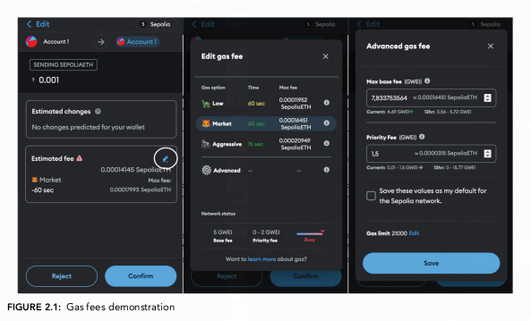
</p>

[Tiga tangkapan layar antarmuka MetaMask yang menunjukkan proses penyesuaian gas fee, dari estimasi awal hingga pengaturan lanjutan. - Figure 2.1]

Gambar 2.1 dalam buku menunjukkan bagaimana pengguna di *wallet* MetaMask dapat memilih tingkat *gas fee* (Rendah, Pasar, Agresif) atau mengaturnya secara manual di menu lanjutan, dengan menyesuaikan *Max Base Fee* dan *Priority Fee*.

### Masalah Skalabilitas Ethereum

Dengan kapasitas hanya sekitar 20 TPS, *Ethereum* jauh tertinggal dibandingkan sistem pembayaran tradisional seperti Visa (65.000 TPS). Keterbatasan ini menyebabkan "perang penawaran" (*bidding war*) untuk ruang blok, di mana pengguna saling menaikkan *priority fee* agar *transaction* mereka diproses, menyebabkan lonjakan *gas fees* yang ekstrem pada saat permintaan tinggi.

<p align="center">
  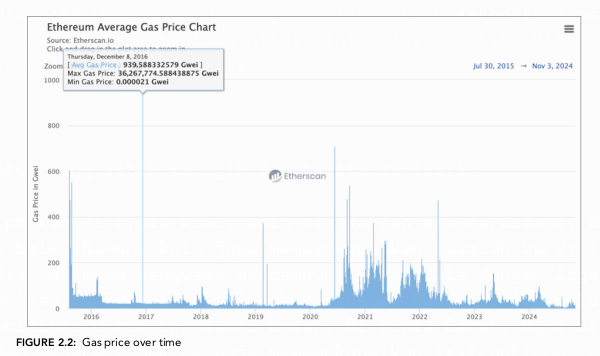
</p>

[Grafik garis yang menunjukkan harga gas rata-rata Ethereum dari waktu ke waktu, dengan beberapa puncak lonjakan harga yang signifikan. - Figure 2.2]

Gambar 2.2 mengilustrasikan masalah ini dengan menunjukkan grafik historis harga *gas*, di mana terlihat puncak-puncak harga yang sangat tinggi, bahkan mencapai ratusan *gwei*.

### Solusi Layer 2

Untuk mengatasi masalah skalabilitas, solusi ***Layer 2*** dibangun "di atas" *blockchain* utama *Ethereum* (yang disebut *Layer 1*). Solusi ini memproses *transaction* di luar rantai utama (*off-chain*) untuk mengurangi beban, kemudian mengirimkan hasilnya kembali ke *Layer 1*.

<p align="center">
  
</p>

[Diagram yang mengilustrasikan konsep sharding, di mana sebuah tabel data besar dengan 'Shard Key' dipecah menjadi tiga tabel yang lebih kecil berdasarkan rentang nilai. - Figure 2.3]

## Rollups

**Rollups** adalah teknologi Layer 2 yang **memproses transaksi di luar L1 (off-chain)**, lalu **mengirim ringkasan hasilnya ke L1**.
Jadi:

* Eksekusi transaksi → dilakukan di L2
* Data hasil transaksi → dikirim ke L1 (Ethereum mainnet)

**Manfaatnya:**

* Mengurangi beban komputasi di L1
* Biaya jauh lebih murah
* Throughput tinggi

Ada dua jenis utama:

### Optimistic Rollups

* Disebut *optimistic* karena **diasumsikan semua transaksi valid secara default**.
* Mereka **tidak langsung membuktikan keabsahan transaksi** saat mengirim ke L1.
* Tapi mereka memberi **periode tantangan (challenge period)**, biasanya beberapa hari.
* Jika ada yang mencurigai kecurangan, mereka bisa **mengajukan *fraud proof*** ke L1.
* Jika terbukti, transaksi penipu dibatalkan dan penipunya kehilangan deposit.

Contoh: Arbitrum, Optimism

Karakteristik:

* Murah dan throughput tinggi
* Tapi finalitas (kepastian transaksi valid) lambat → harus tunggu challenge period selesai

### Zero-Knowledge (ZK) Rollups

* ZK-Rollups **tidak mengasumsikan valid**, mereka **membuktikan semua transaksi benar sejak awal**.
* Setiap batch transaksi dikirim ke L1 bersama **bukti kriptografis (zero-knowledge proof)**.
* Bukti ini **diverifikasi oleh smart contract di L1**.

Contoh: zkSync, Starknet, Scroll

Karakteristik:

* Finalitas cepat (karena langsung ada bukti)
* Lebih kompleks secara teknis (membuat bukti mahal & lambat saat ini)
* Lebih ramah privasi karena bukti tidak mengungkap data mentah transaksi

## Validiums

* **Mirip ZK-Rollups**, tapi **data transaksi disimpan off-chain** sepenuhnya.
* L1 hanya menyimpan **bukti validitas**, **bukan data transaksi mentah**.
* Ini **menghemat ruang dan biaya sangat besar**, karena L1 tidak menyimpan data.

Karakteristik:

* Skalabilitas tinggi (karena data tidak dibebankan ke L1)
* Tapi **keamanan datanya tergantung pada penyedia data off-chain**, bukan Ethereum → ada risiko jika penyedia data hilang atau jahat

Contoh: StarkEx (dalam mode validium)

## Sidechains

* **Blockchain terpisah** yang berjalan berdampingan (paralel) dengan Ethereum.
* Memiliki **konsensus sendiri** dan **validator sendiri**, **bukan dijamin oleh Ethereum**.
* Terhubung ke Ethereum lewat **jembatan (*bridge*)** untuk transfer aset.

Karakteristik:

* Biaya sangat murah dan throughput tinggi
* Tapi keamanan bergantung pada jaringan sidechain itu sendiri (jika validator mereka diserang, dana bisa hilang)

Contoh: Polygon PoS chain, Gnosis Chain

## Sharding

* Teknik untuk **memecah satu blockchain besar jadi banyak *shard* kecil**, masing-masing memproses subset transaksi secara paralel.
* Setiap shard seperti *mini blockchain* yang menyumbangkan hasilnya ke beacon chain (rangka utama Ethereum).

Tujuan:

* Menambah kapasitas transaksi Ethereum
* Mengurangi beban setiap node → setiap node hanya perlu memvalidasi shard tertentu

Catatan:

* Sharding ini rencananya bagian dari roadmap Ethereum, tapi model awal sharding transaksi **diubah menjadi fokus data (lihat Danksharding)**

## Danksharding

* Evolusi dari konsep sharding dalam roadmap Ethereum terbaru.
* Fokus bukan lagi memproses transaksi, tapi **menyediakan ruang data murah dalam bentuk *data blobs*** untuk rollups.
* Dengan **proto-danksharding (EIP-4844)**, Ethereum mulai mendukung **blob-carrying transactions** yang jauh lebih murah untuk rollups.

Tujuan:

* Memberikan **ruang data besar dan murah** supaya rollups bisa menyimpan datanya tanpa membebani gas fee L1.
* Membuat Ethereum menjadi **settlement layer**: tempat rollups memposting bukti dan data ringkasan mereka.

Dampaknya:

* Rollups menjadi jauh lebih murah
* Ethereum tetap aman dan ringan karena hanya menyimpan bukti dan data blob, bukan semua transaksi mentah

## Rangkuman Tabel

| Teknologi          | Eksekusi di Mana | Data disimpan di Mana | Jaminan Keamanan                        | Contoh                      |
| ------------------ | ---------------- | --------------------- | --------------------------------------- | --------------------------- |
| Optimistic Rollups | L2               | L1                    | Fraud proofs (challenge period)         | Arbitrum, Optimism          |
| ZK-Rollups         | L2               | L1                    | Validity proofs (langsung diverifikasi) | zkSync, Starknet            |
| Validiums          | L2               | Off-chain             | Validity proofs, tapi data off-chain    | StarkEx (validium mode)     |
| Sidechains         | Chain terpisah   | Chain terpisah        | Keamanan sendiri (bukan Ethereum)       | Polygon PoS, Gnosis         |
| Sharding           | L1               | L1 (per shard)        | Ethereum validator                      | (rencana lama Ethereum)     |
| Danksharding       | L1               | L1 (data blobs)       | Ethereum validator                      | (roadmap Ethereum sekarang) 

### Solusi Layer 3

**Layer 3 adalah jaringan blockchain khusus (application-specific chain)** yang dibangun **di atas Layer 2**, bukan langsung di Layer 1.

🧠 Sederhananya:

> L1 = keamanan dan konsensus dasar
> L2 = skalabilitas umum untuk semua
> L3 = eksekusi super cepat untuk aplikasi spesifik

#### Cara Kerja Layer 3

* L3 berjalan **di atas infrastruktur L2** seperti Arbitrum Orbit, zkSync Hyperchains, atau Starknet Appchains.
* L3 **mewarisi keamanan dari L2 (dan secara tidak langsung dari L1)**, tapi bisa dikonfigurasi secara bebas:

  * Aturan konsensus sendiri
  * Biaya gas sendiri
  * Token native sendiri
  * Mekanisme privasi sendiri
* Transaksi di L3 → dikumpulkan ke batch → dikirim ke L2 → lalu ke L1 untuk finalitas dan keamanan akhir.

Artinya: mereka **tidak membebani L1 langsung**, sehingga **lebih murah dan lebih cepat**.

#### Contoh Kasus Penggunaan L3

| Bidang                          | Kebutuhan                      | Kenapa Cocok L3                                  |
| ------------------------------- | ------------------------------ | ------------------------------------------------ |
| Game blockchain                 | Ribuan transaksi kecil/detik   | Biaya rendah, finalitas cepat, kustomisasi penuh |
| Media sosial terdesentralisasi  | Banyak interaksi pengguna      | Throughput tinggi, biaya nyaris nol              |
| DeFi perusahaan (institutional) | Privasi, izin akses, kontrol   | Bisa atur siapa yang bisa akses & melihat data   |
| Rollup ekosistem besar          | Sub-rollup khusus per aplikasi | Isolasi performa dan biaya dari aplikasi lain    |

#### Perbedaan L2 vs L3

| Aspek              | Layer 2 (L2)                | Layer 3 (L3)                                 |
| ------------------ | --------------------------- | -------------------------------------------- |
| Tujuan utama       | Skalabilitas umum           | Skalabilitas & kustomisasi aplikasi spesifik |
| Dijalankan di atas | Layer 1                     | Layer 2 (yang di atas L1)                    |
| Biaya transaksi    | Rendah                      | Lebih rendah lagi                            |
| Keamanan           | Disediakan langsung oleh L1 | Mewarisi keamanan dari L2 → lalu ke L1       |
| Kustomisasi        | Terbatas                    | Sangat tinggi (token, konsensus, dll)        |

#### Tantangan Layer 3

* **Kompleksitas meningkat** (stack 3 lapisan harus dikelola)
* **Keamanan tergantung L2** → kalau L2 diserang, semua L3 di atasnya ikut terdampak
* **Masih sangat baru** → banyak eksperimen, standar belum matang

#### Contoh Nyata L3 Saat Ini

* **Arbitrum Orbit:** Framework untuk membangun L3 di atas Arbitrum Nitro
* **zkSync Hyperchains:** L3 berbasis ZK-Rollup yang dapat disesuaikan
* **Starknet Appchains:** Membuat L3 di atas Starknet

### Ethereum: Menuju Finalisasi

*Ethereum* masih dalam pengembangan aktif. Penulis menguraikan *roadmap*-nya:
* **The Merge:** Transisi dari PoW ke PoS (telah selesai).
* **The Surge:** Peningkatan skalabilitas besar-besaran melalui *Danksharding*.
* **The Scourge:** Mengatasi masalah sentralisasi dan sensor terkait *Miner Extractable Value (MEV)*.
* **The Verge:** Mempermudah verifikasi blok dengan memperkenalkan *Verkle trees*.
* **The Purge:** Menghapus data historis lama untuk mengurangi beban penyimpanan pada *node*.
* **The Splurge:** Perbaikan dan penyempurnaan lainnya, termasuk ***Account Abstraction***.

Bab 2 memberikan gambaran arsitektur yang komprehensif. Sebagai seorang auditor, pemahaman tentang Trilema Blockchain, mekanisme *gas*, dan berbagai solusi skalabilitas sangatlah penting. Banyak *bug* dan kerentanan muncul dari interaksi yang salah antara *Layer 1* dan *Layer 2*, atau dari asumsi yang salah tentang bagaimana EVM menangani *state* dan eksekusi. Bab ini adalah dasar teknis Kita untuk bab-bab berikutnya yang lebih fokus pada kode Solidity.

---

# Bab 3
## Wallets, MetaMask, and Block Explorers

Bab ini merupakan fondasi praktis yang sangat penting. Sebelum Kita dapat mengaudit atau mengamankan sebuah *smart contract*, Kita harus terlebih dahulu memahami alat-alat fundamental untuk berinteraksi dengan sebuah *blockchain*. Bab ini memperkenalkan tiga pilar utama: *cryptocurrency wallets* sebagai gerbang Kita ke aset digital, MetaMask sebagai implementasi *browser wallet* yang populer, dan *block explorers* sebagai jendela transparan untuk memverifikasi semua aktivitas *on-chain*.

Bagi seorang auditor, penguasaan materi ini bukan sekadar pengetahuan dasar, melainkan kemampuan inti. Kita akan belajar bagaimana dana dikelola dengan aman, bagaimana interaksi dengan *Decentralized Applications* (DApps) terjadi, dan yang terpenting, bagaimana cara memverifikasi setiap *transaction* dan status *contract* secara independen—sebuah praktik yang merangkum esensi dari moto "jangan percaya, verifikasi" (*don't trust, verify*).

### Memahami Wallets

Di dunia fisik, *wallet* (dompet) adalah tempat Kita menyimpan uang tunai. Namun, dalam dunia *cryptocurrency*, konsep ini sedikit berbeda dan lebih teknis. Sebuah **`wallet`** pada dasarnya bukanlah wadah yang menyimpan *cryptocurrency* Kita. Sebaliknya, *wallet* adalah sebuah antarmuka perangkat lunak (*software*) atau perangkat keras (*hardware*) yang mengelola **kunci kriptografis** Kita. Kunci-kunci inilah yang memberi Kita akses dan kontrol atas aset Kita yang tercatat di *blockchain*.

Ada dua jenis kunci utama:
* **`Private Key`**: Ini adalah kunci rahasia, mirip dengan kata sandi super penting atau PIN ATM Kita. Siapa pun yang memiliki `private key` Kita dapat mengakses dan membelanjakan dana Kita. Menjaga kerahasiaan `private key` adalah prioritas keamanan tertinggi.
* **`Public Key`**: Kunci ini berasal dari `private key` Kita dan dapat dibagikan secara bebas. Dari `public key` inilah alamat *wallet* Kita (*wallet address*) dibuat, yang berfungsi seperti nomor rekening bank yang bisa Kita berikan kepada orang lain untuk menerima dana.

Bab ini mengkategorikan *wallets* ke dalam beberapa jenis, masing-masing dengan kelebihan, kekurangan, dan skenario penggunaan yang berbeda.

#### Hosted Wallets

*Hosted wallets* adalah *wallets* di mana `private key` Kita dikelola oleh pihak ketiga, biasanya sebuah bursa *cryptocurrency* (*cryptocurrency exchange*) seperti Binance atau Coinbase. Ini adalah jenis *wallet* yang paling umum digunakan oleh pemula karena kemudahannya.

* **Keuntungan**:
    * **Kemudahan Penggunaan**: Kita tidak perlu khawatir mengelola `private key` sendiri. Jika Kita lupa kata sandi, biasanya ada opsi pemulihan.
    * **Tanpa Biaya Tambahan**: Tidak perlu membeli perangkat keras khusus.
    * **Hemat Waktu**: Tidak perlu belajar tentang berbagai jenis *wallet* dan cara mengamankannya.

* **Kekurangan (Sangat Krusial untuk Auditor)**:
    * **Sentralisasi**: Ini bertentangan dengan etos desentralisasi. Kita pada dasarnya membuat ulang sistem perbankan tradisional di mana Kita mempercayakan dana Kita kepada pihak ketiga.
    * **Risiko Pihak Ketiga**: Jika bursa tersebut bangkrut, diretas, atau dikelola oleh pelaku kejahatan, dana Kita kemungkinan besar akan hilang selamanya. Ini adalah poin kegagalan tunggal (*single point of failure*).
    * **Risiko Regulasi**: Pemerintah dapat memerintahkan bursa untuk membekukan atau menyita aset pengguna.

* **Praktik Terbaik**:
    1.  **Diversifikasi**: Jika harus menggunakan *hosted wallets*, sebarkan dana Kita di beberapa bursa terkemuka untuk mengurangi risiko jika salah satu bursa gagal.
    2.  **Bookmark Situs**: Selalu akses situs bursa melalui *bookmark* yang telah Kita simpan untuk menghindari situs *phishing*.
    3.  **Verifikasi Tim di Komunitas**: Di server Discord atau Telegram, pastikan setiap pengumuman penting (seperti *Airdrop*) datang dari anggota tim resmi yang memiliki lencana terverifikasi.

* **Studi Kasus (Pelajaran dari Kegagalan)**:
    * **Mount Gox**: Sebuah bursa yang menangani >70% *transaction* Bitcoin pada tahun 2014, bangkrut setelah serangkaian peretasan. Bertahun-tahun kemudian, para pelanggan masih berjuang untuk mendapatkan kembali sebagian kecil dari dana mereka. Ini adalah contoh klasik dari risiko mempercayakan `private key` Kita kepada pihak lain.
    * **QuadrigaCX**: Bursa asal Kanada ini runtuh setelah pendirinya, Gerald Cotten, dilaporkan meninggal secara misterius di India, membawa serta akses ke `private key` yang menyimpan dana pelanggan senilai hampir $200 juta. Kasus ini menyoroti bahaya ketika hanya satu orang yang memiliki kontrol penuh.
    * **FTX**: Salah satu bursa terbesar di dunia yang runtuh pada tahun 2022 karena salah urus dana dan penipuan. Kejatuhannya, meskipun didukung oleh tokoh-tokoh terkenal, menegaskan kembali prinsip utama dalam *blockchain*: **"jangan percaya, verifikasi" (*don't trust, verify*)**. Satu-satunya kebenaran yang dapat diandalkan adalah apa yang tercatat *on-chain*.

#### Browser Wallets

*Browser wallets* adalah ekstensi yang terintegrasi langsung ke peramban web Kita, seperti MetaMask. Mereka berfungsi sebagai jembatan yang mudah antara pengguna dan DApps.

* **Keuntungan**:
    * **Akses Mudah dan Cepat**: Sangat praktis untuk *transaction* sehari-hari bernilai kecil dan interaksi dengan DApps.
    * **Integrasi DApps**: Memungkinkan koneksi yang mulus ke situs-situs Web3.

* **Kekurangan**:
    * **Kerentanan Online**: Karena terhubung langsung ke internet, *wallets* ini rentan terhadap serangan *phishing*, situs web berbahaya, dan *malware* yang dapat mencuri `private key` atau `seed phrase` Kita.

* **Studi Kasus (Taktik Penipuan)**:
    * **Situs Web Berbahaya**: Penipu membuat situs yang terlihat identik dengan situs asli, misalnya `binαnce.com` (menggunakan huruf Yunani 'α') bukan `binance.com`. Ketika pengguna menghubungkan *wallet* mereka, dana mereka akan terkuras.
    * **Penipuan Lowongan Pekerjaan**: Penipu yang menyamar sebagai perekrut akan melalui proses wawancara yang meyakinkan. Di tahap akhir, mereka meminta kandidat untuk menghubungkan *wallet* mereka ke "situs tim" untuk "menguji fitur". Setelah kepercayaan dibangun, korban akan kehilangan asetnya saat menghubungkan *wallet*.

#### Desktop Wallets

*Desktop wallets* adalah aplikasi yang diunduh dan dijalankan di komputer Kita. Ada dua sub-tipe:

1.  **Desktop Wallet (Full Nodes)**:
    * **Cara Kerja**: Mengunduh dan menyimpan seluruh riwayat *blockchain*.
    * **Keuntungan**: Memberikan kontrol dan keamanan penuh, serta berkontribusi pada desentralisasi dan keamanan jaringan. Sulit bagi penyerang untuk menargetkan individu dibandingkan bursa terpusat.
    * **Kekurangan**: Membutuhkan ruang penyimpanan yang sangat besar (bisa mencapai terabyte) dan waktu sinkronisasi yang lama. Rentan terhadap *malware* di komputer.

2.  **Desktop Wallet (Lightweight)**:
    * **Cara Kerja**: Tidak mengunduh seluruh *blockchain*. Sebaliknya, ia mengandalkan *full nodes* lain untuk mendapatkan data *transaction* yang relevan.
    * **Keuntungan**: Lebih hemat ruang dan *bandwidth*. `Private key` tetap disimpan di komputer pengguna, memberikan kontrol penuh.
    * **Kekurangan**: Bergantung pada pihak ketiga (*full nodes*) untuk data, yang dapat menimbulkan risiko privasi jika *node* tersebut memata-matai *transaction* Kita.

#### Mobile Wallets

*Mobile wallets* adalah aplikasi di ponsel Kita, menawarkan portabilitas dan kemudahan untuk *transaction* saat bepergian.

* **Keuntungan**:
    * **Portabel dan Nyaman**: Mudah digunakan untuk pembayaran sehari-hari, sering kali dengan pemindaian kode QR.
    * **Backup**: Dana dapat dipulihkan melalui `seed phrase` jika ponsel hilang atau dicuri.

* **Kekurangan**:
    * **Risiko Fisik**: PIN atau detail sensitif lainnya dapat terlihat oleh orang lain atau kamera.
    * **Serangan SIM Swap**: Penyerang dapat mengambil alih nomor telepon Kita untuk melewati otentikasi dua faktor berbasis SMS.
    * **Malware**: Ponsel juga rentan terhadap aplikasi berbahaya yang dapat mencuri `seed phrase`.

* **Studi Kasus (SIM Swap)**:
    * Bahkan Vitalik Buterin, pendiri Ethereum, pernah menjadi korban serangan **`SIM swap`**. Penyerang berhasil menguasai akun Twitter-nya dan memposting tautan *phishing*, yang menyebabkan pengikutnya kehilangan dana senilai $700.000. Ini menunjukkan betapa berbahayanya mengandalkan keamanan berbasis nomor telepon.

#### Cold Storage / Hardware Wallet

Ini adalah metode penyimpanan `private key` secara *offline*, dianggap sebagai cara teraman untuk melindungi aset digital dari ancaman online.

* **`Hardware Wallet`**: Perangkat fisik (seperti Trezor atau Ledger) yang menyimpan `private key` Kita secara terisolasi. *Transaction* ditandatangani di dalam perangkat tanpa `private key` pernah meninggalkan perangkat tersebut.
* **Keuntungan**:
    * **Keamanan Maksimal**: Isolasi *offline* membuatnya sangat tahan terhadap peretasan dan *malware*.
    * **Kontrol Penuh**: Pengguna memegang kendali penuh atas `private key` mereka.
    * **Keamanan Tambahan**: Dilindungi oleh PIN dan frasa pemulihan (*seed phrase*).
* **Kekurangan**:
    * **Biaya**: Perangkat ini harus dibeli.
    * **Kurang Praktis**: Tidak secepat *browser* atau *mobile wallet* untuk *transaction* harian.
    * **Risiko Rantai Pasokan (*Supply Chain Attack*)**: Perangkat dapat dirusak selama pengiriman. **Selalu beli langsung dari produsen resmi.**

* **Praktik Terbaik**:
    * Gunakan cadangan logam (*metal backup*) untuk `seed phrase` Kita, bukan hanya kertas, agar tahan terhadap api dan air.

* **Metode Alternatif (DIY Hardware Wallet)**:
    * Bab ini juga menyarankan cara membuat *hardware wallet* dengan biaya rendah, seperti menggunakan **ponsel lama**. Prosesnya meliputi reset pabrik, menginstal aplikasi seperti **Airgap Vault**, dan kemudian mengisolasi perangkat sepenuhnya dari internet (*air-gapped*).
    * **Keuntungan**: Hemat biaya, tahan terhadap *supply chain attack*, dan menjaga privasi.
    * **Kekurangan**: Tidak sekuat *hardware wallet* komersial (misalnya, tidak tahan api/air) dan tidak mendukung semua fitur seperti NFT.

#### Multisignature Wallets

**`Multisignature (multisig) wallets`** adalah *wallets* yang memerlukan lebih dari satu tanda tangan (`private key`) untuk mengotorisasi sebuah *transaction*. Ini bekerja dengan skema "N dari M", di mana N adalah jumlah tanda tangan yang diperlukan dari total M pemilik kunci.

* **Contoh**: Sebuah *wallet* 3 dari 5 memerlukan persetujuan dari 3 `private key` yang berbeda dari total 5 yang terdaftar.
* **Kegunaan**:
    * **Organisasi (DAO)**: Mencegah satu individu membuat keputusan sepihak dan menambahkan lapisan akuntabilitas.
    * **Individu**: Meningkatkan keamanan pribadi. Jika satu kunci Kita dicuri, dana tetap aman karena penyerang masih memerlukan kunci lainnya.
* **Kelemahan**: Kompleksitas dalam mengelola beberapa `private key`.

#### Hierarchical Deterministic (HD) Wallets

**`HD wallets`** adalah standar modern untuk *wallets*. Mereka menghasilkan sebuah **`master private key`** (biasanya direpresentasikan sebagai `seed phrase`) yang darinya serangkaian `child private key` dan alamat dapat dibuat secara deterministik (dapat diprediksi).

* **Keuntungan**: Menyederhanakan proses *backup*. Kita hanya perlu mencadangkan satu `seed phrase` untuk memulihkan semua alamat yang pernah dibuat oleh *wallet* tersebut. Ini sangat berguna dalam konteks *multisig*.
* **Kelemahan**: Jika `master private key` (atau `seed phrase`) Kita bocor, semua alamat anak (*child addresses*) juga akan terancam.

### Tutorial Praktis: Menggunakan MetaMask

Bab ini menggunakan MetaMask sebagai contoh utama untuk *browser wallet*. Tujuannya adalah untuk mengakses *testnets*, mendapatkan ETH percobaan dari *faucets*, dan mendeploy *smart contracts* tanpa menggunakan uang sungguhan.

#### Menginstal MetaMask

Proses instalasi dijelaskan langkah demi langkah:
1.  Kunjungi situs web resmi `metamask.io`. (Sangat penting untuk memastikan URL-nya benar).
2.  Unduh ekstensi untuk peramban Kita (Chrome, Firefox, Brave, dll.).
3.  Pilih "Create New Wallet".
4.  Buat kata sandi. Kata sandi ini hanya untuk mengunci dan membuka ekstensi di peramban Kita, BUKAN `private key` Kita.
5.  **Langkah Paling Krusial**: MetaMask akan menampilkan **`Secret Recovery Phrase`** atau **`seed phrase`** Kita, yang biasanya terdiri dari 12 kata.

<p align="center">
  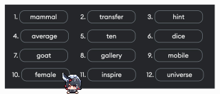
</p>

[Contoh 12 kata seed phrase yang dihasilkan oleh MetaMask, seperti mammal, transfer, hint, dll. - Figure 3.1]

> **PERINGATAN**: `Seed phrase` ini adalah `master key` Kita. Tulis di atas kertas atau logam, simpan di tempat yang sangat aman, dan **JANGAN PERNAH** membagikannya kepada siapa pun atau menyimpannya secara digital (misalnya di komputer atau cloud). Jika Kita kehilangan `seed phrase` ini, dana Kita akan hilang selamanya. Jika orang lain mendapatkannya, mereka dapat mencuri semua dana Kita.

6.  Konfirmasi `seed phrase` Kita, dan instalasi selesai. Kita akan melihat antarmuka utama MetaMask.

<p align="center">
  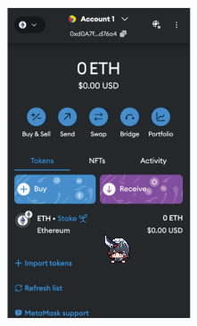
</p>

[Tampilan antarmuka utama ekstensi browser MetaMask setelah instalasi berhasil, menunjukkan saldo 0 ETH. - Figure 3.2]

#### Login Kembali dengan Seed Phrase

Untuk memperkuat pemahaman tentang pentingnya `seed phrase`, bab ini memandu Kita untuk menghapus ekstensi MetaMask dan menginstalnya kembali. Kali ini, alih-alih membuat *wallet* baru, Kita akan memilih "Import An Existing Wallet" dan memasukkan 12 kata `seed phrase` yang telah Kita simpan. Proses ini menunjukkan bahwa selama Kita memiliki `seed phrase`, Kita dapat memulihkan akses ke dana Kita di perangkat apa pun.

<p align="center">
  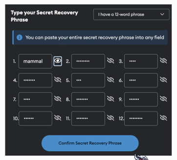
</p>

[Tampilan proses impor seed phrase di MetaMask, di mana pengguna memasukkan 12 kata rahasia. - Figure 3.5]

#### Mengganti Jaringan

*Blockchain* memiliki dua jenis jaringan utama:
* **`Mainnet`**: Jaringan utama tempat *transaction* bernilai nyata terjadi.
* **`Testnet`**: Jaringan percobaan yang meniru *mainnet* tetapi menggunakan aset tanpa nilai. Ini adalah tempat bagi *developer* untuk menguji *smart contracts* mereka.

MetaMask secara default terhubung ke Ethereum Mainnet. Bab ini menunjukkan cara beralih ke *testnet* seperti **Sepolia**:
1.  Klik menu jaringan di pojok kiri atas MetaMask.
2.  Aktifkan "Show test networks".
3.  Pilih "Sepolia" dari daftar.

<p align="center">
  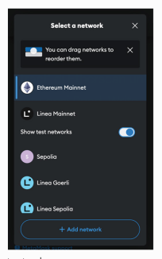
</p>

<p align="center">
  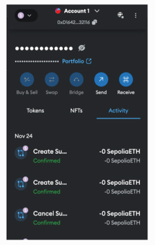
</p>

[Menu pilihan jaringan di MetaMask, dengan tombol 'Show test networks' diaktifkan. - Figure 3.9 & 3.10]

ETH di jaringan Sepolia (SepoliaETH) tidak memiliki nilai di dunia nyata dan hanya digunakan untuk tujuan pengujian.

#### Berinteraksi dengan Faucets

**`Faucets`** adalah situs web atau aplikasi yang memberikan sejumlah kecil ETH *testnet* secara gratis kepada pengguna untuk tujuan pengujian.
Bab ini mencantumkan beberapa *faucets* terkemuka seperti Alchemy, Infura, dan Chainlink. Namun, banyak dari mereka memerlukan saldo ETH *mainnet* minimal untuk mencegah penyalahgunaan.

Sebagai alternatif, bab ini merekomendasikan `sepolia-faucet.pk910.de`, sebuah *faucet* berbasis *Proof-of-Work* (PoW). Namun, untuk menggunakannya, Kita perlu memverifikasi identitas Kita melalui **Gitcoin Passport** untuk mencapai skor minimum. Ini dilakukan dengan menghubungkan akun-akun seperti GitHub, Google, atau LinkedIn Kita untuk membuktikan bahwa Kita adalah pengguna unik.

<p align="center">
  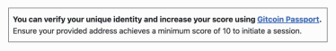
</p>

<p align="center">
  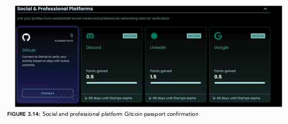
</p>

[Tampilan faucet Sepolia yang meminta verifikasi melalui Gitcoin Passport sebelum memulai proses mining. - Figure 3.13 & 3.14]

Setelah terverifikasi, Kita bisa memulai proses "mining" untuk mendapatkan SepoliaETH.

<p align="center">
  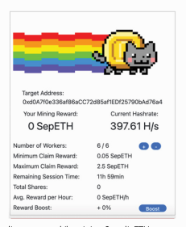
</p>

[Tampilan layar faucet yang sedang dalam proses "mining" SepoliaETH, menunjukkan hashrate dan reward yang terkumpul. - Figure 3.15]

#### Mengirim Transaksi Pertama Anda

Setelah mendapatkan SepoliaETH, bab ini memandu Kita melakukan *transaction* pertama:
1.  Klik tombol "Send" di MetaMask.
2.  Masukkan alamat ETH penerima.
3.  Masukkan jumlah ETH yang akan dikirim (misalnya, 0.01 SepoliaETH).
4.  MetaMask akan menampilkan perkiraan **`gas fee`**, yaitu biaya untuk memproses *transaction* di jaringan.
5.  Klik "Confirm". *Transaction* akan dikirim dan statusnya akan berubah dari "Pending" menjadi "Confirmed" setelah beberapa detik.

Selamat, Kita telah berhasil mengirim *transaction cryptocurrency* pertama Kita!

<p align="center">
  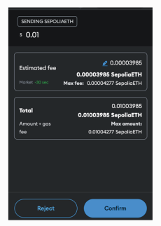
</p>

[Tampilan ringkasan transaksi di MetaMask sebelum konfirmasi akhir, menunjukkan jumlah yang akan dikirim dan estimasi gas fee. - Figure 3.20]

### Block Explorers: Jendela Transparan Menuju Blockchain

Karena *blockchain* bersifat publik, semua *transaction* dapat diverifikasi oleh siapa pun. Alat utama untuk melakukan ini adalah **`block explorer`**, sebuah situs web yang berfungsi seperti mesin pencari untuk *blockchain*. Untuk Ethereum, *block explorer* yang paling populer adalah **Etherscan** (`etherscan.io` untuk *mainnet* dan `sepolia.etherscan.io` untuk *testnet* Sepolia).

Bagi seorang auditor, *block explorer* adalah alat yang paling esensial.

#### Anatomi Transaksi di Block Explorer

Dengan mengklik *transaction hash* dari *transaction* yang baru saja Kita kirim, Etherscan akan menampilkan rincian lengkapnya:

<p align="center">
  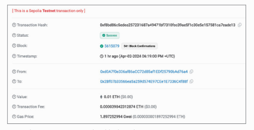
</p>

[Tampilan detail transaksi di Etherscan, menunjukkan hash, status, nomor blok, dan alamat pengirim/penerima. - Figure 3.25]

* **`Transaction Hash`**: ID unik untuk *transaction* tersebut.
* **`Status`**: Menunjukkan apakah *transaction* berhasil (*Success*), gagal (*Failed*), atau masih tertunda (*Pending*).
* **`Block`**: Nomor *block* di mana *transaction* ini dimasukkan.
* **`Timestamp`**: Waktu kapan *transaction* dikonfirmasi.
* **`From`**: Alamat pengirim.
* **`To`**: Alamat penerima.
* **`Value`**: Jumlah ETH yang ditransfer.
* **`Transaction Fee`**: Total *gas fee* yang dibayarkan.

#### Anatomi Block di Block Explorer

Kita juga dapat memeriksa seluruh *block*:

<p align="center">
  
</p>

[Tampilan detail sebuah blok di Etherscan, menunjukkan tinggi blok, timestamp, jumlah transaksi, dan penggunaan gas. - Figure 3.27]

* **`Block Height`**: Nomor urut *block* sejak *block* pertama (*genesis block*).
* **`Timestamp`**: Waktu saat *block* divalidasi.
* **`Transactions`**: Jumlah *transaction* yang termasuk di dalam *block* ini.
* **`Fee Recipient`**: Alamat *validator* yang menerima *fee* dari *block* ini.
* **`Gas Used` & `Gas Limit`**: Jumlah *gas* yang digunakan oleh semua *transaction* di *block* dan batas maksimum *gas* per *block*.

#### Menghubungkan ke DApps dan Anatomi Wallet/Contract

Bab ini menggunakan Uniswap sebagai contoh untuk menunjukkan interaksi *wallet* dengan DApp. Prosesnya meliputi mengunjungi situs DApp, mengklik "Connect Wallet", dan memberikan izin di MetaMask.

Lebih penting lagi bagi auditor, Kita dapat menggunakan *block explorer* untuk menganalisis alamat *wallet* atau *smart contract* apa pun. Dengan memasukkan alamat di Etherscan, Kita dapat melihat:
* **Balance**: Saldo ETH.
* **Token Holdings**: Daftar semua token ERC-20 dan NFT (ERC-721) yang dimiliki alamat tersebut. Ini sangat berguna untuk mengidentifikasi token mencurigakan atau penipuan.
* **Transactions**: Riwayat lengkap semua *transaction* yang masuk dan keluar.
* **Internal Transactions**: *Transaction* yang dipicu oleh *smart contract* lain.
* **Contract Tab**: Jika alamat tersebut adalah *smart contract*, tab ini sangat penting.
    * **Code**: Jika *contract* telah diverifikasi, Kita dapat melihat kode sumber Solidity-nya secara langsung di Etherscan.
    * **Read Contract**: Memungkinkan Kita memanggil semua fungsi `view` dan `pure` dari *contract* tanpa biaya *gas* untuk membaca statusnya.
    * **Write Contract**: Memungkinkan Kita untuk terhubung dengan *wallet* Kita dan memanggil fungsi yang mengubah status *contract*, yang akan memerlukan *gas fee*.
    * **Read/Write as Proxy**: Jika *contract* menggunakan pola *proxy* (dibahas di Bab 12), tab ini memungkinkan Kita berinteraksi dengan *logic contract* yang mendasarinya.

<p align="center">
  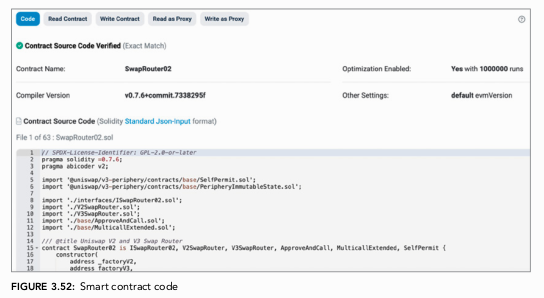
</p>

<p align="center">
  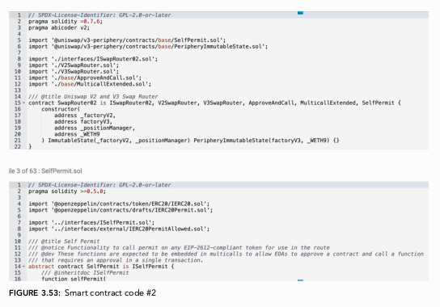
</p>

[Tampilan tab 'Contract' di Etherscan untuk sebuah smart contract yang terverifikasi, menunjukkan kode sumber, serta opsi Read, Write, dan Proxy. - Figure 3.52 & 3.53]

Kita sekarang memiliki kemampuan praktis untuk berinteraksi, mengelola aset, dan yang terpenting, memverifikasi aktivitas di *blockchain* Ethereum. Keterampilan ini akan menjadi dasar saat kita mulai menulis dan mendeploy *smart contract* kita sendiri di bab-bab berikutnya.

---

# Bab 4
## Remix, Data Types, Visibility, and HelloWorld

Bab ini adalah titik awal Anda dalam menulis kode Solidity secara praktis. Kita akan beralih dari konsep teoretis ke implementasi nyata dengan menggunakan **Remix IDE**, sebuah lingkungan pengembangan yang sangat ramah bagi pemula. Tujuan utama bab ini adalah membangun *smart contract* pertama Kita—sebuah program klasik "HelloWorld"—sambil membedah elemen-elemen paling fundamental dalam pemrograman Solidity.

Bagi seorang calon auditor, bab ini sangat krusial karena memperkenalkan "anatomi" dasar dari sebuah *smart contract*: bagaimana lisensi dan versi dideklarasikan, bagaimana data disimpan melalui **`data types`**, dan bagaimana akses ke fungsi dikontrol melalui **`visibility levels`**. Memahami fondasi ini akan memungkinkan Kita untuk mulai "membaca" dan menganalisis kode dengan benar.

### Apa Itu Pemrograman?

Sebelum masuk ke kode, bab ini memberikan analogi yang sangat membantu: **pemrograman adalah proses belajar bahasa baru untuk berkomunikasi dengan komputer** Sama seperti bahasa manusia (misalnya, Bahasa Spanyol atau Rusia), bahasa pemrograman memiliki struktur, aturan (sintaks), dan ekspresi yang unik.

  * **Evolusi dan Budaya**: Bahasa pemrograman berevolusi, dengan versi baru yang memperkenalkan fitur-fitur baru, sama seperti kata "selfie" masuk ke dalam leksikon global. Setiap bahasa juga memiliki "budaya" atau etosnya sendiri; misalnya, Python menekankan kesederhanaan, sementara Solidity mencerminkan prinsip-prinsip *blockchain* seperti transparansi, keamanan, dan desentralisasi.
  * **Compiler sebagai Penerjemah**: Perbedaan utama adalah tujuan komunikasinya. Bahasa manusia untuk antar-manusia, sementara bahasa pemrograman untuk manusia ke komputer. Komputer pada dasarnya hanya memahami kode biner (angka 0 dan 1). Oleh karena itu, kita memerlukan **`compiler`**, yang bertindak sebagai "penerjemah" yang mengubah kode Solidity yang dapat dibaca manusia menjadi *bytecode* yang dapat dipahami dan dieksekusi oleh komputer (khususnya, oleh *Ethereum Virtual Machine* atau EVM).

### Memulai dengan Solidity, Remix, dan HelloWorld

**Solidity** adalah bahasa pemrograman *high-level*, yang berarti sintaksnya lebih dekat dengan bahasa manusia sehingga lebih mudah dibaca dan dipahami dibandingkan bahasa *low-level*. Hal penting yang harus selalu diingat adalah Solidity bersifat **`case-sensitive`**. Ini berarti huruf besar dan huruf kecil dianggap berbeda. Misalnya, `pragma` adalah sintaks yang valid, tetapi `Pragma` akan menghasilkan *error* karena *compiler* tidak mengenalinya. Bagi Solidity, `p` dan `P` adalah karakter yang sama sekali berbeda.

Untuk mulai menulis kode, kita akan menggunakan **Remix IDE**.

#### Membuat File HelloWorld.sol di Remix

Remix adalah *Integrated Development Environment* (IDE) berbasis web yang bisa diakses langsung melalui peramban di `https://remix.ethereum.org`. Langkah-langkah berikut akan memandu Kita dalam menyiapkan *workspace* dan membuat *file* pertama Kita.

1.  **Buka Remix**: Saat Kita membuka situs Remix, Kita akan disambut dengan antarmuka default yang berisi beberapa *file* dan folder contoh.

<p align="center">
  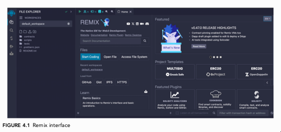
</p>

[Tampilan antarmuka awal Remix IDE saat pertama kali dibuka. - Figure 4.1]

2.  **Bersihkan Workspace**: Untuk memulai dari awal, bab ini menginstruksikan untuk menghapus semua *file* dan folder default (`contracts`, `scripts`, `tests`, dll.). Kita dapat melakukannya dengan mengklik kanan pada setiap item dan memilih "Delete".

<p align="center">
  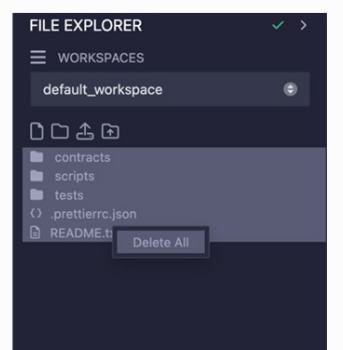
</p>

[Tampilan panel File Explorer di Remix, menunjukkan proses menghapus file default. - Figure 4.2]

3.  **Buat File Baru**: Klik kanan di area kosong pada panel *File Explorer* dan pilih "New File".

<p align="center">
  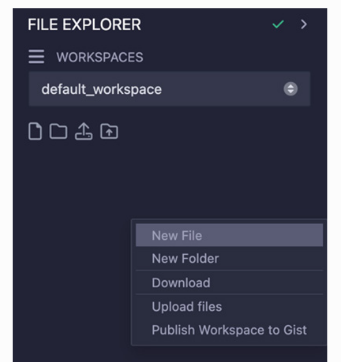
</p>

[Menu konteks yang muncul setelah klik kanan di File Explorer Remix, dengan opsi 'New File' disorot. - Figure 4.3]

4.  **Beri Nama File**: Sebuah *file* kosong akan muncul. Beri nama **`HelloWorld.sol`**. Bagian `.sol` adalah ekstensi yang memberitahu *compiler* bahwa *file* ini berisi kode Solidity.

<p align="center">
  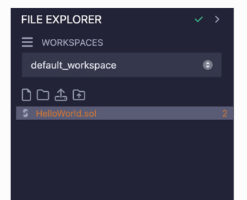
</p>

[File baru yang telah dibuat dan diberi nama HelloWorld.sol di workspace Remix. - Figure 4.5]

Setelah langkah-langkah ini, Kita akan memiliki kanvas kosong yang siap untuk diisi dengan kode *smart contract* pertama Kita.

<p align="center">
  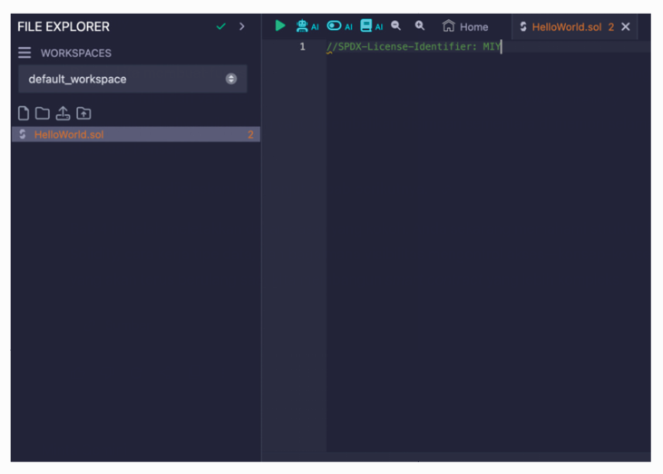
</p>

[Tampilan editor kode Remix yang kosong dengan tab file HelloWorld.sol yang aktif. - Figure 4.6]

### //SPDX-License-Identifier

Setiap *file* Solidity harus dimulai dengan baris komentar khusus ini. Di Solidity, dua garis miring (`//`) menandakan sebuah **`comment`** (komentar). Teks apa pun setelah `//` pada baris yang sama akan diabaikan oleh *compiler* dan tidak dianggap sebagai kode. Komentar sangat berguna untuk:

  * Menjelaskan logika kode yang kompleks kepada rekan tim atau diri Kita di masa depan.
  * Mendokumentasikan fungsi dan keputusan desain.
  * Membantu orang lain (termasuk auditor) memahami maksud dari kode Kita di *blockchain* yang bersifat *open-source*.

Namun, baris `//SPDX-License-Identifier: MIT` adalah sebuah pengecualian. Meskipun diawali dengan `//`, *compiler* tidak mengabaikannya. Ini adalah deklarasi standar yang mengidentifikasi lisensi *software* dari kode Kita, misalnya, `MIT`, `GPL-3.0`, atau `Unlicensed`. Jika baris ini tidak ada, *compiler* akan memberikan peringatan. Pikirkan ini sebagai "salam pembuka" wajib untuk setiap *file* Solidity.

### Versi Solidity dan Baris `pragma`

Baris kedua yang krusial adalah deklarasi versi *compiler*.

```solidity
//SPDX-License-Identifier: MIT
pragma solidity 0.8.25;
```

  * **`pragma`**: Ini adalah arahan (*directive*) khusus untuk *compiler*. Dalam hal ini, `pragma solidity` memberitahu *compiler* versi mana yang harus digunakan untuk mengompilasi kode ini.
  * **`0.8.25`**: Ini adalah nomor versinya. Bab ini memecahnya dengan sangat baik:
      * **`0` (Major Version)**: Menandakan perubahan besar yang dapat merusak kompatibilitas (*breaking changes*). Analogi yang diberikan adalah perubahan dari Bahasa Yunani Kuno ke Bahasa Yunani Modern.
      * **`8` (Minor Version)**: Menandakan penambahan fitur baru yang tidak merusak kompatibilitas. Analogi yang diberikan adalah penambahan kata baru seperti "selfie" ke dalam kamus.
      * **`25` (Patch Version)**: Menandakan perbaikan *bug* atau pembaruan kecil. Analogi yang diberikan adalah koreksi ejaan dalam sebuah kata.
  * **`;` (Semicolon)**: Di Solidity, setiap pernyataan (*statement*) harus diakhiri dengan titik koma. Ini mirip dengan penggunaan titik di akhir kalimat dalam bahasa manusia.

### `contract HelloWorld {}`

Setelah lisensi dan versi, baris berikutnya adalah deklarasi *contract* itu sendiri.

```solidity
//SPDX-License-Identifier: MIT
pragma solidity 0.8.25;

contract HelloWorld {}
```

  * **`contract`**: Ini adalah *keyword* yang mendefinisikan sebuah *smart contract*.
  * **`HelloWorld`**: Ini adalah nama yang Kita berikan untuk *contract* Kita.
  * **`{}` (Curly Braces)**: Tanda kurung kurawal ini mendefinisikan "tubuh" atau cakupan (*scope*) dari *contract*. Semua kode, variabel, dan fungsi yang menjadi bagian dari *contract* ini akan ditulis di antara `{` dan `}`.

<p align="center">
  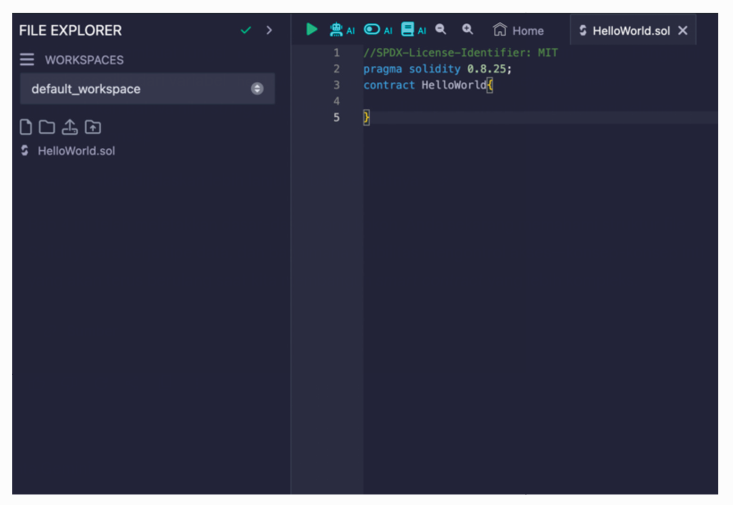
</p>

[Tampilan kode dasar contract HelloWorld di Remix dengan kurung kurawal pembuka dan penutup. - Figure 4.8]

### Data Types dan Variables di Solidity

Dalam bahasa manusia, kita menyampaikan informasi (data) melalui kata atau angka. Demikian pula, Solidity berkomunikasi dengan komputer melalui **`data types`**. *Data type* mendefinisikan jenis data yang dapat disimpan oleh sebuah **`variable`**. Bab ini memperkenalkan enam tipe data dasar.

1.  **`int` (Integer)**: Mewakili bilangan bulat, bisa positif atau negatif (misalnya, 3, -3).

    ```solidity
    int number = -5;
    ```

2.  **`uint` (Unsigned Integer)**: Mewakili bilangan bulat positif saja (termasuk 0). Ini adalah tipe data yang paling umum digunakan untuk nilai moneter atau hitungan, karena jumlah token tidak mungkin negatif.

    ```solidity
    uint number2 = 35;
    ```

3.  **`string`**: Mewakili serangkaian karakter atau teks. Teks harus diapit oleh tanda kutip ganda (`"`) atau tunggal (`'`).

    ```solidity
    string name = "Alexandros";
    ```

4.  **`address`**: Tipe data khusus untuk menyimpan alamat Ethereum (20-byte). Ini digunakan untuk mereferensikan akun pengguna atau *smart contract* lain.

    ```solidity
    address MyETHaddress = 0xd0A7f0e336af86aCC72d85af1EDf25790bAd76a4;
    ```

5.  **`bool` (Boolean)**: Hanya dapat menyimpan dua nilai: `true` atau `false`.

    ```solidity
    bool isTrue = true;
    ```

6.  **`bytes`**: Mewakili serangkaian data *byte*. Tipe ini sering kali lebih efisien dari segi *gas* dibandingkan `string` untuk menangani data teks, karena `string` di-encode dalam format UTF-8 sementara `bytes` adalah data mentah. Saat Kita mendeklarasikan variabel `bytes` dengan nilai teks, di belakang layar Solidity akan mengonversinya menjadi representasi heksadesimal.

    ```solidity
    bytes dynamicBytes = "Hello";
    ```

    Seperti yang ditunjukkan dalam buku, jika Kita memiliki dua variabel `string public myname1 = "Alexandros";` dan `bytes public myname2 = "Alexandros";`, outputnya akan berbeda. `myname1` akan mengembalikan "Alexandros", sedangkan `myname2` akan mengembalikan representasi *byte*-nya, yaitu `0x416c6578616e64726f73`.

<p align="center">
  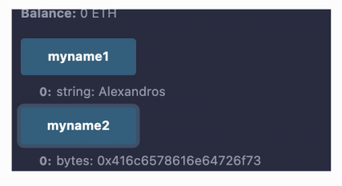
</p>

[Perbandingan output antara variabel string dan bytes di Remix, satu menampilkan 'Alexandros' dan yang lainnya menampilkan kode heksadesimal. - Figure 4.12]

### Function Visibility Levels

**`Functions`** adalah blok kode yang dapat dieksekusi yang melakukan tugas tertentu. Mereka adalah "kata kerja" dalam bahasa Solidity.

#### Anatomi Fungsi

Sebuah deklarasi fungsi dasar di Solidity terlihat seperti ini:

```solidity
function helloWorld() public view returns (string memory) {}
```

  * **`function`**: *Keyword* yang memulai deklarasi fungsi.
  * **`helloWorld`**: Nama fungsi.
  * **`()`**: Tempat untuk mendefinisikan parameter (input) untuk fungsi.
  * **`public`**: Ini adalah **`visibility level`**, yang menentukan siapa yang dapat memanggil fungsi ini.
  * **`view`**: Ini adalah *state mutability modifier*. `view` berarti fungsi ini hanya "membaca" data dari *blockchain* dan tidak mengubahnya.
  * **`returns (string memory)`**: Mendeklarasikan tipe data output dari fungsi.
  * **`{}`**: Tubuh fungsi, tempat logika dieksekusi.

#### Tingkat Visibilitas (Visibility Levels)

Solidity memiliki empat tingkat visibilitas yang sangat penting untuk keamanan:

1.  **`public`**: Fungsi dapat dipanggil oleh siapa saja, baik dari dalam *contract* itu sendiri, dari *contract* turunan, maupun dari *transaction* eksternal.
2.  **`private`**: Fungsi hanya dapat dipanggil dari dalam *contract* tempat ia didefinisikan. *Contract* turunan tidak dapat memanggilnya.
3.  **`external`**: Fungsi hanya dapat dipanggil dari luar *contract* (melalui *transaction* atau *contract* lain). Mereka tidak dapat dipanggil secara internal (kecuali dengan sintaks khusus `this.functionName()`). Ini sering kali lebih efisien dari segi *gas* daripada `public`.
4.  **`internal`**: Mirip dengan `private`, tetapi fungsi juga dapat diakses oleh *contract* yang mewarisinya (*inheritance*).

#### Keyword `view` dan `pure`

  * **`view`**: Fungsi ini berjanji untuk tidak memodifikasi *state* *blockchain*. Ia hanya membaca data. Memanggil fungsi `view` secara eksternal tidak memerlukan *gas*.
  * **`pure`**: Fungsi ini lebih ketat lagi. Ia berjanji untuk tidak memodifikasi maupun membaca *state* *blockchain*. Logikanya hanya bergantung pada parameter inputnya. Contohnya adalah fungsi matematika murni.

### HelloWorld Contract

Sekarang, kita menggabungkan semua konsep ini untuk membuat *smart contract* "HelloWorld".

**Versi Pertama (Paling Sederhana)**
Versi ini menggunakan variabel `public` untuk secara otomatis membuat fungsi *getter*.

```solidity
//SPDX-License-Identifier: MIT
pragma solidity 0.8.25;

contract HelloWorld {
    string public helloWorld = "Hello World";
}
```

Ketika Kita mendeploy *contract* ini di Remix, sebuah tombol bernama `helloWorld` akan muncul secara otomatis. Jika Kita mengkliknya, itu akan mengembalikan nilai "Hello World".

<p align="center">
  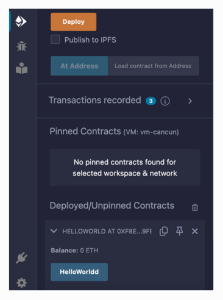
</p>

<p align="center">
  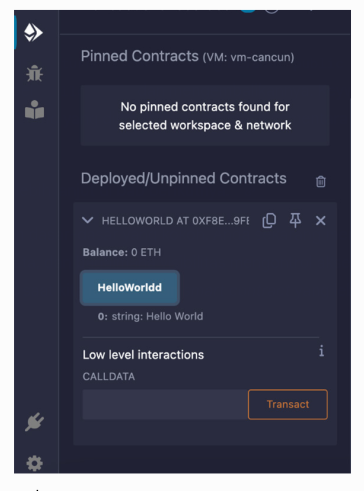
</p>

[Tampilan contract HelloWorld yang telah di-deploy di Remix, dengan tombol biru 'helloWorld'. - Figure 4.14 & 4.15]

**Versi Kedua (Menggunakan Fungsi Eksplisit)**
Versi ini menunjukkan cara mencapai hasil yang sama dengan fungsi yang ditulis secara eksplisit.

```solidity
//SPDX-License-Identifier: MIT
pragma solidity 0.8.25;

contract HelloWorld {
    string helloWorld = "Hello World";

    function returnHelloWorld() public view returns (string memory) {
        return helloWorld;
    }
}
```

Di sini, kita membuat fungsi `returnHelloWorld` yang bersifat `public` dan `view`. Fungsi ini membaca nilai dari variabel `helloWorld` dan mengembalikannya. Keyword `memory` menandakan bahwa nilai *string* yang dikembalikan disimpan sementara di memori selama eksekusi. Konsep `memory` akan dijelaskan lebih lanjut di bab berikutnya.

---

# Bab 5
## Membangun Kontrak `ZooManagement`

Bab ini bertujuan untuk memperdalam pemahaman Anda tentang konsep pemrograman Solidity dengan menggunakan contoh praktis, yaitu kontrak `ZooManagement`. Kontrak ini dirancang untuk mengelola data di kebun binatang fiktif, seperti melacak jumlah pengunjung dan mengelola data hewan. Melalui bab ini, Anda akan mempelajari cara menggunakan `structs`, `mappings`, dan `arrays` untuk mengelola kumpulan data yang kompleks. Selain itu, bab ini juga akan memperkenalkan konsep *inheritance* (pewarisan), impor kontrak, serta praktik terbaik untuk efisiensi dan keamanan.

Tujuan utamanya adalah agar Anda dapat membangun sebuah kontrak yang canggih dan mampu menangani kasus penggunaan berbasis data di lingkungan yang terdesentralisasi.

## Mempersiapkan Kontrak `ZooManagement`

Seperti pada bab sebelumnya, kita akan menggunakan Remix IDE. Langkah pertama adalah membersihkan *workspace* dari file-file contoh dan membuat file baru bernama `ZooManagement.sol`.

### 1\. Inisialisasi Kontrak dan Pengelolaan Pengunjung

Kontrak kita dimulai dengan deklarasi lisensi dan versi Solidity, sama seperti praktik terbaik yang telah kita pelajari.

```solidity
//SPDX-License-Identifier: MIT
pragma solidity 0.8.26;

contract ZooManagement {
    // ... konten kontrak akan ditambahkan di sini
}
```

> **Catatan Penting tentang Versi `pragma`**: Buku ini mungkin menggunakan versi `0.8.25` atau `0.8.26`. Remix IDE secara *default* akan menggunakan *compiler* versi terbaru. Jika Kita melihat garis berlekuk-lekuk merah di bawah baris `pragma`, itu artinya versi *compiler* Kita tidak cocok. Kita bisa mengubah versi *compiler* di tab "Solidity Compiler" di Remix agar sesuai dengan yang ada di kode, atau, yang lebih disarankan, perbarui versi `pragma` di kode Kita ke versi terbaru yang didukung Remix. Bab ini menjelaskan secara detail cara mengatasi masalah ini, yang merupakan keterampilan praktis yang penting.

<p align="center">
  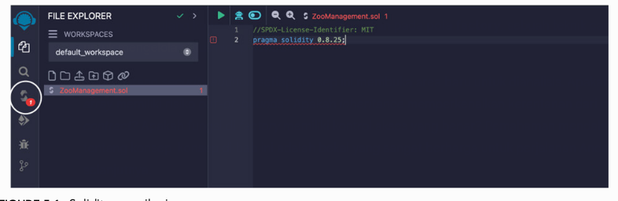
</p>

[Tangkapan layar antarmuka Remix IDE yang menunjukkan ikon Solidity Compiler di bilah sisi kiri. - Figure 5.1]

#### **Variabel dan Fungsi Awal**

Kontrak ini pertama-tama akan mengelola jumlah total pengunjung. Untuk itu, kita mendeklarasikan sebuah variabel *state* dan dua fungsi: satu untuk memperbarui jumlah pengunjung dan satu lagi untuk mengambilnya.

```solidity
contract ZooManagement {
    uint256 public totalVisitors; 

    function updateVisitorCount(uint256 _newVisitorCount) public {
        totalVisitors = _newVisitorCount;
    }
 
    function getTotalVisitors() public view returns(uint256) {
        return totalVisitors;
    }
}
```

Mari kita bedah kode ini:

  * `uint256 public totalVisitors;`: Kita mendeklarasikan sebuah *state variable* (variabel yang statusnya disimpan secara permanen di *blockchain*) bernama `totalVisitors` dengan tipe `uint256`. *Keyword* `public` secara otomatis membuat sebuah fungsi *getter* dengan nama yang sama (`totalVisitors()`), sehingga kita bisa membaca nilainya dari luar kontrak.
  * `function updateVisitorCount(uint256 _newVisitorCount) public`: Ini adalah fungsi untuk mengubah nilai `totalVisitors`.
      * Fungsi ini `public`, artinya bisa dipanggil oleh siapa saja (baik dari luar *blockchain* maupun oleh kontrak lain).
      * Fungsi ini menerima satu parameter, `_newVisitorCount`, yang merupakan jumlah pengunjung baru.
      * Di dalam fungsi, `totalVisitors = _newVisitorCount;` adalah operasi penugasan (*assignment*) yang mengubah status variabel `totalVisitors`. Karena operasi ini mengubah *state* *blockchain*, eksekusinya akan memerlukan *gas fee*.
  * `function getTotalVisitors() public view returns(uint256)`: Fungsi ini digunakan untuk membaca nilai `totalVisitors`.
      * *Keyword* `view` sangat penting di sini. Ini menandakan bahwa fungsi ini hanya "melihat" atau membaca data dari *blockchain* dan tidak mengubah *state* apa pun. Akibatnya, memanggil fungsi `view` dari luar *blockchain* (misalnya dari DApp) tidak memerlukan *gas fee*.
      * `returns(uint256)` mendeklarasikan bahwa fungsi ini akan mengembalikan sebuah nilai bertipe `uint256`.

<p align="center">
  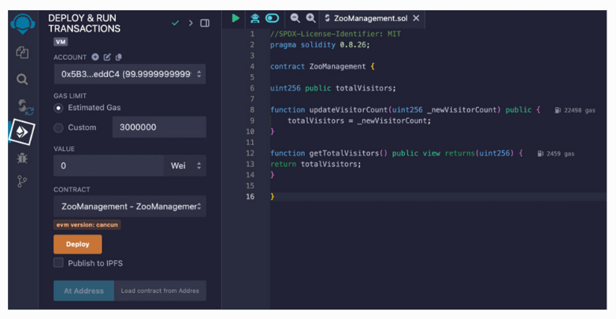
</p>

[Tangkapan layar antarmuka Remix setelah kontrak di-deploy, menunjukkan tombol untuk fungsi updateVisitorCount, getTotalVisitors, dan totalVisitors. - Figure 5.7]

Ketika kontrak ini di-*deploy*, kita bisa memasukkan angka (misalnya `10`) ke dalam fungsi `updateVisitorCount`, dan kemudian memanggil `getTotalVisitors` atau `totalVisitors` untuk melihat bahwa nilainya telah berubah menjadi `10`.

<p align="center">
  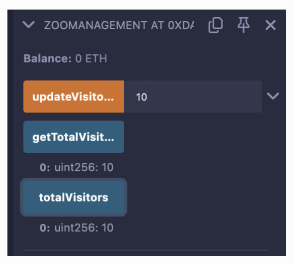
</p>

[Tangkapan layar hasil di Remix setelah memasukkan nilai 10 ke updateVisitorCount dan memanggil getTotalVisitors, yang menunjukkan output 10. - Figure 5.9]

## `Structs` - Mengelompokkan Data Terstruktur

Sejauh ini kita hanya menyimpan satu jenis data (jumlah pengunjung). Bagaimana jika kita ingin menyimpan informasi yang lebih kompleks, seperti data hewan yang memiliki beberapa atribut (spesies, nama, umur)? Di sinilah `struct` berperan.

**Struct** (kependekan dari *structure*) adalah tipe data kustom yang memungkinkan kita untuk mengelompokkan beberapa variabel yang berbeda tipe di bawah satu nama. Ini sangat berguna untuk merepresentasikan objek dunia nyata.

```solidity
// SPDX-License-Identifier: MIT
pragma solidity 0.8.26;

contract ZooManagement {
    uint256 public totalVisitors; 
    
    struct Animal {
        string species;
        string name;
        uint256 age;
    }
 
    Animal public tiger = Animal("Tiger", "Peanut", 3);
    Animal public bear = Animal("Bear", "Honey", 4);
    Animal public lion = Animal("Lion", "Simba", 8); // Seharusnya "Lion", bukan "Animal"
 
    function updateVisitorCount(uint256 _newVisitorCount) public {
        totalVisitors = _newVisitorCount;
    }
 
    function getTotalVisitors() public view returns(uint256) {
        return totalVisitors;
    }
}
```

> **Perbaikan Kode**: Dalam buku, contoh untuk `lion` salah memasukkan `"Animal"` sebagai spesies. Seharusnya `"Lion"`. Versi di atas sudah diperbaiki untuk kejelasan.
> `Animal public lion = Animal("Lion", "Simba", 8);`

Analisis kode baru:

  * `struct Animal { ... }`: Kita mendefinisikan sebuah `struct` baru bernama `Animal`. Di dalamnya, kita mendeklarasikan tiga "kolom" atau *field*: `species` (string), `name` (string), dan `age` (uint256).
  * `Animal public tiger = Animal("Tiger", "Peanut", 3);`: Ini adalah cara kita membuat sebuah *instance* (contoh nyata) dari `struct` `Animal`.
      * `Animal public tiger`: Kita mendeklarasikan variabel publik bernama `tiger` yang tipenya adalah `Animal`.
      * `= Animal("Tiger", "Peanut", 3)`: Kita menginisialisasi variabel ini dengan nilai-nilai yang sesuai dengan urutan *field* di dalam `struct`: spesiesnya "Tiger", namanya "Peanut", dan umurnya 3.

Setelah di-*deploy*, akan muncul tombol-tombol baru untuk `tiger`, `bear`, dan `lion`. Ketika diklik, mereka akan mengembalikan semua data yang terkait dengan hewan tersebut secara terstruktur.

<p align="center">
  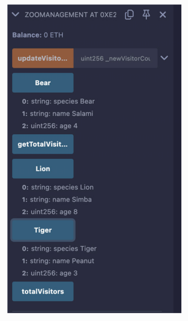
</p>

[Tangkapan layar Remix menunjukkan hasil pemanggilan variabel struct 'bear', 'lion', dan 'tiger', yang menampilkan semua field dan nilainya. - Figure 5.12]

## `Arrays` - Mengelola Daftar Data

Mendeklarasikan setiap hewan sebagai variabel terpisah tidak efisien jika kita memiliki ratusan hewan. Solusinya adalah menggunakan **array**. *Array* adalah struktur data yang dapat menyimpan daftar nilai dengan tipe yang sama.

Solidity mendukung dua jenis *array*:

1.  **Dynamic Arrays**: Ukurannya tidak ditentukan di awal dan bisa bertambah seiring waktu.
2.  **Fixed-Size Arrays**: Ukurannya ditentukan saat deklarasi dan tidak bisa diubah.

### 1\. Dynamic Arrays

*Dynamic array* lebih fleksibel tetapi bisa lebih mahal dari segi *gas* karena ukurannya yang bisa berubah.

```solidity
// Kode sebelumnya ...
struct Animal {
    string species;
    string name;
    uint256 age;
}
 
Animal[] public listofAnimals; // Deklarasi Dynamic Array

// Hapus deklarasi tiger, bear, lion yang individual

function addAnimal(string memory _species, string memory _name, uint256 _age) public {
    listofAnimals.push(Animal(_species, _name, _age));
}

// ... sisa fungsi lainnya
```

Pembahasan:

  * `Animal[] public listofAnimals;`: Kita mendeklarasikan sebuah *dynamic array* publik bernama `listofAnimals`. Tanda `[]` tanpa angka di dalamnya menandakan bahwa ini adalah *dynamic array*. Tipe data elemen di dalamnya adalah `Animal` (struct yang kita buat).
  * `function addAnimal(...)`: Fungsi ini sekarang digunakan untuk menambahkan hewan baru ke dalam daftar.
  * `listofAnimals.push(Animal(_species, _name, _age));`: Ini adalah bagian kuncinya.
      * `Animal(_species, _name, _age)`: Pertama, kita membuat *instance* `Animal` baru secara sementara (*in-memory*).
      * `.push(...)`: Kemudian, kita menggunakan metode `.push()` untuk menambahkan *instance* baru ini ke akhir dari *array* `listofAnimals`.

### 2\. Fixed-Size Arrays

Jika kita tahu persis berapa banyak hewan yang akan ada di kebun binatang (misalnya, hanya 3), kita bisa menggunakan *fixed-size array* untuk menghemat *gas*.

```solidity
// ...
struct Animal {
    string species;
    string name;
    uint256 age;
}
 
Animal[3] public listofAnimals; // Deklarasi Fixed-Size Array untuk 3 hewan
uint256 public animalCount; // Helper untuk melacak indeks

// ... fungsi lainnya ...

function addAnimal(string memory _species, string memory _name, uint256 _age) public {
    require(animalCount < 3, "Zoo is full");
 
    listofAnimals[animalCount] = Animal(_species, _name, _age);
 
    animalCount++;
}

function getAnimal(uint256 _index) public view returns (string memory, string memory, uint256) {
    require(_index < animalCount, "Animal does not exist");
 
    Animal memory animal = listofAnimals[_index];
 
    return (animal.species, animal.name, animal.age);
}
```

Analisis:

  * `Animal[3] public listofAnimals;`: Tanda `[3]` mendefinisikan bahwa *array* ini hanya bisa menampung 3 elemen.
  * `require(animalCount < 3, "Zoo is full");`: Ini adalah sebuah *check* keamanan yang sangat penting. `require` akan memeriksa kondisi di dalamnya. Jika `false`, eksekusi akan berhenti (revert) dan menampilkan pesan error. Ini memastikan kita tidak mencoba menambahkan hewan keempat ke dalam *array* yang hanya berkapasitas tiga.
  * `listofAnimals[animalCount] = ...`: Kita tidak lagi menggunakan `.push()`. Sebaliknya, kita mengakses elemen *array* berdasarkan indeksnya (`animalCount`) dan menugaskan nilainya.
  * `animalCount++;`: Setelah menambahkan hewan, kita menaikkan penghitung agar hewan berikutnya ditambahkan di indeks selanjutnya.
  * `function getAnimal(...)`: Fungsi ini memungkinkan kita untuk mengambil data hewan berdasarkan indeksnya. Ini juga menggunakan `require` untuk memastikan kita tidak mencoba mengakses indeks yang tidak ada.

## `Mappings` - Pencarian Data Efisien dengan Key-Value

*Array* bagus untuk menyimpan daftar, tetapi tidak efisien untuk mencari item tertentu. Jika kita ingin menemukan hewan dengan nama "Simba" di dalam *array* yang berisi 1000 hewan, kita harus mengulang (*iterate*) satu per satu. Di sinilah **mapping** bersinar.

**Mapping** adalah struktur data *key-value* (kunci-nilai), mirip seperti kamus atau *hash table*. Kita menyediakan sebuah "kunci" unik, dan *mapping* akan langsung mengembalikan "nilai" yang terkait. Pencarian ini sangat efisien (*O(1)*), artinya biayanya tetap, tidak peduli seberapa banyak data yang disimpan.

Mari kita modifikasi kontrak *dynamic array* kita untuk menambahkan *mapping*.

```solidity
// ...
struct Animal {
    string species;
    string name;
    uint256 age;
}
 
Animal[] public listofAnimals;
 
mapping (string => uint256) public nameToAge; // Deklarasi Mapping

// ... fungsi lainnya ...

function addAnimal(string memory _species, string memory _name, uint256 _age) public {
    listofAnimals.push(Animal(_species, _name, _age));
    nameToAge[_name] = _age; // Menambahkan data ke mapping
}
```

Pembahasan:

  * `mapping (string => uint256) public nameToAge;`:
      * `mapping`: *Keyword* untuk deklarasi.
      * `(string => uint256)`: Mendefinisikan tipe data. `string` adalah tipe untuk **kunci** (dalam hal ini, nama hewan), dan `uint256` adalah tipe untuk **nilai** (umur hewan).
      * `public nameToAge`: Mendeklarasikan *mapping* publik bernama `nameToAge`.
  * `nameToAge[_name] = _age;`: Di dalam fungsi `addAnimal`, setelah menambahkan hewan ke *array*, kita juga menambahkan entri ke *mapping*. Kita menggunakan nama hewan (`_name`) sebagai kunci dan umurnya (`_age`) sebagai nilai.

Sekarang, setelah di-*deploy*, akan ada fungsi baru `nameToAge`. Jika kita memasukkan "Simba" sebagai input, fungsi tersebut akan langsung mengembalikan `8` tanpa perlu mencari di seluruh *array*.
<p align="center">
  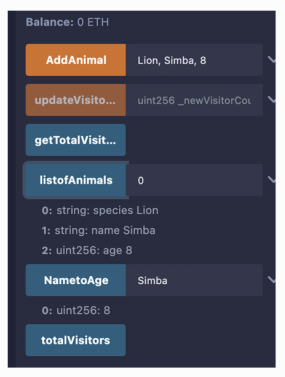
</p>

[Tangkapan layar Remix menunjukkan pemanggilan mapping 'nameToAge' dengan input "Simba" dan hasilnya adalah "8". - Figure 5.15]

Bab ini juga menunjukkan bagaimana kita bisa membuat beberapa *mapping* untuk menghubungkan berbagai atribut, misalnya `speciesToName`, `ageToName`, dll.

## `Contract Importing` - Menggunakan Kode dari File Lain

Seiring bertambahnya kompleksitas, menyimpan semua kode dalam satu file menjadi tidak praktis. Solidity memungkinkan kita untuk memisahkan kontrak ke dalam beberapa file dan mengimpornya saat dibutuhkan.

**Importing** adalah proses memuat definisi kontrak dari file lain agar bisa digunakan di file saat ini.

```solidity
// Di file ContractInheritance.sol
import {ZooManagement} from "./ZooManagement.sol"; // Impor kontrak
```

Pembahasan Sintaks:

  * `import {ZooManagement} ...`: Kita memberitahu *compiler* bahwa kita ingin mengimpor kontrak spesifik bernama `ZooManagement`.
  * `from "./ZooManagement.sol";`: Kita menunjukkan lokasi file tempat kontrak tersebut didefinisikan.
      * `./`: Menandakan direktori saat ini.
      * `../`: Menandakan direktori induk (satu tingkat di atas).
      * `NamaFolder/NamaFile.sol`: Menandakan file berada di dalam sub-folder.

Bab ini memberikan contoh yang sangat baik tentang bagaimana path ini berubah tergantung pada lokasi file, sebuah konsep yang sangat penting untuk dipahami saat bekerja dengan proyek yang lebih besar.

## `Inheritance` - Mewarisi Sifat dari Kontrak Lain

**Inheritance** (Pewarisan) adalah mekanisme di mana sebuah kontrak (*child contract*) dapat mewarisi fungsi, variabel, dan *modifier* dari kontrak lain (*parent contract*). Ini adalah pilar dari *Object-Oriented Programming* (OOP) dan sangat berguna untuk penggunaan ulang kode (*code reusability*) dan menciptakan hierarki kontrak.

#### **Tipe-tipe Inheritance**

1.  **Single Inheritance**: Satu *child* mewarisi dari satu *parent*.

    ```solidity
    contract AddSubtractiontoAdditionContract is CreateNumber {
        // ...
    }
    ```

      * *Keyword* `is` digunakan untuk menandakan pewarisan.

2.  **Multilevel Inheritance**: Sebuah rantai pewarisan (C mewarisi dari B, B mewarisi dari A).

    ```solidity
    contract CreateNumber { /* ... */ } // Grandparent
    contract SubtractionContract is CreateNumber { /* ... */ } // Parent
    contract AdditionContract is SubtractionContract { /* ... */ } // Child
    ```

3.  **Multiple Inheritance**: Satu *child* mewarisi dari beberapa *parent*.

    ```solidity
    contract Contract3 is Contract1, Contract2 {
        // ...
    }
    ```

4.  **Hierarchical Inheritance**: Beberapa *child* mewarisi dari satu *parent* yang sama.

    ```solidity
    contract Contract1 { /* ... */ } // Parent
    contract Contract2 is Contract1 { /* ... */ } // Child 1
    contract Contract3 is Contract1 { /* ... */ } // Child 2
    ```

<p align="center">
  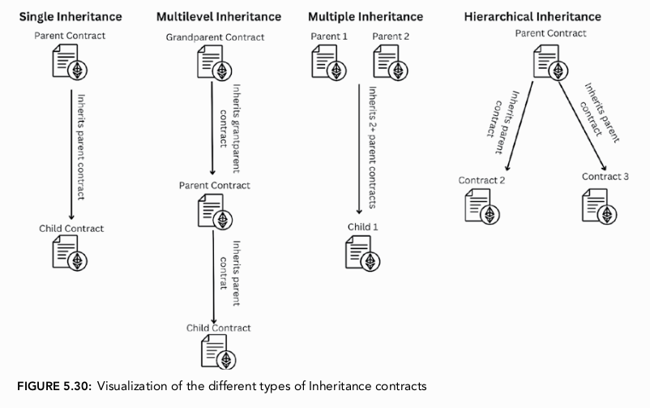
</p>

[Diagram yang mengilustrasikan empat jenis inheritance: Single, Multilevel, Multiple, dan Hierarchical. - Figure 5.30]

#### **Keyword `virtual` dan `override`**

Ini adalah konsep yang sangat penting. Jika sebuah fungsi di *parent contract* akan diubah perilakunya di *child contract*, maka:

  * Fungsi di **parent contract** harus ditandai dengan *keyword* `virtual`.
  * Fungsi di **child contract** harus ditandai dengan *keyword* `override`.

<!-- end list -->

```solidity
// Parent Contract
contract CreateNumber {
    function addNumber(uint256 _number) public virtual { // Ditandai virtual
        // ...
    }
}

// Child Contract
contract AddSubtractiontoAdditionContract is CreateNumber {
    function addNumber(uint256 _newnumber) public override { // Ditandai override
        // ...
    }
}
```

Jika aturan ini tidak diikuti, *compiler* akan memberikan *error*. Ini adalah mekanisme keamanan untuk memastikan bahwa pengembang sadar ketika mereka mengubah perilaku fungsi yang diwarisi.

## Menerapkan dan Menjalankan Kontrak dari Kontrak Lain (Pola *Factory*)

Terkadang, kita membutuhkan sebuah kontrak yang tugasnya adalah men-*deploy* atau membuat *instance* dari kontrak lain. Pola ini disebut **Factory Pattern**.

```solidity
// File: ZooManagementFactory.sol
import {ZooManagement} from "./ZooManagement.sol";

contract ZooManagementFactory {
    ZooManagement[] public listOfZooManagementContracts;

    function deployZooManagement() public {
        ZooManagement newZooManagement = new ZooManagement();
        listOfZooManagementContracts.push(newZooManagement);
    }
    
    function fUpdateVisitorCount(uint256 _zooManagementContractIndex, uint256 _myNewVisitorCount) public {
        ZooManagement myNewZooManagement = listOfZooManagementContracts[_zooManagementContractIndex];
        myNewZooManagement.updateVisitorCount(_myNewVisitorCount);
    }
    
    function fGetTotalVisitors(uint256 _zooManagementContractIndex) public view returns (uint256) {
        ZooManagement myNewZooManagement = listOfZooManagementContracts[_zooManagementContractIndex];
        return myNewZooManagement.getTotalVisitors();
    }
}
```

Analisis Kode *Factory*:

1.  `ZooManagement[] public listOfZooManagementContracts;`: Kita membuat sebuah *array* untuk menyimpan alamat dari semua kontrak `ZooManagement` yang telah di-*deploy* oleh *factory* ini. Ini sangat penting untuk melacak kontrak-kontrak yang telah dibuat.
2.  `ZooManagement newZooManagement = new ZooManagement();`: *Keyword* `new` digunakan untuk men-*deploy* sebuah *instance* baru dari kontrak `ZooManagement`. Operasi ini mengembalikan alamat dari kontrak yang baru dibuat.
3.  `listOfZooManagementContracts.push(newZooManagement);`: Kita menyimpan alamat kontrak baru tersebut ke dalam *array* kita.
4.  `fUpdateVisitorCount` dan `fGetTotalVisitors`: Ini adalah contoh fungsi "proxy". *Factory* ini dapat berinteraksi dengan kontrak-kontrak yang telah dibuatnya.
      * Pertama, ia mengambil alamat kontrak target dari *array* berdasarkan indeksnya (`listOfZooManagementContracts[_zooManagementContractIndex]`).
      * Kemudian, ia memanggil fungsi yang sesuai (`updateVisitorCount` atau `getTotalVisitors`) pada alamat kontrak tersebut.

Pola *factory* sangat kuat dan umum digunakan untuk mengelola ekosistem kontrak yang saling terkait.

### Kesimpulan Bab 5

Kita telah belajar bagaimana mengelola data yang lebih kompleks menggunakan **structs**, **arrays** (baik dinamis maupun tetap), dan **mappings**. Kita juga telah memahami dua konsep fundamental dalam arsitektur perangkat lunak Solidity: **importing** untuk modularitas dan **inheritance** (beserta `virtual` dan `override`) untuk penggunaan ulang kode. Terakhir, Kita diperkenalkan pada **pola factory**, sebuah teknik canggih untuk mengelola siklus hidup kontrak.

---

# Bab 6
## Beralih ke Lingkungan Pengembangan Profesional

Bab ini akan memandu Anda melalui proses penyiapan *Integrated Development Environment* (IDE) profesional menggunakan **Visual Studio (VS) Code** dan *development framework* **Foundry**. Berbeda dengan Remix yang berbasis web, penyiapan lokal ini memberikan Anda kendali penuh dan skalabilitas untuk proyek-proyek yang lebih kompleks.

Dengan mengikuti bab ini, Anda akan membangun sebuah fondasi yang kokoh untuk membuat *smart contracts* yang canggih. Anda akan belajar memanfaatkan fitur-fitur andalan VS Code seperti *editing* multi-file, integrasi *terminal*, dan *extensions* esensial untuk menyederhanakan proses pengembangan. Menguasai lingkungan ini sangat krusial untuk menulis *smart contracts* yang aman dan mudah dipelihara.

## Bagian 1: Apa itu Microsoft VS Code?

Pada bab-bab sebelumnya, kita telah menggunakan **Remix** sebagai IDE. Remix sangat berguna untuk memulai karena antarmukanya yang sederhana dan tidak memerlukan instalasi. Namun, untuk pengembangan profesional, Remix memiliki beberapa keterbatasan, seperti ketergantungan pada koneksi internet dan performa yang terbatas untuk proyek besar.

**VS Code** adalah salah satu *code editor* terkemuka yang digunakan oleh para pengembang profesional untuk berbagai bahasa pemrograman, termasuk Solidity, JavaScript, Python, dan banyak lagi.

Keunggulan utama VS Code adalah:

  * **Ringan dan Cepat**: VS Code dirancang agar tidak membebani sistem dan dapat dijalankan dengan cepat.
  * **Cross-Platform**: Tersedia untuk macOS, Windows, dan Linux.
  * **Dukungan Multi-Bahasa**: Anda dapat bekerja pada berbagai bagian proyek (misalnya, *smart contract* Solidity dan *frontend* JavaScript) dalam satu aplikasi.
  * **Bekerja Offline**: Anda tidak memerlukan koneksi internet untuk menulis atau mengelola kode Anda.

VS Code memiliki dua edisi utama:

1.  **Stable Edition**: Versi standar yang paling stabil dan direkomendasikan untuk penggunaan sehari-hari.
2.  **Insiders Edition**: Versi beta yang berisi fitur-fitur terbaru, namun mungkin masih memiliki *bug*.

Untuk mengunduh, Anda dapat mengunjungi situs resminya di `code.visualstudio.com`.

<p align="center">
  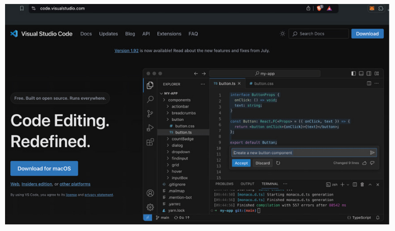
</p>

[Tampilan situs web resmi Visual Studio Code dengan tombol unduh untuk macOS. - Figure 6.1]

## Bagian 2: Tata Letak (Layout) Microsoft Visual Studio Code

Setelah instalasi, Anda akan disambut dengan halaman `Welcome`. Antarmuka VS Code dibagi menjadi beberapa panel utama yang penting untuk dipahami.

<p align="center">
  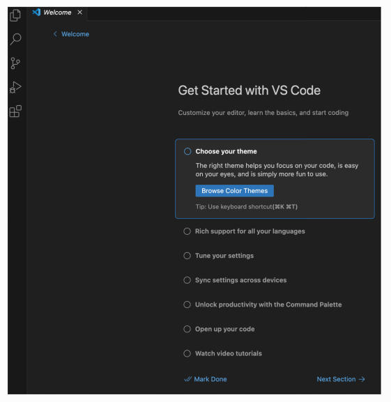
</p>

[Halaman 'Welcome' di VS Code yang menampilkan opsi kustomisasi awal. - Figure 6.3]

### Explorer Pane

Ini adalah panel utama untuk manajemen file dan proyek. Dari sini, Anda bisa membuka folder proyek yang sudah ada atau mengkloning *repository* dari platform seperti GitHub.

<p align="center">
  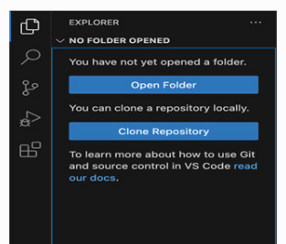
</p>

[Panel Explorer di VS Code, menunjukkan opsi 'Open Folder' dan 'Clone Repository'. - Figure 6.4]

### Search Pane

Panel ini memungkinkan Anda untuk mencari teks di seluruh file dalam proyek Anda. Fitur ini juga mendukung *find and replace*, yang sangat berguna untuk refaktor kode.

### Extensions

*Extensions* adalah program tambahan yang memperluas fungsionalitas VS Code. Ini adalah salah satu kekuatan terbesar VS Code. Bab ini merekomendasikan beberapa *extensions* penting untuk pengembangan Solidity:

  * **Night Owl**: Sebuah tema warna (*theme*) yang nyaman untuk mata, terutama saat bekerja dalam waktu lama.
  * **Polacode**: Berguna untuk membuat tangkapan layar kode yang terlihat profesional.
  * **Bookmarks**: Memungkinkan Anda menandai baris-baris kode penting dalam file besar agar mudah dinavigasi.
  * **Cloak**: Dapat menyembunyikan informasi sensitif (seperti *private keys* atau API *keys*) di editor Anda, sangat berguna saat presentasi atau bekerja di tempat umum.
  * **Solidity by Juan Blanco**: **Ini adalah *extension* yang wajib diinstal**. Fitur-fiturnya meliputi *syntax highlighting* (pewarnaan sintaks), *code completion* (pelengkapan kode otomatis), dan *linting* (analisis kode untuk potensi *error*).
  * **Even Better TOML**: Memberikan *syntax highlighting* untuk file `.toml`, yang digunakan untuk konfigurasi Foundry (`foundry.toml`).
  * **GitHub Copilot**: Asisten AI yang dapat menyarankan pelengkapan kode. Meskipun sangat membantu, buku ini menyarankan untuk tidak menggunakannya saat masih belajar agar Anda terbiasa menulis kode secara manual.

> **Peringatan Keamanan**: *Extensions* tidak selalu diverifikasi oleh Microsoft. Instal hanya *extensions* yang terpercaya, terutama dalam konteks *cryptocurrency* di mana risiko pencurian *private key* sangat tinggi.

## Bagian 3: Fitur Produktivitas di VS Code

### Keyboard Shortcuts

VS Code memiliki banyak *keyboard shortcuts* yang dapat mempercepat alur kerja Anda. Anda dapat melihat dan mengubahnya melalui menu `Settings > Keyboard Shortcuts`. Beberapa yang paling umum digunakan antara lain:

  * **Save File**: `Cmd+S` (macOS) / `Ctrl+S` (Windows)
  * **Open Terminal**: `Cmd+J` (macOS) / `Ctrl+J` (Windows)
  * **Open Explorer Pane**: `Cmd+Shift+E` (macOS) / `Ctrl+Shift+E` (Windows)
  * **Add Comment Line**: `Cmd+/` (macOS) / `Ctrl+/` (Windows)

### Bekerja dengan Beberapa File Secara Bersamaan

VS Code memungkinkan Anda untuk membagi layar editor untuk menampilkan beberapa file sekaligus. Anda dapat menyeret *tab* file ke sisi editor untuk membuat tata letak vertikal, horizontal, atau bahkan grid. Ini sangat berguna untuk membandingkan file, misalnya antara file kontrak dan file *test*-nya.

<p align="center">
  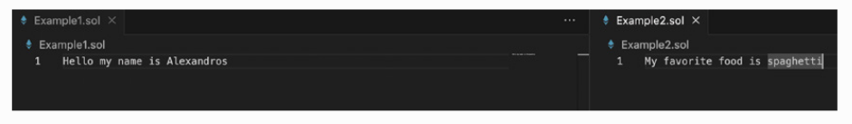
</p>

[Tampilan VS Code dengan layar terbagi dua, menampilkan Example1.sol di kiri dan Example2.sol di kanan. - Figure 6.23]

### Mirror/Mini-Map

Untuk file yang sangat panjang, fitur *mini-map* di sisi kanan editor memberikan gambaran visual dari seluruh kode, memungkinkan navigasi yang cepat.

### Zen Mode

Fitur ini menyembunyikan semua elemen antarmuka yang tidak perlu, memungkinkan Anda untuk fokus sepenuhnya pada kode yang sedang Anda tulis.

## Bagian 4: Terminal Terintegrasi VS Code

Salah satu fitur paling kuat dari VS Code adalah *terminal* yang terintegrasi. Ini memungkinkan Anda menjalankan perintah *command-line* langsung dari dalam editor.

  * **GUI vs. CLI**: *Graphical User Interface* (GUI) adalah cara kita berinteraksi dengan komputer melalui klik dan jendela. *Command-Line Interface* (CLI) adalah interaksi berbasis teks melalui *terminal*, yang lebih kuat dan presisi untuk tugas-tugas pengembangan.
  * **Split Terminal**: Sama seperti editor, Anda dapat membagi *terminal* menjadi beberapa panel. Ini memungkinkan Anda menjalankan beberapa proses secara bersamaan, misalnya, menjalankan node Anvil di satu panel dan men-*deploy* kontrak di panel lain.
  * **Tipe Terminal**: VS Code mendukung berbagai jenis *shell terminal*, termasuk **Bash** dan **Zsh** (umum di macOS/Linux) serta **PowerShell** dan **Cmd** (di Windows).

## Bagian 5: Menginstal Foundry (Langkah Kritis)

**Foundry** adalah *development framework* modern untuk Solidity. Bab ini memandu instalasi Foundry melalui *terminal*.

1.  **Jalankan Perintah Instalasi**: Buka `getfoundry.sh`, salin perintah instalasi, dan tempelkan ke *terminal* Anda.

    ```bash
    curl -L https://foundry.paradigm.xyz | bash
    ```

2.  **Troubleshooting (Mengatasi Masalah Dependensi)**: Selama instalasi, Anda mungkin menemukan *error* yang menyatakan ada *library* yang hilang, seperti `libusb`. Untuk mengatasinya, terutama di macOS, Anda perlu menginstal **Homebrew**.

      * **Apa itu Homebrew?** Homebrew adalah *package manager* untuk macOS dan Linux yang memudahkan instalasi perangkat lunak dan *library* yang dibutuhkan oleh pengembang.
      * **Instalasi Homebrew**: Kunjungi `brew.sh`, salin skrip instalasi, dan jalankan di *terminal* Anda. Proses ini mungkin akan meminta *password* komputer Anda.
      * Setelah Homebrew terinstal, Anda harus menambahkan path-nya ke profil *shell* Anda sesuai instruksi yang muncul di *terminal* setelah instalasi selesai.

3.  **Selesaikan Instalasi Foundry**: Setelah semua dependensi terpenuhi (termasuk Homebrew jika diperlukan), tutup dan buka kembali *terminal* Anda, lalu jalankan perintah:

    ```bash
    foundryup
    ```

    Perintah ini akan mengunduh dan menginstal komponen-komponen Foundry seperti **Forge**, **Cast**, dan **Anvil**.

4.  **Verifikasi Instalasi**: Untuk memastikan Foundry terinstal dengan benar, jalankan perintah berikut:

    ```bash
    forge --version
    ```

    Jika berhasil, *terminal* akan menampilkan versi Forge yang terinstal.

<p align="center">
  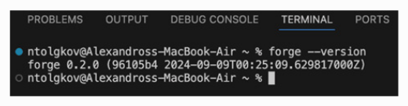
</p>

[Terminal menampilkan output "forge 0.2.0" setelah menjalankan perintah forge --version. - Figure 6.47]

## Bagian 6: Memulai Proyek Foundry

Setelah Foundry terinstal, Anda dapat membuat proyek baru.

1.  **Navigasi dan Buat Folder Proyek**: Gunakan *terminal* untuk menavigasi ke direktori kerja Anda.

      * `ls`: Untuk melihat daftar file dan folder saat ini.
      * `mkdir nama-folder-proyek`: Untuk membuat folder baru.
      * `cd nama-folder-proyek`: Untuk masuk ke dalam folder tersebut.

2.  **Buka Folder di VS Code**: Dari dalam VS Code, gunakan `File > Open Folder` untuk membuka direktori proyek yang baru saja Anda buat.

3. **Inisialisasi Proyek Foundry**: Buka *terminal* terintegrasi di VS Code (yang sekarang sudah berada di dalam direktori proyek Anda) dan jalankan perintah:

    ```bash
    forge init
    ```

    Perintah ini akan secara otomatis membuat struktur proyek standar Foundry, termasuk folder `src` (untuk kode kontrak), `script` (untuk skrip *deployment*), `test` (untuk file *test*), dan file konfigurasi `foundry.toml`.
    
<p align="center">
  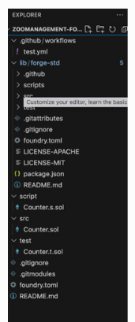
</p>

[Panel Explorer di VS Code menunjukkan struktur folder proyek Foundry yang baru dibuat: lib, script, src, test, dan file lainnya. - Figure 6.60]

### Kesimpulan Bab 6

Bab ini telah memberikan panduan lengkap untuk beralih dari lingkungan pengembangan yang sederhana ke penyiapan lokal yang profesional dan kuat. Anda telah belajar menginstal dan mengkonfigurasi **VS Code** dengan *extensions* yang tepat, serta menguasai instalasi **Foundry**, *framework* pilihan untuk pengembangan Solidity modern. Dengan fondasi ini, Anda kini siap untuk menulis, mengkompilasi, dan mengelola proyek *smart contract* yang lebih kompleks dan aman, yang akan kita bahas di bab-bab selanjutnya.

---

# Bab 7
## Foundry ZooManagement - Alur Kerja Pengembangan Profesional

### **Pendahuluan**

Setelah di bab sebelumnya kita berhasil mempersiapkan lingkungan pengembangan lokal yang profesional dengan VS Code dan Foundry, Bab 7 ini adalah jembatan yang menghubungkan teori dengan praktik. Kita akan mengambil kontrak `ZooManagement` yang telah kita bangun di Remix dan mengimplementasikannya kembali dalam *workflow* Foundry. Bab ini akan memandu Kita secara menyeluruh melalui setiap langkah: meninjau struktur file proyek, mengkompilasi kontrak, men-*deploy* secara lokal menggunakan Anvil, berinteraksi dengan kontrak yang telah di-*deploy*, hingga men-*deploy* ke jaringan *testnet* publik. Menguasai alur kerja ini adalah fundamental bagi setiap pengembang dan *auditor* Solidity.

### **Bagian 1: Memahami Struktur File Proyek Foundry**

Saat Kita menjalankan `forge init`, Foundry menciptakan sebuah kerangka kerja yang terorganisir. Mari kita bedah setiap file dan folder penting yang dihasilkan, karena ini adalah fondasi dari setiap proyek Foundry.

<p align="center">
  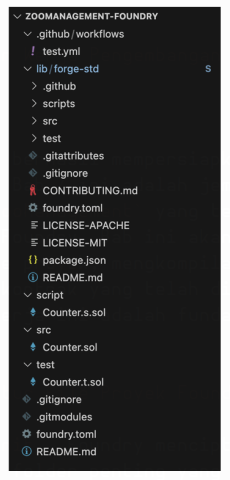
</p>

[Tangkapan layar panel Explorer di VS Code yang menunjukkan semua file dan folder default dalam proyek Foundry. - Figure 7.1]

  * **Folder `.github/workflows`**: Berisi file konfigurasi untuk **GitHub Actions**. Ini adalah *tools* otomatisasi yang dapat menjalankan tugas-tugas seperti *testing* secara otomatis setiap kali ada perubahan pada kode di *repository* GitHub. File `test.yml` di dalamnya adalah contoh alur kerja untuk menjalankan *test*.
  * **Folder `lib`**: Folder ini berisi *libraries* atau dependensi eksternal. Secara *default*, di dalamnya terdapat `forge-std`, yaitu *standard library* Foundry yang menyediakan kontrak-kontrak bantuan (seperti `Script.sol` dan `Test.sol`) serta *cheat codes* (`vm`) yang sangat berguna.
  * **Folder `script`**: Tempat untuk menyimpan skrip *deployment*. File di sini mengikuti konvensi penamaan berakhiran `.s.sol`. Contohnya, `Counter.s.sol`.
  * **Folder `src`**: Kependekan dari *source*. Di sinilah Kita menyimpan kode sumber (*source code*) dari *smart contract* utama Kita. Contohnya, `Counter.sol`.
  * **Folder `test`**: Berisi semua kontrak untuk pengujian (*testing*). File di sini mengikuti konvensi penamaan berakhiran `.t.sol`. Contohnya, `Counter.t.sol`.
  * **File `.gitignore`**: Sebuah file konfigurasi untuk **Git** (sebuah *version control system* yang melacak perubahan pada kode). File ini berisi daftar file atau folder yang harus diabaikan oleh Git, sangat penting untuk mencegah informasi sensitif seperti *private key* terunggah.
  * **File `foundry.toml`**: File konfigurasi utama untuk proyek Foundry. Kita bisa mengatur versi *compiler*, URL RPC *default*, *gas settings*, dan banyak lagi di sini.
  * **File `README.md`**: File dokumentasi untuk proyek Kita. Berisi penjelasan, instruksi instalasi, dan cara penggunaan.

### **Bagian 2: Mengkompilasi Kontrak (*Compiling a Contract*)**

Kompilasi adalah proses mengubah kode Solidity menjadi **bytecode** EVM. Ini juga merupakan langkah validasi untuk memastikan tidak ada *syntax error*. Mari kita gunakan `Counter.sol` sebagai contoh.

```solidity
// File: src/Counter.sol
// SPDX-License-Identifier: UNLICENSED
pragma solidity ^0.8.13;

contract Counter {
    uint256 public number;

    function setNumber(uint256 newNumber) public {
        number = newNumber;
    }

    function increment() public {
        number++;
    }
}
```

Buka *terminal* di VS Code dan jalankan perintah:

```bash
forge build
```

<p align="center">
  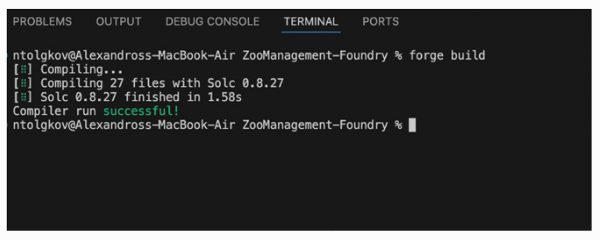
</p>

[Terminal menampilkan output "Compiler run successful\!". - Figure 7.5]

Jika ada *error*, misalnya kita sengaja menghapus kurung kurawal penutup `}` dari kontrak:

<p align="center">
  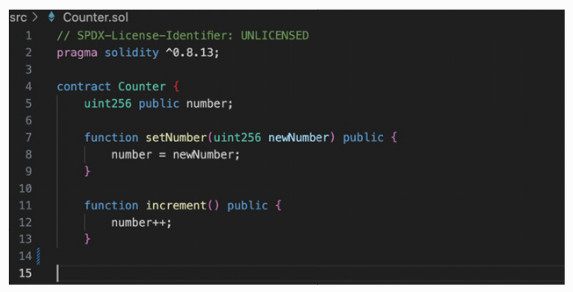
</p>

[Kode kontrak Counter.sol dengan kurung kurawal penutup yang dihapus. - Figure 7.6]

Maka saat menjalankan `forge build`, Foundry akan memberikan pesan *error* yang sangat jelas:

<p align="center">
  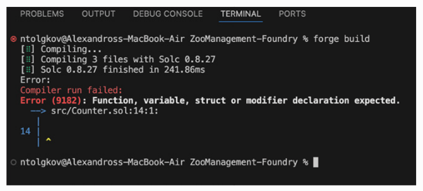
</p>

[Terminal menampilkan pesan error kompilasi yang detail, menunjukkan bahwa sebuah '}' hilang. - Figure 7.7]

Ini menunjukkan betapa bergunanya *compiler* dalam proses *debugging* awal.

### **Bagian 3: Pengenalan Anvil - *Node* Blockchain Lokal Anda**

**Anvil** adalah simulasi *node* Ethereum lokal yang merupakan bagian dari Foundry. Ini memungkinkan kita melakukan *testing* dan *deployment* dalam lingkungan yang cepat dan terkontrol.

Untuk menjalankannya, ketik di *terminal*:

```bash
anvil
```

<p align="center">
  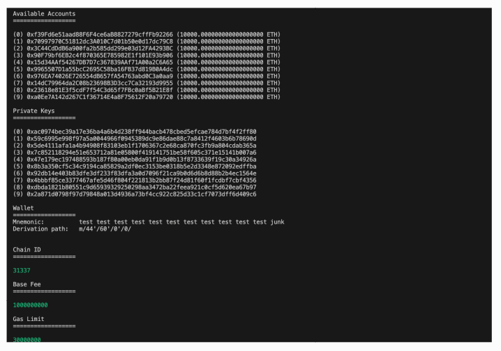
</p>

[Output terminal saat Anvil dijalankan, menampilkan 10 akun beserta private key, mnemonic, dan detail jaringan. - Figure 7.10]

Mari kita bedah outputnya secara detail:

  * **Available Accounts**: 10 akun *test* yang sudah diisi dana (10,000 ETH palsu).
  * **Private Keys**: Kunci privat heksadesimal 64-karakter untuk setiap akun.
  * **Wallet - Mnemonic**: Sebuah frasa 12 kata yang lebih mudah diingat. Dari satu *mnemonic* ini, semua 10 akun tersebut dapat dihasilkan kembali.
  * **Wallet - Derivation Path**: `m/44'/60'/0'/0` adalah standar (BIP-44) untuk menghasilkan *private key*. `44` merujuk pada BIP-44, `60` adalah tipe koin untuk Ethereum, dan angka `0` berikutnya merujuk pada nomor akun dan indeks alamat.
  * **Chain ID**: `31337`, ID unik untuk jaringan Anvil.
  * **RPC URL**: `127.0.0.1:8545`, alamat yang digunakan untuk menghubungkan *tools* lain ke Anvil.

#### **Menghubungkan Anvil ke MetaMask**

Untuk berinteraksi dengan Anvil menggunakan *wallet* grafis:

1.  Buka MetaMask \> Settings \> Networks \> Add a network \> Add a network manually.
2.  Isi detailnya:
      * **Network Name**: `Anvil`
      * **New RPC URL**: `http://127.0.0.1:8545`
      * **Chain ID**: `31337`
      * **Currency Symbol**: `ETH`
3.  Simpan jaringan.
4.  Selanjutnya, impor salah satu akun Anvil dengan menyalin *private key*-nya dari terminal dan menggunakan fitur "Import account" di MetaMask.

### **Bagian 4: *Deployment* Kontrak Lokal di Anvil**

#### **Metode 1: Menggunakan Skrip *Deployment* (Cara Profesional dan Aman)**

Metode yang paling direkomendasikan adalah menggunakan skrip. Mari kita pindahkan kode `ZooManagement.sol` ke folder `src` dan buat skrip *deployment*-nya di folder `script`.

```solidity
// File: script/DeployZooManagement.s.sol
//SPDX-License-Identifier: MIT
pragma solidity ^0.8.19; // Sesuaikan dengan versi Anda

import {Script} from "forge-std/Script.sol";
import {ZooManagement} from "../src/ZooManagement.sol";

contract DeployZooManagement is Script {
    function run() external returns (ZooManagement) {
        vm.startBroadcast();
        ZooManagement zooManagement = new ZooManagement();
        vm.stopBroadcast();
        return zooManagement;
    }
}
```

  * `import {Script}`: Mengimpor kontrak dasar untuk skrip dari `forge-std`.
  * `is Script`: Menandakan bahwa ini adalah kontrak skrip.
  * `vm.startBroadcast()` dan `vm.stopBroadcast()`: *Cheat codes* ini memberitahu Foundry bahwa semua *call* yang terjadi di antara keduanya harus dikirim sebagai transaksi nyata ke *blockchain*.

#### **Manajemen *Private Key* yang Aman (Langkah Krusial)**

Sebelum men-*deploy*, kita harus menyimpan *private key* dengan aman, bukan menempelkannya langsung di *command-line*.

1.  **Buka Terminal Komputer Kita (bukan terminal VS Code, untuk lapisan keamanan tambahan).**
2.  Jalankan perintah `cast wallet import` untuk menyimpan dan mengenkripsi *private key* Anvil Kita:
    ```bash
    cast wallet import my-anvil-wallet --interactive
    ```
<p align="center">
  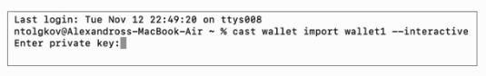
</p>

[Terminal meminta untuk memasukkan private key. - Figure 7.26]
3.  Tempelkan salah satu *private key* dari Anvil.
4.  Buat *password* untuk mengenkripsi *keystore file* ini.
5.  Terminal akan mengonfirmasi bahwa *wallet* telah disimpan dan memberikan Kita alamat *keystore*. Simpan alamat ini.

<p align="center">
  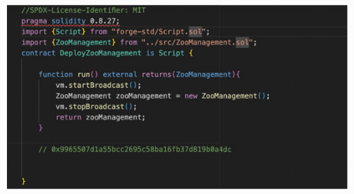
</p>

[Terminal menampilkan pesan sukses bahwa keystore telah disimpan beserta alamatnya. - Figure 7.29]

Sekarang, kembali ke terminal VS Code untuk men-*deploy* skrip:

```bash
forge script script/ZooManagement.s.sol:DeployZooManagement --rpc-url http://127.0.0.1:8545 --account my-anvil-wallet --broadcast
```

Foundry akan meminta *password* yang Kita buat tadi. Ini adalah cara yang aman untuk men-*deploy* karena *private key* Kita tidak pernah terekspos dalam bentuk teks biasa di *command-line*.

<p align="center">
  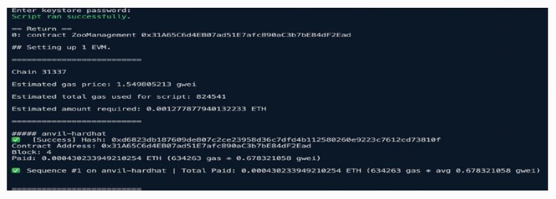
</p>

[Terminal menampilkan output deployment yang sukses, termasuk alamat deployer, alamat kontrak baru, dan hash transaksi. - Figure 7.30]

### **Bagian 5: Berinteraksi dengan Kontrak Menggunakan Foundry (`cast`)**

**Cast** adalah *tool* CLI dari Foundry untuk melakukan *RPC calls* ke Ethereum, termasuk berinteraksi dengan kontrak.

#### **`cast send`: Mengirim Transaksi yang Mengubah *State***

Untuk memanggil fungsi yang mengubah data, seperti `updateVisitorCount`:

```bash
cast send <ALAMAT_KONTRAK> "updateVisitorCount(uint256)" 21 --rpc-url http://127.0.0.1:8545 --account my-anvil-wallet
```

  * Parameter pertama adalah alamat kontrak.
  * Parameter kedua adalah *function signature* (tanda tangan fungsi) dalam tanda kutip.
  * Parameter selanjutnya adalah argumen untuk fungsi tersebut (nilai `21`).

#### **`cast call`: Membaca Data dari Kontrak**

Untuk memanggil fungsi `view` atau `pure` yang hanya membaca data, seperti `getTotalVisitors`:

```bash
cast call <ALAMAT_KONTRAK> "getTotalVisitors()"
```

Hasilnya akan dalam format *hexadecimal*. Gunakan `cast --to-dec` untuk mengonversinya:

```bash
cast --to-dec 0x0000000000000000000000000000000000000000000000000000000000000015
# Output: 21
```

### **Bagian 6: *Deployment* ke Jaringan *Testnet* (Sepolia)**

Proses ini sangat mirip dengan *deployment* lokal, namun dengan beberapa penyesuaian:

1.  **Dapatkan RPC URL untuk Sepolia**: Buat akun di **Alchemy**, buat "app" baru untuk jaringan Sepolia, dan salin **HTTPS URL**-nya.

2.  **Siapkan Akun Testnet**: Pastikan akun MetaMask Kita memiliki saldo Sepolia ETH dari *faucet*. Kemudian, ekspor *private key* akun tersebut.

    > **PERINGATAN KESELAMATAN YANG SANGAT PENTING**: Seperti yang dijelaskan di buku, tindakan mengekspor *private key* dari *wallet* seperti MetaMask sangat berisiko. Lakukan ini **HANYA** untuk akun *testnet* yang tidak memiliki nilai finansial. **JANGAN PERNAH** lakukan ini untuk akun *mainnet* Kita.

3.  **Impor Private Key Testnet dengan Aman**: Gunakan `cast wallet import` lagi untuk menyimpan *private key* Sepolia Kita dengan nama baru (misalnya, `my-sepolia-wallet`).

4.  **Dapatkan Etherscan API Key**: Buat akun di `etherscan.io` dan dapatkan API *key* gratis. Ini akan memungkinkan Foundry untuk secara otomatis memverifikasi kode sumber kontrak Kita.

5.  **Jalankan Perintah *Deployment***:

    ```bash
    forge script script/ZooManagement.s.sol:DeployZooManagement \
    --rpc-url <URL_RPC_ALCHEMY_SEPOLIA_ANDA> \
    --account my-sepolia-wallet \
    --sender <ALAMAT_WALLET_SEPOLIA_ANDA> \
    --etherscan-api-key <API_KEY_ETHERSCAN_ANDA> \
    --broadcast
    ```

      * `--broadcast`: Flag ini wajib untuk benar-benar mengirimkan transaksi ke jaringan publik.
      * `--etherscan-api-key`: Flag untuk verifikasi otomatis.

### **Verifikasi di Etherscan**

Setelah *deployment* berhasil, salin *hash* transaksi dari output terminal, buka `sepolia.etherscan.io`, dan cari *hash* tersebut. Kita akan dapat melihat transaksi pembuatan kontrak Kita, membuktikan bahwa kontrak Kita sekarang hidup di jaringan *testnet* publik dan kodenya sudah terverifikasi.

<p align="center">
  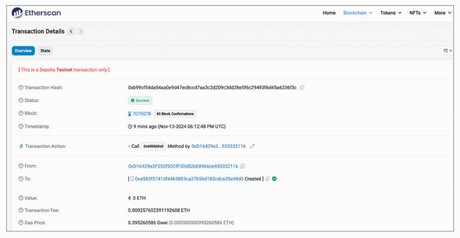
</p>

[Tangkapan layar Etherscan untuk jaringan Sepolia yang menunjukkan detail transaksi pembuatan kontrak. - Figure 7.53]

### **Kesimpulan Bab 7**

Kita mendapatkan pengalaman dalam menggunakan *toolchain* profesional untuk siklus pengembangan *smart contract* yang lengkap. Kita telah beralih dari lingkungan *online* yang sederhana ke alur kerja lokal yang kuat, mempelajari cara mengkompilasi, men-*deploy* kontrak secara aman, berinteraksi dengannya, dan memverifikasi hasilnya di *block explorer* publik. Keterampilan ini adalah fondasi yang mutlak diperlukan untuk membangun aplikasi terdesentralisasi yang serius dan merupakan bekal esensial untuk memulai analisis keamanan.

---

# Bab 8
## Fundraising Contract

Bab ini bertujuan untuk memandu kita membangun sebuah *smart contract* penggalangan dana (*fundraising*) yang praktis. Ini adalah salah-satu aplikasi dunia nyata yang paling umum dan akan mendemonstrasikan beberapa konsep fundamental serta praktik terbaik dalam Solidity. Dengan mengembangkan *contract* ini, kita akan belajar cara menangani pembayaran *cryptocurrency* secara aman, berintegrasi dengan *price feeds* eksternal melalui *oracle* dari Chainlink, serta mengimplementasikan kontrol akses dan langkah-langkah keamanan yang tepat.

Bayangkan sebuah skenario di mana sebuah badan amal ingin menerima donasi dalam bentuk *cryptocurrency* tetapi perlu memastikan nilai minimum donasi tersebut dalam Dolar AS (USD), terlepas dari fluktuasi harga ETH. Hal ini menimbulkan beberapa tantangan teknis:

1.  Bagaimana cara mendapatkan data harga USD/ETH yang andal di dalam *blockchain* (*on-chain*)?
2.  Bagaimana cara melacak para donatur dan total kontribusi mereka?
3.  Bagaimana cara memastikan hanya pihak yang berwenang (*authorized*) yang dapat menarik (*withdraw*) dana?

Bab ini akan memandu kita memecahkan tantangan-tantangan tersebut langkah demi langkah.

### Menyiapkan Fundraising Contract

Langkah pertama adalah menyiapkan proyek Foundry baru. Proses ini melibatkan penggunaan *terminal* atau *command-line interface* (CLI) untuk membuat struktur direktori yang diperlukan.

1.  **Navigasi Direktori**: Buka terminal di Visual Studio Code. Perintah `ls` digunakan untuk melihat isi direktori saat ini. Jika Kita berada di direktori proyek sebelumnya (misalnya, `ZooManagement-Foundry`), gunakan `cd ..` untuk kembali ke direktori induk.

<p align="center">
  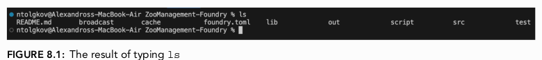
</p>

[Terminal menampilkan isi direktori yang berisi folder ZooManagement-Foundry. - Figure 8.1]

<p align="center">
  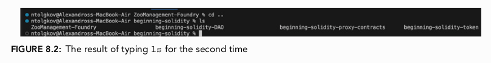
</p>

[Terminal setelah menjalankan perintah 'cd ..', sekarang berada di direktori 'beginning-solidity'. - Figure 8.2]

2.  **Membuat Proyek Baru**:

      * Buat direktori baru untuk proyek ini dengan perintah: `mkdir Fundraising-contract`.
      * Verifikasi pembuatannya dengan `ls`.
      * Masuk ke direktori baru tersebut dengan `cd Fundraising-contract`.
      * Inisialisasi proyek Foundry baru dengan `forge init` (atau `forge init --force` jika direktori tidak kosong).

<p align="center">
  
</p>

<p align="center">
  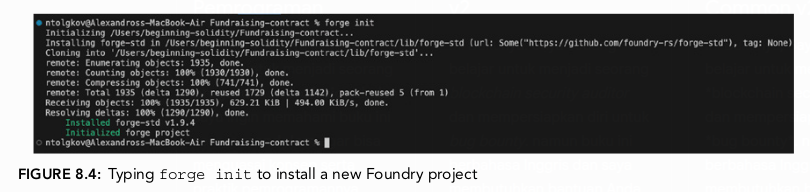
</p>

[Terminal menampilkan direktori baru 'Fundraising-contract' telah dibuat. - Figure 8.3 & 8.4]

3.  **Membuka Proyek di VS Code**: Buka folder `Fundraising-contract` yang baru dibuat melalui menu `File > Open Folder`.

4.  **Membersihkan Proyek**: Hapus file `Counter.sol` bawaan dari folder `src`, `script`, dan `test`.

5.  **Membuat File Contract Utama**: Buat file baru di dalam folder `src` dengan nama `Fundraising.sol`.

<p align="center">
  
</p>

[Struktur folder proyek Fundraising-contract di VS Code. - Figure 8.5]

<p align="center">
  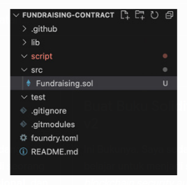
</p>

[File baru 'Fundraising.sol' dibuat di dalam folder 'src'. - Figure 8.6]

Sekarang kita siap untuk menulis kode *smart contract* pertama kita di dalam `Fundraising.sol`.

```solidity
//SPDX-License-Identifier: MIT
pragma solidity 0.8.27;

contract Fundraising {
    function sendMoney() public payable {
        require(msg.value > 1e18, "Did not send enough money");
    }
}
```

Mari kita bedah kode awal ini:

  * `//SPDX-License-Identifier: MIT`: Mendefinisikan lisensi *open-source* untuk kode ini.
  * `pragma solidity 0.8.27;`: Menentukan versi *compiler* Solidity yang akan digunakan.
  * `contract Fundraising { ... }`: Mendefinisikan sebuah *smart contract* baru dengan nama `Fundraising`.
  * `function sendMoney() public payable { ... }`:
      * `public`: *Visibility* fungsi ini adalah `public`, artinya bisa dipanggil baik dari dalam *contract* maupun dari luar (oleh *user* atau *contract* lain).
      * **`payable`**: Ini adalah *keyword* yang sangat penting. `payable` mengizinkan sebuah fungsi untuk menerima Ether (ETH) saat dipanggil. Tanpa *keyword* ini, setiap upaya untuk mengirim ETH ke fungsi ini akan ditolak (*reverted*).
  * `require(msg.value > 1e18, "Did not send enough money");`:
      * `require()`: Ini adalah fungsi validasi. Jika kondisi di dalam kurung pertama bernilai `false`, eksekusi akan berhenti dan *transaction* akan di-*revert*, mengembalikan gas yang tersisa dan menampilkan pesan kesalahan (string di argumen kedua).
      * **`msg.value`**: Ini adalah *global variable* di Solidity yang berisi jumlah Wei yang dikirim bersamaan dengan pemanggilan fungsi. Wei adalah unit terkecil dari Ether.
      * **`1e18`**: Ini adalah notasi ilmiah untuk $1 \\times 10^{18}$. Karena 1 Ether setara dengan $10^{18}$ Wei, `1e18` adalah cara singkat untuk merepresentasikan 1 Ether dalam unit Wei. Jadi, baris ini memeriksa apakah jumlah ETH yang dikirim lebih besar dari 1 ETH.

### Oracles

Pada skenario awal, kita ingin donasi minimal setara dengan 10 USD, bukan 1 ETH. Jika kita mengubah kode menjadi seperti ini:

```solidity
// Kode ini SALAH dan hanya untuk ilustrasi masalah
uint256 public minimumAmountSent = 10; 

function sendMoney() public payable {
    require(msg.value > minimumAmountSent, "Did not send enough money");
}
```

Kode di atas tidak akan berfungsi karena `msg.value` diukur dalam Wei (unit ETH), sementara `minimumAmountSent` kita maksudkan sebagai USD. *Blockchain* secara inheren adalah sistem deterministik yang terisolasi; ia tidak memiliki pengetahuan tentang dunia luar, termasuk nilai tukar ETH ke USD.

Di sinilah peran **`oracle`** menjadi krusial. Sebuah *blockchain oracle* adalah entitas yang berfungsi sebagai jembatan, menyediakan data dari dunia luar (*off-chain*) ke dalam *blockchain* (*on-chain*).

  * **Inbound Oracles**: Menyediakan data eksternal ke *blockchain*.
  * **Outbound Oracles**: Mengirim data dari *blockchain* ke sistem eksternal.

**Chainlink** adalah jaringan *oracle* terdesentralisasi yang paling banyak digunakan. Ia menyediakan *data feeds* yang andal, termasuk data harga aset, yang bisa digunakan oleh *smart contracts*.

> **Bagaimana Chainlink Data Feeds Bekerja?**
> Beberapa penyedia data (*data providers*) menjalankan *node* Chainlink. Mereka mengambil data harga dari berbagai sumber (misalnya, bursa *crypto*). Data ini kemudian diagregasi (*aggregated*) di dalam sebuah *smart contract on-chain* yang disebut *data contract* atau *aggregator*. *Smart contract* kita kemudian dapat memanggil *aggregator* ini untuk mendapatkan data harga yang andal.

Mari kita lihat contoh *price feed* ETH/USD di situs data Chainlink.

<p align="center">
  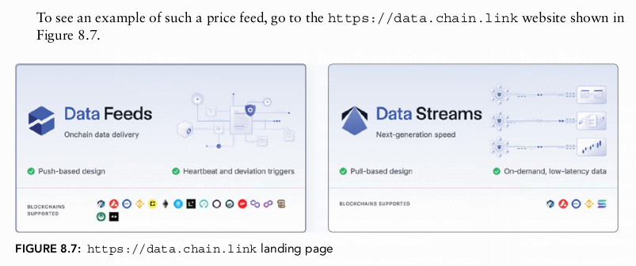
</p>

[Halaman utama data.chain.link menampilkan berbagai pilihan data. - Figure 8.7]

<p align="center">
  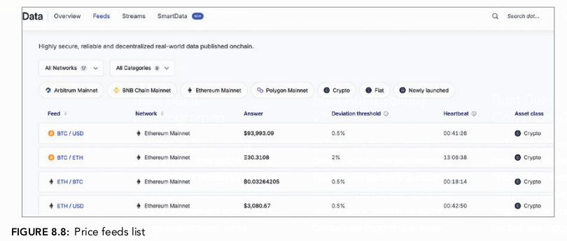
</p>

[Daftar berbagai data feed harga yang tersedia di Chainlink. - Figure 8.8]

<p align="center">
  
</p>

<p align="center">
  
</p>

[Tampilan detail untuk price feed ETH/USD, menunjukkan harga saat ini, deviasi, dan waktu pembaruan terakhir. - Figure 8.9 & 8.10]

<p align="center">
  
</p>

<p align="center">
  
</p>

[Daftar perusahaan yang menjalankan node untuk price feed ETH/USD. - Figure 8.11 & 8.12]

Untuk menggunakan *price feed* ini di dalam kode, kita perlu alamat *contract aggregator*-nya. Alamat ini dapat ditemukan di dokumentasi Chainlink.

<p align="center">
  
</p>

<p align="center">
  
</p>

<p align="center">
  
</p>

<p align="center">
  
</p>

[Dokumentasi Chainlink yang menunjukkan cara menemukan alamat price feed. - Figure 8.13, 8.14, 8.15 & 8.16]

Dokumentasi Chainlink juga menyediakan contoh kode untuk mengonsumsi data ini.

<p align="center">
  
</p>

<p align="center">
  
</p>

[Contoh kode 'DataConsumerV3' di dokumentasi Chainlink. - Figure 8.17 & 8.18]

Berikut adalah bedah kode dari contoh `DataConsumerV3.sol` tersebut:

```solidity
// SPDX-License-Identifier: MIT
pragma solidity ^0.8.7;

import {AggregatorV3Interface} from "@chainlink/contracts/src/v0.8/interfaces/AggregatorV3Interface.sol";

contract DataConsumerV3 {
    AggregatorV3Interface internal dataFeed;

    constructor() {
        dataFeed = AggregatorV3Interface(0x1b44F3514812d835EB1BDB0acB33d3fA3351Ee43);
    }

    function getChainlinkDataFeedLatestAnswer() public view returns (int) {
        (
            /* uint80 roundID */,
            int answer,
            /*uint startedAt*/,
            /*uint timeStamp*/,
            /*uint80 answeredInRound*/
        ) = dataFeed.latestRoundData();
        return answer;
    }
}
```

  * `import {AggregatorV3Interface} ...`: Mengimpor *interface* standar Chainlink. Sebuah **`interface`** di Solidity mendefinisikan fungsi-fungsi yang dapat dipanggil oleh sebuah *contract* tanpa perlu mengetahui implementasi internalnya.
  * `constructor()`: *Constructor* adalah fungsi spesial yang hanya dieksekusi sekali saat *contract* di-*deploy*. Di sini, ia menginisialisasi variabel `dataFeed` dengan alamat *contract aggregator* untuk *price feed* BTC/USD di jaringan Sepolia (sebagai contoh).

<p align="center">
  
</p>

<p align="center">
  
</p>
  
[Detail price feed BTC/USD di Chainlink. - Figure 8.19 & 8.20]
  * `getChainlinkDataFeedLatestAnswer()`: Fungsi ini memanggil `latestRoundData()` dari *contract* `dataFeed`.
  * `dataFeed.latestRoundData()`: Fungsi ini mengembalikan beberapa nilai dalam bentuk **`tuple`**. Sebuah `tuple` adalah struktur data yang dapat mengelompokkan beberapa nilai dengan tipe yang berbeda. Nilai yang dikembalikan adalah:
      * `roundID`: ID dari ronde data.
      * `answer`: Harga terbaru (nilai yang kita butuhkan).
      * `startedAt`: *Timestamp* kapan ronde dimulai.
      * `timeStamp`: *Timestamp* kapan data direkam.
      * `answeredInRound`: Ronde di mana jawaban dihitung.
  * `int answer, ...`: Kita hanya tertarik pada nilai `answer`, jadi kita hanya mendeklarasikan variabel untuk nilai tersebut. Variabel lain kita abaikan dengan membiarkannya kosong di dalam `tuple` untuk menghemat gas.
  * `return answer;`: Fungsi ini mengembalikan harga terbaru.

#### Deploy Price Feed Contract Melalui Remix

Untuk memvalidasi cara kerja *contract oracle*, kita bisa men-*deploy* contoh `DataConsumerV3` di Remix:

1.  Buka Remix dan *paste* kode di atas.
2.  *Compile contract* tersebut.
3.  Di tab "Deploy & Run Transactions", ubah *Environment* dari "Remix VM" menjadi **"Injected Provider - MetaMask"**. Pastikan MetaMask Kita terhubung ke jaringan Sepolia.
4.  Klik `Deploy`. Konfirmasi *transaction* di MetaMask.
5.  Setelah ter-*deploy*, panggil fungsi `getChainlinkDataFeedLatestAnswer`.

<p align="center">
  
</p>

<p align="center">
  
</p>

<p align="center">
  
</p>

<p align="center">
  
</p>

[Antarmuka Remix untuk deploy contract. - Figure 8.21, 8.22, 8.23 & 8.24]

Hasilnya akan menjadi angka yang sangat besar, misalnya `9808072634584`. Ini karena Chainlink melaporkan harga dengan presisi tinggi, biasanya 8 angka desimal. Untuk mendapatkan harga sebenarnya, kita perlu membaginya dengan $10^8$. Jadi, `9808072634584` menjadi $98,080.72634584$.

<p align="center">
  
</p>

[Hasil pemanggilan fungsi getChainlinkDataFeedLatestAnswer di Remix. - Figure 8.25]

### Solidity Interfaces dan Integrasi ke Fundraising Contract

Sekarang, mari kita integrasikan fungsionalitas *oracle* ini ke dalam `Fundraising.sol` kita.

1.  **Instal Library Chainlink**: Di terminal proyek Foundry Kita, jalankan perintah:
    `forge install smartcontractkit/chainlink-brownie-contracts --no-commit`
    Ini akan mengunduh *contract* Chainlink ke dalam folder `lib` di proyek Kita.

<p align="center">
  
</p>

<p align="center">
  
</p>

<p align="center">
  
</p>

[Terminal menjalankan perintah forge install untuk kontrak Chainlink. - Figure 8.27, 8.28 & 8.29]
    
<p align="center">
  
</p>

    [Struktur folder menunjukkan kontrak Chainlink telah terinstal. - Figure 8.30]

2.  **Impor Interface**: Tambahkan `import` statement untuk `AggregatorV3Interface` di `Fundraising.sol`.

    ```solidity
    import {AggregatorV3Interface} from "lib/chainlink-brownie-contracts/contracts/src/v0.8/interfaces/AggregatorV3Interface.sol";
    ```

<p align="center">
  
</p>

[Kode import AggregatorV3Interface di VS Code. - Figure 8.31]

3.  **Tambahkan Fungsi Konversi**: Kita akan membuat dua fungsi *helper*.

      * `priceOfOneETHInUSD()`: Fungsi ini akan mengambil harga 1 ETH dalam USD dari *oracle*.
      * `convertETHToUSD()`: Fungsi ini akan mengkonversi sejumlah Wei menjadi nilai USD-nya.

    <!-- end list -->

    ```solidity
    // Fungsi untuk mendapatkan harga 1 ETH dalam USD
    function priceOfOneETHInUSD() public view returns(uint256) {
        AggregatorV3Interface priceFeed = AggregatorV3Interface(0x694AA1769357215DE4FAC081bf1f309aDC325306);
        (, int256 answer,,,) = priceFeed.latestRoundData();
        // Harga dari Chainlink memiliki 8 desimal. ETH memiliki 18.
        // Kita kalikan dengan 1e10 untuk membuatnya menjadi 18 desimal agar konsisten.
        return uint256(answer * 1e10); 
    }

    // Fungsi untuk mengkonversi sejumlah ETH (dalam Wei) ke USD
    function convertETHToUSD(uint256 amountOfETH) public view returns(uint256) {
        uint256 priceOfETH = priceOfOneETHInUSD();
        // (Harga ETH * Jumlah ETH) / 1e18
        // Pembagian dengan 1e18 diperlukan untuk menormalkan kembali desimal
        // karena priceOfETH dan amountOfETH keduanya memiliki 18 desimal.
        uint256 ethPriceInUSD = (priceOfETH * amountOfETH) / 1e18;
        return ethPriceInUSD;
    }
    ```

    > **Penting tentang Desimal**: Operasi matematika dengan desimal di Solidity memerlukan perhatian khusus. `priceOfETH` dan `amountOfETH` keduanya dalam format 18 desimal. Saat dikalikan, hasilnya akan memiliki 36 desimal. Kita perlu membaginya kembali dengan `1e18` untuk menormalkannya menjadi 18 desimal.

4.  **Update `sendMoney()` dan Tambah Pelacakan Donatur**:

      * Ubah variabel `minimumAmountSent` menjadi `10e18` untuk merepresentasikan 10 USD dengan 18 desimal.
      * Gunakan `convertETHToUSD(msg.value)` di dalam `require` statement.
      * Tambahkan sebuah *array* `listOfSenders` dan sebuah *mapping* `amountSentByAddress` untuk melacak siapa yang berdonasi dan berapa jumlah total donasi mereka.

    <!-- end list -->

    ```solidity
    uint256 public minimumAmountSent = 10e18;

    address[] public listOfSenders;
    mapping(address => uint256) public amountSentByAddress;

    function sendMoney() public payable {
        require(convertETHToUSD(msg.value) >= minimumAmountSent, "Did not send enough money");
        listOfSenders.push(msg.sender);
        amountSentByAddress[msg.sender] += msg.value;
    }
    ```

      * `msg.sender`: Ini adalah *global variable* yang berisi alamat dari *wallet* yang memanggil fungsi ini.
      * `listOfSenders.push(msg.sender)`: Menambahkan alamat donatur ke dalam *array*.
      * `amountSentByAddress[msg.sender] += msg.value`: Menambah jumlah donasi ke total donasi dari alamat tersebut di dalam *mapping*. `+=` adalah singkatan dari `x = x + y`.

### Membuat Libraries

Fungsi `priceOfOneETHInUSD` dan `convertETHToUSD` sangat berguna dan bisa digunakan di banyak *contract* lain. Untuk mempromosikan *reusability* (kemampuan untuk digunakan kembali) dan modularitas, kita bisa memindahkannya ke sebuah **`library`**.

Sebuah `library` di Solidity adalah tipe *contract* spesial yang berisi fungsi-fungsi yang dapat digunakan kembali.

1.  Buat file baru di `src` bernama `ETHtoUSDConverter.sol`.

2.  Pindahkan kedua fungsi konversi ke dalam *library* ini.

    ```solidity
    // File: ETHtoUSDConverter.sol
    //SPDX-License-Identifier: MIT
    pragma solidity ^0.8.27;

    import {AggregatorV3Interface} from "lib/chainlink-brownie-contracts/contracts/src/v0.8/interfaces/AggregatorV3Interface.sol";

    library ETHtoUSDConverter {
        function priceOfOneETHInUSD() internal view returns(uint256) {
            AggregatorV3Interface priceFeed = AggregatorV3Interface(0x694AA1769357215DE4FAC081bf1f309aDC325306);
            (, int256 answer,,,) = priceFeed.latestRoundData();
            return uint256(answer * 1e10);
        }

        function convertETHToUSD(uint256 amountOfETH) internal view returns(uint256) {
            uint256 priceOfETH = priceOfOneETHInUSD();
            uint256 ethPriceInUSD = (priceOfETH * amountOfETH) / 1e18;
            return ethPriceInUSD;
        }
    }
    ```

    Perhatikan bahwa *visibility* fungsi diubah menjadi `internal` karena *library* dimaksudkan untuk digunakan oleh *contract* lain.

3.  **Gunakan Library di `Fundraising.sol`**:

      * Hapus kedua fungsi konversi dari `Fundraising.sol`.
      * Ganti *import* `AggregatorV3Interface` dengan *import* `library` yang baru dibuat.
      * Gunakan direktif `using ETHtoUSDConverter for uint256;`.

    <!-- end list -->

    ```solidity
    // File: Fundraising.sol
    //SPDX-License-Identifier: MIT
    pragma solidity 0.8.27;

    import {ETHtoUSDConverter} from "./ETHtoUSDConverter.sol";

    contract Fundraising {
        using ETHtoUSDConverter for uint256;
        
        // ... sisa kode ...

        function sendMoney() public payable {
            require(msg.value.convertETHToUSD() >= minimumAmountSent, "Did not send enough money");
            // ... sisa logika ...
        }
    }
    ```

    Direktif `using ... for ...` "menempelkan" fungsi-fungsi dari `library` ke tipe data tertentu (`uint256` dalam kasus ini). Hal ini memungkinkan kita untuk memanggil fungsi *library* seolah-olah mereka adalah *method* bawaan dari tipe data tersebut, seperti `msg.value.convertETHToUSD()`. Ini membuat kode lebih bersih dan mudah dibaca.

<p align="center">
  
</p>

<p align="center">
  
</p>

[Kode akhir Fundraising.sol dan ETHtoUSDConverter.sol di VS Code. - Figure 8.33 & 8.34]

### Fungsi Withdraw

Setelah dana terkumpul, pemilik *contract* harus bisa menariknya. Fungsi `withdraw` harus dirancang dengan sangat hati-hati untuk mencegah serangan.

#### Pola Keamanan: Checks, Effects, Interactions (CEI)

Untuk auditor, ini adalah salah satu pola paling fundamental. Urutan operasi dalam fungsi yang berinteraksi dengan *contract* lain atau mentransfer dana sangat penting.

1.  **Checks**: Lakukan semua validasi terlebih dahulu (misalnya, apakah pemanggil adalah pemilik).
2.  **Effects**: Ubah *state* internal *contract* (misalnya, perbarui saldo, reset *mapping*).
3.  **Interactions**: Lakukan panggilan eksternal atau transfer dana di akhir.

Pola ini mencegah serangan *re-entrancy*, di mana *contract* jahat bisa memanggil kembali fungsi `withdraw` sebelum saldo internal diperbarui, sehingga dapat menguras dana *contract*.

#### Implementasi Fungsi `withdraw`

1.  **Reset Mappings dan Arrays (Effects)**: Sebelum mentransfer dana, kita harus mereset data donatur untuk mencegah mereka tercatat ganda atau dieksploitasi.

      * Gunakan `for` loop untuk mengiterasi melalui `listOfSenders` dan mengatur ulang nilai `amountSentByAddress` untuk setiap donatur menjadi 0.
      * Reset *array* `listOfSenders` menjadi kosong.

    <!-- end list -->

    ```solidity
    function withdraw() public {
        // Effects
        for (uint256 senderIndex = 0; senderIndex < listOfSenders.length; senderIndex++) {
            address sender = listOfSenders[senderIndex];
            amountSentByAddress[sender] = 0;
        }
        listOfSenders = new address[](0);
        
        // Interactions (akan ditambahkan selanjutnya)
    }
    ```

2.  **Mengirim ETH dari Contract (Interactions)**: Ada tiga cara untuk mengirim ETH:

      * **`.transfer()`**: Mengirim 2300 gas, akan *revert* jika gagal. Dianggap usang karena batas gas yang kaku dapat menyebabkan kegagalan pada beberapa *contract* penerima.
      * **`.send()`**: Sama seperti `.transfer()` tetapi mengembalikan `bool` (`true`/`false`) alih-alih *revert*. Juga dianggap usang karena alasan yang sama.
      * **`.call{value: ...}("")`**: Ini adalah metode yang direkomendasikan saat ini. Ia meneruskan semua gas yang tersedia dan mengembalikan `bool` untuk status keberhasilan. Fleksibilitasnya membuatnya lebih kuat, tetapi harus digunakan dengan hati-hati.

    Kita akan menggunakan `.call`:

    ```solidity
    // ... setelah mereset mappings dan array ...

    // Interactions
    (bool callSuccess,) = payable(msg.sender).call{value: address(this).balance}("");
    require(callSuccess, "Call failed");
    ```

      * `payable(msg.sender)`: Mengonversi alamat `msg.sender` menjadi tipe `address payable` agar bisa menerima ETH.
      * `address(this).balance`: Mengambil seluruh saldo ETH yang dimiliki oleh *contract* ini.
      * `require(callSuccess, "Call failed")`: Memeriksa apakah transfer berhasil. Jika `call` gagal, `callSuccess` akan `false`, dan *transaction* akan di-*revert*.

### Constructor dan Modifiers (Kontrol Akses)

Saat ini, siapa pun bisa memanggil fungsi `withdraw`. Ini adalah kerentanan kritis. Kita harus membatasinya hanya untuk pemilik *contract*.

1.  **Menetapkan Pemilik dengan `constructor`**:

      * Tambahkan variabel `address public owner;`.
      * Gunakan `constructor` untuk menetapkan alamat yang men-*deploy* *contract* sebagai `owner`.

    <!-- end list -->

    ```solidity
    address public owner;

    constructor() {
        owner = msg.sender;
    }
    ```

2.  **Membatasi Akses dengan `require`**: Tambahkan pengecekan di awal fungsi `withdraw`.

    ```solidity
    function withdraw() public {
        // Checks
        require(msg.sender == owner, "Only the owner of the contract can withdraw");
        // ... Effects and Interactions ...
    }
    ```

      * Perhatikan penggunaan `==` (sama dengan) untuk perbandingan, berbeda dari `=` (penetapan nilai).

3.  **Menggunakan `modifier` untuk Kode yang Dapat Digunakan Kembali**: Jika kita memiliki banyak fungsi yang hanya bisa dipanggil oleh pemilik, menyalin `require` statement akan menjadi repetitif. Solusinya adalah **`modifier`**.

      * Sebuah `modifier` adalah blok kode yang dapat "ditempelkan" ke sebuah definisi fungsi untuk mengubah perilakunya.

    <!-- end list -->

    ```solidity
    modifier onlyTheOwnerCanExecute() {
        require(msg.sender == owner, "Only owner can withdraw funds");
        _; // Placeholder: di sinilah kode fungsi asli akan dieksekusi.
    }

    function withdraw() public onlyTheOwnerCanExecute {
        // ... Effects and Interactions ...
    }
    ```

    Sekarang, logika `onlyOwner` terenkapsulasi di dalam `modifier` dan dapat digunakan kembali di fungsi lain.

### Optimasi Gas dan Peningkatan Kualitas

Bagian terakhir bab ini membahas cara-cara untuk membuat *contract* lebih efisien dan kuat.

#### Immutability dan Constants

Variabel yang nilainya tidak pernah berubah setelah diinisialisasi dapat dioptimalkan untuk menghemat gas.

  * **`constant`**: Untuk nilai yang sudah diketahui saat *compile-time* (sebelum *deploy*). Variabel ini tidak menggunakan slot penyimpanan sama sekali.
  * **`immutable`**: Untuk nilai yang ditetapkan sekali di dalam `constructor` dan tidak pernah berubah setelahnya. Variabel ini dibaca langsung dari *bytecode* *contract* alih-alih dari penyimpanan, yang jauh lebih murah.

Mari kita terapkan ini:

  * `minimumAmountSent` dapat menjadi `constant`.
  * `owner` dapat menjadi `immutable`.

<!-- end list -->

```solidity
uint256 public constant MINIMUM_AMOUNT_SENT = 10e18;
address public immutable i_owner; // 'i_' adalah konvensi penamaan untuk immutable

constructor() {
    i_owner = msg.sender;
}
```

Perubahan ini secara signifikan mengurangi biaya gas saat *deploy* dan saat menjalankan fungsi yang membaca variabel-variabel ini. Buku ini menunjukkan penghematan gas lebih dari 40,000 unit gas, yang bisa setara dengan beberapa dolar tergantung harga gas.

<p align="center">
  
</p>

<p align="center">
  
</p>

<p align="center">
  
</p>

<p align="center">
  
</p>

<p align="center">
  
</p>

<p align="center">
  
</p>

<p align="center">
  
</p>

<p align="center">
  
</p>

[Perbandingan biaya gas sebelum dan sesudah penggunaan 'constant' dan 'immutable'. - Figure 8.57, 8.58, 8.59, 8.60, 8.61, 8.62, 8.63, 8.64]

#### Custom Errors

Pesan kesalahan string dalam `require` statement (`require(..., "Pesan error")`) menggunakan gas karena string tersebut harus disimpan di *bytecode*. Sejak Solidity v0.8.4, kita bisa menggunakan **`custom errors`**.

1.  Definisikan *error* di tingkat atas *contract*.
2.  Gunakan `if` statement dan `revert` dengan *custom error*.

<!-- end list -->

```solidity
error NotTheOwner();

modifier onlyTheOwnerCanExecute() {
    if (msg.sender != i_owner) {
        revert NotTheOwner();
    }
    _;
}
```

Ini lebih efisien dari segi gas dibandingkan menggunakan `require` dengan string.

#### Receive dan Fallback Functions

Apa yang terjadi jika seseorang mengirim ETH langsung ke alamat *contract* tanpa memanggil fungsi `sendMoney`? Saat ini, *transaction* tersebut akan berhasil, tetapi donasi mereka tidak akan tercatat di *mapping* atau *array* kita.

Untuk menangani ini, Solidity menyediakan dua fungsi spesial:

  * **`receive() external payable`**: Fungsi ini dieksekusi ketika *contract* menerima ETH tanpa ada data yang dikirim (*calldata* kosong).
  * **`fallback() external payable`**: Fungsi ini dieksekusi ketika *contract* menerima ETH dengan *calldata*, tetapi tidak ada fungsi lain yang cocok dengan *signature* di *calldata* tersebut.

Kita bisa mengimplementasikannya untuk memanggil `sendMoney` secara internal.

```solidity
receive() external payable {
    sendMoney();
}

fallback() external payable {
    sendMoney();
}
```

Dengan ini, setiap donasi ETH ke alamat *contract*, baik dengan atau tanpa data, akan tercatat dengan benar.

#### Kode Akhir `Fundraising.sol`

Berikut adalah versi final dari `Fundraising.sol` yang menggabungkan semua konsep di atas:

```solidity
//SPDX-License-Identifier: MIT
pragma solidity 0.8.27;

import {ETHtoUSDConverter} from "./ETHtoUSDConverter.sol";

error NotTheOwner();

contract Fundraising {
    using ETHtoUSDConverter for uint256;

    uint256 public constant MINIMUM_AMOUNT_SENT = 10e18;
    address public immutable i_owner;

    address[] public listOfSenders;
    mapping(address => uint256) public amountSentByAddress;

    constructor() {
        i_owner = msg.sender;
    }

    function sendMoney() public payable {
        require(msg.value.convertETHToUSD() >= MINIMUM_AMOUNT_SENT, "Did not send enough money");
        listOfSenders.push(msg.sender);
        amountSentByAddress[msg.sender] += msg.value;
    }

    modifier onlyTheOwnerCanExecute() {
        if (msg.sender != i_owner) {
            revert NotTheOwner();
        }
        _;
    }

    function withdraw() public onlyTheOwnerCanExecute {
        // Effects
        for (uint256 senderIndex = 0; senderIndex < listOfSenders.length; senderIndex++) {
            address sender = listOfSenders[senderIndex];
            amountSentByAddress[sender] = 0;
        }
        listOfSenders = new address[](0);

        // Interactions
        (bool callSuccess, ) = i_owner.call{value: address(this).balance}("");
        require(callSuccess, "Call failed");
    }

    receive() external payable {
        sendMoney();
    }

    fallback() external payable {
        sendMoney();
    }
}
```

*Catatan: Saya memperbaiki `payable(msg.sender)` di fungsi `withdraw` menjadi `i_owner` karena tujuannya adalah mengirim dana ke pemilik contract, bukan pemanggil fungsi (yang sudah divalidasi sebagai pemilik oleh modifier).*

### Pengujian di Test Network

Bab ini diakhiri dengan panduan langkah demi langkah untuk men-*deploy* dan menguji *contract* ini di Remix menggunakan jaringan Sepolia, yang memvalidasi bahwa semua fungsi bekerja seperti yang diharapkan, termasuk pengiriman dana, pengecekan saldo, dan penarikan dana oleh pemilik.

<p align="center">
  
</p>

**Pada Figure 8.36**
Kompilasi kontrak dengan mengetik `forge build` di terminal lalu tekan **Enter**.

<p align="center">
  
</p>

**Pada Figure 8.37**
Buka Remix, lalu buat file untuk kontrak `Fundraiser.sol` dan library `ETHtoUSDConverter.sol`.

<p align="center">
  
</p>

<p align="center">
  
</p>

**Pada Figure 8.38 dan 8.39**
Setelah membuat file, salin dan tempel kode kontrak dan library ke dalam file masing-masing.

<p align="center">
  
</p>

**Pada Figure 8.40**
Lakukan dua perubahan penting berikut:

1. Jika diperlukan, ubah versi Solidity ke versi yang disarankan oleh compiler saat kursor diarahkan ke `//SPDX-License-Identifier: MIT`.
2. Ubah jalur `import` untuk `chainlink-brownie-contracts` dari:

```solidity
lib/chainlink-brownie-contracts/contracts/src/v0.8/shared/interfaces/AggregatorV3Interface.sol
```

menjadi:

```solidity
@chainlink/contracts/src/v0.8/shared/interfaces/AggregatorV3Interface.sol
```

<p align="center">
  
</p>

**Pada Figure 8.41**

Buka bagian **Deploy & Run Transactions** di Remix.
Ubah **Environment** dari default menjadi **Injected Provider MetaMask**, pastikan kontrak yang akan dideploy adalah `Fundraising.sol`, lalu klik **Deploy**.

<p align="center">
  
</p>

**Pada Figure 8.42**

Setelah kontrak berhasil dideploy, akan muncul daftar fungsi yang tersedia:

* `sendMoney` — untuk mengirim dana ke kontrak
* `withdraw` — untuk menarik dana dari kontrak
* `amountSentByAddress` — untuk mengecek total dana yang pernah dikirim oleh sebuah address
* `minimumAmountSent` — jumlah minimum yang dapat dikirim
* `owner` — alamat pemilik kontrak

<p align="center">
  
</p>

**Pada Figure 8.43**

Di panel **Deploy And Run Transactions**, isi kolom **value** dengan `10000000000000000` (16 nol) wei atau `0.01 ETH`.

<p align="center">
  
</p>

**Pada Figure 8.44**

Klik fungsi **sendMoney**, lalu MetaMask akan muncul untuk meminta konfirmasi transaksi.

<p align="center">
  
</p>

**Pada Figure 8.45**

Klik tombol **Confirm** dan tunggu beberapa detik hingga transaksi dikonfirmasi.
Setelah berhasil, kamu akan melihat kontrak sekarang memiliki `0.01 ETH`.

<p align="center">
  
</p>

**Pada Figure 8.46**

Buka fungsi **amountSentByAddress**, lalu salin alamat MetaMask yang sedang terhubung ke Remix.

<p align="center">
  
</p>

**Pada Figure 8.47**

Tempel alamat tersebut ke kolom **address sender**, lalu klik fungsi **amountSentByAddress**.
Jumlah total dana yang telah dikirim oleh alamat tersebut akan muncul.

<p align="center">
  
</p>

**Pada Figure 8.48**

Jika kamu mengirim `0.01 ETH` lagi dengan cara yang sama, total yang muncul di **amountSentByAddress** akan menjadi dua kali lipat (`0.02 ETH`).

<p align="center">
  
</p>

**Pada Figure 8.49**

Karena kontrak dideploy oleh alamat yang sama yang mengirim `0.02 ETH`, alamat tersebut bisa menarik kembali dana dengan mengklik **withdraw**.
Sebelum konfirmasi, cek dulu saldo Sepolia ETH kamu saat ini.

<p align="center">
  
</p>

**Pada Figure 8.50**

MetaMask akan muncul untuk meminta konfirmasi transaksi penarikan dana (**withdraw**).

<p align="center">
  
</p>

**Pada Figure 8.51**

Setelah dikonfirmasi, tunggu beberapa detik hingga transaksi selesai.
Saldo kontrak akan kembali menjadi `0`.

<p align="center">
  
</p>

**Pada Figure 8.52**

Saldo alamat MetaMask kamu akan bertambah sebesar `~0.0199 ETH` (sedikit kurang dari `0.02` karena ada biaya gas).

<p align="center">
  
</p>

<p align="center">
  
</p>

**Pada Figure 8.53 dan 8.54**

Di terminal Remix, klik **View on Etherscan** untuk melihat transaksi terbaru antara alamat wallet dan alamat kontrak.
Klik tautan **To address** untuk melihat alamat kontrak yang dideploy dan daftar transaksi yang terjadi antara akun MetaMask dan kontrak tersebut.

[Langkah-langkah pengujian contract di Remix, mulai dari deploy, mengirim donasi, hingga menarik dana. - Figure 8.36 hingga 8.54]


### Rangkuman untuk Calon Auditor

  * **Oracle adalah Vektor Serangan**: Ketergantungan pada *oracle* eksternal adalah titik kritis. Pastikan *oracle* yang digunakan terdesentralisasi (seperti Chainlink) dan pahami mekanisme keamanannya (misalnya, ambang deviasi).
  * **Pola CEI adalah Wajib**: Setiap fungsi yang mentransfer aset atau melakukan panggilan eksternal harus mengikuti pola *Checks-Effects-Interactions* tanpa kecuali. Ini adalah salah satu hal pertama yang harus Kita cari saat mengaudit.
  * **Manajemen Akses**: Periksa `constructor`, `modifiers`, dan fungsi yang menggunakan `msg.sender` dengan cermat. Siapa yang memiliki hak istimewa? Bisakah kepemilikan ditransfer? Apakah ada celah dalam logika kontrol akses?
  * **Optimasi Gas dan Keamanan**: `constant`, `immutable`, dan `custom errors` bukan hanya soal efisiensi. Kode yang lebih sederhana dan lebih murah seringkali lebih mudah diaudit dan memiliki permukaan serangan yang lebih kecil.
  * **Penanganan ETH**: Pastikan *contract* dapat menangani penerimaan ETH yang tidak terduga melalui `receive()` dan `fallback()` untuk menghindari dana yang "terjebak".
  * **Aritmatika Desimal**: Periksa semua operasi matematika yang melibatkan nilai dengan jumlah desimal yang berbeda. Kesalahan dalam konversi atau normalisasi dapat menyebabkan kerugian finansial yang signifikan.

Bab ini memberikan fondasi yang sangat kuat untuk membangun aplikasi DeFi yang umum. Konsep-konsep ini akan terus muncul dalam bentuk yang lebih kompleks di bab-bab selanjutnya.

---

# Bab 9
## Membangun Cryptocurrency ERC-20

Bab ini memperkenalkan Kita pada salah satu standar fundamental dalam ekosistem Ethereum: standar token **ERC-20**. Melalui contoh praktis menggunakan pustaka **OpenZeppelin** dan implementasi manual, Kita akan belajar cara membuat *cryptocurrency token* Kita sendiri yang mematuhi standar **ERC-20** yang diadopsi secara luas.

Tantangan utama dalam menciptakan mata uang digital baru adalah memastikan interoperabilitas—bagaimana agar token tersebut dapat diperdagangkan di berbagai *exchanges*, disimpan di berbagai jenis *wallet*, dan berinteraksi secara mulus dengan aplikasi *blockchain* lainnya. Standar **ERC-20** menyelesaikan masalah ini dengan menyediakan *interface* (antarmuka) standar. Bab ini akan memandu Kita melalui pembuatan token dengan dua pendekatan:

1.  **Menggunakan OpenZeppelin:** Pendekatan praktis yang mengutamakan keamanan dan kecepatan pengembangan.
2.  **Implementasi Manual:** Pendekatan teoretis untuk memahami mekanisme dasar dan setiap fungsi dari standar **ERC-20**.

Dengan menyelesaikan bab ini, Kita akan memiliki keterampilan untuk membuat dan mendeploy token **ERC-20** Kita sendiri, serta memahami baik kemudahan menggunakan pustaka yang sudah ada maupun mekanika yang mendasarinya.

### Pengenalan ERC-20

**ERC-20** adalah singkatan dari **Ethereum Request for Comment 20**, sebuah standar teknis yang digunakan untuk *smart contracts* di *blockchain* Ethereum untuk implementasi token. Kita bisa menganggap kontrak **ERC-20** sebagai sebuah basis data digital yang tersimpan di *blockchain* Ethereum. Basis data ini melacak siapa pemilik token dan berapa jumlah token yang mereka miliki. Ketika seseorang "mengirim" token, yang sebenarnya terjadi adalah interaksi dengan *smart contract* untuk mengurangi saldo pengirim dan menambah saldo penerima.

Tujuan utama standar ini adalah untuk menciptakan **interoperabilitas** antar token. Dengan adanya standar yang sama, berbagai aplikasi seperti *wallets* dan *decentralized exchanges* (DEXs) dapat berinteraksi dengan token **ERC-20** manapun tanpa perlu implementasi khusus.

Token **ERC-20** adalah **fungible token**. *Fungible* berarti setiap unit token dapat dipertukarkan dengan unit lain yang sejenis tanpa ada perbedaan nilai. Karakteristik utama dari token *fungible* adalah:

  * **Divisible (Dapat Dibagi):** Token dapat dibagi menjadi unit-unit yang lebih kecil. Sama seperti satu dolar dapat dibagi menjadi 100 sen, token **ERC-20** dapat dibagi hingga 18 desimal (standar umum).
  * **Interchangeable (Dapat Dipertukarkan):** Setiap unit token memiliki nilai yang sama dan dapat saling menggantikan. Satu token UNI dari protokol Uniswap sama nilainya dengan token UNI lainnya.

Dengan standar **ERC-20**, Kita dapat membangun berbagai jenis token, seperti:

  * **Governance tokens:** Token yang memberikan hak suara kepada pemiliknya dalam tata kelola sebuah protokol.
  * **Security tokens:** Representasi digital dari aset keuangan tradisional seperti saham atau properti, yang memungkinkan kepemilikan fraksional.
  * **Centralized stablecoins:** Token yang nilainya dipatok ke aset stabil seperti Dolar AS (misalnya, USDT atau USDC) dan dikelola oleh entitas terpusat.
  * **Decentralized stablecoins/algorithmic stablecoins:** *Stablecoins* yang menjaga stabilitas nilainya melalui mekanisme algoritmis, tanpa dijamin oleh aset di dunia nyata.
  * **Wrapped tokens:** Token yang merepresentasikan *cryptocurrency* dari *blockchain* lain, seperti Wrapped Bitcoin (**WBTC**) di Ethereum.

### Proses Pembuatan Ethereum Improvement Proposal (EIP)

Untuk memahami mengapa **ERC-20** menjadi standar, penting untuk mengetahui proses di baliknya, yaitu **Ethereum Improvement Proposal (EIP)**. EIP adalah dokumen desain yang menyediakan informasi kepada komunitas Ethereum tentang fitur baru yang diusulkan atau prosesnya. Standar **ERC-20** sendiri merupakan hasil dari **EIP-20**.

Proses pembuatan EIP adalah sebagai berikut:

1.  **Mengembangkan Ide:** Seseorang atau sekelompok orang memiliki ide untuk meningkatkan Ethereum.
2.  **Menyusun Draf:** Proposal disusun dalam format EIP standar yang mencakup komponen-komponen berikut:
    1.  Nomor EIP
    2.  Judul Proposal
    3.  Penulis (Authors)
    4.  Tanggal Dibuat
    5.  **Abstract:** Deskripsi singkat masalah (kurang dari 200 kata).
    6.  **Motivation:** Alasan mengapa solusi yang ada tidak cukup untuk mengatasi masalah.
    7.  **Specification:** Deskripsi teknis dari sintaks dan implementasi proposal baru.
    8.  **Rationale:** Penjelasan mengapa keputusan desain dan spesifikasi tertentu dibuat.
    9.  **Security Considerations:** Pertimbangan keamanan yang harus diperhatikan oleh *developer* jika EIP diimplementasikan.
    10. **Backward Compatibility:** Deskripsi tentang kompatibilitas dengan versi sebelumnya dan konsekuensinya.
    11. **Reference:** Contoh implementasi, jika tersedia dan diperlukan.
    12. Komponen lain yang dianggap krusial oleh penulis.

<p align="center">
  
</p>

[Contoh bagian awal dari dokumen EIP-20 yang menunjukkan judul, penulis, status, dan tipe proposal. - Figure 9.1]

<p align="center">
  
</p>

[Contoh bagian Abstract dan Motivation dari EIP-20, menjelaskan masalah yang ingin dipecahkan. - Figure 9.2]

<p align="center">
  
</p>

[Contoh bagian Specification dari EIP-20 yang mendefinisikan fungsi-fungsi wajib seperti `totalSupply`, `balanceOf`, dan `transfer`. - Figure 9.3]

### Membangun Token ERC-20 dengan OpenZeppelin

**OpenZeppelin** adalah platform yang menyediakan pustaka *smart contract* yang dapat digunakan kembali, telah diaudit, dan aman. Menggunakannya adalah praktik terbaik dalam industri untuk menghemat waktu dan mengurangi risiko keamanan.

Berikut adalah langkah-langkah untuk membuat token **ERC-20** menggunakan **Foundry** dan **OpenZeppelin**.

**1. Menyiapkan Proyek Foundry**
Pertama, kita akan membuat direktori baru dan menginisialisasi proyek Foundry di dalamnya.

```bash
# Membuat direktori baru untuk proyek token
mkdir beginning-solidity-token

# Masuk ke direktori yang baru dibuat
cd beginning-solidity-token

# Menginisialisasi proyek Foundry baru
forge init
```
<p align="center">
  
</p>

[Terminal menunjukkan perintah `ls` untuk melihat direktori saat ini. - Figure 9.8]

<p align="center">
  
</p>

[Terminal menunjukkan perintah `mkdir beginning-solidity-token`. - Figure 9.9]

<p align="center">
  
</p>

[Terminal menunjukkan hasil `ls` setelah direktori baru dibuat. - Figure 9.10]

<p align="center">
  
</p>

[Terminal menunjukkan perintah `cd beginning-solidity-token`. - Figure 9.11]

<p align="center">
  
</p>

[Terminal menunjukkan output dari perintah `forge init`. - Figure 9.12]

**2. Membuka Proyek dan Menginstal Kontrak OpenZeppelin**
Buka folder proyek di VS Code, lalu hapus file `Counter.sol` default dari folder `script`, `src`, dan `test`.

Selanjutnya, instal kontrak OpenZeppelin ke dalam proyek Kita menggunakan Foundry.

```bash
# Menginstal pustaka kontrak OpenZeppelin versi 5.0.2
forge install OpenZeppelin/openzeppelin-contracts@5.0.2 --no-commit
```

Kita juga bisa menggunakan versi terbaru dengan perintah:

```bash
forge install OpenZeppelin/openzeppelin-contracts --no-commit
```

<p align="center">
  
</p>

[Tangkapan layar dari halaman repositori GitHub OpenZeppelin. - Figure 9.16]

<p align="center">
  
</p>

[Output terminal yang menunjukkan proses instalasi kontrak OpenZeppelin. - Figure 9.17]

Setelah instalasi selesai, Kita akan melihat folder `openzeppelin-contracts` di dalam direktori `lib`. Kita dapat memverifikasi file `ERC20.sol` di path: `lib/openzeppelin-contracts/contracts/token/ERC20/ERC20.sol`.

<p align="center">
  
</p>

[Struktur file di VS Code yang menunjukkan path ke file ERC20.sol. - Figure 9.18]

<p align="center">
  
</p>

[Tampilan kode dari file ERC20.sol di dalam VS Code. - Figure 9.19]

**3. Membuat Kontrak Token Anda**
Buat file baru di folder `src` dengan nama `BeginningSolidityToken.sol`. Kode berikut mengimpor dan mewarisi kontrak `ERC20` dari OpenZeppelin.

```solidity
//SPDX-License-Identifier: MIT

pragma solidity 0.8.27;

import {ERC20} from "../lib/openzeppelin-contracts/contracts/token/ERC20/ERC20.sol";

contract BeginningSolidityToken is ERC20 {
    constructor(uint256 initialSupply) 
        ERC20("BeginningSolidityToken", "BST") {
        _mint(msg.sender, initialSupply);
    }
}
```

Penjelasan Kode:

  * `import {ERC20} from ...`: Mengimpor kontrak `ERC20` dasar dari pustaka OpenZeppelin.
  * `contract BeginningSolidityToken is ERC20`: Mendeklarasikan kontrak baru yang mewarisi semua fungsionalitas dari `ERC20`.
  * `constructor(uint256 initialSupply) ERC20("BeginningSolidityToken", "BST")`:
      * `constructor` dieksekusi hanya sekali saat *deployment*.
      * Ia menerima `initialSupply` sebagai parameter untuk menentukan jumlah total token yang akan dibuat.
      * `ERC20("BeginningSolidityToken", "BST")` memanggil `constructor` dari kontrak `ERC20` untuk menetapkan nama token ("BeginningSolidityToken") dan simbolnya ("BST").
  * `_mint(msg.sender, initialSupply);`: Memanggil fungsi internal `_mint` untuk membuat `initialSupply` jumlah token dan memberikannya ke alamat yang mendeploy kontrak (`msg.sender`).

<p align="center">
  
</p>

[Kode `constructor` dari kontrak ERC20.sol OpenZeppelin yang menunjukkan parameter nama dan simbol. - Figure 9.20]

**4. Mengompilasi Kontrak**
Simpan file dan kompilasi proyek Kita untuk memastikan tidak ada kesalahan.

```bash
forge build
```

<p align="center">
  
</p>

[Terminal menunjukkan perintah `forge build` yang sedang dieksekusi. - Figure 9.21]

<p align="center">
  
</p>

[Pesan sukses "Compiler run successful\!" - Figure 9.22]

### Membangun ERC-20 Secara Manual

Meskipun menggunakan OpenZeppelin adalah praktik terbaik, membangun token **ERC-20** secara manual dari awal sangat penting untuk memahami cara kerja setiap fungsi. Berikut adalah implementasi lengkapnya.

Buat file baru di `src` bernama `BeginningSolidityTokenManual.sol`.

```solidity
//SPDX-License-Identifier: MIT

pragma solidity 0.8.27;

contract BeginningSolidityTokenManual {

    // State Variables
    string private _name;
    string private _symbol;
    uint8 private _decimals;
    uint256 private _totalSupply;

    mapping(address => uint256) private _balances;
    mapping(address => mapping(address => uint256)) private _allowances;

    // Events
    event Transfer(address indexed from, address indexed to, uint256 value);
    event Approval(address indexed owner, address indexed spender, uint256 value);

    // View Functions (Read-only)
    function name() public view returns (string memory) {
        return _name;
    }

    function symbol() public view returns (string memory) {
        return _symbol;
    }

    function decimals() public view returns (uint8) {
        return _decimals;
    }

    function totalSupply() public view returns (uint256) {
        return _totalSupply;
    }

    function balanceOf(address _owner) public view returns (uint256 balance) {
        return _balances[_owner];
    }

    // State-Changing Functions
    function transfer(address _to, uint256 _value) public returns (bool success) {
        require(_to != address(0), "ERC20: transfer to the zero address");
        require(_balances[msg.sender] >= _value, "ERC20: transfer amount exceeds balance");

        _balances[msg.sender] -= _value;
        _balances[_to] += _value;
        emit Transfer(msg.sender, _to, _value);
        return true;
    }

    function transferFrom(address _from, address _to, uint256 _value) public returns (bool success) {
        require(_from != address(0), "ERC20: transfer from the zero address");
        require(_to != address(0), "ERC20: transfer to the zero address");
        require(_balances[_from] >= _value, "ERC20: transfer amount exceeds balance");
        require(_allowances[_from][msg.sender] >= _value, "ERC20: transfer amount exceeds allowance");

        _balances[_from] -= _value;
        _balances[_to] += _value;
        _allowances[_from][msg.sender] -= _value;
        emit Transfer(_from, _to, _value);
        return true;
    }

    function approve(address _spender, uint256 _value) public returns (bool success) {
        require(_spender != address(0), "ERC20: approve to the zero address");

        _allowances[msg.sender][_spender] = _value;
        emit Approval(msg.sender, _spender, _value);
        return true;
    }

    function allowance(address _owner, address _spender) public view returns (uint256 remaining) {
        return _allowances[_owner][_spender];
    }
}
```

**Penjelasan Detail Implementasi Manual:**

  * **State Variables:**
      * `_name`, `_symbol`, `_decimals`: Menyimpan metadata token.
      * `_totalSupply`: Melacak jumlah total token yang ada.
      * `_balances`: Sebuah `mapping` dari `address` ke `uint256` untuk melacak saldo setiap pemilik token.
      * `_allowances`: Sebuah `mapping` bersarang (`address => mapping(address => uint256)`) untuk melacak berapa banyak token yang diizinkan oleh seorang `owner` untuk dibelanjakan oleh `spender`.
  * **Events:**
      * `Transfer`: Dipancarkan ketika token ditransfer. `indexed` memungkinkan pencarian *event* berdasarkan alamat pengirim dan penerima.
      * `Approval`: Dipancarkan ketika `approve` dipanggil.
  * **Fungsi Wajib (Sesuai Standar ERC-20):**
      * `name()`, `symbol()`, `decimals()`: Mengembalikan metadata token.
      * `totalSupply()`: Mengembalikan jumlah total token.
      * `balanceOf(address _owner)`: Mengembalikan saldo token dari alamat tertentu.
      * `transfer(address _to, uint256 _value)`: Mengirim `_value` token dari `msg.sender` ke alamat `_to`. Fungsi ini melakukan dua pemeriksaan penting menggunakan `require`: memastikan alamat tujuan bukan *zero address* dan memastikan pengirim memiliki saldo yang cukup.
      * `approve(address _spender, uint256 _value)`: Memberi izin kepada `_spender` untuk menarik hingga `_value` token dari akun `msg.sender`.
      * `allowance(address _owner, address _spender)`: Mengembalikan jumlah token yang masih diizinkan untuk ditarik oleh `_spender` dari `_owner`.
      * `transferFrom(address _from, address _to, uint256 _value)`: Mengizinkan `msg.sender` (sebagai `spender`) untuk mengirim `_value` token dari alamat `_from` ke alamat `_to`. Ini memerlukan `approve` sebelumnya dan melakukan validasi saldo dan *allowance*.

### Mendeploy Cryptocurrency ERC-20 Anda

Setelah membuat kontrak token menggunakan OpenZeppelin, langkah selanjutnya adalah mendeploy-nya. Kita akan membuat *script deployment* menggunakan Foundry.

**1. Membuat Script Deployment**
Buat file baru di folder `script` bernama `DBeginningSolidityToken.s.sol`.

```solidity
//SPDX-License-Identifier: MIT
import {BeginningSolidityToken} from "../src/BeginningSolidityToken.sol";
import {Script} from "forge-std/Script.sol";
pragma solidity 0.8.27;

contract DBeginningSolidityToken is Script {

    function run() external {
        uint256 INITIAL_SUPPLY = 100 ether;
        vm.startBroadcast();
        new BeginningSolidityToken(INITIAL_SUPPLY);
        vm.stopBroadcast();
    }
}
```

Penjelasan Script:

  * `import {BeginningSolidityToken} ...`: Mengimpor kontrak token yang ingin kita deploy.
  * `import {Script} ...`: Mengimpor kontrak `Script` dari `forge-std` yang menyediakan *helper functions* untuk *deployment*.
  * `run() external`: Fungsi utama yang akan dieksekusi oleh Foundry.
  * `uint256 INITIAL_SUPPLY = 100 ether;`: Menetapkan suplai awal token sebanyak 100. Kata kunci `ether` secara otomatis mengonversinya menjadi `100 * 10**18`.
  * `vm.startBroadcast();`: Perintah *cheat code* dari Foundry untuk mulai menyiarkan *transactions* ke *blockchain*.
  * `new BeginningSolidityToken(INITIAL_SUPPLY);`: Mendeploy instance baru dari kontrak `BeginningSolidityToken` dengan suplai awal yang telah ditentukan.
  * `vm.stopBroadcast();`: Menghentikan siaran *transactions*.

**2. Mendeploy ke Anvil (Local Blockchain)**
Untuk mendeploy secara aman, kita akan mengimpor *private key* dari Anvil ke *keystore* Foundry.

  * Jalankan Anvil di satu terminal: `anvil`.
  * Salin salah satu *private key* dari output Anvil.

<p align="center">
  
</p>

[Terminal menampilkan daftar akun dan private key yang dihasilkan oleh Anvil. - Figure 9.25]

  * Di terminal lain, impor *private key* tersebut.

<!-- end list -->

```bash
# Ganti 'BeginningSolidityTokenKey' dengan nama alias yang Kita inginkan
cast wallet import BeginningSolidityTokenKey --interactive
```

<p align="center">
  
</p>

[Terminal meminta untuk memasukkan password untuk keystore. - Figure 9.26]

<p align="center">
  
</p>

[Output terminal setelah private key berhasil disimpan, menunjukkan alamatnya. - Figure 9.27]

  * Sekarang, deploy kontrak menggunakan *script* dan akun yang baru saja Kita simpan.

<!-- end list -->

```bash
forge script script/DBeginningSolidityToken.s.sol:DBeginningSolidityToken \
    --rpc-url http://localhost:8545 \
    --account BeginningSolidityTokenKey \
    --sender 0x14dc79964da2c08b23698b3d3cc7ca32193d9955 \
    --broadcast
```

<p align="center">
  
</p>

[Output terminal yang menunjukkan deployment berhasil di Anvil. - Figure 9.29]

Flag `--sender` harus diisi dengan alamat yang sesuai dengan *private key* yang Kita impor. Setelah memasukkan *password* *keystore*, kontrak akan berhasil dideploy.

Mulai dari konsep dasarnya, proses standardisasinya melalui EIP, hingga implementasi praktis menggunakan OpenZeppelin dan pendekatan manual. Kita juga telah belajar cara mendeploy token Kita secara aman menggunakan Foundry, sebuah keterampilan penting bagi setiap *developer* dan auditor *blockchain*.

---

# Bab 10
## Borrowing and Lending Protocol

Selamat datang di Bab 10. Dalam bab ini, kita akan menyelami salah satu pilar utama dalam ekosistem **Decentralized Finance (DeFi)**, yaitu **stablecoin**. Sebagai seorang calon auditor keamanan, memahami mekanisme di balik *stablecoin* dan protokol pinjaman yang mendasarinya adalah hal yang mutlak. Di sinilah sebagian besar nilai dalam DeFi terkunci dan berbagai vektor serangan yang kompleks dapat muncul.

Bab ini akan memandu Kita melalui konsep-konsep tersebut, mulai dari "mengapa *stablecoin* itu ada" hingga implementasi teknis sebuah protokol pinjaman berjaminan (*collateralized lending protocol*). Kita akan membangun dua *smart contracts*: satu untuk *token stablecoin* itu sendiri, dan satu lagi untuk "kerangka" atau logika inti yang mengatur jaminan, pinjaman, dan likuidasi.

### Apa Itu Stablecoin?

Untuk memahami urgensi *stablecoin*, bab ini mengajak kita kembali pada tiga fungsi utama dari "uang yang baik" (*good money*), sebuah konsep yang diperkenalkan di Bab 1:

1.  **Medium of Exchange (Media Pertukaran):** Alat yang diterima secara luas untuk memfasilitasi perdagangan, menghilangkan inefisiensi sistem barter.
2.  **Unit of Account (Satuan Hitung):** Standar untuk mengukur dan membandingkan nilai barang dan jasa.
3.  **Store of Value (Penyimpan Nilai):** Kemampuan untuk mempertahankan daya beli dari waktu ke waktu.

*Cryptocurrency* seperti Bitcoin dan Ether, meskipun unggul dalam aspek desentralisasi dan keamanan, memiliki kelemahan signifikan: **volatilitas**. Harganya yang berfluktuasi secara drastis membuatnya sulit diandalkan untuk ketiga fungsi uang tersebut dalam konteks sehari-hari.

**Stablecoin** hadir sebagai solusi untuk menjembatani masalah ini. Ia adalah jenis *cryptocurrency* yang nilainya dirancang untuk tetap stabil dengan cara dipatok (*pegged*) ke aset lain yang lebih stabil, paling umum adalah mata uang *fiat* seperti Dolar AS (USD).

Bab ini menekankan signifikansi *stablecoin* dengan data pasar yang menunjukkan kapitalisasi pasar gabungan mereka mencapai **$176+ miliar**. Dominasi *stablecoin* yang dipatok ke USD sangat jelas, menguasai lebih dari 99% dari total pasar.

[ALT TEXT: Grafik yang menunjukkan total nilai gabungan dari semua stablecoin yang didukung fiat di seluruh dunia. - Figure 10.1]
[ALT TEXT: Grafik batang yang membandingkan kapitalisasi pasar dari tiga stablecoin terbesar yang didukung USD: Tether (USDT), USD Coin (USDC), dan First Digital USD (FDUSD). - Figure 10.2]
[ALT TEXT: Grafik yang menunjukkan kapitalisasi pasar khusus untuk stablecoin yang dipatok ke USD. - Figure 10.3]
[ALT TEXT: Grafik yang menampilkan total nilai gabungan dari semua stablecoin yang didukung fiat di seluruh dunia, tidak termasuk yang dipatok ke USD. - Figure 10.4]

-----

### Tipe-Tipe Stablecoin

Bab ini mengkategorikan *stablecoin* berdasarkan dua dimensi utama: tingkat sentralisasi dan mekanisme jaminan (*collateral*).

#### 1\. Berdasarkan Tingkat Sentralisasi

  * **Centralized Stablecoins:** Diterbitkan dan dikelola oleh entitas terpusat (misalnya, perusahaan). Aset jaminannya disimpan secara *off-chain* (di luar *blockchain*). Mereka sangat stabil tetapi membutuhkan kepercayaan pada penerbit dan rentan terhadap sensor.
  * **Decentralized Stablecoins:** Beroperasi secara otonom melalui *smart contracts*. Jaminannya biasanya berupa aset *on-chain* (di atas *blockchain*). Mereka tahan sensor dan transparan, tetapi bisa lebih kompleks dan berisiko.

#### 2\. Berdasarkan Mekanisme Jaminan

  * **Traditionally Collateralized:** Dijamin oleh aset dunia nyata seperti mata uang *fiat* atau komoditas. Contoh utamanya adalah **Tether (USDT)**. Untuk setiap 1 USDT yang diterbitkan, Tether Ltd. menyimpan aset senilai 1 USD sebagai cadangan. Model ini sederhana tetapi terpusat
  .
    [ALT TEXT: Grafik harga USDT terhadap USD dari 2015-2024 yang menunjukkan stabilitas relatifnya. - Figure 10.5]
    [ALT TEXT: Logo-logo dari stablecoin terpusat populer: USDT, USDC, BUSD, GUSD, TUSD, USDP. - Figure 10.6]
  * **Crypto Collateralized:** Dijamin oleh *cryptocurrency* lain yang disimpan dalam *smart contract*. Contoh utamanya adalah **DAI**. Untuk membuat (meminjam) DAI, pengguna harus menyetorkan jaminan *crypto* (seperti ETH) dengan nilai yang lebih tinggi dari jumlah DAI yang mereka pinjam. Ini disebut **over-collateralization**. Protokol ini memperkenalkan konsep **Health Factor**, yaitu rasio keamanan antara nilai jaminan pengguna dan nilai utangnya. Jika *Health Factor* turun di bawah ambang batas aman, posisi pengguna dapat **dilikuidasi** (jaminannya dijual) untuk menutupi utangnya.
  
    [ALT TEXT: Grafik harga DAI terhadap USD dari 2020-2024 yang menunjukkan stabilitasnya. - Figure 10.7]
    [ALT TEXT: Logo-logo dari stablecoin terdesentralisasi: DAI, LUSD, sUSD, GHO, RAI, MIM. - Figure 10.8]
  * **Algorithmic Stablecoins:** Tidak dijamin oleh aset apa pun, melainkan menggunakan algoritma untuk menjaga stabilitas harga dengan menyesuaikan pasokan. Contohnya adalah **Ampleforth (AMPL)**, yang menggunakan mekanisme **rebase** untuk menambah atau mengurangi jumlah token di semua *wallet* secara proporsional setiap hari untuk menargetkan harga $1.
    [ALT TEXT: Grafik harga Ampleforth terhadap USD dari 2019-2024 yang menunjukkan volatilitasnya. - Figure 10.9]
  * **Hybrid Collateralized:** Menggunakan kombinasi dari berbagai jenis jaminan untuk meningkatkan ketahanan.

[ALT TEXT: Diagram pohon yang memvisualisasikan taksonomi berbagai jenis stablecoin. - Figure 10.10]

-----

### Membuat Stablecoin (Creating The Stablecoin)

Bagian ini memandu kita melalui proses pemrograman untuk menciptakan *token stablecoin* kita sendiri.

#### 1\. Pengaturan Proyek Foundry

Langkah pertama adalah menyiapkan lingkungan pengembangan kita.

1.  Buka terminal dan buat direktori proyek baru: `mkdir beginning-solidity-stablecoin`.
2.  Masuk ke direktori tersebut: `cd beginning-solidity-stablecoin`.
3.  Buka folder ini di VS Code.
4.  Inisialisasi proyek Foundry baru: `forge init --no-commit`.
5.  Instal *library* kontrak yang kita butuhkan dari Chainlink dan OpenZeppelin:
    
    ```bash
    forge install https://github.com/smartcontractkit/chainlink-brownie-contracts --no-commit
    ```
    ```bash
    forge install https://github.com/OpenZeppelin/openzeppelin-contracts --no-commit
    ```
    
6.  Hapus file `Counter.sol` bawaan dan buat file baru `Stablecoin.sol` di dalam folder `src`.

[ALT TEXT: Screenshot terminal yang menunjukkan proses pembuatan dan navigasi direktori. - Figure 10.11, 10.12, 10.13]
[ALT TEXT: Menu File di VS Code yang menunjukkan opsi Open Folder. - Figure 10.14]
[ALT TEXT: Tampilan file explorer yang menunjukkan folder proyek yang akan dibuka. - Figure 10.15]
[ALT TEXT: Tampilan VS Code yang menunjukkan pembuatan file Stablecoin.sol. - Figure 10.16]

#### 2\. Implementasi Kontrak `Stablecoin.sol`

Kontrak ini akan mendefinisikan *token* kita sebagai sebuah *token* ERC20 standar, dengan tambahan fungsionalitas `burn` (menghancurkan token) dan `mint` (menciptakan token) yang hanya dapat diakses oleh pemilik kontrak.

Berikut adalah kode lengkap untuk `Stablecoin.sol` persis seperti di dalam buku:

```solidity
//SPDX-License-Identifier: MIT
pragma solidity 0.8.28;

import {ERC20Burnable, ERC20} from "../lib/openzeppelin-contracts/contracts/token/ERC20/extensions/ERC20Burnable.sol";
import {Ownable} from "../lib/openzeppelin-contracts/contracts/access/Ownable.sol";

contract Stablecoin is ERC20Burnable, Ownable {
    error Stablecoin__MustBeMoreThanZero();
    error Stablecoin__BurnMoreThanBalance();
    error Stablecoin__NoMintingtoZeroAddress();
    error Stablecoin__AmountMustBeMoreThanZero();

    constructor() ERC20("Stablecoin", "SBT") {}

    function burn(uint256 _amount) public override onlyOwner {
        uint256 balance = balanceOf(msg.sender);
        if (_amount == 0) {
            revert Stablecoin__MustBeMoreThanZero();
        }
        if (balance < _amount) {
            revert Stablecoin__BurnMoreThanBalance();
        }
        super.burn(_amount);
    }

    function mint(address _to, uint256 _amount) external onlyOwner returns (bool) {
        if (_to == address(0)) {
            revert Stablecoin__NoMintingtoZeroAddress();
        }
        if (_amount == 0) {
            revert Stablecoin__AmountMustBeMoreThanZero();
        }
        _mint(_to, _amount);
        return true;
    }
}
```

**Penjelasan Kode Baris per Baris:**

  * **`import {ERC20Burnable, ERC20} from "...";`**: Mengimpor kontrak `ERC20Burnable` dari *library* OpenZeppelin. Kontrak ini adalah ekstensi dari ERC20 standar yang menambahkan fungsi `burn`.
  * **`import {Ownable} from "...";`**: Mengimpor kontrak `Ownable` dari OpenZeppelin. Kontrak ini menyediakan mekanisme kontrol akses sederhana di mana satu alamat ditetapkan sebagai `owner` dan memiliki hak istimewa.
  * **`contract Stablecoin is ERC20Burnable, Ownable`**: Mendefinisikan kontrak `Stablecoin` kita, yang mewarisi semua fungsionalitas dari `ERC20Burnable` (termasuk semua fitur ERC20) dan `Ownable`.
  * **`error ...();`**: Mendefinisikan beberapa *custom errors*. Ini adalah praktik terbaik di Solidity modern karena lebih hemat *gas* daripada menggunakan `require` dengan pesan string.
  * **`constructor() ERC20("Stablecoin", "SBT") {}`**: Ini adalah *constructor* kontrak.
      * `ERC20("Stablecoin", "SBT")`: Memanggil *constructor* dari kontrak induk `ERC20` untuk menetapkan nama token ("Stablecoin") dan simbolnya ("SBT").
  * **`function burn(uint256 _amount) public override onlyOwner`**: Mendefinisikan fungsi untuk menghancurkan token.
      * `public override`: Visibilitasnya publik dan ia menimpa (`override`) fungsi `burn` yang sudah ada di `ERC20Burnable`.
      * `onlyOwner`: *Modifier* dari `Ownable` yang memastikan hanya alamat `owner` yang dapat memanggil fungsi ini.
      * `if(_amount == 0)` dan `if (balance < _amount)`: Pemeriksaan keamanan untuk memastikan jumlah yang akan dibakar valid dan tidak melebihi saldo yang ada.
      * `super.burn(_amount);`: Memanggil implementasi asli dari fungsi `burn` di kontrak `ERC20Burnable` untuk melakukan penghancuran token yang sebenarnya. Fungsi `burn` asli dari `ERC20Burnable` dapat dilihat pada gambar berikut.
        [ALT TEXT: Kode fungsi burn dari kontrak ERC20Burnable.sol. - Figure 10.17]
  * **`function mint(address _to, uint256 _amount) external onlyOwner returns (bool)`**: Mendefinisikan fungsi untuk membuat token baru.
      * `external onlyOwner`: Hanya bisa dipanggil dari luar kontrak dan hanya oleh `owner`.
      * `if(_to == address(0))` dan `if(_amount == 0)`: Pemeriksaan keamanan untuk memastikan token tidak dicetak ke alamat nol dan jumlahnya lebih dari nol.
      * `_mint(_to, _amount);`: Memanggil fungsi internal `_mint` dari ERC20 untuk menciptakan token baru dan menambahkannya ke saldo alamat `_to`.

-----

### Kerangka Stablecoin (The Stablecoin Skeleton)

Sekarang kita akan membangun `StablecoinSkeleton.sol`, kontrak yang berisi semua logika untuk mengelola jaminan dan pinjaman. Proses ini akan kita lalui langkah demi langkah, sama seperti di buku.

#### 1\. Persiapan Awal Kontrak

Kita mulai dengan membuat file `StablecoinSkeleton.sol` dan menambahkan deklarasi awal.

```solidity
//SPDX-License-Identifier: MIT
pragma solidity 0.8.27;

import {Stablecoin} from "./Stablecoin.sol";
import {IERC20} from "@openzeppelin/contracts/token/ERC20/IERC20.sol";
import {ReentrancyGuard} from "@openzeppelin/contracts/utils/ReentrancyGuard.sol";
import {AggregatorV3Interface} from "@chainlink/contracts/shared/interfaces/AggregatorV3Interface.sol";

contract StablecoinSkeleton is ReentrancyGuard {
    // ...
}
```

*Penjelasan:* Bagian ini mendeklarasikan lisensi, versi Solidity, dan mengimpor semua *interface* dan kontrak yang dibutuhkan. Warisan dari `ReentrancyGuard` akan memberikan kita akses ke *modifier* `nonReentrant`.

#### 2\. Errors, Constants, dan State Variables

Selanjutnya, kita definisikan semua variabel dan struktur data yang akan menyimpan status protokol.

```solidity
    error StablecoinSkeleton__NeedsMoreThanZero();
    error StablecoinSkeleton__TokenAddressAndPriceFeedAddressesMustHaveSameLength();
    error StablecoinSkeleton__NotAllowedToken();
    error StablecoinSkeleton__TransferFailed();
    error StablecoinSkeleton__BreaksHealthFactor(uint256 healthFactor);
    error StablecoinSkeleton__MintingFailed();
    error StablecoinSkeleton__HealthFactorIsFine();

    uint256 constant LIQUIDITATION_THRESHOLD = 50;
```

*Penjelasan:*

  * `error...`: Mendefinisikan semua kondisi kesalahan yang mungkin terjadi.
  * `LIQUIDITATION_THRESHOLD`: Konstanta yang menetapkan batas pinjaman pada 50% dari nilai jaminan. Konsep ini terkait langsung dengan **Health Factor**.

[ALT TEXT: Persamaan matematika yang menunjukkan bagaimana Health Factor dihitung. - Figure 10.18]

```solidity
    mapping(address token => address priceFeed) s_priceFeed;
    mapping(address user => mapping(address token => uint256 amount)) s_collateralDeposit;
    mapping(address user => uint256 amountSBTminted) s_SBTminted;

    address[] s_collateralTokens;

    Stablecoin immutable i_stablecoin;
```

*Penjelasan:*

  * `s_priceFeed`: *Mapping* dari alamat token jaminan ke alamat *oracle* harganya.
  * `s_collateralDeposit`: *Mapping* bersarang `user -> token -> jumlah` untuk melacak deposit jaminan.
  * `s_SBTminted`: *Mapping* `user -> jumlah` untuk melacak utang (stablecoin yang dicetak).
  * `s_collateralTokens`: *Array* untuk menyimpan daftar alamat token jaminan yang valid.
  * `i_stablecoin`: Variabel `immutable` untuk menyimpan alamat kontrak `Stablecoin` yang akan dikelola oleh kerangka ini.

#### 3\. Events dan Modifiers

```solidity
    event CollateralDeposited(address indexed user, address indexed token, uint256 indexed amount);
    event CollateralRedeemed(address indexed user, address indexed token, uint256 indexed amount);

    modifier collateralMoreThanZero(uint256 _amount) {
        if (_amount == 0) {
            revert StablecoinSkeleton__NeedsMoreThanZero();
        }
        _;
    }

    modifier isAllowedToken(address token) {
        if (s_priceFeed[token] == address(0)) {
            revert StablecoinSkeleton__NotAllowedToken();
        }
        _;
    }
```

*Penjelasan:* `CollateralDeposited` adalah sebuah `event` yang akan dicatat di *blockchain* setiap kali ada deposit. Kedua `modifier` adalah fungsi pengecekan yang dapat digunakan kembali: `collateralMoreThanZero` memastikan jumlah transaksi lebih dari nol, dan `isAllowedToken` memastikan token yang digunakan sebagai jaminan valid.

#### 4\. Constructor

```solidity
    constructor(address[] memory tokenAddresses, address[] memory priceFeedAddress, address stablecoinAddress) {
        if (tokenAddresses.length != priceFeedAddress.length) {
            revert StablecoinSkeleton__TokenAddressAndPriceFeedAddressesMustHaveSameLength();
        }
        for (uint256 i = 0; i < tokenAddresses.length; i++) {
            s_priceFeed[tokenAddresses[i]] = priceFeedAddress[i];
            s_collateralTokens.push(tokenAddresses[i]);
        }
        i_stablecoin = Stablecoin(stablecoinAddress);
    }
```

*Penjelasan:* `constructor` menginisialisasi protokol. Ia menerima daftar token jaminan dan *price feed*-nya, lalu mengisi *mapping* `s_priceFeed` dan *array* `s_collateralTokens`. Ia juga menyimpan alamat kontrak `Stablecoin`.

#### 5\. Fungsi Inti (sesuai urutan buku)

```solidity
    function depositCollateralAndMintSBT(address tokenCollateralAddress, uint256 amountCollateral, uint256 amountSBTtoMint) external {
        depositCollateral(tokenCollateralAddress, amountCollateral);
        mintSBT(amountSBTtoMint);
    }
```

*Penjelasan:* Fungsi `external` ini adalah "pintu masuk" utama bagi pengguna. Ia menggabungkan dua aksi, yaitu menyetor jaminan dan mencetak *stablecoin*, dalam satu transaksi untuk kemudahan pengguna.

```solidity
    function depositCollateral(address _tokenCollateralAddress, uint256 _amountOfCollateral)
        public
        collateralMoreThanZero(_amountOfCollateral)
        isAllowedToken(_tokenCollateralAddress)
        nonReentrant
    {
        s_collateralDeposit[msg.sender][_tokenCollateralAddress] += _amountOfCollateral;
        emit CollateralDeposited(msg.sender, _tokenCollateralAddress, _amountOfCollateral);
        bool success = IERC20(_tokenCollateralAddress).transferFrom(
            msg.sender,
            address(this),
            _amountOfCollateral
        );
        if (!success) {
            revert StablecoinSkeleton__TransferFailed();
        }
    }
```

*Penjelasan:*

  * Fungsi ini menangani logika deposit jaminan.
  * Ia dilindungi oleh `modifier` `collateralMoreThanZero`, `isAllowedToken`, dan `nonReentrant`.
  * `s_collateralDeposit[msg.sender][...] += ...;`: Memperbarui status internal terlebih dahulu, mencatat jumlah jaminan yang disetor oleh pengguna.
  * `emit CollateralDeposited(...)`: Memberi tahu dunia luar tentang deposit ini.
  * `IERC20(...).transferFrom(...)`: Memanggil kontrak token jaminan untuk mentransfer token dari pengguna ke kontrak ini. Ini hanya berhasil jika pengguna sudah memberikan `approve` sebelumnya.

<!-- end list -->

```solidity
    function redeemCollateralForSBT(address tokenCollateralAddress, uint256 amountCollateral, uint256 amountSBTtoburn) external {
        burnSBT(amountSBTtoburn);
        redeemCollateral(tokenCollateralAddress, amountCollateral);
    }
```

*Penjelasan:* Fungsi gabungan untuk membayar utang (burn) dan menarik jaminan (redeem).

```solidity
    function redeemCollateral(address tokenCollateralAddress, uint256 amountOfCollateral) public collateralMoreThanZero(amountOfCollateral) nonReentrant {
        s_collateralDeposit[msg.sender][tokenCollateralAddress] -= amountOfCollateral;
        emit CollateralRedeemed(msg.sender, tokenCollateralAddress, amountOfCollateral);
        bool success = IERC20(tokenCollateralAddress).transfer(msg.sender, amountOfCollateral);
        if (!success) {
            revert StablecoinSkeleton__TransferFailed();
        }
    }
```

*Penjelasan:* Logika untuk menarik jaminan. Status internal (`s_collateralDeposit`) diperbarui *sebelum* `transfer` token kembali ke pengguna, mengikuti pola keamanan Checks-Effects-Interactions.

```solidity
    function mintSBT(uint256 amountSBTToBeMinted) public collateralMoreThanZero(amountSBTToBeMinted) nonReentrant {
        s_SBTminted[msg.sender] += amountSBTToBeMinted;
        revertIfHealthFactorDoesNotWork(msg.sender);
        bool minted = i_stablecoin.mint(msg.sender, amountSBTToBeMinted);
        if (!minted) {
            revert StablecoinSkeleton__MintingFailed();
        }
    }
```

*Penjelasan:* Logika untuk mencetak *stablecoin*.

  * `s_SBTminted[msg.sender] += ...;`: Utang pengguna diperbarui terlebih dahulu.
  * `revertIfHealthFactorDoesNotWork(msg.sender);`: Pemeriksaan keamanan kritis untuk memastikan posisi pengguna tidak menjadi berisiko setelah meminjam.
  * `i_stablecoin.mint(...)`: Panggilan eksternal ke kontrak `Stablecoin` untuk membuat token baru.

<!-- end list -->

```solidity
    function burnSBT(uint256 _amount) public collateralMoreThanZero(_amount) {
        s_SBTminted[msg.sender] -= _amount;
        bool success = i_stablecoin.transferFrom(msg.sender, address(this), _amount);
        if (!success) {
            revert StablecoinSkeleton__TransferFailed();
        }
        i_stablecoin.burn(_amount);
        revertIfHealthFactorDoesNotWork(msg.sender);
    }
```

*Penjelasan:* Logika untuk membayar utang. `transferFrom` digunakan untuk menarik *stablecoin* dari pengguna, kemudian `burn` menghancurkannya.

```solidity
    function liquidate(address _collateral, address _user, uint256 debtToCover) external collateralMoreThanZero(debtToCover) {
        uint256 startingUserHealthFactor = healthFactor(_user);
        if (startingUserHealthFactor >= 1e18) {
            revert StablecoinSkeleton__HealthFactorIsFine();
        }
        uint256 tokenAmountFromDebtCovered = getUSDValue(_collateral, debtToCover);
        uint256 bonusCollateral = (tokenAmountFromDebtCovered * 10) / 100;
        uint256 totalCollateralToRedeem = tokenAmountFromDebtCovered + bonusCollateral;
    }
```

*Penjelasan:* Logika untuk likuidasi. Memeriksa `healthFactor`, menghitung jumlah jaminan yang akan diberikan kepada *liquidator* termasuk bonus 10%.

```solidity
    function getAccountInformation(address user) private view returns (uint256 totalSBTMinted, uint256 collateralValueInUSD) {
        totalSBTMinted = s_SBTminted[user];
        collateralValueInUSD = getAccountCollateralValue(user);
    }
```

*Penjelasan:* Fungsi *helper* privat untuk mendapatkan data agregat akun pengguna.

```solidity
    function healthFactor(address _user) private view returns (uint256) {
        (uint256 totalSBTMinted, uint256 collateralValueInUSD) = getAccountInformation(_user);
        uint256 collateralAdjustedForThreshold = (collateralValueInUSD * LIQUIDITATION_THRESHOLD) / 100;
        return (collateralAdjustedForThreshold * 1e18) / totalSBTMinted;
    }
```

*Penjelasan:* Implementasi matematis dari perhitungan *health factor*.

```solidity
    function revertIfHealthFactorDoesNotWork(address user) internal view {
        uint256 userHealthFactor = healthFactor(user);
        if (userHealthFactor < 1) {
            revert StablecoinSkeleton__BreaksHealthFactor(userHealthFactor);
        }
    }
```

*Penjelasan:* Fungsi keamanan internal untuk memastikan posisi pengguna tetap sehat.

```solidity
    function getAccountCollateralValue(address user) public view returns (uint256 totalCollateralValueInUSD) {
        for (uint256 i = 0; i < s_collateralTokens.length; i++) {
            address token = s_collateralTokens[i];
            uint256 amount = s_collateralDeposit[user][token];
            totalCollateralValueInUSD += getUSDValue(token, amount);
        }
        return totalCollateralValueInUSD;
    }
```

*Penjelasan:* Menghitung total nilai USD dari semua jaminan yang disetor oleh pengguna dengan melakukan iterasi.

```solidity
    function getUSDValue(address token, uint256 amount) public view returns (uint256) {
        AggregatorV3Interface priceFeed = AggregatorV3Interface(s_priceFeed[token]);
        (, int256 answer, , , ) = priceFeed.latestRoundData();
        return ((uint256(answer) * 1e10) * amount) / 1e18;
    }
```

*Penjelasan:* Fungsi yang berinteraksi dengan Chainlink *oracle* untuk mendapatkan harga, lalu melakukan perhitungan dengan penyesuaian desimal yang tepat.

---

