# BAGIAN I
## Pengantar Blockchain Ethereum

Buku ini berfokus secara spesifik untuk membantu Anda belajar mengembangkan *smart contract* di Ethereum. Fokus ini mengharuskan kita untuk membahas sebagian dari protokol Ethereum, bahasa pemrograman Solidity, dan Ethereum Virtual Machine. Untuk pemahaman yang lebih mendalam dan komprehensif tentang Ethereum, kami merekomendasikan buku *Mastering Ethereum* oleh Andreas M. Antonopoulos dan Gavin Wood. Meskipun begitu, agar dapat mengembangkan *smart contract* secara efektif, sangat penting bagi Anda untuk memahami konsep-konsep dasar *smart contract* tertentu. Kami akan membahas konsep-konsep tersebut dengan detail yang sekadarnya agar kita tidak membuang waktu dan Anda bisa segera masuk ke mode membangun (*builder mode*). Kami ingin Anda segera men-*deploy* *smart contract* pertama Anda sesegera mungkin. Kami tahu pendekatan ini adalah cara yang paling andal bagi orang-orang untuk mempelajari teknologi baru.

---

# BAB 1
## Konsep-Konsep Blockchain

Pada dasarnya, **blockchain** adalah sebuah struktur data. Ia adalah sebuah *linked list*, atau rantai, dari “blok-blok” yang unik. Setiap blok menunjuk ke blok sebelumnya, dan blok itu sendiri merupakan sebuah daftar transaksi. Di atas struktur data daftar-di-dalam-daftar yang relatif sederhana ini, diletakkan inovasi kunci yang diberikan oleh *blockchain*: sebuah protokol tentang bagaimana blok ditambahkan ke dalam rantai tanpa adanya otoritas pusat. Gambar 1-1 mengilustrasikan struktur ini.

*Cryptocurrency* yang muncul bersama *blockchain* adalah sarana untuk mencapai tujuan, yaitu menyediakan insentif bagi orang-orang untuk menjalankan perangkat lunak yang mengamankan jaringan. Untuk pertama kalinya dalam sejarah, kita memiliki kemampuan untuk berbagi informasi digital tanpa perlu mempercayai individu, pemerintah, organisasi, atau perusahaan mana pun untuk memfasilitasi interaksi tersebut. Ethereum menyediakan platform yang aman secara kriptografis untuk menyimpan, memperbarui, dan menghapus data dari *blockchain* menggunakan apa yang disebut sebagai “*smart contract*”. Kita masih berada di masa-masa awal dalam mempelajari cara menggunakan *smart contract* untuk memperbaiki berbagai hal di dunia nyata, dan sulit untuk memprediksi bagaimana teknologi ini akan digunakan di masa depan. Mirip dengan “World Wide Web” pada tahun 1990-an, telah terjadi gelombang global para pemecah masalah yang inspiratif dan kreatif yang bekerja setiap hari untuk men-*deploy* **aplikasi terdesentralisasi (DApps)** yang mereka harap akan “memberi dampak di alam semesta” (*make a dent in the universe*).

<p align="center">
  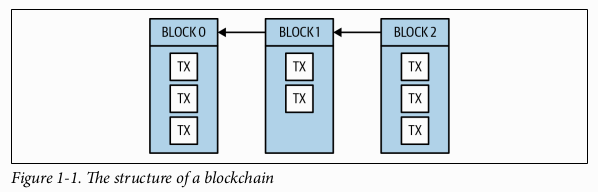
</p>

Sebagian besar isi buku ini akan berfokus pada bahasa pemrograman **Solidity** dan pengembangan *smart contract*. Solidity adalah bahasa pemrograman populer untuk mengembangkan *smart contract*, dan dirancang untuk berjalan di **Ethereum Virtual Machine (EVM)**. Solidity bukanlah bahasa pemrograman pertama yang berjalan di EVM, dan tentunya bukan yang terakhir. Banyak bahasa lain, seperti Vyper, akan ditulis untuk berjalan di EVM, dengan tujuan untuk menyempurnakan desain Solidity atau menyediakan bahasa spesifik-domain (*domain-specific languages*) yang kuat. Sebelum kita mendalami dunia *smart contract* yang revolusioner, kita perlu meletakkan fondasi konseptual untuk Anda bangun. Mengingat sifat unik dari eksekusi kode di *blockchain* secara historis, sangat penting bagi para pengembang untuk memiliki pemahaman yang cukup tentang bagaimana semua bagian saling terhubung di balik abstraksi yang kuat yang disediakan oleh Ethereum.

## Sejarah Singkat 📜

Konsep "blockchain" lahir dari [white paper Bitcoin](https://bitcoin.org/bitcoin.pdf) yang diterbitkan pada tahun 2008 oleh sosok pseudonim **Satoshi Nakamoto**. Meskipun istilah "blockchain" sebenarnya tidak muncul dalam tulisan tersebut, konsepnya diartikulasikan secara ringkas. Transaksi pertukaran nilai masuk ke dalam jaringan *peer-to-peer*, dan secara berkala dikelompokkan ke dalam "blok", atau daftar. Ketika sebuah "blok" transaksi disimpan secara permanen, blok tersebut "dirantai" (*chained*) ke blok sebelumnya. Struktur data yang hanya bisa ditambah (*append-only*) ini dan protokol yang membangunnya menciptakan sebuah catatan transaksi yang tidak dapat diubah (*immutable*).

Peluncuran Bitcoin pada awal 2009 menandai dimulainya jaringan *blockchain* publik. Sejak saat itu, tak terhitung banyaknya *cryptocurrency* yang mencoba membangun di atas kesuksesan Bitcoin sebagai bentuk mata uang baru. Banyak pengguna awal Bitcoin menyadari bahwa properti dari *blockchain* memiliki aplikasi di luar transaksi keuangan. Komunitas-komunitas pun bermunculan untuk mencoba memperluas, melakukan *fork*, dan membangun di atas Bitcoin untuk mengembangkannya ke arah yang sebelumnya tidak terpikirkan. Namun pada akhirnya, protokol Bitcoin sengaja dibuat terbatas dan tidak cocok untuk diperluas. Seorang jenius *blockchain*, **Vitalik Buterin**, membuat keputusan ambisius untuk berhenti mencoba memperluas Bitcoin dan sebaliknya menciptakan protokol yang lebih serbaguna dari awal. Pada tahun 2013, Vitalik menulis [white paper Ethereum](https://github.com/ethereum/wiki/wiki/White-Paper).

Ketika Ethereum diluncurkan pada tahun 2015, ia dengan cepat menjadi salah satu *cryptocurrency* paling berharga di planet ini, nomor dua setelah Bitcoin. Pasar menilai Ethereum sangat berharga karena ia menyediakan sebuah platform untuk men-*deploy* dan menjalankan *smart contract* di *blockchain* publik. Istilah "*smart contract*" diciptakan oleh [Nick Szabo pada tahun 1994]http://bit.ly/szabo-sc. Gagasannya saat itu adalah bahwa banyak kontrak hukum, notaris, dan perjanjian analog lainnya dapat ditegakkan secara nyaris otomatis menggunakan protokol digital dan tanda tangan kriptografis.

Meskipun konteks historis ini ada, implementasi *smart contract* di Ethereum sebenarnya lebih terasa seperti pemrograman serbaguna daripada sesuatu yang spesifik untuk kontrak hukum. Mesin virtual sebagaimana didefinisikan oleh protokol Ethereum adalah ***Turing-complete***. Ini berarti selama Anda dapat menyesuaikan komputasi Anda di dalam batasan dari satu blok tunggal, para pengembang *smart contract* hanya memiliki sedikit batasan lain untuk dihadapi selain imajinasi mereka sendiri.

Bagaimana sebuah *blockchain* berbeda dari teknologi yang mungkin pernah Anda gunakan sebelumnya? Di bagian selanjutnya, mari kita bahas apa yang membuat *blockchain* unik.

## Karakteristik Sebuah Blockchain

Banyak pengembang perangkat lunak pernah bekerja dengan *technology stack* yang mencakup 1) antarmuka pengguna seluler asli dan/atau antarmuka pengguna web 2) dengan bahasa pemrograman sisi server yang pada akhirnya berinteraksi dengan 3) sebuah basis data. Dalam versi paling dasar dari sistem-sistem ini, interaksi dengan basis data pada dasarnya bersifat instan dan permanen.

Seperti basis data yang lebih umum, *blockchain* dapat menyimpan data arbitrer, tetapi keduanya memiliki sedikit kesamaan lain. Menjadi pengembang *smart contract* yang kompeten berarti memahami karakteristik sebuah *blockchain*. Seseorang tidak bisa begitu saja memperlakukan Solidity seperti bahasa pemrograman sisi server; Anda akan cepat merasa tersesat dan frustrasi. Tidak seperti basis data pada umumnya, interaksi bahkan dengan sistem *smart contract* yang paling dasar sekalipun tidaklah instan dan tidak dijamin permanen.

Berbeda dengan basis data biasa, yang merupakan satu program yang berjalan di satu komputer, sebuah **blockchain** biasanya terdiri dari banyak **node** dalam jaringan di seluruh dunia. Ketika kita merujuk pada "node" dalam konteks *blockchain*, kita merujuk pada perangkat lunak yang telah dipasang seseorang di komputer dan terhubung ke jaringan *blockchain*. Sama seperti ada banyak implementasi perangkat lunak yang berbeda dari protokol HTTP (Apache, NGINX) yang disebut "*web server*", ada banyak implementasi perangkat lunak dari protokol Ethereum (geth, Parity) yang disebut node Ethereum.

Selanjutnya, mari kita bahas bagaimana kita dapat menggunakan jaringan untuk terhubung dengan *blockchain*.

## Jaringan Terdesentralisasi

Untuk bekerja dengan basis data biasa, kita memerlukan koneksi basis data dan hak yang cukup untuk memperbaruinya. Dalam kasus yang paling sederhana, hanya ada satu basis data yang harus dihadapi, jadi kita memerlukan satu alamat IP untuk membuat koneksi. Seluruh sistem bergantung pada ketersediaan basis data tersebut. Jika basis data itu rusak atau kehilangan konektivitas, atau jika hak kita dicabut, aplikasi akan berhenti bekerja. Inilah yang disebut sebagai **sistem terpusat**.

*Blockchain* dirancang untuk berjalan di atas **jaringan terdesentralisasi**. Orang-orang dan perusahaan menjalankan node di jaringan, dan, dalam banyak hal, semua node adalah rekan sejawat (*peers*). Hal ini dimungkinkan karena setiap node berisi riwayat lengkap dari setiap transaksi yang pernah terjadi di *blockchain*. Dengan setiap node sebagai entitas yang mandiri dan independen, tidak ada pusat di jaringan tersebut. Semua node memvalidasi transaksi dan menyebarkannya ke rekan-rekan mereka. Di atas semua itu, beberapa node juga berpartisipasi dalam proses pembuatan blok, dan diberi insentif finansial untuk melakukannya melalui penerimaan "*block reward*" dalam *cryptocurrency* asli *blockchain* tersebut. Berbeda dengan contoh basis data kita, node mana pun dalam jaringan terdesentralisasi dapat bergabung atau keluar sesuka hati. Tidak ada izin atau hak khusus yang diperlukan untuk membaca atau menulis ke *blockchain* selama protokolnya diikuti.

Tanpa adanya basis data tunggal yang terpusat untuk dihubungkan, bagaimana node menemukan koneksi ke jaringan? Banyak pengembang *smart contract* menghindari masalah ini dan menggunakan layanan yang menyembunyikan kompleksitas ini di balik API web. Itu adalah sebuah pertukaran (*tradeoff*) antara mengaitkan sistem Anda dengan layanan pihak ketiga dan kompleksitas menjalankan node Ethereum Anda sendiri. Jika Anda memilih untuk menjalankan node Anda sendiri, ia perlu melakukan *bootstrap* dan terhubung ke jaringan Ethereum publik. Setiap perangkat lunak node Ethereum utama memiliki daftar "*bootnode*" yang sudah di-*hardcode*. Ini adalah alamat-alamat IP yang terkenal dan relatif andal yang dapat digunakan untuk membuat kumpulan koneksi rekan jaringan yang cukup besar. Jika karena suatu alasan node-node tersebut tidak tersedia atau tidak lagi dapat dipercaya, perangkat lunak node dapat diberikan daftar *bootnode* kustom untuk digunakan.

Pada tahun 2019, jaringan Ethereum publik global memiliki lebih banyak node daripada jaringan *blockchain* lainnya. Dengan lebih dari 12.000 node, kecil kemungkinannya ada dua node yang memiliki himpunan rekan yang sama persis. Saat sebuah transaksi masuk ke jaringan melalui satu rekan, transaksi itu menyebar dengan cepat ke seluruh dunia ke setiap node. Demikian pula, ketika sebuah blok baru ditambahkan ke *blockchain*, berita tentang penambahan ini menyebar dengan cepat. Sayangnya, cepat tidak sama dengan instan, yang berarti bahwa ketika dua blok dibuat pada saat yang sama oleh dua node yang berbeda, rekan-rekan masing-masing dari node yang berbeda itu akan beroperasi pada dua versi *blockchain* yang berbeda. Ini disebut ***fork* sementara**. Secara umum, *fork* sementara diselesaikan dengan memberikan prioritas kepada *fork* mana pun yang menambahkan blok berikutnya, yang diringkas sebagai "**rantai terpanjang yang menang**" (*longest chain wins*). Aturan-aturan ini ditentukan oleh protokol konsensus sebuah *blockchain*.

## Protokol Konsensus 🤝

Tanpa sumber kebenaran yang terpusat, node-node dalam jaringan *blockchain* memerlukan cara untuk mencapai konsensus mengenai keadaan sistem. **Protokol konsensus** adalah cara hal ini dicapai, dan merupakan bidang penelitian yang aktif. Protokol konsensus hanyalah sebuah sistem kesepakatan di seluruh *blockchain*. Ada tiga protokol yang perlu kita bahas, dan kita akan mulai dengan **Proof-of-Work**, yang digunakan Ethereum saat mereka meluncurkan *blockchain* mereka.

### Proof-of-Work

Ketika Anda mendengar tentang "*mining ether*" atau "*cryptomining*", terminologi ini disebabkan oleh sifat protokol **Proof-of-Work (PoW)**. Seperti seorang penambang yang mencari emas, protokol PoW untuk membuat sebuah blok memerlukan upaya yang cukup besar, dan semakin banyak upaya yang Anda keluarkan, semakin besar kemungkinan Anda untuk "menambang sebuah blok". Juga mirip dengan penambang yang mencari emas, "penambangan" PoW bersifat kompetitif. Setiap blok Ethereum berisi hadiah blok (*block reward*) dalam mata uang Ethereum, yang dikenal sebagai "*ether*". Hadiah ini diberikan kepada penambang yang berhasil menambahkan blok yang valid ke *blockchain* sebelum penambang lainnya. Penambang berhasil dengan cara melakukan "*hashing*" data blok secara berurutan dalam upaya menemukan *hash* kriptografis yang memiliki karakteristik spesifik. Protokol menentukan kelangkaan "*hash*" ini. Kelangkaan ini disebut "***difficulty***", yaitu angka yang menentukan upaya relatif yang harus dikeluarkan penambang untuk "menambang sebuah blok".

Proof-of-Work menggunakan variabel *difficulty* untuk mempertahankan waktu blok (*block time*) yang stabil saat penambang datang dan pergi, menambah atau mengurangi kekuatan penambangan keseluruhan (atau ***hashrate***) jaringan. Misalnya, jika jaringan Ethereum memiliki *hashrate* kumulatif 100 tera hash per detik, dan sebuah *mining pool* besar *offline*, menurunkan *hashrate* kumulatif menjadi 90 TH/s, blok tiba-tiba akan memakan waktu rata-rata 10% lebih lama untuk ditambang. Protokol Ethereum menyesuaikan *difficulty* untuk memastikan bahwa waktu blok yang benar ditargetkan. Dalam kasus ini, protokol akan menyesuaikan dengan membuat penemuan blok sekitar 10% lebih mudah. Proses ini berarti bahwa jika terjadi perubahan signifikan pada *hashrate* jaringan, waktu blok akan terpengaruh. Selain itu, karena sifat proses penambangan yang bersifat *brute-force*, keacakan akan selalu menjadi sumber perbedaan dalam waktu blok, bahkan jika *hashrate* jaringan tetap konstan.

### Proof-of-Stake

**Proof-of-Stake (PoS)** selalu ada dalam peta jalan (*roadmap*) Ethereum. Jika dirancang dengan benar, PoS memiliki keuntungan signifikan dibandingkan PoW. Pertama, tidak perlu membakar sejumlah besar listrik untuk menemukan blok yang valid. Seperti namanya, tidak ada "pekerjaan" (*work*) yang harus dilakukan, hanya "taruhan" (*stake*) yang bisa hilang. Kedua, kerugian menjadi pelaku jahat dalam sistem PoS bisa jauh lebih parah daripada di PoW. Pembuat blok mempertaruhkan (*stake*) ether untuk berpartisipasi, dan jika mereka terbukti beroperasi dengan niat jahat, taruhan itu dapat diambil ("di-*slashed*"). Di PoW, operator jahat dapat diabaikan, tetapi kita tidak dapat mengambil perangkat keras mereka. Aset itu tetap ada untuk merusak di lain hari. Terakhir, ada lebih sedikit skala ekonomi di PoS. Ketika seorang penambang PoW mendapatkan hadiah blok, mereka dapat menggunakan uang itu untuk mencapai keuntungan non-linear atas penambang lain, seperti konektivitas jaringan yang lebih cepat. Di PoS, meskipun orang dengan taruhan lebih banyak akan mendapatkan lebih banyak ether, keuntungan itu bersifat linear. Yang kaya tetap menjadi lebih kaya, tetapi tidak secara eksponensial. Meskipun begitu, di PoW untuk mendapatkan mata uang, Anda dapat membeli perangkat keras dan terhubung ke jaringan, sedangkan di PoS Anda harus membeli dari pemegang mata uang yang ada, yang memberikan kerugian bagi pendatang baru.

Bagi pengembang *smart contract*, perilaku PoS mirip dengan PoW. Kita masih perlu menentukan kapan kita menganggap finalitas transaksi, karena pembuat blok (disebut "*proposer*" di PoS) masih bisa berakhir di *fork* yang berbeda karena partisi jaringan. Hal yang akan menjadi sangat berbeda adalah ketika Ethereum bertransisi ke *blockchain* yang di-*shard* (*sharded*). Di bawah nama proyek "**Serenity**", Ethereum memperkenalkan Proof-of-Stake, *sharding*, dan beberapa perbaikan lainnya sebagai cara untuk menyelesaikan masalah penskalaan fundamental Ethereum.¹ Serenity juga akan menggantikan EVM yang ada dengan **eWASM** (*Ethereum flavored WebAssembly*). Tidak ada dari inisiatif ini yang seharusnya memiliki efek signifikan pada bahasa Solidity. Satu-satunya komplikasi baru yang signifikan adalah komunikasi antar-kontrak. Saat ini, setiap node memiliki setiap *smart contract* Ethereum yang pernah di-*deploy*, jadi cukup mudah bagi node untuk berinteraksi. Tetapi begitu kita memiliki *blockchain* yang di-*shard*, kontrak akan tersebar di 1000+ *blockchain* terpisah. Protokol tentang bagaimana kontrak-kontrak ini akan berinteraksi masih sedang dikembangkan, tetapi dapat dipastikan bahwa pengembang *smart contract* tidak akan lagi dapat mengasumsikan bahwa kontrak arbitrer mana pun akan tersedia bagi mereka secara sinkron. Lebih jauh lagi, setiap alamat Ethereum perlu memiliki ID *shard* yang terkait dengannya untuk mengetahui di mana statusnya disimpan.

### Proof-of-Authority

Dalam beberapa situasi, mungkin masuk akal untuk menggunakan *blockchain* sambil membatasi pembuatan blok hanya untuk entitas tertentu. Situasi-situasi ini bertentangan dengan kasus penggunaan umum yang terbuka untuk publik. Status pembuat blok yang dibatasi semacam ini disediakan oleh protokol **Proof-of-Authority (PoA)**. PoA umumnya digunakan untuk *blockchain* pribadi yang tersembunyi di dalam jaringan internal. Para pembuat blok hanya bergiliran menambahkan blok berikutnya pada frekuensi yang benar. Karena sifat *round-robin* dari PoA, *fork* sementara jauh lebih kecil kemungkinannya terjadi.

Ada banyak lagi protokol konsensus, tetapi itu di luar cakupan buku ini. Ini adalah area penelitian yang aktif, jadi harapkan untuk melihat protokol konsensus baru muncul di tahun-tahun mendatang.

Terlepas dari protokol mana yang digunakan, ada hadiah untuk setiap node yang menambahkan blok baru ke *blockchain*. Pembuat blok menerima hadiah blok serta jumlah semua biaya transaksi di dalam blok tersebut. Di Ethereum, biaya transaksi disebut sebagai "**gas**". Kita akan membahas lebih dalam tentang topik gas nanti di bab ini.

Untuk tujuan buku ini, kita tidak perlu memahami mekanisme protokol konsensus. Penting hanya untuk mengetahui peran yang dimainkan protokol-protokol ini dalam *blockchain*, dan memahami perbedaan antara protokol yang paling populer. Pengembang *smart contract* pada dasarnya dapat memperlakukan protokol konsensus seperti sebuah *black box*. Kita perlu mempelajari perilaku eksternal setiap kotak, tetapi bagian dalamnya tidak berpengaruh pada pekerjaan kita.

Sekarang kita akan berusaha memahami bagaimana transaksi pada akhirnya ditambahkan ke *blockchain*.

## Pemrosesan Transaksi ⚙️

Pada tahun 2019, sebuah blok transaksi baru ditambahkan ke *blockchain* Ethereum kira-kira setiap 13 detik, rata-rata. Meskipun begitu, sampel waktu blok selama rentang 65 jam (antara blok 8.662.243 dan 8.679.755) berisi sebuah blok yang membutuhkan lebih dari 2 menit untuk ditulis ke rantai (blok 8.674.540) dan yang lainnya hanya membutuhkan 1 detik. Variasi waktu blok yang lebar ini disebabkan oleh sifat acak dari Proof-of-Work. Seiring transisi Ethereum ke Proof-of-Stake, kita berharap akan melihat waktu blok dan variabilitas waktu blok menurun.

Meskipun waktu blok diatur oleh protokol, waktu sebenarnya yang dibutuhkan sebuah transaksi, dari saat pertama kali disiarkan di jaringan hingga eksekusinya dalam sebuah blok, dapat bervariasi dari beberapa detik hingga beberapa jam. Variabilitas ini disebabkan oleh keterbatasan protokol Ethereum saat ini yang dikombinasikan dengan popularitasnya. Misalnya, jika Ethereum dapat memproses sekitar 25 transaksi per detik, tetapi ada lebih dari 30 transaksi yang masuk ke jaringan setiap detiknya, maka akan ada transaksi yang tetap tidak dieksekusi sampai permintaan jaringan melambat hingga di bawah 25 transaksi per detik. Transaksi yang tertunda ini disimpan dalam memori oleh setiap node Ethereum dalam apa yang disebut "**mempool**". Cara yang paling andal untuk dengan cepat mengeluarkan transaksi dari *mempool* dan memasukkannya ke dalam blok adalah dengan membayar lebih banyak biaya kepada pembuat blok. Di Ethereum, biaya ini disebut "**gas**", dan sebagai pengembang *smart contract*, Anda harus sering mempertimbangkan "**harga gas**" (*gas prices*). Lihat lebih lanjut tentang topik gas dan harga gas pada Gambar 1-2.

<p align="center">
  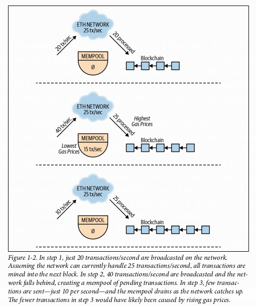
</p>

Jika akun yang sama memiliki dua transaksi di dalam *mempool*, para pembuat blok tahu transaksi mana yang harus dipilih terlebih dahulu berdasarkan “**nonce**”-nya, yaitu sebuah penghitung khusus untuk setiap akun yang nilainya bertambah pada setiap transaksi. Ini berarti bahwa meskipun *mempool* pada umumnya adalah sebuah tumpukan transaksi yang dapat dipilih oleh pembuat blok, sebenarnya ia lebih seperti tumpukan antrean (*a heap of queues*) dalam kasus di mana sebuah akun telah mengirimkan beberapa transaksi sebelum melihatnya berhasil. Gambar 1-3 menunjukkan bagaimana transaksi dari setiap akun diurutkan berdasarkan *nonce*-nya.

<p align="center">
  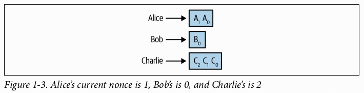
</p>

Terlepas dari apakah sebuah transaksi tertunda karena sifat protokol atau karena **kepadatan jaringan**, sebagai seorang pengembang, Anda perlu mempertimbangkan **sifat yang tidak dapat diprediksi dan asinkron** dari pengalaman pengguna dengan sistem perangkat lunak Anda. Di dunia di mana perangkat lunak keuangan, perdagangan, dan media sosial telah disesuaikan untuk menerima transaksi dalam waktu kurang dari satu detik, sistem yang didukung oleh *smart contract* memiliki **tantangan pengalaman pengguna (UX)** yang signifikan. Bagian selanjutnya akan menggali lebih dalam mengenai tantangan-tantangan ini.

## Finalitas Transaksi ✅

Ketika Anda berhasil mengeksekusi sebuah transaksi di basis data biasa, para pengembang mengasumsikan bahwa efeknya tidak akan pernah dibatalkan (*rolled back*). Namun, dalam kasus *blockchain*, ada kemungkinan seorang pengguna dapat melihat transaksi yang berhasil dimasukkan ke dalam sebuah blok, hanya untuk kemudian melihat blok tersebut segera **di-orphan** (menjadi yatim piatu) dan digantikan dengan blok yang berbeda. Blok baru ini mungkin tidak menyertakan transaksi yang sebelumnya berhasil!

Kurangnya **finalitas** pada transaksi *blockchain* ini disebabkan oleh sifat jaringan yang terdesentralisasi. Ada kemungkinan dua node yang berbeda membuat blok hampir secara bersamaan, dan rekan-rekan mereka masing-masing berada di “*fork*” *blockchain* yang berbeda, seperti yang disebutkan sebelumnya. Rantai mana pun yang membuat blok berikutnya lebih dulu akan mengalahkan *fork* yang lain, dan transaksi yang sebelumnya berhasil dapat menghilang dalam prosesnya. Dari sudut pandang pengguna, tampaknya transaksi mereka yang tadinya berhasil menjadi **di-revert** (dibatalkan). Gambar 1-4 hingga 1-6 mengilustrasikan masalah ini.

<p align="center">
  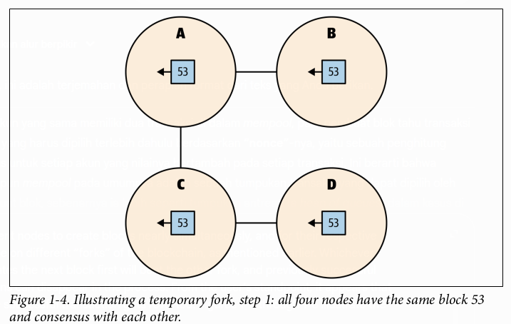
</p>

<p align="center">
  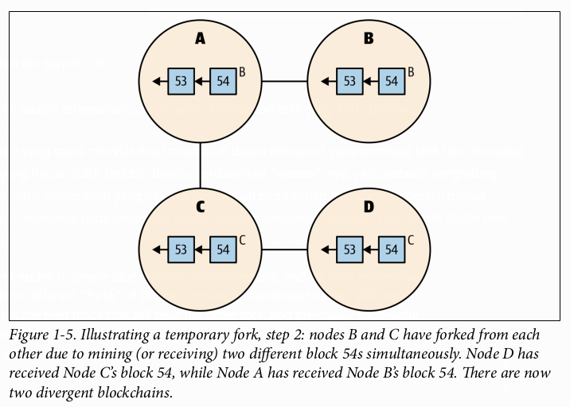
</p>

<p align="center">
  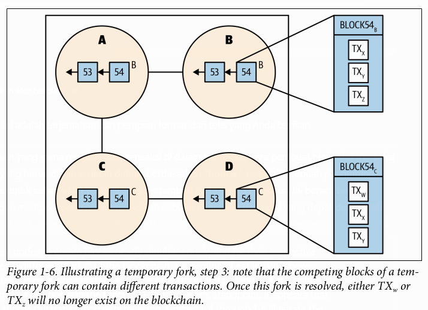
</p>

Masalah ini dapat diselesaikan dengan menunggu blok-blok tambahan ditambahkan ke dalam rantai sebelum menganggap transaksi tersebut selesai (*settled*). Setiap aplikasi perlu memiliki ambang batasnya sendiri untuk menganggap sebuah transaksi bersifat final. Bursa *cryptocurrency* populer akan menunggu hingga 50 blok agar sebuah transaksi dianggap "**terkonfirmasi**" di jaringan Ethereum. Ketika taruhannya lebih rendah, tidak perlu menunggu selama itu. Setiap aplikasi harus mempertimbangkan berapa lama ia ingin menunggu untuk menganggap transaksi bersifat final. Dalam beberapa kasus, "konfirmasi" ini akan dibangun ke dalam pengalaman pengguna, dan dalam kasus lain, mungkin hanya berupa peringatan umum bahwa tidak semua transaksi bersifat final.

Sekarang setelah kita membahas *fork* sementara, mari kita bicarakan tentang saudaranya yang lebih permanen.

## Hard Fork ⛓️

Setiap node dalam jaringan *blockchain* harus menjalankan perangkat lunak yang kompatibel dengan protokol agar dapat berpartisipasi dalam penyebaran blok dan transaksi serta pembuatan blok baru. Komunitas pengembang node *blockchain*, pengembang protokol, pembuat blok, bursa, dan pengembang aplikasi semuanya memberikan masukan tentang bagaimana protokol sebaiknya berevolusi untuk memenuhi kebutuhan komunitas. Pada akhirnya, evolusi ini terjadi melalui pengembang yang mengubah perangkat lunak node *blockchain*, dan orang-orang yang menjalankan perangkat lunak node tersebut (yang kita sebut "**operator node**") memilih apakah akan menggunakan versi baru atau tidak. Terkadang, perubahan yang dibuat pada protokol sangat signifikan sehingga versi baru tidak kompatibel dengan versi perangkat lunak sebelumnya. Situasi ini disebut "**hard fork**" karena sebuah *blockchain* baru akan muncul dari yang lama, menciptakan sebuah persimpangan jalan bagi para operator node, yang harus memutuskan sendiri *fork* mana yang akan mereka dukung.

*Hard fork* bisa bersifat **kontroversial** atau **non-kontroversial**. *Hard fork* non-kontroversial terjadi ketika seluruh komunitas melakukan pembaruan, secara efektif meninggalkan *fork* lama untuk yang baru. Ini tipikal terjadi ketika ada cacat serius yang ditemukan dalam protokol. *Hard fork* kontroversial terjadi ketika sejumlah besar operator node memutuskan untuk terus menggunakan *fork* yang ada dan mengembangkan protokol lama secara terpisah dari versi baru. **Ethereum (ETH)** mengalami *hard fork* kontroversial pada tahun 2016 yang mengakibatkan *blockchain* sebelumnya bertahan dan menamakan dirinya **Ethereum Classic (ETC)**. Mungkin akan ada *hard fork* kontroversial tambahan saat komunitas mengimplementasikan berbagai komponen dari rilis Serenity.

Kita telah berfokus terutama pada aspek-aspek umum *blockchain*; sekarang, mari kita fokus secara spesifik pada Ethereum.

## Dasar-Dasar Ethereum 📖

Kita telah mendeskripsikan karakteristik *blockchain* yang relatif umum, dengan beberapa contoh spesifik Ethereum. Sekarang kita akan menggali dasar-dasar Ethereum, dan membahas bagaimana bagian-bagian ini saling terhubung untuk memungkinkan pengembangan *smart contract*. Penting untuk memahami biaya transaksi, bagaimana akun dan kontrak diidentifikasi, dan bagaimana transaksi dieksekusi di dalam blok. Dasar-dasar Ethereum ini membentuk fondasi untuk memahami cara merancang dan mengembangkan aplikasi terdesentralisasi.

### Ether dan Gas ⛽

Protokol Ethereum memiliki mata uangnya sendiri, yang disebut **ether**. Penggunaan fundamental dari mata uang ini adalah untuk membayar pembuat blok agar menyertakan transaksi di dalam blok. Sama seperti dolar AS, ether dapat dibagi, meskipun menjadi pecahan yang jauh lebih kecil dari satu sen. Unit terkecil dari ether disebut **wei**, yang merupakan seper-kuintiliun dari satu ether (sebagai perbandingan, satu kuintiliun adalah satu miliar miliar, atau $10^{18}$). Karena ukuran wei yang kecil proporsinya terhadap ether, Anda akan sering melihat ether didenominasikan dengan **Gwei**, terutama ketika menyangkut harga gas. Satu Gwei adalah satu miliar wei, dan satu miliar Gwei adalah satu ether.

Meskipun hanya ada satu protokol Ethereum, ada lebih dari satu jaringan yang menjalankan protokol tersebut. Dimungkinkan untuk membuat jaringan pribadi yang menjalankan Ethereum, mirip dengan bagaimana "internet" pribadi disebut "intranet". Jaringan pribadi ini masih menggunakan ether seperti jaringan Ethereum publik, tetapi ether mereka tidak bernilai apa pun di pasar terbuka. Ether di jaringan Ethereum publik dikenal sebagai **ETH** dan memiliki nilai di dunia nyata. Jaringan Ethereum publik disebut sebagai "**mainnet**" oleh para pengembang. Ada juga jaringan tes publik atau "**testnet**" yang digunakan komunitas sebagai lingkungan pementasan (*staging*). Jaringan tes ini biasanya memiliki "**faucet**", atau mekanisme untuk memberikan ether gratis kepada pengembang untuk menguji *smart contract* mereka. Setiap jaringan yang menjalankan protokol Ethereum memiliki ether, tetapi ETH dari *mainnet*-lah yang memiliki nilai sebenarnya. Untuk men-*deploy* dan mengeksekusi *smart contract* di *mainnet*, kita memerlukan akun yang memiliki ETH. Untuk memperoleh ETH, Anda perlu membelinya melalui bursa, menerimanya dari teman, mendapatkannya dari bisnis, atau menambangnya sendiri.

Kode *smart contract*, seperti Solidity, dikompilasi menjadi ***bytecode***, yang menyediakan serangkaian ***opcode*** ke EVM. Sebuah *opcode* adalah instruksi seperti `PUSH1` atau `MLOAD` yang diinterpretasikan oleh EVM. Masing-masing *opcode* ini memiliki "**biaya gas**" (*gas cost*) yang terkait.² Mari kita lihat sebuah *smart contract* sederhana, dan periksa *bytecode* serta *opcode*-nya. Untungnya, sebagai pengembang *smart contract*, kita tidak perlu memahami isi dari *bytecode* atau *opcode* karena kita dapat memahami Solidity dengan cukup mudah. Meskipun begitu, seiring kemajuan Anda sebagai pengembang *smart contract*, menggali konsep-konsep tingkat rendah ini akan memberi Anda pemahaman yang lebih dalam tentang apa yang mungkin dilakukan.

```solidity
pragma solidity ^0.4.25;

contract Incrementer {
  uint256 public count;
  function addOne() public {
    count++;
  }
}
```

Mengompilasi kontrak ini menggunakan `solc` menghasilkan *bytecode* berikut:

```
6060604052341561000f57600080fd5b60cb8061001d6000396000f300606060405260043610604
9576000357c0100000000000000000000000000000000000000000000000000000000900463ffff
ffff168063a7916fac14604e578063febb0f7e146060575b600080fd5b3415605857600080fd5b6
05e6086565b005b3415606a57600080fd5b60706099565b60405180828152602001915050604051
80910390f35b6000808154809291906001019190505550565b600054815600a165627a7a7230582
08e9afbffafd387e67b7c38d8239aaa70fde96a805cebfb6f30517dd68e8664be0029
```

Dan *opcode* yang dilaporkan oleh `solc` terlihat seperti ini:

```
PUSH1 0x60 PUSH1 0x40 MSTORE CALLVALUE ISZERO PUSH2 0xF JUMPI PUSH1 0x0 DUP1
REVERT JUMPDEST PUSH1 0xCB DUP1 PUSH2 0x1D PUSH1 0x0 CODECOPY PUSH1 0x0 RETURN
STOP PUSH1 0x60 PUSH1 0x40 MSTORE PUSH1 0x4 CALLDATASIZE LT PUSH1 0x49 JUMPI
PUSH1 0x0 CALLDATALOAD PUSH29 0x100000000000000000000000000000000000000000000000
000000000 SWAP1 DIV PUSH4 0xFFFFFFFF AND DUP1 PUSH4 0xA7916FAC EQ PUSH1 0x4E
JUMPI DUP1 PUSH4 0xFEBB0F7E EQ PUSH1 0x60 JUMPI JUMPDEST PUSH1 0x0 DUP1 REVERT
JUMPDEST CALLVALUE ISZERO PUSH1 0x58 JUMPI PUSH1 0x0 DUP1 REVERT JUMPDEST PUSH1
0x5E PUSH1 0x86 JUMP JUMPDEST STOP JUMPDEST CALLVALUE ISZERO PUSH1 0x6A JUMPI
PUSH1 0x0 DUP1 REVERT JUMPDEST PUSH1 0x70 PUSH1 0x99 JUMP JUMPDEST PUSH1 0x40
MLOAD DUP1 DUP3 DUP2 MSTORE PUSH1 0x20 ADD SWAP2 POP POP PUSH1 0x40 MLOAD DUP1
SWAP2 SUB SWAP1 RETURN JUMPDEST PUSH1 0x0 DUP1 DUP2 SLOAD DUP1 SWAP3 SWAP2 SWAP1
PUSH1 0x1 ADD SWAP2 SWAP1 POP SSTORE POP JUMP JUMPDEST PUSH1 0x0 SLOAD DUP2 JUMP
STOP LOG1 PUSH6 0x627A7A723058 KECCAK256 DUP15 SWAP11 CREATE2 SELFDESTRUCT 0xaf
0xd3 DUP8 0xe6 PUSH28 0x7C38D8239AAA70FDE96A805CEBFB6F30517DD68E8664BE0029000000
```

Konsep "**gas**" ada untuk memisahkan harga ether dari biaya transaksi Ethereum. Tanpa pemisahan ini, biaya transaksi Ethereum akan dipatok pada harga ether, yang akan berdampak negatif pada ekosistem karena volatilitas nilai ETH. Untuk memisahkan nilai tukar antara gas dan ether, setiap transaksi Ethereum menetapkan `gasprice`-nya sendiri untuk menentukan berapa banyak wei yang harus dibayar untuk satu unit gas. Saat pembuat blok memutuskan transaksi mana yang akan dimasukkan ke dalam blok, mereka terinsentif untuk menyertakan transaksi yang akan memberi mereka `gasprice` paling besar untuk komputasi mereka. Pada saat tertentu, ada harga pasar yang dipahami secara implisit untuk gas. Membayar di bawah harga pasar akan berarti menunggu lebih lama dari sebagian besar transaksi lain agar transaksi Anda dieksekusi, sementara membayar di atas harga pasar akan memungkinkan Anda meninggalkan *mempool* lebih cepat dari sebagian besar.

Pembuat transaksi Ethereum perlu mempertimbangkan biaya versus manfaat dari menetapkan harga gas mereka di atas atau di bawah harga pasar saat ini. Beberapa transaksi tidak sensitif terhadap waktu dan dapat menunggu berjam-jam untuk dieksekusi. Dalam kasus ini, masuk akal untuk membayar ether yang relatif sedikit untuk eksekusi transaksi. Pembuat blok akhirnya menyertakan transaksi dengan harga gas rendah ketika *mempool* sedang dangkal dan tidak ada cukup banyak transaksi dengan `gasprice` yang besar. Sebaliknya, beberapa transaksi sangat sensitif terhadap waktu, dan sangat berharga sehingga masuk akal untuk membayar jauh di atas harga pasar untuk penyertaan blok yang cepat. Bahkan ada orang yang menjalankan perangkat lunak untuk mengamati *mempool* secara *real-time* dan mencoba untuk "**front-running**" transaksi perdagangan keuangan tertentu dengan melihat perdagangan yang tertunda dan mendahuluinya dengan menetapkan `gasprice` yang lebih tinggi.

Setiap transaksi Ethereum harus menyertakan atribut `gas` dan `gasprice`, yang bila dikalikan akan menetapkan biaya transaksi maksimum untuk transaksi tersebut, didenominasikan dalam wei. Atribut `gas` ini menetapkan batas berapa banyak komputasi yang dapat dilakukan oleh transaksi. Jika batas itu tercapai, eksekusi *smart contract* akan di-*revert* (dibatalkan), tetapi transaksi tersebut tetap ditulis ke *blockchain*, dan biayanya dikonsumsi oleh pembuat blok. Jika panggilan *smart contract* selesai dengan sisa gas, gas tersebut dikembalikan kepada pembuat transaksi. Jumlah gas yang digunakan di semua transaksi dalam sebuah blok tidak dapat melebihi `gaslimit` yang ditentukan blok tersebut. Ini juga berarti bahwa penggunaan gas dari satu transaksi pun tidak dapat melebihi `gaslimit` blok.

Bagian selanjutnya akan membahas detail para pemain dalam sebuah transaksi dan bagaimana mereka diidentifikasi.

² Pemetaan *opcode* ke biaya gas dapat ditemukan di Lampiran G dari *yellow paper* Ethereum di [https://ethereum.github.io/yellowpaper/paper.pdf](https://ethereum.github.io/yellowpaper/paper.pdf).

## Akun 👤

Transaksi Ethereum paling dasar hanyalah **Alamat Milik Eksternal (*Externally Owned Addresses* atau EOA)** yang saling mengirim ether. Selain itu, transaksi Ethereum dapat dikirim dari EOA ke *smart contract*. Baik EOA maupun *smart contract* diidentifikasi oleh alamat Ethereum seperti berikut:

> `0x52bc44d5378309ee2abf1539bf71de1b7d7be3b5`

Sebuah alamat direpresentasikan oleh angka **heksadesimal**. Mengingat besarnya angka yang terlibat dalam pembuatan sebuah alamat, secara praktis tidak mungkin untuk menghasilkan dua alamat yang identik. Tidak ada cara untuk membedakan alamat untuk *smart contract* dari EOA tanpa memeriksa *blockchain*. Meskipun akun dan kontrak memiliki alamat yang tidak dapat dibedakan, mereka memiliki beberapa perbedaan penting.

Setiap transaksi di *blockchain* Ethereum diinisiasi oleh sebuah **EOA**. *Smart contract* tidak dapat secara spontan melakukan suatu tindakan. Mereka dapat memanggil *smart contract* lain, tetapi setiap transaksi berasal dari EOA. Ketika kontrak dipanggil, mereka dapat memancarkan *event*, menyimpan data, menerima ether, mengirim ether ke EOA, atau mengirim data atau ether ke kontrak lain. Di sisi lain, selain menginisiasi transaksi, EOA hanya dapat menerima ether. Mereka tidak dapat bereaksi terhadap transaksi apa pun yang melibatkan mereka seperti yang dilakukan *smart contract*.

## Kontrak 📜

Kontrak dalam Solidity diorganisir dalam gaya berorientasi objek yang mirip dengan bahasa pemrograman Java. Dalam istilah berorientasi objek, sebuah kontrak sebenarnya adalah sebuah kelas, atau kumpulan variabel keadaan (*state variables*) dan fungsi. Untuk menggunakan kembali fungsionalitas umum, bahasa berorientasi objek memungkinkan sebuah kelas untuk mewarisi dari kelas lain (atau kontrak, dalam kasus ini). Karena Solidity menggunakan `function` sebagai kata kunci, kita akan menyebut "fungsi" sebagai apa yang sebagian besar bahasa berorientasi objek sebut sebagai "metode". Fungsi Solidity dapat dipisahkan menjadi dua jenis yang berbeda: **hanya-tulis (*write-only*)** dan **hanya-baca (*read-only*)**.

Fungsi Solidity **hanya-baca** ditandai dengan kata kunci `pure` dan `view`. Fungsi-fungsi ini dapat menerima data input, membaca data kontrak, beroperasi pada data tersebut, dan mengembalikan data. Fungsi hanya-baca tidak dapat mengubah keadaan kontrak atau memancarkan *event*. Karena tidak ada pembaruan yang diperlukan di rantai (*on-chain*), fungsi hanya-baca bersifat instan—mereka sangat mirip dengan panggilan API web, terutama permintaan GET. Penting untuk dicatat bahwa kemampuan untuk melewati pembaruan *on-chain* berarti fungsi hanya-baca dapat dipanggil tanpa membayar biaya gas apa pun, dan tidak akan ada transaksi yang dibuat.

Fungsi **hanya-tulis** adalah *default* di Solidity sehingga tidak memerlukan kata kunci tambahan. Meskipun "hanya-tulis", mereka sebenarnya dapat mengembalikan data, tetapi karena sifat asinkron Ethereum, data yang dikembalikan praktis tidak berguna, oleh karena itu disebut "hanya-tulis". Fungsi-fungsi ini adalah pekerja keras Ethereum, dan datanya harus dikirim melalui transaksi dan dimasukkan ke dalam blok agar fungsi tersebut dapat dieksekusi. Metode hanya-tulis yang tidak berhasil akan di-*revert*, baik karena kehabisan gas atau mencapai keadaan EVM yang tidak valid, atau karena pernyataan eksplisit dalam kontrak, seperti gagal pada pernyataan `require`. Metode hanya-tulis yang berhasil sebenarnya tidak harus mengubah apa pun, tetapi biasanya mengubah sesuatu dan seringkali memancarkan satu atau lebih *event* dalam prosesnya.

Tujuan dari ***event*** di Ethereum umumnya ada dua: untuk menyediakan log historis kustom tentang apa yang telah terjadi dalam kontrak, dan untuk memungkinkan pengamat berlangganan pembaruan *real-time*. Karena sifat *blockchain*, kita sudah memiliki buku besar historis dari semua yang pernah terjadi, tetapi *event* adalah cara yang nyaman untuk menyediakan pencatatan dan pembaruan yang lebih spesifik domain sehingga pengguna tidak perlu membuat interpretasi mereka sendiri terhadap transaksi dan transisi keadaan.

Untuk lebih memahami mekanisme *smart contract* Ethereum, mari kita sekarang fokus pada kendaraan modifikasinya.

## Blok dan Transaksi 🧱

Hanya pembuat blok Ethereum yang menentukan atribut sebuah blok, seperti transaksi mana yang disertakan. Demikian pula, hanya pengguna Ethereum yang menentukan atribut sebuah transaksi, seperti ke kontrak mana data akan dikirim. Sebagai pengembang *smart contract*, kita sering kali perlu menyadari keadaan blok serta keadaan transaksi yang sedang dieksekusi.

Solidity mengekspos atribut transaksi (`tx`) berikut:

  * `gasprice`
    Harga gas (dalam wei) yang ditetapkan oleh EOA yang membuat transaksi.
  * `origin`
    Alamat EOA yang membuat transaksi. Anehnya, alamat ini jarang berguna dan seringkali tidak aman.

Sebuah transaksi dapat melibatkan sejumlah kontrak yang arbitrer dalam eksekusinya, asalkan eksekusinya sesuai dengan batasan `gaslimit` blok. Solidity mengekspos sejumlah atribut terkait transaksi lainnya, tetapi mengelompokkannya ke dalam abstraksi pesan (`msg`). Pesan merujuk pada komunikasi antara kontrak dan apa pun yang dapat memanggilnya, seperti kontrak lain. Misalnya, panggilan fungsi kontrak akan selalu memiliki `msg.sender`. `msg.sender` tersebut bisa sama dengan `tx.origin` atau pembuat transaksi, atau bisa juga alamat dari kontrak perantara.

Atribut pesan (`msg`) Solidity adalah sebagai berikut:

  * `data`
    *Byte* mentah dari data yang dikirim ke fungsi eksternal atau publik yang sedang dieksekusi. Ini juga disebut sebagai `calldata`.
  * `sender`
    Alamat pemanggil dari fungsi eksternal atau publik yang sedang dieksekusi.
  * `sig`
    Empat *byte* pertama dari `calldata` menentukan fungsi mana yang sedang dipanggil. Ini juga disebut sebagai pengidentifikasi fungsi.
  * `value`
    Jumlah wei yang dikirim ke fungsi ini.

Solidity mengekspos atribut blok berikut:

  * `number`
    Setiap blok menambah nomor ini. Blok genesis adalah blok 0.
  * `timestamp`
    Waktu dalam detik sejak *epoch* saat blok dibuat. Anda mungkin juga melihat kode yang menggunakan aliasnya, `now`.
  * `blockhash`
    Selain nomor blok berurutannya, setiap blok diidentifikasi secara unik oleh *hash*-nya. Sebuah *hash* adalah angka heksadesimal seperti `0x88e96d4537bea4d9c05d12549907b32561d3bf31f45aae734cdc119f13406cb6`. *Hash* dari blok saat ini tidak tersedia, tetapi dengan memberikan nomor blok, Anda bisa mendapatkan *hash* dari blok mana pun dalam 256 blok terakhir.
  * `difficulty`
    Tingkat kesulitan penambangan dari blok saat ini.
  * `gaslimit`
    Jumlah maksimum gas yang dapat dikonsumsi oleh blok ini. Ini ditetapkan oleh pembuat blok.
  * `coinbase`
    Alamat pembuat blok.

Selanjutnya, kita akan membahas aspek unik tentang cara kerja waktu dalam *smart contract*.

## Jam Berapa Sekarang? ⏰

Sebagian besar bahasa pemrograman memungkinkan pengembang untuk memeriksa waktu, yang biasanya menggunakan waktu yang dilaporkan oleh komputer tempat program berjalan. Misalnya, program JavaScript yang berjalan di Node.js ini melaporkan waktu saat ini saat dieksekusi:

```javascript
for (let i = 0; i < 10; i++) {
  console.log(new Date());
}
```

Output dari program ini akan menjadi sesuatu seperti ini:

```
2019-10-05T05:08:45.058Z
2019-10-05T05:08:45.059Z
2019-10-05T05:08:45.060Z
2019-10-05T05:08:45.060Z
2019-10-05T05:08:45.060Z
2019-10-05T05:08:45.060Z
2019-10-05T05:08:45.060Z
2019-10-05T05:08:45.060Z
2019-10-05T05:08:45.060Z
2019-10-05T05:08:45.060Z
```

Tidak mengherankan, Anda dapat melihat waktu berubah saat program dieksekusi. Berikut adalah kode yang setara dalam Solidity:

```solidity
pragma solidity ^0.5.0;

contract TimeReporter {
  event TimeLog(uint256 time);

  function reportTime() public {
    for (uint8 i = 0; i < 10; i++) {
      emit TimeLog(block.timestamp);
    }
  }
}
```

*Event* yang dipancarkan oleh fungsi ini semuanya akan memiliki atribut waktu yang sama persis. Atribut waktu tersebut, yang ditetapkan oleh `block.timestamp`, adalah waktu saat blok ditambahkan ke *blockchain*. Untuk setiap transaksi dalam blok tersebut, atribut `block.timestamp` akan identik. Sementara jam di komputer berdetak setidaknya sekali setiap milidetik, "jam" di *blockchain* hanya berdetak sesering blok ditambahkan ke rantai. Karena "jam" *blockchain* beresolusi rendah, kita tidak pernah bisa mengharapkan detik yang tepat terjadi. Saat Anda menulis kode yang memeriksa waktu, perbandingan harus selalu melibatkan lebih besar dari atau kurang dari, daripada sama dengan persis.

Saat merancang *smart contract*, penting juga untuk diingat bahwa pembuat blok dapat memanipulasi waktu pembuatan blok serta urutan transaksi untuk keuntungan mereka. Misalnya, jika sebuah *smart contract* memiliki tenggat waktu bawaan, dan akan sangat menguntungkan sebagian besar pembuat blok jika tenggat waktu itu terlewat, maka mereka dapat memilih untuk menunda transaksi apa pun yang akan memenuhi tenggat waktu.

Pembuat blok yang memanipulasi urutan transaksi untuk keuntungan mereka bisa datang dalam bentuk "*front-running*" perdagangan token. Misalnya, seseorang mengirimkan transaksi untuk membeli 5 token ABC seharga 1 ETH, karena ada informasi baru tentang token ABC. Seorang pembuat blok dengan kekuatan *hash* yang signifikan dapat menunda transaksi 5 ABC / 1 ETH tersebut dan menambahkan transaksi mereka sendiri ke dalam blok dengan jumlah yang lebih kecil dan merebut token ABC itu untuk diri mereka sendiri. Ini hanya mungkin jika pembuat blok benar-benar berhasil membuat blok, yang sangat kompetitif. Jadi kekhawatiran ini bukanlah kerentanan yang signifikan dari *smart contract*, tetapi penting untuk diingat saat Anda mempertimbangkan desain dan insentif Anda.

Akhirnya, mari kita pertimbangkan beberapa aspek "kripto" dalam *cryptocurrency*.

## Menandatangani Transaksi ✍️

Kita perlu menghargai alasan mengapa ketika kita "menandatangani" sebuah transaksi, kita dapat yakin bahwa tanda tangan itu dibuat oleh kunci privat tertentu. Ini bermuara pada **kriptografi kunci-publik** yang sudah dikenal. Sebuah **kunci privat** adalah pasangan rahasia dari sebuah **kunci publik**. Alamat sebuah EOA adalah pemotongan dari *hash* kunci publiknya.³

Syukurlah, dalam proses pengembangan *smart contract* dan aplikasi terdesentralisasi (DApps), kita tidak sering bekerja langsung dengan kunci privat. Kami sangat menyarankan untuk menyerahkan manajemen kunci privat dan tanda tangan kriptografis ke perangkat lunak dompet (*wallet*) seperti MetaMask. Mengetahui kunci privat sebuah EOA sama dengan memiliki akun tersebut karena kunci privat adalah yang digunakan untuk menandatangani transaksi. Tanpa tanda tangan kriptografis ini, tidak ada cara untuk mengotentikasi apakah sebuah transaksi benar-benar dikirim oleh EOA yang ditentukannya.

Ketika kita mengirim transaksi Ethereum menggunakan salah satu *library* Web3, tanda tangan kriptografis terjadi di latar belakang. Atribut transaksi berikut digabungkan, di-*encode*, dan kemudian ditandatangani dengan kunci privat yang dikonfigurasi:

  * `nonce`
    Nomor urut transaksi ini untuk EOA ini.
  * `gasPrice`
    Jumlah wei yang dibayarkan transaksi ini per unit gas.
  * `gas`
    Jumlah gas yang bersedia dihabiskan oleh transaksi ini.
  * `to`
    Alamat penerima transaksi ini. Bisa berupa EOA atau kontrak.
  * `value`
    Jumlah wei (jika ada) yang dikirimkan transaksi ini ke penerima.
  * `data`
    Dalam kasus panggilan kontrak, ini berisi nama fungsi dan semua parameter. Dalam kasus *deployment* kontrak, ini berisi *bytecode* kontrak. Jika tidak ada kontrak yang terlibat, ini umumnya kosong.
  * `chainId`
    Setiap jaringan Ethereum publik memiliki `chainId`. Mainnet adalah 1, testnet Kovan adalah 42, dst.

Setelah atribut-atribut tersebut ditandatangani, tanda tangan itu sendiri disertakan dalam transaksi sehingga node Ethereum dapat memvalidasi bahwa pengirimnya sah. Untuk memvalidasi ini, node menggunakan alamat pengirim untuk memvalidasi tanda tangan. Jika seseorang mencoba mengirim transaksi dengan tanda tangan yang buruk, node akan menolaknya.

³ Untuk penyelaman mendalam tentang kriptografi, baca *Applied Cryptography* oleh Bruce Schneier (John Wiley & Sons).

## Ringkasan

Kita telah menyentuh secara ringan banyak aspek *blockchain* dan Ethereum dalam bab ini. Kami harap kami telah membangkitkan selera Anda dan Anda bersemangat untuk menggali lebih dalam ke pengembangan aplikasi terdesentralisasi melalui bab kami berikutnya. Sisa bab di Bagian I buku ini adalah persiapan yang semakin pragmatis untuk Bagian II, di mana kita akan mulai mengembangkan *smart contract* dan DApps dengan sungguh-sungguh.

---

# BAB 2
## Aplikasi Terdesentralisasi

Dalam bab ini kita akan melihat beberapa contoh kasus penggunaan untuk membangun aplikasi di *blockchain* Ethereum. Untuk setiap kasus, kita akan melihat karakteristik *blockchain* apa yang cocok untuk mendukung aplikasi-aplikasi ini dan, jika memungkinkan, kita akan melihat beberapa contoh yang sudah ada di produksi. Kita kemudian akan menutup bab ini dengan beberapa pertanyaan untuk Anda tanyakan pada diri sendiri saat memulai proyek berikutnya untuk memastikan *blockchain* adalah teknologi yang tepat untuk digunakan.

Mari kita langsung masuk ke penggunaan pertama dan yang mungkin paling umum, yaitu token.

## Token 🎟️

**Token** adalah sebuah abstraksi yang merepresentasikan **kepemilikan**. Kepemilikan menyiratkan hak-hak istimewa tertentu seperti hak untuk menggunakan atau menjual suatu barang seperti kendaraan atau rumah. Dalam kasus ini, token, atau bukti kepemilikan, direpresentasikan oleh sebuah sertifikat atau akta. Token juga dapat memberikan hak untuk mengakses sesuatu seperti perangkat lunak atau film. Di sini, token dapat direpresentasikan oleh kunci lisensi atau tiket fisik. Mengingat kepemilikan adalah sesuatu yang dapat sering berubah, melacak perubahan-perubahan ini pada platform yang diamankan secara kriptografis sangatlah masuk akal.

Untuk membantu para pengembang dalam pembuatan token, komunitas Ethereum telah mengembangkan beberapa jenis standar token yang berbeda melalui proses [Ethereum Improvement Proposal atau EIP](https://eips.ethereum.org/). Mari kita lihat dua dari standar ini, [ERC-20](https://eips.ethereum.org/EIPS/eip-20) dan [ERC-721](https://eips.ethereum.org/EIPS/eip-721).

### ERC-20

Standar **ERC-20** digunakan saat membuat token yang ***fungible***, atau dapat saling dipertukarkan. Token-token ini akan menjadi pengganti yang ideal untuk hal-hal seperti poin hadiah dari peritel, mil dari maskapai penerbangan, atau sebuah mata uang. Semua token yang dibuat dari kontrak ERC-20 dianggap memiliki nilai yang sama dan secara efektif tidak dapat dibedakan satu sama lain. Karena semua token dianggap identik, tanggung jawab utama dari kontrak ERC-20 adalah melacak saldo.

Standar ini memiliki beberapa kolom opsional seperti nama dan simbol, tetapi memerlukan implementasi dari fungsi-fungsi berikut:

* `totalSupply()`
    Mengembalikan jumlah token yang beredar.
* `balanceOf(address owner)`
    Mengembalikan saldo untuk alamat yang diberikan.
* `transfer(address to, uint value)`
    Mengembalikan `true` atau `false` berdasarkan keberhasilan atau kegagalan transfer.
* `transferFrom(address from, address to, uint value)`
    Mengembalikan `true` atau `false` berdasarkan keberhasilan atau kegagalan transfer. Dalam kasus ini, transfer diinisiasi oleh alamat lain yang bukan pemilik, dan harus sudah disetujui sebelumnya untuk membelanjakan dana ini atas nama pemilik.
* `approve(address spender, uint value)`
    Mengembalikan `true` atau `false` jika berhasil. Metode ini digunakan untuk menetapkan jumlah yang dapat dibelanjakan oleh alamat lain atas nama pemilik.
* `allowance(address owner, address spender)`
    Mengembalikan jumlah yang masih tersedia untuk ditarik oleh pembelanja (*spender*).

Jika Anda suatu saat bekerja pada aplikasi yang memerlukan implementasi ERC-20, Anda dapat membuat token ERC-20 dengan mendefinisikan fungsi-fungsi ini; namun, kami merekomendasikan penggunaan kontrak [OpenZeppelin](https://oreil.ly/ElzWd) sebagai dasar untuk memulai. Kontrak-kontrak ini semuanya telah diaudit secara menyeluruh dan didokumentasikan dengan baik, menjadikannya tempat awal yang bagus untuk merancang token Anda sendiri.

Token ERC-20 telah digunakan untuk banyak tujuan yang berbeda, tetapi salah satu yang mungkin menarik perhatian Anda adalah **Initial Coin Offering (ICO)**. Dalam sebuah ICO, sebuah organisasi akan menjual token sebagai sarana untuk menggalang dana. Dalam beberapa hal, ini mirip dengan apa yang dilakukan [Kickstarter](https://www.kickstarter.com/) untuk organisasi atau proyek baru tetapi dengan cara yang terdesentralisasi.

Jika token tersebut diharapkan akan bertambah nilainya berdasarkan kinerja organisasi penerbit, token tersebut dapat dianggap sebagai **sekuritas**. Jika demikian, kemungkinan akan ada beberapa persyaratan peraturan yang perlu dipertimbangkan saat mengembangkan *smart contract* ini. Untuk token yang mungkin masuk dalam kategori ini, ada [draf proposal](https://eips.ethereum.org/EIPS/eip-1462) yang sedang dikerjakan yang dapat membantu menjaga token tetap patuh pada aturan.

Untuk contoh di dunia nyata, Anda dapat memeriksa daftar token yang telah di-*deploy* di [Etherscan](https://etherscan.io/tokens).

Sekarang mari kita bicara tentang token yang tidak dapat saling dipertukarkan, atau dengan kata lain, ***non-fungible***.

### Token Non-Fungible (ERC-721)

**ERC-721** menyediakan standar untuk token *non-fungible*. Token-token ini berbeda—atau setidaknya memiliki kemampuan untuk menjadi berbeda—satu sama lain. Karena token-token ini berbeda, kontrak tidak bisa hanya melacak saldo token tetapi harus melacak setiap token individual yang diterbitkannya.

Seperti ERC-20, kontrak ERC-721 secara opsional dapat mengimplementasikan kolom untuk nama dan simbol, dan mereka juga dapat secara opsional menyertakan **URI token (*Uniform Resource Identifier*)**, tetapi mereka harus mengimplementasikan fungsi-fungsi berikut:

* `balanceOf(address owner)`
    Mengembalikan jumlah token non-fungible (NFT) untuk pemilik yang dimasukkan.
* `ownerOf(uint256 tokenId)`
    Mengembalikan alamat pemilik untuk ID token tertentu. Ingat, setiap token unik dan kontrak harus memelihara struktur data yang melacak kepemilikan.
* `setTransferFrom(address from, address to, uint256 tokenId, bytes data)`
    Mentransfer kepemilikan token. Dalam kasus di mana alamat `to` adalah sebuah kontrak, ia akan memanggil fungsi `onERC721Received` untuk memastikan ia dapat menerima token.
* `setTransferFrom(address from, address to, uint256 tokenId)`
    Sama seperti fungsi sebelumnya, tetapi mengatur `data` menjadi string kosong. Ini juga menunjukkan bahwa bahasa pemrograman Solidity mendukung ***method overloading***, atau dua metode dengan nama yang sama tetapi parameter yang berbeda.
* `transferFrom(address from, address to, uint256 tokenId)`
    Mentransfer kepemilikan token. Berbeda dengan metode `safeTransferFrom`, metode ini tidak memeriksa untuk memastikan penerima mampu menerima token ERC-721. Jika penerima tidak dapat menerima token ERC-721, dan metode ini digunakan, token tersebut mungkin hilang secara permanen. Jika ada keraguan, gunakan metode `safeTransferFrom` sebagai gantinya.
* `approve(address approved, uint256 tokenId)`
    Mengizinkan alamat lain untuk mentransfer token atas nama pemilik. Ini sangat mirip dengan metode `approve` untuk ERC-20, tetapi alih-alih jumlah, kita menentukan token mana yang dapat ditransfer oleh alamat yang disetujui.
* `setApprovalForAll(address operator, bool approve)`
    Ketika `approve` diatur ke `true`, ini menyetujui semua token dari kontrak yang dimiliki oleh pemilik saat ini (pengirim pesan) untuk alamat operator. Ketika `approve` diatur ke `false`, ini menghapus akses dari semua token yang dimiliki oleh pemilik saat ini (pengirim pesan) untuk alamat operator.
* `getApproved(uint256 tokenId)`
    Mengembalikan alamat yang disetujui untuk ID token yang diberikan.

Sama seperti ERC-20, **OpenZeppelin** telah membuat kontrak yang dapat digunakan sebagai dasar untuk implementasi [ERC-721](https://oreil.ly/fQ_FY) Anda sendiri.

Sebagai contoh bagaimana ERC-721 telah digunakan, mari kita lihat [CryptoKitties](https://www.cryptokitties.co/). CryptoKitties adalah sebuah permainan yang memungkinkan pengguna untuk mengoleksi kucing virtual, di mana setiap kucing memiliki serangkaian *cattributes* (atribut kucing) yang unik, yang direpresentasikan oleh genom 256-bit. Pengguna kemudian mengembangbiakkan kucing mereka untuk menghasilkan yang baru, yang mewarisi campuran sifat dari genom induknya.

Ini mungkin terdengar konyol, tetapi pada saat penulisan ini, orang-orang telah menghabiskan lebih dari $27 juta USD untuk membeli kucing-kucing ini, dengan satu kucing terjual lebih dari $172.625 USD. Jika Anda ingin melihat angka terkini, lihat situs web [Kitty Sales](https://kittysales.herokuapp.com/).

Token ERC-721 dapat merepresentasikan hampir semua barang unik yang dapat ditransfer. Ini menjadikannya token yang ideal untuk mengelola barang koleksi digital atau kunci lisensi, atau bahkan untuk registri barang fisik di dunia nyata.

Berbicara tentang barang dunia nyata, mari kita beralih ke kasus penggunaan utama berikutnya, yaitu rantai pasok.

## Rantai Pasok (Supply Chain) 📦

Secara umum, **rantai pasok** terdiri dari organisasi, orang, dan proses yang membantu produk berpindah dari pemasok ke pelanggan. Untuk mengilustrasikan sebuah rantai pasok, mari kita bicara tentang kopi.

Kopi biasanya ditanam di wilayah yang disebut sebagai **Sabuk Kopi (*Bean Belt*)**. Ini adalah area di dekat khatulistiwa yang dibatasi oleh Garis Balik Selatan (*Tropic of Capricorn*) dan Garis Balik Utara (*Tropic of Cancer*). Di sini Anda memiliki petani yang menanam dan memanen kopi, yang pada akhirnya menjual hasil panen mereka ke **eksportir**. Eksportir akan mengangkut kopi ke luar negeri, di mana mereka akan menjual kiriman mereka ke **distributor** lokal. Distributor lokal kemudian akan mengangkut biji kopi ke para **penyangrai (*roasters*)**. Para penyangrai kemudian akan menyangrai, mencampur, dan mengemas kopi yang kemudian dapat dijual ke kedai-kedai kopi untuk dinikmati oleh pelanggan. Rantai ini diilustrasikan pada Gambar 2-1.

<p align="center">
  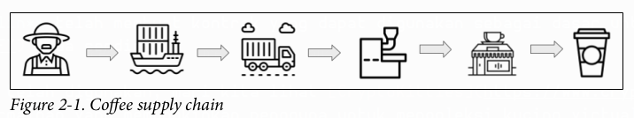
</p>

Setiap peran ini, dari petani hingga kedai kopi, bisa menjadi perusahaan atau badan usaha tersendiri. Ini berarti setiap organisasi kemungkinan akan memiliki sistem independen untuk melacak pembelian dari pemasok hingga penjualan. Beberapa akan menghubungkan penjualan ke lot produk masuk tertentu, sementara yang lain mungkin tidak membuat koneksi ini. Dalam kasus di mana hubungan tidak dibuat secara eksplisit, menelusuri secangkir kopi kembali ke pertanian dan panen spesifik bisa memakan waktu yang sangat lama.

Memindahkan proses ini ke **blockchain** akan memungkinkan kita untuk melacak asal-usul secangkir kopi kembali ke panen dengan jauh lebih cepat. Setiap panen akan dicatat di dalam rantai (*on-chain*), bersama dengan setiap pergantian kepemilikan, hingga sampai ke kedai kopi. Gabungkan ini dengan **perangkat IoT** yang ikut serta dalam pengiriman, memposting kondisi seperti suhu dan kelembaban ke *blockchain*, dan Anda dapat memiliki perjalanan yang sangat detail dari pertanian hingga ke cangkir. Bayangkan memindai **kode QR** pada sekantong kopi dan melihat di mana kopi itu ditanam, beserta jalur dan kondisi lingkungan dari saat meninggalkan pertanian hingga tiba di kedai kopi.

Sekarang, ini mungkin berlebihan untuk kopi, tetapi ini tidak terlalu jauh dari eksperimen yang sedang dijalankan oleh **Walmart**. Dalam eksperimen Walmart, mereka melacak mangga di Meksiko dan babi di Tiongkok, dengan tujuan meningkatkan **ketertelusuran (*traceability*)**. Untuk menetapkan titik acuan (*baseline*), sebuah tim diminta untuk mengidentifikasi pertanian asal dari sebungkus irisan mangga. Tim tersebut membutuhkan waktu hampir seminggu untuk melakukan penelusuran manual yang diperlukan untuk melacak irisan mangga tersebut ke pertaniannya. Setelah mengimplementasikan solusi *blockchain*, proses itu hanya memakan waktu 2,2 detik. Dalam kasus kontaminasi makanan, mengidentifikasi sumbernya bisa sangat berarti dalam menyelamatkan nyawa.

> Walmart menggunakan Hyperledger Fabric untuk eksperimen *blockchain*-nya. Hyperledger Fabric adalah sebuah ***blockchain* berizin (*permissioned*)**, yang berarti bahwa peran dan aktivitas tertentu, seperti validasi transaksi (penambangan), pembuatan akun, dll., dapat dibatasi atau dikendalikan oleh aturan yang mungkin ada atau tidak ada di dalam chain.

Sejauh ini kita sebagian besar telah membahas pelacakan makanan, tetapi aplikasi rantai pasok (*supply chain*) dapat digunakan untuk hampir semua barang yang Anda lihat di rak toko. Sebagai contoh, bayangkan menggunakan ini sebagai konsumen untuk melihat dari mana kapas dari kemeja yang Anda beli berasal, atau perjalanan sebuah perabot hingga sampai ke ruang tamu Anda. Memiliki informasi ini akan memberi konsumen wawasan yang jauh lebih mendalam tentang produk mereka, memungkinkan mereka untuk membuat **keputusan yang terinformasi**.

Sekarang kita tahu bagaimana rantai pasok bisa menjadi aplikasi yang hebat di atas *blockchain*, bagaimana dengan pencatatan data (*record keeping*)?

## Catatan Permanen

Ketika Anda memiliki aset jangka panjang seperti rumah atau mobil, akan sangat baik jika semua perawatan yang telah dilakukan terhadapnya dapat dilacak dalam sejenis buku catatan (*log*). Yang lebih baik lagi daripada sekadar melacaknya adalah menyimpannya di tempat di mana catatan-catatan ini **tidak dapat dihancurkan**, dan di sinilah *blockchain* dapat membantu.

Jenis aplikasi pencatatan data seperti ini adalah sesuatu yang sedang dikembangkan oleh [Aeron Labs](https://aeron.aero/). Aeron berfokus pada industri penerbangan, dengan tujuan membuat catatan seperti perawatan pesawat dan buku catatan pilot tersedia di *blockchain*.

Di Amerika Serikat, persyaratan pengalaman pilot dan persyaratan perawatan pesawat diatur oleh **Administrasi Penerbangan Federal (FAA)**. Melihat persyaratan untuk pilot, ada berbagai tingkatan sertifikat pilot yang, setelah diperoleh, memberikan hak-hak istimewa tertentu seperti terbang di awan atau menerbangkan pesawat dengan banyak mesin. Selain mendapatkan sertifikat ini, pilot mungkin diharuskan untuk mempertahankan tingkat kemahiran (*currency*) dengan melakukan manuver spesifik dalam periode waktu tertentu. Sebagai contoh, seorang pilot tidak boleh membawa penumpang kecuali mereka telah melakukan [3 kali lepas landas dan pendaratan dalam 90 hari terakhir](https://oreil.ly/ehPRI), dan cara saat ini untuk membuktikannya adalah dengan melihat buku catatan pilot.

Membuktikan hal seperti ini bisa menjadi hampir mustahil jika buku catatan yang bersangkutan hilang atau hancur. Menempatkan jenis informasi ini di *blockchain* akan berarti informasi tersebut menjadi **permanen, dapat diakses oleh pihak yang berwenang** seperti FAA atau Dewan Keselamatan Transportasi Nasional (NTSB), dan **terlindungi dari pemalsuan**.

Sama seperti pilot, pesawat juga diwajibkan memiliki buku catatan. Buku catatan pesawat melacak perawatan dan kepatuhan terhadap **Petunjuk Kelaikan Udara** (*Airworthiness Directives*), yang mirip dengan pemberitahuan penarikan kembali (*recall*) dari produsen mobil. Dengan buku catatan pesawat, mekanik menambahkan catatan setiap kali mereka melakukan item pemeliharaan atau perbaikan apa pun pada pesawat. Jika ini dipindahkan ke *blockchain*, seperti yang coba dilakukan oleh Aeron, catatan-catatan ini akan tersedia lebih cepat dan tidak akan bisa hilang atau dihancurkan.

Aeron saat ini sedang membangun dua aplikasi. Satu berfokus pada pilot dan akan menggantikan buku catatan tradisional, dan yang lainnya berfokus pada perawatan pesawat untuk menggantikan buku catatan pemeliharaan. Ini akan menjadi perubahan signifikan bagi industri penerbangan, dan keberhasilannya bergantung pada adopsi teknologi ini oleh banyak organisasi. Jika Aeron dapat membantu memelopori layanan *blockchain* di industri ini, mereka dapat menunjukkan contoh bagi banyak industri lain untuk mengadopsinya. Sistem pencatatan atau pencatatan aditif (yang terus bertambah) semacam ini bisa sangat bagus untuk aset apa pun yang berumur panjang, dan jika teknologi ini diadaptasi untuk membantu layanan kesehatan, Anda bahkan bisa memiliki **rekam medis yang mengikuti Anda seumur hidup**.

Dengan mempertimbangkan jenis-jenis aplikasi ini, mari kita alihkan perhatian kita untuk memutuskan apakah *blockchain* cocok untuk Anda.

## Mengevaluasi Blockchain untuk Aplikasi Anda

Bagaimana Anda tahu jika *blockchain* tepat untuk aplikasi Anda? Hal-hal apa yang harus Anda pertimbangkan saat membuat keputusan ini? Bagian berikut menjelaskan beberapa keunggulan dari *blockchain*.

### Dapat Diverifikasi (*Verifiable*)

Jika Anda perlu memastikan bahwa perubahan dilakukan oleh individu yang berwenang, *blockchain* Ethereum dapat diandalkan. Ini secara khusus berguna untuk lingkungan tanpa kepercayaan (*trustless environments*), atau lingkungan tanpa otoritas terpusat. Dengan menggunakan transaksi yang **ditandatangani dan diverifikasi secara kriptografis**, setiap perubahan status (*state*) terlindungi dari pemalsuan atau manipulasi. Satu-satunya cara seseorang selain pemilik EOA (*Externally Owned Account*) dapat melakukan transaksi atas nama mereka adalah jika mereka berhasil mendapatkan salinan kunci privat (*private key*) mereka.

### Transparan (*Transparent*)

Dengan sifat publik dari *blockchain* Ethereum, siapa pun dapat melihat transaksi yang sedang terjadi. Ini berarti segalanya **sepenuhnya tersedia untuk diaudit**. Ada alat-alat seperti **Etherscan** yang memungkinkan Anda untuk memeriksa semua blok dan transaksinya melalui peramban web, atau Anda dapat menjalankan *node* Ethereum Anda sendiri dan menelusuri transaksi di mesin lokal Anda. Ini berarti pengguna tidak lagi harus bergantung pada informasi yang diberikan kepada mereka dari entitas mana pun; ketika aplikasi berada di *blockchain*, mereka dapat memeriksanya sendiri. Jika aplikasi Anda bertujuan untuk memberikan kejelasan bagi konsumen atau kolaborator industri lainnya, fungsionalitas ini sudah menjadi bagian tak terpisahkan.

### Tangguh (*Resilient*)

Setiap *node* Ethereum menyimpan **salinan lengkap dari data *blockchain***. Ini berarti Anda tidak akan pernah berada dalam situasi di mana data tidak sengaja hancur dan tidak dapat dipulihkan. Jika data ada di dalam rantai (*chain*), Anda bisa mendapatkannya kembali dengan melakukan sinkronisasi ulang (*resyncing*) sebuah *node*.

Jika salah satu dari hal-hal ini cocok dengan persyaratan aplikasi Anda, maka Ethereum layak untuk ditinjau lebih dalam.

## Ringkasan

Dalam bab ini kita membahas bagaimana *blockchain* digunakan untuk membangun token, menyediakan transparansi dalam rantai pasok, dan menciptakan cara untuk mengaudit buku catatan pilot dan pesawat. Aplikasi-aplikasi ini hanyalah puncak dari gunung es dari sebuah tumpukan teknologi (*tech stack*) yang menarik.

Di bab berikutnya, kita akan mulai menyiapkan mesin kita untuk pengembangan *smart contract*!

---

## BAB 3
### Sebelum Kita Memulai

Dalam bab ini, kita akan menyiapkan semua alat yang dibutuhkan untuk pengembangan *smart contract*. Kita akan mulai dengan menginstal klien Ethereum, yaitu perangkat lunak yang dapat digunakan untuk berinteraksi dengan *blockchain* Ethereum. Selanjutnya, kita akan menginstal Node.js, yang menyediakan lingkungan JavaScript untuk Truffle. Terakhir, kita akan menginstal Truffle dan Ganache dari **Truffle Suite**. Truffle menyediakan serangkaian utilitas fantastis yang digunakan untuk menguji dan menerapkan (*deploy*) *contract* kita, sementara Ganache memberi kita lingkungan *blockchain* lokal untuk menjalankan aplikasi kita secara lokal.

Setelah semua alat ini terinstal, kita akan siap untuk menulis *smart contract* pertama kita. Tanpa basa-basi lagi, mari kita mulai.

### Klien Ethereum

Sebelum kita mulai menginstal klien Ethereum, kita harus meluangkan waktu sejenak untuk membahas bagaimana klien Ethereum berbeda dari klien HTTP, yang kemungkinan besar jauh lebih Anda kenal.

Dalam aplikasi web tradisional, *server*-nya terpusat dan berlokasi dengan sebuah URL atau alamat IP. Perangkat lunak ini dapat ditulis dalam bahasa pemrograman apa pun yang mampu mengirim permintaan HTTP. Perangkat lunak klien akan membuat interaksi dengan *server* menjadi lebih mudah karena akan berisi semua logika dan abstraksi untuk membangun permintaan dan mem-parsing respons. Klien juga dapat dirilis sebagai sebuah *library* dan tersedia untuk aplikasi lain guna mempercepat adopsi layanan tersebut.

**Twilio** adalah contoh yang bagus untuk jenis klien ini. Jika Anda mengunjungi halaman GitHub mereka, Anda dapat melihat bahwa mereka mendukung *library* dalam bahasa seperti Java, C\#, Ruby, Node, dll. Ini berarti menginstal klien Twilio biasanya dilakukan dengan menggunakan manajer dependensi (*dependency manager*) dari bahasa tersebut dan menjalankan beberapa perintah di baris perintah (*command line*) atau IDE.

Ketika Anda menginstal klien Ethereum, Anda sedang menginstal perangkat lunak yang akan memungkinkan Anda untuk **menjalankan sebuah *node* Ethereum** di mesin Anda. Perangkat lunak ini dilengkapi dengan antarmuka baris perintah (CLI), yang memungkinkan Anda membuat akun atau meluncurkan konsol interaktif yang memuat Web3 terlebih dahulu (lebih lanjut tentang ini di bab-bab selanjutnya). Selain itu, perangkat lunak ini akan menjalankan sebuah *server* untuk mengekspos API JSON RPC Ethereum.

Jika Anda tidak terbiasa dengan JSON RPC, ini adalah protokol *remote procedure call* (RPC) yang ringan. Ini berarti kita menggunakan JSON untuk mengirim permintaan ke *server*, yang kemudian menjalankan beberapa operasi yang telah ditentukan sebelumnya. Melalui JSON RPC inilah kita akan berinteraksi dengan *blockchain*. Spesifikasi lengkap tentang apa saja yang tersedia dapat ditemukan di [wiki Ethereum](https://ethereum.org/en/developers/docs/apis/json-rpc/).

Ada sejumlah klien Ethereum yang bisa Anda gunakan, termasuk **cpp-ethereum**, **go-ethereum** (juga dikenal sebagai **Geth**), dan beberapa lainnya, tetapi yang akan kita gunakan adalah **Parity**. Parity adalah klien yang ditulis dalam bahasa Rust dan menyediakan salah satu opsi sinkronisasi tercepat di antara klien yang tersedia. Klien ini juga dikelola oleh Parity Technologies, sebuah perusahaan yang didirikan oleh penulis *yellow paper* Ethereum, Dr. Gavin Wood. Meskipun kami memilih Parity untuk tujuan buku ini, klien mana pun yang telah mengimplementasikan spesifikasi Ethereum akan berfungsi. Untuk daftar lengkap yang terkini, periksa dokumentasinya.

### Menginstal Parity

Parity menyediakan *binary* yang sudah jadi (*prebuilt*) untuk sistem operasi Windows, Mac, dan Linux. Jika Anda menjalankan Mac atau Ubuntu (atau Ubuntu versi WSL di Windows 10), maka Anda dapat menggunakan skrip instalasi otomatis dengan menjalankan perintah berikut:

```bash
$ bash <(curl https://get.parity.io -L)
```

Setelah skrip selesai menginstal, Anda dapat mulai menyinkronkan blok dari jaringan. Dalam kasus kita, alih-alih melakukan sinkronisasi dari *mainnet*, atau apa yang mungkin Anda anggap sebagai lingkungan "produksi", kita akan menyinkronkan salah satu jaringan uji (*test network*). Ini akan jauh lebih cepat sambil menyediakan perangkat yang dibutuhkan untuk pengembangan kita. Kami telah memilih untuk menggunakan **Goerli**, yang merupakan jaringan yang dirancang untuk bekerja dengan beberapa klien Ethereum yang berbeda seperti Geth dan Parity. Mari kita mulai sinkronisasi dengan perintah berikut:

```bash
$ parity --chain=goerli
```

Setelah Anda menjalankan perintah ini, Anda akan mulai melihat output terminal yang terlihat mirip dengan Contoh 3-1.

**Contoh 3-1. Output sinkronisasi Parity**

```
2019-07-17 14:28:17
2019-07-17 14:28:17
2019-07-17 14:28:17
2019-07-17 14:28:17
2019-07-17 14:28:17
2019-07-17 14:28:17
2019-07-17 14:28:19
2019-07-17 14:28:24
...
Starting Parity-Ethereum/v2.5.5-stable-3ebc76975-20190708/...
Keys path ~/Library/Application Support/io.parity.ethereum/...
DB path ~/Library/Application Support/io.parity.ethereum/...
State DB configuration: fast
Operating mode: active
Configured for Görli Testnet ...
Listening for new connections...
Syncing #954677 0x6105…6a9a ...
```

Meninjau output di atas, baris pertama memberi kita informasi tentang klien apa yang sedang diluncurkan dan versinya. Beberapa baris berikutnya menampilkan detail konfigurasi, yang mencakup di mana kunci (*keys*) dan basis data (DB) disimpan. Setelah itu, kita melihat sebuah *server* dimulai pada `127.0.0.1:8546`. Terakhir, kita melihat proses sinkronisasi dimulai. Setelah sinkronisasi awal selesai, meluncurkan Parity akan berjalan cepat, karena hanya perlu mengambil blok-blok terbaru yang telah ditambahkan ke rantai. Pada titik ini, Anda dapat melanjutkan dan mematikan prosesnya dengan **Ctrl-C**.

Kita akan membahas Parity lebih lanjut ketika tiba saatnya untuk menerapkan *smart contract* di Bab 6. Untuk saat ini, kita siap untuk melanjutkan ke MetaMask.

### Menginstal MetaMask

Jika aplikasi Anda mengharuskan pengguna untuk mengunduh dan menjalankan klien Ethereum penuh seperti Parity atau Geth, Anda baru saja kehilangan banyak calon pengguna. Meminta pengguna untuk menginstal dan menjalankan *node* Ethereum penuh adalah permintaan yang berlebihan bagi sebagian besar orang, kecuali bagi penggemar kripto yang berdedikasi. Di luar para pengguna awal (*early adopters*), Anda perlu menyediakan cara yang jauh lebih mudah bagi mereka yang kurang melek teknologi untuk mulai menggunakan aplikasi, dan di sinilah **MetaMask** berperan.

MetaMask didistribusikan sebagai **ekstensi peramban (*browser*)** yang tersedia di Chrome, Firefox, Opera, dan Brave. Perangkat lunak MetaMask memberi pengguna kemampuan untuk membuat akun, dan memuat instansi Web3 yang sudah dikonfigurasi sebelumnya ke dalam peramban yang digunakan untuk berinteraksi dengan *blockchain* melalui JSON RPC. MetaMask juga menyediakan pengguna **frasa mnemonik 12 kata** yang dapat mereka simpan untuk memulihkan akun mereka di kemudian hari jika mereka berganti komputer, peramban, atau kehilangan kata sandi. Jika itu belum cukup, MetaMask juga menyediakan beberapa pilihan bagi pengguna untuk membeli ether untuk mendanai akun mereka, menjadikannya cara termudah bagi pengguna baru untuk memulai dengan Ethereum.

Mari kita instal MetaMask terlebih dahulu agar kita dapat berinteraksi dengan aplikasi kita nanti. Buka **[https://metamask.io](https://metamask.io)** dan instal ekstensi untuk Chrome. Mari kita ikuti proses penyiapannya, seperti yang diilustrasikan pada Gambar 3-1.

<p align="center">
  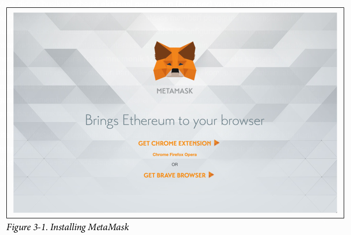
</p>

Setelah Anda mengeklik Unduh (Download), Anda akan diarahkan ke Chrome store, seperti yang ditunjukkan pada Gambar 3-2.

<p align="center">
  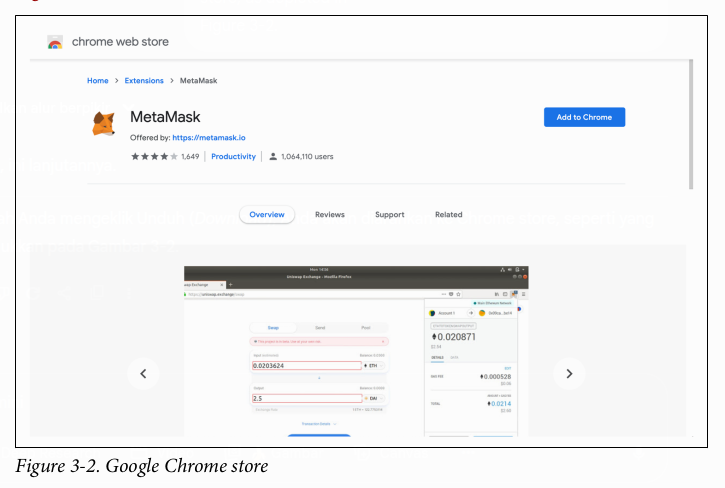
</p>

Instal ekstensi tersebut dan setujui prompt “Tambahkan MetaMask?” di Chrome, seperti yang ditunjukkan pada Gambar 3-3.

<p align="center">
  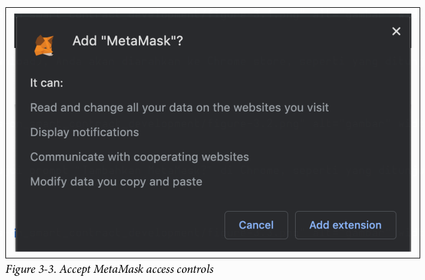
</p>

Jika terinstal dengan benar, Anda akan diarahkan ke sebuah halaman yang meminta Anda untuk menyiapkan MetaMask, seperti yang ditunjukkan pada Gambar 3-4.

<p align="center">
  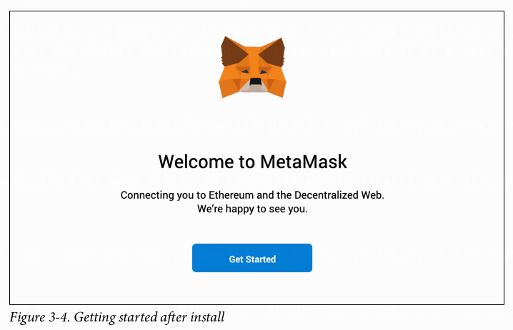
</p>

As part of the setup, we’re going to create a new wallet on MetaMask. We’ll click the
button on the right in Figure 3-5 labeled Create a Wallet.

<p align="center">
  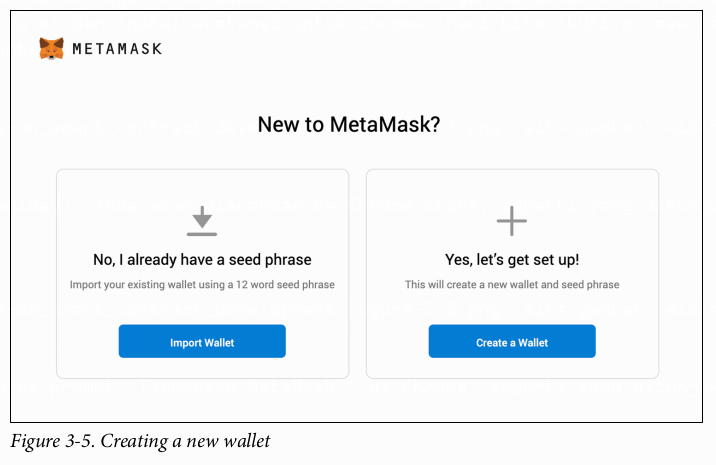
</p>

Pada Gambar 3-6, Anda diminta untuk membuat password. Pastikan untuk membuat password yang sulit; lebih baik lagi, gunakan pengelola password (password manager) untuk membuatnya untuk Anda. Jika seseorang berhasil menebak password Anda di komputer Anda, mereka akan mendapatkan akses ke kunci privat (private keys) Anda dan dengan itu mereka dapat mengirimkan transaksi dari EOA Anda.

<p align="center">
  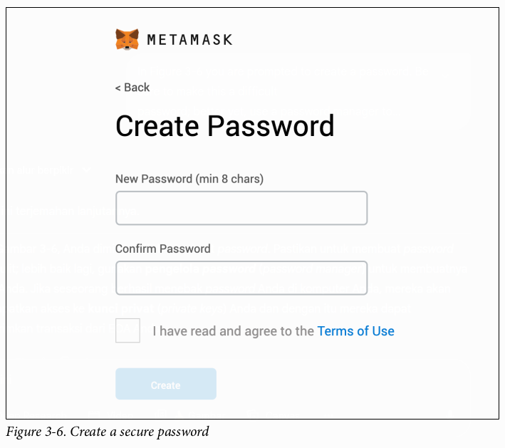
</p>

Selanjutnya pada Gambar 3-7, Anda akan melihat sebuah area yang dapat diklik, yang akan menampilkan frasa pencadangan rahasia (secret backup phrase). Tuliskan frasa ini di selembar kertas dan amankan di lokasi yang aman. Jika Anda menggunakan pengelola password, simpan juga frasa ini di sana.

<p align="center">
  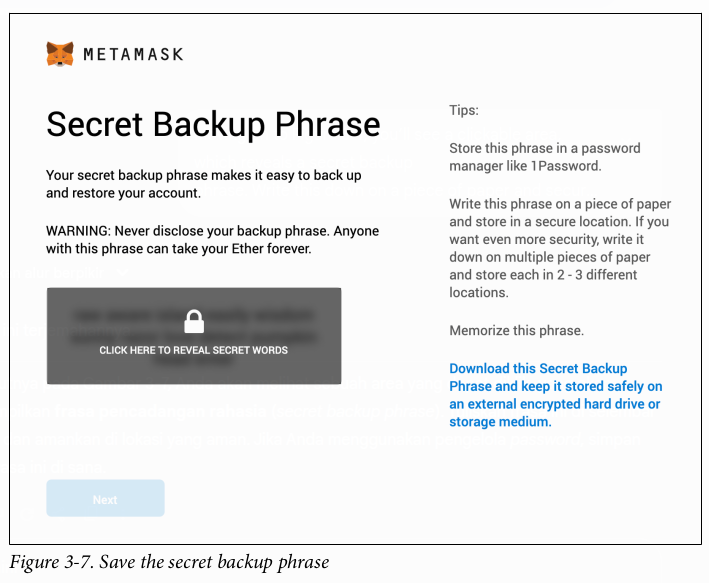
</p>

Setelah Anda menyimpan frasa pencadangan Anda, klik **Berikutnya** (*Next*) dan Anda akan dibawa ke halaman yang ditunjukkan pada Gambar 3-8. Di sini, Anda perlu memilih kata-kata tersebut satu per satu. Ini adalah pengingat kecil yang baik dari MetaMask untuk memastikan Anda menyimpannya!

<p align="center">
  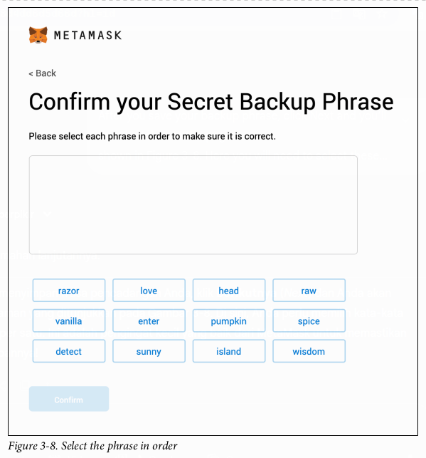
</p>

Setelah Anda menyelesaikan penyiapan, Anda akan diarahkan ke halaman pada Gambar 3-9.

<p align="center">
  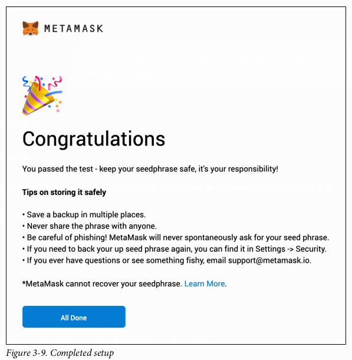
</p>

Sekarang, jika Anda memilih ekstensi MetaMask di peramban (*browser*) Anda, Anda akan dapat melihat dompet (*wallet*) dan alamat baru Anda, seperti yang ditunjukkan pada Gambar 3-10.

<p align="center">
  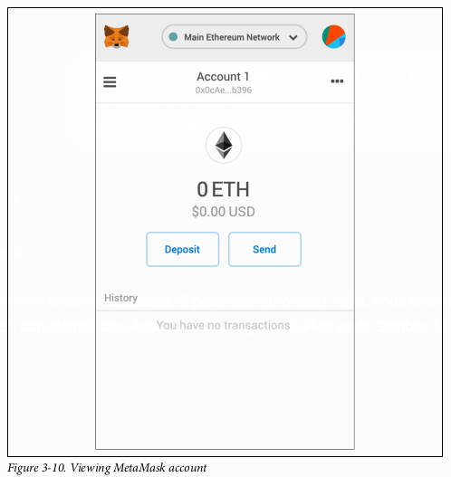
</p>

Dengan MetaMask terinstal, kini Anda dapat mulai berinteraksi dengan **aplikasi terdesentralisasi** (*decentralized applications* atau DApps) yang sudah ada langsung dari peramban Anda. Jika Anda ingin menjelajahi beberapa *game* atau aplikasi lain, pastikan untuk mampir ke [State of the DApps](https://www.stateofthedapps.com/).

Setelah Anda selesai menjelajahi beberapa pilihan, saatnya menginstal Node.js untuk alat-alat berbasis JavaScript yang akan kita butuhkan dalam pengembangan *smart contract*.

## Menginstal Node.js

Suka atau tidak, bahasa kecil dari web ini telah menjadi salah satu bahasa yang paling ada di mana-mana (*ubiquitous*) dalam dunia perangkat lunak, dan Ethereum pun tidak luput dari jangkauannya. Faktanya, alat pengembangan utama yang akan kita gunakan untuk mengembangkan *smart contract* atau berinteraksi dengan jaringan Ethereum telah dibangun menggunakan JavaScript, yang berarti kita memerlukan **Node.js** untuk menyediakan lingkungan *runtime* JavaScript.

### Instalasi Ubuntu (Termasuk Windows WSL Ubuntu)

Pengguna Ubuntu, termasuk yang menggunakan Windows WSL, dapat menggunakan perintah berikut untuk menginstal Node.js:

```bash
$ curl -sL https://deb.nodesource.com/setup_10.x | sudo -E bash -
$ sudo apt-get install -y nodejs
```

Perintah `curl` akan mulai menjalankan skrip yang akan mempersiapkan segalanya bagi manajer paket (*package manager*) untuk menginstal Node.js, dan akan memiliki output yang dimulai dengan contoh berikut:

```
## Installing the NodeSource Node.js 10.x repo...
## Populating apt-get cache...
+ apt-get update
Hit:1 http://security.ubuntu.com/ubuntu bionic-security InRelease
Hit:2 http://archive.ubuntu.com/ubuntu bionic InRelease
Hit:3 http://archive.ubuntu.com/ubuntu bionic-updates InRelease
Hit:4 http://archive.ubuntu.com/ubuntu bionic-backports InRelease
Reading package lists... Done
...
```

Perintah `apt-get` kemudian akan menginstal paket tersebut beserta dependensinya ke sistem Anda. Setelah ini selesai, jalankan perintah berikut:

```bash
$ node -v
```

Ini akan memverifikasi bahwa Anda sudah siap dengan Node.js 10.16.2.

> Perintah instalasi di atas mengasumsikan bahwa paket-paket berikut telah terinstal sebelumnya di sistem:
>
>   * `curl`
>   * `gcc`
>   * `g++`
>   * `make`

## Menginstal Truffle Suite

Kita berada di tahap akhir dalam menyiapkan mesin kita untuk pengembangan *smart contract*. Dua hal berikutnya yang akan kita instal adalah bagian dari **Truffle Suite**: Truffle dan Ganache.

### Truffle

Meskipun Truffle sering disebut sebagai sebuah *framework*, ia sebenarnya lebih mirip seperti **sabuk utilitas *blockchain***. Truffle menyediakan alat yang membuat proses mengompilasi, menguji, menerapkan (*deploy*), dan mengemas aplikasi Anda menjadi semudah mungkin. Utilitas ini bergantung pada struktur direktori yang dihasilkan—di sinilah aspek *framework* berperan—dan CLI Truffle.

Truffle didistribusikan sebagai paket npm. Untuk menginstalnya, jalankan perintah berikut:

```bash
$ npm install -g truffle
```

Setelah menjalankan perintah ini, Anda akan melihat output berikut:

```
/usr/local/bin/truffle -> /usr/local/lib/node_modules/truffle/build/cli.bundled.js
> truffle@5.0.31 postinstall /usr/local/lib/node_modules/truffle
> node ./scripts/postinstall.js
- Fetching solc version list from solc-bin. Attempt #1
- Downloading compiler. Attempt #1
+ truffle@5.0.31
added 27 packages from 439 contributors in 22.559s
```

Karena kita menggunakan *flag* `-g` saat menjalankan perintah instalasi, output tersebut memberi tahu kita di mana menemukan *symlink* yang membuat *executable* ini tersedia secara global.

Untuk memastikan semuanya berfungsi, jalankan perintah berikut:

```bash
$ truffle -v
```

Ini seharusnya menunjukkan bahwa Anda menggunakan versi 5.0.31 dan akan menampilkan daftar perintah yang tersedia.

Dengan Truffle terinstal, hal terakhir yang perlu kita lakukan adalah menambahkan Ganache.

### Ganache

Ganache adalah **\*blockchain\* pribadi Anda**. Dalam banyak hal, Ganache sangat mirip dengan klien Ethereum yang kita unduh sebelumnya. Ia menyediakan alat untuk membuat akun dan menjalankan *server* API JSON RPC agar Anda dapat terhubung dan membaca/menulis ke *blockchain*.

Perbedaan utamanya adalah Ganache tidak benar-benar terhubung ke jaringan Ethereum; bahkan, versi lama akan menghapus semua data saat Anda mematikannya sehingga Anda memulai dengan lembaran baru yang bersih saat menyalakannya kembali.

Versi lengkap Ganache dilengkapi dengan GUI (*Graphical User Interface*) yang menyediakan kontrol untuk memperbarui pengaturan konfigurasi dan untuk menjelajahi blok, transaksi, dan *log*. Anda juga dapat menginstal versi Ganache khusus CLI melalui npm, tetapi untuk saat ini kita akan menginstal versi lengkapnya.

Buka halaman [Ganache](https://trufflesuite.com/ganache/) dan akan ada tombol untuk mengunduh versi yang sesuai untuk OS Anda, seperti yang terlihat pada Gambar 3-11.

<p align="center">
  
</p>

Setelah instalasi selesai, jalankan aplikasinya dan Anda akan melihat **tampilan awal** seperti pada Gambar 3-12.

Dengan terpasangnya komponen terakhir ini, kita memiliki semua yang dibutuhkan untuk mulai mengembangkan ***smart contract***.

<p align="center">
  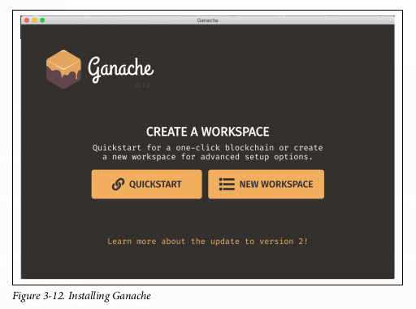
</p>

## Ringkasan

Dalam bab ini, kita telah menyiapkan **lingkungan lokal** untuk pengembangan *blockchain*. Ini mencakup penyiapan klien Ethereum penuh dengan **Parity**, yang termasuk menyinkronkan jaringan uji (*test network*) **Goerli**. Kita juga menginstal *plug-in* Chrome **MetaMask** untuk berinteraksi dengan DApps dari peramban kita. Kemudian, kita menginstal lingkungan JavaScript yang dibutuhkan untuk alat-alat *smart contract* kita dengan menggunakan **Node.js**. Terakhir, kita menginstal **Truffle** dan **Ganache** dari **Truffle Suite**, yang memberi kita semua yang dibutuhkan untuk pengembangan *smart contract*.

Di bab berikutnya, kita akan mengembangkan sebuah aplikasi kecil untuk menjelajahi perangkat (*toolset*) **Truffle** dan bahasa pemrograman **Solidity**.
