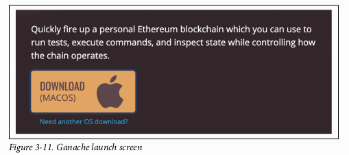

# BAGIAN I
## Pengantar Blockchain Ethereum

Buku ini berfokus secara spesifik untuk membantu Anda belajar mengembangkan *smart contract* di Ethereum. Fokus ini mengharuskan kita untuk membahas sebagian dari protokol Ethereum, bahasa pemrograman Solidity, dan Ethereum Virtual Machine. Untuk pemahaman yang lebih mendalam dan komprehensif tentang Ethereum, kami merekomendasikan buku *Mastering Ethereum* oleh Andreas M. Antonopoulos dan Gavin Wood. Meskipun begitu, agar dapat mengembangkan *smart contract* secara efektif, sangat penting bagi Anda untuk memahami konsep-konsep dasar *smart contract* tertentu. Kami akan membahas konsep-konsep tersebut dengan detail yang sekadarnya agar kita tidak membuang waktu dan Anda bisa segera masuk ke mode membangun (*builder mode*). Kami ingin Anda segera men-*deploy* *smart contract* pertama Anda sesegera mungkin. Kami tahu pendekatan ini adalah cara yang paling andal bagi orang-orang untuk mempelajari teknologi baru.

---

# BAB 1
## Konsep-Konsep Blockchain

Pada dasarnya, **blockchain** adalah sebuah struktur data. Ia adalah sebuah *linked list*, atau rantai, dari “blok-blok” yang unik. Setiap blok menunjuk ke blok sebelumnya, dan blok itu sendiri merupakan sebuah daftar transaksi. Di atas struktur data daftar-di-dalam-daftar yang relatif sederhana ini, diletakkan inovasi kunci yang diberikan oleh *blockchain*: sebuah protokol tentang bagaimana blok ditambahkan ke dalam rantai tanpa adanya otoritas pusat. Gambar 1-1 mengilustrasikan struktur ini.

*Cryptocurrency* yang muncul bersama *blockchain* adalah sarana untuk mencapai tujuan, yaitu menyediakan insentif bagi orang-orang untuk menjalankan perangkat lunak yang mengamankan jaringan. Untuk pertama kalinya dalam sejarah, kita memiliki kemampuan untuk berbagi informasi digital tanpa perlu mempercayai individu, pemerintah, organisasi, atau perusahaan mana pun untuk memfasilitasi interaksi tersebut. Ethereum menyediakan platform yang aman secara kriptografis untuk menyimpan, memperbarui, dan menghapus data dari *blockchain* menggunakan apa yang disebut sebagai “*smart contract*”. Kita masih berada di masa-masa awal dalam mempelajari cara menggunakan *smart contract* untuk memperbaiki berbagai hal di dunia nyata, dan sulit untuk memprediksi bagaimana teknologi ini akan digunakan di masa depan. Mirip dengan “World Wide Web” pada tahun 1990-an, telah terjadi gelombang global para pemecah masalah yang inspiratif dan kreatif yang bekerja setiap hari untuk men-*deploy* **aplikasi terdesentralisasi (DApps)** yang mereka harap akan “memberi dampak di alam semesta” (*make a dent in the universe*).

<p align="center">
  
</p>

Sebagian besar isi buku ini akan berfokus pada bahasa pemrograman **Solidity** dan pengembangan *smart contract*. Solidity adalah bahasa pemrograman populer untuk mengembangkan *smart contract*, dan dirancang untuk berjalan di **Ethereum Virtual Machine (EVM)**. Solidity bukanlah bahasa pemrograman pertama yang berjalan di EVM, dan tentunya bukan yang terakhir. Banyak bahasa lain, seperti Vyper, akan ditulis untuk berjalan di EVM, dengan tujuan untuk menyempurnakan desain Solidity atau menyediakan bahasa spesifik-domain (*domain-specific languages*) yang kuat. Sebelum kita mendalami dunia *smart contract* yang revolusioner, kita perlu meletakkan fondasi konseptual untuk Anda bangun. Mengingat sifat unik dari eksekusi kode di *blockchain* secara historis, sangat penting bagi para pengembang untuk memiliki pemahaman yang cukup tentang bagaimana semua bagian saling terhubung di balik abstraksi yang kuat yang disediakan oleh Ethereum.

## Sejarah Singkat 📜

Konsep "blockchain" lahir dari [white paper Bitcoin](https://bitcoin.org/bitcoin.pdf) yang diterbitkan pada tahun 2008 oleh sosok pseudonim **Satoshi Nakamoto**. Meskipun istilah "blockchain" sebenarnya tidak muncul dalam tulisan tersebut, konsepnya diartikulasikan secara ringkas. Transaksi pertukaran nilai masuk ke dalam jaringan *peer-to-peer*, dan secara berkala dikelompokkan ke dalam "blok", atau daftar. Ketika sebuah "blok" transaksi disimpan secara permanen, blok tersebut "dirantai" (*chained*) ke blok sebelumnya. Struktur data yang hanya bisa ditambah (*append-only*) ini dan protokol yang membangunnya menciptakan sebuah catatan transaksi yang tidak dapat diubah (*immutable*).

Peluncuran Bitcoin pada awal 2009 menandai dimulainya jaringan *blockchain* publik. Sejak saat itu, tak terhitung banyaknya *cryptocurrency* yang mencoba membangun di atas kesuksesan Bitcoin sebagai bentuk mata uang baru. Banyak pengguna awal Bitcoin menyadari bahwa properti dari *blockchain* memiliki aplikasi di luar transaksi keuangan. Komunitas-komunitas pun bermunculan untuk mencoba memperluas, melakukan *fork*, dan membangun di atas Bitcoin untuk mengembangkannya ke arah yang sebelumnya tidak terpikirkan. Namun pada akhirnya, protokol Bitcoin sengaja dibuat terbatas dan tidak cocok untuk diperluas. Seorang jenius *blockchain*, **Vitalik Buterin**, membuat keputusan ambisius untuk berhenti mencoba memperluas Bitcoin dan sebaliknya menciptakan protokol yang lebih serbaguna dari awal. Pada tahun 2013, Vitalik menulis [white paper Ethereum](https://github.com/ethereum/wiki/wiki/White-Paper).

Ketika Ethereum diluncurkan pada tahun 2015, ia dengan cepat menjadi salah satu *cryptocurrency* paling berharga di planet ini, nomor dua setelah Bitcoin. Pasar menilai Ethereum sangat berharga karena ia menyediakan sebuah platform untuk men-*deploy* dan menjalankan *smart contract* di *blockchain* publik. Istilah "*smart contract*" diciptakan oleh [Nick Szabo pada tahun 1994]http://bit.ly/szabo-sc. Gagasannya saat itu adalah bahwa banyak kontrak hukum, notaris, dan perjanjian analog lainnya dapat ditegakkan secara nyaris otomatis menggunakan protokol digital dan tanda tangan kriptografis.

Meskipun konteks historis ini ada, implementasi *smart contract* di Ethereum sebenarnya lebih terasa seperti pemrograman serbaguna daripada sesuatu yang spesifik untuk kontrak hukum. Mesin virtual sebagaimana didefinisikan oleh protokol Ethereum adalah ***Turing-complete***. Ini berarti selama Anda dapat menyesuaikan komputasi Anda di dalam batasan dari satu blok tunggal, para pengembang *smart contract* hanya memiliki sedikit batasan lain untuk dihadapi selain imajinasi mereka sendiri.

Bagaimana sebuah *blockchain* berbeda dari teknologi yang mungkin pernah Anda gunakan sebelumnya? Di bagian selanjutnya, mari kita bahas apa yang membuat *blockchain* unik.

## Karakteristik Sebuah Blockchain

Banyak pengembang perangkat lunak pernah bekerja dengan *technology stack* yang mencakup 1) antarmuka pengguna seluler asli dan/atau antarmuka pengguna web 2) dengan bahasa pemrograman sisi server yang pada akhirnya berinteraksi dengan 3) sebuah basis data. Dalam versi paling dasar dari sistem-sistem ini, interaksi dengan basis data pada dasarnya bersifat instan dan permanen.

Seperti basis data yang lebih umum, *blockchain* dapat menyimpan data arbitrer, tetapi keduanya memiliki sedikit kesamaan lain. Menjadi pengembang *smart contract* yang kompeten berarti memahami karakteristik sebuah *blockchain*. Seseorang tidak bisa begitu saja memperlakukan Solidity seperti bahasa pemrograman sisi server; Anda akan cepat merasa tersesat dan frustrasi. Tidak seperti basis data pada umumnya, interaksi bahkan dengan sistem *smart contract* yang paling dasar sekalipun tidaklah instan dan tidak dijamin permanen.

Berbeda dengan basis data biasa, yang merupakan satu program yang berjalan di satu komputer, sebuah **blockchain** biasanya terdiri dari banyak **node** dalam jaringan di seluruh dunia. Ketika kita merujuk pada "node" dalam konteks *blockchain*, kita merujuk pada perangkat lunak yang telah dipasang seseorang di komputer dan terhubung ke jaringan *blockchain*. Sama seperti ada banyak implementasi perangkat lunak yang berbeda dari protokol HTTP (Apache, NGINX) yang disebut "*web server*", ada banyak implementasi perangkat lunak dari protokol Ethereum (geth, Parity) yang disebut node Ethereum.

Selanjutnya, mari kita bahas bagaimana kita dapat menggunakan jaringan untuk terhubung dengan *blockchain*.

## Jaringan Terdesentralisasi

Untuk bekerja dengan basis data biasa, kita memerlukan koneksi basis data dan hak yang cukup untuk memperbaruinya. Dalam kasus yang paling sederhana, hanya ada satu basis data yang harus dihadapi, jadi kita memerlukan satu alamat IP untuk membuat koneksi. Seluruh sistem bergantung pada ketersediaan basis data tersebut. Jika basis data itu rusak atau kehilangan konektivitas, atau jika hak kita dicabut, aplikasi akan berhenti bekerja. Inilah yang disebut sebagai **sistem terpusat**.

*Blockchain* dirancang untuk berjalan di atas **jaringan terdesentralisasi**. Orang-orang dan perusahaan menjalankan node di jaringan, dan, dalam banyak hal, semua node adalah rekan sejawat (*peers*). Hal ini dimungkinkan karena setiap node berisi riwayat lengkap dari setiap transaksi yang pernah terjadi di *blockchain*. Dengan setiap node sebagai entitas yang mandiri dan independen, tidak ada pusat di jaringan tersebut. Semua node memvalidasi transaksi dan menyebarkannya ke rekan-rekan mereka. Di atas semua itu, beberapa node juga berpartisipasi dalam proses pembuatan blok, dan diberi insentif finansial untuk melakukannya melalui penerimaan "*block reward*" dalam *cryptocurrency* asli *blockchain* tersebut. Berbeda dengan contoh basis data kita, node mana pun dalam jaringan terdesentralisasi dapat bergabung atau keluar sesuka hati. Tidak ada izin atau hak khusus yang diperlukan untuk membaca atau menulis ke *blockchain* selama protokolnya diikuti.

Tanpa adanya basis data tunggal yang terpusat untuk dihubungkan, bagaimana node menemukan koneksi ke jaringan? Banyak pengembang *smart contract* menghindari masalah ini dan menggunakan layanan yang menyembunyikan kompleksitas ini di balik API web. Itu adalah sebuah pertukaran (*tradeoff*) antara mengaitkan sistem Anda dengan layanan pihak ketiga dan kompleksitas menjalankan node Ethereum Anda sendiri. Jika Anda memilih untuk menjalankan node Anda sendiri, ia perlu melakukan *bootstrap* dan terhubung ke jaringan Ethereum publik. Setiap perangkat lunak node Ethereum utama memiliki daftar "*bootnode*" yang sudah di-*hardcode*. Ini adalah alamat-alamat IP yang terkenal dan relatif andal yang dapat digunakan untuk membuat kumpulan koneksi rekan jaringan yang cukup besar. Jika karena suatu alasan node-node tersebut tidak tersedia atau tidak lagi dapat dipercaya, perangkat lunak node dapat diberikan daftar *bootnode* kustom untuk digunakan.

Pada tahun 2019, jaringan Ethereum publik global memiliki lebih banyak node daripada jaringan *blockchain* lainnya. Dengan lebih dari 12.000 node, kecil kemungkinannya ada dua node yang memiliki himpunan rekan yang sama persis. Saat sebuah transaksi masuk ke jaringan melalui satu rekan, transaksi itu menyebar dengan cepat ke seluruh dunia ke setiap node. Demikian pula, ketika sebuah blok baru ditambahkan ke *blockchain*, berita tentang penambahan ini menyebar dengan cepat. Sayangnya, cepat tidak sama dengan instan, yang berarti bahwa ketika dua blok dibuat pada saat yang sama oleh dua node yang berbeda, rekan-rekan masing-masing dari node yang berbeda itu akan beroperasi pada dua versi *blockchain* yang berbeda. Ini disebut ***fork* sementara**. Secara umum, *fork* sementara diselesaikan dengan memberikan prioritas kepada *fork* mana pun yang menambahkan blok berikutnya, yang diringkas sebagai "**rantai terpanjang yang menang**" (*longest chain wins*). Aturan-aturan ini ditentukan oleh protokol konsensus sebuah *blockchain*.

## Protokol Konsensus 🤝

Tanpa sumber kebenaran yang terpusat, node-node dalam jaringan *blockchain* memerlukan cara untuk mencapai konsensus mengenai keadaan sistem. **Protokol konsensus** adalah cara hal ini dicapai, dan merupakan bidang penelitian yang aktif. Protokol konsensus hanyalah sebuah sistem kesepakatan di seluruh *blockchain*. Ada tiga protokol yang perlu kita bahas, dan kita akan mulai dengan **Proof-of-Work**, yang digunakan Ethereum saat mereka meluncurkan *blockchain* mereka.

### Proof-of-Work

Ketika Anda mendengar tentang "*mining ether*" atau "*cryptomining*", terminologi ini disebabkan oleh sifat protokol **Proof-of-Work (PoW)**. Seperti seorang penambang yang mencari emas, protokol PoW untuk membuat sebuah blok memerlukan upaya yang cukup besar, dan semakin banyak upaya yang Anda keluarkan, semakin besar kemungkinan Anda untuk "menambang sebuah blok". Juga mirip dengan penambang yang mencari emas, "penambangan" PoW bersifat kompetitif. Setiap blok Ethereum berisi hadiah blok (*block reward*) dalam mata uang Ethereum, yang dikenal sebagai "*ether*". Hadiah ini diberikan kepada penambang yang berhasil menambahkan blok yang valid ke *blockchain* sebelum penambang lainnya. Penambang berhasil dengan cara melakukan "*hashing*" data blok secara berurutan dalam upaya menemukan *hash* kriptografis yang memiliki karakteristik spesifik. Protokol menentukan kelangkaan "*hash*" ini. Kelangkaan ini disebut "***difficulty***", yaitu angka yang menentukan upaya relatif yang harus dikeluarkan penambang untuk "menambang sebuah blok".

Proof-of-Work menggunakan variabel *difficulty* untuk mempertahankan waktu blok (*block time*) yang stabil saat penambang datang dan pergi, menambah atau mengurangi kekuatan penambangan keseluruhan (atau ***hashrate***) jaringan. Misalnya, jika jaringan Ethereum memiliki *hashrate* kumulatif 100 tera hash per detik, dan sebuah *mining pool* besar *offline*, menurunkan *hashrate* kumulatif menjadi 90 TH/s, blok tiba-tiba akan memakan waktu rata-rata 10% lebih lama untuk ditambang. Protokol Ethereum menyesuaikan *difficulty* untuk memastikan bahwa waktu blok yang benar ditargetkan. Dalam kasus ini, protokol akan menyesuaikan dengan membuat penemuan blok sekitar 10% lebih mudah. Proses ini berarti bahwa jika terjadi perubahan signifikan pada *hashrate* jaringan, waktu blok akan terpengaruh. Selain itu, karena sifat proses penambangan yang bersifat *brute-force*, keacakan akan selalu menjadi sumber perbedaan dalam waktu blok, bahkan jika *hashrate* jaringan tetap konstan.

### Proof-of-Stake

**Proof-of-Stake (PoS)** selalu ada dalam peta jalan (*roadmap*) Ethereum. Jika dirancang dengan benar, PoS memiliki keuntungan signifikan dibandingkan PoW. Pertama, tidak perlu membakar sejumlah besar listrik untuk menemukan blok yang valid. Seperti namanya, tidak ada "pekerjaan" (*work*) yang harus dilakukan, hanya "taruhan" (*stake*) yang bisa hilang. Kedua, kerugian menjadi pelaku jahat dalam sistem PoS bisa jauh lebih parah daripada di PoW. Pembuat blok mempertaruhkan (*stake*) ether untuk berpartisipasi, dan jika mereka terbukti beroperasi dengan niat jahat, taruhan itu dapat diambil ("di-*slashed*"). Di PoW, operator jahat dapat diabaikan, tetapi kita tidak dapat mengambil perangkat keras mereka. Aset itu tetap ada untuk merusak di lain hari. Terakhir, ada lebih sedikit skala ekonomi di PoS. Ketika seorang penambang PoW mendapatkan hadiah blok, mereka dapat menggunakan uang itu untuk mencapai keuntungan non-linear atas penambang lain, seperti konektivitas jaringan yang lebih cepat. Di PoS, meskipun orang dengan taruhan lebih banyak akan mendapatkan lebih banyak ether, keuntungan itu bersifat linear. Yang kaya tetap menjadi lebih kaya, tetapi tidak secara eksponensial. Meskipun begitu, di PoW untuk mendapatkan mata uang, Anda dapat membeli perangkat keras dan terhubung ke jaringan, sedangkan di PoS Anda harus membeli dari pemegang mata uang yang ada, yang memberikan kerugian bagi pendatang baru.

Bagi pengembang *smart contract*, perilaku PoS mirip dengan PoW. Kita masih perlu menentukan kapan kita menganggap finalitas transaksi, karena pembuat blok (disebut "*proposer*" di PoS) masih bisa berakhir di *fork* yang berbeda karena partisi jaringan. Hal yang akan menjadi sangat berbeda adalah ketika Ethereum bertransisi ke *blockchain* yang di-*shard* (*sharded*). Di bawah nama proyek "**Serenity**", Ethereum memperkenalkan Proof-of-Stake, *sharding*, dan beberapa perbaikan lainnya sebagai cara untuk menyelesaikan masalah penskalaan fundamental Ethereum.¹ Serenity juga akan menggantikan EVM yang ada dengan **eWASM** (*Ethereum flavored WebAssembly*). Tidak ada dari inisiatif ini yang seharusnya memiliki efek signifikan pada bahasa Solidity. Satu-satunya komplikasi baru yang signifikan adalah komunikasi antar-kontrak. Saat ini, setiap node memiliki setiap *smart contract* Ethereum yang pernah di-*deploy*, jadi cukup mudah bagi node untuk berinteraksi. Tetapi begitu kita memiliki *blockchain* yang di-*shard*, kontrak akan tersebar di 1000+ *blockchain* terpisah. Protokol tentang bagaimana kontrak-kontrak ini akan berinteraksi masih sedang dikembangkan, tetapi dapat dipastikan bahwa pengembang *smart contract* tidak akan lagi dapat mengasumsikan bahwa kontrak arbitrer mana pun akan tersedia bagi mereka secara sinkron. Lebih jauh lagi, setiap alamat Ethereum perlu memiliki ID *shard* yang terkait dengannya untuk mengetahui di mana statusnya disimpan.

### Proof-of-Authority

Dalam beberapa situasi, mungkin masuk akal untuk menggunakan *blockchain* sambil membatasi pembuatan blok hanya untuk entitas tertentu. Situasi-situasi ini bertentangan dengan kasus penggunaan umum yang terbuka untuk publik. Status pembuat blok yang dibatasi semacam ini disediakan oleh protokol **Proof-of-Authority (PoA)**. PoA umumnya digunakan untuk *blockchain* pribadi yang tersembunyi di dalam jaringan internal. Para pembuat blok hanya bergiliran menambahkan blok berikutnya pada frekuensi yang benar. Karena sifat *round-robin* dari PoA, *fork* sementara jauh lebih kecil kemungkinannya terjadi.

Ada banyak lagi protokol konsensus, tetapi itu di luar cakupan buku ini. Ini adalah area penelitian yang aktif, jadi harapkan untuk melihat protokol konsensus baru muncul di tahun-tahun mendatang.

Terlepas dari protokol mana yang digunakan, ada hadiah untuk setiap node yang menambahkan blok baru ke *blockchain*. Pembuat blok menerima hadiah blok serta jumlah semua biaya transaksi di dalam blok tersebut. Di Ethereum, biaya transaksi disebut sebagai "**gas**". Kita akan membahas lebih dalam tentang topik gas nanti di bab ini.

Untuk tujuan buku ini, kita tidak perlu memahami mekanisme protokol konsensus. Penting hanya untuk mengetahui peran yang dimainkan protokol-protokol ini dalam *blockchain*, dan memahami perbedaan antara protokol yang paling populer. Pengembang *smart contract* pada dasarnya dapat memperlakukan protokol konsensus seperti sebuah *black box*. Kita perlu mempelajari perilaku eksternal setiap kotak, tetapi bagian dalamnya tidak berpengaruh pada pekerjaan kita.

Sekarang kita akan berusaha memahami bagaimana transaksi pada akhirnya ditambahkan ke *blockchain*.

## Pemrosesan Transaksi ⚙️

Pada tahun 2019, sebuah blok transaksi baru ditambahkan ke *blockchain* Ethereum kira-kira setiap 13 detik, rata-rata. Meskipun begitu, sampel waktu blok selama rentang 65 jam (antara blok 8.662.243 dan 8.679.755) berisi sebuah blok yang membutuhkan lebih dari 2 menit untuk ditulis ke rantai (blok 8.674.540) dan yang lainnya hanya membutuhkan 1 detik. Variasi waktu blok yang lebar ini disebabkan oleh sifat acak dari Proof-of-Work. Seiring transisi Ethereum ke Proof-of-Stake, kita berharap akan melihat waktu blok dan variabilitas waktu blok menurun.

Meskipun waktu blok diatur oleh protokol, waktu sebenarnya yang dibutuhkan sebuah transaksi, dari saat pertama kali disiarkan di jaringan hingga eksekusinya dalam sebuah blok, dapat bervariasi dari beberapa detik hingga beberapa jam. Variabilitas ini disebabkan oleh keterbatasan protokol Ethereum saat ini yang dikombinasikan dengan popularitasnya. Misalnya, jika Ethereum dapat memproses sekitar 25 transaksi per detik, tetapi ada lebih dari 30 transaksi yang masuk ke jaringan setiap detiknya, maka akan ada transaksi yang tetap tidak dieksekusi sampai permintaan jaringan melambat hingga di bawah 25 transaksi per detik. Transaksi yang tertunda ini disimpan dalam memori oleh setiap node Ethereum dalam apa yang disebut "**mempool**". Cara yang paling andal untuk dengan cepat mengeluarkan transaksi dari *mempool* dan memasukkannya ke dalam blok adalah dengan membayar lebih banyak biaya kepada pembuat blok. Di Ethereum, biaya ini disebut "**gas**", dan sebagai pengembang *smart contract*, Anda harus sering mempertimbangkan "**harga gas**" (*gas prices*). Lihat lebih lanjut tentang topik gas dan harga gas pada Gambar 1-2.

<p align="center">
  
</p>

Jika akun yang sama memiliki dua transaksi di dalam *mempool*, para pembuat blok tahu transaksi mana yang harus dipilih terlebih dahulu berdasarkan “**nonce**”-nya, yaitu sebuah penghitung khusus untuk setiap akun yang nilainya bertambah pada setiap transaksi. Ini berarti bahwa meskipun *mempool* pada umumnya adalah sebuah tumpukan transaksi yang dapat dipilih oleh pembuat blok, sebenarnya ia lebih seperti tumpukan antrean (*a heap of queues*) dalam kasus di mana sebuah akun telah mengirimkan beberapa transaksi sebelum melihatnya berhasil. Gambar 1-3 menunjukkan bagaimana transaksi dari setiap akun diurutkan berdasarkan *nonce*-nya.

<p align="center">
  
</p>

Terlepas dari apakah sebuah transaksi tertunda karena sifat protokol atau karena **kepadatan jaringan**, sebagai seorang pengembang, Anda perlu mempertimbangkan **sifat yang tidak dapat diprediksi dan asinkron** dari pengalaman pengguna dengan sistem perangkat lunak Anda. Di dunia di mana perangkat lunak keuangan, perdagangan, dan media sosial telah disesuaikan untuk menerima transaksi dalam waktu kurang dari satu detik, sistem yang didukung oleh *smart contract* memiliki **tantangan pengalaman pengguna (UX)** yang signifikan. Bagian selanjutnya akan menggali lebih dalam mengenai tantangan-tantangan ini.

## Finalitas Transaksi ✅

Ketika Anda berhasil mengeksekusi sebuah transaksi di basis data biasa, para pengembang mengasumsikan bahwa efeknya tidak akan pernah dibatalkan (*rolled back*). Namun, dalam kasus *blockchain*, ada kemungkinan seorang pengguna dapat melihat transaksi yang berhasil dimasukkan ke dalam sebuah blok, hanya untuk kemudian melihat blok tersebut segera **di-orphan** (menjadi yatim piatu) dan digantikan dengan blok yang berbeda. Blok baru ini mungkin tidak menyertakan transaksi yang sebelumnya berhasil!

Kurangnya **finalitas** pada transaksi *blockchain* ini disebabkan oleh sifat jaringan yang terdesentralisasi. Ada kemungkinan dua node yang berbeda membuat blok hampir secara bersamaan, dan rekan-rekan mereka masing-masing berada di “*fork*” *blockchain* yang berbeda, seperti yang disebutkan sebelumnya. Rantai mana pun yang membuat blok berikutnya lebih dulu akan mengalahkan *fork* yang lain, dan transaksi yang sebelumnya berhasil dapat menghilang dalam prosesnya. Dari sudut pandang pengguna, tampaknya transaksi mereka yang tadinya berhasil menjadi **di-revert** (dibatalkan). Gambar 1-4 hingga 1-6 mengilustrasikan masalah ini.

<p align="center">
  
</p>

<p align="center">
  
</p>

<p align="center">
  
</p>

Masalah ini dapat diselesaikan dengan menunggu blok-blok tambahan ditambahkan ke dalam rantai sebelum menganggap transaksi tersebut selesai (*settled*). Setiap aplikasi perlu memiliki ambang batasnya sendiri untuk menganggap sebuah transaksi bersifat final. Bursa *cryptocurrency* populer akan menunggu hingga 50 blok agar sebuah transaksi dianggap "**terkonfirmasi**" di jaringan Ethereum. Ketika taruhannya lebih rendah, tidak perlu menunggu selama itu. Setiap aplikasi harus mempertimbangkan berapa lama ia ingin menunggu untuk menganggap transaksi bersifat final. Dalam beberapa kasus, "konfirmasi" ini akan dibangun ke dalam pengalaman pengguna, dan dalam kasus lain, mungkin hanya berupa peringatan umum bahwa tidak semua transaksi bersifat final.

Sekarang setelah kita membahas *fork* sementara, mari kita bicarakan tentang saudaranya yang lebih permanen.

## Hard Fork ⛓️

Setiap node dalam jaringan *blockchain* harus menjalankan perangkat lunak yang kompatibel dengan protokol agar dapat berpartisipasi dalam penyebaran blok dan transaksi serta pembuatan blok baru. Komunitas pengembang node *blockchain*, pengembang protokol, pembuat blok, bursa, dan pengembang aplikasi semuanya memberikan masukan tentang bagaimana protokol sebaiknya berevolusi untuk memenuhi kebutuhan komunitas. Pada akhirnya, evolusi ini terjadi melalui pengembang yang mengubah perangkat lunak node *blockchain*, dan orang-orang yang menjalankan perangkat lunak node tersebut (yang kita sebut "**operator node**") memilih apakah akan menggunakan versi baru atau tidak. Terkadang, perubahan yang dibuat pada protokol sangat signifikan sehingga versi baru tidak kompatibel dengan versi perangkat lunak sebelumnya. Situasi ini disebut "**hard fork**" karena sebuah *blockchain* baru akan muncul dari yang lama, menciptakan sebuah persimpangan jalan bagi para operator node, yang harus memutuskan sendiri *fork* mana yang akan mereka dukung.

*Hard fork* bisa bersifat **kontroversial** atau **non-kontroversial**. *Hard fork* non-kontroversial terjadi ketika seluruh komunitas melakukan pembaruan, secara efektif meninggalkan *fork* lama untuk yang baru. Ini tipikal terjadi ketika ada cacat serius yang ditemukan dalam protokol. *Hard fork* kontroversial terjadi ketika sejumlah besar operator node memutuskan untuk terus menggunakan *fork* yang ada dan mengembangkan protokol lama secara terpisah dari versi baru. **Ethereum (ETH)** mengalami *hard fork* kontroversial pada tahun 2016 yang mengakibatkan *blockchain* sebelumnya bertahan dan menamakan dirinya **Ethereum Classic (ETC)**. Mungkin akan ada *hard fork* kontroversial tambahan saat komunitas mengimplementasikan berbagai komponen dari rilis Serenity.

Kita telah berfokus terutama pada aspek-aspek umum *blockchain*; sekarang, mari kita fokus secara spesifik pada Ethereum.

## Dasar-Dasar Ethereum 📖

Kita telah mendeskripsikan karakteristik *blockchain* yang relatif umum, dengan beberapa contoh spesifik Ethereum. Sekarang kita akan menggali dasar-dasar Ethereum, dan membahas bagaimana bagian-bagian ini saling terhubung untuk memungkinkan pengembangan *smart contract*. Penting untuk memahami biaya transaksi, bagaimana akun dan kontrak diidentifikasi, dan bagaimana transaksi dieksekusi di dalam blok. Dasar-dasar Ethereum ini membentuk fondasi untuk memahami cara merancang dan mengembangkan aplikasi terdesentralisasi.

### Ether dan Gas ⛽

Protokol Ethereum memiliki mata uangnya sendiri, yang disebut **ether**. Penggunaan fundamental dari mata uang ini adalah untuk membayar pembuat blok agar menyertakan transaksi di dalam blok. Sama seperti dolar AS, ether dapat dibagi, meskipun menjadi pecahan yang jauh lebih kecil dari satu sen. Unit terkecil dari ether disebut **wei**, yang merupakan seper-kuintiliun dari satu ether (sebagai perbandingan, satu kuintiliun adalah satu miliar miliar, atau $10^{18}$). Karena ukuran wei yang kecil proporsinya terhadap ether, Anda akan sering melihat ether didenominasikan dengan **Gwei**, terutama ketika menyangkut harga gas. Satu Gwei adalah satu miliar wei, dan satu miliar Gwei adalah satu ether.

Meskipun hanya ada satu protokol Ethereum, ada lebih dari satu jaringan yang menjalankan protokol tersebut. Dimungkinkan untuk membuat jaringan pribadi yang menjalankan Ethereum, mirip dengan bagaimana "internet" pribadi disebut "intranet". Jaringan pribadi ini masih menggunakan ether seperti jaringan Ethereum publik, tetapi ether mereka tidak bernilai apa pun di pasar terbuka. Ether di jaringan Ethereum publik dikenal sebagai **ETH** dan memiliki nilai di dunia nyata. Jaringan Ethereum publik disebut sebagai "**mainnet**" oleh para pengembang. Ada juga jaringan tes publik atau "**testnet**" yang digunakan komunitas sebagai lingkungan pementasan (*staging*). Jaringan tes ini biasanya memiliki "**faucet**", atau mekanisme untuk memberikan ether gratis kepada pengembang untuk menguji *smart contract* mereka. Setiap jaringan yang menjalankan protokol Ethereum memiliki ether, tetapi ETH dari *mainnet*-lah yang memiliki nilai sebenarnya. Untuk men-*deploy* dan mengeksekusi *smart contract* di *mainnet*, kita memerlukan akun yang memiliki ETH. Untuk memperoleh ETH, Anda perlu membelinya melalui bursa, menerimanya dari teman, mendapatkannya dari bisnis, atau menambangnya sendiri.

Kode *smart contract*, seperti Solidity, dikompilasi menjadi ***bytecode***, yang menyediakan serangkaian ***opcode*** ke EVM. Sebuah *opcode* adalah instruksi seperti `PUSH1` atau `MLOAD` yang diinterpretasikan oleh EVM. Masing-masing *opcode* ini memiliki "**biaya gas**" (*gas cost*) yang terkait.² Mari kita lihat sebuah *smart contract* sederhana, dan periksa *bytecode* serta *opcode*-nya. Untungnya, sebagai pengembang *smart contract*, kita tidak perlu memahami isi dari *bytecode* atau *opcode* karena kita dapat memahami Solidity dengan cukup mudah. Meskipun begitu, seiring kemajuan Anda sebagai pengembang *smart contract*, menggali konsep-konsep tingkat rendah ini akan memberi Anda pemahaman yang lebih dalam tentang apa yang mungkin dilakukan.

```solidity
pragma solidity ^0.4.25;

contract Incrementer {
  uint256 public count;
  function addOne() public {
    count++;
  }
}
```

Mengompilasi kontrak ini menggunakan `solc` menghasilkan *bytecode* berikut:

```
6060604052341561000f57600080fd5b60cb8061001d6000396000f300606060405260043610604
9576000357c0100000000000000000000000000000000000000000000000000000000900463ffff
ffff168063a7916fac14604e578063febb0f7e146060575b600080fd5b3415605857600080fd5b6
05e6086565b005b3415606a57600080fd5b60706099565b60405180828152602001915050604051
80910390f35b6000808154809291906001019190505550565b600054815600a165627a7a7230582
08e9afbffafd387e67b7c38d8239aaa70fde96a805cebfb6f30517dd68e8664be0029
```

Dan *opcode* yang dilaporkan oleh `solc` terlihat seperti ini:

```
PUSH1 0x60 PUSH1 0x40 MSTORE CALLVALUE ISZERO PUSH2 0xF JUMPI PUSH1 0x0 DUP1
REVERT JUMPDEST PUSH1 0xCB DUP1 PUSH2 0x1D PUSH1 0x0 CODECOPY PUSH1 0x0 RETURN
STOP PUSH1 0x60 PUSH1 0x40 MSTORE PUSH1 0x4 CALLDATASIZE LT PUSH1 0x49 JUMPI
PUSH1 0x0 CALLDATALOAD PUSH29 0x100000000000000000000000000000000000000000000000
000000000 SWAP1 DIV PUSH4 0xFFFFFFFF AND DUP1 PUSH4 0xA7916FAC EQ PUSH1 0x4E
JUMPI DUP1 PUSH4 0xFEBB0F7E EQ PUSH1 0x60 JUMPI JUMPDEST PUSH1 0x0 DUP1 REVERT
JUMPDEST CALLVALUE ISZERO PUSH1 0x58 JUMPI PUSH1 0x0 DUP1 REVERT JUMPDEST PUSH1
0x5E PUSH1 0x86 JUMP JUMPDEST STOP JUMPDEST CALLVALUE ISZERO PUSH1 0x6A JUMPI
PUSH1 0x0 DUP1 REVERT JUMPDEST PUSH1 0x70 PUSH1 0x99 JUMP JUMPDEST PUSH1 0x40
MLOAD DUP1 DUP3 DUP2 MSTORE PUSH1 0x20 ADD SWAP2 POP POP PUSH1 0x40 MLOAD DUP1
SWAP2 SUB SWAP1 RETURN JUMPDEST PUSH1 0x0 DUP1 DUP2 SLOAD DUP1 SWAP3 SWAP2 SWAP1
PUSH1 0x1 ADD SWAP2 SWAP1 POP SSTORE POP JUMP JUMPDEST PUSH1 0x0 SLOAD DUP2 JUMP
STOP LOG1 PUSH6 0x627A7A723058 KECCAK256 DUP15 SWAP11 CREATE2 SELFDESTRUCT 0xaf
0xd3 DUP8 0xe6 PUSH28 0x7C38D8239AAA70FDE96A805CEBFB6F30517DD68E8664BE0029000000
```

Konsep "**gas**" ada untuk memisahkan harga ether dari biaya transaksi Ethereum. Tanpa pemisahan ini, biaya transaksi Ethereum akan dipatok pada harga ether, yang akan berdampak negatif pada ekosistem karena volatilitas nilai ETH. Untuk memisahkan nilai tukar antara gas dan ether, setiap transaksi Ethereum menetapkan `gasprice`-nya sendiri untuk menentukan berapa banyak wei yang harus dibayar untuk satu unit gas. Saat pembuat blok memutuskan transaksi mana yang akan dimasukkan ke dalam blok, mereka terinsentif untuk menyertakan transaksi yang akan memberi mereka `gasprice` paling besar untuk komputasi mereka. Pada saat tertentu, ada harga pasar yang dipahami secara implisit untuk gas. Membayar di bawah harga pasar akan berarti menunggu lebih lama dari sebagian besar transaksi lain agar transaksi Anda dieksekusi, sementara membayar di atas harga pasar akan memungkinkan Anda meninggalkan *mempool* lebih cepat dari sebagian besar.

Pembuat transaksi Ethereum perlu mempertimbangkan biaya versus manfaat dari menetapkan harga gas mereka di atas atau di bawah harga pasar saat ini. Beberapa transaksi tidak sensitif terhadap waktu dan dapat menunggu berjam-jam untuk dieksekusi. Dalam kasus ini, masuk akal untuk membayar ether yang relatif sedikit untuk eksekusi transaksi. Pembuat blok akhirnya menyertakan transaksi dengan harga gas rendah ketika *mempool* sedang dangkal dan tidak ada cukup banyak transaksi dengan `gasprice` yang besar. Sebaliknya, beberapa transaksi sangat sensitif terhadap waktu, dan sangat berharga sehingga masuk akal untuk membayar jauh di atas harga pasar untuk penyertaan blok yang cepat. Bahkan ada orang yang menjalankan perangkat lunak untuk mengamati *mempool* secara *real-time* dan mencoba untuk "**front-running**" transaksi perdagangan keuangan tertentu dengan melihat perdagangan yang tertunda dan mendahuluinya dengan menetapkan `gasprice` yang lebih tinggi.

Setiap transaksi Ethereum harus menyertakan atribut `gas` dan `gasprice`, yang bila dikalikan akan menetapkan biaya transaksi maksimum untuk transaksi tersebut, didenominasikan dalam wei. Atribut `gas` ini menetapkan batas berapa banyak komputasi yang dapat dilakukan oleh transaksi. Jika batas itu tercapai, eksekusi *smart contract* akan di-*revert* (dibatalkan), tetapi transaksi tersebut tetap ditulis ke *blockchain*, dan biayanya dikonsumsi oleh pembuat blok. Jika panggilan *smart contract* selesai dengan sisa gas, gas tersebut dikembalikan kepada pembuat transaksi. Jumlah gas yang digunakan di semua transaksi dalam sebuah blok tidak dapat melebihi `gaslimit` yang ditentukan blok tersebut. Ini juga berarti bahwa penggunaan gas dari satu transaksi pun tidak dapat melebihi `gaslimit` blok.

Bagian selanjutnya akan membahas detail para pemain dalam sebuah transaksi dan bagaimana mereka diidentifikasi.

² Pemetaan *opcode* ke biaya gas dapat ditemukan di Lampiran G dari *yellow paper* Ethereum di [https://ethereum.github.io/yellowpaper/paper.pdf](https://ethereum.github.io/yellowpaper/paper.pdf).

## Akun 👤

Transaksi Ethereum paling dasar hanyalah **Alamat Milik Eksternal (*Externally Owned Addresses* atau EOA)** yang saling mengirim ether. Selain itu, transaksi Ethereum dapat dikirim dari EOA ke *smart contract*. Baik EOA maupun *smart contract* diidentifikasi oleh alamat Ethereum seperti berikut:

> `0x52bc44d5378309ee2abf1539bf71de1b7d7be3b5`

Sebuah alamat direpresentasikan oleh angka **heksadesimal**. Mengingat besarnya angka yang terlibat dalam pembuatan sebuah alamat, secara praktis tidak mungkin untuk menghasilkan dua alamat yang identik. Tidak ada cara untuk membedakan alamat untuk *smart contract* dari EOA tanpa memeriksa *blockchain*. Meskipun akun dan kontrak memiliki alamat yang tidak dapat dibedakan, mereka memiliki beberapa perbedaan penting.

Setiap transaksi di *blockchain* Ethereum diinisiasi oleh sebuah **EOA**. *Smart contract* tidak dapat secara spontan melakukan suatu tindakan. Mereka dapat memanggil *smart contract* lain, tetapi setiap transaksi berasal dari EOA. Ketika kontrak dipanggil, mereka dapat memancarkan *event*, menyimpan data, menerima ether, mengirim ether ke EOA, atau mengirim data atau ether ke kontrak lain. Di sisi lain, selain menginisiasi transaksi, EOA hanya dapat menerima ether. Mereka tidak dapat bereaksi terhadap transaksi apa pun yang melibatkan mereka seperti yang dilakukan *smart contract*.

## Kontrak 📜

Kontrak dalam Solidity diorganisir dalam gaya berorientasi objek yang mirip dengan bahasa pemrograman Java. Dalam istilah berorientasi objek, sebuah kontrak sebenarnya adalah sebuah kelas, atau kumpulan variabel keadaan (*state variables*) dan fungsi. Untuk menggunakan kembali fungsionalitas umum, bahasa berorientasi objek memungkinkan sebuah kelas untuk mewarisi dari kelas lain (atau kontrak, dalam kasus ini). Karena Solidity menggunakan `function` sebagai kata kunci, kita akan menyebut "fungsi" sebagai apa yang sebagian besar bahasa berorientasi objek sebut sebagai "metode". Fungsi Solidity dapat dipisahkan menjadi dua jenis yang berbeda: **hanya-tulis (*write-only*)** dan **hanya-baca (*read-only*)**.

Fungsi Solidity **hanya-baca** ditandai dengan kata kunci `pure` dan `view`. Fungsi-fungsi ini dapat menerima data input, membaca data kontrak, beroperasi pada data tersebut, dan mengembalikan data. Fungsi hanya-baca tidak dapat mengubah keadaan kontrak atau memancarkan *event*. Karena tidak ada pembaruan yang diperlukan di rantai (*on-chain*), fungsi hanya-baca bersifat instan—mereka sangat mirip dengan panggilan API web, terutama permintaan GET. Penting untuk dicatat bahwa kemampuan untuk melewati pembaruan *on-chain* berarti fungsi hanya-baca dapat dipanggil tanpa membayar biaya gas apa pun, dan tidak akan ada transaksi yang dibuat.

Fungsi **hanya-tulis** adalah *default* di Solidity sehingga tidak memerlukan kata kunci tambahan. Meskipun "hanya-tulis", mereka sebenarnya dapat mengembalikan data, tetapi karena sifat asinkron Ethereum, data yang dikembalikan praktis tidak berguna, oleh karena itu disebut "hanya-tulis". Fungsi-fungsi ini adalah pekerja keras Ethereum, dan datanya harus dikirim melalui transaksi dan dimasukkan ke dalam blok agar fungsi tersebut dapat dieksekusi. Metode hanya-tulis yang tidak berhasil akan di-*revert*, baik karena kehabisan gas atau mencapai keadaan EVM yang tidak valid, atau karena pernyataan eksplisit dalam kontrak, seperti gagal pada pernyataan `require`. Metode hanya-tulis yang berhasil sebenarnya tidak harus mengubah apa pun, tetapi biasanya mengubah sesuatu dan seringkali memancarkan satu atau lebih *event* dalam prosesnya.

Tujuan dari ***event*** di Ethereum umumnya ada dua: untuk menyediakan log historis kustom tentang apa yang telah terjadi dalam kontrak, dan untuk memungkinkan pengamat berlangganan pembaruan *real-time*. Karena sifat *blockchain*, kita sudah memiliki buku besar historis dari semua yang pernah terjadi, tetapi *event* adalah cara yang nyaman untuk menyediakan pencatatan dan pembaruan yang lebih spesifik domain sehingga pengguna tidak perlu membuat interpretasi mereka sendiri terhadap transaksi dan transisi keadaan.

Untuk lebih memahami mekanisme *smart contract* Ethereum, mari kita sekarang fokus pada kendaraan modifikasinya.

## Blok dan Transaksi 🧱

Hanya pembuat blok Ethereum yang menentukan atribut sebuah blok, seperti transaksi mana yang disertakan. Demikian pula, hanya pengguna Ethereum yang menentukan atribut sebuah transaksi, seperti ke kontrak mana data akan dikirim. Sebagai pengembang *smart contract*, kita sering kali perlu menyadari keadaan blok serta keadaan transaksi yang sedang dieksekusi.

Solidity mengekspos atribut transaksi (`tx`) berikut:

  * `gasprice`
    Harga gas (dalam wei) yang ditetapkan oleh EOA yang membuat transaksi.
  * `origin`
    Alamat EOA yang membuat transaksi. Anehnya, alamat ini jarang berguna dan seringkali tidak aman.

Sebuah transaksi dapat melibatkan sejumlah kontrak yang arbitrer dalam eksekusinya, asalkan eksekusinya sesuai dengan batasan `gaslimit` blok. Solidity mengekspos sejumlah atribut terkait transaksi lainnya, tetapi mengelompokkannya ke dalam abstraksi pesan (`msg`). Pesan merujuk pada komunikasi antara kontrak dan apa pun yang dapat memanggilnya, seperti kontrak lain. Misalnya, panggilan fungsi kontrak akan selalu memiliki `msg.sender`. `msg.sender` tersebut bisa sama dengan `tx.origin` atau pembuat transaksi, atau bisa juga alamat dari kontrak perantara.

Atribut pesan (`msg`) Solidity adalah sebagai berikut:

  * `data`
    *Byte* mentah dari data yang dikirim ke fungsi eksternal atau publik yang sedang dieksekusi. Ini juga disebut sebagai `calldata`.
  * `sender`
    Alamat pemanggil dari fungsi eksternal atau publik yang sedang dieksekusi.
  * `sig`
    Empat *byte* pertama dari `calldata` menentukan fungsi mana yang sedang dipanggil. Ini juga disebut sebagai pengidentifikasi fungsi.
  * `value`
    Jumlah wei yang dikirim ke fungsi ini.

Solidity mengekspos atribut blok berikut:

  * `number`
    Setiap blok menambah nomor ini. Blok genesis adalah blok 0.
  * `timestamp`
    Waktu dalam detik sejak *epoch* saat blok dibuat. Anda mungkin juga melihat kode yang menggunakan aliasnya, `now`.
  * `blockhash`
    Selain nomor blok berurutannya, setiap blok diidentifikasi secara unik oleh *hash*-nya. Sebuah *hash* adalah angka heksadesimal seperti `0x88e96d4537bea4d9c05d12549907b32561d3bf31f45aae734cdc119f13406cb6`. *Hash* dari blok saat ini tidak tersedia, tetapi dengan memberikan nomor blok, Anda bisa mendapatkan *hash* dari blok mana pun dalam 256 blok terakhir.
  * `difficulty`
    Tingkat kesulitan penambangan dari blok saat ini.
  * `gaslimit`
    Jumlah maksimum gas yang dapat dikonsumsi oleh blok ini. Ini ditetapkan oleh pembuat blok.
  * `coinbase`
    Alamat pembuat blok.

Selanjutnya, kita akan membahas aspek unik tentang cara kerja waktu dalam *smart contract*.

## Jam Berapa Sekarang? ⏰

Sebagian besar bahasa pemrograman memungkinkan pengembang untuk memeriksa waktu, yang biasanya menggunakan waktu yang dilaporkan oleh komputer tempat program berjalan. Misalnya, program JavaScript yang berjalan di Node.js ini melaporkan waktu saat ini saat dieksekusi:

```javascript
for (let i = 0; i < 10; i++) {
  console.log(new Date());
}
```

Output dari program ini akan menjadi sesuatu seperti ini:

```
2019-10-05T05:08:45.058Z
2019-10-05T05:08:45.059Z
2019-10-05T05:08:45.060Z
2019-10-05T05:08:45.060Z
2019-10-05T05:08:45.060Z
2019-10-05T05:08:45.060Z
2019-10-05T05:08:45.060Z
2019-10-05T05:08:45.060Z
2019-10-05T05:08:45.060Z
2019-10-05T05:08:45.060Z
```

Tidak mengherankan, Anda dapat melihat waktu berubah saat program dieksekusi. Berikut adalah kode yang setara dalam Solidity:

```solidity
pragma solidity ^0.5.0;

contract TimeReporter {
  event TimeLog(uint256 time);

  function reportTime() public {
    for (uint8 i = 0; i < 10; i++) {
      emit TimeLog(block.timestamp);
    }
  }
}
```

*Event* yang dipancarkan oleh fungsi ini semuanya akan memiliki atribut waktu yang sama persis. Atribut waktu tersebut, yang ditetapkan oleh `block.timestamp`, adalah waktu saat blok ditambahkan ke *blockchain*. Untuk setiap transaksi dalam blok tersebut, atribut `block.timestamp` akan identik. Sementara jam di komputer berdetak setidaknya sekali setiap milidetik, "jam" di *blockchain* hanya berdetak sesering blok ditambahkan ke rantai. Karena "jam" *blockchain* beresolusi rendah, kita tidak pernah bisa mengharapkan detik yang tepat terjadi. Saat Anda menulis kode yang memeriksa waktu, perbandingan harus selalu melibatkan lebih besar dari atau kurang dari, daripada sama dengan persis.

Saat merancang *smart contract*, penting juga untuk diingat bahwa pembuat blok dapat memanipulasi waktu pembuatan blok serta urutan transaksi untuk keuntungan mereka. Misalnya, jika sebuah *smart contract* memiliki tenggat waktu bawaan, dan akan sangat menguntungkan sebagian besar pembuat blok jika tenggat waktu itu terlewat, maka mereka dapat memilih untuk menunda transaksi apa pun yang akan memenuhi tenggat waktu.

Pembuat blok yang memanipulasi urutan transaksi untuk keuntungan mereka bisa datang dalam bentuk "*front-running*" perdagangan token. Misalnya, seseorang mengirimkan transaksi untuk membeli 5 token ABC seharga 1 ETH, karena ada informasi baru tentang token ABC. Seorang pembuat blok dengan kekuatan *hash* yang signifikan dapat menunda transaksi 5 ABC / 1 ETH tersebut dan menambahkan transaksi mereka sendiri ke dalam blok dengan jumlah yang lebih kecil dan merebut token ABC itu untuk diri mereka sendiri. Ini hanya mungkin jika pembuat blok benar-benar berhasil membuat blok, yang sangat kompetitif. Jadi kekhawatiran ini bukanlah kerentanan yang signifikan dari *smart contract*, tetapi penting untuk diingat saat Anda mempertimbangkan desain dan insentif Anda.

Akhirnya, mari kita pertimbangkan beberapa aspek "kripto" dalam *cryptocurrency*.

## Menandatangani Transaksi ✍️

Kita perlu menghargai alasan mengapa ketika kita "menandatangani" sebuah transaksi, kita dapat yakin bahwa tanda tangan itu dibuat oleh kunci privat tertentu. Ini bermuara pada **kriptografi kunci-publik** yang sudah dikenal. Sebuah **kunci privat** adalah pasangan rahasia dari sebuah **kunci publik**. Alamat sebuah EOA adalah pemotongan dari *hash* kunci publiknya.³

Syukurlah, dalam proses pengembangan *smart contract* dan aplikasi terdesentralisasi (DApps), kita tidak sering bekerja langsung dengan kunci privat. Kami sangat menyarankan untuk menyerahkan manajemen kunci privat dan tanda tangan kriptografis ke perangkat lunak dompet (*wallet*) seperti MetaMask. Mengetahui kunci privat sebuah EOA sama dengan memiliki akun tersebut karena kunci privat adalah yang digunakan untuk menandatangani transaksi. Tanpa tanda tangan kriptografis ini, tidak ada cara untuk mengotentikasi apakah sebuah transaksi benar-benar dikirim oleh EOA yang ditentukannya.

Ketika kita mengirim transaksi Ethereum menggunakan salah satu *library* Web3, tanda tangan kriptografis terjadi di latar belakang. Atribut transaksi berikut digabungkan, di-*encode*, dan kemudian ditandatangani dengan kunci privat yang dikonfigurasi:

  * `nonce`
    Nomor urut transaksi ini untuk EOA ini.
  * `gasPrice`
    Jumlah wei yang dibayarkan transaksi ini per unit gas.
  * `gas`
    Jumlah gas yang bersedia dihabiskan oleh transaksi ini.
  * `to`
    Alamat penerima transaksi ini. Bisa berupa EOA atau kontrak.
  * `value`
    Jumlah wei (jika ada) yang dikirimkan transaksi ini ke penerima.
  * `data`
    Dalam kasus panggilan kontrak, ini berisi nama fungsi dan semua parameter. Dalam kasus *deployment* kontrak, ini berisi *bytecode* kontrak. Jika tidak ada kontrak yang terlibat, ini umumnya kosong.
  * `chainId`
    Setiap jaringan Ethereum publik memiliki `chainId`. Mainnet adalah 1, testnet Kovan adalah 42, dst.

Setelah atribut-atribut tersebut ditandatangani, tanda tangan itu sendiri disertakan dalam transaksi sehingga node Ethereum dapat memvalidasi bahwa pengirimnya sah. Untuk memvalidasi ini, node menggunakan alamat pengirim untuk memvalidasi tanda tangan. Jika seseorang mencoba mengirim transaksi dengan tanda tangan yang buruk, node akan menolaknya.

³ Untuk penyelaman mendalam tentang kriptografi, baca *Applied Cryptography* oleh Bruce Schneier (John Wiley & Sons).

## Ringkasan

Kita telah menyentuh secara ringan banyak aspek *blockchain* dan Ethereum dalam bab ini. Kami harap kami telah membangkitkan selera Anda dan Anda bersemangat untuk menggali lebih dalam ke pengembangan aplikasi terdesentralisasi melalui bab kami berikutnya. Sisa bab di Bagian I buku ini adalah persiapan yang semakin pragmatis untuk Bagian II, di mana kita akan mulai mengembangkan *smart contract* dan DApps dengan sungguh-sungguh.

---

# BAB 2
## Aplikasi Terdesentralisasi

Dalam bab ini kita akan melihat beberapa contoh kasus penggunaan untuk membangun aplikasi di *blockchain* Ethereum. Untuk setiap kasus, kita akan melihat karakteristik *blockchain* apa yang cocok untuk mendukung aplikasi-aplikasi ini dan, jika memungkinkan, kita akan melihat beberapa contoh yang sudah ada di produksi. Kita kemudian akan menutup bab ini dengan beberapa pertanyaan untuk Anda tanyakan pada diri sendiri saat memulai proyek berikutnya untuk memastikan *blockchain* adalah teknologi yang tepat untuk digunakan.

Mari kita langsung masuk ke penggunaan pertama dan yang mungkin paling umum, yaitu token.

## Token 🎟️

**Token** adalah sebuah abstraksi yang merepresentasikan **kepemilikan**. Kepemilikan menyiratkan hak-hak istimewa tertentu seperti hak untuk menggunakan atau menjual suatu barang seperti kendaraan atau rumah. Dalam kasus ini, token, atau bukti kepemilikan, direpresentasikan oleh sebuah sertifikat atau akta. Token juga dapat memberikan hak untuk mengakses sesuatu seperti perangkat lunak atau film. Di sini, token dapat direpresentasikan oleh kunci lisensi atau tiket fisik. Mengingat kepemilikan adalah sesuatu yang dapat sering berubah, melacak perubahan-perubahan ini pada platform yang diamankan secara kriptografis sangatlah masuk akal.

Untuk membantu para pengembang dalam pembuatan token, komunitas Ethereum telah mengembangkan beberapa jenis standar token yang berbeda melalui proses [Ethereum Improvement Proposal atau EIP](https://eips.ethereum.org/). Mari kita lihat dua dari standar ini, [ERC-20](https://eips.ethereum.org/EIPS/eip-20) dan [ERC-721](https://eips.ethereum.org/EIPS/eip-721).

### ERC-20

Standar **ERC-20** digunakan saat membuat token yang ***fungible***, atau dapat saling dipertukarkan. Token-token ini akan menjadi pengganti yang ideal untuk hal-hal seperti poin hadiah dari peritel, mil dari maskapai penerbangan, atau sebuah mata uang. Semua token yang dibuat dari kontrak ERC-20 dianggap memiliki nilai yang sama dan secara efektif tidak dapat dibedakan satu sama lain. Karena semua token dianggap identik, tanggung jawab utama dari kontrak ERC-20 adalah melacak saldo.

Standar ini memiliki beberapa kolom opsional seperti nama dan simbol, tetapi memerlukan implementasi dari fungsi-fungsi berikut:

* `totalSupply()`
    Mengembalikan jumlah token yang beredar.
* `balanceOf(address owner)`
    Mengembalikan saldo untuk alamat yang diberikan.
* `transfer(address to, uint value)`
    Mengembalikan `true` atau `false` berdasarkan keberhasilan atau kegagalan transfer.
* `transferFrom(address from, address to, uint value)`
    Mengembalikan `true` atau `false` berdasarkan keberhasilan atau kegagalan transfer. Dalam kasus ini, transfer diinisiasi oleh alamat lain yang bukan pemilik, dan harus sudah disetujui sebelumnya untuk membelanjakan dana ini atas nama pemilik.
* `approve(address spender, uint value)`
    Mengembalikan `true` atau `false` jika berhasil. Metode ini digunakan untuk menetapkan jumlah yang dapat dibelanjakan oleh alamat lain atas nama pemilik.
* `allowance(address owner, address spender)`
    Mengembalikan jumlah yang masih tersedia untuk ditarik oleh pembelanja (*spender*).

Jika Anda suatu saat bekerja pada aplikasi yang memerlukan implementasi ERC-20, Anda dapat membuat token ERC-20 dengan mendefinisikan fungsi-fungsi ini; namun, kami merekomendasikan penggunaan kontrak [OpenZeppelin](https://oreil.ly/ElzWd) sebagai dasar untuk memulai. Kontrak-kontrak ini semuanya telah diaudit secara menyeluruh dan didokumentasikan dengan baik, menjadikannya tempat awal yang bagus untuk merancang token Anda sendiri.

Token ERC-20 telah digunakan untuk banyak tujuan yang berbeda, tetapi salah satu yang mungkin menarik perhatian Anda adalah **Initial Coin Offering (ICO)**. Dalam sebuah ICO, sebuah organisasi akan menjual token sebagai sarana untuk menggalang dana. Dalam beberapa hal, ini mirip dengan apa yang dilakukan [Kickstarter](https://www.kickstarter.com/) untuk organisasi atau proyek baru tetapi dengan cara yang terdesentralisasi.

Jika token tersebut diharapkan akan bertambah nilainya berdasarkan kinerja organisasi penerbit, token tersebut dapat dianggap sebagai **sekuritas**. Jika demikian, kemungkinan akan ada beberapa persyaratan peraturan yang perlu dipertimbangkan saat mengembangkan *smart contract* ini. Untuk token yang mungkin masuk dalam kategori ini, ada [draf proposal](https://eips.ethereum.org/EIPS/eip-1462) yang sedang dikerjakan yang dapat membantu menjaga token tetap patuh pada aturan.

Untuk contoh di dunia nyata, Anda dapat memeriksa daftar token yang telah di-*deploy* di [Etherscan](https://etherscan.io/tokens).

Sekarang mari kita bicara tentang token yang tidak dapat saling dipertukarkan, atau dengan kata lain, ***non-fungible***.

### Token Non-Fungible (ERC-721)

**ERC-721** menyediakan standar untuk token *non-fungible*. Token-token ini berbeda—atau setidaknya memiliki kemampuan untuk menjadi berbeda—satu sama lain. Karena token-token ini berbeda, kontrak tidak bisa hanya melacak saldo token tetapi harus melacak setiap token individual yang diterbitkannya.

Seperti ERC-20, kontrak ERC-721 secara opsional dapat mengimplementasikan kolom untuk nama dan simbol, dan mereka juga dapat secara opsional menyertakan **URI token (*Uniform Resource Identifier*)**, tetapi mereka harus mengimplementasikan fungsi-fungsi berikut:

* `balanceOf(address owner)`
    Mengembalikan jumlah token non-fungible (NFT) untuk pemilik yang dimasukkan.
* `ownerOf(uint256 tokenId)`
    Mengembalikan alamat pemilik untuk ID token tertentu. Ingat, setiap token unik dan kontrak harus memelihara struktur data yang melacak kepemilikan.
* `setTransferFrom(address from, address to, uint256 tokenId, bytes data)`
    Mentransfer kepemilikan token. Dalam kasus di mana alamat `to` adalah sebuah kontrak, ia akan memanggil fungsi `onERC721Received` untuk memastikan ia dapat menerima token.
* `setTransferFrom(address from, address to, uint256 tokenId)`
    Sama seperti fungsi sebelumnya, tetapi mengatur `data` menjadi string kosong. Ini juga menunjukkan bahwa bahasa pemrograman Solidity mendukung ***method overloading***, atau dua metode dengan nama yang sama tetapi parameter yang berbeda.
* `transferFrom(address from, address to, uint256 tokenId)`
    Mentransfer kepemilikan token. Berbeda dengan metode `safeTransferFrom`, metode ini tidak memeriksa untuk memastikan penerima mampu menerima token ERC-721. Jika penerima tidak dapat menerima token ERC-721, dan metode ini digunakan, token tersebut mungkin hilang secara permanen. Jika ada keraguan, gunakan metode `safeTransferFrom` sebagai gantinya.
* `approve(address approved, uint256 tokenId)`
    Mengizinkan alamat lain untuk mentransfer token atas nama pemilik. Ini sangat mirip dengan metode `approve` untuk ERC-20, tetapi alih-alih jumlah, kita menentukan token mana yang dapat ditransfer oleh alamat yang disetujui.
* `setApprovalForAll(address operator, bool approve)`
    Ketika `approve` diatur ke `true`, ini menyetujui semua token dari kontrak yang dimiliki oleh pemilik saat ini (pengirim pesan) untuk alamat operator. Ketika `approve` diatur ke `false`, ini menghapus akses dari semua token yang dimiliki oleh pemilik saat ini (pengirim pesan) untuk alamat operator.
* `getApproved(uint256 tokenId)`
    Mengembalikan alamat yang disetujui untuk ID token yang diberikan.

Sama seperti ERC-20, **OpenZeppelin** telah membuat kontrak yang dapat digunakan sebagai dasar untuk implementasi [ERC-721](https://oreil.ly/fQ_FY) Anda sendiri.

Sebagai contoh bagaimana ERC-721 telah digunakan, mari kita lihat [CryptoKitties](https://www.cryptokitties.co/). CryptoKitties adalah sebuah permainan yang memungkinkan pengguna untuk mengoleksi kucing virtual, di mana setiap kucing memiliki serangkaian *cattributes* (atribut kucing) yang unik, yang direpresentasikan oleh genom 256-bit. Pengguna kemudian mengembangbiakkan kucing mereka untuk menghasilkan yang baru, yang mewarisi campuran sifat dari genom induknya.

Ini mungkin terdengar konyol, tetapi pada saat penulisan ini, orang-orang telah menghabiskan lebih dari $27 juta USD untuk membeli kucing-kucing ini, dengan satu kucing terjual lebih dari $172.625 USD. Jika Anda ingin melihat angka terkini, lihat situs web [Kitty Sales](https://kittysales.herokuapp.com/).

Token ERC-721 dapat merepresentasikan hampir semua barang unik yang dapat ditransfer. Ini menjadikannya token yang ideal untuk mengelola barang koleksi digital atau kunci lisensi, atau bahkan untuk registri barang fisik di dunia nyata.

Berbicara tentang barang dunia nyata, mari kita beralih ke kasus penggunaan utama berikutnya, yaitu rantai pasok.

## Rantai Pasok (Supply Chain) 📦

Secara umum, **rantai pasok** terdiri dari organisasi, orang, dan proses yang membantu produk berpindah dari pemasok ke pelanggan. Untuk mengilustrasikan sebuah rantai pasok, mari kita bicara tentang kopi.

Kopi biasanya ditanam di wilayah yang disebut sebagai **Sabuk Kopi (*Bean Belt*)**. Ini adalah area di dekat khatulistiwa yang dibatasi oleh Garis Balik Selatan (*Tropic of Capricorn*) dan Garis Balik Utara (*Tropic of Cancer*). Di sini Anda memiliki petani yang menanam dan memanen kopi, yang pada akhirnya menjual hasil panen mereka ke **eksportir**. Eksportir akan mengangkut kopi ke luar negeri, di mana mereka akan menjual kiriman mereka ke **distributor** lokal. Distributor lokal kemudian akan mengangkut biji kopi ke para **penyangrai (*roasters*)**. Para penyangrai kemudian akan menyangrai, mencampur, dan mengemas kopi yang kemudian dapat dijual ke kedai-kedai kopi untuk dinikmati oleh pelanggan. Rantai ini diilustrasikan pada Gambar 2-1.

<p align="center">
  
</p>

Setiap peran ini, dari petani hingga kedai kopi, bisa menjadi perusahaan atau badan usaha tersendiri. Ini berarti setiap organisasi kemungkinan akan memiliki sistem independen untuk melacak pembelian dari pemasok hingga penjualan. Beberapa akan menghubungkan penjualan ke lot produk masuk tertentu, sementara yang lain mungkin tidak membuat koneksi ini. Dalam kasus di mana hubungan tidak dibuat secara eksplisit, menelusuri secangkir kopi kembali ke pertanian dan panen spesifik bisa memakan waktu yang sangat lama.

Memindahkan proses ini ke **blockchain** akan memungkinkan kita untuk melacak asal-usul secangkir kopi kembali ke panen dengan jauh lebih cepat. Setiap panen akan dicatat di dalam rantai (*on-chain*), bersama dengan setiap pergantian kepemilikan, hingga sampai ke kedai kopi. Gabungkan ini dengan **perangkat IoT** yang ikut serta dalam pengiriman, memposting kondisi seperti suhu dan kelembaban ke *blockchain*, dan Anda dapat memiliki perjalanan yang sangat detail dari pertanian hingga ke cangkir. Bayangkan memindai **kode QR** pada sekantong kopi dan melihat di mana kopi itu ditanam, beserta jalur dan kondisi lingkungan dari saat meninggalkan pertanian hingga tiba di kedai kopi.

Sekarang, ini mungkin berlebihan untuk kopi, tetapi ini tidak terlalu jauh dari eksperimen yang sedang dijalankan oleh **Walmart**. Dalam eksperimen Walmart, mereka melacak mangga di Meksiko dan babi di Tiongkok, dengan tujuan meningkatkan **ketertelusuran (*traceability*)**. Untuk menetapkan titik acuan (*baseline*), sebuah tim diminta untuk mengidentifikasi pertanian asal dari sebungkus irisan mangga. Tim tersebut membutuhkan waktu hampir seminggu untuk melakukan penelusuran manual yang diperlukan untuk melacak irisan mangga tersebut ke pertaniannya. Setelah mengimplementasikan solusi *blockchain*, proses itu hanya memakan waktu 2,2 detik. Dalam kasus kontaminasi makanan, mengidentifikasi sumbernya bisa sangat berarti dalam menyelamatkan nyawa.

> Walmart menggunakan Hyperledger Fabric untuk eksperimen *blockchain*-nya. Hyperledger Fabric adalah sebuah ***blockchain* berizin (*permissioned*)**, yang berarti bahwa peran dan aktivitas tertentu, seperti validasi transaksi (penambangan), pembuatan akun, dll., dapat dibatasi atau dikendalikan oleh aturan yang mungkin ada atau tidak ada di dalam chain.

Sejauh ini kita sebagian besar telah membahas pelacakan makanan, tetapi aplikasi rantai pasok (*supply chain*) dapat digunakan untuk hampir semua barang yang Anda lihat di rak toko. Sebagai contoh, bayangkan menggunakan ini sebagai konsumen untuk melihat dari mana kapas dari kemeja yang Anda beli berasal, atau perjalanan sebuah perabot hingga sampai ke ruang tamu Anda. Memiliki informasi ini akan memberi konsumen wawasan yang jauh lebih mendalam tentang produk mereka, memungkinkan mereka untuk membuat **keputusan yang terinformasi**.

Sekarang kita tahu bagaimana rantai pasok bisa menjadi aplikasi yang hebat di atas *blockchain*, bagaimana dengan pencatatan data (*record keeping*)?

## Catatan Permanen

Ketika Anda memiliki aset jangka panjang seperti rumah atau mobil, akan sangat baik jika semua perawatan yang telah dilakukan terhadapnya dapat dilacak dalam sejenis buku catatan (*log*). Yang lebih baik lagi daripada sekadar melacaknya adalah menyimpannya di tempat di mana catatan-catatan ini **tidak dapat dihancurkan**, dan di sinilah *blockchain* dapat membantu.

Jenis aplikasi pencatatan data seperti ini adalah sesuatu yang sedang dikembangkan oleh [Aeron Labs](https://aeron.aero/). Aeron berfokus pada industri penerbangan, dengan tujuan membuat catatan seperti perawatan pesawat dan buku catatan pilot tersedia di *blockchain*.

Di Amerika Serikat, persyaratan pengalaman pilot dan persyaratan perawatan pesawat diatur oleh **Administrasi Penerbangan Federal (FAA)**. Melihat persyaratan untuk pilot, ada berbagai tingkatan sertifikat pilot yang, setelah diperoleh, memberikan hak-hak istimewa tertentu seperti terbang di awan atau menerbangkan pesawat dengan banyak mesin. Selain mendapatkan sertifikat ini, pilot mungkin diharuskan untuk mempertahankan tingkat kemahiran (*currency*) dengan melakukan manuver spesifik dalam periode waktu tertentu. Sebagai contoh, seorang pilot tidak boleh membawa penumpang kecuali mereka telah melakukan [3 kali lepas landas dan pendaratan dalam 90 hari terakhir](https://oreil.ly/ehPRI), dan cara saat ini untuk membuktikannya adalah dengan melihat buku catatan pilot.

Membuktikan hal seperti ini bisa menjadi hampir mustahil jika buku catatan yang bersangkutan hilang atau hancur. Menempatkan jenis informasi ini di *blockchain* akan berarti informasi tersebut menjadi **permanen, dapat diakses oleh pihak yang berwenang** seperti FAA atau Dewan Keselamatan Transportasi Nasional (NTSB), dan **terlindungi dari pemalsuan**.

Sama seperti pilot, pesawat juga diwajibkan memiliki buku catatan. Buku catatan pesawat melacak perawatan dan kepatuhan terhadap **Petunjuk Kelaikan Udara** (*Airworthiness Directives*), yang mirip dengan pemberitahuan penarikan kembali (*recall*) dari produsen mobil. Dengan buku catatan pesawat, mekanik menambahkan catatan setiap kali mereka melakukan item pemeliharaan atau perbaikan apa pun pada pesawat. Jika ini dipindahkan ke *blockchain*, seperti yang coba dilakukan oleh Aeron, catatan-catatan ini akan tersedia lebih cepat dan tidak akan bisa hilang atau dihancurkan.

Aeron saat ini sedang membangun dua aplikasi. Satu berfokus pada pilot dan akan menggantikan buku catatan tradisional, dan yang lainnya berfokus pada perawatan pesawat untuk menggantikan buku catatan pemeliharaan. Ini akan menjadi perubahan signifikan bagi industri penerbangan, dan keberhasilannya bergantung pada adopsi teknologi ini oleh banyak organisasi. Jika Aeron dapat membantu memelopori layanan *blockchain* di industri ini, mereka dapat menunjukkan contoh bagi banyak industri lain untuk mengadopsinya. Sistem pencatatan atau pencatatan aditif (yang terus bertambah) semacam ini bisa sangat bagus untuk aset apa pun yang berumur panjang, dan jika teknologi ini diadaptasi untuk membantu layanan kesehatan, Anda bahkan bisa memiliki **rekam medis yang mengikuti Anda seumur hidup**.

Dengan mempertimbangkan jenis-jenis aplikasi ini, mari kita alihkan perhatian kita untuk memutuskan apakah *blockchain* cocok untuk Anda.

## Mengevaluasi Blockchain untuk Aplikasi Anda

Bagaimana Anda tahu jika *blockchain* tepat untuk aplikasi Anda? Hal-hal apa yang harus Anda pertimbangkan saat membuat keputusan ini? Bagian berikut menjelaskan beberapa keunggulan dari *blockchain*.

### Dapat Diverifikasi (*Verifiable*)

Jika Anda perlu memastikan bahwa perubahan dilakukan oleh individu yang berwenang, *blockchain* Ethereum dapat diandalkan. Ini secara khusus berguna untuk lingkungan tanpa kepercayaan (*trustless environments*), atau lingkungan tanpa otoritas terpusat. Dengan menggunakan transaksi yang **ditandatangani dan diverifikasi secara kriptografis**, setiap perubahan status (*state*) terlindungi dari pemalsuan atau manipulasi. Satu-satunya cara seseorang selain pemilik EOA (*Externally Owned Account*) dapat melakukan transaksi atas nama mereka adalah jika mereka berhasil mendapatkan salinan kunci privat (*private key*) mereka.

### Transparan (*Transparent*)

Dengan sifat publik dari *blockchain* Ethereum, siapa pun dapat melihat transaksi yang sedang terjadi. Ini berarti segalanya **sepenuhnya tersedia untuk diaudit**. Ada alat-alat seperti **Etherscan** yang memungkinkan Anda untuk memeriksa semua blok dan transaksinya melalui peramban web, atau Anda dapat menjalankan *node* Ethereum Anda sendiri dan menelusuri transaksi di mesin lokal Anda. Ini berarti pengguna tidak lagi harus bergantung pada informasi yang diberikan kepada mereka dari entitas mana pun; ketika aplikasi berada di *blockchain*, mereka dapat memeriksanya sendiri. Jika aplikasi Anda bertujuan untuk memberikan kejelasan bagi konsumen atau kolaborator industri lainnya, fungsionalitas ini sudah menjadi bagian tak terpisahkan.

### Tangguh (*Resilient*)

Setiap *node* Ethereum menyimpan **salinan lengkap dari data *blockchain***. Ini berarti Anda tidak akan pernah berada dalam situasi di mana data tidak sengaja hancur dan tidak dapat dipulihkan. Jika data ada di dalam rantai (*chain*), Anda bisa mendapatkannya kembali dengan melakukan sinkronisasi ulang (*resyncing*) sebuah *node*.

Jika salah satu dari hal-hal ini cocok dengan persyaratan aplikasi Anda, maka Ethereum layak untuk ditinjau lebih dalam.

## Ringkasan

Dalam bab ini kita membahas bagaimana *blockchain* digunakan untuk membangun token, menyediakan transparansi dalam rantai pasok, dan menciptakan cara untuk mengaudit buku catatan pilot dan pesawat. Aplikasi-aplikasi ini hanyalah puncak dari gunung es dari sebuah tumpukan teknologi (*tech stack*) yang menarik.

Di bab berikutnya, kita akan mulai menyiapkan mesin kita untuk pengembangan *smart contract*!

---

## BAB 3
### Sebelum Kita Memulai

Dalam bab ini, kita akan menyiapkan semua alat yang dibutuhkan untuk pengembangan *smart contract*. Kita akan mulai dengan menginstal klien Ethereum, yaitu perangkat lunak yang dapat digunakan untuk berinteraksi dengan *blockchain* Ethereum. Selanjutnya, kita akan menginstal Node.js, yang menyediakan lingkungan JavaScript untuk Truffle. Terakhir, kita akan menginstal Truffle dan Ganache dari **Truffle Suite**. Truffle menyediakan serangkaian utilitas fantastis yang digunakan untuk menguji dan menerapkan (*deploy*) *contract* kita, sementara Ganache memberi kita lingkungan *blockchain* lokal untuk menjalankan aplikasi kita secara lokal.

Setelah semua alat ini terinstal, kita akan siap untuk menulis *smart contract* pertama kita. Tanpa basa-basi lagi, mari kita mulai.

### Klien Ethereum

Sebelum kita mulai menginstal klien Ethereum, kita harus meluangkan waktu sejenak untuk membahas bagaimana klien Ethereum berbeda dari klien HTTP, yang kemungkinan besar jauh lebih Anda kenal.

Dalam aplikasi web tradisional, *server*-nya terpusat dan berlokasi dengan sebuah URL atau alamat IP. Perangkat lunak ini dapat ditulis dalam bahasa pemrograman apa pun yang mampu mengirim permintaan HTTP. Perangkat lunak klien akan membuat interaksi dengan *server* menjadi lebih mudah karena akan berisi semua logika dan abstraksi untuk membangun permintaan dan mem-parsing respons. Klien juga dapat dirilis sebagai sebuah *library* dan tersedia untuk aplikasi lain guna mempercepat adopsi layanan tersebut.

**Twilio** adalah contoh yang bagus untuk jenis klien ini. Jika Anda mengunjungi halaman GitHub mereka, Anda dapat melihat bahwa mereka mendukung *library* dalam bahasa seperti Java, C\#, Ruby, Node, dll. Ini berarti menginstal klien Twilio biasanya dilakukan dengan menggunakan manajer dependensi (*dependency manager*) dari bahasa tersebut dan menjalankan beberapa perintah di baris perintah (*command line*) atau IDE.

Ketika Anda menginstal klien Ethereum, Anda sedang menginstal perangkat lunak yang akan memungkinkan Anda untuk **menjalankan sebuah *node* Ethereum** di mesin Anda. Perangkat lunak ini dilengkapi dengan antarmuka baris perintah (CLI), yang memungkinkan Anda membuat akun atau meluncurkan konsol interaktif yang memuat Web3 terlebih dahulu (lebih lanjut tentang ini di bab-bab selanjutnya). Selain itu, perangkat lunak ini akan menjalankan sebuah *server* untuk mengekspos API JSON RPC Ethereum.

Jika Anda tidak terbiasa dengan JSON RPC, ini adalah protokol *remote procedure call* (RPC) yang ringan. Ini berarti kita menggunakan JSON untuk mengirim permintaan ke *server*, yang kemudian menjalankan beberapa operasi yang telah ditentukan sebelumnya. Melalui JSON RPC inilah kita akan berinteraksi dengan *blockchain*. Spesifikasi lengkap tentang apa saja yang tersedia dapat ditemukan di [wiki Ethereum](https://ethereum.org/en/developers/docs/apis/json-rpc/).

Ada sejumlah klien Ethereum yang bisa Anda gunakan, termasuk **cpp-ethereum**, **go-ethereum** (juga dikenal sebagai **Geth**), dan beberapa lainnya, tetapi yang akan kita gunakan adalah **Parity**. Parity adalah klien yang ditulis dalam bahasa Rust dan menyediakan salah satu opsi sinkronisasi tercepat di antara klien yang tersedia. Klien ini juga dikelola oleh Parity Technologies, sebuah perusahaan yang didirikan oleh penulis *yellow paper* Ethereum, Dr. Gavin Wood. Meskipun kami memilih Parity untuk tujuan buku ini, klien mana pun yang telah mengimplementasikan spesifikasi Ethereum akan berfungsi. Untuk daftar lengkap yang terkini, periksa dokumentasinya.

### Menginstal Parity

Parity menyediakan *binary* yang sudah jadi (*prebuilt*) untuk sistem operasi Windows, Mac, dan Linux. Jika Anda menjalankan Mac atau Ubuntu (atau Ubuntu versi WSL di Windows 10), maka Anda dapat menggunakan skrip instalasi otomatis dengan menjalankan perintah berikut:

```bash
$ bash <(curl https://get.parity.io -L)
```

Setelah skrip selesai menginstal, Anda dapat mulai menyinkronkan blok dari jaringan. Dalam kasus kita, alih-alih melakukan sinkronisasi dari *mainnet*, atau apa yang mungkin Anda anggap sebagai lingkungan "produksi", kita akan menyinkronkan salah satu jaringan uji (*test network*). Ini akan jauh lebih cepat sambil menyediakan perangkat yang dibutuhkan untuk pengembangan kita. Kami telah memilih untuk menggunakan **Goerli**, yang merupakan jaringan yang dirancang untuk bekerja dengan beberapa klien Ethereum yang berbeda seperti Geth dan Parity. Mari kita mulai sinkronisasi dengan perintah berikut:

```bash
$ parity --chain=goerli
```

Setelah Anda menjalankan perintah ini, Anda akan mulai melihat output terminal yang terlihat mirip dengan Contoh 3-1.

**Contoh 3-1. Output sinkronisasi Parity**

```
2019-07-17 14:28:17
2019-07-17 14:28:17
2019-07-17 14:28:17
2019-07-17 14:28:17
2019-07-17 14:28:17
2019-07-17 14:28:17
2019-07-17 14:28:19
2019-07-17 14:28:24
...
Starting Parity-Ethereum/v2.5.5-stable-3ebc76975-20190708/...
Keys path ~/Library/Application Support/io.parity.ethereum/...
DB path ~/Library/Application Support/io.parity.ethereum/...
State DB configuration: fast
Operating mode: active
Configured for Görli Testnet ...
Listening for new connections...
Syncing #954677 0x6105…6a9a ...
```

Meninjau output di atas, baris pertama memberi kita informasi tentang klien apa yang sedang diluncurkan dan versinya. Beberapa baris berikutnya menampilkan detail konfigurasi, yang mencakup di mana kunci (*keys*) dan basis data (DB) disimpan. Setelah itu, kita melihat sebuah *server* dimulai pada `127.0.0.1:8546`. Terakhir, kita melihat proses sinkronisasi dimulai. Setelah sinkronisasi awal selesai, meluncurkan Parity akan berjalan cepat, karena hanya perlu mengambil blok-blok terbaru yang telah ditambahkan ke rantai. Pada titik ini, Anda dapat melanjutkan dan mematikan prosesnya dengan **Ctrl-C**.

Kita akan membahas Parity lebih lanjut ketika tiba saatnya untuk menerapkan *smart contract* di Bab 6. Untuk saat ini, kita siap untuk melanjutkan ke MetaMask.

### Menginstal MetaMask

Jika aplikasi Anda mengharuskan pengguna untuk mengunduh dan menjalankan klien Ethereum penuh seperti Parity atau Geth, Anda baru saja kehilangan banyak calon pengguna. Meminta pengguna untuk menginstal dan menjalankan *node* Ethereum penuh adalah permintaan yang berlebihan bagi sebagian besar orang, kecuali bagi penggemar kripto yang berdedikasi. Di luar para pengguna awal (*early adopters*), Anda perlu menyediakan cara yang jauh lebih mudah bagi mereka yang kurang melek teknologi untuk mulai menggunakan aplikasi, dan di sinilah **MetaMask** berperan.

MetaMask didistribusikan sebagai **ekstensi peramban (*browser*)** yang tersedia di Chrome, Firefox, Opera, dan Brave. Perangkat lunak MetaMask memberi pengguna kemampuan untuk membuat akun, dan memuat instansi Web3 yang sudah dikonfigurasi sebelumnya ke dalam peramban yang digunakan untuk berinteraksi dengan *blockchain* melalui JSON RPC. MetaMask juga menyediakan pengguna **frasa mnemonik 12 kata** yang dapat mereka simpan untuk memulihkan akun mereka di kemudian hari jika mereka berganti komputer, peramban, atau kehilangan kata sandi. Jika itu belum cukup, MetaMask juga menyediakan beberapa pilihan bagi pengguna untuk membeli ether untuk mendanai akun mereka, menjadikannya cara termudah bagi pengguna baru untuk memulai dengan Ethereum.

Mari kita instal MetaMask terlebih dahulu agar kita dapat berinteraksi dengan aplikasi kita nanti. Buka **[https://metamask.io](https://metamask.io)** dan instal ekstensi untuk Chrome. Mari kita ikuti proses penyiapannya, seperti yang diilustrasikan pada Gambar 3-1.

<p align="center">
  
</p>

Setelah Anda mengeklik Unduh (Download), Anda akan diarahkan ke Chrome store, seperti yang ditunjukkan pada Gambar 3-2.

<p align="center">
  
</p>

Instal ekstensi tersebut dan setujui prompt “Tambahkan MetaMask?” di Chrome, seperti yang ditunjukkan pada Gambar 3-3.

<p align="center">
  
</p>

Jika terinstal dengan benar, Anda akan diarahkan ke sebuah halaman yang meminta Anda untuk menyiapkan MetaMask, seperti yang ditunjukkan pada Gambar 3-4.

<p align="center">
  
</p>

As part of the setup, we’re going to create a new wallet on MetaMask. We’ll click the
button on the right in Figure 3-5 labeled Create a Wallet.

<p align="center">
  
</p>

Pada Gambar 3-6, Anda diminta untuk membuat password. Pastikan untuk membuat password yang sulit; lebih baik lagi, gunakan pengelola password (password manager) untuk membuatnya untuk Anda. Jika seseorang berhasil menebak password Anda di komputer Anda, mereka akan mendapatkan akses ke kunci privat (private keys) Anda dan dengan itu mereka dapat mengirimkan transaksi dari EOA Anda.

<p align="center">
  
</p>

Selanjutnya pada Gambar 3-7, Anda akan melihat sebuah area yang dapat diklik, yang akan menampilkan frasa pencadangan rahasia (secret backup phrase). Tuliskan frasa ini di selembar kertas dan amankan di lokasi yang aman. Jika Anda menggunakan pengelola password, simpan juga frasa ini di sana.

<p align="center">
  
</p>

Setelah Anda menyimpan frasa pencadangan Anda, klik **Berikutnya** (*Next*) dan Anda akan dibawa ke halaman yang ditunjukkan pada Gambar 3-8. Di sini, Anda perlu memilih kata-kata tersebut satu per satu. Ini adalah pengingat kecil yang baik dari MetaMask untuk memastikan Anda menyimpannya!

<p align="center">
  
</p>

Setelah Anda menyelesaikan penyiapan, Anda akan diarahkan ke halaman pada Gambar 3-9.

<p align="center">
  
</p>

Sekarang, jika Anda memilih ekstensi MetaMask di peramban (*browser*) Anda, Anda akan dapat melihat dompet (*wallet*) dan alamat baru Anda, seperti yang ditunjukkan pada Gambar 3-10.

<p align="center">
  
</p>

Dengan MetaMask terinstal, kini Anda dapat mulai berinteraksi dengan **aplikasi terdesentralisasi** (*decentralized applications* atau DApps) yang sudah ada langsung dari peramban Anda. Jika Anda ingin menjelajahi beberapa *game* atau aplikasi lain, pastikan untuk mampir ke [State of the DApps](https://www.stateofthedapps.com/).

Setelah Anda selesai menjelajahi beberapa pilihan, saatnya menginstal Node.js untuk alat-alat berbasis JavaScript yang akan kita butuhkan dalam pengembangan *smart contract*.

## Menginstal Node.js

Suka atau tidak, bahasa kecil dari web ini telah menjadi salah satu bahasa yang paling ada di mana-mana (*ubiquitous*) dalam dunia perangkat lunak, dan Ethereum pun tidak luput dari jangkauannya. Faktanya, alat pengembangan utama yang akan kita gunakan untuk mengembangkan *smart contract* atau berinteraksi dengan jaringan Ethereum telah dibangun menggunakan JavaScript, yang berarti kita memerlukan **Node.js** untuk menyediakan lingkungan *runtime* JavaScript.

### Instalasi Ubuntu (Termasuk Windows WSL Ubuntu)

Pengguna Ubuntu, termasuk yang menggunakan Windows WSL, dapat menggunakan perintah berikut untuk menginstal Node.js:

```bash
$ curl -sL https://deb.nodesource.com/setup_10.x | sudo -E bash -
$ sudo apt-get install -y nodejs
```

Perintah `curl` akan mulai menjalankan skrip yang akan mempersiapkan segalanya bagi manajer paket (*package manager*) untuk menginstal Node.js, dan akan memiliki output yang dimulai dengan contoh berikut:

```
## Installing the NodeSource Node.js 10.x repo...
## Populating apt-get cache...
+ apt-get update
Hit:1 http://security.ubuntu.com/ubuntu bionic-security InRelease
Hit:2 http://archive.ubuntu.com/ubuntu bionic InRelease
Hit:3 http://archive.ubuntu.com/ubuntu bionic-updates InRelease
Hit:4 http://archive.ubuntu.com/ubuntu bionic-backports InRelease
Reading package lists... Done
...
```

Perintah `apt-get` kemudian akan menginstal paket tersebut beserta dependensinya ke sistem Anda. Setelah ini selesai, jalankan perintah berikut:

```bash
$ node -v
```

Ini akan memverifikasi bahwa Anda sudah siap dengan Node.js 10.16.2.

> Perintah instalasi di atas mengasumsikan bahwa paket-paket berikut telah terinstal sebelumnya di sistem:
>
>   * `curl`
>   * `gcc`
>   * `g++`
>   * `make`

## Menginstal Truffle Suite

Kita berada di tahap akhir dalam menyiapkan mesin kita untuk pengembangan *smart contract*. Dua hal berikutnya yang akan kita instal adalah bagian dari **Truffle Suite**: Truffle dan Ganache.

### Truffle

Meskipun Truffle sering disebut sebagai sebuah *framework*, ia sebenarnya lebih mirip seperti **sabuk utilitas *blockchain***. Truffle menyediakan alat yang membuat proses mengompilasi, menguji, menerapkan (*deploy*), dan mengemas aplikasi Anda menjadi semudah mungkin. Utilitas ini bergantung pada struktur direktori yang dihasilkan—di sinilah aspek *framework* berperan—dan CLI Truffle.

Truffle didistribusikan sebagai paket npm. Untuk menginstalnya, jalankan perintah berikut:

```bash
$ npm install -g truffle
```

Setelah menjalankan perintah ini, Anda akan melihat output berikut:

```
/usr/local/bin/truffle -> /usr/local/lib/node_modules/truffle/build/cli.bundled.js
> truffle@5.0.31 postinstall /usr/local/lib/node_modules/truffle
> node ./scripts/postinstall.js
- Fetching solc version list from solc-bin. Attempt #1
- Downloading compiler. Attempt #1
+ truffle@5.0.31
added 27 packages from 439 contributors in 22.559s
```

Karena kita menggunakan *flag* `-g` saat menjalankan perintah instalasi, output tersebut memberi tahu kita di mana menemukan *symlink* yang membuat *executable* ini tersedia secara global.

Untuk memastikan semuanya berfungsi, jalankan perintah berikut:

```bash
$ truffle -v
```

Ini seharusnya menunjukkan bahwa Anda menggunakan versi 5.0.31 dan akan menampilkan daftar perintah yang tersedia.

Dengan Truffle terinstal, hal terakhir yang perlu kita lakukan adalah menambahkan Ganache.

### Ganache

Ganache adalah **\*blockchain\* pribadi Anda**. Dalam banyak hal, Ganache sangat mirip dengan klien Ethereum yang kita unduh sebelumnya. Ia menyediakan alat untuk membuat akun dan menjalankan *server* API JSON RPC agar Anda dapat terhubung dan membaca/menulis ke *blockchain*.

Perbedaan utamanya adalah Ganache tidak benar-benar terhubung ke jaringan Ethereum; bahkan, versi lama akan menghapus semua data saat Anda mematikannya sehingga Anda memulai dengan lembaran baru yang bersih saat menyalakannya kembali.

Versi lengkap Ganache dilengkapi dengan GUI (*Graphical User Interface*) yang menyediakan kontrol untuk memperbarui pengaturan konfigurasi dan untuk menjelajahi blok, transaksi, dan *log*. Anda juga dapat menginstal versi Ganache khusus CLI melalui npm, tetapi untuk saat ini kita akan menginstal versi lengkapnya.

Buka halaman [Ganache](https://trufflesuite.com/ganache/) dan akan ada tombol untuk mengunduh versi yang sesuai untuk OS Anda, seperti yang terlihat pada Gambar 3-11.

<p align="center">
  
</p>

Setelah instalasi selesai, jalankan aplikasinya dan Anda akan melihat **tampilan awal** seperti pada Gambar 3-12.

Dengan terpasangnya komponen terakhir ini, kita memiliki semua yang dibutuhkan untuk mulai mengembangkan ***smart contract***.

<p align="center">
  
</p>

## Ringkasan

Dalam bab ini, kita telah menyiapkan **lingkungan lokal** untuk pengembangan *blockchain*. Ini mencakup penyiapan klien Ethereum penuh dengan **Parity**, yang termasuk menyinkronkan jaringan uji (*test network*) **Goerli**. Kita juga menginstal *plug-in* Chrome **MetaMask** untuk berinteraksi dengan DApps dari peramban kita. Kemudian, kita menginstal lingkungan JavaScript yang dibutuhkan untuk alat-alat *smart contract* kita dengan menggunakan **Node.js**. Terakhir, kita menginstal **Truffle** dan **Ganache** dari **Truffle Suite**, yang memberi kita semua yang dibutuhkan untuk pengembangan *smart contract*.

Di bab berikutnya, kita akan mengembangkan sebuah aplikasi kecil untuk menjelajahi perangkat (*toolset*) **Truffle** dan bahasa pemrograman **Solidity**.

---

# BAGIAN II
## Mengembangkan Smart Contract

Pada Bagian II, kita akan mulai menjelajahi pengembangan *smart contract* menggunakan bahasa pemrograman **Solidity**. Kita juga akan mendapatkan pengalaman dengan *framework* **Truffle**, yang menyediakan alat untuk melakukan *deploy* dan menguji kontrak kita.

Untuk membatasi jumlah topik baru, tautan ke antarmuka pengguna berbasis web telah disediakan. Membangun antarmuka ini adalah fokus dari Bagian III.

---

# BAB 4
## Smart Contract Pertama Kita

Sekarang setelah semuanya terinstal, saatnya untuk membangun kontrak pertama kita. Mengikuti tradisi buku-buku pemrograman pengantar, program pertama kita akan menyapa kita dengan “Hello, World\!”

Dalam mengembangkan program ini, kita akan belajar cara menggunakan alat yang disediakan oleh Truffle untuk membuat dan menguji aplikasi kita. Kita juga akan mulai menjelajahi bahasa Solidity, termasuk melihat *functions* (fungsi) dan *state variables* (variabel state).

Tujuan kita untuk bab ini adalah menemukan ritme dalam cara kita membangun aplikasi dan mengetahui apakah kita berada di jalur yang benar. Untuk membantu kita, kita akan mengadopsi ***test-driven development*** **(TDD)** untuk mendapatkan *feedback loop* yang instan.

Mari kita mulai dengan menyiapkan proyek kita.

### Pengaturan Awal (Setup)

Saat kita bersiap-siap, kita akan membutuhkan sebuah direktori untuk menampung aplikasi baru kita. Mari kita buat direktori bernama `greeter` dan masuk ke direktori baru tersebut. Buka terminal Anda dan gunakan perintah berikut:

```bash
$ mkdir greeter
$ cd greeter
```

Sekarang kita akan menginisialisasi proyek Truffle baru sebagai berikut:

```bash
$ truffle init
```

Perintah ini akan menghasilkan output berikut:

```
✔ Preparing to download
✔ Downloading
✔ Cleaning up temporary files
✔ Setting up box

Unbox successful. Sweet!

Commands:

  Compile:        truffle compile
  Migrate:        truffle migrate
  Test contracts: truffle test
```

Direktori `greeter` kita sekarang seharusnya berisi file-file berikut:

```
greeter
├── contracts
│   └── Migrations.sol
├── migrations
│   └── 1_initial_migration.js
├── test
└── truffle-config.js
```

Perhatikan bahwa perintah yang ditentukan dalam output selaras dengan struktur direktori yang dihasilkan saat menginisialisasi aplikasi kita. `truffle compile` akan meng-kompilasi semua kontrak di direktori `contracts`, `truffle migrate` akan men-*deploy* kontrak yang telah dikompilasi dengan menjalankan skrip di direktori `migrations` kita, dan terakhir, `truffle test` akan menjalankan pengujian di direktori `test` kita.

Item terakhir yang dibuat untuk Anda adalah file `truffle-config.js`. Di sinilah kita akan menempatkan konfigurasi spesifik aplikasi kita.

Sekarang kita memiliki struktur awal, kita siap untuk memulai pengembangan.

### Tes Pertama Kita

Saat kita mengimplementasikan fitur untuk kontrak kita, kita akan menggunakan TDD untuk memanfaatkan *feedback loop* singkat yang disediakannya. Jika Anda tidak terbiasa dengan TDD, ini adalah cara menulis perangkat lunak di mana kita pertama-tama memulai dengan tes yang gagal dan kemudian menulis kode yang diperlukan untuk membuat tes tersebut berhasil (*pass*). Setelah semuanya berfungsi, kita kemudian dapat me-*refactor* kode untuk membuatnya lebih mudah dipelihara.

Dukungan pengujian yang disediakan Truffle adalah salah satu area di mana perangkat ini benar-benar bersinar. Ia menawarkan dukungan pengujian dalam JavaScript dan Solidity; untuk contoh kita, kita akan menggunakan JavaScript karena jauh lebih banyak diadopsi, yang membuatnya lebih mudah untuk menemukan sumber daya tambahan jika Anda mengalami kendala. Jika Anda ingin menjelajahi penulisan tes di Solidity, Anda dapat merujuk pada [dokumentasi pengujian Truffle](https://www.google.com/search?q=https://trufflesuite.com/docs/truffle/testing/writing-tests-in-solidity.html).

Tes pertama kita dalam Contoh 4-1 akan memastikan kontrak kosong kita dapat di-*deploy* dengan benar. Ini mungkin tampak tidak perlu, tetapi kesalahan yang akan kita alami dalam membuat ini berhasil memberikan cara yang bagus untuk melihat beberapa kesalahan yang kemungkinan akan kita temui dalam karier kita.

Di direktori `test`, buat file bernama `greeter_test.js`:

```bash
$ touch test/greeter_test.js
```

Kemudian tambahkan kode tes, seperti pada Contoh 4-1.

**Contoh 4-1. Menguji bahwa kontrak kita dapat di-deploy**

```javascript
const GreeterContract = artifacts.require("Greeter");

contract("Greeter", () => {
  it("has been deployed successfully", async () => {
    const greeter = await GreeterContract.deployed();
    assert(greeter, "contract was not deployed");
  });
});
```

1.  Truffle menyediakan cara untuk memuat dan berinteraksi dengan kontrak yang telah dikompilasi melalui fungsi `artifacts.require`. Di sini, Anda akan memasukkan nama kontrak, bukan nama file karena sebuah file mungkin berisi beberapa deklarasi kontrak.
2.  Tes Truffle menggunakan Mocha, tetapi dengan sedikit modifikasi. Fungsi `contract` akan bertindak serupa dengan `describe` bawaan tetapi dengan manfaat tambahan menggunakan fitur *clean room* dari Truffle. Fitur ini berarti bahwa kontrak-kontrak baru akan di-*deploy* sebelum tes yang ada di dalamnya dieksekusi. Ini membantu mencegah *state* (keadaan) dibagikan antara grup tes yang berbeda.
3.  Setiap interaksi dengan *blockchain* akan bersifat asinkron, jadi alih-alih menggunakan `Promises` dan metode `Promise.prototype.then`, kita akan memanfaatkan sintaks `async/await` yang sekarang tersedia di JavaScript.
4.  Jika `greeter` bernilai *truthy* (ada), tes kita akan berhasil.

Menjalankan tes kita, kita akan menerima kesalahan yang terlihat seperti ini:

```bash
$ truffle test

Compiling your contracts...
===========================
> Compiling ./contracts/Migrations.sol

Error: Could not find artifacts for Greeter from any sources
    at Resolver.require (/usr/local/lib/node_modules/truffle/build/webpack:...
    at TestResolver.require (/usr/local/lib/node_modules/truffle/build/...
    at Object.require (/usr/local/lib/node_modules/truffle/build/webpack:...
...omitted..

Truffle v5.0.31 (core: 5.0.31)
Node v12.8.0
```

Ini memberi kita umpan balik yang dapat ditindaklanjuti. Kesalahan tersebut memberitahu kita bahwa setelah kontrak kita dikompilasi, Truffle tidak dapat menemukan kontrak yang disebut `Greeter`. Karena kita belum membuat kontrak ini, kesalahan ini sangat wajar. Namun, jika Anda sudah membuat kontrak dan masih mendapatkan kesalahan ini, kemungkinan besar disebabkan oleh kesalahan ketik dalam deklarasi kontrak yang ditemukan di file Solidity atau dalam pernyataan `artifacts.require`.

Mari kita buat file `Greeter` dan tambahkan kode dari Contoh 4-2 untuk melihat umpan balik apa yang akan diberikan saat menjalankan rangkaian tes kita.

Di terminal, buat file `Greeter`:

```bash
$ touch contracts/Greeter.sol
```

**Contoh 4-2. Kontrak Greeter yang kosong**

```solidity
pragma solidity >= 0.4.0 < 0.7.0;

contract Greeter {
}
```

1.  Baris `pragma` adalah instruksi untuk *compiler*. Di sini kita memberitahu *compiler* Solidity bahwa kode kita kompatibel dengan Solidity versi 0.4.0 hingga, tetapi tidak termasuk, versi 0.7.0.
2.  Kontrak dalam Solidity sangat mirip dengan *class* dalam bahasa pemrograman berorientasi objek. Data dan fungsi atau metode yang didefinisikan di dalam kurung kurawal pembuka dan penutup kontrak akan terisolasi untuk kontrak tersebut.

Dengan perubahan ini dibuat, mari kita jalankan tes kita lagi:

```bash
$ truffle test

Compiling your contracts...
===========================
> Compiling ./contracts/Greeter.sol
> Compiling ./contracts/Migrations.sol


Contract: Greeter
  1) has been deployed successfully
    > No events were emitted


  0 passing (34ms)
  1 failing

  1) Contract: Greeter
       has been deployed successfully:
     Error: Greeter has not been deployed to detected network...
      at Object.checkNetworkArtifactMatch (/usr/local/lib/node_modules/...
      at Function.deployed (/usr/local/lib/node_modules/truffle/build/...
      at processTicksAndRejections (internal/process/task_queues.js:85:5)
      at Context.<anonymous> (test/greeter_test.js:5:21)
```

Kesalahan di sini menunjukkan bahwa kontrak kita belum ada di jaringan; dengan kata lain, kontrak tersebut belum di-*deploy*. Setiap kali kita menjalankan perintah `truffle test`, Truffle pertama-tama meng-kompilasi kontrak kita, dan kemudian men-*deploy*-nya ke jaringan tes. Untuk men-*deploy* kontrak kita, kita perlu beralih ke alat lain yang disediakan oleh Truffle: *migrations*.

*Migrations* adalah skrip yang ditulis dalam JavaScript yang digunakan untuk mengotomatiskan proses *deployment* kontrak kita. Kontrak `Migrations` default yang ditemukan di `contracts/Migrations.sol` adalah kontrak yang di-*deploy* oleh `migrations/1_initial_migration.js` dan saat ini merupakan satu-satunya kontrak yang telah masuk ke jaringan tes. Untuk menambahkan kontrak `Greeter` kita ke jaringan, kita perlu membuat sebuah *migration* menggunakan kode yang ditemukan di Contoh 4-3.

Pertama, kita perlu membuat file untuk menampung kode *migrations* kita:

```bash
$ touch migrations/2_deploy_greeter.js
```

Kemudian kita dapat menambahkan kode di Contoh 4-3.

**Contoh 4-3. Melakukan deploy kontrak Greeter**

```javascript
const GreeterContract = artifacts.require("Greeter");

module.exports = function(deployer) {
  deployer.deploy(GreeterContract);
}
```

*Migration* awal kita tidak memiliki banyak hal. Kita menggunakan objek `deployer` yang disediakan untuk men-*deploy* kontrak `Greeter`. Untuk saat ini, hanya ini yang perlu kita lakukan agar kontrak kita tersedia di jaringan tes lokal, tapi jangan khawatir: kita akan membahas *migrations* lebih dalam di bab berikutnya. Dengan itu, jalankan tes sekali lagi:

```bash
$ truffle test

Compiling your contracts...
===========================
> Compiling ./contracts/Greeter.sol
> Compiling ./contracts/Migrations.sol


Contract: Greeter
  ✓ has been deployed successfully

  1 passing (27ms)
```

Sukses\! Tes ini memberitahu kita bahwa semuanya telah diatur dengan benar dan kita siap untuk mulai mengimplementasikan fitur.

### Mengucapkan Halo

Ini biasanya adalah titik di mana kita akan menggunakan panggilan ke beberapa varian `printf` atau `println` untuk menampilkan sapaan kita, tetapi di Solidity kita tidak memiliki akses ke *standard out*, atau sistem file, jaringan, atau *input/output* (I/O) lainnya. Yang kita miliki adalah fungsi.

Setelah di-*deploy*, *smart contract* kita akan disimpan di jaringan Ethereum pada alamat tertentu. Kontrak tersebut akan tidak aktif sampai ada permintaan masuk yang memintanya melakukan suatu pekerjaan, dan pekerjaan yang dapat dilakukan oleh kontrak kita didefinisikan oleh fungsi-fungsi kita. Yang kita inginkan adalah fungsi yang dapat mengatakan "Hello, World\!" dan sama seperti sebelumnya, kita akan mulai dengan sebuah tes.

Di `test/greeter_test.js`, mari tambahkan tes dari Contoh 4-4.

**Contoh 4-4. Menguji untuk "Hello, World\!"**

```javascript
describe("greet()", () => {
  it("returns 'Hello, World!'", async () => {
    const greeter = await GreeterContract.deployed();
    const expected = "Hello, World!";
    const actual = await greeter.greet();
    assert.equal(actual, expected, "greeted with 'Hello, World!'");
  });
});
```

Dalam kasus ini, kita menetapkan nilai yang diharapkan, dan kemudian mengambil nilai dari kontrak kita dan melihat apakah keduanya sama. Kita harus menandai fungsi tes sebagai `async` karena kita akan melakukan panggilan ke *blockchain* tes lokal kita untuk berinteraksi dengan kontrak ini.

Menjalankan tes menghasilkan hasil sebagai berikut:

```bash
$ truffle test

Compiling your contracts...
===========================
> Compiling ./contracts/Greeter.sol
> Compiling ./contracts/Migrations.sol


Contract: Greeter
  ✓ has been deployed successfully
  greet()
    1) returns 'Hello, World!'
    > No events were emitted


  1 passing (42ms)
  1 failing

  1) Contract: Greeter
       greet()
         returns 'Hello, World!':
     TypeError: greeter.greet is not a function
      at Context.<anonymous> (test/greeter_test.js:13:36)
      at processTicksAndRejections (internal/process/task_queues.js:85:5)
```

Ketika kita fokus pada kesalahannya, kita melihat bahwa `greeter.greet` bukan sebuah fungsi. Saatnya menambahkan fungsi ke kontrak kita. Perbarui kontrak `Greeter` dengan fungsi di Contoh 4-5.

**Contoh 4-5. Menambahkan fungsi greet ke Greeter**

```solidity
pragma solidity >= 0.4.0 < 0.7.0;

contract Greeter {
  function greet() external pure returns(string memory) {
    return "Hello, World!";
  }
}
```

Di sini kita membuat fungsi dengan *identifier* atau nama `greet`, yang tidak menerima parameter apa pun. Setelah *identifier*, kita menunjukkan bahwa fungsi kita adalah fungsi `external`. Ini berarti fungsi tersebut adalah bagian dari antarmuka kontrak kita dan dapat dipanggil dari kontrak lain, atau dari transaksi, tetapi tidak dapat dipanggil dari dalam kontrak itu sendiri—atau setidaknya tidak tanpa referensi eksplisit ke objek tempat ia dipanggil.

Opsi kita yang lain di sini adalah `public`, `internal`, dan `private`.

  - Fungsi `public` juga merupakan bagian dari antarmuka, artinya dapat dipanggil dari kontrak atau transaksi lain, tetapi selain itu juga dapat dipanggil secara internal. Ini berarti Anda dapat menggunakan penerima pesan implisit saat memanggil metode di dalam metode lain.
  - Fungsi `internal` dan `private` harus menggunakan penerima implisit atau, dengan kata lain, tidak dapat dipanggil pada sebuah objek atau pada `this`. Perbedaan utama antara kedua *modifier* ini adalah bahwa fungsi `private` hanya terlihat di dalam kontrak tempat mereka didefinisikan, dan tidak di dalam kontrak turunan.

Fungsi yang tidak akan mengubah *state* variabel kontrak dapat ditandai sebagai `pure` atau `view`.

  - Fungsi `pure` tidak membaca dari *blockchain*. Sebaliknya, mereka beroperasi pada data yang dimasukkan atau, seperti dalam kasus kita, data yang tidak memerlukan input sama sekali.
  - Fungsi `view` diizinkan untuk membaca data dari *blockchain*, tetapi sekali lagi mereka dibatasi karena tidak dapat menulis ke *blockchain*.

Setelah deklarasi kita bahwa fungsi ini `pure`, kita mengidentifikasi apa yang kita harapkan akan dikembalikan oleh fungsi kita. Solidity memungkinkan beberapa nilai kembali, tetapi dalam kasus kita, kita hanya akan memiliki satu nilai yang dikembalikan: tipe `string`. Kita juga menunjukkan bahwa ini adalah nilai yang tidak mereferensikan apa pun yang terletak di penyimpanan tetap kontrak kita dengan menggunakan kata kunci `memory`.

Badan fungsi kita mengembalikan string yang kita cari, "Hello, World\!". Ini seharusnya memenuhi persyaratan tes kita. Tapi jangan percaya begitu saja—jalankan tes lagi untuk memverifikasi:

```bash
$ truffle test

Compiling your contracts...
===========================
> Compiling ./contracts/Greeter.sol
> Compiling ./contracts/Migrations.sol


Contract: Greeter
  ✓ has been deployed successfully
  greet()
    ✓ returns 'Hello, World!' (51ms)

  2 passing (82ms)
```

Dengan tes ini berhasil, mari kita lanjutkan untuk membuat kontrak kita sedikit lebih fleksibel dengan memberikan pengguna kemampuan untuk mengubah sapaan.

### Membuat Kontrak Kita Dinamis

Sekarang kontrak kita telah mengembalikan nilai yang di-*hardcode*, mari kita lanjutkan dan membuat sapaan menjadi dinamis. Untuk melakukan ini, kita perlu menambahkan fungsi lain yang memungkinkan kita untuk mengatur pesan yang akan dikembalikan oleh fungsi `greet()` kita.

Sebelumnya kita menyebutkan fitur "clean room" saat menggunakan fungsi `contract` dalam tes kita. Fitur ini akan men-*deploy instance* baru dari kontrak kita untuk digunakan dalam fungsi *callback* untuk blok kode tersebut. Dalam tes yang akan kita tulis, kita ingin memastikan perubahan *state* kita tetap terisolasi dari sisa tes sehingga kita tidak berada dalam situasi di mana urutan tes kita akan mempengaruhi keberhasilan atau kegagalan rangkaian tes kita. Untuk melakukan ini, kita akan membuat blok `contract` lain di file `test/greeter_test.js` kita, seperti yang diilustrasikan dalam Contoh 4-6.

**Contoh 4-6. Menguji sapaan dapat dibuat dinamis**

```javascript
const GreeterContract = artifacts.require("Greeter");

contract("Greeter", () => {
  it("has been deployed successfully", async () => {
    const greeter = await GreeterContract.deployed();
    assert(greeter, "contract failed to deploy");
  });

  describe("greet()", () => {
    it("returns 'Hello, World!'", async () => {
      const greeter = await GreeterContract.deployed();
      const expected = "Hello, World!";
      const actual = await greeter.greet();
      assert.equal(actual, expected, "greeted with 'Hello, World!'");
    });
  });
});

contract("Greeter: update greeting", () => {
  describe("setGreeting(string)", () => {
    it("sets greeting to passed in string", async () => {
      const greeter = await GreeterContract.deployed()
      const expected = "Hi there!";

      await greeter.setGreeting(expected);
      const actual = await greeter.greet();

      assert.equal(actual, expected, "greeting was not updated");
    });
  });
});
```

Anda akan mengenali pengaturannya sangat mirip dengan tes kita sebelumnya. Kita menetapkan sebuah variabel untuk menampung nilai kembali yang kita harapkan, yaitu string yang juga akan kita berikan ke fungsi `setGreeting`. Kita kemudian memperbarui sapaan dan meminta nilai kembali dari `greet`. Keduanya adalah panggilan asinkron yang mengharuskan kita menggunakan kata kunci `await`. Terakhir, kita memeriksa nilai dari `greet` terhadap nilai yang kita harapkan.

Saat menjalankan tes, kita mendapatkan output berikut:

```bash
$ truffle test

Compiling your contracts...
===========================
> Compiling ./contracts/Greeter.sol
> Compiling ./contracts/Migrations.sol


Contract: Greeter
  ✓ has been deployed successfully
  greet()
    ✓ returns 'Hello, World!' (48ms)

Contract: Greeter: update greeting
  setGreeting(string)
    1) sets greeting to passed in string
    > No events were emitted


  2 passing (111ms)
  1 failing

  1) Contract: Greeter: update greeting
       setGreeting(string)
         sets greeting to passed in string:
     TypeError: greeter.setGreeting is not a function
      at Context.<anonymous> (test/greeter_test.js:26:21)
      at processTicksAndRejections (internal/process/task_queues.js:85:5)
```

Tes kita menunjukkan bahwa fungsi `setGreeting` belum ada; mari tambahkan fungsi ini ke kontrak kita. Kembali ke file `contracts/Greeter.sol` kita, setelah fungsi `greet`, tambahkan tanda tangan fungsi dari Contoh 4-7.

**Contoh 4-7. Menambahkan `setGreeting()` ke Greeter**

```solidity
function setGreeting(string calldata greeting) external {
}
```

Fungsi `setGreeting` kita dimaksudkan untuk memperbarui *state* kontrak kita dengan sapaan baru, yang berarti kita perlu menerima parameter untuk nilai baru ini. Nilai baru ini diharapkan berupa `string`, dan akan dirujuk oleh *identifier* `greeting`. Sama seperti fungsi `greet` kita, fungsi ini dimaksudkan untuk dipanggil dari skrip eksternal atau kontrak lain dan tidak akan dirujuk secara internal.

Karena fungsi ini dipanggil dari dunia luar, data yang dilewatkan sebagai parameter bukanlah bagian dari penyimpanan tetap kontrak, tetapi disertakan sebagai bagian dari `calldata` dan harus diberi label dengan lokasi data `calldata`. Lokasi `calldata` hanya diperlukan ketika fungsi dideklarasikan sebagai `external` dan ketika tipe data parameter adalah tipe referensi seperti `mapping`, `struct`, `string`, atau `array`. Menggunakan tipe nilai seperti `int` atau `address` tidak memerlukan label ini.

Dengan fungsi yang dideklarasikan, jika kita menjalankan tes kita sekarang, kita akan mendapatkan output berikut:

```bash
$ truffle test

Compiling your contracts...
===========================
> Compiling ./contracts/Greeter.sol
> Compiling ./contracts/Migrations.sol


Contract: Greeter
  ✓ has been deployed successfully
  greet()
    ✓ returns 'Hello, World!' (45ms)

Contract: Greeter: update greeting
  setGreeting(string)
    1) sets greeting to passed in string
    > No events were emitted


  2 passing (215ms)
  1 failing

  1) Contract: Greeter: update greeting
       setGreeting(string)
         sets greeting to passed in string:
     greeting was not updated
      + expected - actual

      -Hello, World!
      +Hi there!

      at Context.<anonymous> (test/greeter_test.js:29:14)
      at processTicksAndRejections (internal/process/task_queues.js:85:5)
```

Melihat kegagalan tes, kita mengetahui bahwa nilai yang dikembalikan oleh fungsi `greet` tidak sesuai dengan yang diharapkan. Fungsi kita belum melakukan apa-apa dan oleh karena itu sapaan tidak pernah berubah.

Untuk memperbarui variabel di satu fungsi, dan membuat variabel tersebut tersedia di fungsi lain, kita perlu menyimpan data di penyimpanan tetap kontrak dengan menggunakan **variabel state** (*state variable*), seperti yang ditunjukkan pada Contoh 4-8.

Di file `contracts/Greeter.sol` kita, tambahkan kode di Contoh 4-8 ke kontrak `Greeter`.

**Contoh 4-8. Menambahkan variabel state ke kontrak Greeter**

```solidity
pragma solidity >= 0.4.0 < 0.7.0;

contract Greeter {
  string private _greeting;

  function greet() external pure returns(string memory) {
    return "Hello, World!";
  }

  function setGreeting(string calldata greeting) external {
  }
}
```

Variabel state akan tersedia untuk semua fungsi yang didefinisikan di dalam kontrak, mirip dengan variabel *instance* atau variabel anggota dari bahasa berorientasi objek lainnya. Di sinilah juga kita akan menyimpan data yang akan ada selama seluruh masa hidup kontrak kita. Seperti fungsi, variabel state dapat dideklarasikan dengan tingkat *visibility modifier* yang berbeda, termasuk `public`, `internal`, dan `private`. Dalam contoh kita sebelumnya, kita menggunakan *modifier* `private`, yang berarti variabel ini dapat diakses di kontrak `Greeter` kita.

> 📝 **Catatan**: Semua data di *blockchain* dapat dilihat secara publik dari dunia luar. *Modifier* variabel state hanya membatasi bagaimana data dapat berinteraksi dari dalam kontrak atau kontrak lain.

Saat menulis fungsi yang memperbarui variabel state, seperti yang akan dilakukan oleh `setGreeting` kita, kita tidak bisa menamai parameter sama dengan variabel state kita. Untuk menghindari konflik semacam ini, praktik umum adalah memberi awalan nama variabel state atau parameter dengan karakter garis bawah (`_`).

Mari kita perbarui fungsi `setGreeting` untuk mengatur variabel state, seperti yang ditunjukkan pada Contoh 4-9.

**Contoh 4-9. Memperbarui variabel state**

```solidity
function setGreeting(string calldata greeting) external {
  _greeting = greeting;
}
```

Bahkan dengan perubahan ini, tes kita masih akan gagal. Apa yang sekarang ingin kita lakukan adalah memperbarui fungsi `greet` untuk membaca dari variabel state ini, tetapi ada beberapa hal yang perlu kita pertimbangkan sebelum membuat perubahan ini. Yang pertama adalah fungsi kita saat ini ditandai sebagai `pure`. Kita perlu memperbarui fungsi menjadi fungsi `view` karena kita sekarang akan mengakses data yang disimpan di *blockchain*. Setelah kita beralih ke membaca dari variabel state di fungsi `greet` kita, kita tidak akan lagi memiliki sapaan default kita dan tes awal akan gagal. Untuk mengatasi masalah ini, kita akan memberikan `_greeting` nilai default "Hello, World\!". Kita juga akan mengubah fungsi dari `pure` menjadi `view` dan memperbarui nilai kembali untuk menggunakan nilai yang disimpan di `_greeting`. Contoh 4-10 menunjukkan kontrak kita dengan semua perubahan ini dibuat.

**Contoh 4-10. Membaca dari variabel state kita**

```solidity
pragma solidity >= 0.4.0 < 0.7.0;

contract Greeter {
  string private _greeting = "Hello, World!";

  function greet() external view returns(string memory) {
    return _greeting;
  }

  function setGreeting(string calldata greeting) external {
    _greeting = greeting;
  }
}
```

Setelah menjalankan tes kita, kita sekarang akan melihat ketiga tes berhasil\!

```bash
$ truffle test

Compiling your contracts...
===========================
> Compiling ./contracts/Greeter.sol
> Compiling ./contracts/Migrations.sol


Contract: Greeter
  ✓ has been deployed successfully
  greet()
    ✓ returns 'Hello, World!' (57ms)

Contract: Greeter: update greeting
  setGreeting(string)
    ✓ sets greeting to passed in string (116ms)

  3 passing (224ms)
```

### Membuat Greeter Dapat Dimiliki (*Ownable*)

Saat ini, siapa pun dapat mengubah pesan dari kontrak `Greeter` kita. Ini mungkin tidak masalah dalam beberapa kasus, tetapi juga bisa menyebabkan seseorang mengubah pesan menjadi sesuatu yang kurang ramah. Untuk mencegah ini, kita sekarang akan menambahkan ide **kepemilikan** (*ownership*) ke kontrak, dan kemudian membatasi kemampuan untuk mengubah sapaan hanya kepada pemiliknya.

Untuk melakukan ini, kita ingin mengatur pemilik kontrak `Greeter` ke alamat yang men-*deploy* kontrak tersebut. Ini berarti kita perlu menyimpan alamat tersebut selama inisialisasi, dan untuk itu, kita perlu menulis fungsi *constructor*. Kita juga perlu mengakses beberapa informasi dari objek `msg`. Objek `msg` tersedia secara global dan mencakup `calldata`, pengirim pesan (`sender`), tanda tangan fungsi yang dipanggil, dan nilai (`value` atau berapa banyak wei yang dikirim).

Tes pertama kita akan menegaskan bahwa seorang pemilik ada dengan memanggil fungsi *getter* `owner`. Karena ini tidak bergantung pada perubahan *state* apa pun, kita akan menempatkan tes ini di blok tes `Greeter` awal, seperti yang ditunjukkan pada Contoh 4-11.

**Contoh 4-11. Menguji bahwa seorang pemilik ada**

```javascript
const GreeterContract = artifacts.require("Greeter");

contract("Greeter", () => {
  it("has been deployed successfully", async () => {
    const greeter = await GreeterContract.deployed();
    assert(greeter, "contract failed to deploy");
  });

  describe("greet()", () => {
    it("returns 'Hello, World!'", async () => {
      const greeter = await GreeterContract.deployed();
      const expected = "Hello, World!";
      const actual = await greeter.greet();
      assert.equal(actual, expected, "greeted with 'Hello, World!'");
    })
  });

  describe("owner()", () => {
    it("returns the address of the owner", async () => {
      const greeter = await GreeterContract.deployed();
      const owner = await greeter.owner();
      assert(owner, "the current owner");
    });
  });
})
```

Menjalankan tes ini akan menghasilkan kegagalan berikut:

```bash
$ truffle test

Compiling your contracts...
===========================
> Compiling ./contracts/Greeter.sol
> Compiling ./contracts/Migrations.sol


Contract: Greeter
  ✓ has been deployed successfully
  greet()
    ✓ returns 'Hello, World!' (54ms)
  owner()
    1) returns the address of the owner
    > No events were emitted

Contract: Greeter: update greeting
  setGreeting(string)
    ✓ sets greeting to passed in string (274ms)


  3 passing (409ms)
  1 failing

  1) Contract: Greeter
       owner()
         returns the address of the owner:
     TypeError: greeter.owner is not a function
      at Context.<anonymous> (test/greeter_test.js:22:35)
      at processTicksAndRejections (internal/process/task_queues.js:85:5)
```

Kegagalan ini terlihat familiar. Kita tidak memiliki fungsi yang didefinisikan pada kontrak `Greeter` kita yang disebut `owner`. Karena ini adalah fungsi *getter*, kita perlu menambahkan variabel state yang akan menampung alamat pemilik, dan kemudian fungsi kita harus mengembalikan alamat tersebut. Bahasa Solidity menyediakan dua tipe alamat: satu adalah `address` dan yang lainnya adalah `address payable`. Perbedaannya adalah `address payable` memberikan akses ke metode `transfer` dan `send`, dan variabel dari tipe ini juga dapat menerima ether. Kita tidak mengirim ether ke alamat ini dan kita dapat menggunakan tipe `address` untuk tujuan kita.

Mari kita lanjutkan dan perbarui kontrak `Greeter` dengan perubahan ini, seperti yang diilustrasikan pada Contoh 4-12.

**Contoh 4-12. Menambahkan variabel state kepemilikan dan fungsi getter**

```solidity
pragma solidity >= 0.4.0 < 0.7.0;

contract Greeter {
  string private _greeting = "Hello, World!";
  address private _owner;

  function greet() external view returns(string memory) {
    return _greeting;
  }

  function setGreeting(string calldata greeting) external {
    _greeting = greeting;
  }

  function owner() public view returns(address) {
    return _owner;
  }
}
```

Menjalankan tes kita menunjukkan bahwa kita sekali lagi berhasil:

```
Compiling your contracts...
===========================
> Compiling ./contracts/Greeter.sol
> Compiling ./contracts/Migrations.sol


Contract: Greeter
  ✓ has been deployed successfully
  greet()
    ✓ returns 'Hello, World!' (57ms)
  owner()
    ✓ returns the address of the owner (50ms)

Contract: Greeter: update greeting
  setGreeting(string)
    ✓ sets greeting to passed in string (125ms)

  4 passing (292ms)
```

Yang sebenarnya ingin kita uji di sini adalah bahwa alamat pemilik sama dengan alamat yang melakukan *deploy*. Untuk itu, kita sekarang akan menambahkan tes untuk memeriksa bahwa alamat kepemilikan sama dengan akun default (yang digunakan untuk men-*deploy* kontrak). Untuk melakukan ini, kita memerlukan akses ke akun-akun di lingkungan tes kita, dan untungnya Truffle telah membuatnya dapat diakses melalui variabel `accounts`. Kita perlu memasukkannya ke blok level `contract` dari kode tes, seperti yang diilustrasikan pada Contoh 4-13.

**Contoh 4-13. Menguji pemilik adalah sama dengan deployer**

```javascript
const GreeterContract = artifacts.require("Greeter");

contract("Greeter", (accounts) => {
  it("has been deployed successfully", async () => {
    const greeter = await GreeterContract.deployed();
    assert(greeter, "contract failed to deploy");
  });

  describe("greet()", () => {
    it("returns 'Hello, World!'", async () => {
      const greeter = await GreeterContract.deployed();
      const expected = "Hello, World!";
      const actual = await greeter.greet();
      assert.equal(actual, expected, "greeted with 'Hello, World!'");
    })
  });

  describe("owner()", () => {
    it("returns the address of the owner", async () => {
      const greeter = await GreeterContract.deployed();
      const owner = await greeter.owner();
      assert(owner, "the current owner");
    });

    it("matches the address that originally deployed the contract", async () => {
      const greeter = await GreeterContract.deployed();
      const owner = await greeter.owner();
      const expected = accounts[0];
      assert.equal(owner, expected, "matches address used to deploy contract");
    });
  });
})
```

Perhatikan bahwa blok `contract` kita sekarang memasukkan parameter `accounts` ke fungsi yang berisi kasus uji kita. Tes baru kita kemudian menegaskan bahwa akun pertama adalah yang men-*deploy* kontrak `Greeter`. Ketika kita menjalankan tes, kita akan mendapatkan kegagalan yang memberitahu kita bahwa `owner` dan `expected` tidak cocok. Sekarang saatnya menulis fungsi *constructor* itu.

Sampai sekarang kita telah menggunakan *constructor* default, `constructor() public {}`. Sekarang kita perlu mencatat `msg.sender` sebagai pemilik ketika kontrak diinisialisasi. Kontrak `Greeter` kita sekarang akan terlihat seperti Contoh 4-14.

**Contoh 4-14. Menambahkan constructor ke kontrak Greeter**

```solidity
pragma solidity >= 0.4.0 < 0.7.0;

contract Greeter {
  string private _greeting = "Hello, World!";
  address private _owner;

  constructor() public {
    _owner = msg.sender;
  }

  function greet() external view returns(string memory) {
    return _greeting;
  }

  function setGreeting(string calldata greeting) external {
    _greeting = greeting;
  }

  function owner() public view returns(address) {
    return _owner;
  }
}
```

Dengan perubahan ini, tes kita sekali lagi berhasil.

Sekarang kita tahu siapa yang membuat kontrak, kita dapat membuat batasan bahwa hanya pemilik yang dapat memperbarui sapaan. Jenis kontrol akses ini biasanya dilakukan dengan ***function modifier***.

*Function modifier* memungkinkan kita untuk memperluas fungsi dengan kode yang dapat berjalan sebelum dan/atau sesudah fungsi. Ini biasanya berbentuk *guard clause* dan akan mencegah fungsi dipanggil jika klausa tidak terpenuhi, yang persis seperti yang kita inginkan untuk kontrak `Greeter` kita.

Contoh 4-15 telah memperbarui tes `setGreeting`, menetapkan harapan bahwa hanya pemilik yang dapat mengubah sapaan.

**Contoh 4-15. Tes yang membatasi `setGreeting` hanya untuk pemilik**

```javascript
contract("Greeter: update greeting", (accounts) => {
  describe("setGreeting(string)", () => {
    describe("when message is sent by the owner", () => {
      it("sets greeting to passed in string", async () => {
        const greeter = await GreeterContract.deployed()
        const expected = "The owner changed the message";

        await greeter.setGreeting(expected);
        const actual = await greeter.greet();

        assert.equal(actual, expected, "greeting updated");
      });
    });

    describe("when message is sent by another account", () => {
      it("does not set the greeting", async () => {
        const greeter = await GreeterContract.deployed()
        const expected = await greeter.greet();
        try {
          await greeter.setGreeting("Not the owner", { from: accounts[1] });
        } catch(err) {
          const errorMessage = "Ownable: caller is not the owner"
          assert.equal(err.reason, errorMessage, "greeting should not update");
          return;
        }
        assert(false, "greeting should not update");
      });
    });
  })
});
```

Dalam tes yang diperbarui, kita kembali memasukkan parameter `accounts` ke fungsi *callback* `contract` agar tersedia untuk kasus uji kita. Kita juga menambahkan bagian kedua untuk kasus ketika akun non-pemilik mengirim pesan. Kita sekarang mengharapkan kesalahan akan muncul ketika alamat non-pemilik mencoba melakukan perubahan ini. Jika Anda melihat panggilan `setGreeting`, sekarang ada parameter kedua yang dilewatkan; ini adalah objek dengan properti `from`, dan kita secara eksplisit mengirim pesan ini dari akun yang berbeda. Ini juga cara kita bisa mengatur `value` (dalam unit wei) untuk dikirim ke kontrak juga.

Menjalankan tes kita seharusnya menghasilkan kegagalan seperti ini:

```
  1 failing

  1) Contract: Greeter: update greeting
       setGreeting(string)
         when message is sent by another account
           does not set the greeting:
     AssertionError: greeting should not update
```

Mari kita buat dan terapkan *modifier* kita untuk memperbaikinya. Kembali ke kontrak `Greeter` kita, setelah *constructor*, tambahkan kode berikut:

```solidity
modifier onlyOwner() {
  require(
    msg.sender == _owner,
    "Ownable: caller is not the owner"
  );
  _;
}
```

Sintaks *modifier* sangat mirip dengan sintaks fungsi tetapi tanpa deklarasi visibilitas. Di sini, *modifier* kita menggunakan fungsi `require`, di mana argumen pertama adalah ekspresi yang akan dievaluasi menjadi boolean. Ketika ekspresi ini menghasilkan `false`, transaksi sepenuhnya dikembalikan (*reverted*), yang berarti semua perubahan *state* dibatalkan dan eksekusi program berhenti. Fungsi `revert` juga menerima parameter string opsional yang dapat digunakan untuk memberikan lebih banyak informasi kepada pemanggil tentang mengapa operasi gagal.

Bagian terakhir dari fungsi *modifier* kita adalah baris `_;`. Baris ini adalah tempat di mana fungsi yang dimodifikasi akan dipanggil. Jika Anda menempatkan apa pun setelah baris ini, itu akan dijalankan setelah badan fungsi selesai.

Sekarang mari kita perbarui fungsi `setGreeting` kita untuk menggunakan *modifier* dengan menambahkan deklarasi `onlyOwner` setelah `external` dalam definisi fungsi:

```solidity
function setGreeting(string calldata greeting) external onlyOwner {
  _greeting = greeting;
}
```

Menjalankan tes kita, kita melihat semuanya berhasil\!

Ini bagus, tetapi kita akan membuat satu perubahan terakhir sebelum mengakhiri bab ini. Di Bab 2, kita membahas **OpenZeppelin** dan bagaimana mereka telah membuat kontrak yang dapat digunakan sebagai dasar untuk membuat token. Nah, mereka juga memiliki kontrak yang mengimplementasikan ide kepemilikan, dan kita menduplikasi beberapa perilaku itu. Alih-alih menduplikasinya, kita akan memperbarui kontrak `Greeter` kita untuk memanfaatkan implementasi mereka.

Kembali ke terminal kita, di direktori root aplikasi kita, masukkan perintah berikut:

```bash
$ npm install openzeppelin-solidity
```

Setelah itu selesai, perbarui bagian atas kontrak `Greeter` agar terlihat seperti Contoh 4-16.

**Contoh 4-16. Mewarisi dari Ownable**

```solidity
pragma solidity >= 0.4.0 < 0.7.0;

import "openzeppelin-solidity/contracts/ownership/Ownable.sol";

contract Greeter is Ownable {
  // ... sisa file ...
}
```

Di sini, kita menambahkan pernyataan `import` yang akan mengambil semua simbol global dari file yang diimpor, seperti `Ownable`, dan membuatnya tersedia dalam lingkup saat ini. Hal berikutnya yang perlu diperhatikan adalah bahwa kontrak `Greeter` kita sekarang mewarisi dari `Ownable` melalui sintaks `is`. Solidity mendukung *multiple inheritance* (pewarisan ganda) seperti Python atau bahkan C++. Kelas-kelas yang mewarisi dicantumkan dengan koma yang memisahkannya.

Dengan ini, kita dapat menghapus implementasi kita dari *modifier* `onlyOwner`, fungsi *getter* `owner`, dan fungsi *constructor* karena `Ownable` menyediakan definisi-definisi ini. Ini mungkin tampak berlebihan, dan biasanya saya akan setuju dengan pemikiran itu. Namun, menggunakan kode yang telah melalui audit menyeluruh dan diuji dengan baik adalah bijaksana ketika bekerja dengan *smart contract* karena keamanan *smart contract* sangat penting.

Ini mengakhiri pembahasan kontrak `Greeter` kita. Tapi sebelum kita melanjutkan, mari kita renungkan apa yang telah kita pelajari di bab ini.

### Ringkasan

Sejauh ini dalam perjalanan kita, kita telah belajar cara membuat proyek *smart contract* baru menggunakan `truffle init`, yang menyediakan struktur direktori untuk aplikasi kita. Struktur ini mencakup direktori untuk menampung kontrak, tes, dan *migrations* kita.

Kita menulis tes *deployment* yang membantu memandu kita melalui *migration* awal yang diperlukan untuk memasukkan kontrak kita ke jaringan tes. Ini memungkinkan tes-tes kita selanjutnya untuk berinteraksi dengan kontrak yang telah di-*deploy*.

Terakhir, kita mulai menjelajahi bahasa Solidity dan belajar tentang *visibility modifier* fungsi yang berbeda (`external`, `public`, `internal`, `private`). *Modifier* yang sama juga tersedia untuk variabel state (dengan pengecualian `external`) yang digunakan untuk menyimpan data secara permanen di *blockchain*. Kita juga mengimplementasikan konsep `Ownable` dan melakukan *refactor* untuk menggunakan kontrak OpenZeppelin melalui pewarisan.

Di bab berikutnya, kita akan mendalami cara men-*deploy* kontrak kita secara lokal dan juga ke salah satu jaringan tes yang tersedia untuk publik.

---

# BAB 5
## Melakukan Deploy dan Berinteraksi dengan Kontrak

Sekarang setelah kita menyelesaikan pengembangan kontrak `Greeter` kita, saatnya untuk melihat bagaimana cara men-*deploy*-nya.

Dalam bab ini, kita akan belajar cara men-*deploy* kontrak kita dengan tiga cara berbeda.
Pertama, kita akan fokus pada *deployment* ke **Ganache**, sebuah *blockchain* lokal yang akan memungkinkan Anda bereksperimen dengan aplikasi Anda secara cepat.

Kemudian, kita akan men-*deploy* kontrak kita ke jaringan tes **Goerli** menggunakan klien Ethereum **Parity**. Proses ini adalah cara Anda akan men-*deploy* aplikasi Anda langsung ke jaringan Ethereum utama dengan menggunakan *node* yang Anda kelola sendiri.

Terakhir, kita akan men-*deploy* kontrak kita ke jaringan tes **Rinkeby** menggunakan **Infura**, penyedia pihak ketiga untuk *node* Ethereum yang terkelola. Menggunakan layanan seperti Infura dapat memberikan beberapa analisis tambahan yang mungkin membantu dalam memahami kinerja dan utilisasi aplikasi.

Pada akhir bab ini, Anda akan dapat mulai membagikan aplikasi Anda dengan komunitas terdesentralisasi.

### Kompilasi dan Deployment Kontrak

Hingga saat ini, satu-satunya cara kita berinteraksi dengan kontrak kita adalah melalui tes. Saat kita menjalankan rangkaian tes, Truffle telah meng-kompilasi dan men-*deploy* kontrak kita ke jaringan tes dan mengeksekusi skrip tes kita. Ketika tes telah selesai berjalan, Truffle akan menghancurkan jaringan tes dan semua data terkait.

Jika kita ingin menggunakan kontrak kita dengan sesuatu selain tes kita, kita perlu memasukkan kontrak kita ke jaringan yang berjalan di luar proses tes. Untuk melakukan ini, kita menggunakan perintah `truffle migrate`. Berbeda dengan `truffle test`, kita perlu menentukan jaringan mana yang akan kita gunakan untuk men-*deploy* kontrak kita menggunakan *flag* `--network`. Truffle kemudian akan mencari detail konfigurasi untuk jaringan yang sesuai di file `truffle-config.js` kita dan men-*deploy* kontrak kita berdasarkan pengaturan tersebut.

Sebelum kita beralih ke konfigurasi dan *deployment* kontrak kita, mari kita luangkan waktu sejenak untuk membahas apa yang terjadi ketika kita men-*deploy* sebuah *smart contract*.

#### Proses Deployment

Langkah pertama dalam *deployment* dimulai dengan meng-kompilasi kontrak kita. Untuk kedua perintah `truffle test` dan `truffle migrate`, langkah ini terjadi secara otomatis untuk Anda. Namun, kita dapat meng-kompilasi kontrak kita kapan saja menggunakan `truffle compile`.

Mari kita lanjutkan dan kompilasi kontrak kita. Kembali ke direktori `greeter` kita, buka terminal dan gunakan perintah berikut:

```bash
$ truffle compile
```

Kita seharusnya melihat output yang menunjukkan kontrak yang telah dikompilasi dan lokasi, relatif terhadap direktori proyek kita, di mana file-file tersebut telah disimpan.

Outputnya terlihat seperti ini:

```
Compiling your contracts...
===========================
> Compiling ./contracts/Greeter.sol
> Compiling ./contracts/Migrations.sol
> Compiling openzeppelin-solidity/contracts/ownership/Ownable.sol
> Artifacts written to ./build/contracts
> Compiled successfully using:
   - solc: 0.5.8+commit.23d335f2.Emscripten.clang
```

Melihat direktori `build/contracts`, kita memiliki tiga file baru yang telah dibuat untuk kita:

```
build
└── contracts
    ├── Greeter.json
    ├── Migrations.json
    └── Ownable.json
```

Jika kita melihat file `build/contracts/Greeter.json`, kita akan melihat struktur data berformat JSON. *Field* pertama yang kita temui adalah *field* `contractName`. Tidak mengherankan, ini cocok dengan nama kontrak kita. Meskipun ada banyak data di sini, kita akan fokus pada dua *field*, yaitu *field* `abi` dan `bytecode`.

**Application Binary Interface (ABI)** menjelaskan fungsi dan *event* (kita akan membahas *event* nanti) dari kontrak kita. ABI akan menjadi dasar untuk abstraksi di sisi klien yang digunakan untuk berinteraksi dengan kontrak kita, yang akan dibahas secara detail di Bagian III.

*Field* `bytecode` berisi hasil kompilasi kontrak Anda. Ini adalah kode yang akan dieksekusi oleh jaringan Ethereum ketika kontrak kita dipanggil dari klien.

Dengan kontrak yang telah dikompilasi di tangan, mari kita bicarakan tentang apa yang terjadi selama *deployment*.

Ketika kita men-*deploy* sebuah kontrak, kita mengirimkan sebuah **transaksi** ke jaringan Ethereum. Berbeda dengan transaksi normal yang berisi alamat pengirim (`from`) dan penerima (`to`), transaksi *deployment* kita perlu mengatur alamat penerima ke alamat `0x0`. Transaksi *deployment* kita juga perlu menyertakan `bytecode` yang disebutkan sebelumnya, yang akan dikirim sebagai data transaksi. Karena kontrak kita dikirim sebagai transaksi, ia harus **ditambang** (*mined*) sebelum kita dapat berinteraksi dengannya. Ketika kontrak ditambang, ia akan mengeksekusi kode di dalam *constructor*, mengatur *state* awal untuk kontrak tersebut.

Sebelum kita melakukan *deploy*, mari kita siapkan UI kita terlebih dahulu.

> ⚠️ **Peringatan: Deployment Bisa Menjadi Mahal**
>
> Melakukan *deployment* membutuhkan **gas**. Tergantung pada nilai ether saat ini dan ukuran kontrak Anda, ini bisa menjadi operasi yang sangat mahal. Pastikan Anda menguji kontrak Anda secara lokal dan di jaringan tes publik sebelum men-*deploy* ke **mainnet**.

### Menyiapkan UI

Nanti di bagian buku ini kita akan mendalami pembangunan UI untuk aplikasi kita, dan kita akan meminjam beberapa kode dari bab-bab tersebut. Kode buku ini terletak di [GitHub](https://github.com/RedSquirrelTech/hoscdev), dan kita akan menyalin kode yang ditemukan di direktori `chapter-9` ke dalam proyek `Greeter` kita. Mari kita mulai dengan melakukan *clone* direktori tersebut. Perintah berikut mengasumsikan Anda berada di direktori root proyek `Greeter`:

```bash
# pergi ke direktori yang berisi proyek greeter kita
$ cd ..

# clone repo
$ git clone git@github.com:RedSquirrelTech/hoscdev.git
```

Sekarang mari kita salin kode klien dari Bab 9 ke dalam proyek `Greeter` kita:

```bash
$ cp -r hoscdev/chapter-9/client greeter/client
```

Ini akan menyalin semua kode yang berhubungan dengan UI ke dalam proyek kita. Kode UI bergantung pada file-file `build` yang dihasilkan saat kita meng-kompilasi kontrak kita. Agar dapat diakses, kita akan memperbarui di mana Truffle menempatkan artefak kompilasi. Ini adalah pengaturan yang dapat disesuaikan di file `truffle-config.js` dengan menambahkan pengaturan berikut:

```javascript
module.exports = {
  contracts_build_directory: "./client/src/contracts",
  // ...sisa pengaturan...
}
```

Kembali ke direktori `greeter` kita, mari kita kompilasi ulang kontrak untuk menempatkannya di rumah baru mereka:

```bash
$ truffle compile
```

Setelah kita memeriksa ulang semuanya berfungsi seperti yang diharapkan, direktori `/client/src/contracts/` kita seharusnya berisi file-file berikut:

```
client/src/contracts
├── Greeter.json
├── Migrations.json
└── Ownable.json
```

Klien ditulis menggunakan React dan menggunakan beberapa dependensi JS lain yang belum kita unduh. Mari kita pindah ke direktori `client` dan instal semuanya:

```bash
$ cd greeter/client
$ npm install
```

Setelah semua dependensi terinstal, Anda dapat mencoba menjalankan server web untuk memungkinkan browser Anda terhubung ke UI dengan perintah berikut:

```bash
# di dalam direktori greeter/client
$ npm run start
```

Perintah ini akan meluncurkan tab baru di browser Anda dan mencoba terhubung ke akun Ethereum Anda melalui MetaMask. Pada titik ini, aplikasi akan *crash* karena kontrak belum di-*deploy* ke jaringan. Ini mungkin tampak aneh, tetapi kegagalan ini adalah sebuah kemenangan. Ini berarti bahwa UI kita berhasil dibangun dan mencoba berkomunikasi dengan kontrak kita, tetapi kontraknya tidak ada di sana. Mari kita perbaiki masalah itu dan lakukan *deployment* pertama kita dengan menggunakan *blockchain* tes lokal, **Ganache**.

### Melakukan Deploy ke Ganache

Sekarang setelah UI kita siap, mari kita siapkan kontrak kita di Ganache.

Di file `truffle-config.js`, yang terletak di direktori root proyek `Greeter` kita, kita akan melihat objek konfigurasi yang memiliki konfigurasi jaringan seperti yang digambarkan dalam Contoh 5-1.

**Contoh 5-1. Konfigurasi jaringan Truffle**

```javascript
networks: {
  // Useful for testing. The `development` name is special - truffle
  // uses it by default if it's defined here and no other network
  // is specified at the command line.
  // You should run a client (like ganache-cli, Geth, or Parity) in a separate
  // terminal tab if you use this network and you must also set the `host`,
  // `port` and `network_id` options below to some value.
  //
  // development: {
  //   host: "127.0.0.1",     // Localhost (default: none)
  //   port: 8545,            // Standard Ethereum port (default: none)
  //   network_id: "*",       // Any network (default: none)
  // },

  // Another network with more advanced options...
  // advanced: {
  //   port: 8777,             // Custom port
  //   network_id: 1342,       // Custom network
  //   gas: 8500000,           // Gas sent with each transaction (default: ~6700000)
  //   gasPrice: 20000000000,  // 20 gwei (in wei) (default: 100 gwei)
  //   from: <address>,        // Account to send txs from (default: accounts[0])
  //   websockets: true        // Enable EventEmitter interface for web3
  // },

  // Useful for deploying to a public network.
  // NB: It's important to wrap the provider as a function.
  // ropsten: {
  //   provider: () =>
  //     new HDWalletProvider(mnemonic, `https://ropsten.infura.io/${infuraKey}`),
  //   network_id: 3,       // Ropsten's id
  //   gas: 5500000,        // Ropsten has a lower block limit than mainnet
  //   confirmations: 2,    // # of confs to wait between deployments. (default: 0)
  //   timeoutBlocks: 200,  // # of blocks before a deployment times out (minimum/default: 50)
  //   skipDryRun: true     // Skip dry run before migrations? (default: false for public nets )
  // },

  // Useful for private networks
  // private: {
  //   provider: () => new HDWalletProvider(mnemonic, `https://network.io`),
  //   network_id: 2111,   // This network is yours, in the cloud.
  //   production: true    // Treats this network as if it was a public net. (default: false)
  // }
},
```

> 💡 **Tip**: Jika Anda belum mengunduh Ganache, Anda dapat mengambil rilis terbaru dari [repositori GitHub Truffle Suite](https://github.com/trufflesuite/ganache/releases).

Melihat file konfigurasi kita, Truffle membuat bagian yang dikomentari untuk jaringan `development`. Karena nilai-nilai yang dikomentari ini adalah yang kita inginkan, kita dapat melanjutkan dan menghapus komentar tersebut dengan menghapus `//` di awal setiap baris pada bagian `development`. Setelah itu, kita dapat membuka aplikasi Ganache, dan Anda akan melihat layar yang mirip dengan yang ada di Gambar 5-1.

<p align="center">
  
</p>

Klik tombol **New Workspace**, dan Anda akan dibawa ke layar konfigurasi yang menanyakan nama *workspace* dan proyek Truffle. Mari kita beri nama *workspace* tersebut `greeter-home`. Selanjutnya, klik tombol **Add Project** untuk menavigasi ke file `truffle-config.js` di dalam proyek. Setelah semuanya selesai, layar Anda akan terlihat mirip dengan Gambar 5-2.

<p align="center">
  
</p>

Mengklik **Save Workspace** akan menyiapkan *workspace* tersebut dan kemudian membawa Anda ke layar utama yang berisi semua informasi akun dan server, seperti yang ditunjukkan pada Gambar 5-3.

<p align="center">
  
</p>

Setelah **Ganache** berjalan, kita perlu mengimpor akun-akun tersebut ke **MetaMask** menggunakan *mnemonic* yang ditampilkan. Jika Anda sedang *login* di MetaMask dengan akun aman Anda, *log out* terlebih dahulu, lalu klik **“Import using account seed phrase”** untuk membuka kunci akun-akun yang dibuat oleh Ganache.

Sebelum kita menjalankan perintah *migration*, mari kita luangkan waktu sejenak untuk membahas apa yang akan terjadi. Ketika kita membuat proyek kita menggunakan `truffle init`, sebuah kontrak `Migrations` dibuat untuk kita di dalam direktori `contracts/`. Kontrak ini menyimpan *migration* mana di dalam direktori `migrations/` yang telah dieksekusi, memungkinkan pemanggilan `truffle migrate` berikutnya untuk melewati *migration* yang sudah pernah dijalankan. Karena ini adalah *deployment* pertama kita, kita akan menjalankan kedua skrip *deployment* yang ada di direktori `migrations/`. Skrip pertama men-*deploy* kontrak `Migrations`, dan skrip kedua men-*deploy* kontrak `Greeter` kita.

Tanpa basa-basi lagi, mari kita *deploy* kontrak kita ke jaringan *development*:

```bash
$ truffle migrate --network development
```

Setelah dieksekusi, kita akan melihat output yang mirip dengan contoh ini:

```
Compiling your contracts...
===========================
> Everything is up to date, there is nothing to compile.


Starting migrations...
======================
> Network name:    'development'
> Network id:      5777
> Block gas limit: 0x6691b7


1_initial_migration.js
======================

   Deploying 'Migrations'
   ----------------------
   > transaction hash:    0x297a3e1c371adc4c25376e0df5bdff024afd0ebd01c5db702...
   > Blocks: 0            Seconds: 8
   > contract address:    0x310C9d3709158d256DD0cD04958207aD772Df83e
   > block number:        26
   > block timestamp:     1565838314
   > account:             0x0eF75E7c48bd3F0eC90731C6a69B62a00B5C87De
   > balance:             99.99477214
   > gas used:            261393
   > gas price:           20 gwei
   > value sent:          0 ETH
   > total cost:          0.00522786 ETH


   > Saving migration to chain.
   > Saving artifacts
   -------------------------------------
   > Total cost:     0.00522786 ETH


2_deploy_greeter.js
===================

   Deploying 'Greeter'
   -------------------
   > transaction hash:    0x6bc7882ef6b7b0aa5cc532ba31ea1d665f211ba0024fe1f...
   > Blocks: 0            Seconds: 12
   > contract address:    0x81a0970E3c27C8CbEb85a01Fa3FB190197a1a3EC
   > block number:        28
   > block timestamp:     1565838344
   > account:             0x0eF75E7c48bd3F0eC90731C6a69B62a00B5C87De
   > balance:             99.98097166
   > gas used:            648001
   > gas price:           20 gwei
   > value sent:          0 ETH
   > total cost:          0.01296002 ETH


   > Saving migration to chain.
   > Saving artifacts
   -------------------------------------
   > Total cost:     0.01296002 ETH


Summary
=======
> Total deployments:   2
> Final cost:          0.01818788 ETH
```

Melihat output ini, kita dapat mengonfirmasi bahwa kita pertama-tama men-*deploy* kontrak `Migrations` default dan melihat berapa banyak **gas** yang digunakan. Kemudian kita melihat *deployment* kontrak `Greeter` kita dan sekali lagi berapa banyak gas yang digunakan. Dengan kontrak kita yang telah di-*deploy* ke *blockchain* lokal, kini kontrak tersebut siap digunakan. ✅

Mulai ulang *server web* yang sedang kita jalankan di direktori `client` dengan menggunakan **Control-C** untuk menghentikan *server* dan perintah berikut untuk memulainya kembali:

```bash
$ npm run start
```

Sekarang ketika kita mengunjungi `localhost:3000`, kita akan melihat UI Greeter kita dengan sapaan saat ini dan sebuah kotak input yang siap untuk kita ubah sapaannya, seperti yang ditunjukkan pada Gambar 5-4.

<p align="center">
  
</p>

Setelah **Ganache** berjalan, kita perlu mengimpor akun-akun tersebut ke **MetaMask** menggunakan *mnemonic* yang ditampilkan. Jika Anda sedang *login* di MetaMask dengan akun aman Anda, *log out* terlebih dahulu, lalu klik **“Import using account seed phrase”** untuk membuka kunci akun-akun yang dibuat oleh Ganache.

Sebelum kita menjalankan perintah *migration*, mari kita luangkan waktu sejenak untuk membahas apa yang akan terjadi. Ketika kita membuat proyek kita menggunakan `truffle init`, sebuah kontrak `Migrations` dibuat untuk kita di dalam direktori `contracts/`. Kontrak ini menyimpan *migration* mana di dalam direktori `migrations/` yang telah dieksekusi, memungkinkan pemanggilan `truffle migrate` berikutnya untuk melewati *migration* yang sudah pernah dijalankan. Karena ini adalah *deployment* pertama kita, kita akan menjalankan kedua skrip *deployment* yang ada di direktori `migrations/`. Skrip pertama men-*deploy* kontrak `Migrations`, dan skrip kedua men-*deploy* kontrak `Greeter` kita.

Tanpa basa-basi lagi, mari kita *deploy* kontrak kita ke jaringan *development*:

```bash
$ truffle migrate --network development
```

Setelah dieksekusi, kita akan melihat output yang mirip dengan contoh ini:

```
Compiling your contracts...
===========================
> Everything is up to date, there is nothing to compile.


Starting migrations...
======================
> Network name:    'development'
> Network id:      5777
> Block gas limit: 0x6691b7


1_initial_migration.js
======================

   Deploying 'Migrations'
   ----------------------
   > transaction hash:    0x297a3e1c371adc4c25376e0df5bdff024afd0ebd01c5db702...
   > Blocks: 0            Seconds: 8
   > contract address:    0x310C9d3709158d256DD0cD04958207aD772Df83e
   > block number:        26
   > block timestamp:     1565838314
   > account:             0x0eF75E7c48bd3F0eC90731C6a69B62a00B5C87De
   > balance:             99.99477214
   > gas used:            261393
   > gas price:           20 gwei
   > value sent:          0 ETH
   > total cost:          0.00522786 ETH


   > Saving migration to chain.
   > Saving artifacts
   -------------------------------------
   > Total cost:     0.00522786 ETH


2_deploy_greeter.js
===================

   Deploying 'Greeter'
   -------------------
   > transaction hash:    0x6bc7882ef6b7b0aa5cc532ba31ea1d665f211ba0024fe1f...
   > Blocks: 0            Seconds: 12
   > contract address:    0x81a0970E3c27C8CbEb85a01Fa3FB190197a1a3EC
   > block number:        28
   > block timestamp:     1565838344
   > account:             0x0eF75E7c48bd3F0eC90731C6a69B62a00B5C87De
   > balance:             99.98097166
   > gas used:            648001
   > gas price:           20 gwei
   > value sent:          0 ETH
   > total cost:          0.01296002 ETH


   > Saving migration to chain.
   > Saving artifacts
   -------------------------------------
   > Total cost:     0.01296002 ETH


Summary
=======
> Total deployments:   2
> Final cost:          0.01818788 ETH
```

Melihat output ini, kita dapat mengonfirmasi bahwa kita pertama-tama men-*deploy* kontrak `Migrations` default dan melihat berapa banyak **gas** yang digunakan. Kemudian kita melihat *deployment* kontrak `Greeter` kita dan sekali lagi berapa banyak gas yang digunakan. Dengan kontrak kita yang telah di-*deploy* ke *blockchain* lokal, kini kontrak tersebut siap digunakan. ✅

Mulai ulang *server web* yang sedang kita jalankan di direktori `client` dengan menggunakan **Control-C** untuk menghentikan *server* dan perintah berikut untuk memulainya kembali:

```bash
$ npm run start
```

Sekarang ketika kita mengunjungi `localhost:3000`, kita akan melihat UI Greeter kita dengan sapaan saat ini dan sebuah kotak input yang siap untuk kita ubah sapaannya, seperti yang ditunjukkan pada Gambar 5-4.

<p align="center">
  
</p>

Selama Anda menggunakan akun pertama, Anda dapat memperbaruinya, tetapi jika Anda beralih ke akun lain, transaksi seharusnya akan ditolak. Cobalah: ganti akun di MetaMask, lalu segarkan halaman dan coba ubah pesannya.

**Ganache** sangat bagus untuk menguji aplikasi Anda secara lokal, tetapi ketika tiba saatnya orang lain bereksperimen dengan aplikasi Anda, kita perlu men-*deploy* ke salah satu jaringan tes. *Deployment* kita selanjutnya akan memandu kita men-*deploy* di jaringan tes **Goerli**, dan kita akan melakukannya menggunakan klien **Parity**.

## Melakukan Deploy ke Goerli dengan Parity

Sebelum kita mulai, mari kita bahas tentang *mnemonic* yang telah kita gunakan dan mengapa *mnemonic* sangat penting. Saat menggunakan Ganache, *mnemonic* dibuat untuk kita, dan kemudian kita mengimpornya ke MetaMask. Hanya itu yang perlu kita lakukan untuk mulai menandatangani transaksi, tetapi di Bab 1 kita membahas perlunya menandatangani transaksi dengan **kunci privat**, jadi apa yang sebenarnya terjadi?

Pada tahun 2012, Pieter Wuille menciptakan *wallet* **hierarchical deterministic (HD)** dalam **BIP-32**. Ini menciptakan standar untuk menghasilkan pohon atau hierarki pasangan kunci privat/publik menggunakan sebuah *seed*. Kemudian pada tahun 2013, Satoshi Labs menciptakan cara menggunakan frasa *mnemonic* untuk menghasilkan *seed* bagi *wallet* HD dalam **BIP-39**. Menggunakan frasa-frasa ini membuat proses impor atau ekspor akun menjadi jauh lebih mudah daripada mengelola kunci privat satu per satu.

Frasa *mnemonic* ini **harus dijaga kerahasiaannya**; yang digunakan dalam buku ini adalah frasa publik yang sudah dikenal dan tidak aman. Frasa tersebut tidak boleh digunakan untuk melakukan *deploy* di *mainnet* atau jaringan tes. ⚠️

*Log out* dari akun Ganache dan *log in* kembali ke akun MetaMask yang Anda buat di Bab 3. Karena kita akan melakukan *deploy* di *testnet* Goerli, kita akan membutuhkan sejumlah ether Goerli. Sekadar mengingatkan dari Bab 3, Goerli adalah *testnet* yang kompatibel dengan Geth dan Parity. Untuk mendapatkan ether tes kita, kunjungi **Goerli Faucet** dan Anda akan melihat sesuatu yang mirip dengan Gambar 5-5.

<p align="center">
  
</p>

Klik *plug-in* **MetaMask**, lalu salin alamat akun Anda ke *clipboard* dan tempelkan ke kolom alamat. Pastikan untuk mengisi Captcha untuk membuktikan Anda bukan robot dan klik tombol **REQUEST**. Setelah transaksi selesai, deposit akan terlihat di MetaMask (pastikan Anda telah memilih jaringan **Goerli**). Agar memiliki **gas** yang cukup untuk *deployment*, ulangi proses ini tiga hingga empat kali.

Selanjutnya, kita perlu memperbarui konfigurasi jaringan untuk terhubung ke Goerli. Proses ini akan membutuhkan *library* **Truffle HD wallet** untuk membuat *provider* yang dapat digunakan selama proses *deployment*. Sebuah **provider** adalah komponen dari Web3 yang mengelola cara terhubung ke jaringan Ethereum. Untuk dapat menandatangani transaksi yang akan kita buat dalam proses *deployment*, *provider* akan memerlukan akses ke *mnemonic* atau kunci privat Anda. Kita akan memberikan akses ini dengan menggunakan **variabel lingkungan** (*environment variable*).

Mari kita instal `HDWalletProvider` dengan menggunakan perintah berikut:

```bash
$ npm install truffle-hdwallet-provider --save-dev
```

Sekarang kita akan mengatur variabel lingkungan `MNEMONIC`:

```bash
$ export MNEMONIC="_FRASA MNEMONIC ANDA DI SINI_"
```

Setelah itu terinstal, kita sekarang akan kembali ke file `truffle-config.js` dan menambahkan baris berikut di bagian atas file:

```javascript
const HDWalletProvider = require("truffle-hdwallet-provider");
```

Kemudian di bagian `network` pada objek konfigurasi kita, kita akan menambahkan konfigurasi Goerli, seperti yang ditunjukkan di sini:

```javascript
goerli: {
  provider: () => {
    const mnemonic = process.env["MNEMONIC"]
    return new HDWalletProvider(mnemonic, "http://127.0.0.1:8545");
  },
  network_id: "*",
}
```

Anda dapat melihat konfigurasi jaringan ini terlihat berbeda dari konfigurasi *development*. Alih-alih mengandalkan nilai *default*, kita mengatur properti `provider`, yang merupakan fungsi yang akan mengembalikan *provider* yang harus digunakan. *Provider* ini menerima *mnemonic* dan URL dari *node* JSON RPC yang akan kita hubungi. **Parity**, secara *default*, akan membuka JSON RPC pada port `8545`. Perhatikan bahwa kita mengakses *mnemonic* melalui variabel lingkungan; ini untuk mencegah *mnemonic* tidak sengaja ter-*commit* ke *repo* (jika Anda menggunakan *version control*).

Setelah semuanya siap, buka terminal atau tab terminal baru dan jalankan **Parity** di jaringan Goerli.

```bash
$ parity --chain=goerli
```

Jika sudah lama sejak sinkronisasi terakhir Anda, mungkin perlu beberapa saat untuk mengejar ketinggalan, tetapi setelah kembali melacak blok-blok terbaru, kita dapat melakukan *deploy* ke Goerli menggunakan perintah berikut:

```bash
# dari direktori root greeter
$ truffle migrate --network goerli
```

Sama seperti saat kita melakukan *deploy* ke Ganache, Anda akan melihat output yang memberitahukan bahwa transaksi telah dikirim dan ditambang:

```
Starting migrations...
======================
> Network name:    'goerli'
> Network id:      5
> Block gas limit: 0x7a1200


1_initial_migration.js
======================

   Deploying 'Migrations'
   ----------------------
   > transaction hash:    0x6e57a078b7d9fdf6a1bc7c777951271220ae3b9f03a62c92...
   > Blocks: 0            Seconds: 0
   > contract address:    0x74c7382e11311530757beDb953D7F302cfAef417
   > block number:        1149113
   > block timestamp:     1566255037
   > account:             0xcBe303aF8DF77602227A1a77dEF2983f915f2a12
   > balance:             0.19477342
   > gas used:            261329
   > gas price:           20 gwei
   > value sent:          0 ETH
   > total cost:          0.00522658 ETH


   > Saving migration to chain.
   > Saving artifacts
   -------------------------------------
   > Total cost:     0.00522658 ETH


2_deploy_greeter.js
===================

   Deploying 'Greeter'
   -------------------
   > transaction hash:    0x94cc8f0ca97b2f4de8f1d33c47796d2f95b211e6b0470c2...
   > Blocks: 1            Seconds: 28
   > contract address:    0x321374D4CD736Ce5484BFb3aF59C290639b73eA4
   > block number:        1149116
   > block timestamp:     1566255082
   > account:             0xcBe303aF8DF77602227A1a77dEF2983f915f2a12
   > balance:             0.18097294
   > gas used:            648001
   > gas price:           20 gwei
   > value sent:          0 ETH
   > total cost:          0.01296002 ETH


   > Saving migration to chain.
   > Saving artifacts
   -------------------------------------
   > Total cost:     0.01296002 ETH


Summary
=======
> Total deployments:   2
> Final cost:          0.0181866 ETH
```

Setelah itu selesai, Anda dapat menjalankan *server web*:

```bash
$ cd client
$ npm run start
```

Ini sekali lagi akan membuka tab browser baru yang menghubungkan Anda ke aplikasi. Pastikan untuk memilih jaringan **Goerli** di MetaMask, dan Anda siap berinteraksi dengan kontrak Anda yang telah di-*deploy* ke *testnet*\! 🚀

Kita akan membahas cara lain untuk melakukan *deploy* ke *testnet*—kali ini kita akan menggunakan jaringan **Rinkeby**, mengelola *deployment* melalui **Infura**.

## Melakukan Deploy ke Rinkeby dengan Infura

Pada *deployment* Ganache dan Goerli, kita harus menjalankan beberapa perangkat lunak lokal, tetapi sekarang kita akan melakukan *deployment* di mana Anda tidak perlu mengunduh *blockchain* pribadi atau klien Ethereum. Sebaliknya, *node* yang akan kita hubungi akan dikelola oleh **Infura**.

**Infura** adalah penyedia layanan untuk *node* Ethereum yang terkelola. Ini menghemat waktu Anda untuk menyinkronkan klien lokal, yang (tergantung pada perangkat keras dan *bandwidth* Anda) bisa memakan waktu dari jam hingga hari untuk sepenuhnya tersinkronisasi. Infura memungkinkan *deployment* ke *mainnet* dan ke *testnet* Kovan, Rinkeby, Goerli, dan Ropsten. Untuk contoh ini, kita akan menggunakan Rinkeby untuk mencoba cara lain mendapatkan ether tes dari implementasi *faucet* yang berbeda, tetapi Anda dapat menggunakan *testnet* mana pun.

Untuk memulai, kunjungi `https://infura.io/register` untuk membuat akun. Setelah Anda memverifikasi email Anda, Anda akan dibawa ke halaman di mana Anda dapat memilih paket Anda. Untuk keperluan kita, paket gratis sudah cukup.

Ketika Anda sampai di *dashboard* Anda, Anda akan memiliki bagian proyek yang kosong dan sebuah tombol untuk membuat proyek baru seperti pada Gambar 5-6.

<p align="center">
  
</p>

Klik tombol **CREATE NEW PROJECT** dan berikan nama proyek Anda, misalnya `greeter`. Setelah proyek ini muncul di daftar proyek Anda, klik tombol **VIEW PROJECT** seperti yang ditunjukkan pada Gambar 5-7.

<p align="center">
  
</p>

Pada halaman **VIEW PROJECT**, ada bagian berlabel **Keys** yang menyertakan pilihan *endpoint*. Secara *default*, ini diatur ke *mainnet*, tetapi kita ingin menggunakan jaringan **Rinkeby**. Pilih opsi tersebut lalu salin URL-nya, yang akan terlihat seperti berikut:

```
rinkeby.infura.io/v3/<PROJECT_ID>
```

Sama seperti yang kita lakukan dengan *mnemonic* kita, mari kita tambahkan *project ID* kita ke variabel lingkungan:

```bash
$ export INFURA_PROJECT_ID=<PROJECT_ID>
```

Sekarang kita dapat memperbarui konfigurasi jaringan di file `truffle-config.js` kita untuk menyertakan bagian **Rinkeby**:

```javascript
rinkeby: {
  provider: () => {
    const mnemonic = process.env["MNEMONIC"]
    const project_id = process.env["INFURA_PROJECT_ID"]
    return new HDWalletProvider(
      mnemonic,
      `https://rinkeby.infura.io/v3/${project_id}`
    );
  },
  network_id: "*"
}
```

Setelah konfigurasi siap, sekarang kita perlu mendanai akun kita di jaringan Rinkeby dengan mengunjungi **Rinkeby Faucet**. Di sini, Anda diminta untuk membuat postingan media sosial di Twitter atau Facebook dan menyertakan URL akun Anda di dalam postingan tersebut. Setelah selesai, Anda akan memiliki dana yang dibutuhkan untuk *deployment*.

Sekarang, mari jalankan *migration* kita:

```bash
# dari direktori root greeter
$ truffle migrate --network rinkeby
```

Ketika skrip selesai berjalan, kontrak Anda akan ter-*deploy* ke *testnet* **Rinkeby**. Jalankan *server web* lalu pilih jaringan Rinkeby di MetaMask:

```bash
$ cd client
$ npm run start
```

Ketika browser terbuka, kita akan mendapati kontrak baru yang menyambut kita dengan “Hello, World\!” Sekarang Anda dapat memperbaruinya di jaringan Rinkeby.

## Ringkasan

Dalam bab ini, kita telah men-*deploy* kontrak ke *blockchain* lokal untuk pengembangan menggunakan **Ganache**, dan kemudian men-*deploy* ke dua jaringan tes publik yang berbeda menggunakan dua metode yang berbeda: satu menggunakan klien Ethereum lokal (**Parity**) dan yang lainnya menggunakan solusi terkelola (**Infura**).

Sekarang kita akan mengalihkan perhatian kita untuk membangun aplikasi yang lebih besar, sambil mempelajari fitur-fitur bahasa **Solidity** dan utilitas **Truffle** seiring berjalannya waktu.

---

# BAB 6
## Aplikasi Penggalangan Dana (Fundraiser)

Setelah kita berhasil membangun dan men-*deploy* aplikasi “Hello, World!” kita, mari kita lanjutkan perjalanan kita dalam membangun *smart contract* dengan membuat aplikasi yang memungkinkan **penerima manfaat** (*beneficiary*) untuk menerima donasi dalam bentuk **ether**. Aplikasi ini dipilih sebagai cara bagi kita untuk menjelajahi cara bekerja dengan ether di dalam kontrak kita dan bagaimana kita dapat menggunakan **struktur data** untuk melacak saldo seiring waktu, mirip dengan apa yang akan Anda temukan di kontrak token.

Dengan membangun aplikasi ini, kita akan melihat lebih dekat pada **Solidity**, termasuk mempelajari lebih lanjut tentang *constructors*, metode *getter* dan *setter*, *structs* dan *events*, serta beberapa tips bermanfaat lainnya di sepanjang jalan.

Sebelum kita mulai menulis kode, mari kita luangkan waktu sejenak untuk memahami aplikasi yang akan kita bangun. 📝

### Tinjauan Aplikasi

Aplikasi kita akan membantu seorang **penerima manfaat** (*beneficiary*), seperti organisasi nirlaba, atau entitas lain mana pun yang mungkin sedang mencari pendanaan. Penerima manfaat akan memiliki alamat yang diatur pada layanan seperti **Coinbase** sehingga mereka dapat dengan mudah menjual ether dan mengubahnya menjadi USD. Dengan alamat Ethereum yang dikelola oleh Coinbase, penerima manfaat tidak akan memiliki akses ke **kunci privat** dan oleh karena itu tidak dapat berinteraksi dengan **DApp** dari alamat tersebut. Di sinilah **alamat kustodian** (*custodian address*) dapat membantu.

**Alamat kustodian** adalah alamat Ethereum lain yang dikontrol langsung oleh penerima manfaat atau dimiliki oleh seseorang yang bertindak atas nama penerima manfaat. Alamat ini dapat berinteraksi dengan DApp, dan alamat inilah yang akan diberi kemampuan untuk mengeluarkan transaksi yang akan mentransfer dana yang dikumpulkan oleh kontrak Fundraiser ke alamat penerima manfaat.

Halaman beranda kita yang digambarkan pada Gambar 6-1 akan memiliki *call to action* untuk membuat penggalangan dana baru di bagian atas dan kemudian menampilkan daftar penggalangan dana yang telah dibuat sebelumnya.

<p align="center">
  
</p>

Dengan mengklik tombol **Create New Fundraiser**, Anda akan diarahkan ke halaman baru seperti yang ditunjukkan pada Gambar 6-2.

<p align="center">
  
</p>

Formulir ini adalah tempat kita mengumpulkan detail yang bisa kita bagikan tentang **penerima manfaat** (*beneficiary*) dan alamat tujuan transfer dana nantinya. Ini adalah alamat *exchange* yang telah kita sebutkan sebelumnya.

Setelah dikirim, formulir ini akan mengirimkan **transaksi** ke *blockchain* untuk membuat penggalangan dana, dan menetapkan alamat pengirim sebagai **pemilik** (*owner*) dari penggalangan dana tersebut. Ketika transaksi selesai, kita akan diarahkan ke halaman detail (*show page*) yang diilustrasikan pada Gambar 6-3. Ini juga merupakan halaman yang akan dituju pengguna dari halaman beranda saat mengklik penggalangan dana yang sudah ada.

<p align="center">
  
</p>

Halaman detail adalah tempat Anda dapat memberikan donasi. Halaman ini menampilkan semua info tentang **penerima manfaat** (*beneficiary*), dan juga menampilkan data ringkasan tentang jumlah donasi yang telah dibuat serta total nilai donasi tersebut dalam dolar. Karena nilai **ether** sangat fluktuatif, kita akan menggunakan API pihak ketiga untuk mengambil nilai tukar saat menampilkan informasi ini.

Terdapat juga bagian bagi pengguna untuk melihat riwayat donasi mereka. Dengan mengklik tombol **Request Receipt**, pengguna akan melihat tampilan tanda terima (*receipt*) dari donasi mereka yang dapat mereka cetak dan simpan untuk catatan mereka. Tampilan tanda terima diilustrasikan pada Gambar 6-4.

<p align="center">
  
</p>

Setelah kita mengetahui fitur-fiturnya dan memiliki gambaran umum tentang antarmuka yang perlu kita dukung, kita bisa mulai menguraikannya menjadi sesuatu yang bisa kita kodekan. Jadi, mari kita mulai.

### Membuat Proyek

Kita akan membuat proyek lain untuk aplikasi penggalangan dana kita. Kembali ke terminal Anda, navigasikan ke direktori tempat Anda ingin menyimpan aplikasi ini, lalu buat direktori `fundraiser`:

```bash
$ cd Projects # contoh direktori yang berisi aplikasi kita
$ mkdir fundraiser
```

Sekarang kita akan membuat struktur direktori Truffle. Kali ini, alih-alih menggunakan `truffle init`, kita akan menggunakan salah satu **Truffle Box** resmi. Truffle Box adalah cara untuk memulai proyek baru yang sudah dikonfigurasi sebelumnya untuk integrasi dengan layanan atau *library* lain. Karena UI kita akan ditulis menggunakan React, kita akan mulai dengan *box* **React**. Jika React bukan *library* UI pilihan Anda, Anda dapat menemukan *box* lain yang sudah dikonfigurasi untuk hal-hal seperti Vue atau bahkan Drizzle, perangkat UI milik Truffle sendiri, di [halaman Truffle Boxes](https://trufflesuite.com/boxes).

```bash
$ truffle unbox react
```

Tidak termasuk direktori `node_modules`, struktur direktori kita sekarang akan terlihat seperti berikut:

```
fundraiser
├── LICENSE
├── client
│   ├── README.md
│   ├── package-lock.json
│   ├── package.json
│   ├── public
│   │   ├── favicon.ico
│   │   ├── index.html
│   │   └── manifest.json
│   ├── src
│   │   ├── App.css
│   │   ├── App.js
│   │   ├── App.test.js
│   │   ├── index.css
│   │   ├── index.js
│   │   ├── logo.svg
│   │   ├── serviceWorker.js
│   │   └── utils
│   │       └── getWeb3.js
│   └── yarn.lock
├── contracts
│   ├── Migrations.sol
│   └── SimpleStorage.sol
├── migrations
│   ├── 1_initial_migration.js
│   └── 2_deploy_contracts.js
├── test
│   ├── TestSimpleStorage.sol
│   └── simplestorage.js
└── truffle-config.js
```

Kali ini, alih-alih hanya memiliki direktori `contracts`, `migrations`, dan `test`, kita memiliki direktori `client` yang mencakup pengaturan untuk aplikasi React kita.

*Box* ini menyertakan contoh kontrak, `SimpleStorage.sol`, beserta *migration* dan tes untuk kontrak tersebut. Mari kita hapus file-file tersebut, lalu kita akan membuat file kita untuk proyek penggalangan dana:

```bash
$ rm contracts/SimpleStorage.sol \
migrations/2_deploy_contracts.js \
test/*
$ touch contracts/Fundraiser.sol test/fundraiser_test.js
```

Perhatikan bahwa kita melewatkan *migration*. Kita melakukan ini karena kita akan menulis kontrak lain, yaitu kontrak `FundraiserFactory`, yang akan menginisialisasi setiap penggalangan dana secara individual. Kita akan membangun kontrak pabrik (*factory*) tersebut di bab berikutnya, dan akan membahas *migrations* secara lebih detail pada saat itu.

Dengan file tes dan file kontrak kita sudah siap, mari kita mulai menginisialisasi penggalangan dana kita\!

### Menginisialisasi Fundraiser

Fundraiser adalah inti dari aplikasi kita. Kita akan mulai dengan memodelkan atribut data dari penggalangan dana dan kemudian beralih ke perilakunya. Berdasarkan formulir pada Gambar 6-2, saat kita membuat penggalangan dana baru, kita akan memerlukan hal-hal berikut:

  * Nama penerima manfaat
  * Situs web tempat pengguna bisa mendapatkan informasi lebih lanjut
  * Alamat penerima manfaat (ini adalah alamat yang dapat menerima dana)
  * URL gambar yang digunakan untuk kartu di halaman indeks
  * Deskripsi singkat tentang penerima manfaat
  * Alamat kustodian atau pemilik

Ini semua adalah variabel *state* yang harus diatur saat menginisialisasi kontrak. Untuk menguji bahwa semuanya diatur dengan benar, kita akan menulis beberapa kode tes yang akan membuat *instance* penggalangan dana baru, dan kemudian menguji setiap properti yang disebutkan sebelumnya untuk memastikan kita mendapatkan nilai yang ingin kita atur selama inisialisasi.

Di file tes kita, mari kita mulai dengan kode pengaturan berikut yang diilustrasikan dalam Contoh 6-1.

**Contoh 6-1. Pengaturan tes Fundraiser**

```javascript
const FundraiserContract = artifacts.require("Fundraiser");

contract("Fundraiser", accounts => {
  let fundraiser;
  const name = "Beneficiary Name"

  describe("initialization", () => {
    beforeEach (async () => {
      fundraiser = await FundraiserContract.new(name);
    });
  });
});
```

Kita memulai file tes kita dengan memanggil `FundraiserContract` dari objek `artifacts`. Kemudian, menggunakan fungsi `contract`, kita memasuki *clean room* (*deployment* baru dari jaringan tes) dan menyiapkan beberapa variabel untuk menampung penggalangan dana dan nama penerima manfaat. Setelah itu, kita memasuki blok `describe` dengan `beforeEach` untuk mengatur `fundraiser` sebelum setiap contoh tes dijalankan. Ini adalah pertama kalinya kita menggunakan `beforeEach`, yang merupakan alat hebat untuk mengekstrak pengaturan berulang yang akan diperlukan di setiap tes, seperti pembuatan subjek yang diuji.

Dengan pengaturan selesai, kita bisa fokus pada apa yang ingin kita uji. Karena kita tidak memiliki akses ke internal kontrak kita, kita perlu memeriksa apakah data diatur dengan benar menggunakan fungsi *getter*. Mari tambahkan tes tepat setelah penutupan blok `beforeEach`, seperti yang ditunjukkan di sini:

```javascript
it("gets the beneficiary name", async () => {
  const actual = await fundraiser.name();
  assert.equal(actual, name, "names should match");
});
```

Di sini tes kita menegaskan bahwa nama penggalangan dana kita harus cocok dengan nama yang kita berikan ke *constructor*. Mari jalankan tes kita dan lihat apa yang terjadi:

```bash
$ truffle test
Using network 'test'.

Compiling your contracts...
===========================
Error: Could not find /Users/ksolo/Projects/fundraiser/contracts/Fundraiser.sol from any sources
```

Kita pernah melihat kesalahan ini sebelumnya. Ini berarti kita belum memiliki kontrak `Fundraiser`. Kita telah membuat filenya, tetapi kita belum mendefinisikan apa pun di dalamnya. Mari kita coba melewati kesalahan ini dengan membuat kontrak kosong:

```solidity
pragma solidity >0.4.23 <0.7.0;

contract Fundraiser {
}
```

Menjalankan tes kita lagi, kita mendapatkan hasil berikut:

```bash
$ truffle test
Using network 'test'.

Compiling your contracts...
===========================
> Compiling ./contracts/Fundraiser.sol


Contract: Fundraiser
  initialization
    1) gets the beneficiary name
    > No events were emitted


  0 passing (115ms)
  1 failing

  1) Contract: Fundraiser
       initialization
         gets the beneficiary name:
     TypeError: fundraiser.name is not a function
      at Context.it (test/fundraiser_test.js:29:39)
      at process._tickCallback (internal/process/next_tick.js:68:7)
```

Sekarang tes kita memberi tahu bahwa kita tidak memiliki fungsi `name` di kontrak kita. Fungsi `name` dimaksudkan untuk mengembalikan nilai yang disimpan yang berisi nama kontrak kita. Sepertinya `string` adalah tipe data yang masuk akal di sini. Mari kita tambahkan variabel *state* `string` ke kontrak kita dan minta fungsi *getter* mengembalikannya. Di kontrak `Greeter`, kita membuat variabel *state* menjadi `private` dan membuat fungsi *getter* `public` untuk membaca data tersebut. Untuk kontrak `Fundraiser` kita, kita akan mengambil pendekatan yang berbeda dan sebaliknya membuat variabel *state* menjadi `public`. Dengan membuat variabel *state* menjadi `public`, kita akan secara otomatis memiliki fungsi *getter* `public` dengan nama yang sama dengan variabel penyimpanan kita yang dibuat untuk kita tanpa harus menulis kode tambahan apa pun:

```solidity
pragma solidity >0.4.23 <0.7.0;

contract Fundraiser {
  string public name;
}
```

Dengan pembaruan itu selesai, mari kita lihat apa yang terjadi saat kita menjalankan tes:

```bash
$ truffle test
Using network 'test'.

Compiling your contracts...
===========================
> Compiling ./contracts/Fundraiser.sol


Contract: Fundraiser
  initialization
    1) gets the beneficiary name
    > No events were emitted


  0 passing (143ms)
  1 failing

  1) Contract: Fundraiser
       initialization
         gets the beneficiary name:
     names should match
      + expected - actual

      +Beneficiary Name

      at Context.it (test/fundraiser_test.js:30:14)
      at process._tickCallback (internal/process/next_tick.js:68:7)
```

Akhirnya, kita memiliki kegagalan yang mendorong kita untuk membangun *constructor*. Karena nilai ini dimaksudkan untuk diatur saat inisialisasi, kita perlu menulis *constructor* yang dapat menerima argumen dan mulai mengatur *state* kontrak. Mari tambahkan *constructor* berikut ke kontrak `Fundraiser`:

```solidity
constructor(string memory _name) public {
  name = _name;
}
```

Untuk mencegah referensi yang ambigu antara variabel penyimpanan `name` kita dan parameter yang dilewatkan, kita telah memberi awalan pada parameter dengan garis bawah. Ini adalah praktik yang cukup umum ketika Anda memiliki fungsi yang mengatur variabel penyimpanan `public`.

Dengan *constructor* sudah ada, mari jalankan ulang tes kita:

```bash
$ truffle test
Using network 'test'.

Compiling your contracts...
===========================
> Compiling ./contracts/Fundraiser.sol


Contract: Fundraiser
  initialization
    ✓ gets the beneficiary name (38ms)

  1 passing (143ms)
```

Bagus\! Tes pertama kita berhasil. Sekarang kita perlu menulis tes serupa untuk sisa variabel *state* yang ingin kita atur. Variabel *state* situs web, URL gambar, dan deskripsi semuanya akan direpresentasikan oleh `string`. Mari kita tambahkan tes untuk itu. Kemudian kita akan membahas variabel lain karena akan sedikit berbeda.

Mari perbarui file tes agar terlihat seperti Contoh 6-2.

**Contoh 6-2. Tes untuk field string Fundraiser**

```javascript
const FundraiserContract = artifacts.require("Fundraiser");

contract("Fundraiser", accounts => {
  let fundraiser;
  const name = "Beneficiary Name";
  const url = "beneficiaryname.org";
  const imageURL = "https://placekitten.com/600/350";
  const description = "Beneficiary description";

  describe("initialization", () => {
    beforeEach(async () => {
      fundraiser = await FundraiserContract.new(
        name,
        url,
        imageURL,
        description
      )
    });

    it("gets the beneficiary name", async () => {
      const actual = await fundraiser.name();
      assert.equal(actual, name, "names should match");
    });

    it("gets the beneficiary url", async () => {
      const actual = await fundraiser.url();
      assert.equal(actual, url, "url should match");
    });

    it("gets the beneficiary image url", async () => {
      const actual = await fundraiser.imageURL();
      assert.equal(actual, imageURL, "imageURL should match");
    });

    it("gets the beneficiary description", async () => {
      const actual = await fundraiser.description();
      assert.equal(actual, description, "description should match");
    });
  });
});
```

Dengan menjalankan tes pada titik ini, kita akan mendapatkan kegagalan berikut:

```bash
$ truffle test
Using network 'test'.

Compiling your contracts...
===========================
> Compiling ./contracts/Fundraiser.sol


Contract: Fundraiser
  initialization
    1) "before each" hook for "gets the beneficiary name"

  0 passing (30ms)
  1 failing

  1) Contract: Fundraiser
       initialization
         "before each" hook for "gets the beneficiary name":
     Error: Invalid number of parameters for "undefined". Got 4 expected 1!
```

Ini memberi tahu kita bahwa *constructor* kita hanya diatur untuk menangani satu argumen. Mari tambahkan sisa parameter `string` ke fungsi *constructor* kita agar sesuai dengan Contoh 6-3.

**Contoh 6-3. Menambahkan parameter string ke constructor**

```solidity
constructor(
  string memory _name,
  string memory _url,
  string memory _imageURL,
  string memory _description
)
public
{
  name = _name;
}
```

Menjalankan tes kita sekarang akan memberi kita output berikut:

```bash
$ truffle test
Using network 'test'.

Compiling your contracts...
===========================
> Compiling ./contracts/Fundraiser.sol
> compilation warnings encountered:
  /Users/ksolo/Projects/fundraiser/contracts/Fundraiser.sol:10:9: Warning: Unused function parameter. Remove or comment out the variable name to silence this warning.
    string memory _url,
    ^---------------^
  ,/Users/ksolo/Projects/fundraiser/contracts/Fundraiser.sol:11:9: Warning: Unused function parameter. Remove or comment out the variable name to silence this warning.
    string memory _imageURL,
    ^--------------------^
  ,/Users/ksolo/Projects/fundraiser/contracts/Fundraiser.sol:12:9: Warning: Unused function parameter. Remove or comment out the variable name to silence this warning.
    string memory _description
    ^---------------------^


Contract: Fundraiser
  initialization
    ✓ gets the beneficiary name (40ms)
    1) gets the beneficiary url
    > No events were emitted
    2) gets the beneficiary image url
    > No events were emitted
    3) gets the beneficiary description
    > No events were emitted

  1 passing (465ms)
  3 failing

  1) Contract: Fundraiser
       initialization
         gets the beneficiary url:
     TypeError: fundraiser.url is not a function
      at Context.it (test/fundraiser_test.js:26:39)
      at process._tickCallback (internal/process/next_tick.js:68:7)

  2) Contract: Fundraiser
       initialization
         gets the beneficiary image url:
     TypeError: fundraiser.imageURL is not a function
      at Context.it (test/fundraiser_test.js:31:39)
      at process._tickCallback (internal/process/next_tick.js:68:7)

  3) Contract: Fundraiser
       initialization
         gets the beneficiary description:
     TypeError: fundraiser.description is not a function
      at Context.it (test/fundraiser_test.js:36:39)
      at process._tickCallback (internal/process/next_tick.js:68:7)
```

Output ini menunjukkan peringatan *compiler* tentang variabel yang tidak digunakan dan kemudian tes yang gagal. Setiap tes gagal karena alasan yang sama: fungsi *getter* untuk nilai yang sesuai tidak ada.

Untuk memperbaiki peringatan, kita perlu menambahkan variabel *state* ke kontrak dan menetapkannya di *constructor* seperti yang kita lakukan dengan `name`. Perubahan ini diilustrasikan dalam Contoh 6-4.

**Contoh 6-4. Variabel state dan constructor Fundraiser**

```solidity
pragma solidity >0.4.23 <0.7.0;

contract Fundraiser {
  string public name;
  string public url;
  string public imageURL;
  string public description;

  constructor(
    string memory _name,
    string memory _url,
    string memory _imageURL,
    string memory _description
  )
  public
  {
    name = _name;
    url = _url;
    imageURL = _imageURL;
    description = _description;
  }
}
```

Dengan bagian-bagian itu sudah ada, kita seharusnya memiliki rangkaian tes yang berhasil dengan output seperti berikut:

```bash
$ truffle test
Using network 'test'.

Compiling your contracts...
===========================
> Compiling ./contracts/Fundraiser.sol


Contract: Fundraiser
  initialization
    ✓ gets the beneficiary name
    ✓ gets the beneficiary url
    ✓ gets the beneficiary image url
    ✓ gets the beneficiary description

  4 passing (572ms)
```

Sebelum kita melanjutkan, mari kita bahas sedikit lebih banyak tentang **lokalitas data** (*data locality*) dan bagaimana hubungannya dengan parameter fungsi. Dalam fungsi *constructor* kita, kita melabeli semua parameter `string` sebagai berasal dari lokasi `memory`, tapi apa artinya itu?

Parameter yang berisi tipe data referensi seperti *array* atau `string` perlu mencatat apakah mereka menunjuk langsung ke data yang tersimpan secara permanen, yang ditandai dengan `storage`, atau salinan lokal dari data tersebut, yang ditandai sebagai `memory`. Dalam kebanyakan kasus, Anda akan menginginkan `memory` sebagai lokasi data. Faktanya, `memory` adalah lokasi *default* dan tidak diperlukan dalam daftar parameter sebelum versi 0.5.0.

Lokasi data terakhir `calldata` dibahas di bab terakhir dengan kontrak Greeter dan merupakan lokasi yang diperlukan ketika visibilitas fungsi diatur ke `external`.

Dengan *field* `string` kita selesai, kita bisa melanjutkan untuk membahas bagaimana menangani *beneficiary* dan *custodian*.

### Menetapkan Beneficiary dan Custodian

Baik *beneficiary* maupun *custodian* akan direpresentasikan oleh alamat. Alamat *custodian* adalah alamat yang terkait dengan manajer penggalangan dana. Alamat ini tidak akan menerima dana apa pun tetapi akan menjadi alamat yang diizinkan untuk melakukan perubahan dan meminta dana ditransfer ke *beneficiary*. Ingat, kita melakukan langkah ekstra ini dengan asumsi bahwa alamat *beneficiary* terkait dengan sesuatu seperti Coinbase atau bursa mata uang lainnya, dan bukan alamat yang dapat digunakan untuk mengirim transaksi.

Solidity menawarkan dua tipe berbeda untuk alamat: tipe `address` dan tipe `address payable`. Perbedaannya adalah alamat `payable` dapat menerima ether, dan akan memiliki metode `transfer` dan `send` yang tersedia. Dengan pemikiran ini, hanya alamat *beneficiary* yang perlu bersifat `payable`.

Mari kita tambahkan tes kita untuk *field beneficiary* dan *custodian*. Kembali ke file tes kita, mari kita perbarui pengaturan untuk mengatur alamat *beneficiary* dan alamat *custodian*, perbarui panggilan untuk membuat penggalangan dana baru dengan parameter-parameter ini, dan kemudian tambahkan tes untuk *field* baru melalui fungsi *getter*. File tes yang diperbarui ditunjukkan dalam Contoh 6-5.

**Contoh 6-5. Tes Fundraiser dengan beneficiary dan custodian**

```javascript
const FundraiserContract = artifacts.require("Fundraiser");

contract("Fundraiser", accounts => {
  let fundraiser;
  const name = "Beneficiary Name";
  const url = "beneficiaryname.org";
  const imageURL = "https://placekitten.com/600/350";
  const description = "Beneficiary description";
  const beneficiary = accounts[1];
  const custodian = accounts[0];

  describe("initialization", () => {
    beforeEach(async () => {
      fundraiser = await FundraiserContract.new(
        name,
        url,
        imageURL,
        description,
        beneficiary,
        custodian
      )
    });

    it("gets the beneficiary name", async () => {
      const actual = await fundraiser.name();
      assert.equal(actual, name, "names should match");
    });

    it("gets the beneficiary url", async () => {
      const actual = await fundraiser.url();
      assert.equal(actual, url, "url should match");
    });

    it("gets the beneficiary image url", async () => {
      const actual = await fundraiser.imageURL();
      assert.equal(actual, imageURL, "imageURL should match");
    });

    it("gets the beneficiary description", async () => {
      const actual = await fundraiser.description();
      assert.equal(actual, description, "description should match");
    })

    it("gets the beneficiary", async () => {
      const actual = await fundraiser.beneficiary();
      assert.equal(actual, beneficiary, "beneficiary addresses should match");
    });

    it("gets the custodian", async () => {
      const actual = await fundraiser.custodian();
      assert.equal(actual, custodian, "custodian addresses should match");
    });
  });
});
```

Menjalankan tes kita, kita akan melihat kesalahan serupa dari sebelumnya. *Constructor* kita di sisi Solidity belum diperbarui untuk menerima parameter baru. Mari perbarui *constructor* agar sesuai dengan Contoh 6-6.

**Contoh 6-6. Memperbarui constructor dengan alamat beneficiary dan custodian**

```solidity
constructor(
  string memory _name,
  string memory _url,
  string memory _imageURL,
  string memory _description,
  address payable _beneficiary,
  address _custodian
)
public
{
  name = _name;
  url = _url;
  imageURL = _imageURL;
  description = _description;
}
```

Setelah kita menjalankan tes kita, *compiler* kita seharusnya sekali lagi memberi kita peringatan parameter yang tidak digunakan karena kita belum melakukan apa pun dengan alamat *beneficiary* atau *custodian*. Kita juga seharusnya melihat dua tes lagi yang gagal yang menunjukkan bahwa ada beberapa fungsi *getter* yang hilang.

Untuk memperbaiki peringatan, kita perlu menambahkan variabel *state* ke kontrak, dan kemudian memperbarui *constructor* agar sesuai dengan Contoh 6-7.

**Contoh 6-7. Menetapkan beneficiary dan custodian**

```solidity
pragma solidity >0.4.23 <0.7.0;

contract Fundraiser {
  string public name;
  string public url;
  string public imageURL;
  string public description;
  address payable public beneficiary;
  address public custodian;

  constructor(
    string memory _name,
    string memory _url,
    string memory _imageURL,
    string memory _description,
    address payable _beneficiary,
    address _custodian
  )
  public
  {
    name = _name;
    url = _url;
    imageURL = _imageURL;
    description = _description;
    beneficiary = _beneficiary;
    custodian = _custodian;
  }
}
```

Sekarang dengan ini, saat kita menjalankan tes, kita seharusnya melihat semuanya berhasil:

```bash
$ truffle test
Using network 'test'.

Compiling your contracts...
===========================
> Compiling ./contracts/Fundraiser.sol


Contract: Fundraiser
  initialization
    ✓ gets the beneficiary name (49ms)
    ✓ gets the beneficiary url
    ✓ gets the beneficiary image url
    ✓ gets the beneficiary description
    ✓ gets the beneficiary
    ✓ gets the custodian

  6 passing (873ms)
```

Bagus\! Kita sudah selesai dengan cara menangani pembuatan penggalangan dana baru. Selanjutnya, kita akan melihat cara membuat agar *custodian* kita dapat memperbarui alamat *beneficiary*.

### Mengedit Beneficiary

Mungkin ada saatnya ketika *custodian* perlu memperbarui alamat *beneficiary*. Ini bisa terjadi jika *custodian* secara tidak sengaja memasukkan alamat yang salah atau jika *beneficiary* memutuskan untuk beralih bursa yang digunakannya. Sama seperti kontrak `Greeter` dari bab terakhir, kita akan ingin membatasi siapa yang dapat melakukan operasi ini, tetapi tidak seperti Bab 4, kita memiliki *custodian* alih-alih *owner*. Untuk menghindari mengimplementasikan ulang perilaku yang sudah dikenal dari kontrak yang telah diaudit, mari kita buat beberapa perubahan pada kontrak `Fundraiser` untuk mendukung `Ownable`.

Kita akan mulai dengan menghapus variabel *state custodian* dan kemudian memperbarui *constructor* untuk menggunakan fungsi internal `_transferOwnership` yang didefinisikan dalam kontrak `Ownable`. Perubahan yang dihasilkan diilustrasikan dalam Contoh 6-8.

**Contoh 6-8. Memperbarui constructor**

```solidity
address payable public beneficiary;

constructor(
  string memory _name,
  string memory _url,
  string memory _imageURL,
  string memory _description,
  address payable _beneficiary,
  address _custodian
)
public
{
  name = _name;
  url = _url;
  imageURL = _imageURL;
  description = _description;
  beneficiary = _beneficiary;
  _transferOwnership(_custodian);
}
```

Kembali ke file tes kita, kita perlu memperbarui semua referensi `custodian` menjadi `owner`. Contoh 6-9 menyertakan file tes yang diperbarui.

**Contoh 6-9. Memperbarui custodian menjadi owner**

```javascript
const FundraiserContract = artifacts.require("Fundraiser");

contract("Fundraiser", accounts => {
  let fundraiser;
  // ...dihilangkan...
  const owner = accounts[0];

  describe("initialization", () => {
    beforeEach(async () => {
      fundraiser = await FundraiserContract.new(
        name,
        url,
        imageURL,
        description,
        beneficiary,
        owner
      )
    });

    // ...dihilangkan...

    it("gets the owner", async () => {
      const actual = await fundraiser.owner();
      assert.equal(actual, owner, "owners should match");
    });
  });
});
```

Dengan perubahan ini, mari kita jalankan tes:

```bash
$ truffle test
Compiling your contracts...
// ...dihilangkan...

Contract: Fundraiser
  initialization
    // ...dihilangkan...
    5 passing (864ms)
    1 failing

    1) Contract: Fundraiser
         initialization
           gets the owner:
       TypeError: fundraiser.owner is not a function
        at Context.it (test/fundraiser_test.js:51:39)
        at process._tickCallback (internal/process/next_tick.js:68:7)
```

Untungnya kontrak `Ownable` mengimplementasikan fungsi ini, dan kita akan mendapatkannya setelah kita mulai mewarisi dari kontrak tersebut.

Instal OpenZeppelin dengan perintah berikut:

```bash
$ npm install openzeppelin-solidity --save
```

Kemudian di kontrak `Fundraiser` kita, kita akan mengimpor dan mewarisi dari kontrak `Ownable`:

```solidity
pragma solidity >0.4.23 <0.7.0;
import "openzeppelin-solidity/contracts/ownership/Ownable.sol";

contract Fundraiser is Ownable {
  // ...dihilangkan...
}
```

Dengan perubahan ini, kita kembali ke tes yang berhasil:

```bash
$ truffle test
// ...dihilangkan...

Contract: Fundraiser
  initialization
    // ...dihilangkan...
    ✓ gets the owner
  6 passing (892ms)
```

Sekarang mari kita rencanakan fungsi baru kita. Kita ingin fungsi `setBeneficiary` yang akan gagal jika dipanggil oleh siapa pun selain pemilik. Jika pengirim adalah pemilik, maka ia akan memperbarui alamat *beneficiary* dengan yang dilewatkan sebagai parameter. Setiap kali kita berurusan dengan kontrol akses, kita harus berencana untuk menguji fungsi dalam berbagai peran untuk memverifikasi bahwa kita telah membatasi perilaku dengan tepat.

Mari buat blok `describe` baru untuk fungsi `setBeneficiary`, seperti yang ada di Contoh 6-10.

**Contoh 6-10. Blok describe untuk setBeneficiary**

```javascript
const FundraiserContract = artifacts.require("Fundraiser");

contract("Fundraiser", accounts => {
  // ...dihilangkan...
  describe("initialization", () => {
    beforeEach(async () => {
      fundraiser = await FundraiserContract.new(
        name,
        url,
        imageURL,
        description,
        beneficiary,
        owner
      )
    });
    // ...dihilangkan...
  });

  describe("setBeneficiary", () => {
  });
});
```

Kita perlu menyiapkan penggalangan dana seperti yang kita lakukan di blok tes inisialisasi. Alih-alih menduplikasi kode ini, kita dapat memindahkan `beforeEach` ke lingkup `contract` induk agar terlihat seperti Contoh 6-11.

**Contoh 6-11. Memindahkan beforeEach ke lingkup induk**

```javascript
const FundraiserContract = artifacts.require("Fundraiser");

contract("Fundraiser", accounts => {
  // ...dihilangkan...
  beforeEach(async () => {
    fundraiser = await FundraiserContract.new(
      name,
      url,
      imageURL,
      description,
      beneficiary,
      owner
    )
  });

  describe("initialization", () => {
    // ...dihilangkan...
  });

  describe("setBeneficiary", () => {
  });
});
```

Dengan pengaturan kita selesai, kita dapat menambahkan tes di Contoh 6-12.

**Contoh 6-12. Kasus uji setBeneficiary**

```javascript
describe("setBeneficiary", () => {
  const newBeneficiary = accounts[2];

  it("updated beneficiary when called by owner account", async () => {
    await fundraiser.setBeneficiary(newBeneficiary, {from: owner});
    const actualBeneficiary = await fundraiser.beneficiary();
    assert.equal(actualBeneficiary, newBeneficiary, "beneficiaries should match");
  });

  it("throws an error when called from a non-owner account", async () => {
    try {
      await fundraiser.setBeneficiary(newBeneficiary, {from: accounts[3]});
      assert.fail("setBeneficiary was not restricted to owners")
    } catch(err) {
      const expectedError = "Ownable: caller is not the owner"
      const actualError = err.reason;
      assert.equal(actualError, expectedError, "should not be permitted")
    }
  })
});
```

```bash
$ truffle test
Compiling your contracts...
// ...dihilangkan...

Contract: Fundraiser
  initialization
    // ...dihilangkan...
  setBeneficiary
    1) updated beneficiary when called by owner account
    // ...dihilangkan...
    2) throws an error when called from a non-owner account
    // ...dihilangkan...

  6 passing (1s)
  2 failing

  1) Contract: Fundraiser
       setBeneficiary
         updated beneficiary when called by owner account:
     TypeError: fundraiser.setBeneficiary is not a function
      at Context.it (test/fundraiser_test.js:59:24)

  2) Contract: Fundraiser
       setBeneficiary
         throws an error when called from a non-owner account:
     AssertionError: should not be permitted: expected undefined to equal 'Ownable: caller is not the owner'
      at Context.it (test/fundraiser_test.js:71:16)
```

Tes kita gagal karena kita belum mendefinisikan fungsi `setBeneficiary`. Mari tambahkan fungsi itu ke kontrak kita:

```solidity
function setBeneficiary(address payable _beneficiary) public onlyOwner {
  beneficiary = _beneficiary;
}
```

Mari jalankan tes kita lagi:

```bash
$ truffle test
Compiling your contracts...
// ...dihilangkan...

Contract: Fundraiser
  initialization
    // ...dihilangkan...
  setBeneficiary
    ✓ updated beneficiary when called by owner account (72ms)
    ✓ throws an error when called from a non-owner account (60ms)

  8 passing (2s)
```

Sukses\! Kita bisa melakukan ini untuk semua *field*, tetapi sangat penting bagi kita untuk memperbarui *beneficiary* karena akun ini akan menerima semua dana. Kita akan membahas ini lebih lanjut ketika kita mengerjakan fungsionalitas penarikan dana (*withdraw*) nanti di bab ini. Untuk saat ini, mari kita lanjutkan ke pembuatan donasi.

### Melakukan Donasi

Donasi adalah titik fokus dari aplikasi ini. Ini adalah area interaksi utama bagi sebagian besar pengguna, dan akan menjadi area yang perlu kita kerjakan dengan benar sehingga pengguna dapat kembali dan berdonasi ke berbagai organisasi. UI untuk donasi digambarkan pada Gambar 6-5.

<p align="center">
  
</p>

Untuk melakukan donasi, seorang donatur akan memasukkan jumlah dolar yang ingin mereka donasikan dalam USD, yang kemudian akan memperbarui jumlah yang ditampilkan dalam ether (ETH). Di bab-bab UI, kita akan membahas cara terhubung ke API pihak ketiga untuk mendapatkan nilai tukar terkini untuk konversi ini. Setelah pengguna mengklik tombol untuk berdonasi, kita ingin mengamati perubahan berikut:

  * Sebuah catatan donasi dibuat dan dikaitkan dengan alamat donatur.
  * Jumlah donasi (`donations count`) bertambah.
  * Jumlah total donasi (`total donations amount`) bertambah sebesar jumlah donasi yang diberikan.
  * Sebuah *event* di-emit untuk menambahkan donasi ke log (lebih lanjut tentang ini nanti).

Mari kita luangkan waktu sejenak untuk membahas catatan donasi lebih lanjut. Sebuah donasi akan menjadi milik sebuah alamat. Catatan itu sendiri akan berisi berapa banyak ether yang didonasikan dan tanggal donasi. Dengan informasi ini, kita dapat mencari nilai tukar historis pada saat donasi untuk menentukan nilainya dan menyediakan tanda terima untuk penggunaan di luar *chain*.

Kedua *field* (tanggal dan nilai) dapat direpresentasikan oleh *unsigned integer*. Tanggal akan direpresentasikan oleh jumlah detik sejak *Unix epoch*, dan nilainya akan direpresentasikan dalam satuan **wei**, denominasi terkecil dari ether. *Integer* di Solidity datang dalam tipe *signed* atau *unsigned*, dan dapat berukuran dari 8 hingga 256 bit. Jika Anda tidak menentukan ukuran `int` atau `uint`, secara *default* akan menjadi 256. Namun, disarankan agar Anda secara eksplisit menentukan ukuran *integer* Anda jika memungkinkan. Karena *field-field* ini memiliki tipe yang sama, kita bisa membuat sebuah *array* untuk menampungnya, seperti yang ditunjukkan pada cuplikan berikut:

```solidity
uint256[2] memory donation;
donation[0] = 500;
donation[1] = block.timestamp; // Seharusnya donation[1], bukan donation[2]
```

Di sini kita membuat *array* baru di-memori dari *unsigned integer* yang akan berisi dua item, dan memberikan nilai pada setiap item. Saat menggunakan variabel `donation`, akan menjadi tugas pengembang untuk mengingat indeks mana yang berisi item mana. Alih-alih menggunakan *array*, kita bisa menggunakan `struct` dan memberi nama pada data tersebut.

### Structs

`Struct` di Solidity memungkinkan kita untuk mendefinisikan tipe baru. Tipe tersebut akan memiliki properti yang dapat terdiri dari tipe yang berbeda. Untuk membuat `struct Donation`, kita dapat menggunakan cuplikan berikut:

```solidity
struct Donation {
  uint256 value;
  uint256 date;
}
```

Ada dua cara kita bisa menginisialisasi sebuah `struct`. Kita bisa menginisialisasi `struct` menggunakan argumen posisional. Urutan di mana properti muncul dalam `struct` adalah urutan parameternya. Di sini, `value` akan menjadi parameter pertama diikuti oleh `date`, seperti yang diilustrasikan dalam cuplikan berikut:

```solidity
Donation memory donation = Donation(
  100,
  block.timestamp
);
```

Sebagai alternatif, kita bisa menggunakan gaya kata kunci atau kamus (*dictionary*) untuk membuat `struct` kita, seperti yang ditunjukkan di sini:

```solidity
Donation memory donation = Donation({
  value: 100,
  date: block.timestamp
});
```

Perhatikan dalam kasus kata kunci, Anda perlu menambahkan kurung kurawal `{}` untuk membungkus pemetaan kunci ke nilai. Dengan opsi ini, urutan tidak lagi menjadi ketergantungan yang kaku karena input dapat diberi label. Tidak harus mengingat urutan adalah keuntungan besar—oleh karena itu, kita akan menggunakan sintaks kata kunci untuk sisa sampel dalam buku ini.

Karena `struct Donation` ini adalah struktur internal, kita tidak dapat mengujinya secara langsung. Untuk melihat jumlah donasi yang telah dibuat oleh donatur tertentu, kita perlu melacak donasi berdasarkan donatur. Untuk membuat asosiasi ini, kita bisa menggunakan tipe Solidity lain: `mappings`.

### Mappings

`Mapping` memungkinkan Anda untuk mengasosiasikan sebuah kunci dengan sebuah nilai. Di Solidity, tipe kunci dibatasi pada *integer*, *boolean*, *address*, *bytes*, dan *string*. Tipe nilai bisa apa saja, termasuk `mapping` lain. Sayangnya, `mapping` di Solidity tidak dapat di-enumerasi (*enumerable*), yang berarti Anda tidak dapat menggunakan *loop for* untuk melakukan iterasi melalui pasangan kunci/nilai seperti yang Anda lakukan pada *array*. Untuk tujuan kita, batasan ini tidak akan menjadi masalah. Namun, jika Anda perlu melakukan iterasi pada `mapping`, Anda perlu membuat perilakunya sendiri atau menggunakan *library* pihak ketiga untuk memperluas perilaku `mapping` *default*.

Untuk mendeklarasikan `mapping`, kita perlu mengidentifikasi tipe kunci dan tipe nilai, seperti berikut:

```solidity
mapping(address => Donation[]) private _donations;
```

`Mapping` ini mengasosiasikan sebuah `address` dengan *array* dinamis dari `Donation`. Jika kita ingin mengakses donasi seorang donatur individu, kita akan mengaksesnya menggunakan notasi `[]`:

```solidity
address donor = msg.sender;
_donations[donor];
```

Dengan struktur data baru ini, kita memiliki semua bagian yang dibutuhkan untuk menulis bagian pertama dari tes donasi kita.

### Tes Donasi

Di file tes kita, mari buat blok `describe` lain untuk berisi tes untuk melakukan donasi dan menginisialisasi beberapa variabel yang akan kita gunakan untuk membuat donasi. Pengaturan ini diilustrasikan dalam Contoh 6-13.

**Contoh 6-13. Pengaturan untuk melakukan donasi**

```javascript
const FundraiserContract = artifacts.require("Fundraiser");

contract("Fundraiser", accounts => {
  // ...dihilangkan...
  describe("initialization", () => {
    // ...dihilangkan...
  });

  describe("making donations", () => {
    const value = web3.utils.toWei('0.0289');
    const donor = accounts[2];

    it("increases myDonationsCount");
    it("includes donation in myDonations");
  });
});
```

Dalam grup tes kita, kita membuat variabel untuk menampung nilai donasi dan alamat donatur. Nilai donasi kita direpresentasikan dalam satuan **wei**, yang merupakan denominasi terkecil dari ether. Alih-alih mengetik banyak angka nol, kita menggunakan fungsi bantuan `web3.utils.toWei` untuk melakukan konversi untuk kita.

Donatur kita direpresentasikan dengan sebuah alamat dari variabel `accounts` kita yang dilewatkan ke fungsi `contract` kita. Saat kita mengirim donasi, kita akan memastikan untuk mengirimkannya dari akun ini alih-alih akun *default*.

Ada dua tes yang tertunda yang sekarang perlu kita implementasikan. Kita akan mulai dengan yang berlabel "increases myDonationsCount". Perbarui tes tersebut dengan yang berikut:

```javascript
it("increases myDonationsCount", async () => {
  const currentDonationsCount = await fundraiser.myDonationsCount(
    {from: donor}
  );

  await fundraiser.donate({from: donor, value});

  const newDonationsCount = await fundraiser.myDonationsCount(
    {from: donor}
  );

  assert.equal(
    1,
    newDonationsCount - currentDonationsCount,
    "myDonationsCount should increment by 1");
})
```

Dalam tes baru kita, kita akan mendapatkan jumlah donasi saat ini untuk donatur tertentu, melakukan donasi dari donatur tersebut, dan kemudian memeriksa kembali jumlah donasi mereka. Kita kemudian menegaskan bahwa selisih antara jumlah tersebut adalah 1.

Menjalankan tes kita, kita akan mendapatkan kegagalan berikut:

```bash
$ truffle test
Using network 'test'.

Compiling your contracts...
===========================
> Compiling ./contracts/Fundraiser.sol

Contract: Fundraiser
  initialization
    // ...dihilangkan..
  setBeneficiary
    // ...dihilangkan...
  making donations
    1) increases myDonationsCount
    > No events were emitted
    - includes donation in myDonations

  8 passing (981ms)
  1 pending
  1 failing

  1) Contract: Fundraiser
       making donations
         increases myDonationsCount:
     TypeError: fundraiser.myDonationsCount is not a function
      at Context.it (test/fundraiser_test.js:72:54)
      at process._tickCallback (internal/process/next_tick.js:68:7)
```

Tes kita gagal karena kita tidak memiliki fungsi `myDonationsCount`. Fungsi ini seharusnya mengembalikan jumlah donasi untuk donatur yang membuat permintaan. Agar tes ini berhasil, kita perlu menambahkan `mapping` donatur-ke-donasi, dan kemudian mendapatkan ukuran *array* donasi yang terkait dengan pengirim. Mari perbarui kontrak `Fundraiser` kita, seperti yang diilustrasikan dalam Contoh 6-14.

**Contoh 6-14. Menambahkan myDonationsCount**

```solidity
pragma solidity >0.4.23 <0.7.0;

contract Fundraiser {
  struct Donation {
    uint256 value;
    uint256 date;
  }
  mapping(address => Donation[]) private _donations;

  string public name;
  string public url;
  string public imageURL;
  string public description;
  address payable public beneficiary;

  constructor(
    // ...dihilangkan...
  )
  public
  {
    // ...dihilangkan...
  }

  function setBeneficiary(address payable _beneficiary) public onlyOwner {
    beneficiary = _beneficiary;
  }

  function myDonationsCount() public view returns(uint256) {
    return _donations[msg.sender].length;
  }
}
```

Menjalankan tes kita masih akan menghasilkan kegagalan karena kita belum membuat fungsi `donate`. Tambahkan fungsi berikut ke kontrak `Fundraiser`:

```solidity
function donate() public payable {
  Donation memory donation = Donation({
    value: msg.value,
    date: block.timestamp
  });
  _donations[msg.sender].push(donation);
}
```

Ada beberapa hal baru di sini untuk dibahas. Ini adalah fungsi pertama yang kita implementasikan yang menerima ether, dan oleh karena itu kita perlu menambahkan *modifier* `payable` ke deklarasi fungsi kita. Saat kita mengirim ether ke kontrak atau EOA, kita akan meningkatkan saldo alamat tersebut secara otomatis, dan kita tidak perlu menambahkan kode apa pun untuk perilaku itu.

Di dalam badan fungsi kita, kita membuat `struct Donation` baru di `memory`, dan kemudian memasukkannya ke dalam *array* `Donation` yang terkait dengan donatur kita melalui fungsi `push`. Fungsi `push` hanya tersedia pada *array* yang dideklarasikan sebagai *array* `storage`. Kita secara implisit membuat deklarasi itu lebih awal dengan menambahkan `mapping` alamat ke donasi.

Dengan fungsi `donate` kita sudah ada, tes kita sekarang seharusnya berhasil:

```bash
$ truffle test
Using network 'test'.

Compiling your contracts...
===========================
> Compiling ./contracts/Fundraiser.sol

Contract: Fundraiser
  initialization
    // ...dihilangkan...
  setBeneficiary
    // ...dihilangkan...
  making donations
    ✓ increases myDonationsCount (106ms)
    - includes donation in myDonations

  9 passing (1s)
  1 pending
```

Sukses\! Sekarang kita akan mengalihkan perhatian kita ke fungsi `myDonations`.

### myDonations

Fungsi `myDonations` seharusnya mengembalikan donasi yang dibuat oleh donatur untuk penggalangan dana tersebut. Sayangnya, karena keterbatasan pada ABI saat ini, kita tidak dapat mengembalikan *array* dari `struct` dari fungsi `external` atau `public`. Sebaliknya, kita perlu memanfaatkan beberapa nilai kembali (*multiple return values*) dan *array* untuk melakukannya.

Sejauh ini, kita telah mengembalikan entah tidak sama sekali atau hanya satu nilai dari sebuah fungsi. Sekarang kita akan mengembalikan dua *array* dari sebuah fungsi, satu *array* untuk setiap properti dari `struct` kita. Saat kita mendeklarasikan nilai kembali kita di Solidity, kita bisa mendeklarasikan hanya tipenya atau kita bisa mendeklarasikan tipe dengan sebuah *identifier*. Kedua contoh berikut valid:

```solidity
function multipleReturns() pure public returns(uint256, uint256) {
  return (1, 2);
}

function multipleReturnsWithNames() pure public returns(uint256 a, uint256 b) {
  a = 1;
  b = 2;
  return (a, b);
}
```

Ketika fungsi ini mengembalikan nilai, ia akan mengembalikan sebuah **tuple**. Tuple adalah tipe yang dapat terdiri dari tipe lain. Tapi tidak seperti tipe Solidity lainnya, kita tidak bisa membuat tuple secara langsung di kode kita; mereka hanya untuk nilai kembali seperti ini. Ketika kode tes kita menerima beberapa nilai kembali, mereka dapat diakses berdasarkan indeks seperti *array*, atau jika nilai kembali diberi nama, mereka dapat diakses berdasarkan nama.

Agar `myDonations` dapat mengembalikan data, kita perlu membangun *array* dari nilai dan tanggal. Saat kita mendapatkan data kembali, tes kita perlu memeriksa nilai-nilai tersebut untuk memastikan mereka benar. Mari perbarui tes dengan label "includes donation in myDonations" dengan yang berikut:

```javascript
it("includes donation in myDonations", async () => {
  await fundraiser.donate({from: donor, value});

  const {values, dates} = await fundraiser.myDonations(
    {from: donor}
  );

  assert.equal(
    value,
    values[0],
    "values should match"
  );
  assert(dates[0], "date should be present");
});
```

Dalam tes baru kita, kita melakukan donasi dari alamat donatur kita dan kemudian memanggil `myDonations` untuk mendapatkan daftar donasi. Kita sebenarnya akan mendapatkan kembali dua *array* dari fungsi tersebut dan, menggunakan *destructuring* di JavaScript, menetapkannya ke variabel masing-masing. Kemudian kita memeriksa item pertama dari *array values* untuk memastikan itu sesuai dengan yang kita harapkan. Untuk tanggal, kita hanya akan memeriksa bahwa itu ada.

Menjalankan tes kita, kita akan mendapatkan kegagalan yang ditunjukkan di sini:

```bash
$ truffle test
Using network 'test'.

Compiling your contracts...
===========================
> Compiling ./contracts/Fundraiser.sol

Contract: Fundraiser
  initialization
    // ...dihilangkan...
  setBeneficiary
    // ...dihilangkan...
  making donations
    ✓ increases myDonationsCount (107ms)
    1) includes donation in myDonations
    > No events were emitted

  9 passing (1s)
  1 failing

  1) Contract: Fundraiser
       making donations
         includes donation in myDonations:
     TypeError: fundraiser.myDonations is not a function
      at Context.it (test/fundraiser_test.js:84:67)
      at process._tickCallback (internal/process/next_tick.js:68:7)
```

Kegagalan ini memberitahu kita bahwa kita perlu mendefinisikan fungsi di kontrak `Fundraiser`. Mari tambahkan fungsi berikut ke kontrak kita:

```solidity
function myDonations() public view returns(
  uint256[] memory values,
  uint256[] memory dates
)
{
  uint256 count = myDonationsCount();
  values = new uint256[](count);
  dates = new uint256[](count);

  for (uint256 i = 0; i < count; i++) {
    Donation storage donation = _donations[msg.sender][i];
    values[i] = donation.value;
    dates[i] = donation.date;
  }
  return (values, dates);
}
```

Mari kita tinjau kode ini. Salah satu hal pertama yang perlu diperhatikan adalah bahwa kita mengembalikan dua *array* yang telah kita diskusikan sebelumnya, keduanya bertipe `uint256`. Memasuki badan fungsi, hal pertama yang kita lakukan adalah mendapatkan jumlah donasi untuk pengirim pesan menggunakan fungsi `myDonationsCount` yang kita buat sebelumnya. Ini memberi tahu kita seberapa besar *array* kita harus dibuat.

Kita kemudian menetapkan *array* dari tipe yang sesuai ke setiap variabel kembali yang diberi nama. Karena ukurannya tidak akan diketahui sampai *runtime*, kita harus menggunakan kata kunci `new` untuk membuat *array* ini di `memory`. Setelah mereka dibuat, kita kemudian melakukan iterasi melalui donasi menggunakan *loop for*.

*Loop for* di Solidity beroperasi seperti *loop for* di banyak bahasa lain. Kita pertama-tama menginisialisasi variabel baru seperti `i`. Kita kemudian mengikutinya dengan ekspresi yang akan dievaluasi menjadi *true* atau *false* untuk mengetahui apakah kita harus melanjutkan iterasi. Terakhir, kita memperbarui variabel untuk mencegah *loop* tak terbatas.

Di dalam *loop for*, kita membuat variabel `donation`. Kali ini kita menggunakan kata kunci `storage` alih-alih `memory`. Di sini, kita sekarang mereferensikan `struct` yang telah disimpan ke variabel *state* kontrak dan bukan membuat yang baru di `memory`. Setelah kita memiliki catatan donasi kita, kita mengakses properti `value` dan `date` darinya dan memasukkannya ke dalam *array* yang sesuai.

Setelah *array* telah dibangun, kita dapat mengembalikannya. Dengan fungsi yang diimplementasikan, tes kita sekarang seharusnya berhasil:

```bash
$ truffle test
Using network 'test'.

Compiling your contracts...
===========================
> Compiling ./contracts/Fundraiser.sol

Contract: Fundraiser
  initialization
    // ...dihilangkan...
  setBeneficiary
    // ...dihilangkan...
  making donations
    ✓ increases myDonationsCount (105ms)
    ✓ includes donation in myDonations (144ms)
```

Baiklah\! Dengan bagian itu selesai, kita sekarang perlu memperbarui total penggalangan dana.

### Total Penggalangan Dana

Setiap penggalangan dana melacak jumlah total donasi yang diterima beserta jumlah total donasi. Nilai-nilai ini adalah yang diilustrasikan dalam kutipan UI kita di Gambar 6-6.

<p align="center">
  
</p>

Karena donasi kita disimpan di bawah setiap alamat donatur, dan *map* tidak dapat diiterasi, kita akan memperbarui nilai-nilai ini setiap kali donasi dibuat alih-alih mencoba menghitungnya secara langsung. Untuk mendukung perilaku ini, kita perlu menambahkan dua variabel *state* lagi ke kontrak kita dan kemudian fungsi *getter* terkait.

Kita akan mulai dengan tes total donasi:

```javascript
it("increases the totalDonations amount", async () => {
  const currentTotalDonations = await fundraiser.totalDonations();
  await fundraiser.donate({from: donor, value});
  const newTotalDonations = await fundraiser.totalDonations();

  const diff = newTotalDonations - currentTotalDonations;
  assert.equal(
    diff,
    value,
    "difference should match the donation value"
  )
});
```

Ketika kita melakukan donasi, kita seharusnya melihat nilai ini naik sebesar jumlah yang didonasikan. Satu nilai lain yang juga akan meningkat sebesar jumlah ini adalah saldo kontrak, jadi mengapa tidak menggunakan nilai itu? Saldo akan ditarik secara berkala oleh penerima manfaat, mengembalikannya ke 0. Melacak jumlah total yang didonasikan secara terpisah akan menunjukkan kepada kita berapa banyak yang telah dikumpulkan oleh penggalangan dana, alih-alih berapa banyak yang saat ini tersedia untuk ditarik oleh penerima manfaat.

Tes ini dan tes kita berikutnya akan terlihat sangat mirip dengan tes `myDonationsCount` dari sebelumnya. Kita memeriksa `totalDonations` sebelum dan sesudah donasi dan memastikan nilainya meningkat sebesar jumlah donasi. Menjalankan tes ini, kita seharusnya melihat kegagalan berikut:

```bash
$ truffle test
Using network 'test'.

Compiling your contracts...
===========================
> Compiling ./contracts/Fundraiser.sol

Contract: Fundraiser
  initialization
    // ...dihilangkan...
  setBeneficiary
    // ...dihilangkan...
  making donations
    ✓ increases myDonationsCount (103ms)
    ✓ includes donation in myDonations (94ms)
    1) increases the totalDonations amount
    > No events were emitted
    - increments the donorsCount

  10 passing (1s)
  1 failing

  1) Contract: Fundraiser
       making donations
         increases the totalDonations amount:
     TypeError: fundraiser.totalDonations is not a function
      at Context.it (test/fundraiser_test.js:92:54)
      at process._tickCallback (internal/process/next_tick.js:68:7)
```

Agar tes ini berhasil, kita perlu menambahkan variabel *state* dan memperbarui metode `donate` kita untuk memperbarui nilai saat donasi dibuat. Karena siapa pun dapat melakukan donasi dan tidak ada batasan jumlah donasi, kita harus mempertimbangkan penggunaan **SafeMath** untuk mencegah masalah *integer overflow*.

> 💡 **Tip**: **SafeMath** sudah termasuk dalam kontrak OpenZeppelin yang telah kita instal, dan penggunaannya dianjurkan setiap kali Anda berurusan dengan operasi aritmatika yang dapat menyebabkan variabel *integer* melebihi batasnya.

Mari perbarui kontrak kita dengan kode dari Contoh 6-15.

**Contoh 6-15. Memperbarui total donasi**

```solidity
pragma solidity >0.4.23 <0.7.0;

import "openzeppelin-solidity/contracts/ownership/Ownable.sol";
import "openzeppelin-solidity/contracts/math/SafeMath.sol";

contract Fundraiser is Ownable {
  using SafeMath for uint256;
  // ...dihilangkan..
  uint256 public totalDonations;

  constructor(
    // ...dihilangkan...
  )
  public
  {
    // ...dihilangkan...
  }

  function setBeneficiary(address payable _beneficiary) public onlyOwner {
    beneficiary = _beneficiary;
  }

  function myDonationsCount() public view returns(uint256) {
    return _donations[msg.sender].length;
  }

  function donate() public payable {
    Donation memory donation = Donation({
      value: msg.value,
      date: block.timestamp
    });
    _donations[msg.sender].push(donation);
    totalDonations = totalDonations.add(msg.value);
  }

  function myDonations() public view returns(
    uint256[] memory values,
    uint256[] memory dates
  )
  {
    uint256 count = myDonationsCount();
    values = new uint256[](count);
    dates = new uint256[](count);
    for (uint256 i = 0; i < count; i++) {
      Donation storage donation = _donations[msg.sender][i];
      values[i] = donation.value;
      dates[i] = donation.date;
    }
    return (values, dates);
  }
}
```

Dengan perubahan ini, tes kita seharusnya berhasil:

```bash
$ truffle test
Compiling your contracts...
// ...dihilangkan...

Contract: Fundraiser
  initialization
    // ...dihilangkan...
  setBeneficiary
    // ...dihilangkan...
  making donations
    ✓ increases myDonationsCount (107ms)
    ✓ includes donation in myDonations (87ms)
    ✓ increases the totalDonations amount (92ms)

  11 passing (2s)
```

Bagus\! Sekarang kita perlu melakukan hal serupa untuk jumlah donasi. Mari tambahkan tes baru ke grup "making donations" kita:

```javascript
it("increases donationsCount", async () => {
  const currentDonationsCount = await fundraiser.donationsCount();
  await fundraiser.donate({from: donor, value});
  const newDonationsCount = await fundraiser.donationsCount();
  assert.equal(
    1,
    newDonationsCount - currentDonationsCount,
    "donationsCount should increment by 1");
});
```

Menjalankan tes kita seharusnya gagal karena fungsi `donationsCount` belum didefinisikan. Sama seperti fungsionalitas `totalDonations` kita, agar tes ini berhasil, kita harus menambahkan variabel *state* `public` dan menambahkannya di fungsi `donate`. Karena kita menambahkannya dengan konstanta 1 dan kemungkinan nilai ini akan melebihi batas `uint256` sangat rendah, kita bisa menggunakan `++` untuk menambah nilai ini. Mari tambahkan ini ke kontrak kita, seperti yang diilustrasikan dalam Contoh 6-16.

**Contoh 6-16. Menambah jumlah donasi**

```solidity
pragma solidity >0.4.23 <0.7.0;

import "openzeppelin-solidity/contracts/ownership/Ownable.sol";
import "openzeppelin-solidity/contracts/math/SafeMath.sol";

contract Fundraiser is Ownable {
  using SafeMath for uint256;
  // ...dihilangkan...
  uint256 public totalDonations;
  uint256 public donationsCount;

  constructor(
    // ...dihilangkan...
  )
  public
  {
    // ...dihilangkan...
  }

  function setBeneficiary(address payable _beneficiary) public onlyOwner {
    beneficiary = _beneficiary;
  }

  function myDonationsCount() public view returns(uint256) {
    return _donations[msg.sender].length;
  }

  function donate() public payable {
    Donation memory donation = Donation({
      value: msg.value,
      date: block.timestamp
    });
    _donations[msg.sender].push(donation);
    totalDonations = totalDonations.add(msg.value);
    donationsCount++;
  }

  function myDonations() public view returns(
    uint256[] memory values,
    uint256[] memory dates
  )
  {
    // ...isi fungsi...
  }
}
```

Menjalankan tes kita, sekarang semuanya seharusnya berhasil:

```bash
$ truffle test
Contract: Fundraiser
  initialization
    // ...dihilangkan...
  setBeneficiary
    // ...dihilangkan...
  making donations
    ✓ increases myDonationsCount (111ms)
    ✓ includes donation in myDonations (84ms)
    ✓ increases the totalDonations amount (101ms)
    ✓ increases donationsCount (144ms)

  12 passing (3s)
```

Kita hampir selesai dengan fitur donasi kita\! Hal terakhir yang akan kita lihat adalah me-emit sebuah *event* saat donasi dibuat.

### Events

*Events* pada dasarnya adalah cara untuk menulis ke log Ethereum. Log ini mengirimkan notifikasi ketika entri baru dibuat dan telah diatur sedemikian rupa sehingga Anda dapat berlangganan atau mengawasi entri baru. Karena log dianggap sebagai bagian dari *blockchain*, menulis ke dalamnya tidak diizinkan dalam fungsi `view` atau `pure`.

Anda dapat menguji *event* dengan melihat tanda terima transaksi (*transaction receipt*). Mari buat tes berikut di blok "making donation" kita yang akan menegaskan bahwa *event* tertentu telah di-emit:

```javascript
it("emits the DonationReceived event", async () => {
  const tx = await fundraiser.donate({from: donor, value});
  const expectedEvent = "DonationReceived";
  const actualEvent = tx.logs[0].event;
  assert.equal(actualEvent, expectedEvent, "events should match");
});
```

Menjalankan tes kita, kita seharusnya melihat kegagalan berikut:

```bash
$ truffle test
Using network 'test'.
> Compiling ./contracts/Fundraiser.sol

Contract: Fundraiser
  initialization
    // ...dihilangkan...
  1) Contract: Fundraiser
       making donations
         emits the DonationReceived event:
     TypeError: Cannot read property 'event' of undefined
      at Context.it (test/fundraiser_test.js:119:38)
      at process._tickCallback (internal/process/next_tick.js:68:7)
```

Tes kita gagal karena log kita di indeks 0 adalah `undefined`. Ini berarti tidak ada *event* yang di-emit. Mari definisikan *event* kita dan kemudian perbarui fungsi `donate` kita untuk me-emit *event* setiap kali kita menerima donasi, seperti yang diilustrasikan dalam Contoh 6-17.

**Contoh 6-17. Membuat event**

```solidity
// ...dihilangkan...
contract Fundraiser is Ownable {
  // ...dihilangkan...
  mapping(address => Donation[]) private _donations;

  event DonationReceived(address indexed donor, uint256 value);

  // ...dihilangkan...
  constructor(
    // ...dihilangkan...
  )
  public
  {
    // ...dihilangkan...
  }
  // ...dihilangkan...
  function donate() public payable {
    Donation memory donation = Donation({
      value: msg.value,
      date: block.timestamp
    });
    _donations[msg.sender].push(donation);
    totalDonations = totalDonations.add(msg.value);
    donationsCount++;
    emit DonationReceived(msg.sender, msg.value);
  }
}
```

Di sini kita mendefinisikan *event* `DonationReceived`. *Event* ini menerima alamat donatur dan jumlahnya. Perhatikan alamat ditandai sebagai `indexed`. Ini berarti bahwa EVM akan mempermudah pelanggan (*subscriber*) untuk memfilter *event* yang mungkin relevan bagi mereka. Hingga tiga parameter dapat diindeks saat mendefinisikan sebuah *event*.

Dengan *event* kita didefinisikan, kita sekarang memperbarui fungsi `donate` untuk me-emit *event*. Menjalankan tes kita, kita seharusnya sekarang melihat semuanya berhasil.

> 📝 **Catatan**: *Events* juga dapat digunakan sebagai cara yang lebih hemat biaya (gas lebih rendah) untuk menyimpan data di *chain*. Informasi dalam *event* dapat diakses oleh pelanggan, tetapi tidak tersedia dari dalam *smart contract*.

```bash
$ truffle test
Using network 'test'.
> Compiling ./contracts/Fundraiser.sol

Contract: Fundraiser
  initialization
    // ...dihilangkan...
  making donations
    ✓ increases myDonationsCount (118ms)
    ✓ includes donation in myDonations (103ms)
    ✓ increases the totalDonations amount (107ms)
    ✓ increases donationsCount (116ms)
    ✓ emits the DonationReceived event (61ms)

  13 passing (2s)
```

Itu mencakup semua yang ingin kita bahas tentang melakukan donasi. Sekarang kita akan mengalihkan perhatian kita untuk mentransfer dana ke alamat penerima manfaat kita.

### Menarik Dana

Hal berikutnya yang harus dikerjakan adalah mentransfer saldo kontrak ke penerima manfaat. Transfer ini bisa terjadi pada saat setiap donasi, tetapi dianggap sebagai praktik terbaik untuk memisahkan tindakan penyetoran dan penarikan.

Ingat, alamat penerima manfaat adalah sesuatu yang dikendalikan oleh layanan seperti Coinbase, dan tanpa kunci privat untuk alamat itu, kita tidak dapat mengirim transaksi untuk menarik dana secara langsung. Kita akan beralih ke alamat `owner` kita sebagai alamat yang dapat memicu penarikan.

Untuk fungsi `withdraw` kita, kita akan ingin melakukan hal berikut:

  * Mengharuskan pengirim cocok dengan alamat `owner`
  * Mentransfer saldo kontrak ke penerima manfaat
  * Me-emit *event withdraw*

Mari tambahkan grup tes dan tes yang diilustrasikan dalam Contoh 6-18 ke file tes kita.

**Contoh 6-18. Menambahkan grup tes withdraw**

```javascript
describe("withdrawing funds", () => {
  beforeEach(async () => {
    await fundraiser.donate(
      {from: accounts[2], value: web3.utils.toWei('0.1')}
    );
  });

  describe("access controls", () => {
    it("throws an error when called from a non-owner account", async () => {
      try {
        await fundraiser.withdraw({from: accounts[3]});
        assert.fail("withdraw was not restricted to owners")
      } catch(err) {
        const expectedError = "Ownable: caller is not the owner"
        const actualError = err.reason;
        assert.equal(actualError, expectedError, "should not be permitted")
      }
    });

    it("permits the owner to call the function", async () => {
      try {
        await fundraiser.withdraw({from: owner});
        assert(true, "no errors were thrown");
      } catch(err) {
        assert.fail("should not have thrown an error");
      }
    });
  });
});
```

Seperti yang dinyatakan sebelumnya dalam bab ini, ketika kita menguji fungsi yang memiliki izin, kita harus menguji kapan kondisi izin terpenuhi dan kapan gagal.

Menjalankan tes kita, kita seharusnya melihat dua kegagalan, seperti yang ditunjukkan di sini:

```bash
$ truffle test
Using network 'test'.

Compiling your contracts...
===========================
> Compiling ./contracts/Fundraiser.sol

Contract: Fundraiser
  initialization
    // ...dihilangkan...
  access controls
    1) throws an error when called from a non-owner account
    2) permits the owner to call the function

  13 passing (2s)
  2 failing

  1) Contract: Fundraiser
       withdrawing funds
         access controls
           throws an error when called from a non-owner account:
       AssertionError: should not be permitted: expected undefined to equal 'Ownable: caller is not the owner'
        at Context.it (test/fundraiser_test.js:130:18)

  2) Contract: Fundraiser
       withdrawing funds
         access controls
           permits the owner to call the function:
       AssertionError: should not have thrown an error
        at Context.it (test/fundraiser_test.js:139:18)
```

Untuk memperbaiki kedua tes tersebut, yang perlu kita lakukan hanyalah mendefinisikan fungsi `withdraw` dan menggunakan *modifier* `onlyOwner` untuk membatasi akses. Dua tes pertama ini tidak memeriksa efek samping lain, dan oleh karena itu badan fungsi dapat tetap kosong untuk saat ini. Tambahkan definisi fungsi berikut ke kontrak `Fundraiser` Anda:

```solidity
function withdraw() public onlyOwner {
}
```

Menjalankan tes kita, kita kembali ke status hijau\!

```bash
$ truffle test
Using network 'test'.

Compiling your contracts...
===========================
> Compiling ./contracts/Fundraiser.sol

Contract: Fundraiser
  initialization
    // ...dihilangkan...
  withdrawing funds
    access controls
      ✓ throws an error when called from a non-owner account (60ms)
      ✓ permits the owner to call the function (42ms)

  15 passing (2s)
```

Selanjutnya, kita perlu mentransfer saldo kontrak ke penerima manfaat. Efek samping yang dapat diamati adalah saldo kontrak menjadi 0 dan saldo penerima manfaat meningkat sebesar saldo kontrak sebelumnya. Mari gunakan tes berikut untuk membuat pernyataan kita:

```javascript
it("transfers balance to beneficiary", async () => {
  const currentContractBalance = await web3.eth.getBalance(fundraiser.address);
  const currentBeneficiaryBalance = await web3.eth.getBalance(beneficiary);

  await fundraiser.withdraw({from: owner});

  const newContractBalance = await web3.eth.getBalance(fundraiser.address);
  const newBeneficiaryBalance = await web3.eth.getBalance(beneficiary);
  const beneficiaryDifference = newBeneficiaryBalance - currentBeneficiaryBalance;

  assert.equal(
    newContractBalance,
    0,
    "contract should have a 0 balance"
  );
  assert.equal(
    beneficiaryDifference,
    currentContractBalance,
    "beneficiary should receive all the funds"
  );
});
```

Sama seperti tes penghitung kita dari saat membuat donasi, kita mengumpulkan *state* yang diperlukan (saldo) sebelum penarikan, melakukan penarikan, dan kemudian memvalidasi perubahannya. Untuk mengakses saldo, kita menggunakan metode `getBalance` dari Web3 dan kita perlu mengakses properti `address` dari *instance* `fundraiser` kita. Dengan semua ini diatur, menjalankan tes kita memberikan kegagalan berikut:

```bash
$ truffle test
Using network 'test'.
> Compiling ./contracts/Fundraiser.sol

Contract: Fundraiser
  initialization
    // ...dihilangkan...
  withdrawing funds
    1) transfers balance to beneficiary

  13 passing (3s)
  1 failing

  1) Contract: Fundraiser
       withdrawing funds
         transfers balance to beneficiary:
     AssertionError: contract should have a 0 balance: expected '100000000000000000' to equal 0
      at Context.it (test/fundraiser_test.js:154:14)
      at process._tickCallback (internal/process/next_tick.js:68:7)
```

Masalah kita di sini adalah saldo kita belum berubah. Fungsi `withdraw` saat ini kosong, jadi tes ini tampaknya gagal karena alasan yang benar. Mari perbarui fungsi `withdraw` dengan kode berikut:

```solidity
function withdraw() public onlyOwner {
  uint256 balance = address(this).balance;
  beneficiary.transfer(balance);
}
```

Untuk mengakses saldo kontrak, kita harus terlebih dahulu melakukan *casting* kontrak ke tipe `address`, seperti yang kita lakukan di baris pertama fungsi. Setelah kita memiliki saldo, kita dapat mentransfernya ke penerima manfaat. Dengan perubahan ini, mari jalankan tes kita:

```bash
$ truffle test
> Compiling ./contracts/Fundraiser.sol

Contract: Fundraiser
  initialization
    // ...dihilangkan...
  withdrawing funds
    ✓ transfers balance to beneficiary (66ms)

  16 passing (3s)
```

Dengan tes itu berhasil, bagian terakhir kita adalah me-emit *event Withdraw*. Sama seperti sebelumnya, kita akan menyiapkan tes untuk memeriksa log transaksi dan kemudian menegaskan bahwa *event* kita cocok. Tambahkan tes berikut ke grup "withdrawing funds" kita:

```javascript
it("emits Withdraw event", async () => {
  const tx = await fundraiser.withdraw({from: owner});
  const expectedEvent = "Withdraw";
  const actualEvent = tx.logs[0].event;
  assert.equal(
    actualEvent,
    expectedEvent,
    "events should match"
  );
});
```

Menjalankan tes kita seharusnya menghasilkan kegagalan berikut:

```bash
$ truffle test
> Compiling ./contracts/Fundraiser.sol

Contract: Fundraiser
  initialization
    // ...dihilangkan...
  withdrawing funds
    ✓ transfers balance to beneficiary (66ms)
    1) emits Withdraw event

  16 passing (3s)
  1 failing

  1) Contract: Fundraiser
       withdrawing funds
         emits Withdraw event:
     TypeError: Cannot read property '0' of undefined
      at Context.it (test/fundraiser_test.js:169:34)
      at process._tickCallback (internal/process/next_tick.js:68:7)
```

Karena kita tidak mencatat *event* di fungsi `withdraw`, log di indeks 0 adalah `undefined`. Agar tes ini berhasil, mari definisikan *event Withdraw* dan pastikan untuk me-emitnya dari fungsi `withdraw` kita. Perubahan ini diilustrasikan dalam Contoh 6-19.

**Contoh 6-19. Mencatat event Withdraw**

```solidity
contract Fundraiser is Ownable {
  event Withdraw(uint256 amount);
  // ...dihilangkan...
  function withdraw() public onlyOwner {
    uint256 balance = address(this).balance;
    beneficiary.transfer(balance);
    emit Withdraw(balance);
  }
}
```

Menjalankan tes kita untuk terakhir kalinya, kita seharusnya melihat hasil berikut:

```bash
$ truffle test
> Compiling ./contracts/Fundraiser.sol

Contract: Fundraiser
  initialization
    // ...dihilangkan...
  withdrawing funds
    ✓ transfers balance to beneficiary (67ms)
    ✓ emits Withdraw event (50ms)
    access controls
      ✓ throws an error when called from a non-owner account (59ms)
      ✓ permits the owner to call the function (42ms)

  17 passing (3s)
```

Dengan fungsi `withdraw` kita selesai, ada satu hal terakhir yang perlu dibahas, yaitu **fungsi fallback**.

-----

### Fallback Functions

Fungsi *fallback* adalah fungsi yang tidak bernama dan akan menyediakan perilaku *default* jika kontrak menerima ether melalui transaksi biasa atau jika kontrak dipanggil dengan tanda tangan metode yang tidak cocok dengan fungsi yang didefinisikan. Saat mendefinisikan fungsi ini, ia tidak dapat menerima parameter apa pun dan harus ditandai `external`. Meskipun tidak wajib, ada baiknya untuk membuatnya `payable` juga.

Untuk tujuan kita, kita akan menggunakan ini untuk mensimulasikan ide donasi anonim. Karena *blockchain* akan memiliki catatan transaksi, itu tidak akan benar-benar anonim, tetapi mungkin alamat yang digunakan untuk mengirim donasi diatur secara khusus untuk membuat pelacakannya lebih sulit.

Fungsi kita seharusnya menambah variabel *state* `totalDonations` dan `donationsCount`, dan itu saja. Ini perilaku yang sangat mirip dengan yang kita uji saat melakukan donasi. Contoh 6-20 menunjukkan grup tes baru untuk perilaku *fallback* kita.

**Contoh 6-20. Menguji perilaku fallback**

```javascript
describe("fallback function", () => {
  const value = web3.utils.toWei('0.0289');

  it("increases the totalDonations amount", async () => {
    const currentTotalDonations = await fundraiser.totalDonations();
    await web3.eth.sendTransaction(
      {to: fundraiser.address, from: accounts[9], value}
    );
    const newTotalDonations = await fundraiser.totalDonations();
    const diff = newTotalDonations - currentTotalDonations;
    assert.equal(
      diff,
      value,
      "difference should match the donation value"
    )
  });

  it("increases donationsCount", async () => {
    const currentDonationsCount = await fundraiser.donationsCount();
    await web3.eth.sendTransaction(
      {to: fundraiser.address, from: accounts[9], value}
    );
    const newDonationsCount = await fundraiser.donationsCount();
    assert.equal(
      1,
      newDonationsCount - currentDonationsCount,
      "donationsCount should increment by 1");
  });
});
```

Perubahan paling signifikan dari tes kita sebelumnya adalah penggunaan `sendTransaction`. Ini akan memungkinkan kita untuk memanggil fungsi *fallback*. Dengan ini, kita dapat menjalankan tes:

```bash
$ truffle test
// ...dihilangkan...
  fallback function
    1) increases the totalDonations amount

  17 passing (3s)
  2 failing

  1) Contract: Fundraiser
       fallback function
         increases the totalDonations amount:
     Error: Returned error: VM Exception while processing transaction: revert

  2) Contract: Fundraiser
       fallback function
         increases donationsCount:
     Error: Returned error: VM Exception while processing transaction: revert
```

Tanpa fungsi *fallback* yang `payable`, tes kita akan di-*revert*. Mari tambahkan fungsi *fallback* kita di Contoh 6-21.

**Contoh 6-21. Fungsi fallback**

```solidity
function () external payable {
  totalDonations = totalDonations.add(msg.value);
  donationsCount++;
}
```

Mari jalankan tes untuk terakhir kalinya:

```bash
$ truffle test
Contract: Fundraiser
  initialization
    ✓ gets the beneficiary name (54ms)
    ✓ gets the beneficiary url (43ms)
    ✓ gets the beneficiary image url
    ✓ gets the beneficiary description
    ✓ gets the beneficiary
    ✓ gets the owner
  setBeneficiary
    ✓ updated beneficiary when called by owner account (78ms)
    ✓ throws an error when called from a non-owner account (68ms)
  making donations
    ✓ increases myDonationsCount (111ms)
    ✓ includes donation in myDonations (133ms)
    ✓ increases the totalDonations amount (137ms)
    ✓ increases donationsCount (107ms)
    ✓ emits the DonationReceived event (90ms)
  withdrawing funds
    ✓ transfers balance to beneficiary (91ms)
    ✓ emits Withdraw event (46ms)
    access controls
      ✓ throws an error when called from a non-owner account (49ms)
      ✓ permits the owner to call the function (45ms)
  fallback function
    ✓ increases the totalDonations amount (81ms)
    ✓ increases donationsCount (80ms)

  19 passing (4s)
```

Kerja bagus\! Kita telah menyelesaikan semua fitur untuk kontrak `Fundraiser` kita. Tapi sebelum beristirahat, mari kita rekap bab ini.

## Ringkasan

Bab ini memperkenalkan banyak konsep dan ada baiknya meluangkan waktu sejenak untuk merangkumnya.

Kita pertama-tama membangun fungsi *constructor* kita menggunakan kebutuhan UI untuk memengaruhi properti yang perlu kita dukung. Untuk memastikan fungsi *constructor* kita berfungsi dengan baik, kita menulis banyak fungsi *getter* untuk semua variabel *state* yang kita atur. Saat mengatur alamat penerima manfaat kita, kita dapat membedakan antara tipe `address` dan `address payable`, di mana yang terakhir dapat menerima ether.

Setelah *constructor* kita selesai, kita banyak berfokus pada fungsionalitas donasi. Ini membawa kita untuk membuat tipe kustom pertama kita dengan `struct Donation` dan menggunakan tipe `mapping` untuk mengasosiasikan donatur dengan donasi mereka. Kita juga dapat menjelajahi perbedaan antara *array storage* dinamis dan *array memory* berukuran tetap. Bagian terakhir dari fungsionalitas donasi kita termasuk me-emit *event* `DonationReceived`. *Event* ini bahkan menyertakan *field* yang diindeks untuk donatur.

Kita kemudian beralih ke fungsi `withdraw`. Ini memungkinkan kita mentransfer saldo kontrak ke penerima manfaat kita, dan kita menyelesaikan kontrak `Fundraiser` dengan mengimplementasikan fungsi *fallback*.

Di bab berikutnya, kita akan fokus pada kontrak lain, yaitu kontrak `FundraiserFactory`. Ini akan menyediakan sebagian besar fungsionalitas untuk halaman beranda. Kapan pun Anda siap, lompat ke bab berikutnya.

---

# BAB 7
### FundraiserFactory

Di bab terakhir, kita membuat kontrak `Fundraiser` dan mengimplementasikan fungsionalitas untuk mendukung pembuatan donasi dan penarikan dana. Kontrak `Fundraiser` memiliki banyak fungsionalitas, tetapi saat ini ia tidak memiliki cara untuk dibuat. Dalam bab ini, kita akan menambahkan kontrak yang akan membuat *instance* individual dari `Fundraiser` menggunakan pola yang mungkin sudah tidak asing lagi: **pola Pabrik** (*Factory pattern*).

Di akhir bab, kita juga akan membahas cara mengambil UI dari repo GitHub dan melakukan *deploy* ke Ganache. Setelah di-*deploy*, kita dapat meluncurkan aplikasi di browser kita, membuat penggalangan dana baru, melakukan donasi, dan menarik dana.

### Melakukan Migrasi FundraiserFactory Kita

Kontrak `Fundraiser` kita dari bab terakhir dirancang dengan gagasan bahwa ia akan diinisialisasi dari kontrak lain, yaitu `FundraiserFactory`, dan oleh karena itu tidak memerlukan migrasinya sendiri. Namun, `FundraiserFactory` perlu di-*deploy* agar pengguna kita dapat berinteraksi dengan pabrik dan membuat penggalangan dana mereka sendiri.

Buat file baru di direktori `test` menggunakan perintah berikut:

```bash
$ touch test/fundraiser_factory_test.js
```

Mari tambahkan kasus uji *deployment* ke file baru kita:

```javascript
const FundraiserFactoryContract = artifacts.require("FundraiserFactory");

contract("FundraiserFactory: deployment", () => {
  it("has been deployed", async () => {
    const fundraiserFactory = await FundraiserFactoryContract.deployed();
    assert(fundraiserFactory, "fundraiser factory was not deployed");
  });
});
```

Menjalankan tes kita seharusnya akan memberikan kesalahan dengan pesan berikut:
`Error: Could not find artifacts for FundraiserFactory from any sources`

Agar dapat melewati kesalahan ini, kita perlu mendefinisikan kontrak kosong dengan nama `FundraiserFactory`. Mari buat file `contracts/FundraiserFactory.sol` dan kemudian definisikan kontrak kita, seperti yang diilustrasikan berikutnya:

```bash
$ touch contracts/FundraiserFactory.sol
```

```solidity
pragma solidity >0.4.23 <0.7.0;

contract FundraiserFactory {
}
```

Menjalankan tes kita sekarang akan menghasilkan output berikut:

```bash
$ truffle test
Using network 'test'.

Compiling your contracts...
> Compiling ./contracts/Fundraiser.sol
> Compiling ./contracts/FundraiserFactory.sol

Contract: FundraiserFactory: deployment
  1) has been deployed
  > No events were emitted

...dihilangkan...
  19 passing (3s)
  1 failing

  1) Contract: FundraiserFactory: deployment
       has been deployed:
     Error: FundraiserFactory has not been deployed to detected network
...dihilangkan...
```

Kegagalan ini berarti saatnya menulis migrasi. Buat file migrasi dengan perintah berikut:

```bash
touch migrations/2_deploy_fundraiser_factory.js
```

Kemudian tambahkan kode *deployment* berikut ke file tersebut:

```javascript
const FundraiserFactoryContract = artifacts.require("FundraiserFactory");

module.exports = function(deployer) {
  deployer.deploy(FundraiserFactoryContract);
}
```

Dengan migrasi sudah siap, mari jalankan tes kita:

```bash
$ truffle test
Using network 'test'.

Compiling your contracts...
> Compiling ./contracts/Fundraiser.sol
> Compiling ./contracts/FundraiserFactory.sol

Contract: FundraiserFactory: deployment
  ✓ has been deployed

Contract: Fundraiser
...dihilangkan...

20 passing (3s)
```

Dengan tes *deployment* kita selesai, kita dapat mulai mengerjakan tujuan utama kontrak kita: membuat `Fundraiser`.

### Membuat Fundraiser

Tugas utama `FundraiserFactory` adalah membuat *instance* baru dari `Fundraiser`. Untuk melakukan ini, kita perlu menambahkan fungsi yang dapat menginisialisasinya atas nama pengguna kita. Fungsi `createFundraiser` yang akan kita buat akan mengambil data yang dimasukkan di halaman baru yang ditunjukkan pada Gambar 6-2 untuk membuat `Fundraiser` baru dan kemudian menyimpan referensi ke sana untuk memungkinkan paginasi dari semua `Fundraiser` yang tersedia.

Perilaku yang dapat diamati dan bisa kita uji adalah `fundraisersCount` akan bertambah dan *event* `FundraiserCreated` akan di-emit.

Kembali ke `test/fundraiser_factory_test.js`, mari tambahkan tes yang diilustrasikan dalam Contoh 7-1.

**Contoh 7-1. Menambah fundraisersCount**

```javascript
contract("FundraiserFactory: createFundraiser", (accounts) => {
  let fundraiserFactory;
  // args fundraiser
  const name = "Beneficiary Name";
  const url = "beneficiaryname.org";
  const imageURL = "https://placekitten.com/600/350"
  const description = "Beneficiary Description"
  const beneficiary = accounts[1];

  it("increments the fundraisersCount", async () => {
    fundraiserFactory = await FundraiserFactoryContract.deployed();
    const currentFundraisersCount = await fundraiserFactory.fundraisersCount();
    await fundraiserFactory.createFundraiser(
      name,
      url,
      imageURL,
      description,
      beneficiary
    );
    const newFundraisersCount = await fundraiserFactory.fundraisersCount();

    assert.equal(
      newFundraisersCount - currentFundraisersCount,
      1,
      "should increment by 1"
    )
  });
});
```

Dalam tes baru kita, kita membuat blok `contract` lain. Ingat, Truffle akan men-*deploy instance* baru dari kontrak kita saat kita menggunakan fungsi `contract`; ini akan mencegah *state* dipertahankan antara grup tes dan mencegah masalah urutan pada saat tes berjalan. Di dalam blok `contract` kita, kita menetapkan variabel untuk menampung data penggalangan dana yang akan dimasukkan ke dalam formulir.

Dalam tes tersebut, kita mengambil *instance* yang telah di-*deploy*, dan seperti tes penghitung kita di bab terakhir, kita menyimpan jumlah saat ini (`currentFundraisersCount`), membuat penggalangan dana baru, dan kemudian memeriksa jumlahnya lagi. Kita berharap jumlahnya telah bertambah 1.

Menjalankan tes kita akan menghasilkan output berikut:

```bash
$ truffle test
Using network 'test'.

Compiling your contracts...
===========================
> Compiling ./contracts/Fundraiser.sol
> Compiling ./contracts/FundraiserFactory.sol

Contract: FundraiserFactory: deployment
  ✓ has been deployed

Contract: FundraiserFactory: createFundraiser
  1) increments the fundraisersCount
  > No events were emitted

Contract: Fundraiser
...dihilangkan...

  20 passing (3s)
  1 failing

  1) Contract: FundraiserFactory: createFundraiser
       increments the fundraisersCount:
     TypeError: fundraiserFactory.fundraisersCount is not a function
      at Context.it (test/fundraiser_factory_test.js:22:61)
      at web3.eth.getBlockNumber.then.result (/usr/local/lib/node_modules/...
      at process._tickCallback (internal/process/next_tick.js:68:7)
```

Tes kita memberitahu bahwa kita belum menyiapkan fungsi `fundraisersCount`. Untuk melewati kesalahan ini, kita perlu menyiapkan variabel *state* baru di kontrak kita untuk menyimpan *fundraiser* yang telah dibuat. Kemudian kita perlu membuat fungsi untuk mengambil panjang koleksi tersebut. Kode dalam Contoh 7-2 akan membantu kita melewati bagian pertama ini.

**Contoh 7-2. FundraiserFactory menghitung jumlah item dalam koleksi**

```solidity
pragma solidity >0.4.23 <0.7.0;

import "./Fundraiser.sol";

contract FundraiserFactory {
  Fundraiser[] private _fundraisers;

  function fundraisersCount() public view returns(uint256) {
    return _fundraisers.length;
  }
}
```

Menjalankan tes kita lagi, kita akan melihat kesalahan yang sama seperti sebelumnya, tetapi kali ini fungsi `createFundraiser` yang akan menjadi sumber masalah kita. Mari kita buat fungsi ini, seperti yang diilustrasikan berikutnya:

```solidity
function createFundraiser(
  string memory name,
  string memory url,
  string memory imageURL,
  string memory description,
  address payable beneficiary
)
public
{
  Fundraiser fundraiser = new Fundraiser(
    name,
    url,
    imageURL,
    description,
    beneficiary,
    msg.sender
  );
  _fundraisers.push(fundraiser);
}
```

Melihat kode ini, kita mengambil semua parameter dari formulir dan kemudian menginisialisasi `Fundraiser` baru. Ini adalah pertama kalinya kita membuat *instance* baru dari sebuah kontrak dari dalam kontrak lain\! Saat menginisialisasi kontrak, kita akan menerima kembali alamat dari *instance* baru, dan kemudian kita menempatkannya di dalam *array* `_fundraisers` kita.

Menjalankan tes kita, kita seharusnya melihat semuanya berhasil:

```bash
$ truffle test
Using network 'test'.

Compiling your contracts...
> Compiling ./contracts/Fundraiser.sol
> Compiling ./contracts/FundraiserFactory.sol

Contract: FundraiserFactory: deployment
  ✓ has been deployed

Contract: FundraiserFactory: createFundraiser
  ✓ increments the fundraisersCount (213ms)

Contract: Fundraiser
...dihilangkan...

21 passing (3s)
```

Dengan tes itu berhasil, kita dapat beralih ke pengujian bahwa *event* `FundraiserCreated` telah di-emit. Kita akan mulai dengan menambahkan tes berikut:

```javascript
it("emits the FundraiserCreated event", async () => {
  fundraiserFactory = await FundraiserFactoryContract.deployed();
  const tx = await fundraiserFactory.createFundraiser(
    name,
    url,
    imageURL,
    description,
    beneficiary
  );
  const expectedEvent = "FundraiserCreated";
  const actualEvent = tx.logs[0].event;
  assert.equal(
    actualEvent,
    expectedEvent,
    "events should match"
  );
});
```

Menjalankan tes kita akan menghasilkan kegagalan berikut:

```bash
$ truffle test
Using network 'test'.

Compiling your contracts...
...dihilangkan...

Contract: FundraiserFactory: createFundraiser
  ✓ increments the fundraisersCount (216ms)
  1) emits the FundraiserCreated event
...dihilangkan...

Contract: Fundraiser
...dihilangkan...

  21 passing (3s)
  1 failing

  1) Contract: FundraiserFactory: createFundraiser
       emits the FundraiserCreated event:
     TypeError: Cannot read property 'event' of undefined
      at Context.it (test/fundraiser_factory_test.js:49:36)
      at process._tickCallback (internal/process/next_tick.js:68:7)
```

Agar tes ini berhasil, kita perlu mendefinisikan *event* baru dan kemudian me-emitnya dari fungsi `createFundraiser`. *Event* ini akan disebut `FundraiserCreated` dan akan menyertakan alamat dari *fundraiser* baru dan alamat pemiliknya. Mari perbarui kontrak `FundraiserFactory` kita agar terlihat seperti Contoh 7-3.

**Contoh 7-3. Menambahkan event FundraiserCreated**

```solidity
pragma solidity >0.4.23 <0.7.0;

import "./Fundraiser.sol";

contract FundraiserFactory {
  Fundraiser[] private _fundraisers;

  event FundraiserCreated(Fundraiser fundraiser, address owner);

  function createFundraiser(
    string memory name,
    string memory url,
    string memory imageURL,
    string memory description,
    address payable beneficiary
  )
  public
  {
    Fundraiser fundraiser = new Fundraiser(
      name,
      url,
      imageURL,
      description,
      beneficiary,
      msg.sender
    );
    _fundraisers.push(fundraiser);
    emit FundraiserCreated(fundraiser, msg.sender);
  }

  function fundraisersCount() public view returns(uint256) {
    return _fundraisers.length;
  }
}
```

Menjalankan tes kita, sekarang kita seharusnya melihatnya berhasil\! Dengan pembuatan `Fundraiser` selesai, kita akan mengalihkan perhatian kita untuk mendapatkan data dari koleksi `Fundraiser`. Fungsionalitas berikutnya ini akan mendukung bagian bawah halaman beranda yang ditunjukkan pada Gambar 6-1.

### Melihat Fundraiser yang Tersedia

Agar pengguna kami dapat menemukan *fundraiser* yang telah dibuat, kita memerlukan cara untuk menampilkan opsi-opsi tersebut. Salah satu pendekatan adalah dengan mendapatkan semua *fundraiser* yang dibuat dalam satu panggilan ke kontrak kita, yang mirip dengan apa yang kita lakukan untuk fungsi `myDonations` di kontrak `Fundraiser` kita. Pendekatan itu berfungsi baik ketika kita mengharapkan ukuran koleksi tetap relatif kecil, tetapi jika aplikasi kita menjadi populer, kita akan ingin memecah pemuatan data ini menjadi beberapa bagian. Meskipun melihat data dari *blockchain* itu gratis, artinya tidak memerlukan gas, itu tetap menggunakan sumber daya di EVM. Jika seorang pengguna datang ke aplikasi kita dan langsung melihat *fundraiser* yang mereka inginkan, kita akhirnya membuang banyak sumber daya tersebut. Bagian-bagian yang lebih kecil juga akan memungkinkan halaman kita untuk dirender lebih cepat daripada menunggu semua item dikembalikan dari satu permintaan.

Kita akan meminjam dari teman-teman SQL kita dan membuat fungsi yang akan mengambil parameter `limit` dan `offset`. Kita juga akan menambahkan konstanta `maxLimit` ke kontrak `FundraiserFactory` kita untuk membatasi jumlah catatan yang dapat diminta pada satu waktu. Dengan kata lain, jika ada permintaan masuk yang meminta 50 catatan tetapi batas kita adalah 20, mereka hanya akan menerima 20 catatan. Dalam kasus di mana permintaan pengguna menyertakan `offset` yang lebih besar dari `fundraisersCount`, kita akan keluar dengan kesalahan *out-of-bounds*.

Karena jumlah skenario yang perlu kita cakup dalam tes kita, kita akan membuat metode bantuan untuk menginisialisasi *instance* baru dari kontrak `FundraiserFactory` kita alih-alih menggunakan *instance* yang telah di-*deploy*, dan kemudian membuat sejumlah *fundraiser* yang ditentukan.

#### Menguji Paginasi Saat Kosong

Saat kita pertama kali men-*deploy* `FundraiserFactory` kita, koleksi `Fundraiser` akan kosong. Itu sepertinya kasus awal yang sempurna untuk tes kita.

Kode dalam Contoh 7-4 mencakup pengaturan kita dan tes pertama.

**Contoh 7-4. Pengaturan untuk mengambil data fundraiser**

```javascript
contract("FundraiserFactory: fundraisers", (accounts) => {
  async function createFundraiserFactory(fundraiserCount, accounts) {
    const factory = await FundraiserFactoryContract.new();
    await addFundraisers(factory, fundraiserCount, accounts);
    return factory;
  }

  async function addFundraisers(factory, count, accounts) {
    const name = "Beneficiary";
    const lowerCaseName = name.toLowerCase();
    const beneficiary = accounts[1];

    for (let i=0; i < count; i++) {
      await factory.createFundraiser(
        // membuat serangkaian fundraiser. Indeks akan digunakan
        // untuk membuat masing-masing unik
        `${name} ${i}`,
        `${lowerCaseName}${i}.com`,
        `${lowerCaseName}${i}.png`,
        `Description for ${name} ${i}`,
        beneficiary
      );
    }
  }

  describe("when fundraisers collection is empty", () => {
    it("returns an empty collection", async () => {
      const factory = await createFundraiserFactory(0, accounts);
      const fundraisers = await factory.fundraisers(10, 0);
      assert.equal(
        fundraisers.length,
        0,
        "collection should be empty"
      );
    });
  });
});
```

Melihat pengaturan ini, fungsi `createFundraiserFactory` kita membuat *instance* baru dari `FundraiserFactory` dan kemudian meneruskannya ke fungsi `addFundraisers`. Fungsi `addFundraisers` kemudian membuat sejumlah *fundraiser* yang ditentukan.

Tes pertama kita adalah skenario koleksi kosong. Saat kita menjalankan tes ini, kita akan mendapatkan kegagalan tes yang menunjukkan bahwa fungsi `fundraisers` tidak ada, seperti pada output di sini:

```bash
$ truffle test
Using network 'test'.
...dihilangkan...

Contract: FundraiserFactory: fundraisers
  when fundraisers collection is empty
    1) returns an empty collection
    > No events were emitted
...dihilangkan...

  1 failing

  1) Contract: FundraiserFactory: fundraisers
       when fundraisers collection is empty
         returns an empty collection:
     TypeError: factory.fundraisers is not a function
      at Context.it (test/fundraiser_factory_test.js:86:41)
      at process._tickCallback (internal/process/next_tick.js:68:7)
```

Mari tambahkan fungsi ke kontrak kita, yang mengembalikan koleksi kosong. Kodenya diilustrasikan dalam Contoh 7-5.

**Contoh 7-5. Mendefinisikan fungsi fundraisers**

```solidity
function fundraisers(uint256 limit, uint256 offset)
  public
  view
  returns(Fundraiser[] memory coll)
{
  return coll;
}
```

Tes kita seharusnya semua berhasil lagi, tetapi kita masih memiliki jalan panjang sebelum kita bisa mengatakan fungsi kita berperilaku dengan benar. Mari kita lanjut ke grup tes berikutnya, yang berfokus pada berapa banyak hasil yang akan kembali.

#### Menguji Batas (Limit)

Untuk beberapa tes berikutnya, kita akan menjaga `offset` kita di 0. Kita akan membuat 30 *fundraiser* dan akan memvariasikan `limit` kita, yaitu jumlah item yang ingin kita terima kembali. Jika kita meminta 10, kita akan mendapatkan 10 hasil kembali; meminta 20 akan memberi kita 20; meminta 30 akan memberi kita 20...tunggu, apa? Ingat, kita menyebutkan bahwa kita akan memberlakukan batasan pada jumlah item yang dapat diminta—kita akan mengatur batas kita menjadi 20. Tes-tes ini diilustrasikan dalam Contoh 7-6.

**Contoh 7-6. Menguji parameter limit**

```javascript
describe("varying limits", async () => {
  let factory;
  beforeEach(async () => {
    factory = await createFundraiserFactory(30, accounts);
  })

  it("returns 10 results when limit requested is 10", async ()=>{
    const fundraisers = await factory.fundraisers(10, 0);
    assert.equal(
      fundraisers.length,
      10,
      "results size should be 10"
    );
  });

  // xit menandai tes sebagai tertunda
  xit("returns 20 results when limit requested is 20", async ()=>{
    const fundraisers = await factory.fundraisers(20, 0);
    assert.equal(
      fundraisers.length,
      20,
      "results size should be 20"
    );
  });

  xit("returns 20 results when limit requested is 30", async ()=>{
    const fundraisers = await factory.fundraisers(30, 0);
    assert.equal(
      fundraisers.length,
      20,
      "results size should be 20"
    );
  });
})
```

Dalam sampel kode ini, tes pertama kita menggunakan `it` normal yang telah kita gunakan, tetapi tes-tes berikutnya ditandai dengan `xit` untuk menunjukkan bahwa mereka tertunda. Kita kemudian dapat menghapus `x` di depan saat tiba waktunya untuk fokus pada kasus penggunaan tertentu.

Ukuran koleksi yang dikembalikan sekarang akan menjadi yang lebih kecil dari `fundraisersCount` atau `limit` yang diminta. Jika kita hanya mengembalikan koleksi dari `limit` yang diminta, tes ukuran 0 kita akan rusak. Contoh 7-7 menunjukkan fungsi `fundraisers` kita yang diperbarui.

**Contoh 7-7. Menentukan ukuran koleksi yang akan dikembalikan**

```solidity
function fundraisers(uint256 limit, uint256 offset)
  public
  view
  returns(Fundraiser[] memory coll)
{
  uint256 size = fundraisersCount() < limit ? fundraisersCount() : limit;
  coll = new Fundraiser[](size);
  return coll;
}
```

Ini sekarang akan membuat tes kita berhasil, tetapi kita tidak mendapatkan data yang benar. Kita mendapatkan kembali koleksi dengan ukuran yang benar, tetapi itu akan menjadi *array* dari alamat `0x0`. Kita akan menulis lebih banyak tes untuk menegaskan terhadap konten sebentar lagi, tetapi untuk saat ini, kita akan terus fokus pada pengembalian koleksi dengan ukuran yang sesuai.

Lanjut ke tes berikutnya, kita dapat menghapus `x` di depan agar bisa berjalan. Saat kita melakukannya, kita akan melihat bahwa itu juga berhasil dan kita memiliki satu tes lagi yang tertunda untuk dikerjakan. Tes berikutnya akan gagal karena kita belum mendeklarasikan ukuran maksimal.

Kegagalan kita ditunjukkan dalam output ini:

```bash
$ truffle test
Using network 'test'.
...dihilangkan..

Contract: FundraiserFactory: fundraisers
  when fundraisers collection is empty
    ✓ returns an empty collection (96ms)
  varying limits
    ✓ returns 10 results when limit requested is 10
    ✓ returns 20 results when limit requested is 20
    1) returns 20 results when limit requested is 30
...dihilangkan...

Contract: Fundraiser
...dihilangkan...

  25 passing (10s)
  1 failing

  1) Contract: FundraiserFactory: fundraisers
       varying limits
         returns 20 results when limit requested is 30:
     results size should be 20
      + expected - actual

      -30
      +20
```

Untuk membuat tes ini berhasil, kita perlu membuat batas maksimal kita. Kita akan menetapkannya sebagai variabel *state* konstan di kontrak kita dan kemudian memperbarui fungsi `fundraisers` kita untuk menggunakan nilai minimum dari `fundraisersCount`, `limit`, atau `maxLimit`. Fungsi kita yang diperbarui ditunjukkan dalam Contoh 7-8.

**Contoh 7-8. Membatasi ukuran**

```solidity
contract FundraiserFactory {
  // item terbanyak yang dapat dikembalikan dari fungsi fundraisers
  uint256 constant maxLimit = 20;
  // ...dihilangkan...

  function fundraisers(uint256 limit, uint256 offset)
    public
    view
    returns(Fundraiser[] memory coll)
  {
    // ukuran harus lebih kecil dari jumlah atau limit
    uint256 size = fundraisersCount() < limit ? fundraisersCount() : limit;
    // ukuran tidak boleh melebihi maxLimit
    size = size < maxLimit ? size : maxLimit;
    coll = new Fundraiser[](size);
    return coll;
  }
}
```

Dengan perubahan ini, ukuran koleksi kita tampaknya berfungsi dengan baik. Sekarang kita akan melihat variasi `offset`.

#### Menguji Offset

`Offset` menentukan indeks mana yang kita gunakan sebagai titik awal. Dalam contoh-contoh ini, kita juga akan menegaskan bahwa kita mendapatkan *fundraiser* yang kita harapkan. Untuk contoh-contoh ini, kita akan menjaga `limit` hanya satu dan memastikan bahwa nama penerima manfaat menyertakan indeks yang sesuai. Contoh 7-9 mengilustrasikan grup tes kita berikutnya.

**Contoh 7-9. Menguji offset**

```javascript
describe("varying offset", () => {
  let factory;
  beforeEach(async () => {
    factory = await createFundraiserFactory(10, accounts);
  });

  it("contains the fundraiser with the appropriate offset", async ()=>{
    const fundraisers = await factory.fundraisers(1, 0);
    const fundraiser = await FundraiserContract.at(fundraisers[0]);
    const name = await fundraiser.name();
    assert.ok(await name.includes(0), `${name} did not include the offset`);
  });

  xit("contains the fundraiser with the appropriate offset", async ()=>{
    const fundraisers = await factory.fundraisers(1, 7);
    const fundraiser = await FundraiserContract.at(fundraisers[0]);
    const name = await fundraiser.name();
    assert.ok(await name.includes(7), `${name} did not include the offset`);
  });
});
```

Selain tes di Contoh 7-9, Anda perlu menambahkan baris berikut di bagian atas file tes untuk memuat `Fundraiser`:
`const FundraiserContract = artifacts.require("Fundraiser");`

Dalam tes baru kita, kita membuat 10 *fundraiser* melalui `FundraiserFactory` dan menguji pengaturan `offset` ke 0 dan kemudian ke 7. Angka-angka ini dipilih secara acak; untuk lebih lengkap, kita bisa membuat pembantu tes yang mengatur `offset` ke semua nilai dari 0 hingga 10 dan menegaskan bahwa `offset` disesuaikan dengan tepat.

Menjalankan tes akan mendapatkan kegagalan seperti ini:

```bash
$ truffle test
...dihilangkan...

Contract: FundraiserFactory: fundraisers
  ...dihilangkan..
  varying offset
    1) contains the fundraiser with the appropriate offset
  ...dihilangkan...

  26 passing (11s)
  1 pending
  1 failing

  1) Contract: FundraiserFactory: fundraisers
       varying offset
         contains the fundraiser with the appropriate offset:
     Error: Cannot create instance of Fundraiser; no code at address 0x000000...
```

Sekaranglah saatnya alamat `0x0` yang disebutkan sebelumnya mencegah kita lolos dari tes. Sekarang saatnya mengisi koleksi yang kita kembalikan dengan alamat *fundraiser* yang sebenarnya. Kita dapat memperbarui badan fungsi `fundraisers` kita agar terlihat seperti Contoh 7-10.

**Contoh 7-10. Menambahkan fundraiser ke koleksi**

```solidity
function fundraisers(uint256 limit, uint256 offset)
  public
  view
  returns(Fundraiser[] memory coll)
{
  uint256 size = fundraisersCount() < limit ? fundraisersCount() : limit;
  size = size < maxLimit ? size : maxLimit;
  coll = new Fundraiser[](size);

  for(uint256 i = 0; i < size; i++) {
    coll[i] = _fundraisers[i];
  }
  return coll;
}
```

Itu sekarang membuat tes pertama kita berhasil. Mari kita lanjut ke tes kedua. Hapus `x` di depan dan jalankan tes lagi. Sekarang tes kita gagal, dengan pesan yang mirip dengan berikut:

```
1) Contract: FundraiserFactory: fundraisers
     varying offset
       contains the fundraiser with the appropriate offset:
   AssertionError: Beneficiary 0 did not include the offset: expected false to be truthy
```

Kita perlu menyesuaikan titik awal kita saat mengisi koleksi dengan `Fundraiser`. Sesuaikan *loop for* di fungsi `fundraisers` kita untuk menyertakan `offset`, dan kita akan kembali ke tes yang hijau.

```solidity
for(uint256 i = 0; i < size; i++) {
  coll[i] = _fundraisers[offset + i];
}
```

Hanya ada dua kasus lagi yang harus kita tangani. Dalam kasus di mana `offset` lebih besar dari `fundraisersCount` kita, aplikasi kita perlu keluar dengan pesan *out-of-bounds*. Kita juga harus waspada terhadap kasus di mana jumlah `offset` dan `limit` akan melebihi ukuran `fundraisersCount` kita.

Mari buat grup tes lain dengan kasus batas kita dan tambahkan tes di Contoh 7-11.

**Contoh 7-11. Tes kondisi batas**

```javascript
describe("boundary conditions", () => {
  let factory;
  beforeEach(async () => {
    factory = await createFundraiserFactory(10, accounts);
  });

  it("raises out of bounds error", async () => {
    try {
      await factory.fundraisers(1, 11);
      assert.fail("error was not raised")
    } catch(err) {
      const expected = "offset out of bounds";
      assert.ok(err.message.includes(expected), `${err.message}`);
    }
  });

  xit("adjusts return size to prevent out of bounds error", async () => {
    try {
      const fundraisers = await factory.fundraisers(10, 5);
      assert.equal(
        fundraisers.length,
        5,
        "collection adjusted"
      );
    } catch(err) {
      assert.fail("limit and offset exceeded bounds");
    }
  });
});
```

Dalam grup contoh baru kita, kita pertama-tama menguji situasi di mana `offset` kita berada di luar `fundraisersCount` kita. Harapan kita di sini adalah bahwa kesalahan yang dilemparkan akan menyertakan pesan *out-of-bounds*.

Menjalankan tes kita, kita akan mengalami kegagalan yang menunjukkan *opcode* yang tidak valid, seperti kesalahan ini:

```
1) Contract: FundraiserFactory: fundraisers
     boundary conditions
       raises out of bounds error:
   AssertionError: Returned error: VM Exception while processing transaction: invalid opcode: expected false to be truthy
    at Context.it (test/fundraiser_factory_test.js:161:16)
```

Ini terjadi saat kita mencoba mengakses indeks yang tidak ada di *loop for* kita. Kita bisa menambahkan pernyataan `require` untuk memberi makna lebih pada kesalahan ini. Menambahkan baris kode berikut di bagian atas fungsi `fundraisers` kita akan cukup untuk membuat tes kita berhasil:
`require(offset <= fundraisersCount(), "offset out of bounds");`

Hapus `x` di depan tes kita yang tertunda, dan jalankan tes, kita mendapatkan kegagalan seperti ini:

```
1) Contract: FundraiserFactory: fundraisers
     boundary conditions
       adjusts return size to prevent out of bounds error:
   AssertionError: limit and offset exceeded bounds
    at Context.it (test/fundraiser_factory_test.js:174:16)
```

Dalam kasus ini, `offset` memenuhi kriteria pernyataan `require` kita, tetapi iterasi di *loop for* menyebabkan kita mengakses tempat di memori di luar `fundraisersCount` kita.

Kita akan memperbarui fungsi `fundraisers` kita untuk memulai variabel `size` lokal untuk mewakili selisih antara `fundraisersCount` dan `offset`. Sisa logika akan menjaga kita agar tidak terlalu jauh. Contoh 7-12 memiliki versi final dari fungsi `fundraisers` kita.

**Contoh 7-12. Menjaga agar tetap dalam batas**

```solidity
function fundraisers(uint256 limit, uint256 offset)
  public
  view
  returns(Fundraiser[] memory coll)
{
  require(offset <= fundraisersCount(), "offset out of bounds");

  uint256 size = fundraisersCount() - offset;
  size = size < limit ? size : limit;
  size = size < maxLimit ? size : maxLimit;

  coll = new Fundraiser[](size);
  for(uint256 i = 0; i < size; i++) {
    coll[i] = _fundraisers[offset + i];
  }
  return coll;
}
```

Fiuh\! Itu membungkus kode Solidity yang kita perlukan untuk mendukung aplikasi kita. Bagian selanjutnya akan membahas penyiapan UI sehingga Anda dapat mengklik-klik di sekitar aplikasi.

### Menyiapkan UI

Seperti kontrak `Greeter` kita, kita akan mengunduh UI dan melakukan *deploy* secara lokal ke Ganache sehingga kita dapat berinteraksi dengan aplikasi kita melalui browser alih-alih hanya melalui tes.

Jika Anda belum mengunduh kode buku, Anda dapat mengaksesnya dari [GitHub](https://github.com/RedSquirrelTech/hoscdev). Dengan asumsi repositori yang di-*clone* adalah saudara dari direktori `fundraiser` kita, Anda dapat menggunakan perintah berikut untuk menyalin file:
`$ cp -r ../hoscdev/chapter-10+11/* ./client`

Di tab terminal baru, masuk ke direktori `client` dan instal paket menggunakan perintah berikut. Kita akan merujuk terminal ini sebagai terminal *client*.

```bash
$ cd client
$ npm install
```

Setelah semua paket terinstal, kita dapat memperbarui file `truffle-config.js` kita dengan kunci `host` dan `network_id` untuk jaringan `develop`. Konfigurasi akhir akan terlihat seperti Contoh 7-13.

**Contoh 7-13. Konfigurasi Truffle**

```javascript
const path = require("path");

module.exports = {
  // Lihat <http://truffleframework.com/docs/advanced/configuration>
  // untuk menyesuaikan konfigurasi Truffle Anda!
  contracts_build_directory: path.join(__dirname, "client/src/contracts"),
  networks: {
    develop: {
      host: "127.0.0.1",
      port: 8545,
      network_id: "*",
    }
  }
};
```

Jalankan aplikasi Ganache dan buat *workspace* baru. Saat diminta untuk proyek, sertakan file `truffle-config.js` dan simpan *workspace*. Dengan itu berjalan, kita siap untuk melakukan migrasi kontrak kita.

Di terminal yang terletak di direktori root aplikasi `fundraiser` kita, gunakan perintah berikut:
`$ truffle migrate --network develop`

Di browser Anda, impor akun baru yang dibuat oleh *workspace* ke MetaMask dengan menggunakan *mnemonic* di Ganache.

Saat migrasi selesai, kita siap untuk memulai server klien. Kembali ke terminal *client*, jalankan perintah berikut:
`$ npm run start`

Perintah tersebut akan membuka tab browser untuk Anda, membawa Anda ke aplikasi Anda. Selamat\! Anda sekarang dapat membuat penggalangan dana dan melakukan donasi di *blockchain* lokal Anda. 🎉

## Ringkasan

Dalam bab ini, kita membuat kontrak yang sebagian besar untuk menangani pembuatan dan pengelolaan koleksi penggalangan dana yang berpotensi besar. Dalam melakukan ini, kita belajar bahwa kontrak dapat menginisialisasi kontrak lain dan kita juga mendalami paginasi.

Kita menghabiskan banyak waktu menguji kasus paginasi kita untuk memastikan kita melakukannya dengan benar. Ini membawa kita untuk mencakup kasus kosong dan berbagai batas (`limit`) (beberapa di antaranya melebihi `maxLimit` kita) dan juga memindahkan `offset`, termasuk ke tempat-tempat di luar jangkauan koleksi. Dengan fitur-fitur ini selesai, saatnya untuk mulai belajar lebih banyak tentang Web3 dan teknologi frontend yang dapat kita gunakan untuk membangun UI dari aplikasi kita.

---

# BAGIAN III
## Berinteraksi dengan Smart Contract Kita Melalui Web3

Dalam bagian ini, kita akan belajar cara menggunakan Web3 dan menghubungkan *smart contract* kita ke sebuah aplikasi agar pengguna dapat berinteraksi dengan *blockchain* secara mudah. Dengan Web3, kita memiliki solusi yang jauh lebih sederhana untuk masalah yang rumit. Dengan menggunakan Web3, kita dapat dengan mudah menghubungkan kontrak kita ke *frontend* serta membaca dan menulis data.

---

# BAB 8
## Apa Itu Web3?

Web3 adalah kumpulan pustaka (*library*) JS yang memungkinkan Anda berinteraksi dengan *node* Ethereum dari jarak jauh atau secara lokal. Sederhananya, Web3 menyediakan kita sebuah API untuk digunakan sehingga kita dapat dengan mudah bekerja dengan *blockchain*. Web3 berfungsi sebagai *wrapper* untuk JSON RPC untuk terhubung ke *node* Ethereum jarak jauh atau lokal dengan koneksi HTTP atau IPC. Pada dasarnya, Web3 adalah koneksi antara *blockchain* Ethereum dan *smart contract* Anda.

Di balik layar, Web3 menggunakan JSON RPC. RPC digunakan dalam berbagai jenis bahasa pemrograman. Anda dapat mempelajari lebih lanjut tentang JSON RPC di sini. Bab ini berfokus pada Web3 karena Web3 membuat koneksi ke *node* Ethereum menjadi tidak terlalu rumit dan jauh lebih mudah dipahami daripada RPC.

### Frontend, Web3, dan Blockchain

Dalam aplikasi web 2.0 tradisional, pengguna Anda akan berinteraksi dengan *frontend* aplikasi seperti React atau Ember untuk membuat permintaan (*request*) ke *backend* yang akan memiliki basis data, API, dan model, yang kemudian akan mengembalikan respons (*response*) dari *backend*. *Frontend* akan menyajikan data dari *backend* ke *frontend*, dan *frontend* akan menampilkannya kepada pengguna Anda.

Alur aplikasi web 2.0 diilustrasikan pada Gambar 8-1.

<p align="center">
  
</p>

